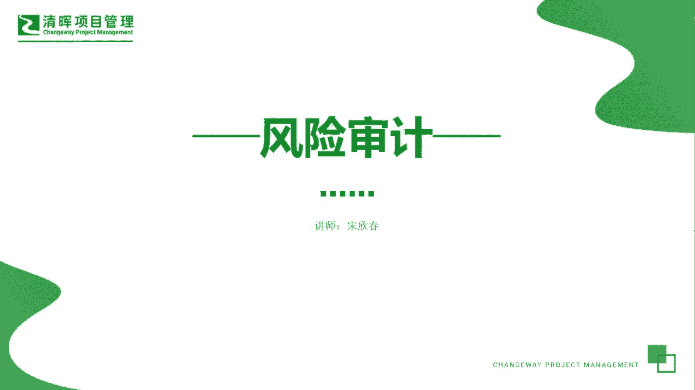
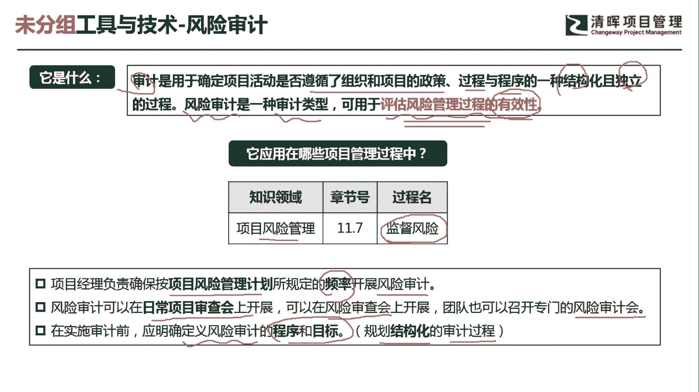
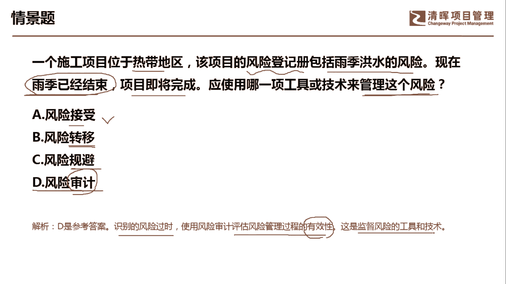
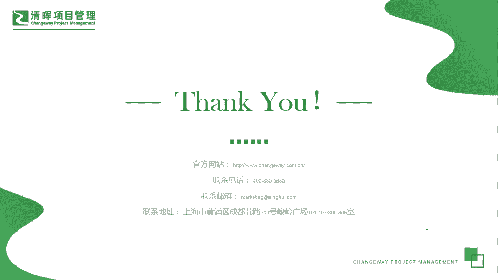

# PMP超干货！超全！项目管理实战工具！ PMBOK工具课知识点讲解！ - P6：风险审计 - 清晖在线学堂Kimi老师 - BV1Qv4y167PH

各位同学大家好，我是宋老师。

今天我们来看风险审计这个工具，那说到风险审计呢，我们首先要了解一下什么是审计，审计呢，主要是用于确定项目活动是否遵循了，组织和项目的政策过程与程序的一种结构化，而且是独立的一个过程。

所以呢风险审计呢也是一种审计的类型，它主要是用于评估风险管理过程的有效性，注意它是风险管理过程的有效性，不是这个风险应对措施是否有效，如果是风险应对措施是否有效呢，这个叫做风险的审查啊。

也就是这个risk review，风险审查，它就不是风险审计了，审计一定是对于政策过程程序的一种，这个结构化独立的这个审查过程，好，风险审计呢它是在风险管理的监督，风险过程中所使用。

因为我们需要对过程流程进行一种管控，因此呢它是在监控过程中，那么怎么样进行风险的审计呢，首先项目经理要负责，确保按照项目风险管理计划所规定的一个频率，开展风险的审计，风险审计呢其实可以是定期的。

也可以是不定期的，可以是由外部的人进行审计，也可以由内部的人进行审计，那风险审计呢可以在日常项目审查会上开展，也可以在风险的审查会上开展啊，这个呢就是专项的一种风险审查会了。

团队呢也可以召开专门的这个风险审计会，在实施风险审计之前呢，应该明确的是定义风险审计的程序和目标，也就是我们所说的，要规划这个结构化的一个审计过程，所以呢我们书上讲到的审计呢有三个，一个是这个风险审计。

还有一个呢就是质量审计，还有一个呢就是采购审计，它们的共性其实都是一样的啊，对于这个组织项目的政策过程程序是否有遵守。

我们来看这样一道题，一个施工项目位于热带地区，该项目的风险登记册，包括雨季洪水的风险，这个在风险登记册当中有记录，现在呢雨季已经结束，项目即将完成，应该使用哪一项工具或技术来管理这个风险，好。

说明了这个雨季已经结束了，风险已经发生了，那我们怎么样去管理这个风险呢，很显然这个是属于监控风险，因为它是处于过程中，发现这个风险已经结束了，预期已经结束了，风险接收风险转移，风险规避呢。

这个都属于我们风险应对措施之一啊，也就是我们风险当中有这个危险，这个机遇机会，那我们这个三个a abc呢，都属于这个风险当中的威胁的应对措施之一，比如说接收策略，接收策略呢它分为主动接受和被动接收。

主动接收的它往往是这个准备一些应急储备，准备一些缓冲时间，那还有一种被动接触呢，它是这个监督风险，它不会让这个风险再扩大，转移策略呢，它主要是把这个风险带来的这种损失呢，转移给第三方。

一般是找一个这个保险或者外包公司，去这个承担规避策略呢，有时候它最极端的做法，就是整个的这个项目就停工了，或者呢它缩小范围，这个是风险威胁当中的规避策略，风险审计。

它主要是审查你的风险管理过程是否有效啊，管理过程是否合规，它是一个结构化的过程，因此呢我们应该是选择这个监控过程组的，这个风险审计这个工具，通过风险审计识别风险，这个发生了。

使用风险审计评估风险管理过程有效性，这是监督风险的工具和技术，好，今天呢主要和大家分享的是风险审计这个工具。

我们下次再见，谢谢大家。

