# PMP项目管理 - P12：12 - 自学力 - BV1EZ4y1p7LB

欢迎来到PNP项目管理网络课程的学习。本课程基于最新发布的PM报指南第5版，下面我们将一起学习第十二章项目采购管理。项目采购管理的目标在于管理如何从团队外部获得的产品服务或成果。

项目采购管理知识领域共有4个过程，他们分散在规划过程组、执行过程组、监控过程组和收尾过程组。其中，规划过程组的过程是规划采购管理。执行过程组的过程是实施采购。监控过程组的过程是控制采购。

收尾过程组的过程是结束采购。这四个过程不但彼此互相作用，而且还与其他知识领域中的过程相互作用。这些过程在位置图中的位置是考试必考的重点，请务必记下来。此外，在学习的过程中。

大家还要格外注意每个过程所使用的工具和技术，它们也是本章的重点内容。先来看看什么是项目采购管理呢？项目采购管理包括从项目团队外部采购或获得所需产品服务或成果的各个过程。

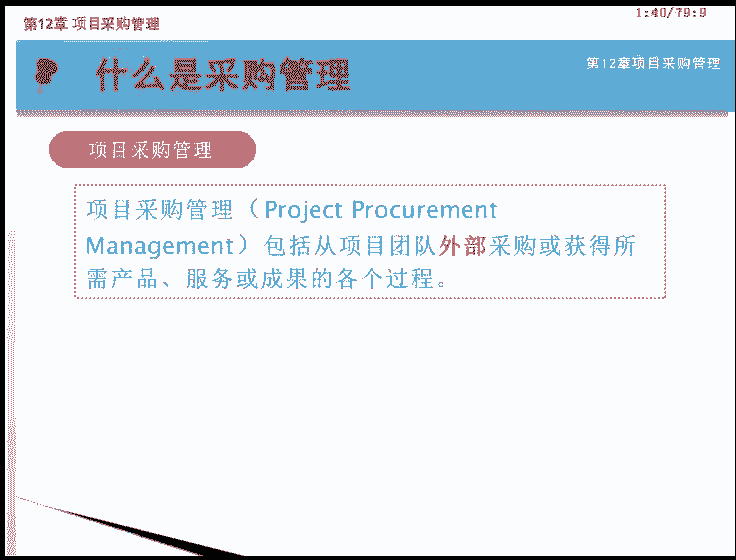

本知识领域所介绍的项目组织，既可以是项目产品服务或成果的买方，也可以是卖方。项目采购管理包括合同管理和变更控制过程。通过这些过程编制合同或订购单，并由具备相应权限的项目团队成员签发。

然后再对合同或订购单进行管理。项目采购管理过程围绕包括合同在内的协议来进行。我们先来看协议和合同的概念。协议是买卖双方之间的法律文件，协议的范围非常广，不仅局限于采购管理。

而合同是对双方都有约束力的协议，规定卖方有义务提供有价值的东西，如规定的产品服务或成果，买方有义务支付货币或其他有价值的补偿。关于合同需要注意以下几点。采购合同中包括条款和条件，也可包括其他条目。

如买方就卖方应实施的工作或应交付的产品所做的规定。因应用领域不同，合同也可称作协议谅解分包合同或订购单。合同或协议通常需要经过严格的审批程序。在任何情况下。

审批程序的主要目标是确保以清晰的合同语言来描述产品服务或成果，以满足既定的项目需要。项目管理团队应尽早寻求合同、采购法律和技术专家的支持。组织政策可能强行要求这些专家参与。我们先来看什么是协议生命周期。

项目采购管理过程涉及的各种活动构成了协议生命周期。通过对协议生命周期进行积极管理，并仔细斟酌采购条款和条件的措辞，某些可识别的项目风险就可由双方分担或转移给卖方。在复杂项目中。

可能需要同时或先后管理多个合同或分包合同。这种情况下，单项合同的生命周期可在项目生命周期中的任何阶段结束。

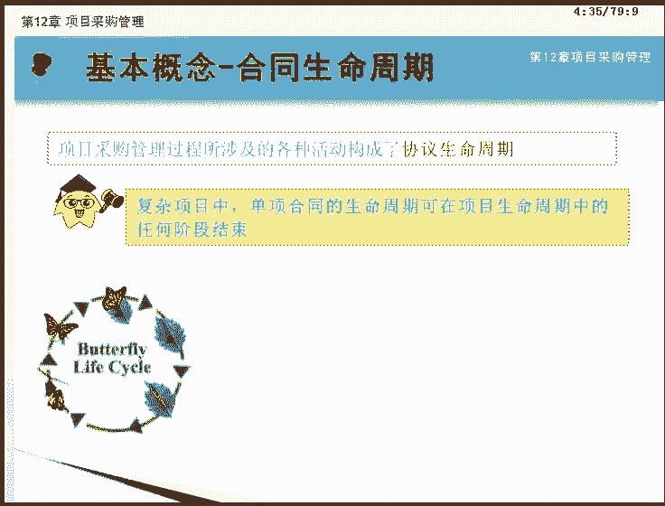

项目采购管理是从买卖双方的角度进行讨论的。在合同生命周期中，卖方首先是投标人，然后是中标人，之后是签约供应商或供货商。卖方获得合同后，应把与合同相关的工作当做一个项目来管理。

并且应关注的项目管理所有知识领域，而不仅是采购管理知识领域的内容。本课程我们将一起学习第十二章项目采购管理知识领域的第一节规划采购管理。

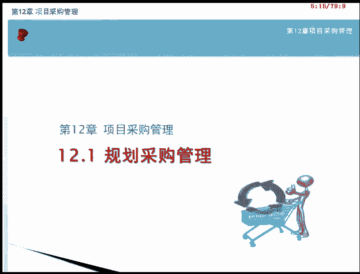

通过本课程的学习，我们将要达到如下学习目标。掌握规划采购管理过程的定义。熟悉规划采购管理过程的输入、工具与技术及输出的内容。掌握各种合同类型的基本原理，适合场合以及计算方法。掌握自制外购分析的方法。

了解采购管理计划的内容。熟悉采购工作说明书的内容及其作用。本课程我们将按照如画面所示的大纲为您讲述。首先是对规划采购管理过程的基本含义进行讲解。接下来介绍规划采购管理过程的输入、工具和技术以及输出。

课程的最后是本节核心知识整理。

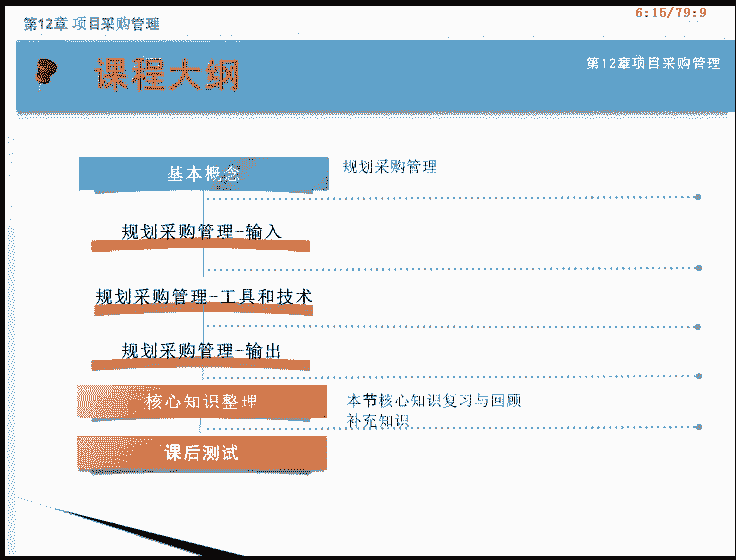

在学习本过程之前，我们先来了解一下基本概念，规划采购管理。规划采购管理是记录项目采购决策，明确采购方法，识别潜在卖方的过程。本过程的主要作用是确定是否需要外部支持。如果需要，则还要决定采购什么。

如何采购采购多少以及何时采购。

规划采购管理的任务包括。识别哪些产品服务或成果需要从项目组织外部采购，哪些可由项目团队自行完成？如需采购，则确定采购的具体内容、数量、时间、方式以及其他事项。评估潜在卖方。

特别是如果买方希望对采购决策施加一定影响或控制时。接下来让我们来看看如何规划采购。规划采购管理时，需要依据项目管理计划中已有的子计划及基准，结合项目需求文件以及风险登记册，还有资源和成本估算等信息。

利用自制外购分析及其他技术确定需要采购的内容及采购方式，最终形成采购管理计划、采购工作说明书和其他采购文件。该过程需要生成一份供方选择标准提供给后续的实施采购过程。这是规划采购管理过程的数据流向图。

可以看到，该过程通过输入输出与其他过程进行交互。规划采购管理过程共有9个输入，分别是项目管理计划、需求文件、风险登记册。

活动资源需求、项目进度计划、活动成本估算、干系人登记册、事业环境因素以及组织过程资产。下面我们依次来了解他们吧。

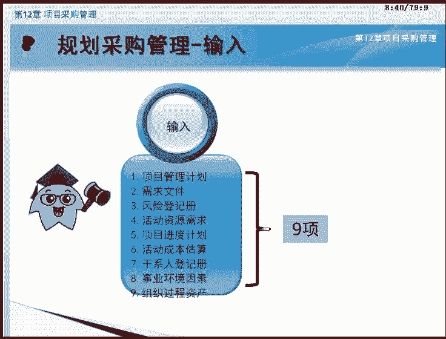

项目管理计划描述了项目的需要、合理性、需求和当前边界。

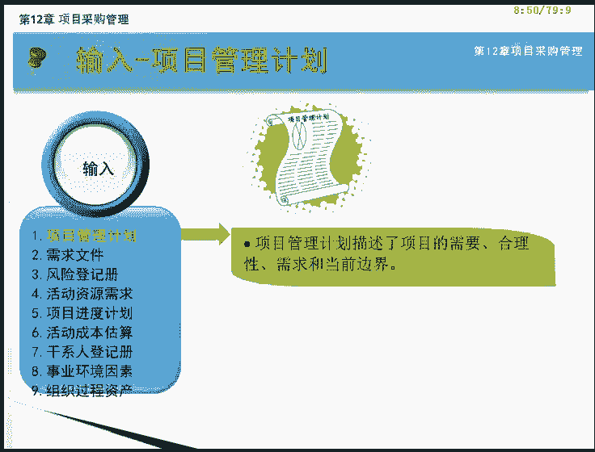

我们知道范围基准中的内容都必须在项目中完成，但不一定由团队成员亲自完成。需要根据情况确定哪些工作外包出去更合适。因此，项目管理计划中的范围基准，对规划采购工作尤为重要。

需求文件是范围管理知识领域中收集需求过程的输出，其中包含的内容有。与采购规划有关的关于项目需求的重要信息。带有合同和法律含义的需求。

如健康安全、安保、绩效、环境、保险、知识产权、同等就业机会、执照和许可证。在规划采购时，需要考虑全部这些因素。规划采购管理的输入还包括。风险登记册来自识别风险过程。列出了风险清单。

还有风险分析和风险应对规划的结果。

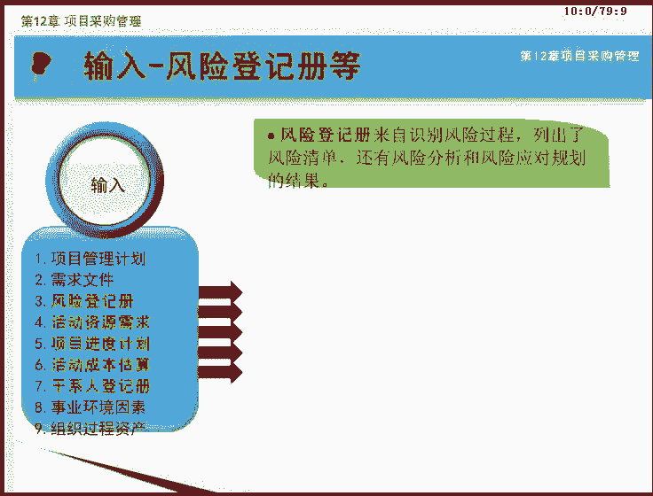

活动资源需求来自估算活动资源过程，包括诸如所需人员所需设备或所处位置的信息。项目进度计划来自制定进度计划过程，其中包括有关时间表或强制交付日期的信息。活动成本估算来自估算成本过程。

使用为采购活动编制的成本估算来评价潜在卖方提交的投标书或建议书的合理性。干系人登记册来自识别干系人过程，提供了项目参与者及其在项目中的利益的详细信息。能够影响规划采购管理过程的事业环境因素。包括。

市场条件。可从市场获得的产品服务和成果。供应商情况包括其以往绩效或生育。适用于产品服务和成果的典型条款和条件，或适用于特定行业的典型条款和条件。当地的独特要求等。规划采购管理需要利用的组织过程资产包括。

正式的采购政策程序和指南。大多数组织都有正式的采购政策和采购机构。与制定采购管理计划和选择合同类型有关的管理系统。基于以往经验的现有的多层次供应商系统。采购合同的分类方法有很多种。

在这里我们只介绍按费用支付方式的分类方法，一般可将合同分为三类。总价合同也称总包合同。成本补偿合同。公料合同也称单价合同。

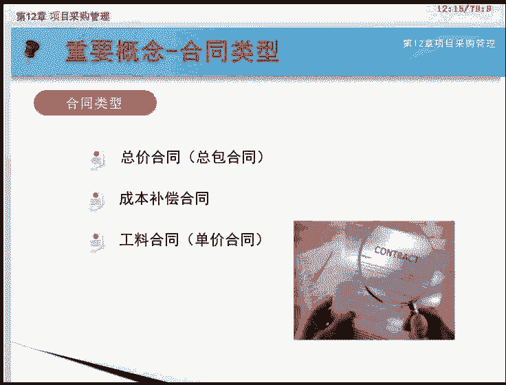

下面我们将详细介绍。总价类合同为既定产品服务或成果的采购设定一个总价。卖方必须依法履行总价合同。否则就可能承担相应的财务赔偿责任。一般来讲，对范围定义明确的项目使用总价为合同。

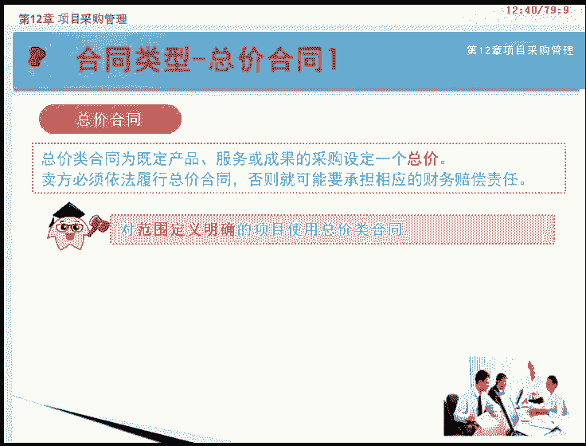

签订该类合同时有几个注意事项。如果项目范围界定不明确，买卖双方都会面临风险，买方可能得不到想要的产品。卖方为了提供产品，可能花费额外的成本。买方喜欢签订总价合同，因为这类合同对于买方风险最低。

一旦签订了该类合同，只要项目范围不变。因合同履行不好而导致的任何成本增加都由卖方负责。也就是说，成本超支的风险都转移到了卖方。在这类合同中，也可以根据项目目标如进度目标等设置一些奖励。

总价合同最简单的形式是采购单。从价合同又分为三小类，下面我们依次介绍。固定总价合同是最常用的合同类型，大多数买方都喜欢这种合同，因为采购的价格在一开始就确定，并且除非工作范围发生变更，否则不允许改变。

该类合同下，卖方有义务完成工作，并且承担因不良绩效导致的任何成本增加。买方的责任是准确定义你采购的产品和服务，对采购规范的任何变更都会增加买方的成本。总价加激励费用合同。

这种总价合同为买方和卖方提供了一定的灵活性，允许一定的绩效偏离，并对实现既定目标给予财务奖励。财务奖励通常与卖方的成本、进度或技术绩效有关。

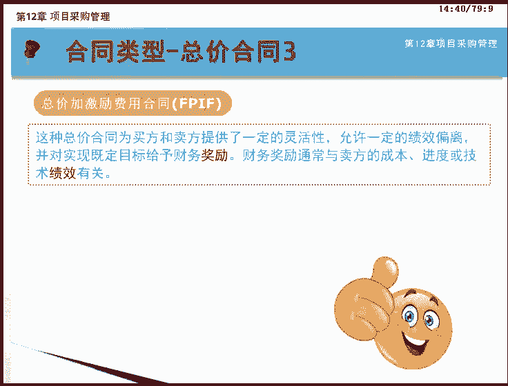

在总价加激励费用合同中，要设置价格上限。美方必须完成工作，并且要承担高于上线的全部成本。我们来看一个总价加激励费用合同的事例。表格中第一列是各项费用的目录，其中卖方成本是合同签订时，双方估算出来的成本。

目标利润是除去成本外，预计给卖方的利润。分摊比例是在实际成本超过或少于估算成本时，买卖双方分别承担或分享的比例。价格上限是买方为该合同支付的最高总价，超过这个价格之后的任何费用都完全由卖方承担。

表格中的价格是指买方预计为该合同支付的费用。利润是卖方预计可以拿到的费用。表格中的第二列是合同中估算的各项费用。表格中的第三列是假设实际花费了8000元成本时的各项数据。我们看到。此时。

卖方成本是8000元。目标利润依旧是1000元。但是此时。卖方的分摊比例为20%乘以节约的2000元等于400元。此时，买方支付的总价是9400元。卖方的利润是1400元，也就是在第一种情况下。

买卖双方都比预计的情况要好一些。表格中的第四列是假设实际花费了11000元成本时的各项数值。我们看到，此时卖方实际花掉成本11000元，目标利润依旧不变是1000元。但是此时的分担比例是20%乘以。

负的1000，也就是多花的成本等于负的200元，也就是需要卖方承担200元。此时，买方支付的价格是11800元，而卖方得到的利润仅仅是800元。

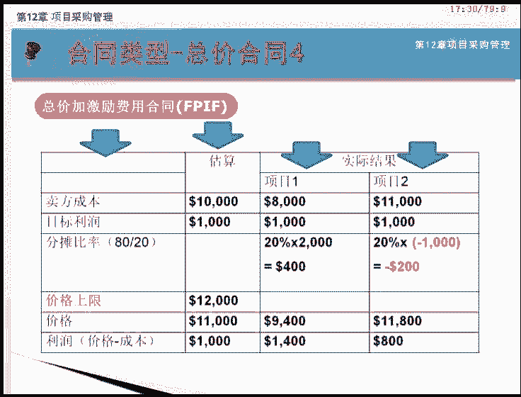

如果卖方的履约期将跨越相当长的时期，比如十年就应该使用总价加经济价格调整类型的合同。它有利于买卖之间维持多种长期关系。它是一种特殊的总价合同，允许根据条件变化，如通货膨胀、某些特殊商品的成本增降等。

以事先确定的方式对合同价格进行最终调整。该类合同试图保护买方和卖方免受外界不可控情况的影响。成本补偿合同向卖方支付未完成工作而发生的全部合法实际成本，外加一笔费用作为卖方的利润。

这里的成本通常分为直接成本和间接成本。

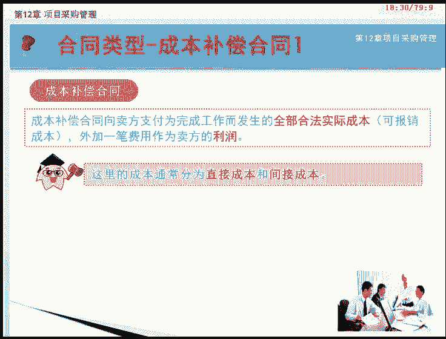

签订该类合同时有几个注意事项。项目范围不明确时，可签此类合同。该类合同对于买方风险大，因为买方必须支付所有成本。成本补偿合同也常常包括对达到或超过既定的项目目标，如进度目标或整体成本等的奖励。

为了监控卖方，买方需要随时审核卖方成本花费是否合理，牵涉买方人力物力。一般来讲，卖方喜欢该类合同。因为首先卖方的实际成本得到补偿，包括专门用于项目的直接成本和分摊到项目中的间接成本。其次。

卖方可以得到事先确定的利润。此外，有些情况下，卖方还可能得到激励。成本补偿合同又分为三小类，下面我们依次介绍。在成本加固定费用合同中。为卖方报销履行合同工作所发生的一切可劣支成本。

并向卖方支付一笔固定费用。该费用以项目初始成本估算的某10分比计算。除非项目范围发生变更，否则费用金额维持不变。在成本加激励费用合同中。为卖方报销履行合同工作所发生的一切可列支成本。

并在卖方达到合同规定的绩效目标时，向卖方支付预先确定的激励费用。

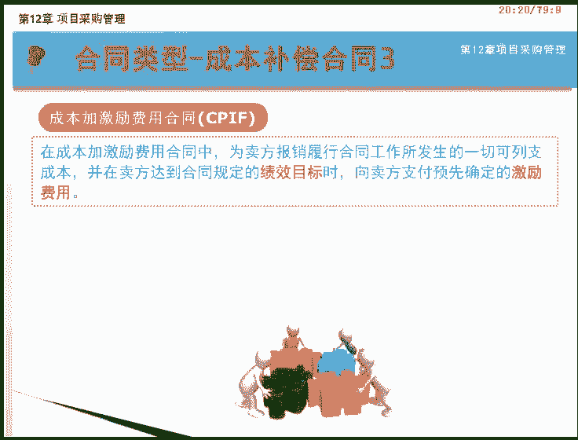

与总价加激励费用合同一样，如果最终成本低于或高于原始估算成本，则买方和卖方需要根据事先商定的成本分摊比例来分享节约部分或分担超出部分。表格中所示的是成本加激励费用合同的事例。细心的学员会发现。

该类合同与总价加激励费用合同几乎是一样的。没错，但他们之间有个很大的区别，就是总价加激励费用合同中有个价格上限。而成本加激励费用合同中没有价格上限。也就是说，当计算出来的买方应付价格小于价格上限时。

两种合同完全一致。但一旦超出价格上限，总价加激励费用合同中，买方不需要支付卖方任何费用。而在成本加激励费用合同中，买方还需要向卖方支付自己应该承担的那笔费用。因此，对买方来讲，这种合同类型风险更大。

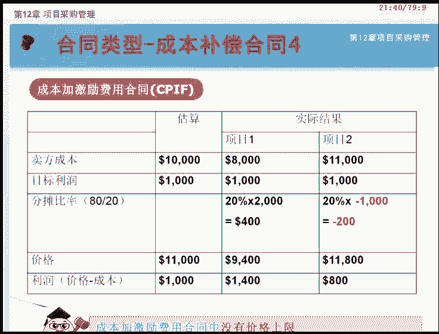

还有一类不常用的成本补偿合同是成本加奖励费用合同。这种合同中，买方为卖方报销一切合法成本。但只有在卖方满足合同规定的某些笼统主观的绩效标准的情况下，才向卖方支付大部分费用。

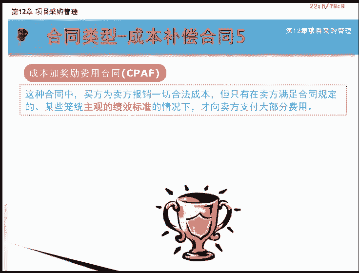

奖励费用的多少完全由买方根据自己对卖方绩效的主观判断来决定，并且通常不允许申诉。因此，卖方通常不喜欢签这类合同。最后一大类合同是公料合同，也称单价合同。

公料合同是兼具成本补偿合同和总价合同的某些特点的混合型合同。在不能很快便写出准确工作说明书的情况下，经常使用公料合同来增加人员，聘请专家和寻求其他外部支持。签订该类合同时有几个注意事项。

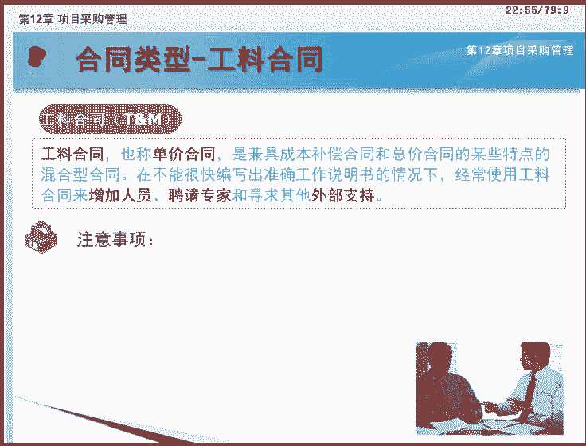

类似于成本补偿合同，在签订合同时，范围可以不确定，也没有确定项目的总价。这样一方面它具有可扩展性，可以方便的处理少量范围变更。另一方面它是开口合同，对于买方来讲，成本不容易控制。同样的。

公料合同也类似于固定价格合同，如工时或材料的单价是由买卖双方事先确定的。双方可以商定各级别工程师的费用，或者在合同中包含一个最高不超过成本限额的条款。公照合同适用于范围不确定，需要快速执行的小项目。

签订合同的目的实际上是风险的转移，不同的合同类型对买卖双方的风险分担情况各不相同。最后我们来总结一下各种合同类型对买方或卖方的风险情况。图中，中介是几种常见的合同。左边的箭头表示，对于买方而言。

风险从低到高逐渐增加。右边的箭头表示，对于卖方而言，风险从高到低逐渐降低。可以看到，对于买方而言，为了规避风险，最喜欢的合同类型是总价类，之后才是成本补偿或供料合同。而对于卖方恰好相反。

他们更倾向于成本补偿或公料合同。这两类合同对于卖方风险最小。

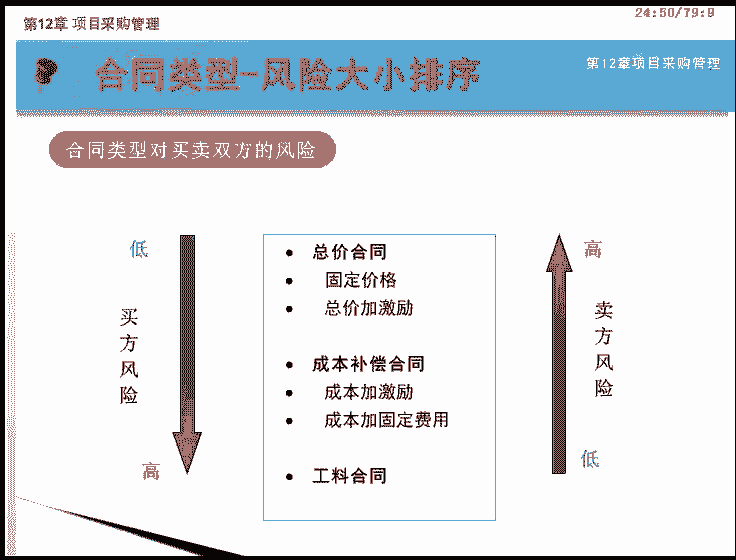

规划风险管理过程有4个工具和技术。分别是自制或外购分析，专家判断市场调研以及会议。下面让我们一块来学习。

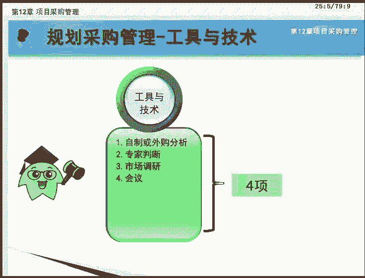

自制或外购分析用来确定某项工作最好由项目团队自行完成，还是应该从外部采购。它是一种通用的管理技术。

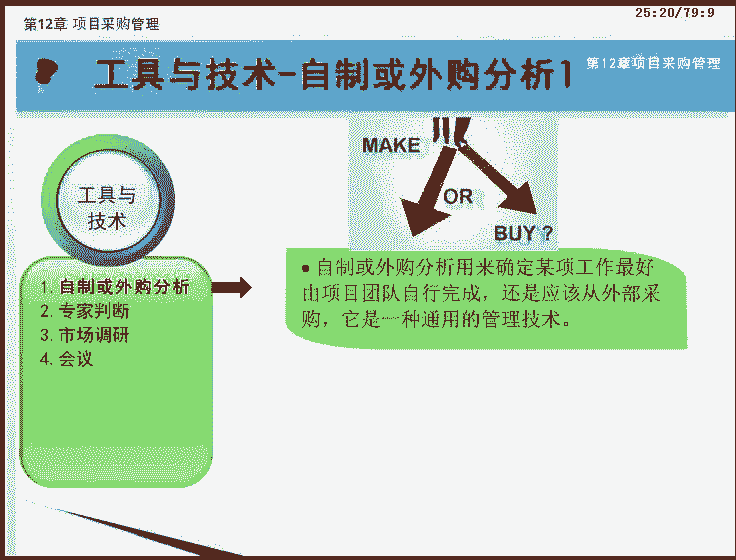

在进行自制外购时，还应考虑以下几点注意事项。如果决定外购，还需要进一步决定是购买还是租赁该产品，也就是说，租赁也是外购的一种形式。应考虑采购所引起的所有直接成本和间接成本。如分析购买产品时。

既要考虑购买产品的直接支出，也要包括管理采购过程带来的间接成本。自制外购分析时，应考虑其他的因素，成本、内部能力、控制水平、保密性要求、可利用的供应商等。自制或外购的理由都很多，但一般情况下是具体情况。

具体分析。这里我们给出了一些建议，仅供参考。

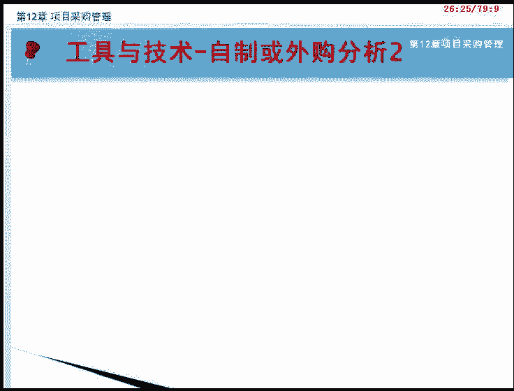

自制的理由包括。自己的生产成本低，没有合适的供应商，需要保证充足的供应。自由劳动力过剩，发挥边际效用。涉及。自主知识产权及保密事项。需求独特。

外购的理由包括。外购成本低，自己生产能力不足，降低存货成本。保证供应的灵活性和可替代性。对方拥有专利或商业秘密的保护。通用产品等。专家判断，常用来评估本过程的输入和输出。

不仅适用于你采购产品服务或成果的技术细节。而且也适用于采购管理过程的各个方面。

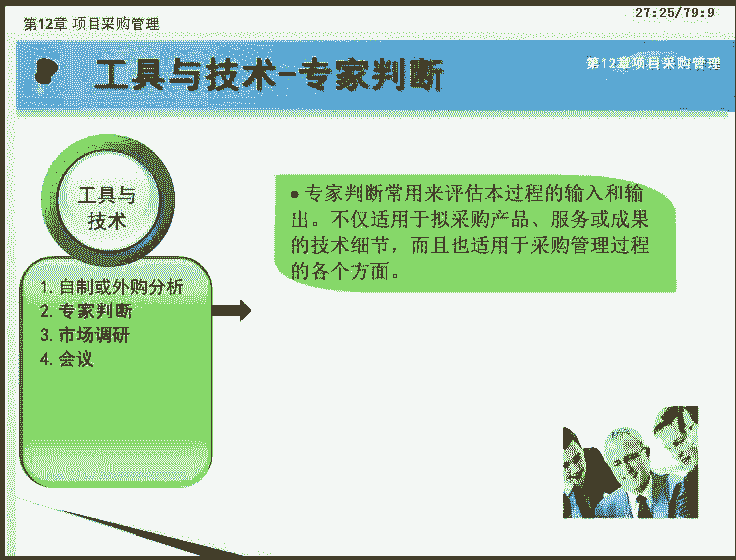

专家的采购判断也可用来制定或修改卖方建议书评价标准。专家的法律判断可以是法律工作者所提供的相关服务，用来协助处理一些特殊的采购事项、条款和条件。市场调研是指从市场获得信息的一系列手段和技术。

包括考察行业情况和供应商能力。采购团队可以综合考虑从研讨会在线评论和各种其他渠道得到的信息来了解市场情况。采购团队可能也需要考虑有能力提供所需材料或服务的供应商的范围，权衡与之有关的风险。

并优化具体的采购目标，以便利用成熟技术。仅靠调研，还不能获得制定采购决策所需的明确信息。因此。需要借助与潜在投标人的信息交流会达成与潜在投标人的合作，这有利于供应商开发互惠的方案或产品，从而有益于买方。

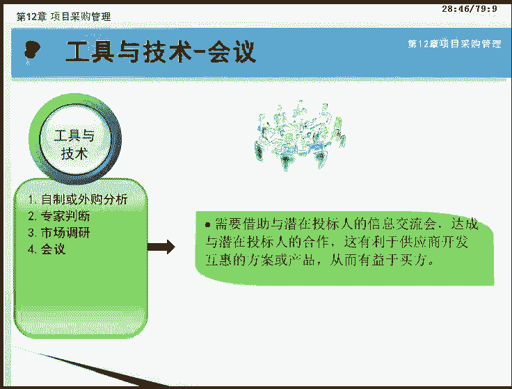

规划采购管理过程共有7个输出，分别是采购管理计划、采购工作说明书。采购文件工方选择标准自制或外购决策。变更请求以及项目文件更新。下面我们一块来学习。

采购管理计划是项目管理计划的组成部分，说明项目团队将如何从执行组织外部获取货物和服务，以及如何管理从编制采购文件到合同收尾的各个采购过程。采购管理计划包含的内容非常丰富，比较重要的内容如下。

你采购的合同类型。如何管理多个供应商？制约因素和假设条件。如何指导卖方编制和维护工作分解结构？用于管理合同和评价卖方的采购测量指标。采购工作说明书SOW是买方依据项目范围基准，为每次采购编制的文档。

对将要包含在相关合同中的那一部分项目范围进行定义。

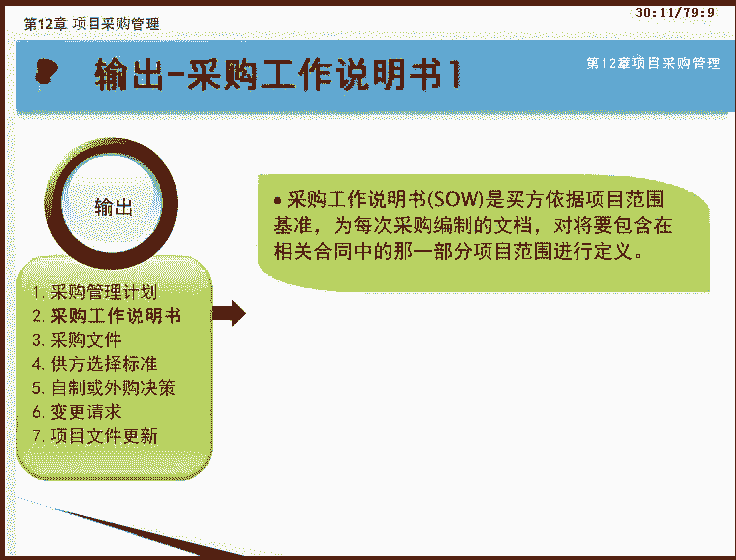

采购工作说明书应该详细描述你采购的产品服务或成果，以便潜在卖方确定他们是否有能力提供这些产品服务或成果。采购工作说明书中可包括规格、数量、质量、性能参数、履约期限、工作地点和其他需求。

编制采购工作说明书时，应注意一些要点。比如。

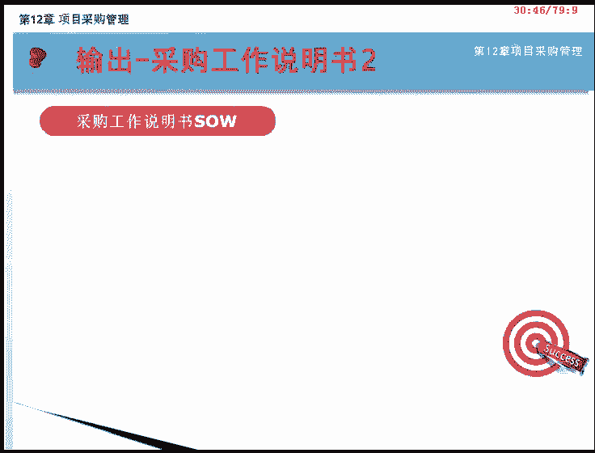

采购SOW应力求清晰、完整和简练，应该说明任何所需的附带服务，如绩效报告或项目后的运营支持等。某些应用领域对采购SOW有特定的内容或格式要求。每次进行采购都需要编制SOW。

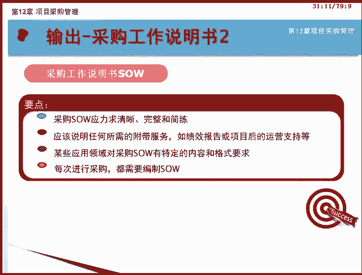

另外，可以把多个产品或服务组合成一个采购包，由1个SOW全部覆盖。采购文件是用于征求潜在卖方的建议书。应该包括应答格式要求、相关的采购工作说明书SOW及所需的合同条款。

买方拟定的采购文件不仅应便于潜在卖方做出准确完整的应答，还要便于对卖方应答进行评价。采购文件的复杂和详细程度应与采购的价值和风险水平相适应。在实际项目中，采购文件的称呼没有统一的规定。

可以是建议邀请书、报价邀请书、投标邀请书等。我们要根据具体情况去理解。最常见的是建议邀请书RFP也称方案邀请书，用来征求潜在供应商建议的文件，也称请求建议书。在采购内容比较复杂时，适用这种邀请书。例如。

甲方希望把一座电厂的选址建设外包，需要对方提供详细的方案。此时需要试用建议邀请书。大部分IT外包项目都使用这种建议邀请书来征询潜在卖方的方案。

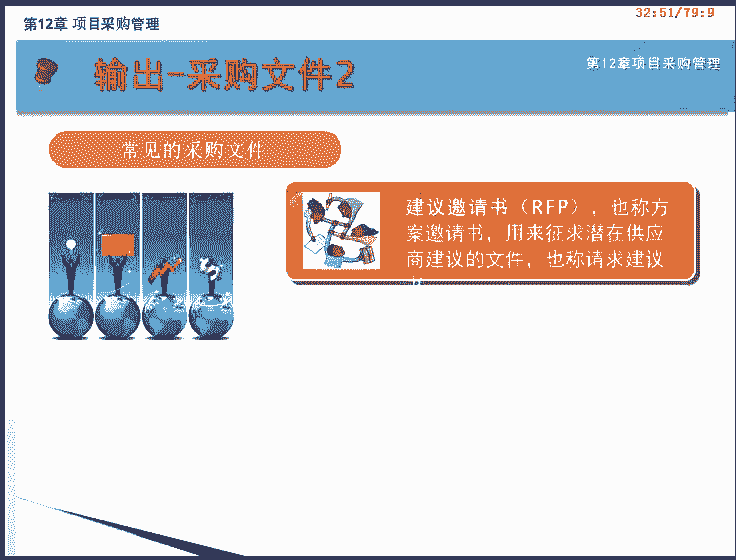

还有一种常见的采购文件是报价邀请书RFQ。一种主要依据价格选择供应商时，用于征求潜在供应商报价的文件。如报价单就是报价邀请书的一种。在采购目标清晰简单时，常采用这种文件。例如。

甲方确认需要采购10台IBM某种型号的服务器时。可以采用报价邀请书的形式获得潜在卖方响应。从卖方的角度看，准备报价单非常容易，周期也较短。除此之外，用于询价的采购文件。

还可能包括信息邀请书RFI投标邀请书IFB。招标通知、谈判邀请书、卖方初始应答邀请书等。供方选择标准通常是采购文件的一部分。制定这些标准是为了对卖方建议书进行评级或打分。标准可以是客观或主观的。

如果很容易从许多合格卖方获得采购品，则选择标准可仅限于购买价格。这种情况下，购买价格既包括采购品本身的成本，也包括所有附加费用，如运输费用等。对于较复杂的产品服务或成果，还需要确定和记录其他选择标准。

自制或外购决策就是指通过自制或外购分析做出某项特定工作，最好由项目团队自己完成，还是需要外购的决策。如果决定自制，那么可能要在采购计划中规定组织内部的流程和协议。如果决定外购。

那么要在采购计划中规定与产品或服务供应商签订协议的流程。关于购买产品服务或资源的决策，通常会导致变更请求。规划采购期间的其他决策也可能导致变更请求。对项目管理计划、此计划及其他组成部分的修改。

可能导致对采购行为有影响的变更请求，影响采购行动。应该通过实施整体变更控制过程，对变更请求进行审查和处理。规划采购管理过程可能需要更新的项目文件，包括需求文件、需求跟踪矩阵、风险登记册等。

本过程的主要内容到此学习完毕。现在我们来回顾一下本过程的核心知识。规划采购管理是记录项目采购决策，明确采购方法，识别潜在卖方的过程。项目管理计划中的范围基准，对规划采购工作尤为重要。

可将合同分为三类总价合同、成本补偿合同和工料合同。

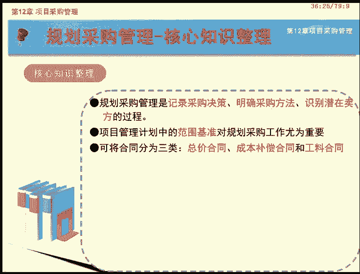

对范围定义明确的项目使用总价类合同。在激励合同中，买方和卖方需要根据事先商定的成本分摊比例来分享节约部分或分担超出部分。采购文件可以是建议邀请书、报价邀请书、投标邀请书等。

采购文件应包括应答格式要求SOW和所需的合同条款。恭喜你完成规划采购管理过程的学习，我们下节课见。

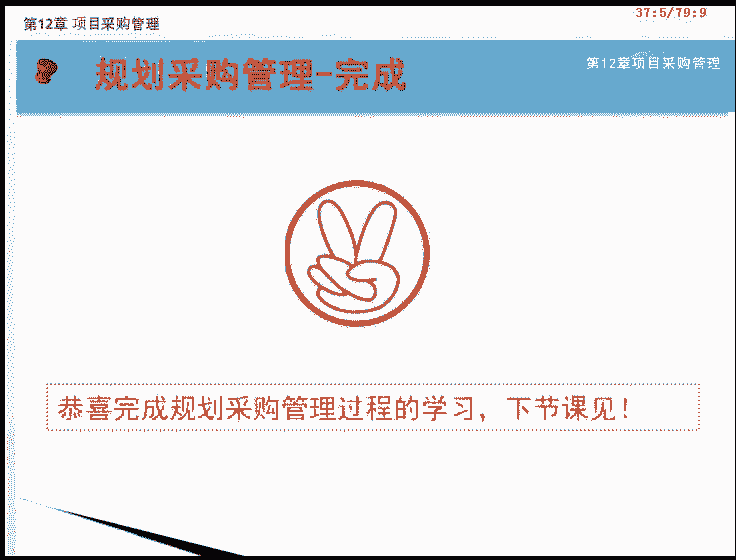

本课程我们将一起学习第十二章项目采购管理知识领域的第二节，实施采购。

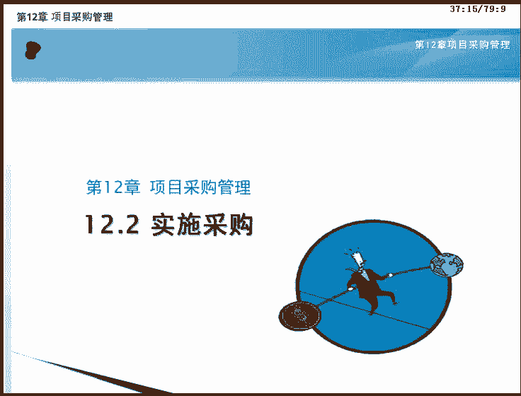

通过本课程的学习，我们将要达到如下学习目标。掌握实时采购过程的定义，熟悉实时采购过程的输入工具与技术及输出的内容。掌握投标人会议建议书评价技术。了解协议中包含的内容。

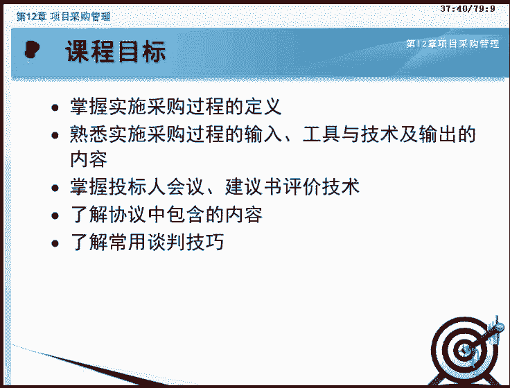

了解常用谈判技巧。本课程我们将按照如画面所示的大纲为您讲述。首先是对实时采购的基本含义进行讲解。接下来学习实施采购过程的输入、工具和技术以及输出。课程的最后是本节核心知识整理。

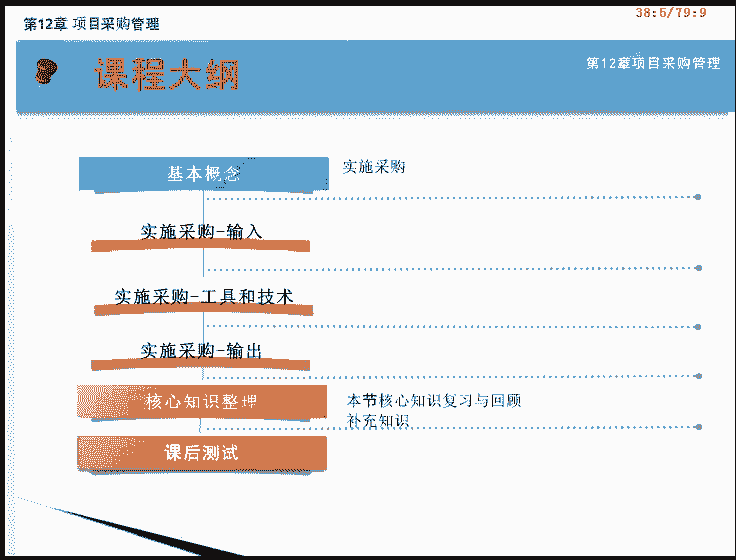

在学习本过程之前，我们先来了解一个基本概念，实施采购过程。

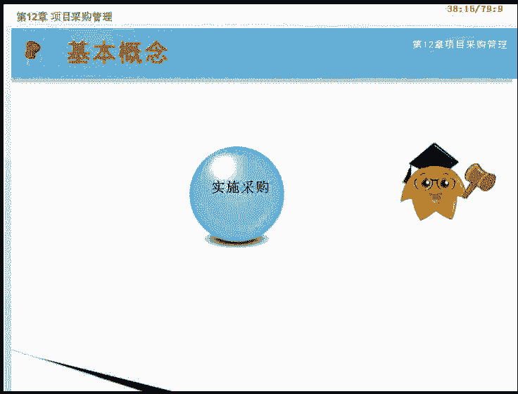

实时采购是获取卖方应答，选择卖方并授予合同的过程，相当于我们国内的招投标规程。

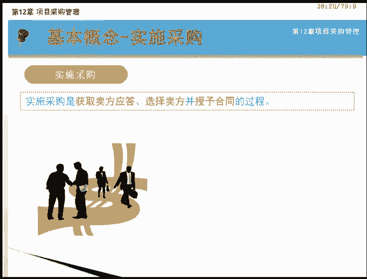

本过程的主要作用是通过达成协议，是内部和外部干系人的期望协调一致。在实施采购过程中，项目团队将会收到投标书或建议书，并按照事先拟定的选择标准，选择一个或多个有资格履行工作且可接受的卖方。

接下来让我们来看看如何实施采购。实施采购时，需要在采购管理计划的指导下，参考采购文件、供方选择标准等文档。对卖方提交的建议书进行估算与评审，经过谈判，最终确定卖方并签署协议。

这是实施采购过程的数据流向图，可以看到，该过程通过输入输出与其他过程进行交互。实施采购过程共有8个输入。采购管理计划采购文件。

工方选择标准卖方建议书、项目文件、自制或外购决策、采购工作说明书和组织过程资产。下面我们依次来了解他们吧。

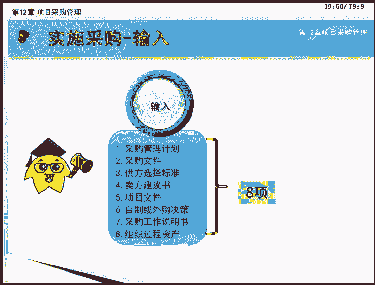

实施采购过程的输入有。

采购管理计划来自于规划采购过程，描述了如何管理从编制采购文件到合同收尾的各采购过程。

采购文件来自于规划采购过程，为合同和其他协议提供了审计线索。供方选择标准来自于规划采购过程，可包括供方能力、交付日期、产品成本、生命周期、成本、技术专长以及你使用的方法等。

卖方建议书来自于卖方评价小组将对其进行评价，来选择一个或多个中标人。常用的项目文件包括风险登记册，其中有与风险相关的合同决策。自制或外购决策来自于规划采购管理过程，产品或服务的采购组织在决定外购时。

先要分析需求，明确资源，再比较采购策略。组织还要对外购产品还是自制产品进行评估。影响自治或外购决策的因素可能包括。组织的核心能力，合格供应商所能提供的价值。用经济有效的方法实现需求的风险。

内部能力与供应商能力的比较等。采购工作说明书也来自于规划采购管理过程，规定了明确的工作目标、项目需求和所需结果。供应商们可据此做出量化应答。采购工作说明书是采购过程中的一个关键要素。

可以根据需要进行修改，直至达成最终协议。采购工作说明书可以包括，但不限于下列内容。规格所需数量。质量水平。性能参数。履约期限、工作地点以及其他需求。能够影响实时采购过程的组织过程资产。

包括潜在的和以往的合格卖方清单。关于卖方以往相关经验的信息，包括正反两方面的信息。以前的协议的。实施采购过程共有7个工具和技术，分别是投标人会议建议书评价技术，独立估算专家判断。广告。

分析技术以及采购谈判。下面我们一块来学习。

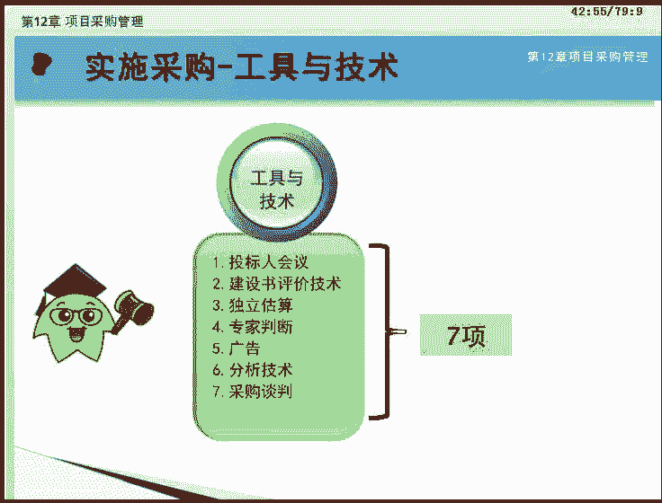

投标人会议又称承包商会议、供货商会议或投标前会议。就是在投标书或建议书提交之前，在买方和所有前在卖方之间召开的会议。

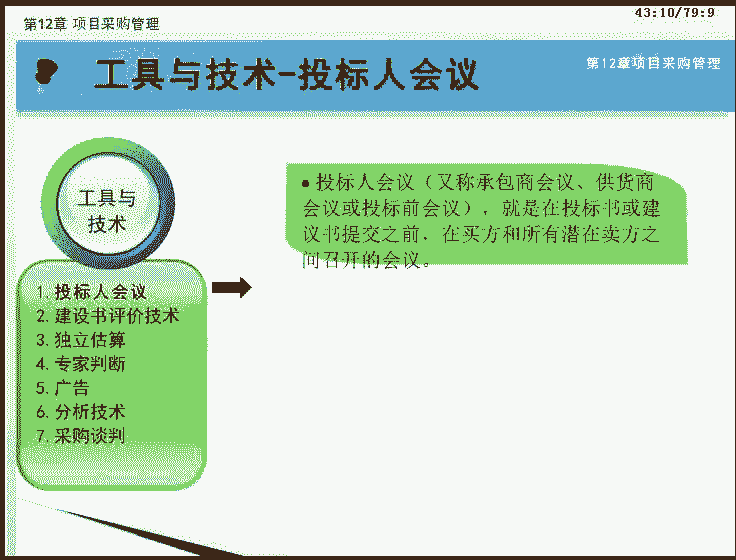

投票人会议的目的是保证所有潜在卖方对采购要求都有清楚且一致的理解，保证没有任何投标人会得到特别优待。这个知识点经常在PMP考题中出现，我们需要牢记的一点就是投标人会议必须保证公平。比如。

买方必须尽力确保每个潜在卖方都能听到任何其他卖方所提出的问题，以及买方所做出的每个回答。要把对问题的回答，以修正案的形式纳入采购文件中。对于复杂的采购，如果要基于卖方对既定加权标准的相应情况来选择卖方。

则应该根据买方的采购政策规定一个正式的建议书评审流程。在授予合同之前，建议书评价委员会将做出他们的选择，并报管理层批准。建议书评价技术包括加权系统和筛选系统。加权系统是对定性数据加以量化分析的方法。

以减少个人偏见对卖方选择的影响。比如赋予价格40%的权重，技术能力40%的权重，售后服务20%的权重。

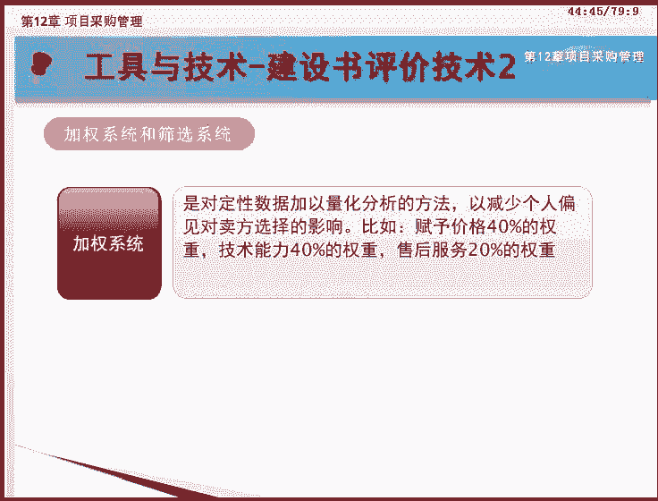

筛选系统。为一项或多项评估标准建立最低的绩效要求。可以直接排除一部分供应商，比如筛选条件可以规定外包方必须有10人以上认证的项目管理者。一般来讲，进行初选时使用筛选系统。

也可以把筛选系统和加权系统联合使用，对卖方进行加权排序。对于许多采购，采购组织可以自行编制独立估算，或者邀请外部专业估算师做出成本估算，并将此作为标杆，用来与潜在卖方的应答做比较。

如果独立估算结果和卖方应答之间存在明显差异。则可能表明采购工作说明书SOW存在缺陷或不明确。或者潜在卖方误解了或未能完全响应采购工作说明书。专家判断可用来评价卖方建议书。可以组建一个多学科评审团队。

对建议书进行评价。团队中应包括采购文件和相应合同所涉及的全部领域的专家。在大众出版物或专业出版物上刊登广告，往往可以扩充现有的潜在卖方名单。

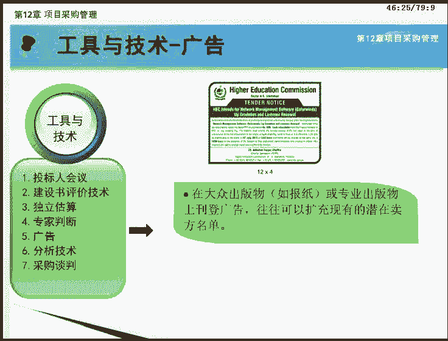

对于某些类型的采购，特别是政府采购，可能要求公开发布广告，或者在互联网上公布采购信息。在采购中，应该以合理的方式定义需求，以便卖方能够通过邀约为项目创造价值。

分析技术是审查、判断、分解等一类技术的统称。分析技术有助于组织了解供应商提供最终成果的能力。确定符合预算要求的采购成本。以及避免因变更而造成成本超支，从而确保需求能够得以满足。通过审查供应商以往的表现。

项目团队可以发现风险较多，需要密切监督的领域，以确保项目的成功。采购谈判是指在合同签署之前，对合同的结构、要求以及其他条款加以澄清，已取得一致意见。最终的合同措辞应该反映双方达成的全部一致意见。

谈判的内容应包括责任进行变更的权限适用的条款和法律、技术和商务管理方法、所有权、合同融资技术解决方案、总体进度计划、付款和价格等。谈判过程已形成买卖双方均可执行的合同文件而结束。

实施采购过程共有6个输出，分别是选定的卖方协议、资源日历变更请求项目管理计划更新。项目文件更新，下面我们一块来学习。

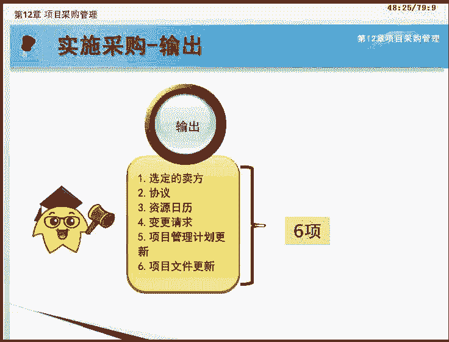

选定的卖方就是根据建议书或投标书评价结果，那些被认为有竞争力，并且已与买方商定了合同草案的卖方。在授予之后，该草案就成为了正式合同。对于较复杂、高价值和高风险的采购。

在授予合同前需要得到组织高级管理层的批准。因应用领域不同，协议也可称作谅解合同、分包合同或订购单。

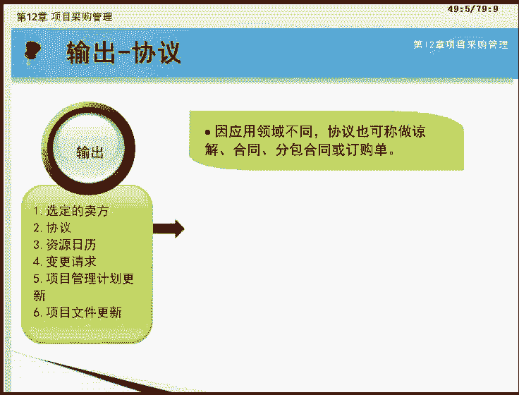

采购合同中包括条款和条件，也可包括其他条目。如买方就卖方应实施的工作或应交付的产品所做的规定。合同是一种可诉诸法院的法律关系。无论文件的复杂程度如何，合同都是对双方具有约束力的法律协议。

他强制卖方提供指定的产品服务或成果，强制买方给予卖方相应补偿。在资源日历中记载，签约资源的数量和可用性，以及每个特定资源或资源群的工作日或休息日。在实施采购过程。

可以提出对项目管理计划、此计划和其他组成部分的变更请求。并提交实施整体变更控制过程审查与处理。实施采购过程可能更新的项目管理计划内容包括成本基准、范围基准、进度基准。沟通管理计划、采购管理计划等。

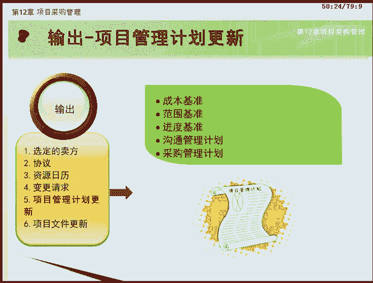

实施采购过程可能需要更新的项目文件，包括需求文件、需求跟踪文件、风险登记册、干系人登记册等。

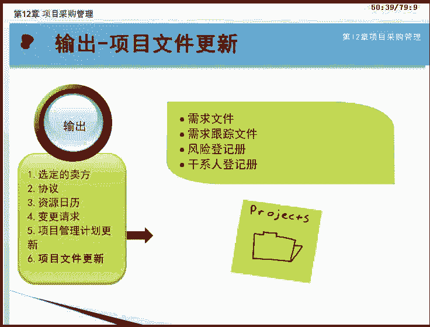

本过程的主要内容到此学习完毕。现在我们来回顾一下本过程的核心知识。实施采购是获取卖方应答，选择卖方并授予合同的过程。投标人会议是在投标书或建议书提交之前召开的会议。投票人会议必须保证公平。

建议书评价技术包括加权系统和筛选系统。

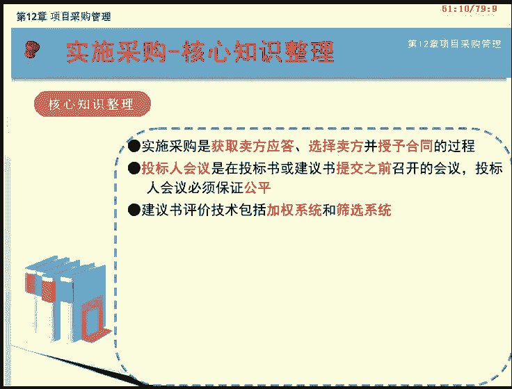

独立估算可帮助判断SOW是否存在缺陷，或卖方是否误解了SOW。采购谈判是指在合同签署之前开展的，应反映双方达成的全部一致意见。实时采购过程输出的资源日历中记载，签约资源的数量和可用性。

恭喜你完成实施采购过程的学习，我们下节课见。

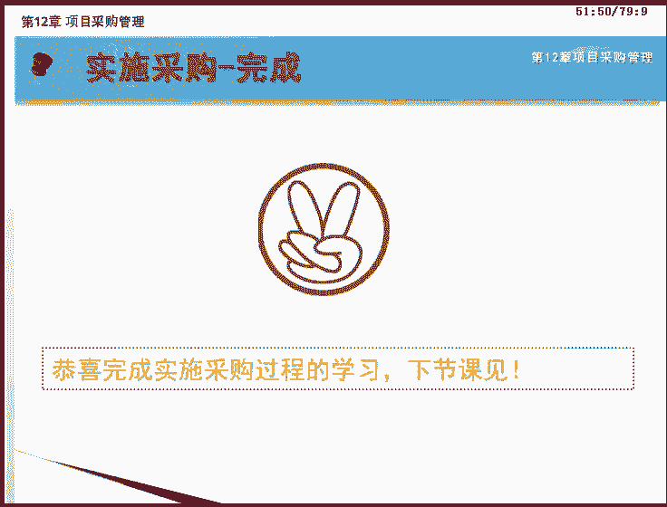

本课程我们将一起学习第十二章项目采购管理知识领域的第三节控制采购。

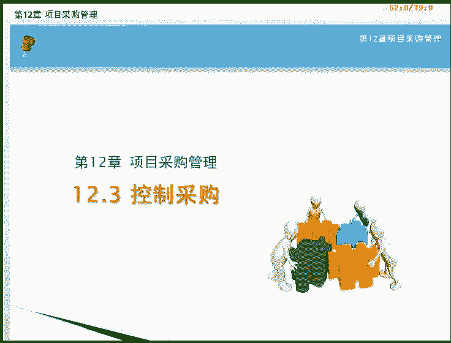

通过本课程的学习，我们将要达到如下学习目标。掌握控制采购过程的定义。熟悉控制采购过程的输入工具与技术及输出的内容，掌握合同变更控制系统的功能，了解采购绩效审查和检查与审计的作用，掌握索赔管理的内容。

本课程我们将按照如画面所示的大纲为您讲述。首先是对控制采购的基本含义进行讲解。接下来学习控制采购过程的输入、工具和技术以及输出。课程的最后是本节核心知识整理。

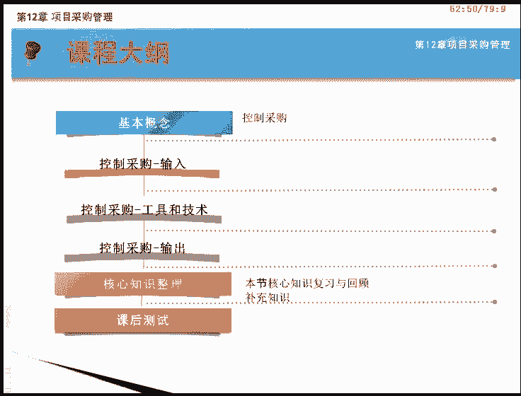

在学习本过程之前，我们先来了解一个基本概念，控制采购过程。

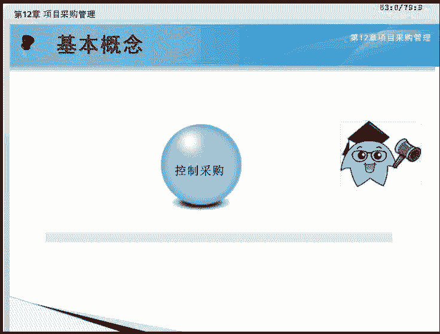

控制采购是管理采购关系监督合同执行情况，并根据需要实时变更和采取纠正措施的过程。本过程的主要作用是确保买卖双方履行法律协议，满足采购需求。

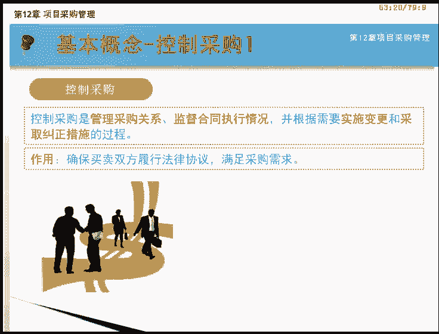

对于有多个供应商的较大项目，合同管理的一个重要方面就是管理各个供应商之间的界面。由于组织结构不同，许多组织把合同管理当做与项目组织相分离的一种管理职能。控制采购过程需要与其他过程相结合。

并执行一些财务工作。具体来讲，需要进行下面三方面的工作。在控制采购过程中，需要把适当的项目管理过程应用于合同关系，并把这些过程的输出整合进项目的整体管理过程。需要应用的项目管理过程，包括。

指导与管理项目工作，授权卖方在适当时间开始工作。控制质量，检查和核实卖方产品是否符合要求。实施整体变更控制，确保合理审批变更以及干系人员都了解变更的情况。控制风险，确保减轻风险。

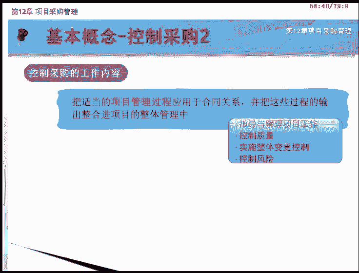

在控制采购过程中，还需要进行财务管理工作，监督向卖方的付款。向供应商支付时需要重点关注的一个问题是，支付金额要与已完成工作紧密联系起来。该工作只在确保合同中的支付条款得到遵循。

并按合同规定确保卖方所得的款项与实际工作进展相适应。在控制采购过程中，应该根据合同来审查和记录卖方当前的绩效或截至目前的绩效水平。并在必要时采取纠正措施。控制采购还包括记录必要的细节。

以管理任何合同工作的提前终止。接下来让我们来看看如何控制采购。控制采购时需要在项目管理计划，特别是其中的采购管理计划的指导下，参考采购文件、已有的协议等文件，不断审查卖方的绩效信息。

来控制合同的变更和支付，并处理合同索赔。该过程中需要把与采购相关的信息汇变成工作绩效信息，必要时提出变更请求。这是控制采购过程的数据流向图。可以看到，该过程通过输入输出与其他过程进行交互。

控制采购过程共有6个输入，分别是项目管理计划、采购文件。协议。批准的变更请求。工作绩效报告。工作绩效数据。下面我们依次来了解他们吧。

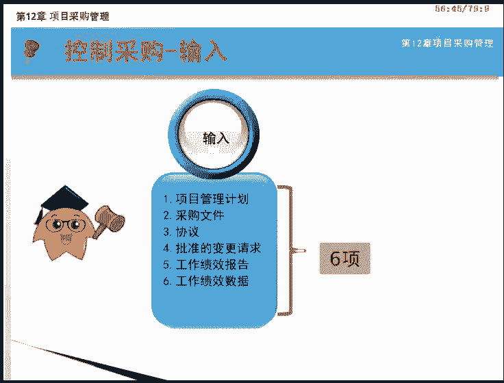

先来看控制采购过程的前三个输入。项目管理计划描述了如何管理从编制采购文件到合同收尾的各采购过程。

采购文件来自规划采购过程。其中包含管理各采购过程所需的各种支持性信息。如关于采购合同授予的规定和工作说明书。协议来自实时采购过程，是双方之间达成的谅解，包括对每一方的义务的明确。

批准的变更请求可能包括对合同条款和条件的修改。比如，修改采购工作说明书、合同价格以及对合同产品服务或成果的描述。在把变更复诸实施前，所有与采购相关的变更都应该以书面形式正式记录，并取得正式批准。

这里的工作绩效报告指来自于卖方的绩效，与卖方绩效有关的文档。包括。技术文档。是按照合同规定，由卖方编制的技术文件和其他可交付成果信息。

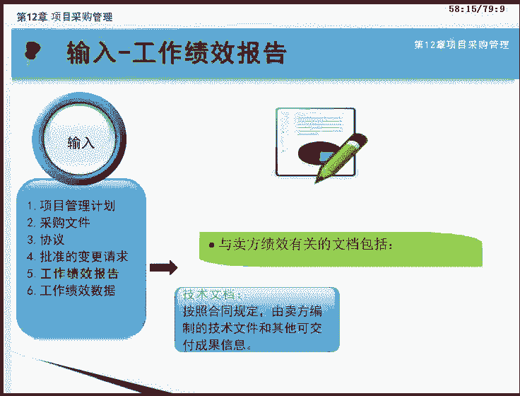

工作绩效信息。卖方的绩效报告会显示，哪些可交付成果已经完成，哪些还没有完成？工作绩效数据是由执行过程收集到的项目数据，包括一、满足质量标准的程度。2、已发生或已承诺的成本。3、已收讫的卖方发票的情况。

控制采购过程共有7个工具和技术，分别是。合同变更控制系统。采购绩效审查检查与审计。报告进校。支付系统。索赔管理和记录管理系统。下面让我们一块来学习。

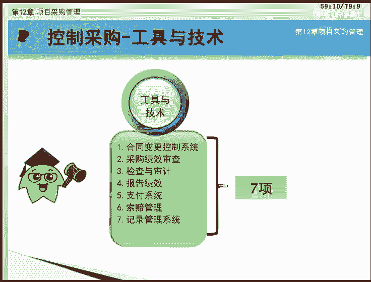

合同变更控制系统规定了修改合同的过程。

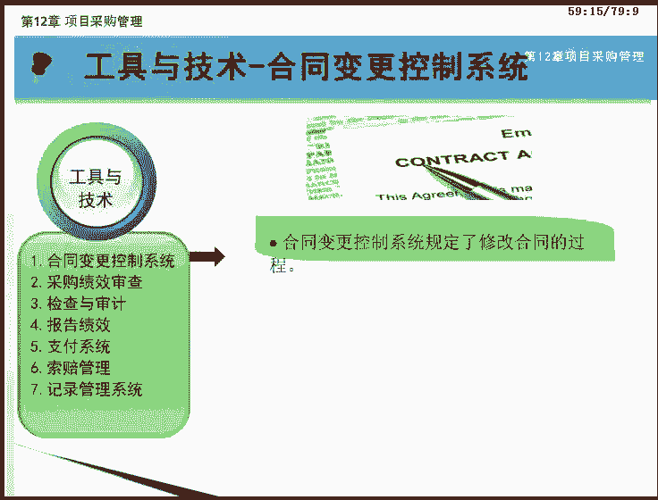

它包括文书工作跟踪系统、争议解决程序以及各种变更所需的审批层次。合同变更控制系统应当与整体变更控制系统整合起来。采购绩效审查是一种结构化的审查。

依据合同来审查卖方在规定的成本和进度内完成项目范围和达到质量要求的情况。

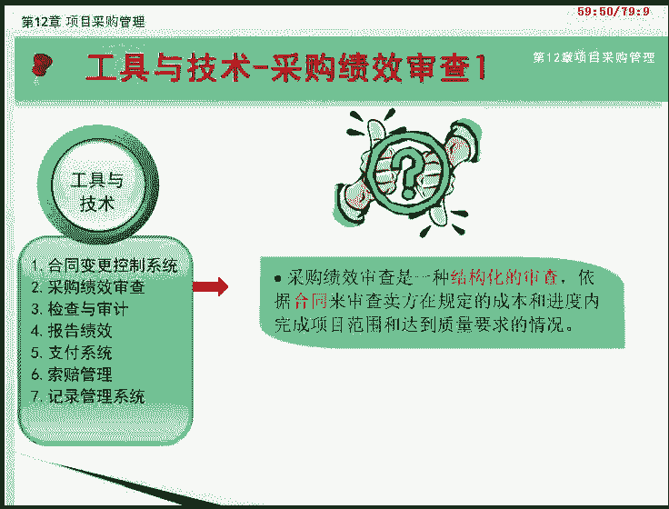

采购绩效审查的内容包括对卖方所编文件的审查，买方开展的检查，以及在卖方实施工作期间进行的质量审计。绩效审查的目标在于发现履约情况的好坏，相对于采购工作说明书的进展情况，以及未遵循合同的情况。

以便买方能够量化评价卖方是否有能力履行工作。

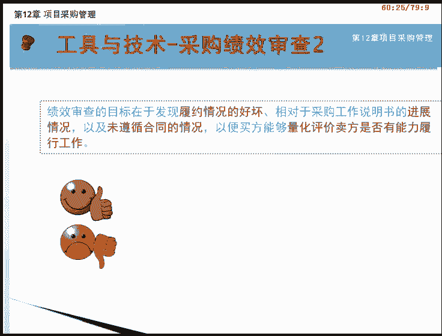

这些审查可能是项目状态审查的一个部分。在项目状态审查时，通常要考虑关键供应商的绩效情况。在项目执行过程中，应该根据合同规定，由买方开展相关的检查与审计，买方应对此提供支持。

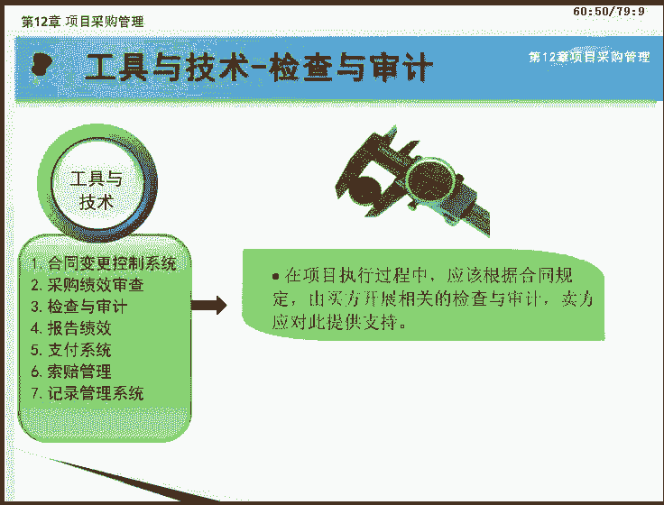

检查与审计的目的是验证卖方的工作过程或可交付成果对合同的遵守程度。报告绩效就是根据协议要求，评估卖方提供的工作绩效数据和工作绩效报告，形成工作绩效信息，并报告给相关干系人。

报告绩效为管理层提供卖方如何有效实现合同目标的信息。在项目当中往往涉及很多合同，而且根据合同规定，款项支付很可能是分批次进行或满足一定条件才支付的。这就要使用支付管理系统，管理所有的付款项目。

所有支付都必须严格按照合同条款进行并加以记录。通常，先由被授权的项目团队成员证明卖方的工作令人满意，再通过买方的应付账款系统向卖方付款。我们先来看看什么是索赔。

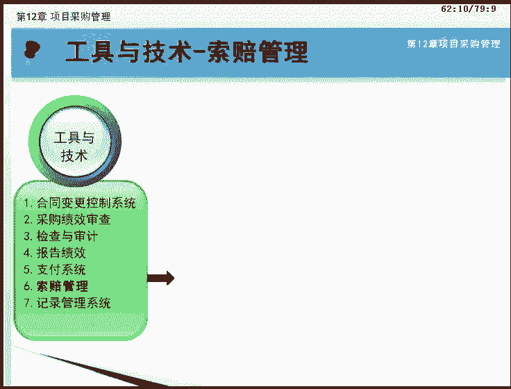

如果买卖双方不能就变更补偿，达成一致意见。甚至对变更是否已经发生都存在分歧。那么被请求的变更就成为有争议的变更或潜在的推定变更，也称为索赔争议或诉求。索赔在采购管理中很难避免。我们要知道如何管理索赔。

首先，在整个合同生命周期中，通常应该按照合同规定对索赔进行记录、处理、监督和管理。如果合同双方无法自行解决索赔问题，则需要按照合同中规定的替代争议解决ADR程序进行处理。我们要知道。

谈判是解决所有索赔和争议的首选方法。记录管理系统包含一套特定的过程相关的控制功能，以及作为项目管理信息系统一部分的自动化工具。该系统中包含可检索的合同文件和往来函件档案。

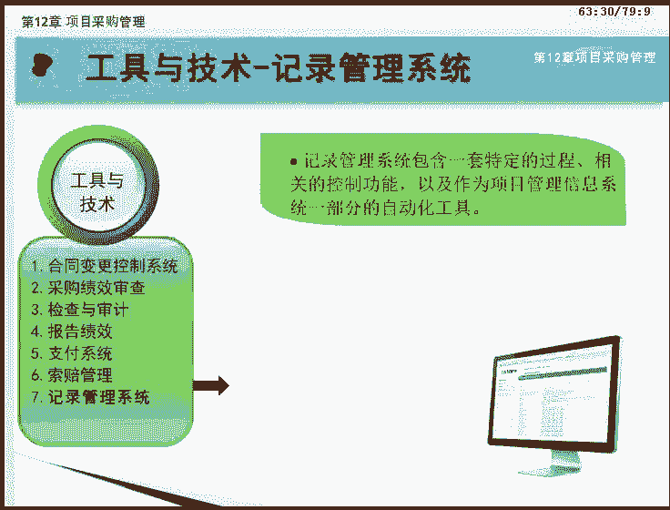

项目经理采用记录管理系统来管理合同、采购文档和相关记录。控制采购过程一共有5个输出，分别是工作绩效信息。变更请求。项目管理计划更新项目文件更新和组织过程资产更新。下面我们一块来学习。

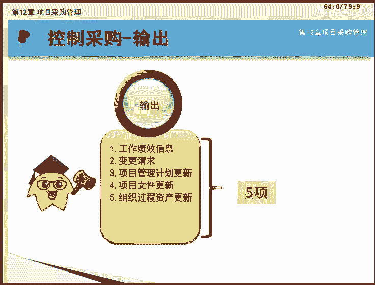

工作绩效信息为发现当前或潜在问题提供依据来支持后续索赔或开展新的采购。

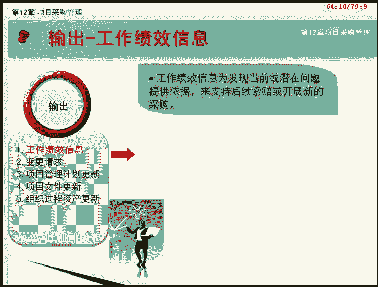

具体来讲。通过报告供应商的绩效情况，项目组织能够加强对采购绩效的认识，从而有助于改进预测风险管理和决策。绩效报告还有助于处理与供应商之间的纠纷。在工作绩效信息中包含了合同履约信息。

合同履约信息主要有两个作用。一个是便于采购组织预计特定可交付成果的完成情况，追踪特定可交付成果的接收情况。另外，合同履约信息有助于改进与供应商的沟通。使潜在问题得到迅速处理，令各方都满意。

在控制采购过程中，可能提出对项目管理计划及其子计划和其他组成部分的变更请求，包括成本基准、进度基准和采购管理计划等。应该由实施整体变更控制过程，对变更请求进行审查和批准。在控制采购过程中。

可能对项目管理计划中的如下内容进行更新。采购管理计划。需要更新采购管理计划，以反映影响采购管理的已批准的变更请求，包括这些变更对成本或进度的影响。

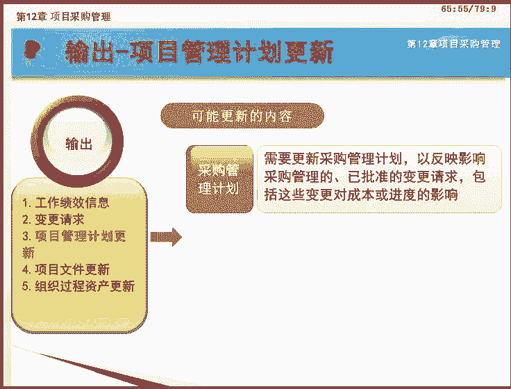

进度基准。如果发生了对整体项目绩效有影响的进度延误，则可能需要更新进度基准，以反映当前的期望。成本基准。如果发生了影响整个项目成本的变更，则可能需要更新成本基准，以反映当前的期望。在控制采购过程中。

可能需要更新的项目文件，主要是采购文档。采购文档可包括。

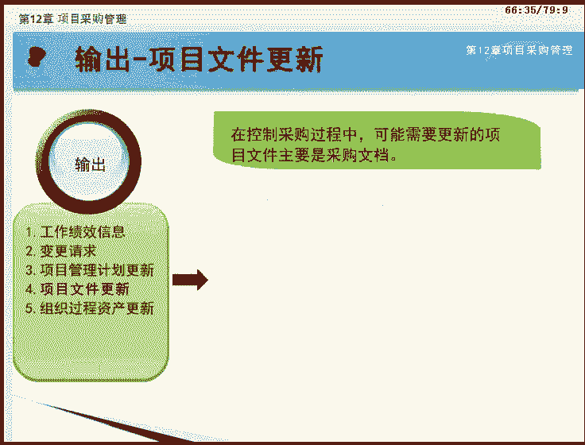

采购合同。以及起支持作用的全部进度文件已提出但未批准的合同变更和已批准的变更请求。采购文档还包括任何由卖方编制的技术文档和其他工作绩效信息，如可交付成果，卖方绩效报告、担保文件、财务文件。

与合同相关的检查结果等。在控制采购过程中，可能需要更新的组织过程资产，包括往来函件、支付计划和请求、卖方绩效评估文件等。本过程的主要内容到此学习完毕。现在我们来回顾一下本过程的核心知识。

控制采购是管理采购关系监督合同执行情况，并根据需要实施变更和采取纠正措施的过程。合同变更控制系统包括文书工作跟踪系统、争议解决程序以及各种变更所需的审批层次。

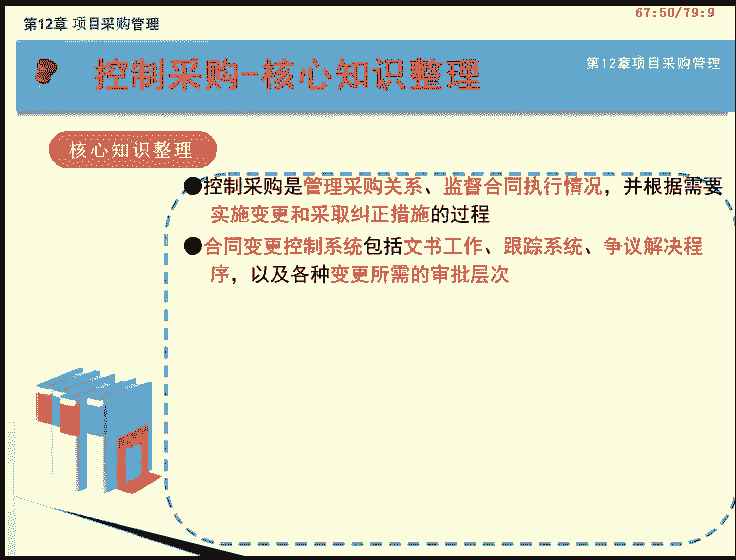

采购绩效审查是一种结构化的审查，依据合同来审查卖方各方面的绩效。他是项目状态审查的一个部分。检查与审计关注的是卖方的工作过程或可交付成果。谈判是解决所有索赔和争议的首选方法。

记录管理系统是项目管理信息系统的一部分，包含了可检索的合同文件和往来函件档案。恭喜你完成控制采购过程的学习，我们下节课见。本课程我们将一起学习第十二章项目采购管理知识领域的第四节结束采购。

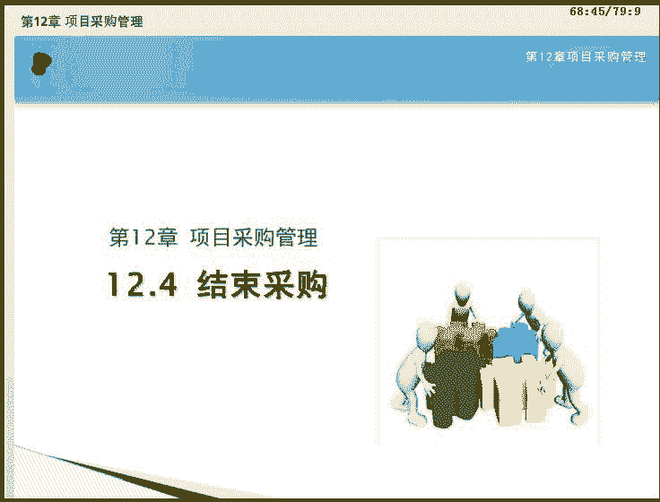

通过本课程的学习，我们将要达到如下学习目标，掌握结束采购过程的定义。熟悉结束采购过程的输入工具与技术及输出的内容，掌握合同提前终止的几种情形，了解采购审计的内容。

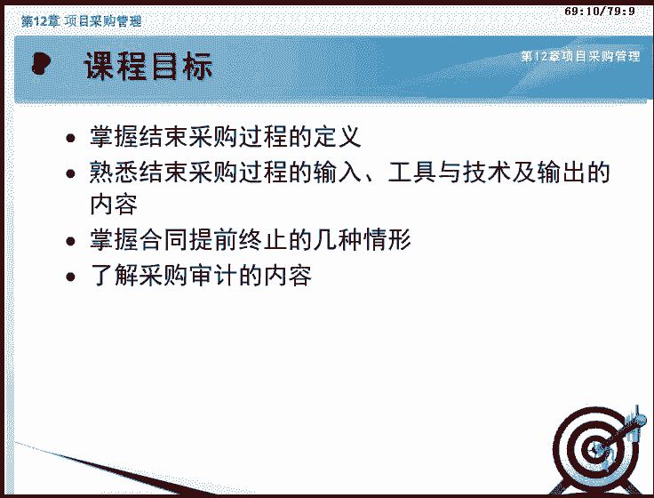

本课程我们将按照如画面所示的大纲为您讲述。首先是对结束采购的基本含义进行讲解。接下来学习结束采购过程的输入、工具和技术以及输出。课程的最后是本节核心知识整理。

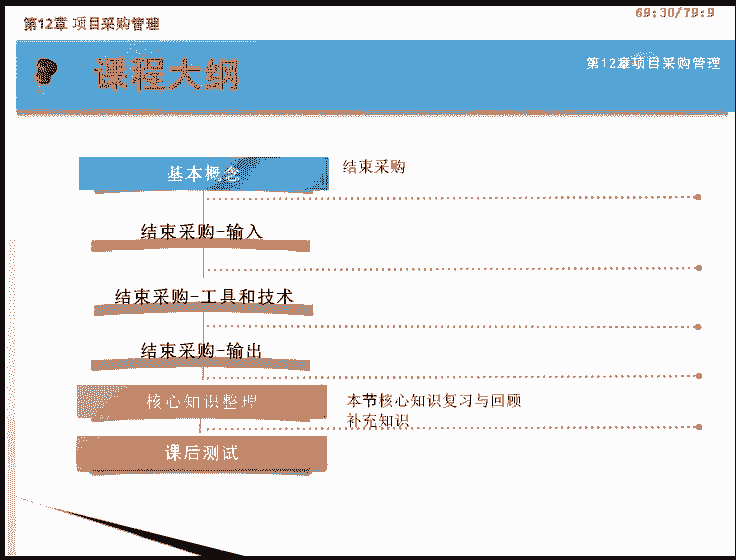

在学习本过程之前，让我们先来了解一个基本概念，结束采购。结束采购是完结单次项目采购的过程。本过程的主要作用是。把合同和相关文件归档以备将来参考。结束采购过程还包括一些行政工作，包括处理未决索赔更新记录。

以反映最后的结果，以及把信息存档供未来使用的。结束采购的具体程序应该在合同条款和条件中规定。采购结束后，味觉争议可能需要进入诉讼程序。在多阶段项目中，合同条款可能仅适用于项目的某个特定阶段。这种情况下。

结束采购过程就只能结束该项目阶段的采购。需要针对项目或项目阶段中的每个合同开展结束采购过程。合同提前终止是结束采购的一个特例。有三种情况可以提前终止合同。一、合同可由双方协商一致而提前终止。

2、或因一方违约而提前终止。3、或者为买方的便利而提前终止。前提是，如果合同中有这种规定。合同终止条款规定了双方对提前终止合同的权利和责任。

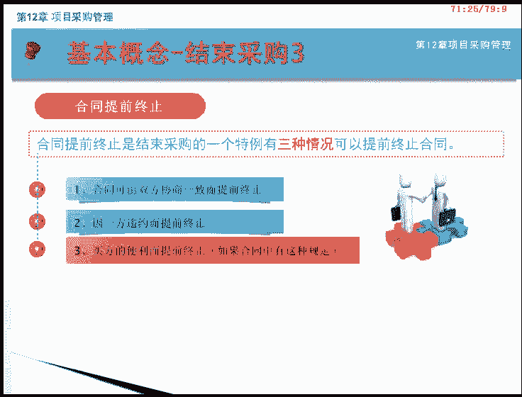

根据这些条款，买方可能有权因各种原因或仅为自己的便利而随时终止整个合同或合同的某个部分。但是根据这些条款，买方应该就卖方为该合同或该部分所做的准备工作给予补偿。

就该合同或该部分中已经完成和验收的工作支付报酬。接下来让我们来看看如何结束采购。结束采购时，需要在项目管理计划，特别是其中的采购管理计划的指导下，参考采购文件中的所有文档，对整个采购流程进行审计与记录。

必要时通过采购谈判解决争议。最终完成单次采购活动。这是结束采购过程的数据流向图。可以看到，该过程通过输入输出与其他过程进行交互。

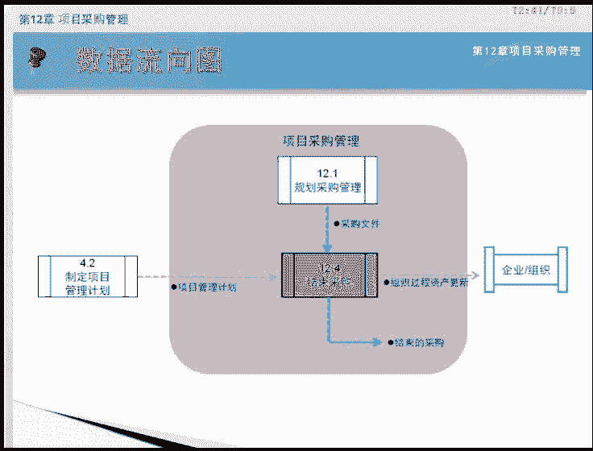

结束采购过程共有两个输入，分别是项目管理计划和采购文件。下面我们依次来了解他们。

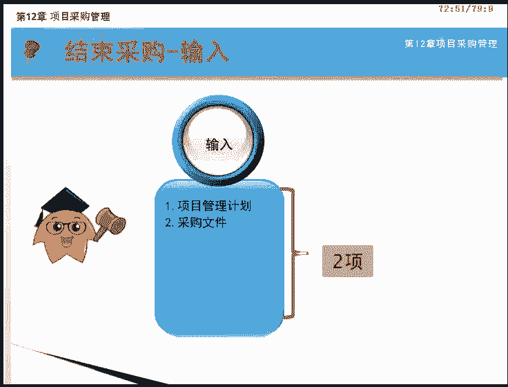

结束采购过程的第一个输入是项目管理计划。项目管理计划包含采购管理计划，他为结束采购提供了细节和指南。为结束采购，需要收集全部采购文档，并建立索引和加以归档。有关合同进度、范围、质量和成本绩效的信息。

以及全部合同变更文档支付记录和检查结果都要编入目录。

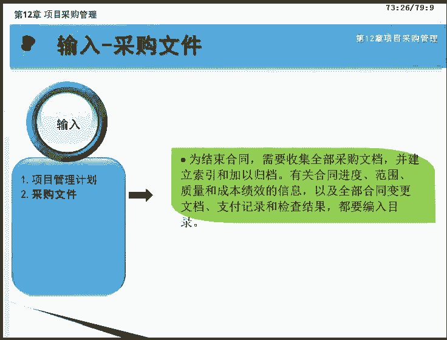

这些信息可用于总结经验教训，并为以后合同的承包商评价工作提供基础。结束采购过程共有3个工具和技术，分别是采购审计、采购谈判和记录管理系统。下面让我们一块来学习。

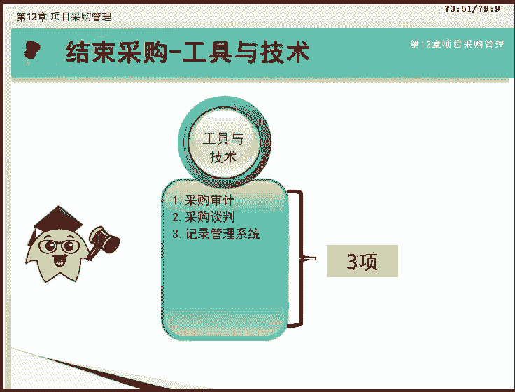

采购审计是指对从规划采购管理过程到控制采购过程的所有采购过程进行结构化审查。

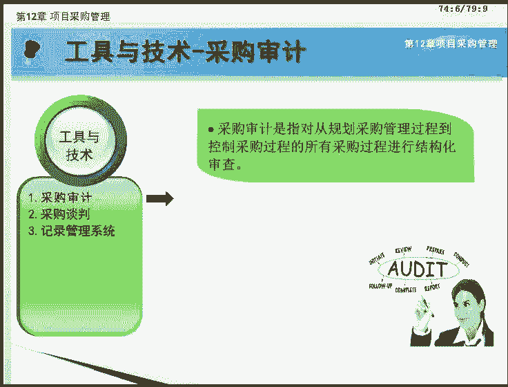

采购审计的目的是找出合同准备或管理方面的成功经验与失败教训，供本项目其他采购合同或执行组织其他项目的采购合同借鉴。在所有采购关系中，一个重要的目标是通过谈判公正的解决全部未决事项、索赔和争议。

如果通过直接谈判无法解决，则可以尝试替代争议解决ADR方法。如调节或仲裁。

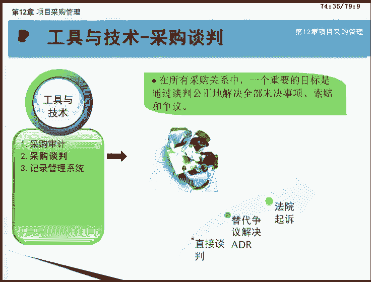

如果所有方法都失败了，就只能选择向法院起诉这种罪不可取的方法。在控制采购过程，我们已经介绍过记录管理系统。项目经理采用记录管理系统来管理合同、采购文档和相关记录。通过记录管理系统。

把合同文件和往来函件存档。这是结束采购过程的一项工作。

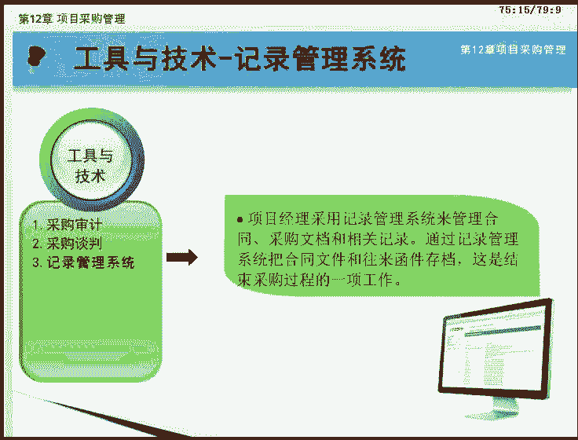

结束采购过程共有两个输出，分别是结束的采购和组织过程资产更新。下面我们一块来学习。

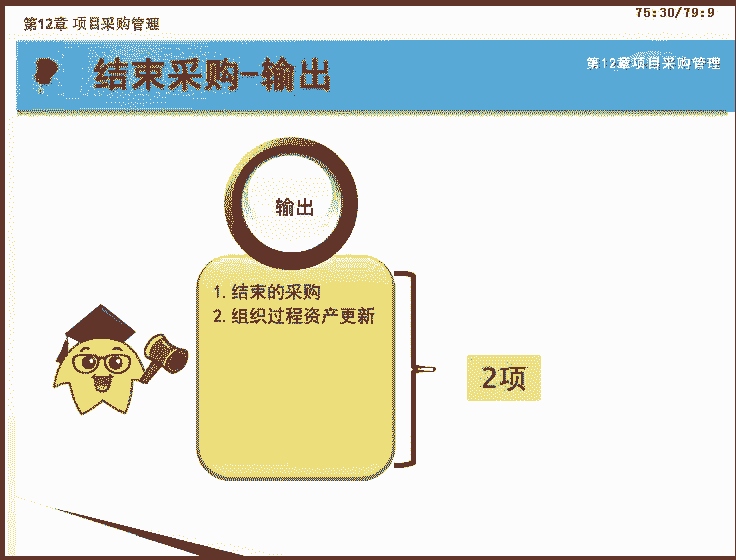

在单次采购结束时，有买方通常是其授权的采购管理员向卖方发出关于合同已经完成的正式书面通知。

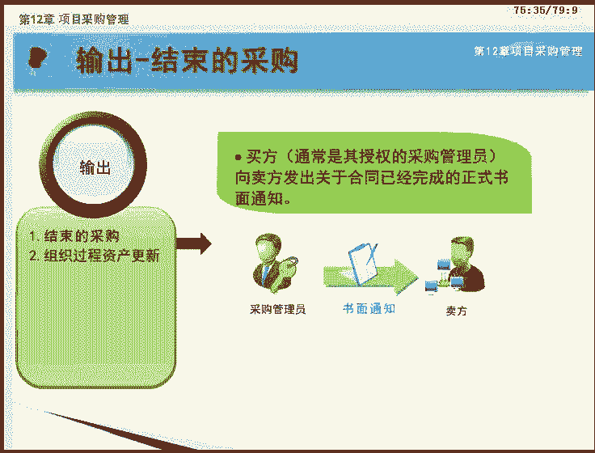

对正式结束采购的要求，通常已在合同条款和条件中定义，并包括在采购管理计划中。结束采购过程可能需要更新的组织过程资产包括。采购档案。可交付成果验收。

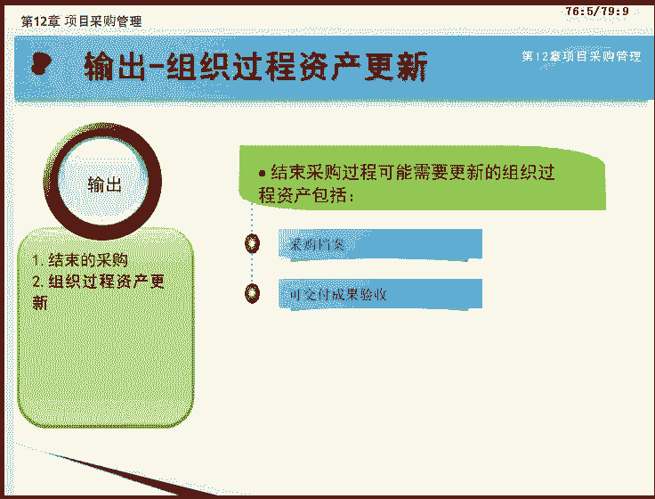

经验教学文档。其中，可交付成果验收是指对卖方完成的可交付成果的正式验收文件。而经验教学文档作为项目档案的一部分，目的是改进未来的采购。本过程的主要内容到此学习完毕。现在我们来回顾一下本过程的核心知识。

结束采购是完结单次项目采购的过程。合同提前终止是结束采购的一个特例，买方应该就卖方已完成那部分工作给予补偿。采购审计的目的是找出采购方面成功经验与失败教训，供执行组织内其他项目借鉴。

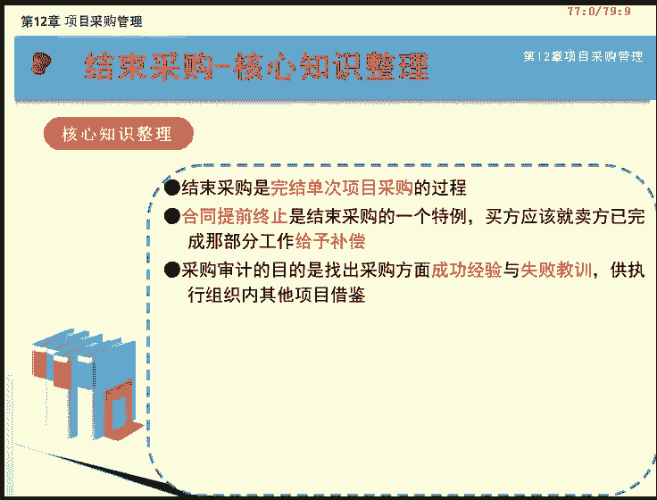

争议最好通过直接谈判解决，也可尝试替代争议解决ADR方法向法院起诉罪不割取。通常由采购管理员向卖方发出关于合同已经完成的正式书面通知。恭喜你完成结束采购过程的学习。

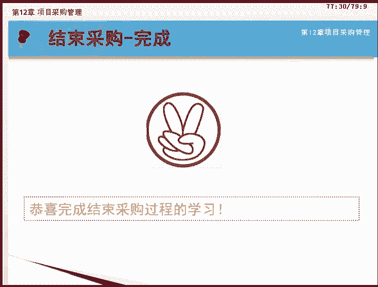

各位学员，第十二章项目采购管理知识领域的全部四个过程已经学习完毕，现在就来做个总结吧。首先需要对如何进行采购管理进行规划。这个过程就是规划采购管理。他参考项目管理子计划时间成本的估算结果。

并参考识别出的各种风险，生成项目采购管理计划和采购工作说明书。之后进入实施采购过程，寻找卖方，获得卖方响应。并评估建议书，直至与选定的卖方签订合同。项目全程需要对采购的实施情况进行监控。

收集并报告卖方绩效、处理索赔、支付、合同变更等日常管理工作，这是控制采购过程的工作。最后，需要执行结束采购过程，完成单次采购，或者说完结每个合同，并及时总结采购过程的经验教训。各位学员。

恭喜您已经完成了第十二章项目采购管理这一知识领域的学习。建议接下来继续。

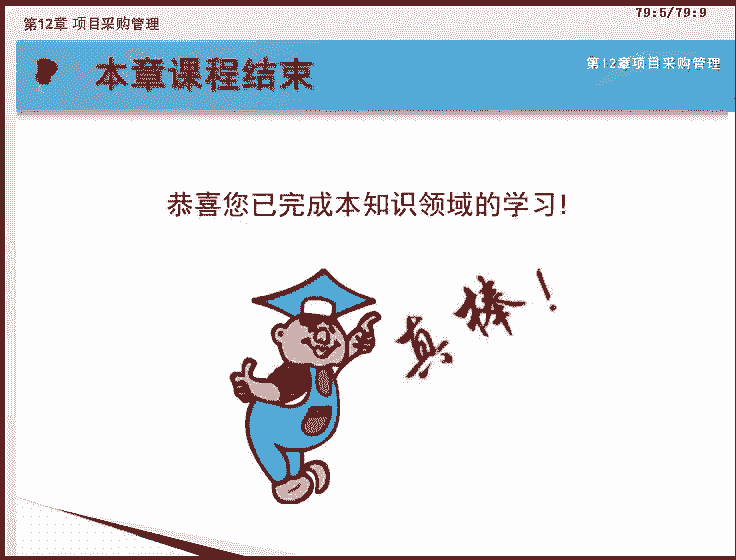