# PMP项目管理 - P1：01 - 自学力 - BV1EZ4y1p7LB

欢迎来到PNP项目管理网络课程的学习。本课程基于最新发布的篇报课指南第五版。下面我们将一块学习第一章引论。在开始本章学习之旅前，我们先回到古代，看看人类文明的一些伟大成果。

古埃及法老的坟墓金字塔在公元前26世纪就出现了。我国宏伟的万里长城修筑于遥远的春秋战国时代，迄今为止仍在使用的都江堰水利工程完成于战国时代。金字塔、万里长城、都江堰工程这些公认的世界奇迹。

今天我们叫工程或项目，都是在科学技术极不发达的那些年代修建起来的。要完成这些名垂千古的浩大工程项目，绝不是朝夕完成的。在建造的过程中，必然有我们不一定了解的管理方法和技术。

虽然这些方法和技术在那个年代也许没有形成体系，但从今天大型项目的完成来看，系统管理方法和技术是确保一个庞大工程项目成功的必要条件。

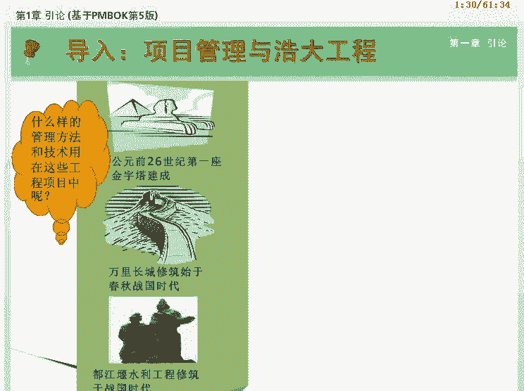

我们再来看现在。2008年北京奥运会2010年广州亚运会，这些项目面对着复杂的人员、大量的资源、质量的保证以及风险的控制等诸多问题。而这些问题都用到了现代项目管理的理念、方法、工具和技术。可以说。

项目管理的应用及其创新，对现代大型项目的成功举办有突出的贡献。改革开放至今，相信鲁布格这个名字早已响遍全中国，甚至在世界上也有一定知名度。其实呢卢布格原本仅是一个名不见经传的布依族小山寨，他的名声远播。

缘起卢布格水电站的兴建。

1981年6月，国家批准建设桩基60万千瓦时的鲁布格水电站，年发电量28。2亿千瓦时，并列为国家重点工程，整个工程由一座100米高的堆石坝，一条长9公里的引水隧道，一座桩基60万千瓦时的地下厂房组成。

卢布格水电站工程原由我国水电部十4工程局负责施工，但缺乏资金，使得工程进展非常缓慢。1984年4月，水电部决定在卢布格工程采用世界银行贷款。这是我国第一个利用世界银行贷款的基本建设项目。但是。

根据于世界银行的协议，工程三大部分之一，引水隧洞工程必须进行国际招标。在中国、日本、挪威、意大利、美国、德国、莱斯拉夫、法国八国承包商的竞争中，日本大成公司以低于标的40%的报价中标。

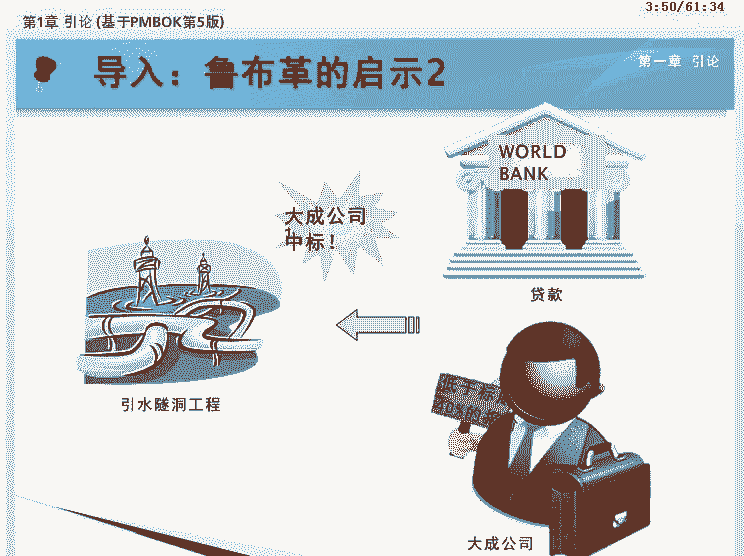

在引水隧道项目实施过程中，大成公司派到中国来的仅是一支30人的管理队伍。现场从中国水电十四局招募了424名劳动工人。中国工人在日本大成公司先进的项目管理下，引水隧道单头约平均进尺222。5米。

相当于我国同类工程的2至2。5倍，使得整个项目工期比合同计划提前近5个月，工程质量优良，完成的成本还在中标造价的基础上再节约了40%。这就是大成公司带来的先进项目管理。

让鲁布格引水隧道工程取得了如此巨大的成功。从此以后，中国水电部学习大成公司的科学项目管理方法，在鲁布格其他工程中也取得了很大的成功，还创造了著名的鲁布格工程项目管理经验。由此可见。

先进的项目管理方法是项目取得成功的关键所在。听到这里，相信大家也明白为什么项目管理在当今社会是如此重要了。

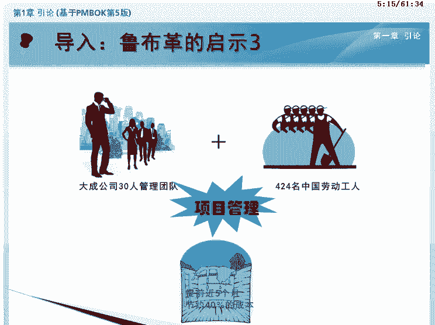

虽然我国项目管理的导入是被动的，但通过项目管理鲁布格项目投资责任主体得到明确。招投标得以公开执行。项目合同管理能够严格前后比较。在没有现代项目管理的情况下，我们做项目是计划欠缺、组织落后。

所以对1984年之前的鲁布格项目有一些形象的说法，包括投资无底洞项目马拉松等。而有了现代项目管理后，这两方面都发生了巨大变化。中国人意识到，现在项目管理不仅仅需要管理思想的变化。

还需要应用许多科学的项目管理技术工具。

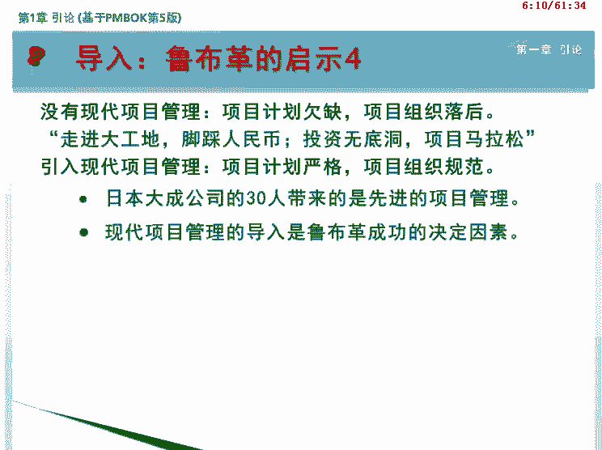

之后，国家部委特别是当时的国家纪委在全国范围内开始推广鲁布格项目的成功经验。学习完本章。您将达到以下学习目标。掌握项目的定义及特点，并能区分项目结果的分类。掌握项目管理的定义及其四个要点。

理解项目制约因素之间的关系。理解项目组合、项目级项目和组织级项目之间的关系。掌握项目级和项目级管理的定义及其关注的重点。掌握项目组合和项目组合管理的定义及其关注的重点。理解项目与战略规划的关系。

掌握PMO的定义分类职责。以及其余项目经理的差异。理解项目与运营的异同点，并能对他们进行区分。了解项目管理在组织中的作用。了解基于项目的组织PBO及商业价值的概念。了解他们与项目之间的关系。

掌握项目经理的职责、能力及其与职能运营经理的区别。本课程我们将按照如图所示的大纲顺序为您讲述。包括什么是项目项目与运营，什么是项目管理？项目组合项目及和项目管理的联系。运营与项目管理项目经理的角色。

最后是对本章的核心知识进行整理。说到项目这个词，你会想到什么？是不是也会想起我们国家举办的几次国际盛会？奥运会和2010上海世博会，还有广州亚运会呢。没错，这种大型盛会对于举办方来说是项目。

当然你可能也会想到装修一套房子，举办一次婚礼，开发一个新软件等等其他小型的项目。但这些都是你对项目的一些感性的认识。如何用文字来对项目进行定义呢？在项目管理中，最基本的概念无非就是项目了。

下面我们就从项目这个概念入手来开始本课程的正式学习吧。

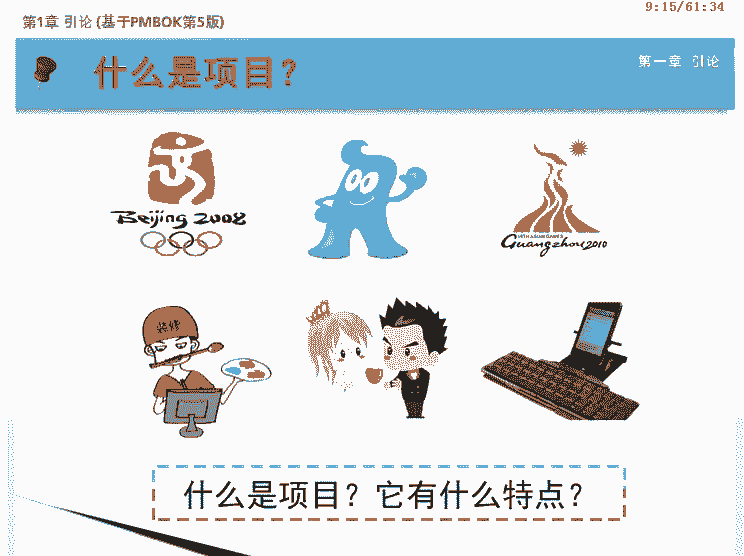

在PN报指南中，把项目定义为。项目是为创造独特的产品服务或成果而进行的临时性工作。实际上，项目有三个显著的特点，临时性、独特性和渐进明细。首先，项目是临时性的工作，具有临时性的特点。也就是说。

项目具有明确的起点和终点。他不会无限期的延续下去。但项目的临时性并不意味着持续时间短，持续一周的项目是临时的，持续1年的项目也有终止的一天。虽然项目具有临时性，但项目所创造的结果不一定是临时的。

很多项目都是为了创造永久性的结果，比如都江堰工程和长江三峡工程，他们产生的成果会一直持续使用。实际上，大多数项目都是为了创造持续的结果。项目的第二个特点是独特性。也就是说。

每个项目都会创造独特的产品服务或成果。即便是在不同项目中存在重复的元素，如两栋大楼，都由同一个施工队来建设，都采用相同建筑材料。但最后两栋大楼会有不同的地理位置，有不同的内部设计。

完成的时间也可能是不一样的。项目的第三个特点是间进明细。由于项目团队需要完成的工作可能是全新的。难以按组织现有做事情的方法重复进行。因而，存在着风险或不确定性。

这导致项目所创造的产品服务或成果也存在不确定性。也就是说，可能不能按照最早设想的方式去完成项目。与之对应的是，项目具有渐进明细性。也就是说，一开始对项目最终完成什么可能不清楚。随着项目的进行。

一些原来不清楚或不明确的事情逐渐清晰明确了。从项目的定义中可以看出，项目创造的结果分为四类及有形的产品，无形的服务或能力。其他成果以及对现有产品线或服务的升级。有形的产品。

也就是我们能够看得见摸得着的东西。它可以是最终形态的产品，如电脑的主机，也可以是其他产品的组成部分。比如生产电脑主机所必需的中间产品CPU。还可以是其他产品的升级。如苹果手机推出的新版本。

有些项目的结果是无形的，是看不见摸不着的服务和能力。比如人员培训项目开发出来的员工能力，这属于一种能力，能够用来提供某种服务。项目还可能产生出其他成果。

又如政府入助H7N9防9防治项目研究出来的关于预防H7N9的知识。政府希望公众更好的知道如何有效预防H7N9。这属于项目产生的成果，既不是产品，也不是能力，只能归属于结论性的成果。除此之外。

其实项目产生的结果也可能是对现有产品线或服务的改进。如在质量控制中实施6西格玛项目，以降低产品缺陷率。下面的工作都是项目。开发一项新产品或服务，升级原有生产线。举办一次婚礼。参与一次投标。发射卫星。

危房改造。购买一套ERP系统。

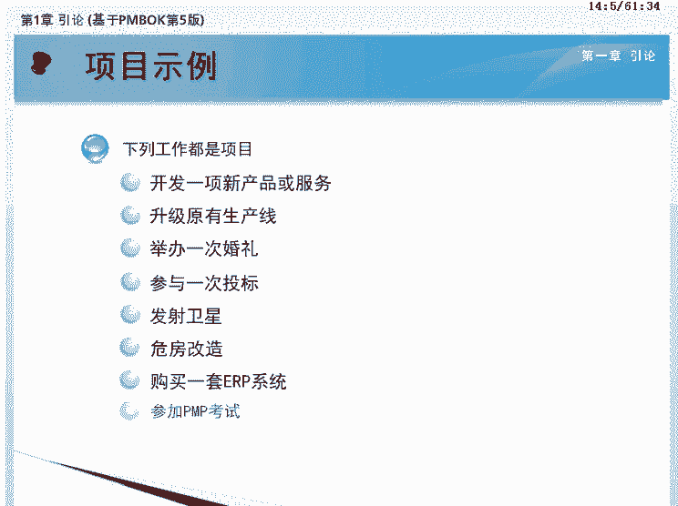

参加PMP考试。一个城市的交通管理部门要在城市的各个路口设置交通灯和相关设施来对路面交通进行统一管理和调度。以保持城市交通有条不紊的运行。做项目也一样，既然发起一个项目，就要对项目进行计划控制和管理。

使各种资源能被项目工作合理使用，使项目按计划执行最后产生期望的结果。跟交通管理和调度一样。为了确保项目中所需的各种资源能合理高效的利用，就必须进行项目管理。那么什么是项目管理呢？

项目管理就是将知识、技能、工具和技术应用于项目活动，以满足项目的要求。在这里我们需要对知识、技能、工具和技术做一下区分。举例来说，知识可以是利通过阅读学习PM报获得的关于项目管理方面的知识。

但是你光知道了知识是不够的，你需要把你获得的知识应用于实践。技能是你将获得的这些知识应用于实践的能力，而工具和技术是指项目管理中的一些特定的工具与技术，比如专家判断项目管理信息系统和工作分解结构等等。

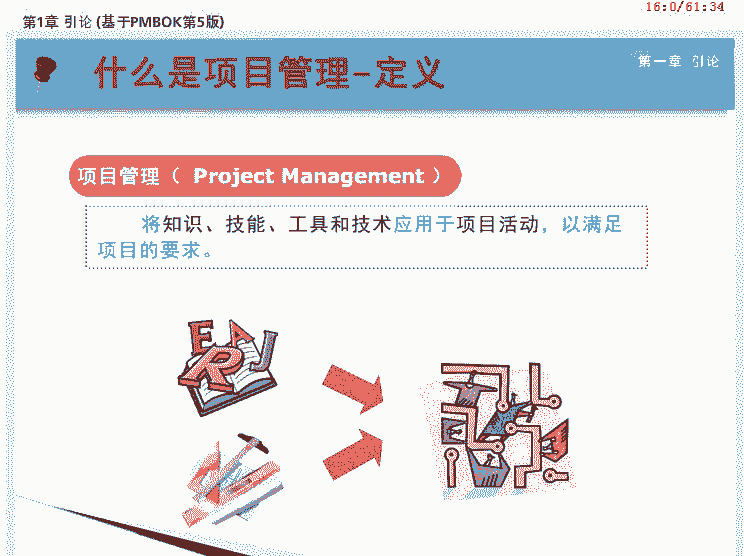

管理一个项目，通常要识别需求，管理期望、平衡限制因素，善用滚动式规划，这也是项目管理的四个要点。识别需求是项目管理中的一个非常重要的理念。一个项目最终是要满足干气人的期望的。

只有准确的了解了干气人的需求，才能为项目的规划执行以及项目最后的验收收尾提供指导和检验标准。因此，在项目的一开始就应该识别干型人的需求。不同的干系人对项目的需求和期望又是不一样的。

可能某些干系人更追求项目的经济效益，而某些干系人则更在乎项目的质量。因此，在项目规划和执行时，要特别注意处理好不同干系人的各种需求、关注和期望。

项目的范围、时间、质量、成本、资源和风险都是项目的制约因素。这些因素之间存在着相互制约的关系。任何一个因素变化都会影响至少一个其他因素。因而，要取得项目的成功，在项目管理过程中要平衡好这些限制约束。

并将其余管理干系人的期望对应起来。

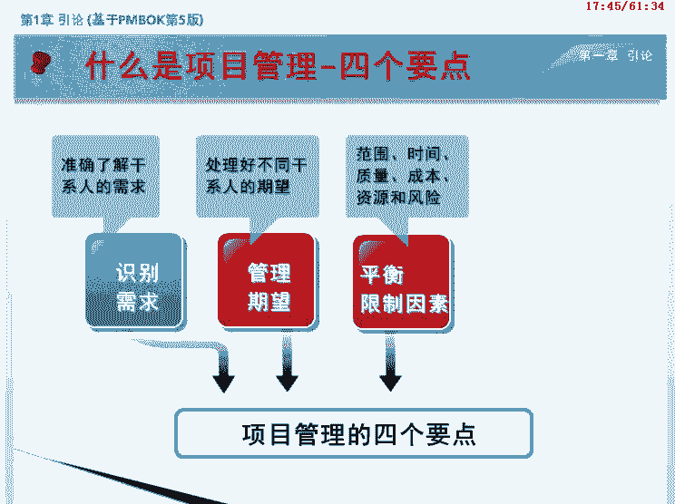

建进明细是项目的一个重要特点。只随着时间的推移，项目信息越来越多，各种估算越来越准确。因而，项目团队对目标的理解就更加完整和深入。项目团队可以持续改进和细化原有的计划。由于可能发生变更。

项目管理计划作为项目管理的核心计划，要在整个项目生命周期中反复修正，渐尽明细，这样才能使项目管理团队能随项目的进展而进行更深入的管理。项目经理在实际项目中经常需要对制约因素进行权衡。传统的三种约束。

包括范围、时间、成本或者时间成本质量。在P报新版本中增加了风险和资源两个制约因素。实际上，项目会受到更多制约因素的影响。我们要根据具体项目识别各种制约因素。

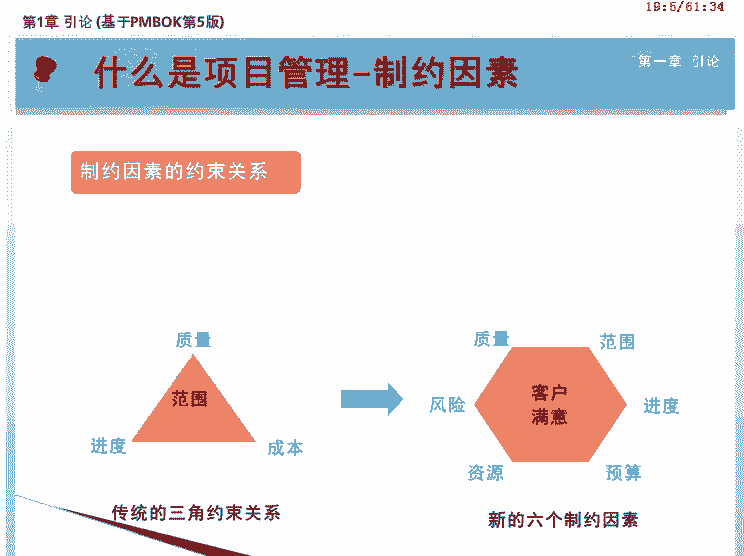

这些制约因素共同影响项目范围的实现。这些因素中的任何一个发生变化，都会影响至少一个其他因素。不同的项目干系人对这些因素的重要性有不同的看法。有些干系人更看重项目的质量，而不在乎牺牲时间和金钱。

有的干系人则更看重项目所带来的经济效益。这个时候，项目团队就必须正确分析项目状况，以平衡这些制约因素，最终让客户满意。那么针对某个项目项目管理制约因素的重要性，如何排序呢？一般来讲。

各种制约因素没有绝对的顺序关系。不同的干系人由于利益和关注点不同，排序的顺序也不尽相同。这就要求项目经理进行权衡，但主要考虑管理者的态度。也就是说，每一个项目中制约因素的重要性是由管理者决定的。

需要提醒的是，在PM报指南中，在项目管理计划中特别强调了范围、进度、成本三个基准。所以在考试中，如果没有特殊说明，可以认为他们是最重要的三重约束。

在实际工作中，不太可能一个组织中只有一个项目在执行。大多数时候是在一个组织中同时进行着多个项目。为了更好的对这些项目集中管理，需要考虑其他两个概念及项目集合项目组合。下面我们来看一个例子。

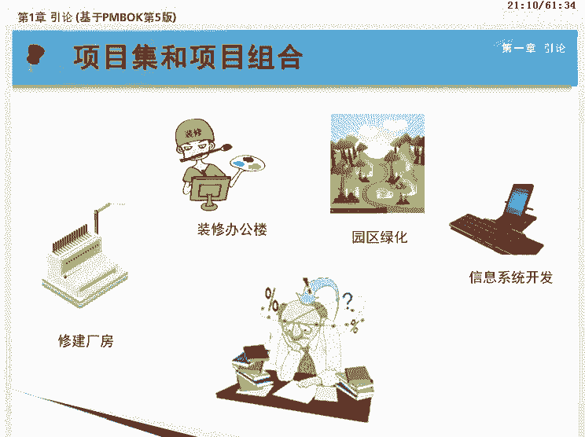

我们来看一下一个建筑公司的项目管理实力。来讨论项目级和项目级管理的概念。该建筑公司承包了一幢大楼的项目建设。其中包括大楼A的建房项目、布线项目及装修项目。我们都知道这三个项目存在着一定的依赖关系。

在建房的时候，要考虑布线的问题，并且只有在建房完成后才能进行装修。该建筑公司的做法是把这三个统一起来管理，而非分开管理。我们把统一起来的这三个项目称为项目集。

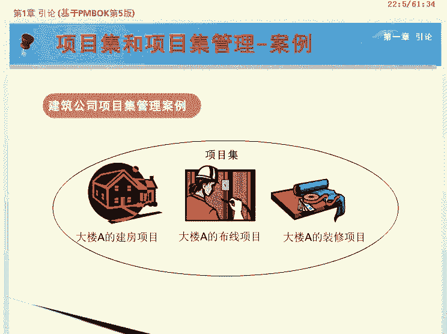

那么什么是项目集呢？项目集是一组相互关联且被协调管理的项目子项目集和项目集活动。这里面有两点需要注意，首先是多个项目之间相互关联，但这还不够。这些项目必须被协调且集中统一管理。

项目集中的项目或子项目集通过产生共同的结果或整体能力而相互联系。比如之前讲过的建筑公司承包的大楼A项目集中建房项目、布线项目和装修项目都是为完成大楼A的建设。项目集中不仅包括单个的项目或子项目集。

也包括单个项目范围之外的相关工作。比如项目之间的设备资源或人员的协调等。

项目集中的项目或子项目集必须存在着一定的依赖关系。比如大楼A的布线项目在设计上依赖于大楼A的建房项目，它的装修项目在时间上依赖于建房项目。如果项目间的联系仅仅只是共享雇主、供应商、技术或资源。

而没有协调管理，则不能把这些项目看成一个项目及。既然有项目及。就有必要对项目级进行管理。项目级管理是对项目级进行统一协调管理，以实现项目级的战略目标和利益。

进行项目及管理的目的是为了获得对单个项目分别管理所无法实现的利益和控制。他重点关注的是如何管理项目间的依赖关系，并帮助找到管理这些依赖关系的最佳方法。

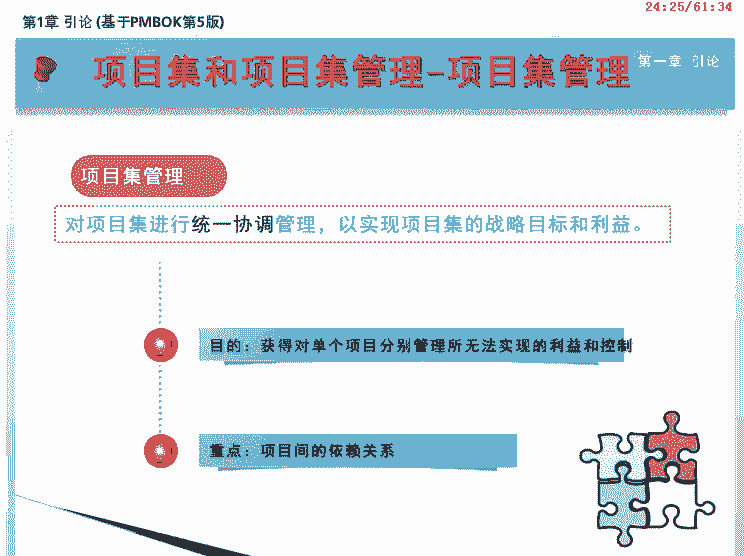

如果该建筑公司在承包了大楼A建设的同时，又承包了一段铁路的建设。其中包括铁路的规划项目和铁路施工项目。从我们刚学过的项目集的知识来看，铁路规划项目和铁路施工项目是不是也能当做一个项目集来进行管理呢？

如果该建筑公司同时还承包了一座桥梁的施工项目。那么建房项目、铁路项目和桥梁项目都要使用该公司的有限资源。那该公司的管理层该如何管理这些项目集合项目呢？

这时我们需要把这些项目集和项目当做一个项目组合来进行管理。那么什么是项目组合呢？项目组合是指为了实现战略目标而组合在一起的项目项目及子项目组合和运营工作。从定义看来，除了项目组合中可以包括项目集外。

并不能清楚的区分项目集和项目组合。为了将二者区分开来，我们可以从以下几个方面入手。第一，项目组合中的项目、项目集和其他工作不一定要彼此依赖或有直接联系。像上面讲到的例子中。

大楼建设项目集、铁路建设项目集和桥梁施工项目并没有直接的内在联系，也不互相依赖。第二，项目组合中包括非项目的其他运营工作，而项目集中虽然可以包括单个项目之外的其他工作。

但这些工作有时也可以当做一个项目来做。第三，如果项目间的联系仅限于共享雇主、供应商、技术或资源，则不是项目级，但可以当做项目组合。比如上面讲到的项目组合中，大楼建设、铁路建设和桥梁施工三者之间的联系。

就只是可能共享同样的水泥供应商，共享该供应商的人力资源和技术。所以我们把他们看作是项目组合，而不是项目集。

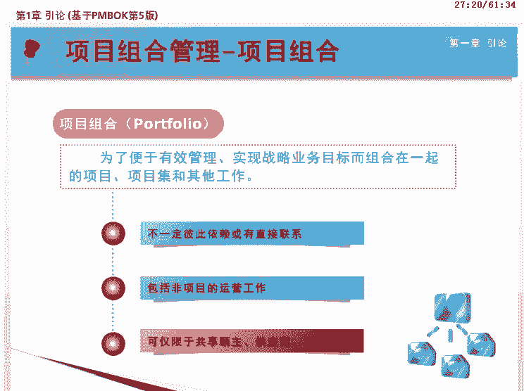

同样的，有项目组合，就有项目组合管理。项目组合管理是为了实现战略业务目标，而对一个或多个项目组合进行的集中管理，包括识别排序、授权、管理和控制项目、项目集和其他有关工作。

组织关注包括投资在内的资源的有效使用。因此，项目组合管理与资源在项目上的分配紧密相关。它的目的在于有效分配组织资源，实现其对组织的最大贡献。他重点关注的也是通过审核项目和项目集来确定资源的分配优先顺序。

并确保对项目组合的管理与组织战略协调一致。我们可以类比一句在投资领域很流行的俗语。不要把鸡蛋放在同一个篮子里。他说的是不要把资金都投入在高风险的投资上面。从长远打算。

资金应该合理分配在具有不同风险等级的投资项目上。项目组合管理的目的也是如此。为了组织的长远发展，资源分配应该有一定的优先顺序，把装有不同鸡蛋数量的篮子组合起来管理，才能不至于一次就摔碎一篮鸡蛋。

组织级项目管理简称OPM是一种战略执行框架。通过应用项目管理、项目及管理、项目组合管理及组织驱动实践，不断的以可预见的方式取得更好的绩效、更好的结果及可持续的竞争优势，从而实现组织战略。也就是说。

项目组合、项目集和项目管理均需符合组织战略或者有组织战略驱动。反之，项目组合、项目集和项目管理。又以不同的方式服务于战略目标的实现。OPM把项目项目集和项目组合管理的原则和实践与组织驱动因素。

如组织结构、组织文化、组织技术、人力资源实践等联系起来。从而提升组织能力，支持战略目标。组织应该测评自身能力，然后制定和实施能力提升计划。以其系统的应用最佳实践。为了理解项目组合管理。

项目及管理和项目管理识别他们之间的相似性和差异性非常重要。项目项目集和项目组合管理，除了在目的和关注重点上存在区别外，在范围变更、规划、管理、成功和监督等各个方面也有差异。

这里从这几个方面将项目项目集和项目组合做了一个比较，有助于区分项目项目集和项目组合。我们可以暂停观看。项目组合项目集和项目之间的关系可以这样表述。

项目组合是为了实现战略目标而组合在一起管理的项目及项目子项目组合和运营工作的集合。项目集包含在项目组合中，其自身又包含需协调管理的子项目级项目或其他工作，以支持项目组合。单个项目无论属于或不属于项目级。

都是项目组合的组成部分。虽然项目组合中的项目或项目集不一定彼此依赖或直接相关，但是他们都通过项目组合与组织战略规划联系在一起。项目经常被作为实现组织战略规划的一种手段。

组织的战略规划是决定项目投资的主要因素。通常处于以下一项或多项战略考虑，而批准项目启动。市场需求，比如在H7N9流行期间，市场对口罩的需求量急速上升。为了提高其经济收益，某纺织厂看准该市场需求。

决定启动提高口罩生产率的项目。以在较短的时间内生产出更多的口罩来满足市场需求，获得更大的经济效益。当有战略机会或者业务需求时，组织也会考虑启动一个新的项目。比如，一家培训公司为了提高收入。

批准一个课程开发的项目。社会需要也是启动项目的可能原因。如非政府组织批准一个项目，向地震灾区提供饮用水系统、医疗设施。环境考虑也可能导致引起一个项目，如为降低污染，某上市公司批准一个项目。

建立一项共享电动小轿车的新服务。如果客户直接向组织提出要求，比如某企业要求一软件公司为自己量身定制以教研工工资管理软件。也是促进组织启动新项目的原因。除此之外。

有时技术的进步也迫使企业或组织改变战略计划，发起新的项目，来使自己的产品符合新技术的要求。正如现在电脑CPU技术不断进步，电脑内存也要跟得上才行。因而，不断会有新的项目来从各方面提高电脑的性能。另外。

法律要求对企业或组织的战略计划也有影响，例如，化工厂的新产品研发产生了新的有害物质。根据相关的环境保护法的要求，该化工厂必然要批准一个处理新型毒害物质的项目。需要指明的是，尽管单个项目都有各自的利益。

但一般都能为项目级的整体利益项目组合的整体目标和组织的战略目标做出贡献。

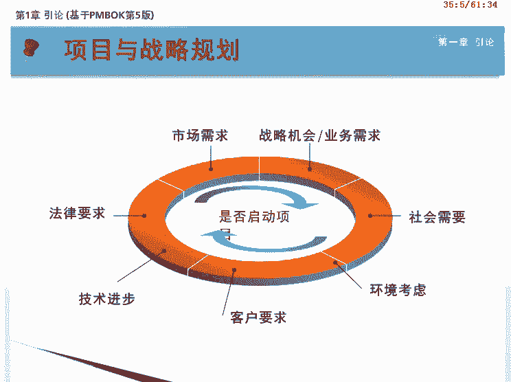

为了实现多项目项目集和项目组合的管理，企业或组织需要建立一个项目管理办公室这样的部门。项目管理办公室project management office简称PMO是负责对于项目相关的治理过程进行标准化。

并促进资源方法论工具和技术共享的一个组织部门。其职责涵盖从提供项目管理支持到直接管理一个或多个项目。虽然项目管理办公室支持或管理多个项目，但各项目不一定彼此关联。因此。

项目管理办公室的具体形式、职能和结构也不是统一不变的，而是取决于组织的需求。根据PMO对项目的控制和影响程度不同，可以把PMO分成如下三种类型。支持型。支持型PMO担当顾问的角色。

向项目提供模板追加实践、培训，以及来自其他项目的信息和经验教训。这种类型的PMO其实就是一个项目资源库，对项目的控制程度很低。控制型。控制型PMO不仅给项目提供支持，而且通过各种手段要求项目服从，例如。

要求采用项目管理框架或方法论，使用特定的模板格式和工具或者服从治理。这种类型的PMO对项目的控制程度属于中等。指令型指令型PMO直接管理和控制项目这种类型的PMO对项目的控制程度很高。

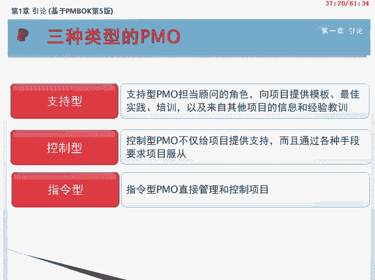

PMO可能在每个项目的生命周期中充当不同的角色。比如，在项目的开始阶段，PMO有权起到核心干系人和关键决策者的作用。为了确保项目符合组织业务目标，PMO有权随时提出建议，提前终止项目或采取其他必要措施。

此外，PMO还可参与对共享资源或专用资源的选择管理和调配。下列都是PMO可能的工作。对PMO所辖的全部项目的共享资源进行管理。识别和制定项目管理方法、最佳实践和标准。指导辅导、培训和监督。

通过项目审计监督对项目管理标准、政策、程序和模板的遵守程度。制定和管理项目政策程序、模板和其他共享的文件。对跨项目的沟通进行协调。虽然PMO的具体职能取决于组织的需要。

但它的一个最主要的职能是通过各种方式支持项目经理。具体来说，项目经理与PMO之间又存在着一些差异。

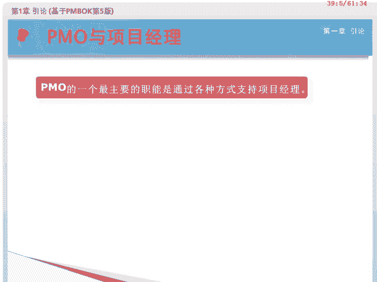

首先，二者的关注目标不同，项目经理关注特定项目目标，而PMO特别关注项目及范围变更，这些变更可被看作是能促进业务目标实现的潜在机会。其次，二者管理资源的范围不同。项目经理只能控制分配给本项目的资源。

以更好的实现项目目标。而PMO负责优先利用所有项目共享的组织资源。最后，项目经理和PMO管理的项目制约因素不同。项目经理管理单个项目的制约因素，如范围、进度、成本和质量等。而PMO站在企业的高度。

对方法论、标准、整体风险或机会、测量指标和项目间的依赖关系进行管理。尽管二者存在差异，所遵守的要求也不相同，但他们所有努力都必须符合组织的战略需求。从项目的定义特点以及产生的结果来看。

我们平时所做的工作并不全都是项目。比如新建1个PMP学习辅导网站是一个项目。那平时的网站运营维护在线答疑这些工作又是什么呢？这里要讲到一个与项目相对应的概念，运营或称运作。在一般情况下。

所有的工作可分为两类，一类是项目，另一类就是运营。与项目的临时性和独特性相比，运营是通过开展持续的活动来生产或提供重复的服务的一种组织职能。需要说明的是，这里的组织不但包括盈利性的企业。

也包括非盈利性的组织。当然，很多时候我们会用企业来代替组织的说法。这主要是由于现实经济生活中大量的还是企业这种组织单元。

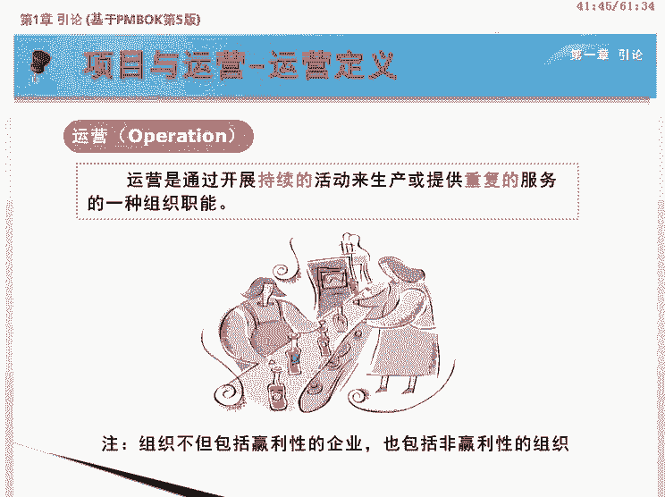

项目和运营有许多共同之处。比如他们都需要人来实施。都会受到某种因素的限制，都需要进行规划、执行和监控，而且都是为了实现组织的目标或战略计划。共同点这么多，你知道怎么区分他们吗？他们之间的主要差别在于。

项目是临时的有明确的终点，并产生独特的产品服务或成果。而运营是持续的，没有明确的终点产生重复的产品服务或成果。根据这两点，我们就很容易清楚的区分二者了。

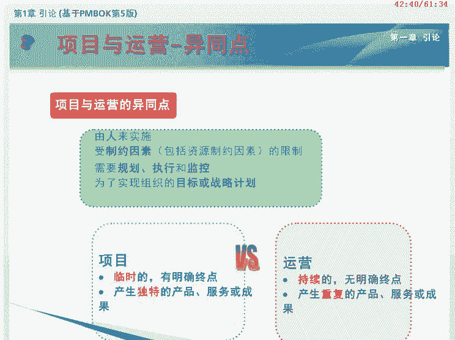

为了完成组织的战略规划，需要同时执行项目和运营工作。在产品生命周期中，项目和运营可以在不同的时点交叉，在每个时点，随着相关工作的完成，可交付成果和知识在项目和运营间转移。在项目的收尾阶段。

资源可能从项目转移到运营。项目产生的结果投入到运营中。在新产品开发、产品升级或提高产量时，会启动新的项目。此时，资源会从运营转移到项目当中。

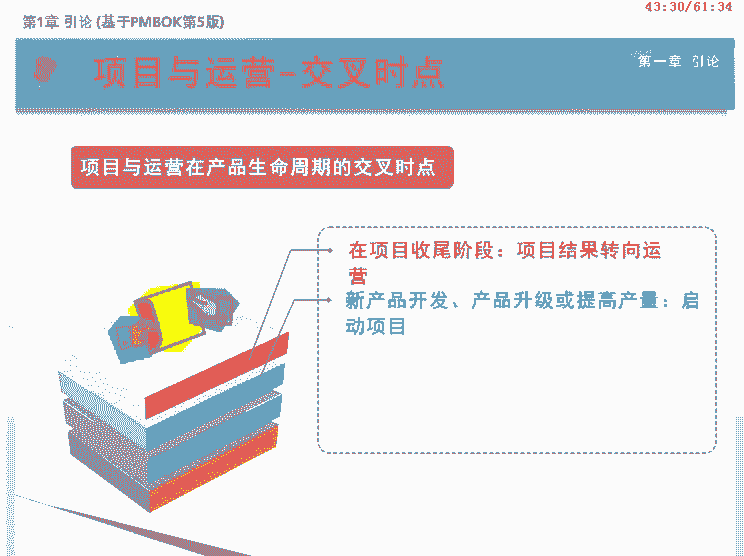

在改进运营或产品开发流程时，也需要启动项目，也是把资源从运营转移到项目当中。最后，在产品生命周期结束之前，也就是产品退出运行之前，可能会要对产品进行报废。之前的运营工作结束，开始实施报废项目。

以便结束产品的生命周期。我们知道运营和项目是不同性质的工作。运营管理也不同于项目管理。但是如果项目将对运营工作人员的工作和事业产生影响，那么项目管理者应该在项目中认真考虑这些运营干系人的需求。

项目经理需要考虑运营干系人，并邀请他们适当参与项目的所有阶段，以便获取他们的见解，防止因忽视他们的意见而导致不必要的麻烦。运营干系人应该参与项目，他们的需求应该记录在干系人登记册中。

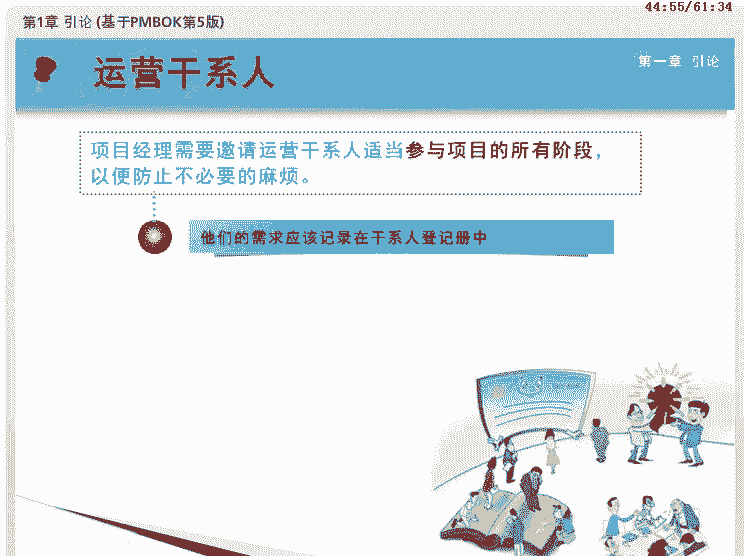

他们的影响包括正面和负面的影响，应该记录在风险管理计划中。运营干系人的例子包括。设备操作员、生产线主管、服务台员工、生产系统支持分析师、客户服务代表、销售人员、维修工人、电话销售人员、呼叫中心人员、零售工人、直线经理、培训专员等。

基于项目的组织PPO是指建立临时机构来开展工作的各种组织形式。在各种不同的组织结构中，都可以建立PBO。PPO的优势。采用PPO可以减轻组织中的层级主义和官僚主义。因为在PBO中。

考核工作成败的依据是最终结果与职位或政治因素无关。

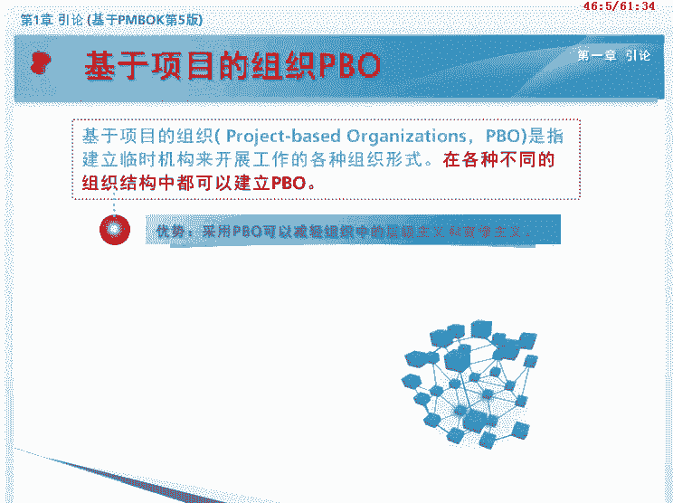

PPO的特点。在PPO中，大部分工作都被当做项目来做，按项目方式，而非职能方式进行管理。例如，针对一家出版社，可以把工作按照每一本书的出版发行设置为一个个的项目。PPO可建立在多个层次。

比如可以在整个公司层面采用PPO。也可以仅在组织的某个部门或分支机构内部采用PPO。一些大型的PPO可能需要职能部门的支持。世界上没有完全相同的两片树叶。每个组织都有其独特的商业价值。

商业价值指组织所从事业务的整体价值。包括全部的有形价值和无形价值。有形价值包括。货币资产、固定设备、股东权益、其他有用的物品或器材等。无形价值包括商誉。品牌认知度、公共利益、商标等。

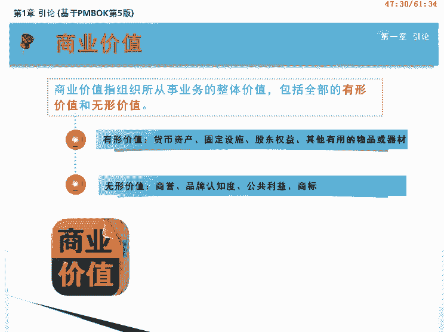

组织存在的目的就是创造提升和维护自己的商业价值。项目组合项目集和项目是组织快速实现商业价值的有力保障。前面的课程我们讲解了项目以及项目所处环境的相关知识。我们已经对项目经理的重要性有了初步认识。

下面我们就来了解一下项目经理的角色。与PMO不同，项目经理是执行组织委派，领导团队实现项目目标的个人。这是一个富有挑战且备受瞩目的角色，具有重要的职责和不同的权利。主要对完成项目的目标负责。

对项目进行管理。项目经理必须能理解项目的细节，但这并不意味着项目经理要自己做项目中所有的事情。而是从项目全局的角度管理项目的所有方面。特别是对于大项目来说，项目经理主要就是一个整合者和沟通者。其中。

整合主要是通过沟通实现的。项目经理的主要职责包括。组织制定项目管理计划和所有子计划。使项目符合进度和预算要求。识别监测和应对风险。准确及时的报告项目进展。

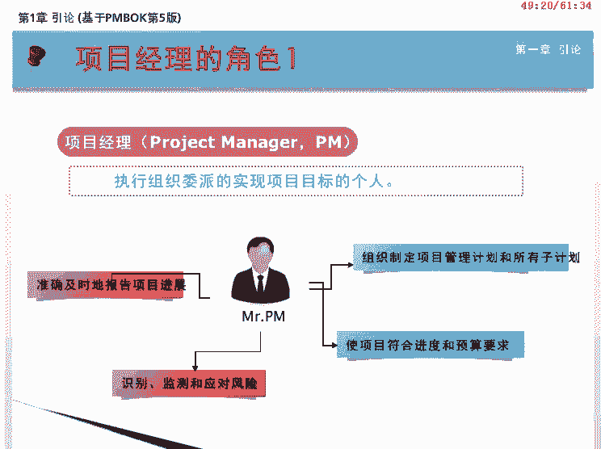

既然，项目经理在整个项目中扮演着如此重要的角色。那对项目经理的能力要求也是相当高的。作为项目的管理者、整合者和沟通者。掌握项目管理的各种工具和技术是必不可少的。但是远远不够。

他必须具备多方面的能力和素质。一般而言，包括三个方面。首先它必须具备一些特定应用领域的技能，也就是说项目经理需要具有所管辖项目所属应用领域的技能。比如说如果一个项目经理负责的是一个软件开发的项目。

那么他必须对软件开发的流程、相关标准，甚至是软件开发的相关术语都要有所了解。当然也还包括一些职能部门和支持领域的技能。项目经理必须具备的第二个方面的能力是通用的管理能力。这是作为一个管理者所必须具备的。

比如财务方面的管理，采购方面的管理，销售方面的管理等等。另外也是非常重要的一点。项目经理还必须具备一定的知识、实践能力和个人能力。知识是指我们对项目或者项目管理领域的知识和技能知道了什么，知道了多少。

实践能力就是我们能够应用所掌握的知识，做什么事情，完成哪些目标。在领导和管理项目及项目团队时，项目经理的个人能力也非常重要。它主要指项目经理工作中的行为方式、项目经理的态度、人格特征和领导力。

对项目的执行，项目团队的建设都具有相当大的影响，决定着项目经理行为的有效性。

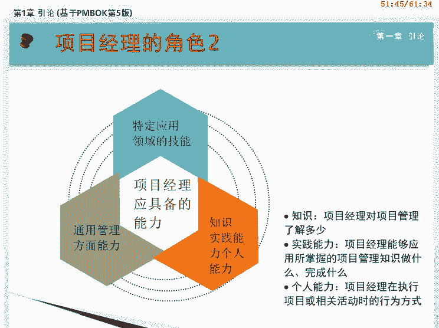

在企业或组织中，除了有项目经理，还有职能经理和运营经理，三者的角色和职责也存在差异。项目经理负责实现项目目标。职能经理则是在行政或职能领域承担管理角色的重要人物。

比如人力资源管理、财务管理、采购管理等等。运营经理则是在核心业务领域承担管理角色的个人，比如研发设计、制造等等。他们直接管理供销售的产品或服务的生产和维护。他们都配有固定的员工，以开展持续性工作。

并能全权管理所辖职能领域的所有任务。尽管三者的角色和职责不同，但都能不同程度的支持项目目标的实现。职能经理能够为项目提供相关领域的专业技术或服务，比如为项目提供财务方面的人力支持。

并为项目成本管理提出建议。在项目完成完成时，项目的项目的技术文件融其他的永久性的文件学员网移交移交给运营管理管理人员，运营经理运营经理负责的把移交的项目纳入日运营运营中，并为之提供长期支持。

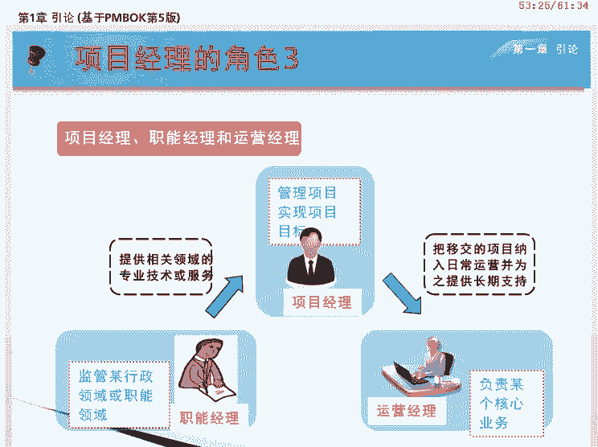

本课程最后一个知识点是项目管理知识体系。项目管理知识体系主要指那些项目管理领域内独特以及与其他管理学科重叠的知识。项目管理知识体系指南及本课程学习的P安报考指南是项目管理知识体系的一部分。

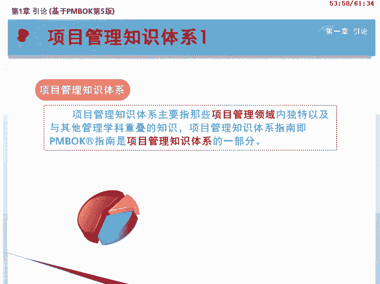

项目管理知识体系主要由三部分组成，项目生命周期的定义，五大项目管理过程组和十大知识领域。这些在以后的课程中都会为大家详细讲解。5个过程组和十大知识领域是项目管理体系中的重点内容。

5个过程组包括启动规划、执行监控收尾过程组。十大知识领域则包括项目整合管理、项目范围管理、项目时间管理、项目成本管理、项目质量管理、项目人力资源管理、项目沟通管理、项目风险管理、项目采购管理和项目干系人管理。

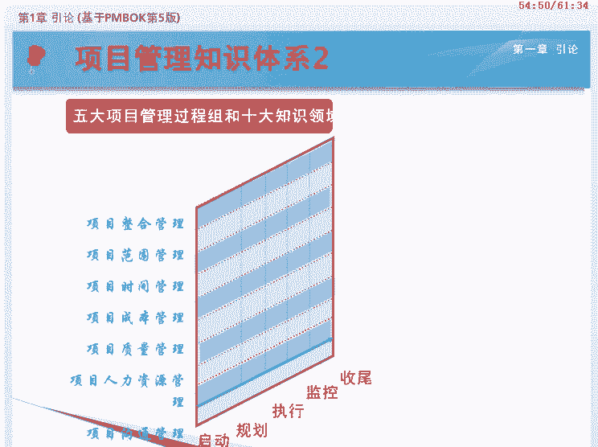

每一个知识领域包含了若干个过程，在每个过程组中也会涉及相关知识领域的过程。每个过程都是由各过程的输入输出以及工具与技术组成。各个过程之间通过输入输出相互联系在一起，构成了项目管理知识体系的整体大厦。

在我们后续的学习中，会涉及到许多项目管理方面的方法和工具。我们先对最主要的几个做一介绍，让大家对今后的课程内容有个初步印象。项目管理历史悠久，但很多项目管理工具都是近百年产生的。

而且很多项目管理技术来源于军事。1917年，亨利甘特发明了甘特图，首次使用条形图进行进度安排。20世纪50年代，美国杜邦公司创造了关键路径法，用于复杂进度计划的编制。同时。

美国海军开始使用计划评审技术进行工期估算和计划编排。之后的工作分解结构，蒙特卡洛模拟技术和政治分析技术更为现代项目管理学科奠定了基础。

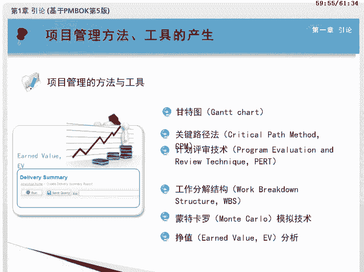

最后，我们对本课程的核心知识做一个简单的回顾。项目是为创造独特的产品服务或成果而进行的临时性工作，具有临时性、独特性和渐进明细性。项目管理是将知识、技能、工具与技术应用于项目活动，以满足项目要求。

项目及管理重点关注项目间的依赖关系。项目组合管理重点关注资源分配优先顺序。

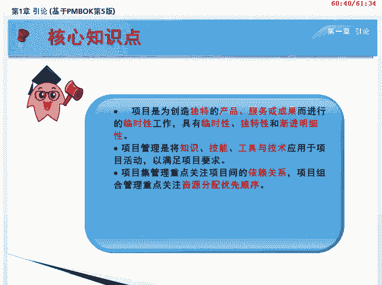

PMO是负责对所辖各项目集中管理的组织部门，一个主要职能是支持项目经理。项目经理是执行组织，委派其实现项目目标的个人。他应。各位学员，恭喜你已经完成了PMP项目管理第一章引论的学习。

建议接下来继续学习第二章组织影响和项目生命周期。我们下堂课见。

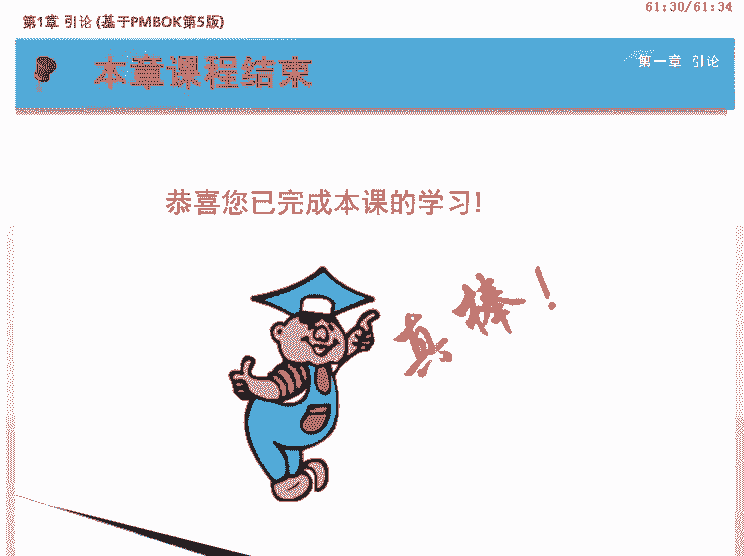