# PMP项目管理 - P7：07 - 自学力 - BV1EZ4y1p7LB

欢迎来到PMP项目管理网络课程的学习。本课程基于最新发布的PMbook指南第五版。下面我们将一起学习第七章项目成本管理。项目成本管理知识领域有四个过程。分散在规划过程组和监控过程组中。在这一章。

我们要重点学习项目成本管理的这四个过程。分别是规划过程组的规划成本管理、估算成本和制定预算共三个规划过程。还有控制过程组的控制成本过程。这四个过程不但彼此互相作用，而且还与其他知识领域中的过程相互作用。

这些过程在位置图中的位置是考试必考的重点，请务必记下来。此外，在学习的过程中，大家还要格外注意每个过程所使用的工具和技术，它们也是本章的重点内容。那么什么是项目成本管理呢？

项目成本管理包含位置项目在批准的预算内完成，而对成本进行规划、估算、预算、融资、筹资管理和控制的各个过程。成本管理的目的是确保项目在批准的预算内完工。项目成本管理要关注两种成本。

一个是要重点关注完成项目活动所需资源的成本。但同时也应该考虑项目决策对项目产品服务或成果的使用成本、维护成本和支持成本的影响。例如，在设计阶段减少审查的次数可降低项目成本，但可能导致产品运营成本的增加。

在项目成本管理中有几点需要注意。第一是需要考虑干谢人对成本信息的特殊需求。不同的干谢人会在不同的时间用不同的方法核算项目成本。因此，对于项目团队来说，在项目成本管理中。

应该考虑哪些干系人需要了解哪些项目阶段的成本情况。

第二是项目团队应该在项目规划的早期就对成本管理进行规划，并完成项目成本管理计划，以建立各项目成本管理过程的基本框架，从而确保各过程的有效性及其之间的协调性。按照PM报告指南第五版。

项目成本管理主要通过四个过程完成。首先要制定项目成本管理计划，这是进行成本管理的基础。之后如果是小项目，可以直接对项目活动进行成本估算。如果项目比较大，则可能需要针对工作分解结构中的工作包进行估算。

在制定预算过程中，需要用合理的方法对各活动或工作包成本的汇总结果进行交叉验证，并做必要的调整。

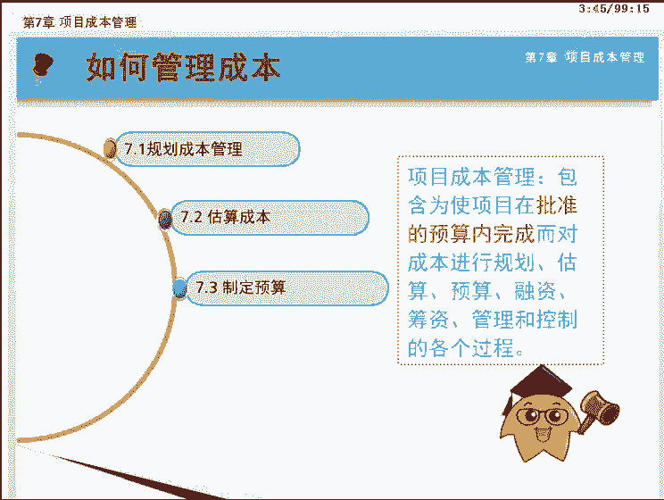

在项目整个过程中，需要使用控制成本过程、监督项目状态，以更新项目成本管理成本基准变更的过程。可见，跟时间管理一样，工作分解结构也是项目成本管理的重要依据，成本估算和成本预算之间的联系非常紧密。

在一些范围较小的项目中，估算成本和制定预算这两个过程可视为同一个过程，甚至可以由同一个人在较短的时间内完成。需要注意的是，项目管理团队提前完成的成本管理计划。

可以对规划组织估算、预算和控制项目成本统一格式建立准则。本课程我们将一起学习第七章项目成本管理知识领域的第一节规划成本管理。

通过本课程的学习，我们将要达到以下目标。包括。掌握规划成本管理过程的含义与作用。了解规划成本管理过程使用的分析技术，掌握成本管理计划的含义与内容。

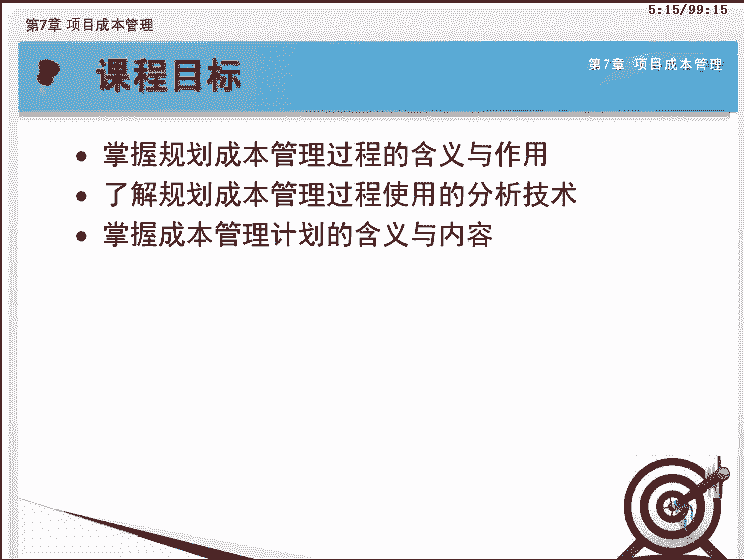

本课程我们将按照如画面所示的大纲为您讲述。首先是对成本管理计划以及规划成本管理过程的基本含义进行讲解。接下来分析规划成本管理过程的输入、工具和技术以及输出。课程的最后由本课核心知识整理。

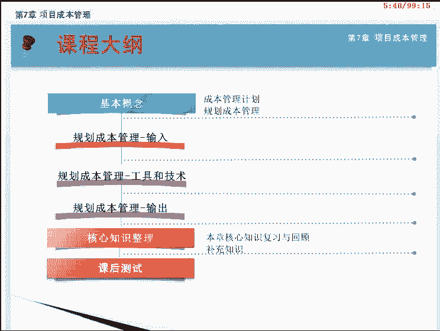

在学习规划成本管理过程之前，我们先来了解两个基本概念，成本管理计划和规划成本管理。

成本管理计划是项目管理计划的组成部分。描述将如何规划安排和控制项目成本。成本管理过程及其工具与技术应记录在成本管理计划中。成本管理计划中应做如下规定。计量单位。需要规定每种资源的计量单位。

例如用于测量时间的人时数、人天数或周数，用于计量数量的米升吨、千米或立方米或者用货币表示的总价。精确度，根据活动范围和项目规划，设定成本估算向上或向下取整的程度。例如，100。49美元取整为100美元。

995。59美元取整为1000美元。

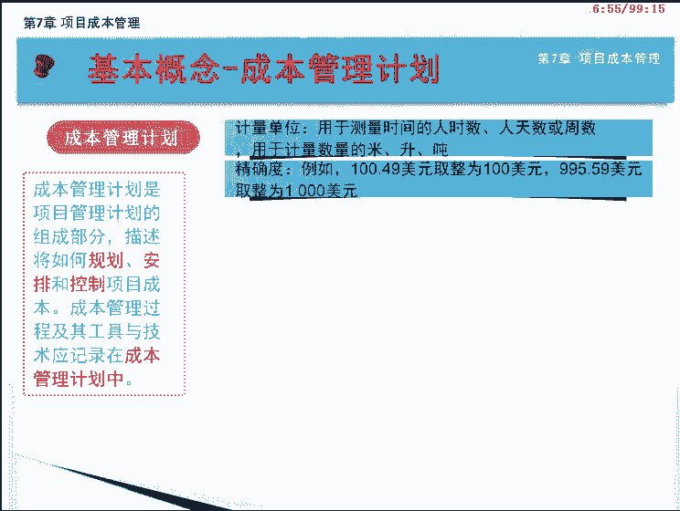

准确度。为活动成本估算规定一个可接受的区间，如正负10%。其中可能包括一定数量的应急储备。组织程序链接。工作分解结构为成本管理计划提供了框架，以便据此规范的开展成本估算、预算和控制。

在项目成本核算中使用的WBS组件称为控制账户，每个控制账户都有唯一的编码或账号，直接与执行组织的会计制度相联系。控制临界值。可能需要规定偏差临界值，用于监督成本绩效。

他是在需要采取某种措施前允许出现的最大偏差，通常用偏离基准计划的百分数来表示。绩效测量规则。需要规定用于绩效测量的正职管理规则。应包括定义WBS中用于绩效测量的控制账户，确定你用的正值测量技术。

并规定跟踪方法和用于计算项目完工估算EAC的正值管理公式。报告格式需要规定各种成本报告的格式和编制频率。过程描述对其他每个成本管理过程进行书面描述。其他细节。是关于成本管理活动的其他细节，包括。

对战略筹资方案的说明，处理汇率波动的程序以及记录项目成本的程序。规划成本管理是为规划管理、花费和控制项目成本而制定政策程序和文档的过程。

本过程的主要作用是在整个项目中，为如何管理项目成本提供指南和方向。接下来让我们来看看成本管理计划是如何被制定出来的。规划成本管理就是依据项目管理计划中已有的子计划，结合项目章程。

使用专家判断和分析技术得到最终的子计划成本管理计划。这是规划成本管理过程的数据流向图，可以看到，该过程通过输入输出与其他过程进行交互。

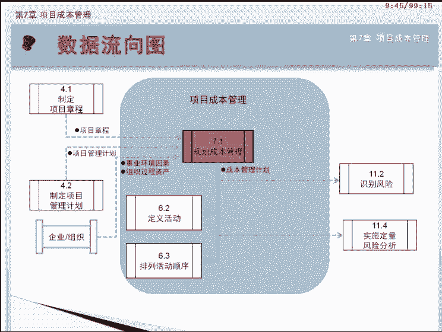

规划成本管理过程共有4个输入，分别是项目管理计划、项目章程、事业环境因素以及组织过程资产。下面我们依次来了解他们。

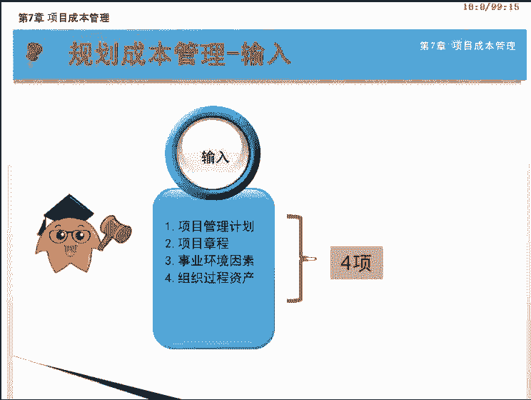

第一个输入是项目管理计划。项目管理计划中用以制定成本管理计划的信息，包括范围基准。范围基准，包括项目范围说明书和WBS详细信息，可用于成本估算和管理。进度精准。进度基准定义了项目成本将在何时发生。

其他信息。项目管理计划中与成本相关的进度、风险和沟通决策等信息。

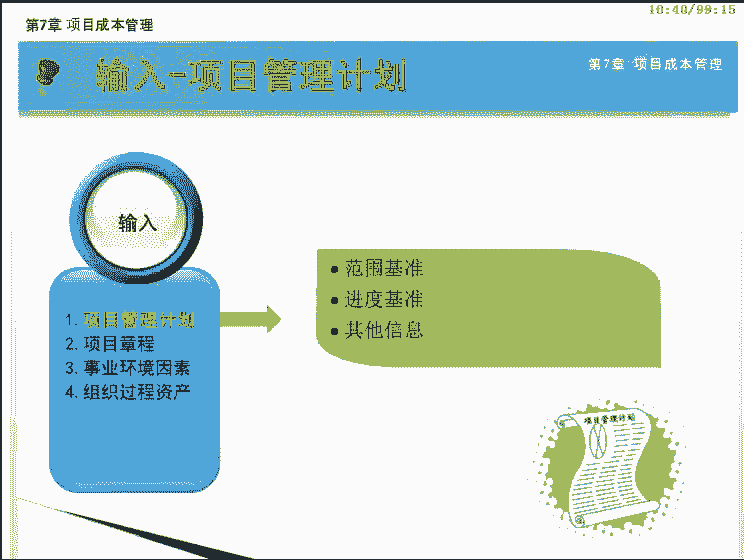

项目章程规定了项目总体预算，可据此确定详细的项目成本。项目章程所规定的项目审批要求也对项目成本管理有影响。

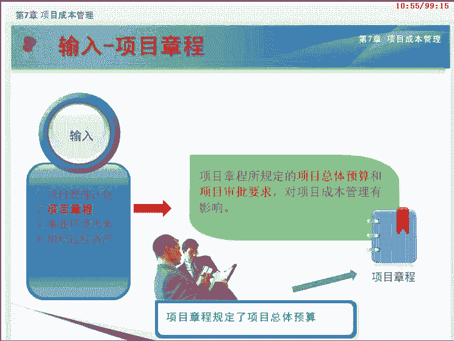

会影响规划成本管理过程的事业环境因素。包括。能影响成本管理的组织文化和组织结构。市场条件，这决定着在当地及全球市场上可获取哪些产品服务和成果。货币汇率用于换算发生在多个国家的项目成本。

发布的商业信息经常可以从商业数据库中获取资源成本、费率及相关信息。项目管理信息系统可为管理成本提供多种方案。

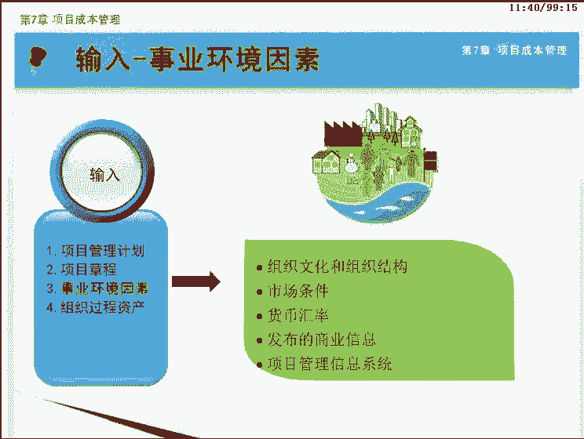

会影响规划成本管理的组织过程资产，包括财务控制程序，如定期报告、费用与支付审查、会计编码及标准合同条款等。历史信息和经验教训知识库。财务数据库。

现有的正式的和非正式的与成本估算和预算有关的政策程序和指南。

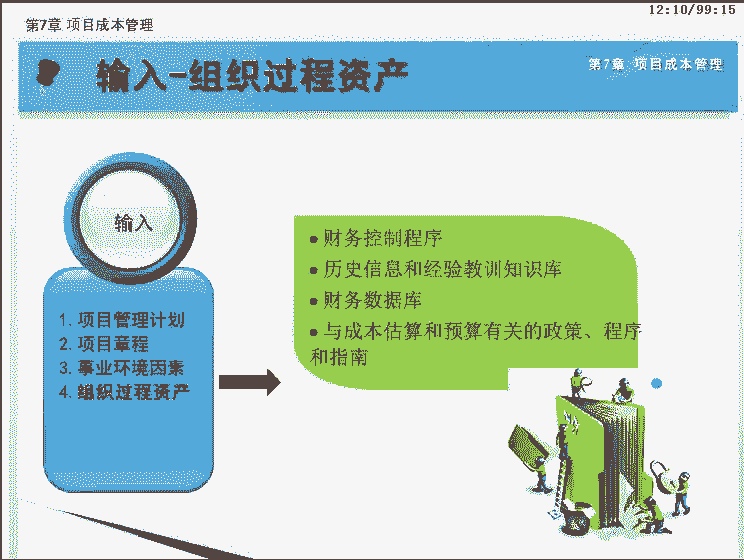

规划成本管理这个过程有三个工具与技术，分别是专家判断分析技术和会议，我们一块来学习。

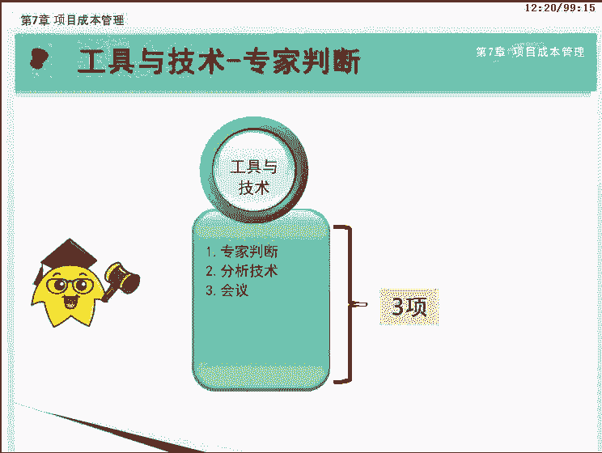

先来看专家判断。基于历史信息，专家判断，可以对项目环境及以往类似项目的信息提供有价值的见解。专家判断还可以对是否需要联合使用多种方法，以及如何协调方法之间的差异提出建议。针对正在开展的活动。

基于某种应用领域、知识领域、学科行业等的专业知识而做出的判断，应该用于制定成本管理计划。分析技术是一类技术的统称，在制定成本管理计划时，可能需要选择项目筹资的战略方法，如自筹资金、股权投资、借贷投资等。

成本管理计划中可能也需详细说明筹集项目资源的方法，如自制采购、租用或租赁。组织政策和程序可能影响采用哪种财务技术进行决策。可用的技术包括回收期、投资回报率、内部收益率、现金流、贴现和净现值等。

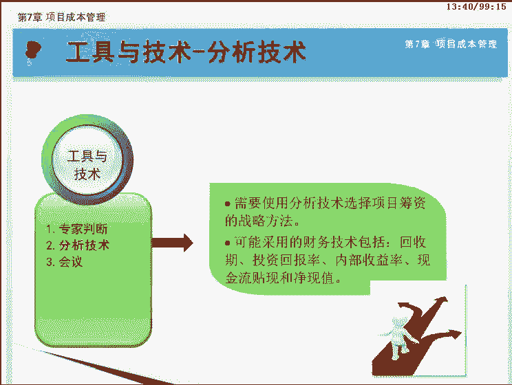

项目团队可能举行规划会议来制定成本管理计划。参会人员可能包括项目经理、项目发起人选定的项目团队成员、选定的干心人、项目成本负责人以及其他必要人员。

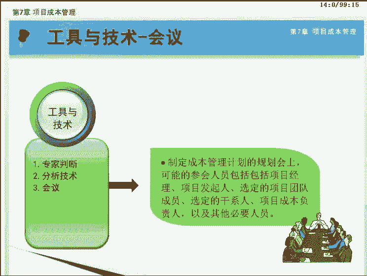

规划成本管理过程的输出是成本管理计划。在本过程开始的基本概念里面已经介绍过。

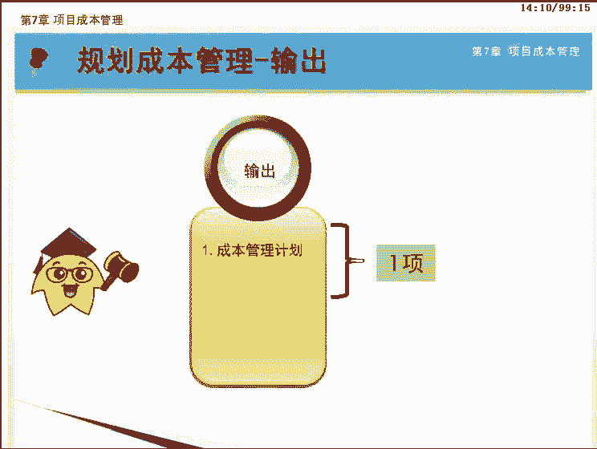

现在我们来回顾一下本过程的核心知识。规划成本管理在整个项目中对如何管理成本提供指南和方向。成本管理计划是项目管理计划的组成部分，描述将如何进行项目成本管理。

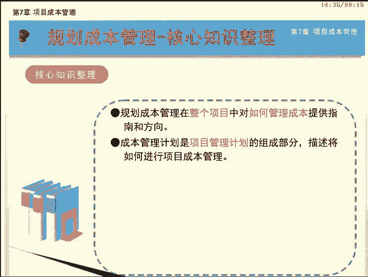

成本管理计划中，应该对项目中的计量单位、精确度、准确度等做出规定，还应指明与成本相关的控制临界值。制定成本管理计划的规划会上，可能需要各方面的干系人参与。恭喜你完成了规划成本管理过程的学习。

我们下节课见。本课程我们将一起学习第七章项目成本管理知识领域的第二节估算成本。

通过本课程的学习，我们将要达到以下目标。熟记估算成本的定义，并了解估算的内容。理解估算的精确等级的含义。掌握自下而上估算的含义和用法。熟记估算的支持信息包含的内容。熟记本过程的输入工具于技术及输出。

理解本过程中的PMI思维。

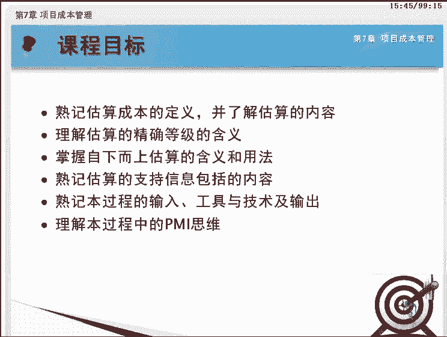

本课程我们将按照如画面所示的大纲为您讲述。首先是对估算成本的概念进行讲解。接下来是估算成本过程的输入，然后学习这个过程中所需要的不同的工具和技术。接下来我们会仔细为您讲解。估算成本过程的输出。

课程的最后是本课核心知识整理。

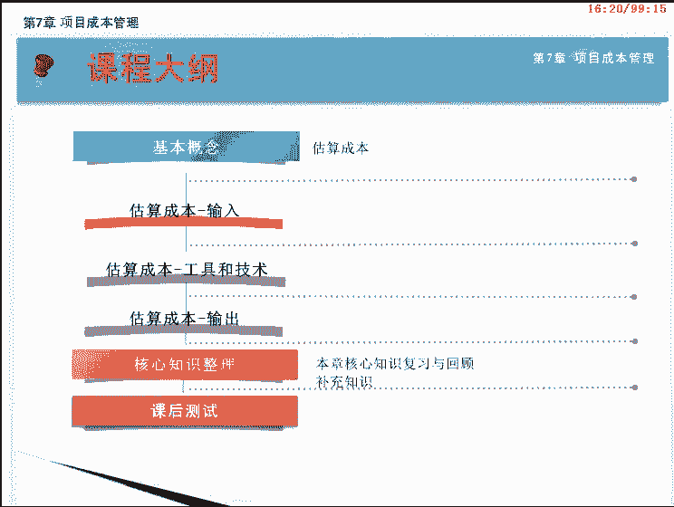

在学习本过程之前，我们先来学习估算成本的基本概念。估算成本是对完成项目活动所需资金进行近似估算的过程。本过程的主要作用是。确定完成项目工作所需要的成本数额。成本估算是在某特定时点。

根据已知信息所做出的成本预测。为了优化项目成本，在估算成本时，需要识别和分析，用于启动与完成项目的备选成本方案。还要权衡备选成本方案，并考虑风险，如比较自制成本与外购成本。

购买成本与租赁成本及多种资源共享方案，以优化项目成本。估算成本时所使用的单位通常用某种货币单位，如美元、欧元、日元等进行成本估算。

但有时也可采用其他计量单位，如人时数或人天数，以消除通货膨胀的影响，便于成本比较。

在项目生命周期中，项目估算的准确性将随着项目的进展而逐步提高，包括启动阶段的粗略级估算和规划后期的确定性估算。进行成本估算，应该考虑将向项目收费的全部资源。

包括人工材料、设备、服务设施以及一些特殊的成本种类，如通货膨胀补贴、融资成本或应急成本。成本估算是对完成活动所需资源的可能成本的量化评估。成本估算可在活动集呈现，也可以汇总形式呈现。

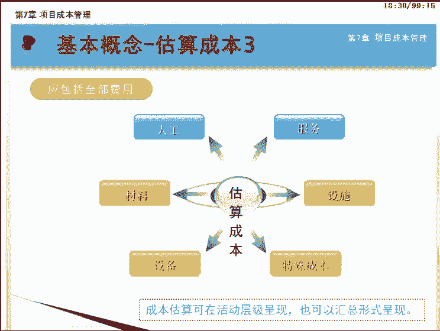

接下来让我们来看看如何估算成本。该过程在成本管理计划的指导下，以范围基准为基础，参照人力资源管理计划和项目进度计划。使用专家判断类比估算、参数估算等估算技术，利用项目管理软件生成活动的成本估算。

这是估算成本过程的数据流向图。可以看到，该过程通过输入输出与其他过程进行交互。估算成本过程共有7个输入。

他们是成本管理计划、人力资源管理计划范围基准、项目进度计划、风险登记册、事业环境因素和组织过程资产。

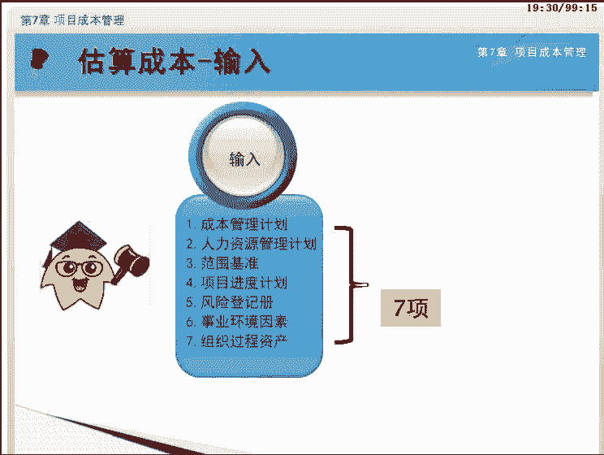

成本管理计划规定了如何管理和控制项目成本。包括估算活动成本的方法和需要达到的准确度。因此，估算成本的时候，主要的参考计划就是成本管理计划。

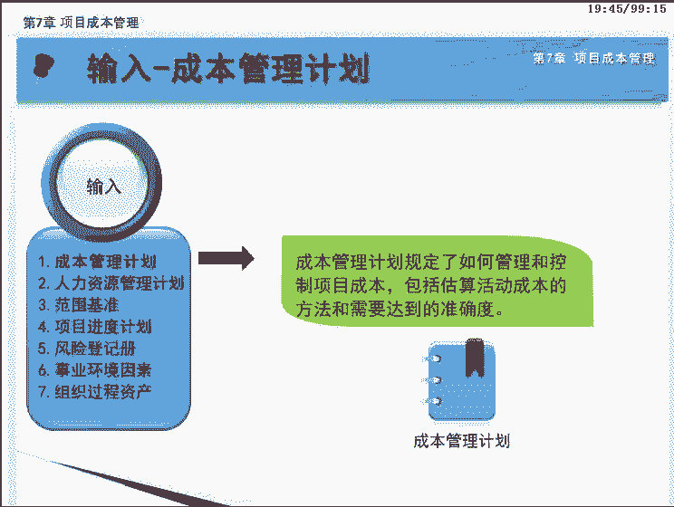

人力资源管理计划是组建项目团队过程的输出。提供了项目人员配备情况、人工费率和相关奖励认可方案。是制定项目成本估算时必须考虑的因素。从创建WPSS过程，我们知道。

范围基准包括三方面的内容及范围说明书、工作分解结构和工作分解结构词典。这三者的含义我们已经很清楚了，但是范围基准是如何影响成本的估算呢？范围说明书提供了产品描述、验收标准，主要可交付成果，项目边界。

特别是项目的假设条件和制约因素。这些会直接影响成本估算过程。另外。在估算项目成本时，必须首先确定估算将仅限于直接成本，还是也包括间接成本。WBS和WBS词典也是估算成本的一个重要的依据。

需要根据WBS组成部分和可交付成果之间的关系，以及WBS元素的详细信息来估算各个项目活动所需的成本。

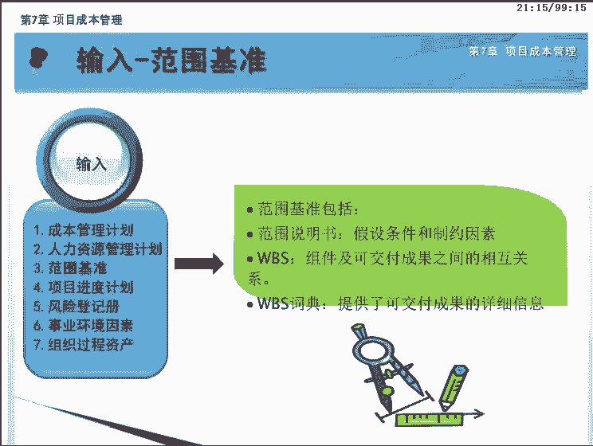

项目进度计划记录了进度活动所需的资源及其使用时间。这是估算成本过程的重要收入。因为项目工作所需的资源种类、数量和使用时间，都会对项目成本产生很大影响。在估算成本时，需要通过审查风险登记册。

考虑应对风险所需的成本。风险既可以是威胁，也可以是机会，通常会对活动及整个项目的成本产生影响。一般而言，在项目遇到负面风险事件后，项目的进期成本将会增加。有时还会造成项目进度延误。同样。

项目团队应该对可能给业务带来好处，如直接降低活动成本或加快项目进度的潜在机会保持敏感。

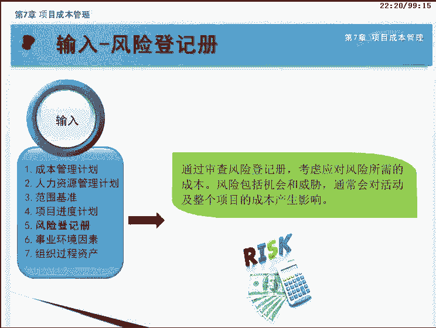

会影响估算成本过程的事业环境因素。包括。市场条件。可以从市场上获得什么产品服务和成果，可以从谁那里以什么条件获得。发布的商业信息。经常可以从商业数据库中获取资源成本费率及相关信息。

这些数据库动态跟踪具有相应技能的人力资源的成本数据，也提供材料与设备的标准成本数据。还可以从卖方公布的价格清单中获取相关信息。会影响估算成本过程的组织过程资产。包括。成本估算政策。

成本估算模板、历史信息以及经验教学。

估算成本这个过程有10个工具和技术，分别是专家判断类比估算自下而上估算三点估算储备分析、质量成本、项目管理软件。卖方投标分析以及群体决策技术。下面我们来一块学习。

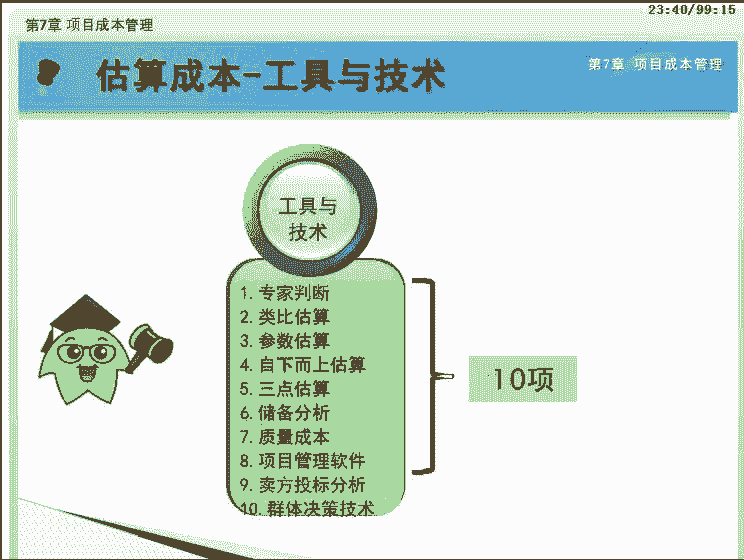

基于历史信息，如人工费率和通货膨胀等，专家判断可以对项目环境及以往类似项目的信息提供有价值的见解。专家判断还可以对是否联合使用多种估算方法，以及如何协调方法之间的差异做出决定。

成本类比估算是指以过去类似项目的参数值或规模指标为基础来估算当前项目的同类参数或指标。类比估算是粗略估算技术，常在项目早期信息不足时使用。他的特点是成本低，耗时少，但准确性低。

该方法综合利用了历史信息和专家判断。参数估算我们在上一个知识领域也介绍过。

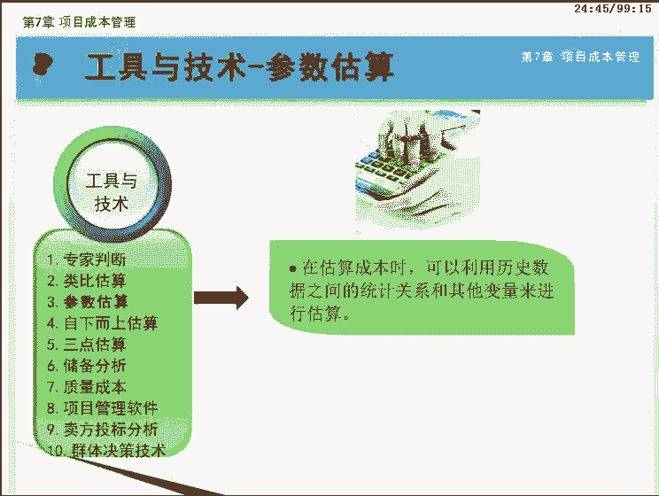

在估算成本时，可以利用历史数据之间的统计关系和其他变量来进行估算。参数估算的准确性取决于参数模型的成熟度和基础数据的可靠性。参数估算可以针对整个项目或项目中的某个部分。

自下而上估算是对工作组成部分进行估算的一种方法。可在项目规划中后期使用。估算成本相对较多，耗时长准确性也较高。

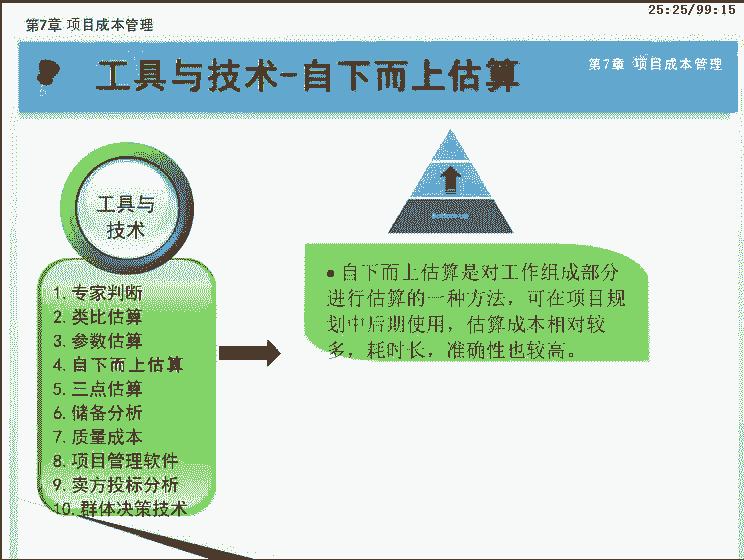

再把WBS分解为更细化的部分的基础上。对单个工作包或活动成本进行最具体细致的估算。然后把这些细节性成本向上汇总或滚动到更高层次，得到总投入，用于后续报告和跟踪。

自下而上估算法的准确性及其本身所需的成本取决于单个尔活动或工作包的规模和复杂程度。三点估算这种技术，我们在前一章估算活动持续时间时用到过。他也可以用于估算成本。通过考虑估算中的不确定性与风险。

使用三种估算值来界定活动成本的近似区间。最可能成本CM对所需进行的工作和相关费用进行比较现实的估算所得到的活动成本。

最乐观成本CO基于活动的最好情况所得到的活动成本。最悲观成本CP基于活动的最差情况所得到的估算成本。根据最新的PM报告指南第5版。基于三个基础值，可以使用两个常用公式来计算预期成本CE。

三角分布的公式是CE等于CO加上CM加上CP除以3。贝塔分布的公式是CE等于COO加上4倍的CM加上CP除以6。PMP考试时要特别留意题目要求的计算方法，默认情况下，建议采用贝塔分布的计算公式。

因为它源自传统的pro的技术。到现在为止，我们学过的有关估算的典型工具与技术有类比估算自下而上估算参数估算和专家判断。类比估算速度快，成本低，但估算结果不是很准确，一般归于自上而下的估算范畴。

自下而上估算，基于项目的实际情况精度高，但费时耗利。参数估算虽然简单灵活，但在很大程度上都依赖于所建立的参数模型和数据质量。专家判断可在信息不足时使用，但依赖于专家的主观看法，容易产生偏见。

画面中是对这几种估算技术的优缺点做的详细比较，需要仔细阅读，并回顾这几种工具技术的含义和用法。需要深入了解这几种工具技术，因为这是考试必考的内容。为了应对成本方面的不确定性，往往需要预留一些成本。

这就是储备分析应该回答的问题。储备可以分为应急储备和管理储备，我们下面会详细解释。先来看应急储备的概念。应急储备是包含在成本基准内的一部分预算，用来应对已经接受的已识别风险。

以及已经制定应急或减轻措施的已识别风险。应急储备与已知已知风险相关，需要加以合理估算，用于完成未知的工作量。随着项目信息越来越明确，可以动用、减少或取消应急储备。

下面我们再来看管理储备的概念。管理储备是为管理控制的目的而特别流出的项目预算，用来应对项目范围中不可预见的工作。管理储备用来应对，会影响项目的未知未知风险。管理储备不包括在成本基准中。

但属于项目总预算和资金需求的一部分。使用管理储备可能需要变更成本基准。成本质量是为保证质量符合要求而付出成本的一种方法。在估算活动成本时，可能要用到关于质量成本的各种假设。

这种技术我们会在第八章项目质量管理的规划质量管理过程中深入讲解。项目管理软件能简化某些成本估算技术的使用，使人们能快速考虑多种成本估算方案。

项目管理软件包括项目管理、应用软件、电子表单、模拟和统计工具等，可用来辅助成本估算。在成本估算过程中，可能需要根据合格卖方的投标情况，分析项目成本。这种技术就是卖方投标分析。

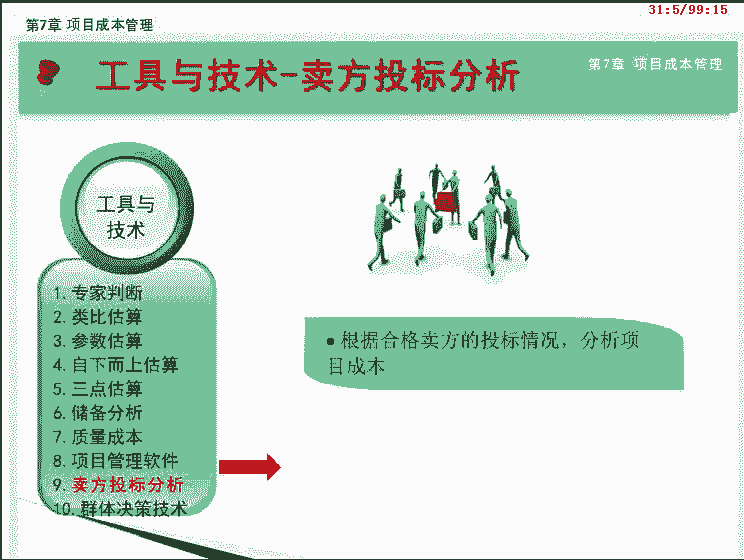

在用竞争性招标选择卖方的项目中，项目团队需要开展额外的成本估算工作，以便审查各项可交付成果的价格，并计算出组成项目最终总成本的各分项成本。群体决策技术是估算成本时可以利用的一类技术。

主要指基于团队的方法。如我们前面介绍过的头脑风暴、德尔菲技术或名义小组技术。这些方法可以调动团队成员的参与，以提高估算的准确度，并提高对估算结果的责任感。选择一组与技术工作密切相关的人员参与估算过程。

可以获取额外的信息，得到更准确的估算。另外，让成员亲自参与估算，能够提高他们对实现估算的责任感。估算成本过程共有3个输出，分别是活动成本估算、估算依据以及项目文件更新。下面我们逐一介绍。

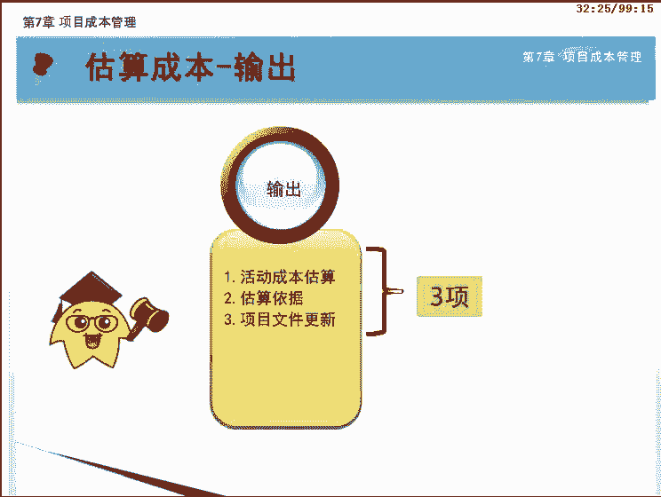

活动成本估算是对完成项目可能需要的成本的量化估算。在形式上，对活动成本的估算可以是汇总的，也可以是详细分列的。在内容上，对活动成本的估算应该。覆盖活动所使用的全部资源。

比如人工材料、设备特殊的成本种类等。

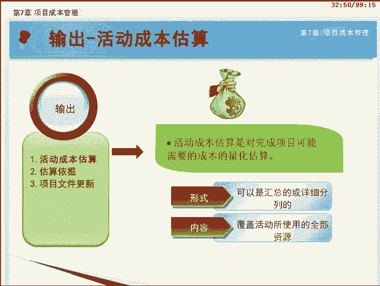

如果对活动成本的估算还涉及到间接成本，可以在WBS中的活动层次或者更高的层次上，比如工作包等来估算间接成本。成本估算所需的支持信息的数量和种类可能会因应用领域而异。不管其详细程度如何。

支持文件都应该能清晰完整的说明成本估算是如何得出的。具体来说。用于支持活动成本估算的信息包括。关于估算依据的文件，比如估算是如何编制的。关于全部假设条件的文件，比如假设年通货膨胀率是40%。

关于各种已知制约因素的文件，如有限的项目预算等等。对估算的区间说明，比如1万美元加减10%，就说明了预期成本的所在区间为9000美元到11000美元之间。还有对最终估算的致信水平的说明。

比如98%的可信度等。在估算成本过程，可能需要更新的项目文件，包括风险登记册等。

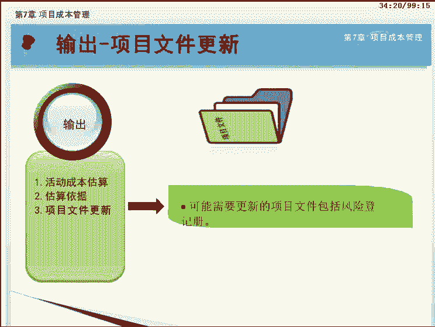

本过程的主要内容到此完毕。现在我们来回顾一下本过程的核心知识。估算成本是对完成项目活动所需资金进行近似估算的过程。估算成本的目的是确定完成项目工作所需的成本数额。在项目生命周期中。

项目估算的准确性将随着项目的进展而逐步提高。进行成本估算，应该考虑将向项目收费的全部资源。

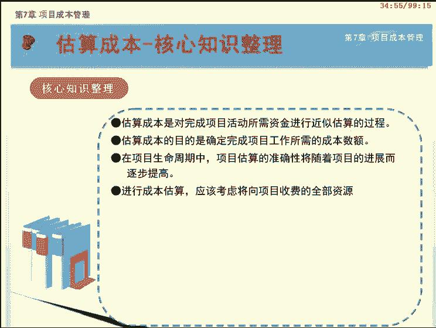

自下而上估算是对工作组成部分进行估算的一种方法，可在项目规划中后期使用。预留的储备可以分为应急储备和管理储备。随着项目信息越来越明确，可以动用减少或取消应急储备。

活动成本估算是对完成项目可能需要的成本的量化估算。恭喜你完成估算成本过程的学习，我们下节课见。本课程我们将一起学习第七章项目成本管理知识领域的第三节制定预算。

通过本课程的学习，我们将要达到以下目标。包括。熟记制定预算的含义，理解应急储备和管理储备的区别。理解成本绩效基准支出与资金需求之间的关系，熟记本过程的输入、工具与技术和输出。

本课程我们将按照如图所示的大纲为您讲述。首先是对几个基本概念，设定预算应急储备和管理储备进行讲解。接下来分析该过程的输入，然后学习这个过程所需要的不同的工具和技术。接下来我们会仔细为您讲解该过程的输出。

课程的最后是本课核心知识整理。

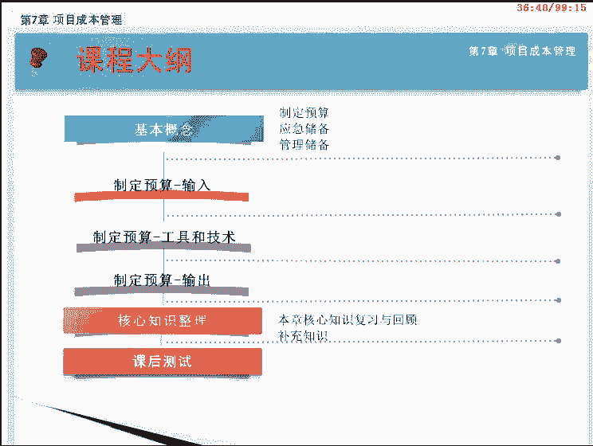

有时候特别是小项目中估算成本和制定预算两个过程，可视为同一个过程，甚至可以由同一个人在较短的时间内完成。那么，估算成本和制定预算两个过程究竟有什么区别呢？本过程我们就来学习制定预算。

一起来分析估算成本和制定预算的异同。在学习制定预算过程之前，我们先来了解三个基本概念，制定预算应急储备和管理储备。其中后两个概念我们在前面已经介绍过一次。

制定预算是汇总所有单个活动或工作包的估算成本。建立一个经批准的成本基准的过程。本过程的主要作用是确定成本基准，可据此监督和控制项目绩效。制定预算的一个重要依据是工作分解结构。

是根据工作分解结构以及分解后的活动等各个层级来进行汇总的。首先应该计算出各进度活动所需要的成本，一般由实际从事该活动的员工来做相关计算。然后将项目活动的成本汇总到它的上一层。

也就是工作包得出工作包的成本。第三步是将工作包的成本继续向工作分解结构的上一层汇总，得到控制账户的成本。把控制账户的成本汇总起来，就得到了整个项目的成本。最后，在项目成本的基础上。

还要加上一定的不可预见的费用及应急储备。在这些费用得到批准后，才能得到项目的成本基准，也就是成本预算。我们再一次详细解释应急储备的概念。应急储备是为未规划，但可能发生的变更提供的补贴。

这些变更由风险登记册中所列的已知的未知风险引起，也就是预期但不确定的风险事件。应急储备的开支由项目经理掌握，项目经理可不经高级管理层或项目发起人批准，便可使用该应急储备。应急储备主要用于估算成本过程。

关于已知的未知风险和未知的未知风险，我们在风险管理中再详细讲解。而管理储备则是为未规划的范围变更与成本变更而预留的预算。管理储备针对的风险是完全未知的，称为未知的未知风险。

及项目管理团队根本不知道这个风险是否发生，也就是风险事件不知道。管理储备由项目所在组织控制。项目经理如果要使用管理储备，必须得到高级管理层或项目发起人的批准。管理储备主要用于制定预算，不属于成本基准。

也不纳入后面要讲的正值计算。一般来说，多数项目不需要动用管理储备，但一旦动用，需要投入的资金储备量会很多。

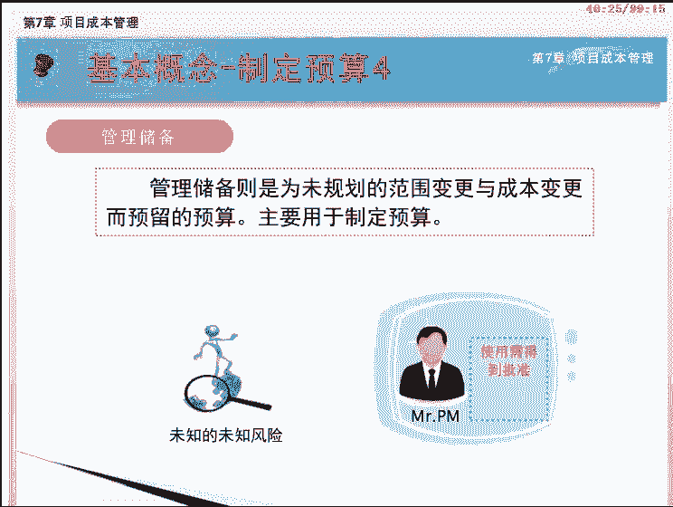

画面中的表是对应急储备和管理储备在所属过程应对事件类型等方面做的一个比较，请自己对比记忆理解。需要注意的是，应级储备属于成本基准，而管理储备不属于成本基准。但它属于项目总预算的范围。

成本基准加上管理储备，才是项目总预算。接下来让我们来看看如何制定预算。该过程在成本管理计划的指导下，利用活动成本估算的结果。结合范围基准及进度计划，同时还要把风险考虑进来。

再利用成本汇总、储备分析等技术，最终形成成本基准。这是制定预算过程的数据流向图。可以看到，该过程通过输入输出与其他过程进行交互。制定预算过程共有9个输入，分别是成本管理计划范围基准。

活动成本估算、估算依据、项目进度计划、资源日历、风险登记册、协议和组织过程资产。下面我们依次来介绍。

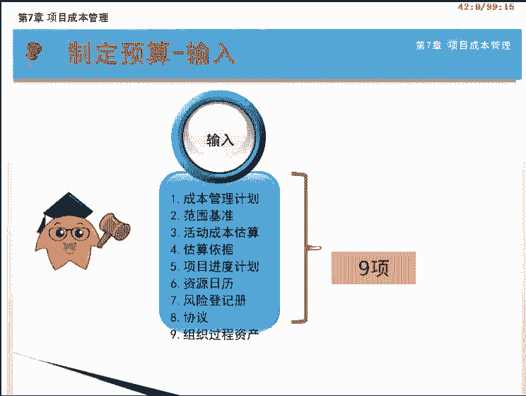

成本管理计划来自规划成本管理过程，描述将如何管理和控制项目成本。

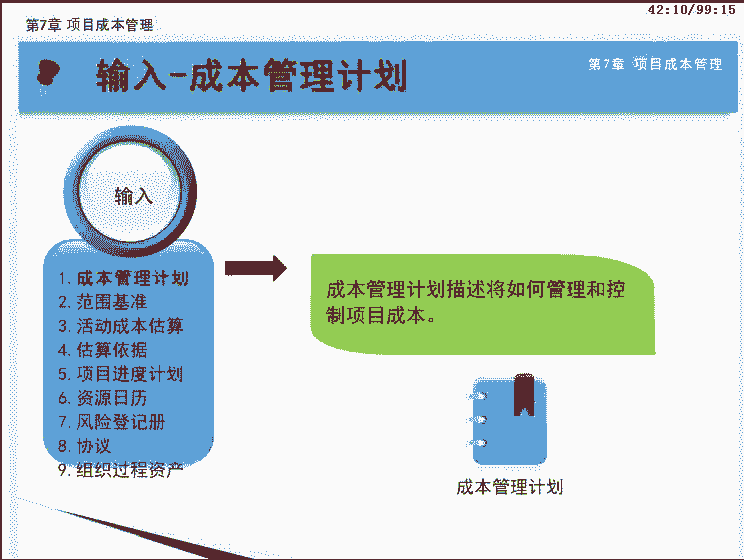

从创建WBS过程，我们知道范围基准，包括三方面的内容及范围说明书、工作分解结构和工作分解结构词典。这三者都会影响预算的制定。首先，项目范围说明书中的资金制约因素。

包括组织协议或其他机构可能对项目资金支出施加正式的阶段性限制。还有工作分解结构。WBS指明了项目全部可交付成果及其各组件之间的相互关系。最后，在WBS词典和相关的工作详细说明中。列出了可交付成果。

并描述了为产出可交付成果WBS各组件所需进行的工作。

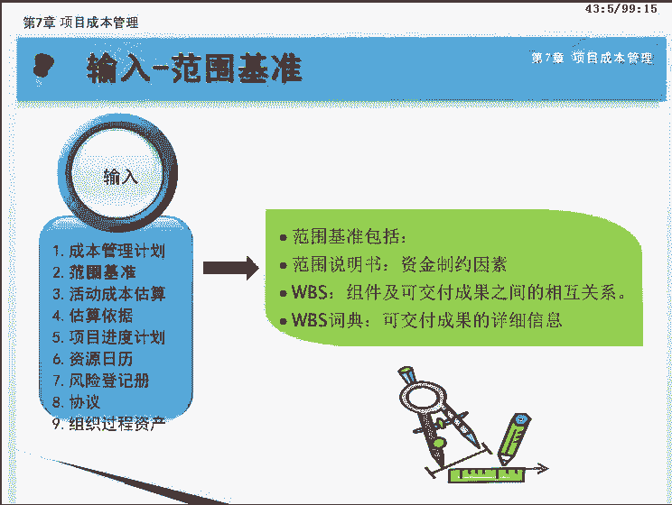

以上这些都会影响预算的制定。活动成本估算和估算依据来自于估算成本过程。活动成本估算是指各种工作包内每个活动的成本估算汇总后，得到各工作包的成本估算。估算依据列出了在估算依据中包括的基本假设条件。

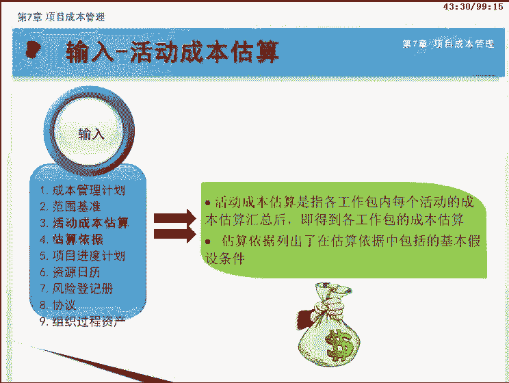

项目进度计划包括项目活动、里程碑、工作包和控制账户的计划开始和完成日期。可根据这些信息，把计划成本和实际成本汇总到相应的日历时段中。资源日历来自于组建项目团队过程和实施采购过程。

规定了在项目期间的资源可用性。从资源日历中了解项目资源的种类和使用时间，可根据这些信息确定项目周期各阶段的资源成本。风险登记册来自于风险管理知识领域，应该审查风险登记册，从而确定如何汇总风险应对成本。

对风险登记册的更新包含在项目文件更新中。协议是实施采购过程的输出，在制定预算时，需要考虑将要或已经采购的产品服务或成果的成本以及适用的协议信息。会影响制定预算过程的组织过程、资产。包括。

现有的正式和非正式的与成本预算有关的政策程序和指南。成本预算工具以及报告方法。

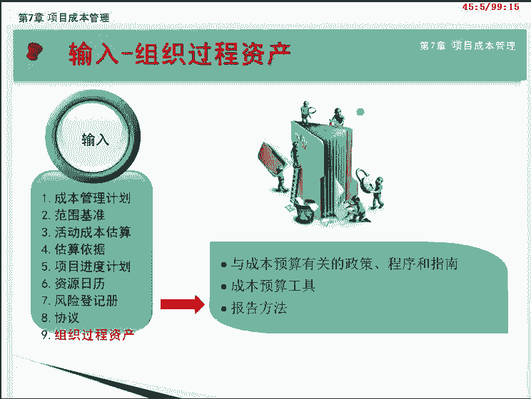

制定预算过程有5个工具和技术，分别是成本汇总、储备分析、专家判断历史关系和资金限制平衡。下面我们一块来学习。

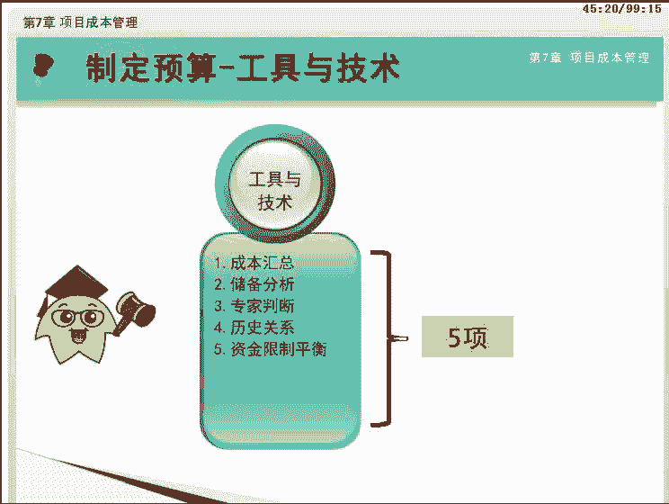

在讲解制定预算的概念时，我们已经了解了制定预算的过程，也知道了，制定预算是以WBS为依据，将项目活动的成本汇总起来。因此，成本汇总首先以WBS中的工作包为单位，对活动成本估算进行汇总。

然后再由工作包汇总至WBS的更高层次，如控制账户等。并最终得出整个项目的总成本。

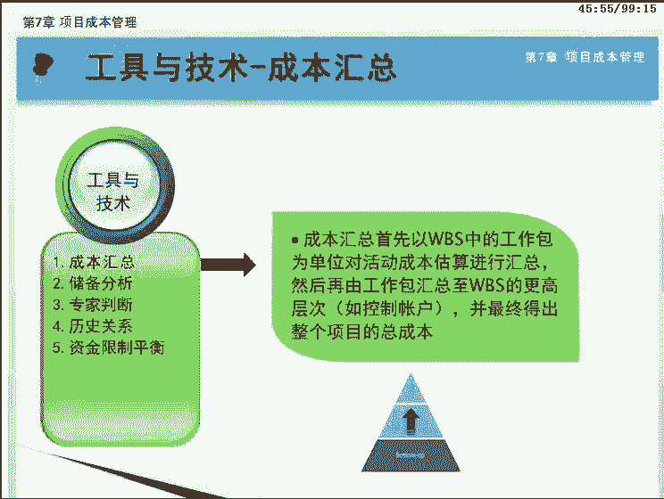

在制定预算时，通过预算储备分析，可以计算出项目的应急储备与管理储备。管理储备和应急储备的含义，我们已经在基本概念部分详细介绍过。专家判断是我们熟知的技术。

基于应用领域、知识领域、学科、行业或相似项目的经验，专家判断可对制定预算提供帮助。专家判断的来源非常广泛，可来自受过专门教育或具有专门知识、技能、经验或培训经历的任何小组或个人。

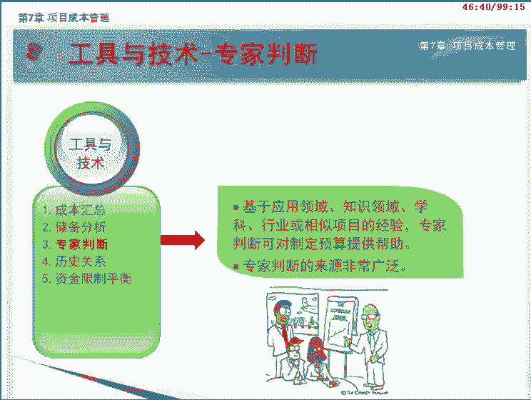

先来看什么是历史关系。在现实世界中，变量之间可能存在一些可据以进行参数估算或类比估算的关系，这就是历史关系。可以基于这些历史关系，利用项目特征来建立数学模型，预测项目总成本。数学模型可以是简单的，例如。

建造住房的总成本取决于单位面积建造成本。也可以是复杂的。例如，软件开发项目的成本模型中有多个变量，且每个变量又受许多因素的影响。

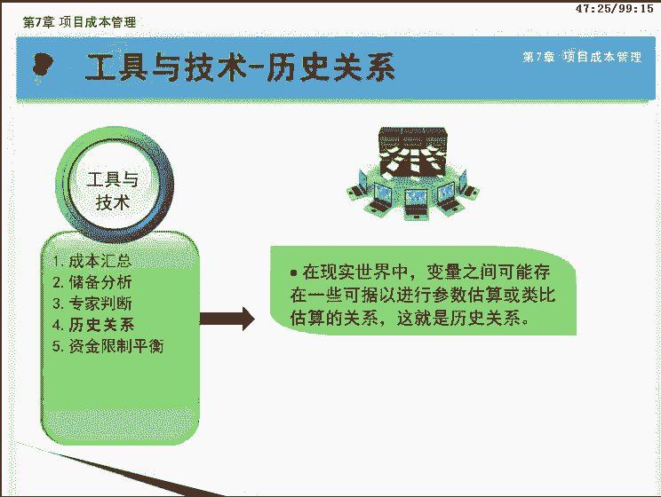

在进行类比估算或参数估算时，怎样才能使估算结果更加可靠呢？需要注意以下3点。第一，用来建立模型的历史信息准确。第二，模型中的参数易于量化。第三，模型可以调整，以便对大项目、小项目和各项目阶段都适用。

任何项目的资金都不是没有限制的，在制定项目预算时，应该根据对项目资金的限制来平衡资金支出。如果发现资金限制与计划支出之间的差异，则可能需要调整工作的进度计划，以平衡资金支出水平。

这可以通过在项目进度计划中添加强制日期来实现资金限制平衡。制定预算这个过程共有3个输出，他们是成本基准，项目资金需求、项目文件更新。下面我们一块来学习。

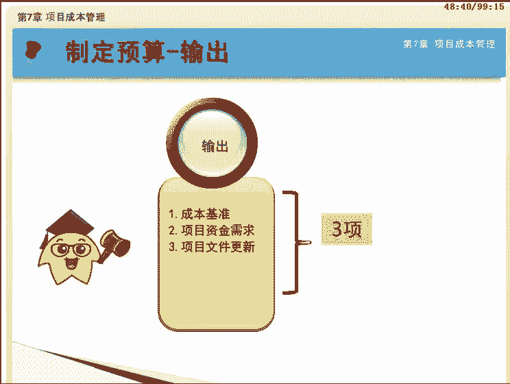

在制定预算时，把不同进度活动经批准的预算进行累加，最后可以得到整个项目的成本基准。

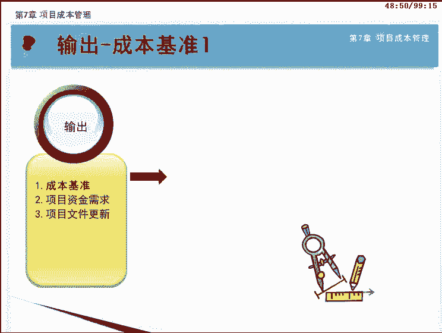

成本基准是经批准的，按时间段分配的项目预算，不包括任何管理储备。只有通过正式的变更控制程序才能变更，用作与实际结果进行比较的依据。

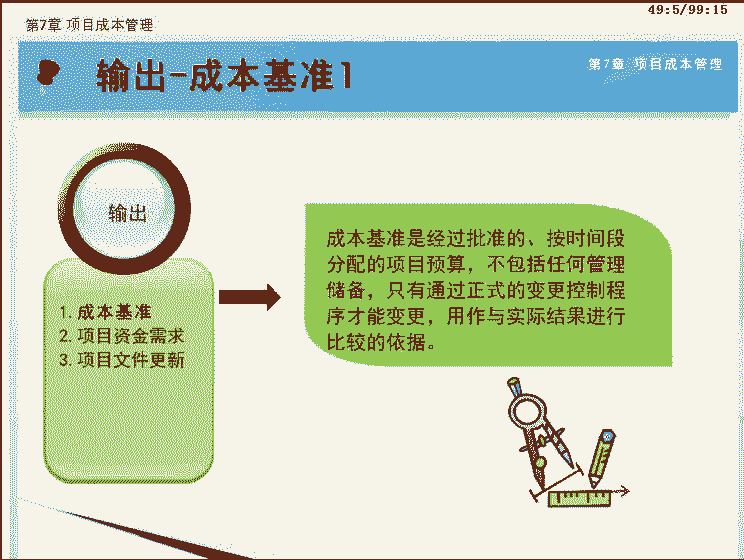

下面我们来学习项目预算和成本基准的各个组成部分是如何得到的。先汇总各项目活动的成本估算及其应急储备。得到相关工作包的成本。然后汇总各工作包的成本估算以及应急储备，得到控制账户的成本。

在汇总各控制账户的成本得到成本基准。最后，在成本基准之上增加管理储备，得到项目预算。当出现有必要动用管理储备的变更时，则应在获得变更控制过程的批准之后，把适量的管理储备移入成本基准中。

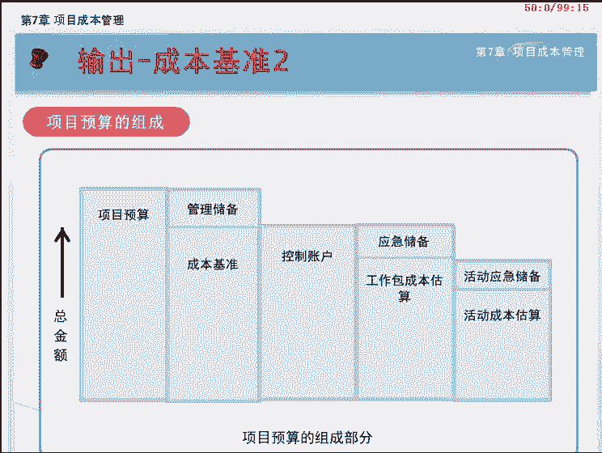

由于成本基准中的成本估算与进度活动直接关联，因此就可按时间段分配成本基准，得到一条S曲线。因此，我们需要知道，成本基准不是一个具体的值，而是由按时间段连续排列的值所组成的一条曲线。

从图中我们看到管理储备是在基准之外的资金预算，它包含在总的项目预算中。从图中我们还可以看到，项目的实际支出超出了成本基准，但还是在项目预算之内的。

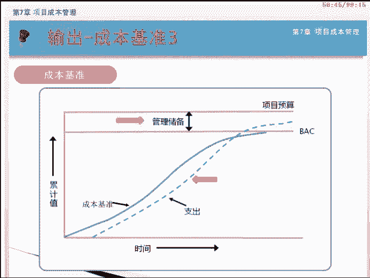

根据成本基准确定总资金需求和阶段性资金需求。成本基准中既包括预计的支出，也包括预计的债务。项目资金通常以增量而非连续的方式投入，并且可能是非均衡的。在资金需求文件中，也可说明资金的来源。

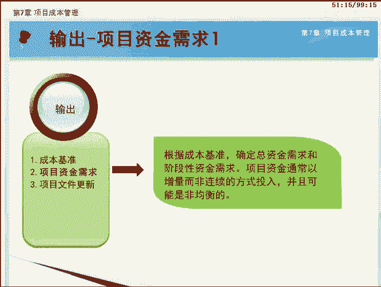

如图所示，红色的阶梯型线就是资金需求。如果有管理储备，则总资金需求等于成本基准，加上管理储备。

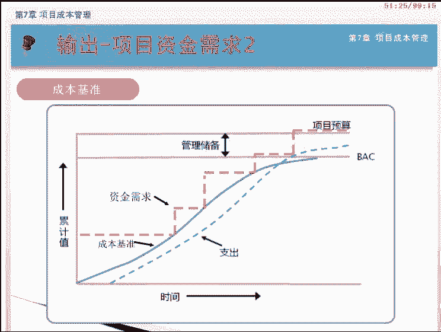

在制定预算过程，可能需要更新的项目文件，包括风险登记册、活动成本估算以及项目进度计划等。

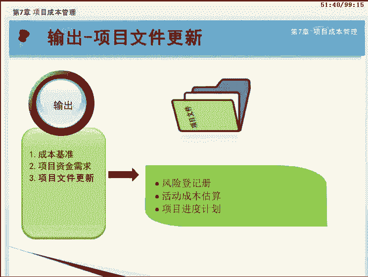

好了，现在我们来回顾一下本过程的核心知识。制定预算是汇总所有单个活动或工作包的估算成本，建立一个经批准的成本基准的过程。应急储备是由风险登记特征所列的已知的未知风险引起的，由项目经理掌握。

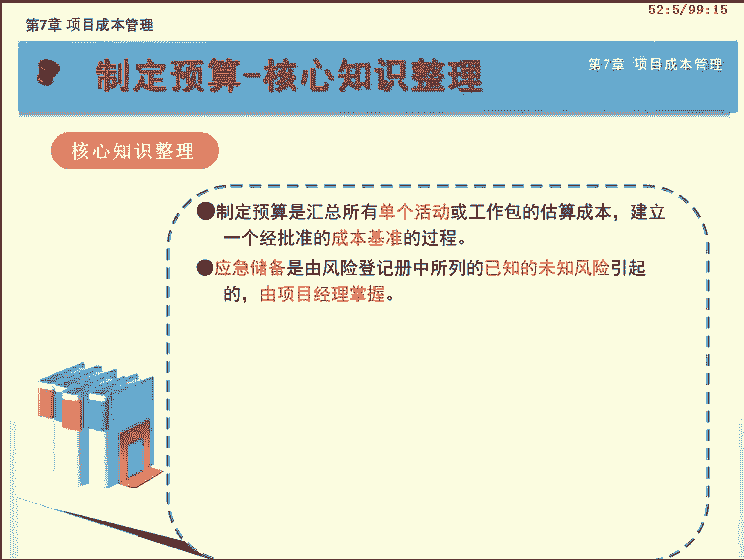

管理储备则是为未知风险准备的。项目经理，如果要使用管理储备，必须得到高级管理层或项目发起人的批准。制定预算时，首先对活动成本进行汇总，然后再由工作包汇总至WBS的更高层次，最终得出整个项目的总成本。

成本基准是经过批准的，按时间段分配的项目预算，不包括管理储备。恭喜你完成制定预算过程的学习，我们下节课见。本课程我们将一起学习第七章项目成本管理知识领域的第四节控制成本。

成本管理的四个过程分别分布在规划过程组和监控过程组中。在前面我们已经学习了规划过程组中的三个过程。本节我们来学习监控过程组的监控成本过程。

通过本课程的学习，我们将要达到以下目标，包括掌握控制成本过程的含义与作用。熟记本过程的输入工具与技术以及输出。掌握政直管理的基本概念。能够根据项目所给的数据计算各种指标。

比如会对不同情况下的ETC和EAC进行计算。掌握完工商学技效指数的计算方法，并明确这些指标所表达的含义。了解正值估算的一些常用规则。本课程我们将按照如画面所示的大纲为您讲述。

首先是对控制成本这个基本概念进行讲解。接下来分析控制成本过程的输入、工具和技术以及输出。课程的最后是本课核心知识整理。

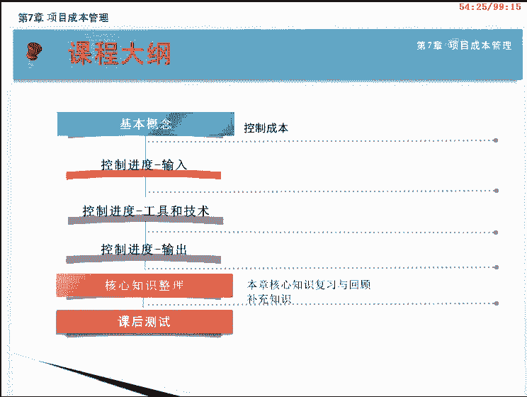

在学习本过程之前，我们先来看看什么是控制成本。控制成本是监督项目状态，以更新项目成本管理成本基准变更的过程。本过程的主要作用是发现实际与计划的差异，以便采取纠正措施，降低风险。

控制成本是实施整体变更控制的一部分。他的主要任务就是找出影响成本偏差的因素，更新项目预算管理成本基准变更。在控制成本过程中，对预算的管理要经过以下程序。首先需要记录截止目前为止的实际成本。

然后判断是否符合预算。如果符合，那么继续监控项目状态。对项目的成本进行记录。如果实际成本与预算不符合，则提交变更。只有经过实施整体变更控制过程的批准，才可以更新预算，然后继续监控项目状态，直到项目结束。

在成本控制中，应重点分析项目资金支出与相应完成的实体工作之间的关系。有效成本控制的关键在于，对经批准的成本绩效基准及其变更进行管理。

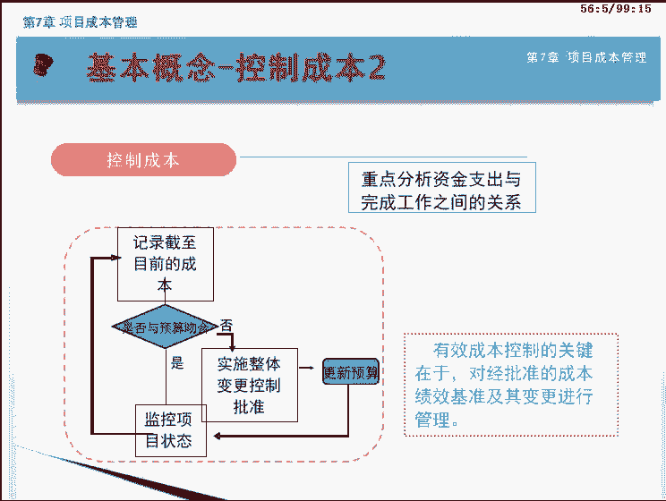

控制成本的内容包括管理变更和管理偏差两个主要部分。管理变更的工作包括。对造成成本基准变更的因素施加影响。确保所有变更请求都得到及时处理。当变更实际发生时，管理这些变更。

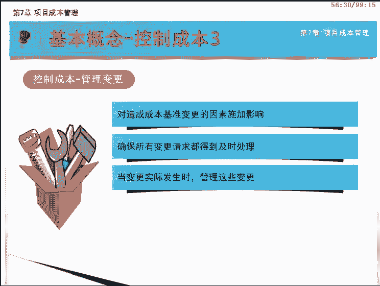

防止在成本或资源使用报告中出现未经批准的变更。向有关干系人报告所有经批准的变更及其相关成本。在控制成本过程中，管理偏差的工作包括。确保成本支出不超过批准的资金限额，即不超出按时段按WBS组建。

按活动分配的限额，也不超过项目总限额。监督成本绩效找出并分析与成本基准间的偏差。

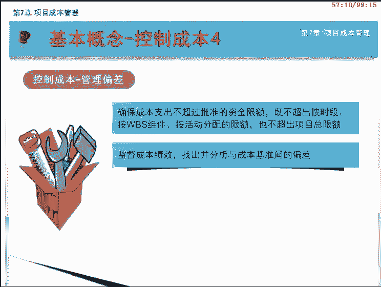

对照资金支出监督工作绩效。设法把预期的成本超支控制在可接受的范围内。接下来让我们来看看如何控制成本。该过程以项目管理计划中的成本基准和成本管理计划为基础，参照工作绩效数据。

利用正值管理和预测等工具和技术，把成本执行情况汇编为关于成本的工作绩效信息，并对未来的成本绩效进行预测。如果发现偏差较大，可能提出变更请求。这是控制成本过程的数据流向图，可以看到。

该过程通过输入、输出与其他过程进行交互。

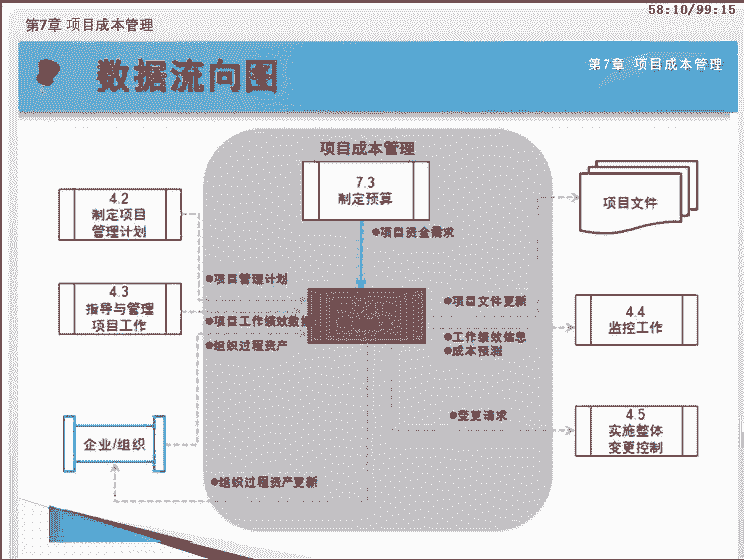

控制成本过程共有4个输入，分别是项目管理计划、项目资金需求、工作绩效数据和组织过程资产。下面我们依次来了解他们吧。

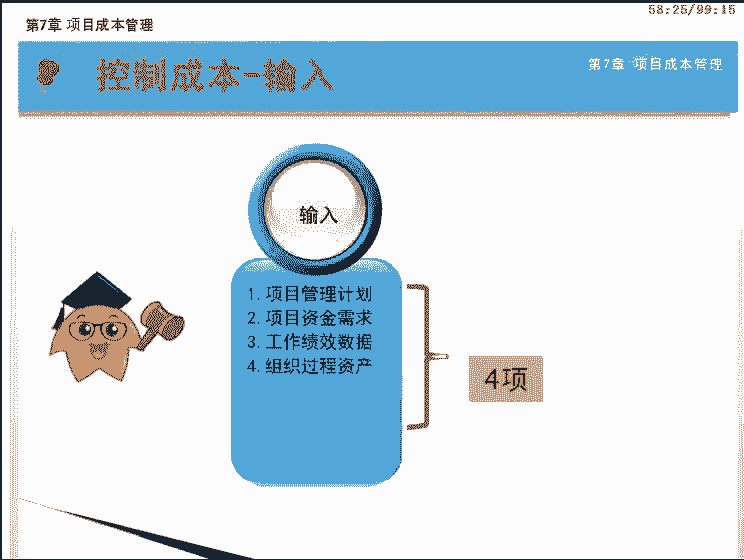

项目管理计划中包含的可用于控制成本的信息，包括成本基准和成本管理计划。成本基准把成本基准与实际结果相比，以判断是否需要进行变更或采取纠正或预防措施。成本管理计划。

成本管理计划规定了如何管理与控制项目成本的信息。项目资金需求来自于制定预算过程，包括预计支出，加上预计债务。

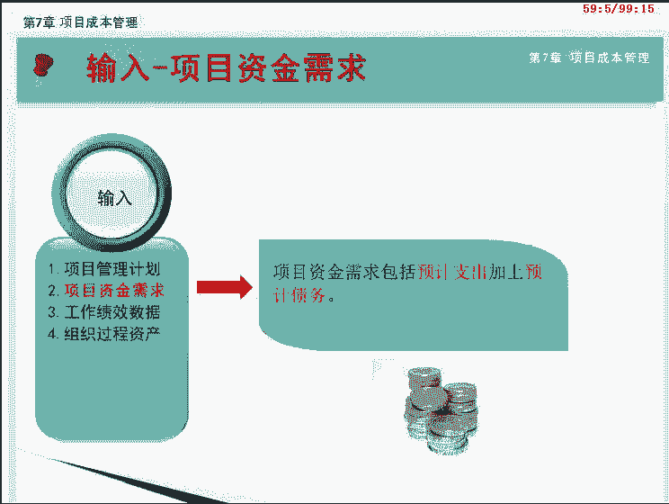

工作绩效数据是关于项目进展情况的数据，如哪些活动已开工进展如何，以及哪些可交付成果已完成，还包括已批准的成本和已发生的成本。他是在指导与管理项目工作过程产生的原始数据。会影响控制成本过程的组织过程资产。

包括现有的正式和非正式的与成本控制相关的政策程序和指南。还有成本控制工具以及可用的监督和报告方法。

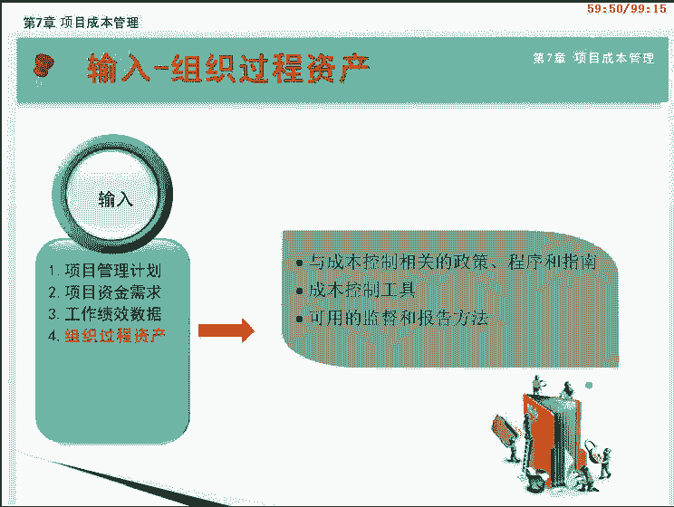

控制成本过程的工具和技术共有6个。分别是政值管理预测完工上需绩效指数、绩效审查、项目管理软件和储备分析。下面我们逐个讲解。

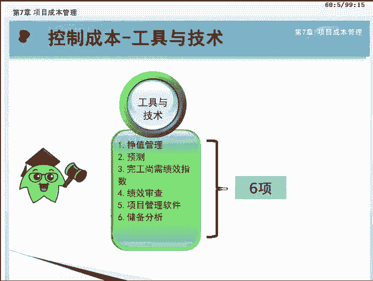

在控制成本的工具与技术中，我们首先要讲解的是政值管理。政治管理是一种常用的绩效测量方法，它综合考虑项目范围、资源绩效与进度指标，帮助项目管理团队评估与测量项目绩效和进展。

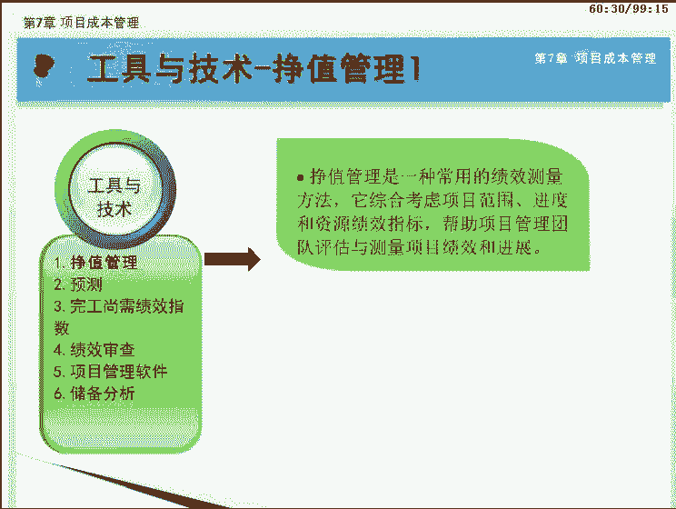

他把范围基准、成本基准和进度基准整合起来，形成绩效基准，以便项目管理团队评估和测量项目绩效和进展。也就是说，政治管理是在既定的范围之下来综合考虑时间和成本绩效。可以避免单独衡量时间或成本绩效的弊端。

正直管理要求人们不仅要问项目进展到了什么程度，还要问花了多少成本。政治管理是针对每个工作包和控制账户的。它的原理适用于任何行业的任何项目。在系统的讲述政值管理之前。

我先向大家介绍一个正在进行的项目的进展情况。小张打算简单装修一下现有的房屋。这个项目主要包括5项工作及设计、铺地、吊顶、安装门窗、粉刷墙壁。这些工作均按完成到开始的关系逐项进行，计划的总工期为10天。

预计的总费用为1万元。具体工作计划安排如表一所示。现在是第七天结束，项目的实际进展情况如表二所示。接下来请大家记住这两个表格，进入政直管理的学习。首先我们要了解的是政治管理中的几个基本概念。

计划价值、正值、实际成本和完工预算。这些概念是政治管理的基础，大家一定要理解并熟记。另外，正值反映的是任何一个时刻或时间点的项目绩效情况。

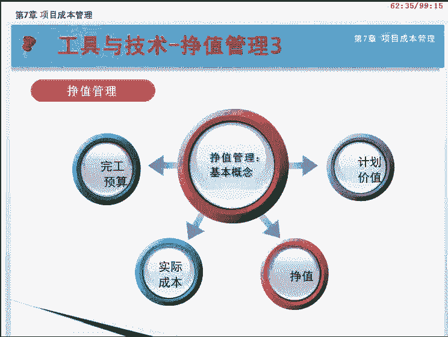

计划价值PV为某活动或工作分解结构组成部分的预计工作进度分配，且经批准的预算是计划完成工作的预算价值。计划价值应该与经批准的特定工作内容相对应。计划价值PV等于计划要完成的工作量乘以预算单价。

所以截止到第七天，小张的房屋装修项目按计划应该要完成的PV等于。百分之百乘以1000，加上百分之百乘以5000，加上百分之百乘以1000等于7000。同样，截止到第五天或第六天的PV也可以算出来。

正值EV。是项目活动或工作分解结构组成部分的已完成工作的价值，用分配给该工作的预算来表示。是实际已完成工作的预算价值。正值EV等于实际已完成的工作量乘以预算单价。所以截止到第七天。

小张的房屋装修项目的正值等于。百分之百乘以1000，加上百分之百乘以5000，加上70%乘以1000等于6700元。需要说明的是，正值的计算必须与计划价值PV相对应。

实际成本AC是为完成活动或工作分解结构组成部分的工作，而实际发生并记录在案的总成本。是已完成工作的实际成本。实际成本AC等于已完成的工作量乘以实际单价。截止到第七天。

小张的房屋装修项目的实际成本AC等于1100，加上5100，加上900等于7100元。

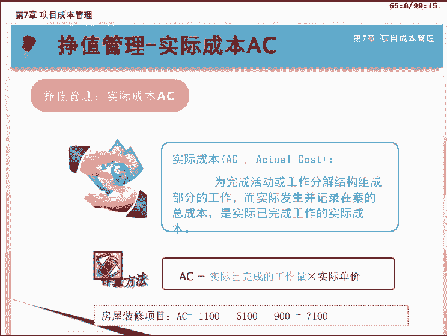

实际成本没有上限，为完成活动所花费的任何成本都要计算进去。完工预算BAC是项目工作工作分解结构组成部分或进度活动的所有预算之和及项目的总计划价值。文工预算有时被称为绩效测量基准PMB。

除非已得到批准进行变更，否则项目的完工预算一般不会变化。在房屋装修项目中，王工预算BAC等于1万元。接下来我们要学习两个政直管理中与成本相关的重要概念，他们是成本偏差CV和成本绩效指数CPI。

首先我们来看成本偏差CV。成本偏差是在某个指定时点的预算亏空或盈余量表示为正值与实际成本之差。成本偏差是项目成本绩效的一种指标，它等于正值EV减去实际成本AC。

成本偏差指明了实际绩效与成本支出之间的关系，所以十分重要。成本偏差是正值，表示对预算的节约。负值表示对预算成本的超支。负的成本偏差一经发生，一般都是不可弥补的。

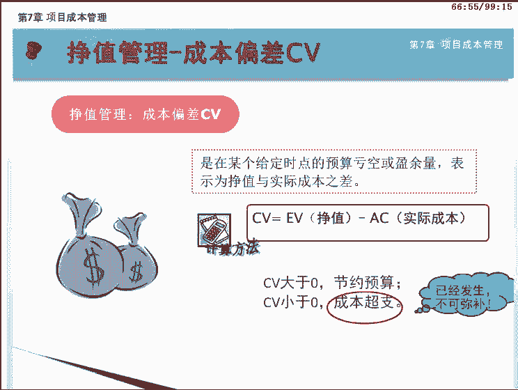

项目结束时的成本偏差就是完工预算BAC与实际总成本之间的差值。前面我们已经计算得到房屋装修项目的正值。为6700，实际成本为7100。由此我们可以算出。房屋装修项目的成本偏差。

CV等于6700减去7100等于负的400。可以看到这个项目目前已经出现了成本超支的情况。成本绩效指数CPI是测量预算资源的成本效率的一种指标，表示为正值与实际成本之比。

他可以表示实际花费的每1元做了价值多少钱的事。用于考核已完成工作的成本效率，是政治管理最重要的指标。成本绩效指数的计算公式是CPI等于正值EV除以实际成本AC。

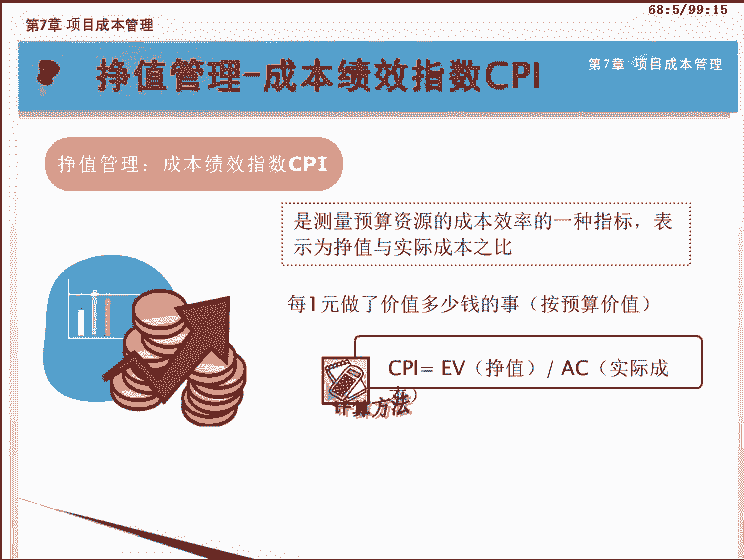

如果CPI大于一，则表示到目前为止，成本有结余。如果CPI小于一，说明已完成工作的成本超支。房屋装修项目的成本绩效指数CPI等于正值6700除以实际花费的成本7100等于0。94。

其实际花费的每1元钱只做了计划0。94元做的事情。CPI和CV反映的基本信息是相同的，不过一个是相对比率，一个是绝对数量。接下来我们要学习两个政治管理中与进度相关的重要概念。

他们是进度偏差SV和进度绩效指数SPI。进度偏差SV是项目进度绩效的一种指标，表示为正值与计划价值之差。表明项目是否落后于基准进度是一个非常重要的指标。

其计算方法为进度偏差SV等于正值EV减去计划价值PV。如果计算结果是正值，则表示提前完成进度计划。如果是负值，则表示实际进度落后于进度计划。由于项目完工时，全部的计划价值都将实现，即成为正值。

所以正值管理中进度偏差最终将等于0。

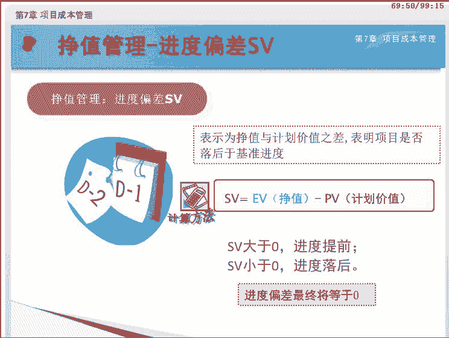

房屋装修项目的进度偏差等于正值6700，减去计划价值7000等于负的300。也就是说，这个项目本来应该已经完成的价值300元的工作还没有完成，进度落后。进度绩效指数SPI是测量进度效率的一种指标。

表示为正值与计划价值之比。他反映了项目团队利用时间的效率。可以表示实际进度是计划进度的多少倍或百分之多少。有时与成本绩效指数CPI一起使用，以预测最终的完工估算。

SPI进度绩效指数等于正值EV与计划价值PV的比值。

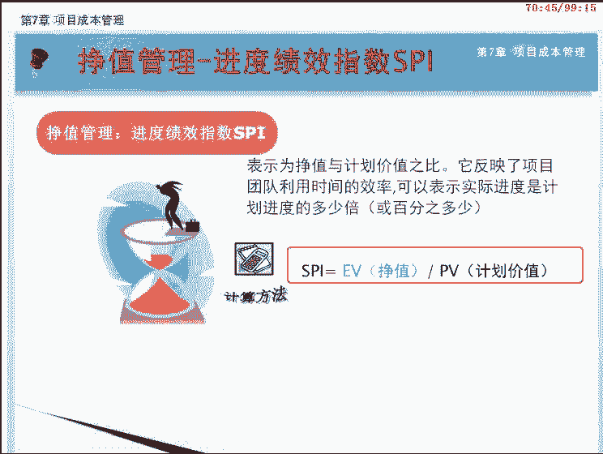

当SPI大于一时，则说明已完成的工作量超过计划，小于一则表示有未完成计划要求的工作量。由于SPI测量的是项目总工作量，所以还需要对关键路径上的绩效进行单独分析，以确认项目是否将比计划日期提前或延迟完成。

房屋装修项目的进度绩效指数SPI等于正值6700除以计划价值7000等于0。96。也就是说，实际进度只是计划进度的96%。在正值测量时，对于某些已经开始但尚未完成的工作，确定及准确的正值可能比较麻烦。

可使用一些简单的政值规则，以快速简单的得到近似正值。首先是5050规则。只要工作或活动已经开始，就按50%正值算，到结束时再按百分之百计算。这种规则的特点是比较中和的。2080规则。开始按20%算。

这是一种比较保守的方法。0百分之百规则中，只要没结束，不管开始了多少工作，都按0%计算，是一种最保守的方法。10100规则中，只要开始了，就按百分之百的政治计算。这种计算方法最激进。当然。

不管哪种政治规则，工作未开始按0%算，完全结束，按百分之百算。所不同的是，工作开始而又未结束状态时的正值量计算。对计划价值PV正值EV和实际成本AC这三个参数。既可以以周或月为单位分阶段进行监测和报告。

也可以针对从项目开始到数据日期为止的累计值进行监测和报告。图中，S曲线展示了某个项目的累计正值数据。我们看到截止数据日期正值EV的值低于PV和AC。因此，该项目的状态是预算超支且进度落后。

正值计算中涉及到了很多的计算。计算偏差时，EV总是出现在前面是被减数，结果是正的，表明是有利的，负的结果是不利的，零表示正好符合计划。计算指数时，E为总是在分子上作为被除数。结果大于一是有利的。

小于一是不利的，等于一正好符合计划要求。除了BAC以外，其他计算都要考虑截制或在某个时点的问题。在预测未来项目情况时，如果题目中没有明确说明项目过去已经发生的偏差是否属于典型的，都按典型来考虑。

控制成本中的预测是指基于项目当前绩效和其他知识，对未来绩效进行预测，得到关于项目未来情况的信息。预测指标包括文工估算EAC和文工上需估算ETC后面我们会详细介绍。

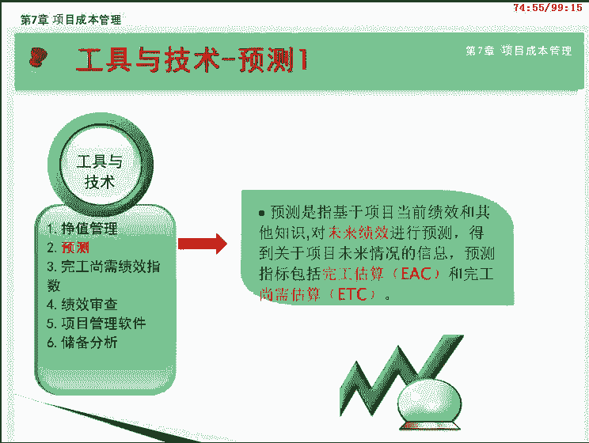

什么是完工估算EAC呢？完工估算就是为完成某进度活动工作分解结构组成部分或整个项目所需的预期总成本。他可以根据迄今为止的实际绩效进行计算。也可以由项目团队根据其他因素做出估算。

那什么又是完工上需估算ETC呢？

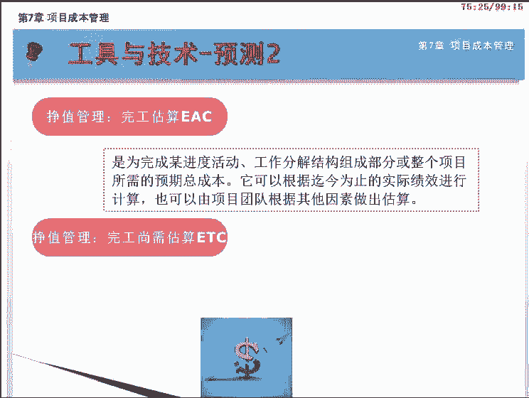

完工尚需估算是为完成某进度活动工作分解结构组成部分或整个项目的所有剩余工作而预计需要的成本。首先我们来看完工尚需估算ETC的计算方法。如果项目发生的成本偏差是典型的，即这种偏差在项目中比较具有代表性。

还会在项目中继续同样规模的发生。这个时候ETC等于BAC减去EV之后除以CPI。如果项目发生的偏差是由特殊原因造成的，这种偏差以后不会再发生，剩余工作仍可按预期绩效完成，则ETC等于BAC减去EV。

如果截止目前的成本绩效和进度绩效都不理想，而又必须按期按预算完工。则ETC等于BAC减去EV之后，除以CPI乘以SPI。其中，CPI乘以SPI称为关键比率，用来考核成本与进度的综合绩效。

如果不属于上述两种情况，则可以采用自下而上的方式全新的估算一个数字。重新估算的数字通常会更加准确，但是需要花费额外的时间和成本。

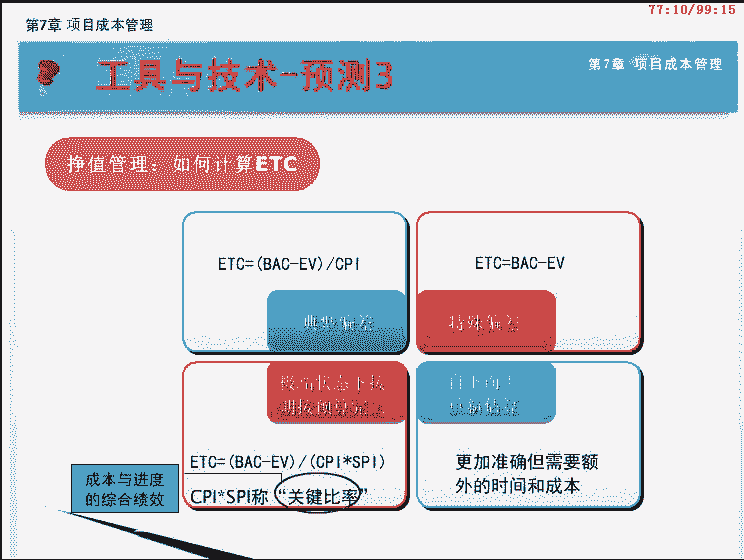

因为完工估算等于实际成本，加上完工尚需估算。因此，完工估算EAC也有4种情况。如果是基于典型原因造成的偏差，则EAC等于AC加上BAC减去EV之后除以CPI或BAC除以CPI。

如果是基于特殊原因造成的偏差，则EAC等于AC加上BAC减去EV或者等于BAC减去CV。如果偏差是由关键比率SPI和CPI共同原因造成的，则EAC等于AC加上BAC减去EV除以CPI乘以SPI。

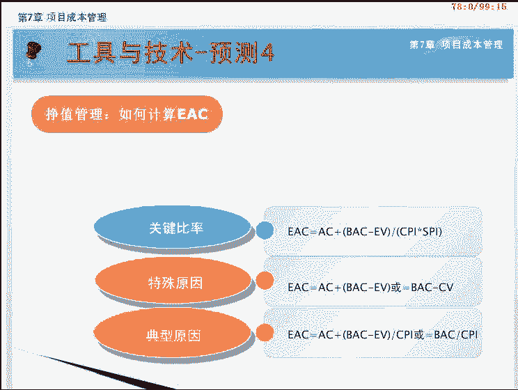

如果选择对剩余工作进行重新估算，则EAC等于AC加上ETC。可以结合前面的房屋装修项目，按照不同的方法来计算ETC及EAC。另外还有个简单的概念需要我们了解。文宫偏差VAC。

它是对预算亏工量或盈余量的一种预测，它表现了项目完工成本和估算成本的差异。计算公式是VAC等于完工预算BAC减去完工估算EAC。

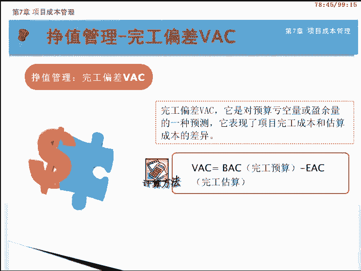

如果VAC大于0，表示在计划成本之内。如果VAC小于0，表示超过计划成本。工上需绩效指数TCPI是一种为了实现特定的管理目标，如达到完工预算BAC或完工估算EAC剩余资源的使用必须达到的成本绩效指标。

简单的说，TCPI是完成剩余工作所需的成本与剩余预算之比。TCPI的计算与项目目标息息相关。如果完工预算BAC可行，则要达到的目标是按BAC完成项目，则PCPI的计算公式是。

TCPI等于BAC减去EV除以BAC减去AC。如果完工预算BAC已经明显不再可行，则项目经理应预测完工预算EAC。一经批准，EAC就取代BAC成为新的成本绩效目标。

此时需要达到的成本目标是EAC所以TCPI等于BAC减去EV除以EAC减去AC。

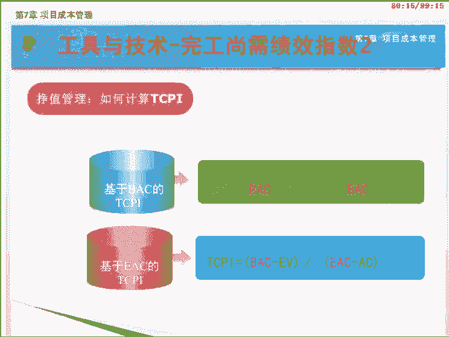

现在我们来看画面所示的完工上需技巧指数TCPI的示意图。如果项目目前的累计CPI低于基准计划，那么项目的全部未来工作都必须立即按基于BAC的TCPI执行，以确保实际总成本不超过批准的BAC。此时。

TCPI必须大于一，才有可能是项目成本控制在BAC之内。至于所需要的这种技效水平是否可行，需要综合考虑风险进度、技术等多种因素才能判断。如果管理层认为BAC不可实现。而需按新的完工估算EAC为标准。

这时，项目未来所需要的绩效水平就是按照基于EAC的TCPI执行。

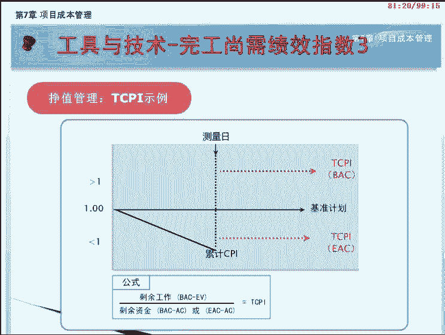

在控制成本的过程中，需要对项目的成本绩效进行审查。绩效审查的对象包括成本绩效随时间的变化，进度活动或工作包超出和低于预算的情况，以及完成工作所需的资金估算等。如果是采用正直管理技术进行绩效审查。

则需要对偏差、趋势和正直绩效三个指标进行分析。偏差分析是指把实际项目绩效与计划或预期绩效进行比较。一般需要进行分析的是成本偏差和进度偏差，以判断偏离进度基准的原因和程度。

并决定是否需要采取纠正或预防措施。趋势分析只在审查项目绩效随时间的变化情况，以判断绩效是正在改善还是在恶化，一般会采用图形分析方法。正值绩效分析就是将基准计划与实际进度和成本相比较，以判断成本绩效情况。

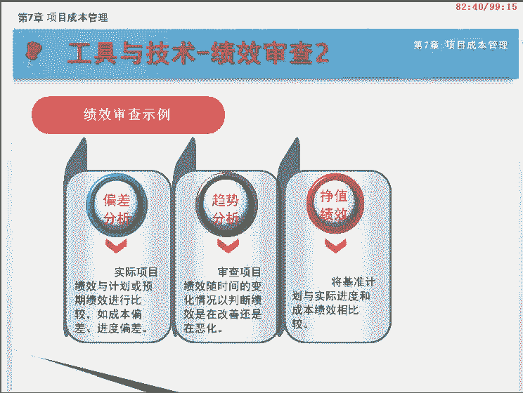

在控制成本的过程中，往往采用项目管理软件来监测PVEV和AC这三个正值管理指标绘制趋势图，并预测最终项目结果的可能区间。

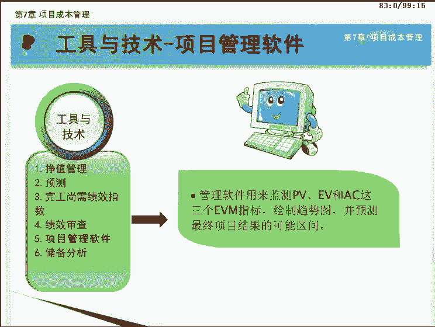

我们知道，在估算成本和制定预算时，为了应对风险，曾经为项目预留了应急储备和管理储备。随着项目工作的进展，这些储备可能已按计划用于支付风险或其他应急情形的成本。或者如果风险事件没有如预计的那样发生。

就可能要从项目预算中扣除未使用的应急储备，为其他项目或运营腾出资源，再或者经过进一步风险分析，可能会发现需要为项目预算申请额外的储备。那到底剩余的储备和剩余的风险是否匹配呢？

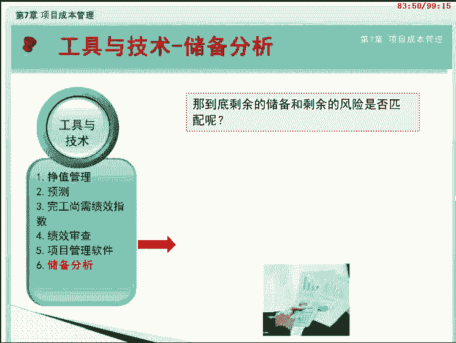

这就要求我们在控制成本过程中采用储备分析来监督项目中应急储备和管理储备的使用情况，从而判断是否还需要这些储备，或者是否需要增加额外的储备。控制成本过程共有6个输出，他们是工作绩效信息。

成本预测变更请求、项目管理计划更新、项目文件更新和组织过程资产更新。下面我们一块来学习。

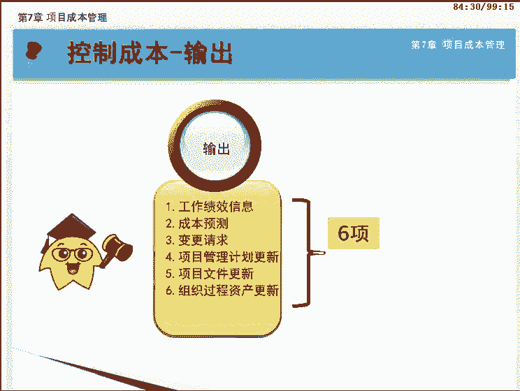

工作绩效信息是控制成本过程的第一个输出。WB各组件，尤其是工作包和控制账户的CVSVCPIPITCPI和VAC值都需要记录下来，并传达给干系人。这些值就是写入到工作绩效信息中。

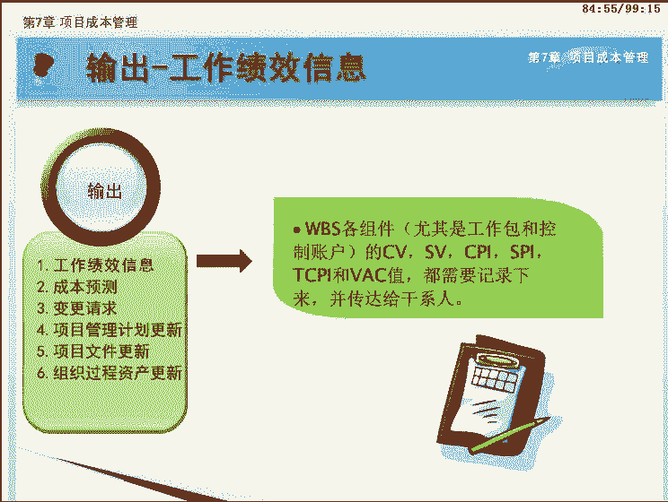

这个过程的第二个输出是成本预测。在控制成本过程中，无论是通过典型偏差计算得到的完工估算EAC。还是通过自下而上得到的EAC预测值都必须记录下来，并传达给相关干系人。通过分析项目绩效。

项目管理团队可能会对成本绩效基准或者项目管理计划的其他一些组成部分提出变更请求。这些变更请求可能包括预防措施或纠正措施。变更请求需要经过实施整体变更控制过程的审查和处理。

在控制成本过程可能需要更新项目管理计划。项目管理计划更新的内容包括两部分，一个是成本基准。在批准对范围活动资源或成本估算的变更后，需要对成本基准相应做出变更。有时成本偏差太过严重。

以至于需要修订成本基准，以便为绩效测量提供现实可行的依据。项目管理计划更新的第二个内容是成本管理计划。成本管理计划中需要更新的内容包括用于管理项目成本的控制临界值或所要求的准确度。

要根据干谢人的反馈意见，对他们进行更新。在控制成本过程，可能需要更新的项目文件，包括成本估算和估算依据等。

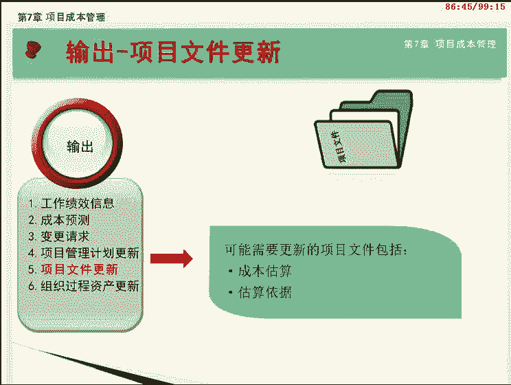

控制成本过程可能需要更新的组织过程资产，包括偏差的原因，采取的纠正措施及理由。财务数据库。以及从项目成本控制中得到的其他经验教训。现在我们来回顾一下本过程的核心知识。控制成本是监督项目状态。

以更新项目成本管理成本基准变更的过程。正值反映的是任何一个时刻或时间点的项目绩效情况。

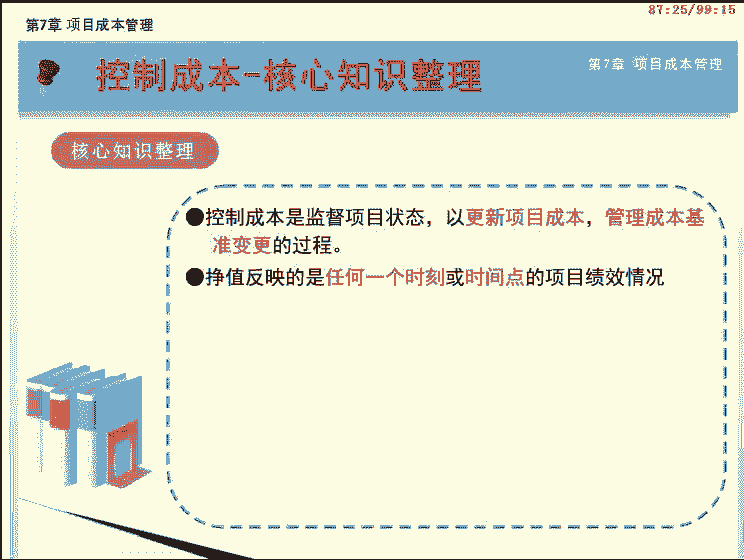

正值管理中四个基本概念是计划价值PV正值EV实际成本AC和完工预算BAC。与成本绩效相关的概念是成本偏差CV和成本绩效指数CPI。与进度绩效相关的概念是进度偏差SV和进度绩效指数SPI。对成本的预测。

包括计算完工估算EAC和完工尚需估算ETC。恭喜你完成控制成本过程的学习。

各位学员，第七章项目成本管理知识领域的全部四个过程已经学习完毕，现在就来做个总结吧。首先需要对如何进行成本管理进行规划。这个过程就是规划成本管理。他根据项目章程和前期已经批准的项目管理子计划。

生成项目成本管理计划。第二个过程，估算成本是根据WBS以及风险登记册等信息，估算每个活动所需的成本。在这里可以根据风险预留一些应急储备。之后，利用制定预算过程，将前期估算的所有成本进行累积汇总。

加上应急储备，形成整个项目的成本基准。在成本基准之上，加入管理储备，就形成了整个项目的预算。在项目进行的全过程，需要监督项目活动状态，更新项目成本、管理成本基准变更。这是控制成本过程要完成的工作。

这个过程会产生工作绩效信息，并可能提出变更请求。这个回顾过程我们没有考虑事业环境因素、组织过程、资产和各种文件的更新。你可以翻看篇安报和指南来进行回顾。

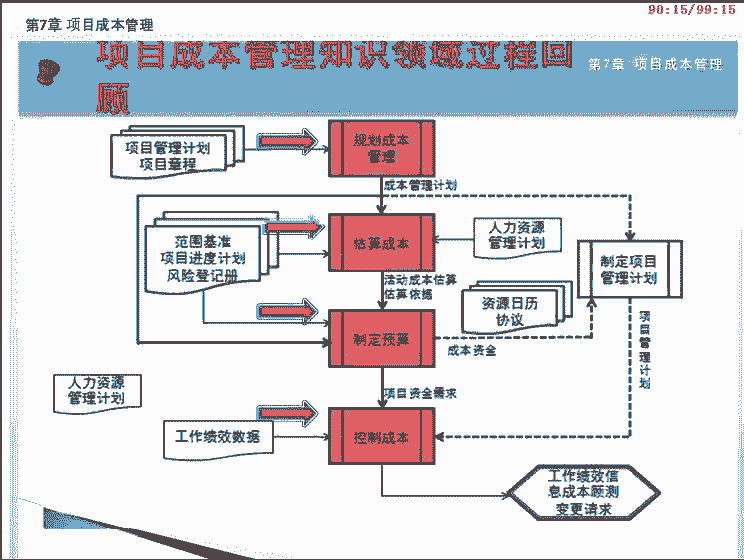

各位学员，恭喜您已经完成了第七章项目成本管理这一知识领域的学习。建议接下来继续学习第八章项目质量管理，我们下堂课见。

