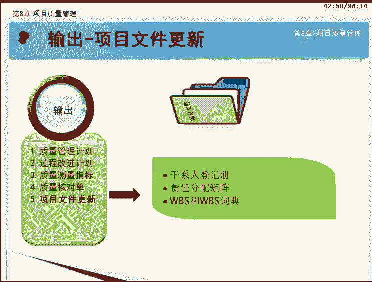
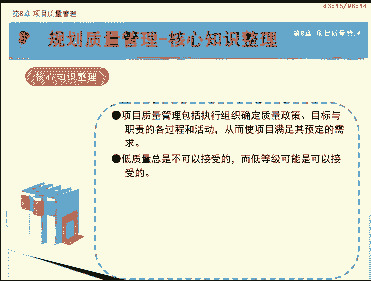
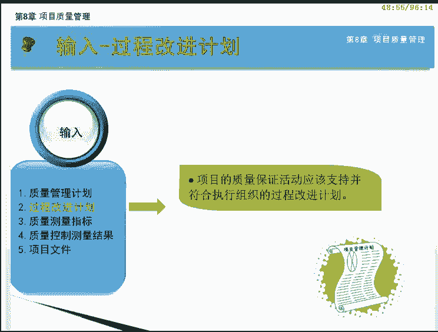
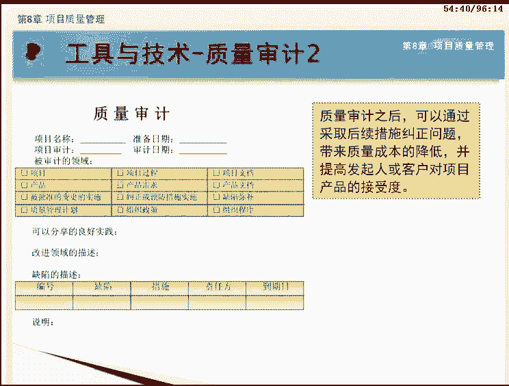
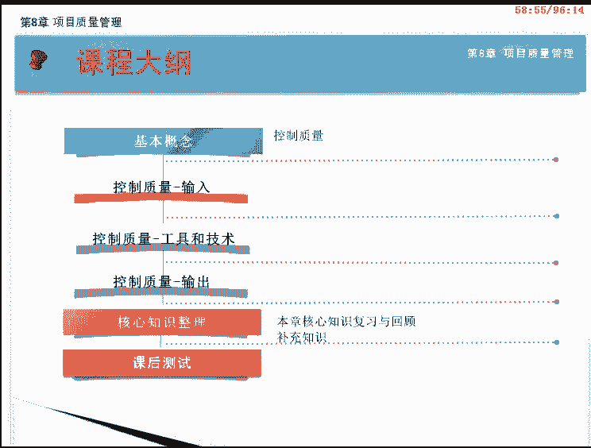
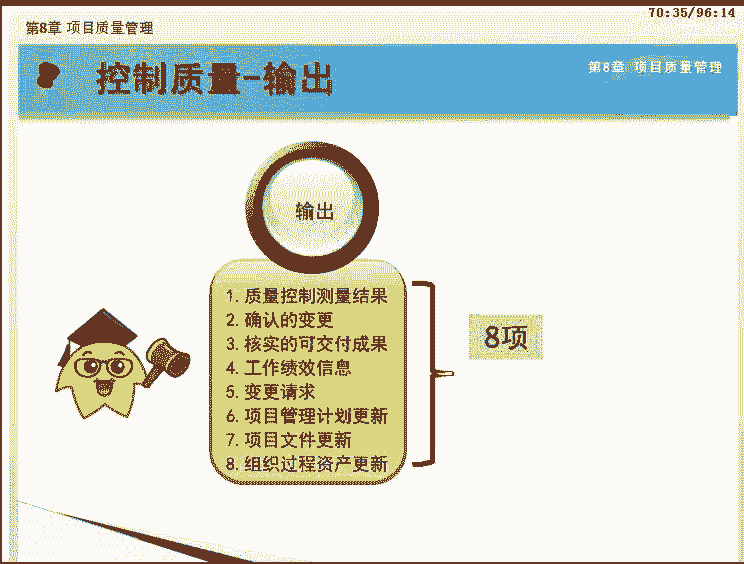

# PMP项目管理 - P8：08 - 自学力 - BV1EZ4y1p7LB

欢迎来到PMP项目管理网络课程的学习。本课程基于最新发布的PMbook指南第五版。下面我们将一起学习第八章项目质量管理。项目质量管理知识领域有三个过程。分散在规划过程组、执行过程组和监控过程组中。

在这一章，我们要重点学习项目质量管理的这三个过程。分别是规划过程组的规划质量管理、执行过程组的、实施质量保证和监控过程组的。控制质量过程。这三个过程不但彼此互相作用。

而且还与其他知识领域中的过程相互作用。这些过程在位置图中的位置是考试必考的重点，请务必记下来。此外，在学习的过程中，大家还要格外注意每个过程所使用的工具和技术，它们也是本章的重点内容。

先来看看什么是质量管理呢？项目质量管理包括执行组织确定质量政策、目标与职责的各个过程和活动，从而使项目满足其预定的需求。质量管理主要通过采取适当的政策和程序，通过持续的过程改进活动来实施质量管理体系。

质量管理过程是一切为置项目达到质量要求所需要的活动的总和。是在确保项目需求，包括产品需求得到满足和确认。我们来了解质量管理的内容。质量是产品内在的一系列特征，满足要求的程度。

质量管理包括项目质量管理和可交付成果质量管理两个方面。项目质量管理针对的是项目过程中所涉及的活动，适用于所有领域的项目，无论项目的产品具有何种特性。可交付成果质量管理针对的是项目生产的具体可交付成果。

与可交付成果的性质和特性紧密相关。可交付成果质量的测量方法和技术需要结合项目所生产的具体可交付成果类型。如对于软件产品开发和核电站建设这两个项目。需要采用不同的质量测量方法和技术。

但是项目质量管理的方法对两个项目都是用。

无论什么项目未达到可交付成果或项目质量要求，都会给某个或全部项目干系人带来严重的负面后果。因此，这两个方面都必须做好。那么如何进行质量管理呢？按照偏M报告指南第五版。

项目质量管理主要通过规划质量管理、实施质量保证和控制质量三个过程来实现。那么，每个过程到底做哪些工作达到怎样的目标呢？这些将是我们在后面的课程中主要学习的内容。

为了让大家对后续的学习内容有一个整体的把握，我们先对项目质量管理的三个过程进行简要介绍。对于项目中的活动，我们如何确定其属于哪个过程呢？在这里我们总结了一个经验。

如果看到标准，都与质量规划有关。看到过程与信心，都与质量保证有关。看到具体可交付成果都与控制质量有关。我们已经了解了本章的基本框架。接下来我们就对在本章中您需要了解的概念进行讲解。首先是质量和等级。

质量是指一系列内在特性、满足要求的程度及产品服务或过程，满足客户需求的程度。等级是对用途相同，但技术特性不同的产品或服务的级别分类。如一个软件产品无明显缺陷，用户手册易读，那我们可以认为其是高质量的。

但是其功能有限，所以只能算是低等级产品。相反，如果一个软件产品功能很强大，等级很高，但是存在许多缺陷，用户手册杂乱，用起来很不方便，它也只能算是一个低质量的产品。

所以低等级和低质量不是一回事。如现在流行的学生电脑，比起正常的电脑来说，就属于低等级的，但是高质量的。低质量总是不可以接受的，而低等级可能是可以接受的。除了质量和等级。

您还应该能够区分精确和准确这两个概念。精确是指对精密程度的度量，是说重复测量的结果非常聚合，离散度很小。如测量一个物体的重量，三次测量的结果为10。01克，10。00克，10。01克，刻度非常接近。

我们说测量精确，但不一定准确。准确则是指测量值非常接近实际值。严格符合真实情况。如一个钢管的实际长度为10。2米。测量结果就是10。2米，我们可以称此次测量十分准确。而物体的准确质量是11。00克。

虽然三次测量很精确，但由于误差不准确。

因此，精确的测量未必准确，准确的测量也未必精确。项目管理团队必须确定适当的准确与精确度。现代质量管理和项目管理，这两门学科是相辅相成的。两者有许多共同的观点。

接下来我们就来了解一下他们之间一些重要的共识。首先是客户满意。客户满意要求全面的了解评估定义和管理需求，以便满足客户的期望。要求项目的可交货成果，既要与他宣传将交付的产品相同，又要适合使用。

满足实际需要。接下来是预防剩于检查。现代质量管理的基本信条之一是质量是规划设计和建造出来的，而不是检查出来的。预防错误的成本通常可在检查中发现并纠正错误的成本少得多。持续改进的理念认为。

质量源于不断的改进与提高。由休哈特提出并经带明完善的计划，实施检查行动PDCA循环是质量改进的基础。另外，执行组织采取的质量改进举措，如全面质量管理TQM和6西格ma既能改进项目的管理质量。

也能改进项目的产品质量。项目的成功需要项目团队、全体成员的参与，但是管理层有责任为项目提供所需资源。项目经理对项目质量负责，但不对项目和产品负全部的责任。

本课程我们将一起学习第八章项目质量管理知识领域的第一节规划质量管理。

通过本课程的学习，我们将要达到以下目标。包括。掌握规划质量管理的含义与作用，熟记本过程的输入、工具与技术以及输出。掌握质量成本的概念和组成。熟悉质量管理计划的内容和作用。

了解质量测量指标、质量核对表以及过程改进计划包含的内容。

本课程我们将按照如画面所摄的大纲为您讲述。首先是对规划质量管理过程的基本含义进行讲解。接下来分析规划质量管理过程的输入、工具和技术以及输出。课程的最后是本课核心知识整理。

学习本过程之前，我们先来了解规划质量管理的基本概念。规划质量管理是识别项目及其可交付成果的质量要求和标准，并书面描述项目将如何证明符合质量要求的过程。

本过程的主要作用是为整个项目中如何管理和确认质量提供指南和方向。在进行规划质量时，项目管理团队还要注意以下内容。首先，由于不同的项目会有不同的要求，规划质量管理过程，必须结合项目的特性和具体情况。

对质量进行合理的规划。第二，规划质量管理贯穿于整个项目生命周期，项目管理团队应该定期进行规划质量工作。第三，因为质量标准的变更会相应的引发成本进度等的变更，所以规划质量应该与其他项目规划过程结合进行。

第四。规划质量是实施规划过程组和制定项目计划的关键过程，必须要给予足够的重视。最后，在进行规划质量管理过程中，项目管理团队需要依据组织既定的质量方针、政策和原则，遵循推荐的质量体系和标准。

接下来让我们来看看如何进行质量管理的规划。项目的质量要受到风险、客户要求、范围、时间和成本等因素的制约。因此，规划质量管理过程就需要依据风险登记册、干系人登记册、项目管理计划中的各个基准。

在进行项目质量管理的时候，还必须利用好组织所处领域既有的质量规定政策，所以必须考虑事业环境因素和组织过程资产。然后根据已有的这些信息，运用成本效益分析、质量成本以及其他质量规划工具和技术。

得到质量管理计划及其配套的质量测量指标和质量核对单以及过程改进计划。最后对项目文件进行必要的更新。需要特别指出的是，质量管理计划和过程改进计划都是项目管理计划的子计划。这是规划质量管理过程的数据流向图。

我们看到该过程通过输入输出与其他过程进行交互。规划质量管理过程共有6个收入，分别是项目管理计划、干系人登记册、风险登记册、需求文件、事业环境因素和组织过程资产。下面让我们依次来了解他们。

项目管理计划被用于制定质量管理计划，其中有重要作用的信息包括范围基准、进度基准、成本基准以及其他管理计划。其中，范围基准中的项目范围说明书特别重要，它包括项目描述主要项目可交付成果及验收的标准。

项目范围说明书通常包含技术问题细节及会影响质量规划的其他事项。这些事项应该已经在项目的规划范围管理过程中得以定义。范围说明书中的验收标准的界定可能导致质量成本，并进而导致项目成本的显著增加或降低。

满足所有的验收标准，意味着发起人和客户的需求得以满足。项目管理计划中的进度基准记录经认可的进度绩效指标。成本基准记录用于考核成本绩效的指标。干系人登记册来自于干系人管理知识领域的识别干系人过程。

它有助于识别对质量有特别兴趣或影响的那些干系人。在规划质量管理时，需要通过审查风险登记册。风险登记册包含可能影响质量要求的各种威胁和机会的信息。需求文件记录项目应该满足的与干谢人期望有关的需求。

需求文件中包含项目和产品的需求和质量需求。这些需求有助于项目团队规划将如何开展项目质量控制。

可能影响规划质量管理过程的事业环境因素，包括政府法规、特定应用领域的相关规则、标准和指南。可能影响项目质量的项目或可交货成果的工作条件或运行条件。可能影响质量期望的文化观念。

最后是可能影响规划质量管理过程的组织过程资产，包括组织的质量政策、程序及指南。执行组织的质量政策是高级管理层所推崇的，规定了组织在质量管理方面的工作方向。其他组织构成资产还有历史数据库。

以及以往阶段或项目的经验教训。

规划质量管理这个过程有8个工具和技术，分别是成本效益分析、质量成本7种基本质量工具、标杆对照、实验设计统计抽样、其他质量规划工具以及会议。下面我们一块来学习。

成本效益分析就是对成本和收益进行权衡。如果增加成本，就要分析这些增加的成本是否达到了减少返工，提高生产率，降低成本，提升干系人满意度，及提升盈利等收益。也就是说，在确定质量标准时。

应考虑满足质量要求的成本和其带来的收益是否匹配。在具体的实施过程中，对每个质量活动进行商业论证，就是要比较其可能成本与预期收益。如果投入的成本产生更多的收益，就应该加大质量成本的投入。

PMI认为，投入的质量成本都应该有超额的效益回报。当质量的成本投入与收益正好相等时，质量达到最好，不需要继续投入了。因为在投入的话，就有可能导致投入的成本很大，但产生的收益却较小。

质量成本包括在产品生命周期中，为预防不合格要求，为评价产品或服务是否符合要求，以及因未达到要求而发生的所有成本。

我们可将质量成本分为预防成本、评估成本和失败或缺陷成本三类。接下来我们对这三种分类进行具体讲解。质量成本中的预防成本是指在产品生命周期中为预防产品不符合要求而付出的成本。

质量计划编制、人员培训以及购买设备等付出的成本都属于预防成本。由此可以得到，项目规划质量过程本身所发生的成本属于预防成本。评价成本是指检查产品或生产过程，确认他们是否符合要求而发生的成本。

如生产过程中的检查和产品测试活动所发生的成本。质量保证过程的一些成本就属于评价成本。

失败或缺陷成本是指制定纠正产品质量缺陷的措施，以及实际采取纠正措施所发生的成本。就可以分为内部失败成本和外部失败成本。前者是指在产品交给客户之前，在项目管理团队内部发现和处理缺陷所发生的成本。

后者是指客户拿到产品之后，发现质量问题而产生的处理成本。产品产生缺陷后的成本属于失败成本。下面我们来看一下质量成本的分类。预防成本和评价成本可以合成为一致性成本。

项目管理中的一致性成本是在项目期间用于防止失败的费用。也是为保证质量符合要求所做工作的花费成本。与之对应的不一致成本是指因质量不符合要求而发生的成本，也就是失败成本，包括内部失败成本和外部失败成本。

内部的失败成本可能来源于返工废品，外部失败成本可能源于产品保修、责任、业务流失等。

在质量管理各过程中，常常使用7种基本质量工具，也称7QC工具，用于在PDC循环的框架内解决与质量相关的问题。这7种基本质量工具是因果图、流程图核查表。帕雷托图。直方图、控制图和散点图。

下面我们将依次进行介绍。我们先来看因果图。因果图因为是石川首次提出来的，也称为石川图，就因为它的外形很像跟鱼的骨头，被形象的称为鱼骨图。他把影响产品质量、诸多因素之间的关系，以树状图的方式表达出来。

使人一目了然，便于分析原因，并采取相应的措施。因果图强调知道结果，寻找原因，是分析根本原因的常用方法。

画面中就是一个因果图的示例，可顺着箭头的逆向方向，也就是从鱼头开始，一步步追溯药品受潮变质的根本原因。最后细分出来的原因应是具体的，便于采取实际措施的。在细分原因时，应集思广益。

地球分析结果准确而无遗漏。因果图经常与头脑风暴法联合使用。流程图也称过程图，用来显示在一个或多个输入转化成一个或多个输出的过程中，所需要的步骤顺序和可能分支。一般用流程图来描述一个过程。

怎样从开始走到结束，以及中间各步骤之间的相互关系。流程图有助于了解和估算一个过程的质量成本。

流程图有多种形式，但所有的流程图都会显示活动决测点和处理顺序。在质量规划过程中，流程图有助于项目团队预测可能发生的质量问题。认识到潜在问题，就可以建立测试程序或处理方法。

画面上的流程图可以帮助项目团队及时发现成本实施中出现的问题。质量管理中的流程图经常与SIPOC模型结合起来。SIPOC模型是由戴明提出来的组织系统模型是一门最有用而且最常用的用于流程管理和改进的技术。

是过程管理和改进的常用技术。作为识别核心过程的首选方法使用。代明认为，任何一个组织都是一个由公佣者输入流程输出，还有客户这样相互关联互动的5个部分组成的系统。

这5个部分的英文单词的第一个字母就组成SIPOC，因而把它称作SIPOC组织系统模型。核查表又称技术表，是用于收集数据的查对清单。他合理排列各种事项，以便有效的收集关于潜在质量问题的有用数据。

在开展检查以识别缺陷时，用核查表收集属性数据，特别方便。用核查表收集的关于缺陷数量或后果的数据，又经常使用帕雷托图来显示。这是一个核查表的示例。

我们看到核查表中记录了某网站开发项目中每天发现的各类质量缺陷的数量。可以以这张核查表中记载的基础数据为依据进行后续的质量分析工作。

从它的名字我们可以猜出来，直方图是一种垂直的条形图，用于描述集中趋势、分散程度和统计分布形状。它能显示特定情况的发生次数。在质量管理中，直方图有以下三个用途。第一是描述产品质量分布。第二。

了解产品质量的波动情况及质量特性的分布规律。第三。通过对质量数据特征值的计算，估算生产过程总体的不合格产品率并评估过程能力。

比如画面中有关未及时登记工作时间的原因的直方图。它的每一个柱形都代表某个问题或者情景的一种属性或特征。柱形的高度表示，这种特征的发生次数。比如，由于时间不足而导致没有登记工作时间的次数达到22次。可见。

直方图可以很直观的表示引发问题的最普遍的原因。画面中，由于文件过程导致的未登记工作时间、次数达30次，是问题的普遍原因所在。

排雷托图也称排列图，是一种特殊的垂直条形图，用于识别造成大多数问题的少数重要原因。它可以看成是按发声频率排序的特殊脂肪图。显示每种已识别的原因分别导致了多少缺陷。排序的目的是为了有重点的采取纠正措施。

帕雷托图直导我们在解决问题时，首先处理导致最多缺陷的原因。一般来说，关注排在前2到3个因素就可以解决绝大部分的问题。帕雷托图与帕雷托法则有关，该法则认为，相对少量的原因通常造成大多数的问题或缺陷。

帕雷托原则就是人们通常所说的28定律，及20%原因造成80%错误。画面中是一个帕雷托图的实例，相对于直方图来说，它最大的不同就是将造成问题的原因，按照发生的次数进行了降序排列。

控制图在项目质量管理中的作用非常重要，也是常考内容。控制图用于确定一个过程是否稳定或者是否具有可预测的绩效，是反映生产过程随时间变化而发生的质量变动的状态图形。用于确定过程是否在控制之中。

控制图中的数据点可以显示过程的随机波动，突然跳跃或偏差逐渐扩大的趋势。例如，结果中的偏差是因随机变化而产生的，还是异常事件引发的？说是异常事件引发的，就需要确定异常事件的起因，并进行纠正。

如果过程是受控制范围内的，就不需要对过程进行重新调整。为了提供改进，过程可以改变。但当其在控制之中时不应该进行调整。我们来看控制图中的几个基本概念。

位于画面中间的那条黄色的线是表示允许偏差或绩效的平均值，也就是质量的目标值。画面中上下两条蓝色的实线是规格上限和规格下限，这是客户要求或者合同规定的最后底线，是来自客户或合同的硬性要求。

产品质量哪怕是超出了控制上限或下限，只要在规格上限和规格下限范围内，产品质量仍然是合格的，不需要缺陷补救。控制图中最重要的控制上限和下限。这是判断需不需要采取纠正措施的分水岭，常用虚线表示。

如画面中剩下两条蓝色的虚线。上面是控制上限，下面的就是控制下限。如果质量偏差落在控制上限和下限的范围内，项目不需要采取纠正措施。一般情况下，控制上限和控制下限通常设为正-3西igma。

我们可以通过绘制控制图发现过程是否失控。如果控制图中出现了两类情况，我们就可以认为过程失控了。失控的过程必须调整。第一类情况是某一个点超越了控制上下限。注意，只要控制图中有任何一个点在控制界限之外。

我们就可以断定过程失控。第二类情况是起点规则，也表示过程失控。起点规则是指，尽管控制图中所有点都在控制界线之内，但图中连续7个点都在均值线的上侧或下侧。或者连续7个点连接后呈现上升趋势或下降趋势。

图中的控制图有4处可以断定该括程失控。第一个是有数据点高于控制上限，第二个是有数据点低于控制下限。第三个是满足起点规则中，连续7点在均值上方。第四个是满足起点规则中连续7点呈现下降趋势。再次提醒一下。

控制图中，只要有一处能判断过程失控，该过程就必须调整。

最后两个跟控制图相关的概念是非随机原因和随机原因。非随机原因也是指特殊原因。实际上，控制图中任何导致过程失控的观测值都是非随机原因引起的。项目管理团队应对非随机原因进行调查，并找到调整过程的解决方案。

随机原因也指普通原因。它是指系统本身的内在特性决定的可预测的偏差来源。它可导致控制图中的点在均值上下波动，但不会超越控制上下限，也不会是控制图满足起点规则。这种随机原因导致的波动不意味过程失控。

不需要调整。散点图又称相关图，用于显示两种质量特性数据之间的关系以及关系紧密程度。前景图只能显示两个变量之间的关系。这两个变量称为自变量X和因变量Y。通过散点图能确定自变量和因变量之间的关系。

如果数据点的连线越接近对角线，那么两个变量之间的关系就越紧密。如图所示，第一行第一张散点图表示两个变量之间是强的正相关。第一行第二张三点图表示两个变量之间是强的负相关。

第二行第二张三点图表示两个变量之间不相关。如果存在相关性，就可以画出一条回归线来估算自变量的变化，将如何影响因变量的值。

标杆对照是将实际或计划的项目实现与可比项目的实践进行对照，以便识别最佳实践，形成改进意见，并为绩效考核提供依据。作为标杆的项目，可以来自执行组织内部或外部，或者来自同一应用领域。

标杆对照也允许用不同应用领域的项目做类比。实验设计DOE是一种统计方法，用来识别哪些因素会对正在生产的产品或正在开发的产品或正在开发的流程的特定变量产生影响。实验设计DOE可以在规划质量管理过程中使用。

以确定测试的数量和类别，以及这些测试对质量成本的影响。实验设计技术具有两个重要特点。第一，它为系统的改变所有重要因素，而不是每次只改变一个因素，提供一种统计框架。第二，通过对实验数据的分析。

可以得出产品或过程的最优状态。并揭示各要素间的交互作用。例如，某厨师通过反复调整各种调料的比例烹制出美味菜肴，每一次调整就是一次实验设计。统计抽样是指从目标总体中选取部分样本用于检查。

如从1000个投影仪中随机抽取50个，检查是否符合亮度标准。

在进行统计抽样时，要考虑抽样的频率和规模。一般情况下，抽样的频率和规模应该在规划质量管理过程中确定。这样可以便于在质量成本中考虑测试和预期废料等成本。统计抽样拥有丰富的知识体系。在某些应用领域。

项目管理团队应尽可能的熟悉各种抽样技术，以保证所抽取的样本确实能代表目标总体。统计抽样技术不用检查全部主体，就可得到与全部检查近似的结果，节省时间，节省费用，而且还减少对产品的破坏。

为定义质量要求并规划有效的质量管理活动。也可使用其他质量规划工具，包括。头脑风暴它是用于产生创意的一种技术。地场分析显示，变更的推力和阻力的图形，一般用来讨论某一问题的正负两类因素及驱动力和制约力。

然后通过综合分析这两种力量来解决问题。还有名义小组技术，先由规模较小的群体进行头脑风暴，提出创意，再由规模较大的群体对创意进行评审。最后一个是质量管理和控制工具。

是对已识别的活动进行相互关联的排序的一组工具。其中，头脑风暴和名义小组技术在第五章范围管理知识领域的收集需求过程介绍过。质量管理和控制工具将在本章下一个过程实施质量保证过程介绍。

项目团队可以召开规划会议来制定质量管理计划。参会人员可以包括项目经理、项目发起人、选定的项目团队成员，选定的干系人负责项目质量管理活动，如规划质量管理、实施质量保证或控制质量的人员。

以及需要参加的其他人员。规划质量管理过程有5项输入，分别是质量管理计划、过程改进计划、质量测量指标、质量核对单和项目文件更新。接下来我们详细讲解。

规划质量管理过程得到的最重要的输出之一便是质量管理计划。质量管理计划是项目管理计划的组成部分，描述将如何实施组织的质量政策，以及项目管理团队准备如何达到项目的质量要求。

它包括项目的质量控制、质量保证和持续过程改进方法。质量管理计划可以正式或非正式，非常详细或高度概括。其风格与详细程度取决于项目的具体需要。

另外，应该在项目早期就对质量管理计划进行评审，以确保决策是基于准确信息的。这样做的好处是减少因返工而造成的成本超支和进度延误。过程改进计划是项目管理计划的子计划。

详细说明对项目管理过程和产品开发过程进行分析的各个步骤，以识别增值活动。过程改进计划需要考虑的方面，包括。

过程边界描述过程的目的，过程的开始和结束，过程的输入输出过程责任人和干谢人。过程配置还有确定界面的过程图形，以便于分析。过程测量指标与控制界线一起，用于分析过程的效率。绩效改进目标用于指导过程改进活动。

质量测量指标专用于描述项目或产品属性，以及控制质量过程，将如何对属性进行测量，用于实施质量保证和控制质量过程。准时性预算控制、缺陷频率、故障率、可用性、可靠性和测试覆盖度等都可作为质量测量指标。

若有这样一条质量指标。将成本控制在预算的正负10%之内。这个成本目标就是要测量每个可交付成果的成本，并确定其偏离相应预算的百分比。其中正负10%就是该测量指标允许变动的范围，我们称其为公差。

图中所示的是软件开发项目中常用的质量测量指标，包括功能性、性能、可靠性、安全性、实用性、维护性、移植性、重要性等多个维度。核对单是一种结构化工具，通常具体列出各项内容。

用来核实所要求的一系列步骤是否已得到执行。基于项目需求和实践，核对单可减可繁，许多组织都有标准化的核对单，用来规范的执行经常性任务。在某些应用领域，核对单也可以从专业协会或商业性服务机构获取。

质量核对单应该涵盖在范围基准中定义的验收标准。图中所示的是某项目产品质量检查表的事例，实际上就是PM报告中所说的质量核对单。他规定了需要检查产品的各方面指标。质量核对单是进行质量控制的依据。

在规划质量管理过程，可能需要更新的项目文件，包括干系人登记册责任分配矩阵、WBS以及WBS词典。

现在我们来回顾一下本过程的核心知识。项目质量管理包括执行组织确定质量政策、目标与职责的各过程和活动，从而使项目满足其预定的需求。低质量总是不可以接受的，而低等级可能是可以接受的。

质量是规划设计和建造出来的，而不是检验出来的。规划质量管理是识别项目及其可交付成果的质量要求和标准。并书面描述项目将如何证明符合质量要求的过程。质量成本分为一致性成本和非一致性成本。

恭喜你完成规划质量管理过程的学习，我们下节课见。本课程我们将一起学习第八章项目质量管理知识领域的第二节，实施质量保证。

通过本课程的学习，我们将要达到以下目标，包括。熟记实施质量保证的定义，理解质量审计的定义和目的，理解过程分析的定义及其包含的内容。熟悉本过程的输入工具与技术和输出。

本课程我们将按照如画面所摄的大纲为您讲述。首先是对实施质量保证和持续过程改进的基本含义进行讲解。接下来分析实施质量保证过程的输入、工具和技术以及输出。课程的最后是本课核心知识整理。

在前一个过程，规划质量管理的输出中，我们讲到了质量测量指标。这些指标是为确保项目符合一定的标准，从而使项目达到一定的质量要求。接下来我们要讨论的这个过程是实施质量保证。

我们可以把它看成是为项目提出了这样几个问题。我们在项目实施过程中是否使用了指标，是否符合这些标准，我们能不能改进这些标准？为了回答这几个问题，在实施质量保证过程中。

项目团队还会比较控制质量过程中产生的一些数据来确保项目的质量符合标准。并对不合格的标准进行改进。在学习实施质量保证过程之前，我们先来了解实施质量保证和持续过程改进。这两个基本概念的含义。

实施质量保证是审计质量要求和质量控制测量结果，确保采用合格的质量标准和操作性定义的过程。本过程的主要作用是促进质量过程改进。实施质量保证过程。

执行在项目质量管理计划中所定义的一系列有计划、有系统的行动和过程。质量保证旨在建立干系人对项目工作将满足特定的需求和期望的信心。

在这个过程中，质量保证部门或者其他类似部门经常要对质量保证活动进行监督，并向项目团队执行组织管理层、客户或发起人以及其他未主动参与项目工作的干系人提供质量保证支持。实施质量保证过程。

还能为持续过程改进创造条件。下面我们来介绍持续过程改进的概念。持续过程改进是指不断的改进所有过程的质量。通过持续过程改进，可以减少浪费。消除非增值活动，使各过程在更高的效率与效果水平上运行。

这是质量管理的一个非常重要的思想。

下面我们来看看如何进行质量保证。实施质量保证就是按照质量管理计划、过程改进计划和质量测量指标的要求做质量。并基于质量控制测量结果进行过程改进，最后提出变更请求，以便修改不合理的质量标准和质量管理计划。

这是实施质量保证过程的数据流向图。我们可以看到，该过程通过输入输出与其他过程进行交互。

实施质量保证过程共有5个输入，分别是质量管理计划、过程改进计划、质量测量指标、质量控制测量结果和项目文件。下面我们依次来了解它们的。

质量管理计划是规划质量管理过程的重要输出，描述了项目质量保证和持续改进的方法。过程改进计划也是规划质量管理过程的输出。项目的质量保证活动应该支持并符合执行组织的过程改进计划。

质量测量指标提供了应该被测量的属性和允许的偏差，这也是质量保证活动的依据。

接下来我们看质量控制测量结果。这是控制质量活动的结果，用于分析和评估项目过程的质量是否符合执行组织的标准或特定要求。质量控制测量结果也有助于分析这些测量结果的产生过程，以确定实际测量结果的正确程度。

另外，项目文件也可能影响质量保证工作，应该放在配置管理系统内进行监控。

实施质量保证过程有三个工具和技术，分别是质量管理和控制工具、质量审计以及过程分析。下面我们一块来学习。

实施质量保证过程，使用规划质量管理和控制质量过程的工具与技术。除此之外，其他可用的工具包括如下7种。他们是亲和图过程决策程序图PDPC。关联图竖形图。优先矩阵活动网络图和矩阵图。其中，亲河图。

我们在范围管理知识领域的收集需求过程已经详细介绍过。优先举阵我们也在收集需求过程介绍过，实际上就是多标准决色分析技术。活动网络图在时间管理知识领域中也详细讲解过。接下来让我们了解一下其他四种技术。

过程决策程序图PDPC法。是在设定计划阶段或进行系统设计时，事先预测可能发生的障碍，从而设计出一系列对策措施，以最大的可能引向最终目标。PDPC用于理解一个目标与达成此目标的步骤之间的关系。

PDPC有助于制定应急计划，因为它能帮助团队预测哪些可能破坏目标实现的中间环节。

图中所示是1个PDPC示意图，右面的that是目标，这个目标可以是任何的东西，比如大的工程，一项具体的革新，一个技术改造方案等。为了能够稳步达到目标，需要设想很多条路线。图中给出了各种方案。

每种方案的可能性和问题都讨论和预测过了。这样在实施过程中发生的事件就可以从容应对了。必要时可迅速使用替单方案。关联图用于表示多个因素间的因果关系，有助于在包含相互交叉逻辑关系的情形中创新的解决问题。

可以使用其他工具，诸如亲和图、树形图或鱼骨图产生的数据来绘制关联图。树形图也称系统图，可用于表现，诸如WBS风险分解结构RBS和组织分解结构OBS的层次分解结构。在项目管理中。

树形图依据定义嵌条关系的一套系统规则，用层次分解形式直观的展示父子关系。竖形图可以是横向或纵向的，因为竖形图中的各嵌套分支都终止于单一的决策点。就可以像决策数一样为已经系统图解的数量有限的依据关系。

确立预期值。取阵图也是一种质量管理和控制工具，使用矩阵结构对数据进行分析。在行列交叉的位置展示因素、原因和目标之间的关系强弱。

质量审计是用来确定项目活动是否遵循了组织和项目的政策过程与程序的一种结构化的独立的过程。质量审计的目标是。识别全部正在实施的良好及最加实践。

识别全部违规做法差距与不足。分享所在组织和行业中类似项目的良好实践。积极主动的提供协助以改进过程的执行，从而帮助团队提高生产效率。强调每次审计都应对组织经验教训的积累做出贡献。

这是质量审计内容的一个事例。质量审计之后，可以通过采取后续措施纠正问题，带来质量成本的降低，并提高发起人或客户对项目产品的接受度。

质量审计可事先安排，也可随机进行，可由内部或外部审计师进行。质量审计还可确认已批准的变更请求，包括更新纠正措施、缺陷补救和预防措施的实施情况。过程分析是指按照过程改进计划中概括的步骤来识别所需的改进。

他要检查在过程运行期间遇到的问题、制约因素以及发现的非增值活动。分析每个环节，找出最值得改进的地方。

过程分析包括根本原因分析，用于识别问题，探究根本原因，并制定预防措施的一种具体技术。实施质量保证过程共有4项输出，分别是变更请求、项目管理计划更新、项目文件更新和组织过程资产更新。接下来我们详细讲解。

在实施质量保证过程，可以提出变更请求，并提交给实施整体变更控制过程，以全面考虑改进建议。

可以为采取纠正措施、预防措施或缺陷补救而提出变更请求。在实施质量保证过程，项目管理计划中可能需要更新的内容，包括质量管理计划、范围管理计划、进度管理计划和成本管理计划。

在这个过程可能需要更新的项目文件，包括质量审计报告、培训计划和过程文档。

实施质量保证时，也可能需要更新组织过程资产，包括组织的质量标准和质量管理系统等。

现在让我们来回顾一下本过程的核心知识。实施质量保证是审计质量要求和质量控制测量结果，确保采用合理的质量标准和操作性定义的过程。实施质量保证过程也为持续过程改进创造条件。

持续过程改进是指不断的改进所有过程的质量。

质量审器能带来质量成本的降低，并提高发起人或客户对项目产品的信心和接受度。质量审计可事先安排，也可随机进行，可由内部或外部审计师进行。恭喜你完成实施质量保证过程的学习，我们下节课见。

本课程我们将一起学习第八章项目质量管理知识领域的第三节控制质量。

通过本课程的学习，我们将要达到以下目标。包括。熟记控制质量的定义，理解控制质量的作用，理解预防与检查属性抽样与变量抽样公差与控制界限的区别。逐记控制质量过程的输入工具与技术和输出。

本课程我们将按照如画面所摄的大纲为您讲述。首先，对控制质量的基本含义进行讲解。接下来分析控制质量过程的输入、工具与技术以及输出。课程的最后是本课核心知识整理。

在学习本过程之前，我们先来看看什么是控制质量。

控制质量是监督并记录质量活动执行结果，以便评估绩效并推荐必要的变更的过程。

本过程的主要作用包括，一、识别过程低效或产品质量低劣的原因。建议并采取相应措施消除这些原因。2、确认项目的可交付成果及工作，满足主要干系人的既定需求，足以进行最终验收。跟质量保证不一样。

控制质量强调确认交付成果的正确性。这个过程通常由专业的质量控制部门或名称相似的组织单元来实施，并贯穿整个项目始终。在这里，我们对实施质量保证与控制质量这两个过程做一个对比。

首先也是我们课程最开始就讲到的，实施质量保证过程是执行过程组的，而控制质量过程属于监控过程组。前者更强调过程的改进和信心的保证，后者则突出确认可交货成果的正确性。

实施质量保证过程会得出一些有关如何保证项目过程质量的经验教训和总结。而在控制质量的时候，可能会需要确认已批准的变更请求是否得到执行。另外，实施质量保证不仅要确保项目过程符合了一定的质量标准。

而且还需要对不合格的标准进行重新评价。控制质量则更多的考虑具体的可交付成果是不是符合既定的标准。下面我们通过六道题测试大家对质量管理知识领域的三个过程、基本概念的掌握程度。一。

确定项目质量标准和质量政策程序等，这是在哪个过程做的？2、提高主要干系人对项目将要达到质量要求的信心。这是在哪个过程做的？

3。按计划执行项目开展既定的质量活动，保证项目符合质量要求。这是在哪个过程做的？4。检查具体的可交付成果是否符合质量要求，如不符合则予以纠正。这是在哪个过程做的？

5。确认具体的可交付成果的正确性，这又是在哪个过程做的？6。重新评价现在的质量标准和质量政策、程序等。这是在哪个过程做的？好了，我们统一看一下这六道题的答案，你都做对了吗？要进行控制质量。

项目管理团队应该具备一些控制质量方面的统计知识。比如关于抽样和概率的知识，以便评估质量控制的结果。首先来看看预防和检查。以我们生活中的经验，我们也可以知道，预防是在结果出现之前就制止以防不好的结果发生。

因此，在项目管理过程中，预防强调事先就做好周密的计划，保证过程中不出现差错，从而预防质量问题的产生，以确保可交付成果的正确性。而检查是在产品出来以后再对质量进行检查，确保如果出现了错误。

不让这种错误落到客户手中。有句俗话说，预防剩余检查在项目管理理念中，虽然检查是必不可少的，但预防远比检查更重要，而且在控制质量上也要重要的多。再来看什么是属性抽氧和变量抽样。

属性抽样是在对样品进行检查时，只标明该样品是合格或结果为不合格。变量抽样是在连续的量表上标明结果所处的位置。以此表明合格的程度。也就是说。只有判断样品合格或者不合格，才是属性抽样，其他都是变量抽样。

最后两个概念是公差和控制界限。公差是结果的可接受范围，是一个范围值。控制界线显示过程是否失控的临界值，比如控制图上的规格上下限和控制上下线，就是控制界线。下面我们来看看如何控制质量。

控制质量就是将项目的实际执行情况与项目的计划要求进行对比。体现实际执行情况的信息，主要有可交付成果和工作绩效数据。而计划要求主要就是参照项目管理计划、质量测量指标、质量核对单和批准的变更请求。

经过各种质量控制工具和检查，得到了质量控制测量结果，并核实可交货成果的正确性。对于一些经过变更的可交付成果，还要确认变更是否到位，因此还有确认的变更这项输出。这是控制质量过程的数据流向图。

我们看到该过程通过输入输出与其他过程进行交互。控制质量过程共有8个输入，他们是项目管理计划、质量测量指标、质量核对单、工作绩效数据批准的变更请求可交付成果、项目文件以及组织过程资产。下面我们依次来介绍。

项目管理计划中包含质量管理计划，它用于控制质量。质量管理计划描述将如何在项目中开展质量控制。

质量测量指标和质量核对单都是规划质量管理过程的输出。质量测量指标描述了项目或产品属性及其测量方式。质量测量指标的例子包括功能点、平均故障间隔时间和平均修复时间。质量核对单是结构化清单。

有助于核实项目工作及其可交付成果是否满足一系列要求。工作绩效数据来自于指导与管理项目工作过程，包括实际技术性能、实际进度绩效和实际成本绩效。这些都是控制质量的输入。

在实施整体变更控制过程中，通过更新变更日志显示哪些变更已经得到批准，哪些变更没有得到批准。批准的变更请求可包括各种修正，如缺陷补救修订的工作方法和修订的进度计划。在控制质量过程。

需要核实批准的变更是否已得到及时实施。可交付成果来自于指导与管理项目工作过程，是任何独特并可核实的产品成果或能力。最终将成为项目所需的确认的可交付成果。

控制质量过程将要利用的项目文件，可能包括协议、质量审计报告和变更日志。培训计划和效果评估。过程文档。其中，过程文档包括7种基本质量工具或质量管理的控制工具所生成的文档。

会影响控制质量过程的组织过程资产，包括组织的质量标准和政策、标准化的工作指南。问题与缺陷报告程序及沟通政策。

控制质量过程共有4个工具和技术，分别是7种基本质量工具，统计抽样检查。和审查已批准的变更请求。下面我们一块来学习。

在控制质量过程中，可能使用的7种基本质量工具和统计抽样技术，已经在规划质量管理过程详细介绍过，感兴趣的同学可参考。控制质量过程中的检查是指检验工作产品，以确定是否符合书面标准。

检查的结果通常包括相关的测量数据。

检查可在任何层次上进行，例如可以检查单个活动的成果或者项目的最终产品。检查也可称为审查、同行审查、审计或巡检等。在某些应用领域，这个术语的含义比较狭窄或具体。检查也可用于确认缺陷补救。

审查已批准的变更请求，就是对所有已批准的变更请求进行审查，以核实他们是否已按批准的方式得到实施。

控制质量过程共有8个输出，分别是质量控制测量结果确认的变更，核实的可交付成果、工作绩效信息、变更请求、项目管理计划更新项目文件更新和组织过程资产更新。下面我们一块来了解。

质量控制测量结果是对质量控制活动的结果的书面记录，应该以规划质量管理过程所确定的格式加以记录。

在控制质量过程，需要对变更或补救过的对象进行检查，做出接受或拒绝的决定，并把决定通知干系人。被拒绝的对象可能需要返工。

控制质量过程的一个目的就是确定可交付成果的正确性。开展控制质量过程的结果是何时的可交付成果。核实的可交付成果是确认范围过程的一项输入，以便正式验收。

工作绩效信息是从各控制过程收集，并结合相关背景和跨领域关系进行整合分析而得到的绩效数据。例如，关于项目需求实现情况的信息拒绝的原因要求的返工或所需的过程调整。在控制质量过程。

如果推荐的纠正措施、预防措施或缺陷补救，导致需要对项目管理计划进行变更。则应按既定的实施整体变更控制过程的要求提出变更请求。在控制质量过程，项目管理计划中可能需要更新的内容。

包括质量管理计划和过程改进计划。

控制质量过程中可能需要更新的项目文件，包括质量标准、协议、质量审计报告和变更日志。培训计划和效果评估以及过程文档。

控制质量过程中可能需要更新的组织过程资产，包括完成的核对单和经验教学文档。如果使用了核对单，完成的核对单就会成为项目文件和组织过程资产的一部分。

经验教训文档主要记录偏差的原因。采取纠正措施的理由，以及从控制质量中得到的其他经验教训。这会成为项目和执行组织历史数据库的一部分。本过程的主要内容到此介绍完毕。现在我们来回顾一下本过程的核心知识。

控制质量是监督并记录质量活动执行结果，以便评估绩效，并推荐必要的变更的过程。跟质量保证不一样，控制质量强调确认可交付成果的正确性。

开展控制质量过程的结果是合时的可交付成果。他是确认范围过程的一项输入。在项目管理理念中，虽然检查是必不可少的，但预防远比检查要重要。预防剩余检查。恭喜你完成控制质量过程的学习。

下面我们介绍一个补充知识PDCA循环。代明在肖哈特基础上完善了PDCI循环的概念，所以我们称之为代名环。PDC循环是能使任何一项活动有效进行的一种合乎逻辑的工作程序，特别是在质量管理中得到了广泛的应用。

在PDCA中，第一个字母P代表plan计划计划要完成的工作，包括方针和目标的确定以及活动计划的制定。第二个字母D代表do执行。执行就是具体运作，实现计划中的内容。第三个字母C代表check检查。

检查就是要总结执行计划的结果，分清哪些对了，哪些错了，明确效果，找出问题。第四个字母A。代表act处理。处理是对总结检查的结果进行处理。成功的经验加以肯定，并予以标准化或制定作业指导书。

便于以后工作时遵循。对于失败的教训也要总结，以免重现。对于没有解决的问题，应该提供给下1个PDCA循环中去解决。可以看出，PDCA循环蕴含着持续改进的思想。

下面我们来介绍一下统计学中的几个基本概念，我们了解即可。概率指某件事发生的可能性大小。人们常说，某人有百分之多少的把握能通过这次PMP考试。某件事发生的可能性是多少，这都是概率的实例。

人们在进行质量测试时，由于产品数量太大，往往没有精力对所有产品一一测试，这就需要进行抽样。所谓抽样，就是从感兴趣的群体中选取一部分进行检查。随机抽样是一种抽样方式。

保证总体中的每个个体被抽到的概率是等同的，完全依照机会均等的原则进行的抽样调查法。在质量检测中，随机抽样使用的最为广泛。独立事件是指两个事件之间没有任何联系，前意事件的结果不影响第二件事的结果。

比如多次抛一个硬币，本次抛硬币出现正面，对下一次抛硬币出现正面或反面的概率，没有任何影响。即便已经连续多次出现正面，下一次出现正面或反面的概率还是50%。因此，两次丢硬币事件在统计学上是相互独立的。

互斥事件。在同一次试验中，两个结果不可能同时出现。我们就说这两件事是互斥事件，如抛一枚硬币，不可能同时出现正面和反面。

我们再来了解一个补充知识点，看看质量管理领域的几位领军人物的观点和主张。代明他的质量观点是持续改进，侧重于使用工具或体系进行改进。它运用的工具主要是过程控制。目标是所有企业所有项目都可以采用。

朱兰提出的质两观点是适用性，他侧重于方法改进。他运用的工具主要是分析决定合适的质量水平。朱兰提出的适用性主要用于项目的突破。克劳斯比提出的是零缺陷及与需求的一致性。他侧重于做质量的动机或行动改进。

运用很少的工具。他的目标是为工人设定质量目标。

最后补充的知识点是传统质量观点和现代质量观点的对比。传统质量观点认为质量是检查出来的，而现代质量观点认为质量是规划出来的，而非检查出来的。传统质量观点认为，质量就是指产品的质量。而现代观点认为。

质量不只是产品，还包括过程的质量。传统观点认为缺陷是不可避免的。现代观点认为。缺陷可以避免事情一次做对，成本最低，这就是零缺陷。传统观点认为，质量管理是质量部门人员的事情，而现代观点认为。

质量管理人人有责。传统观点认为，对于质量事故，基层人员要负主要责任。而现在观点认为，质量责任高层管理者承担大部分责任，也就是85%的责任。传统观点认为质量做的越高越好，而现代观点认为质量就是要符合需求。

适用，客户满意。需要考虑成本和收益的比例。传统观点认为，改进质量主要靠检查和返工，而现代观点认为，改进质量靠预防和评估。各位学员。第八章项目质量管理知识领域的全部三个过程已经学习完毕。

现在就来做个总结吧。首先，需要对如何进行质量管理进行规划。这个过程就是规划质量管理。他根据项目章程和前期已经批准的项目管理子计划，生成项目质量管理计划。这个计划将指导其他两个质量过程的执行。第二个过程。

实施质量保证，属于执行过程组。他在质量管理计划的指导下，对项目各过程的有效性和控制质量过程的结果进行审查，发现问题及时纠正。位于监控过程组的控制质量过程，更加关注可交付成果的正确性。

他对项目执行过程中产生的可交付物进行检查。如果合格则转化为合实的可交付成果。这个过程还要把质量方面总结的信息记录到工作绩效信息中。此外，这个过程还要对实施后的变更进行确认。刚才这个回顾过程。

我们没有考虑事业环境因素、组织过程、资产和各种文件的更新。你可以翻看P报来进行回顾。

各位学员，恭喜您已经完成了第八章项目质量管理这一知识领域的学习。建议接下来继续学习第九章项目人力资源管理。我们下堂课见。

