# PMP项目管理 - P10：10 - 自学力 - BV1EZ4y1p7LB

欢迎来到PMP项目管理网络课程的学习。本课程基于最新发布的PM报课指南第五版。下面我们将一起学习第十章项目沟通管理。项目沟通管理知识领域共有三个过程。他们分散在规划执行和监控过程组。其中。

规划沟通管理过程位于规划过程组，在项目规划的早期，就要根据干系人的需要确定沟通方式和方法。管理沟通过程位于执行过程组执行沟通管理计划中规定的内容。控制沟通位于监控过程组。

在整个项目过程中对沟通情况进行监督和控制。这三个过程不但彼此互相作用，而且还与其他知识领域的过程相互作用。这些过程在位置图中的位置是考试必考的重点，请务必记下来。此外，在学习的过程中。

大家还要格外注意每个过程所使用的工具和技术，它们也是本章的重点内容。好的沟通，能在各种各样的项目干系人之间加起一座桥梁，把具有不同文化和组织背景、不同技能水平，以及对项目执行或结果。

有不同观点和利益的干系人联系起来。因此，项目沟通管理是非常重要的。项目沟通管理包括为确保项目信息及时且恰当的规划，收集、生成、发布存储、检索、管理、控制、监督和最终处置所需的各个过程。在这个过程中。

如何正确的使用沟通技巧，将为整个沟通管理提供良好的帮助。我们来讲解常用的沟通方式。沟通方式可以按照不同的角度进行各种分类。比如，按照表达方式可分为书面沟通和口头沟通。

书面沟通是指把沟通内容记录到纸质或电子文档中，特点是清晰二意性少，可作为证据，但是缺少人性化。口头沟通是以面对面或电话、语音等方式进行沟通，人性化，双方容易了解和沟通，缺点是容易产生问题及较强的分歧。

沟通方式还有一种分类方法是按照沟通范围分为项目内沟通和项目外沟通。项目内沟通讲求效率、准确度，一般以非正式出现。项目外沟通，包括与客户、外包商、媒体等方面的沟通，特点是强调信息的充分和准确。

一般以正式方式出现。按照沟通方向，沟通可分为垂直沟通和水平沟通。垂直沟通也称纵向沟通，是指组织内部上下级间的沟通，特点是沟通信息传播速度快、准确度高。水平沟通也称横向沟通，特点是复杂程度高。

不受当事人控制。最后我们来看正式沟通和非正式沟通。正式沟通是通过项目组织明文规定的渠道进行信息传递和交流的方式，如汇报制度、例会制度及组织内外的文件往来。正式沟通一般是在项目会议进行。

非正式沟通是指通过灵活轻松的渠道和方式获得信息。非正式沟通可在大多数场合进行。在实际项目中，应该根据不同的场景选择适合的沟通方式。我们对四种沟通方式所适合的场景做了简单归纳，供大家参考。

政式书面沟通适合解决复杂的问题。比如项目管理计划、项目章程、合同、远距离沟通等。非正式书面适合于备忘录、电子邮件、便条等。正式口头沟通，适合于会议、演示、演讲等。非正式口头沟通适合于会议对话的。当然。

如何选择沟通方式，要依据项目具体情况而定，没有强制规定。这里介绍的只是通用的沟通方式选择方法。比如备忘录，如果是一般会议的备忘录，可以把它看成非正式书面沟通。

但如果是大型国际会议或重要采购谈判中的备忘录，就应该视为正式的书面沟通。

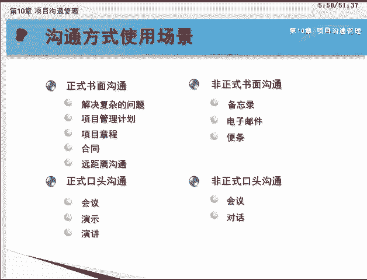

按照PM报告指南第五版，项目沟通管理主要是通过三个过程完成。首先要通过规划沟通管理过程，制定项目沟通管理计划，指导整个项目的沟通。之后进入管理沟通过程，就是根据沟通管理计划。

对项目信息进行收集、整理发布。另外，在整个项目生命周期中，执行控制沟通过程来监控沟通情况，以满足干系人的沟通需求。本课程我们将一起学习第十章项目沟通管理知识领域的第一节规划沟通管理。

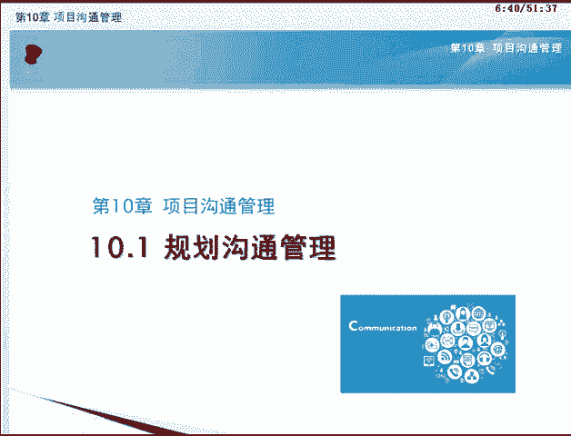

通过本课程的学习，我们将要达到以下目标。包括。掌握规划沟通管理过程的定义。熟悉规划沟通管理过程的输入工具与技术和输出。熟悉常用工具和技术。沟通需求分析、沟通技术、沟通模型和沟通方法等。

掌握沟通渠道数量的计算方法。掌握沟通管理计划的内容。本课程我们将按照如画面所摄的大纲为您讲述。首先是对规划沟通管理过程的基本含义进行讲解。接下来分析规划沟通管理过程的输入、工具和技术以及输出。

课程的最后是本节核心知识整理。在学习本过程之前，我们先来了解一个基本概念。什么是规划沟通管理。规划沟通管理是根据干系人的信息需要和要求及组织的可用资产情况，制定合适的项目沟通方式和计划的过程。

本过程的主要作用是识别和记录与干系人的最有效率且最有效果的沟通方式。规划项目沟通对项目的最终成功非常重要。规划沟通不当，可能导致各种问题。例如，信息传递失误，向错误的受众传递信息。

与干谢人沟通不足或误解相关信息。所有项目都需要进行信息沟通，但是各项目的信息需求和信息发布方式可能差别很大。

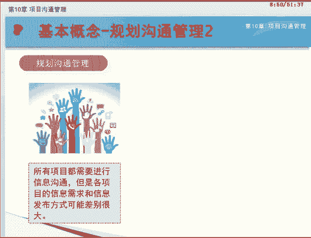

规划沟通时需要考虑的重要因素，包括。谁需要什么信息和谁有权接触这些信息？他们什么时候需要信息？信息应存储在什么地方？信息应以什么形式存储？如何检索这些信息？是否需要考虑时差、语言障碍和跨文化因素等。

接下来让我们来看看沟通管理计划是如何被制定出来的。规划沟通管理就是依据项目管理计划中已有的子计划，考虑干系人登记册中识别出的所有干系人的信息需求。

使用沟通需求分析、沟通技术、沟通模型、沟通方法等工具与技术，最后得到最终的子计划、沟通管理计划。这是规划沟通管理过程的数据流向图。可以看到该过程通过输入输出与其他过程进行交互。

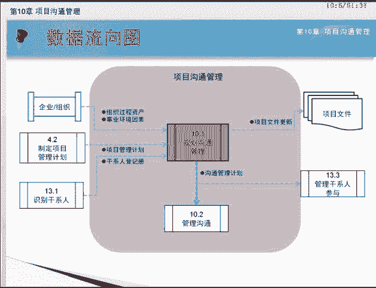

规划沟通管理过程共有4个输入，分别是项目管理计划、干系人登记册、事业环境因素和组织过程资产。接下来我们会依次介绍。

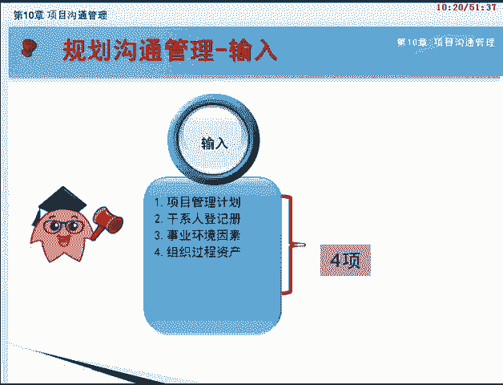

规划沟通管理时，需要参考整个项目已有的项目管理以及子计划。项目管理计划提供了将如何执行监控和结束项目的信息。

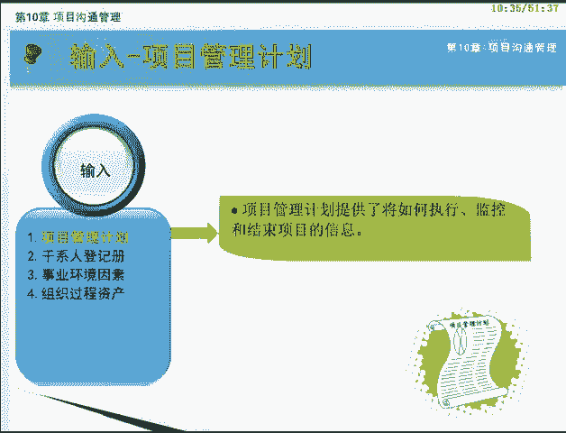

而干系人登记册记录了干系人在项目中的地位及利益以及初步需求，为规划与项目干系人的沟通提供信息。

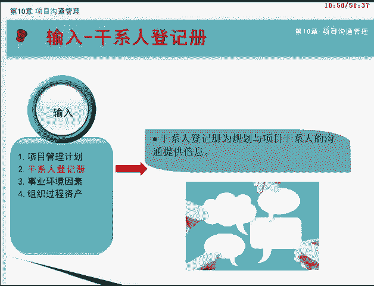

规划沟通管理过程与事业环境因素有密切关系，因为组织结构对项目的沟通需求有重大影响。所有事业环境因素都可作为本过程的输入，因为沟通需要适应项目环境。所有组织过程资产也都可作为本过程的输入。其中。

经验教训和历史信息尤为重要。他们有助于人们深入了解以往类似项目中的沟通决策及其实施结果，有助于指导当前项目的沟通活动规划。规划沟通管理过程有5个工具和技术。

分别是沟通需求分析、沟通技术、沟通模型、沟通方法以及会议。下面让我们一块来学习。

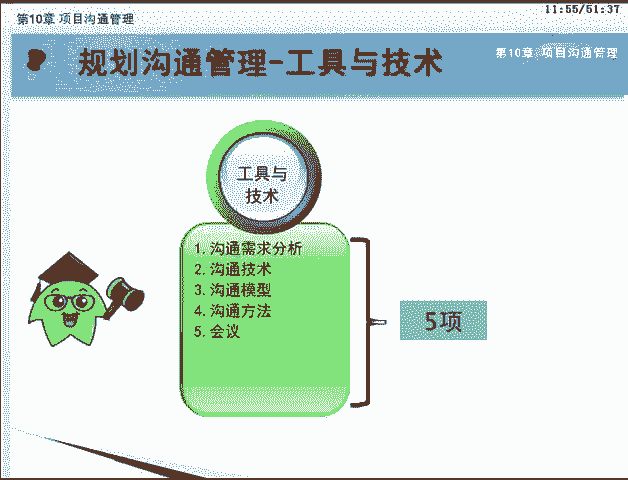

通过沟通需求分析，确定项目干系人的信息需求，包括所需信息的类型和格式，以及信息对干系人的价值。项目资源只能用来沟通有利于项目成功的信息，或者那些因缺乏沟通会造成失败的信息。

任何项目都会涉及不同干系人之间的沟通，项目经理、团队成员、领导、各职能部门、客户、外包方、监理单位等。这些干系人都要进行沟通。干系人的数量决定了信息沟通复杂性。

项目经理应该把可能的沟通渠道或途径的数量看作是一个项目沟通复杂程度的指标。

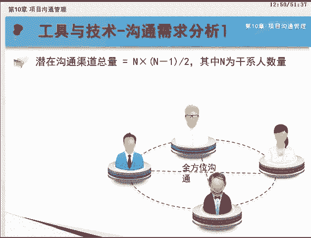

我们要牢记这个公式。潜在沟通渠道总量等于N乘以N减1之后除以2。其中N为干系人数量。该公司认为，项目中每两个干系人之间都要有一条沟通渠道，这是最坏的情况。从公式中可以看出，干系人越多，沟通渠道越多。

沟通管理的难度也就越大。例如。在画面中的项目团队里有4个干系人。如果信息可以在所有干系人之间进行充分沟通，那么这种全方位沟通所形成的潜在沟通渠道总量可以应用公式来计算，其中N为干系人数量等于4。

在本例中共有4乘以4减1除以2，共有6条潜在沟通渠道。如果项目团队扩大到8人潜在沟通渠道，就变成8乘以8减1除以2等于28条。我们可能注意到了，干系人数量翻倍时，沟通渠道不仅仅是翻倍了。

而是呈指数级递增的。可以采用各种技术在项目干系人之间传递信息。例如，从简短的谈话到冗长的会议，从简单的书面文件到可在线查阅的广泛资料，都是项目团队可以使用的沟通技术。

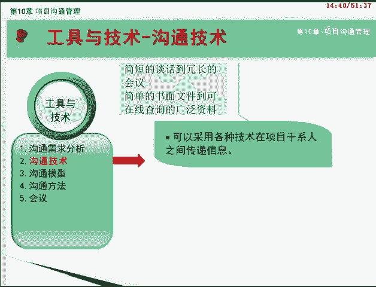

选择沟通技术时需要考虑的因素，包括信息需求的紧迫性、技术的可用性、易用性、项目环境、信息的敏感性和保密性等。沟通模型是指用于促进沟通和信息交换的模型，可能因不同项目而异，也可能因同一项目的不同阶段而异。

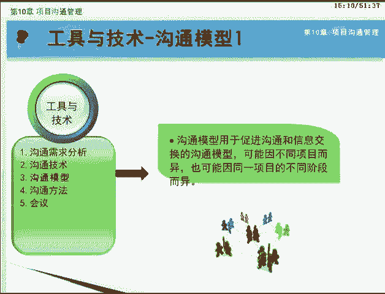

画面上展示的是沟通模型。

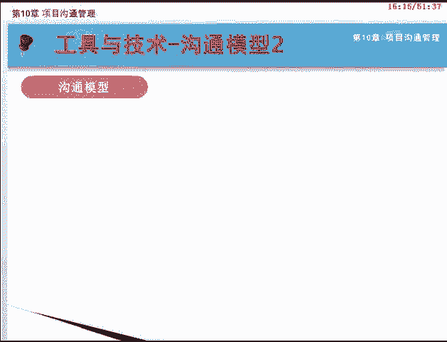

其中包括沟通双方及发送方和接收方。首先由发送方把需要发送的信息进行编码。经过编码的信息，经由媒介传递给接收方。一般来讲，信息在传输过程中会引入一定的噪声。接收方把得到的信息进行解码。接收到信息后。

接收方需告知对方已收到信息，这被称为告知收悉。但这并不一定意味着同意或理解信息。

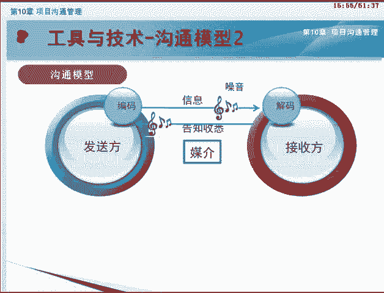

在获得信息并理解后，接收方必须向发送方发送反馈信息，告知自己理解的信息。反馈信息的传递方式跟原始信息一样，也要经过编码、传输、解码几个步骤。发送方在取得反馈信息后，也要对他进行解码，直到这里。

一次完整的沟通才算完成。从沟通模型中我们可以看到。沟通中，信息发送方对信息的编码和接收方对信息的解码都会直接影响沟通的质量。在沟通中，发送方负责信息的传递，需确保信息的清晰性和完整性。

需要确认信息已被正确理解。接收方负责确保完整的接收信息，正确的理解信息，并需要告知收悉或做出适当的回应。从沟通模型可以看出，沟通是个双向的过程，沟通中必须有反馈。可以使用多种沟通方法。

在项目干系人之间共享信息。沟通方法大致可以分为三类。

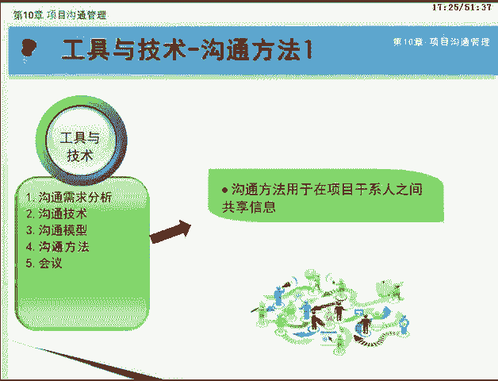

交互式沟通。在两方或多方之间进行多项信息交换。这是确保全体参与者对特定话题达成共识的最有效的方法。包括会议电话、及时通信、视频会议等。第二种是推式沟通。把信息发送给需要接收这些信息的特定接收方。

这种方法可以确保信息的发送，但不能确保信息送达受众或被目标受众理解。推事沟通包括信件、备忘录、报告、电子邮件、传真、语音邮件、日志、新闻稿等。第三种是拉式沟通，用于信息量很大或受众很多的情况。

要求接收者自行。访问信息内容。这种方法包括企业内网、电子在线课程、经验教训、数据库、知识库等。规划沟通过程中，需要与项目团队展开讨论和对话，以及回应各干系人对项目信息的相关请求。

这些讨论和对话通常以会议的形式进行。会议可在不同的地点举行，如项目现场或客户现场，可以是面对面的会议或在线会议。我们知道在项目中需要召集很多会议，在制定沟通管理计划时，应该把这些会议考虑进去。

下面列出项目中几类重要的会议。项目例会。项目的例会通常是项目中最重要的会议之一，一般以周为单位召开，是项目团队内部沟通的主要平台。对于某些大型项目，也可采用双周或月的方式。一般来讲。

项目例会由项目经理主持召开。项目例会上的议题包括项目进展程度调查和汇报，项目问题的解决，项目潜在风险的评估，项目团队人力资源协调。项目启动会议。项目启动会议一般在项目团队内部和外部举行两次。

内部启动会重点解决内部的资源调配和约束条件的确认。而外部启动会主要是协调甲方和乙方的项目接口工作。

项目总结会议。项目总结会议在项目结束时召开，每个项目都要举行。目的如下，一。了解项目全过程的工作情况，以及相关的团队或成员的绩效状况。2、了解出现的问题，并提出改进措施。

3、了解项目全过程中出现的值得吸取的经验，并进行总结。4。对总结过后的文档进行讨论，通过后就存入公司的知识库，从而形成企业的知识积累。此外，项目中的会议还包括评审会。

以及为了解决未预料的重大事项或问题而临时召开的会议。规划沟通管理过程共有两个输出，分别是沟通管理计划和项目文件更新。下面我们一块来学习。

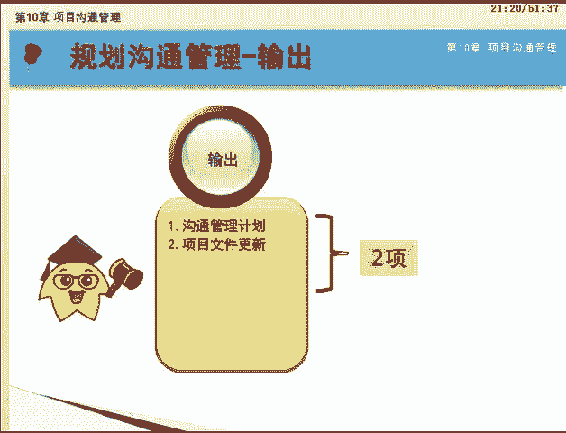

沟通管理计划是项目管理计划的组成部分，描述将如何对项目沟通进行规划、结构化和监控。沟通管理计划可以是独立的文档，也可以嵌入项目管理计划中。

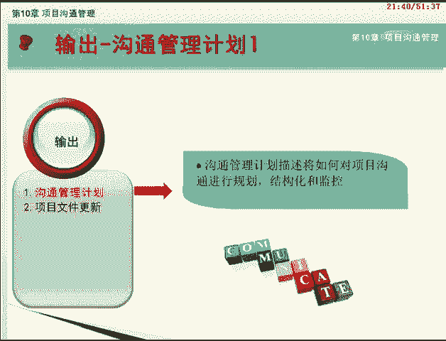

沟通管理计划的主要内容包括。根系人的沟通需求。需要沟通的信息，包括语言、格式、内容、详细程度等。还有发布信息的原因。发布信息及告知收悉或做出回应的实现和频率。负责沟通相关信息的人员。

负责授权保密信息发布的人员。将要接收信息的个人或小组。传递信息的技术或方法，如备忘录、电子邮件和新闻稿等。还有为沟通活动分配的资源。

包括时间和预算问题升级程序用于规定下层员工无法解决问题时的上报时限和上报路径。还有随项目进展对沟通管理计划进行更新与优化的方法以及通用术语表。项目信息流向图、工作流程、报告清单、会议计划等。

最后是沟通制约因素，通常来自特定的法律、法规、技术要求和组织政策等。另外，沟通管理计划中，还可包括关于项目状态会议、项目团队会议、网络会议和电子邮件信息等的指南和模板。

沟通管理计划中也应包含对项目所用网站和项目管理软件的使用说明。在编制沟通规划时，项目组可以综合各方面的沟通需求，把沟通的细节以表格形式记录下来，并体现到沟通管理计划中。

这样在项目实施时就可以逐项执行并检查，避免遗漏。

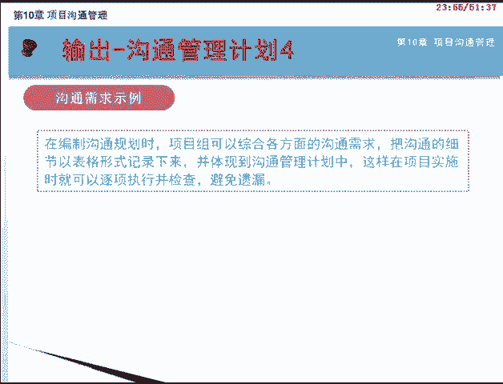

下面是沟通需求列表的一部分。我们看到在沟通管理计划中已经明确指出了项目中需要产生哪些文件，文件的发送人和接收人是谁？文件以什么格式传送，预计交付时间等信息。有了这个列表。

项目经理和干系人就明确了自己在沟通中的责任，督促文件发送人及时完成文件，并发送给接收人。同时，如果接收人在规定日期没有取得文件，他也知道向谁去要，不会产生混乱。在规划沟通过程，可能需要更新的项目文件。

包括项目进度计划和干系人登记册。

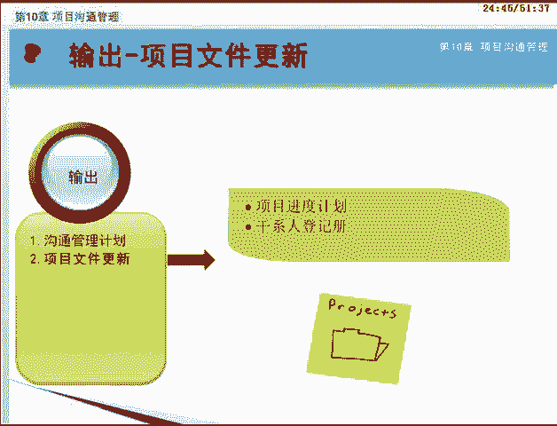

本过程的主要内容到此学习完毕。现在我们来回顾一下本过程的核心知识。规划沟通管理是根据干系人的信息需要和要求，制定合适的项目沟通方式和计划的过程。沟通规划不当，可能导致各种问题。

潜在沟通渠道总量等于N乘以N减1除以2。沟通渠道越多，沟通管理的难度就越大。沟通是个双向的过程，沟通中必须有反馈。沟通方法可以分为交互式沟通、推式沟通、拉式沟通。

沟通管理计划描述将如何对项目沟通进行规划、结构化和监控。恭喜你完成规划沟通管理过程的学习，我们下节课见。

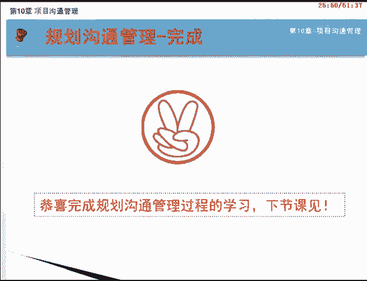

本课程我们将一起学习第十章项目沟通管理知识领域的第二节管理沟通。

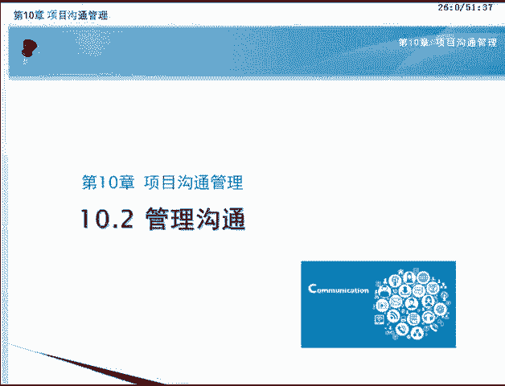

通过本课程的学习，我们将要达到以下目标。包括。掌握管理沟通过程的定义，熟悉管理沟通过程的输入工具与技术和输出。熟悉报告绩效的含义。熟悉信息管理系统在管理沟通过程中的作用。

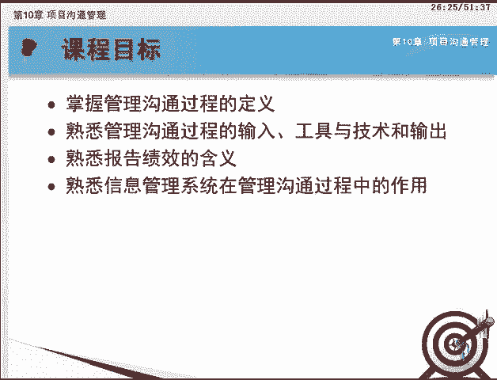

本课程我们将按照如画面所示的大纲为您讲述。首先是对管理沟通过程的基本含义进行讲解。接下来分析管理沟通过程的输入、工具与技术以及输出。课程的最后是本节核心知识整理。在学习本过程之前。

我们先来了解一个基本概念。什么是管理沟通。管理沟通是根据沟通管理计划，生成、收集、分发、储存、检索及最终处置项目信息的过程。本过程的主要作用是促进项目干系人之间实现有效率且有效果的沟通。

在管理沟通过程中，需要关注如何收集生成管理和发布信息。要考虑如下事项。发送接收模型。也就是我们前面介绍过的沟通模型，其中也包括反馈回路，为互动和参与提供机会，有助于清除沟通障碍。

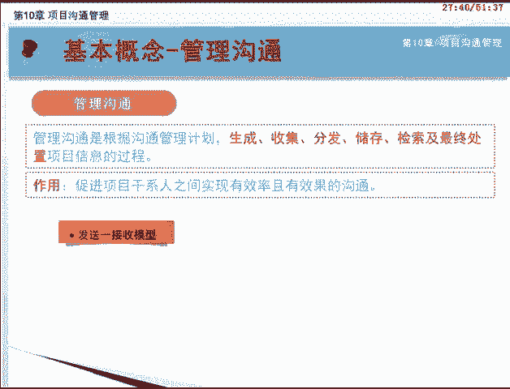

没这选择。是根据情形需要，何时使用书面沟通或口头交流，何时准备非正式备忘录或正式报告，何时进行面对面沟通或通过电子邮件沟通。写这风格要合理使用主动或被动语态、句子结构，以及合理选择词汇。

会议管理技术需要注意，事先准备议程和处理冲突。演示技术要特别注重知晓形体语言和视觉辅助设计的作用。引导技术可以用来帮助建立共识和客服障碍。倾听技术强调主动倾听、消除妨碍理解的障碍。

接下来让我们来看看如何管理沟通。该过程在沟通管理计划的指导下，收集工作绩效报告，利用各种沟通技术和方法进行项目中的沟通工作。该过程的成果就是完成了项目中有效沟通。

并把沟通中有意义的信息更新到组织过程资产中。这是管理沟通过程的数据流向图。可以看到，该过程通过输入输出与其他过程进行交互。

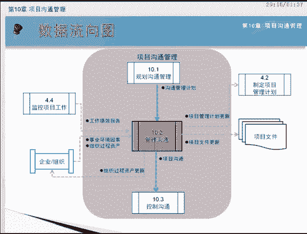

管理沟通过程共有4个输入，分别是沟通管理计划、工作绩效报告、事业环境因素和组织过程资产。下面我们依次来了解他们吧。

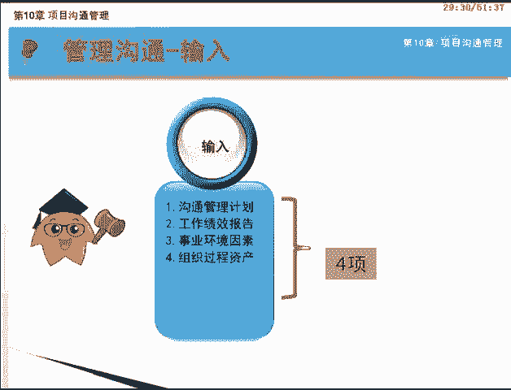

沟通管理计划来自于规划沟通管理过程，他描述将如何管理沟通，也就是如何对项目沟通进行规划、结构化和监控。工作绩效报告来自于监控项目工作过程，汇集了项目绩效和状态信息，可用于促进讨论和建立沟通。

全面准确、及时的工作绩效报告，对开展本过程非常重要。

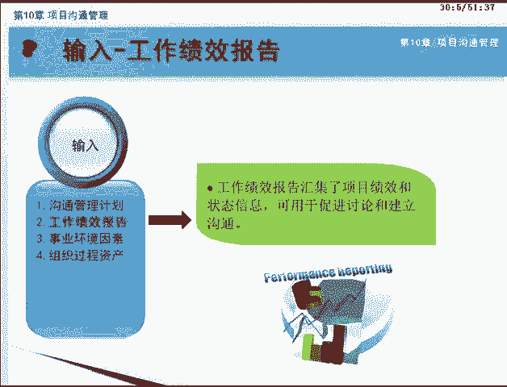

能够影响管理沟通过程的事业环境因素，包括组织文化和结构、政府或行业标准及规定。项目管理信息系统。

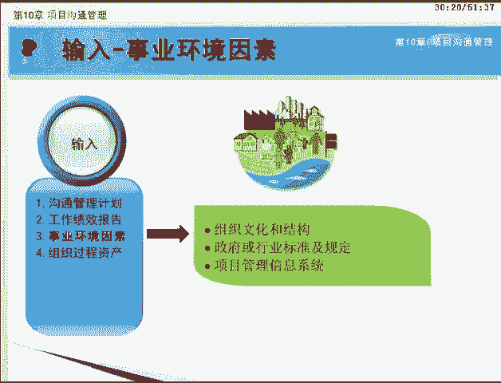

可能影响管理沟通过程的组织过程、资产，包括。有关沟通管理的政策、程序、过程和指南。相关模板以及历史信息和经验教训等。管理沟通过程共有5个工具与技术。

分别是沟通技术、沟通模型、沟通方法、信息管理系统和报告绩效。下面我们一块来学习。

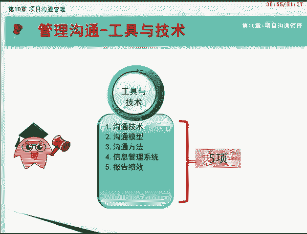

沟通技术、沟通模型和沟通方法。这三个工具与技术已经在规划沟通管理过程介绍过。管理沟通时就是要根据具体情况，合理的选择沟通技术、模型与方法，以保证沟通的效率和效果。

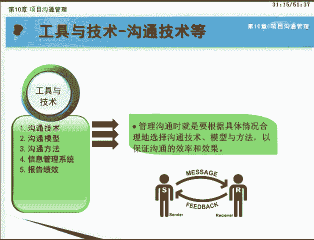

随着项目的复杂程度不断提高，往往需要处理大量信息。这就需要使用信息管理系统来管理和分发项目信息。信息管理系统可以是手工或电子形式的，包括。纸质文件管理如信件备忘录、报告和新闻稿。

电子通信管理如电子邮件、传真、语音信箱、电话、视频和网络会议。网站和网络出版。项目管理电子工具如基于网页界面的进度管理工具和项目管理软件、会议和虚拟办公真识软件、门户网站和协同工作管理工具等。

报告绩效是管理沟通过程中一项重要的工具和技术。在PM报早期版本中，它是作为一个独立的过程出现的。报告绩效只收集和发布绩效信息，包括状况报告、进展测量结果以及预测结果。

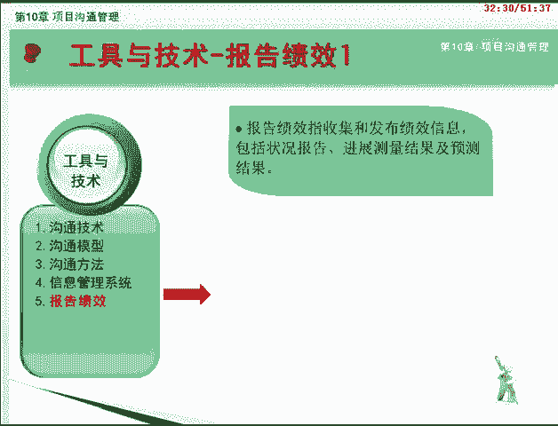

需要注意以下两点。一、应该定期收集基准数据与实际数据进行对比分析，以便了解和沟通项目进展与绩效，并对项目结果做出预测。2。需要向每位受众适度的提供信息。报告绩效的形式可以是简单的状态报告。

也可以是详尽的报告，可以是定期编制的报告，也可以是异常情况报告。简单的状态报告可显示诸如完成百分比的绩效信息。或每个领域的状态指示图。

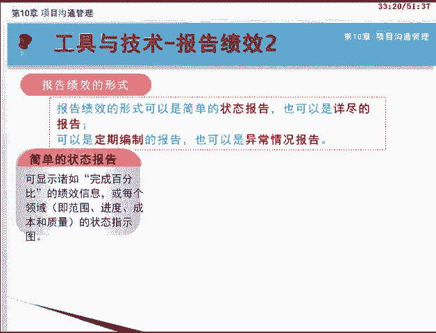

详尽的报告可能包含项目方方面面的信息，以反映项目过去的绩巧、现在的偏差以及未来的预测信息。具体可以包括。对过去绩效的分析，项目预测分析，包括时间与成本。风险和问题的当前状态。本报告期完成的工作。

下个报告期需要完成的工作。本报告期被批准的变更的汇总。需要审查和讨论的其他相关信息。管理沟通过程共有4个输出，分别是项目沟通、项目管理计划更新、项目文件更新和组织过程资产更新。我们一块来学习。

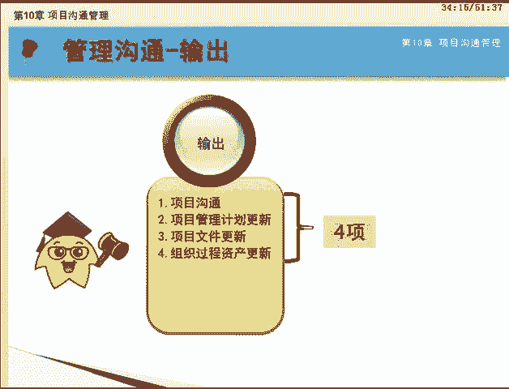

项目沟通是个宽泛的概念，它泛指项目信息的创建、分发、接收、告知收悉和理解。

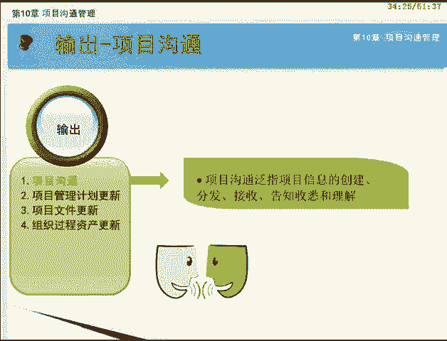

项目沟通的具体形式也多种多样，可包括绩效报告可交付成果状态、进展情况和已发生的成本。项目沟通会受到多种因素影响，例如，信息的紧急性和影响、信息传递方法。信息机密程度的。在管理沟通过程。

可能需要基于项目当前绩效与绩效测量基准PMB的对比情况，更新项目管理计划中的项目基准及与沟通管理干系人管理有关的信息。

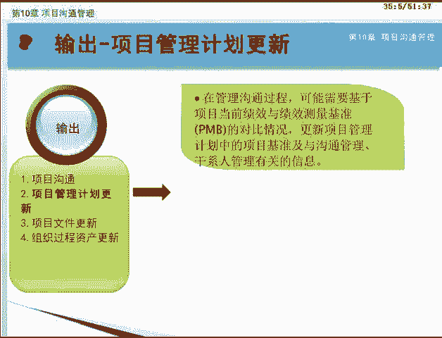

那么什么是绩效测量基准呢？绩效测量基准PMB是经过批准的项目工作计划，用来与项目执行情况相比较，以测量偏差采取管理控制。绩效测量基准通常是项目的范围、进度和成本参数的综合，有时还会包含技术和质量参数。

在管理沟通过程，可能需要更新的项目文件，包括。问题日志、项目进度计划以及项目资金需求等。

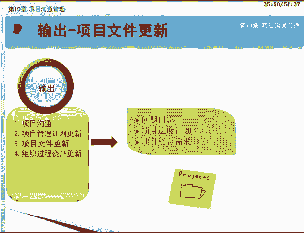

管理沟通这个过程可能需要更新的组织过程资产。包括。给干系人的通知、项目报告、项目演示资料。项目记录。干系人的反馈意见。经验教学文档等。本过程的主要内容到此全部学习完毕。

现在我们来回顾一下本过程的核心知识。管理沟通是根据沟通管理计划生成、收集、分发、储存、检索及最终处置项目信息的过程。

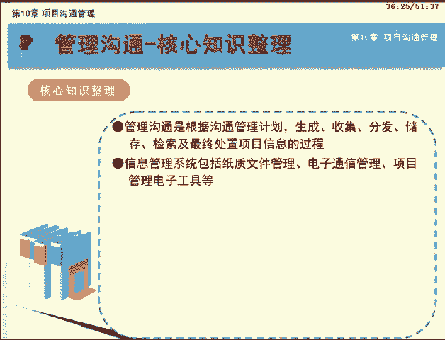

信息管理系统包括纸质文件管理、电子通信管理、项目管理、电子工具等。报告绩效只收集和发布绩效信息，包括状态报告、进展测量结果及预测结果。项目沟通的形式包括绩效报告、可交付成果状态、进展情况和已发生的成本。

恭喜你完成管理沟通过程的学习，我们下节课见。

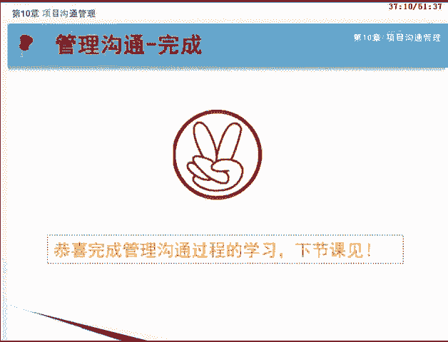

本课程我们将一起学习第十章项目沟通管理知识领域的第三节控制沟通。

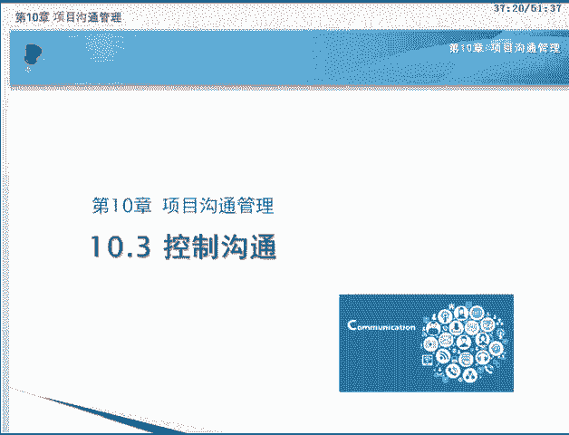

通过本课程的学习，我们将要达到以下目标。包括。掌握控制沟通过程的定义，熟悉控制沟通过程的输入工具与技术和输出。熟悉控制沟通过程与沟通管理知识领域其他过程的联系。

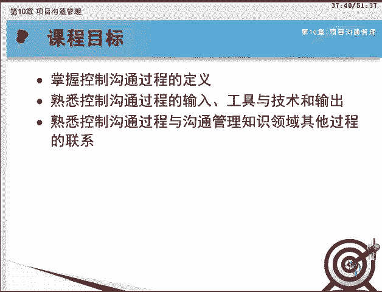

本课程我们将按照如画面所示的大纲为您讲述。首先是对控制沟通过程的基本含义进行讲解。接下来分析控制沟通过程的输入、工具与技术以及输出。课程的最后由本节核心知识整理。在学习本过程之前。

我们先来了解控制沟通的基本概念。控制沟通是在整个项目生命周期中对沟通进行监督和控制的过程，以确保满足项目干系人对信息的需求。通俗的讲，控制沟通就是不断监控沟通管理计划的执行情况。

监督干系人是否及时收到了需要的信息。分析沟通管理计划或相关基准是否需要进行变更。

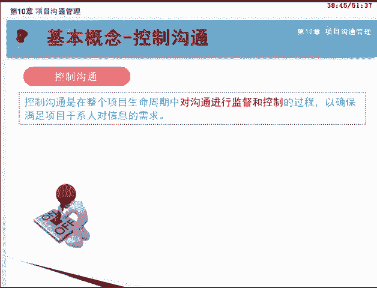

本过程的主要作用是。随时确保所有沟通参与者之间的信息流动的最优化。确保在正确的时间把正确的信息传递给正确的受助。控制沟通过程可能引发重新开展规划沟通管理和管理沟通过程。

这种重复体现了项目沟通管理各过程的连续性。接下来让我们来看看如何控制沟通。该过程在项目管理计划的指导下，借助信息管理系统收集和对比项目沟通信息、问题日志以及基础的工作绩效数据。最终生成工作绩效信息。

必要情况下提出变更请求。这是控制沟通过程的数据流向图，可以看到，该过程通过输入输出与其他过程进行交互。控制沟通过程共有5个输入，分别是项目管理计划、项目沟通、问题日志、工作绩效数据以及组织过程资产。

下面我们依次来了解他们吧。

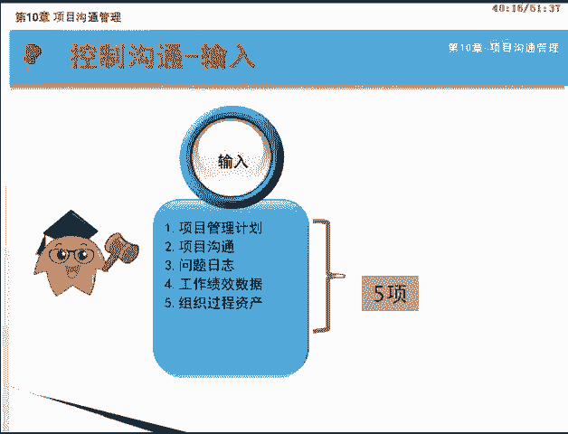

项目管理计划描述了项目将如何被执行、监督、控制和收尾。他为控制沟通过程提供了有价值的信息，包括根系人的沟通需求，发布信息的原因，发布所需信息的实现和频率。负责发布信息的个人或小组。

将接收信息的个人或小组。在控制沟通过程中，需要监督沟通情况，以采取相应行动。项目沟通可能包括可交付成果状态。进度进展情况已发生的成本等。

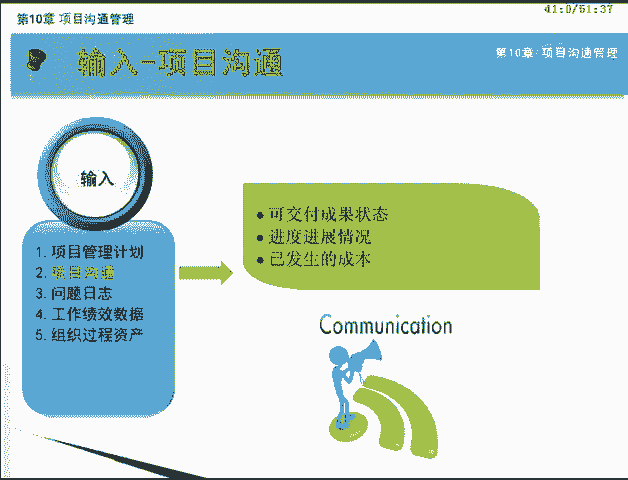

问题日志用于记录和监督问题的解决。问题日志中的信息对控制沟通过程十分重要，因为它记录了已经发生的问题，并为后续沟通提供了平台。我们在讲解第九章管理项目团队的输入时，详细介绍了问题日志。

感兴趣的学员可以参考。工作绩效数据是对收集到的信息的组织和总结。并展示与绩效测量基准的比较结果。

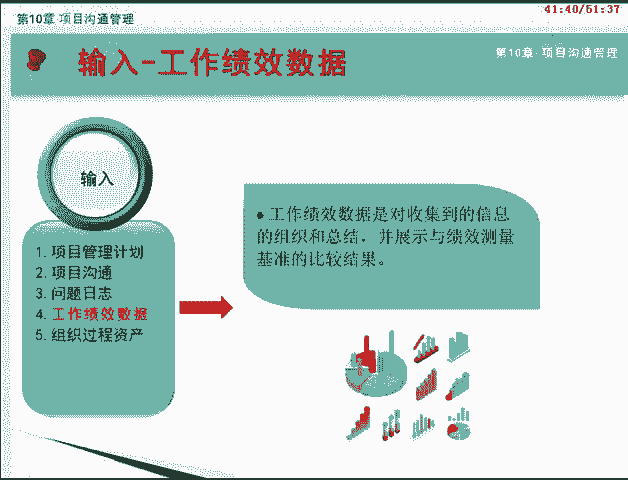

可能影响控制沟通过程的组织过程资产，包括报告模板定义沟通的政策、标准和程序。可用的特定沟通技术。允许的沟通媒介记录保存政策以及安全要求。控制沟通过程有三个工具和技术，分别是信息管理系统、专家判断和会议。

下面我们一块来学习。

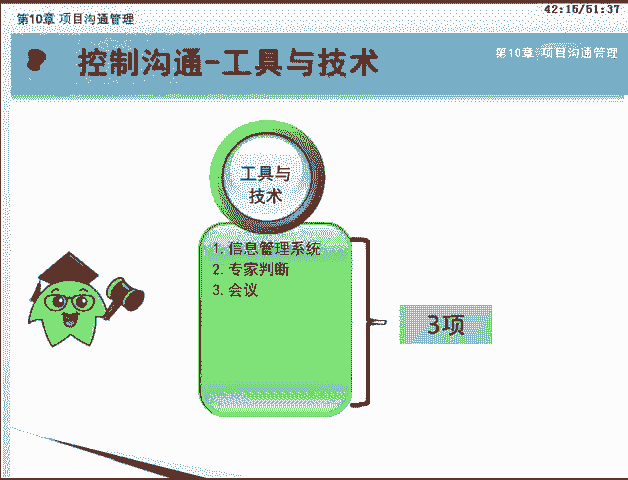

信息管理系统为项目经理获取储存和向干系人发布有关项目成本进展和绩效等方面的信息，提供了标准工具。这也是控制沟通过程中使用的重要工具。在表现形式上。可以用报表、电子表格和演示资料的形式分发报告。

可以借助图表，把项目绩效信息可视化。在控制沟通过程，项目团队经常依靠专家判断来评估项目沟通的影响，采取行动或进行干预的必要性。应该采取的行动。对这些行动的责任分配以及行动时间安排。

可能需要针对各种技术和管理细节使用专家判断。

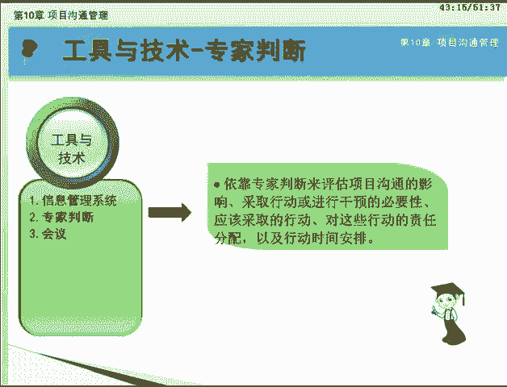

在控制沟通过程中，需要与项目团队展开讨论和对话，以便确定最合适的方法，用于更新和沟通项目绩效，以及回应各干系人对项目信息的请求。这些讨论和对话通常以会议的形式进行。

项目会议也包括与供应商、卖方和其他项目干系人的讨论与对话。最后我们看一下控制沟通过程的5个输出，分别是工作绩效信息变更请求、项目管理计划更新、项目文件更新以及组织过程资产更新。我们一块来学习。

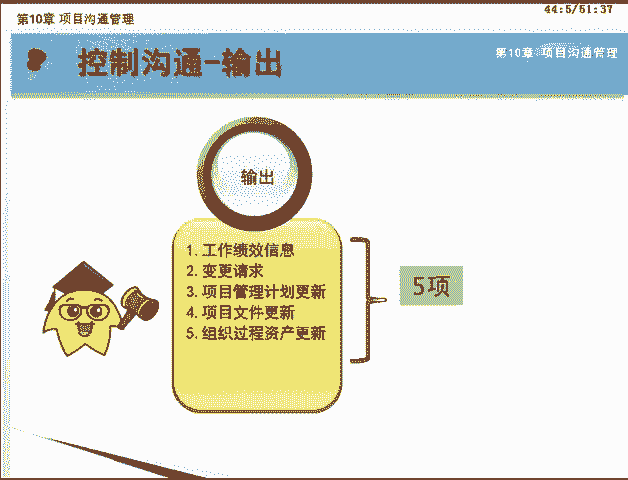

工作绩效信息是对收集到的绩效数据的组织和总结。这些绩效数据通常根据干系人所要求的详细程度展示项目状况和进展信息。在控制沟通过程可能引发的变更，包括。

新的或修订的成本估算活动排序、进度日期、资源需求和风险应对方案分析。对项目管理计划和文件的调整。提出纠正措施，以使项目预期的未来绩效重新与项目管理计划保持一致。提出预防措施。

降低未来出现不良项目绩效的可能性。所有的变更请求都要交给实施整体变更控制过程处理。控制沟通过程可能引起对沟通管理计划及项目管理计划其他组成部分的更新。如项目的干系人管理计划和人力资源管理计划等。

在控制沟通过程，可能更新的项目文件包括预测绩效报告和问题日志。

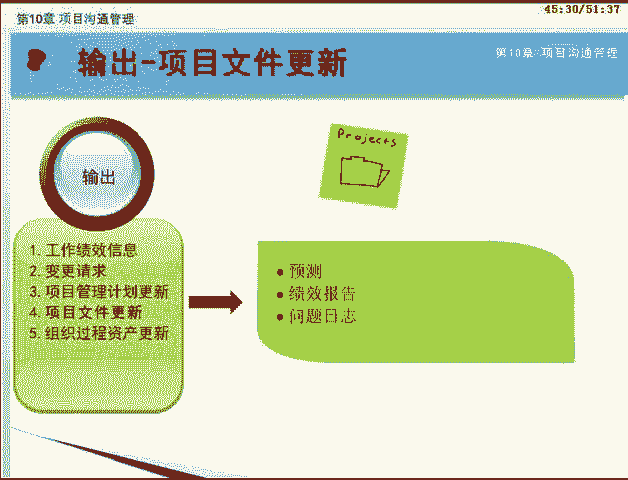

在控制沟通过程，可能更新的组织过程资产包括。报告格式和经验教学文档。这些文档可成为项目和执行组织历史数据库的一部分。可能包括问题成因，采取特定纠正措施的理由和项目期间的其他经验教训。

本过程的主要内容到此学习完毕。现在我们来回顾一下本过程的核心知识。控制沟通是在整个项目生命周期中对沟通进行监督和控制的过程。以确保满足项目干系人对信息的需求。

控制沟通就是要确保在正确的时间把正确的信息传递给正确的受众。

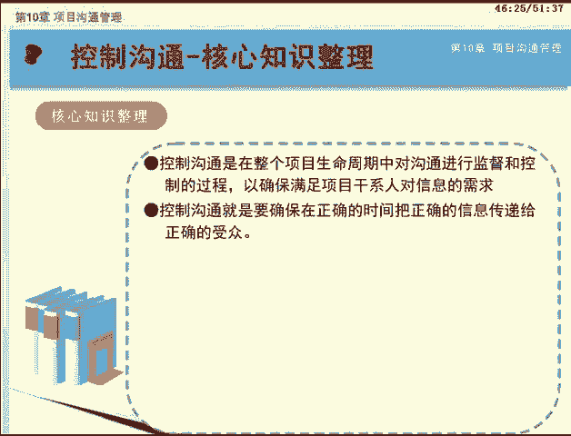

信息管理系统为项目经理获取储存和向干谢人发布有关项目成本、进度进展和绩效等方面的信息提供了标准工具。恭喜你完成控制沟通过程的学习。

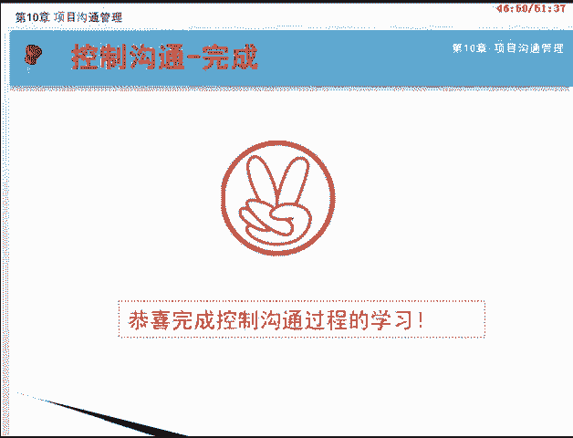

首先我们来看常用的几种沟通方式的效果。如图所示。科学发现，如果我们把沟通中所传递的所有信息量看作是百分之百，那么语言所传递的信息只占整个沟通的7%。这部分既包括了口头表达的语言，也包括书面文字语言。

再来看声音语音语调所传递的信息占整个沟通的38%。也就是说，同样的文字内容，用不同的重音或抑扬顿挫的语气说出来，所传递的信息很可能是不一样的。最后肢体语言所隐含的信息量是最大的。占整个沟通的55%。

肢体语言包含说话时的位置、姿势、面部表情、手势等。

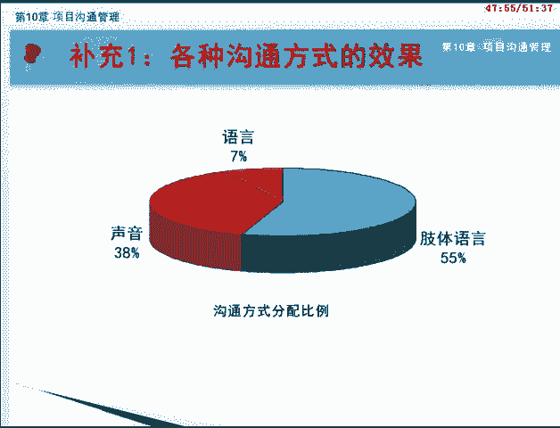

在进行日常沟通时，我们也需要了解一些高效沟通的小技巧，如目光接触，身体前倾，保持愉快的面部表情，面对面而坐，全神贯注做记录等。这些技巧中，你是否发现很多并不是教你如何用语言来沟通。

而是用脸部表情和姿势等来沟通呢？其实在所有沟通技巧里，最好的技巧只有两个字倾听。

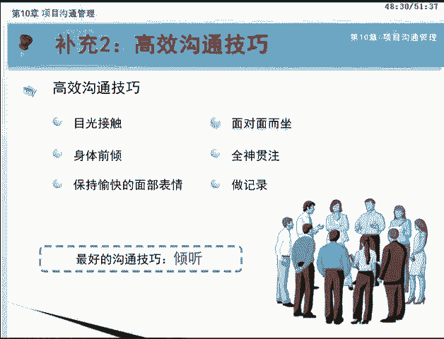

在项目中，为了提高沟通的效率，需要把握如下一些基本原则。一、沟通内外有别。对内有分歧，对外要一致，一个团队要以一种声音说话，比如团队在客户面前要信心十足，步调一致，意见统一，千万不要在客户面前争吵。

2、非正式的沟通有利于关系的融洽。人们的语言风格往往和他意识里扮演的角色有关。在正式场合，说话正规书面，自我保护的意识也强烈一些。而在私下的场合，人们的语言风格可能是非正式和随意的。

反倒能获得更多的信息。3、采用对方能接受的沟通风格。注意字体语言语态给对方的感受。无论在语言和字体表达上，都需要传递一种合作和双赢的态度，使双方无论在问题的解决上，还是在气氛上都达到双赢。

是、沟通的升级原则。横向沟通有平等的感觉，但合理使用纵向沟通，有助于问题的快速解决。借用联想的沟通四步骤说，第一步和对方沟通，第二步，和对方的上级沟通。第三步，和自己的上级沟通。第四步。

自己的上级和对方的上级沟通。这反映了沟通的升级原则。各位学员，第十章项目沟通管理知识领域的三个过程已经全部学习完毕，现在就来做个总结吧。首先，需要根据干系人的信息需求，制定合适的沟通方式和沟通计划。

这是规划沟通管理过程所做的工作。有了沟通管理计划，要在项目执行过程中执行这个计划，对信息进行收集、处理、存储发布，这是管理沟通过程需要完成的工作。最后，控制沟通过程对项目沟通情况进行全程监控。

确保沟通管理计划被正确执行，确保干系人得到了所需信息，出现偏差，及时提出变更请求。

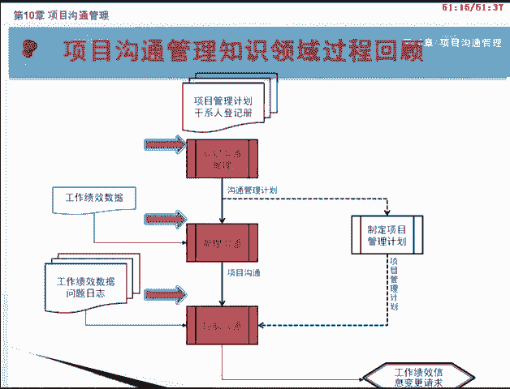

各位学员，恭喜您已经完成了第十章项目沟通管理这一知识领域的学习。建议接下来继续学习第十一章项目风险管理，我们下堂课见。

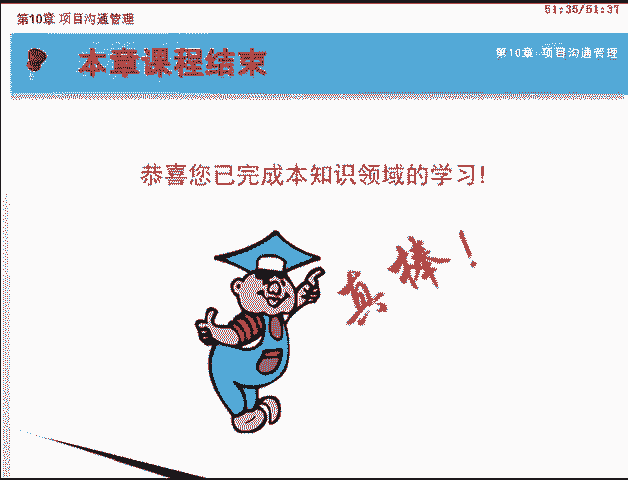