# PMP项目管理 - P13：13 - 自学力 - BV1EZ4y1p7LB

欢迎来到PMP项目管理网络课程的学习。本课程基于最新发布的P安报告指南第五版。下面我们将一起学习第十三章项目干系人管理。项目干净人管理知识领域共有4个过程。他们分散在启动规划、执行和监控过程组。其中。

识别干系人过程位于启动过程组，目的是从各种渠道识别出所有与项目有利益关系的个人群体或组织，并分析和记录他们的相关信息。规划干系人管理过程位于规划过程组，要对干系人的需要、利益和影响进行分析。

并制定合适的管理策略，以调动干系人参与项目的积极性。管理干系人参与过程位于执行过程组，是在整个项目生命周期中与干系人进行沟通和协作，以满足其需要与期望并解决实际出现的问题。

控制干系人参与过程位于监控过程组。目的是全面监督项目干系人之间的关系，调整策略和计划，以调动干系人参与。这四个过程不但彼此互相作用，而且还与其他知识领域中的过程相互作用。

这些过程在位置图中的位置是考试必考的重点，请务必记下来。此外，在学习的过程中，大家还要格外注意每个过程所使用的工具和技术，它们也是本章的重点内容。任何项目都会涉及方方面面的干系人。

项目经理应该正确识别干系人，善于管理干系人期望。应该把干谢人满意度作为一个关键的项目目标来进行管理。

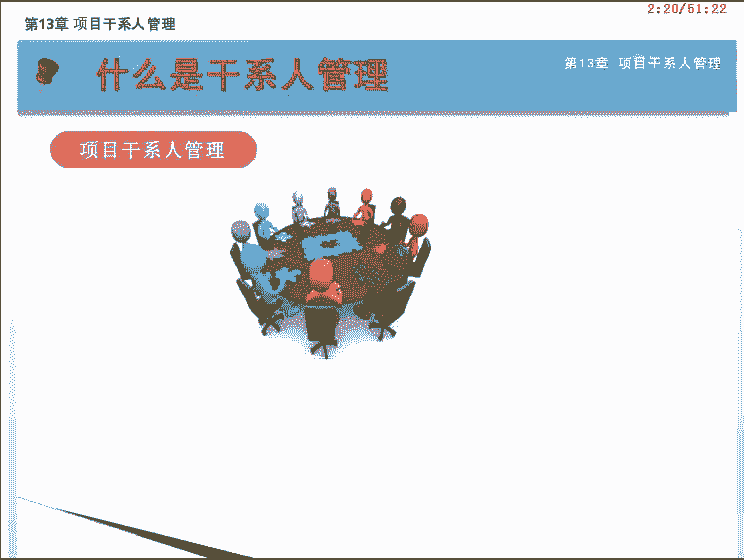

项目干系人管理包括用于开展下列工作的各个过程。识别能影响项目或受项目影响的全部人员、群体或组织。分析干系人对项目的期望和影响，制定合适的管理策略，来有效调动干系人参与项目决策和执行。

干事人管理与沟通管理紧密联系。本课程我们将一起学习第十三章项目干系人管理知识领域的第一节。

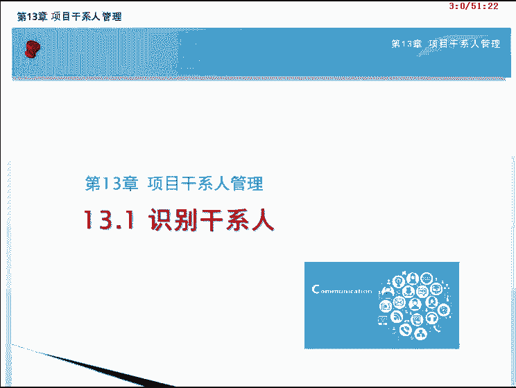

识别该系人。通过本课程的学习，我们将要达到以下的学习目标。包括。掌握识别干写人过程的定义和基本观点。了解采购文件的基本含义。实际本过程的输入工具于技术及输出的内容。了解识别干系人的步骤及分类方法。

能够利用干系人分析工具对干系人进行分类。熟悉干系人登记册的组成部分，能够绘制干系人登记册。本课程我们将按照如画面所示的大纲为您讲述。首先是对识别干系人过程的基本含义进行讲解。

接下来分析识别干系人过程的输入、工具与技术以及输出。课程的最后是本节核心知识整理。

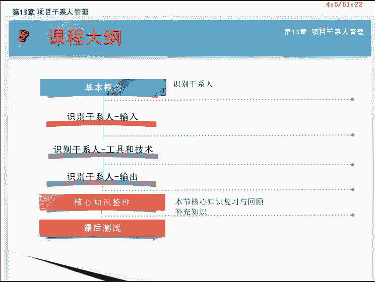

在学习本过程之前，让我们先来了解识别干系人的基本概念。

识别该系人是识别能影响项目决策活动或结果的个人群体或组织，以及被项目决策活动或结果所影响的个人群体或组织，并分析和记录他们的相关信息的过程。

这些信息包括他们的利益、参与度、相互依赖、影响力及对项目成功的潜在影响等。

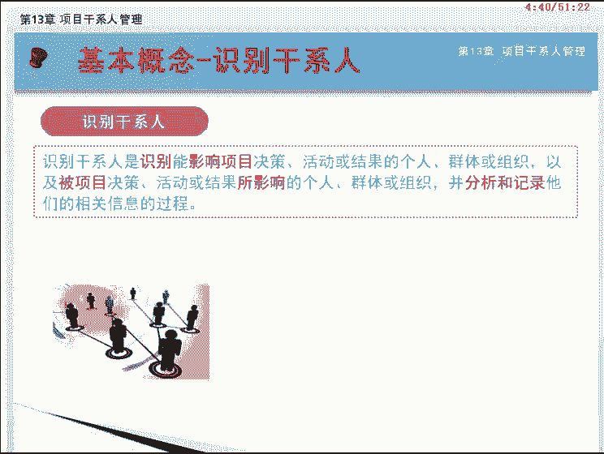

本过程的主要作用是帮助项目经理建立对各个干系人或干系人群体的适度关注。在项目或阶段的早期就识别干系人，并分析他们的利益层次、个人期望、重要性和影响力，对项目成功非常重要。

接下来让我们来看看如何识别干谢人。识别干系人在项目早期依据项目章程和采购文件对干系人进行识别分析分类，并把这些信息保存到干系人登记册中。这里是识别干系人过程的数据流向图。可以看到。

该过程通过输入输出与其他过程进行交互。

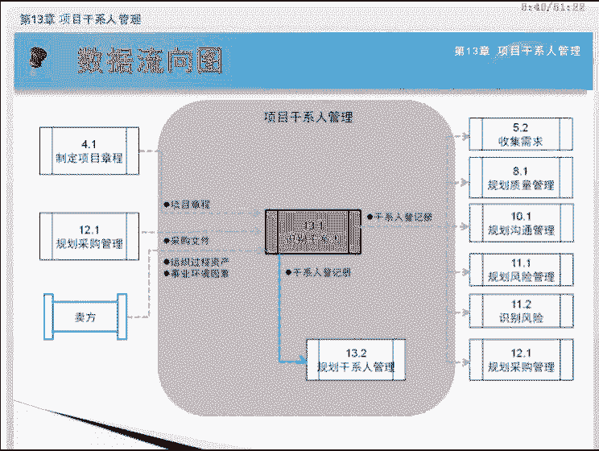

识别干系人过程共有4个收入，分别是项目章程、采购文件、事业环境因素以及组织过程资产。下面我们依次来了解他们吧。

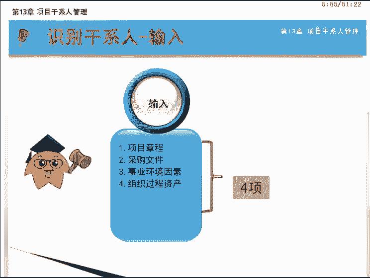

项目章程可提供与项目有关的受项目结果或执行影响的内外部各方的信息。如项目发起人、客户、团队成员、项目参与小组和部门以及受项目影响的其他个人或组织。

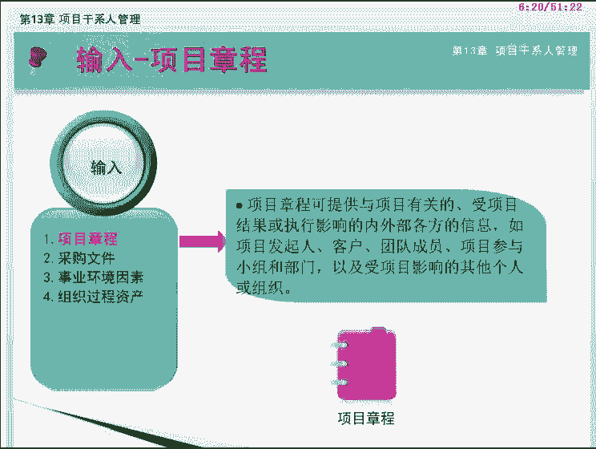

如果项目是某个采购活动的结果，或基于某个已签订的合同，那么合同各方都是关键的项目干系人，也应该把其他相关方如供应商视为项目干系人。

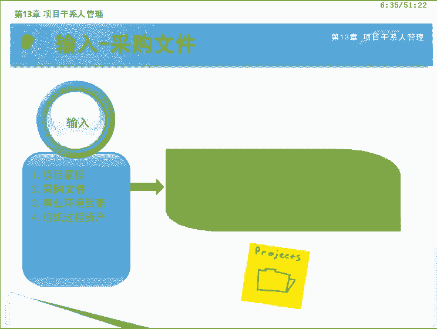

能影响识别干系人过程的事业环境因素。包括。组织文化和结构、政府或行业标准，如法规、产品标准等。还有全球区域或当地的趋势、实践或习惯。

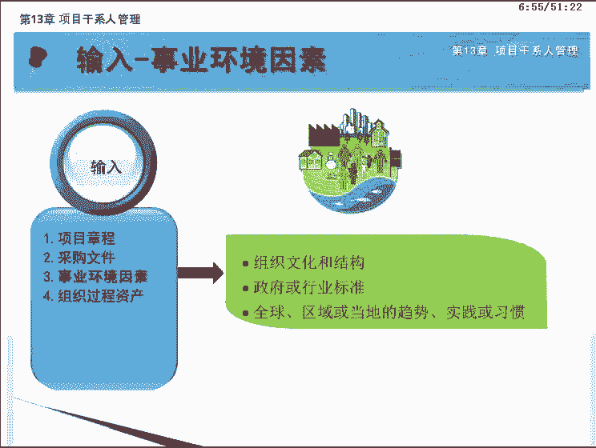

最后能够影响识别干系人过程的组织过程资产。包括。干系人登记册模板以往项目或阶段的经验教训。以往项目的干系人、登记册等。

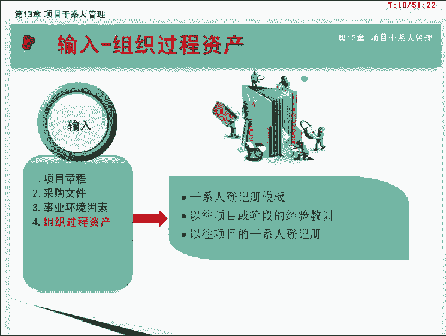

识别干系人的过程有三个工具和技术，分别是干系人分析、专家判断和会议。下面让我们一块来学习。

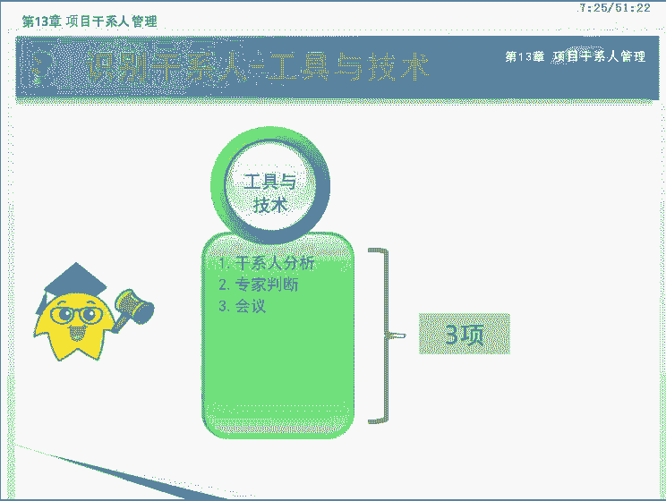

干系人分析是识别干系人过程最重要的工具和技术。干谢人分析是系统的收集和分析，各种定量与定性信息。以便确定在整个项目中应该考虑哪些人的利益。

干系人分析有两个作用。第一，通过干系人分析，识别出干系人的利益、期望和影响，并把他们与项目的目的联系起来。另外，干系人分析也有助于了解干系人之间的关系，包括干系人与项目的关系，以及干系人相互之间的关系。

以便利用这些关系来建立联盟和伙伴合作，从而提高项目成功的可能。接下来我们来学习如何对干系人进行分析。通常，干系人分析遵循识别分类、评估三步。下面我们一一介绍。第一步，识别干系人。

也就是识别全部潜在项目干系人及其相关信息。如他们的角色部门、利益、知识、期望和影响力。关键干系人通常很容易识别。应该对已识别的干系人进行访谈，直至列出全部潜在干系人。第二步，分类。

分析每个干系人可能的影响或支持，并把他们分类，以便制定管理策略。

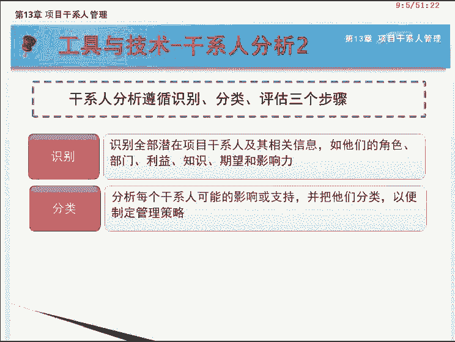

在干系人很多的情况下，就必须对干系人进行排序，以便有效分配精力来了解和管理干系人的期望。在识别和分类之后，接下来第三步要进行评估，评估关键干系人对不同情况可能做出的反应或应对。

以便策划如何对他们施加影响，提高他们的支持，减轻他们的潜在负面影响。在上面三个步骤中，第二步，干系人分类最为重要。下面我们将介绍对干系人分类的常用工具。对干系人进行分类的方法有很多。比较直观的是。

事先制定某种分类矩阵，然后把每个干洗人放置到矩阵中的不同位置。对干系人分类时，矩阵也称为方格。下面我们来看如何使用权利第一方格对干系人分类。权利是干系人的职权大小。利益是干系人对项目结果的关注程度。

权利利益方格就是根据干系人的职权大小，以及对项目结果的关注程度进行分组。如图所示，横轴表示干其人的利益值。纵轴表示根系人的权力值。我们看到干系人G和D位于权力小且影响不大的区域。

只需对他花最小的精力对其进行监督即可。而对于利益影响程度较大的C和E，则需随时告知项目进展情况。对权力大的A目标是让其满意。对于权力大且利益相关程度高的BH和F。他们是项目重要的干系人。

要对其加以重点管理。

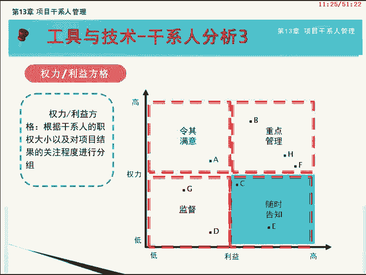

除了刚才介绍的权利利益方格，还可以使用其他两种矩阵，权利影响方格和影响作用方格。权利影响方格，根据干系人的职权大小及主动参与项目的程度进行分类。影响作用方格。

根据干系人主动参与项目的程度及改变项目计划或执行的能力进行分类。

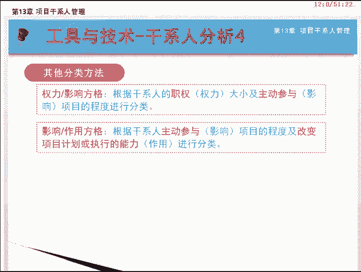

另外，还可以使用凸显模型对干系人进行分类。凸显模型是根据干系人的权利，是指施加自己意愿的能力，还有紧急程度，及需要立即关注。最后是合法性及有权参与三个维度对于干系人进行分类。为确保识别和列出全部干系人。

应该向受过专门培训或具有专业知识的小组或个人寻求专家判断和专业意见。识别干系人时，可以通过召开情况分析会议来交流和分析关于各干系人的角色、利益、知识和整体立场的信息，加强对主要项目干系人的了解。

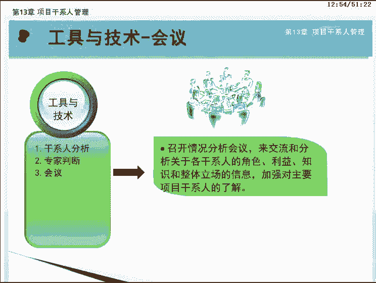

识别干系人过程的输出只有一项，那就是干系人登记册。下面我们将详细讲解。

干系人登记册用于记录已识别的干系人的所有详细信息，包括基本信息、评估信息和干系人分类三类信息。

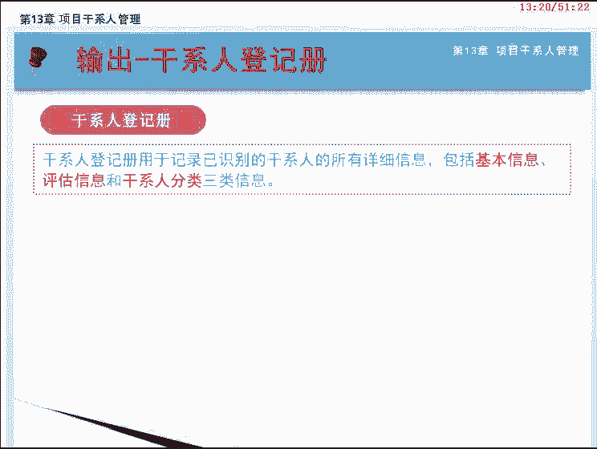

如图所示，就是干系人登记册的事例。其中。基本信息包含的具体内容有姓名、职位、地点、项目角色、联系方式。评估信息包含的具体内容有主要需求，主要期望对项目的潜在影响与生命周期的哪个阶段最密切相关。

干系人分类信息包含的具体内容有内部、外部、支持者、中立者、反对者等。应定期查看并更新干系人登记册。因为在整个项目生命周期中，干系人可能发生变化，也可能识别出新的干系人。本过程的主要内容到此学习完毕。

现在我们来回顾一下本过程的核心知识。识别干系人是识别能影响项目决策活动或结果的个人群体或组织。并分析和记录他们的相关信息的过程。干系人分析是系统的收集和分析信息。

以便确定在整个项目中应该考虑哪些人的利益。

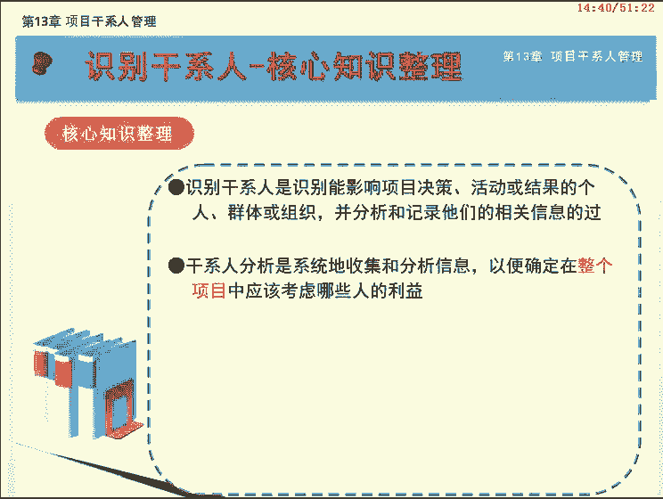

应识别全部潜在项目干系人及其相关信息。可以使用权利利一方格或其他格式的矩阵对干系人进行分类。凸显模型是根据干系人的权利、紧急程度和合法性三个维度对干系人进行分类。恭喜你完成识别干系人过程的学习。

我们下节课见。本课程我们将一起学习第十三章项目干系人管理知识领域的第二节规划干系人管理。

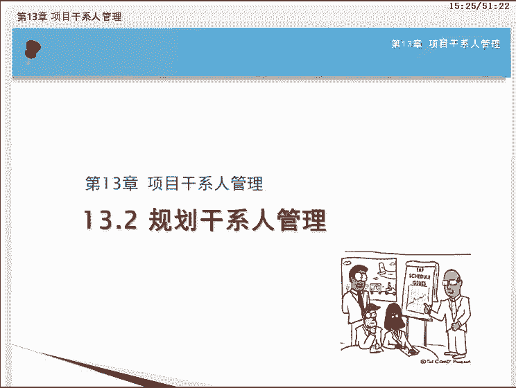

通过本课程的学习，我们将要达到以下目标。包括。掌握规划干系人管理过程的定义。熟悉规划干系人管理的输入工具与技术和输出。掌握规划干系人管理中的分析技术及评估矩阵。熟悉干系人管理计划的内容和作用。

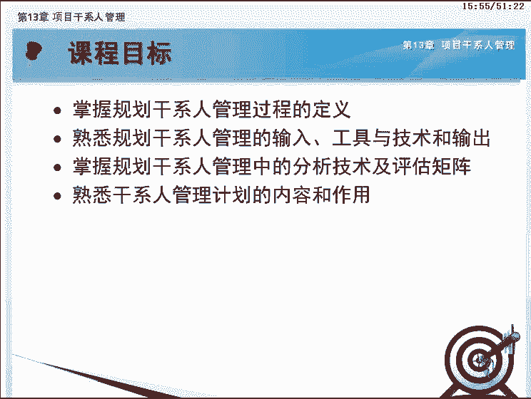

本课程我们将按照如画面所示的大纲为您讲述。首先是对规划干气人管理过程的基本含义进行讲解。接下来分析规划干系人管理过程的输入、工具与技术以及输出。课程的最后是本节核心知识整理。

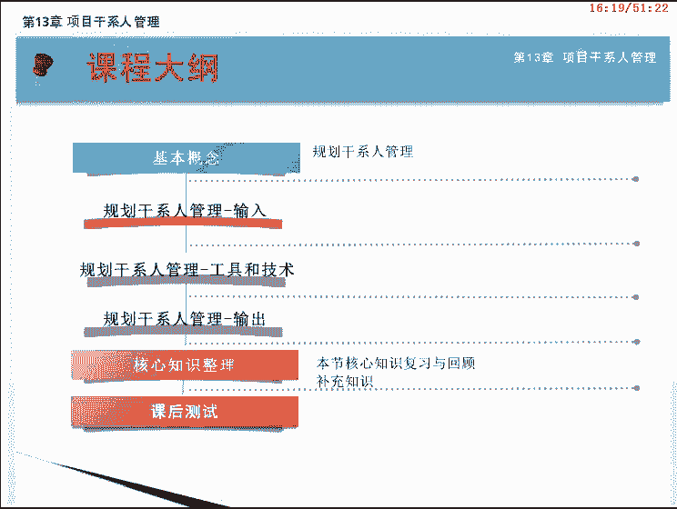

在学习本过程之前，让我们先来了解规划干系人管理这个基本概念。规划干系人管理是基于对干系人需要利益及对项目成功的潜在影响的分析，制定合适的管理策略，以有效调动干系人参与整个项目生命周期的过程。

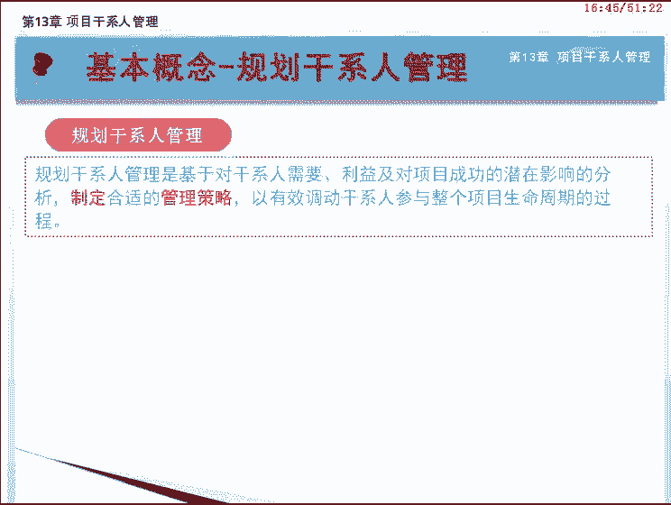

本过程的主要作用是。为于项目干系人的互动提供清晰且可操作的计划，以支持项目利益。干系人管理是在项目团队和干系人之间建立并维护良好关系，以及在项目边界内满足干系人的各种需要和需求。随着项目的进展。

干系人及其参与项目的程度可能发生变化。因此，规划干系人管理是一个反复的过程，应由项目经理定期开展。接下来让我们来看看如何规划干系人管理。该过程在项目管理计划的指导下，借助干系人登记册的信息。

利用专家判断会议和分析技术，编制出干系人管理计划。这里是规划干系人管理过程的数据流向图。可以看到，该过程通过输入输出与其他过程进行交互。

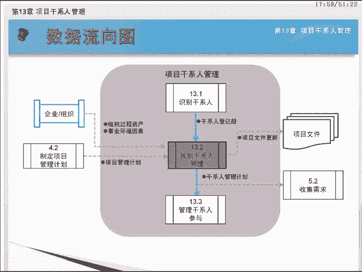

规划干系人管理过程共有4个输入，分别是项目管理计划、干系人登记册、事业环境因素以及组织过程资产。下面我们依次来了解他们。

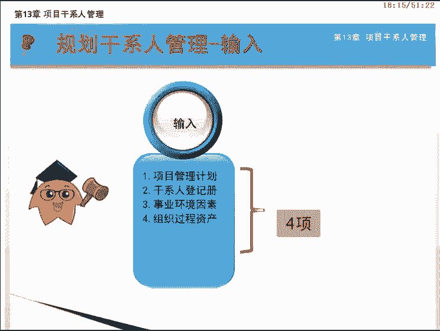

在项目管理计划中，用于制定干系人管理计划的信息，包括。项目所选用的生命周期及各阶段你采用的过程。对如何执行项目以实现项目目标的描述。对，如何满足人力资源需求。

如何定义和安排项目角色与职责、报告关系和人员配备管理等的描述。变更管理计划规定将如何监控变更？干系人之间的沟通需要和沟通技术。干系人登记册中的信息，有助于对项目干系人的参与方式进行规划。

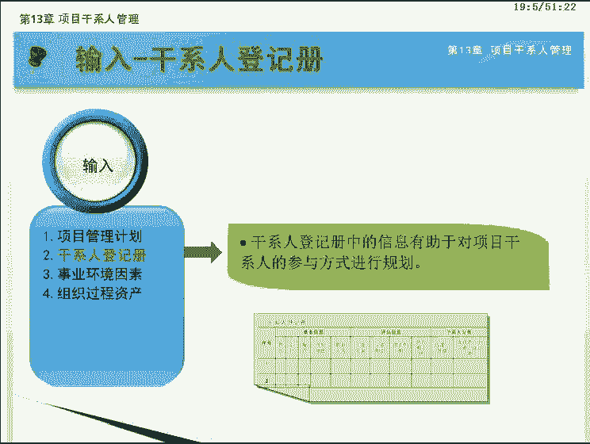

对干系人的管理应该与事业环境因素中描述的项目环境相适应。其中，组织文化、组织结构和政治氛围特别重要。因为了解这些因素，有助于制定最具适应性的干系人管理方案。

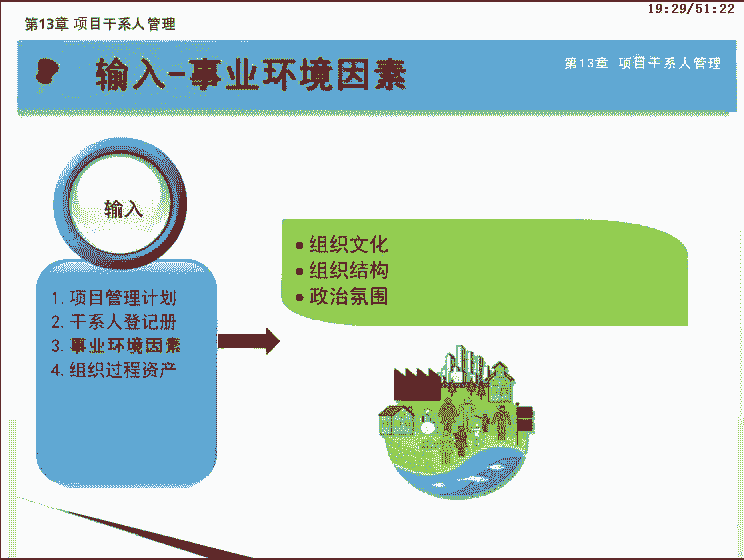

组织过程资产中的经验教学数据库和历史信息对规划干系人管理特别重要。因为能够从中了解以往的干气人管理计划及其有效性。这些信息可用于规划当前项目的干系人管理活动。

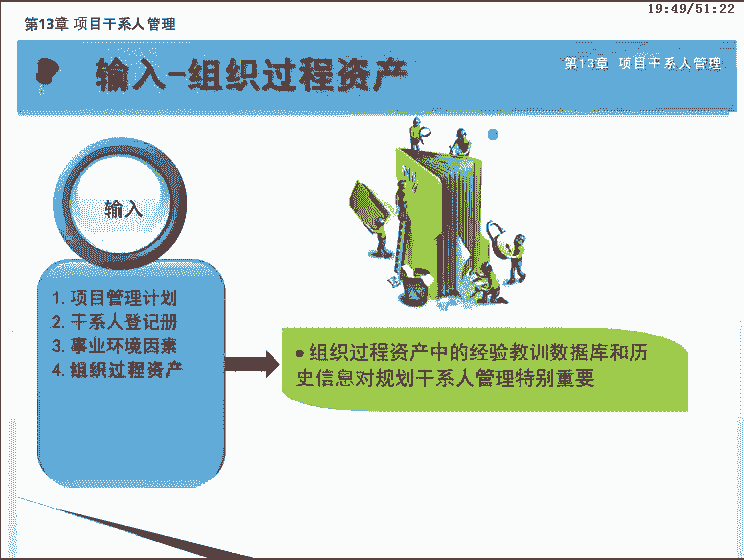

规划干系人管理过程有三个工具和技术，分别是专家判断会议和分析技术。下面我们一块来学习。

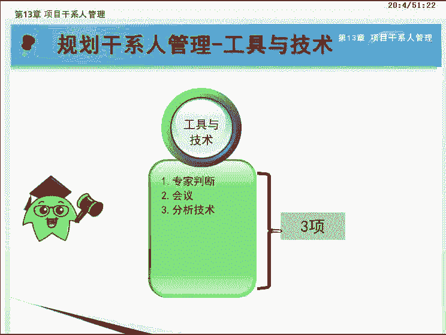

在创建干器人管理计划时。项目经理应使用专家判断方法来确定每位干系人在项目每个阶段的参与程度。例如，在项目初期可能需要高级职位的干系人的高度参与，来为项目成功扫清障碍。之后。

这些高级干系人会从领导角色转为支持角色。而其他干系人将会变得越来越重要。

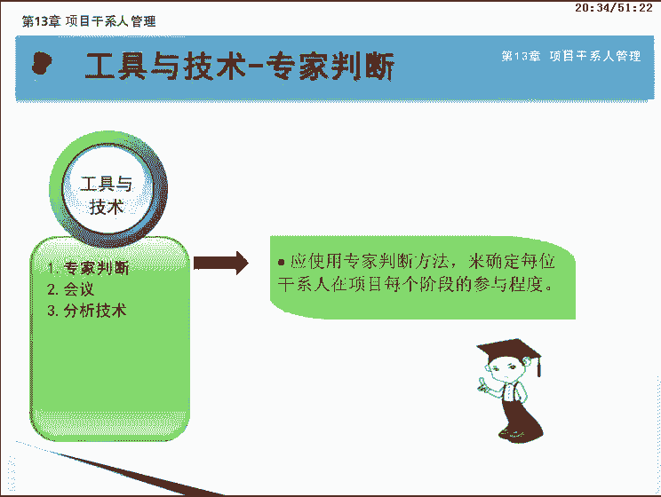

制定干系人管理计划时，应该与相关专家及项目团队举行会议。以确定所有干系人应有的参与程度。

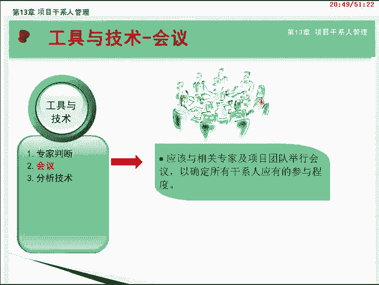

我们知道，在整个项目生命周期中，干系人的参与对项目的成功至关重要。因此应该比较所有干系人的当前参与程度与计划参与程度。

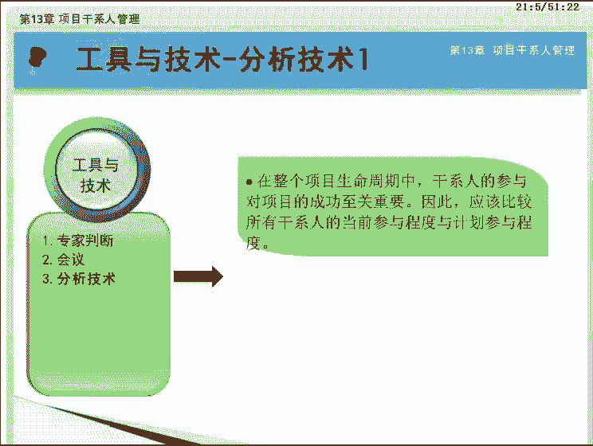

干系人的参与程度可分为如下几个类别。不知晓。只对项目和潜在影响不知晓。抵制。是指知晓项目和潜在影响抵制变更。中立。是指这晓项目既不支持，也不反对。支持。是指知晓项目和潜在影响，支持变更。领导。

是指知晓项目和潜在影响，积极致力于保证项目成功。可在干系人参与评估举阵中记录干系人的当前参与程度。如表格中所示，在这个矩阵中，C表示当前参与程度。D表示，肝气人所需参与程度。我们可以看到。

干系人三已处于所需的参与程度，而对于干系人一和二则需要做进一步沟通，采取进一步行动，使他们达到所需的参与程度。也就是说，项目团队应制定行动和沟通方案，以消除当前参与程度与所需参与程度之间的差距。

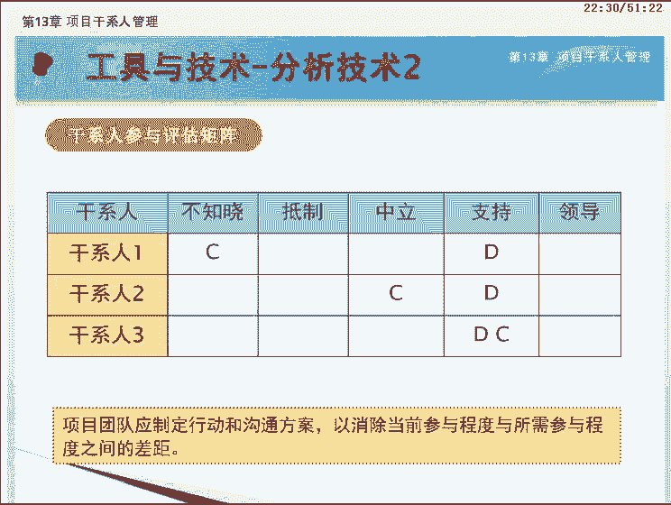

规划干系人管理过程有两个输出，分别是干系人管理计划和项目文件更新。下面我们一块来学习。

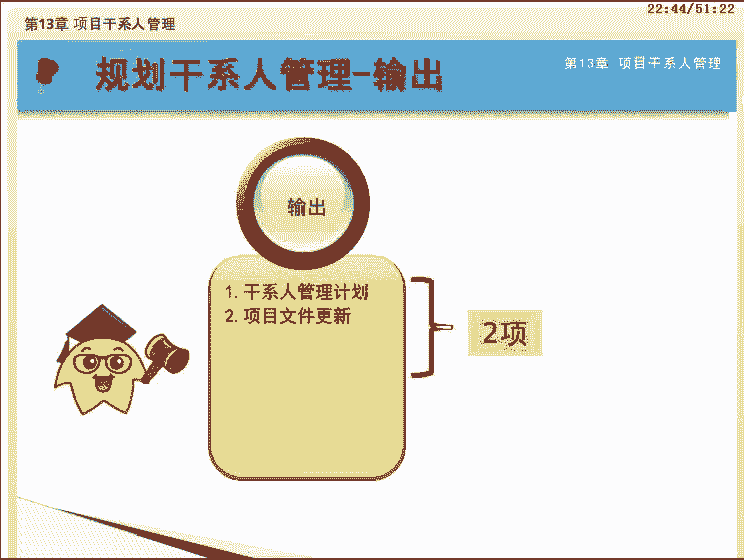

干系人管理计划是为有效调动干系人参与而规定所需的管理策略。他是项目管理计划的组成部分。

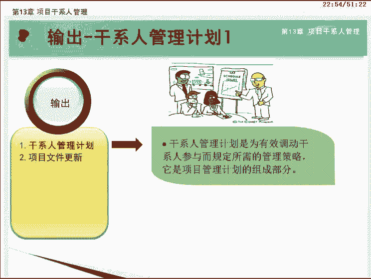

需要注意的是，干系人管理计划中可能包含不适合对外公开的敏感信息。因此，项目经理应采取恰当的预防措施。除了干系人登记册中的资料。干系人管理计划通常还包括。关键干系人的所需参与程度和当前参与程度。

感启人变更的范围和影响。感系人之间的相互关系和潜在交叉。项目现阶段的干系人沟通需求。需要分发给干系人的信息，包括语言、格式、内容和详细程度。分发相关信息的理由，以及可能对干系人参与所产生的影响。

向该些人分发所需信息的实现和频率。随着项目的进展，更新和优化干系人管理计划的方法。规划干系人管理过程可能更新的项目文件，包括项目进度计划和干系人登记册。

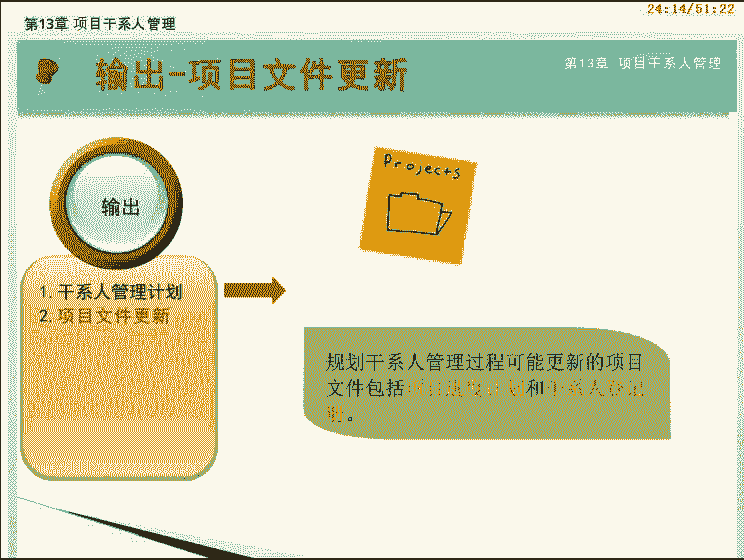

本过程的主要内容到此学习完毕。现在我们来回顾一下本过程的核心知识。规划干系人管理是基于对干系人需要利益及对项目成功的潜在影响的分析，制定合适的管理策略，以有效调动干系人参与整个项目生命周期的过程。

规划干型人管理是一个反复的过程，应由项目经理定期开展。干系人的参与程度可分为不知晓抵制中立，支持领导。

干系人管理计划中可能包含不适合对外公开的敏感信息。应采取预防措施。恭喜你完成规划干系人管理过程的学习，我们下节课见。本课程我们将一起学习第十三章项目干系人管理知识领域的第三节，管理干系人参与。

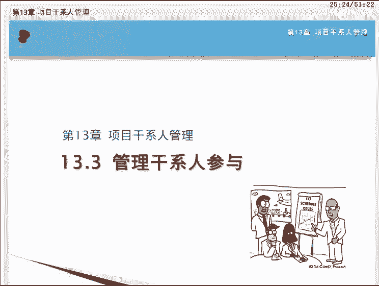

通过本课程的学习，我们将要达到以下目标。包括。掌握管理干系人参与过程的定义。了解管理干系人参与过程所需执行的活动。熟悉管理干系人参与的输入、工具与技术和输出。

本课程我们将按照如画面所示的大纲为您讲述。首先是对管理干系人参与过程的基本含义进行讲解。接下来分析管理该析人参与过程的输入、工具与技术以及输出。课程的最后是本节核心知识整理。

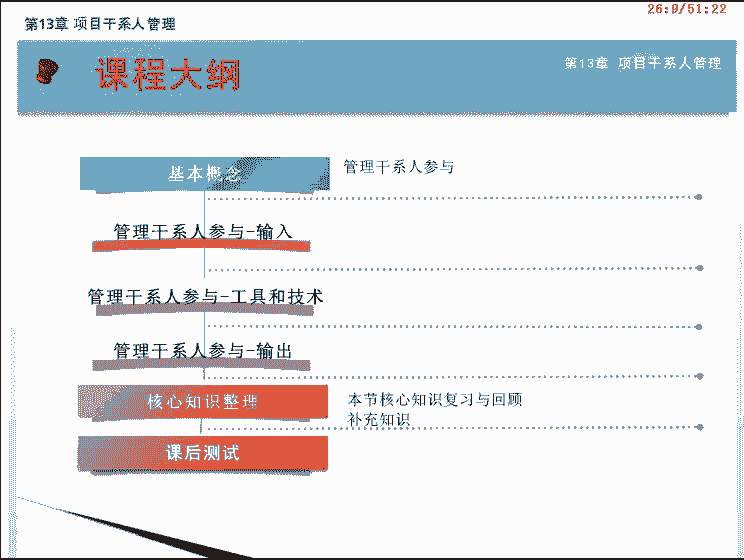

在学习本课程之前，我们先来了解管理干系人参与这个基本概念。

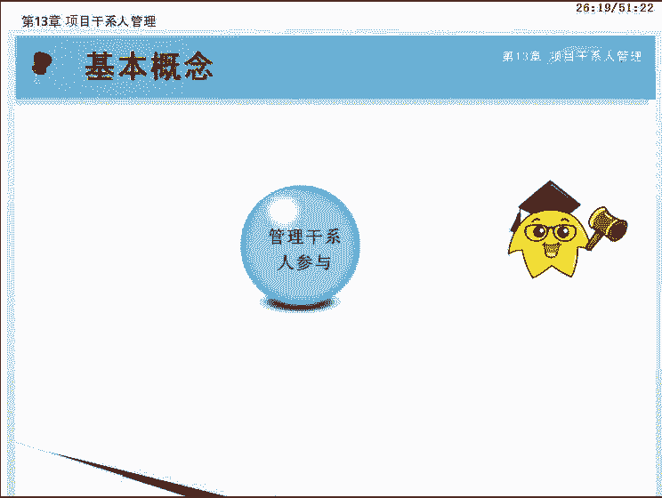

管理干系人参与是在整个项目生命周期中与干系人进行沟通和协作，以满足其需要与期望解决实际出现的问题，并促进干系人合理参与项目活动的过程。

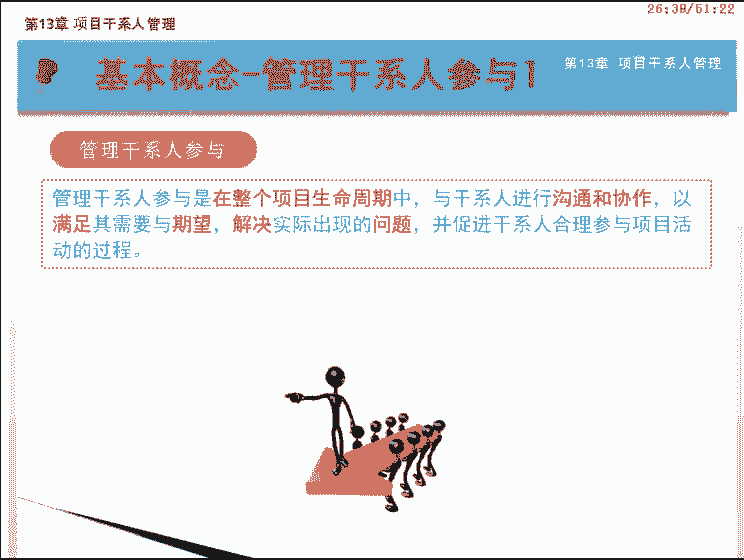

本过程的主要作用是帮助项目经理提升来自干系人的支持。并把干系人的抵制降到最低，从而显著提高项目成功的机会。管理该些人参与，包括以下活动。调动干系人适时参与项目，以获取或确认他们对项目成功的持续承诺。

通过协商和沟通，管理该些人的期望，确保实现项目目标。

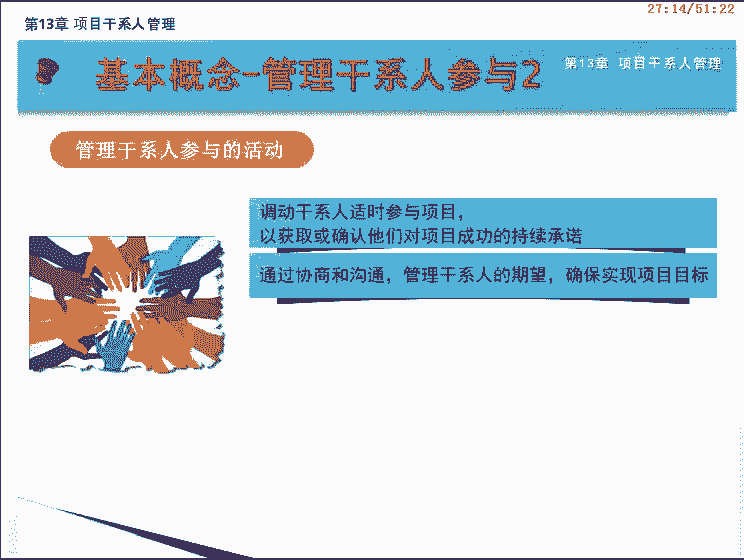

处理尚未成为问题的干系人关注点。预测干系人在未来可能提出的问题。澄清和解决已识别出的问题。通过管理干系人参与，确保干系人清晰的理解项目目标。目的收益和风险，提高项目成功的概率。

这不仅能使干系人成为项目的积极支持者，积极协助项目工作。还可以通过事先采取行动，降低甚至消除消极干系人的消极影响。接下来让我们来看看如何管理干系人参与。该过程在干系人管理计划和沟通管理计划的指导下。

考虑变更影响，利用沟通方法和软技能与各类干系人进行沟通，管理干系人参与。在此过程中，把发现的问题及时记录到问题日志中，把发生的变更提交给实施整体变更控制过程。这是管理干系人参与过程的数据流向图。

可以看到，该过程通过输入输出与其他过程进行交互。管理干系人参与过程共有4个输入，分别是干系人管理计划、沟通管理计划、变更日志和组织过程资产。下面我们依次来了解他们吧。

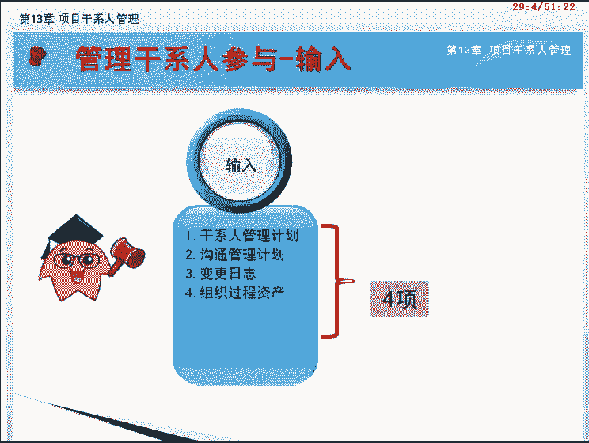

干系人管理计划为调动干系人有效的参与项目提供指导。干系人管理计划描述了用于干系人沟通的方法和技术。该计划用于确定各干系人之间的互动程度。

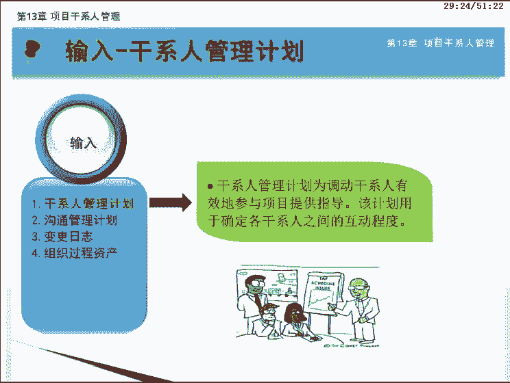

沟通管理计划为管理干系人期望提供指导和信息，所用的信息包括干系人的沟通需求，需要沟通的信息，包括语言、格式、内容和详细程度。发布信息的原因。将要接收信息的个人或群体。问题升级流程。

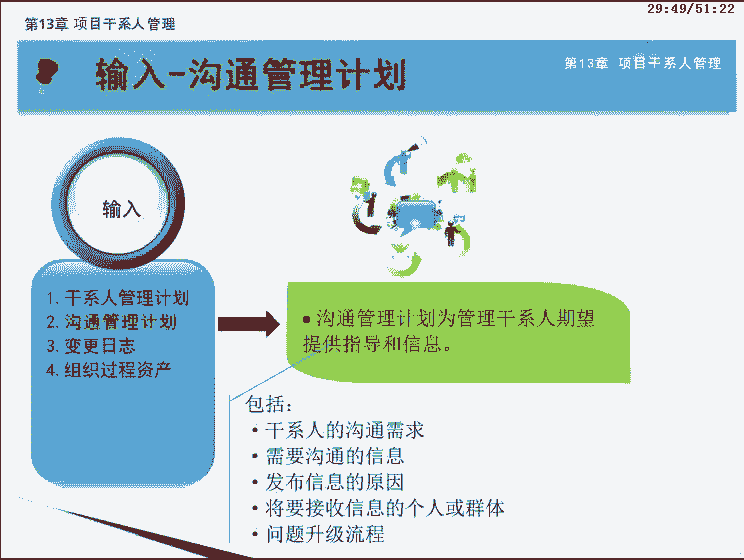

变更日志用于记录项目期间发生的变更。应该与适当的干系人就这些变更，及其对项目时间、成本和风险等的影响进行沟通。

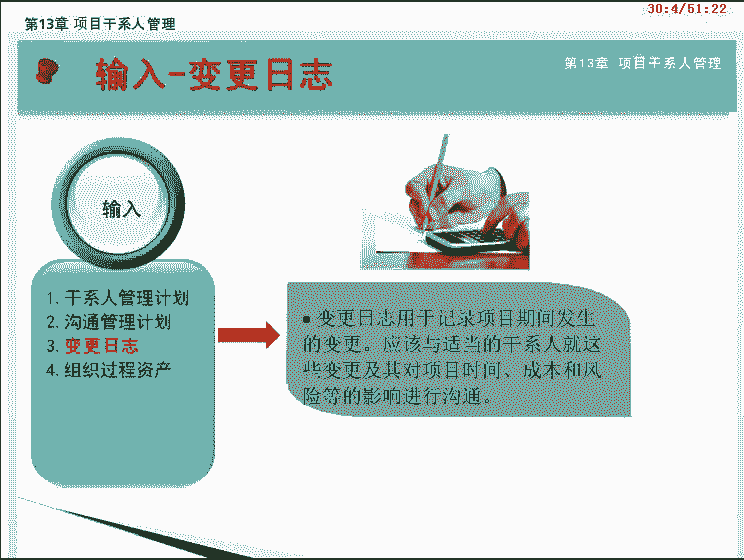

影响管理干系人参与过程的组织过程、资产包括。组织对沟通的要求。问题管理程序。变更控制程序以往项目的历史信息等。

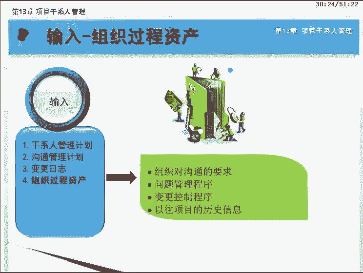

管理干系人参与过程有三个工具和技术，他们是沟通方法、人际关系技能以及管理技能。下面我们一块来学习。

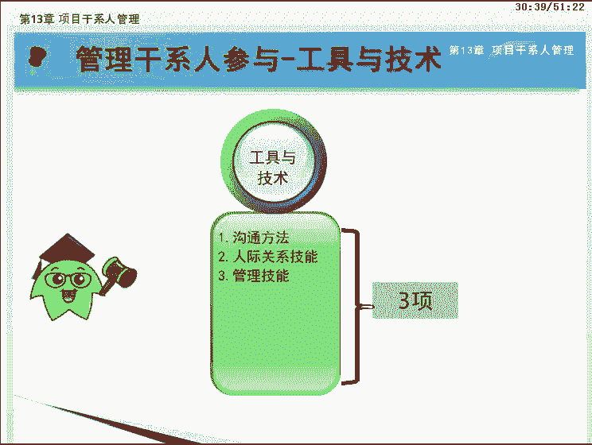

在管理干系人参与时，应该使用在沟通管理计划中确定的针对每个干系人的沟通方法。基于干系人的沟通需求，项目经理决定在项目中如何使用，何时使用及使用哪种沟通方法。

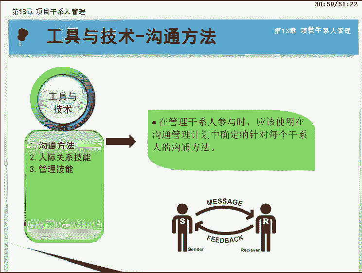

项目经理应用人际关系技能来管理干系人的期望。

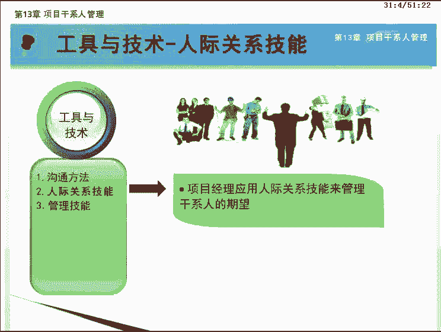

这些人际关系技能包括。建立信任，解决冲突，积极倾听客服变更阻力。详细介绍，请参看偏安报告指南第五版附录X3。项目经理应用管理技能来协调各方以实现项目目标。这些管理技能包括。引导人们对项目目标达成共识。

对人们施加影响，使他们支持项目。通过谈判达成共识，以满足项目要求。调整组织行为以接受项目成果。管理干系人参与过程共有5个输出，他们是问题日志变更请求项目管理计划更新、项目文件更新和组织过程资产更新。

下面我们一块来学习。

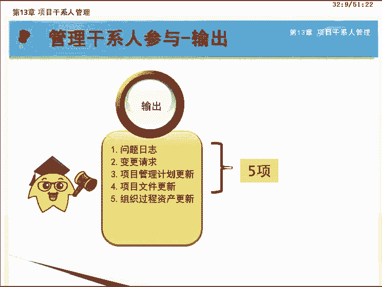

在管理干系人参与过程中，可以编制问题日志。问题日志应随新问题的出现和老问题的解决而动态更新。在管理干系人参与过程中，可能对产品或项目提出变更请求。变更请求可能包括针对项目本身的纠正或预防措施。

以及针对与干系人的互动的纠正或预防措施。

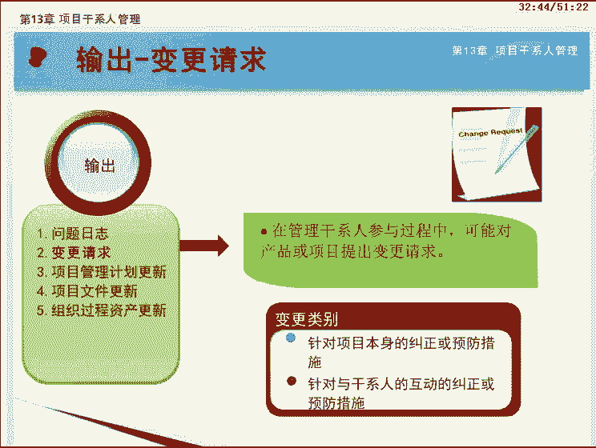

项目管理计划中可能需要更新的内容主要是干系人管理计划。当识别出新的干系人需求，或者需要对干系人需求进行修改时，就需要更新干系人管理计划。例如，有些沟通可能不太必要，可能需要替换无效的沟通方法。

或者可能识别出了新的沟通需求。该计划也需要因处理关注点和解决问题而更新。例如，可能发现某肝系人需要更多的信息。在管理干系人参与过程，可能需要更新的项目文件主要是干系人登记册。

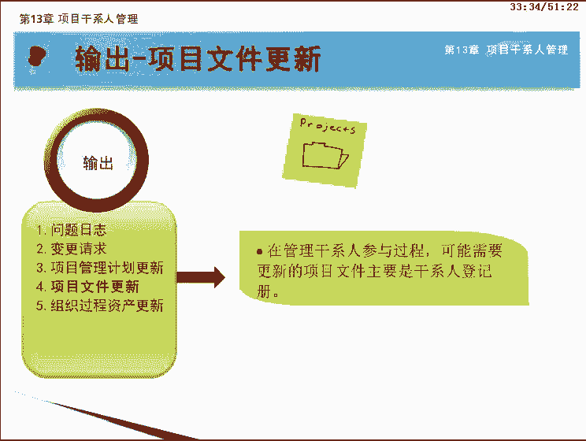

干系人登记册因下列情况而更新。干系人信息变化，识别出新干系人。原有干系人不再参与项目。原有干系人不再受项目影响。或者特定干系人的其他情况变化。在管理干系人参与过程，可能需要更新的组织过程资产包括。

给该系人的通知、项目报告、项目演示资料、项目记录、该系人的反馈意见以及经验教训文档。本过程的主要内容到此学习完毕。现在我们来回顾一下本过程的核心知识。

管理干系人参与是在整个项目生命周期中与干系人进行沟通和协作，以满足其需要与期望解决实际出现的问题的过程。管理该些人参与的目标。是把干系人的抵制降到最低，从而显著提高项目成功的机会。

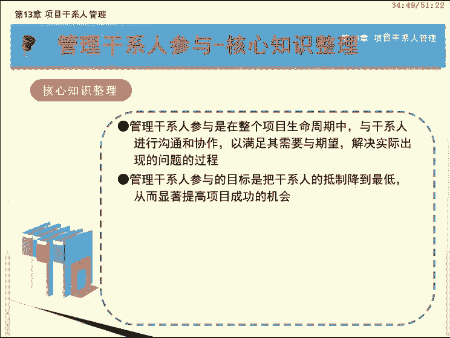

在管理干系人参与过程中，可以编制问题日志。问题日志应随新问题的出现和老问题的解决而动态更新。恭喜你完成管理干器人参与过程的学习，我们下节课见。本课程我们将一起学习第十三章项目干系人管理知识领域的第四节。

控制干系人参与。

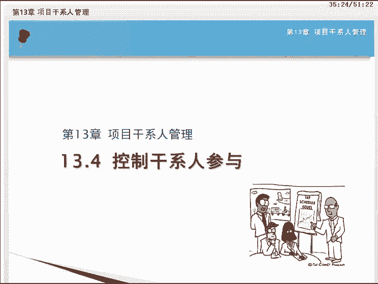

通过本课程的学习，我们将要达到以下目标。包括。掌握控制干系人参与过程的定义。了解控制干气人参与过程所需执行的活动。熟悉控制干系人参与的输入工具与技术和输出。

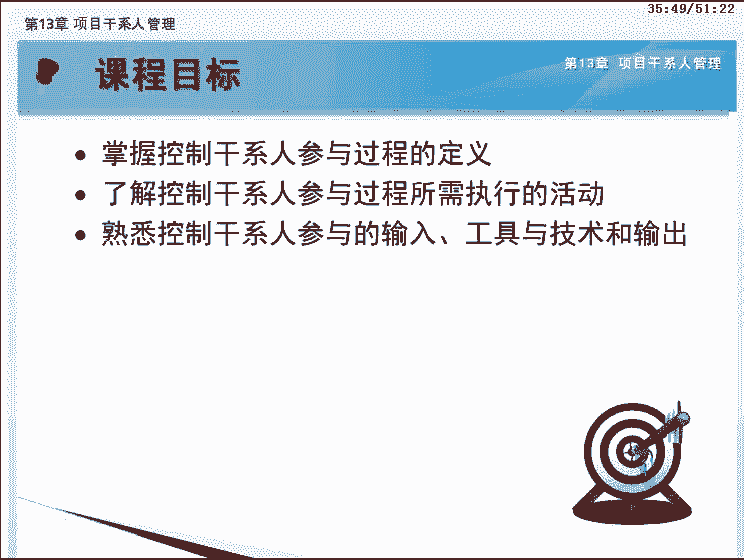

本课程我们将按照如画面所示的大纲为您讲述。首先是对控制干谢人参与过程的基本含义进行讲解。接下来分析控制干系人参与过程的输入、工具与技术以及输出。课程的最后是本节核心知识整理。

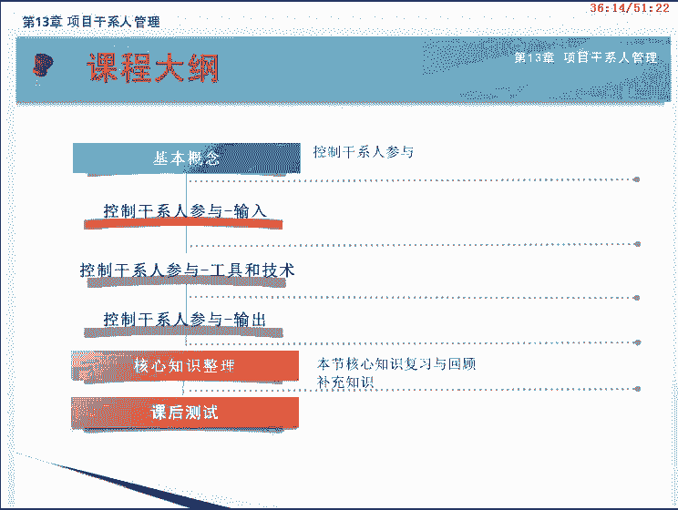

在学习本过程之前，我们先来了解控制干系人参与这个基本概念。控制干系人参与是全面监督项目干系人之间的关系，调整策略和计划，以调动干系人参与的过程。本过程的主要作用是，随着项目进展和环境变化。

维持并提升干系人参与活动的效率和效果。

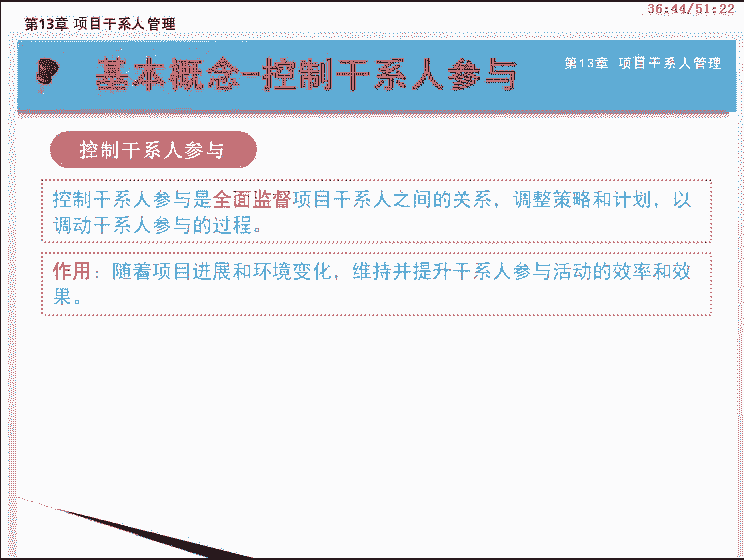

在干系人管理计划中，已经列出了干系人将参与的活动。按照计划，这些活动应该在项目生命周期中被执行。控制干系人参与过程，要对这些活动的执行情况进行持续控制。接下来让我们来看看如何控制干系人参与。

该过程在项目管理计划的指导下，考虑以后的问题日志以及以往工作绩效数据，利用信息管理系统以及专家判断方法，把项目执行情况整合成工作绩效信息。在此过程，如出现变更，则把其提交给实施整体变更控制过程。

这是控制干系人参与过程的数据流向图，可以看到，该过程通过输入输出与其他过程进行交互。

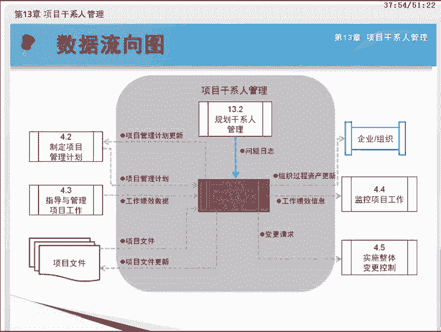

控制干系人参与过程共有4个输入，分别是项目管理计划、问题、日志、工作绩效数据和项目文件。下面我们依次来了解他们吧。

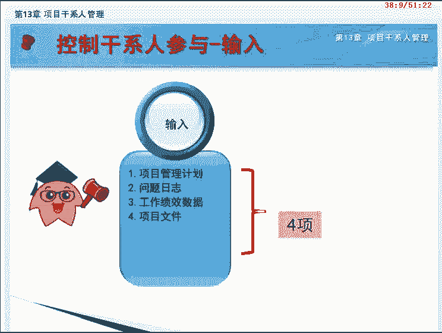

我们在前面介绍过，在制定干系人管理计划时，需要参考项目管理计划。同样的，控制干系人参与过程也要参考项目管理计划中的下列内容。项目所选用的生命周期及各阶段你采用的过程。对如何执行项目以实现项目目标的描述。

对如何满足人力资源需求，如何定义和安排项目角色与职责、报告关系和人员配备管理等的描述。变更管理计划规定将如何监控变更？干系人之间的沟通需要和沟通技术。问题日志来自于管理干系人参与过程。

问题日志应随新问题的出现和老问题的解决而动态更新。工作绩效数据是在执行项目工作的过程中，从每个正在执行的活动中收集到的原始观察结果和测量值。这在第三章已经详细介绍过。

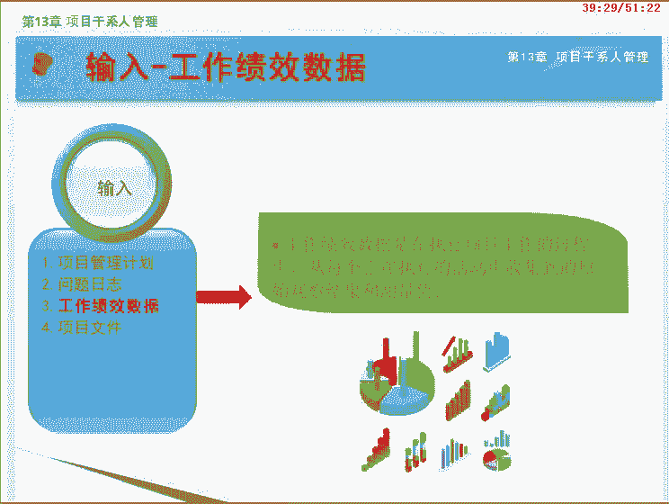

控制干系人参与过程需要参考的项目文件，包括项目进度计划、干系人登记册、问题日志、变更日志、项目沟通文件等。

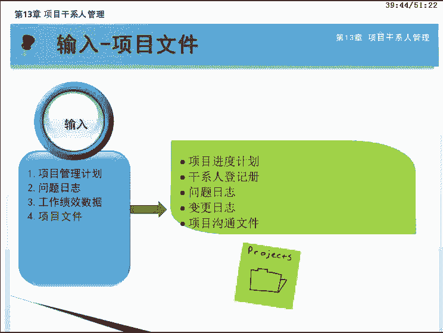

控制干系人参与过程有三个工具与技术。他们是信息管理系统、专家判断和会议。细心的学员可能已经发现了这个过程使用的三个工具与技术和十点三节控制沟通过程所使用的工具与技术完全一致。是的，实际上。

控制干系人参与的主要工作都是通过控制沟通完成的，只不过他们的侧重点有所不同，控制干系人参与更加注重不断监督干系人的参与效果和效率。这三个工具与技术我们就不详细介绍了。感兴趣的学员可参见十点三节内容。

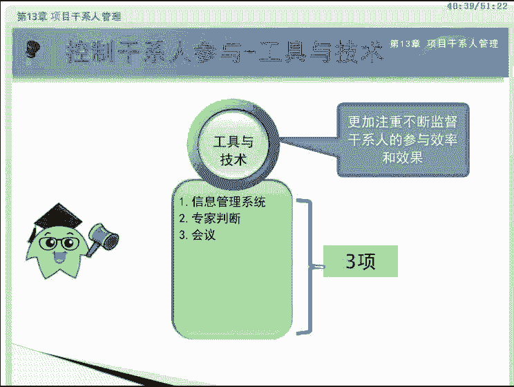

控制干系人参与过程有5个输出，分别是工作绩效信息、变更请求、项目管理计划更新、项目文件更新以及组织过程资产更新。下面我们一块来学习。

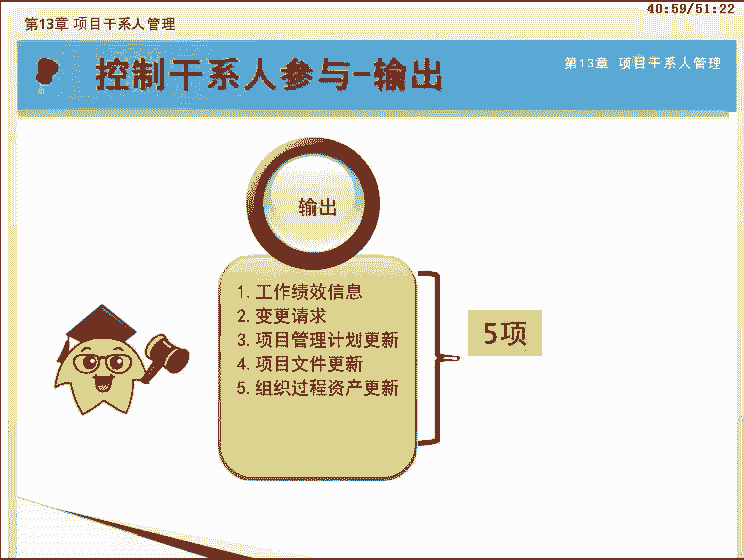

工作绩效信息是对收集到的绩效数据的组织和总结。他考虑了相关背景和跨领域知识。

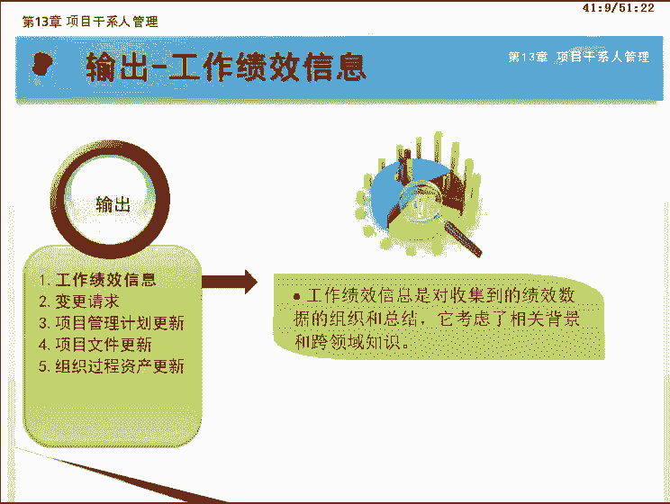

工作绩效信息可以包括多种形式，如可交付成果的状态，变更请求的落实情况及预测的完工尚需估算。在分析项目绩效及与干系人互动中，经常提出变更请求。需要通过实施整体变更控制过程，对变更请求进行处理。

该过程经常提出的变更请求，包括推荐的纠正措施和推荐的预防措施。

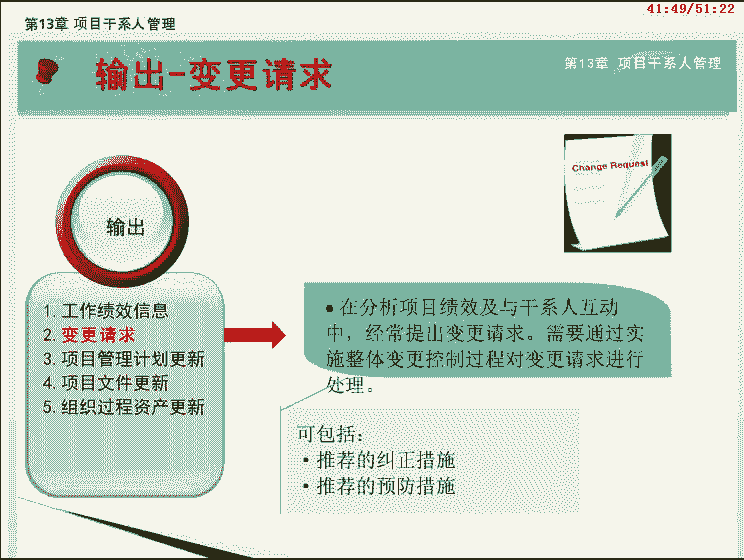

随着干系人参与项目工作，要评估干系人管理策略的整体有效性。如果发现需要改变方法或策略，那么就应该更新项目管理计划的相应部分，以反映这些变更。该过程可能导致几乎所有子计划的变更。

控制干系人参与过程可能更新的项目文件，包括干系人登记册和问题日志。

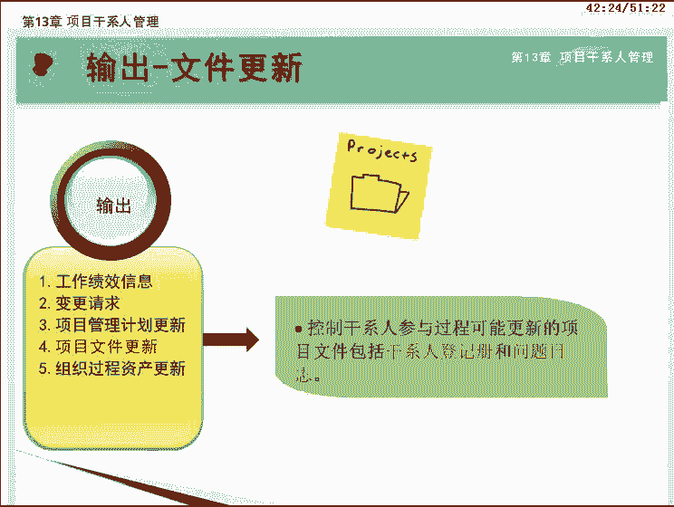

控制干系人参与过程，可能需要更新的组织过程资产包括。给干系人的通知、项目报告、项目演示资料、项目记录。干系人的反馈意见、经验、教学文档等。

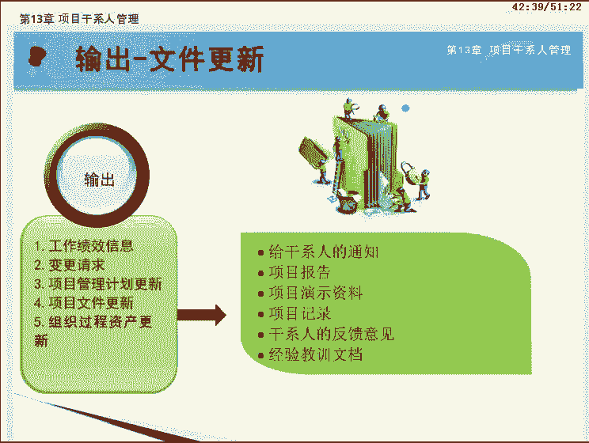

本过程的主要内容到此学习完毕。现在我们来回顾一下本过程的核心知识。控制干系人参与是全面监督项目干系人之间的关系，调整策略和计划，以调动干系人参与的过程。

要对干系人管理计划中规划的活动执行情况进行持续控制。供知干系人参与过程，以工作绩效数据为输入，形成工作绩效信息。

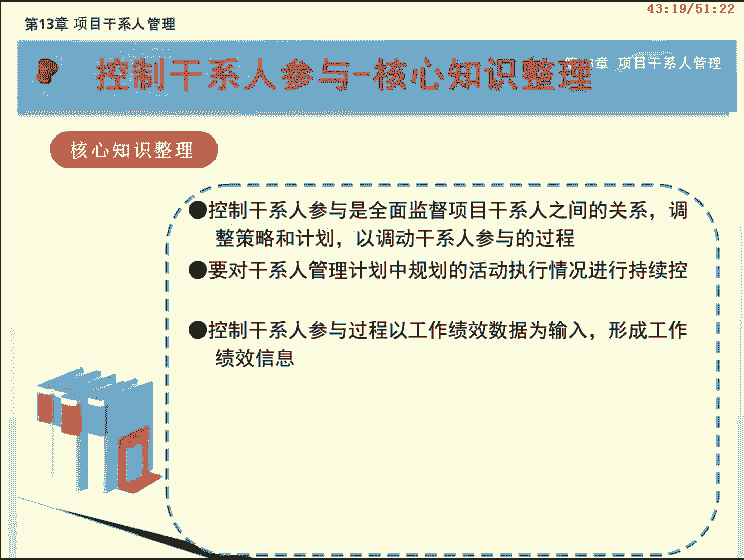

控制干系人参与过程与控制沟通过程紧密结合。恭喜你完成控制干谢人参与过程的学习。

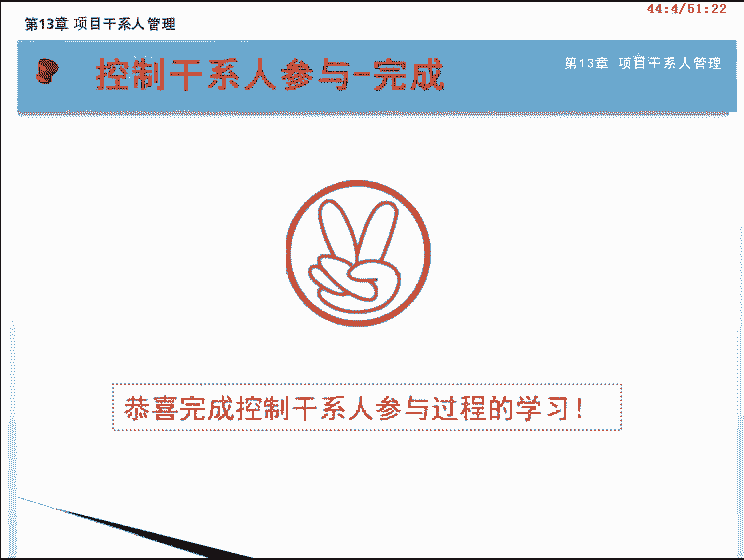

各位学员，第十三章项目干系人管理知识领域的四个过程已经全部学习完毕，现在就来做个总结吧。首先，需要从多种渠道识别干系人记录干系人的需求、期望和在项目中的利益，并对干系人进行分类。

这是识别干系人过程需要完成的工作。它位于启动过程组。接下来，利用规划干系人管理过程制定干系人管理计划。他是整个项目管理计划的子计划，用于指导今后的干净人管理工作。

在执行过程组管理干系人参与这个过程执行干系人管理计划中规定的活动，努力提高干系人的参与程度，管理干系人期望。位于监控过程组的控制干系人参与过程，对整个项目的干系人管理工作进行全面监控。如发现偏差。

可对干系人管理的策略和计划进行调整。

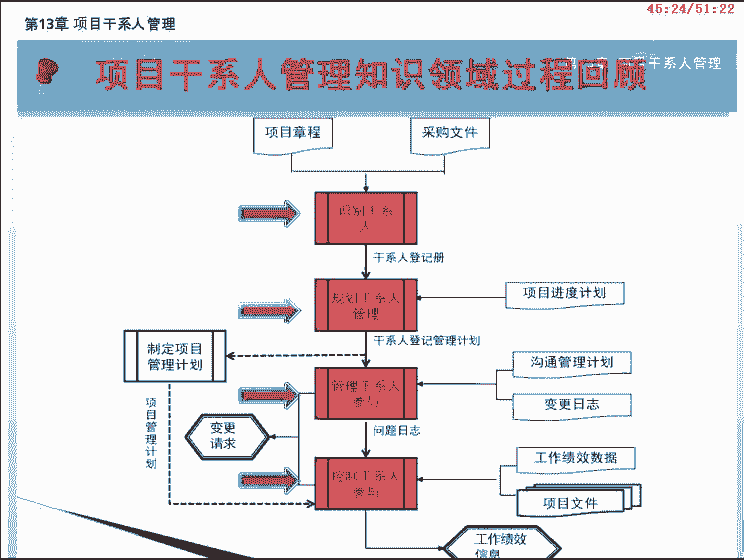

各位学员，恭喜您已经完成了第十三章项目干系人管理这一知识领域的学习。至此，平N报第五版的所有内容已经学习完毕，建议接下来进入下一轮复习。

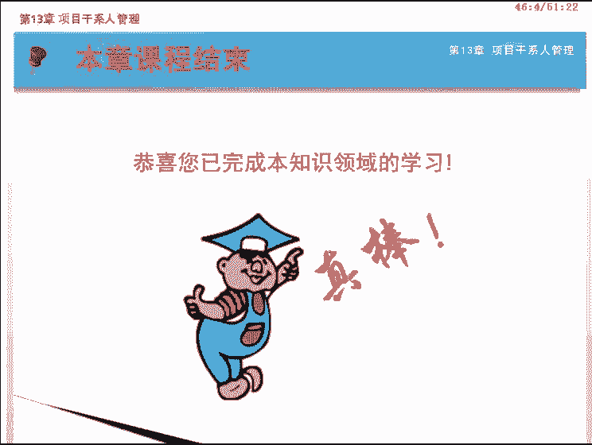