# PMP项目管理 - P2：02 - 自学力 - BV1EZ4y1p7LB

欢迎来到PMP项目管理网络课程的学习。本课程基于最新发布的P安报告指南第5版，下面我们将一起学习第二章组织影响和项目生命周期。通过本课程的学习，我们将要达到以下目标，包括。

了解组织文化与风格对项目管理的影响。掌握组织结构的类型和特征。针对具体的项目情景，能够为其选择合适的组织结构。掌握组织过程、资产和事业环境因素的定义和包含的内容，并对两者进行区别。

掌握干系人的概念及干系人管理策略。了解主要项目干系人的概念和作用。掌握项目生命周期、项目阶段的定义。掌握三种项目生命周期类型。熟悉项目生命周期和产品生命周期的区别和联系。

本课程我们将按照如画面所示的大纲为您讲述。首先是组织对项目管理的影响。这一部分我们会为您讲解组织文化与风格和组织结构。其中，重点讲解各种组织结构的特点和适用情况。

接下来的内容是组织过程、资产和事业环境因素。这是大部分规划过程的输入。在项目干系人部分介绍干系人的定义，干系人管理五步走战略。主要项目干系人的概念和作用，还有项目团队的组成。

最后一部分对项目生命周期进行概述。在本部分将会讲解项目生命周期、项目阶段的定义，通用生命周期结构及特点，项目生命周期分类以及产品生命周期的概念。课程的最后是本课核心知识整理。

现在我们来学习组织对项目管理的影响。任何一个项目都是在一定的组织环境中进行的。组织文化风格和结构会对项目实施产生影响。本部分内容将详细的介绍这些可能对项目产生影响的组织环境。再次说明。

这里的组织既可以是盈利性的企业，也可以是非营利机构，包括政府部门。

组织文化与风格是项目所面对的软环境。可能对项目实现目标的能力产生强烈影响。一个良好的组织文化与风格可以帮助组织提升业绩。在特定的组织中管理项目必须考虑该组织的文化。

保证所采用的管理方法和领导风格与组织文化相匹配。组织文化的表现形式包括以下几个方面。员工所具有的共同愿望、价值观、信念和期望。

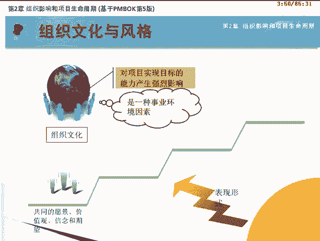

公司的规章、政策法规对一些事情处理的特定方法和程序。奖励和激励制度。风险承受力。对领导力、层级体系和职权关系的看法，如公司的权力机构设置以及员工对权利的认识。行为准则、职业道德和工作时间。

如大家习惯的工作时间以及时间观念等内容。另外，还有组织的运营环境。组织文化和风格是一种事业环境因素。因此，项目经理应该了解可能对项目造成影响的不同的组织风格和文化。关于事业环境因素。

本章的最后会为你详细讲解。组织结构是项目面临的一个硬环境，也是一种事野环境因素，它可能影响资源的可用性。组织结构形式对项目影响的实质是项目经理控制资源的能力或项目获得资源的能力。

组织结构还会影响项目的管理模式。即使项目经理拥有较强的领导力，组织对结构类型还是会对项目绩效产生巨大的影响。因此，组织结构是PMP考试和培训学习的一个重要内容。

PM报中讨论了三种典型的完成项目的组织结构形式。分别是职能型组织、矩阵型组织和项目型组织。在职能型组织中，人员按专业分组，每个成员有一位明确的上级及职能经理。各个部门相互独立的开展各自的项目工作。

在项目型组织中，整个组织都是按项目来划分和管理的。团队成员通常集中办公，组织的大部分资源都用于项目工作。

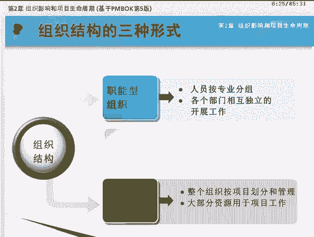

矩阵型组织兼具职能型和项目型组织的特点，它是一个重要的考点。如果PMP考题中没有明确说明组织结构的类型，你必须假设项目是在矩阵型组织中实施的。下面我们就对他们一一的讲解。首先是职能型组织。

这是比较传统的组织形式，组织内部按职能专业来划分部门，如财务部、生产部、市场部等。在这种组织下，没有单独的项目部，项目是放在各职能部门中进行的。项目组成员从各职能部门中抽取。

每一个成员有一个明确的上司及本部门的职能经理。

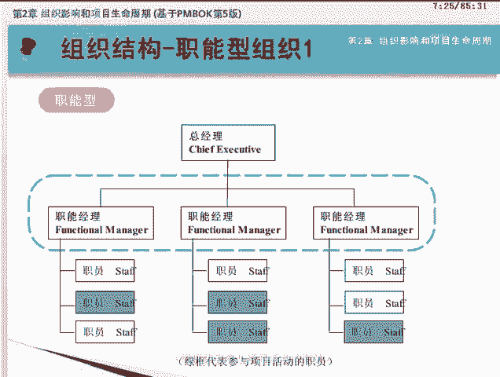

项目组成员不仅要从事项目工作，同时还要承担日常的部门工作。在职能型组织结构中，一般没有单独或全职的项目经理，而是由某个人进行项目协调。称为协调员或联络员。当沟通需要跨部门时。

项目协调一般都要通过职能经理来完成。职能型组织的优点有以下几个方面。

一是典型的职能型组织，是一种层级结构，采用直线管理的方法，部门内部信息垂直传递，每个员工只有一个上级。二是按专业分组，更便于员工的专业发展，也更容易管理专业人士。同一部门类似资源更集中。

使得部门内的协调和沟通比较容易。专业内的问题可以得到迅速的响应和解决。除了优点，当然，职能型组织结构也有其不可避免的缺陷和不足，其缺点主要表现在一、由于项目成员来自于职能部门。

由职能经理对其进行绩效评估。所以。职能工作往往优先于项目工作。2。在职能型组织中，没有全职的项目经理，项目经理只是进行一些协调工作，权力很小。第三，由于项目依附于职能部门。

使得项目经理领域内没有职业发展道路。第四。职能型组织采用直线式管理，使得与其他职能部门之间没有沟通。容易忽视其他部门在项目上的利益。同时也导致跨部门使用资源困难，使得项目管理不易进行。基于以上分析。

我们可以得出。职能型组织结构适用于规模较小的，以技术为重点的内部项目。不是用于时间限制性强或要求对变化快速响应的项目。复杂的和需要跨专业的项目，也不适合用职能型组织结构。

相比职能型组织走向另外一个极端的是项目型组织。项目型组织是按项目来划分和管理的。项目团队成员只为本项目提供支持服务，直接向项目经理汇报。项目经理对项目有完全的管理与控制权。项目经理负责项目内部的协调。

在现实生活中，其实没有一个组织能够完全是项目型的，因为他多多少少都需要职能部门的支持。但是从单个项目的角度来说，可以采取项目型的组织。及一个自成体系的项目，拥有所需全部人员的项目团队。

在实施项目的过程中，不需要母公司各职能部门的支持。如某房地产公司的建筑项目。

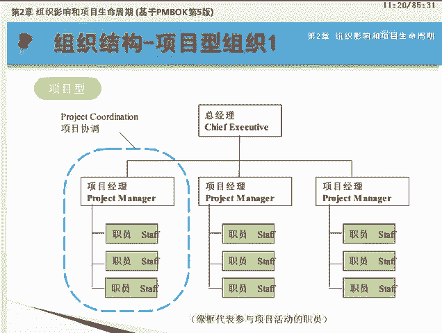

项目型组织具有如下优点，一是有明确的项目经理，项目经理拥有很大的自主性和职权。二是项目成员全职于项目工作，对项目忠诚。三是团队成员直接向项目经理汇报，使得沟通更有效果。决策速度也更快。最后。

组织以项目的形式存在，便于项目团队的建设。项目型组织具有如下缺点。由于团队成员专职于项目，所以在项目结束后，项目成员会有无家可归的忧虑感。另外，由于整个项目团队缺乏专业化分工。

不利于团队成员专业技术发展。最后。每个团队成员只为本项目工作，会造成人力资源使用效率低下的后果。这些都是项目型组织的缺点。那么，项目型组织适用于哪些情况呢？

项目型组织特别适用于包括多个相似项目的单位或组织，以及长期的大型的技术重要的和专业复杂的项目，如三峡水利工程项目。下面我们开始介绍最复杂也是篇M报告中最重视的组织类型，矩阵型组织。

矩阵型组织兼具职能型组织和项目型组织的特征。他的目的是为了同时利用职能型组织和项目型组织的优点，并尽量避免他们的缺点。矩阵型组织呈现出两个主要特点。一个是借资源。

大部分项目团队成员和其他资源都是从职能部门接来的，他们可能只是在项目上兼职。另一个特点是有两个老板。项目团队成员需要同时接受项目经理和职能经理的领导，这种情况也称为多头领导，经常会导致冲突。

矩阵型组织又可以分成三种形式，弱矩阵、平衡矩阵和强矩阵。其主要区别在于项目经理和职能经理权利的大小。接下来我们分别讲解这三种矩阵型组织结构。

弱矩阵型组织保留了职能型组织的大部分特征，没有全职项目经理。此时，项目经理的角色更像是协调员或者联络员，而非真正的项目经理。在这种组织结构中，由名义上的项目经理负责项目的协调。因此，在弱举阵行组织中。

权力主要控制在职能经理的手中，项目经理的地位低于职能经理。项目经理的角色更像是协调员或联络员，缺乏分配项目资源的权利。实际上，协调员和联络员在概念上有一点小小的区别，我们后面会详细介绍。

图中所示的是平衡矩阵。在平衡矩阵中认可了项目经理的重要性，有专门的项目经理。由项目经理负责项目的协调。是否存在专门的项目经理是区分弱矩阵和平衡矩阵以及强矩阵的标志。

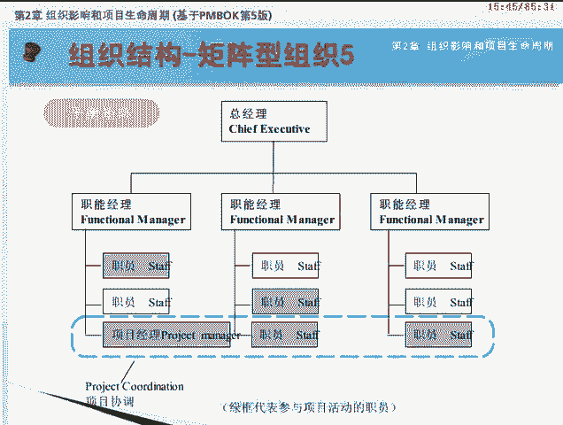

平衡矩阵型组织虽然承认项目经理的重要性，但并未授权其全权管理项目和项目资金。平衡矩阵中，权利由职能经理和项目经理分享，两者地位基本平等。强举阵型组织则具有项目型组织的许多特征。

拥有掌握较大职权的项目经理和全职的项目行政人员。在强举阵中，权力主要由项目经理控制。项目经理对团队成员的控制高于职能经理。在矩阵型组织中，项目相当于需要浇灌的田地。

而各职能部门则是相关专业技术和专门人才的蓄水池。当项目需要某种技术人才时，各职能部门立即释放出来。当项目不再需要时，就立即收回去。因此，矩阵型组织有如下优点。

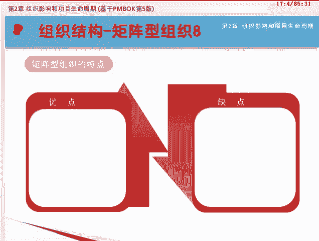

第一，资源使用率高，能最大限度的使用组织的稀缺资源。第二，矩阵型组织中仍然存在专业分工，有利于专业知识的积累和专业人才的成长。第三，来自于不同职能部门的人员，共同为一个项目工作，有利于更好的跨部门协调。

第四，职能型组织主要是现行传递信息。矩阵型组织更有利于信息的水平传递。最后，项目成员来自于不同的职能部门。项目结束后，成员可以回到相应的职能部门，保证有家可归。

虽然矩阵型组织希望避免其他两种组织形式的缺点。但事物的两面性注定其不可避免的缺点。首先是矩阵型组织中，项目成员有多个上级不符合组织结构理论的基本要求。其次。矩阵型组织结构复杂。

人员来自不同的部门沟通复杂，管理难度大。另外，项目经理和职能经理容易产生权力争斗，不利于项目的顺利进行。由于成员的双重身份容易导致项目工作和职能工作对资源的争夺。最后，在矩阵型组织中。

项目经理对项目成员可能没有足够的控制权。矩阵型组织在项目管理中用的最多。适合规模中等的跨专业的项目。项目需要利用多个职能部门的资源，而且技术相对复杂。在矩阵型组织中，不需要技术人员全职为项目工作。

特别适合于某些需要同时共享某些技术人员等核心资源的项目。大家可能会疑惑，在矩阵型组织中，项目经理和职能经理具体都做什么工作呢？其实，按照PMI的要求，他们之间是有一定的分工原则的。一般情况下。

项目经理负责做什么，什么时候做，为什么要做以多大成本做。而职能经理负责由谁来做，怎么做？在职能型组织和弱矩阵型组织中，我们提到了项目联络员和项目协调员。他们都是用来称呼项目经理的。

那他们之间有什么不同呢？各自在项目中起什么作用呢？其实，项目联络员没有任何决策权，主要起沟通联络作用，以促进各部门更好的协调工作。项目联络员既可以是某职能部门内部的，也可以是各相关职能部门之间的。

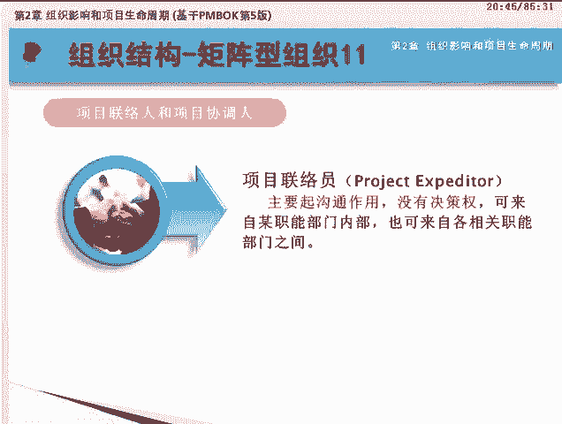

项目协调员地位比项目联络员要高一些。具有一定的项目决策权。如果是职能部门内部的协调员，就向该职能经理汇报。如果是跨职能部门的协调员，则由公司总经理委派，直接向总经理汇报。在学习中。

你可能会遇到一个叫做紧密型矩阵的名词。其实，紧密型矩阵并不是矩阵型组织的一种。它也叫集中办公，是指将项目团队成员集中在一办公，以提高工作绩效，不是组织结构的一种形式。

现在我们来对各种组织结构中项目的特征进行一个汇总整理。从表中可以看出，矩阵型组织分为弱矩阵、平衡矩阵和强矩阵三类。从职能型到矩阵型，再到项目型组织。项目经理的权利逐渐增大，可用的资源也逐渐增多。

在职能型组织和弱矩阵型组织中，没有全职的项目经理。项目经理的角色实际是兼职在工作。是到平衡矩阵，才有了全职项目经理。因此，平衡型矩阵中全职项目经理的出现是强弱矩阵分水岭。另外我们还可以看到。

在强举阵和项目型矩阵中，项目管理行政人员也是全职的了。在实际管理过程中，很多组织的结构并不是单一的，他们会在不同层次上用到职能型组织、矩阵型组织以及项目型组织。

我们将这种由两种以上组织结构混合而成的组织形式叫做复合型组织。如在典型的职能型组织中建立专门的项目团队来实施重要的项目。该团队可能具备项目型组织中项目团队的许多特征，可以拥有全职项目人员。

可以制定自己的规章制度办事流程。在PMP考试中，有一类考题是根据情形选择一个合适的组织结构。我们要熟记前面介绍过的每类组织结构的特点及适用情况。只有这样才能出色的完成考试中涉及的内容。

这里我们做个简单总结。如果是实施起来简单专业单一的项目，就一般用职能型组织结构。如果是跨专业的，需要多部门合作的项目，就用矩阵型组织结构。

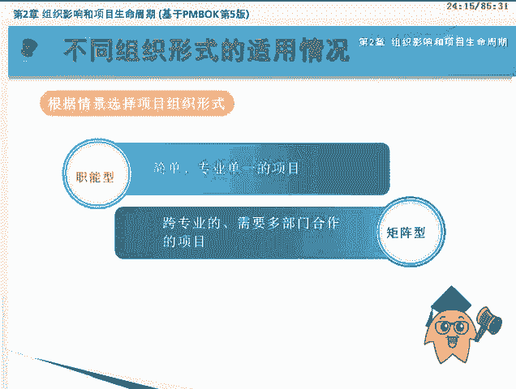

如果需要最大限度的控制资源，如工期很紧，需要全部成员全职参与工作，就用项目型组织。当然，各种组织结构的选择还需要考虑其优缺点。接下来我们要讲解项目管理过程中不可避免的会涉及到的两个概念。

组织过程资产和事业环境因素。他们是在做项目的过程中，必须要充分考虑和加以充分利用的因素。各位学员应该认真体会这两者所包含的内容和作用。这里要提醒大家的是，两者间会有一些交叉。

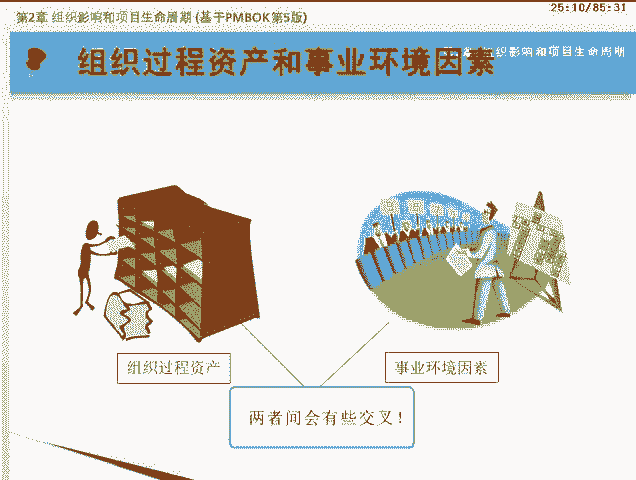

那么什么是组织过程资产呢？组织过程资产是执行组织所持有，并可以投入使用的计划流程政策程序知识库。可以来自于参与项目的所有组织，用于帮助项目成功。组织过程资产是组织做项目管理最重要的无形资产。

包括完整的进度计划、风险数据和正值数据等。是人们要主动利用的。项目团队成员在做项目的过程中，还要经常进行组织过程资产的更新。对于PM报指南中的大部分规划过程，组织过程、资产都是其重要的输入。

组织过程资产的内容可分为流程与程序和共享知识库两个主要部分。流程与程序包括指南和标准。他们用于裁剪组织标准流程，以满足项目要求。

组织标准和政策如人力资源和健康安全政策、职业道德政策和项目管理政策、产品和项目生命周期标准、质量政策与程序。模板如风险登记册模板WBS模板、进度网络模板、合同模板等。

各种控制程序如变更控制程序、财务控制程序问题与缺陷管理程序和风险控制程序等。此外，还包括项目控制及收尾过程的指南或要求。共享知识库主要包括组织存取的各种信息。这些信息包括。配置管理知识库。

其中包括执行组织的所有标准、政策程序和任何项目文件的各种版本与基准。财务数据库其中包括人工时实际成本、预算和成本超支等方面的信息。历史信息与经验教训知识，如项目记录与文件、完整的项目收尾信息与文件。

关于以往项目决策的结果，以及以往项目绩效的信息。以及从风险管理活动中获取的信息。问题与缺陷管理数据库，包括问题与缺陷的状态、控制信息、解决方案以及相关行动的结果。过程测量数据库。

用来收集与提供过程和产品的测量数据。以往项目的项目档案如范围成本、进度与绩效测量基准。项目日历项目进度网络图风险登记册风险应对计划和风险影响评价。总的来说，组织过程资产是组织重要的无形资产。

一定要善加利用。什么是事业环境因素呢？视野环境因素是指项目团队不能控制的，将对项目产生影响、限制或指令作用的各种条件。事业环境因素包括组织外部的环境要素和组织内部的因素。

事业环境因素通常是项目不能直接控制，但会直接影响项目的那些因素。即使人们不想主动利用他们，他们也会提高或限制项目管理的灵活性，并可能对项目结果产生积极或消极影响。事业环境因素是大多数规划过程的输入。

事业环境因素包含的内容众多，总体上，我们可以将其分为组织内部环境因素和组织外部环境因素两大类。内部环境因素包括。组织文化结构和治力设施和资源的地理分布。基础设施如现有的设施和固定资产。现有人力资源状况。

如人员在设计开发法律、合同和采购等方面的技能、素养与知识。人事管理制度如人员招聘和留用指南、员工绩效评价与培训记录、奖励与加班政策以及考勤制度。公司的工作授权系统。组织已有的沟通渠道。

外部环境因素包括政府或行业标准，如监管机构条例、行为准则、产品标准、质量标准和工艺标准。市场条件。干系人风险承受力。政治氛围商业数据库如标准化的成本估算数据、行业风险研究资料和风险数据库等。

项目管理信息系统如自动化工具，包括进度计划软件配置管理系统、信息收集与发布系统或进入其他在线自动系统的网络界面。刚讲了那么多事业环境因素和组织过程资产的内容。大家可能觉得两者并不是很好区别。

现在我们就来看如何区分事业环境因素和组织过程资产。首先。😊，事业环境因素是项目经理必须考虑的内外部环境条件。而组织过程资产是供项目利用对项目成功起支持作用的因素。

项目的实施一般不能对事业环境因素产生影响。除了建设项目团队和管理项目团队两个过程会导致事业环境因素更新。而对于组织过程资产来讲，项目的实施过程中一直在对其进行补充和更新。除商业数据库外。

事业环境因素都会对项目有直接制约作用。而组织过程资产是组织内部所有的，需要项目团队主动加以利用。最后，有关系统和因素都是事业环境因素。有关程序的因素都是组织过程资产。接下来我们详细讲解项目干系人的概念。

该系人是指能影响项目决策活动或结果的个人群体或组织。以及会受或自认为会受项目决策活动或结果影响的个人群体或组织。

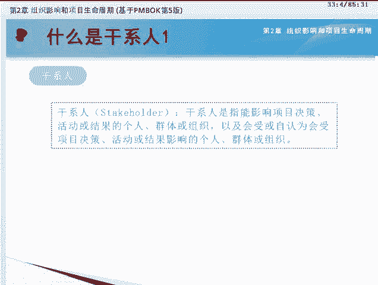

根据在项目中发挥的作用，我们可以将干系人分为两类。参与项目和受项目影响或影响项目。参与项目的干系人有发起人。项目经理、项目管理团队、项目团队PMO项目组合经理、职能经理等。如果项目需要外部提供一些资源。

参与项目的干系人，还会包括卖方以及一些参与项目工作的业务伙伴，如分包商、生产商等。受项目影响或影响项目的干系人有客户、用户、政府或社会团体机构以及普通公众。总的来说。

与项目有直接或间接关系的任何组织和个人都是项目干系人。这张图中展现各类干系人之间的关系。不同干系人在项目中的责任和职权各不相同，他们参与项目的程度可能差别很大。有些只是偶尔参与项目调查或焦点小组活动。

有些则为项目提供全方位资助，包括资金支持、政治支持或其他支持。有些干系人可能被动或主动的干扰项目取得成功。项目经理应该在整个项目生命周期内特别关注这部分干系人，并提前做好计划。

以应对他们可能导致的任何问题。要成功的完成项目，应该把项目干系人的范围尽量考虑的宽泛一些。以免漏掉重要的干系人。关于干系人概念，后面会再次讲解。由画面所示的一个建筑工程项目干系人示意图可知。

项目干系人不只是项目经理、项目承接方、项目团队，还包括许多其他的组织与个人。如画面所示的发起人、客户、社会相关利益团体，甚至项目团队、成员、家属、公共传媒、公民个人。都会对项目的实施产生影响。

项目经理的目的既包括满足项目干系人对项目已经表达出来的各种利益追求。也包括满足他们对项目尚未表达出来的利益期望。

因为干系人对项目成功与否具有很大的影响。所以，为了确保项目成功，项目经理必须针对项目要求来管理各种干系人对项目的影响。

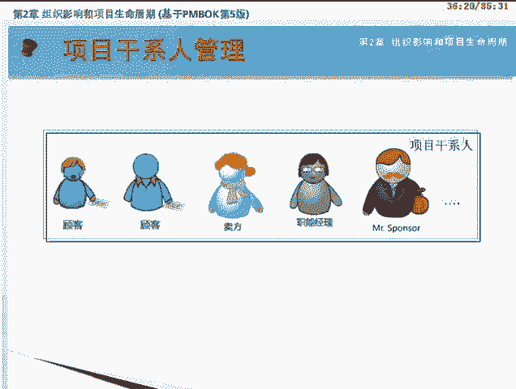

项目干系人管理是项目管理中的重要内容。他是指项目管理团队必须识别项目干系人，分析他们对项目的要求及需求。并且管理和影响这些要求，以确保项目成功。要成功的管理干系人。

项目经理和项目团队需要做几个方面的工作。本课程将其总结为干系人管理五步走战略，及识别干系人干系人优先级排序。管理干系人期望持续识别干系人收尾项目阶段，获得主要干系人的接受和认可。

接下来我们就向大家一一讲解这5个步骤。

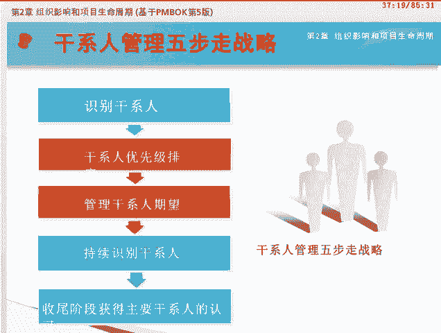

第一步，识别干系人。识别每个干系人对项目的需求、期望和对项目的贡献以及制约作用，并让他们尽早参与进来。PMI要求，理论上应识别出项目的所有干系人。在现实中，这点比较困难。

但项目团队应尽可能的将与项目相关的干系人都考虑进来。第二步，干系人优先级排序。干系人对项目产生的影响或积极或消极。其对待项目的态度以及对项目的认知程度各有不同。项目团队需要分析每一个干系人的角色。

并根据其对项目的影响力、支持态度。急迫性等要素综合评定，进行肝系人优先级排序和分类。PMI要求考虑全部干系人的利益与影响。充分评价项目关系人的知识与技能，并加以充分利用。第三步，管理干疾人期望。

有些干系人可能会受益于项目，而有些干系人则看到项目给他们带来的负面影响。因此，项目经理需要通过各种途径调动积极因素，化解消极因素。由于干系人的期望往往差别很大，甚至互相冲突。因此。

管理干系人的期望是项目经理的重要职责。项目经理要平衡干系人的不同利益，使干系人能最大程度的为项目成功提供支持。以实现项目目标。PMI要求充分发挥全部项目干系人的作用，来保证项目成功。PMI认为。

干系人管理做的不好，经常是造成项目失败的主要原因。第四步。持续识别该些人。识位干系人是一个持续的过程。随着项目的进行，干系人有可能发生变化。当干系人发生变动时。要重新识别和评估关系人。

并主动投入精力进行沟通。PMI要求尽早面对负面干系人，如同面对正面干系人一样。忽视负面干系人会提高项目失败的可能性。

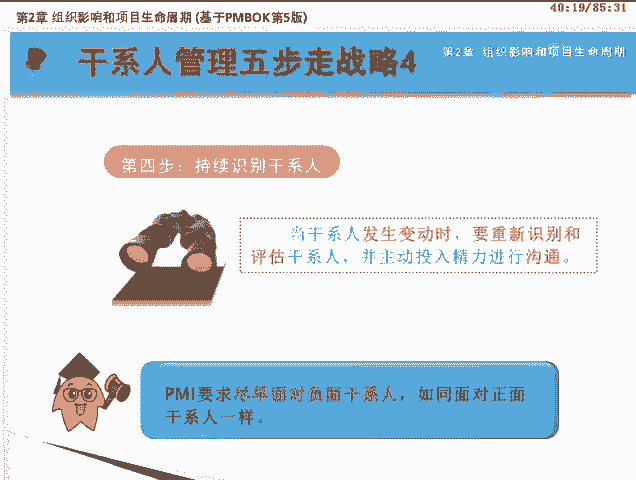

最后一步是项目收尾阶段。获得主要项目干系人对项目结果的接受与认可。项目收尾阶段，项目产品服务或成果应该得到使用者的认可。因此，当干系人的利益发生冲突时，通常应按照有利于客户的原则进行处理。如果客户众多。

应按最终端客户的利益至上为原则。如研制一种新药，医院开药的医生、病人都是这一项目的客户。病人是肝心药最终的使用者，所以应以病人的利益为首要出发点来考虑冲突问题。PMI认为，干系人管理不好。

经常是造成项目失败的主要原因。项目干系人的范围十分广泛。项目经理和项目团队必须尽可能的识别出全部干系人。接下来。本课程中。列出部分主要干系人。分析他们在项目中的作用和职能。首先我们来了解什么是发起人。

发起人是为项目提供资源和支持的个人或团体，负责为成功创造条件。发起人对项目的作用早在项目开始构思时就产生，包括游说更高层的管理人员获得组织的支持以及宣传项目的利益收入。在项目正式批准前。

发起人对整个项目起领导作用。项目获批后，发起人对制定项目初步范围与章程起重要作用。在项目执行过程中，发起人要对项目进行监控，对超出项目经理控制范围的事项，需要发起人参与管理和控制。另外。

发起人还要参与范围变更审批阶段末评审，以及遇到重大风险时，对项目是否继续进行决策。另一个我们需要了解的重要干系人是客户或用户。客户是将要批准和管理项目产品服务或成果的个人或组织。

用户是将要使用项目产品服务或成果的个人或组织。

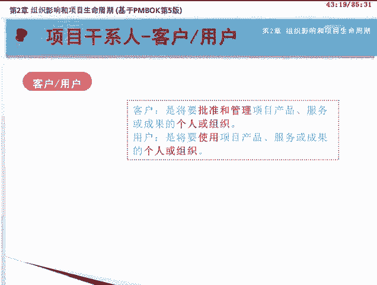

在有些领域，客户和用户是同一词，如为某公司开发的办公自动化系统，客户和用户都是该公司。而在另一些领域，客户是指购买项目产品的个人或组织，而用户则是指直接使用项目产品的个人或组织。

如建造一个花园式小区项目，其客户可能是某房地产公司。而用户是即将入住的居民。卖方是根据合同协议为项目提供组建或服务的外部公司。卖方根据不同的项目情况，又称为供应商、供方或承包方。

如为一个建筑项目提供钢材的商家，就是卖方。负责建筑项目某一部分建筑任务的外包工程队是承包方。

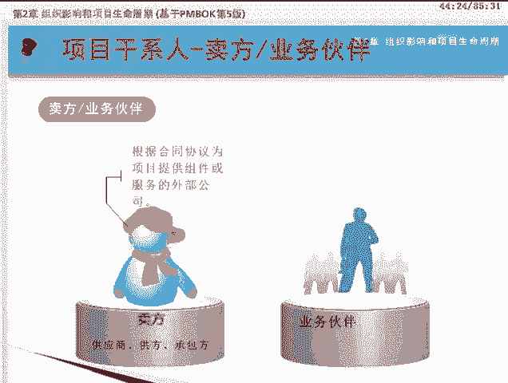

业务伙伴也是外部公司通过某个认证过程与本公司建立的特殊关系。为项目提供专业技术或安装、定制等特定服务。他们与本企业间存在着某种特殊关系，如某律师事务所专门负责本企业的法律事务。

某人才资源管理公司负责为本项目培训适合的人才。组织内的团体是受项目团队活动影响的内部干系人，比如，市场营销、人力资源、法律、财务、运营、制造和客户服务等业务部门都可能受项目影响。

他们为项目执行提供业务环境。他们可以对项目需求提出意见，并参与项目可交付成果的验收。

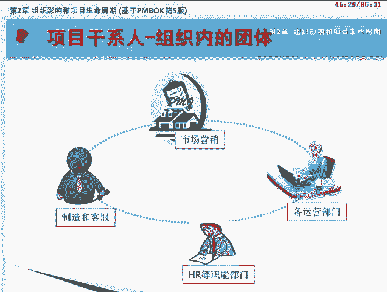

职能经理是在行政或职能领域，如人力资源、财务、会计或采购。承担管理角色的重要人物。他们配有固定员工以开展持续性工作。他们对所辖职能领域中的所有任务有明确的指挥权。职能经理可为项目提供相关领域的专业技术。

或者职能部门可为项目提供相关服务。项目里可能包括其他项目干系人。项目组合经理负责对一组项目或项目级进行宏观治理。这些项目或项目集可能相关或不相关。

项目组合评审委员会由组织中负责项目选择的高层管理人员组成。对每个项目的投资回报、价值、风险和其他属性进行评审。项目级经理。统筹管理一组相关的项目，从而取得对单个项目分别管理所无法实现的利益和控制。此外。

还有其他干系人，如采购单位、金融机构、政府机构、主题专家、顾问和其他人。可能在项目中有财务利益，可能向项目提供建议，或者对项目结果感兴趣。项目治理是一种符合组织治理模式的项目监管职能。

覆盖整个项目生命周期。项目治理框架由项目组合、项目集或发起组织来定义。向项目经理和团队提供管理项目的结构流程、决策模式和工具。项目治理框架同时对项目进行支持和控制，以实现项目的成功交付。

通俗的讲。项目治理是为项目管理搭架子指路子。对于任何项目，项目治理都非常关键。尤其是对于复杂和高风险的项目，通过定义记录和沟通可靠的可复用的项目实践。项目治理为控制项目，并确保项目成功。

提供了一套全面的一致的方法。项目治理框架中的主要内容包括。项目成功标准和可交付成果验收标准。用于识别升级和解决项目期间的问题的流程。项目团队组织团体和外部干系人之间的关系。项目组织图其中定义了项目角色。

信息沟通的流程和程序。项目决策流程。协调项目治理和组织战略的指南。项目生命周期方法。阶段关口或阶段审查流程。对超出项目经理权限的预算范围、质量和进度变更的审批流程。保证内部干系人遵守项目过程要求的流程。

我们看到，虽然项目治理给项目团队提供了一个工作框架。但项目团队仍然要负责项目的规划、执行、控制和收尾。项目团队包括项目经理以及为实现项目目标而一起工作的一群人。

至少包括项目经理、项目管理人员和其他项目团队成员。项目团队由来自不同团体的个人组成，他们拥有执行项目工作所需的专业知识或特定技能。项目团队结构和特点可以相差很大。

但项目经理作为项目领导者的角色是固定不变的。无论项目团队成员有多大的职权。项目团队中的角色有。项目管理人员。开展项目管理活动的团队成员。开展各种规划工作及行政支持。有时PMO可以履行或支持这些工作。

项目人员。执行工作以创造项目可交付成果的团队成员。支持专家为项目管理计划的制定或执行提供支持。根据项目的规模大小和所需的支持程度，支持专家可以全职或兼职参与项目工作。

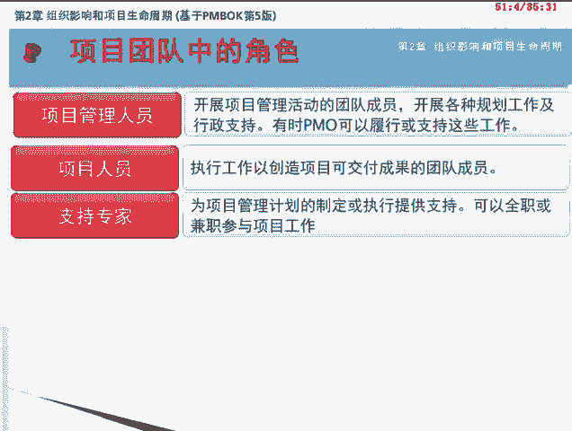

用户或客户代表。将要接受项目可交付成果或产品的组织。可以派代表或联络员参与项目来协调相关工作，提出需求建议或者确认项目结果的接受性。麦风。卖方又称为供应商、供方或承包方。

是根据合同协议为项目提供组建或服务的外部公司。通常，项目团队负责监管卖方的工作绩效，并验收卖方的可交付成果或服务。如果卖方对交付项目结果承担着大部分风险，那么他们就在项目团队中扮演着重要角色。

业务伙伴成员。业务伙伴组织可以派代表参与项目团队来协调相关工作。业务伙伴业务伙伴也是外部组织，但是与本企业存在某种特定关系。这种关系可能是通过某个认证过程建立的。

业务伙伴为项目提供专业技术或填补某种空白，如提供安装、定制、培训或支持等特定服务。至此，我们已经学完了关于项目干系人的知识。具体如何进行识别和管理干系人将在本课程的第十三章进行详细讲解。

接下来我们学习项目生命周期的知识。有关生命周期的说法，大家一定不会陌生。对于我们人来说。生命个体的周期可以分为。母体中的胎儿出生后的婴儿。

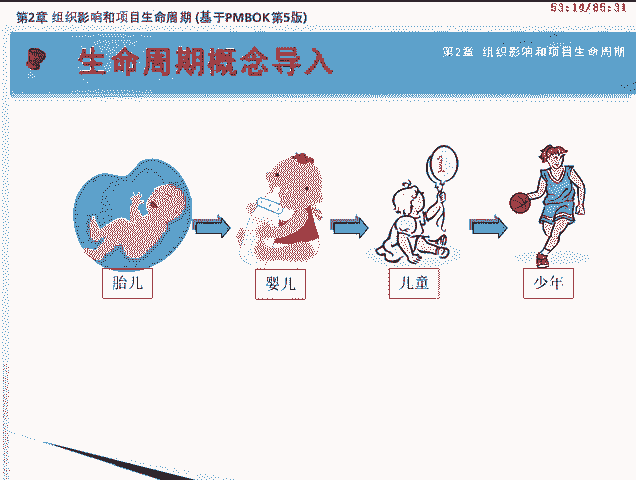

儿童少年、青年、中年、老年，一直到生命的结束。跟人一样，项目也有生命周期。本节课我们将和大家一起学习项目生命周期和组织的相关内容。首先我们来看什么是项目生命周期。

项目生命周期是指项目从启动到收尾所经历的一系列阶段，也就是项目从开始到结束的阶段的集合。具体说明项目在不同的时间段要做什么。项目生命周期从定义上讲，通常是按顺序排列，有时又互相交叉的各阶段的集合。

针对较复杂的项目，为了有效的进行管理、规划和控制。项目所在组织往往将项目划分为若干个阶段。通过完成项目各阶段来实现项目的整体目标。如一个软件开发项目。

我们可以将其分为需求分析、设计、调试安装这三个按顺序排列的阶段。下一阶段的开始取决于上一阶段的完成。又如建设一个新工厂的项目，我们可以将整个项目生命周期划分为设计阶段、施工阶段。

当全部设计图纸完成的差不多的时候，可以进行地基建设阶段，即这两个阶段可以有些许交叉。结合前面的软件工程项目和建筑项目的阶段划分。对于项目生命周期，我们应了解项目生命周期的几点。

不同类型的项目有不同的生命周期阶段划分。不同项目的生命周期中。阶段数量、名称和顺序都可以互不相同。项目生命周期的每一个阶段，都可以当做一个单独的项目或子项目来完成。

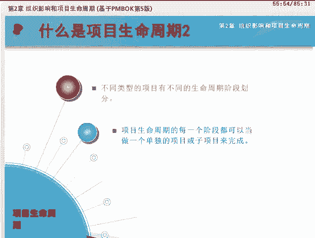

一般情况下是一个阶段结束后，另一个阶段才开始，但如果风险不大，也可以在一个阶段结束前开始下一个阶段。无论项目涉及什么具体工作，生命周期都能为管理项目提供基本框架。项目生命周期通常对如下内容进行具体定义。

第一，各个阶段需要完成哪些技术工作？第二，各个阶段的可交付成果何时产生，如何验证和确认？第三，各个阶段需要何人参与？第四，如何控制和验收各个阶段？由于生命周期的考虑。

项目经理有权决定对某些阶段的可交付成果给予更多、更强、更有利的控制。项目生命周期的划分主要由项目的技术特性和所在组织的特点决定。因此，不同的项目会有不同的项目生命周期划分。但是。

无论项目的大小与复杂程度如何，都可以包括启动项目组织与准备、执行项目工作和结束项目这一生命周期结构。我们将这一生命周期结构称为通用生命周期结构。这里我们只对通用的项目生命周期划分进行讨论。

画面上我们用横轴表示时间，纵轴表示项目中成本和人力投入水平。我们看到。随着时间的推进，项目所需成本和人力投入水平呈图中所示的变化趋势。即在项目初期，成本与人力投入水平较低。在工作执行期间达到最高。

并在项目快要结束时迅速回落。需要提醒大家的是，图中成本和人力投入的典型走势可能并不适用于所有项目。有的项目在生命周期早期支出较大，以确保所需资源到位。例如，在生命周期很早的10点就配备全部人员。同样。

随着项目的进行，项目的风险与不确定性，以及项目变更的代价等变量都会呈现不同的变化趋势。如画面所示。项目的风险与不确定性在项目开始时最大，并在项目的整个生命周期中，随着时间推移而递减。在项目初期。

由于对项目中会涉及的风险并不明确，也不知道在将来会发生什么样的变更。因此，在初期项目的风险和不确定性也是最大的。随着项目的进行，对项目的了解与控制能力越来越大，风险和不确定性逐渐减少。

改变项目产品最终特性的能力，或者说变更和纠正错误的代价。在项目的初期最低。在项目接近完成时，通常会显著增高。譬如一个建大楼的项目，如果在设计图纸阶段需要改变整栋房子的结构。

那我们只需要设计团队花费一点时间。而如果在房子已经差不多建好了后再更改结构，那需要的代价会特别大。下面我们对项目生命周期的特征做一个小结。项目生命周期各阶段要素变化的特征，总结如图画面所示。

项目所处的阶段越早，项目的风险不确定性越高，干系人的影响力越大，项目调整或变更的代价越低。

随着项目的进行。不确定性和风险逐渐减小，而变更的代价付出的人力成本投入逐渐增加，项目调整和变更的代价逐渐提高。前面我们提到项目生命周期是由一系列阶段组成的。那么什么是项目阶段呢？

项目阶段是一组具有逻辑关系的项目活动的集合，通常以一个或多个可交付成果的完成为结束。一个项目可以划分为任意数量的阶段。如果待执行的工作具有某种特殊性。就可以把他们当做一个项目阶段。

对项目做阶段划分是为了更好的管理和控制。至于究竟应该分为几个阶段以及什么阶段，取决于组织对项目控制的需要，往往以主要可交付成果的完成作为阶段结束的时点。

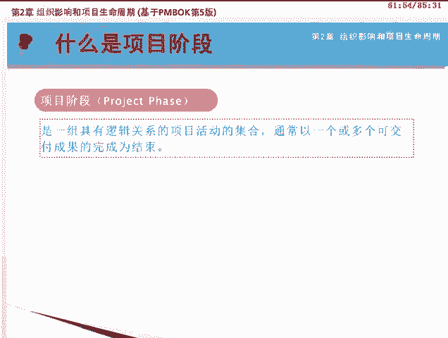

一般情况下，项目可以划分为四个通用的阶段。及启动阶段组织与准备阶段、执行阶段和结束项目阶段。每个阶段结束都会有一个成果。如启动阶段结束会产生项目章程，组织与准备阶段会产生项目管理计划。

执行阶段会产生可交付成果，最后结束项目阶段。会产生存档的项目文件。项目各阶段的工作重点不同。通常需要涉及不同的组织部门，需要不同的技能。项目经理可以对某个阶段施加额外的控制。

已成功实现各阶段的主要可交付成果或阶段目标。阶段需要批准才算结束。阶段结束点是重新评估项目活动并变更或终止项目的一个当然时点。这个时点可称为阶段关口里程碑、阶段审查、阶段门或关键决策点。

对于规模或复杂度不大的项目，可以只用一个阶段来完成。图中所示的电信网络安装管理项目就是单阶段的项目设例。我们看到在这个唯一的阶段中，执行了启动规划、执行收尾和监控5个过程组。

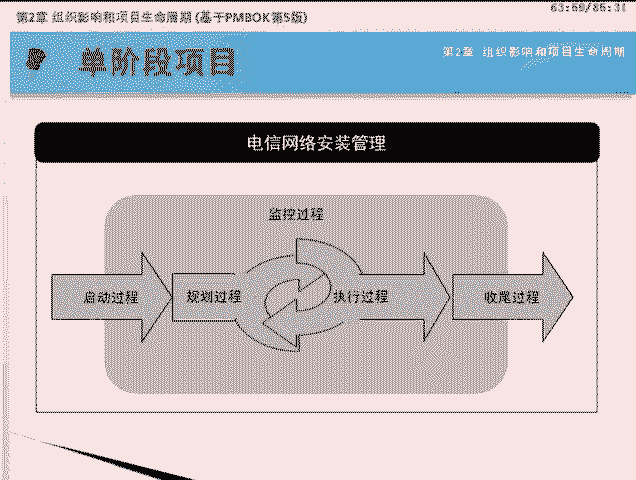

等项目被划分为多个阶段时，这些阶段之间通常按前后顺序排列，但有些情况下也可以交叠进行或并行进行。项目阶段与阶段之间存在三种关系。顺序关系、交叠关系、并行关系。其中，病情关系实际上是一种特殊的交叠关系。

接下来我们详细展开讨论。

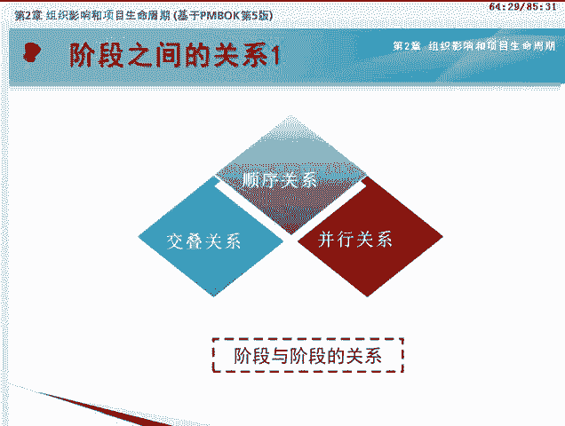

顺序关系顾名思义就是当前的阶段只能在上一阶段完成后开始。阶段之间按部就班先后进行。如危险废弃物场地清理项目，必须按顺序先执行设施停用，然后才是移除废弃物，最后再执行环境美化等一系列阶段工作。

这种关系可以减少项目的不确定性，但是不太容易缩短进度。

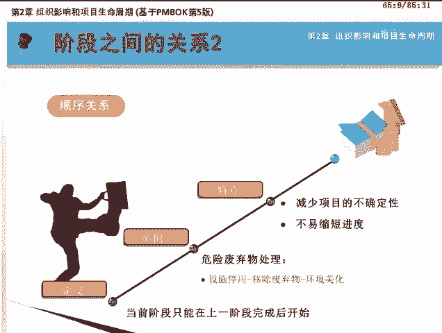

图中所示是顺序关系的示例。我们可以看到，该项目生命周期被分为了三个顺序的阶段。在每个阶段内部也要执行5个项目管理过程组。

交叠关系就是后一阶段在前一阶段完成前便开始了。如建房子时，在图纸还没有全部完成的情况下，可以先进入打地基的施工阶段。这种阶段关系可以适当节省时间，有利于快速跟进，满足项目的进度要求。

但是可能会增加项目的风险，从而导致返工。

图中，这是交叠关系的事例。我们可以看到，该项目生命周期被分为了两个相互交叠的阶段。设计阶段没完成之前就开始了施工阶段，这样可以节约总工期。同样的，在每个阶段内部也要执行5个项目管理过程组。

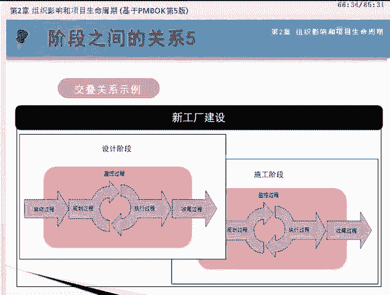

最后要说明的是，在整个项目生命周期中可能发生不止一种阶段与阶段的关系。项目所需达到的控制水平和效果，以及项目所存在的不确定性程度，决定着要采用何种阶段关系。因此，上述三种关系及顺序交叠并发。

可能在同一个项目内发生。

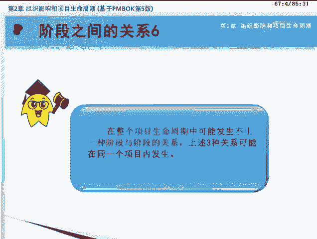

在平安报告指南第五版中。按照项目需求及范围的变更幅度，以及所采取的具体管理手段。把项目生命周期分为三种类型，分别是预测型生命周期。迭代和增量型生命周期和适应型生命周期。

我们为自己的项目选择生命周期模型时，可以选择其中的一种或介于这三者之间的其他形式。需要提醒大家的是，无论你选用哪种项目生命周期类型，都可以在阶段之间采用顺序或交叠的关系。下面我们进行一一讲解。

预测型生命周期也称为完全计划驱动型生命周期。是项目生命周期的一种。在项目生命周期的早期，就确定项目范围，并确定交付此范围所需的时间和成本。预测型生命周期适用于范围明确、变更较小、风险较低。

有成熟项目经验的项目。如建筑工程项目、水电工程项目等。此外，对于需要整体交付的项目，也适用于预测型生命周期。发起人或客户只参与启动和阶段结束。通常每个阶段只关注一组项目活动和项目管理过程。

每个阶段之间工作有本质的差别，所需的技能也不尽相同。预测型生命周期中也并不要求初始计划是一成不变的，可以使用滚动式规划技术，在每个阶段开始之前细化本阶段内容。预测型生命周期的阶段关系可以是顺序或交叠的。

图中所示是一个预测型生命周期项目的事例。该项目分为需求、可行性研究、规划、设计、建造、测试移交共7个阶段。阶段之间可以是顺序或交叠关系，每个阶段的任务完全不同，需要使用不同的技术。

甚至不同的团队成员完成。项目结束后，可交付成果一次性移交给客户。迭代和增量型生命周期就是同时采用迭代和增量的方式来开发产品。迭代方法是通过一系列重复的循环活动来开发产品。

而增量方法是渐进的增加产品的功能。迭代和增量型生命周期适用于范围和目标不明确，风险较大，复杂性较高，可部分交付的项目。

如大型软件开发项目创新研究课题等。迭代和增量型生命周期，要求干系人在项目全程各个阶段参与项目，每个阶段之前提出自己的要求和建议。阶段结束后，审查和验收当前阶段的可交付成果。在迭代和增量型生命周期中。

随着项目团队对产品的理解程度逐渐提高，每个阶段的执行水平和细致程度都比上一阶段有所提高。这种生命周期中普遍适用滚动式规划技术。在迭代和增量型生命周期中，迭代的概念不是特别容易理解。下面我们进行简单介绍。

迭代关系就是一次只规划项目的一个阶段，且下一阶段取决于当前阶段及其阶段成果的进展情况。迭代关系适合在很不明确或快速变化的环境之中使用，但是不利于长期规划。

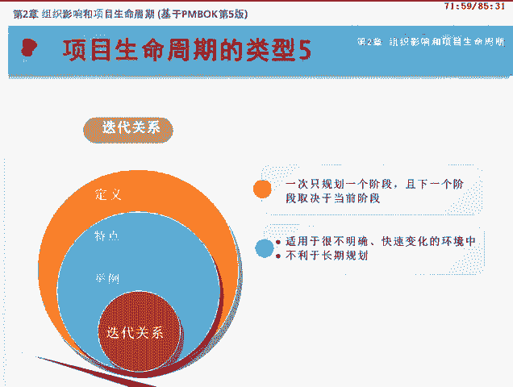

警察画嫌疑犯的模拟像，就可以看作是一个迭代关系。根据多个目击者的描述，一步步的细化嫌疑犯的形象，直到最后画出最接近的图像。篇报告书的一次又一次的阅读和复习，也是典型的接代关系。

为了让大家更好的理解迭代和增量型生命周期。我们举一个软件行业著名的统一软件开发过程RUP进行说明。ROP就是采用了迭代和增量型生命周期。我们看到在这个生命周期中，把项目分为了四个阶段，分别是。

先启动细化构造和移交阶段，这些阶段完成是通过总共8次迭代完成的。每次迭代都要执行左边所示的软件开发行业的九大规程，包括。设定业务规程。需求管理。分析与设计、实施测试部署等。在这种生命周期中。

项目的每次迭代都能新产生包含特定功能的程序版本。到了最后一次迭代，将包括系统的整个功能，这就是所谓的增量开发。因此，这种生命周期就被称为迭代和增量型生命周期。对于软件行业来说，一方面。

应该从提出需求到开发部署的周期越来越短。另一方面，又不得不面对客户随时提出的各种需求变化。如果采用传统项目生命周期模型进行开发。开发和需求始终处于脱节状态，最终常常使客户愿望难以实现。

并且时间往往产生延误。因此，越来越多的软件开发企业开始引入敏捷开发，解决上述问题。篇报指南第五版提出的适应型生命周期的概念，相当于软件行业的敏捷开发。下面我们会进行讲解。

适应型生命周期也称为变更驱动方法或敏捷方法。其目的在于，应对大量变更获取干系人的持续参与。适应型生命周期也包含迭代和增量的概念。但它比迭代和增量型生命周期迭代速度更快，通常2到4周迭代一次。

而且每次迭代所需时间和资源是固定的。适应型生命周期适合以下情况。环境快速变化，需求和范围频繁变更，风险巨大。干系人希望迅速实现原形。在变化迅速的软件开发行业，特别是需求不稳定的中小型软件开发项目。

大量使用这种生命周期模型。迭代和增量型生命周期，要求干系人紧密参与项目。根据项目执行情况，快速做出反馈和建议，及时审查可交付成果。适应型生命周期中，每次迭代都快速产生可交付成果。

经过审查并进一步确认需求后，快速开始下一次迭代。并且在迭代过程中，需求有可能随时变更。因此，有人形容采用适应性生命周期，实际上需要我们拥抱变化。刚才我们介绍的是项目生命周期的概念和定义。

接下来我们补充另外一个概念，产品生命周期。产品生命周期包含通常顺序排列且不相互交叉的一系列产品阶段。一般产品生命周期包括概念、成长、成熟、衰退和退出几个阶段。产品生命周期的最后阶段。

通常是产品的市场推出。因此，可以把产品生命周期看作是从提出产品概念推向市场到产品完全退出市场，进行生命终止的全过程。产品生命周期中，每个阶段的活动都可以作为项目来实施。如产品概念的提出或其研发。

可以是一个项目。产品运营过程中的升级更新，甚至是产品的退出，都可以当做项目来做。因此，在一个产品生命周期中，往往包括多个项目生命周期。项目生命周期一般是产品生命周期的一部分。

一个产品可能包含多个相关项目，因此我们可以将与这一产品研发相关的一系列项目作为项目集来统筹管理，提高项目效率。如新款汽车研发中发动机、轮胎、新型挡风玻璃等主要部件的研发，都可以作为一个项目。

为了便于整个项目的完成，可以将他们作为一个项目级来进行管理。如果项目产出的是一种产品，项目生命周期一般包含在产品生命周期中。如图所示，新产品的开发可以当做一个项目来进行。

经历了概念开发执行到最后结束阶段产出产品。新产品开发完成后，提交到日常运营部门，在运营过程中发现产品存在的不足，然后对其进行运营维护或升级。当然，升级过程也可以按照新的项目来实施。

经历一个新的项目生命周期。如果要继续升级换代，则不断进行着新的项目，直到产品报废退出市场。

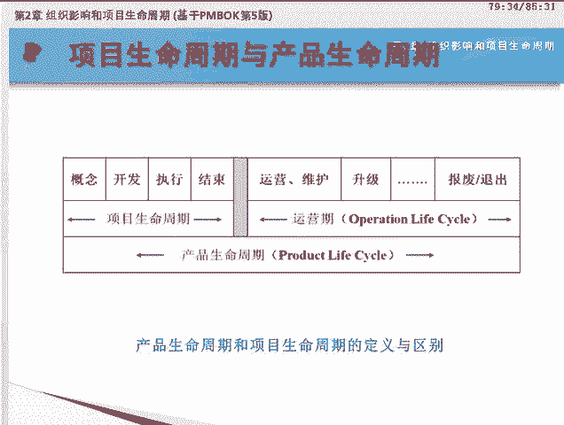

下面我们对这张的内容进行简单回顾。有三种常见的组织形式，职能型、矩阵型和项目型，他们各有优缺点，各有适用的情形。

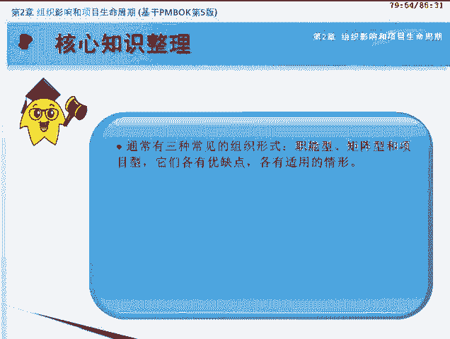

项目经理在项目型组织中权力最大，在矩阵型中次之，在职能型中最小。项目联络员没有任何权利，只负责联络。项目协调员有一定权利，可直接向职能经理或公司经理汇报。

组织过程、资产和事业环境因素是项目管理工作中必须要考虑和加以利用的因素。项目生命周期是指从项目开始到项目结束的全过程。为便于管理与控制，我们通常把项目生命周期划分成几个不同的阶段。

不同阶段风险等变化趋势不同。在项目的早期不确定性大，风险大、变更的代价小。项目阶段之间的关系可以是先后关系，相互交叠关系。产品生命周期是从项目开始到项目结束，再到产品运行终止的全过程。

项目该系人是与项目有利害关系的任何组织、团体或个人。各位学员，恭喜您已经完成了PMP项目管理第二章组织影响和项目生命周期的学习。建议接下来继续学习第三章项目管理过程。我们下堂课件。

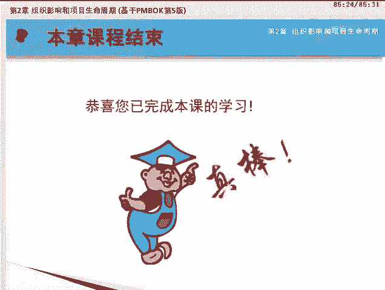