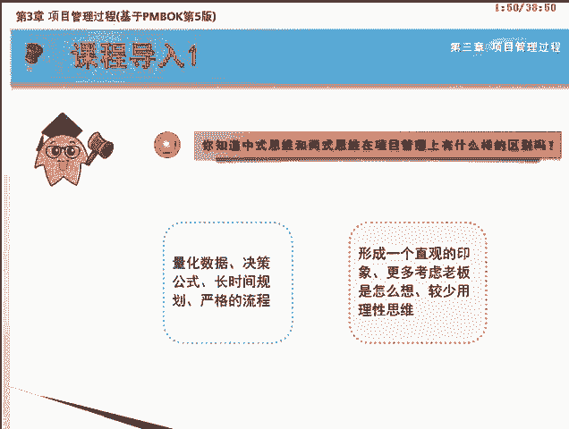
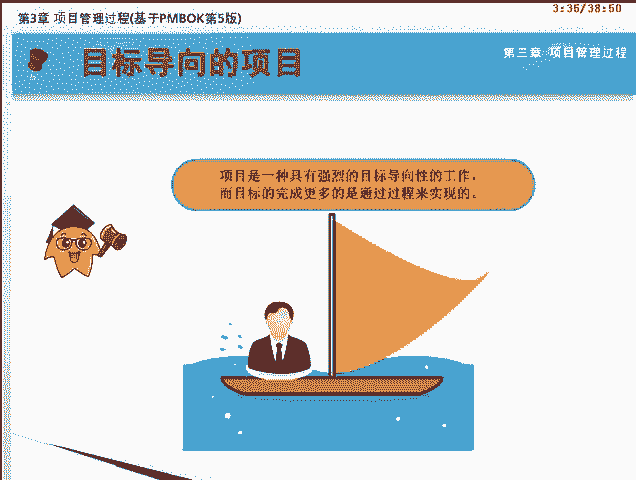
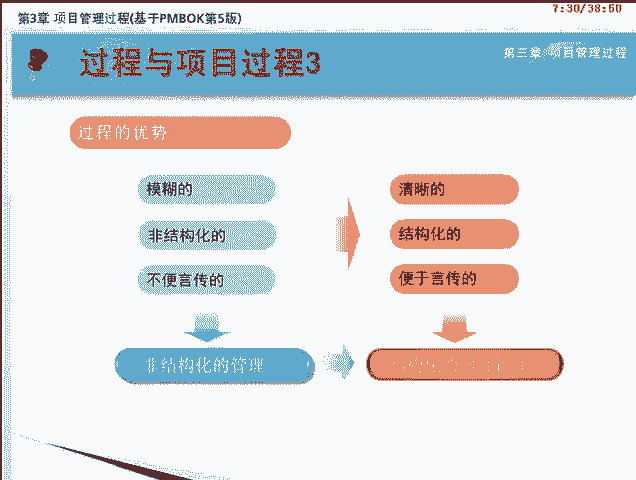
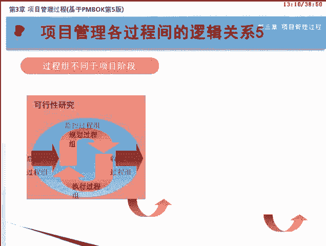
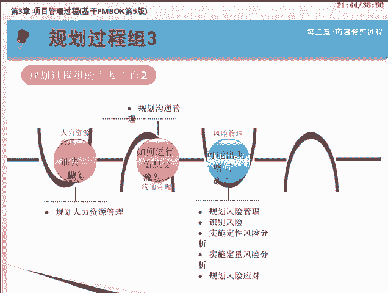
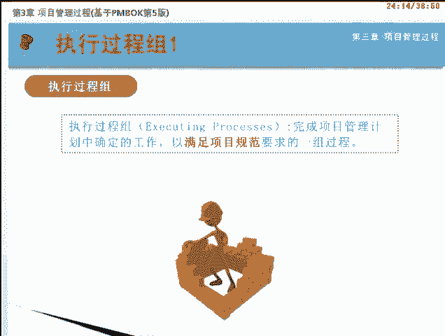
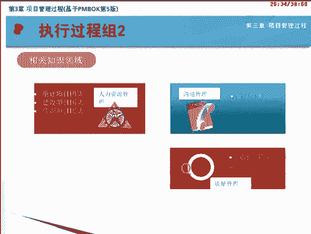
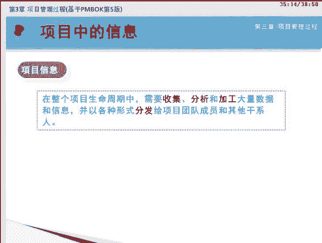
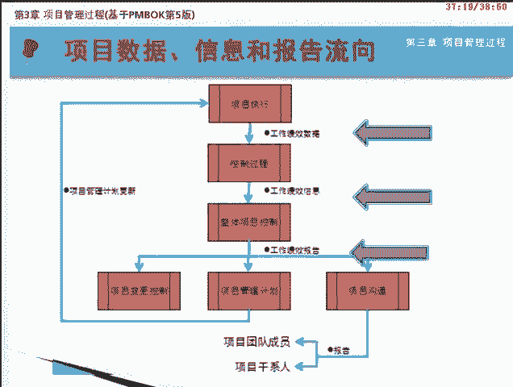
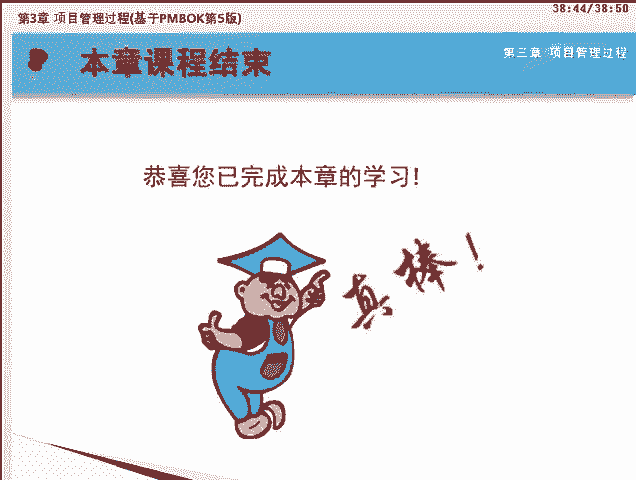

# PMP项目管理 - P3：03 - 自学力 - BV1EZ4y1p7LB

欢迎来到PMP项目管理网络课程的学习。本课程基于最新发布的PI报指南第五版。下面我们将一起学习第三章项目管理过程。首先我来问你个问题。你知道中式思维和西式思维在项目管理上有什么样的区别吗？举个例子。

你来判断一下哪个是中式思维指导下的项目，哪个是西式思维指导下的项目。在决定进行一个项目之前，他们会先取得各种量化的数据。再通过一个决策公式进行运算，最后得出结论。之后会花很长的时间去规划。

考虑如何做更合理更有效。最后制定出严格的流程，然后开始项目的执行工作。而他们在项目开始之前也会考虑各种因素，但往往不会形成一个量化的东西。而是形成一个直观的印象，执行时可能会更多的考虑老板是怎么想的。

然后根据老板的想法来做决定，而较少用理性思维对任务去进行重新分析。你认为哪个是中式思维的做法？哪个是西式思维的做法呢？

答案你一定猜对了，前者是西式思维，后者是中式思维。从思维上看，中式思维和西式思维是存在差异的。学习PM报指南和准备PMP考试，要特别注意这两种不同的思维，在管理上的差别。中式思维较偏向于非结构化。

喜欢留出较大的发挥余地，不讲究精确。而析释思维较偏向于结构化，强调制度和流程，强调管理的具体化和可操作化。在西式思维指导下的项目管理知识体系，也遵循了这个特点。

他将项目管理过程分解成相辅相成的五大过程组。现在就跟随我来进入学习吧。和人生一样，项目同样是一种具有强烈的目标导向性的工作。社会的发展分工的细化，需求的丰富。

干系人众多等特点都使得项目的复杂性增加了很多。因此，如何才能既快又好的完成项目，以最大程度的达成各方的利益诉求，是很多人都在思考的问题。好的，在有项目管理知识体系。

他将项目管理过程分解成相辅相成的五大过程组，学习了它，相信你会有眼前一亮的惊喜。

通过本课程的学习，我们将达到以下目标。包括。理解过程与项目过程的定义。能区分项目管理过程与产品导向过程。掌握项目管理各过程间的逻辑关系。理解过程组间的相互作用。掌握五大过程组的含义与主要内容。

掌握项目信息的流向。熟悉项目管理过程组与知识领域表。本章课程的讲解从过程与项目管理过程的概念开始，阐释其具体含义，以及项目管理过程和产品导向过程的差别。接着对项目管理过程间的逻辑关系进行说明。之后。

对项目管理的五大过程组进行展开说明。讲解完毕，会对5个过程组再做回忆，并阐述一些观点。最后是帮助您回顾本章重点内容的核心知识领域。需要首先说明。项目经理在任何时候都应与项目团队一起共同负责。

确定哪些过程适用于具体给定的项目，以及各个过程适合于该项目的严格程度。过程这个概念大家应该非常熟悉。你通过网上商城下订单购买商品。卖丰通过物流运送货物。物流公司将商品送到你的手中，这就是一个过程。

学习项目管理知识体系，您不可以不知道过程这个概念。因为整个PM报知识体系的核心就是47个过程。下面我们就来学习项目管理知识体系中的过程。根据P安报指南的定义。

过程是为创建预定的产品服务或成果而执行的一系列相互关联的行动和活动。项目管理中的每个过程是一个需要接收各种相关的输入，并对这些输入运用工具与技术进行适当处理，来创造所需要的输出的行为或活动。也就是说。

项目管理中的过程正是借助相关工具和技术，将输入转化为输出的相关或互动的活动的集合。在后面47个过程的学习中，输入工具与技术和输出，我们会用他们英文的第一个字母的大写来表示即ITTO。

借助过程来描述项目管理工作的好处，是把本来比较模糊的非结构化的、不便于言传的项目管理转变成比较清晰的结构化的、便于延传的项目管理方法。这也正是PM报的主要贡献之处。

就是将非结构化的项目管理变成相对结构化的项目管理。这种结构化的项目管理方法是提高工作效率与效果，特别是做大项目复杂项目的良方。

在项目管理中共有两种项目过程。即项目管理过程和产品导向过程。项目管理过程其实是基于输入输出的管理过程集合。而产品导向过程是基于阶段的项目生命周期过程。他们的区别主要有3点。第一。

项目管理过程是对项目管理工作的理论抽象，而产品导向过程是实现产品所需的具体步骤。其次。项目管理过程主要关注项目管理的过程，而产品导向过程主要关注产品的实现过程。最后。

项目管理过程确保了项目自始至终顺利按过程进行，而产品导向过程说明并创造出项目的产品。比如，软件的开发在生命周期上可能会划分为需求调研、系统分析、系统设计、编码、测试、使用与维护这样的阶段。

而在项目管理上，虽然是经典的启动规划、执行、监控和收尾五大过程。不过需要注意的是。整个软件的开发可以通过启动规划、执行、监控和收尾这5个过程来进行管理。任何一个阶段，比如需求调研或编码。

也可以应用启动规划、执行、监控和收尾这5个过程来进行管理。在实际的项目中，这两种过程是相互重叠，相互作用的，不能截然分开。本课程我们主要讨论的是项目管理过程，而不是产品导向过程。

而且PMP考试也主要是考项目管理过程。P报指南将47个过程归纳到5个过程组中，这就是我们刚才已经提到过的启动过程组、规划过程组、执行过程组、监控过程组和收尾过程组。在每个过程组内部包含了多个过程。

比如规划包含了24个过程，所以常称为规划过程组。这5个过程组之间的关系，你也许通过它的字面已经有了自己的理解。然而，他们之间的逻辑关系并不是那么简单。接下来我们先来了解一下这5个过程组之间的逻辑关系。

过程的一个特点是循环。这张图反映了项目的大致过程。项目启动者或发起人提出一定的项目需求，作为项目的最初输入。在此基础上，经过一定的准备，项目正式启动，随之进行规划执行，并且伴随着监控。最后项目完成。

项目可交付成果，交付最终用户。项目记录写入组织过程资产。你有没有发现这其中一个重要的逻辑关系循环？因为一些过程在一个项目上可能需要反复循环几次甚至多次。循环的出现，一方面是由项目渐进明细的特点决定。

另一方面是在下一次过程期间发现有必要重新进行上一个过程。比如，根据执行过程的情况来调整项目计划安排，这就意味着重新进行了一次规划过程。过程的第二个特点是重叠。项目的5个过程组虽然有一定的顺序关系。

但并不是绝对的先后顺序。在实际的项目工作中，各过程之间的界面不一定非常明确。在时间上，他们之间往往会有很大程度的重叠。一方面，在项目中期规划执行以及监控同时都有进行。另一方面。

一个过程的输出经常成为其他过程的输入。第三个特点是贯穿。这是说监控过程组实际上是贯穿在其他四个过程组中的，通常不能在时间段上独立存在。在启动规划、执行以及收尾过程组，都需要进行不间断的监控。实际上。

很多过程在项目实施中要反复多次进行，但属于哪一个过程组取决于其主要活动在哪里进行。即使其在另外一个过程组中重新进行，但P报指南不会定义一个新的过程。第四，过程组不同于项目阶段，在很多大型或复杂项目中。

都可能会将项目分成若干阶段。如可行性研究阶段、概念开发阶段、设计阶段、建模阶段、建造阶段、测试阶段等。

每个阶段都有具体的阶段目标。在每个阶段中，这5个过程组都可以存在，即每个阶段都可以进行启动规划、执行、监控以及收尾过程组。接下来我们来了解项目管理的知识领域划分。

PN报指南将项目管理的知识划分为十大知识领域。他们分别从不同的管理职能和领域描述了现代项目管理所需要的知识方法、工具和技能以及相应的管理实践。这10个知识领域是项目整合管理。

项目范围管理、项目时间管理、项目成本管理、项目质量管理、项目人力资源管理、项目沟通管理、项目风险管理、项目采购管理和项目干系人管理。结合五大过程组就构成了这个项目管理过程组与知识领域表。47个过程。

根据大多数活动所处的过程组和知识领域散布于表中。需要说明的是，所有的过程名称都是动宾结构，及一个动词，后面加上名词。比如，制定项目章程过程。制定是动词，项目章程是名词。为了顺利通过PMP考试。

建议考生把这张表格熟记下来。下面我们从过程组的角度来进一步学习5个过程组的含义与所包含的过程。俗话说，好的，开始是成功的一半，让我们来看看如何开好项目的头。

启动过程组包含定义一个新项目或现有项目的一个新阶段，授权开始该项目或阶段的一组过程。启动过程组的任务是定义初步范围和落实初步财务资源。识别那些将相互作用，并影响项目总体结果的内外部干系人选定项目经理。

启动过程图的内容相对简单，只有两个过程，分别是项目整合管理知识领域的制定项目章程和项目干系人管理知识领域的识别干系人过程。项目章程主要用于批准项目正式成立。也记录项目的核心需求。

而识别干系人就是将所有受项目影响的人或者组织加以识别与记录的过程。之所以把识别干系人放在启动过程组，就是为了强调尽早识别并管理干系人。启动过程组的核心是定义项目。就如同我们要做什么事，先要定好目标一样。

只有定义好项目后，管理层才能正式批准启动项目。那都要定义些什么内容呢？我们来看一下启动过程组的主要工作。选择项目经理并授权，也就是授权项目经理为开展后续项目活动所需动用的组织资源。

书面记录商业需求、项目假设和约束等。确定项目目标。识别项目干系人。初步落实财务资源。启动过程组的主要工作内容经过整合，从而得到相当于项目宪法的项目章程以及干系人登记册等内容。在启动过程组要注意的是。

要让客户和其他干系人参与启动过程。这样做通常能提高他们的主人翁意识，使他们更容易接受可交付成果，更容易对项目表示满意。俗话说，凡事预则利不预则废，可见规划的重要性了。接下来我们看看如何对项目进行规划。

规划过程组包含明确项目范围、定义和优化目标，为实现目标制定行动方案的一组过程。规划过程组的任务是制定用于指导项目实施的项目管理计划和项目文件。规划过程组涵盖了项目管理的十大知识领域，共24个过程。

下面我们来看看这些过程都是做什么的。在启动过程组，我们已经确定了项目的大致目标。在规划过程组就要将目标进行细化，明确项目范围，并制定出一系列的行动方案。首先要明确的问题是项目要做什么。

这就需要确定项目的范围，具体的过程有。规划范围管理确定如何管理范围。收集需求，了解干系人对项目的需求。定义范围对项目和产品进行详细描述。创建WBS。

把项目可交付成果或项目工作分成较小的易于管理的组成部分。明确了项目的范围，我们还要对项目的工期做安排，也就是什么时候做的问题。在这部分，首先要规划进度管理，确定如何管理进度。

定义活动弄清楚要做的各项活动。排列活动顺序，明确活动之间的相互关系。估算资源。明确活动所需资源。估算活动去时间，在前面几步的基础上进行工期的估算。最后编制项目进度计划。那完成这些活动需要多少钱呢？

这就要对项目成本进行估算。根据项目范围和工期确定实际资源情况，确定成本基准的两个活动。是估算成本和制定预算。当然，进行成本管理之前，需要执行规划成本管理过程来确定如何管理成本。

接下来项目要做成什么样子呢？也就是要确定项目的质量标准以及如何才能达到质量标准。这个过程是规划质量管理。有了对任务的范围、进度、成本和质量的安排，没有人来做，自然不会达到项目目标。

这就是涉及谁去做的问题。因此，要编制人力资源计划，明确项目团队成员的角色和职责等。项目一旦要执行，项目团队成员和项目干系人之间一定少不了信息交流，这就需要规划沟通，从而定义沟通需求和方法等。

风险无处不在，在项目的某些环节上可能出现风险，为此就要提前规划风险管理，识别风险，对风险实施定性和定量的分析，最后得出风险应对计划。如此一来，才能对项目的风险进行有效的规避与控制。

此外，对于项目所需，但是组织内不能产出的，还要通过采购来获得。为此，要规划采购，确定采购对象和方法等。在P报指南第五版中特别强调了干系人的重要性。实际上，在考虑上述所有过程之前。

都需要确定干系人管理策略，才能理顺各种关系。因此，篇报和指南中加入了干系人管理知识领域中的规划干系人管理过程。综合上述所有内容，形成一个综合性的计划项目管理计划，完成制定项目管理计划过程。由此可见。

规划过程组的主要工作就是。制定用于指导项目实施的项目管理计划和项目文件。对项目范围、时间、成本、质量、沟通和采购等各方面做出规定。关于项目文件的概念，后面会讲到这里简单说一下。

项目文件就是项目规划过程中产生的不属于项目管理计划的所有文档。在规划过程组的所有过程中，每一步工作的结果都有可能导致对以前工作结果进行调整与更新。比如，风险规划可能会引起项目成本计划和进度计划的更新。

此外，项目生命周期中发生的重大变更，也可能会引发重新定义一个或多个规划。最终导致项目管理计划的更新。这个不断细化和更新的过程，也是滚动式规划的过程。当然，和启动过程组一样。

项目团队也应鼓励所有相关干系人参与规划项目，制定项目管理计划和项目文件。

再完美的计划，如果没有付诸行动，都无异于白日做梦，所以执行才是实现计划的真正法宝。执行过程组包含完成项目管理计划中确定的工作，以满足项目规范要求的一组过程。

执行过程组的任务是按照项目管理计划来协调人员和资源，管理干系人期望以及整合并实施项目活动。在这个过程组共有8个过程，涉及5个知识领域。再次说明，很多过程在项目实施中要反复多次进行。

这属于哪一个过程组取决于其主要活动在哪里进行？即使其在另外一个过程组中重新进行，但PM报指南不会定义一个新的过程。在人力资源管理知识领域的执行过程，包括组建项目团队过程。

为提高团队工作绩效的建设项目团队过程，以及跟踪成员表现，优化项目绩效的管理项目团队过程。在沟通管理知识领域，需要执行向项目干系人提供相关项目信息的管理沟通过程。在执行中。

还要进行确保符合质量标准的实施质量保证过程。

在执行中需要，但是组织中没有的资源，就要根据规划好的采购文件，在本过程组实施采购过程了。此外，在干系人管理知识领域，与干系人沟通，以满足干系人期望的管理干系人参与过程。当然。

这些工作依赖于整合管理知识领域中的指导与管理项目工作过程进行整合。由此可见，本过程组的主要工作是协调人员和资源，按照项目管理计划整合并指导实施项目活动。这也意味着执行过程组将是消耗资源最多。

团队投入精力最多的过程。要注意的是，项目执行过程进行执行的结果，将可能更新项目计划和重新确立基准。人们常常感叹，计划跟不上变化，可见，完美的计划是不存在的。就好比航行中的船只需要不断的进行监控。

在遭遇风雨的时候，要及时调整航向，才能确保安全驶向目标。所以需要监控过程组来进行不断的监控和调整。监控过程组包含跟踪审查和调整项目进展与绩效，识别必要的计划变更，并启动相应变更的一组过程。

监控过程组的任务是定期或在特定事件发生时，在异常情况出现时对项目绩效进行测量和分析，从而识别于项目管理计划的偏差。在项目管理中，监控过程组的主要作用是什么呢？首先要观察和测量。

就是持续并有规律的观察和测量项目绩效。从而识别实际执行结果与项目管理计划的偏差。其次，要做好控制和预防，就是要控制变更，并对可能出现的问题推荐预防措施。当然，监督工作也不可少。

要对照项目管理计划和项目绩效基准，监督正在进行中的项目活动。最后还要介入一定的干预，干预那些规避整体变更控制的因素，确保只有经批准的变更才能付诸执行。除人力资源以外，其他知识领域都有监控过程。

共11个过程。项目的监控过程围绕以下几个方面进行。项目范围管理。对项目完成的可交付成果进行验收以及监督项目的范围状态，管理范围基准变更的确认范围过程和控制范围过程。项目进度管理。

监督项目进度、管理进度基准变更的控制进度过程。项目成本管理更新项目预算管理成本基准变更的控制成本过程。项目质量管理监督项目的结果判断是否符合质量标准，建议必要变更的控制质量过程。

项目风险管理跟踪监控识别评估风险的控制风险过程。项目采购管理管理采购、监督合同绩效的控制采购过程。项目沟通管理发布绩效信息的控制沟通过程。项目干系人管理监督干系人关系的控制干系人参与过程。从整体上来说。

就是跟踪审查和调整项目进度，以及审查批准变更的监控项目工作过程和实施整体变更控制过程。值得一提的是，监控过程组也可能提出并批准对项目管理计划的更新。比如，未按期完成偶项活动。

就可能需要调整现有的人员配备计划，安排加班或重新权衡预算和进度目标。善始慎终是说，做事情有好的开头，也要有好的结尾。做项目也应如此。项目无论成功还是失败，我们都应该为这段经历画上一个句号。

这个过程组既是项目完结的标志，同时也为将来的类似项目的开展提供了可借鉴的材料。收尾过程组包含完结所有项目管理过程组的所有活动，正式结束项目或阶段或合同责任的一组过程。

收尾过程组完成时就表明未完成某一项目或项目阶段所需的所有过程组的所有过程均已完成，标志着项目或项目阶段正式结束。收尾过程组的内容比较简单，只有两个过程。

包括结束所有采购工作的结束采购过程和完结所有项目管理活动的结束项目或阶段过程。收尾过程组的工作主要有获得客户或发起人的验收，进行项目后评价或阶段结束评价。记录裁剪任何过程的影响。经验教训进行记录。

组织过程资产更新项目文件归档，并且解散项目组，让团队成员回到各自的岗位上，从而全面结束采购工作。到此，项目就画上了圆满的句号。好了，五大过程组已经初步学习完毕，我们来回顾一下吧。

启动过程组的主要工作是批准授权项目或阶段的开始，确定项目目标制定并颁发项目章程以及识别干系人。规划过程组涉及十大知识领域，是对项目章程的逐步细化，最终整合成一份完整的项目管理计划。

执行过程组就是指导项目，按照计划执行，涉及人力资源管理、质量管理、沟通管理、采购管理、干心人管理和整体管理六大知识领域。监控过程组是对各方面绩效进行测量和监视，以发现偏差。

它涉及除人力资源外的所有知识领域，它的关键在于监督和控制。收尾过程组需要验收成果，结束采购工作，释放人员更新组织过程资产等已完结所有的项目管理活动。了解了五大过程组和47个过程，你是不是觉得过程很多。

难于记忆？况且如此管理项目是否过于复杂。要说明的是，在实际的项目中，你不一定全部使用这些理论所介绍的47个过程。可根据实际情况做一个裁剪，比如裁剪为30个过程，也可以增加为50个过程。

至于过程记忆的问题，相信你学习了后续的课程，会对他有更深的理解。在此基础上再加强记忆。还要提醒的是，在讲解的过程中，我们为了您理解的方便，采取了一定的顺序。而在实际工作中，这些过程往往纠缠在一起。

并没有明显的先后顺序。最后，项目管理的过程适用于全球各行各业的所有项目是通用的。在整个项目生命周期中，需要收集分析和加工大量数据和信息，并以各种形式分发给项目团队成员和其他干系人。为减少沟通障碍。

P安报告指南第五版把项目中的数据和信息进行了重新定义。我们需要掌握如下三个概念，他们会在今后的课程中反复出现。

工作绩效数据。在执行项目工作的过程中，从每个正在执行的活动中收集到的原始观察结果和测量值。比如，工作完成百分比质量和技术测量值进度活动的开始和结束日期。

变更请求的数量、缺陷数量、实际成本和实际持续时间等。工作绩效信息。从各控制过程中收集并结合相关背景和跨领域关系进行整合分析而得到的绩效数据。例如，有可交付成果的状态变更请求的执行状态，预测的完工估算。

工作绩效报告。为制定决策提出问题，采取行动或引起关注。而会编工作绩效信息所形成的实物或电子项目文件。比如，状况报告、备忘录、论证报告、信息杂技。电子报表推荐意见或情况更新。

画面所示是项目中数据信息和报告的产生和流向图。可以看到。执行过程产生了实事求是的工作绩效数据。各个控制过程，把这些原始数据经过整理分析，得到了工作绩效信息。关注项目整体情况的监控过程。

为了进行决策或对外汇报，把这些绩效信息进一步汇编整理成工作绩效报告。这个报告一方面用于指导整体变更及项目管理计划的更新。另一方面，用于向各类干系人报告项目状态。

下面我们来回顾本章的核心知识。任何项目都有共同的项目管理过程，五大过程组和47个过程，而产品导向过程却因项目不同而异。

项目管理的五大过程组是启动规划、执行监控与收尾，适用于任何项目及其阶段的管理工作。项目管理各过程之间的关系比较复杂，虽然有一定的先后顺序，但在实际工作中经常是重叠交叉并反复进行的。

并不是47个项目管理过程，在任何项目中都要使用。应根据项目的具体情况而定。项目中需要记录和处理的三类重要信息是工作绩效数据、工作绩效信息和工作绩效报告。各位学员。

恭喜您已经完成了第三章项目管理过程的学习。建议接下来继续学习第四章项目整合管理。我们下堂课见。

