# PMP项目管理 - P4：04 - 自学力 - BV1EZ4y1p7LB

欢迎来到PMP项目管理网络课程的学习。本课程基于最新发布的PIB指南第50版。下面我们将一起学习第四章项目整合管理。在正式学习之前，我们先来介绍本知识领域的基本概念和框架。

在项目管理十大知识领域五大过程组的体系中，项目整合管理处于怎样的地位呢？请和我一起观察这幅位置图。整合管理是第一个知识领域，有6个过程，分散在五大过程组中，它起到了协调与统一其他各知识领域的作用。

在这一章，我们要重点学习项目整合管理的6个过程。分别是启动过程组的制定项目章程、规划过程组的制定项目管理计划。执行过程组的指导与管理项目工作、监控过程组的监控项目工作和实施整体变更控制。

以及收尾过程组的结束项目或阶段。这些过程在位置图中的位置是考试必须考的重点，请务必记下来。那么什么是项目整合管理呢？

项目整合管理包括为识别定义组合、统一和协调各项目管理过程组的各种过程和活动而开展的过程与活动。在项目管理中，整合兼具统一合并沟通和集成的性质。对受控项目从执行到完成。

成功管理干系人期望和满足项目要求都至关重要。

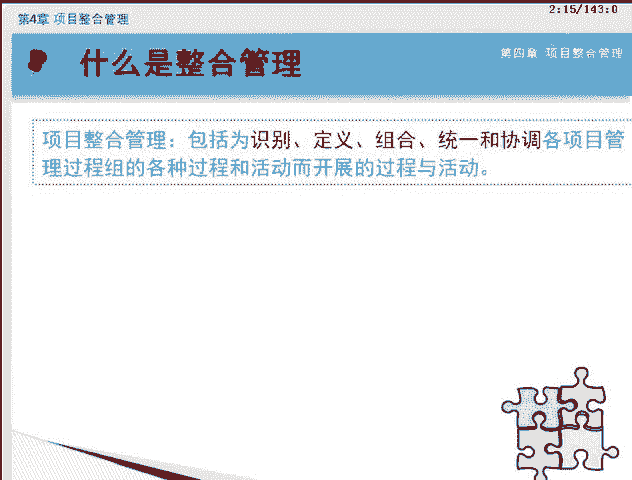

项目整合管理包括选择资源分配方案、平衡相互竞争的目标和方案，以及管理项目管理知识领域之间的依赖关系。虽然各项目管理过程通常以界限分明、相互独立的形式出现。但在实践中。

他们会以本指南无法全面叙述的方式相互交叠，相互作用。为什么需要整科管理呢？因为在项目中有许多的结合点，如不同组织的结合点，不同专业的结合点，不同过程的结合点。他的处理直接影响到项目的顺利与否。比如。

为实现项目目标，需要在相互竞争的范围。时间、成本和质量等分目标上进行整合，还需要在不同利益的各项目干系人之间进行整合。此外，在项目管理的各过程之间也少不了整合。比如，为应急计划制定成本估算时。

就需要整合成本时间和风险管理知识领域的多个相互联系的过程。由此可见，项目整合管理的重要性。项目整合管理如此重要，那谁来承担整合管理的责任呢？毋庸置疑，这自然是项目经理的职责。

项目经理在项目管理中的角色是多方面的这其中最重要的角色是整合者。整合既不能牺牲任何项目目标，也不能伤害任何项目干系人。这就是项目经理的专业化职责之一。

按照PM报指南第五版项目整合管理通过以下6个过程来实现。制定项目章程。这是项目启动阶段要做的一项重要工作，以正式启动项目确定它的合法地位。制定项目管理计划。项目正式启动后，编制一份综合性的项目管理计划。

指导与管理项目工作。按照项目管理计划的要求，开展项目工作，以实现项目目标。监控项目工作。对项目执行工作进行监督与控制。实施整体变更控制。对项目执行和监控过程中提出的变更请求进行评审。结束项目或阶段。

完结所有项目或阶段过程组的活动，正式结束项目或项目的某个阶段。各位学员马上进入项目整合管理这一知识领域的各过程的学习吧。

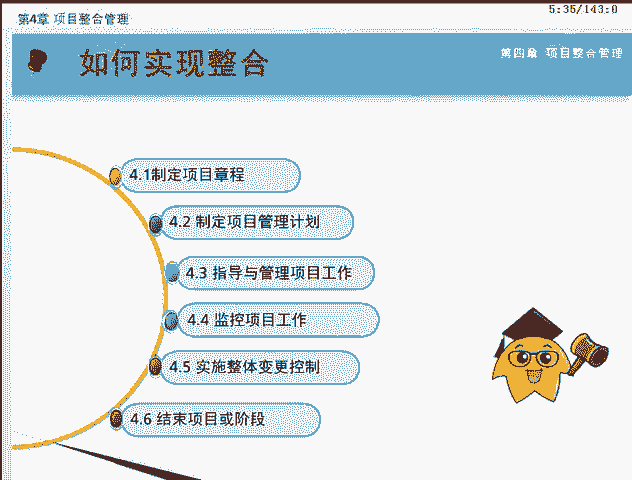

本课程我们将一起学习第四章项目整合管理知识领域的第一节，制定项目章程。各位学员，以下的情况请你先思考。有一天，发起人mister sponsoror找到mister PMM。

想请他出任一个项目的项目经理。与此同时，mrs表示，因为项目的时间很紧张，因此可以省略掉发布项目章程的环节，直接进入项目的启动阶段，以便加快项目的进展。这让m。PM陷入困惑，他不知道应该欣然接受任务呢。

还是向mrponer要求更多的资源后再接受任务，又或者告诉m。poner没有项目章程就做项目会产生不良后果。

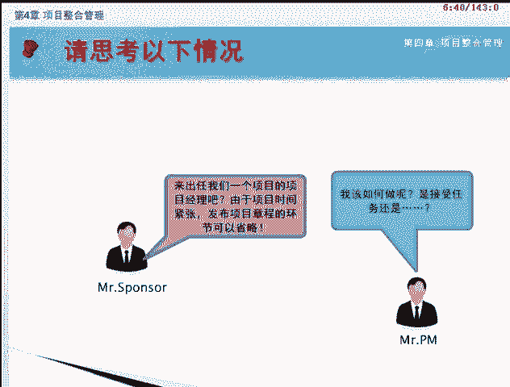

通过本课程的学习，我们将要达到以下目标。包括。掌握制定项目章程过程的含义与作用。掌握项目工作说明书的含义与内容。了解商业论证的意义与编制基础。了解协议事业环境因素和组织过程资产的含义与内容。

知道专家获取的渠道有哪些？掌握项目章程的含义和包含的主要内容。掌握制定项目章程过程所涉及的PMI思维。本课程我们将按照如画面所示的大纲为您讲述。首先是对项目章程及制定项目章程过程的基本含义进行讲解。

接下来分析制定项目章程的输入及项目工作说明书、商业论证、协议、事业环境因素和组织过程资产。专家判断和引导技术作为制定项目章程过程的工具与技术，我们也会详细解释。当然。

我们还对本过程的输出及项目章程进行细致讲解。课程的最后由本课核心知识整理以及课后测试。在学习制定项目章程过程之前，我们先来了解两个基本概念。项目章程和制定项目章程。

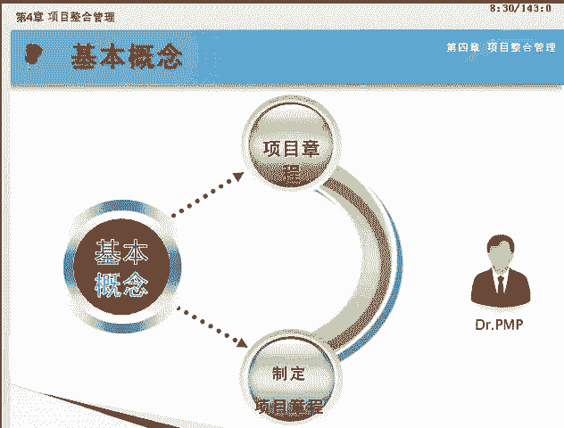

项目章程是由项目启动者或发起人发布，正式批准项目成立，并授权项目经理动用组织资源开展项目活动的文件。在这个定义里。要强调的是，项目章程的签发人是项目启动者或发起人。他的签订意味着项目的正式成立。

而且项目经理就是拿着这个上方宝剑去要资源的。根据刚才讲解的定义来回答下面三个问题吧。一。😊，项目章程的起草人与签发人是谁？我们看到起草者除了启动者或发起人外，在新版批案报告中鼓励项目经理参与。

甚至负责项目章程的起草。当然，前提是获得授权和认可。至于签发和批准，项目章程，通常由身处项目团队外部的人或组织批准。其级别适用于为项目出资或提供资源。

如项目发起人、启动者、高层管理人员、项目管理办公室或项目组合管理委员会等。2、项目征程的主要作用是什么？孔子曰，名不正则言不顺，言不顺则事不成。其实对项目管理来说也是如此。项目与日常运营工作不同之处。

主要在于临时性。日常运营工作具有一定的惯性，人们会自然的投入资源来完成。项目则不同，人们往往不会主动参与，因此需要把人们对项目的重视度提升到日常工作之上。首要的工作就是证明。

项目章程是为项目证明的重要文档。另外，在项目章程中会授权项目经理在项目活动中使用组织资源。所以项目章程的另外一个主要作用就是对项目经理进行授权。3、项目章程是否可有可无。不是的。

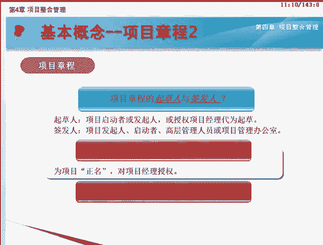

相信通过前面的讲解，大家已经知道项目章程的必要性。既然是为项目证明的文件，无论是内部项目还是外部项目，所有项目都必须有项目章程。制定项目章程是编写一份正式批准项目。

并授权项目经理在项目活动中使用组织资源的文件的过程。本过程的主要作用是明确定义项目开始和项目边界，确立项目的正确地位，以及高级管理层植树他们对项目的支持。这里要特别指出的是。

该过程的输出是一份正式批准项目或阶段的文件。也就是说，项目征程获得批准就标志着项目的正式启动。但需要说明的是，项目章程只是记录初步要求，因为它一般只涉及一些总体性的描述。

项目章程的制定由项目需求组织和执行组织共同商讨确定，同时也在执行组织与需求组织之间建立起伙伴关系。还应注意的是，项目经理今后要领导这个团队实现项目目标。应尽早确认并任命项目经理。

最好在制定项目章程时就任命，最晚也必须在规划开始之前。项目经理应该参与项目章程的制定，以便对项目需求有基本的了解，从而在随后的项目活动中更有效的分配资源。

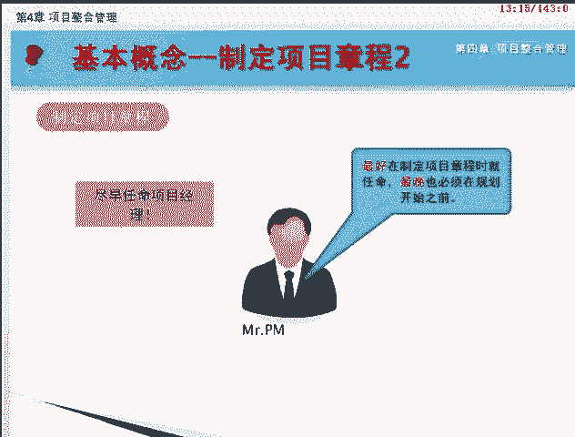

接下来让我们来看看项目章程是如何被制定出来的。这个过程的输入内容包括项目工作说明书、商业论证、协议、事业环境因素和组织过程资产。在输入的基础上，我们应用专家判断和引导技术。

得到最终的输出项目章程这个文件。在这个过程的ITTO中，我们会对项目工作说明书和商业论证专家判断以及项目章程进行重点讲解。这是制定项目章程过程的数据流向图。

展现了该过程如何通过输入输出与其他过程进行交互。可以看到项目章程是许多规划过程的输入。制定项目章程共有5个输入，下面我们依次来了解他们吧。

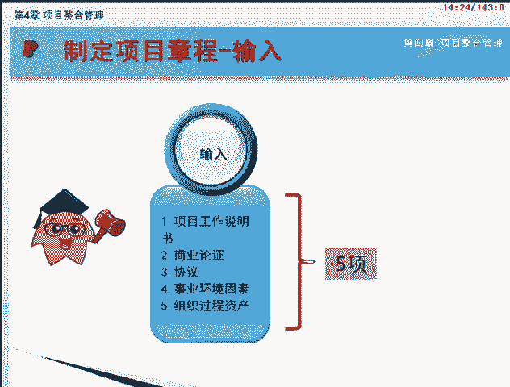

我们先来看输入中的项目工作说明书。项目工作说明书，英文statement of work简称SOW。是对项目需交付的产品或服务或成果的叙述性描述。

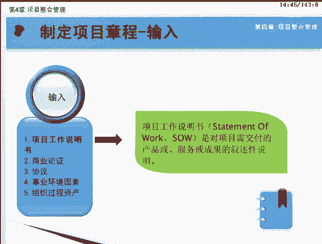

接下来我们来了解项目工作说明书的提供者是谁，以及会涉及哪些内容。项目工作说明书作为制定项目章程的重要输入，及提供者根据项目类型的不同而有所不同。如果是内部项目，项目启动者或发起人。

根据业务需要及对产品或服务的需求来提供工作说明书。比如某培训公司为了提高收入，公司高层批准一个新课程开发项目。在这种情况下，项目说明书的提供者就是公司高层。如果是外部项目。工作说明书则由客户提供。

比如刚才讲到的培训公司，在某企业客户的定制需求下，为其开发课件。此时的项目工作说明书的提供者就是该客户。在这种情况下，工作说明书的内容可以是招标文件。

比如建议邀请书、信息邀请书、投标邀请书的一部分或者合同的一部分。

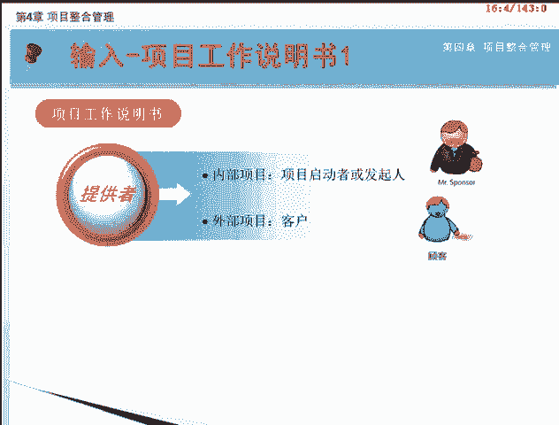

项目工作说明书涉及的内容，包括业务需要。他回答了我们为什么需要这个项目的问题。包括产品氛围描述，这回答了项目做什么的问题。还包括战略计划，也就是做哪一个项目比较好的问题。

或者说符合所在组织的更高层次战略目标。要注意的是，PMI认为，项目工作说明书应由发起人提供，而非项目经理。那商业论证是从哪些方面展开的呢？通常会基于以下一个或多个原因。

包括市场需求、组织需要、客户需求、技术进步、法律要求、生态影响和社会需要等。比如，为了缓解低收入家庭住房难的局面，某市批准经济适用房项目，这就是基于社会需要进行商业论证分析的案例。

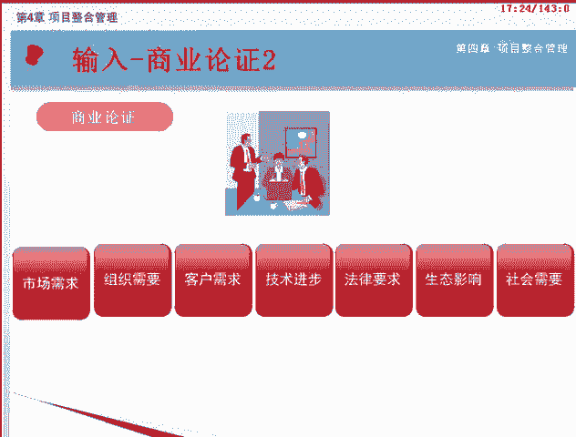

在多阶段项目中，可通过对商业论证的定期审核来确保项目能实现其商业利益。制定项目章程过程的第三个输入是协议。如果项目是为外部客户做的，往往需要一份协议来做保证。协议定义了启动项目的初衷。

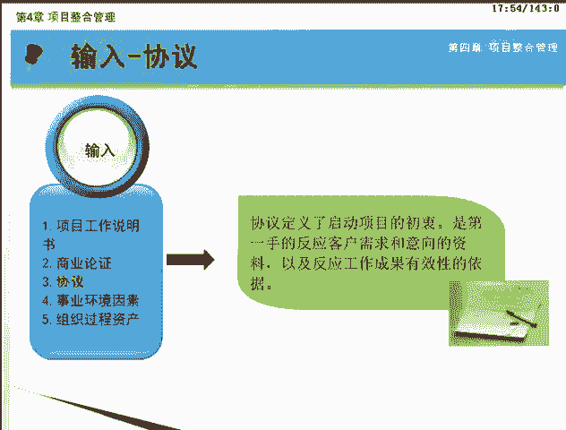

协议作为制定项目章程的输入之一是第一手反映客户需求和意向的资料，以及反映工作成果有效性的依据。在项目按照协议执行时，经签字的协议通常即作为卖方，也就是项目经理所在方的项目章程中的重要内容。

协议有多种形式，包括合同谅解备忘录、服务品质协议、协议书、意向书等。协议可以是口头协议，也可以是以电子邮件或其他书面协议。制定项目章程时，需要考虑许多事业环境因素，包括。

政府标准、行业标准或法规组织文化和结构。市场条件等。实际上，事业环境因素是好多过程的输入。聪明的人不重复发明轮子。项目经理应善于使用组织过程资产，帮助自己获得项目成功。

这些信息有助于项目经理从组织过去的项目中吸取经验。许多项目经理不注意总结利用以往项目的知识库。所以在新项目中，他们必须从头开始进行所有的工作。而良好的经验教训知识库能有助于组织项目的持续提高。

制定项目章程时能够使用的组织过程、资产包括。组织的标准过程、政策和过程定义。模板如项目章程模板。历史信息与经验教训知识库。如项目记录和文件完整的项目收尾信息和文档。

关于以往项目选择决策的结果和以往项目绩效的信息以及风险管理活动中产生的信息等等。制定项目章程这个过程有两个工具与技术、专家判断和引导技术，我们一块来学习。

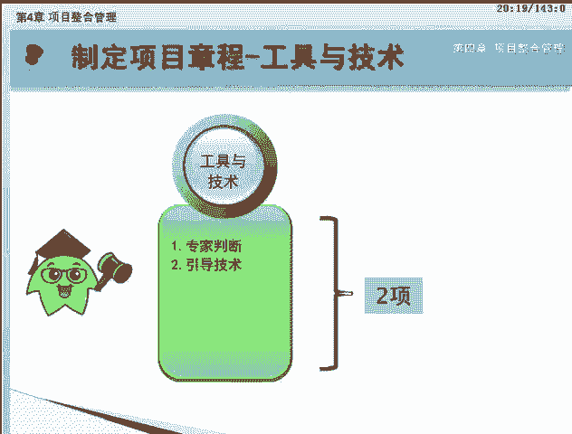

先来看专家判断这种技术。专家所具备的企业知识和判断力，常用于评估制定项目章程的输入。处理各种技术和管理问题。实际上，专家判断是项目整合管理这一知识领域的6个过程的通用工具与技术。

你也许会问专家判断中的专家都是从哪儿来的呢？其实，专家可以是任何具有专业知识或专业培训经历的小组或个人。主要的获取渠道有。组织内的其他部门顾问、干系人包括客户或发起人。专业与技术协会行业团体。

主题专家、项目管理办公室。可以说，只要不是竞争对手，人人都可以是专家。制定项目章程的第二个工具与技术是引导技术。这是一类技术，广泛应用于各种项目管理过程的关键技术，也可用于指导项目章程的制定。

引导者可以。使用引导技术，帮助团队和个人完成项目活动。引导技术具体包括头脑风暴、冲突处理、问题解决和会议管理等，这些将在后续章节介绍。

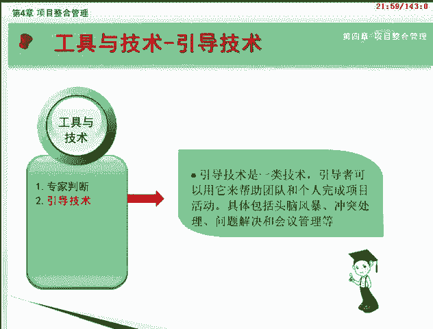

制定项目章程这个过程只有一个输出及项目章程，我们一块来学习吧。

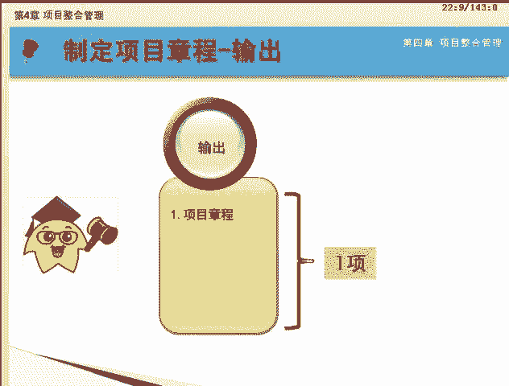

在前面基本概念介绍中，我们已经学习了项目章程的定义，你能回顾起来吗？项目章程是由项目启动者或发起人发布，正式批准项目成立，并授权项目经理动用组织资源开展项目活动的文件。P报很重视项目章程。

因为它涉及对项目经理的授权，每个项目必须有项目章程。项目章程中记录了项目目标以及高层次的要求及约束。内容如下。项目目的或批准项目的原因。可测量的项目目标或相关的成功标准。高层级需求。假设条件和制约因素。

高层级项目描述和边界定义。高层级风险。重提里程碑监度计划。总体预算。干系人清单项目审批要求，如用什么标准评价项目成功，由谁对项目成功下结论，由谁来签署项目结束？委派的项目经理及其职权。

发起人或其他批准项目章程的人员的姓名和职权。不同企业的项目章程是不一样的，这里是一份项目章程的模板。

包含了项目启动的主要因素。项目征程需要项目经理和发起人签字认可，表示组织选择了项目经理并进行授权。同时表明，项目经理接受了任务，会全力完成项目。项目章程的模板可以根据组织特点进行修改。

好了，到此。制定项目章程这个过程我们都已经学习完了，你应该对项目章程有了进一步的了解。现在我们回顾一下课程开始时问的问题。在没有项目章程的时候，mrPM该不该回答m。 sponsorer开始做项目呢？

没错，mister PMM应该告诉mr Spenceer。在没有项目章程之前，开始项目会产生严重的不良后果。即使项目再紧张，也要先制定出项目章程。如果发起人时间紧迫或者精力有限。

可以授权项目经理开始起草项目章程。

现在我们来回顾一下本过程的核心知识。项目章程一般由项目发起人发布。项目征程对项目经理进行授权，从而保证项目经理可以把组织用于项目活动。

工作说明书是对项目产品的叙述性描述，它由发起人或客户提供。在项目中，项目经理应该尽早委派。恭喜你完成制定项目章程过程的学习。下节课见。本课程我们将一起学习第四章项目整合管理知识领域的第二节。

制定项目管理计划。本课程我们将一起学习第四章项目整合管理知识领域的第二节，制定项目管理计划。推进misterPM在思考。在项目管理中，为什么有的项目做的井井有条，忙而不乱，有的项目却是一团乱麻。

主次不分。最后，井井有条的项目能够分期分批的交付项目工作成果，最终实现项目目标，而一团乱麻的项目却迟迟交不出东西，或者交出的产品质量严重不符，与项目目标相去甚远。各位学员，你思考过这个问题吗？

其实misterPM思考的是两个极端的情况，更为常见的则是项目存在不同程度的延期超支和质量不佳的问题。那么为什么会造成这样的结果呢？你想过吗？这可能是项目管理计划出了问题。

军队中常说的一句话是一切行动听指挥。用在项目管理上可以演变为一切活动，看计划。项目管理计划是项目活动的指南，唯有让项目沿着既定的轨道运转，才能最终实现项目目标。本过程就带领大家学习如何制定项目管理计划。

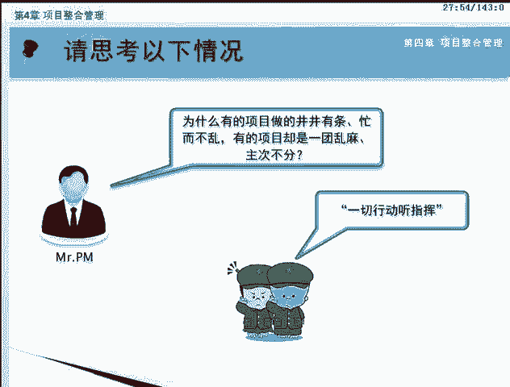

通过本课程的学习，我们将要达到以下目标，包括。熟记项目管理计划以及制定项目管理计划过程的定义。掌握项目管理计划与项目文件的区别。了解制定项目管理计划的目的和核心思想。

理解制定项目管理计划与其他规划过程的输出的关系。了解制定项目管理计划，涉及到的事业环境因素和组织过程资产。了解本过程中，专家判断的应用。熟记项目管理计划包含的内容。

本课程我们将会按照如画面所示的大纲为您讲述。基本概念包括讲述什么是项目管理计划，什么是项目文件和基准，以及什么是制定项目管理计划过程。在制定项目管理计划的输入中。

我们为您阐述其他规划过程的输出以及事业环境因素和组织过程资产。专家判断和引导技术作为制定项目管理计划过程的工具与技术，我们也会解释。当然，我们还会对本过程的输出及项目管理计划进行细致讲解。

课程的最后由本课核心知识整理。在学习制定项目管理计划过程之前，我们先来了解几个基本概念。项目管理计划、项目文件基准和制定项目管理计划。

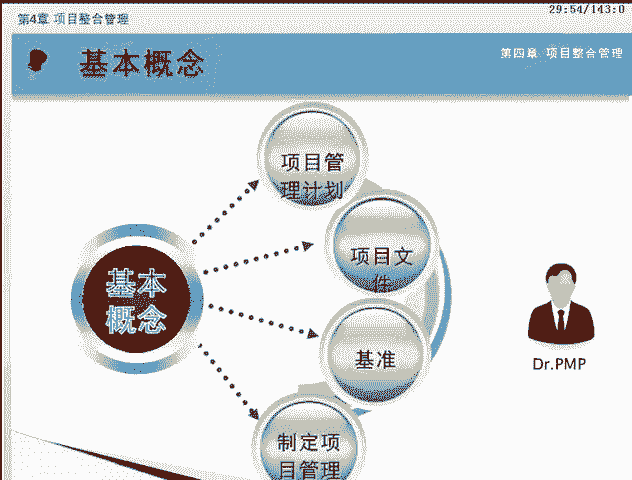

我们先来看什么是项目管理计划。项目管理计划是确定项目的执行监控和收尾方式，并经过批准的正式文件。关于项目管理计划的详略程度，要根据具体的项目情况而定。项目管理计划有时简称为项目计划。需要明确的是。

PMP考试时是默认存在项目管理计划的。项目管理计划的主要组成部分是指管理计划和基准。这些子管理计划涵盖了项目管理十大知识领域的13个子计划。计划英文是plan，而规划英文为planning。

我们再来学习基准。基准是一份经过批准的项目计划，加上或减去经批准的变更。用于与实际绩效比较来确定绩效是否在可接受的偏差范围内。一般指当前基准，也可指原始基准或其他基准。通俗的讲。

基准是一种特殊版本的项目计划，它的特殊性包括一批准。一定是经过高级管理层和主要项目干系人批准的，而不是项目团队自编自用，无需特定批准的细节性计划。2、变更。项目经理无权批准基准的变更，而且变更需要记录。

同时说明变更的理由。3、比较。是项目经理和项目管理团队据以考核项目执行情况的依据，及作为比较的基础。4、当前基准。都是指最新版本的项目计划及当前基准，而不是过去曾经作为基准使用过的项目计划。

项目管理计划中包括三个基准，分别是范围基准、进度基准和成本基准。这些在以后课程中，我们将详细讲解。项目文件只会影响项目管理工作，但有不属于项目管理计划的其他文档。

项目文件用来指导和规范项目实施的各项活动和过程。尽管项目计划和项目文件都有助于项目经理管理项目，但他们有很大的区别。项目管理计划主要是规划过程组的输出，而五大过程组的输出中都可能有项目文件。

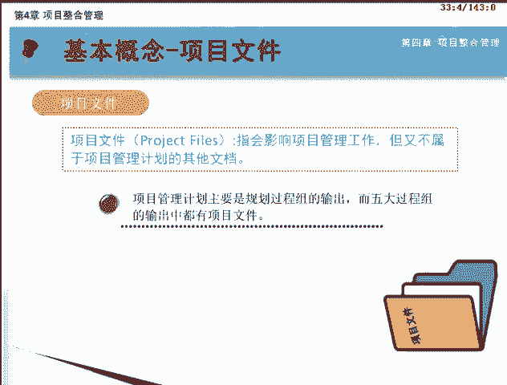

项目管理47个过程的输出，除少数非正式类或成果，以及属于项目管理计划的内容外，都是项目文件的组成部分。项目管理计划和项目文件既有交叉。比如项目绩效基准，在项目管理计划和项目文件中都存在。

带有不同的侧重点。需要注意的是，平安报考强调，各自计划和相关基准是项目管理计划的主要组成部分。下面我们再来具体看一下项目管理计划和项目文件的区别。请观察这张表格。

它列出了项目管理计划和项目文件所包含的全部内容。项目管理计划。包含了蓝色字体表示的变更管理计划、沟通管理计划、配置管理计划、成本管理计划、人力资源管理计划、过程改进计划、采购管理计划、质量管理计划、需求管理计划、风险管理计划、进度管理计划、干系人管理计划和范围管理计划共13个子计划。

还有红色字体表示的成本基准范围基准和进度基准，共三个基准。其中，范围基准又包括范围说明书、工作分解结构WBS和WBS词典。剩下的影响项目管理的工作。但不属于项目管理计划的文件。均属于项目文件。

用黑色字体表示。一般来说，项目管理计划需要发起人或项目管理办公室批准。而项目文件除了项目章程、工作说明书和合同等有限的几个文件需要审核外。其他文件项目经理均不需要交给项目发起人。另外。

我们通常将范围进度和成本基准合并为一个绩效测量基准，作为项目的整体基准。以便据此测量项目的整体绩效。

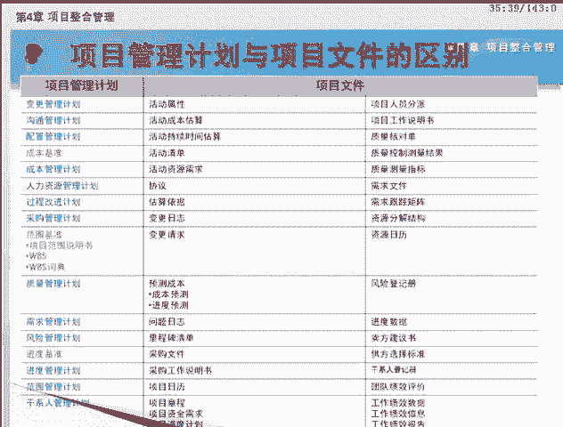

制定项目管理计划是定义准备和协调所有子计划，并把他们整合为一份综合项目管理计划的过程。本过程的主要作用是生成一份核心文件，作为所有项目工作的依据。项目管理计划的主要目的共有4点。

一、指导项目的执行、监控和收尾。2、将核心的项目管理计划和项目文档文件整理成档。从而可以指导项目实施。3、有助于干系人之间的沟通。干系人之间的沟通核心是要看项目范围说明书。

但是项目管理计划和项目文件能在范围说明书的基础上进行进一步细化。因此，有助于干系人之间的沟通。4、有了基准，就为绩效测量和项目控制提供了基准，从而可以对项目进行有效的监控。

在了解了有关项目管理计划和制定项目管理计划的定义之后，我们来做个判断吧。第一题。项目管理计划是由项目经理独自考虑制定的吗？答案是no。因为项目管理计划是由项目团队自下而上编制的。

项目经理起总负责和整合的作用。在编制项目管理计划的过程中，项目经理和项目团队成员也要充分听取其他主要项目干系人的意见。

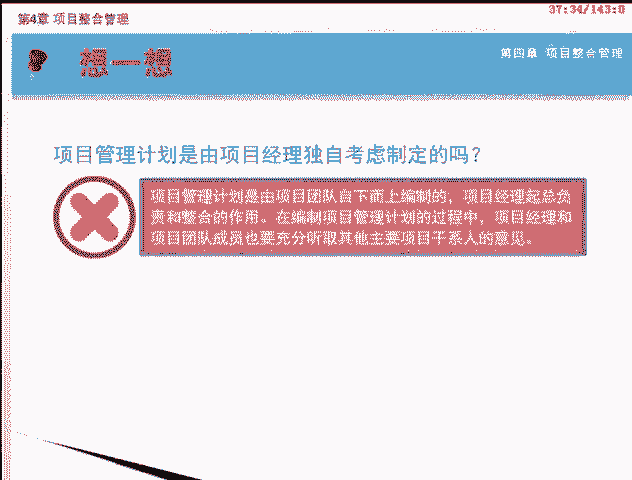

问题2。是不是项目执行开始之前就要制定出完整的项目管理计划，以后便不再更改。答案也是no。项目在开始执行之前，要编制出尽可能完整的项目管理计划。

但是项目管理计划需要在项目生命周期的后续阶段中不断审阅、细化、完善和更新。是一个渐渐明细的过程。接下来让我们来看看项目管理计划是如何被制定出来的。制定项目管理计划过程的输入。

包括制定项目章程过程的输出及项目章程。同时还包括其他所有规划过程输出的任何基准和子计划。这些规划过程将在后面章节讲解。此外，还包括事业环境因素和组织过程资产。在上述输入的基础上。

我们应用专家判断和引导技术，得到最终的输出项目管理计划。下面我们来具体学习这个过程的ITTO。这是制定项目管理计划过程的数据流向图。展现了该过程，如何通过输入输出与其他过程进行交互。

我们看到项目管理计划是许多规划执行和监控过程的输入。制定项目管理计划共有4个输入。下面我们依次来了解他们吧。

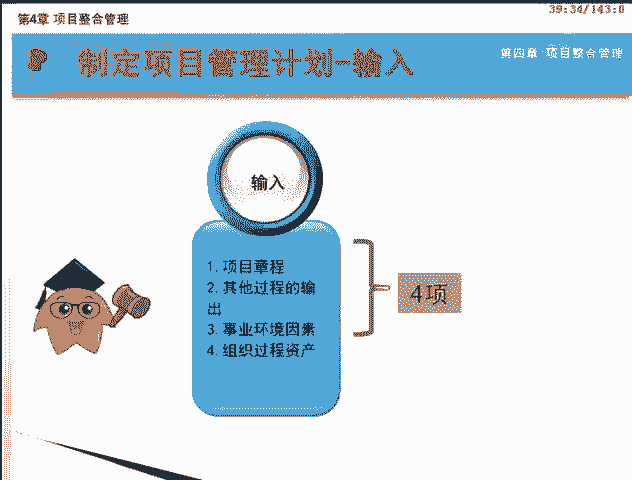

在本过程中，项目章程是项目管理计划的主要输入之一，它是制定项目章程过程的输出。前面课程已经介绍过。

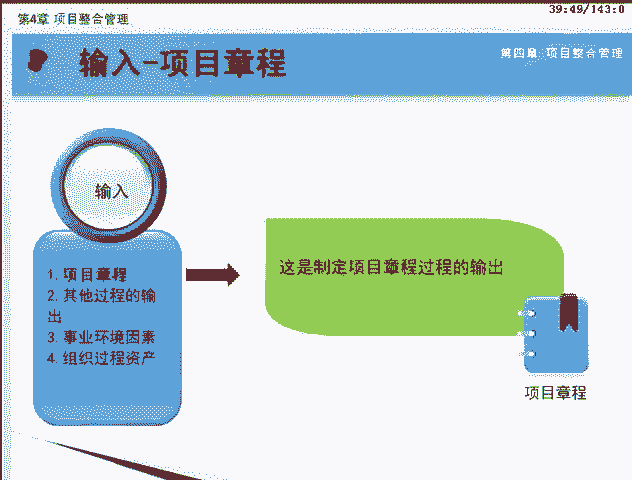

在制定项目管理计划时，需要其他规划过程的输出作为它的输入。这些其他过程输出的子计划输入后，经过专家判断，引导技术等工具的整合，成为项目管理计划的一部分。另一方面，项目管理计划又会成为其他规划过程的输入。

此外，对其他规划过程输出文件的更新，都会导致对项目管理计划的相应更新。由此可见，其他规划过程的输出和项目管理计划之间的关系是循环往复和迭代的。

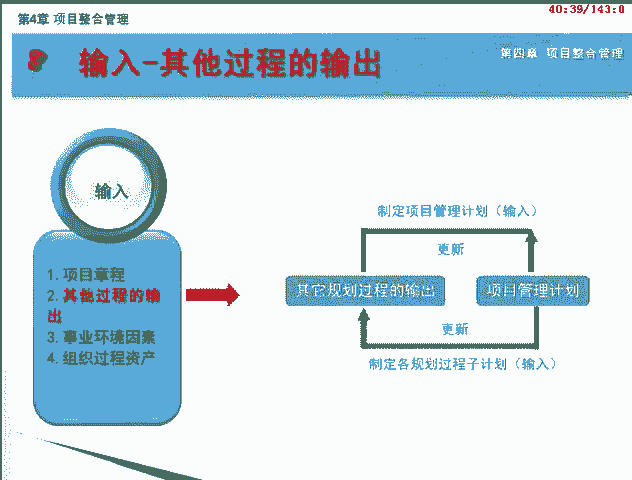

与其说项目管理计划是制定出来的，不如说项目管理计划是整合出来的。可能影响制定项目管理计划过程的事业环境因素，包括以下几点。政府或行业标准。纵向市场或专门领域的项目管理知识体系。

项目管理信息系统如自动化工具，包括进度计划软件配置管理系统、信息收集与发布系统或进入其他在线自动化系统的网络界面。组织的结构、文化管理实践和可持续发展。基础设施如现有设施和固定资产。

人事管理制度如人员招聘和解雇指南、员工绩效评价、员工发展与培训记录等。影响制定项目管理计划过程的组织过程资产，包括如下几点。标准化的指南工作指示建议书评价准则和绩效测量准则。

项目管理计划模板包括根据项目的具体需要，裁剪组织标准流程的指南与准则。项目收尾指南或要求，如产品确认及验收标准。变更控制程序包括修改组织标准、政策、计划和程序所必须遵循的步骤，以及如何批准和确认变更。

以往项目的项目档案，如范围成本进度与绩效测量基准、项目日历、项目进度网络图和风险登记册等。历史信息与经验教训知识库。配置管理知识库包括组织标准、政策、程序和项目文件的各种版本与基准。

接下来我们讲解工具和技术，制定项目管理计划。这个过程有两个工具和技术专家判断和引导技术，我们一块来学习。

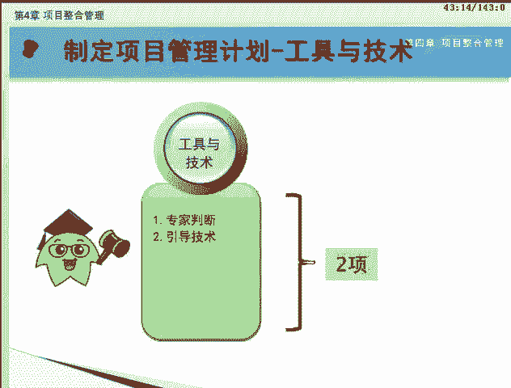

先来看专家判断这种技术。我们知道专家判断是项目整合管理这一知识领域的6个过程的通用工具与技术。

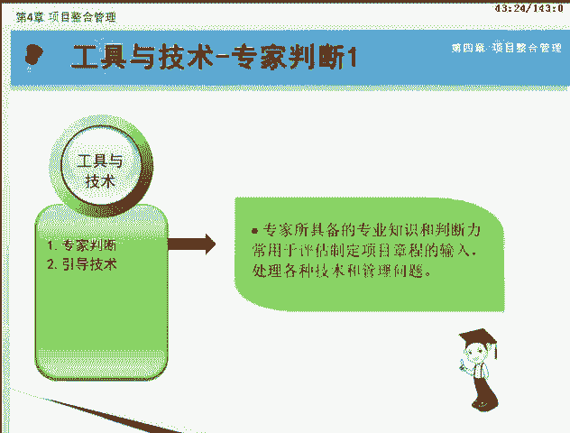

在制定项目管理计划时，专家判断可用于根据项目需要而裁剪项目管理过程。编制应包括在项目管理计划中的技术与管理细节。确定项目所需的资源与技能水平。定义项目的配置管理级别。

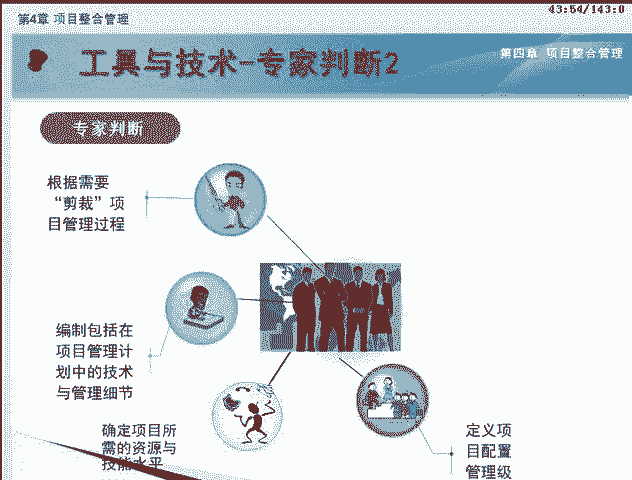

确定哪些项目文件收制于正式的变更控制过程。确定项目工作的优先级，确保把项目资源在合适的时间分配到合适的工作。制定项目管理计划的第二个工具和技术是引导技术。这是一类技术。

广泛应用于各项目管理过程的关键技术。也可用于指导项目章程的制定。引导者可以。使用引导技术。帮助团队和个人完成项目活动。引导技术具体包括头脑风暴、冲突处理、问题解决和会议管理等，这些将在后续课程介绍。

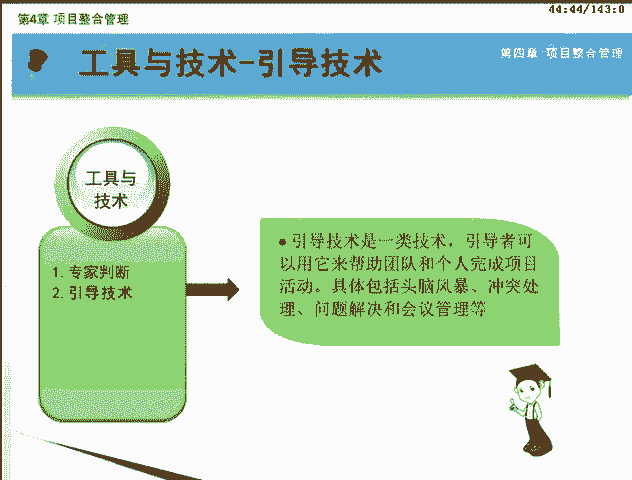

制定项目管理计划，这个过程只有一个输出及项目管理计划，我们一块来学习。

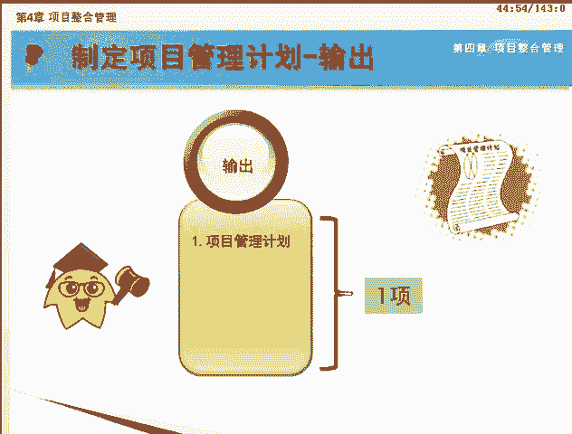

项目管理计划整合了其他许多子计划和基准。让我们来看看项目管理计划包含的具体内容有哪些。首先他要整合三大基准，包括范围基准、进度基准和成本基准。他还整合了其他九大知识领域的共11个子计划。

另外还有两个重要的子计划变更管理计划。他定义如何对变更进行监控，还有配置管理计划。他明确了如何开展配置管理。这些子计划我们会在后续的课程中做详细讲解。

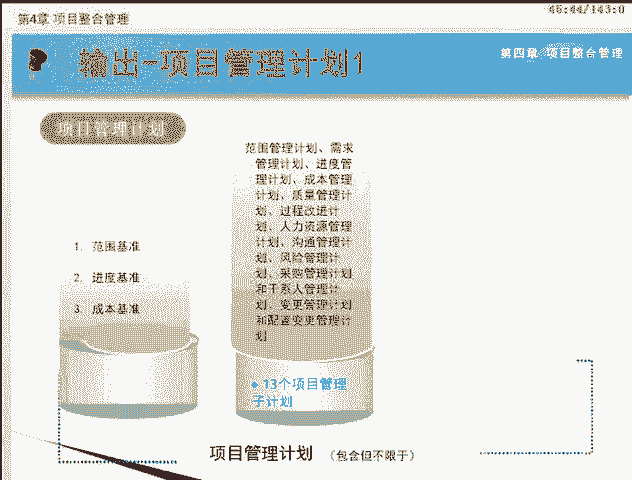

另外，项目管理计划中还包括对项目生命周期的定义，以及明确各阶段究竟使用哪些项目管理过程。大家先来想一想。项目管理知识体系指南中的47个过程会全部用在所有的项目中吗？答案是否定的。因此。

项目管理者就需要根据项目的实际需要，确定采用47个过程中的哪些过程或增加部分过程。这个对项目管理过程的取舍，就成了项目管理计划的一部分。此外，项目管理计划还包括其他内容。如关于如何执行工作。

以实现项目目标的描述，干些人的沟通需求和技术等。要说明的是，以上所说的项目管理计划包含的内容都是包含，但不限于。要想穷尽项目管理计划，可能包括的所有内容是不可能的。当然，具体到某个项目。

项目管理计划可详可略，这完全取决于具体的项目要求。

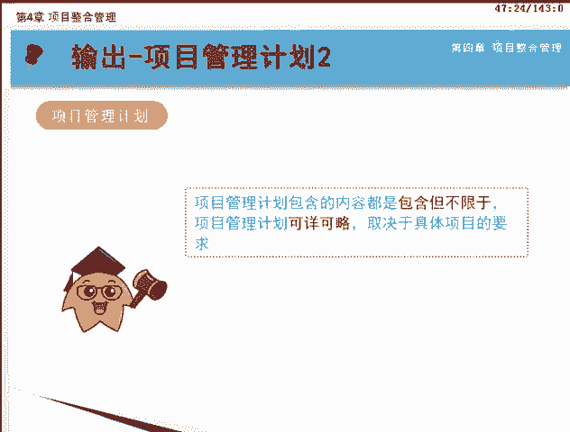

项目经理不需要亲自参与项目管理计划的制定过程。因为项目经理的核心角色是整合者。此外。😊，项目管理计划需要审批通过才能成为执行的依据，即来自管理层、发起人、职能经理、项目团队和干系人的签字认可。

现在我们来回顾一下本过程的核心知识。项目管理计划记录了规划过程组的各个规划子过程的全部成果。

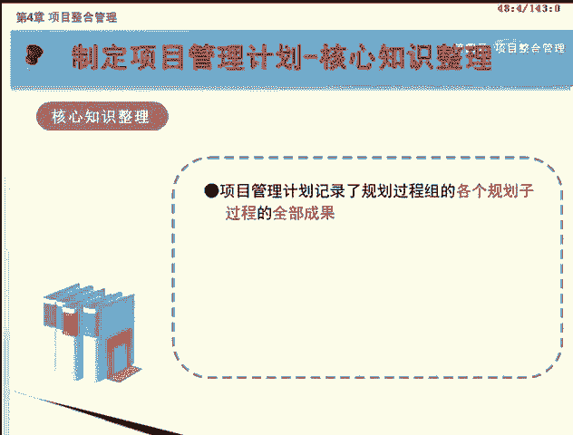

项目管理计划由项目管理团队与项目团队成员一同编制。通常采用滚动式规划来逐渐细化项目管理计划。本课程我们将一起学习第四章项目整合管理知识领域的第三节指导与管理项目工作。这个过程属于执行过程组。

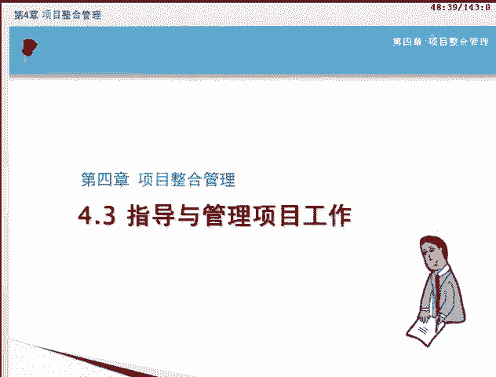

众所周知，计划是用于指导实践的。通过前面的学习，我们已经知道如何制定项目章程和项目管理计划。但要实现项目目标，我们还有很长的路要走。从现在开始，让我们为了目标的实现而行动起来吧。

让我们一起进入指导与管理项目工作过程的学习。

通过本课程的学习，我们将要达到以下目标。包括。掌握指导与管理项目工作过程的定义，熟悉指导与管理项目工作过程的输入、工具与技术及输出的内容。掌握项目管理信息系统这一工具的应用以及各种会议的区分。

掌握变更请求包含的内容，并能对他们进行区分。了解本过程输出的可交付成果，工作绩效数据的含义和内容。

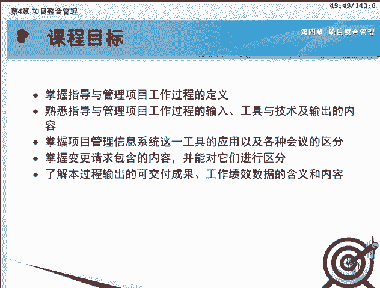

本课程我们将按照如画面所示的大纲顺序为您讲述。在基本概念中，我们将为您讲述指导与管理项目工作和项目启动会议两个基本概念。指导与管理项目工作的输入涉及的内容。

包括项目管理计划批准的变更请求、事业环境因素组织过程资产。指导与管理项目工作过程的工具与技术，包括专家判断项目管理信息系统和会议。重点是项目管理信息系统。指导与管理项目工作过程的输出。

包括可交付成果、工作绩效数据变更请求、项目管理计划更新和项目文件更新。我们将对工作绩效数据和变更请求进行重点讲解。最后是对本节的核心内容进行整理。在学习指导与管理项目工作过程之前。

我们先来了解两个基本概念。指导与管理项目工作和项目启动会议。

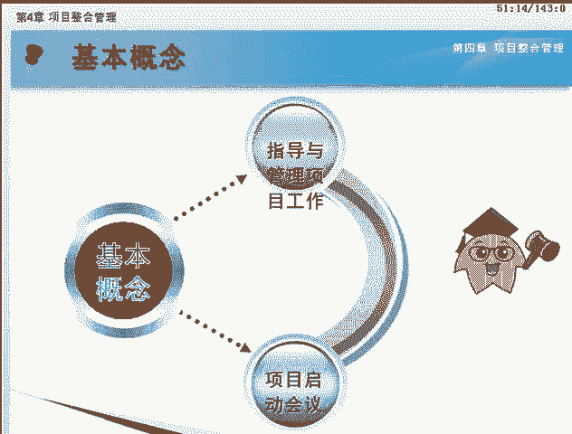

什么是指导与管理项目工作呢？指导与管理项目工作是为实现项目目标，而领导和执行项目管理计划中所确定的工作，并实施已批准变更的过程。本过程的主要作用是对项目工作提供全面管理。

项目的大多数预算都发生在这个过程。项目经理与项目团队成员一起指导与管理项目工作。项目经理在这个过程中要对所有的活动进行动态管理。并对每一个项目成员的工作进行检查、监督和控制，以及实施批准的变更。

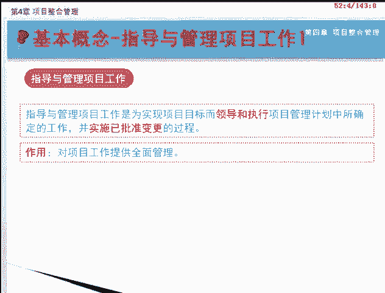

指导与管理项目工作的活动，包括。开展活动，以实现项目目标。创造项目的可交付成果，完成规划的项目工作。配备培训和管理项目团队成员。获取管理和使用资源，包括材料、工具、设备与设施。执行以计划好的方法和标准。

建立并管理项目团队内外的项目沟通渠道。生成工作绩效数据，为预测提供基础。提出变更请求，并根据项目范围、计划和环境来实施批准的变更。管理风险并实施风险应对活动。管理卖方和供应商。

管理干系人及他们在项目中的参与。收集和记录经验教训，并实施批准的过程改进活动。项目开工或启动会议是在项目计划编制基本结束。执行工作开始前，由主要干系人联合召开的会议。标志着项目开始实施，相当于开工典礼。

那么项目开工会议上，我们到底要做什么呢？为项目制定具体的行动方案吗？其实，项目开工会议只是一个信息沟通与协调的会议，它不涉及项目具体的实施方案。项目开工会议的主要内容包括。介绍团队成员。

让团队间相互认识，建立联系。

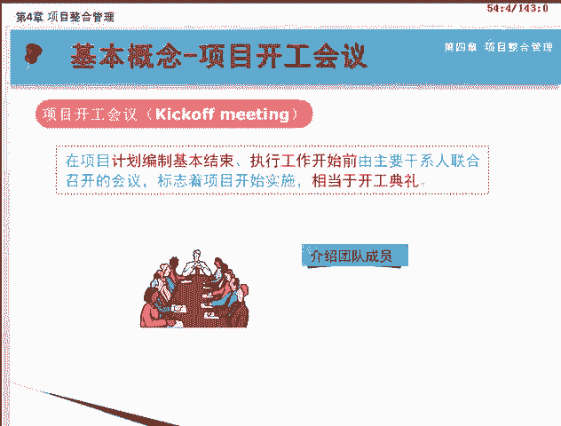

设置团队目标，明确项目目的。确认项目中个人和团队的职责。明确项目实施的背景。通过开工会议初步进行信息沟通。现在我们来了解一下指导与管理项目工作过程的ITTO。指导与管理项目工作过程。

其实就是PM报告指南中其他各知识领域的所有执行过程的综合。在本过程中，项目团队依据项目管理计划，借助专家判断项目管理信息系统和会议执行项目产生可交付成果和工作绩效数据。并根据执行情况提出必要的变更请求。

同时，对已经经过批准的变更请求，也需要在此过程中进行实施。由于在执行过程中提出了变更并产生新的项目信息，所以要对项目管理计划和项目文件进行更新。下面我们来具体学习这个过程的ITTO。

这是指导与管理项目工作过程的数据流向图。展现了该过程如何通过输入输出与其他过程进行交互。指导与管理项目工作共有4个输入，下面依次来了解他们。

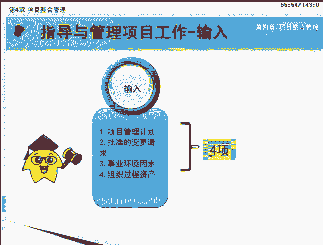

在指导与管理项目工作过程中。执行的便是项目管理计划中所确定的工作。所以项目管理计划首当其冲的要成为本过程的输入。在前面我们讲过指导与管理项目工作过程，还需要实施已批准的变更请求。因此。

输入的另一个比较重要的内容是批准的变更请求。批准的变更请求是经过整体变更控制过程处理并批准的变更请求。有关实施整体变更控制过程的内容，我们会在后面介绍。在执行项目的过程中，我们会就某些问题提出变更。

但并不是所有的变更都能得到允许。这些变更请求必须提交给实施整体变更控制过程，由他决定变更是否可行，然后对其给出是否合理的判断。只有在整体变更控制过程中得到批准的那些变更请求。

才能在项目执行过程中予以实施。因此，批准的变更请求来源于整体变更控制过程。对已批准的变更请求需要列入计划，由项目团队在指导与管理项目工作过程中实施。

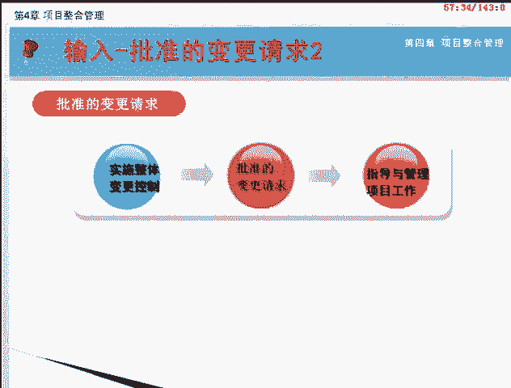

批准的变更请求有如下作用。书面记录了经过批准的变更、扩大或缩小项目范围。修改政策项目管理计划、程序成本、预算或进度计划。可能影响指导与管理项目工作过程的事业环境因素主要包括。

组织文化、公司文化或客户文化，执行组织或发起组织的结构。基础设施如现有的设施和固定资产。人事管理制度如人员雇佣与解聘指南、员工绩效评价与培训记录。干系人风险承受力如允许的成本超支百分比。

项目管理信息系统。能够影响指导与管理项目工作过程的组织过程资产。包括。标准化的指南和工作指示。组织对沟通的要求。如许可的沟通媒介记录保存政策及安全要求。问题与缺陷管理程序。

包括对问题与缺陷的控制、识别与处理，以及对相关行动的跟踪。过程测量数据库用来收集与提供过程和产品的测量数据。以往项目的项目档案。问题与缺陷管理数据库。接下来我们讲解工具和技术。

指导与管理项目工作这个过程有三个工具和技术。专家判断项目管理信息系统和会议，我们一块来学习。

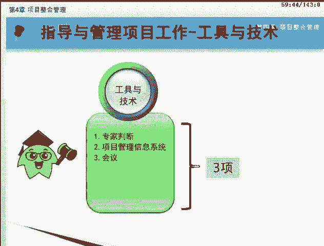

先来看专家判断这种技术。我们知道专家判断是项目整合管理这一知识领域的6个过程的通用工具与技术。在本过程中，专家判断用于评估各项输入。也可以使用专家判断和专业知识来处理各种技术和管理问题。

项目管理信息系统由收集整合和传播项目管理过程、成果的工具和技术所组成的信息系统。是事业环境因素的组成部分。可以指导项目管理的执行，并支持项目从启动到结束的各个方面的全部工作。

项目管理信息系统可以包括人工系统和自动化系统，所有的项目文件都可以在项目管理信息系统中存档。典型的项目管理信息系统会包括两个重要的子系统。配置管理系统和变更控制系统。首先我们来了解配置管理系统。

配置管理系统是项目管理信息系统的自动化工具，也是项目管理信息系统的子系统。由一系列正式的书面程序组成，包括文件和跟踪系统。明确了为核准和控制变更所需的层次。

配置管理系统用于提交变更建议、追踪变更建议的审查与批准制度，确定变更的批准级别以及确认批准的变更方法。配置管理系统的作用主要是。识别产品成果、服务或部件的功能与实体特征并形成文件。

如检查可交付成果是否符合技术规范或相关要求，并对检查结果进行记录形成文件。如果不符控制上述特征的所有变更。在控制变更的过程中，记录并报告每一变更及其实施状况。

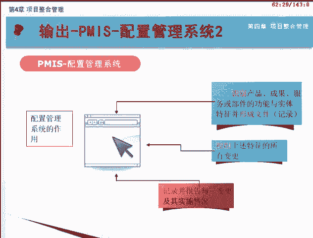

在实施过程中，再对辅助产品成果或者部件进行审查，核实是否符合要求。刚讲了那么多配置管理系统的作用，可是我们到底在什么时候用这样一个功能强大的系统呢？其实这是用于配置管理的一个工具。在做项目的过程中。

我们一直强调配置管理，到底为什么要进行配置管理呢？实施配置管理的目的在于保证项目产品的正确和完备，即通过统一的管理，把合适的活动配置到合适的可交付成果的生产过程中。比如通过技术规范来保证项目产品。

满足客户的需求。

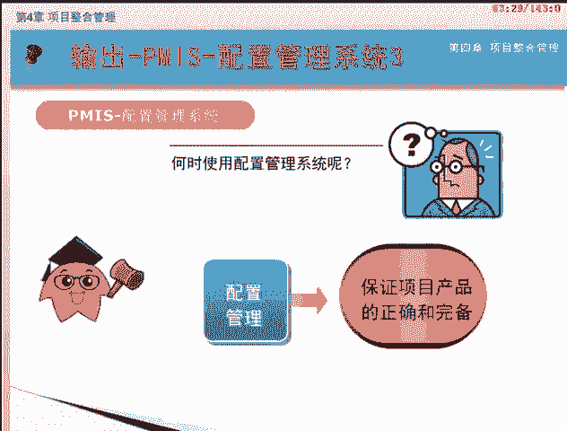

变更控制系统是Pmiss的另一个重要子系统。变更控制系统还是配置管理系统的一个子系统，用于规定如何控制改变和批准项目可交付成果和文件的一套正式书面程序。重要的变更必须严格按照正式的书面程序来执行。

这种书面程序也可称之为变更控制方法。

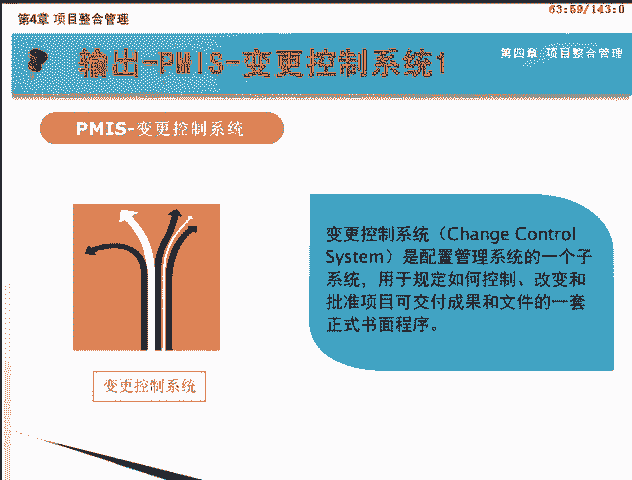

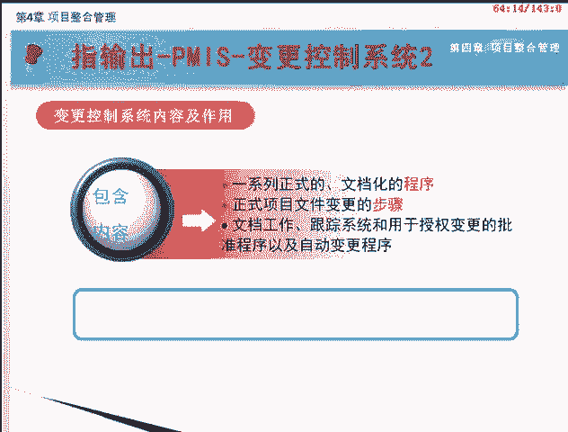

项目经理应该掌握通用会议技巧，在会议周期进行管理。包括。会前准备应该做好准备工作，包括确定会议议程、目的、目标和期限。会中控制把握会议进程和主题，处理例外情况。会后总结要形成书面的会议纪要和行动方案。

应该按照项目管理计划中的规定，保存会议纪要。

指导与管理项目工作这个过程共有5个输出。下面我们一块来学习。

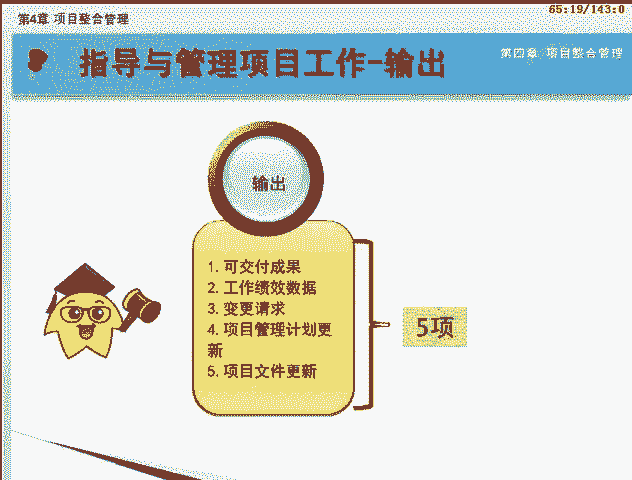

可交付成果是指导与管理项目工作过程最重要的输出之一。什么是可交付成果呢？可交付成果在某一过程阶段或项目完成时，必须产出的任何独特并可核实的产品成果或服务能力。

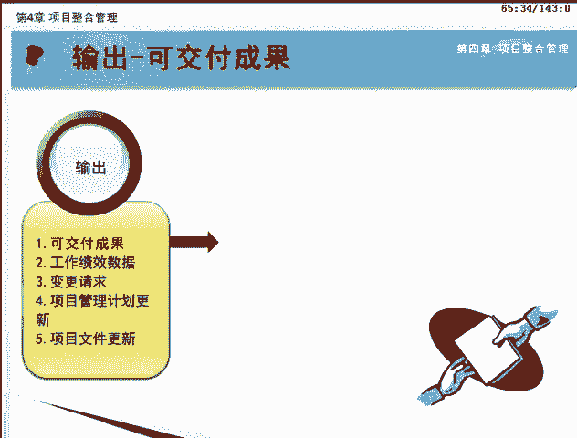

可交付成果产生的时间并不一定是在项目完成时。在某一个过程或阶段结束时，也会产生相应的可交付成果。这个概念是PMP考试的重要考点之一，在PMB指南中可交付成果作为直接输出的，只有这个过程。

及指导与管理项目工作过程产生完全意义上的可交付成果。工作绩效数据是在执行项目工作的过程中，从每个正在执行的活动中收集到的原始观察结果和测量值。数据是指最底层的细节，将由其他过程从中提炼出项目信息。

在工作执行过程中，收集数据，再交由各控制过程做进一步分析。换句话说，工作绩效数据是实事求是的数据。工作绩效数据可以包括许多内容。

例如已完成的工作关键绩效指标、技术绩效测量结果、进度活动的开始日期和结束日期。变更请求的数量、缺陷的数量、实际成本和实际持续时间等。在第三章的项目信息一节。

我们已经介绍了工作绩效数据、工作绩效信息和工作绩效报告的对比，大家可以参考。变更请求是关于修改任何文档可交付成果或基准的正式提议。在指导与管理项目工作过程中，如果发现问题，就需要提出变更请求。

来对项目的范围、成本、预算、政策、计划或质量等方面提出修改。所以本过程会输出变更请求。需要提醒的是输出的变更请求，包括将来会得到批准的和未得到批准的变更请求。变更请求是本章一个非常重要的知识点。

所有监控过程和很多执行过程都会产生变更请求这个输出。变更请求被批准之后，将会引起对相关文档可交付成果或基准的修改，也可能导致对项目管理计划其他相关部分的更新。

所以接下来我们将对变更请求的内容进行具体讲解。变更请求的内容包括纠正措施、预防措施、缺陷补救和更新。

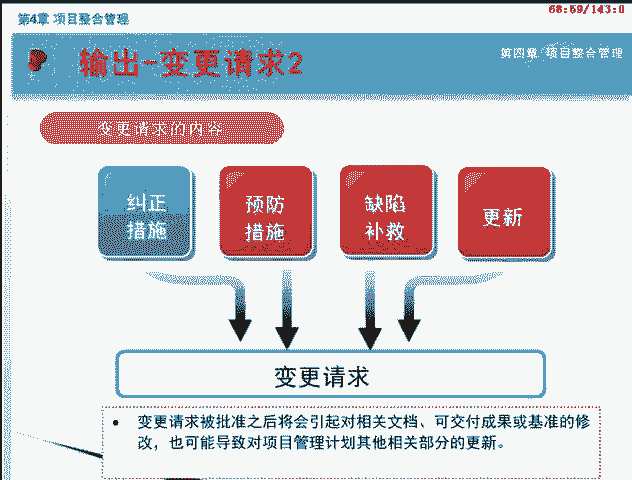

什么是纠正措施呢？纠正措施就是为使项目工作绩效重新与项目管理计划一致而进行的有目的的活动。就像行车路线一样，当你发现脱离了原有的行车线时，必须及时的调整方向，以免发生危险事件。需要强调的是。

任何的纠正措施都要加以记录。在根据需要采取纠正措施之后，要对纠正措施的有效性进行评价，看是否达到了预期的效果。预防措施是为确保项目工作的未来绩效，符合项目管理计划而进行的有目的的活动。顾名思义。

预防措施就是危险事件还没有发生时，预先做好防备。预防措施就是通过实施某种活动来降低项目风险消极后果。缺陷补救是为了修正不一致的产品或产品组件而进行的有目的的活动。缺陷补救是问题已经出现了。

为了减少问题的严重性而提出的解决措施，主要针对成果。更新是对正式受控的项目文件或计划等进行的变更，以反映修改或增加的意见或内容。更新及在项目执行过程中，根据具体的实施情况。

对计划或项目文件中的内容进行修改或增加。这里要注意的是，对项目文件或项目管理计划的更新，也是变更请求的一部分。所以在涉及到变更请求的时候，请大家不要忽略掉更新这一内容。刚才我们具体讲解了变更请求的内容。

相信你对他们的概念已经有了基本的理解。

接下来我们就来一起分析预防措施、纠正措施以及缺陷补救之间的区别。预防措施采用的时机是偏差，还未产生，只是将来有可能发生。作用是降低偏差出现的可能性，减少消极风险的影响。

纠正措施采用的时机是项目不能接受的实际偏差已经发生了，消极的影响已经产生。它的作用是将项目绩效拉回到计划的要求上来。纠正措施和预防措施针对项目的所有方面，通常不会影响项目基准。

只是对基于基准的具体实施工作产生影响。缺陷补救采用的时机是发现项目质量存在缺陷，针对的是项目质量问题。它的作用是使项目质量符合要求。下面我们对变更请求的内容做一个总结。

变更请求是在项目执行过程以正式方式提出的。所有变更请求都必须以书面形式记录并纳入变更管理或配置管理系统中，由项目整体变更控制过程处理。变更请求一定要正式提出，而不能非正式提出。另外。

变更请求可以直接或间接由内部或外部提出。可以是选择的，也可以是法律或合同强制要求的。变更是无法避免的。项目经理不仅要实施变更，还要预测可能的变更，尽量减少不必要的变更。

指导与管理项目工作的最后两个输出是项目管理计划更新和项目文件更新。在项目执行过程中产生了变更和新的信息。因此，项目管理计划和项目文件要进行必要的更新。现在。我们来回顾一下本过程的核心知识。

指导与管理项目工作过程执行的是项目管理计划和已批准的变更请求，并在过程中收集项目绩效数据。启动会议标志着项目的开始，其主要目的是沟通信息。

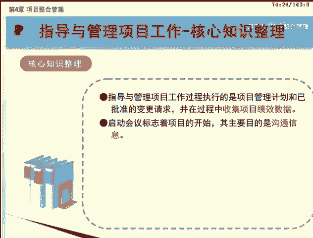

项目管理信息系统Pmiss是事业环境因素的组成部分，它的两个重要子系统是配置管理系统和变更控制系统。变更请求是在项目计划执行过程中以正式书面文件提出的，由整体变更控制过程处理。

包括纠正措施、预防措施、缺陷补救及更新。恭喜你完成指导与管理项目工作过程的学习。下节课见。本课程我们将一起学习第四章项目整合管理知识领域的第四节监控项目工作。这个过程属于监控过程组。

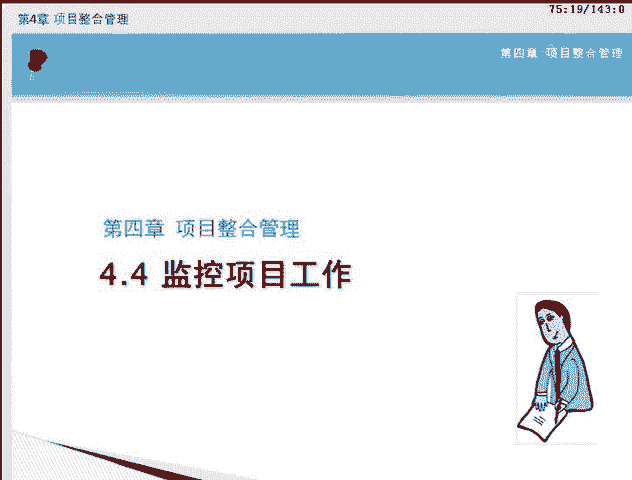

通过本课程的学习，我们将要达到以下目标。包括。掌握监控项目工作的含义与作用。掌握工作绩效报告的概念和所包含的内容。了解事业环境因素和组织过程资产的含义与内容。了解专家判断的含义以及专家的来源。

了解监控项目工作过程的输出所包含的主要内容。理解监控项目工作所涉及的PMS思维。本课程我们将按照如画面所示的大纲展开。首先，对监控项目工作、工作绩效报告和工作授权系统这三个术语的基本概念进行阐述。

接下来讲述监控项目工作过程的输入、工具与技术以及输出。在这里会对工作绩效报告以及输出的详细内容进行分析。最后，重述本过程的核心知识。在学习监控项目工作之前，我们先来了解几个基本概念。

监控项目工作工作绩效报告和工作授权系统。

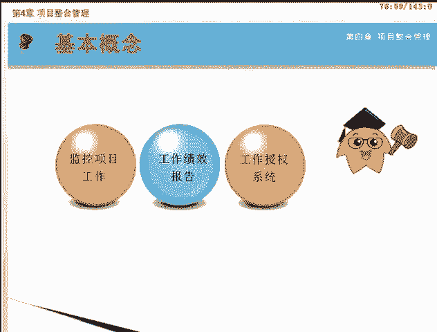

监控项目工作是跟踪审查和报告项目进展，以实现项目管理计划中确定的绩效目标的过程。本过程的主要作用是让干系人了解项目的当前状态，以采取的步骤，以及对预算进度和范围的预测。我们知道在项目进行过程中。

会有很多与项目管理计划不一致的地方。这个时候就需要进行监督和控制，以确保符合原定目标。监控项目工作主要包含两方面的工作。一方面，在项目全生命周期进行监控及收集、测量和发布绩效信息，分析结果、预测趋势。

以便推动过程改进。另一方面，进行控制及制定纠正或预防措施或进行重新规划，并跟踪行动计划的实施，以确保他们能有效解决问题。监控项目工作的活动包括。把项目的实际绩效与项目管理计划进行比较。

评估项目绩效决定是否需要采取纠正或预防措施，并推荐必要的措施。识别新风险，分析跟踪和监测已有风险，确保全面识别风险，报告风险状态，并执行适当的风险应对计划。在整个项目期间。

维护一个准确且及时更新的信息库，以反映项目产品及相关文件的情况。被状态报告、进展测量和预测提供信息。做出预测以更新当前的成本与进度信息。监督已批准变更的实施情况。如果项目是项目级的一部分。

还应向项目级管理层报告项目进展和状态。简单的说，项目的监控工作要遵循一个流程。在项目进行过程中，不断的收集有关实际绩效的资料。虽然这些工作并不属于本过程。然后将项目的实际绩效与项目管理计划做比较。

在此基础上，评估项目绩效并对是否需要提出变更做出判断。也就是说，如果绩效与计划不一致，就要考虑变更。如果需要变更确定必要的纠正措施、预防措施或者缺陷补救措施。并提出变更请求。从而进入下一个过程。

实施变更控制过程。

如果不需要变更，继续实施项目活动，并随时收集绩效资料。重复此过程，确保一切按计划行驶。在整个项目期间，需要维护一个信息库，以反映项目产品及相关文件的情况。当然，信息库要。随时更新。

工作绩效报告是为制定决策、采取行动或引起关注，而汇编工作绩效信息所形成的实物或电子项目文件。项目信息可以通过口头形式进行传达，但为了便于绩效信息的记录、存储和分发。

有必要使用实物形式或电子形式的项目文件。工作绩效报告包含一系列的项目文件，旨在引起关注并制定决策或采取行动。可以在项目开始时就规定具体的项目绩效指标，并在正常的工作绩效报告中。

向关键干净人报告这些指标的落实情况。比如，工作绩效报告，包括状态报告、备忘录、论证报告、信息杂技、推荐意见和情况更新。绩效报告由项目团队编制，而非项目经理独自完成。

工作授权系统是整个项目管理系统的一个子系统。它是一系列正式书面程序的集合规定，如何授权项目工作，以保证该工作由正确的组织在正确的时间以正确的顺序执行。

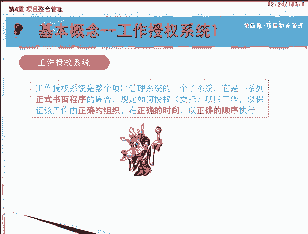

工作授权系统包括发布工作授权所需的步骤、文件、跟踪系统以及审批层次。有效的授权对于项目经理来说是非常必要的。借助于工作授权系统，项目经理不仅可以使项目团队成员明确了解其具体执行的活动的目标。

而且可以使他们充分意识到自己被授予的权利的所负担的责任。有了工作授权系统，项目经理以及团队成员就不必事事都向上级请示。通过前面的定义，我们可以看出工作授权系统强调了四个要素。他批准了谁，也就是什么组织。

在什么时间按照什么顺序做什么工作。因此，也可以说，工作授权系统是为确保工作按规定时间和顺序进行而采取的一套项目工作正式审批程序。当然，对许多较小型的项目而言，口头核准一般就已经足够了。

现在我们来了解一下监控项目工作过程的IDTO。我们看到该过程有7项输入，经过四项工具和技术的处理，生成四项输出，其中变更请求和工作绩效报告是非常重要的输出。我们会详细介绍。

下面我们来具体学习这个过程的ITTO。这是监控项目工作过程的数据流向图，展现了该过程如何通过输入、输出与其他过程进行交互。监控项目工作共有7个输入，下面我们依次来了解他们吧。

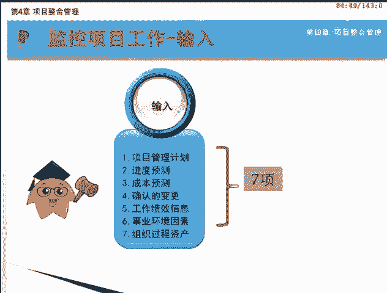

监控项目工作要以项目管理计划为基础。项目管理计划中的子计划和基准是监控的依据。监控就是审查实际执行的工作和项目管理计划中所确定的工作有何出入。所以，项目管理计划首当其冲的要成为本过程的输入。

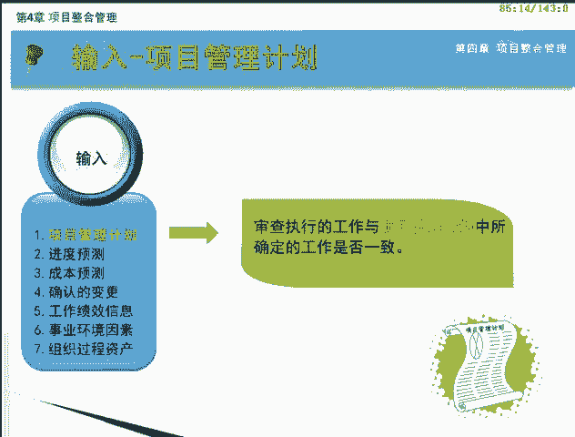

监控项目工作要参考进度预测。进度预测是基于实际进展与进度基准的比较而计算出来的。包括文工尚需时间估算ETC。进度偏差SV和进度技巧指数SPI的。这些概念在后续章节会介绍。

通过预测可以确定项目是否仍处于可容忍范围内，并识别任何必要的变更。监控项目工作还要参考成本预测。成本预测是基于实际进展与成本基准的比较而计算出来的。

包括完工尚需估算ETC成本偏差CV和成本绩效指数CPI等。这些概念也将在后续章节会介绍。确认的变更是控制质量过程的输出，它是对变更或补救的对象进行检查。如果通过则成为确认的变更。

工作绩效信息是从各控制过程中收集并结合相关背景和跨领域关系进行整合分析而得到的绩效数据。工作绩效信息可包括可交付成果的状态变更请求的落实情况及预测的完工尚需估算。

可能影响监控项目工作过程的事业环境因素主要包括。政府或行业标准如监管机构条例、行为准则、产品标准、质量标准和工艺标准。组织的工作授权系统。干系人风险承受能力。项目管理信息系统。

可能影响监控项目工作过程的组织过程、资产。包括。组织对沟通的要求，财务控制程序。问题与缺陷管理程序。变更控制程序。风险控制程序。过程测量数据库。经验教训数据库。监控项目工作的工具与技术共有4个。

下面我们依次来了解。

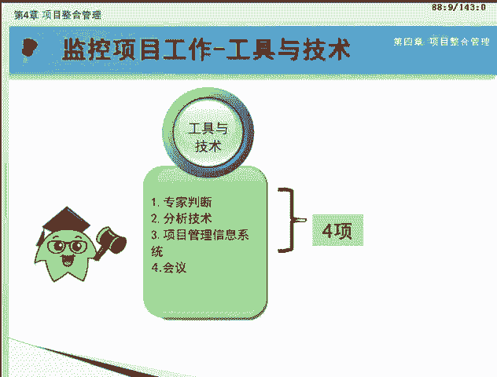

专家判断这种技术前面已经介绍过，在监控项目工作过程，项目管理团队借助专家判断来解读由各监控过程提供的信息。项目经理与项目管理团队一起制定所需措施，确保项目绩效达到预期要求。在监控项目工作。

以至于在整个项目管理中，根据可能的项目或环境变量的变化，以及他们与其他变量之间的关系，采用分析技术来预测潜在的后果，这就是分析技术。它是一类技术的统称。

包括回归分析、分组分析、因果分析、根本原因分析、储备分析等。他们中的大部分会在后续课程中介绍。

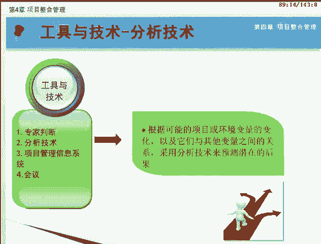

作为事业环境因素的一部分，项目管理信息系统为监控项目工作过程提供自动化工具以及绩效指标、数据库、项目记录和财务数据等。监控项目工作时召开的会议形式可以是面对面或虚拟会议、正式或非正式会议。

参会者可包括项目团队成员、干系人及参与项目或受项目影响的其他人。会议的类型包括用户小组会议和用户审查会议等。监控项目工作这个过程共有4个输出。变更请求、工作绩效报告、项目管理计划更新和项目文件更新。

下面我们一块来学习。

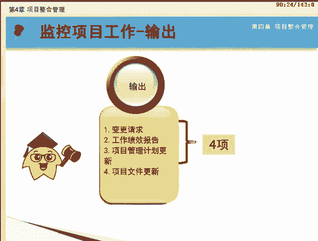

在监控项目工作时，通过比较实际情况与计划要求，可能需要提出变更请求。变更请求可以是扩大调整或缩小项目范围与产品范围。或者提高调整或降低质量要求和进度或成本基准。变更请求可能导致需要收集和记录新的需求。

变更可能会影响项目管理计划、项目文件或产品可交付成果。符合项目变更控制准则的变更，应该由项目既定的整体变更控制过程进行处理。大多数执行过程和监控过程都会提出变更请求。本过程输出中的变更请求。

包括纠正措施、预防措施和缺陷补救。工作绩效报告是监控项目工作的重要输出。我们在基本概念部分已经介绍过了。

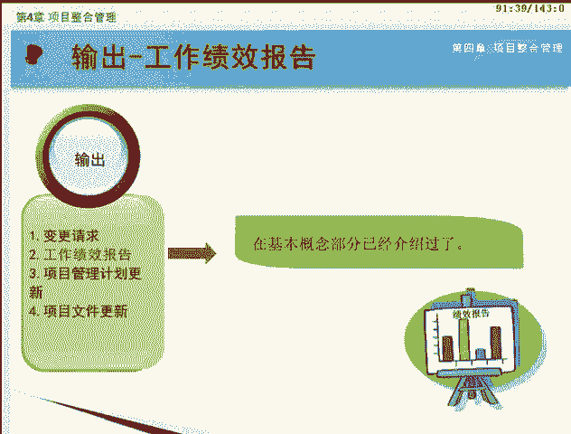

在监控项目工作过程中提出的变更可能会影响项目管理计划。这些变更在经恰当的变更控制过程处理后，可能导致对项目管理计划的更新。可能引起更新的子计划，包括。

范围管理计划、需求管理计划、进度管理计划、成本管理计划、质量管理计划等。还有项目管理计划中的范围基准、进度基准和成本基准，这三个基准也会引起更新。在监控项目工作这个过程中，一些项目文件也会进行更新。

包括进度和成本预测、工作绩效报告、问题、日志等。好，让我们来回顾一下本过程的核心知识。工作授权系统用来保证项目工作由正确的组织，在正确的时间以正确的顺序进行。

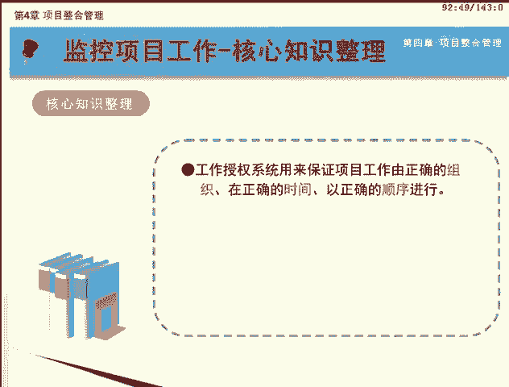

不仅要对项目执行情况进行监控，而且要对项目启动、规划收尾等进行监控。监控项目工作过程的一项重要输出是变更请求。此外，变更请求也可以在执行过程中提出。恭喜你完成监控项目工作过程的学习，下节课见。

本课程我们将一起学习第四章项目整合管理知识领域的第五节，实施整体变更控制。这个过程属于监控过程组。

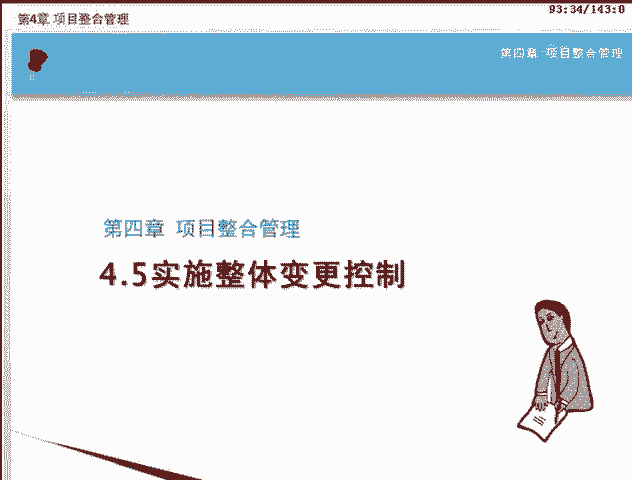

通过本课程的学习，我们将要达到以下目标，包括。逐记实施整体变更控制的概念。了解实施整体变更控制过程，包括的变更管理活动。了解配置管理系统的特点及目标。掌握配置管理活动。了解本过程，专家判断的来源渠道。

熟记变更控制委员会的定义组成及作用。熟记本过程的输入工具与技术和输出。

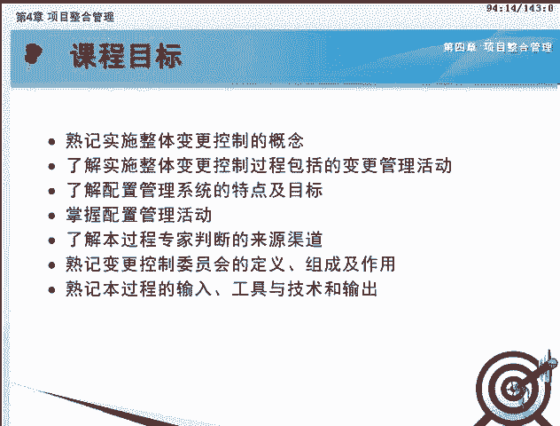

本课程我们将按照如图所示的大纲展开。首先，对实施整体变更控制变更控制委员会配置管理系统这三个术语的基本概念进行阐述。接下来讲述实施整体变更控制过程的输入工具与技术以及输出。

在这里我们会详细讨论工具和技术。最后，重述本过程的核心知识点。在实施整体变更控制过程之前，我们先来了解几个基本概念。实施整体变更控制变更控制委员会配置管理系统。

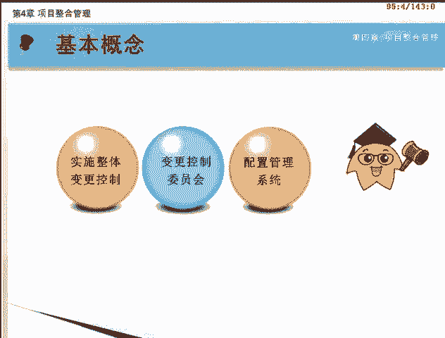

实施整体变更控制是审查所有变更请求批准变更管理对可交付成果、组织过程、资产、项目文件和项目管理计划的变更，并对变更处理结果进行沟通的过程。

该过程审查所有针对项目文件可交付成果基准或项目管理计划的变更请求，并批准或否决这些变更。

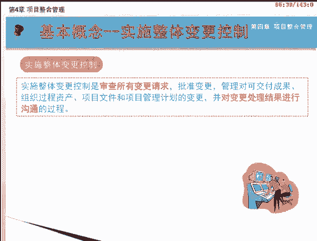

本过程的主要作用是从整合的角度考虑记录在案的项目变更，从而降低因未考虑变更对整个项目目标或计划的影响而产生的项目风险。在项目的执行过程中，需要谨慎持续的管理变更，以实现项目目标。

同时考虑是否更新项目管理计划、项目范围说明书和其他可交付成果。因此，实施整体变更控制过程，贯穿项目始终。任何项目干系人都可以提出变更请求，但需要注意的是，口头提出的变更请求必须有书面记录。

并纳入变更管理或配置管理系统中，按照相关过程进行处理。实施整体变更控制过程中，对基准的变更，只能针对以后的情况，而不能变更以前的绩效数据。也就是说，当基准发生变更时，这个变更是为当前和将来而实施的。

过去的数据并没有发生改变。变更控制委员会CCB是一个由干系人正式组成的团体。负责审查、评价、批准、推迟或否决项目变更以及记录和传达变更处理决定。变更控制委员会所做出的决定和建议都应该记录在案。

在很多项目中，根据项目角色和职责文件的规定。发起人或项目经理有权批准某些种类的变更请求，但必要时需要变更控制委员会负责批准或否决变更请求。变更控制委员会CCB应该包括各方面的重要干系人。

如果CCB中没有客户或发起人参与的话，某些特定的变更请求在CCB批准之后，还可能需要得到他们的批准。配置管理系统可以用来集中管理已批准的变更与基准。这种管理变更的方式最大的特点是标准化，效果好，效率高。

配置管理要通过一系列的活动得到实现。在整体变更控制过程中的配置管理活动包括三种，即配置识别配置状态记录和配置核实与审计。其中，配置识别是识别哪些项需要配置？然后做出选择。

从而为定义与核实产品的配置标志产品的文件管理变更和明确责任提供基础。配置状态记录是记录和报告在识别配置活动中所选择的配置项的数据和相关信息。这些信息主要包括已批准的配置识别清单。

配置变更请求的状态和已批准的变更的实施状态。这项活动是为了能及时提供关于配置项的适当数据。配置的核实和审计，也就是保证配置项组合的正确性，保证相应的变更都登记、评估、批准、跟踪和正确实施。

从而确保配置文件所规定的功能要求都已经实现。

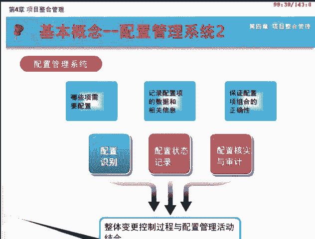

现在我们来了解一下实施整体变更控制过程的ITTO。实施整体变更控制，就是以项目管理计划和工作绩效报告为依据。通过专家判断和变更控制委员们的会议。

对指导与管理项目执行和监控项目工作等各过程提出的变更请求进行处理、批准或拒绝变更。同时，提出对项目管理计划和项目文件的更新。下面我们将有重点的具体学习这个过程中的ITTO。

这是实施整体变更控制过程的数据流向图。他展现了该过程如何通过输入、输出与其他过程进行交互。实施整体变更控制过程共有5个输入，包括项目管理计划、工作绩效报告、变更请求、事业环境因素和组织过程资产。

下面我们依次来了解他们。

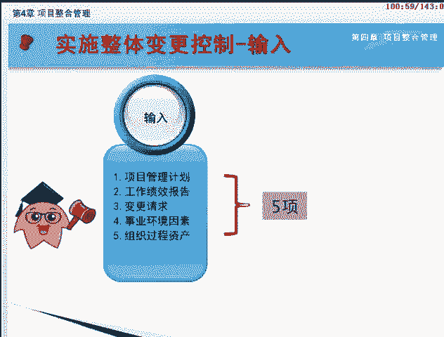

输入中的项目管理计划是制定项目管理计划过程的重要输出。我们前面已经进行了详细介绍，大家可以参考。需要注意的是，项目管理计划中的变更管理计划为管理变更控制过程提供指导。记录变更控制委员会的情况。

项目管理计划中的配置管理计划，明确了如何开展配置管理，这是实施整体变更控制过程的重要输入。工作绩效报告是监控项目工作过程的输出。我们前面也学习过。对实施整体变更控制过程特别有用的工作绩效报告，包括。

资源可用情况、进度和成本数据。正值管理报告燃烧图或燃禁图。我们知道PN报指南中所有的监控过程和大部分执行过程都会产生变更请求这个输出，并成为实施整体变更控制的一个输入。

这些变更请求可以包括纠正措施、预防措施和缺陷补救。这三类请求的。这三类请求的目的是为了保证项目按照计划执行。其中的纠正措施和预防措施通常不会影响项目的基准，只会影响相对于基准的绩效。

或者只对基于基准的具体实施工作产生影响。从较高层面上来说，这三类变更是为了保证执行情况符合基准计划的要求，并不是更新、修改或调整基准计划，所以不会导致对基准的修改。从较低层面上来说。

这三者都需要纳入到具体的操作性计划中，然后再加以执行。所以他们只会影响具体的操作性的计划。可能影响实施整体变更控制过程的事业环境因素，主要是项目管理信息系统，包括。

进度计划软件工具配置管理系统、信息收集与发布系统，进入其他在线自动化系统的网络界面等。可能影响实施整体变更控制过程的组织过程资产。包括。变更控制程序。

包括修改组织标准、政策、计划和其他项目文件所需遵守的步骤，以及如何批准确认和实施变更。批准与签发变更的程序。过程测量数据库用来收集与提供过程和产品的测量数据。项目档案。

配置管理知识库包括组织标准、政策、程序和项目文件的各种版本及基准。接下来我们来学习工具与技术。实施整体变更控制过程共有3个工具和技术，包括专家判断会议变更控制工具。下面我们依次来了解他们的。

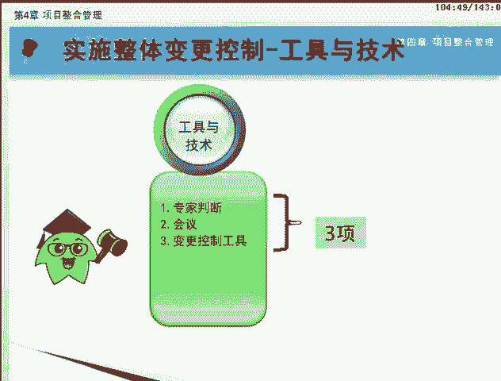

专家判断这种技术前面已经介绍过。在实施整体变更控制过程中，除了项目经理与项目管理团队的专家判断外，也可以邀请干系人贡献专业知识和加入变更控制委员会CCB。在本过程中。

专家判断和专业知识可用于处理各种技术和管理问题，并可从各种渠道获得。

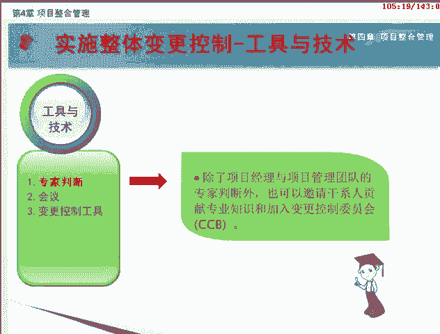

实施整体变更控制过程中召开的会议，通常是指变更控制会议。根据项目需要，可以由变更控制委员会CCB开会审查变更请求，并做出批准、否决或其他决定。CCB也可以审查配置管理活动。

应该明确规定变更控制委员会CCB的角色和职责。并经相关干系人一致同意后，记录在变更管理计划中。CCB的决定都应该记录在案，并向干系人传达，以便其知晓并采取后续措施。为了便于开展配置和变更管理。

可以使用一些手工或自动化的工具。工具的选择应基于项目干系人的需要，并考虑组织和环境情况和制约因素。可以使用工具来管理变更请求和后续的决策，同时还要格外关注沟通，以帮助CCB成员履行职责。

以及向相关干系人传达决定。

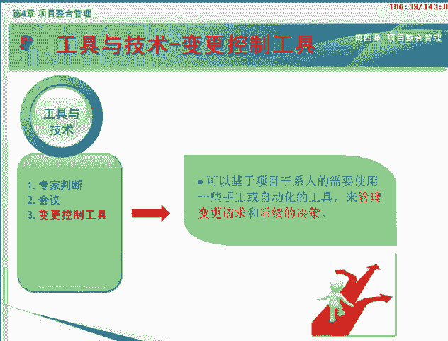

我们看到实施整体变更控制过程共有4个输出。批准变更请求、变更日志、项目管理计划更新和项目文件更新。下面我们一块来学习。

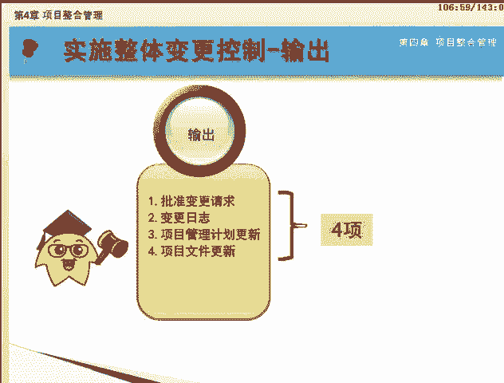

项目经理CCB或指定的团队成员应该根据变更控制系统处理变更请求。批准的变更请求应通过指导与管理项目工作过程加以实施。全部变更请求的处理结果，无论批准与否，都要在变更日志中更新。

这种更新是项目文件更新的一部分。变更日志用来记录项目过程中出现的变更，应该与相关的干系人沟通这些变更，以及对项目时间、成本和风险的影响。被否决的变更请求也应该记录在变更日志中。实施整体变更控制过程中。

对于变更的审查批准和否决，可能会导致项目管理计划的更新。主要包括子管理计划的更新和有待正式变更控制过程审查的基准。需要注意的是，对于基准的变更，只能针对今后的情况，不能变更以往的绩效。

这有助于保护基准和历史绩效数据的严肃性。实施整体变更控制过程结束后，可能更新项目正式变更控制过程所涉及的所有文件。

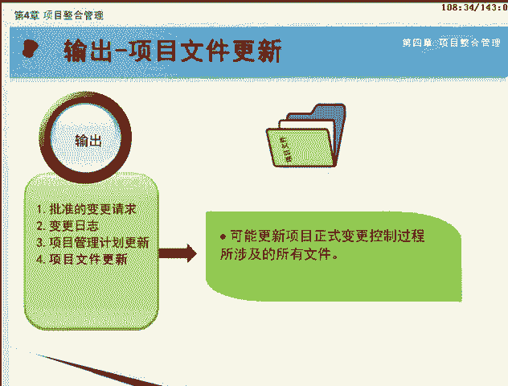

现在我们来回顾一下本过程的核心知识。实施整体变更控制过程，贯穿于项目始终。任何干系人都可提出变更请求，可口头或书面提出，但必须书面记录。

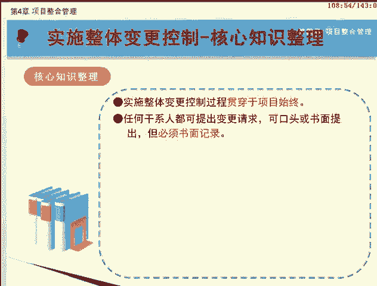

变更控制委员会CCD负责批准或否决重大，特别是关于基准和项目管理计划的更新。配置管理系统关注可交付成果的物理状态和特性，可以提供标准化、效果好的方式来管理已批准的变更与基准。

变更请求可以包括纠正措施、预防措施和缺陷补救。恭喜你完成实施整体变更控制过程的学习，我们下节课见。本课程我们将一起学习第四章项目整合管理知识领域的第六节，结束项目或阶段。这个过程属于收尾过程组。

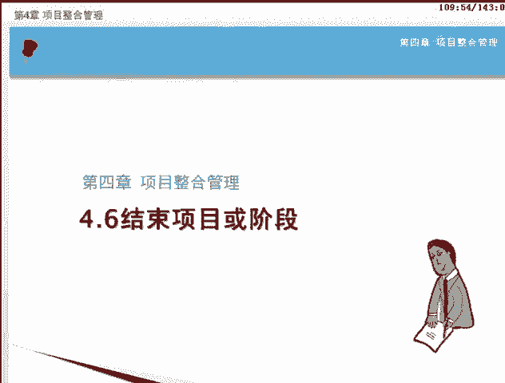

各位学员，你一定听说过烂尾楼吧。所谓的烂尾楼，通常是说那些已经开工的建筑项目，由于缺乏资金或因为产权纠纷、工程质量不合格等原因而被迫停工，然后被搁置一边，无人问津。这样的项目不仅无法进行正常交付。

还会造成巨大的损失和资源的搁置。作为项目经理的你当然不希望出现烂尾楼这样的项目。

其实，不论是成功实现目标的项目，还是遇到问题无法进展下去的项目。如项目所必需的资源被转移出该项目，项目失去原有的竞争力，难以生存下去等等。都应该认真做好项目的收尾工作。也就是我们经常说的善始善终。

只有这样才符合项目管理协会的理念。下面让我们一起学习结束项目或阶段这个过程。通过本课程的学习，我们将要达到以下目标。包括。掌握结束项目或阶段过程的定义和重要性。了解结束项目或阶段过程所必须实施的活动。

熟悉结束项目或阶段过程的输入工具与技术及输出的内容。了解行政收尾的含义。

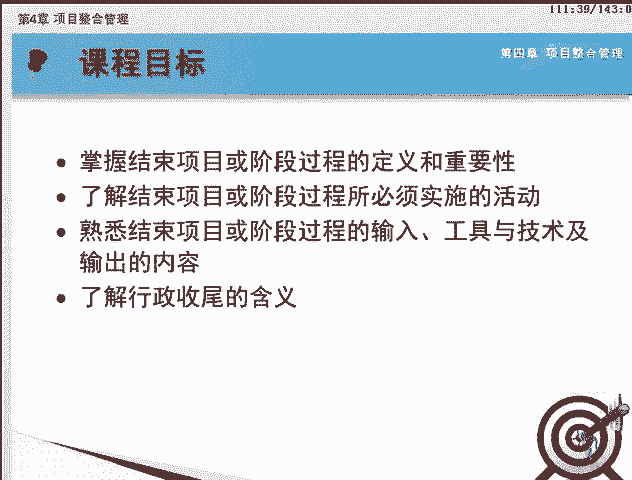

本课程我们将按照如画面所示的大纲展开。首先，对结束项目或阶段这个术语的基本概念进行阐释。接下来讲述该过程的输入工具与技术以及输出。在这里会对工具和技术的详细内容进行分析。最后，着重陈述本过程的核心知识。

在学习结束项目或阶段过程之前，我们先来了解一下这个过程名称，结束项目或阶段。

结束项目或阶段是完结所有项目管理过程组的所有活动，已正式结束项目或阶段的过程。

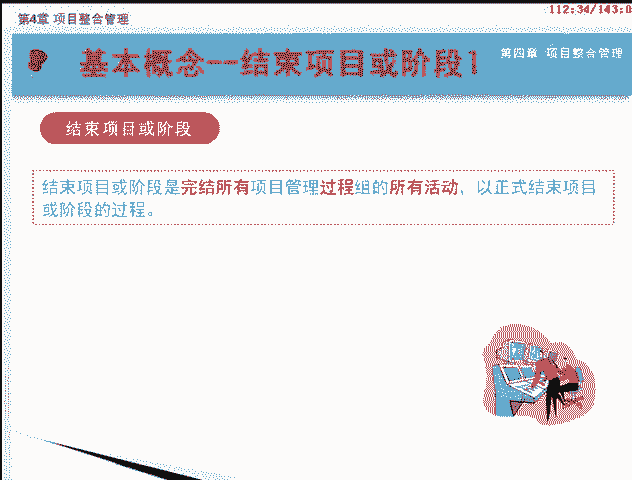

本过程的主要作用是总结经验教训，正式结束项目工作，为开展新工作而释放组织资源。与之相对应的是合同收尾。合同收尾，我们会在后续课程中项目采购管理知识领域的结束采购过程进行讲解。

下面让我们先来了解一下这个项目收尾所需的活动有哪些。结束项目或阶段时，首先是核实工作完成，也就是要确认全部工作都按要求完成了。项目的产品获得正式的认可，确保项目目标已经实现。

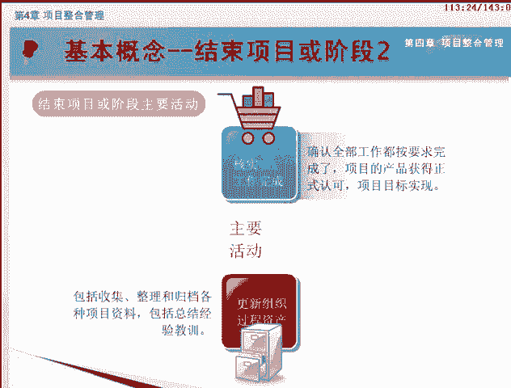

其次，完成最终绩效报告，如正值管理数据。还有更新组织过程资产，包括总结项目工作在哪些方面做的好，哪些方面做的不好。如果重新做一次这个项目，我们会怎么做？这些资料最终成为组织过程资产的一部分。

供组织未来使用。最后，提交所有资料，协助项目干系人在项目上的关系，解散项目团队释放资源，包括人力资源和非人力资源。在刚才的主要活动中，你注意到了吗？释放资源是项目收尾的最后一个活动。

其实他也应该是项目收尾的最后一步。因为收尾工作需要一些干系人参与，其中团队成员是重要的干系人。如果在此之前已释放资源，就无法完成收尾工作。下面我们一起来看一下结束项目和阶段过程的ITTO。

这个过程的输入包括项目管理计划、验收的可交付成果等。在此基础上，应用专家判断和分析技术，最后的结果是对最终产品服务或成果进行移交，对组织过程资产进行更新。下面我们将有重点的具体学习这个过程中的ITTO。

这是结束项目或阶段过程的数据流向图，展现了该过程如何通过输入输出与其他过程进行交互。

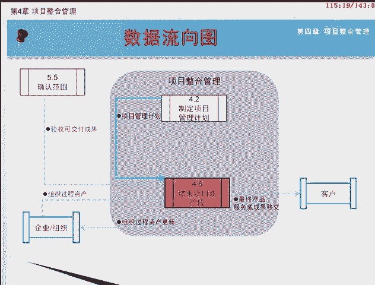

结束项目或阶段过程共有3个输入，包括项目管理计划验收的可交付成果和组织过程资产。下面我们依次来了解他们吧。

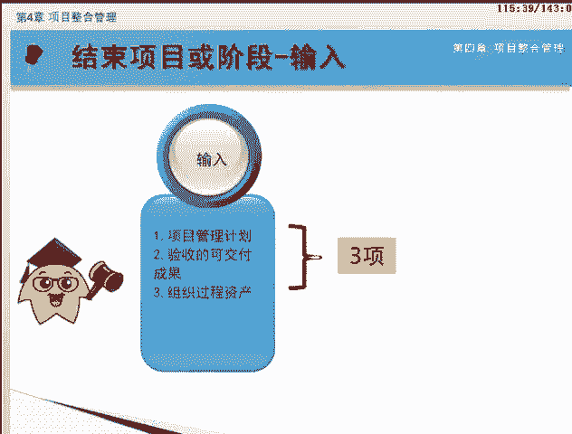

其中，项目管理计划是制定项目管理计划过程的重要输出。我们前面已经进行了详细介绍，大家可以参考。既然本过程要结束项目或阶段，所以项目经理就需要对照项目管理计划来进行审查，确保项目遵循了项目管理计划。

没有遗漏。因为项目管理计划相当于项目经理和发起人之间的协议，其中规定了完工的标准。

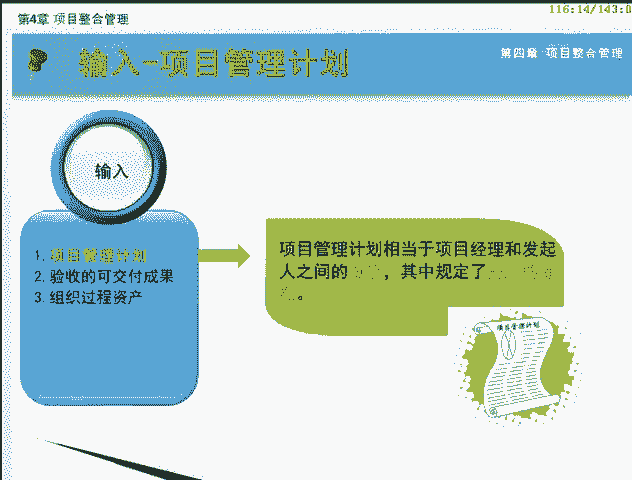

在这里，验收的可交付成果是指那些可交付成果在确认范围过程中通过验收，并经过客户或发起人的正式签字批准。这证明了干系人对项目可交付成果的正式验收。这就成为本过程的一项输入。

验收的可交付成果可能包括批准的产品规范、交货收据和工作绩效文件。所以这里的验收的可交付成果是验收文件，而非项目的可交付物，或者简单的说是一种形式上的验收。可交付成果实质性的验收发生在确认范围过程。

在分阶段实施的项目或被取消的项目中，可能会包括未全部完成的可交付成果或中间可交付成果。可能影响结束项目或阶段过程的组织过程资产。包括。项目或阶段收尾指南或要求，如行政手续、项目审计、项目评价和移交准则。

历史信息与经验教训知识库，如项目记录与文件完整的项目收尾信息与文档。关于以往项目决策的结果，与以往项目绩效的信息，以及从风险管理活动中得到的信息。

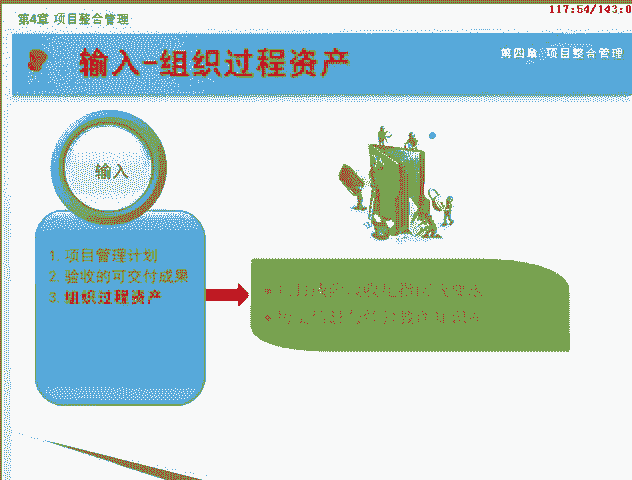

接下来我们来学习工具和技术。结束项目或阶段过程共有3个工具和技术，包括专家判断分析技术和会议。下面我们依次来了解他们。

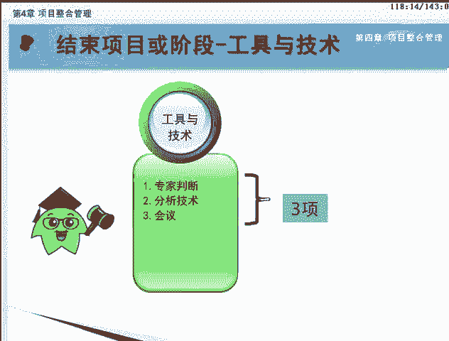

专家所具备的专业知识和判断力常用于开展行政收尾活动。由相关专家确保项目或阶段收尾，符合试用标准。专家判断可从各种渠道获得，需要再次明确。专家判断是项目整合管理这一知识领域的6个过程的通用工具与技术。

分析技术在监控项目工作过程已经进行过介绍。就是根据可能的项目或环境变量的变化，以及他们与其他变量之间的关系来预测潜在的后果。可用于项目收尾的分析技术，主要有回归分析和趋势分析。

结束项目或阶段时召开的会议可以是面对面或虚拟会议、正式或非正式会议。参会者可包括项目团队成员及参与项目或受项目影响的其他干系人。会议的类型可以是经验教训总结会、收委会、用户小组会和用户审查会等。

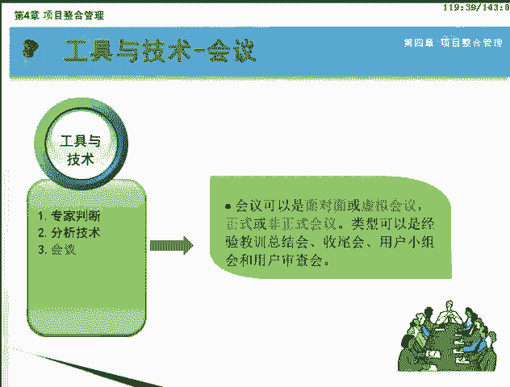

介绍完了工具和技术，我们来看看结束项目或阶段过程的输出。这个过程共有两个输出。分别是最终产品服务或成果移交以及组织过程资产更新。下面我们一块来学习。

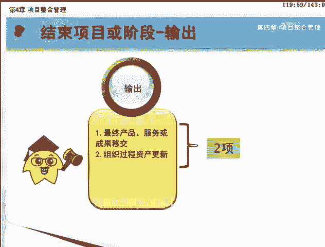

在本过程之前，项目或阶段所产生的产品服务或成果已经经过了客户或发起人的签字确认。如果是整个项目的收尾，需要把最终的产品服务或成果移交给客户。如果是阶段收尾移交的应该是该阶段的中间产品服务或成果。

项目的可交付物移交给客户之后，对项目团队来说，收获的另一个重要财富就是组织过程资产的更新。这为今后的项目提供了历史资料和经验教训。组织过程资产的更新主要有项目档案、项目或阶段收尾文件和历史信息。

接下来我们对他们进行详细的讲解。组织过程资产中的项目档案是在项目活动中产生的各种文件，如项目管理计划、范围计划、成本计划、进度计划、项目日历、风险登记册、其他登记册、变更管理文件、风险应对计划和风险影响评价等。

项目或阶段收尾文件。包括表明项目或阶段完工的正式文件，以及用来把完成的项目或阶段可交付成果移交给他人的正式文件。如果项目在完工前提前终止，则需要在正式的受尾文件中说明项目终止的原因，并规定正式程序。

把该项目的已完成和未完成的可交付成果移交给他人。

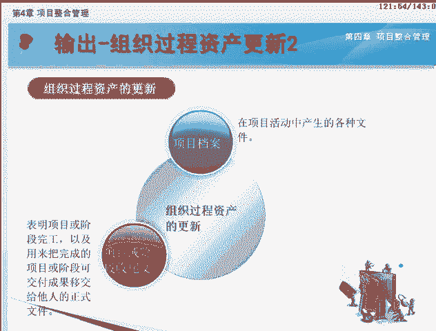

结束项目或阶段时，需要把历史信息和经验教训信息存入经验教训知识库，供未来项目或阶段使用。这些信息可包括问题与风险的信息，以及适用于未来项目的有效技术的信息。现在我们来回顾一下本过程的核心知识。

无论什么原因导致项目终止，也无论什么时候项目终止，都必须进行行政收尾工作。

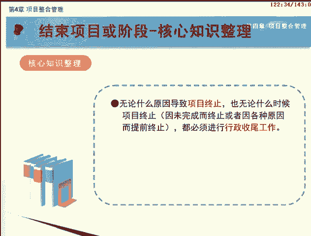

结束项目或阶段过程的输出中，组织过程资产的更新，包括项目档案、项目或阶段收尾文件和历史信息。恭喜你完成结束项目或阶段过程的学习，我们下节课见。

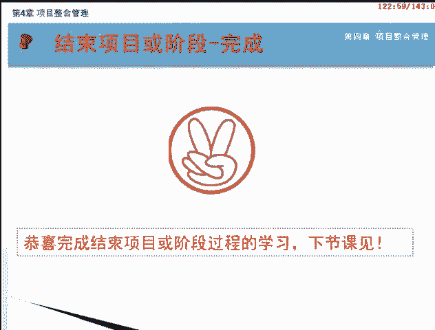

各位学员，第四章项目整合管理知识领域的全部6个过程已经全部学习完毕，现在就来做个总结吧。在学习项目整合管理知识领域的各过程中，您有没有发现这些过程的输入输出之间经常是相互联系的。

前一个过程的输出经常就是后一个或几个过程的输入。下面让我们来回顾一下。在项目启动之前，项目发起人以项目工作说明书的形式提出他们对项目的总体要求。结合相关人员对项目进行的商业论证，如果是外部项目。

还要签署协议，这些成为制定项目章程的依据。运用专家判断以及引导技术，最后得出项目章程。项目章程一旦批准，意味着项目的正式启动。接下来项目团队就要根据这个项目章程。

还有其他规划过程的输出来制定项目管理计划。

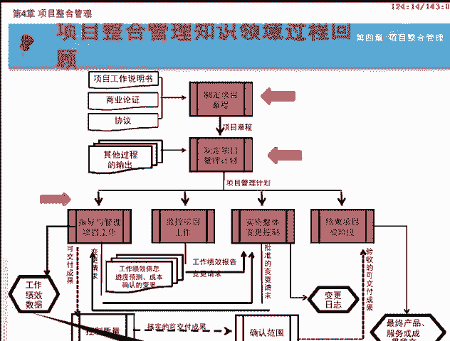

项目管理计划编制好，项目团队即可依据此计划来执行项目工作。在执行过程会产生和交付成果、工作绩效数据以及必要的变更请求。在项目执行的同时，项目团队还要依据项目管理计划和各控制过程产生的工作绩效信息。

以及预测来监控项目工作，发现有于计划不一致的地方随即提出变更请求。当然，监控结果需要整理成。绩效报告。监控项目工作的同时，项目团队还要根据执行与监控过程提出的变更请求，对照项目管理计划以及工作绩效报告。

实施整体变更控制过程。项目执行过程中输出的可交付成果将会提交给控制质量过程进行核实核实的可交付成果，再经过确认范围过程验收验收后即可进入最后的结束项目或阶段过程。最后将最终的产品服务或成果移交给客户。

这个回顾过程我们没有考虑事业环境因素、组织过程、资产和各种文件的更新。你可以翻看平安报告指南来进行回顾。在项目管理实践中，可能需要了解一些P安报告指南中没有涵盖的内容。下面我们来补充一个知识点。

项目选择方法。

项目选择方法用于决定组织选择执行哪个项目。这些方法通常可归为下面两大类。

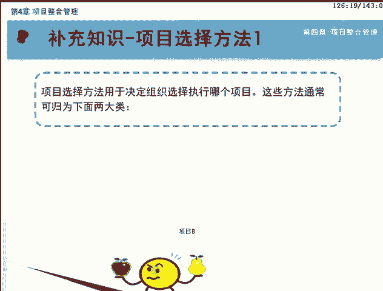

收益测量法包括对比法、评分模型、收益分布或经济模型。考试中经常出现的镜现值法、年职法、内部收益率法、投资回收期法、表格法和决策术法等，属于收益测量方法。还有一种选择项目的方法是数学模型。

数学模型也称约束条件下的优化方法，包括线性、非线性、动态整体及多目标规划算法决策模型等。在实际的项目选择中，应用最多最普遍的仍然是第一类方法，收益测量法。经济模型法是PNP考试中可能出现的知识点。

需要掌握现值、净现值、内部收益率、投资回收期和投资回报率等基本概念。但是提醒大家的是，在PMP考试中很少出现项目选择指标方面具体的计算题。你只需要知道它的大致含义以及与项目选择的关系即可。

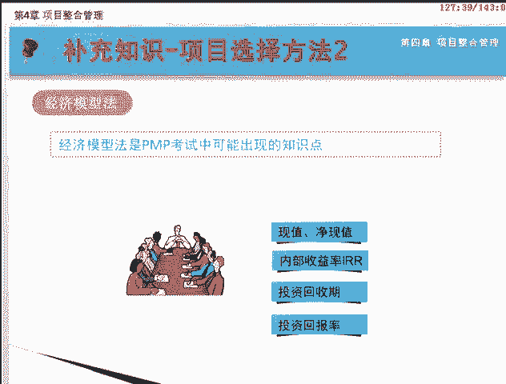

下面我们来讲解一个重要的概念，净现值。根据经验，我们知道货币是有时间价值的。比如今天的1元钱比明天的1元钱更值钱，至少你可以将1元钱存入银行，这样未来就可以获得额外的利息。先来看现值与将来值的概念。

PV表示现值present value。FV表示，将来值future value。两者之间的转换公式是PV等于FV除以一，加上二的N次方，其中二是利率。N是时间期数。举个小例子。

老板答应两年后给你10万元奖金，那么这10万元折算到现在值多少钱呢？假设利率R等于10%。根据公式PV等于FV除以1加上2的N次方。在本题中就是。10万除以1加上10%的2次方等于82645元。

也就是说，两年后的10万元钱只相当于现在的8万多元。下面我们来看净线值NPV的概念。这是衡量项目经济效益最重要的指标。净现值是把项目所有预期的未来现金流入与流出都折算成现值。

这些值累加的和叫做该项目的净现值。净现值的计算公式如下。简单的说就是把项目所有年份的所有进出款项折成现值，最后把这些现值进行累加，即可得到该项目的净现值。接下来举一个例子，说明净现值的计算。

表中的项目生命周期是5年。第一年年初投资1000万美元，第一年到第五年，每年年末都得到收入300万美元，对照10%的基准折现率，可以将第一到第五年各年末的收益进行折现，得到收益现值。

将所有年份的收益现值累加就得到净现值NPV了。上利的NPV是137。24万美元，NPV大于0，表明这个项目可做。现在我们来学习内部收益率，它也是衡量项目经济效益的重要指标。

内部收益率IR2是指项目在计算期内净现值NPV等于零时的折现率。说的通俗点，内部收益率越高，说明你投入的成本相对的少，但获得的收益却相对的多。

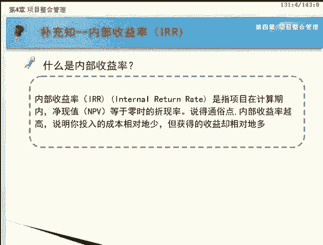

内部收益率的计算方法比较复杂，如果不使用计算机，内部收益率要用若干个折现率进行试算，直到找到净现值等于零或接近于零的那个折现率。PNP考试题目不会要求计算内部收益率。

特别感兴趣的学员可以参考课件下面计算I22的公式及解释。我们来学习如何计算投资回收期。一般来讲，投资回收期都是指静态投资回收期，是不考虑资金的时间价值时收回初始投资所需要的时间。一般从开始建设时算起。

表格中显示了项目A和项目B，从第0年，也就是当年到第四年的净现金流。我们看到第0年的净现金流都是负的35000元。到第三年末，累计现金流恰好都为0，也就是说，他们的静态投资回收期都是3年。

这里给出了静态投资回收期的表达式。公式中PT为静态投资回收期。大写的T为累计净现金流量出现正值的年数。分式中分子的UT减1。只出现正值年份上一年累计净现金流量的绝对值。分式中。

分母VT是出现正值年份的净现金流量。

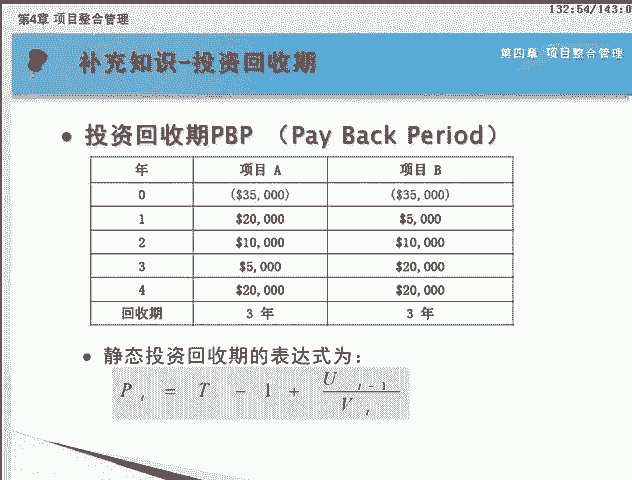

我们来看一个计算静态投资回收期的例题，如表格的第二行所示。在该项目中，从第0年开始到第三年，每年的净现金流量分别为-525、125、300和400。如表格的第三行所示，从第0年开始到第三年。

净现金流量累积值分别为-525、-400-100300。第二年末累计净现金流量为负的100。第三年末累计净现金流量为正的300，说明第三年开始盈利。根据刚才介绍计算静泰投资回收期的公式，回收期等于两年。

加上100除以400等于2。25年，约等于27个月。PMP考试中不会出现这样复杂的计算题，我们了解即可。

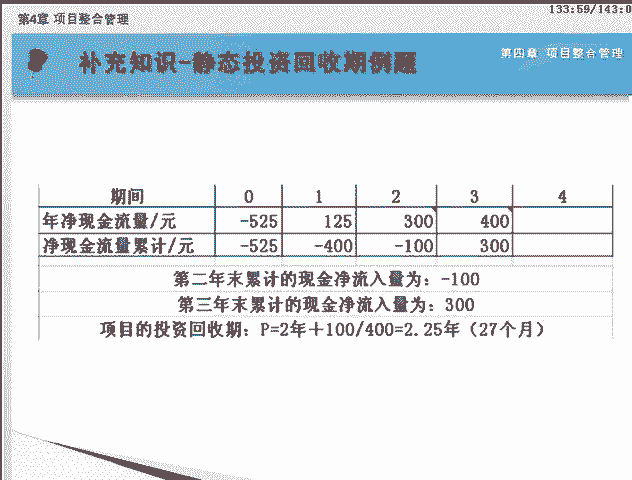

我们来学习投资回报率。投资回报率ROI是指通过投资而应返回的价值。企业从一项投资性商业活动的投资中得到的经济回报。投资回报率考虑了整个项目的投资收益状况。

投资回报率的计算方法非常简单。投资回报率ROI等于年利润或年均利润除以投资总额乘以百分之百。从公式可以看出，企业可以通过降低销售成本，提高利润率。投资回报率能反映投资中心的综合盈利能力。

因而具有横向可比性，有利于判断各投资中心经营业绩的优劣。此外，投资回报率可以作为选择投资机会的依据，有利于优化资源配置。我们来看一个关于投资回报率的例题。表格中显示了项目A和项目B从第零年。

也就是当年到第四年的净现金流。我们看到两个项目的投资都是35000元，四年累计的收入均为55000元，利润为2万。所以ROI为2万除以35000乘以百分之百等于57。1%。

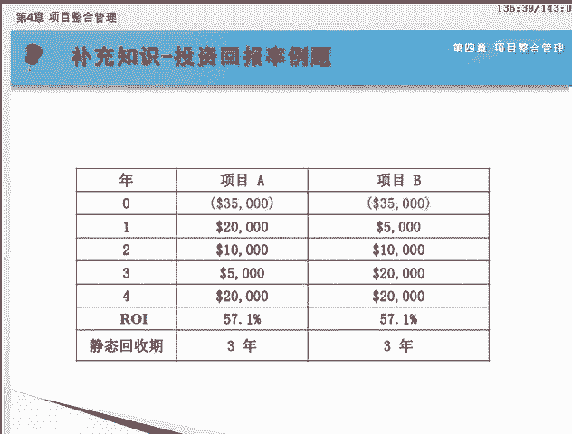

这里是对各种项目选择指标的小结。NPV净现值。是按一定的折现率，将各年净现金流量折现到同一时点的现值累加值。NPV考虑了风险，如通货膨胀率、政治稳定等。NPV的选择标准是越大越好。

II2内部收益率是一个项目净现值等于零时的投资收益率，及项目现金流入量现值等于现金流出量现值时的折现率。I22表现了生命期内项目的相对获利能力。选择标准是I22越大越好。回收期分动态、静态两种。

是指收回成本所需的时间反映投资的回收速度。回收期越短越好。ROI投资利润率是用利润除以投资。ROI越大越好。还有一个概念是BCR收益成本分析。用收益除以成本。是指每投资1美元所获得的收益。

注意收益不一定是金钱。收益成本比越大越好。如果对项目A或B进行二选一，那么就选择净现值大的内部收益率大的和收益成本比高的项目。以及投资回收期短的项目，比如情形2。项目A的内部收益率是13%。

项目B的内部收益率是17%。当然选择B。在PMP考试中，如果遇上了这样一种情况，即项目A的净现值是95000美元，但同时内部收益率是13%。而项目B的净现值是75000美元，而内部收益率是17%。

那么根据优先考虑净现值大的原则，选择项目A进行投资，其他指标出现矛盾的考题几乎没有。如果有还是坚持净现值大的原则。

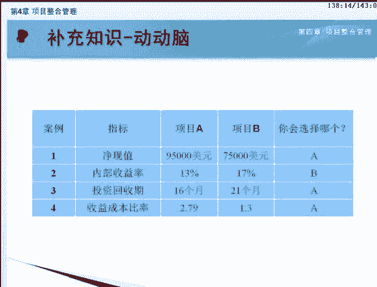

各位学员，恭喜您已经完成了第四章项目整合管理这一知识领域的学习。建议接下来继续学习第五章项目范围管理，我们下堂课见。

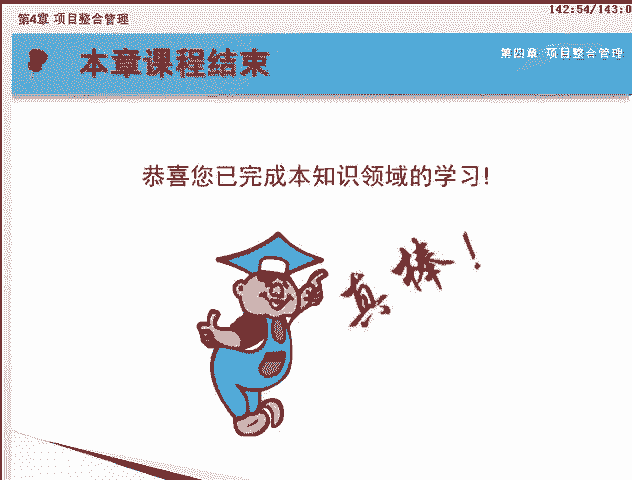