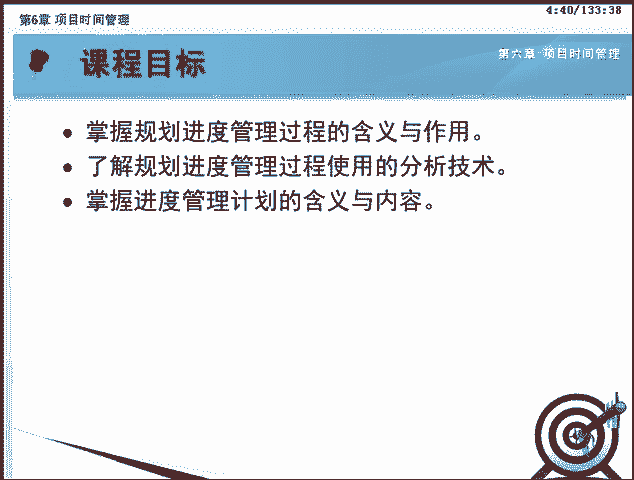
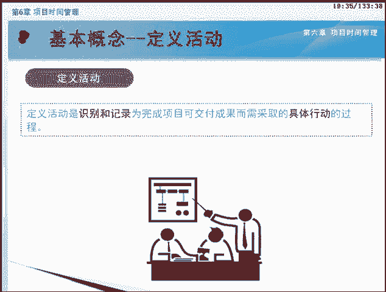
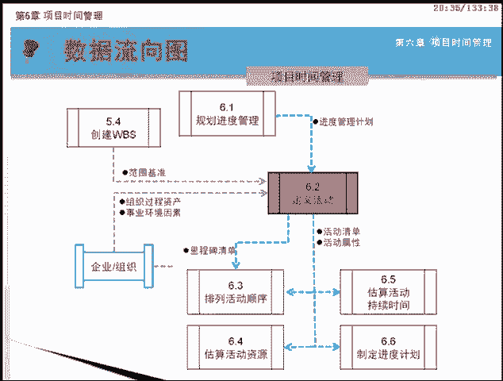
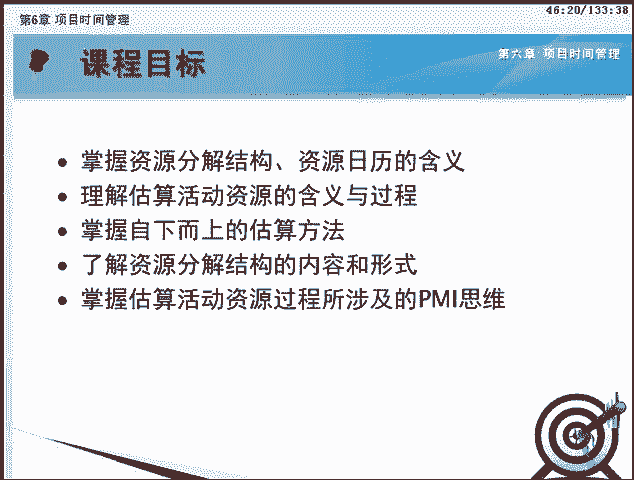
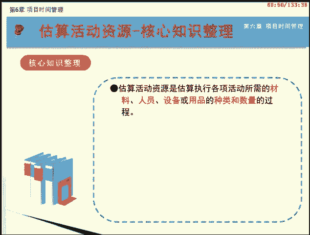
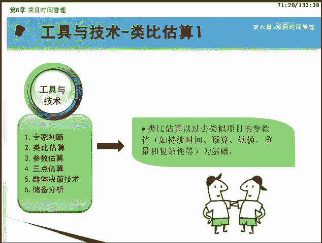
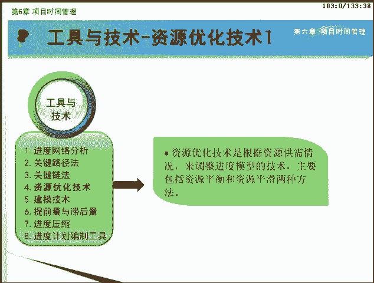

# PMP项目管理 - P6：06 - 自学力 - BV1EZ4y1p7LB

欢迎来到PNP项目管理网络课程的学习。本课程基于最新发布的PM报告指南第五版，下面我们将一起学习第六章项目时间管理。我们来看项目时间管理的位置图。可以看到，项目时间管理知识领域有7个过程。

分散在规划过程组和监控过程组中。在这一章，我们要重点学习项目时间管理的这7个过程。分别是规划过程组的规划进度管理，定义活动排列活动顺序，估算活动资源，估算活动持续时间，制定进度计划共6个规划过程。

还有控制过程组的控制进度过程。这7个过程不但彼此互相作用，而且还与其他知识领域中的过程相互作用。这些过程在位置图中的位置是考试必考的重点，请务必记下来。此外，在学习的过程中。

大家还要格外注意每个过程所使用的工具和技术，它们也是本章的重点内容。那么什么是时间管理呢？时间管理包括为管理项目按时完成所需的各个过程。这些过程只在保证项目在规定的时间内按时完成项目的各个活动。

进而实现项目的进度要求。我们可以将项目时间管理进行如下概述。

项目时间管理就是在工作分解结构WBS的基础上，针对工作分解结构的最底层工作包进一步细化。列出为完成项目而必须进行的全部活动。然后再分析这些活动之间的逻辑关系，排列活动次序。

估算各种活动所需要的资源和工期，制定项目进度计划，并在执行过程中加以控制管理进度基准变更。按照平安报告指南第五版项目时间管理通过以下7个过程来实现。

规划进度管理为规划编制管理、执行和控制项目进度而制定政策程序和文档的过程。定义活动。识别和记录未完成项目可交付成果而需采取的具体行动的过程。排列活动顺序。识别和记录项目活动之间的关系的过程。

估转活动资源。估算执行各项活动所需材料、人员、设备或用品的种类和数量的过程。估算活动持续时间。根据资源估算的结果，估算完成单项活动所需工作时段数的过程。制定进度计划。

分析活动顺序、持续时间、资源需求和进度、制约因素。创建项目进度模型的过程。控制进度。监督项目活动状态，更新项目进展管理进度基准变更，以实现计划的过程。

各位学员马上进入项目时间管理这一知识领域的各过程的学习吧。本节课我们将一起学习第六章项目时间管理知识领域的第一节规划进度管理。通过本课程的学习，我们将要达到以下目标。

包括掌握规划进度管理过程的含义与作用。了解规划进度管理过程使用的分析技术。掌握进度管理计划的含义与内容。

本课程我们将按照如画面所示的大纲为您讲述。首先是对进度管理计划以及规划进度管理过程的基本含义进行讲解。接下来分析规划进度管理过程的输入、工具和技术以及输出。最后是本课核心知识整理。

在学习规划进度管理过程之前，我们先来了解两个基本概念，进度管理计划和规划进度管理过程。进度管理计划是项目管理计划的组成部分。为编制监督和控制项目进度建立准则和明确活动。应包括合适的控制临界值。

项目进度管理计划应该规定如下内容。项目进度模型制定。需要规定用于制定项目进度模型的进度规划方法论和工具。准确度。需要规定活动持续时间估算的可接受区间以及允许的应急储备数量。

计量单位需要规定某种资源的计量单位，例如用于测量时间的人时数、人天数或周数，用于计算数量的米、升吨、千米或地方码。组织程序链接。工作分解结构为进度管理计划提供了框架，保证了与估算及相应进度计划的协调性。

项目进度模型维护。需要规定在项目执行期间将如何在进度模型中更新项目状态，记录项目进展。控制临界值。可能需要规定偏差银戒值，用于监督进度绩效。他是在需要采取某种措施前允许出现的最大偏差。

通常用偏离基准计划中的参数的某个百分数来表示。绩效测量规则。需要规定用于绩效测量的正值管理规则或其他测量规则。这些规则主要用于监控进度。报告格式。需要规定各种进度报告的格式和编制频率。

过程描述对每个进度管理过程进行书面描述。与其他子计划一样，根据项目需要范围管理计划可以是正式或非正式的，非常详细或高度概括的。规划进度管理是为规划编制、管理执行和控制项目进度而制定政策程序和文档的过程。

本过程的主要作用是为如何在整个项目过程中管理项目进度提供指南和方向。接下来让我们来看看进度管理计划是如何被制定出来的。这个过程在项目章程和已批准的只计划的基础上。

应用专家判断分析技术及会议得到最终的子计划进度管理计划。这是规划进度管理过程的数据流向图。可以看到，该过程通过输入输出与其他过程进行交互。规划进度管理过程共有4个输入。

分别是项目管理计划、项目章程、事业环境因素和组织过程资产。下面我们依次来了解他们。

项目管理计划中经过批准的范围基准和其他信息是创建进度管理计划的依据。

范围基准中的项目范围说明书和WBS细节可用于定义活动持续时间估算和进度管理。另外，项目管理计划中的成本风险和沟通决策可能影响进度计划。在规划进度管理时。

需要依据项目章程中的总体里程碑进度计划和项目审批要求来规划各个时间管理过程。规划进度管理时，需要考虑许多事业环境因素，包括。能影响进度管理的组织文化和结构。可能影响进度规划的资源可用性和技能。

提供进度规划工具的项目管理软件，有利于设计管理进度的多种方案。发布的商业信息如资源生产率等，通常来自各种商业数据库。组织中的工作授权系统。能够影响规划进度管理过程的组织过程、资产。包括。

可用的监督和报告工具。历史信息进度控制工具。现有的正式和非正式的与进度控制有关的政策程序和指南。模板。项目收尾指南、变更控制程序。风险控制程序包括风险类别、概率定义与影响以及概率和影响矩阵等。

规划进度管理这个过程有三个工具和技术，分别是专家判断分析技术和会议，我们一块来学习。

先来看专家判断。我们知道专家判断是基于历史信息，对项目环境及以往类似项目的信息提供有价值的见解。在制定进度管理计划时，可以针对正在开展的活动。基于某应用领域、知识领域、学科、行业等的专业知识而做出判断。

专家判断还可以对是否需要联合使用多种方法，以及如何协调方法之间的差异提出建议。分析技术是一类技术的统称，在规划进度管理过程中，可能需要选择项目进度估算和规划的战略方法。

并详细描述对项目进度进行快速跟进或赶工的方法。需要使用分析技术，预测这些决策可能对项目风险产生的影响。

项目团队可能举行规划会议来制定进度管理计划。参会人员可能包括项目经理、项目发起人选定的项目团队成员、选定的干系人、进度规划或执行负责人以及其他必要人员。

规划进度管理过程的输出是进度管理计划。在本过程开始的基本概念里已经介绍过。

现在让我们来回顾一下本过程的核心知识。规划进度管理在整个项目中对如何管理进度提供指南和方向。

进度管理计划是项目管理计划的组成部分，描述将如何进行项目进度管理。进度管理计划中应包括合适的控制临界值。制定进度管理计划的规划会上，可能需要各方面的干性人参与。恭喜你完成规划进度管理过程的学习。

我们下节课见。本节课我们将一起学习第六章项目时间管理知识领域的第二节定义活动。通过本课程的学习，我们将要达到以下目标。包括。掌握活动事件里程碑及定义活动过程的概念。

熟记定义活动过程的输入、工具与技术及其输出。了解滚动式规划的含义及其在项目管理中的作用。了解活动清单，活动属性包含的内容和作用。熟记活动类型的种类，理解并能区分各种活动类型。

本课程我们将按照如画面所示的大纲为您讲述。首先是对活动、事件、里程碑及定义活动等几个基本概念进行讲解。接下来分析定义活动过程的输入所需要的不同工具和技术以及输出。课程的最后是本课核心知识整理。我们知道。

创建WPS是将项目可交付成果和项目工作分解成较小的更易于管理的组成部分的过程。其分解的对象是项目可交付成果，分解得到的结果是更低层次的工作包。工作包只是一个名词，它不能告诉我们如何去做。

而项目实间管理的第二个过程定义活动则是将创建WBS过程的结果工作包继续进行分解。通俗的讲，我们可以将定义活动过程看作是创建WBS过程的后续过程。他将复杂的工作包细化。

分解成实现该工作包所需的具体工作活动。因此，定义活动过程可以告诉我们做什么事情。首先让我们进入第一个部分基本概念的学习。在本课程中，您需要熟悉画面所示的活动、事件、里程碑以及定义活动四个基本概念。

活动通常也称为进度活动，是在项目过程中实施的工作单元。是为完成工作包所必须开展的工作。如我们装修房子时的粉刷、墙壁、铺设地板、整理房间等，都是我们装修房子这一项目中需要实施的工作单元。

他们就是一个个的活动。活动的特点是要消耗时间与资源。比如铺设地板活动，就需要花费一定的时间和人力物力资源。活动和工作包是两个不同的概念。首先，从来源上看。工作包是可教付成果分级而来的。

活动是由工作包分级而来。可以说，活动是工作包的产物，是为完成工作包而必须开展的工作。因为工作包是创建WBS的结果，所以工作包是WBS的一部分，而活动不是WBS的组成部分。其次，从他们的作用来看。

工作包是一个名词。不表示时间顺序，只表示工作范围必须进一步分解为具体活动才行。活动表示时间顺序是资源估算、历时估算费用估算的主要依据。最后工作包分解的结果为活动，而活动是项目规划的最小单元。

在PMP考试中，不需要再往下分解。事件是项目管理中满足一定条件的时间点，不需要资源即历时为零，不消耗资源。事件只是表示某一种状态，如签订协议、开工剪彩等。这是一种理论定义。在实践中。

事践还是需要耗费一定的时间和资源的。比如签订协议需要一个仪式，耗时1小时。里程碑是项目中具有特定重要性的事件或时点。

代表项目工作中一个重要阶段的完成。如签订分包合同，此系统测试完成，可交付成果移交等。通常指某主要可交付成果的完成。里程碑的持续时间为0及历时为0，且不需要消耗资源。在里程碑处，通常要对计划进行检查。

定义活动是识别和记录未完成项目可交付成果，而需采取的具体行动的过程。

本过程的主要作用是将工作包分解为活动。作为对项目工作进行估算、进度规划、执行监督和控制的基础。接下来让我们来看看如何定义活动。该过程在进度管理计划的指导下，以范围基准为基础。

利用分解和滚动式规划等技术定义出项目应该执行的活动。结果是以活动清单和活动属性的形式表达出来的。该过程还可能形成项目的里程碑清单。画面中显示的是定义活动过程的数据流向图。可以看到。

该过程通过输入输出与其他过程进行交互。

定义活动过程共有4个输入，分别是进度管理计划范围基准、事业环境因素和组织过程资产。下面我们依次来了解他们吧。

进度管理计划规定了管理工作所需的详细程度。因此，定义活动的时候，主要的参考计划就是进度管理计划。定义活动是以项目范围为基础的，在定义活动时需明确考虑范围基准中的项目WPS可交付成果、制约因素和假设条件。

定义活动时需要考虑许多事业环境因素，包括。组织文化和结构商业数据库中发布的商业信息。

项目管理信息系统。能够影响定义过程的组织过程资产。包括。经验教训知识库，其中包含以往类似项目的活动清单等历史信息。标准化的流程。来自以往项目的包含标准活动清单或部分活动清单的模板。

现有的正式和非正式的与活动规划相关的政策程序和指南，如进度规划方法论，在编制活动定义时应考虑这些因素。

定义活动过程的工具和技术共有3个，分别是分解、滚动式规划以及专家判断。下面让我们一块来学习。

在定义活动过程中，使用分解技术，就是要把WBS中的每一个工作包分解成更小的、更易于管理的项目活动。以便通过这些活动完成相应的可交付成果。活动是为完成工作包而必须开展的工作。

WBS和WBS词典是制定最终活动清单的依据。WBS中的每个工作包都需要分解成活动，以便通过这些活动来完成相应的科交付成果。

在分解过程中，应该让团队成员参与。这样能得到更好更准确的结果。要注意的是，在分解过程中如遇信息不全，这个时候不要进行分解。滚动式规划是一种迭代式规划技术，及详细规划近期要完成的工作。

同时在较高层次上粗略规划远期工作。滚动式规划是一种渐进明细的规划方式。因为项目的不确定性，所以滚动式规划贯穿于生命周期的不同阶段。阶段不同，工作分解的详细程度会有所不同。如在项目的战略规划阶段。

由于信息不够明确，我们可以将工作包分解到里程碑的水平。然后随着工作的进展，信息逐渐明确，我们可以对近期要完成的工作包分解为具体的活动。这里要再次提醒大家，滚动式规划是必考的重点，大家一定要掌握些含义。

定义活动时需要参考范围管理和进度管理方面的专家意见。因此，专家判断也是这个过程的工具与技术。

定义活动这个过程共有三个输出，分别是活动清单、活动属性以及里程碑清单。下面我们一块来学习。

活动清单是一份包含项目所需的全部进度活动的综合清单。活动清单中应该包含每个活动的标志和足够详细的工作描述。当然，每个活动都应该有一个独特的名称，用来表示他在进度计划中的位置。

刚才介绍的活动清单只是对活动进行一个大概的描述。并没有涉及活动的时间、地点，需要人力等详细情况。活动属性正好弥补了这一缺憾。活动属性是指每项活动所具有的多种属性。活动属性用来扩展对某一活动的描述。

活动属性具有间记明细性，及随时间而演进。在项目初期，活动属性可能仅包括活动标志、活动名称、预计时间。当活动完成时，活动属性则可能还包括活动编码、活动描述、紧前活动、寝后活动、资源需求、制约因素等信息。

另外，活动属性还可以用于识别工作负责人实施工作的地点以及活动的类型等。活动属性的数量因应用领域而异。里程碑清单列出了所有项目里程碑，并指明每个里程碑是强制性的还是选择性的。底程碑与常规的进度活动类似。

有相同的结构和属性。但是里程碑的持续时间为0，因为里程碑代表的是一个时间点。里程碑一般用于进度模型中。现在我们来回顾一下本过程的核心知识。定义活动过程确定的最终输出是进度活动。

WPS和WBS词典是制定最终活动清单的依据。WPS中的每个工作包都需分解成活动。

滚动式规划是一种渐进明细的规划方法，即对近期要完成的工作进行详细规划，而对远期工作则暂时只在WBS的较高层次进行粗略规划。里程碑是项目中具有特定重要性的事件或时点。地时为0，靠资源为0。

恭喜你完成定义活动过程的学习，我们下节课见。本节课我们将一起学习第六章项目时间管理知识领域的第三节排列活动顺序。通过本课程的学习，我们将要达到以下目标。包括。熟记排列活动顺序的定义。

熟悉本过程的输入工具与技术和输出。熟悉PDM的概念及其包含的四种逻辑关系。掌握PDM的绘制方法。理解四种依赖关系，并能区分确定各种依赖关系。知道如何利用时间提前量和滞后量。熟记什么是项目进度网络图。

并掌握其绘制方法。掌握排列活动顺序所涉及的PMI思维。本课程我们将按照画面所示的大纲为您讲述。首先是对排列活动顺序的基本概念进行讲解。接下来分析排列活动顺序过程的输入。

然后学习这个过程中所需要的不同的工具和技术。接下来我们会仔细为您讲解该过程的输出。课程的最后是本课核心知识整理。在学习排列活动顺序这个过程之前。我们先来了解排列活动顺序的概念。

排列活动顺序是识别和记录项目活动之间的逻辑关系。再按照活动的逻辑关系，对活动进行顺序排列的过程。本过程的主要作用是定义工作之间的逻辑顺序，以便在既定的所有项目制约因素下获得最高的效率。

排序可用项目管理软件，也可通过手工或自动化技术来实现。接下来让我们看看如何排列活动顺序。该过程在进度管理计划的指导下。依照范围说明书和定义活动过程输出的各种信息。识别出活动之间的逻辑关系。

以及提前量和滞后量等。最后形成项目活动网络图。这是排列活动顺序过程的数据流向图。我们可以看到，该过程通过输入输出与其他过程进行交互。

排列活动顺序过程共有7个输入，他们是进度管理计划、活动清单、活动属性、里程碑清单、项目范围说明书、事业环境因素以及组织过程资产。下面我们逐个介绍。

进度管理计划规定了用于项目的进度规划方法和工具。因此，排列活动顺序的时候，主要的参考计划就是进度管理计划。

定义活动过程产生的三个输出是排列活动顺序重要的参考依据。活动清单列出了项目所需的待排序的全部进度活动。这些活动的依赖关系和其他策约因素会对活动排序产生影响。

活动属性中可能描述了事件之间的必然顺序或确定的紧钱结后关系。里程碑清单中可能已经列出特定里程碑的实现日期。这可能影响活动排序的方式。项目范围说明书属于范围基准。其中包含产品范围描述。

而产品范围描述中又包含可能影响活动排序的产品特征。如待建厂房的布局图或软件项目中的子系统界面，这些产品特征会影响活动排序。项目范围说明书中的其他信息也可能影响活动排序。

如项目可交付成果、项目制约因素和假设条件。虽然活动清单中已经体现了这些因素的影响结果，但还是需要对产品范围描述进行整体审查，以确保准确性。可能影响活动排序过程的事业环境因素。包括。政府或行业标准。

项目管理信息系统P。进度规划工具。公司的工作授权系统。能够影响排列活动顺序过程的组织过程、资产，包括。公司知识库中有助于确定进度规划方法论的项目档案。现有的正式或非正式的与活动规划有关的政策程序和指南。

有助于加快项目活动网络图编制的各种模板。排列活动顺序过程有三个工具和技术，他们是紧钱关系绘图法，确定依赖关系和提前量与滞后量。下面我们一块来学习。

紧前关系绘图法PDM是创建进度模型的一种技术，用节点表示活动，用一种或多种逻辑关系的间限连接活动，以显示活动的实时顺序。活动节点法AON是紧前绘图法的一种展示方法，是大多数项目管理软件包所使用的方法。

我们先来了解颈前活动和颈后活动的概念。在活动途中，紧前活动是在进度计划的逻辑路径中排在非开始活动前面的活动。今后活动是在进度计划的逻辑路径中排在某个活动后面的活动。在景前关系绘图法PDM中。

活动之间可以定义4种关系，完成到开始，完成到完成开始到完成以及开始到开始。为了简单体见，用S表示开始star，用F表示结束finish。那么这四种逻辑关系就可以分别表示为FSFFSF和SS。

下面我们对四种关系进行详细介绍。完成到开始FS。只有紧前活动完成，紧后活动才能开始的逻辑关系。比如，只有比赛结束，颁奖典礼才能开始。完成到完成FF。只有紧前活动完成寝后活动才能完成的逻辑关系。例如。

只有完成文件的编写，才能完成文件的编辑。开始到开始SS。只有紧前活动开始，紧后活动才能开始的逻辑关系。例如。开始地基浇灌之后，才能开始混凝土的找平。开始到完成SF。只有紧前活动开始。

紧后活动才能完成的逻辑关系。例如，只有第二位保安人员开始值班，第一位保安人员才能结束值班。这四种关系中，完成到开始FS是最常用的逻辑关系，其次是SS开始到开始。最不常用的是SF开始到完成。

依赖关系可能是强制或选择的内部或外部的这四种依赖关系可以组合成强制性外部依赖，强制性内部依赖、选择性外部依赖或选择性内部依赖。下面我们一一介绍。强制性依赖关系又称硬逻辑关系或硬依赖关系。

是法律或合同要求的或工作的内在性质决定的依赖关系。强制性依赖关系往往与客观限制有关。例如，在建筑项目中，只有在地基建成以后才能建立地面结构。在电子项目中，必须先把原型制造出来，然后才能对其进行测试。

如果违背了这些关系，很可能造成反工。在活动排序过程中，项目团队应明确哪些关系是强制性依赖关系。不应把强制性依赖关系和进度编制工具中的进度约束条件相混淆。

选择性依赖关系有时又称首选逻辑关系、优先逻辑关系或软逻辑关系。基于具体应用领域的最佳实践来建立选择性依赖关系，或者基于项目的某些特殊性质而采用某种依赖关系。即便还有其他依赖关系可用。

选择性依赖关系最能体现项目经理的经验和能力。应该对选择性依赖关系进行全面记录，因为他们会影响总浮动时间并限制后续的进度安排。

外部依赖关系是项目活动与非项目活动之间的依赖关系。这些依赖关系往往不在项目团队的控制范围内。例如，软件项目的测试活动取决于外部硬件的到货。建筑项目的现场准备可能要在政府的环境听证会之后才能开始。

在排列活动顺序过程中，项目管理团队应明确哪些依赖关系属于外部依赖关系。内部依赖关系是项目活动之间的紧钱关系。通常在项目团队的控制之中，例如，只有机器组装完毕，团队才能对其进行测试。

这是一个内部的强制性依赖关系。在排列活动顺序过程中，项目管理团队应明确哪些依赖关系属于内部依赖。我们来看看这张用紧钱关系绘图法绘制的项目进度网络图。除了用方框表示的活动。

用间限表示的活动关系以及紧前活动和紧后活动的逻辑关系之外。图中还有逻辑关系加上或减去了一个数值，比如SS加10FS减18等等。那这又是什么意思呢？请看下面的说明。

排列活动顺序的第三个工具和技术就是利用时间提前量和滞后量。项目团队应该明确哪些依赖关系中需要加入时间、提前量或滞后量，更准确的表示活动之间的逻辑关系。

提前量是相对于颈前活动，紧后活动可以提前的时间量。例如，在新办公大楼建设项目中，绿化施工可以在尾工清单编制完成前两周开始，这就是待两周提前量的完成到开始关系。在进度规划软件中，提前量往往表示为负之后量。

滞后量是相对于颈前活动，颈后活动需要推迟的时间量。例如，对于一个大型技术文档，编写小组可以在编写工作开始后15天开始编辑文档草案。这就是在15天滞后量的开始到开始关系。

排列活动顺序过程有两个输出，分别是项目进度网络图和项目文件更新。下面我们一块来学习。

从排列活动顺序所用的工具，你可能已经看出来了，排列活动顺序过程的一个输出是项目进度网络图。项目进度网络图是表示项目活动之间的逻辑关系也叫依赖关系的图形。需要提醒大家的是，在网络图中，除了首尾两项。

每项活动和每个里程碑都至少有一项紧前活动和一项紧扣活动。图中所示是项目进度网络图的一个事例。整个项目由12个活动组成。活动H和活动I之间有10天之后量表示为SS加10。也就是说，活动H开始10天之后。

活动I才能开始。同样的，活动F和G之间有15天滞后量表示为FS加15。也就是说，活动F结束后的15天活动G才能开始。项目进度网络图可手工或借助项目管理软件来绘制。进度网络图可包括项目的全部细节。

也可只列出一项或多项概括性活动。项目进度网络图应附有简要文字描述，说明活动排序所使用的基本方法。在文字描述中，还应该对任何异常的活动序列做详细说明。

排列活动顺序过程中可能需要更新的项目文件，包括。活动清单、活动属性、里程碑清单、风险登记册。

现在我们来回顾一下本过程的核心知识。紧钱关系绘图法PDM用节点表示活动，用间限表示活动之间的关系。它包括四种逻辑关系，完成到开始FS完成到完成FF开始到开始SS开始到完成SF。

活动之间的顺序有4种依赖关系，强制性依赖关系、选择性依赖关系、外部依赖关系和内部依赖关系。项目进度网络图是展示项目各进度活动及其相互之间逻辑关系的图形。恭喜你完成排列活动顺序过程的学习，我们下节课见。

本课程我们将一起学习第六章项目时间管理知识领域的第四节估算活动资源。

通过本课程的学习，我们将要达到以下目标。包括。掌握资源分解结构、资源日历的含义。理解估算活动资源的含义与过程。掌握自下而上的估算方法。了解资源分解结构的内容和形式。掌握估算活动资源过程所涉及的PMS为。

本课程我们将按照如画面所示的大纲为您讲述。首先是对资源日历、项目日历、资源分解结构和估算活动资源等基本概念进行讲解。接下来分析估算活动资源过程的收入。然后学习估算活动资源过程中所需的不同的工具和技术。

接下来我们会仔细为您讲解这个过程的输出。课程的最后是本课核心知识整理。在学习估算活动资源过程之前，我们先来了解几个基本的概念，分别是资源日历、项目日历、资源分解结构和估算活动资源。

首先需要明确项目管理中的资源主要包括材料、人员、设备或用品这四大类。资源日历是确定每一种具体资源的工作日和非工作日的日历安排。比如，某个人在本项目的工作时间以及不在这个项目的工作日。

都可以在资源日历中看到。画面中呈现的是某项目的资源日历。在这个资源日历中，左侧显示资源名。右侧有颜色的区域表示，在此时间段，该资源可用于本项目。从资源日历上可以看到，某种资源在何时可用。

以及可以用多长时间。此外，还可能列出资源的一些属性，如资源的经验和技能水平、来源地等。资源日历可以是针对某个具体的活动，也可以是整个项目。

因为资源日理中包含了关于可用人力资源的数量及能力和技能水平等信息。因此，我们还会在项目人力资源管理知识领域继续讲解。在项目管理中，还会用到项目日历。他和资源日历有什么不同呢？

项目日历是规定开展进度活动的工作日或班次和不开展进度活动的非工作日的日历。项目日历一般会规定节假日、周末和倒班时间。这是一个项目日历的样例，从中是不是能很清楚的看到哪一天项目开展什么样的活动呢？可见。

资源日历是具体资源可用时间的呈现，而项目日历是对项目活动的时间安排。资源分解结构是资源一类别和类型的成积展现。资源类型包括人力、材料、设备和用品。资源类型包括技能水平、等级水平或适用于项目的其他类型。

资源分解结构有助于结合资源使用情况，组织与报告项目的进度数据。资源分解结构可用于识别和分析项目人力资源配备。这里给出一个简单的资源分解结构图，从中可以看到资源的类型及预算等情况。

估算活动资源是估算执行各项活动所需的材料、人员、设备或用品的种类和数量的过程。

本过程的主要作用是明确完成活动所需的资源种类、数量和特性。以便做出更准确的成本和持续时间估算。估算活动资源还为接下来活动的持续时间估算和活动的成本估算奠定基础。因为只有明确资源的数量和种类。

才能确定所需的时间和成本。接下来让我们来看看如何估算活动资源。该过程在进度管理计划的指导下，在活动清单、活动属性和资源日历等输入的基础上，结合风险登记册中记录的风险。使用各种估算技术，得到活动资源需求。

并把项目中的所有资源进行汇总分类，形成资源分解结构。这是估算活动资源过程的数据流向图。可以看到，该过程通过输入输出与其他过程进行交互。估算活动资源过程共有8个收入。

分别是进度管理计划、活动清单、活动属性、资源日历、风险登记册、活动成本估算、事业环境因素和组织过程资产。下面我们依次来了解他们。

首先，估算活动资源应该从进度管理计划中获得指导。进度管理计划中确定了资源估算准确度和所使用的计量单位等。

活动清单是一份包含项目所需的全部进度活动的综合清单。这些活动都需要一定的资源才能完成。在本过程中，只有知道了活动清单，才能知道可能需要的资源。活动属性为估算每项活动所需的资源提供了主要收入。

活动属性对列入活动清单的每一项进度活动。记录了多种属性，活动属性用来扩展对某一活动的具体描述。通过对资源日历概念的学习，我们已经知道资源日历是表明每种具体资源的可用工作日或工作班次的日历。因此。

从资源日历上可以看到，某种资源在何时可用，以及可以用多长时间。此外，还可能列出资源的一些属性，如资源的经验和技能水平、来源地等。风险登记册是识别风险过程的输出。他记录了所有已知的风险。

它在风险管理各个过程，特别是规划风险应对过程不断更新。风险事件可能影响资源的可用性及对资源的选择。估算活动资源，还有个输入是活动成本估算。因为资源的成本可能影响对资源的选择。

能够影响估算活动资源过程的事业环境因素，包括资源所在位置、可用性和技能水平等。能够影响估算活动资源过程的组织过程资产。包括。关于人员配备的政策和程序。关于租用购买用品和设备的政策与程序。

关于以往项目中类似工作所使用的资源类型的历史信息。估算活动资源过程有5个工具和技术，他们是专家判断备选方案分析发布的估算数据，自下而上的估算和项目管理软件。下面我们一块来学习。

估算活动资源的第一个工具和技术是专家判断。专家判断用来评价本过程与资源有关的收入。因为估算活动资源不一定有严格的明确的标准，可供遵守，因此需要使用专家判断。具有资源规划与估算专业知识的任何小组或个人。

都可以提供这种专家判断。很多进度活动都有若干种备选的实施方案。如使用能力和技能水平不同的资源，不同规模或类型的机器，不同的工具，以及自制租赁或购买相关资源。

例如，传输一个文件，可以用邮件快递，也可以用传真，还可以用扫描仪加电脑加互联网加打印机。不同的方案会有不同的资源需求。我们可以通过对比选择最合适的方案。这种技术就是备审方案分析。在分析和比较的过程中。

我们可能还会用到一些组织发布的一些关于某些资源在某些国家或地区的生产率和资源单价的信息，以便于权衡成本和第时。如设备单价、材料价格、劳动力价格等，美国人很重视这个数据，这就是发布的估算数据。

自下而上估算是一种估算项目持续时间或成本的方法。通过从下到上逐层汇总WBS组件的估算而得到项目估算。如果无法以合理的可信度对活动进行估算，则应将活动中的工作进一步细化，然后估算资源需求。

接着再把这些资源需求汇总起来，得到每个活动的资源需求。这就是自下而上的估算方法。比如，在一个家庭厨房装修活动中，由于无法以合理的可信度对装修活动进行估算。

于是将其进一步细分为洁具、燃具、风机、厨房等安装。估算洁距安装所需的资源有安装工人、水池、上水管、下水管、过滤网等。像这样，再将燃具、风机、橱柜等安装所需资源全部汇总起来。

从而得到厨房装修活动的资源需求。项目管理软件如进度规划软件，有助于规划组织与管理资源库以及编制资源估算。利用先进的软件可以确定资源分解结构、资源可用性、资源费率和各种资源日历，从而有助于优化资源使用。

估算活动资源这个过程共有3个输出。活动资源需求、资源分解结构以及项目文件更新。下面我们一块来学习。

通过前面的估算活动，最终识别出工作包中每项活动所需的资源类型和数量。这就是活动资源需求。然后把这些需求汇总成每个工作包和每个工作时段的资源估算。资源需求描述的细节数量与具体程度因应用领域而异。

在每个活动的资源需求文件中，都应说明每种资源的估算依据，以及为确定资源类型、可用性和所需数量所做的假设。估算活动资源的一个重要输出是资源分解结构。通过前面基本概念的学习，我们已经知道。

资源分解结构是资源一类别和类型的层级展现。如图是一个建筑项目的资源分解结构。这个资源层级结构。分别列出相应的活动所需的资源。资然分解结构也可以展现为跟WBS1样的层级结构。在估算活动资源过程中。

把估算结果记录到资源估算文件中，并成为项目文件的一部分。可能需要更新的项目文件，包括活动清单、活动属性以及资源日历。

现在我们来回顾一下本过程的核心知识。估算活动资源是估算执行各项活动所需的材料、人员、设备或用品的种类和数量的过程。

自下而上估算是一种估算项目持续时间或成本的方法。通过从下到上逐层汇总WBS组件的估算而得到项目估算。资源分解结构是资源一类别和类型的层级展现。资源日历是确定每一种具体资源的工作日和非工作日的日历安排。

恭喜你完成估算活动资源过程的学习，我们下节课见。本节课我们将一起学习第六章项目时间管理知识领域的第五节估算活动持续时间。通过本课程的学习，我们将要达到以下目标。包括。熟记估算活动持续时间的定义。

理解类比估算参数估算和三点估算的含义并区分。掌握如何使用类比估算参数估算和三点估算三种技术。理解储备分析的含义。熟记本过程的输入工具与技术和输出。理解本过程包含的PMI思维。

本课程我们将按照如画面所摄的大纲为您讲述。首先是对估算活动持续时间的基本概念进行讲解。接下来分析估算活动持续时间过程的输入、工具与技术以及输出。课程的最后是本课核心知识整理。

在学习估算活动持续时间过程之前，我们先来了解估算活动持续时间的基本概念。活动定义好了，顺序也排好了，每个活动需要什么资源也清楚了。接下来该做什么了呢？

在制定出进度计划之前的最后一个工作就是估算活动持续时间了。这个过程仍然属于规划过程组。估算活动持续时间是根据资源估算的结果，估算完成单项活动所需工作时段数的过程。

本过程的主要作用。是确定完成每个活动所需花费的时间量，为制定进度计划过程提供主要收入。为了估算出完成活动所需的工作时段，也就是活动持续时间。首先要估算出具体活动的工作量和计划投入该活动的资源数量。因此。

要根据活动工作范围，所需资源类型、所需资源数量以及资源日历等来估算活动持续的时间。在本过程中需要注意以下几点。由项目团队中最熟悉具体活动的个人或小组提供活动持续时间估算所需的收入。

对活动持续时间的估算是渐近明细的，因此，重新估算是必须的。

每个活动持续时间估算所依据的全部数据与假设都应记录在案。进度活动按照项目日历开展，分配了资源的进度活动，按照相应的资源日历开展。接下来。让我们来看看如何估算活动资源。该过程在进度管理计划的指导下。

在活动清单、活动属性和资源日历、范围说明书等输入的基础上。结合风险登记册中记录的风险。使用各种估算技术加入适当的时间储备。最终估算出各活动的持续时间。画面中展示的是估算活动资源过程的数据流向图。

可以看到，该过程通过输入输出与其他过程进行交互。估算活动持续时间过程共有10个输入，分别是进度管理计划、活动清单、活动属性、活动资源需求、资源日历、项目范围说明书、风险登记册资源分解结构。

事业环境因素和组织构成资产。下面我们依次来讲解。

进度管理计划规定了用于估算活动持续时间的方法和准确度以及其他标准。如项目更新周期。这些信息可以指导估算活动持续时间。活动清单和活动属性是定义活动过程产生的。是估算活动持续时间的重要参考依据。

活动清单列出了项目所需的全部进度活动。活动属性中描述了活动的细节。估算的活资源需求会对活动持续时间产生影响。对于大多数活动来说，所分配的资源能否达到要求，将对其持续时间有显著影响。

技术熟练的员工和生产率高的设备将减少活动时间。相反的，低技能员工或低效率设备会增加活动时间。例如，向某个活动增加资源或分配低技能资源。就需要增加沟通、培训和协调工作。从而可能导致活动效率或生产率下降。

以致需要更长的持续时间。资源日历是表明每种具体资源的可用工作日或工作班次的日历。资源日历中的资源可用性、资源类型和资源性质都会影响进度活动的持续时间。例如，以项任务由全职人员做。

所用时间通常会少于兼职人员。估算活动持续时间时，还应考虑项目范围说明书中所列的制约因素和假设条件对活动持续时间的影响。这些假设条件包括现有条件信息的可用性、报告期的长度。

制约因素包括可用的熟练资源、合同条款和要求。风险登记册是识别风险过程的输出。他记录了所有已知的风险清单。他在风险管理各个过程，特别是规划风险应对过程不断更新。风险事件可能影响活动持续时间的估算。

资源分解结构是估算活动资源过程的输出。他按照资源类别和资源类型提供了已识别资源的层级结构。应结合资源分解结构进行活动持续时间的估算。能够影响估算活动持续时间过程的事业环境因素。包括。

持续时间库算数据库和其他参考数据。生产率测量指标。发布的商业信息。团队成员的所在地。可能影响估算活动持续时间过程的组织过程、资产。包括。关于持续时间的历史信息。项目日历进度规划方法论经验教学。

估算活动持续时间过程有6个工具和技术，他们是专家判断类比估算参数估算三点估算群体决策技术和储备分析。下面我们一块来学习。

通过借鉴历史信息，专家判断能提供持续时间估算所需的信息。或根据以往类似项目的经验，给出活动持续时间的上限。专家判断也可用于决定是否需要联合使用多种估算方法，以及如何协调各种估算方法之间的差异。

估算活动持续时间的第二个工具和技术是类比估算。顾名思义类比估算，以过去类似项目的参数值，如持续时间、预算、规模、重量和复杂性等为基础来估算未来项目的同类参数或指标。在估算持续时间时。

类比估算技术以过去类似项目的实际持续时间为依据来估算当前项目的持续时间。

关于类比估算，我们还应该了解下列知识。类比估算需要综合利用历史信息和专家判断，属于一种自上而下的估算方法。这是一种粗略的估算方法。通常在项目早期项目详细信息不足时使用。相对于其他估算方法。

类比估算成本较低，耗时也少。但这是一种粗略的方法，准确性就不如其他方法了。如果说项目活动是本质，而非表面的相似。并且具备必要专业知识的团队成员进行估算的话，类比估算的可靠性就相对比较高了。

参数估损是一种基于历史数据和项目参数。使用某种算法来计算成本或持续时间的估算技术。参数估算是指利用历史数据之间的统计关系和其他变量，如建筑施工中的平方英尺等来估算，诸如成本预算和持续时间等活动参数。

在进行参数估算时，把需要实施的工作量乘以完成单位工作量所需的工时，即可计算出活动持续时间。例如，对于设计项目，将图纸的张数乘以每张图纸所需的工时。或者对于电缆铺设项目。

将电缆的长度乘以铺设每米电缆所需的工时。参数估算的准确性取决于参数模型的成熟度和基础数据的可靠性。参数估算可以针对整个项目或项目中的某个部分，并可与其他估算方法联合使用。

三点估算通过考虑估算中的不确定风险，提高了活动持续时间估算的准确性。这是估算活动持续时间和估算成本最常用的技术，也是PMP考试的必考内容，我们将详细讲解。三点估算这种技术起源于计划评审技术PERT。

普使用三种估算值来界定活动持续时间的近似区间。在估算某个值时，需要进行三种估算，这三种估算值分别为最可能时间、最乐观时间和最悲观时间。最可能时间TM是基于最可能获得的资源，最可能取得的资源生产率。

对资源可用时间的限时预计。资源对其他参与者的可能依赖以及可能发生的各种干扰所得到的活动持续时间。最乐观时间，TO是基于活动的最好情况所得到的活动持续时间。最悲观时间。

TP是基于活动的最差情况所得到的活动持续时间。根据最新的PM报课指南第五版。基于三个基础值，可以使用两个常用公式来计算期望的持续时间。TE。第一个是使用三角分布的公式，我们看分子是三个值，累加分母是3。

第二种是使用贝塔分布的公式来计算。我们看到分子中。最可能的时间乘以4分母除以6。PMP考试时要留意题目要求的计算方法，默认情况下，建议采用贝塔分布的计算公式。因为它源自传统的prot技术。

除了利用刚才介绍的贝塔分布或三角分布计算出预期时间。还可以利用其中的两个值最悲观时间TP和最乐观时间TO计算出持续时间估算的不确定性。这个不确定性用标准差西格马表示。公式是西格马等于TP减去TO除以6。

我们看到。西格玛的值越大，说明估算结果的不确定性也就越大。群体决策技术是估算活动持续时间时可以利用的一类技术。主要指基于团队的方法，如我们前面介绍过的头脑风暴、de尔飞技术或名义小组技术。

这些方法可以调动团队成员的参与，以提高估算的准确度，并提高对估算结果的责任感。选择一组与技术工作密切相关的人员参与估算过程，可以获取额外的信息，得到更准确的估算。另外，让成员亲自参与估算。

能够提高他们对实现估算的责任感。在估算活动持续时间时，为了应对进度方面的不确定性，往往需要预留一些时间。那么到底预留多少时间合适呢？这就是储备分析应该回答的问题。针对时间预留的储备。

可以分为应急储备和管理储备。下面我们分别介绍。先来看什么是应急储备。

应急储备有时称为时间储备或缓冲时间，是包含在进度基准中的一段持续时间。用来应对已经接受的已识别风险，以及已经制定应急或减轻措施的已识别风险。应急储备与已知已知风险相关，需要加以合理估算。

用于完成未知的工作量。随着项目信息越来越明确，可以动用、减少或取消应急储备。管理储备是为管理控制的目的而特别流出的项目时间，用来应对项目范围中不可预见的工作。管理储备用来应对，会影响项目的未知未知风险。

国际储备不包括在进度基准中，但属于项目总持续时间的一部分。使用管理储备可能需要变更进度基准。嗯。估算活动持续时间，这个过程共有两个输出，分别是活动持续时间估算和项目文件更新。下面我们一块来学习。

估算活动持续时间过程的一个重要结果，就是得出对活动持续时间的估算量。活动持续时间估算是对完成活动所需的工作时段的定量评估。在评估结果中，可以指出一定的变动区间，但不能包含任何时间滞后量。

比如两周正府两天，以每周5个工作日计算，表示活动至少需要8天，最多不会超过12天。如果估算结果表示为超过三周的概率为15%，则可能理解为活动在三周内完成的可能性为85%。

估算活动持续时间过程可能需要更新的项目文件，包括活动属性为估算活动持续时间而制定的假设条件，如技能水平、可用性以及估算依据。

本过程的主要内容到此完毕。现在我们来回顾一下本过程的核心知识。估算活动持续时间是根据资源估算的结果，估算完成单项活动所需工作时段数的过程。对活动持续时间的估算是渐近明细的，因此，重新估算是必须的。

类比估算以过去类似项目的参数值为基础，来估算未来项目的同类参数或指标，是一种粗略估算。在项目早期信息不足时使用。参数估算是指利用历史数据之间的统计关系和其他变量来估算成本预算和持续时间等活动参数。

三点估算考虑了估算中的不确定风险。它基于三个估算出来的基础值来计算期望值。恭喜你完成估算活动持续时间过程的学习，我们下节课见。本课程我们将一起学习第六章项目时间管理知识领域的第六节制定进度计划。

通过本课程的学习，我们将要达到以下目标。包括。掌握制定进度计划过程的定义。熟悉制定进度计划过程的输入、工具与技术及输出。掌握关键路径法。能够根据进度网络图找出项目的关键路径。

并据此算出关键活动的最早开始时间与最晚开始时间。掌握关键练法的概念及其使用原理。掌握资源平衡、进度压缩等工具的使用。了解项目进度计划的表现形式，并能根据各种图示识别出项目是否如期执行。

本课程我们将按照如图所示的大纲为您讲述。首先是对几个基本概念，进度模型、进度基准项目进度计划，制定进度计划进行讲解。接下来分析该过程的输入，然后学习该过程的工具和技术。接下来我们会仔细讲解该过程的输出。

课程的最后是本课核心知识整理。在学习制定进度计划过程之前，我们先来了解项目进度模型、进度基准、项目进度计划和制定进度计划的基本概念。

先来看进度模型的定义。根据新版篇报告中的定义。进度模型是项目活动执行计划的一种表现形式。其中包含持续时间、依赖关系和其他规划信息。用以生成项目进度计划及其他进度资料。这个定义比较笼统。

下面我们把这个概念进行深入解析。实际上，进度模型集成了用于进度安排的各种方法、手段和工具。他创建并记录了与任务活动相关的大量信息。目的是更好的规划和管理工作进度。进度模型以及模型中的数据。

随着项目的进展不断更新。在项目规划阶段，项目经理可以利用进度模型生成各种形式的进度计划。在项目执行期间，项目经理也可以把进度模型中的数据输出到各种形式的报表中，用于监控或向干系人汇报。

进度模型可以手工编制，也可以借助软件工具编制。如果大家使用过项目管理软件，就可以更好的理解进度模型这个概念了。以微软的project软件为例。进度模型实际上是与该项目相关的所有任务信息的集合。

包括任务集合、持续时间、资源、资源日历、依赖关系等方方面面的基础数据。还包括网络图、甘特图、进度基准等视图。刚才我们介绍的是进度模型的概念，那么进度基准又是什么呢？进度基准是经过批准的进度模型。

只有通过正式的变更控制程序才能进行变更。用作与实际结果进行比较的依据。被相关干系人接受和批准的进度基准中，应包括开始日期和结束日期。这样在监控过程中就可以将实际开始和结束日期与基准中的日期进行比较。

以确定是否存在偏差。进度基准是项目管理计划的组成部分。需要强调的是，进度模型以及进度模型中的进度数据可以随时更新，但进度基准的变更必须走严格的变更流程。我们再来学习项目进度计划。

项目进度计划是进度模型的输出，展示活动之间的相互关联以及计划日期、持续时间、里程碑和所需资源。项目进度计划中至少要包括每个活动的计划开始日期与计划结束日期。

项目进度计划的最终确定依赖于需要的资源是否得到满足。因此，在确定最终资源分配之前，项目进度计划都只是初步的。实际上，项目进度计划确定之前，整个项目管理计划都无法最终确定。

是分析活动顺序持续时间、资源需求和进度制约因素，创建项目进度模型的过程。本过程的作用是把进度活动、持续时间、资源、资源可用性和逻辑关系带入进度规划工具，从而形成包含各个项目活动的计划日期的进度模型。

制定可行的项目进度计划往往是一个反复进行的过程。比如，初步确定活动的开始和结束日期后，通常需要确认分配给该活动的资源是否可用，是否跟别的活动或别的项目有冲突。这可能要求得到职能经理的认可。如果出现冲突。

需要重新调整进度计划，确保该计划切实可行。接下来让我们来看看如何制定进度计划。该过程在进度管理计划的指导下，依照范围说明书和项目时间管理各过程输出的各种信息。结合风险登记册。

使用网络分析、关键路径、关键链等技术，最后形成进度基准和进度管理计划。这是制定进度计划过程的数据流向图。可以看到，该过程通过输入输出与其他过程进行交互。制定进度计划过程一共有13个输入。

他们是进度管理计划、活动清单、活动属性、活动进度网络图、活动资源需求。资源日历。活动持续时间估算。项目范围说明书、风险登记册项目人员分配。资源分解结构。事业环境因素、组织过程资产。

下面我们依次来了解他们。

进度管理计划规定了用于制定进度计划的进度规划方法和工具，以及推算进度计划的方法。因此，进度管理计划是制定进度计划过程的重要输入。活动清单活动属性是定义活动过程产生的。是制定进度计划的重要参考依据。

活动清单列出了项目所需的全部进度活动。活动属性中描述了活动的细节。项目进度网络图是排列活动顺序过程的输出，其中包含用于推算进度计划的紧前和紧后活动的逻辑关系。活动资源需求也是制定进度计划过程的输入。

活动资源需求明确了每个活动所需的资源类型和数量，用于创建进度模型。资源日历来自于组建项目团队过程和实施采购过程，规定了在项目期间的资源可用性。活动持续时间估算来自于估算活动持续时间过程。

是完成各活动所需的工作时段数。用于进度计划的推算。项目范围说明书包含了会影响项目进度计划制定的假设条件和制约因素，这些会影响进度计划的安排。风险登记册中的所有已识别风险的详细信息及特征会影响进度模型。

项目人员分派来自于组建项目团队过程，他明确了分配到每个活动的资源，这些会影响进度的安排。资源分解结构按照资源类别和资源类型提供了已识别资源的详细信息，有助于开展资源分析和情况报告。

影响制定进度计划过程的事业环境因素。包括。标准沟通渠道和用于创建进度模型的进度规划工具。影响制定进度计划过程的组织过程资产，包括。进度规划方法论和项目日历。制定进度计划过程有8个工具和技术。

分别是进度网络分析、关键路径法、关键链法、资源优化技术、建模技术。提前量与滞后量进度压缩。进度计划编制工具。下面我们一块来学习。

进土网络分析是创建项目进土模型的一种技术。用于计算项目活动未完成部分的最早和最晚开始日期，以及最早和最晚完成日期。某些网络路径可能还有路径、汇聚或路径分支。在进行进度压缩分析或其他分析时。

应该加以识别和利用。进度网络分析是多种分析技术的统称，包括我们即将介绍的关键路径、关键练法，假设情景分析和资源优化技术等。接下来我们学习第二种工具与技术关键路径法。

关键路径法是在进度模型中估算项目最短工期，确定逻辑网络路径的进度灵活性大小的一种方法。这种进度网络分析技术在不考虑任何资源限制的情况下，沿进度网络路径顺推与逆推分析，计算出所有活动的最早开始、最早结束。

最晚开始和最晚结束日期。在运用关键路径法时，寻找关键路径是关键。下面我们就来了解一下什么是关键路径。如图所示，这是一个项目的网络图，图中每个活动节点的标示法如右下角的图例所示。在计算路径长度时。

我们最关心的是活动的持续时间。在这个例子中，从开始到完成共有两条路径。上面一条是开始活动A活动B活动C结束。总的执行时间是25。下面一条是开始活动A活动C活动D。结束。总的执行时间是30。因此。

下面一条路径是关键路径。关键路径上的活动称为关键活动。关键路径是项目中时间最长的活动顺序，决定着可能的项目最短工期。需要指出的是，由关键路径法得到的最早和最晚的开始和结束日期，并不一定就是项目进度计划。

它只是把已知的参数如活动持续时间逻辑关系提前量之后量和其他已知的制约因素等等，输入进度模型后所得到的一种结果。表明活动可以在该时段内实施。实际的进毒计划还要考虑其他因素。

刚才我们讲了关键路径的寻找方法。那么对于一个项目，关键路径会不会同时有几条呢？即同时有几条关键路径需要的时间都是最长的呢？其实对于一个项目，他可以有一条以上的关键路径。关键路径越多。

就意味着项目的风险越大。这里我们还要设计一个次关键路径的概念。次关键路径就是网络图中持续时间最接近关键路径的路径。在图中这个网络图中，关键路径是开始活动B活动E活动F结束需要10天。

图中的次关键路径是开始活动B活动C活动D结束需要9天。当关键路径缩短或者次关键路径时间增长时，次关键路径就可能转变为关键路径。4关键路径和关键路径的时间差距越小，项目的风险越大。

关键路径法用来计算进度模型中的逻辑网络路径的进度灵活性大小。这些灵活性是通过计算活动的总浮动时间和自由浮动时间来确定的。下面我们就来了解总浮动时间的概念。在任意网络路径上。

进度活动可以从最早开始日期推迟或拖延的时间，而不至于延误项目完工日期或违本进度制约因素，就是进度灵活性。被称为总浮动时间。总浮动时间等于最晚开始时间，减去最早开始时间。或最晚完成时间减去最早完成时间。

图中所示的网络图中，活动ACD都是关键活动，总浮动时间都是零，活动B是非关键活动，浮动时间是5。正常情况下，关键路径的总浮动时间为0。如果总浮动时间为正值，说明进度制约因素的完工时间大于关键路径长度。

如果总浮动时间为负值，说明进度制约因素的时间少于关键路径长度。我们再来看自由浮动时间的概念。自由浮动时间是指在不延误任何紧候活动最早开始日期或不违反进度制约因素的前提下，某进度活动可以推迟的时间量。

例如，图中活动B的自由浮动时间是5天。关键列法CCM对只考虑活动与活动之间的依赖关系，而不考虑活动对资源的依赖关系的关键路径法进行了改进，是一种比较新的进度规划方法。

关键练法允许项目团队在任何项目进度路径上设置缓冲，以应对资源限制和项目不确定性。

在这里我们来看看关键练法的特点。关键列法建立在关键路径法之上，考虑了资源分配、资源优化、资源平衡和活动历时不确定性对关键路径的影响。关键练法引入了缓冲和缓冲管理的概念。

在关键练法中也需要考虑活动持续时间、逻辑关系和资源可用性。其中，活动持续时间中不包含安全冗余。他用统计方法确定缓冲时段作为各活动的集中安全冗余，放置在项目进度路径的特定节点。

用来应对资源限制和项目不确定性。

可以说，资源约束型关键路径就是关键链。如图所示，放置在关键链末端的缓冲称为项目缓冲，用来保证项目不因关键链的延误而延误。其他缓冲及接驳缓冲则放置在非关键链与关键链的结合点。

用来保护关键链不受非关键链延误的影响。应该根据相应活动链的持续时间的不确定性来决定每个缓冲时段的长短。关键练法使用这些缓冲用来应对不确定性。他们本身不是工作进度活动。使用关键练法进行进度安排和监控时。

项目经理不再管理路径的总浮动时间。而是重点管理剩余的缓冲时间，与剩余的活动链持续时间之间是否匹配。通过以上定义，我们可以看出关键练法主要考虑的是资源约束问题。那我们在实际运用中如何操作呢？

一般需要进行三个步骤。首先，根据持续时间估算给定的依赖关系和制约因素，绘制项目进度网络图。然后根据进度网络图分析计算，确定关键路径。在确定了关键路径之后，再考虑资源的可用性，制定出资源约束型进度计划。

资源约束型关键路径就是关键链。考虑了资源约束条件的进度计划，往往会改变原先的关键路径。下面我们一块来学习资源优化技术。资源优化技术是根据资源供需情况来调整进度模型的技术。

主要包括资源平衡和资源平滑两种方法。

先来看看什么是资源平衡。资源平衡是为了在资源需求与资源供给之间取得平衡。根据资源制约对开始日期和结束日期进行调整的一种技术。下面两种情况下需要进行资源平衡。一、共享资源或关键资源只在特定时间可用。

数量有限，或被过度分配。如一个资源在同一时间段内被分配至两个或多个活动，就需要进行资源平衡。2、为保持资源使用量处于均衡水平而进行资源平衡。资源平衡往往导致关键路径改变，通常是延长。

我们来看一个资源平衡的事例。按照第一张图中的进度安排。苏在第一天被同时分配到了AB2个活动上，共16小时的工作量，这属于资源过分配，需要进行资源平衡。下面的图是资源平衡后的结果。

出的另外8小时工作量调整到了第二天。导致整个路径的长度由原来的两天变为3天。这个事例也说明了为什么资源平衡容易导致关键路径延长。下面再来学习用于资源优化的资源平滑技术。与资源平衡类似。

资源平滑也是对进度模型中的活动进行调整，从而使项目资源需求不超过预定的资源限制的一种技术。但资源平滑的幅度没有资源平衡那么大，它只是调整活动的总浮动时间和自由浮动时间，不会改变关键路径。因此。

资源平滑技术可能无法实现所有资源的优化。制定进度计划时使用的建模技术，包括假设情景分析和模拟技术。我们接下来分别讲解。假设情景分析是对各种情景进行评估，预测他们对项目目标的影响。

或者说就是对情景X出现时，应该如何处理这样的问题进行分析。

如露天施工项目会遇到风暴，这样会导致延长工期。可以根据假设情景分析的结果来评估项目进度计划在不利条件下的可行性，以及为科服或减轻意外情况的影响而编制应急应对计划。模拟技术是一种特殊的假设情景分析。

在制定进度计划时，基于多种不同的活动假设计算出多种可能的项目工期以应对不确定性。最常用的模拟技术是蒙特卡洛分析。他首先确定每个活动的可能持续时间概率分布，然后据此计算出整个项目的可能工期概率分布。

蒙特卡洛分布技术，我们会在第十一章风险管理知识领域详细介绍。提前量和滞后量这种工具和技术在前面介绍网络图时提到过。他通过调整今后活动的开始时间来编制一份切实可行的进度计划。体前量用于在条件许可的情况下。

提早开始紧候活动，而滞候量是在某些限制条件下，在紧前和紧后活动之间增加一段不需工作或资源的时间。下一项工具和技术是进度压缩。

进度压缩是指在不缩减项目范围的前提下，缩短进度工期，以满足进度制约因素、强制日期或其他进度目标。进度压缩常用的技术，包括感弓和快速跟进两种。下面我们详细讲解。赶工是通过增加资源。

以最小的成本增加来压缩攻击进度的一种技术。赶工的例子包括批准加班，增加额外资源或支付加急费用，来加快关键路径上的活动。耿工只适用于那些通过增加资源就能缩短持续时间的，且位于关键路径上的活动。

赶工并非总是切失可行，它可能导致风险和成本的增加。快速跟进也是进度压缩的一种重要技术。他将正常情况下按顺序进行的活动或阶段改为至少是部分并情开展。例如，在大楼的建筑图纸尚未全部完成前就开始建地基。

快速跟进可能造成返工和风险增加，它只适用于能够通过并行活动来缩短项目工期的情况。最后一项工具与技术是进度计划编制工具。自动化的进度计划编制工具，包括进度模型。

他用活动清单、网络图、资源需求和活动持续时间等作为输入，使用进度网络分析技术自动生成开始和结束日期，从而可加快进度计划的编制过程。进度计划编制工具可能与其他项目管理软件及手工方法联合使用。

制定进度计划过程共有6个输出，分别是进度基准、项目进度计划、进度数据、项目日历。项目管理计划更新和项目文件更新。下面我们一块来学习。

进度基准是制定进度计划过程的重要输出。他是经过批准的进度模型，我们已经在基本概念中进行过详细介绍。项目进度计划是进度模型的输出，展示活动之间的相互关系和进度资源等信息。我们也在基本概念部分做了讲解。

下面我们来看一下项目进度计划的三种图形展现方式，横道图、里程碑图和网络图。横道图也称为甘特图，是展示进度信息的一种图表方式。在横道途中。进度活动列于纵轴日期排于横轴。

活动持续时间则表示为按开始和结束日期定位的水平调形。画面展示的就是某项目横道图的一部分。他按WBS的结构罗列出相关活动，并且显示出了活动计划起止日期和实际进度情况。横道图相对易图。

常用于向管理层汇报情况。为了便于控制以及与管理层进行沟通，可在里程碑之间或横跨多个相关联的工作包，列出内容更广、更综合的概括性活动。这有时也叫做汇总活动。在横道图报告中应该显示这些概括性活动。

里程碑图与横道图类似，但仅标示出主要可交付成果和关键外部接口的计划开始或完成日期。画面中展示的是某项目里程碑图的一部分。我们从中可以看到，每个里程碑的计划完成日期以及到目前为止的实际完成情况。

底程碑图适合向客户或高级管理层汇报项目关键可交付成果、完成状态或关键日期。项目进度网络图用于显示活动及其相互关系，可以是简单的纯逻辑图，也可以是包含时间刻度的详细进度计划。

画面中展示的是详细进度计划的一部分，从图中不仅可以看到活动之间的逻辑关系，还可以看到每个活动和里程碑的计划起止日期以及实际进展情况。项目进度模型中的进度数据是用以描述和控制进度计划的信息集合。

进度数据至少包括进度里程碑、进度活动、活动属性以及已知的全部假设条件与制约因素。进度数据中所需的其他数据因应用领域而异。经常可用作支持细节的信息，包括。按时段激烈的资源需求，往往以资源直方图表示。

备选的进度计划，如最好情况或最坏情况下的进度计划，经资源平衡或未经资源平衡的进度计划。有强制日期或无强制日期的进除计划。进度应急储备。进度数据还可包括资源直方图、现金流预测以及订购与交付进度安排等。

项目日历规定开展进度活动的工作日或班次和不开展进度活动的非工作日的日历。项目日历一般会规定节假日、周末和加班时间。我们需要知道的是，资源日历是具体资源可用时间的呈现，而项目日历是对项目活动的时间安排。

在制定进度计划过程，项目管理计划中可能需要更新的内容，包括进度基准和进度管理计划。在制定进度计划过程，可能需要更新的项目文件，包括活动资源需求。资源平衡可能对所需资源类型与数量的初步估算产生显著影响。

如果资源平衡改变了项目资源需求，就需要对其进行更新。活动属性。更新活动属性以反映在制定进度计划过程中所产生的对资源需求和其他相关内容的修改。日历每个项目都可能有多个日历，如项目日历、单个资源的日历等。

作为规划项目进度的基础。最后是风险登记册，可能需要更新风险登记册，以反映进度假设条件所隐含的机会或威胁。

现在我们来回顾一下本过程的核心知识。进度模型是项目活动执行计划的一种表现形式，用以生成项目进度计划及其他进度资料。进度基准是经过批准的进度模型，只有通过正式的变更控制程序才能进行变更。

制定进度计划是创建项目进土模型的过程。项目网络中历时最长的路径就是关键路径，决定完成项目的最短时间。关键路径可能不止一条，关键路径越多，项目的风险越大。总浮动时间是一项活动可以延误。

但不至于导致整个项目延误的时间。资源约束型关键路径就是关键链。资源优化技术是根据资源供需情况来调整进筑模型的技术，包括资源平衡和资源平滑两种方法。资源平衡是根据资源约束来调整项目进度计划。

往往导致关键路径延长。

资源平滑只是调整活动的总浮动时间和自由浮动时间，不会改变关键路径。压缩进度计划的常用方法是赶工和快速跟进。进度计划的常用表示方法有横道图、里程碑图和项目进度网络图。恭喜你完成制定进度计划过程的学习。

下节课见。本课程我们将一起学习第六章项目时间管理知识领域的第七节控制进度。时间管理的7个过程分别分布在规划过程组和监控过程组中。在前面我们已经学习了规划过程组中的6个过程。

本节我们来学习监控过程组的控制进度过程。

通过本课程的学习，我们将要达到以下目标，包括理解并熟记控制进度的定义和内容。理解绩效审查和偏差分析的含义。熟记本过程中项目管理计划和项目文件需要更新的内容。熟记本过程的输入工具与技术和输出。

理解本过程包含的PMI思维。

本课程我们将按照如画面所示的大纲为您讲解。首先是对控制进度这个基本概念进行讲解。接下来分析控制进度过程的输入、工具和技术以及输出。课程的最后是本课核心知识整理。在学习本过程之前。

我们先来看看什么是控制进度。控制进度是监督项目活动状态，更新项目进展、管理进度基准变更，以实现计划的过程。本过程的主要作用是提供发现计划偏离的方法，从而可以及时采取纠正和预防措施，以降低风险。

要对项目的进度进行控制，需要关注以下工作。首先需要对项目进度的状态做出判断。再看是否要对引起进度变更的因素施加影响，尽量使之不改变原进度计划。然后确定项目的进度是否已经发生变更。如有变更。

则应用整体变更控制过程对进度的变更进行管理。接下来让我们看看如何控制进度。该过程在进度管理计划的指导下，依照项目进度计划和执行过程组输入的工作绩效数据以及其他进度数据，利用各种进度管理工具与技术。

把实际数据与计划进行对比，最终形成工作绩效信息以及对未来进度的预测。如果发生偏差过大，该过程还可能提出变更请求。这是控制进度过程的数据流向图。可以看到，该过程通过输入、输出与其他过程进行交互。

控制进度过程共有6个输入，分别是项目管理计划、项目进度计划、工作绩效数据、项目日历、进度数据和组织过程资产。下面我们依次来了解他们。

项目管理计划中包含进度管理计划和进度基准。进度管理计划描述了应该如何管理和控制项目进度。进度基准作为与实际结果相比较的依据，用于判断是否需要进行变更，采取纠正措施或采取预防措施。

控制进度时需要参考的项目进度计划指的是最新版本的项目进度计划，其中用各种标记标明了截止数据日期的更新情况，已经完成的活动和已经开始的活动。工作绩效数据是关于项目进展情况的信息，例如哪些活动已经开始。

他们的进展如何，如实际持续时间、剩余持续时间和实际完成百分比等。还有哪些活动已经完成？

工作绩效数据是实事求是的数据。控制进度时，需要参考和更新进度模型。在一个进度模型中，可能需要采用不止一个项目日历来编制项目进度计划。因为有些活动需要不同的工作时段。控制进度时，需要对项目日历进行更新。

进度数据是项目进度模型中用以描述和控制进度计划的信息集合。进度数据至少包括进度里程碑、进度活动、活动属性以及已知的全部假设条件与制约因素。会影响控制进度过程的组织过程资产。

包括现有的、正式和非正式的与进度控制有关的政策程序和指南。进度控制工具以及可用的监督和报告方法。控制进度过程有7个工具和技术。

分别是绩效审查、项目管理软件、资源优化技术、建模技术、提前量与滞后量进度压缩进度计划编制工具。下面我们一一介绍。

绩效审查是指测量对比和分析进度绩效，如实际开始和完成日期已完成百分比及当前工作的剩余持续时间。控制的重要工作，包括分析相对于进度基准的偏差原因与程度，并决定需不需要针对进度偏差，采取纠正措施。因此。

需要应用绩效审查工具，对当前的项目进度状态进行分析。绩效审查经常使用各种技术，包括下面四种。趋势分析。趋势分析检查项目绩效随时间的变化情况，以确定绩效是在改善还是在恶化。图形分析技术有助于理解当前绩效。

并与未来的目标绩效进行对比。

关键路径法。在制定进度计划过程中，我们已经介绍过关键路径的概念。如果使用的关键路径法则需要通过比较关键路径的进展情况来确定进度状态。关键路径上的差异将对项目的结束日期产生直接影响。

评估次关键路径上的活动的进展情况，有助于识别进度风险。关键练法。在制定进度计划过程中，我们已经介绍过关键链的概念。如果使用的是关键练法，则需要比较剩余缓冲时间与所需缓冲时间。有助于确定进度状态。

是否需要采取纠正措施，取决于所需缓冲与剩余缓冲之间的差值大小。正值管理我们将在第七章成本管理知识领域详细讲解政值管理。简单来说就是采用进度绩效测量指标。

如进度偏差和进度绩效指数评价偏离初始进度基准的程度，并决定是否采取进一步的行动。对于不使用正治管理的项目，需要开展类似的偏差分析，来确定进度基准和实际项目绩效之间的偏差。在控制进度时。

可借助项目管理软件对照进度计划，跟踪项目执行的实际日期报告与进度基准相比的差异和进展，并预测各种变更对项目进度模型的影响。控制进度过程还会用到制定进度计划过程的工具与技术。我们回顾如下。

资源优化技术包括资源平衡和资源平滑。建模技术包括假设情景分析和模拟。

提前量和滞后量是设法，是进度滞后的活动赶上计划。进度压缩，可以对剩余工作使用快速跟进或赶工方法。进度计划编制工具。是把新的进度数据应用于进度模型。控制进度这个过程共有6个输出。

分别是工作绩效信息、进度预测、变更请求、项目管理计划更新、项目文件更新以及组织过程资产更新。下面我们一块来学习。

工作绩效信息是控制进度的第一个输出，也是控制进度这个过程结束的最重要标志。项目中的每一个活动都应该有相应的工作绩效信息，但活动的数量太大，因此应针对WBS组件。

特别是工作包和控制账户计算出进度偏差SV与进度绩效指数SPI并记录在案传达给干谢人。

进度预测是根据已有的信息和知识，对项目未来的情况和事件进行的估算或预计。随着项目执行，应该基于工作绩效信息更新和重新发布预测。这些信息包括项目的过去绩效和期望的未来绩效。

以及可能影响项目未来绩效的正值绩效指数。

通过分析进度偏差，审查进度报告、绩效测量结果和项目范围或进度调整情况。可能提出变更请求。变更的内容可以是进度基准、范围基准或项目管理计划的其他组成部分。

所有的变更请求都应提交给实施整体变更控制过程、审查和处理。控制进度可能导致的项目管理计划更新内容包括进度基准。是在项目范围、活动、资源或活动持续时间等方面的变更获得批准后，可能需要对进度基准做相应变更。

另外，因采用进度压缩技术造成变更时，也可能需要更新进度基准。进度管理计划可能需要更新进度管理计划，以反映进度管理方法的变更。成本基准。可能需要更新成本基准。

以反映批准的变更请求或因进度压缩技术导致的成本变更。可能需要更新的项目文件，包括进度数据。可能需要重新绘制项目进度网络图，以反映经批准的剩余持续时间和经批准的进度计划修改。

项目进度计划把更新后的进度数据带入进度模型，生成更新后的项目进度计划，以反映进度变更并有效管理项目。风险登记册。采用进度压缩技术，可能导致风险，也就是可能需要更新风险登记册及其中的风险应对计划。

控制进度过程可能更新的组织过程、资产，包括偏差的原因采取的纠正措施及其理由。从项目进度控制中得到的其他经验教训。现在我们来回顾一下本过程的核心知识。控制进度是监督项目活动状态。

更新项目进展、管理进度基准变更，以实现计划的过程。控制进度是实施整体变更控制的一个组成部分，应针对WBS组件，特别是工作包和控制账户计算出进度偏差与进度绩效指数，并记录在案传达给干系人。

绩效审查技术包括趋势分析、关键路径法、关键练法、政直管理。恭喜你完成控制进度过程的学习。各位学员，第六章项目时间管理知识领域的全部7个过程已经学习完毕，现在就来做个总结吧。

首先需要对如何进行进度管理进行规划。这个过程就是规划进度管理。他根据范围说明书和前期已经批准的项目管理子计划，生成项目进度管理计划。第二个过程，定义活动是把WBS中工作包继续分解为活动。

之后使用排列活动顺序过程，识别出活动之间的逻辑关系，绘制成网络图。还要结合资源日历和已经识别出的风险，对活动所需的资源和持续时间进行估算之后就可以制定整个项目的进度计划了。

这个过程生成的进度基准是衡量项目进展的重要依据。在项目进行的全过程，需要监督项目活动状态，更新项目进展、管理进度基准变更，这是控制进度过程要完成的工作。这个过程会产生工作绩效信息，并可能提出变更请求。

这个回顾过程我们没有考虑事业环境因素、组织过程、资产和各种文件的更新。你可以翻看PM报来进行回顾。各位学员，恭喜您已经完成了第六章项目时间管理这一知识领域的学习。建议接下来继续学习第七章项目成本管理。

好，我们下堂课见。

