# PMP项目管理 - P9：09 - 自学力 - BV1EZ4y1p7LB

欢迎来到PMP项目管理网络课程的学习。本课程基于最新发布的P安报和指南第五版。下面我们将一起学习第九章项目人力资源管理。项目人力资源管理是组织管理与领导项目团队的各个过程。

项目人力资源管理的四个过程分布在规划过程组和执行过程组。其中，规划人力资源管理在规划过程组，其他三个过程在执行过程组及组建项目团队、建设项目团队及管理项目团队。这四个过程不但彼此互相作用。

而且还与其他知识领域中的过程相互作用。这些过程在位置图中的位置是考试必考的重点，请务必记下来。此外，在学习的过程中，大家还要格外注意每个过程所使用的工具和技术，它们也是本章的重点内容。

先来看看什么是项目人力资源管理呢？项目人力资源管理的主要工作就是组织管理与领导项目团队的各个过程。项目是依靠人来完成的，项目管理中的人应当是一个团队，而非团体。

项目团队是由为完成项目而承担不同的角色和职责的人员组成。项目团队的工作是否有成效，会直接影响项目的成败。

本章知识既包括技术层面的内容，也包含社会层面的内容，还涉及很多西方价值取向的问题。可以说，项目人力资源管理不但是技术，而且是艺术。作为人力资源管理的执行者，接下来我们来看看什么是项目管理团队。

项目管理团队是项目团队的一部分，负责项目管理和领导活动。如项目各阶段的启动、规划、执行、监督、控制和收尾。项目管理团队也称为核心团队、执行团队或领导团队。

对于小型项目项目管理职责，可由整个项目团队分担，或者由项目经理独自承担。为了更好的开展项目，项目发起人应该与项目管理团队一起工作，特别是协助项目筹资，明确项目范围、监督项目进程以及影响他人。

在批案报告指南中，项目管理过程常以界限分明相互独立的形式出现。但在实践中，他们会相互交叠，相互作用。过程间的相互作用可能需要额外的规划工作。例如，在首批团队成员编制出工作分解结构后。

可能需要招募更多的团队成员。新团队成员加入后，其经验水平高低，将会减少或增加项目风险，从而有必要进行额外的风险规划。如果在确定项目团队全部成员及其能力水平之前，就估算了项目活动持续时间，编制了预算。

界定了范围，制定了计划，则这些内容都可能面临变更。另外，我们需要了解美国等西方发达国家的人力资源管理理念，那就是以人为本，尊重个人需求评估。重视沟通长远计划、优秀人才的选拔和训练。

这些理念也处处体现在本章的各个过程中。按照PM报告指南第五版，项目人力资源管理主要通过四个过程完成。首先，要通过制定项目人力资源管理计划，建立项目角色与职责。这是进行人力资源管理的基础。

对应的过程是规划人力资源管理。之后开始组建项目团队。这个过程需要确定人力资源可用情况，形成项目人员分配和资源日历。接下来的过程是为了提高团队工作能力和提高项目绩效的建设项目团队过程。

在整个项目执行过程中，需要跟踪成员工作表现，提供反馈，解决问题，以优化项目技巧。这是管理项目团队过程的任务。

本课程我们将一起学习第九章项目人力资源管理知识领域的第一节规划人力资源管理。

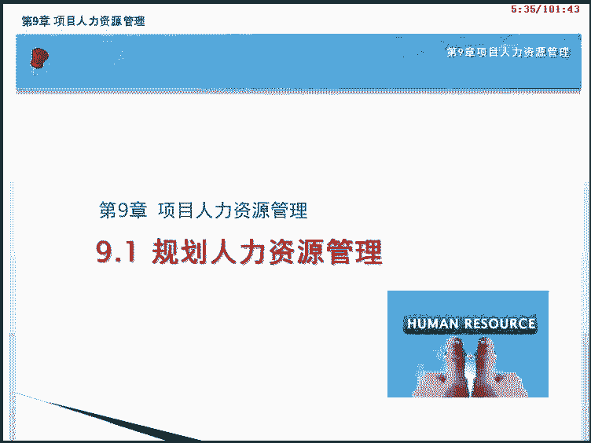

通过本课程的学习，我们将要达到以下目标。包括。了解规划人力资源管理的意义及方法。了解活动资源需求、事业环境因素及组织过程、资产与规划人力资源管理的关系。掌握组织图与职位描述的几种形式。

掌握人际交往及组织理论的含义和内容。掌握角色和职责项目组织图及人员配备管理计划的含义和内容。本课程我们将按照如画面所示的大纲为您讲述。首先是对规划人力资源管理过程的基本含义进行讲解。

接下来分析规划人力资源管理过程的输入、工具和技术以及输出。课程的最后是本章核心知识整理。

我们先来了解一个基本概念，规划人力资源管理的过程。规划人力资源管理是识别和记录项目角色职责、所需技能、报告关系，并编制人员配备管理计划的过程。本过程的主要作用是建立项目角色与职责、项目组织图。

以及包含人员招募和遣散时间表的人员配备管理计划。规划人力资源管理过程属于规划过程组，是建设和管理项目团队的基础。通常在项目早期就已经开始。例如，某公司要新建一栋大楼，需要在项目初期确定项目所需的角色。

包括项目经理、项目副经理、技术负责人以及设计、采购和质量等相关职能负责人等。除角色外，项目还要进一步确定角色承担的责任，需要的技能以及他们之间的关系。之后，在此基础上，编制人员配备管理计划。

完成人力资源计划的制定后，即可以以此为依据进行人员的招募和分派。可以说，规划人力资源管理是项目人力资源管理的基础。只有制定好人力资源管理计划才能够进行下面的组建建设和管理项目团队工作。PMI认为。

规划人力资源管理主要有三方面的内容。第一。😊，项目角色与职责的记录。第二，项目组织机构图。第三，包括人员招募和遣散时间表的人员配备管理计划。在制定项目人力资源计划时。

应该特别关注稀缺或有限人力资源的可得性或者其他项目对这些资源的竞争。

另外。还需要考虑那些可能对项目成本进度、风险、质量以及其他方面有显著影响的因素。因为这些因素会影响项目目标的实现，因此需要编制人力资源配备的备选计划方案。项目人力资源计划的制定至关重要。

他将对制定项目管理计划以及估算成本有直接影响。接下来让我们来看看人力资源管理计划是如何被制定出来的。规划人力资源管理就是依据项目管理计划中已有的子计划，结合活动资源需求，使用专家判断和其他组织理论。

得到最终的子计划人力资源管理计划。这是规划人力资源管理过程的数据流向图。我们可以看到，该过程通过输入输出与其他过程进行交互。

规划人力资源管理过程共有4个输入，分别是项目管理计划、活动、资源需求、事业环境因素和组织过程资产。下面我们依次来了解他们。

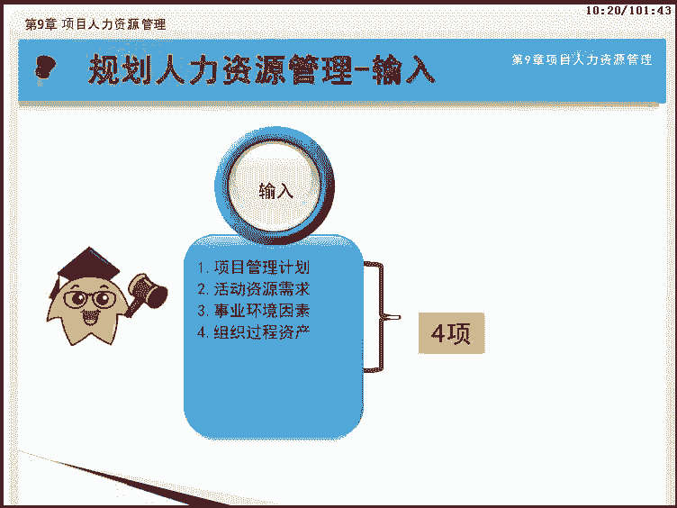

首先是项目管理计划。在制定人力资源管理计划时，需要考虑整个项目已有的项目管理以及子计划有用的信息包括。项目生命周期和你用于每个阶段的过程。为完成项目目标，如何执行各项工作？

变更管理计划规定了如何监控变更。配置管理计划规定了如何开展配置管理工作。还有如何维持项目基准的完整性，以及干系人之间的沟通需求和方法。进行人力资源规划。首先需要根据活动资源需求来确定项目所需的人力资源。

当然，这些人力资源特别是项目团队成员及其能力的需求，是渐近明细的。活动资源需求来自估算活动资源过程，及先识别出每项活动所需的资源类型和数量，然后再考虑具体的人力资源需求。

能够影响规划人力资源管理过程的事业环境因素。包括。组织文化与结构。现有人力资源情况。团队成员的地理位置分布。人事管理政策以及市场条件。

还有能够影响规划人力资源管理过程的组织过程资产。包括。组织的标准流程、政策和角色描述。组织图和职位描述模板。以往项目中与组织结构有关的经验教训。团队和执行组织内用于解决问题的升级程序。

我们来看规划人力资源管理过程的5个工具和技术，他们是。组织图和职位描述，人际交往、组织理论、专家判断以及会议。接下来我们一块来学习。

作为规划人力资源管理过程中最重要的工具与技术组织图与职位描述，可采用多种格式来记录团队成员的角色与职责。目的是确保每个工作包都有明确的责任人，确保全体团队成员都清楚的理解其角色和职责。

接下来我们来学习组织图与职位描述方法。图中展示的是最常见的记录角色和职责的三种格式，及层级型、矩阵型和文本型。下面我们将对这三种格式一一进行讲解。

传统的组织结构图就是一种典型的层次结构图。它用图形的形式从上至下的描述团队中的角色和关系。常见的层级型组织图可以通过组织分解结构OBS来完成。即按照组织现有的部门。单元或团队排列如图所示。

项目部下面分为研发部和质量管理部，其中研发部负责搭建系统。又分为需求组和程序组。质量管理部负责质量管理又分为质保组和测试组。这种层级型的组织结构图简单易懂，非常明确的展现了各部门之间的汇报关系。

得到广泛使用。看到组织分解结构OBS的表现形式，你能否想起项目中还有类似的图形吗？是的，工作分解结构WBS和资源分解结构RBS的展现方式与OBS类似，它们都是层级型的分解结构图。下面我们对他们做个对比。

这几种分解结构都用层级型图形进行展示。工作分解结构WBS以可交付成果为导向，把项目可交付成果及其工作层层分解，直至分解为工作包。资源分解结构RBS是按照资源类别，把项目中所需的资源划分成层级结构图。

组织分解结构OBS是按照组织现有的部门、单元或团队排列进行层层分级，展现了各部门的隶属关系。实际上，在后面介绍风险管理的时候，我们也可以把项目中的风险按类别画成类似的结构图，叫做风险分解结构。

简称也是RBS。其中，资源分解结构对追踪项目成本很有用，并与项目所在组织的会计系统对接。下面我们将举例说明这几种层级图的内容与关系。

图中展示的是某人力资源管理软件开发项目的组织分解结构图OBS和工作分解结构图WBS以及他们之间的关系。两张图交叉中的黑色原点代表OBS中各部门或工作组需承担的项目职责。在WBS中相对应的位置。

由此可以看出，OBS是按照组织现有部门和团队进行划分的。而WBS是按照项目可交付成果的分解进行的。两者的结合，可以将项目活动和工作包等列在各部门下。这样一个部门只需要找到其所在组织分解结构中的位置。

就可以了解他应该承担的所有项目职责。图中这些黑点可以看成控制账户。

除了前面介绍的层级型组织图外，第二种组织图与职位描述是矩阵型。可以采用责任分配矩阵RAM来显示分配给每个工作包的项目资源，也就是显示工作包或活动与项目团队成员之间的联系。

责任分配矩阵RAM是最直观的方法。在大型项目中，RAM也可以分成多个层级。

这个表格展现的就是责任分配矩阵。表格的每一列代表具体的人员或小组表格的每一行代表一项任务或职责。从这个责任分配举阵，也可以清楚的看到每个人在项目中的责任。比如需求调研这项任务是由王工负责的。

理工需要参与评审。我们也可以看到，理工不但要参与需求调研的评审，还要同时负责需求分析及测试两项工作。责任分配矩阵RAM的一个例子是RAACI矩阵或成RAACI图。如图所示。

最左边的一个列表示有待完成的工作或活动。可以针对个人或小组分配工作。其中，R执行表示，该工作由其具体执行。A负责表示，该工作需由其批准。C咨询表示，拥有相关信息，I知情表示其对该工作有知情权。

但并不需要征询他的意见。

RACI举证中需要注意，要确保任何一项任务都只有一个人负责。另外，值得注意的是，组织分解结构OBS与责任分配矩阵RAM或RAACI矩阵的区别在于。OBS反映部门与工作计划活动的联系。

而RAM或RAACI反映工作与项目组或项目团队成员的联系。

职位描述的最后一种表现形式是最简单的文本性描述。他用文字形式对团队成员职责进行描述，通常提供如下的信息、职责、权利、能力和资格等。

画面中展示的事例是架构设计师的文本型职为描述。除了组织图与职位描述以外，规划人力资源管理的工具和技术中，还包括人际交往和组织理论。人际交往是指在组织行业或职业环境中与他人的正式或非正式互动。

开始了解项目中政治与人际因素的有益途径。人际交往活动包括主动写信、午餐会、非正式对话，如会议和活动、贸易洽谈会和座谈会等。人际交往在项目初始时特别有用。

并可在项目期间以及项目结束后有效促进项目管理职业的发展。这类似于我们中国人说的关系。组织是由两个以上的人组成的，为实现共同目标，以一定形式加以编制的集合体。组织理论是阐述个人团队和组织部门的行为方式。

有效利用组织理论，可以缩减编制人力资源计划的时间、成本及人力投入，并提高规划工作的效率。

在制定人力资源管理计划时，专家判断被用于下列情况。列出对人力资源的初步要求。根据组织的标准化角色描述，分析项目所需的角色。确定项目所需的初步投入水平和资源数量。根据组织文化确定所需的报告关系。

根据经验教训和市场条件，指导提前配备人员。识别与人员招募、游泳和遣散有关的风险。为遵守适用的政府法规和公会合同制定并推荐工作程序。在规划项目人力资源管理时，项目管理团队将会举行规划会议。在这些会议中。

应该综合使用其他工具和技术。使所有项目管理团队成员对人力资源管理计划达成共识。规划项目人力资源管理过程只有一个输出是人力资源管理计划。下面我们一块来了解。

作为项目管理计划的一部分，人力资源管理计划提供了关于如何定义配备管理及最终遣散项目人力资源的指南。通过人力资源的合理配置，可以提高人力资源利用效率，增强人力资源优势，提高项目成功几率。

人力资源管理计划中包含三方面的内容，分别是角色和职责、项目组织图及人员配备管理计划。角色和职责中的角色描述了未完成项目所需的职责划分。职群。是指使用项目资源做出决策和批准的权利。职责是指为了完成项目。

要求项目团队成员执行工作。能力是完成项目活动所需要的技能。项目组织图以图形表示项目汇报关系。人员配备管理计划是人力资源计划的子计划，内容会在后面详细讲解。

这张图罗列了项目经理的角色与职责。我们看到项目经理是整个项目的团队领导，他担负着整个项目的主要责任。项目经理在大项目中是作为整合者出现的，而整合是通过沟通实现的。项目经理对项目的成功负责。

但不对质量负全部责任。因为项目经理并不能掌控所有资源。接下来看项目组织图。项目组织图以图形方式展现项目团队成员及其报告关系。基于项目的需要，项目组织图可以是正式或非正式的，非常详细或高度概括的。

1个3000人的建筑工程项目的组织图，自然要比仅有20人的房地产项目组织图详近的多。

人力资源管理计划的最后一项内容是人员配备管理计划，它包含7个方面的内容，分别是人员招募、资源日历、人员遣散计划、培训需要认可与奖励、合规性、安全。其中值得我们重点注意的是人员遣散计划。

在人员配备管理计划中，还有一个更小的子计划及人员遣散计划。事先制定人员遣散的方法和时间，从而让项目团队成员提前知晓的重要性在于。一旦把团队成员从项目中遣散出去，项目就不再负担与这些成员相关的成本。

从而节约项目成本。如果已经为员工安排好向新项目的平滑过渡，则可以提高士气。人员遣散计划也有助于减轻项目过程中或项目结束时可能发生的人力资源风险。人力资源直方图也称人力资源柱状图。

是人员配备管理计划的一部分。人力资源直方图显示，在整个项目期间，每周或每月需要某人、某部门或整个项目团队的工作小时数。图中展现的是项目对高级设计师这种资源的需求直肪图。横坐标表示。

时间一般以周或月为刻度，纵坐标表示，每个时间刻度上需要该类资源的工作时间，可以是小时天等。可在资源置方图中画一条水平线，代表某特定资源最多可用的小时数。如果柱型超过该水平线，就表明需要采用资源平衡策略。

如增加资源或修改进度计划的。

我们需要区分资源日历和资源直方图这两个概念。资源日历强调的是资源可用于项目的时间是客观情况。而资源直方图强调的是资源在某时间需要工作的小时数，更多反映主观安排和需要，对此需要加以区分。

现在我们来回顾一下本过程的核心知识。项目管理团队是项目团队的一部分，负责项目管理和领导活动。规划人力资源管理是识别和记录项目角色、职责所需技能、报告关系，并编制人员配备管理计划的过程。

组织图与职位描述有三种格式，及层级型、矩阵型和文本型。

责任分配举阵RAM用来显示分配给每个工作包的项目资源。人力资源管理计划提供了关于如何定义配备管理及最终潜在项目人力资源的指南。人员配备管理计划是人力资源管理计划的组成部分。

说明将在何时以何种方式获得项目团队成员，以及他们需要在项目中工作多久。恭喜你完成规划人力资源管理过程的学习，我们下节课见。本课程我们将一起学习第九章项目人力资源管理知识领域的第二节，组建项目团队。

它位于执行过程组。

通过本课程的学习，我们将要达到以下目标，包括。了解组建项目团队过程的输入内容。掌握预分派、谈判和招募的含义和方法。掌握虚拟团队的概念和意义。了解组建项目团队输出包含的主要内容。

理解组建项目团队所涉及的PMI思维。

本课程我们将按照如画面所示的大纲为您讲述。首先是对组建项目团队这个基本概念进行讲解。接下来分析组建项目团队过程的输入、工具和技术以及输出。

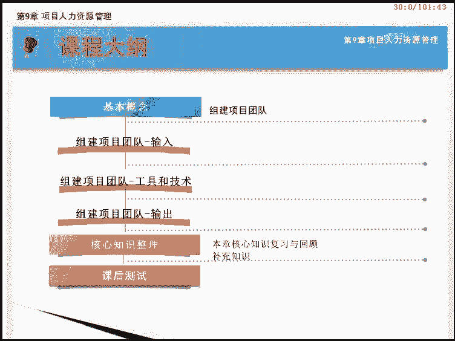

课程的最后是本节核心知识整理。在学习本过程之前，我们先来看看什么是组建项目团队。组建项目团队是确认人力资源的可用情况，并未开展项目活动而组建团队的过程。

本过程的主要作用是指导团队选择和职责分配，组建一个成功的团队。项目经理或项目管理团队应该在项目进度计划、项目预算、项目风险计划、项目质量计划、培训计划以及其他相关计划中说明缺少所需人力资源的后果。

接下来让我们来看看如何组建项目团队。该过程在人力资源管理计划的指导下，考虑与人力资源相关的事业环境因素和组织过程资产，采用预分派、谈判、招募、虚拟团队等技术，从各种渠道。

把成员召集到项目中来形成项目团队，最终确定了人员分配情况，并把每个人可以在项目上工作的时间记录到资源日历中。这是组建项目团队过程的数据流向图。可以看到，该过程通过输入输出与其他过程进行交互。

组建项目团队过程共有3个输入，分别是人力资源管理计划、事业环境因素和组织过程资产。下面我们依次来了解他们吧。

组建项目团队时，应该参考人力资源管理计划。人力资源管理计划提供了如何定义配备管理和最终遣散人力资源的指南，它包括如下信息。角色与职责。这定义项目所需的岗位、技能和能力。项目组织图说明项目所需的人员数量。

人员配备管理计划。说明需要每个团队成员的时间段，以及有助于项目团队参与的其他重要信息。组建项目团队时，应该了解现有人力资源情况和企业人事管理政策。可能影响组建项目团队过程的事业环境因素。

包括现有人力资源情况，比如可用性性能水平，以往经验对本项目工作的兴趣和成本费率等。还有人事管理政策，如影响外包的政策。组织结构也需要了解，另外是集中办公或多个工作地点的信息，也在事业环境因素中体现。

组建项目团队时，还应考虑组织的标准政策、流程和程序，这些属于组织过程资产的范畴。

组建项目团队过程的5个工具和技术，分别是预分派、谈判、招募、虚拟团队和多标准决策分析。下面我们一块来学习。

一般来讲，项目团队的成员由项目经理和项目管理团队选定。但有些情况下，项目团队成员是事先选定的这就是预分派。预分派多用于组织内部人力资源的获取或者某个特殊人员的考虑。御分派可在下列情况下发生。

在竞标过程中，承诺分派特定人员进行项目工作。例如，某软件开发项目在招标文件中承诺中标后，将派遣组织内部一位资深程序员担任软件调试工作。项目取决于特定人员的专有技能，特别稀缺的人力资源。

必须在项目启动之前进行预约。例如，在一些新产品的研发项目中，需事先预约该领域顶尖的研究人员参与项目。如不能获得这些人员，项目将受到严重影响，甚至导致取消项目。

或者项目章程中指定了某些人员的工作分派，这些都属于预分派的情况。谈判是一种软技能，项目经理通常不直接掌握组织的人力资源。在许多情况下，需要通过谈判完成人员分派。

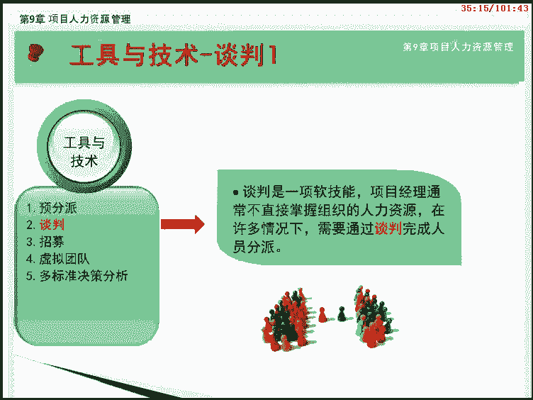

在组建项目团队过程中，项目管理团队需要由下列各方进行谈判。职能经理。确保项目能够在需要时获得具备适当能力的人员，确保项目团队成员能够愿意，并且有权在项目上工作，直到完成其职责。

执行组织中的其他项目管理团队。合理分配稀缺或特殊人力资源。外部组织、卖方、供应商、承包商等获取合适的、稀缺的特殊的、合格的，经认证的或其他诸如此类的特殊人力资源。

特别需要注意与外部谈判有关的政策、惯例、流程、指南、法律以及其他标准。在人员分配谈判中，项目管理团队影响他人的能力很重要，如同在组织中的政治能力一样重要。例如，职能经理在决定把杰出人才分配给哪个项目时。

将会权衡各竞争项目的优势和知名度。

如果执行组织不能提供未完成项目所需的人员，就需要从外部获得所需的服务。这可能包括雇佣独立咨询师或把相关工作分包给其他组织。

组建项目团队的工具与技术中，还有一项是虚拟团队。虚拟团队的使用为招募项目团队成员提供了新的可能。虚拟团队可定义为具有共同目标，在完成角色任务的过程中，很少或没有时间面对面工作的一群人。

现代沟通技术如电子邮件、电话会议、社交、媒体、网络会议和视频会议等，使虚拟团队成为可行。虚拟团队模式使人们有可能进行下列活动。在组织内部地处不同地理位置的员工之间组建团队。为项目团队增加特殊技能。

即使相应的专家不在同一地理区域。将在家办公的员工纳入团队。

在工作班次、工作小时或工作日，不同的员工之间组建团队。将行动不便者或残疾人纳入团队。执行那些原本会因差旅费用过高而被否决的项目。当然，虚拟团队也有一些缺点，例如沟通困难可能产生误解。距离远，有孤立感。

团队成员之间难以分享知识和经验。可能引起通信技术的成本。

为了避免上述缺点，在虚拟团队的环境中要更加重视规划沟通工作，可能需要花更多时间来设定明确的期望，促进沟通，制定冲突解决方法，召集人员参与决策，理解文化差异，以及共享成功喜悦。在组建项目团队过程中。

经常需要使用团队成员选择标准。通过多标准决策分析制定出选择标准，并据此对候选团队成员进行定级或打分。根据各种因素，对团队的不同重要性，赋予选择标准不同的权重。

比如。可用下列标准对团队成员进行打分。可用性。团队成员能否在项目所需时段内为项目工作，在项目期间内是否存在影响可用性的因素？成本。只聘用团队成员所需的成本是否在规定的预算内。经验。

是团队成员是否具备项目所需的相关经验。能力。团队成员是否具备项目所需的能力？知识。团队成员是否掌握关于客户类似项目和项目环境细节的相关知识？技能。团队成员是否具有相关的技能来使用项目工具。

开展项目执行或培训。态度团队成员能否与他人协同工作，以形成有凝聚力的团体。国际因素、团队成员的位置、时区和沟通能力等。组建项目团队这个过程共有3个输出。分别是项目人员分配、资源日历和项目管理计划更新。

下面我们一块来学习。

项目人员分配就是通过把合适的人员分配到团队来为项目配备人员。与项目人员分派相应的文件，包括项目团队名录和至团队成员的备忘录。还需要把人员姓名插入项目管理计划的其他部分，如项目组织图和进度计划等。

完成项目人员分配是建设和管理项目的先决条件。所以项目人员分配也是人力资源管理下面两个过程的输入。必须很好的了解每个人的可用性和时间限制，包括时区工作时间、休假时间、当地节假日和在其他项目的工作时间等。

这样才能编制出可靠的进度计划。资源日历记录每个项目团队成员在项目上的工作时间段。

最后，本过程还将更新项目管理计划。此处的项目管理计划特指其中的人力资源管理计划。例如，承担某个角色的人员未达到人力资源管理计划所规定的全部要求，就需要更新项目管理计划。

对团队结构、人员角色或职责进行变更。

现在我们来回顾一下本过程的核心知识。组建项目团队是确认人力资源的可用情况，并为开展项目活动而组建团队的过程。预分派指项目团队成员事先选定多用于组织内部人力资源的获取或考虑特殊人员。

项目经理需要通过谈判完成人员分配。

招募只从执行组织外部获得所需的人员或服务。虚拟团队可定义为具有共同目标，在完成角色任务的过程中，很少或没有时间面对面工作的一群人。项目人员分派是建设和管理项目团队的先决条件。

恭喜你完成组建项目团队过程的学习，我们下节课见。本课程我们将一起学习第九章项目人力资源管理知识领域的第三节建设项目团队。他位于执行过程组。

通过本课程的学习，我们将要达到以下目标。包括。了解建设项目团队的目标。了解建设项目团队的输入内容。了解项目经理应该具备的人际关系技能。了解培训的含义与方法。掌握团队建设的意义及团队建设需经历的5个阶段。

了解基本规则与集中办公的含义。掌握认可与奖励的意义及激励理论。掌握团队绩效主要评价标准和需要更新的事业环境因素内容。本课程我们将按照如画面所示的大纲为您讲述。首先是对建设项目团队这个基本概念进行讲解。

接下来分析建设项目团队过程的输入、工具和技术以及输出。课程的最后是本节核心知识整理。

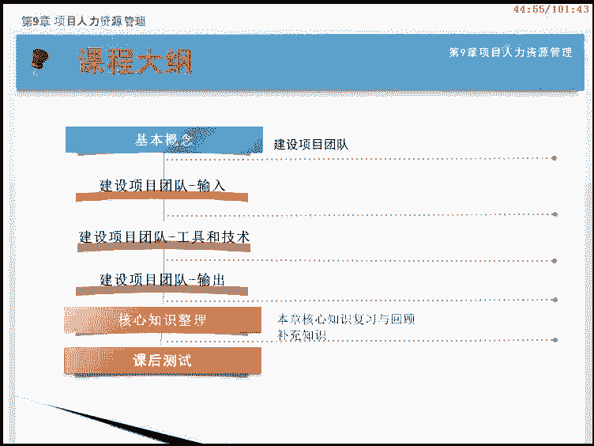

在学习本过程之前，我们先来看看什么是建设项目团队。建设项目团队是提高工作能力，促进团队成员互动，改善团队整体氛围，以提高项目绩效的过程。本过程的主要作用是改进团队协作，增强人际技能，激励团队成员。

降低人员离职率，提升整体项目绩效。团队协作是项目成功的关键因素，而建设高校的项目团队是项目经理的主要职责之一。建设项目团队的目标包括。提高团队成员的知识和技能，以提高他们完成项目交付成果的能力。

并降低成本，缩短工期和提高质量。提高团队成员之间的信任和认同感，以提高士气，减少冲突和促进团队协作。

创建富有生气、凝聚力和协作性的团队文化，以便提高个人和团队生产率，振奋团队精神，促进团队合作，并且促进团队成员之间的交叉培训和辅导，以分享知识和经验。项目经理在全球化环境和富有文化多样性的项目中工作。

团队成员经常来自不同的行业，讲不同的话语，有时甚至会在工作中使用一种特别的团队语言，而不是使用他们的母语。项目管理团队应该利用文化差异，在整个项目生命周期中致力于发展和维护项目团队。

并促进在相互信任的氛围中充分协作。

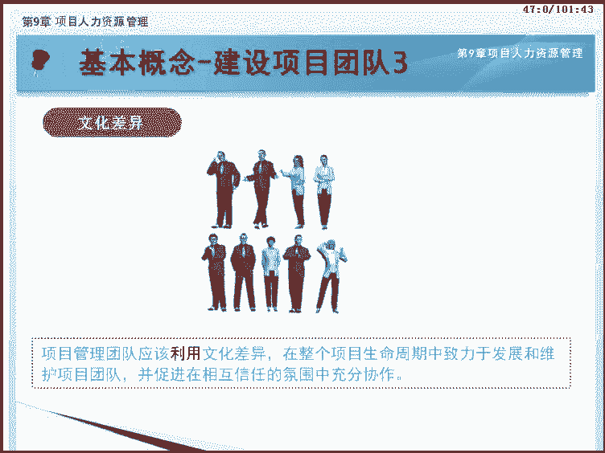

接下来让我们来看看如何建设项目团队。该过程在人力资源管理计划的指导下，参考项目人员分配和人员资源日历，通过人际关系技能、培训、团队建设活动等各种技术，改善团队氛围，以提高项目整体绩效。在这个过程中。

需要对团队绩效进行评价，以明确团队的现状。这是建设项目团队过程的数据流向图。可以看到，该过程通过输入输出与其他过程进行交互。

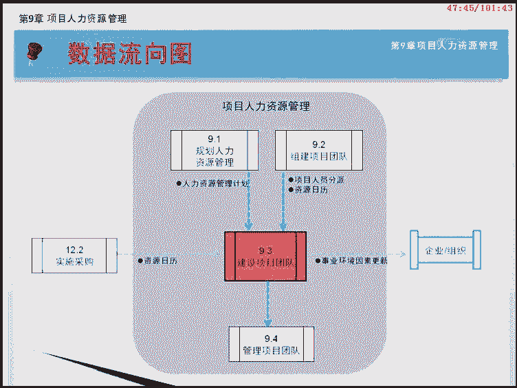

建设项目团队过程共有3个输入，他们是人力资源管理计划、项目人员分配和资源日历。接下来我们会依次来介绍。

我们知道人力资源管理计划提供了关于如何定义配备管理控制及最终遣散人力资源的指南。他确定了培训策略和团队建设计划。建设项目团队过程在人力资源管理计划的指导下展开工作。另外，在建设项目团队过程中。

通过持续的团队绩效评价和其他形式的团队管理活动，可以把奖励、反馈、附加培训及纪律惩罚等事项加入人力资源管理计划中。

项目人员分配和资源日历是组建项目团队的输出。要进行项目团队建设。首先要知道谁是团队成员，所以要从获得项目团队成员的名单开始。项目人员分派就是把合适的人员分配到位，完成项目人员配备的过程。

该过程在组建项目团队时完成，而资源日历定义了项目团队成员何时能参与团队建设活动。

建设项目团队过程有7个工具和技术，分别是人际关系技能、培训、团队建设活动、基本规则、集中办公认可与奖励以及人事测评工具。下面我们一块来学习。

人际关系技能有时也被称为软技能。对团队建设特别重要。通过了解项目团队成员的感情、预测及行动，了解其后顾之忧，并尽力帮助解决问题，可大大减少麻烦并促进合作。从第四版PM报开始，包括第五版PM报。

更加强调人际关系技能。这也是由于当今的项目中，团队成员有可能来自不同国家，拥有不同文化背景及语言，很难在项目初期对项目目标形成统一认识。要使团队成员良好合作，发挥其才能，达成项目目标。

项目经理必须有很强的人际关系能力，将项目团队整合起来。对很多较大的项目来说，项目经理的主要工作是组织项目团队和其他干系人共同完成项目，而不是自己解决技术问题。甚至可以说大一点的项目。

项目经理是组织专家做事的人，而不是自己亲手做事的人。这就要求项目经理不仅要拥有一定的专业水平，更重要的是要具有极强的人际关系能力。

新版PM报告的附录X3。概括性的讨论了项目经理应该具备的人际关系技能，包括领导力、激励、沟通、影响力、决策、政治和文化意识以及谈判等11项内容。由此可见，项目经理在项目管理中扮演的是整合者的角色。

培训包括旨在提高项目团队成员能力的全部活动。对项目团队成员进行针对项目的培训，是项目经理的重要工作。比如，项目经理获得了一个成员，但该人员加入项目团队后，发现自己并不具备从事本项工作的某些知识。这时。

项目经理首先想到的应该是对其进行针对项目的培训，而不是辞退该人员或者向管理层求助。人最宝贵的素质就是学习能力，人的大脑具有极强的咳塑性。

在项目中，有效的培训可以节省人力成本，提高团队的工作能力。对于项目来说，可降低人员流动性。对于项目团队成员来说，也是一次提高自己的好机会。培训可分为计划内与计划外两类。

计划内培训是按照人员配备管理计划中的培训计划进行。计划外部分要根据观察、交谈和项目绩效情况，发现有能力不足等情况时临时安排。从培训的方式上可分为正式培训和非正式培训两类。正式培训由专门的培训老师授课。

如课堂培训、在线培训、计算机辅助培训等。非正式培训为工作中的以老带新的学习方式。

除此之外。制定项目管理计划，建立WBS经验总结等活动，也具有团队建设的作用。值得注意的是。职能经理需要对员工的一般知识与技能进行培训。但针对本项目的培训，应当由项目经理负责。另外。

培训费用不论计划内还是计划外，一般都属于项目的直接成本，由项目承担。但如果涉及质量、采购等，本应由项目所在组织承担的工作，而组织无法提供，是由项目团队自己培养时，相关费用应由项目所在组织承担。

团队建设活动是用以提升人际关系，改善团队成员有效合作的活动。它既可以是状态审查会上的5分钟议程，也可以是为改善人际关系而设计的。在非工作场所专门举办的体验活动。正式的沟通固然重要，而非正式的沟通。

也有助于建立信任和良好的工作关系。团队建设活动的目的是帮助团队更加有效的协同工作。此外，如果团队成员的工作地点相隔甚远，无法进行面对面接触，就特别需要有效的团队建设策略。塔克曼认为。

团队发展通常要经过5个阶段，分别是。形成阶段。在本阶段，团队成员相互认识，并了解项目情况及他们在项目中的正式角色与职责。团队成员倾向于相互独立，不一定开诚布公。震荡阶段在本阶段，团队开始从事项目工作。

制定技术决策和讨论项目管理方法。如果团队成员不能用合作和开放的态度对待不同观点和意见，团队环境可能变得事与愿违。

规范阶段在规范阶段，团队成员开始协同工作，并调整各自的工作习惯和行为来支持团队。团队成员开始相互信任。成熟阶段进入这一阶段后，团队就像一个组织有序的单位来人工作。团队成员之间相互依靠。

平稳高效的解决问题。

解散阶段。在解散阶段，团队完成所有工作，团队成员离开项目。通常在项目可交付成果完成之后，再释放人员解散团队，或者在结束项目或阶段过程中解散团队。在项目团队建设中，5个阶段的特点如图所示。

从团队士气的角度看，第二个阶段震当阶段中冲突最多。此时，项目团队的士气最为低落。从规范阶段开始，湿气逐渐回升。从项目绩效角度看，在第四个阶段，也就是绩效阶段，团队整体效率最高。

基本规则对项目团队成员的可接受行为做出明确规定。尽早制定并遵守明确的规则，有助于减少误解，提高生产力。对诸如行为规范、沟通方式、协同工作、会议礼仪等的基本规则进行讨论。

有利于团队成员相互了解对方的价值观。

规则一旦建立，全体项目团队成员都必须遵守。集中办公是至把许多或全部最活跃的项目团队成员安排在同一物理地点工作，以增强团队工作能力。集中办公也被称为作战室或紧密矩阵。他既可以是临时的。

如仅在项目特别重要的时期。也可以贯穿整个项目。

另外，项目冲突是必然的，而面对面会议是与干系人讨论解决问题的最有效办法。然而，尽管集中办公是一种良好的团队建设策略，但虚拟团队的使用有时也不可避免。集中办公对应作战室和紧密矩阵概念，其极端形式是作战室。

下面我们来看认可与奖励。在团队建设过程中，需要对成员的优良行为给予认可和奖励。关于奖励方法的最初计划，是在规划人力资源管理过程中编制的。在管理项目团队的过程中。

通过项目绩效评价以正式或非正式的方式做出奖励决定。

必须认识到。只有能满足被奖励者的某个重要需求的奖励，才是有效的奖励。在决定认可与奖励时，还应考虑文化差异。下面我们来了解关于奖励的几点说明。通常，金钱奖励是奖励制度中最有型的奖励。然而。

也存在各种更有效的无形奖励。

大多数项目团队成员会因得到成长机会，获得成就感，以及用专业技能迎接新挑战而受到激励。项目经理应该在整个项目生命周期中尽可能的给予表彰，而不是等到项目结束之后。当人们感到自己在组织中的价值。

并且可以通过获得奖励来体现这种价值，他们就会受到激励。为此，我们应该掌握一些经典的激励理论。如图所示，马斯洛的需求层次理论认为，每个人从低到高的需求分为5个层次。

生理需求、安全需求、社会归属感、受尊重和自我实现。

其中层次最低的是生理需要，是维持人类生存所必需的身体需要，如属于食物等生存必需品。第二个层次是安全需要，保证身心免受伤害，包括居住环境安全、工作环境安全和有稳定的经济收入。第三个层次是社会归属感需要。

也称归属和爱的需要，包括感情归属、被接纳、友谊等需要。第四个层次是被尊重的需要。包括内在的尊重，如自尊心、自主权、成就感等需要和外在的尊重，如地位认同、受重视等需要。最高层次是自我实现的需要。

包括个人成长，发挥个人潜能，实现个人理想的需要。马斯洛需求层次的三个假设，A已被满足的需要失去激励作用，只有满足未被满足的需要才有激励作用。B。人的需要按重要性从低到高排成金字塔状。

C当人的某一级需要满足后，才会追求更高一级的需要。赫兹伯格发现使职工感到满意的都是属于工作本身或工作内容方面的。使职工感到不满意的，都是属于工作环境或工作关系方面的。他把前者叫做激励因素。

后者叫做保健因素。保健因素是指那些与人们的不满情绪有关的因素，包括公司政策、管理措施、监督、人际关系、物质工作条件、工资福利等。他只是消除了不满意，并不会导致积极的态度。保健因素的满足对员工产生的效果。

类似于卫生保健对身体健康所起的作用。当这些因素恶化到人们不可接受水平以下时，就会产生对工作的不满意。

激励因素是指那些能带来积极态度、满意和激励作用的因素，包括成就、赏识、挑战性的工作，增加的工作责任以及成长和发展的机会。如果这些因素具备了，就能对人们产生更大的激励。

激励因素是能满足个人自我实现需要的因素。从这个意义出发，赫兹波格认为，传统的激励假设，如工资刺激人际关系的改善，提供良好的工作条件等，都不会产生更大的激励，他们能消除不满意，防止产生问题。

但这些传统的激励因素即使达到最佳程度，也不会产生积极的激励。按照赫兹伯格的意见，管理者应该认识到，保健因素是必须的。不过他一旦是不满意，中合以后就不能产生更积极的效果。只有激励因素。

才能使人们有更好的工作成绩。麦克利兰认为，在人的生存需要基本得到满足的前提下，成就需要、权力需要和亲和需要是人的最主要的三种需要。该理论认为。有成就需要的人，对胜任和成功有强烈的要求，他们的事业心强。

喜欢那些能发挥独立解决问题能力的环境。在管理中，只要对他提供合适的环境，他就会充分发挥自己的能力。权力需要较强的人有责任感，愿意承担需要的竞争，并且能够取得较高的社会地位的工作，喜欢指挥和影响别人。

具有亲和需要的人，通常从友爱、情谊、人际关系的社会交往中得到欢乐和满足，并总是设法避免因某个组织或社会团体拒之门外而带来的痛苦。他们渴望获得他人赞同，高度服从群体规范、忠实、可靠。

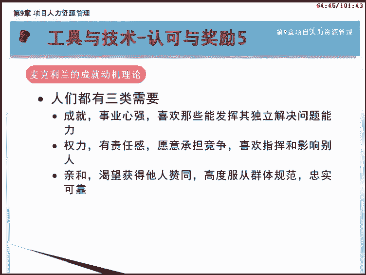

每个人对三类需求的急切程度不同。了解了成就动机理论，就可以根据人们不同的需要进行对应的激励。麦格雷格的X理论可以说是人性恶理论。该理论认为，对人来说，工作是不愉快的，人们缺乏进取心、懒惰而逃避责任。

因此要讲诚结合，适用于工人。而外理论是人性善理论，认为人对工作有可能产生兴趣，有自我约束及向上的趋势。并有能力和意向去解决问题。因此，要说服教育，用成就和责任来激励，适用于素质较高者。

建设项目团队的最后一个工具和技术是人事测评工具。他能让项目经理和项目团队洞察成员的优势和劣势。这些工具可帮助项目经理评估团队成员的偏好和愿望。团队成员如何处理和整理信息？团队成员如何制定决策。

以及团队成员喜欢如何与人打交道。人事测评工具包括。态度调查细节评估。结构化面谈能力测试及焦点小组讨论。这些工具有利于增进团队成员间的理解、信任、忠诚和沟通。在整个项目期间不断提高团队成效。

建设项目团队过程有两个输出，分别是团队绩效评价和事业环境因素更新。下面我们一块来学习。

随着项目团队建设工作的开展，项目管理团队应该对项目团队的有效性进行正式或非正式评价。团队绩效评价标准应由全体相关各方联合确定，并被整合到建设项目团队过程的输入中。以任务和结果为导向。

是高校团队的重要特征。

团队绩效主要评价标准为项目的技术成功度和是否达到目标。项目进度绩效是否按时完成和成本绩效及费用是否在约束内完成。评价团队有效性的指标还包括4个。个人技能的改进，团队能力的改进，团队成员离职率的降低。

还有团队凝聚力的加强。

通过对团队整体绩效的评价。项目管理团队能够识别出所需的特殊培训教练、辅导、协助或改变，以提高团队绩效。项目管理团队也应该识别出合适或所需的资源，以执行和实现在绩效评价过程中提出的改进建议。最后。

应该妥善记录这些团队改进建议和所需资源，并传达给相关方。

很少有过程会更新事业环境因素，本过程就是个例外。作为建设项目团队过程的结果，可能需要更新的事业环境因素。包括。人事管理制度、员工培训记录和技能评估。

现在我们来回顾一下本过程的核心知识。建设项目团队是提高工作能力，促进团队成员互动，改善团队整体氛围，以提高项目绩效的过程。项目管理团队应该利用文化差异，在整个项目生命周期中建设的项目团队。

团队建设中非正式的沟通，有助于建立信任和良好的工作关系。团队发展通常经过形成震荡、规范、成熟、解散5个阶段。尽早制定并遵守明确的规则，有助于减少误解，提高生产力。恭喜你完成建设项目团队过程的学习。

我们下节课见。本过程我们将一起学习第九章项目人力资源管理知识领域的第四节管理项目团队。它位于执行过程组。

通过本课程的学习，我们将要达到以下目标。了解管理项目团队的概念和目的。了解管理项目团队的输入及输出内容。了解观察与交谈问题日志的概念和意义。掌握项目绩效评估的内容和意义。掌握5种冲突解决方法。

掌握常用的几种人际关系技能。

本课程我们将按照如画面所示的大纲为您讲述。首先是对管理项目团队这个基本概念进行讲解。接下来分析管理项目团队过程的收入、工具与技术以及输出。课程的最后是本节核心知识整理。

在学习本过程之前，我们先来看看什么是管理项目团队。管理项目团队是跟踪团队成员工作表现，提供反馈，解决问题，并管理团队变更，以优化项目绩效的过程。

本过程的主要作用是影响团队行为管理冲突、解决问题，并评估团队成员的绩效。管理项目团队所得到的结果，包括提出变更请求，更新人力资源管理计划，解决问题，为绩效评估提供输入。以及为组织数据库增加经验教训。

接下来让我们来看看如何管理项目团队。该过程在人力资源管理计划的指导下，收集团队绩效评价和工作绩效报告等信息。利用观察和交谈、项目绩效评估以及人际关系技能等技术，跟踪团队成员表现，提出反馈意见。

如果在此过程中发生冲突，要及时采取解决措施。该过程可能会引起与人员配备相关的变更请求，以及对人力资源管理计划、项目文件，甚至是事业环境因素的更新。这是管理项目团队过程的数据流向图。可以看到。

该过程通过输入输出与其他过程进行交互。

管理项目团队过程共有6个输入，他们是人力资源管理计划、项目人员分派、团队绩效评价、问题日志、工作绩效报告和组织过程资产。下面我们依次来了解。

管理项目团队过程在人力资源管理计划的指导下展开工作。该计划提供了如何定义配备管理控制及最终遣散项目人力资源的指南，它包括角色与职责、项目组织和人员配备管理计划。项目人员分派是组建项目团队过程的输出。

其中列出了项目团队成员。

团队绩效评价来自于建设项目团队过程。项目管理团队应该持续的对项目团队绩效进行正式或非正式评价。不断的评价项目团队绩效，有助于采取措施解决问题，调整沟通方式，解决冲突和改进团队互动。在管理项目团队过程中。

总会出现各种问题。可以用问题日志记录，由谁负责在目标日期内解决特定问题，并监督解决情况。问题日志是非常重要的一类项目文件。我们要牢记这个概念。

图中所示就是一个问题日志的事例。我们看到其中记录了问题描述、提出时间、责任人、预计解决时间、问题状态等信息。在第十三章控制干系人参与过程还会用到问题日志。工作绩效报告来自于监控项目工作过程。

能够提供当前项目状态与预期项目状态的比较，从进度控制、成本控制、质量控制和范围确认中得到的结果，有助于项目团队管理。

绩效报告和相关预测报告中的信息，有助于确定未来的人力资源需求，开展认可与奖励以及更新人员配备管理计划。能够影响管理项目团队过程的组织过程资产。包括。嘉奖证书、新闻报道网站。奖金结构，公司制服。

组织中其他的额外待遇等。

管理项目团队过程共有4个工具和技术，分别是观察和交谈、项目绩效评估、冲突管理以及人际关系技能。下面我们一块来学习。

项目管理团队可通过观察和交谈，随时了解项目团队成员的工作和态度。项目管理团队应该监督项目可交付成果的进展，了解团队成员引以为荣的成就，了解各种人际关系问题。

项目绩效评估及评估项目团队成员在项目期间的绩效。

其目的包括澄清角色与职责，向团队成员提供建设性反馈。发现未知或未觉问题，制定个人培训计划，以及确立未来各时期的具体目标。项目绩效评估取决于项目工期长短。

项目复杂程度、组织政策、劳动合同要求以及所需定期沟通的数量和质量等因素。可以开展正式或非正式的项目绩效评估。项目绩效评估在名称上与团队绩效评价较为相似，容易被混为一谈。然而，两者有着本质的区别。

团队绩效评价是针对项目团队的绩效情况的评价。

而项目绩效评估是针对团队成员个人在项目期间的绩效表现的评估。评估该团队成员是否适合其承担的项目工作。值得注意的是，项目绩效评估之所以不称之为项目成员绩效评估，是因为在矩阵型组织机构中。

团队成员可能身兼数个项目。

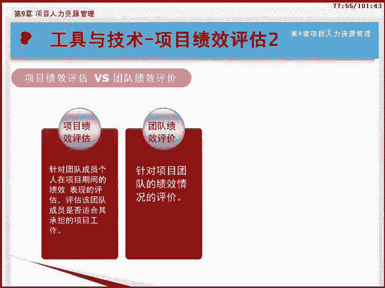

不过。项目经理只需了解并评估团队成员在本项目中的绩效。团队成员的总体绩效评价，尤其所在部门的职能经理评价。冲突管理是指处理或解决项目中某些关系难以协调而导致的矛盾激化和行为对抗。

冲突不可避免。现代的项目管理观点认为，冲突不可避免，适当的冲突是有益的，有利于提高团队创造力。成功的冲突管理可提高生产力，改进工作关系，提高项目实施水平。另外，冲突因团队而存在。开诚布公。

有利于解决冲突。解决冲突应对事不对人。解决冲突应着眼于现在，而非过去。项目中冲突难以避免冲突产生的来源，包括对稀缺资源的增抢、高压力的项目环境，责任模糊，存在多个上级、新技术的应用等诸多方面。概括起来。

可以把冲突分为如下7种类型。进度及进度计划冲突，指项目任务的进度安排、任务的排序和时间选择存在不同意见。项目优先级。这项目干系人在活动的优先顺序上有不同意见。资源起因是资源匮乏。

包括设备、材料、人力资源的不足导致的冲突。技术这技术意见与执行情况的权衡冲突，在技术问题上的争执，以及在观念与执行之间进行权衡上存在不一致意见。管理程序。这行政程序上的冲突。

在如何管理项目的问题上发生的项目管理和行政管理程序之间的冲突？成本。在涉及到工作分解结构上，来自相关部门的成本估算上的冲突。

个性。指个人工作风格或个性冲突来自于人际关系方面。在项目的各个阶段，任务不同，人们关注的重点也不同。项目的不同阶段常常出现的冲突也有所不同。一般来说。

概念阶段或启动阶段冲突出现频率的排序为工作优先级冲突、管理程序冲突和进度冲突。当项目进行到计划阶段时，冲突排序为工作优先级冲突、进度冲突和管理程序冲突。在执行阶段。

冲突排序为进度冲突、技术冲突和资源冲突。在最后的收尾阶段。冲突排序为进度冲突、资源冲突和个性冲突。

冲突有正面的和负面的。负面冲突会对整个项目产生消极影响，甚至阻碍项目目标的实现。项目经理必须尽量在冲突对项目产生不利影响之前解决。项目经理分析冲突原因和解决冲突的能力。

在很大程度上决定着其管理项目团队的能力。不同的项目经理可能有不同的解决冲突的风格。影响冲突解决方法的因素包括。冲突的重要性与激烈程度。解决冲突的紧迫性。冲突各方的立场，以及永久或暂时解决冲突的动机。

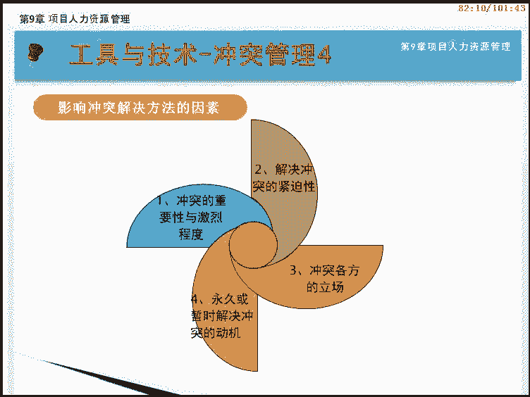

解决冲突是项目经理面临的最大问题。不能逃避问题，必须以主动的态度去发现和处理问题。出现冲突，最好在项目经理的帮助下，由项目团队成员自行解决。如果冲突依旧存在，影响了整个团队，则可在团队公开讨论解决方案。

最后方式才是上升给职能经理或高级经理协助解决。在破坏性冲突继续存在的情况下，还可以采取惩戒措施。

一般来讲，项目经理应遵循直接合作，尽早私下的八字方针管理冲突。解决冲突，可以使用下面的5种具体方法，我们需要理解并记忆。撤退回避是从实际或潜在冲突中退出，将问题推迟到准备充分的时候。

或者将问题推给其他人员解决。

缓和包容。是强调一致而非差异，为维持和谐的关系而退让一步，考虑其他方的需要，回避了解决冲突的根源。妥协调节。是为了暂时或部分解决冲突，寻找能让各方都在一定程度上满意的方案。

但冲突各方没有任何一方完全满意。强迫命令。以牺牲其他方为代价，推行某一方的观点，只提供赢输方案，通常是利用权力来强行解决紧急问题，适用于赢书这样的情景点。合作解决问题也正面对问题。

是综合考虑不同的观点和意见，采用合作的态度和开放式对话，引导各方达成共识和承诺。这是一种双赢或多赢的解决方案。我们最后再对5种冲突解决的方法进行一个小结。合作解决问题是双赢的解决方式。

一起面对并公开讨论，最终达成共识，这是最好的解决冲突的方式。强迫命令是一输一赢的解决方式。在紧急情况下必须做决定时才使用。问题虽然解决了，但可能引起一方的不满。妥协调节是双输的解决问题方式。

他平衡各方利益各有让步，但好处是问题解决了。缓解包容可以看成是求同存异。他强调一致而非差异，回避了冲突，缺点是问题没有解决。撤退回避是置退出冲突。推迟或推给他人。解决问题的条件不成熟时才使用。当然。

这种情况下，问题没有得到解决。项目经理应该综合运用技术、人际和概念技能来分析形式，并与团队成员有效互动。恰当的使用人际关系技能，可充分发挥全体团队成员的优势。具体内容请参见偏安报课第五版附录X3。

人际关系技能包含的内容很多，项目经理在管理项目团队中最常用的人际关系技能包括。领导力。引导力对沟通愿景以及鼓舞项目团队高效工作特别重要。领导力在项目生命周期中的所有阶段都很重要。影响力在矩阵环境中。

项目经理对团队成员往往没有或只有很小的直接权利。所以他们事实影响干系人的能力。

对，保证项目成功就非常关键。影响力主要体现在如下各方面。说服别人以及清晰表达观点和立场的能力。积极且有效的倾听。了解并综合考虑各种观点。收集相关且关键的信息，以解决重要问题，维护相互信任，达成一致意见。

有效决策包括谈判的能力，以及影响组织与项目管理团队的能力。进行有效决策需要着眼于所要达到的目标。遵循决策流程，研究环境因素。分析可用信息，提升团队成员个人素质。激发团队创造力。管理风险。除此而外。

沟通、谈判和激励等能力也是人际关系技能的重要组成部分。管理项目团队过程共有5个输出，他们是变更请求，项目管理计划更新、项目文件更新、事业环境因素更新以及组织过程资产更新。下面我们一块来学习。

人员配备的变化，无论是自主选择还是由不可控事件造成，都会影响项目管理计划的其他部分。人员配备问题可能导致的变更，包括转派人员、外包部分工作以及替换离职人员。

在管理项目团队过程，也可以采取预防措施来降低问题发生概率。包括。为减轻成员缺勤所带来的问题而开展的交叉培训。为确保所有职责的履行而进一步开展的角色澄清。需要注意，上述所有变更都要走整体变更控制流程。

项目管理计划中可能需要更新的内容主要是指人力资源管理计划。在管理项目团队过程可能被间接更新的项目文件，包括问题、日志、角色描述以及项目人员分派。

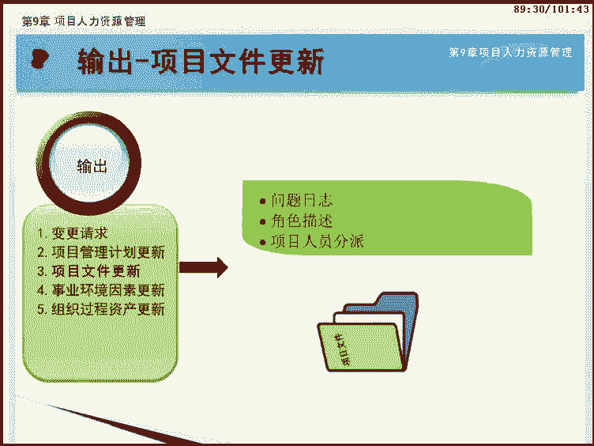

管理项目团队时也可能需要更新事应环境因素，包括。对组织绩效评价的输入和个人技能的更新。作为管理项目团队过程的结果，可能需要更新的组织过程资产。包括。历史信息和经验教训文档、相关模板组织的标准流程等。

本过程的主要内容到此完毕。现在我们来回顾一下本过程的核心知识。管理项目团队是跟踪团队成员工作表现，提供反馈，解决问题，并管理团队变更，以优化项目绩效的过程。用问题日志记录。

由谁负责在目标日期内解决特定问题，并监督解决情况。

项目绩效评估及评估项目团队成员在项目期间的绩效可以是正式或非正式的。项目中冲突不可避免，适当的冲突是有益的。冲突来源可分为7种进度、工作优先级、资源、技术、管理程序、成本和个性。项目经理应遵循直接合作。

尽早私下的八字方针管理冲突。恭喜你完成管理项目团队过程的学习。

下面我们来补充一个知识点，项目经理的5种权利。权利就是让员工不得不做事的潜在影响力。权力往往用来让员工改变他们的行为，而听从管理者的意愿。在项目团队建设的过程中。

项目经理一般可以利用某种权利来管理和要求项目团队的成员来完成工作。第一种法定权利也称合法权利。是指在高级管理层对项目经理的正式授权的基础上，项目经理让员工进行工作的权利。第二种。

强制力用惩罚威胁或者其他的消极手段强迫员工去做他们不想做的事。当然，一般强制力对项目团队的建设不是一个很好的方法，通常会带来项目的失败，建议不要经常使用。第三种。

奖励权利使用一些激励措施来引导员工去工作。奖励包括薪金、职位、认可度、特殊的任务以及其他的奖励员工满意行为的手段。专家权利。用个人知识和技能让员工改变他们的行为。

如果项目经理让员工感到他在某些领域有专长，那么他们就会遵照项目经理的意见形式。最后一种是参考权利，也叫感召权利。建立在别人的微信或个人感召权利的基础上。人们有时非常尊重某些具有感召权力的人。

他们会照他所说的去做。以上是项目经理的5个权利类型，其中前三种权利来自于项目经理的所在职位，其他两种来自于项目经理个人。建议项目经理最好用奖励权利和专家权利来影响团队去做事，尽量避免使用强制力。

各位学员，第九章项目人力资源管理知识领域的全部四个过程已经学习完毕，现在就来做个总结吧。首先，需要对如何进行人力资源管理进行规划。这个过程是规划人力资源管理。

他根据前期已经批准的项目管理子计划以及项目对人力资源的需求，生成项目人力资源管理计划。第二个过程，组建项目团队是依据刚才产生的人力资源管理计划，通过各种渠道和手段把团队成员召集到项目中来。

最后形成项目人员分配和资源日历。团队成员确定完成后，不一定会产生很好的工作效率，这就需要在项目的全生命周期进行建设项目团队过程，以改善团队整体氛围提高项目绩效。

建设项目团队的效果需要用团队绩效评价来衡量。管理项目团队是在项目执行过程中跟踪团队成员的工作表现，发现问题及时解决，并管理团队变更，以优化项目绩效的过程。在这个过程里，主要我们要了解如何解决冲突。

恭喜您已经完成了第九章项目人力资源管理这一知识领域的学习。建议接下来继续学习第十章项目沟通管理，我们下堂课见。

