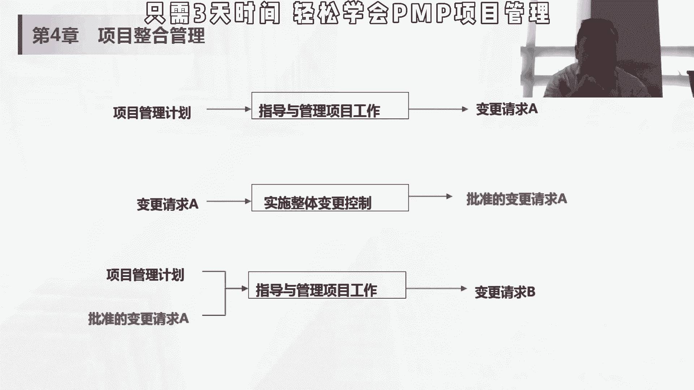

# PMP项目管理 小白入行  中文教程 PMP入门教程 学习视频 - P1 - PMP小雪球 - BV1cX4y1s7uC

所以呢它的输入是批准的，变更请求大下降，然后呢输出，是有一个输出是变更请求，这个变更请求的话，大家记一下这个知识点是会考的，并能请求是关于修改任何文档，可交付成果或基本的正式提议。

可以是直接或是间接由外部和内部体可以自选，会有法律合同强制规定的，可以口头提变更请求，可以由任何人来提，可以口头提，但是必须要书面记录，我们后面会讲变更日志，记录在变更日志里，变更日志是一个项目文件。

变更请请求分四种，第一个纠正措施，就凭他事后第二个预防措施，防风险是钱，第三个缺陷措施补质量，针对质量缺陷，第四个更新，通常改计划会修改计划和和基准，前三个的话是用来维护基准的，如果我发生了偏差。

我怎么去快速回到基准的这个正常轨道上来，我为了防止不发生偏差，我怎么事先做一些什么事情，能够保证我不发生这个偏差，我在基准范围内质量我怎么保证，我是在我的质量的基本范围内，举个例子。

嗯我们假设呃170公分，75kg是一个标准值，那纠正设施是啥，我现在已经78kg了，已经事后了，那我要想变成75kg，我怎么办，我要多加运动，就是为什么卖管住嘴，迈动腿对吧，这就是纠正措施，预防措施啥。

我现在是73，按照现在趋势，前天还72呢，再过两天我可能就75，我就冒了，那怎么办，那在没有变成75，没有破坏这个基线之前，我先运动运动，我先稍微管管这个管管嘴，少吃点对吧。

这是我们一个叫事前的这个补救措施，那缺陷补救说我虽然现在是1米7，我也是75kg，但是我现在这个给我检查出来，我血脂高，那这个时候你即便是说你在极限范围内，但是你的质量不对，你出现了相应问题。

这时候你也需要补治疗，也维护相应的极限对吧，这叫缺陷补救，但是如果更新唉，说最近那整个变了170公分的这个标准，体重是70km，你这时候还按照75kg去做纠正措施，预防措施，区间补救就完全不够了。

所以你要修改计划，修改计算，这个时候叫更新，所以大家可以想想这个减肥的例子哈，就可以只可以去问出纠正，纠正是事后就偏预防呢是防风险，是前提前补救呢是有了问题了，有了质量问题要进行补救，更新的话。

一般来说是更改计划或者说更改标准，前三个是维护计划和基准的，后面是要更改计划和基准，这是变更请求，在我们的项目里面，可能是说唉我现在已经超支10%了，我们的这个临界值是5%，那我怎么要恢复到55%以内。

我提供什么样的变更请求，这是事后，那之前我要，现在，我要实现刚才5%以内的这个成本控制，我在哪些地方要事前做，这叫预防，那这时候5%已经呃，或者说这时候出产生出缺陷了，我要不治疗。

但成本就有可能不存在个人讲的质量问题啊，然后这时候老板说不行，你现在5%不行了，你你的账户临界值应该在2%之间改基准，那我的计划也得改，所以会有这样的一些变更的这种情况，那输出刚才讲这一个是变更请求。

讲可交付成果，可交付成果的话是要求这个交互成果是可核实，独特并可核实可核实性，大家一定要记住，这个是有可能会考的，是不是区分交付成果的一个重要标准，然后呢工作绩效数据我们讲了观察到的原始值。

我某一个工作用了三天，我这个项目花了多少钱的一个原始值，问题日志，这也是一个项目文件，问题日志在日语项目中的应该叫课题管理表，用来记录在和跟进项目中，碰到这些问题，要实时的去监控，要有问题的描述。

责任人大概什么时候这个问题要解决，如果有新的问题的话，要不断的往上加，然后旧的问题要定期去check，确保这些问题在实现器械范围内，由责任来解决，这个问题的解，有的时候会问你啊。

如果发现一个什么问题怎么办，首先第一个记录的问题日志里面，第二个要进行跟踪check，确保它解决，这个也没有什么太大的这个考点，就是，然后呢在这个过程中，对项目这个指导和管理工作过程中，会用到一些pm。

通过授权系统这些东西，大家了解一下就行了，黑白是那个项目信息管理系统，比如说我们用的这个ms的这个microsoft project，类似这些东西，那会议啊，像我们也讲过一些会议啊。

这个是那个敏捷部分的，我们会在将scrm的时候就给大家讲，所以这个整合管理的这个指导与管理项目工作，大家记住什么是问题日志，问题日志是干嘛的，然后变更请求这四个种类，就基本可以了。

然后输入是批准的变更请求。

输出是变更请求。

4。34。44。4只是项目知识管理，项目知识管理是使用现有的知识并生成新知识，以实现项目标并帮助组织学习的过程，这里面大家了解什么呢，显性知识和隐性知识，显性知识呢可以使用文字。

图片或数字进行编撰的知识，比如说我们pm和这本书，然后呢，我们给大家现在讲的这个天赋和这个讲义对吧，这些东西都属于显性知识，缺乏情境可以做不同解读，一分享，却无法保证确保理解正确，正确理解和应用。

比如说这个pp和这本书或者这个讲义就发展，这让大家自己学，可能你每个人的理解是不一样的，但是我通过我给你讲一遍这个知识点，这句话到底是什么意思，然后呢他怎么去理解，就能够确保这个知识点不被这个。

你能够被正确地理解，同样一本书，不同的人看，可能大家的看法是不一样的，但是为什么我们要上这个直播课或者要刷题，就就是说最终要以偏僻或者pmbok的考点，知识点为考纲为为主要的这个依据。

然后正确的就按照他的方式去回答问题，然后隐性知识呢支持个体知识，以及难以明确表达的知识，无信念洞察力，经验和诀窍，虽蕴含情景，但很难编撰。

