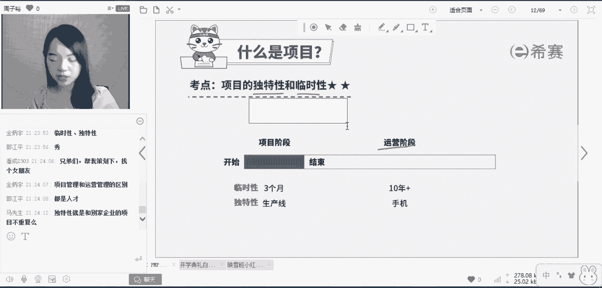
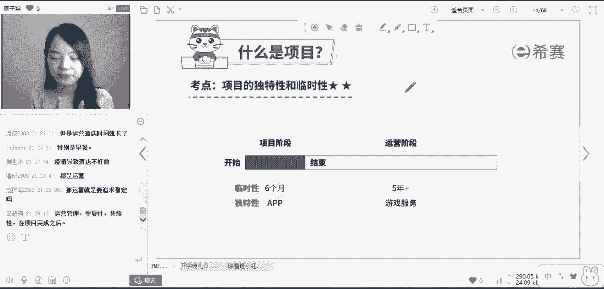
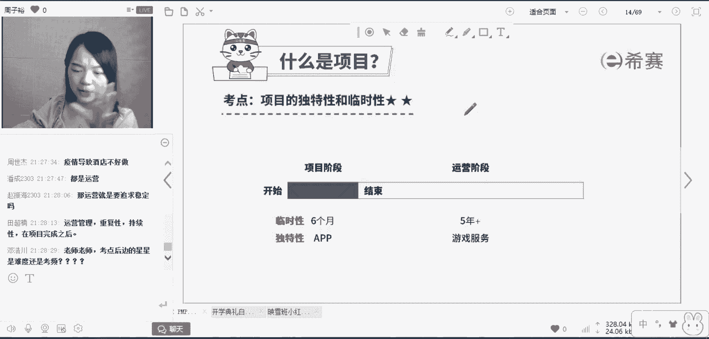
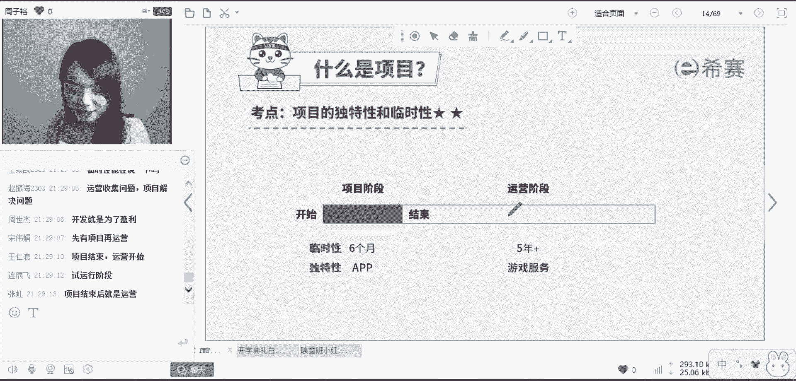

# PMP项目管理8节入门精讲课，免费观看 - P1：项目和运营的区别 - 冬x溪 - BV1rN41127Jw

看这个图啊，就很好地呈现了项目管理和运营管理的区别，来看一下项目。

它是具备独独特性和临时性的特点。

想一想啊，这个运营阶段它会有什么样的特点呢。

想一想刚刚好它会和项目的特点相反是什么呢。

独特性对应的是什么。

独特对应的是什么，就是重复。

不变临时性对应的是什么呀。

就是持续。

所以考试的时候极有可能给你情景，让你来判断它到底是运营阶段还是项目阶段。

你要能区分它们的特点，很好区分。

完全相反，就比如说生产手机这个事儿啊。

看PPT我生产一个手机的生产线，生产线。

你说苹果的这个呃工厂啊，他们造一个生产线可能只需要几个月的时间。

对不对，而每条线在搭建的过程当中。

我都是可以把它当成一个项目，这个就是项目阶段，而在这个项目的过程当中。

肯定是具备独特性的，会遇到各种不同的问题。

但是这个生产线搭建完成之后。

投入到运营阶段，是不是可以使用好多年呢，而且生产出来的手机都是一模一样的。

所以你会发现运营阶段。

它更多的是在重复做一件事情来达到一个目标，当然我们后面还会学到。

如果你通过运营发现这个生产线需要更新了，要更新换代了。

那我后面可能又会启动一个项目，更新更新完了之后再投入运营阶段。

投入运营阶段，发现有什么不好的，我又来更新，所以它就是一个不断这样子重复的过程。

所以这个就是项目和运营之间的区别。

两个关键词，一个独特，一个重复，一个临时。

一个持续，再比如说建一个酒店，比如说像这种全国连锁的酒店。

像我的话其实很少出差啊，我给大家上网课上的比较多。

最近疫情更是不会出去了，在座的各位有没有经常出差的同学呢。

有没有。

运营和运维一样吗，理论上它们很像，但不完全一样。

有吧肯定有很多同学经常的出差，你有没有发现啊。

你在全国各地出差，可能都会有一个固定的连锁酒店去住在那。

比如说嗯什么嗯七天酒店，对不对，这种快捷酒店，还有一些比较大品牌的什么酒店呢。

香格里拉我听说过啊，什么什么希尔顿哪。

还有儒家，是不是很多很多这些酒店呢，虽然都是连锁品牌。

对喜来登啊，但是在不同的城市建成，总会有自己的区别。

不会有一模一样的酒店，他都会有自己的特色特点。

是不是，所以我们要把这个酒店建成，它就具备临时性。

建这个酒店，它就是一个项目，可能需要一段时间。

但是这个酒店建好了之后呢，他会持续的重复的给大家提供一些住宿的服务。

当然也有可能呢几年之内不变化。

过了几年会有更新换代啊。

我不仅仅有住宿的功能，我会启动一些项目来增加一些游玩的功能。

打打麻将啊，什么商务啊，开会啊等等等等。

但是本质上还是一样的，一段时间提供的服务不变。

这个就是运营阶段的区别好，所以这是第二个例子啊。

而我们很多同学可能有开发一些游戏APP啊，软件行业，你说APP的开发。

它也是通过临时性的工作得到一个长期的结果，你说开发app的过程肯定是不一样的呀，会遇到各种各样的事情，层出不穷的问题。

你说如果都一样的话，就不需要测试了吗，所以你做app的时候可能需要几个月。

但是东西出来了之后呢，会给大家长时间的提供服务。

所以一句话给大家总结，项目是临时的。

运营是持续的，项目是独特的。

运营是重复的，重复的去做产品。

重复的去提供服务等等等等，这个就是他们之间的区别好。

那我们刚才讲到的是区别，他们有联系吗，想一下有联系吗。

考点后面的清新的难度还是考评。

是考评是考评啊，他们有联系吗。

是不是完全没有联系啊。

当然是有的，就比如说我们开发一个游戏游戏app。

我造这个app造出来之后，我是要用它，对不对。

那我如果用着用着发现它不好了，痛点出现了。

我是不是又会去开发一个项目升级它，然后不断的循环。

我再去升级，然后再去开发，再去升级，再去运营。

所以严格意义上它们的区别虽然很大，但是也不会有那么严格的分割。

它会有一些交叉点，所以在我们考试的时候，你需要重点把握这两个概念之间的区别，运营管理和项目管理。

