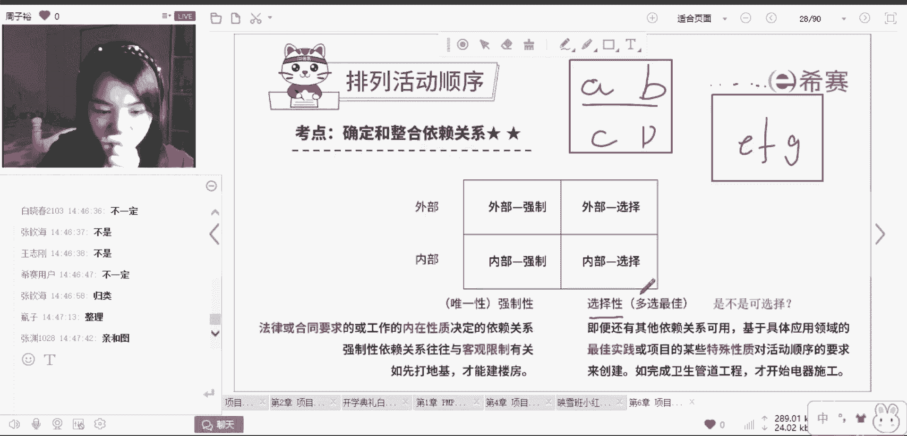
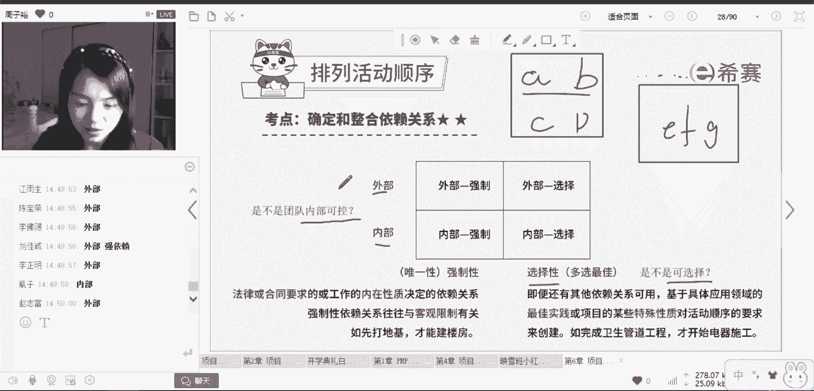

# PMP项目管理8节入门精讲课，免费观看 - P4：依赖关系 - 冬x溪 - BV1rN41127Jw

来看一下，首先第一个基本的概念，就是活动之间它到底有什么关系。

往往呢最基础的会有两种情况，比如说还是刚才的两个活动。

A活动，B活动有哪两种情况。

第一种情况就是我发现我定义出来。

这两个活动有关系，还有一种情况就是他们两个之间就没啥关系。

而这里的有关系没关系，其实对应的就是我们活动的依赖关系。

是强制性依赖关系还是选择性依赖关系，是内部还是外部。

那么我在确定这些活动之间关系的时候。

想一想，我是不是一定只能两两相交呢。

两两相对比呢，是不是只能这样。

其实不是啊，不一定。

假设我们现在的项目比较复杂，我现在不止ab这两个活动。

我有ABCDEFG，我有一直到26个英文字母这么多活动。

其实我可以这么做，我首先可以把这些有关系的找出来。

把它们放在一起，比如我发现ABCD4个活动。

它们之间有逻辑关系，我把它放在一组，我发现EFG它们之间有关系，我来把它放在一组。

所以有的时候我们可以在排列的时候，分多个小组来排。

多线多管线来处理，所以这26个活动呢不一定要按照从头到尾。

两两去对比，我可以把这些东西拆出来。

多线操作，这样有什么好处，可以大大的提高我们工作的效率。

来看两个概念。

首先，第一个概念就是如果有两个活动。

他们之间一定是有关系。

那我肯定是要把它们放在一起考虑。

这个就是强制性，而选择性是什么，选择性就是。

我可以不用去考虑他们之间的逻辑关系，反正呢项目最终完成的时候。

他们都完成就可以了，这个怎么理解，关键是看这两个活动之间的关系是不是可选择。

就举个例子。

比如说咱们建房子的时候，是不是一定要先打了地基。

我才能建一楼，我建完了一楼才能建第二楼。

建第一楼和建第二楼之间的逻辑关系，是强制性还是选择性的。

建一层楼和第二层楼。

是强制性的没错，因为这个东西你不可能打乱的。

你必须这么做，而选择性的逻辑关系是什么。

往往就是一些经验之谈，就有可能这样可好。

但是也不一定还是西红柿炒鸡蛋，你说你先炒西红柿还是先炒蛋呢。

一定要这样吗，不一定啊都行。

这就是选择性的依赖关系，可以选择的每个人不一样。

所以区分强制性和选择性。

你就要看是不是可选择，而另外一个维度就是内部和外部的关系。

它们的侧重点在哪里。

就是市是不是我们团队内部可控。

比如说举个例子，我现在呢我要做一个测试。

我做测试需要有一个设备，但是这个设备这不是归我团队去购买。

我要依赖别人呢，想想像这种情况下。

设备和测试之间它们存在什么样的依赖关系。

是内部还是外部呢。

是外部对。

为什么呢，因为这个东西我要依赖别人呢。

但是如果这个东西是我们自己买，自己用内部可控。

那还是比较好区分的，对不对，所以内外部的区别，关键点就是要看清楚是不是我们团队内部可控。

内部控制范围之内。

就是内部的关系，外部就是不在我们团队的可控范围之内好。

所以掌握一个关键词，内外部的区分就要看是不是团队内部可控。

选择性强制性的区分。

