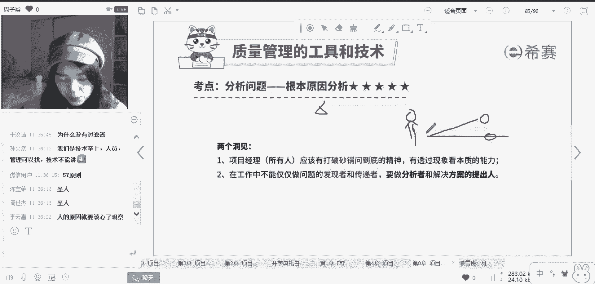
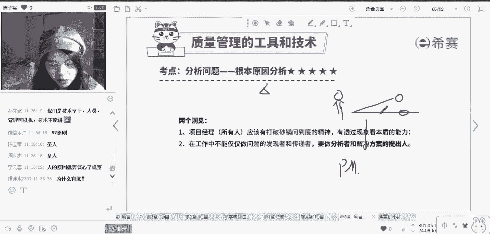

# PMP项目管理8节入门精讲课，免费观看 - P7：根本原因分析的作用 - 冬x溪 - BV1rN41127Jw

找原因，其实是对于相对于项目经理，一个非常重要的技能，因为想一想我们现在学的pp。

你站在什么样的角度，管理者的角色。

管理者的角色，你就要这么想，如果你只是一个干活的团队成员。

你上班的路上发现了一个坑。

你可能把它埋上就OK了，那么处于你的这份活你也完成了。

但是这个坑为什么来呢，有了这个坑，有没有可能别的地方也出现坑。

如果你作为一个团队成员，你可能就不会去思考这么多。

但是你现在考偏僻，一定要学会站在一个管理者的角色去看待问题。

一个项目它可能会出现一个问题，那这个问题是为什么。

如果你没有找到这个，为什么草草的像这个团队成员一样。

把这个坑给埋了，比如说由于地震，或者是由于别的一些原因。

导致出现了更多更多的坑，那你后期还是要花费一些时间精力去解决的。

那你作为一个统筹者，何不在第一次问题出现的时候就把这个坑填满。

然后找到原因，做出一些相应的预防措施。

防止别的坑发生呢，这也是为什么我们很多同学。

一直思路转不过来的一个原因啊，从技术转岗里啊。

转管理确实是要面对很多的困难，这个就是一个思维的转变。

记住啊，你们现在是管理者啦，作为管理者一定要有大局观好。

所以不能说出了问题我动一下，解决了，出了问题我动一下，解决了。

有问题要从根本上解决，要从根本上去优化，这也是为什么我们很多的题目啊。

他是先分析后行动的一个逻辑。

你直接行动，往往只能草草地处理表面上的这个坑，而你分析为什么分析。

就是要分析为什么有这个坑，从而从根本上杜绝一切跟这个坑有关的。

一些后期的缺陷。

所以这个就是根本原因分析。