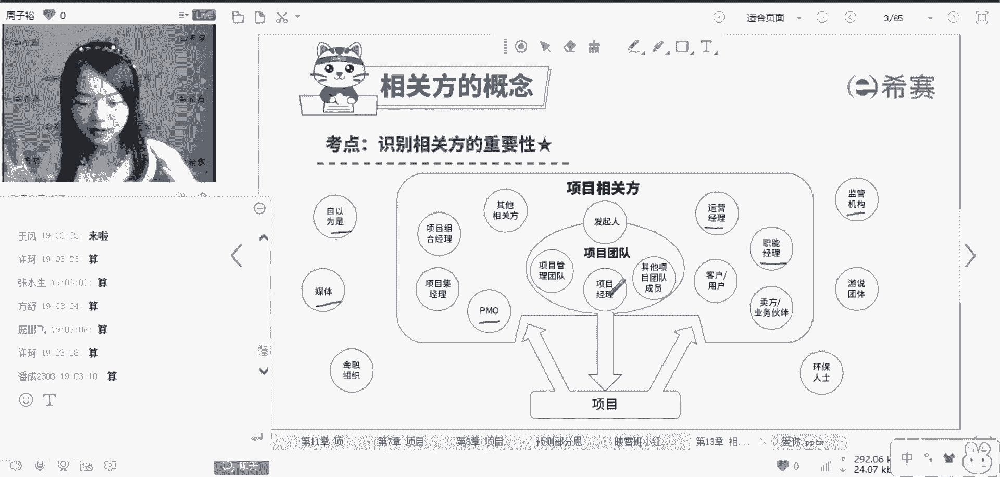

# PMP项目管理8节入门精讲课，免费观看 - P8：相关方的概念 - 冬x溪 - BV1rN41127Jw

相关方什么概念是人，什么人，客户发起人。

团队成员PO等等等等，现在展示在大家面前的所有人。

甚至是一些你觉得跟我们项目不太相干的人。

也许都会成为你的相关方，所以一句话，什么是相关方，相关方，他就是会影响到项目。

或者是你这个项目会影响到的所有人，给大家展示的所有的人啊。

通通都是相关方，自以为是的人。

那在这个里面呢，有两个人大家可能会觉得比较疑惑。

首先我请大家思考一下，发行这个不多说啊，团队成员算不算相关方，团队成员算不算相关方算。

当然算项目经理算不算相关方算也算。

而且是非常重要的相关方。

所以嗯这里相关方啊它的概念画了一个圈儿啊，这个圈里面的非常好理解，发起人啦，客户啦，什么运营经理。

职能经理PO等等等等，这些好了一些。

而圈外面的我们以这个圈为界啊，圈外面的这些，好像你觉得跟项目没有什么关系的。

可能也是就比如说我原来搞工程的时候，我修路嘛，总是喜欢就在一些鸟不拉屎的地方修路，像这些地方往往会经过一些农民伯伯的土地啊。

祖坟呐，田地，我们可能这个路就不直接经过他的这个田地，但是呢你修着修着，你挖着挖着，可能就会有一波农民伯伯过来说，哎呀你这个地方啊搞工程，害得我100米开外的这个田。

这个苗啊长得不好，你们这个地方修路啊，把我的这个苗给震死了，我想请问大家啊，像刚才跑过来找我麻烦的这些农民伯伯，他算相关方吗，算吗。

算不算。

也算当然也算，因为他对我们项目呈现了一种抵制的态度。

他有可能会影响到我们的项目，所以说像我们工程搞到哪里啊。

哪里就会有一堆相关方，所以说什么是相关方。

大家应该有一个概念啊，就好像是我们原来学历的相互性，我现在推我现在面前的这个桌子，这个桌子有一份力也会返回到我的身上，所以相关方和项目是什么样的关系。

就好像是力的一个作用相互性，我推桌子。

桌子也会推我，所以我们前面讲过了一个很重要的章节，沟通还记得吗，项目经理啊，他至少会花费80%以上的时间和谁沟通，和相关方进行沟通，那么思考一下，是不是跟我项目所有相关的人，我都要把它把握住。

我都要hold住它，是不是所有的相关方。

我都需要花费百分之百的心血，我把它给hold住吗，是不是不是我们有句这样的话啊。

擒贼先擒王。

打蛇打七寸，我举个例子啊，比如说我现在呢要给大家开一个会。

我想征求大家的意见啊，大家想去哪里玩呢。

想去哪里搞团建呢，咱们映雪白要搞团建了啊，我现在来问大家。

可能有同学会觉得哎呀我们去新疆吧，我们去杭州吧，我们去长沙，北京上海四川。

各执己见，达不成一致的意见好吧。

那这种情况下我怎么办，我是不是直接去找我们的啊，比如说罗老师。

我们的领导，如果是我们团队，你只要去搞定这个boss。

搞定这个领导，我跟他说，哎我们干脆去这个地方吧，只要领导他一开口，可能大家就不会有什么样的意见了，所以说呢只要领导boss重要的相关方。

他认可我们的建议，那这种情况下，我们的项目往往会更加顺利的进行下去，所以说呢这个就是你不是所有的相关方。

都需要牢牢的把握住。

