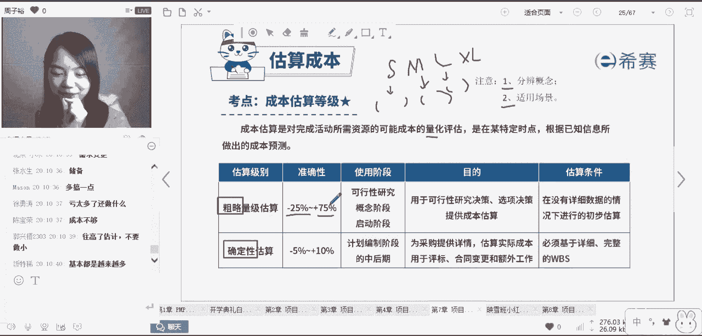
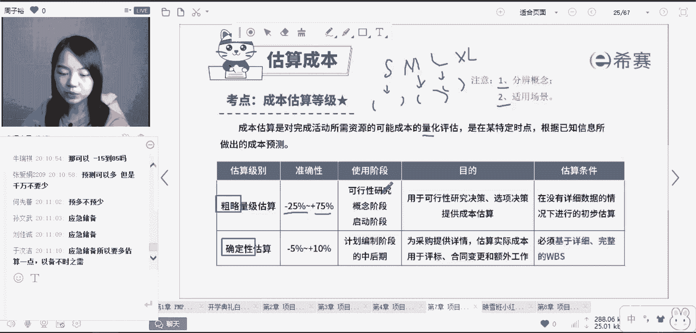

# PMP项目管理8节入门精讲课，免费观看 - P6：粗略量级估算 - 冬x溪 - BV1rN41127Jw

这里有一个估算等级。

估算等级是针对于成本这个领域特殊的点进度。

没有两种考法，第一个你需要分辨概念，第二个你需要知道这两种估算等级的适用场景。

首先成本的估算等级它是什么呢，成本估算是对完成活动所需资源的可能。

成本的量化评估。

是在某特定的时点，根据已知信息所做出的成本预测。

有两个级别，第一个级别叫做粗略的量级估算。

还有一个呢是确定性估算。

读完了之后，能不能从他的标题上面找到一种感觉。

粗略的量级估算其实就是粗略的估计。

大概的估计，而确定性的估算，它就是它字面上的意思啦。

确定性的估算，所以这个粗还是确定它有什么区别。

你会发现它是一个级别粗略的量级估算。

什么叫做量级。

请问大家量级它是不是一个具体的确定的点。

是不是一个具体的确定的值。

不是它是一个大概的范围，这好比是什么样的意思呢。

叫我们买衣服，我们买衣服的话呢，它往往会分尺码。

S码，M码L码，还有叉L码，叉叉L码，对不对。

你像这个S码M码，它一定就是确定，一定是要85斤的人才能穿吗。

不是往往他会给出一个范围啊。

比如说呃80~100斤的人穿S，100~120斤的人穿M。

然后120~150的人嗯穿L以此类推。

所以说呢它就是一个大概的范围，这就是量级的一个概念。

粗略的，所以它的准确性高不高。

想一想，量级它往往不是一个特别准确的东西。

比如说这个粗略的量级估算。

你看一下它的准确性，负25%到正75%。

它中间有百分之百的跨服，对不对。

请问大家思考一下这个粗略的估算。

它这个准确性这么宽，可以理解，因为它本身就是粗略的估算嘛。

它为什么是不对称的，那为什么是负25%到正75%。

这样一个奇怪的数值，为什么它不做成负50%到50%。

这样子的对称呢，思考一下为什么。

为什么呢，还记得吗，我们在估算的时候一定要估算死吗。

我为什么要多预留一点。

因为会有应急储备的存在，所以这也是为什么它不对称。

无论是你做确定性的估算。

还是粗略的量级估算，你往往都需要多预留一点点，所以才会出现这种不对称的情况。

所以说呢这个数据为什么不对称。

就是这样的一个原因啊，而第二个我们需要知道的就是。

这两种估算的级别，什么时候用第一种粗略的量级估算。

想一想他竟然粗在我的后期。

我还需要去做这种粗略的估算吗，不需要了，所以我什么时候用。

往往是在项目的早期。

早期我才会用到这种粗略的量级估算。

因为早期的往往没有什么很确定的东西，很早的时候。

我们只能凭借一些主观的意识经验来判断啊，就比如说我大概判断一下哎。

我们这个项目的预算呢啊，可能是75万到200万之间。

如果之后的利润超过了这个值。

比如说我之后的利润达到了500万，那说明什么。

说明我们这个项目往往是值得做的，那如果反过来。

如果我预估的利润只有100万，拿我项目的预算要200万。

那我还做吗，那往往就不一定了嘛，所以在项目早期的时候。

我们都会用很多的手段来评判项目的可行性，使用阶段早期。

比如可行性研究阶段，概念阶段。

启动阶段，所以说呢项目的早期。

