# PMP项目管理PMP学习知识快速通过PMP考试 - P11：组织过程资产-11 - 北京东方瑞通 - BV1df4y187rv

各位我赢的现场小伙伴们，大家好，欢迎大家关注天一项目管理现场课程。本节我们讲授的是组织过程资产。前一节呢我们讲述的叫事业环因素。大家还记得吗？这两个区别是什么呢？谈到环境是限制你的。

是影响你的那谈到资产呢，你可以去裁剪和利用。所以呢我们看一下组织共资产和环境各包括什么东西。那我们上一节讲到了说事业环境素包括什么东西呢？包括组织文化组织架构，组织也务不通渠道。

那组织对沟通的要求是什么呢？是组织功能资产。那还有基础设施，员工的能力，包括某某某某系统是环境，那这边的话我看一下还有两个数据库还是须什么？一个是商业数据库，一个是风险数据库，这两都是环境的。

这个是要特意去强调的或者是特意注意的？那为什么注意呢？因为在组织功能资产区别呢，也有库啊，也有数据库。比如说财务数据库。

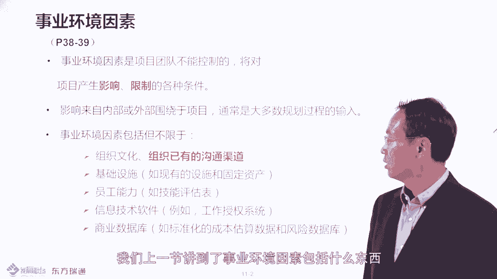

配置管理知识库、经验教训知识库，这是什么库，对吧？看到没有？比如说谈到一些组织的资产，包括财务数据，这些东西都属于资产。看到没有？大概这样的，包括你的配置管理的一些内容，比如说你的过程记录啊。

包括你的这种各种文件呢，哎交付物啊，都属于配置嘛，是这样的。好，所以谈到这个呃组织资产这边的话，它分成两大类，一类是组织的某某某过程。政策这是资产。然后呢。某某某种库，但是要区分啊，就是这边你看到没有？

商业数据库和风险数据库是个例外，它属于世业环境素，其他的库的话基本都是组值过程资产。是这样的啊。好，然后这边的话，在你的课件里头呢，它关于这种配置管理知识库这边的话有比较抽象，大家可以看一下。

它包括软件硬件的版本及所有执行组织的标准政策程序的内容。那这边的话呢，软件硬件的版本的话，我很容易理解。比如说你要交付软件也好，要开发硬件也好，你的版本控制，这很容易理解。

那所谓的标准政策程序是什么东西呢？比如说你为了交付一个项目，你公司要制定很多的制制度啊，流程啊，规范呢，比如说财务控制制度变更审批流程，包括你的这种各种的制度文件，比如说呃你的周例会制度。

你的什么呢产品发布制度，变更审批制度，这些东西都属于什么呢？都属于你的过程记录，那都需要记录什么配置管理的数据库里去。比如说你的配置管理的制识库或数据库的话呢，它不仅记录了软件和硬件代码。

还记录什么东西啊，还记住为了实现这种软件或硬件的话，相应的制度流程。规范和要求啊，这就属于治理的范畴。大家记得嘛？就是项目治理呀，IT治理啊，什么企业治理呀。

你的企业治理各种治理的这种过程文件的制度文档都属于什么配置管理的范畴。也不仅仅是本代码这样的啊，好的，都要了解。然后接下来我们看一下比如工资产这边的话呢，刚才说了那两大类，你书上第39页也说了。

包括过程程序和指识部。然后这边的话呢呃还特意强调了有些这种配置啊或者或者是过程记录啊，其实呢是项目团队自行去产生的。比如说你的会议纪要，你的周报，对吧？有些是什么呢？

有些是项目团队或PMO以外的组织产生的。比如说有很多职能部门做指控的，它会产生质量管理制度要求，做风控的，它会产生风险管理的制度要求，对不对？还要做财务审计的，它会做财务审计的要求。

所以说你的些配置过程记录，有可能有些东西呢是你项目团队自行产生的，有些是什么呢？组织以外的，或者你的项目团队以外的组织产生的，就要知道的啊。哎，这个配置的话呢，呃不仅仅是你团队内部产生的。

所以它分成两大类，一类是你项目日常工作产生的。还有一个是项目团队以外的这个加值的部分产生的，要知道的，这些都属于配置。好。然后接下来我们看一下呃，第一大类叫过程程序，这边的语书上有相应的一些要点。

比如说你知道你PMO会产生一些什么PMO会产生一些这种相关的模板呢？有相关计划模板呢，包括制度要求嘛，对不对？可以看这个项目管理计划，包括什么问题风险日志登记册，干型登记册这些东西，这些模板的话。

它属于什么属于过程程序，这个呢是什么呢？组织共生产的一部分，包括你公司的变更控制程序流程，包括什么配置管理流程，包括财务控制流程，反是什么程序的，直接说了含到什么程序，属于资产。

含到什么系统属于什么属于环境。那比如说最典型的一个系统是什么来着？工作授权系统属于环境，对吧？工作授权程序呢？那就是资产了，是这样吗？好，然后接下来我们看一下关于这个变更控制和配置管理的话呢。

它是也有流程。

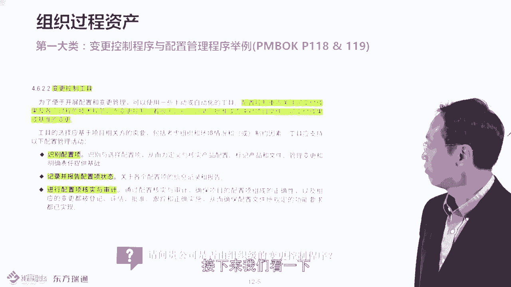

的那你书上118119页是的。这边有一些活动记录，你看一下哪些属于变更的，哪属于配置的。比如说在118页，这边它有几条说明，比如说这个是比如说我们活动，第一条叫识别配置项。

第二条呢就是记录报告配置项状态。什么叫配置项啊。如果你服过IT运维的话，就知道配置项属于IT服务交付的实体。比如说软件硬件文档，就是配置项。好了，那配置项要看看状态，就是比如说软件版本。

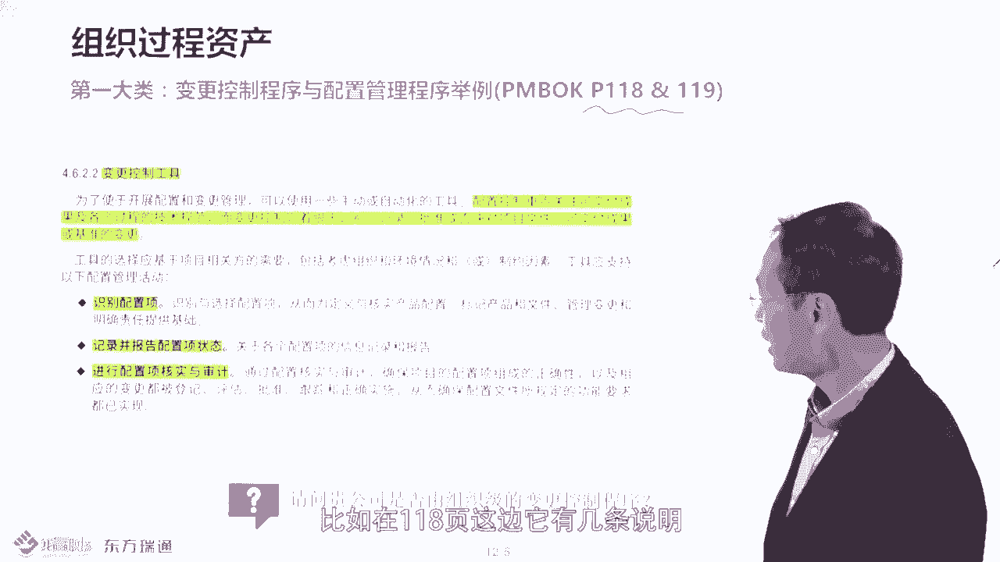

然后呢，要定期做什么？比如说机房的盘点呢审计对不对？哎，这几个活动这属于配置外流程呢，还是属于变购关流程啊？大家一看就知道，不有动物运维的，你做过机房管控的。

你做过数据中心运维的那你就知道这属于配置管理流程。比如说我要对整个数据中心的配置架要识别。比如说上到应用软件，下到什么基础设施硬件，对不对？然后我要需要什么呢？版本控制，看一下什么的，它的照单的状态。

我要每个月出一个什么配置表嘛。然后并且的话我研究我每段年做一次盘点和审计，盘查一下，看一下这些东西是不是拿回家去了，对不对？或利旧，对不对？是不是有这个报报废了，是不是啊，所以这就是配置管理的活动。

那哪些是变更管理活动呢，大家可以看一下，比如说。

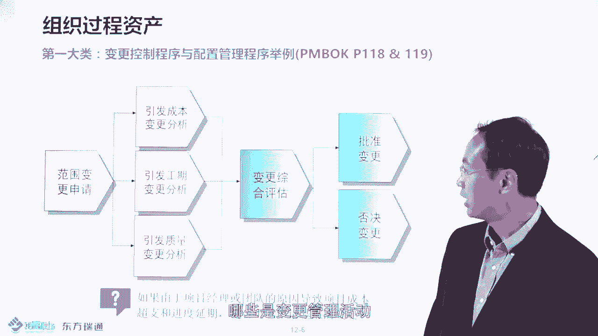

在你的书的119页这块。识别变更就识别变更请求。然后接下来呢记录变更这种大概的请求信息叫什么正式书面嘛，或者正式的提交嘛，对吧？然后变更请求，然后做变更到什么决策跟踪变更的实行情况。

这就是变更管理的流程了，理解吧？也说变更管理程序，配置管理程序都属于组织不人才，在你书上的118页，119页，这几步是属于变更管理程序的。

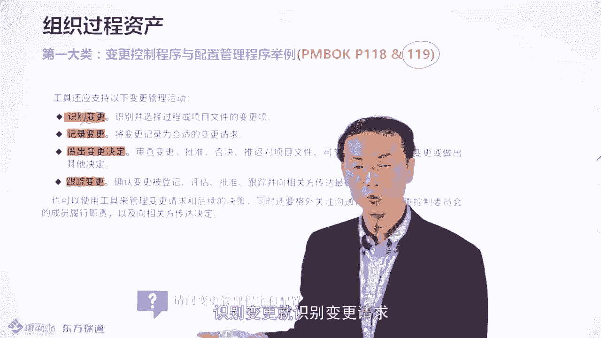

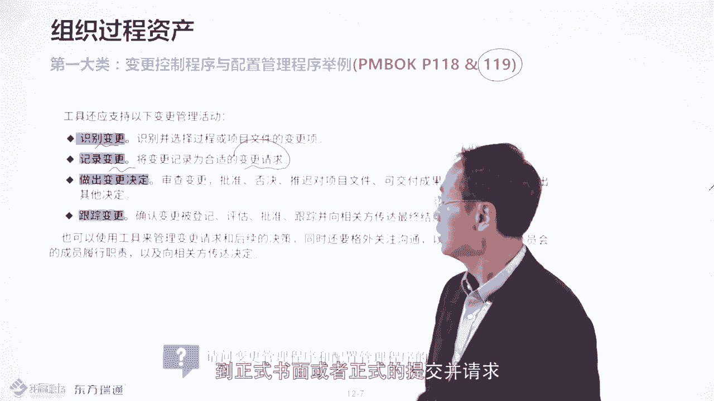

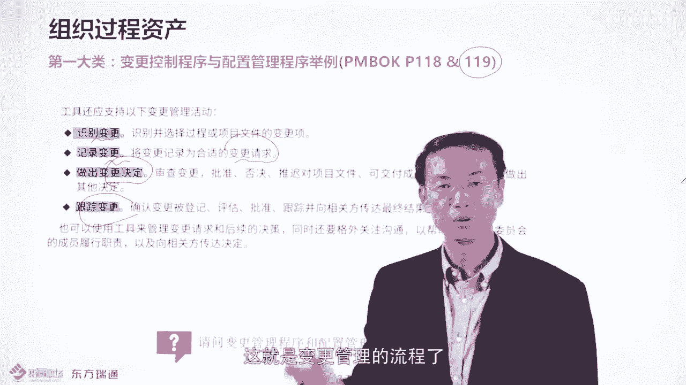

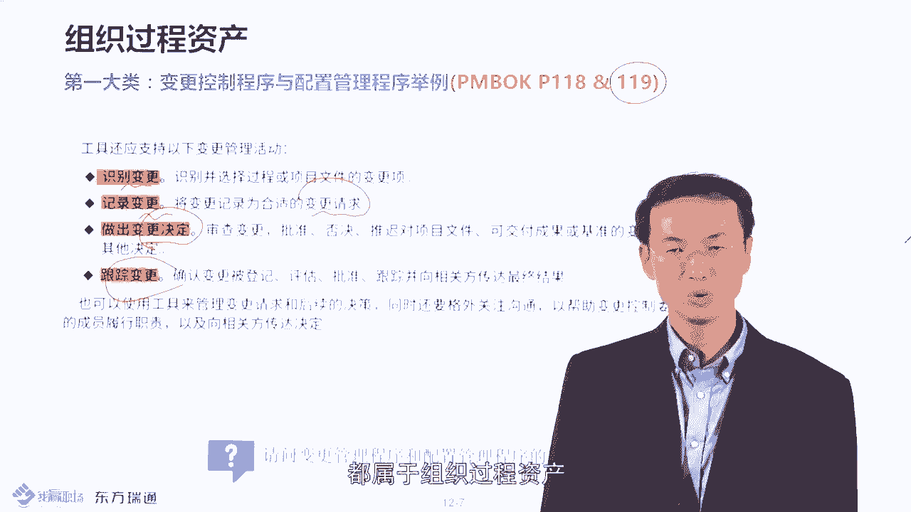

那变更程序目的什么呢？就要做变更请求的过程控制，控制其变更的风险。这就是它的要求。那配置管理呢就是看一些什么？它的大概的什么这些版本呢，配置项的状态，必要说发起什么配置项的合规审审计盘点，是这样的。哎。

所以这就是两个例子了。所以说考试的要点是你要记住这三步属于配置管理程序。而这三步呢我这四步呢属于什么属于变更管理程序，是这样的，哎，要区分其不同的，请看到118页，119页的大概的一些步骤。好了。

然后接下来我们看一下第二大类，就是属于的知识库，首先说了，不是看到什么库就是资产的，因为有两个东西是例外，一个是商业数据库，一个是风险数据库。还记得吧？这两个东西属于环境。然后其他的数据库。

比如说配置管理库，对吧？包括经验教学知识库，就是。各种经验教训来记下来的财务数据库，包括问题、缺陷数据库，这些都属于什么？都属于资产组织或资产啊，要区分的去记忆的这两这两个东西。好。

然后看一下大家记忆怎么样。

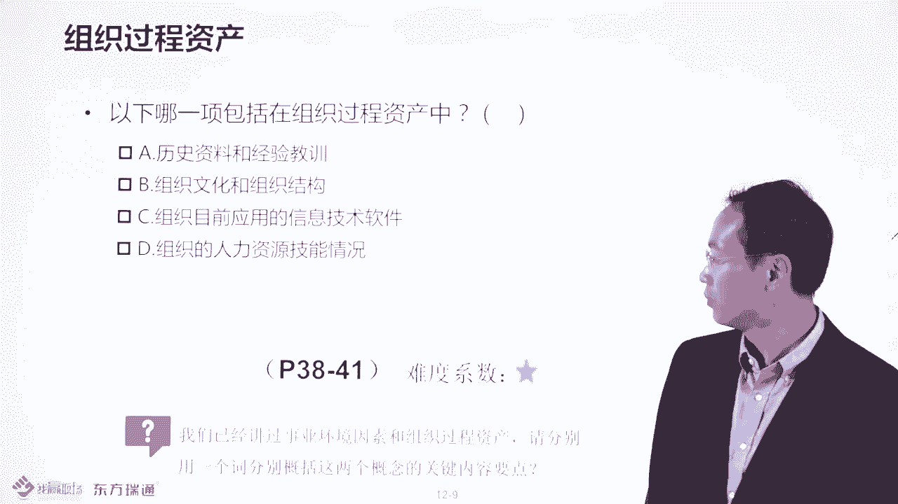

那你看一下下列哪一项包括在组织过程当中。住出嚟噶。应该选哪个？应该选B，为什么？因为哎应该选什么？

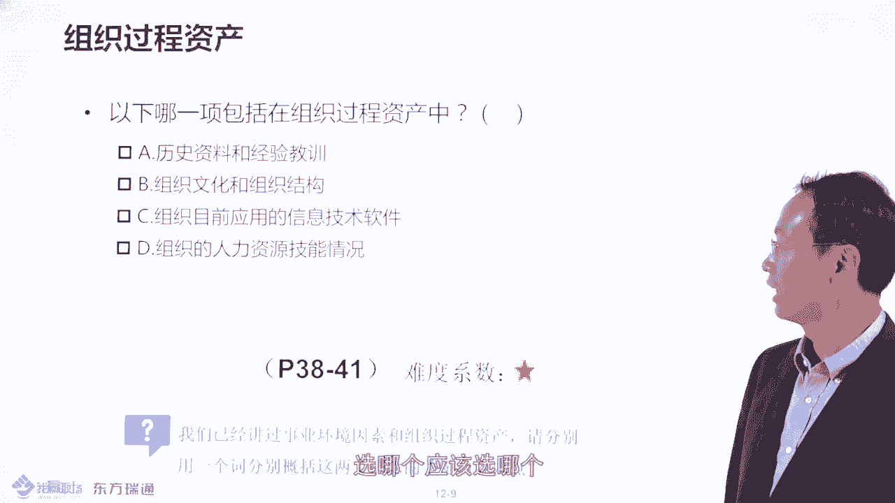

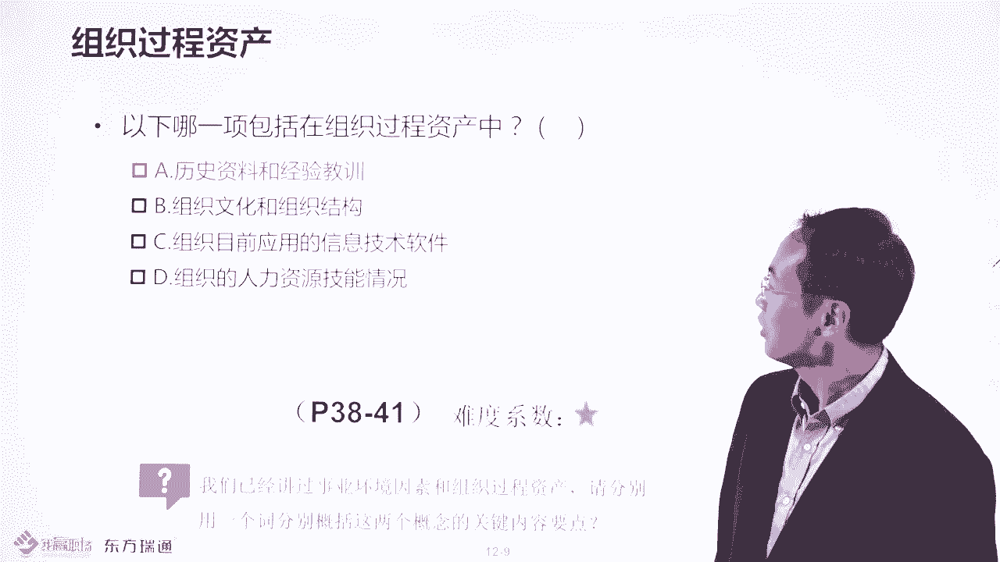

哎，应该选A，为什么呢？应该是这样的，为什么不选B呢？因为组织的文化谈到这个东西，环境还记得吧？然后这边的话某某某系统环境对不对？讲到公作的授权系统。然后这边呢当然当前人员的竞争情况。

环境是不是只有这个经验教训数据库是什么或知识库是属于资产，应该选A是不是是样的都要了解。

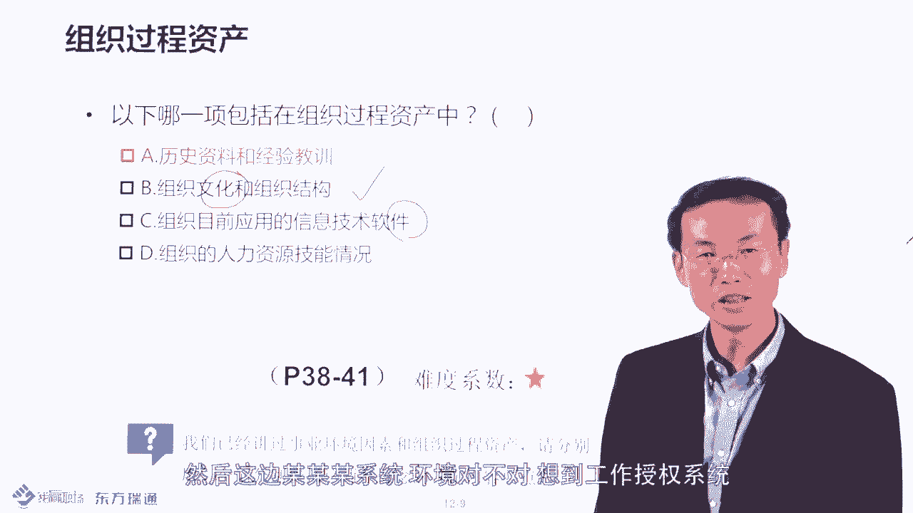

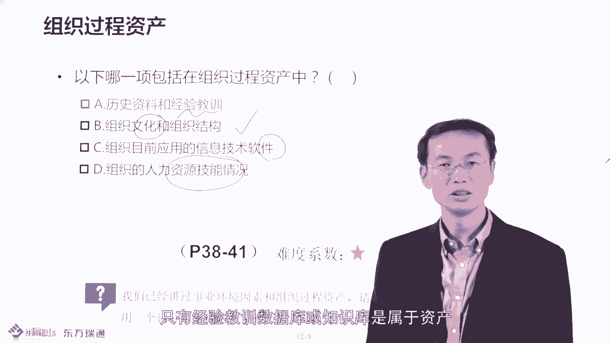

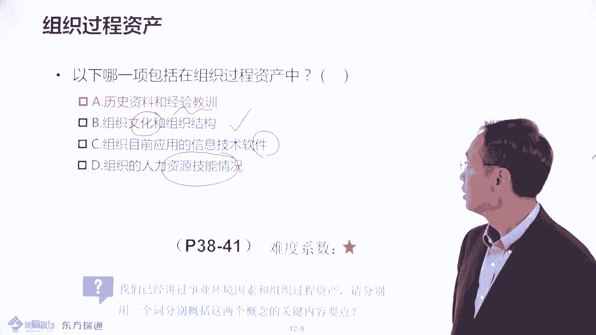

然后接下来我们再总结一下，谈到环境要知道有个词儿是限制你的，谈到资产，你要知道可以裁解和利用的。而且你要分清哪些属于环境，哪些属于资产。比如说文化组织架构某某某系统属属于环境、风险数据库，对吧？

还有什么商业数据库环境。资产呢，比如说财务呃程序，包括什么配置管理知识库，这属于资产，包括一些模板属于资产。好，关于事业环因素和组织资产的这个区别呢，我们要善加精密。因为这是重要的考点。

多谢大家收听和收看。

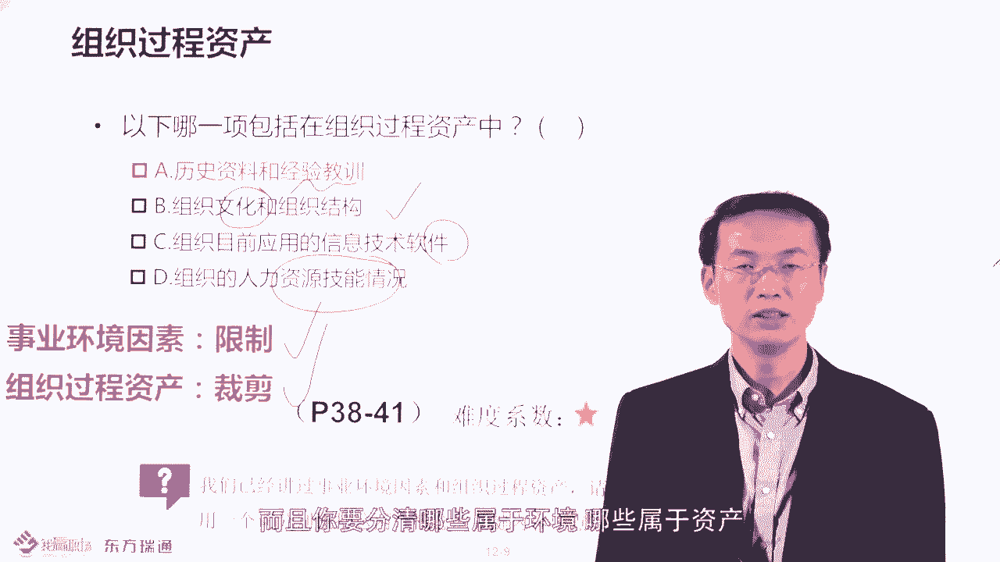

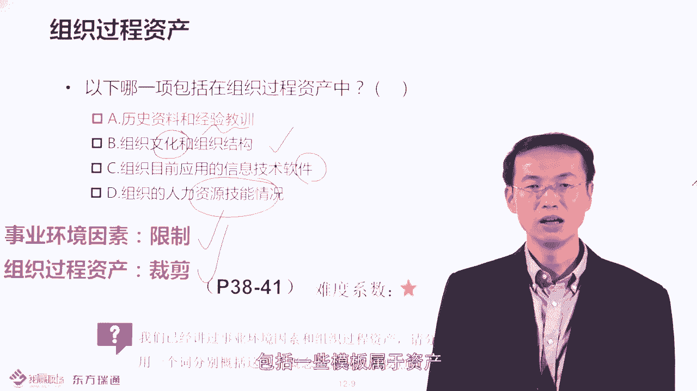