# PMP项目管理PMP学习知识快速通过PMP考试 - P13：项目生命周期与产品生命周期-13 - 北京东方瑞通 - BV1df4y187rv

各位我赢的现场小伙伴们，大家好，欢迎大家关注PAAP项目管理现场课程。本节会讲到相升周期和产品生周期。大家知道说项目生周期呢就是为了确保项目交付一个产品。那项目交付产品之后的话，是否象升周期就结束了呢？

是的，那产品生周期呢还没有结束，因为产品还没有报废。所以说呢通常来说象升周期呢会比产品生周期会短一点。好，那我们上节已经讲到了象升周期的，还记得有几种类型吗？包括预测型的增量型的，包括什么迭代型的。

还有敏捷试运性的，还记得吧？是这样的，好，那我们本节的话会讲一下上升周期，项目生周期和产品生周期的区别。大家说了，通常来说呢，产品生周期的话，会比项目升周期会长一点。那产品生周期会包什么东西呢？

包括这种上升论证呢可。分析呀，包括立项啊，需求分析设计转换实施到服务到推进的环节。比如说项目交付一个服务器。那这个服器呢投产之后的话呢，一般是5年之后才报备的。所以呢这5年的话都属于产品升中期在运行的。

所以可以看到说项目交付这个产品之后，你还要干嘛呢？你还要使用，使用是一个实续的过程，就是运营的过程嘛，是这样的。所以说产品升中心包括运营的环节，直到什么呢？直到备弃。好。

那我们看一下这个他展的一个区别哈，在我们的备考辅导书里头，就是我们给的这个电子版东方日通的项目管理备考辅导书里241页的，里头有一个学霸帮我们画了一个图，这个图呢很明显，大家可以看一下。

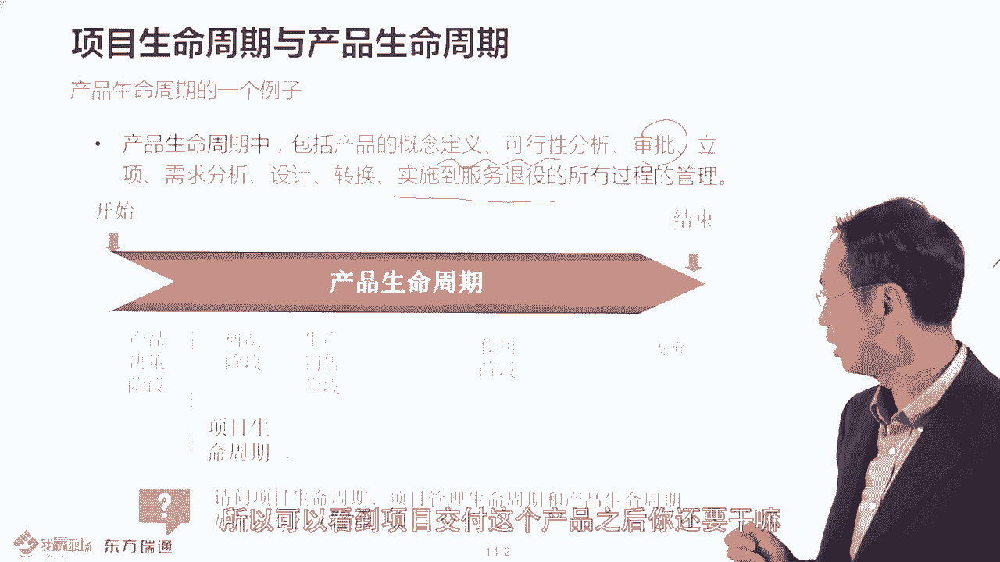

产品分周期正常，而以项目分周期那是正常的。然后呢，你项目里头呢会分成不同阶段，还记得阶段定义吧，它是通过关键可交成果划分不同阶段的。比如说需求分析阶段、架构数据理段这样的，然后呢。

每个阶段都需要什么管理走什么呢？五大过程组是大限于49个过程，是不是每个阶段。都要考自学过程呢？不对，是要什么呢？你要学会去踩剪的是这样的。好的，所以看到没有？他就把相声周期。

产品生周期和项目管理层周期的一些过程把它关联起来了。就这个图，这个是很明显看得出来的。而且这是前三章一个重要支点。希望大家呢拿到优备考核书之后，应该怎么办呢？啊，看到这个图所对应的章节。

然后去看一下描述，要区分，要自己会论述，说产品生周期项目升周期和项目管理成周期的区别。要知道，从过这个图能看出来的，在你的官方也有个图也能看出来的。就是说在你的那个备考呃，应该说是在贴部。

在官方的书籍里头也有这样的图，在书的第18页。

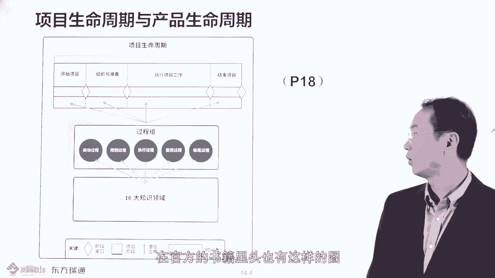

项目是不周期之前说了，是按技术维度，就是先期给的阶段。

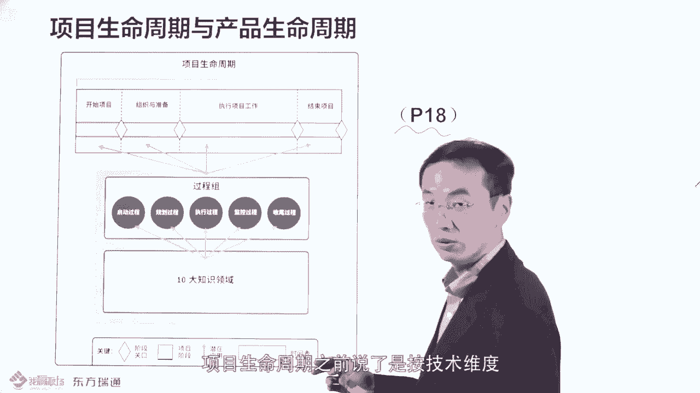

每个阶段都要走五大部程组事办是必需要管控的，看到没有？这个图跟我这个图是一样的，看到没有啊，所以大家了解哈，就是属于项目顺周期和项目管控的这个大概的区别。好。

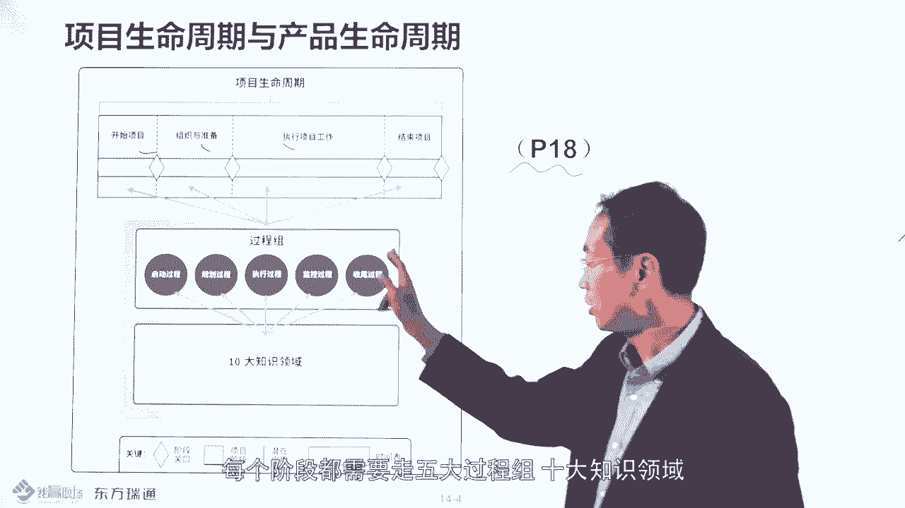

然后这边的话呢，项目交付之后的话呢呃项目生活周期就结束了，但产品生活周期呢还继续什么继续的在持续的。

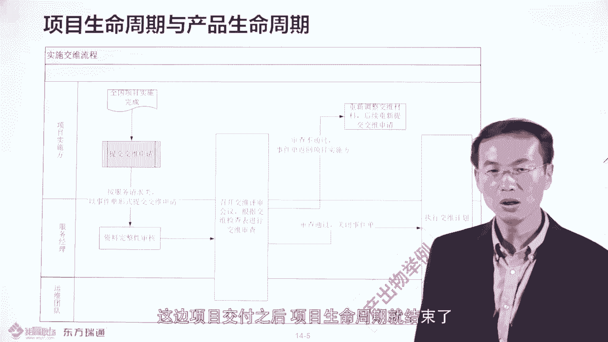

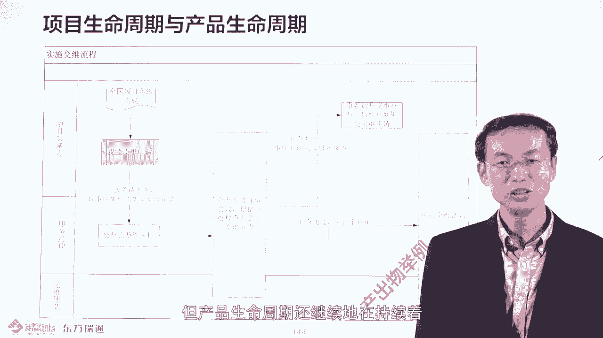

比如说有个简单例子，比如说项目结束之后，你要项目要转什么转运维。那项目转运维的话呢，你的项目组呢要提交什么转为申请，提交给信息中心。信息中心这个维护部门呢会给你开个会，然后呢去检查你的具是否具备什么呢？

转为资格，怎么审查呢？就是他会有个请查清单。比如说你大家可以看一下。

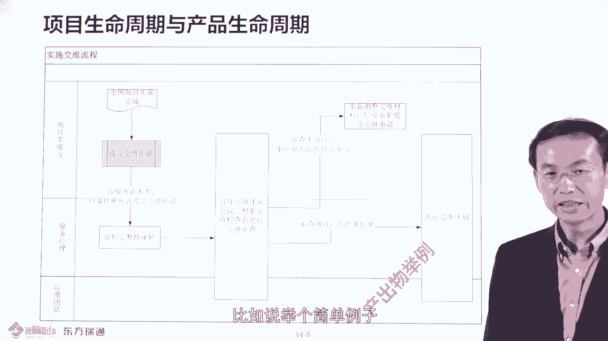

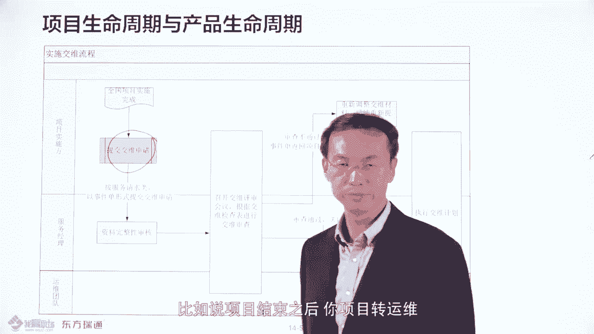

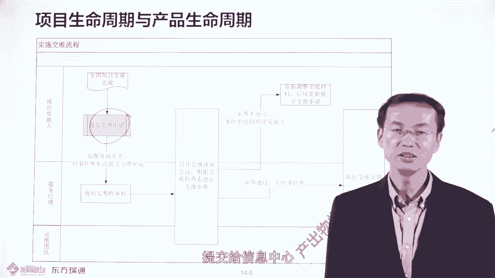

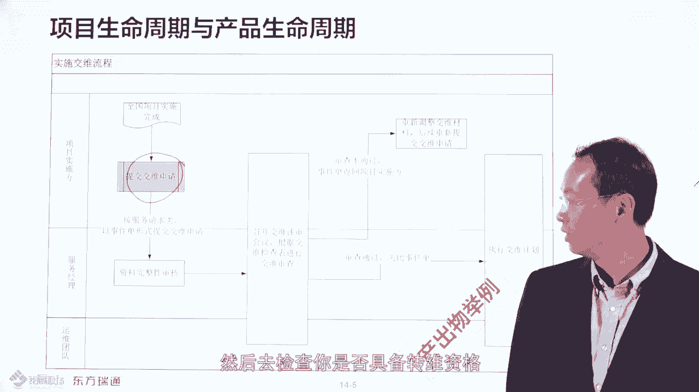

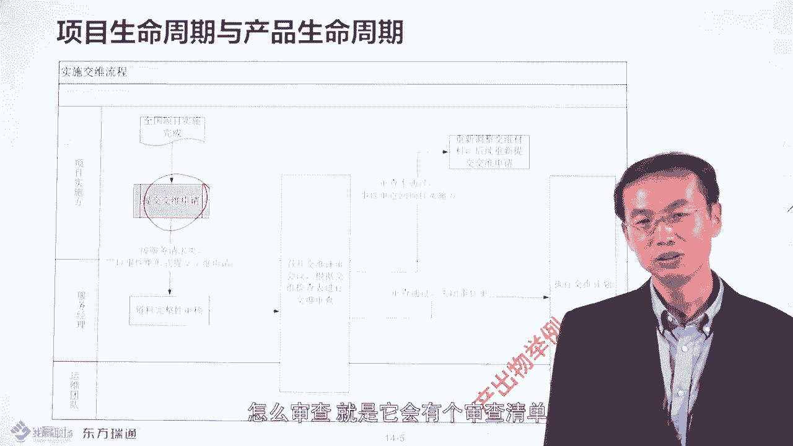

基于什么呢？基于这个新产品或一个旧术产品的新功能，我对你的转为的时候，相应的文档的提交要求是不一样的。如果是一个全新的产品的话，你要交付很多东西，比如说需求设计文档啊，接口经济文档，用户手册啊，哎。

都要给我的。如果是既有产品的新功能，那有些东西呢就可能是必须的那有些东西可能就省略了，看到没有？这就是我作为运维部门作为运营部门，这这个产品技术部门，我追针对你的项目的项目组的交付过来的产品。

我是这边是有什么是有要求的。而且呢我的交接这块的话呢，是有一个实现的一个要求的。哎，什么东西必须在多少钱给给到我包包括给我安排什么呢？安排培训，并且呢哎做的最好的的形式呢，是这样的，就是这个产品转为了。

及时转为了，头一两个月。这个产品的日常的故障处理，工单处理是项目组做还是U委组做呀？应该是项目做，你做我看着。然后呢，再过两个月呢是我做，你看着再过一两个月呢就可以 sayay拜拜 to you了。

对吧？理解吧？是这样的，就是说这就是所谓的这关于工单的处理，包括历史工单。如果说呃我在转为之前的话，你有处理了很多工单。那我作为运维团队要有个要求的，说什么呢？你把历史处理3到66个月的工单都给到我。

你是怎么解决的？然后这样的话，我作为知识库去归档。然后我日后的话呢，我要去做类似的事情的时候呢，我知道怎么解决，看到没有？所以就会有一些类似的checklist，就所谓的检查表。那具备这样的一个检查表。

这些东西都给我了。然后呢，还具备什么呢？开一个转为申请这个会。具备了什么前提条件。然后呢，我会那个通过开会，然后确认这些东西都具备了。然后开始了呢开始发起转为的流程就为交替流程，是这样的哎。

所以必须应该有什么？应该个教学会，这是必须的。大家大家可以看一下。

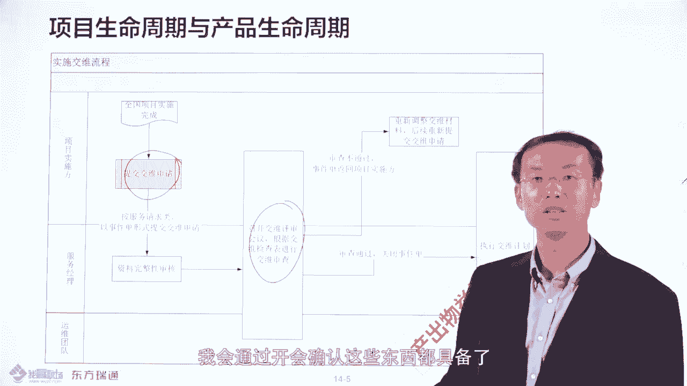

在贵公司项目运维的时候，有没有这种交接会啊？如果交接完之后证明什么呢？项目收收期基本是差不多完事了。但产品生成期呢还要继续什么持续的，直到这个产品报废是这样的，所以要了解。

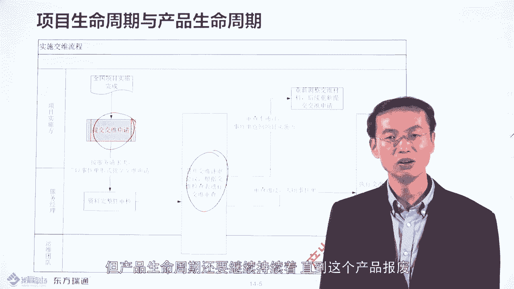

好，这就是所谓的项目升周期和产品中呃，项目升周期和产品生周期的区别。感谢大家的收看，多谢。