# PMP项目管理PMP学习知识快速通过PMP考试 - P14：项目相关方-14 - 北京东方瑞通 - BV1df4y187rv

各位稳赢的线下小伙伴们，大家好，欢迎大家关注PP项目管理现场课程。本节我们讲述的是项目相关方管理。上节呢我们讲到了项目生周期结束的话，要转运维。所以呢这个运维团队或运营团队的话都是相关方。

那有些时候呢部门之间不信任，有可能会导致说转为的话很困难，困难重重。所以相关方管理的话，还是很重要的那相关方就是属于干系人。那在PP中呢，它强调说干系人是无处不在的。

要尽早尽识别识别呃尽早尽全面的识别相关方。那相关方的定义是什么呢？大家可以看一下，在前三章在第十3章都有相应的定义。比如说在504页大家可以看一下504页。里头针对相关方的话有明确定义。

他说是能影响项目决策活动结果的个人群体和组织。比如说相关方不仅仅是个人还是有组织，那或者是自认为受项目决策活动影响的个人群体或组织。比如说相关方的话，要不是影响你项目，要不受你的项目影响。

他都可能会什么呢？成为你的相关方是这样的那比如说你家装修，你家装修的话呢，隔壁那个房间的老太太，由于你家装修的生意比较大。然后呢，他晕过去了，那他家人会不找你说事儿呢？会的，所以呢你的邻居就是相关方。

好了，那还有什么呢？比如说很多政府政府的一些项目，由于没有考虑到相关方的感受，导致相关方呢就可能会上街散步了，这也是一个呃常常态。比如说某三线城市，那他的政府呢做了一个垃圾回收厂的一个这样的一个项目。

这个项目是在什么呢？或者垃圾焚烧厂。这种焚烧项目的话呢，正好在你某小区的门口旁边建的一个焚烧的楼，那某小区的这个他的业主会不会上街呢？会的，因为什么呢？因为你建了一个垃圾焚烧厂。

我小区的房价就可能跌破三层。这样的话呢，我的首付就没了。那他们就会就什么仅仅是建筑出来了，所以就是政府由于地方政府呢没有考虑到相方相关的市民的感受。所以说呢哎能影响项目，以项目的这种。决策的是相关方。

被你的项目决策影响的也是相关方，所以相关方是无处不在的。那比如说一个具体的项目，比如说一个I心项目，哎关键相关方有谁呢？最典型的项目发起人，我们要知道项目发起人的这个它的定义。

项目发起人是呃给你项目提供资源，确保项目成功的人。比如说你的老板。那除了项目发行之外呢，还有什么项目方呢？这个职能经理。职能经理的话呢，就是说为什么他是相关方呢？因为你找职能部门要人。

他未必把好的人给你，这就是相关方。那还有什么人呢？比如说你的项目很复杂，就要有个架构师或需求分析师帮你去做系方案。那如果你公司或者你的项目组是没有这样的这种角色呢？的话，怎么办呢？

你做项目经理就被迫成为架构师。你除了做架构设计之外呢？你还要做什么质量管理，因为你公司没有质量管理部门，要做什么风险管理，那要你们公司没有风险管理部门，所以导致什么呢？那你就是身兼四职。

比如说你既是项目经理，又是架构师，又是什么风险管理的专家，又是质量管理专家，你说我不是啊，我不是风险管理专家，那质量管理专家呢？那你就是最大的什么呢？最大的什么带点故障，那你的项目交付，如果有问题的话。

也是其有可原的。因为你本身能力规备。因为你的组织又没有相应的部门的保证和制度保证，那你就是审一般的存在嘛。就是这么简单好了，所以就是为什么项目经理之上还要有什么治理呀，还有有制度保证的原因。好。

不要了解啊，就是说你的项目相关方式无处不在的那再给你举个例子。

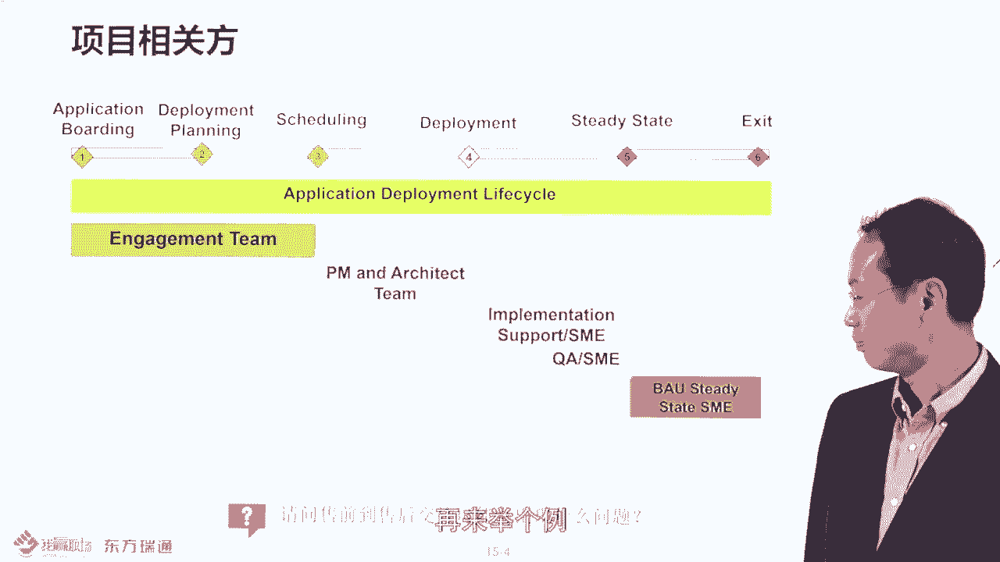

比如说在售前阶段会有什么呢？不有销售售前吗？他相关报。那大家知道说在贵公司售前转税售后的时候，售前转售后的时候，是不是有一个交学会呀？

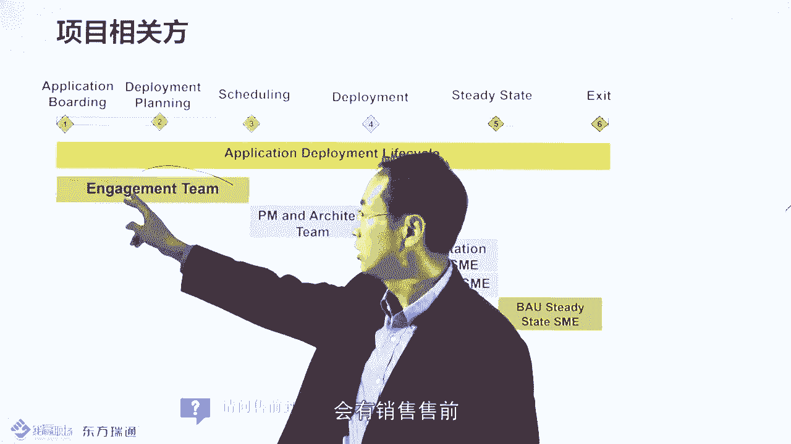

应该有交学会的，为什么呢？因为售前可能过度承诺了一些需求，然后他并没有写到合同中。那你售后项目经理。

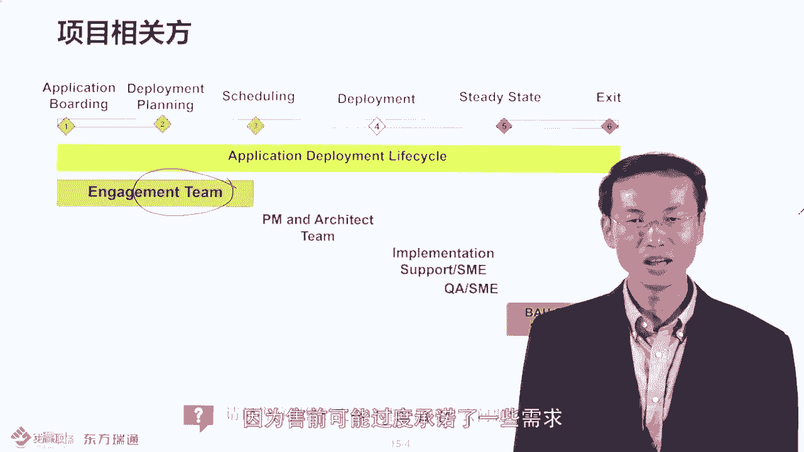

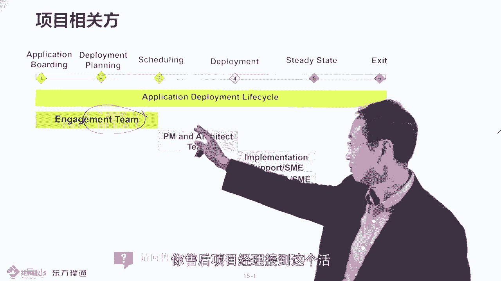

接到这个活，然后呢，按照合同去执行了，结果客户验收，为什么呢？因为有些东西没有写到合同中，但是你对客户有承诺，不是你承诺的，是售权销售承诺的。但是没有到，但是项目到收尾的时候，你的钱花差不多了。

时间已经过去了。你再去去做一些额外的工作的话呢，你有你有余虑吗？可能没有了，这就是授权销售给你挖的坑，理解吧？哎，所以要了解，这就是所谓的授前销售，他应该做一个交接会，把一些他对客户的承诺，要告诉你。

那你作为甲方的项目品里，你要留个心仰。比如说乙方的授权销售，他承诺了一些东西，然后没有写到合同上，你该怎么办？你应该起码要有什么，起码要邮件作为证据，让什么呢？让甲方的应该说让乙方的授权销售，哎。

留有什么邮件给到你，然后这边的话呢呃作为一个证据。但你说这个证据不足啊，最好是写到合同里，对不对？那如果真的没写到合同里头怎么办呢？如果这个邮件，他留有一个什么确认邮件给到你的话呢。

你在乙方的项目经理第一天到场的时候，你该怎么办？立一刻第一。时间。把所有的就是说就跟邮件相关的这种证据或者说需求额外的需求，对吧？发给乙方项目经理CC乙方的授信销售。然后呢，他说一说一句话。

就是一个大概的各准的套路是什么呢？哎，以上就是作为合同范围之内的一些什么一些需求。如果你认为不是合同范围之内的需求，请在三个工作日内给我反馈。那我会重新考虑到这个合同的大概的什么这种修订问题。

那如果三工作日没有任何的反馈的话呢，我们可以可以认为什么以上基为事实。比如说这些东西一定是在合同之内的，所以作为甲方来说呢，你有质保啊，你要考虑到就是说没有正式在写的合同中的，但是有邮件的。

你像第一时间发给乙方的项目交付经理来确保这个视情是落实的，是这样的好。

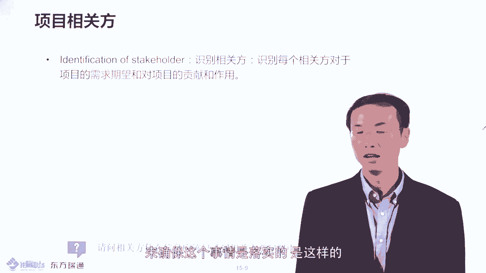

然后接下来呃关于相关方管理这边的话呢，还有专门有一个文件叫做相关方登记册。在你书上。13。1。3。1里头呢大概是应该是514页左右呢，那它会去记录的一个这样一个一个输出。

那相关方登记册的话呢是一个项目文件，它应该包括一基本内容，这就是考点了，大家要记住相关方登记册的话呢，它会包括三方面的信息，就是基本的身份信息。比如说这个人的姓名啊，电话联系方式，还有一个评估信息。

就是它的主要需求希望，就是你要识别它的需求期望。还有就是你要对它分类，它是支持你项目，还是反对你项目的，这就是分三大类。所以说你的相关方登预册里头会有很多列，但是要分成三大类。

所以呢呃大家可以在网站上去下载一个相关方登预册的这样一个模板，大概长什么样子呢？长这个样子，这是原始模板。然后呢这里头你看基本信息，包括什么呢？姓名电话呀类的。然后呢，还包括什么呢？

就是它对当前的一个知识程度。

比如说他是抵制你的项目啊，还是属于中立呀，还是属于支持你的项目的。然后呢，针对不同的人的情况，你要考虑什么，考虑到他的采取的行动。所以这个是一个原始的表。我的建议什么呢？你下载这个原始表之后。

应该怎么办？应该把它分成三大类，一类就是身份信息，比如像这几个就是身份信息，比如说呃职位呀，包括他的联系方式身份信息。然后呢，第二是评估信息，就是他的需求希望，这块是典型的一个考点的。

就如说经常会考什么呢？到项目快收尾的时候，突然跳出一个相关方或关递干系人说不能验收，问你是什么情况造成的，是识别他的需求希望没有识别到，被重明识别到。所以这边的话就是他的需求希望。

这边呢应该属于评估信息。然后呢还有就是相关方分类，他到底是支持反对你项目的啊，你希望比如说他是反对你项目的？你希望他支持，你必须。

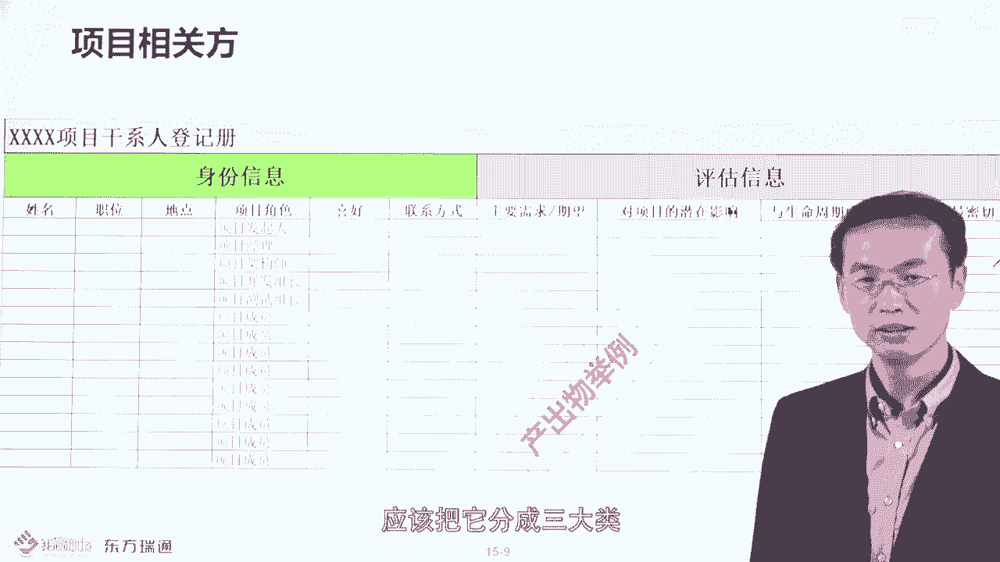

采取一些什么可能的行动方案，就属于相关方的一个管理策略。是这样的。所以建议大家基于之前呢我们的原始的表，然后把它进行什么？

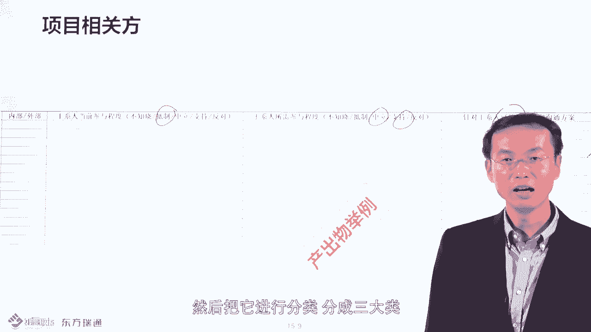

进行分类分成啊三大类身份信息评估信息和相关方的一个什么分类是这样的分成三大类，你怎么分类呢？你就在影el表里头再加一行，然后呢做一个组嘛，就不入有个组，那这几列一个组，这几列是个组。然后呢。

这几列是个组。然后你分类的呃分完之后你跟我这个表呢去对应一下，看你分的对不对，是这样的。好的，所以这是有的一个课外的一个作业，希望大家能完成啊，然后这边的话，我们要知道说相关方管理呢还是很重要的。

因为你做项目经理的话，你的权利很有限，那你要确保跨部门的这个沟通协调，让他们把这个事做了。那跨部门工作协调怎么做事儿呢？其实呢很多项目经理都有自己的招，比如说我问过很多项目经理，有项目经理这么说的。

说我要求某部门的一个员工做事的话呢，我通常不会亲自发邮个件给他，我一般是说服他的老。

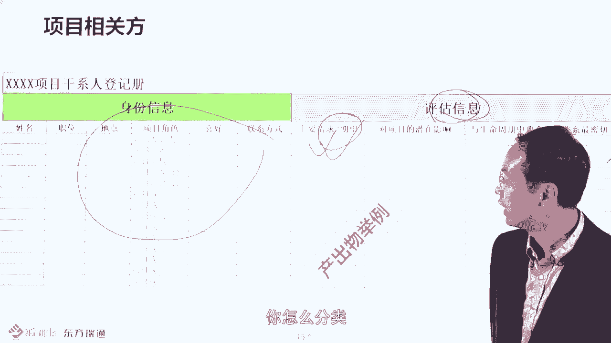

让他老板挂便去派他这个任务CC我。前提是什么呢？他能说动他老板，是不是就是影响力较大到了那里。2、第二个小技巧呢是这样的，就是一般来说这个事儿如果预计说要完成周期是10天。

他不会等到第10天先找那个人去说事儿是吧，你完成没有啊，他会提前留点缓冲。比如说第七天第八天就找那个人去什么去问呢，就是说这个事情做怎么样了？要留点缓冲余地是这样的，这是第二个小技巧。

然后再给大家举一些其他的一些技巧。比如说著名的管理学大师，于世为他有一个专门的一个课，叫高学沟通。高学沟通里头他举了一个案例，案例说什么呢？比如说。他呢在做项目立项的时候，跨部门沟通的时候呢。

经常会被这个财务部门CFO呢把这由于预算有限，把这个项目立项给否了。然后他为了确保他的项目立项能成功，他就是有事没事呢，去到CFO那边或者是到财务部门那边去呃去混个眼熟啊，怎么混呢？

就是呃他于是为呀他经常不会去培训嘛，或者是去那个呃旅游啊，出差呀，他就会买一些什么财务的书籍呀，小礼品啊，吃的喝的，对不对？然后呢，有事没事到财务部门去串个门，然后呢，给直送点礼，对吧？然后混个脸熟。

然后呢呃有一次他的项目呢要立项了，有一次他项目又要立项嘛，然后呢，他想怎么办呢？那他先找那个CEO公司公司的一把手说什么呢？哎，这个项目的话，我们要立项申请了，警批一下吧。

那CEO很为难说哎呀你要知道财务部门的。CFO啊当我们公司的办名家呀，如果他同意呢，我就同意。然后呢，于世伟呢就拿了一个立项申请报告呢去找财务部门去了。财务的CFO啊，他呢平时收到了什么。

于视为很多好处，他不好意思当面拒绝，他就是委婉的说的一一句话说，什么呢？如果CEO没意见，我也没意见。然后于世伟马上跟着这句话说什么呢？CU说了，你没意见他都没意见，所以大家都没有意见了吧。

所以这个这个不就批了吧。所以拿人家嘴短，对不对？拿人家手软，对吧？吃人家工作嘴短，所以就批了。看到没有？就是说平时你不跟他呃非工作之间的关系的话，你不建议的话呢，他一定会秉公办事的。

比如说你要跨部门沟通，你跟他这种工作关系，没有任何的非工作关系。呃，几年都不打一次交交道的，你要找这个部门的老板或者是员工去办事的话，他一定是秉公办理公事公办跑流程嘛，是不是？因为没有什么私人交往嘛。

但如果你平时在线下或个人环节，比如说参加一些交聚会呀，包括一些线下参加一些活动啊，哎建立良好的一个什么非工作的关系，这样的话呢，他会叫还有什么人情在嘛，他就会考虑到有些事情的话，能帮一下你呢。

就帮一下你看到没有？这就是很典型的。你要呃如果要想跨部门沟通协调的话呢，你要。除了建立工作关系之外呢，还要考虑一些非工作关系。比要建立一些联谊会呀，这些东西都要考虑到的。然后呢。

著名的管理学大师呢呃还有一些招招法，比如说呢还有一个大师，这个大师呢叫汤肯德里克。他写了一本书，他写了一本书叫什么呢？叫威权力下的成功项目管控。在我们的公众号文章里头呢，就是哪个公众号呢。

就是东方利通向管理学中心。大家可以扫描这个二维码，看到这篇文章。这篇文章的题目是浅谈项目经理和产品经理的影响力。那里头的话你就说到了，怎怎么去管控你的跨部门沟通呢？因为项目经理或产品经理，你的权利是。

有限的那你怎么在有限的情况下确保这个相关方能够把这个事儿做了呢？大师总结了几步，看一下。第一步什么呢？记录你的目标，主要做的事的目标。然后第二步选一下谁对这个工作负主要责任，就是找一些候选人。

在候选人中找优中选优，找一个最佳人选。然后接下来第四步什么呢，从对方视角看，为啥人家要做这个事儿，是不是有什么好处吗？对吧？然后接下来你要做假设条件，列出可能的交换的条件。但你的假设未必成立呀。

所以要在适当的时间跟对方见面。然后接下来呢去论证你的假设是否成立，如果不成立就是谈判嘛，讨价还价嘛，对吧？然后列出可能交换的条件。然后呢，如果客呃这种对方认同了，你交换成意，然后呢。

适当情况下寻求对方的承诺，怎么承诺发个邮件给我呀，或者几个会议纪要啊，哎，确保他他呃承诺这个做这个事儿嘛。然后接下来呢达成这个协议。就是比如说邮件也好，会调也好，然后怎么办？接下来就是管控了就可以了。

按照这种说法是不是就是说你时不时的找他去聊一下，说哎这个事做怎么样了，是不是大这样的，这就是微权下项管控的时候，大师也说你也可以按照这个步骤去去做的。哎，所以说呢哎你怎么去呃实践这个东西呢？

就是说你想要一个人做这个事儿，你想我我怎么能让他怎么样他怎么自动自发自学把式做了，我采取什么方式，比如说他以什么样的交换条件，他能做呢？哎，这就是你要去考量的事情了。因为这权力有限的时候呢。

要采取一些具体的方式和方法。好了，然后接下来我们看下下一个题，这个题的话，你才能做对，这是我们这章的一个总结题，以下哪个因素最可能导致相相关方管理困难呢？是人数多吗？还是需求期况不一致啊。

是选A还是选B呀？

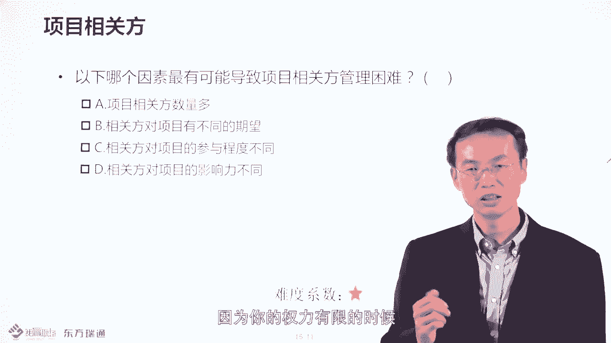

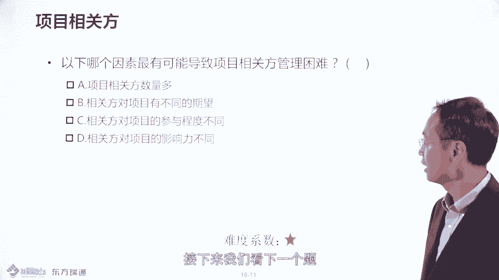

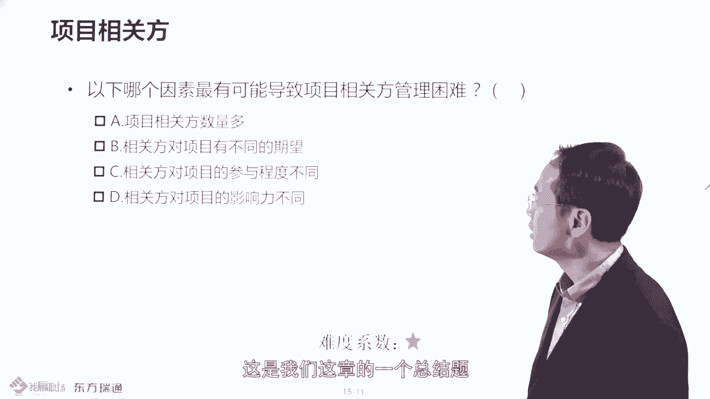

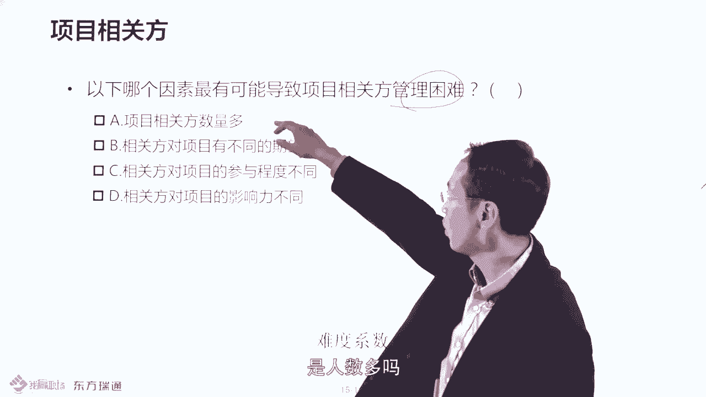

但案是。选B。相关方的人数多，不见得是一个问题，他的需求期望不一致，是一个问题要平衡。所以呢相关方的预侧不是说了吗？就是你要识别每个相关方的需求和希望。然后做到比较妥善的管理。

这就是相关方管理要做的事情。在说的这13章，我们专门有一章去介绍这些东西的。在前三章呢，关于相关方的定义。我们要知道相关方是能够影响你项目决策的个人群体或组织。

或者是自认为受到你项目决策影响的个人群体或组织。好，感谢大家的收看我收听，多谢。

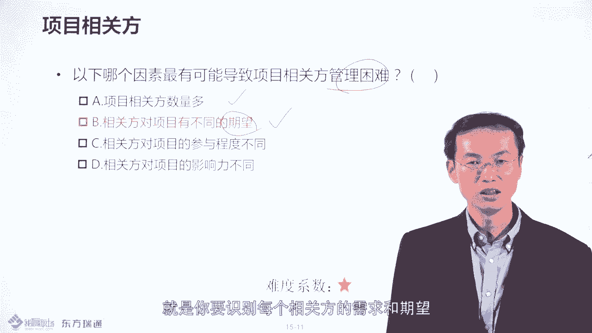