# PMP项目管理PMP学习知识快速通过PMP考试 - P16：项目管理的三大坐标-16 - 北京东方瑞通 - BV1df4y187rv

各位我赢的线场小伙伴们，大家好，欢迎大家持续关注PNP项目管理线上课程。本节呢我们讲述的是项目管理的三大坐标轴。所谓三大坐标轴呢，就是我们讲过三个生命周期。

比如说项目升周期、产品生周期和这种项目管理什周期。那我们首先通过这个图来看一下。那比如说这个图的话呢就是在讲述说项目生周期和项目管理生周期的一个大概的关系。大家知道说项目生周期的话呢。

是分成不同的阶段的，它是按基术维度的。比如说我们之前说了IP的项目的话呢，它都它会分成需求分阶段，项目税计段、开发阶段的。那制造业的话可能分成量产和市场阶段的。那这边的话呢，项目生周期。

这列是一个生命周期段这个一个大概时间纬度。那会划成不同的阶段，每个阶段都需要什么呢？都需要管。

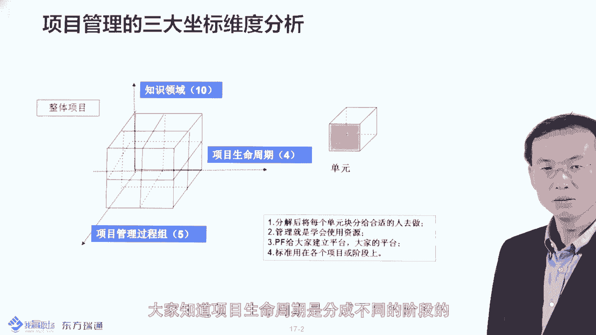

怎么管理呢？走管理过程，就是五大工程组，就是启动规划执行控制收尾和十大支领域，就是范围啊、进度成本，包括质量啊沟通等相关的控制。

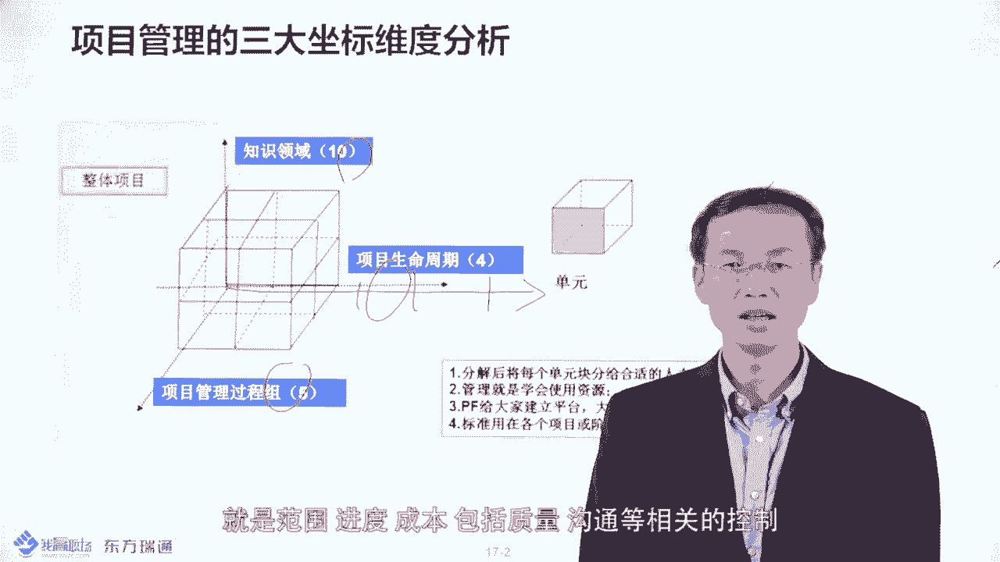

那我们分别讲一下，比如说呢我们刚才现在讲的是什么呢？就是三大坐标轴。三大坐标轴的话呢，起码我们看这个就是三大坐标轴。看到没有？就是项目生活周期是一个维度。而你的管理呢是两个维度的。一个是过程组的维度。

一个是知识领域的维度。在你书上的第25页专门的它的违章表嘛，就是讲大概的呃项目完成周期呃，大概的过程组和过程间的关系。那我们会一会讲到的。首先我们看一下呃一个维度就是所谓所谓的就是所谓的知识领域。

十大支领域的维度。那哪大军领域呢就是所谓的呃项目经理是一个整合者。那你要整合什么东西呢？整合具体的项目的范围管理。建筑管理。

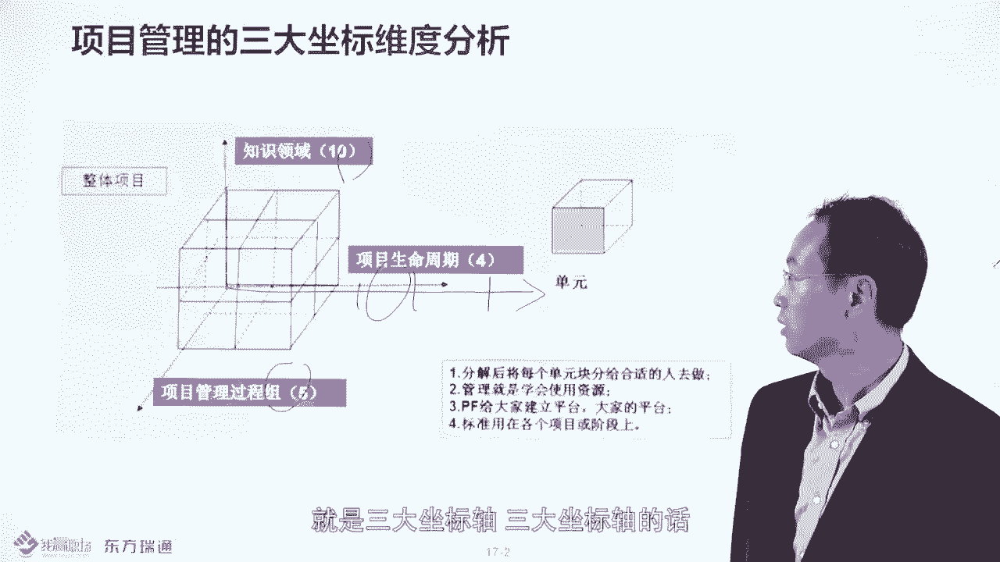

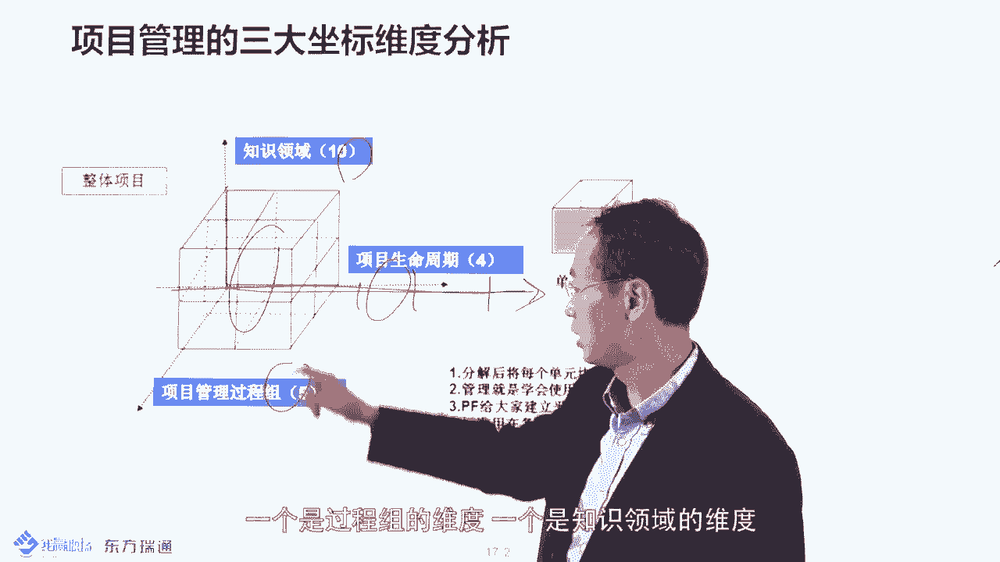

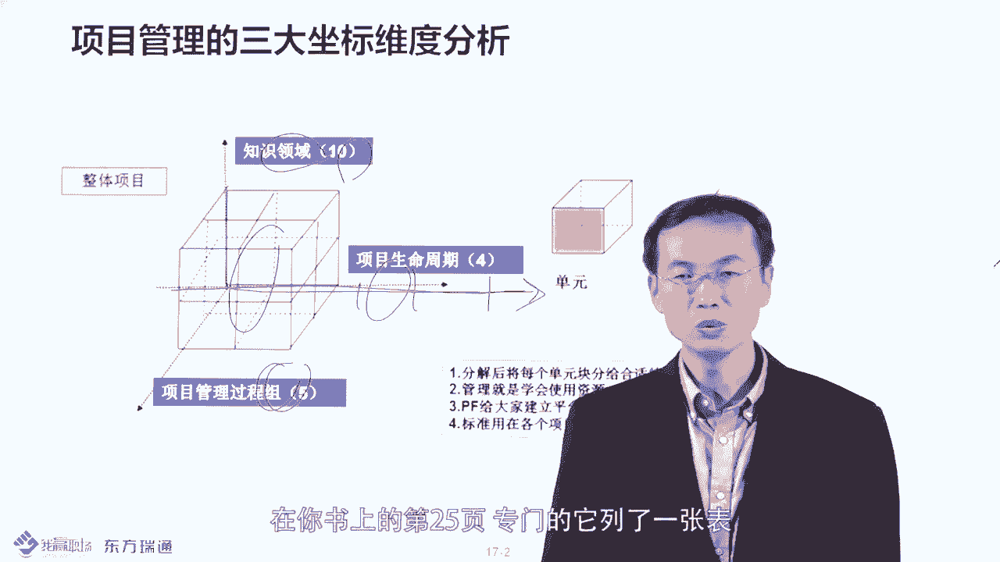

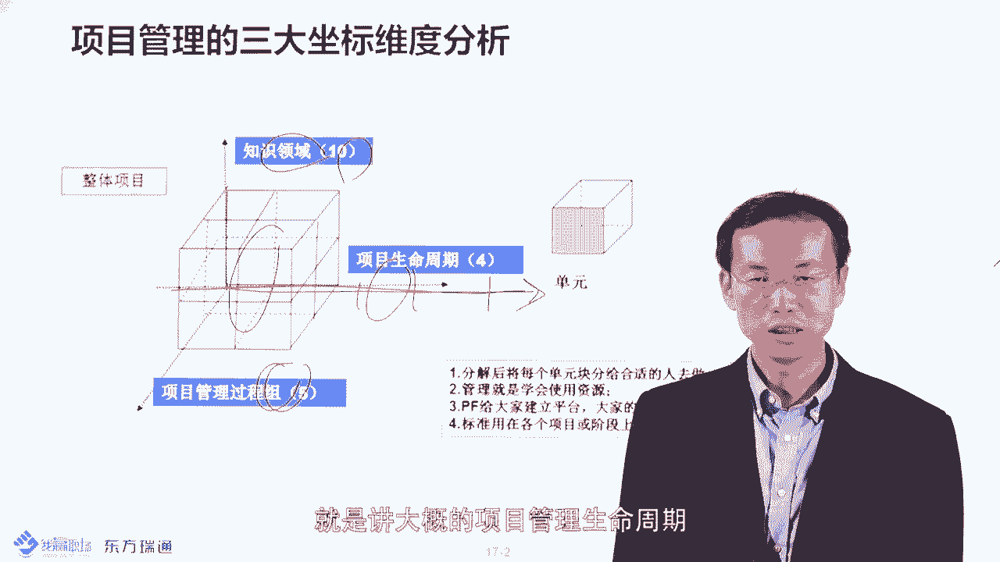

成本质量包括什么采购啊、沟通啊、相关方管理。比如说你从这十0个方面去管控你的项目的这叫十大知识领域。那大家给你看一下这十0个方面哪个容易管，哪个不容你管呢？那你说我不知道这十0个方面有什么区别啊。

所以这边的话，我们看一下这个图，这个图的话呢，能体现出一个区别。比如说项目的范管理告诉你什么呢？你要做什么事儿。

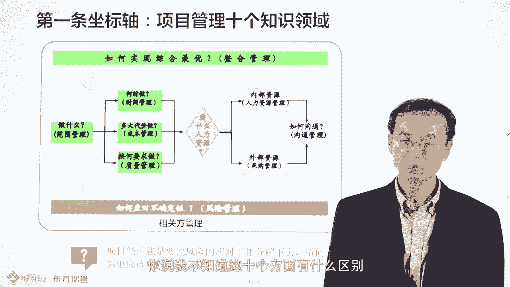

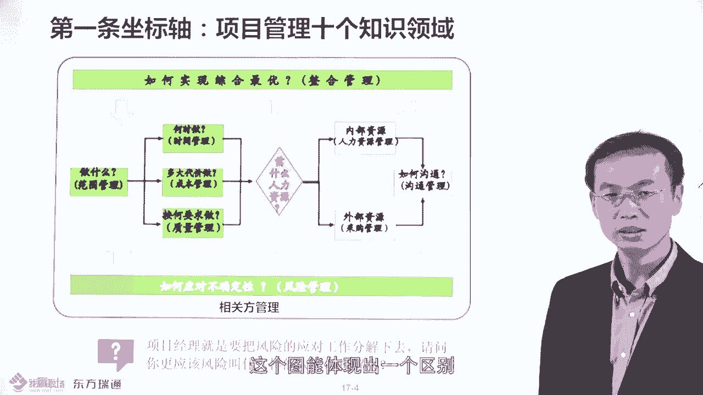

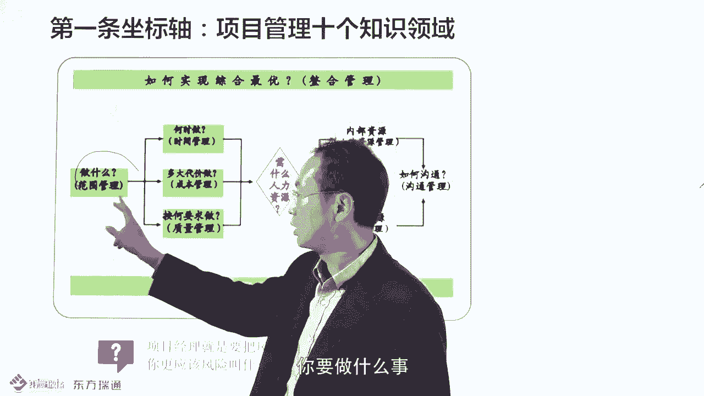

然后呢，时间管理呢什么时候做，你要做到基础排期。然后呢，成本管理呢要付出多大代价，就是你的预算是多少。

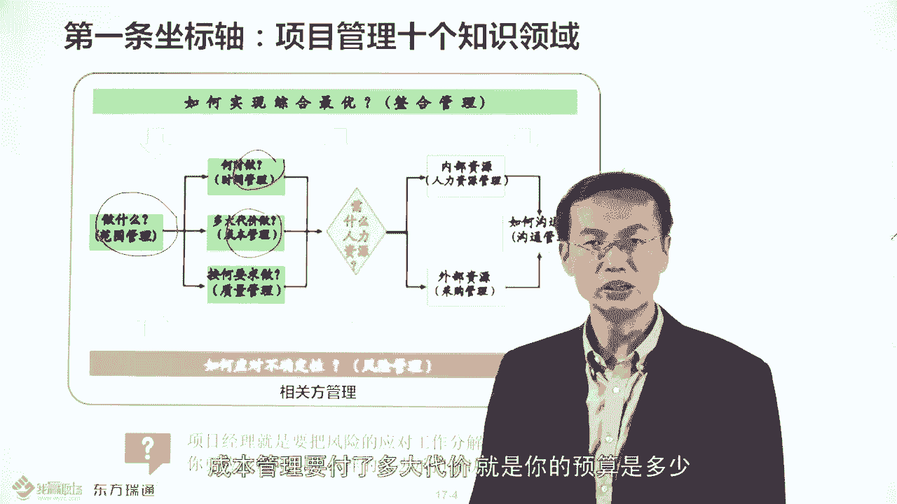

然后质量管理呢要做多好。然后并且的话你要考虑到用人去做事儿。那人的话呢可以来自什么呢？内部和外部内部找谁让人呢找职能部门经理谈判，获得比较稀缺的优势的资源，那外部呢可定找下包谈判，供应商谈判。

找到合适的资源和下包。然后呢，当内部的资源，外部资源都具备的话呢，你要找资源是什么沟通协调，为什么呢？它可能什么做事啊，不给力，对吧？你要找谈判，是这样的，沟通协调，就是沟通管理。然后呢。

你要考虑到整个的项升周期的话呢，或者管工中周期，你要考虑到跟相关方要管理他的希望。因为相关方的需求期望不一致，导致项目管理复杂，你要平衡相关方的需求与希望，就是相关方的管理。然后呢，在整个什周期的话。

你要考虑什么呢？考虑到风险管理。什么叫风险呢？任何不确定性的因素都是风险，比如说进度可能超期了这个成。

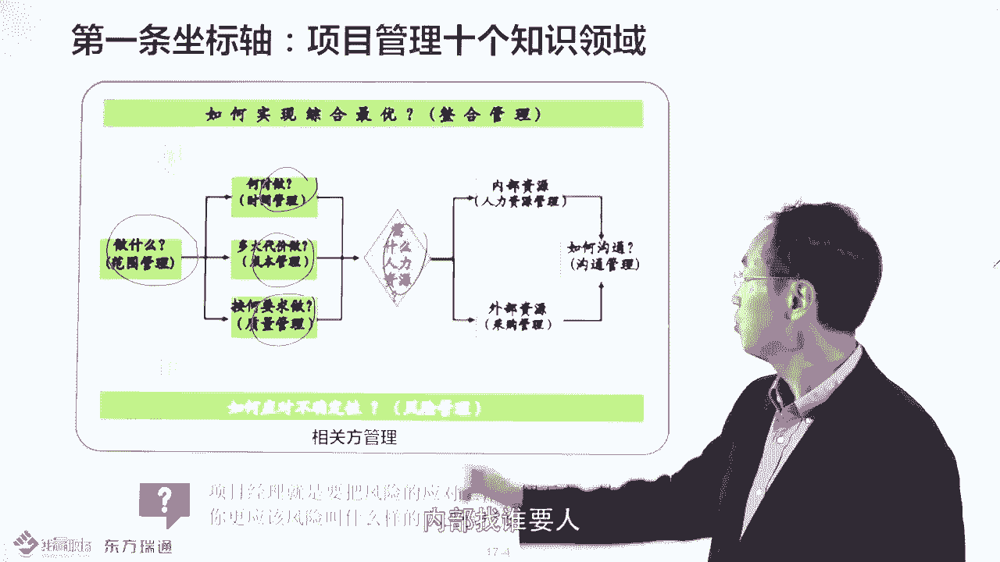

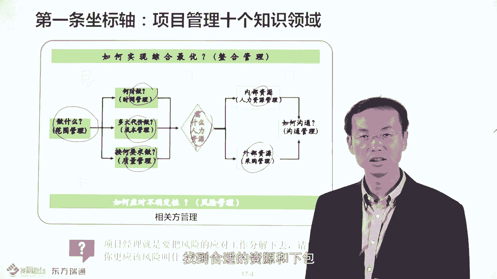

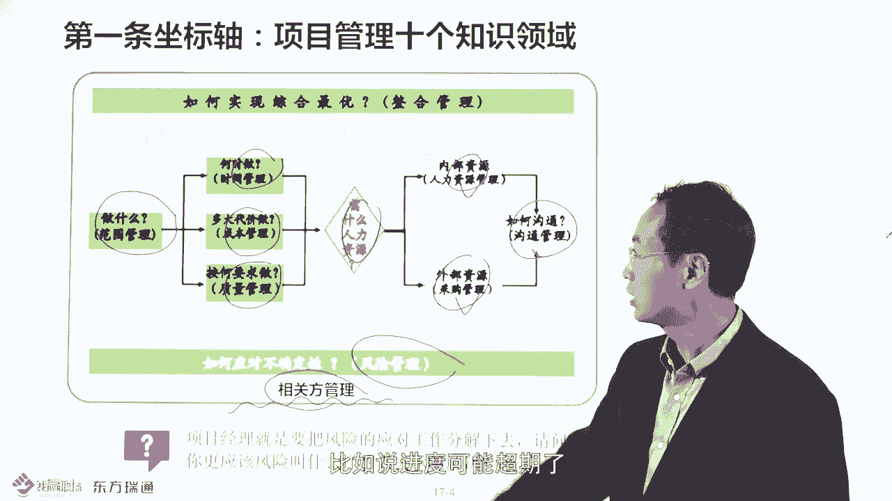

有可能超了，外围蔓延了，都有可能。都是有可能的对吧？所以这都是风险。那基于这个表，那再来问一下大家啊，你觉得哪个比较难管控啊？有些同学说，哎，范围可能经常会什么呢？蔓延这个是很重要的。对的。

或者是什么呢？哎时间有可能会延期，成本有可能超了，客户不验收，有为质量不无关，是不是这些忠体类的都可能是什么啊？都可能是风险。所以呢最难管理的就是风险。你风险就是一种不确定因素，有可能是范要蔓延了。

有可能是进度快延期了，有可能是什么呢？这个预算会超了，都是风险。那所以呢我们之前说了，呃项目的问题风险应该要有一个文件，比如说风险登预测去记录这个风险，考虑到可能的应对的责任人是谁？

那这边的话回答一个问题，比如说你有识别了这种不确定因素了，或者识别这种风险了，你找人去承担去解决，难道这个风险应对责任人，一定是你项目经理自己吗？最好不最好不是你自己。那要把这个风险应对的。

这种责任呢分别给你的团队成员，让他们去做。然后你去什么呢？做监控就可以了。那你说呃有些时候呢我需要领导做事啊，就向上沟通啊，要领导那个什么给资源呢，给钱呢。

这个时候你要调动领导的资源的话是很难的那问大一个问题，请问你能不能那个什么呃跟领导说说你要把这个资源给到我，把这个钱给到我，我才能做这个事儿，或者做个风险应对。如果你不给我的话呢，就没办法做了。

觉得能不能这么做这么跟领导说话呢？最好不要因为这是死索，你就跟领导说啊，这不给我，我做事儿要不给我就不做领导会觉得你在要挟他是不是？那怎么办呢？那你应该怎么办呢？要跟领导画大饼，因为领导像风投一样。

他把资源钱给到你不给别人一定有道理，对不对？那给他画大饼能画大饼呢？你跟他说tomorrowming，明天是美好的，对吧？如果你把这个钱这个资源给到我。

我会给你创造更多更加什么意想不到的什么am amazingazing的 value就意想不到的价值。这样的领导他会被你忽悠了啊，当然了，你交付的如果能把这些东西价值能达成的话呢，不算你忽悠，对不对？

但你前提要具备什么呢？能够画大饼的能力，谁最容易画大饼呢？谁最擅长画大饼呢？马云呢？对吧？比如说马云的话呢在刚99年在创立大饼阿里巴巴的时候，他给下面团队成员这么画大饼呢？

他说我们要做一个阿里巴巴的网站。这个网站的竞争对手不在国内，要在国外，我们要跟什么易味竞争，我们要跟什么呢？亚马逊竞争，对不对？下面人听着一愣一愣的，但是还是信我跟我走嘛，结果信他的人都成为亿万富翁了。

是不是那十8个创业的，哪个不是亿万富翁吗？是不是有些时候呢还要具备在你还没有梦想成真的时候，这个牛呢，这个牛皮还要吹出去，那马云就是很典型的一个吹牛的对吧？哎，他哎把这个这个牛皮竟然给吹实现了。

所以他就他就到了一段时间的中国首富嘛，是不是啊，所以要了解啊，所以呢作为项目经理要有像马云那样的吹牛皮的这种能力，还有达成这个牛皮能够不要吹帽的能力，对吧？达达成这个这个交互能力，这也是你要做到的。

那阿里巴巴做的不是很好吗？是这样的。好，然后现让我们看一下啊关于这个十大的知识领域这边的话，给大家总结一个词儿。来你看一下。

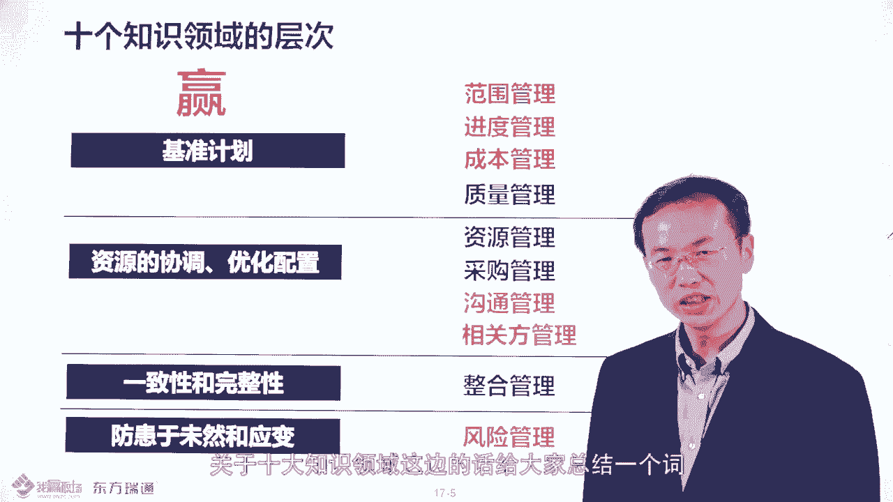

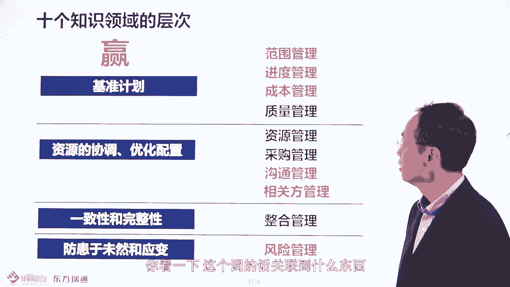

这个词儿的话呢关联到什么东西呢？比如说就这个词儿就是。

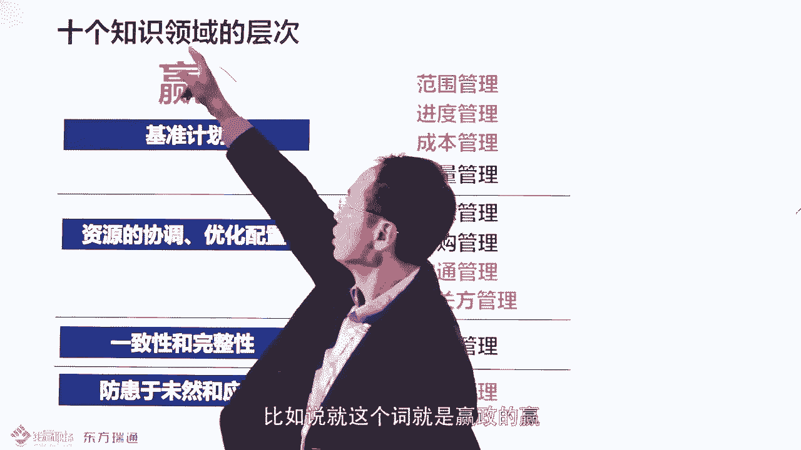

嬴政的嬴，大家照秦始皇应嬴，嬴在政治上这个名起的很好，所以才能统一入国，是不是？所以这个嬴这个字的话很好。上面呢是王王表示说风险，风险是最难管控的，叫有忧患意识，啊，孟子曾经说一句话说国无敌国患外患呢。

国恒亡，国无敌国外患，国恒亡。那也就是说生于忧患，死于安乐，对吧？要有风险危机意识。那老外也有这样的意识的。比如说有一个考点叫莫非定律。

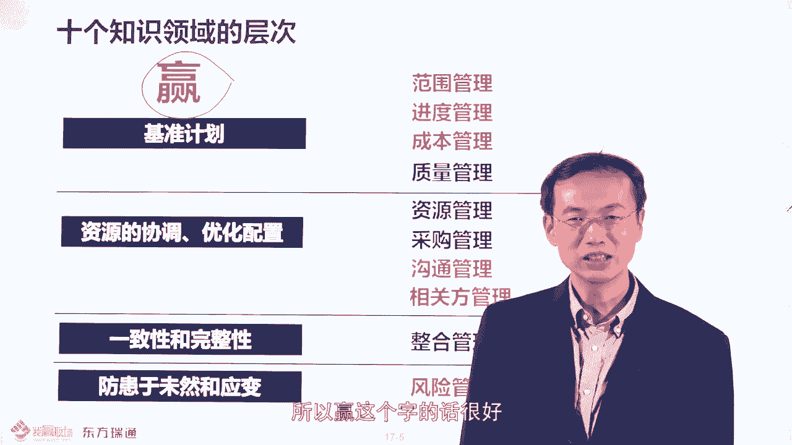

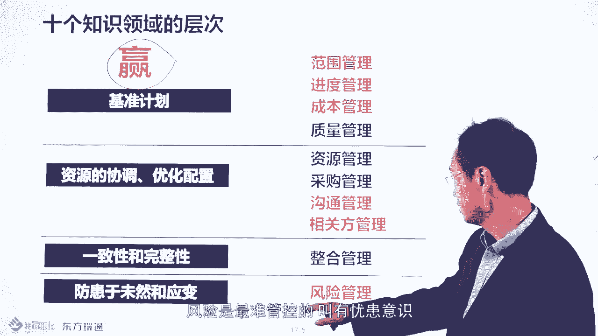

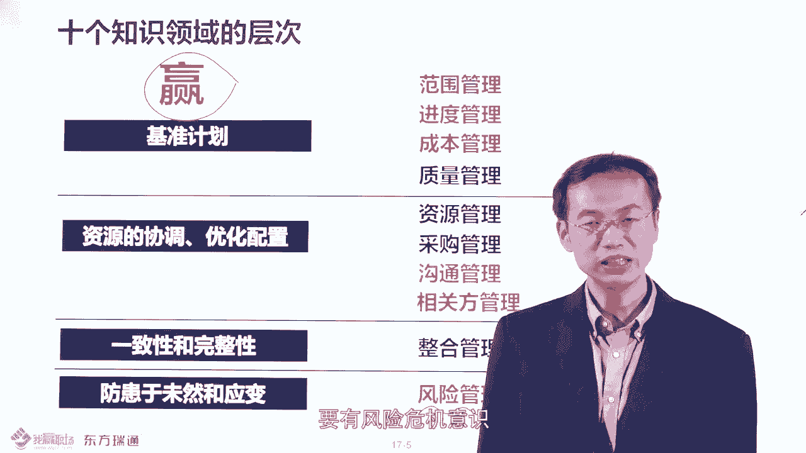

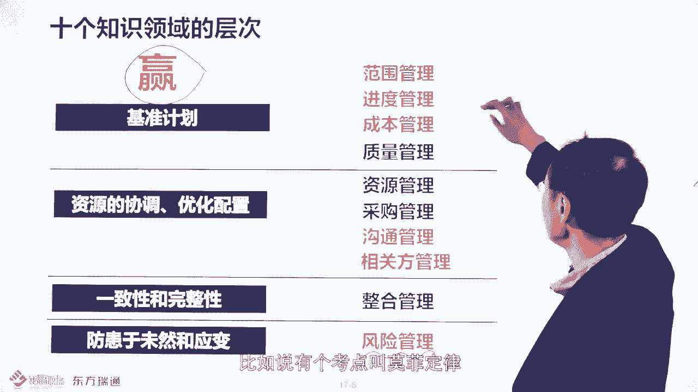

莫是莫言的莫。非是这个非字头加个非常的非墨非定律，就是有忧患意识。什么叫莫非定律呢？当你怀疑这个事情呢有风险，它一可能会会发生的话呢，它一定会发生的，这叫墨非定律。

比如说过年你怀疑呢你开车回家呢会堵到高速的路口上，那就会堵上去。你怀疑呢这个机票呢买不到，可能就买不到了哎，这叫墨非定律。墨非定律告诉你什么呢？就是要有忧患意识，就像孟子那种说法，叫生于忧患，死于安乐。

不要把它呃把它记成莫言的，是莫非不是莫言哈，啊，莫非定律，不是莫言定律啊，但是这样子好，不要了解，因为莫言没说过啊，好，那我们接下来呃要知道就是说这个风险。

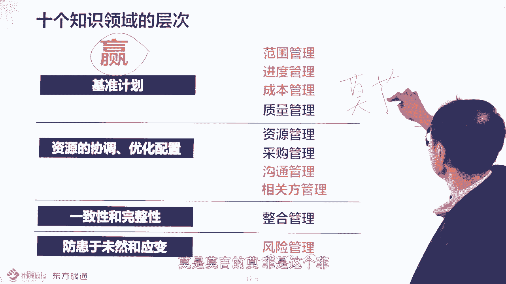

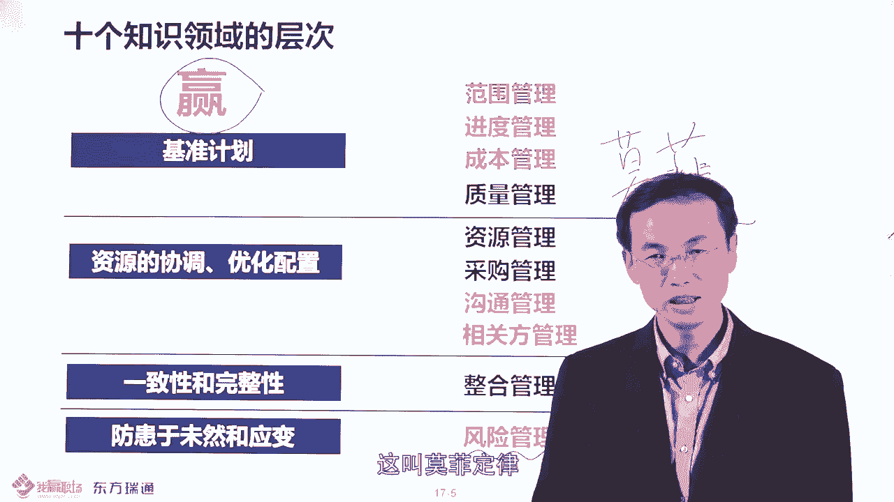

风险啊就是属于什么呢？叫优患意势。然后呢，还有这个口，你看这口是叫沟通协调，所以它会涉到沟通管理。

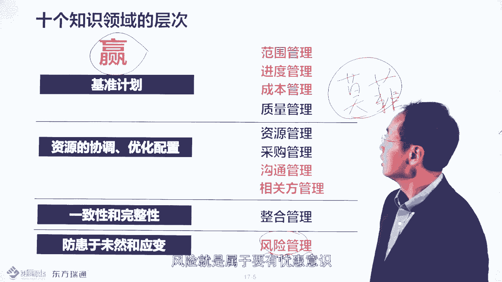

然后接下来看一下这个月，你看这月就是叫什么呢？人月嘛，人天肯定是什么时间进度管理。那那个背呢肯定是甜了。

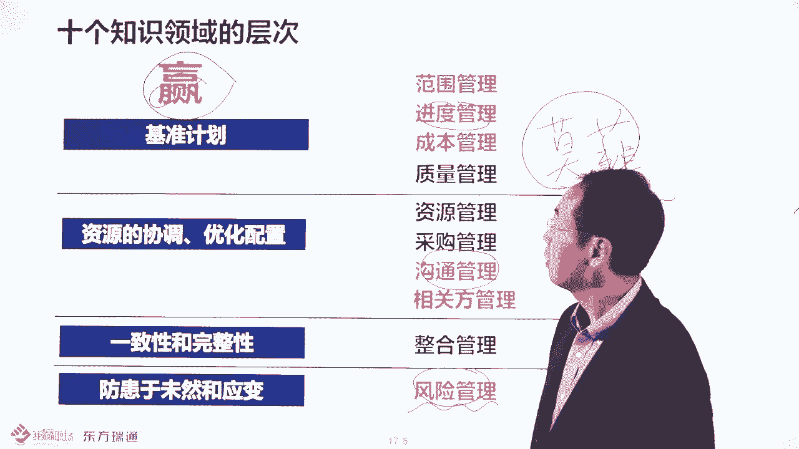

然后呢，这个。哎，那个烦呃烦是吧？哎，你可以呃理解成范围，其实我更加强调说是有一个什么平凡心。比如说当部分客户说了，做项目的时候或者说做一个工作的时候，你要确保成功的话。

要有一个很好的平凡的心态或者良好的心态嘛？哎，这种思维方式，那叫思维方式，有正确的思维方式，付出，不亚于任何努力，然后呢，不要有感性的烦恼嘛，因为什么呢？你在跟别人沟通的时候，在跟干心沟通的时候。

大家知道说人上100形形色色，对吧？你什么人遇到不了呢，对吧？有可能就有交关方值得给你骂你的，对吧？有可能上来就可以动手的那种都是有可能的？那你要要有什么？要有平凡心，不要以暴制暴。

是不是就要了解到这个这样的一个场景哈。所以作为项目经理，作为管理者，你的EQ比较高，否则的话呢就很难动不动就发怒，就很难成为比较高大上的管理管理者。好，要。

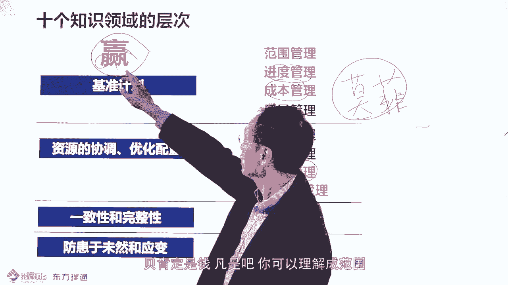

学会包容别人的缺点。这就是刚才说的十大生欲。那再看一下五大过程组。那五大工程组这边的话呢分成什么呢？启动规划执行监控和收尾。在你说的第25页呢，也涉及到了在这25页啊，那这边有考点的。

在我给大家这个就是说我们给大家的这个分享资料链接中呢，有一个文件。这个文件呢叫什么呢？叫偏批强化预手册2。1或2。2版本。这个版本里头呢，就是一个excel，它会把一些在关键识点呢做做一个罗列。

那这里头就会涉及到五大工组和十大之领域的内容。那里头的话过程组的话启动规划执行监控收尾。那会有什么样的考试要点呢？这边是这样的，首先启动是要制定降章程立项的，立项是要审批的。审批之后的话呢，需要开个会。

叫做 initial命题。这个会要记住，包括它英文。这边呢要知道一个知识点，是项目章程审批之前开这个会呢，还是之后开呀？刚才我说过了，应该是审批之后开开会的目的什么呢？就是告诉大家，他是项目经理。

然后呢，公司呃授权他督组资源去做项目了。这叫做民正还言顺。然后呢，在规划阶段呢，项目经理需要组织大家去做什么呢？去做一个项目管理计划。然后呢，相关计划也是要审批的，谁审批啊，关键相关方啊。

有加乙方的高层啊审批审批之后要开一个动物员大会，这个会叫做开题会叫kickoff meeting。那这边的话呢，考试的时候，他可能统一班一层启动会。

所以必须要看它的英文是unitial meeting还是keick off。因为unital meeting的话呢是发生在启动阶段，是在项目章程审批之后开的。

而kickoff meeting呢是发生在规划阶段，是在项目管理计划是不是之后开的，这是不同的那开机会的目的干嘛呢？就是我的计划已经包括范围里定了，我要召集大家干嘛干活，对不对？

要统一大家的目标和意志干活是这样的。我们日常所说的，在我们中国很多时候开那个跟甲方明确工作任务干活，那个会是启动会还是开机会呀。即实是。开机会理解吧？但是我们通常叫做启动会。

所以说你要知道PNT开会的话是有两个会的，两个关键会议，一个是启动会，一个是开机会，要明确知识点的。启动会是在项目章程审批通过之后开的，然后做一个授权的大概的一个通知，啊，通告大家说你项经理。

那开机会是项目关理计划审批之后开的。啊告诉大家，这个这个事情是办这样的计划是这样的，按照计划去做事，是这样的啊，大要了解。然后作为项目经理的话呢，按照计划去督导大家执行。然后执行有问题的话。

要偏差需要监控，然后比要时候发起一息变更的修正变更申请，而且变更之前说了，一定正式书面提出来。然后呢，如果绩效没下的问题的话，你的项目阶段或者整个项目就会以什么收尾的就验收收尾，是这样的。好，要知道在。

呃，五大工组里头启动规划执行监控收尾，它是循环往去的。每一个呃项目的什么每个阶段都可能走这个五大工程组都是要管控的。它是管控的一些过程度。大概这样子好，为要了解，我们再重申一下，回答一个问题。

项目启动会，你那手命请是在哪个工程组里头呢？是在。

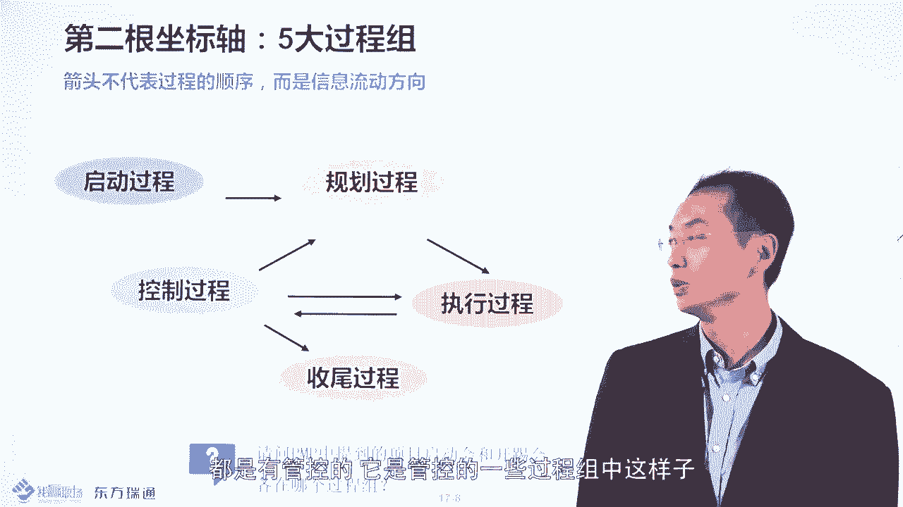

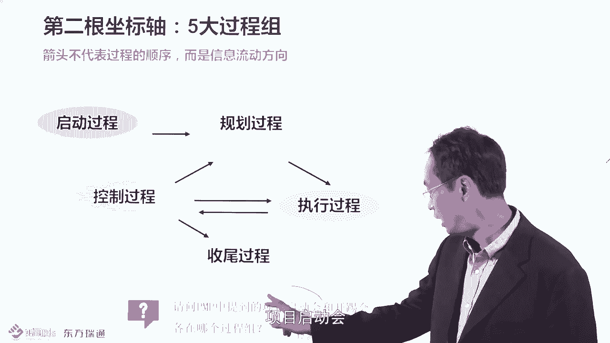

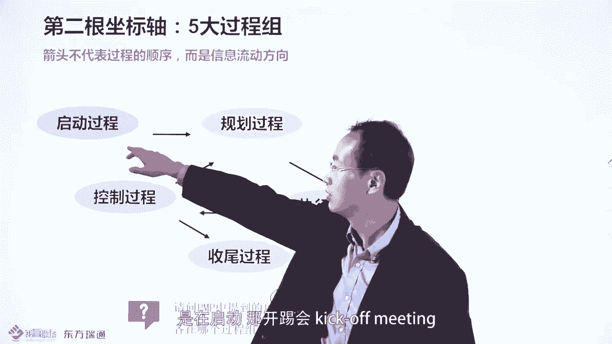

启动，那开机会呢开考密行呢是在哪个过程主力的？是在。

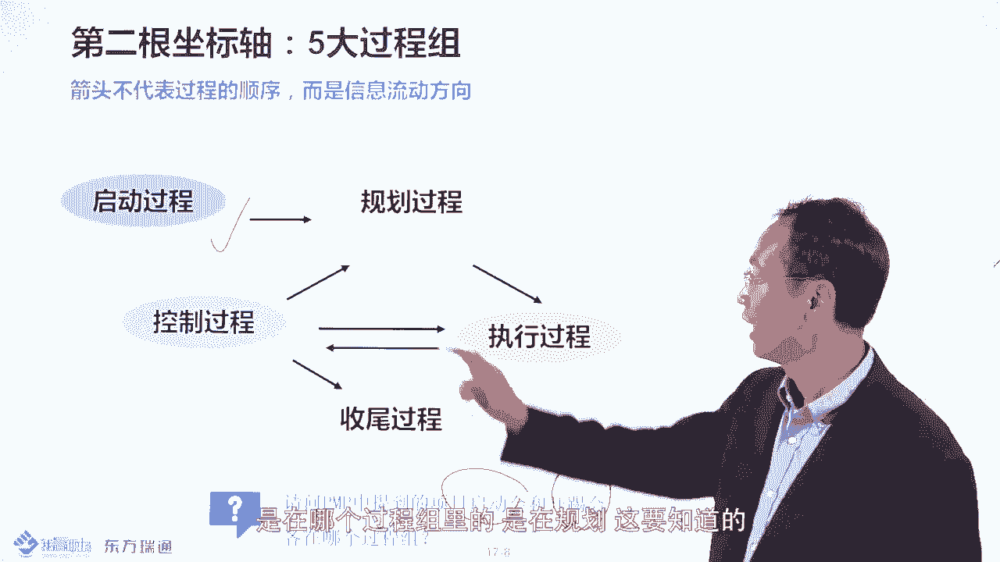

规划这要知道的，一定要记清楚。而且如果考试的时候它都发言成启动会的话，你要看是民手 meeting题还是K靠评题。你的民手名题的话呢，是在这个启动工组的。然后呢，K靠评题呢是在什么规划模组的就要知道的。

要明确区分开。好，在你的书上的大概的555页，大家可以看一下，那你说的话要画了一个图，这个横坐标就把它表示成项目的生命周期。然后项目或者上升生周期的某个阶段。那它会分别走什么呢？

启动规划执行的大概的一些过程组的过程。那么大家一个问题，呃，在项目生命周期中某一个时间点，同时由最少。

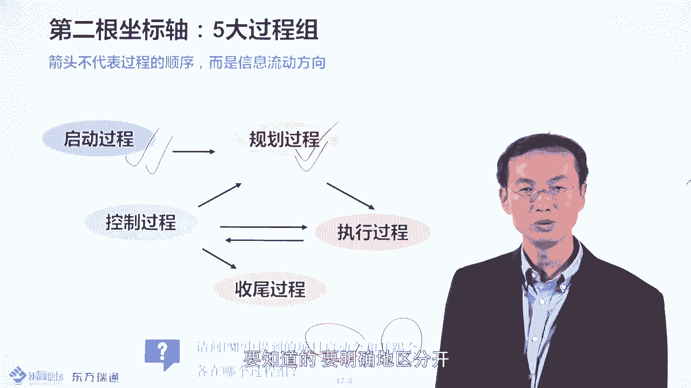

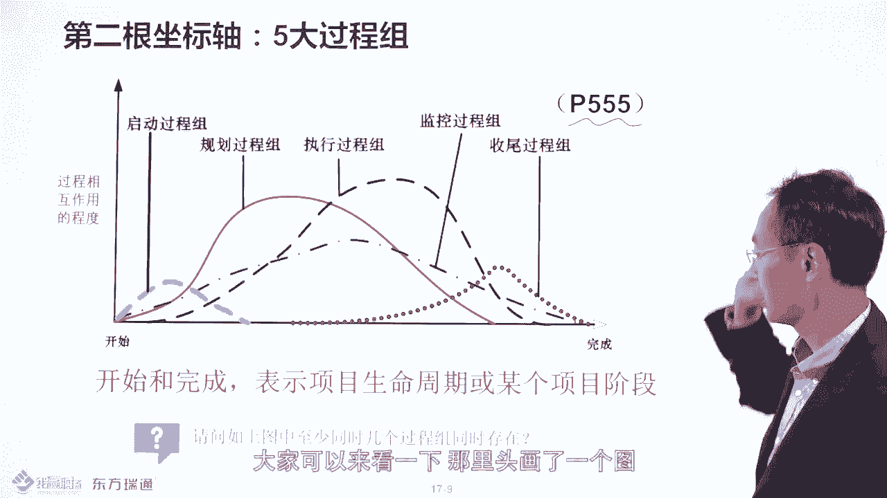

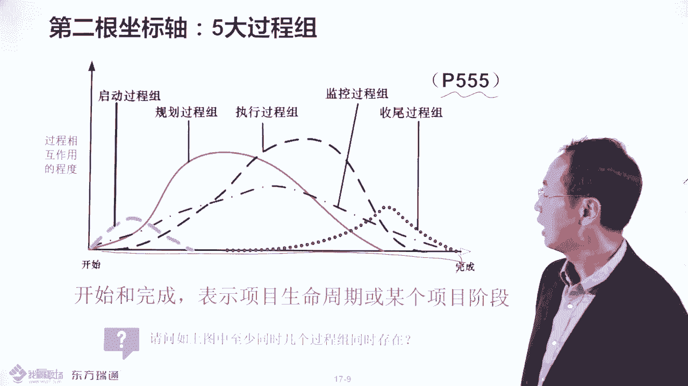

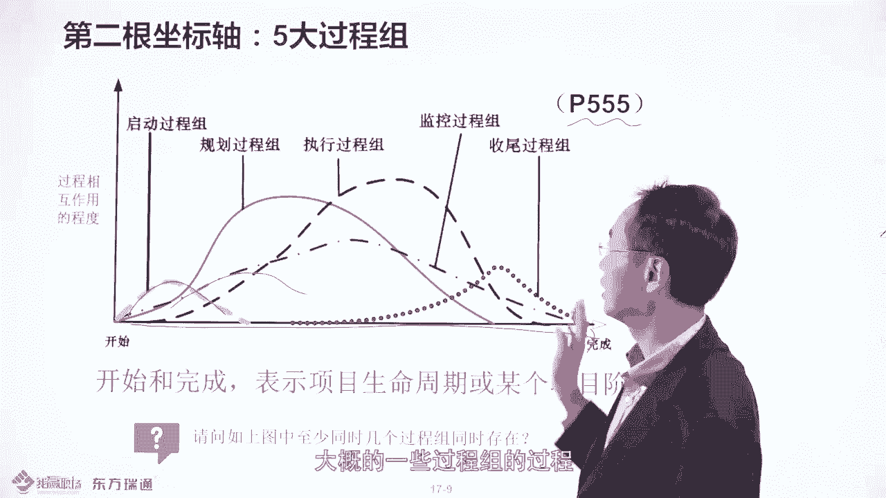

有几个过渡组同时作用啊。答案是最少有3个，为什么呢？因为启动和收尾中间有个断档。啊最手就散多。对吧好了，那么大家下一个问题呃，哪一个工程组贯穿项目管理的始终呢？答什么，答案是。监控文部看到没有？

因为他从项目授权你或项目经理到最后一步，你都是要监控的那这边有个考点了，最后一步是不是以签署项目的完工报告为基准呢？就是说最后一步我拿到完工，这算讲完事了，是还是不是？答案是否定的，是不是的，为什么？

因为最后一步是什么呢？最后一步PMP有个标准说法，在收尾过程中有个标准说法，最后一步是遣散员工。比就说你拿到管控报告之后，你还要什么呢？去做项目的什么绩效审核呀，包括组织工作展更新呢，今营教聘总结呀。

这些事情都做完了之后，才能够收尾的最后一步是遣散员工，遣散到哪里去了？遣散回职能部门。比就说你做项目经理，你的项目工作都是由项目团的成员帮你做的那人都没了，相当于活也没了嘛？是这样的。

所以说你的呃项目管控的边界就是别有一个专门的一个定义，你叫项目边界，在输的562页，是你可以看一下项目的管控的边界什么呢？从授权你当项目经理开始，到最后一步什么呢？遣散员工，这个过程都需要什么去监控的。

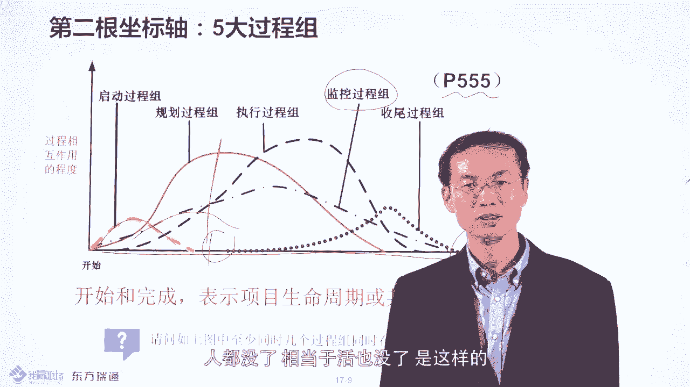

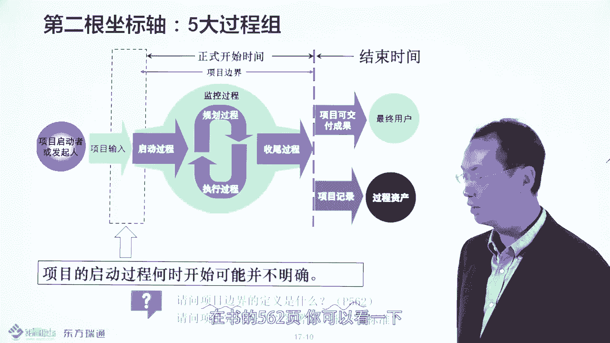

所以监控文组的话是贯穿项目的管理的始终。也说大家对项目呢都不那么上心，那你不能不上心，因为你是项目经理，理解吧？你要确保从授权人开始到最后一步潜散员工，整个的过程呢都需要做管理和控制的，是这样的。好。

然后这边的话呢呃关于这个启动规划执行控制的话呢，这边是有一个过程的什么呢？一个过程图的，请大家翻到27页，这里头你可以看一下。

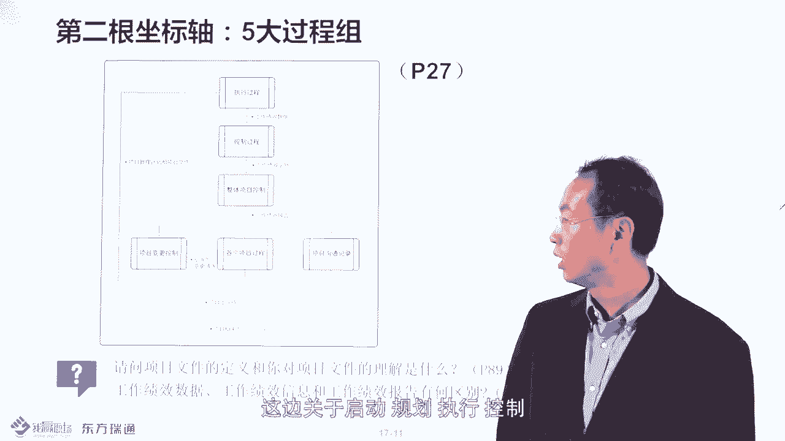

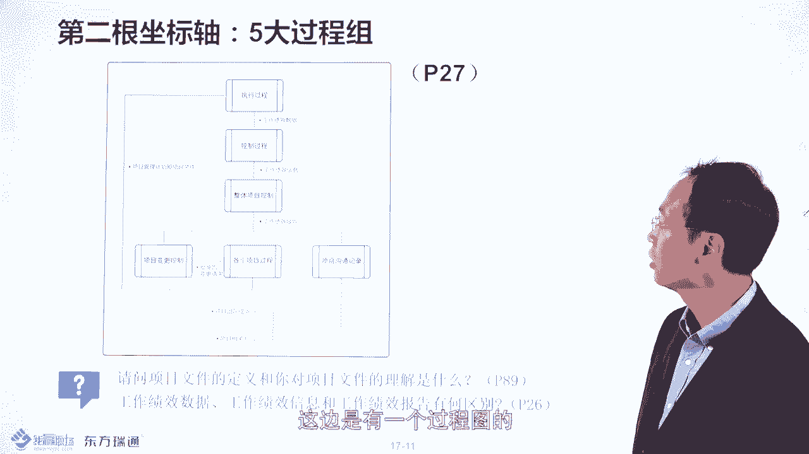

在执行工作组这边的话呢，它产生的一个东西叫工作绩效数据。

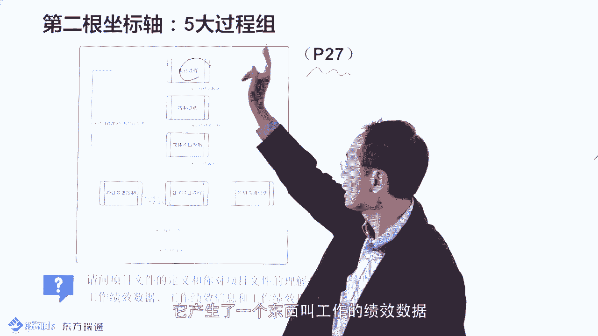

在监控组这边的话，它产生了什么呢？是工作效信息，最终汇总成什么工作绩效报告，这个图呢需要看得懂。

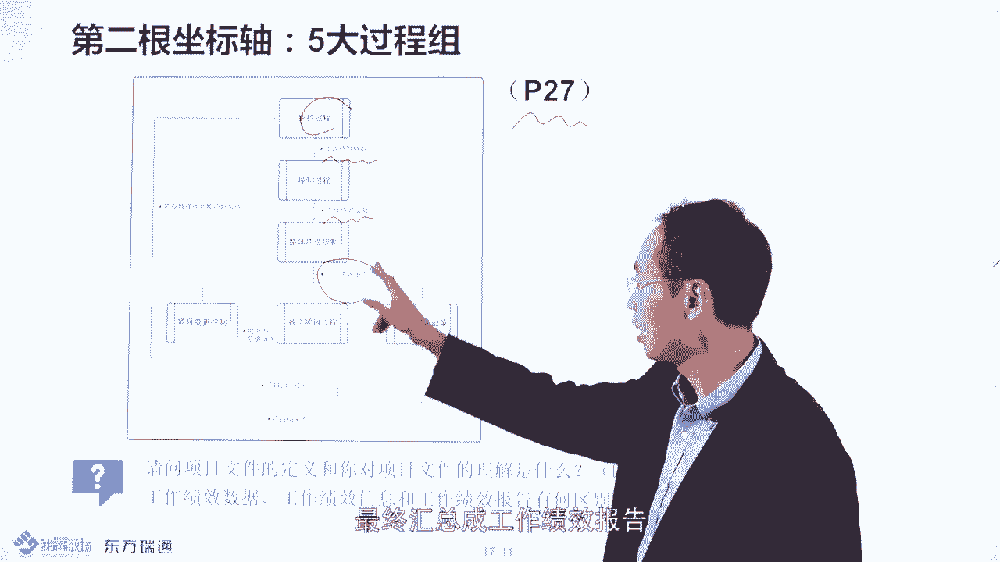

那看懂什么东西呢？需要看得懂工作绩效数据信息和报告的区别。那这个这个往往如果你没有按照标准的这种项目管理模式的话，你可能是区分不开来的那这边呢是这样的，我们典型的一个区别是这样的。

工作绩效数据是对原始数据。经过整理之后产生了什么进术绩效指数啊，成本要指数。比如说呃比如说最典型的应进入效指数的话，我们最容易理解的，就是开发任务的按时完成比例。

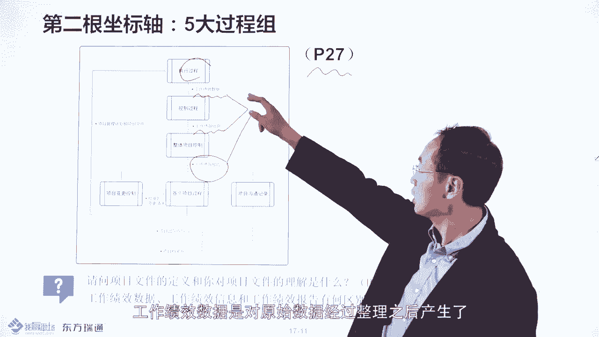

然后呢，你把这种指呃这种绩效指标汇总成一个报告对外进行发布告给相关的领导去看这种报告啊，好了，那一般来说呢，我们可以简单这么理解数据信息都是对内的一些大概的内容，对吧？

然后呢数据是原始的信息是并过整理的然后呢对外发布的是工作效报告。那这么讲的话呢，你可能是知悉然不支其所以然，比如得还是浑浑浑合合的，对不对？是不是很很容这样的反这样的一个大概的一个感觉。

所以一定要给你模板给你实习的例子，那你看到他们的区别，你就怎么眼见为实嘛。所以这边的话呢，这是为什么我给你那么多模板的原因。好，首先关于工作教育数据，信息和报告的话，那你输了第26页呢，这边有描述。

先看一下理论，理论是这么说的，工作教育数据的话是指原始的一个执行结果。你看比如说一个活动的实际。

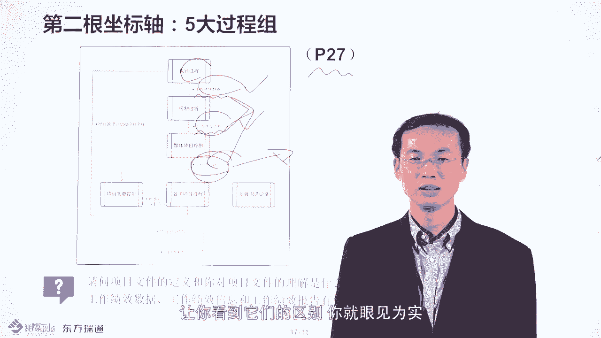

开始结束时间就是工司最原始数据嘛。然后呢，经过整理之后就变成工作绩效信息了。比如说可交付成果的状态。比如说验收状态，然后呢汇总成一个报告来指导什么指导未来的什么决策呀，比是报告，那所你想什么样子呢？

给大家看一下，比如说我给你的一个表格中，比如说相关计划，这以这样在以这子层的话呢，哎什么叫做工作绩效数据呢？比如说一个任务还有个计划开始计划完成，实际开始实际完成日期。所以说你看到实际开始实际完成日期。

包括完成了大概的简单的一个百分比，就是最原始的那这个东西呢可能是工作绩效数据。那最起码你要知道这个是起码是工作交效数据呢，就实际开始的结构时间，最明显的对吧？然后什么叫工作绩效信息呢？经过整理的。

怎么整理呢？比如说你的交付清单是整理的对吧？那你的交付清单里头，你的关键的可交。

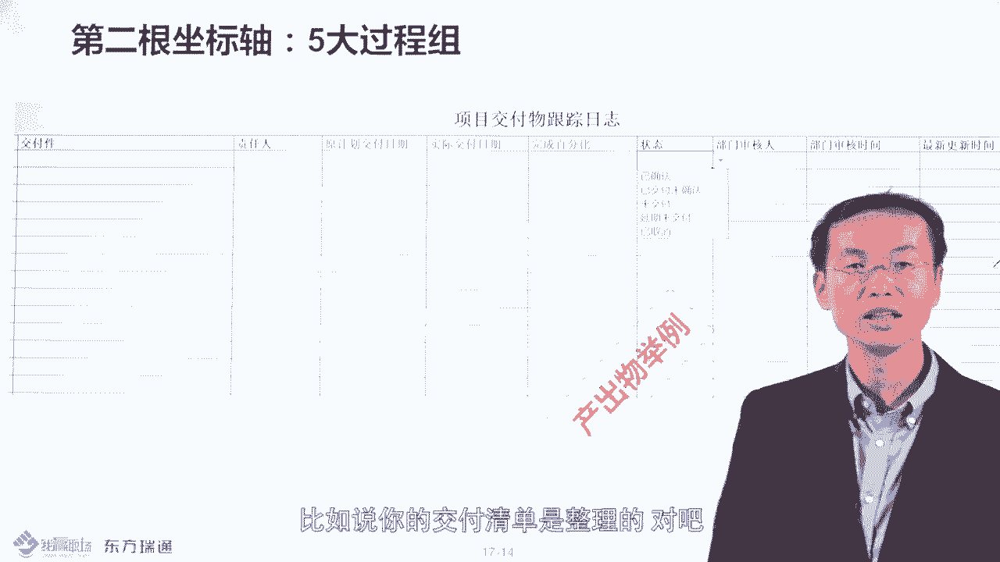

包括代码也好，包括文档也好，那你的交付状态就是经过整理的这个交付状态就是绩效。大家可以看一下，那这边的话会涉及到什么状态呢？比如延期未交付，交付未确认交付已确认，之前不跟大家说了嘛。

你做项目经理要针对这个交付状态要留有证据的嘛，对不对？那你就整理了相关证据嘛，是这样的，所以。

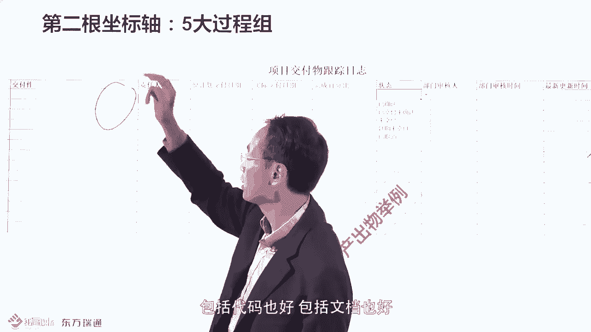

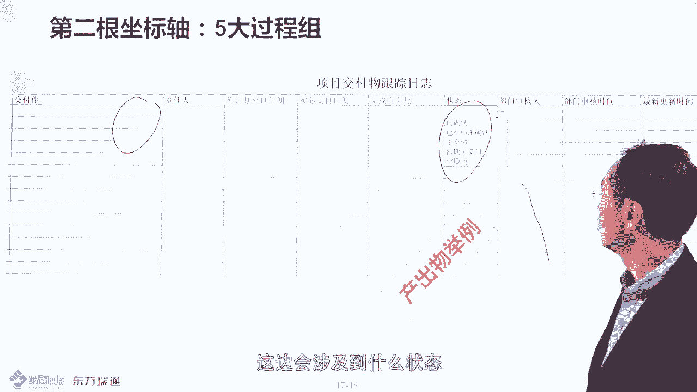

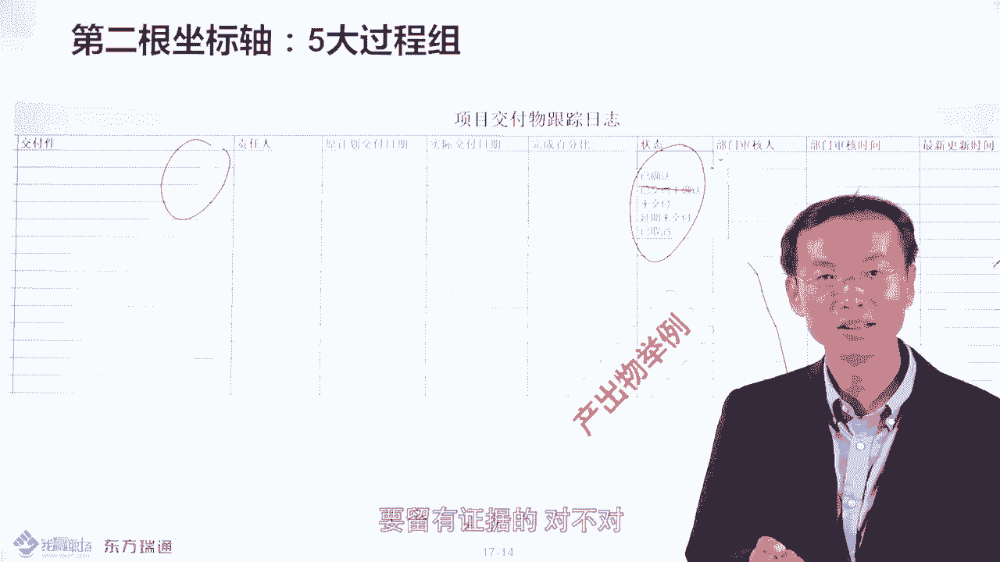

这个就是什么经过整理的工作绩效信息。那什么样实施工作效报告呢？就是指导决策的那你要看一下你的进度成本质量各方面的维度是标绿的，标黄的标红的，一旦标标红，对吧？一旦标黄，比要建议行动和整改方案嘛。

这叫做指导决策是这样的。所以你看我给你的那个表格就都有了，有既有工资效数据，比如说一个活动的实际开始进时间，又有工作绩效信息，经过整理的标付的什么验收情况，然后呢。

还有什么指导决策的标绿标黄标红的什么绩效报告，是这样的啊，都要了解他们的区别。然后接下来我看一下呃，这个是项目升周期的话，第三个坐标轴的话呢，就是属于什么呢？呃，属于这种呃。

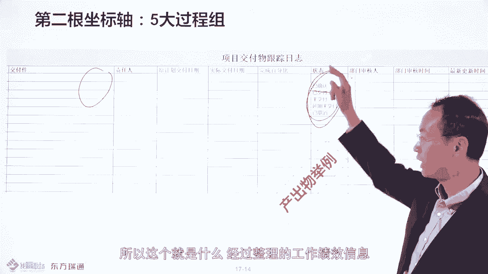

哎，这边的话呢就是属于象升周期的那个大才说的是管理坐标轴了，它第三坐标轴是指这个再看一下。

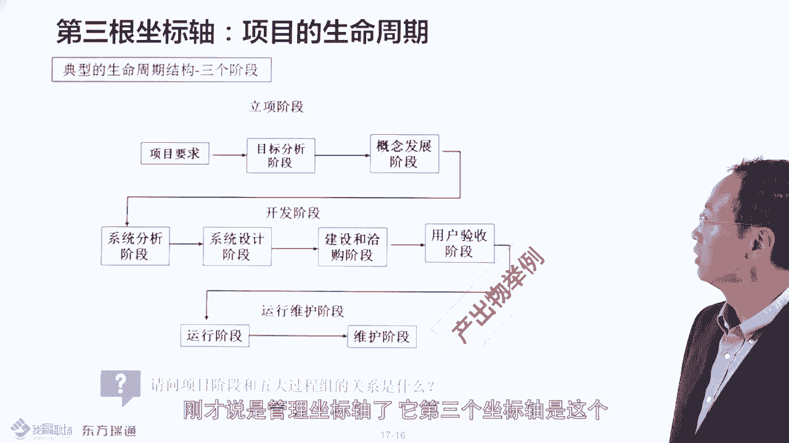

就是技术家的工程中。

这儿呢就是说刚才我们看了两个坐标轴的话，一个是什么十大之女，对不对？一个是五大公主嘛，对不对？第三坐标轴就是这个这个呢没什么好说的，之前一直说了，它是技术维度的。比如说IT类的项目和什么呢？

制造类的项目的话呢，它是是这个技术维度阶段是划分是不太一样的好，所以说你可以看举个例子。

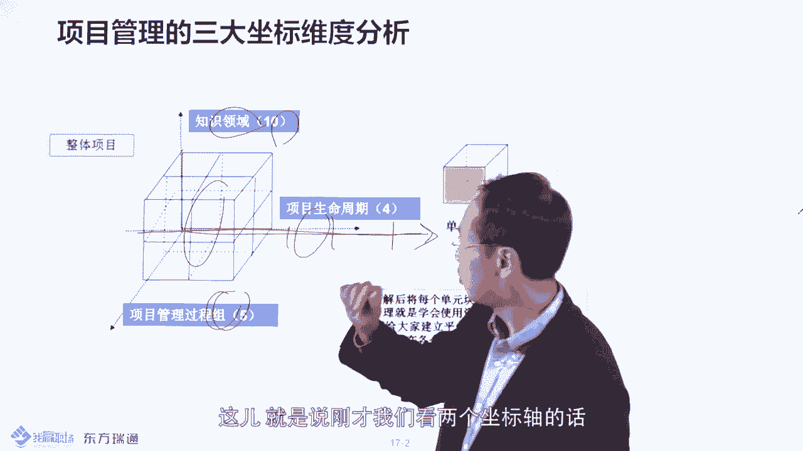

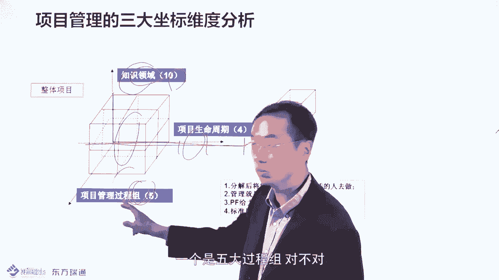

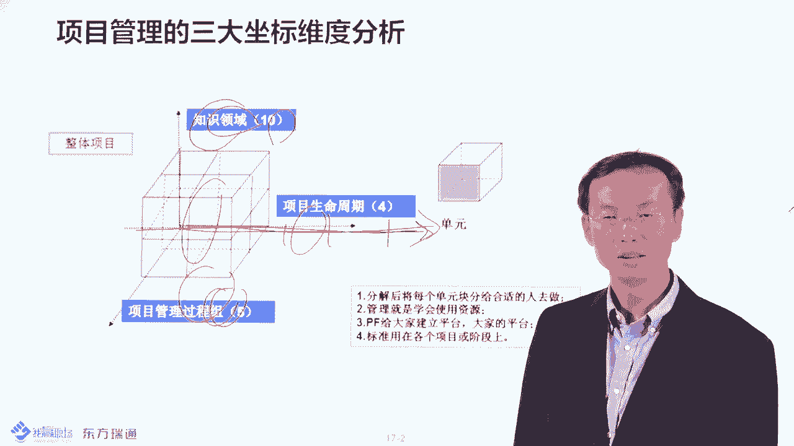

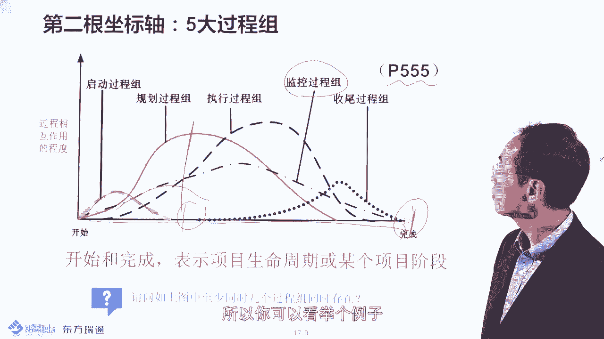

比如说你看这就是很典型的一个什么，就是那种这个是IT的，看到没有？这个降升周期它分成什么需求分级段呢，概要设计段呢，包括详应设计段呢，包括什么这个测试，包括什么单元测试。

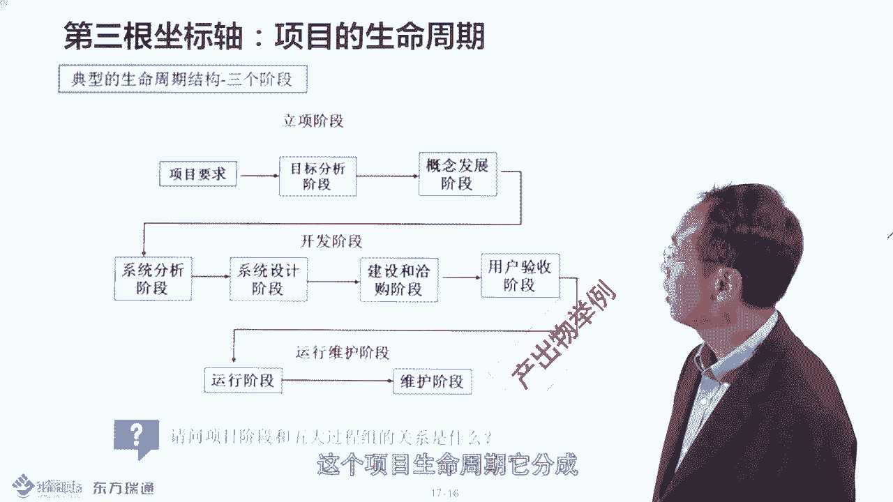

啊，集成测试还有优A机测试是用户可接收可接用户可接收测试这样的。但是其他类型的项目未必这么划分。所以这个呢一般是不太经常考的，为什么呢？因为因为偏P，它是说不是指专职IT类的项目，它是通用的项目管理。

理解吧？它考的更多是通用的管理过程，什么管理过程呢？就是五大过程组十大申请率那些过程，理解吧？是这样的？还是考这个东西，那这个具有这种行业背景的这个模式的，比如第三个坐标轴的话呢。

就是很少考是道这样要知道的，比如说它考的更多是什么呢？考的是某一个项目的阶段，你如何管控。就是刚才说的五大风组，但是你如何管控的，是这样它考这个东西多一些。所以请大家一定要看什么25页的相关内容啊。

好啊，本节的话，我们讲述的就是所谓的三大坐标。

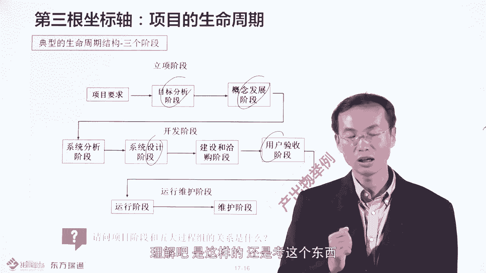

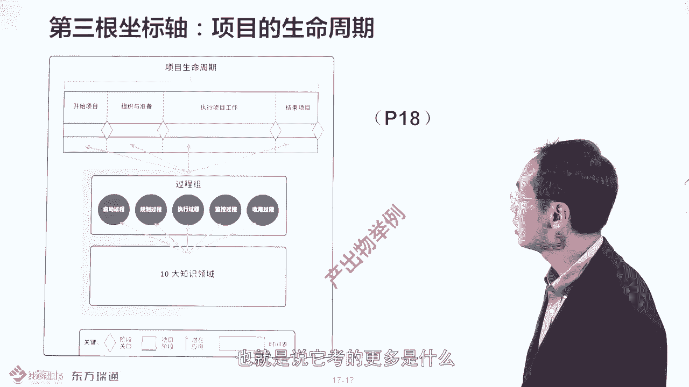

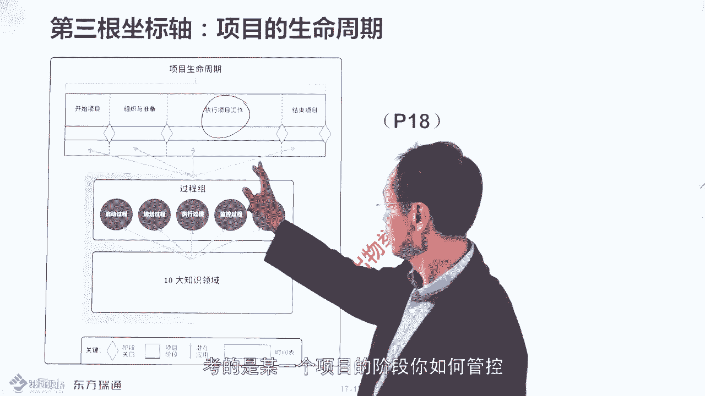

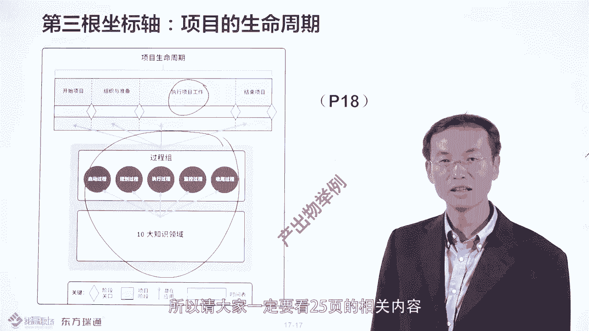

轴最主要关注的是两大坐标轴，一个是五大风组，一个是十大学领域。那就是我们的呃PNP考试的一种考试的范范围。多谢大家，希望大家看一下书上加注意页相关内容，多谢。

