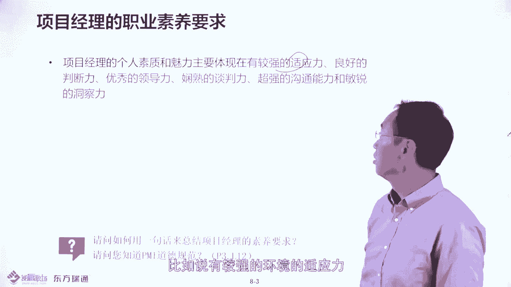
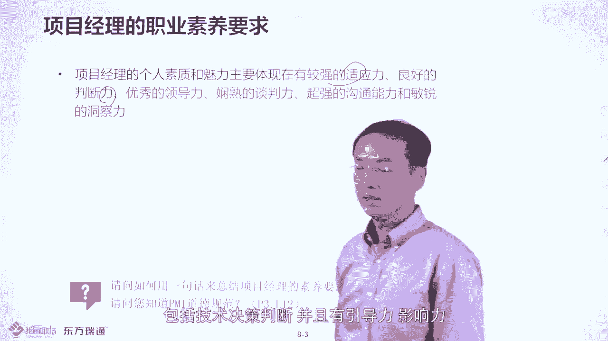
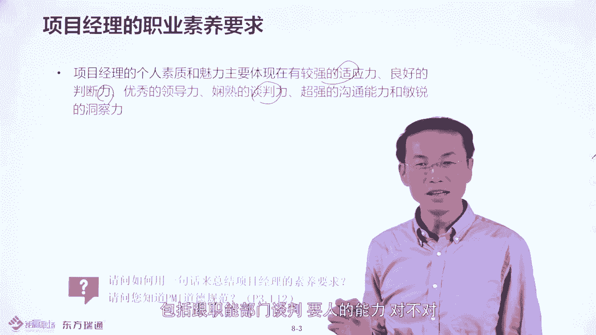
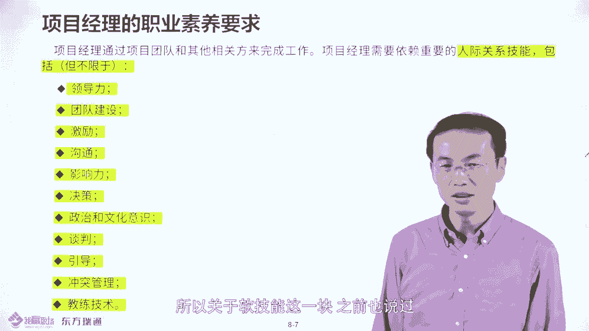

# PMP项目管理PMP学习知识快速通过PMP考试 - P7：项目经理的职业素养要求-07 - 北京东方瑞通 - BV1df4y187rv

尊敬的我营现场平台的小伙伴们，大家好，欢迎大家持续关注偏低项目管理进程课程。本节我们讲述的是项目经理的职业素养要求。大家可以看到说在我们前三项的内容中，我们讲到了项目定义，项目和战略的关系。

项目经理的关系，以及如何做到项目管理100分。然后接下来呢我们讲到一些项目经理的职业素养修炼。比如说好素养呢，才能够帮你达成项目的目标是这样的。好，那我们看一下项目经理要什么样的素养要求。

大家知道说项目经理的定义是什么呢？就是大家可以看到书上的第52页是由执行组织委派。领导授权为你，让你确保你的将目标达成的负责人。也就说你是确保项目标达成的主要负责人。如果这个目标没达成呢？

也是主要担责任的人要理解，所以呢你要确保目标达成。那先说了，要做一个项目的话，要做到妥善你的授权，比如项目标立项和项目章程。然后呢，授权之后，你要做好项关计划，按计划去执行，是谁执行呢？

当然是具体的技术人员负责相关方的工作的人，那营像经理呢需要督导相关方干嘛，把这个活做下去，所以要做到进度成本的什么控制。然后呢，要考虑到当前问题风险的这个解决或者规定。那问题风险应对的话。

是不是事事都要你去应对呢？不是的，你要把具体的工作分下去。然后你要监控他们的完成的情况，你要根据呃既天说到的问题日志风险监测去跟进。问题风险的完全情况，具体每条问题，每条风险的话是有相应的人去执行的。

然后你要确保什么呢？把相应的绩效项目绩效，然后呢做到绩效报告，比如说标易啊，标红啊，标黄，然后确保按照绩效指标去把相应的项目的目标达成，这就是你项目定要做个事儿。我们说的容易，做起来还挺难的。

比如说尤其是你是乙方项目经理，但你要做到交付一个任务的话，往往受到甲方的一个什么限制。比如说问大家一个问题，看大家怎么想怎么想。比如说你是。乙方证经理甲方呢证经你安排一个额外的工作。

这个所谓的额外工作呢，就是说合同中没写做还是不做。甲方说这是合同内的。然后呢，你就看到合同中没有这东西。那对你来说，乙方来说呢，你认为是合同外的那甲方认为合同内的。好，那他认为是合同内的一个工作。

你认为是额外工作。然后呢，这个工作呢，如果要交付的话，对于乙方来说，那会增加你交付的项目交付的成本和项目交付的周期，甚至增加你项目交付的风险。对吧那这样的话呢，你会怎么做？大家想一下。

这就是你的软技能了，或者你的项目管控能力了。比如说按照偏P的说法来说呢，你应该跟甲方说，要走一个标准的什么变更请求变更流程，而且要正式书面提出来。比如说发邮件算不能正式啊，肯定不正式。

因为发邮件属于什么呢？属于那种非正式书面，要正式书面提出来，比如说走一个什么标准的合同变更合同，或走一个这种所谓的什么技术文件，然后签署技术文件那种啊，那就正式的好，最起码走一个什么工单呢，走个系统。

好，那这样的话呢，甲方会愿意做吗？肯定不愿意做。所以有些偏僻的时候，他出的东西呢，可能在中国的适用范围的话呢，还是有待推敲的。那甲方不愿意走这个标准的变更流程，那你该怎么办呢？你是不是免费本帮他做的呢？

切记不要这么做。啊因为什么呢？因为就会导致项目的范围的蔓延。什么叫蔓延呢？就是你多做了一些事情，但甲方没有相应给你补钱，补时些对乙方是损害你乙方利益的，你做乙方项目经理器就不要损害你个你们乙方的利益。

对不对？所以呢要考虑到说如何的去做的比较好一点，那中国式做法有一个简单建议，就是这个时候你要留有证据，怎么留有证据呢？比如说如果客户非常强烈要求这个做了这个事儿，然后你的老板呢可能是什么呢？说这不支持。

那怎么办呢？这个时候试图拖老板下水，怎么托老板下水呢？你跟甲方说啊这个事情的话呢，双方都是大公司，如果走标准的变更审批流程的话呢，跑的很长，你也不愿意看到，我也不愿意这种看到，对吧？

那我们尽快的把这个事情落实一下，怎么落实呢？就是你把你的老板，甲方的老板叫过来，我把我的老板叫过来。我们四个人那。一起开个短会。然后在会上呢，就是决定做还是不做。在会上的话。

肯定是甲方老板站着他的甲方利益说要做乙方老板呢站在乙方利益说不要做。那最后呢话由于甲方的事大，你事小，那你你不信就从了，对吧？那如果从的话呢，你要怎么做呢？要留证据，比如说你要争取写会教的权利。

那一般甲方也不会写回要，对吧？那就是他要你写，你在写的过程中，就是把一些双方的一些观点啊包括风险的一些情况呢，完全写到一个附件中，会教的附件中。然后呢，在发会教的时候，在邮件正文中做文章。

比如说呃双方呢呃共同决定了人风险什么风险是有的，这个事做这个风险是有的。但是呢还是决定要做详就是说具体各方的意见，详见附件，然后再补充一句话，说什么呢？就是针对以上附件的这种会叫内容。

如果有任何与事实不符的情况，请在3个工作日内给我回馈。我会重新修订会叫再发出。如果三个会呃，3个工作日内没有任何回馈的话呢，我们可以认为什么以上即为事实。哎，这个是这种留证据的这种做法的话呢。

当然是为了思保啊。那问答一个问题，就是这种情况就是邮政据这种情况的话呢，适合什么样的一些项目呢？或者是适合什么样的甲方单位呢？啊，政府部门行不行？国企行不行？卖企行不行，私企行不行。我的个人建议是。

外企和私企可以用，但是国企政府呢切记不要用，为什么呢？因为政府领导呢最讨厌是留证据，他可能真的让你重新修改会议纪要再发出的，那个时候你就很被动了，理解吧？所以要知道什么情况就是什种形式。

那从P僻的角来说呢，他其实不会建议说你这么繁琐的留证据，对吧？他更多的建议什么，你要走标准的政式书面的变更控制流程。如果你没有经过变更控制，你就做了，那属于是范围的蔓延，范蔓延的话呢。

是项目成功还是失败呢？肯定是失败的，是这样的。哎，比如说考试和使际的场景呢，还是有区别的。大家要妥善去处理一下，再体现出你的项目管理的一个技能。好，所以本节的话呢。

就是要讲项目的一些呃管理的技能和思想修炼的。那这边可以看到说，哎项目经理是执行组织委派，实现项目标的什么。个人。所以说项目的成败跟你个人的利益，包括升迁呢，包括奖金呢是息息相关的啊，所以要了解这个事情。

那你需要什么呢？具备一些软技能。这软技能包括什么东西呢？比如说有较强的环境的适应力，包括什么呢？良好的一些这种角策判断力，包括技术角策判断，然后呢，并且有引导力啊，影响力呀。

包括跟职能部门呃谈判呢要人的能力，对不对？包括包括跟客户谈判，哎，那这些东西的话呢有点虚。所以呢我给大家总结一句话，比如说大家知道中国古文化中有一个呃大概的一篇啊文章或者说一本书叫孙子兵法。

孙子兵法里后呢，它强调说为将者，要做到这十0个字，叫道天进匠法，志信人用田。

那所以说呢作为项目经理呢，其实你是唯样为象的那你需要考虑到怎么能够遵循孙子从法做文章。那什么叫道呢？跟偏心相相结合一下。比如说大家知道说项目是战略落地的手段。所以呢你的项目要符合什么天道不合战略啊。

所以说你作为项目经理呢，要你的项目目标要跟你的战略目标保持一致。然后呢，在保持一致的大环境下呢，你需要考虑到天时地利人和。比如说大家知道说像中国奥运会就是那种08年举办的。那当时的副主席啊。

定的时间什么呢？是08年8月8日8点开幕，看到没有？天时地利人和都是八是吧？打仗，古时候的话，婚丧嫁娶呢，还要看什么？看皇历呢，都是一样的啊，要符合天时地利人和，比如说在何时的时间，合适地。

做合适的事情。好，然后呢，做的话呢，到底谁做要善于什么用人。那用人呢就是用有用的人才。那有一句古话说什么呢？叫用人之长，天下无不用之人，用人之短呢，天下无可用之人。好，所以呢我要考虑到说怎么用人。

大家知道说用人最厉害是谁呢？就是刘邦呢，大家知道说呃项与比刘邦厉害，对吧？但是呢得天下是刘邦，为什么因为他善于用人，他用了三个人，大大家知道说哪三个人呢？就是汉出三杰。呃，刘邦说了说运筹帷幄。

决胜天理的话呢？他不如什么张良，啊，代兵打仗呢，肯定不如韩信，然后呢，能够那个管理国家呢不如萧何，但这个三个人为我领的。看到没有？所以他得天下。所以呢你要善于用什么有这种萧何韩信哪，帮你打仗的。

帮你治理国家的。比如说举个点。典的案例，看萧何是如何治理国家的。大家知道说呃，当项羽聚众之战成功之后，当时呢秦朝已无可用之兵。所以呢当时刘邦呢趁虚而入呢，进进入了咸阳，大知咸阳什么呢？美女金钱，对吧？

那些土土呃，应该是说土暴子对吧？哎，就是那些老百姓就老刘邦为是那种那种农民出身嘛，那他哪进过皇宫啊，他一进去就跟那个李闯王进北京一样，首先什么杀进皇宫就不出来了，对吧？因为那那皇宫有什么？有六国美女。

那萧何会是这样吗？萧何不会的，萧何进入咸阳之后，第一时间进入了什么政府衙门去干嘛去。找那个相应的户口本，就是那个户口簿，就是他就是人员的就是那个登记册，就像我们现在国家那个户口登记册一样，为啥呢？

他就把那些呃这种秦朝的典籍呀，户口啊，这些相应的人员这个注册的一些心拟信息呀全部登记在案，然后把所有东西打包了，然后跟下面人说，把这这个东西呢？说好以后对治理国家有用，看到没有？所以你看到没有？

你手下有没有这样的这种治理国家或者治理团队帮你去挡事的人啊，这个很重要啊，然后接下来呢除了用用人之外呢，还要有法度，法度是什么意思呢？就是要有管理的办法。比如说偏僻的话呢，大概有49过程。

那这就是说就是说管项目的办法嘛，这些办法的话呢，你在真正针对不不同的项目，针的具体项目的时候呢，你要学会什么呢？学会裁剪，你要有法度的去裁剪。那怎么去有法度裁剪呢？

就是你公司可能有什么有PMO项目制理委会。哎，项目管理办公室他会有一些治理要求的那会有些会有一些规章制度的。你按这个大的规章制度，结合你的项目实际情况去什么去裁定。好，然后接下来呢你将经理啊要什么呢？

不是说有魅力性领导吗？要智慧呃，好像是道德经说过一句话说知人者智自知者明。有时道知人善用啊，就是智慧的，贼最智慧呢就是曹操了，曹操这个人很厉害，他呢一般能看看到什么呢？下门人在想什么。

他轻易不会让下门看到他在想什么，凡是能看到他在想什么的人呢，都被干掉的。那比如说大家知道曹操怕人杀了他，所以呢他经常会跟下门人说啊，你不要靠近我啊，不是我睡觉的时候，我会梦中杀人。

那下门人的人呢不以为然，以为他说笑，是不是那曹操呢为了证这一点呢，就是有一天他午睡的时候，我小睡的时候，然后呢，有一个侍从呢呃，是呃比较善心啊，看曹操的背掉了。

然后呢就就是帮曹操把那个背给他拿起来给重新盖上。就这个小动作，曹操呢当时实际是是没睡的，他就是大吼一声，拿起剑就把那个侍从给杀了。杀了之后呢，他继续睡。睡完之后，然后呢。

他醒了醒了之后看呃旁边的侍从呢在哭。哎，他说你们为什么要哭啊？哎，然后那个侍从说，大王把那个人杀了啊，然后呢，曹操说了吧，你看我睡觉时候不要靠近我，因为我会梦中杀人啊，然后呢。

那个呃他下边有个主仆叫杨修，然后说一句多年话，说什么呢？说大王非是梦中杀人，是那人死在梦中啊。哎，曹操听到这句话之后呢，就就明白杨修在说他说出的事情是假的，你看穿了我啊，曹操找个理由就把杨修杀了。

看到没有？杨修是个大才子啊，曹呃他的才学不比曹植差呀，但是呢他也被曹操给杀了，看到没有？哎，所以说你作为项目经理，这个故事告诉你什么呢？就说你做项目经理要。智慧，那你智慧未必比曹操强，但是要学一下。

比如说你的喜怒哀乐不能够被下唬人看得门清，嘴里门清楚，大家都能看到说你你是来呃高兴啊还是还是不高兴啊？哎，你要有什么艺术高，要控制己的情绪。如果你下面人都知道你的这种所谓的喜怒哀乐的话呢。

你就很难管他的。理解吗？就是你要做到神龙，见首不见尾。就是你要智慧知人善用，而且不要让别人看穿你。然后呢，你还要什么立信立威。那怎么立信呢？当你的人为言轻的时候，比如说我说有一个例子。

像那个当时的呃比如说商鞅变法，商鞅变法当时商鞅刚开始的时候呢，虽然呃被呃这种秦孝中立的很大的官，但是没人信他，所以他必须要采取一个小的一个动作，让大家信服他，所以他有一个故事嘛，叫做城门立柱啊。

通过呃这种呃让人把一个一块木头啊，从东门拿到西门啊赏怎嘛得到金来的，从五金加到50斤啊，就是重金去赏伐。然后呢让有一个人呢就是他刚开始不信政府的，他几得政府在诓他，哎。

怎么可能说说办一块木头从一个城门到另个城门就给那么多钱呢。哎，啊但是呢他也不愿意尝试了一下，结果呢？就被商鞅呢就是那个给了很多的钱。然后别人看啊，原来政府不是骗我们的，哎，他们呢就说话还是算数的。

看到没有？所以商鞅呢就是立信了，然后呢，除了立信之外呢，就是立威。立威的话呢，其实古时候有很多故事。那比如说在清朝的时候，有一个大臣叫年羹尧，他去西北打打仗。但是西北的话，那些人呢，刚开始的时候呢。

是不服的管的，或者是不服的管的，然后他就会找个理由杀了一个什么将军啊，然后之后就跟大家说，哎，以后谁不服我，就以他为下场，然后这些当兵的当官的都怕了，哎，就立威，看到没有？所以说你要适度的去立信立威。

然后呢啊能够这个把你的什么威严呢，帮把你的什么形象啊把他束诸。然后呢，当庶职之后的话呢，你可能像学向刘备学习哈。哎，就学是些仁义呀。哎，然后呢，而且呢除了仁义之外的话。你要考虑到什么东西啊？

要勇于担责任。比如说举个典型例子。那如果一个项目出事了，你不要推卸责任说啊，这是张三的错，这是李四的错。那你告诉领导会说我要以项目经理合用，对吧？你是容管所有的项目管理的对吧？那你这项目出事的话。

首先是你的错，理解吧？哎，你只能说什么？这是我们的错或者是我的错，你不是说是张三的错，这是李四的错啊，好，所以说呢要考虑到你要勇于担责任，担责任的话，请翻到你书上的大概是第四页左右啊，3到四页。

这是第三页第十二行，然后有PMI的一个道德规范，里头讲到了说责任就是你要担责任，然后你要尊重对方，然后你要诚信，就这什么？信啊，然后勇于担责任，然后另信逆威，这也是符合PMI的道德规范的。

所以你看中西方的理论呢都是相通的啊，大家可看一下好，所以PMI道的规范。两就是责任，尊重公正诚实。其实责任就是有。然后呢，这种诚实呢就是信，看到没有？哎，所以说这个是一样的道理的。好，所以我们要知道哎。

在你翻到书的第三页，看到没有？这边有什么呢？呃全球项目管理业界定义的最佳的什么价值观。责任尊重公正诚实，看到没有？是这样的啊。好，所以说呢你看跟四子兵法讲的志信人永年是一回事儿啊。

所以要知道这种价值观是相通的。然后接下来我我们要知道说每个人呢都是不同的那每个人不同的话呢，呃在西方有一个理论叫冰山理论。比如说什么意思呢？泰坦尼克号大家知道上世纪泰坦尼克号的话呢，撞冰山成了。

大概是191几年的事儿啊，那这个事儿的话就是说他撞冰山。那导致下沉的原因不是漏在水上面的20%的冰块造成的，而是没有看到的80%的这个冰体造成的。也就是说一个人呢他的行为能让你看到的部分呢只是20%。

看不到的更多是80%的东西。就是为什么说作为管理者要去学习心理学，你要针对这个人的表面形象，然后呢要体察他什么呢？他个人的一些观点啊，价值观啊，渴望诉求啊，他是什么样的人呢？哎。

你要去判断那其实这个东西呢呃西方是讲那个什么所谓的冰山理论，在中方呢也讲什么呢？叫五行。那比如说呢我就测过，比如说大家知道说你只要呃报一个什么生辰八字，就生辰就可以，就是年月日，你什么时候出生的。

然后你到网上去找一个应用，随便找个应用去测一下你的五行。哎，你就知道你是五行缺什么。比如说我五行缺水。哎，五行缺水啥意思呢？大家知道说呃地球旁边有5个行星，就是金木水火土，对吧？

可能是我出生当天呢啊水星离地球比较远，所以呢就是五星缺水。那五星缺水的话，啊，大家知道水是什么呢？变化流动的，对不对？也就是说什么呢？我的特点就是缺少灵活性，比如说做事情认死理，不会变通，这是我的缺点。

但我多什么呢？我多木。陌生东西呢，但家要像树一样呃抓住你泥土。那就说树的话比如体系嘛，就是那个那个树的这种大概的胡须也好，包根部那个就是错综复杂嘛。那如果多目的话，就是善于总结。我善于总结的话呢。

就比较容易当老师。因为老师的话要对这个所谓的课程体系要总结嘛。所以我当老师还是比较比较合适的。但是呢我不太善于什么呢？变通拉关系，这就是我的缺点，看到没有？所以说呢你面试一个人面试个项目经理，你也可以。

看一下他的生辰八字，对吧？然后看一下他是五行缺什么呢？比如说他五行的话，缺如果缺金。究竟什么问题啊？他缺少什么担当？理解吧？他没听就缺少担当。他如果没土呢。他说话不落地。理解吧？做项目管理不落地。

看到没有？哎，所以要了解，这就是呃你也看一下五行就知道他大概是什么样的情况的啊。好，比如说不论西方的所谓的什么呢？这个冰山理论还全是东方的这种所谓的什么五行之说。

其实都是告诉你说你出生当天哎你其实你的命差不多就是已经定下来了啊，然后你后期的可能改变的东西呢，是很难的。而且心理学也说一句话，说你不要试图去改变一个人，因为很难去改变他，你想改变自己，理解吧？哎。

所以这个就是你们要考虑到说这个就是你面试一个项目经理，或者说你要招一个比较合适的项目经理，那你需要考虑什么呢？前情就是这些要符合你的价值观，符合你的一些基本的要求啊，比如能担当，对吧？

比如说五行缺是金的话，你不要他来了，对不对？那是这样的好，那你可以看一下。每个人的话对自己的那种啊这种思维方式都是不太一样的。比如再给大家举个例子，比如说你看这个这个图的话呢。

哎你第一时间你看是一个少妇呢，还是一个老人呢？哎，大家可以看一下，如果你第一时间看是个少妇的话呢，比如说这样的，这是他的脸，对吧？那你说明呢你还年轻，如果你第一时间呢看到这是个鼻子的话呢。

说明你跟我一样已经老了，是吧？起码心太老了，理解吧？哎，所以说每个人的特质是不太一样的啊。好，那其实呢你从小就能看到一个人的大概他是否能够可能会是成才。比如说大家知道像古时候有个人叫恐龙。

听说恐龙4岁能让梨。比如说你回家试一下你家的小孩，哎，有个梨会有苹果能不能让出去啊，可能未必啊，所以说你看恐龙后边啊后后期他他的官职到什么呢？起码当了省长叫太守，对不对？所以你家小孩的话呢，梨太守。

还有有什么有很长路要走，是不是大概这样子，所以这就是特质要了解啊，不同的人特质是不太一样的。所以呢针对偏梯对项目经理要求，他的特质更多是软技能。比就说在项目管理三角形里头呢？那这点就这个技能是很重要的。

就 leadershipdership。然后呢里头的什么沟通啊。包括问题解决呀，这种软技能啊，这些块呢是不呃不是马上能够练出来的。比如说PMP的授课更多告诉你说项目管理的知识是什么。

告诉项目战略之间关系是什么，这一块呢更多是knowledge。这个是短期可以什么呢？可以了解的。但是这个东西呢是你的什么呢？是你的能力，就是你的软技能不是很容易能练出来的有可能是给你先天就注定了它。

是这样的啊。好，所以呢关于软技能这一块的话，之前也说过，在你书上的思录中500多页，把这些软技能都列出来了。大家可以看一下。哎，那影响力什么沟通啊，怎么谈判哎，包括团队建设这些东西呢都是软技能。

那这些软技能的话怎么得以实现呢？那我们先看大家现在目前的软技能怎么样。

比如说呢呃我给大家举个案例，这个案例是这样的，就是说呃有一个导演，然后他就像做项目的项目经理一样，他要导演一一出戏嘛。那导演他呢让演员去演戏。他发现那演员呢呃做的做的不好。然后呢。

他的导演就把演员扒到一边干嘛，亲自去去那个演戏了，那演员一看你演，那我就不演了呗，就在旁边什么呢？点评作为评论员了，对导演演的东西呢指手画脚。所以这就是不成熟的管理者。也就是说之前说了，所谓成熟管理者。

德鲁克说了，就是什么呢？把你做的非常顺手事情，心甘情愿的让厦门做，然后控制下边人的什么这种做事的情况，你就偏要给下面一定的容忍度。这就是一个成熟管理者。如果你亲自杀下去去做这个事儿。

那下边人只能做评论员了，久久之的话呢，就失控了，比如说你忙的要死。下边闲的要死。所以这最差的管理。那最好的管理是什么呢？就是像马云那样，他hy着闲着，下边人hy着忙着，理解吧？哎。

那最差的管理就是你痛苦的忙着，下面呢hy着闲着，理对吧？哎，所以说你要知道啊，哎要考虑到怎么能够让下门忙起来，这是你要考虑的事情。那所以针对怎么样下门人忙起来的话，德鲁克呢有也有招。

那在我们的公众号东方通相关学中心中呢，有一篇文章。叫西方管理阵地，秉承德鲁克的经验管理之说。也如说作为项目经理要把活分下去。但是你要知道说活分下去呢，作为一下的团队成员的话呢，他可能会有四种状态。

也就是我外部是四种L一到L4，那所以L4的人就是什么呢？对分享的活既无能力又无信心做事，那你要考虑到说这个人是谁招的，所以要减把面试官嘛，好，如果说既无能力又无心心做事。如果你去京东的话呢。

刘向东会说什么呢？这是废铁业，应该把它干掉了，是不是？但如果你在国企的话，在政府的话呢，未必为什么呢？因为他可能有关系，理解吧？哎，那他可能是领导一个小舅子，对不对？那你不敢动他是吧？那你怎么办呢？

那一般都是太为生态赋，把他升办级，比如升个小组长，对吧？然后把他的当前的位置控出来，再找一个新人去做，这就是不同的企业的情况啊，好。然后你看到对手还有4个人，那还有什么情况呢？

L有3的就是针对分校的活啊，他还愿意做，他有心趣做，但是没能力。比如刚毕业的对吧？还有一种什么呢？就是属于倚老卖老型的L2的人，就是说针对的活的话，他有能力做就不愿干，理解吧？

然后还有一种L有一的就既有能力又有心干活的。这就是说针对一个我排排列组合无外不这四种。那针对四种情况，你要怎么做？这就是考试考点了，或者说对有德鲁克的一个大概的一个呃建议。他建议是这样的。针对。

既无能力又无信心做事的，你是不是应该把它开掉啊，像刘强东一样把它开掉啊，不是要挽救一个人，怎么挽救呢？需要什么手把手教，所以应该是叫digression。这这种人要在，要指导怎么指导呢？

比如说你把这个活分成简单部分，复杂部分，简单部分写成SOPSOP呢是叫什么呢？操作组册就这个操作组册。然后呢，丢给他手把手教。如果是个女孩子的话就更可以了是吧？手把手教好了。然后呢。

然后如果他做的还可以的话呢，再把那个稍微哪一点呢再再写上SOP再指导他写吧，这样呢是逐一的分下去的啊，这就是所谓的针对这种呃既无能力，又有心干活的人，要手把手教和代。针对这种有心干活，比刚毕业的。

但没能力干呢，要给他配一个师傅，他写的方式是coach。coach就是教练，也就是说什么意思呢？像刘翔的教练未必跑的比刘翔快，但可以帮助刘翔纠正他奔跑姿势的偏差。哎，所以说呢你做教练就是纠偏的，哎。

帮他去做做梳理的啊。当然如果你纠偏不力，监控不力。那会有什么问题呢？他做做的事儿跌了一两次跟头之后呢，L三的人就变成L四的人了，就只能再什么呢？手把手教了，理解吧？是这样的啊，所以要做到密集性监控。

这就是coach。那针对这种呃有能力，不愿干的呢？就是挨拉的人。大家知道说在古时候有一个大概的故事叫酱相和，就是说廉颇和蔺相如。当时的话廉颇不服蔺相如。那在蔺相如的话呢，其实那什么就是要退皮三啊，三手。

对吧？然后呢，呃就很谦让廉颇，然后最后呢廉颇知道是自己的错，然，最后呢就跟蔺相如结成了好朋友，对吧？是这样的，但是在你的组织中，像廉颇这么高速的人呢，还是很难有的那更多是什么呢？

就是像干定那样的非暴力不合作，那怎么办呢？比如说你做项目经理出道一个组织出道了一个组织，然后或者一个部门当头，或者要做了一个项目的项目经理，那下边人呢你有很多的就是老员工，倚老卖老对吧？就不服你管。

你们觉得什么你赶到他的撸，本来这个经理职位，就是我的，为什么让你来做，对不对？他就是诸多的不配合。那这样的话怎么办呢？你要这个时候，你要发挥你的影响力，就是英文叫。什么猜一进去爬地腿呢。

就是说你要发挥你的影响力，推他一把，拉他一把，踹这一脚，骑上马送成。为什么呢？大家知道说大家知道这个牛顿有三大定律，其中有一个定义叫做惯性。惯性经律的话，我们都学过，就是什么呢？

一个物体在没有外力的情况下，它保持什么运动啊，保持的是相对静止或匀速运动。所以呢我们必须考虑到是加以外力推他一把，拉他一下，对不对？踹下一脚，这样的话呢改变他思维和行动的惯性。

你说我没有影响力引导到别人呢？那怎么办呢？这个时候要学会什么用参照权利或参考权利，然后呢，借助领导的力量去影响他。如果你不这么做会有什么问题，但家到时候你是这个项目的经理或者是你这个是这个部门的负责人。

然后呢，下边人呢经常给你什么，给你那个说找事儿对吧？或者没事没事，那个呃捅一些大概的一些问题，就相当什么呢？呃，有你的团队呢经常会什么，经常会呃出现这样或那样的纰漏。如果出现纰漏的话，贼是主要负责人呢。

肯定是你啊，你是部能投啊，你是项目经理啊，久久之于被他搞倒的。因为什么呢？因为你的。老板会认为什么呢？你管项目不力，你管部门不力，对不对？是这样的啊，所以要了解啊，这就是当你发现有这样的人不配合的时候。

你要排取你的影响力，参与进去，然后改变他思维和行动的惯性，遇早不宜迟是这样的。好，然后针对这种既有能力又信心干活怎么办呢？要充分做ddiation就是授权委派，对吧？我委派他。好了。

你都希望你分下活的时候，下边都是L一的人既有能力又心干活的，但是你要知道说他刚开始可能是L一。后来他遇到一些挫折就变成L2L3L4了，理解吧？

所以你要知道什么情况该怎么去管理L4人维顾一下L4的人要L3人呢要coachL2人呢要参与进去participantL一的人什么呢？就是ddiation。所以呢针对不同的人的情况。

你要做到适度的什么情景管理。所以这是为什么作为管理者EQ要告这个因。因为要观察驾驶人的细微情况，比如说他针对个活，他吭的一声，或者说是中良话，或瞪了一眼，对吧？或者是万不经心去做事儿。

那你就知道他还有几了，我到底是什么呢？我到底是direct呢，还是扣制它呀，我还是什么呢？我还是参与进去呢？还是做什么呢？授权给他理解吧？看到没有？所以说这就是为什么作为管理要做情景管理。

我根据不同的情况采取一些相应的action这样一个这种行动方式啊，是这样的。好，所以呢呃考察一下大家的软技能怎么样呢？我们看一下其实软技能大家说了就是你要有领导力或有影响力，要觉察能力。

根据这个单情况要觉察。那这些能力的话呢，也是PMI比较推崇的。所以我针对PMI所要求的这种项目经理的软技能结合一些外企和大的企业关于项目经理的软技能呢，我做了一个表，这个表的话呢，大概有22项。呃。

你可以在那个官呃我们的官方网站上去什么下载这个文件。22项的评估文件。那22项包括什么东西呢？包括各种软技能，比如说沟通啊，包括什么呃换位思考倾清啊，包括情商压伤啊都有。然后呢，包括维顾客户关系的能力。

包括问题解决能力啊，包括价值决策能力都有。那这个呢只比美个项目管理协会对项目经理要求高不比较低的那美国项目管理协会对项目经理软技能要求呢，在552页，大家可以看到552页的内容，结合这一块的东西呢。

去评测一下你的项目经理软技能的情况，然后下载这样一个文件这个比这样。那怎么评测呢？这22项列出来了。针对22项的描述这边是有的。然后呢，你去在这边打分1到5个打分。比如说针对单项。

那比如说沟通能力单项啊，如果你觉得不具备就是一如果你觉得不及格。就是2。如果你觉得及合了，就是3。也就说单项123在示边打123的话，就是这个像加拉框，那个不是你个人的什么。

你个人的这个你个人的一个感觉。那如果你敢单项打4，那怎么办呢？你要加一列，在这旁边加一列，在这边加一列。就是相关证据这些吧？就是说近半年到一年内，然后你的项目中，比如说比如说风险管你打四。

你是如何做风险控制的啊，你怎么用风险登记测的，对不对？你要有证据打四啊，因为四就良好了。好，如果你看单项打五要有啊公开证明。比如说你受过表彰，对吧？然后呢，你拿得过什么大红花。

或者你像莫言一样拿过什么诺贝尔奖对吧？也可以啊，这个就是打五的话，是官方要认可的，打四的话，你要个人要有证据。123个人你的感觉，然后打完之后然后这边的话就会有一个平均分了。

平均分呢我打过很多企业的这种向心力。那基本来说呢比较高的分是在3。5到3。9之间。比较低的分的，一分两分都有。那如果你的分数不到三的话。恭喜你，你有很大的改进空间。那如果你的分数评均高于3的话呢。

也恭喜你，你基本是全中国top20%的项目经理，就是呃属于那种呃良好加优秀的项目经理啊这样子的。好，所以你个人可以做一下自评，就知道你的软技能，你就直接素养在哪里了。如果你单项啊。

或者说你的平均值不够三的话怎么办？那你单项凡是一和二的怎么办？你要去看一下为什么我做不到，那如何提高。好，而且要知道说提高这种软技能哈，不是一招一夕的那你可以去什么呢？逐渐的去什么刻意的去培养。好。

那关于这个呃职业素养修炼这块的话呢，就是我们本节的重点，大家可以去呃自行去做一个评估啊。评估结果之后呢，可以发到一个网上，然后呢，我们会有回收啊，这样的话我们会有反馈的啊，多谢大家。

