# PMP项目管理PMP学习知识快速通过PMP考试 - P9：组织级项目管理与PMO-09 - 北京东方瑞通 - BV1df4y187rv

果营现场平台的小伙伴们，大家好，欢迎大家关注PMP项目管理现场课程。本节我们讲述的是组织级项目管理与PMO上节我们讲到了说项目经理的话，如果能力不行的话，就要考虑到组织的保证。

那本节的话呢就讲到说组织级项目管理。比如说你的能力不行的话，要考虑到组织级，就是你的领导，包括项目治理，如果保证你项目成功。那具体呃负责项目成功的话呢，是你个人项目经理。那跨项目沟通协调的话呢。

会有一个辅助部门，这个部门呢就叫PMO项目管理办公室。那我们本节的话就会讲述到说组织级项目管理和项目管理办公室相关的内容。那也就是这块内容。好，那我们看一下，首先我们看一下组织级项目管理。

组织级项目管理这边的话呢，在PM部分中呢，它是有一个概念的，也是一个考点。比如说项目经理负责项目交付的成功。那PMO呢他负责什么呢？负责项级以上的管理。那所谓项目级什么意思呢？

我们要知道一个这个定义叫项目级。项目级就是相关项目放在一起来管。那确保什么呢？这种资源利度最大化或解决资源冲突。其实呢在你公司项目总监，他也是在做项目级管理。比如说相关项目呢挂在他的名下。

他去协调这种资源，资源利度最大化，大概这样子。然后呢，项目组合呢是什么呢？项目组合就是你公司分管项目的什么副总裁或者总经理。那他去管所有的不太相关的项目放在一起来管的。比如说你公司项目部的整个的负责人。

那在P批中呢，他没有说到什么副总啊，包括项目总监的概念，他更多提到的是项目级经理和项目组合经理的概念。所以呢我们要对靠做，就是说项目级经理呢，他是管什么呢？管那个。就是相关项目放在起来管。

那基本对于你公司的项目总监。那项目组做经理呢就是不太相关的项目放在起来管。对你公司的分管项目的副总裁或者总经理来这样子。好了，那从考试的角度来说呢，我们看一下，就是项目总监也好，项目基经理也好。

他要考虑到什么呢？协调不同项目之间的一个例，然后你考虑到项目之间的话，如果有是冲突，资源冲突争夺的时候，如何去什么呢？如何去协调，如何去管控。比如说公呃我们总结一句话，就是他要做到什么呢？

一加一大于二这样的一个目的。比如说呃资源利度太大化，协调资源的冲突的。那我们举个例子，比如说我在MBM的话是做项目经理的那我们当时呢是给政府做一个运维外包项目。当时的话呢，政府呢甲方假设项目经理呢。

或者科长呢，他会说一句话，他说什么呢？你要对MM的话呢，不是有很多的什么专。家顾问嘛？我说是的，那你们是有什么专家呢？就是那种做什么做那个安全管控的专家。然后呢，做那个栽备那种他项目的专家，我说是有啊。

我信的话是有跟这个项目没关系啊。因为这项目没有这个灾家恢复的一些咨询，或者是这种所谓的安全管控的咨询呢。然后呢，甲方会会怎么说呢？甲方说啊，你派两个人派两个专家过来吧。哎跟我们呃做一些什么指导。

顺便给我们做个1到2天的培训培训加指导潜台词呢是不给钱。那你我会直接拒绝甲方吗？得罪不起啊，属于政府领导，对不对？得罪不起，那怎么办呢？我就把呃甲方的需求呢告诉了我公司的什么项目总监。

在新批中呢就是项目基经理啊啊，告诉他，我说这个甲方说那个要派一两个咨询顾问，一个做安全管控的。一个做那个呃这种灾难恢复的咨询的，然后跟他们做一下指导，或者说培训1到2天潜台词是不给钱做还是不做。

那我们那个项目级经理呢或者项目总监会怎么说呢？会说呃这个客户呢很重要，那怎么办呢？得对不起。那正好呢我有一两个什么？这个咨询顾问，一两个咨询顾问的话呢，正好是在做栽备项目的或者做安全项目呢。

正好在空档期，他们上要闲着，那派给你吧，一两天嘛，可以的，但是呢你要给钱，我怎么给钱呢？就是说这一两个IBM顾问，他要帮我们这个项目做做事的话呢，他要填我们项目的，我们要填工时啊，填扣的，大家知道吧？

就是说呃no扣的no work就是没有不填工时的话，他会无利不提早的，比如说在IBM填扣的话呢，是这样的，按小时填的那一个级别比较高的一个咨询顾问，他一小时的成本价是多少钱呢？告诉大家688块钱。

他只要添怎么一天。就是8小时。他收我的项目的成本一个部分就是5000块钱。那如果两个顾问呢，两天的话呢，至少是什么2万就没了。然后这个客户呢，你会给我2万块补补贴吗？不会的。

但是我这个项目呢是要出2万块钱的看到没有？那你说我能不能自己去招人，对吧？招招一两个顾问再再把它辞掉呢？这更麻烦，对不对？也是不可行的那还是要找别的那个什么呢？别的项目组派资源过来，然后去协调一下。

这个协调我能协调得动吗？我协调不动，因为我只是一个项目项目经理，那需要什么呢？我的老板项目级经理，项目总监出面帮我去协调，但是呢人家不会免费干活的，看见没有？所以说项目级管理的话呢。

就是要考虑到相关项目放在一起来管，考虑到资源利用最大化，考虑到资源冲突的问题，甚至是资源争夺的问题。那除了项目级经理会去协调之外的话呢，还有一个部门也可以协调。这也是考点的，就是PMO。

项目管理办公室啊，他是项目经理上的管理。然后呢，我们要知道就是考试的考点是呃相关项目放在一起来管。那一般来说呢是解决资源充突的。所以谈到项目机管理，就知道它是在考虑协调资源协调和解决资源充突的。

那谈到项目组合管理呢，这个考点是就是说要考虑到呃战略规划，就是说先做什么项目，后做什么项目要做一个规划，要考虑到什么呢？项目优先级的一个排训，是这样的啊，也就说这就是考试考点的，谈到项目组合。

立刻讲到战略，谈到这个项目组合的话，除了考虑战略之外呢，还要考虑到优先级的排序，项目优先级排训的问题。谈到项目集，考虑到资源的协调和什么呢？资源充突解决的问题，是这样的，就是考试考点。好。

然后在你的书上呢，这个大概12月左右还有个图，这边你可以看一下这个图中也有一个考点，有个支识点。也就说一个项目呢，它可以属于属于一个。

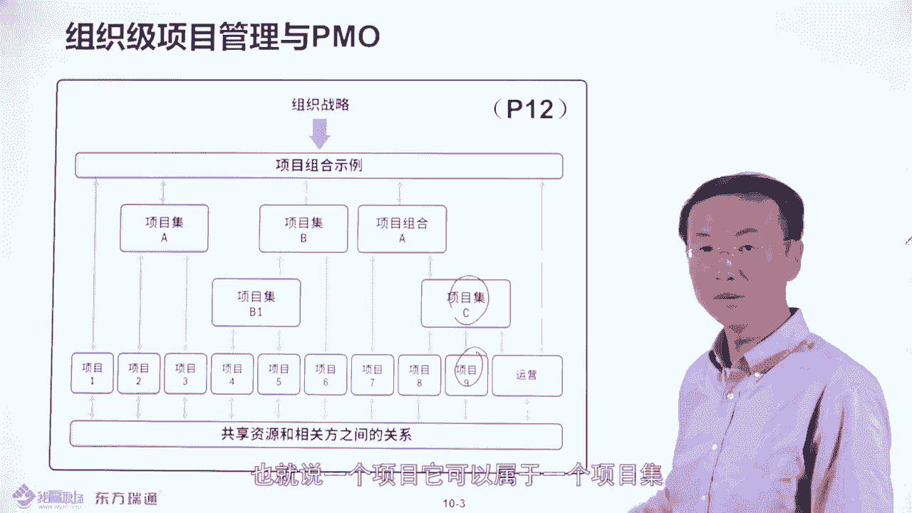

项目集也可以属于一个什么项目组合，看到没有？大概这样子。好，所以说呢项目集和项目组合和项目之间的关系在这个图中呢可以看到的那有些时候呢，你看一个项目的话呢，它是属于一个项目集的，然后再属于一项目组合。

而且有一个项目有可能是直接属于一个项目组合的，就要知道的。这就是这个图的要因是什么？好。

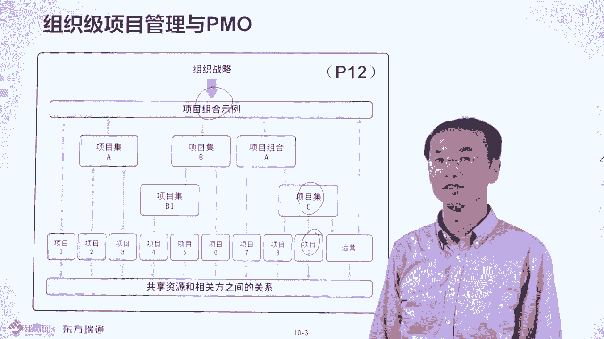

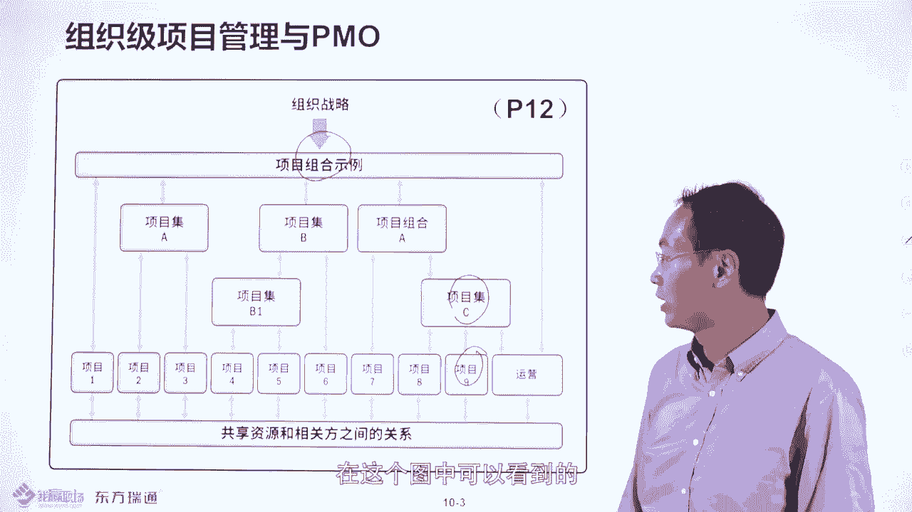

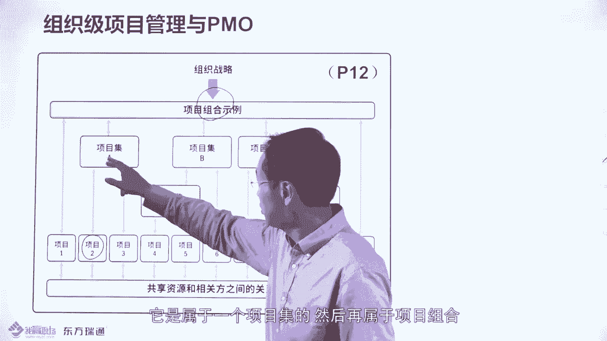

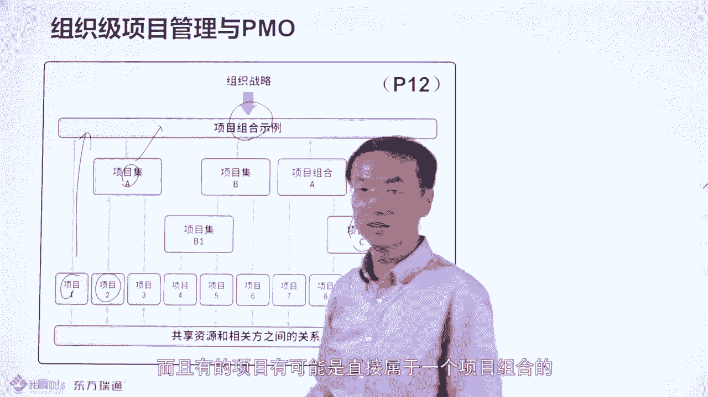

然后接下来呢我们看下一个那个内容，就是说刚才我们说到谈到项目集管理，谈到什么资源协调啊，解决出现冲突，对吧？谈到项目组合呢，要考虑到战略的决策，考虑到什么项目优先级的选择。所以要知到关键词。

所以说谈到项目组合，跟你说十3页这样类似的表。那你就知道它要考虑到战略目标达成。然后就项目优先题的划分，谈到项目集呢，要考虑到资源利用的最大化，一加一大于2这样的一个场景。是这样的。

所以这个是很重要的一个表格。然后基于这个战略项目和这个项目集管理，像呃这种项目组合管理项目级和项目和运营之间的关系的话呢，你的书上第17页。还画了一个表，看战略跟项目组合挂钩，看到没有？谈到项目组合。

实道它是跟战略相挂钩的，并且呢考虑到项目优先级的这种选择。谈到项目级管理考虑到什么呢？资源应融最大化的问题。然后呢，这边的话呢还要考虑到收益的问题。所以说项目这边或者说这个战略这边呢。

它也考虑到什么要价值决策。然后你看这边呢项目级管理和项目组观理标付的时候，要考虑到最终的价值能够达成，看到没有？也考考虑到价值收益的问题。所以这个图中要明确这边的关系。

比如说谈到项目组合更多是跟你的价值决策跟战略相挂钩。谈到项目级项目呢更多是跟价值的交付相挂钩。看到没有？这是属于你有个预期，这个是实现，看到没有？是这样的，哎这个图的话呢，我要了解它的呃相呃相关的关系。

好，比如我举个例子。比如说一个公司尤其是做乙方，你怎么考虑到项目的优先去选择呢？这个是一个呃我们实际上要面对的一个问题。那比如说这个是IBM的IBM要考虑到项目哪个项目先做哪个项目后做。

就是说项目组合管理的内容嘛。那这边的话，你看一下，我们这边会考虑到这些就是我们的解查项。比如说一个项目，如果客户有预算，我们这个分打的会比较高。如果是没预算呢。哎，这个分呢打的比较低，就是忽悠的项目嘛。

对吧？然后呢，一个项目如果我们的产品能够什么呢？完全满足客户需要，我们的分儿会打的很高。就是项目的要先做的分打的很高，为什么呢？因为这样的话，交付成本比较低呀。如果20%以上的功能需要客画开发。

那我这边的这个项目先级呢会有低一点，为什么？因为这样的话我的交付周期和成本难以控制，风险比较高。好，然后呢，如果这个项目交付的产品，他有更多的潜在客户，比说在A客户那边可以使用，在B客户C客户。

D客户那边都可以使用的话，或者分就比较高。那如果说只为A客户做，那就一锤子买卖，这样的分就比较低，理解吧？比如说有些时候。很多乙方的话呢，他给招商银行做项目，或者说给那些大银行做项目，他宁肯亏本。

他也做，为什么呢？就是因为他拿到招商银行或者是国有大行的什么呢？国有五大行的一些s，就是属于那个承化力，那就可以什么忽悠其他商业银行去说哎，你看国有大行招商银行都做这个事了，那你其实呢你也可以这么做。

对不对？所以就是你获客获得更多的客户的。哎，这样的话呢，就是属于战略亏损项目，那我们也做这个分很高，是不是是这样的，如果是只为一个客户做，而且客户说你的代码程序是买断的，资产所有权是我的，是甲方的。

不是乙方的那怎么办？你要掂量一下，你是否只责这这个事啊，大概这样子好了，然后还要考虑到什么东西呢？就是我做这个事，我有交付能力吗？我的技术人员，我们这个能力做，如果有能力的话，我个人会高一些。

然后并且的话呃我交付这个产品，就是知识产权或者是。是会不会有什么会被告啊？比如说美国人会告我们，对吧？这个什么知识产权的这些东西，包括一些什么呃是否不合符合法律法规呀，当地的法律法规呀。

如果是不符合的话，那我们就不做吧。那如果符合的话呢，这个分也会高，看到没有？所以我这个大概是十项。当然你可以加更多。那你可以基这个蓝板。这个这个蓝本呢是什么呢？这个蓝本是IBM的。

你可以再加几条或修正一条就变成你们公司的项目选择的，一个什么优先级的一个标准啊。哎，这就是所谓的项目组合管理要做的事儿。好。然后呢，我们看一下刚才讲到了项目机管理、项目组合管理和项目的区别。

那我们看一下呃你是否掌握了在组织战略发生变化时，以下哪个要发生变化呀？刚才说了，谈到项目组合立把想的战略和项目编辑选择嘛，对不对？你该选哪个项目组合管理，看到没有？好，然后接下来我们看下道题。

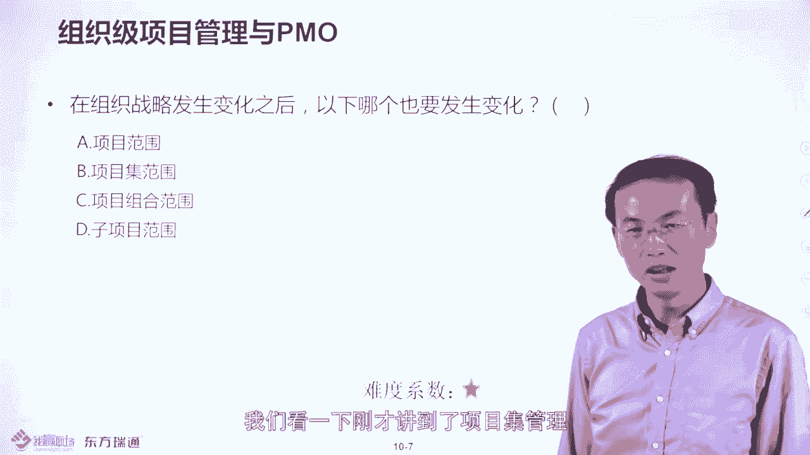

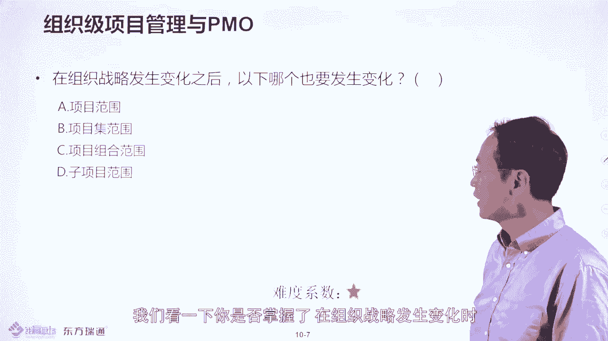

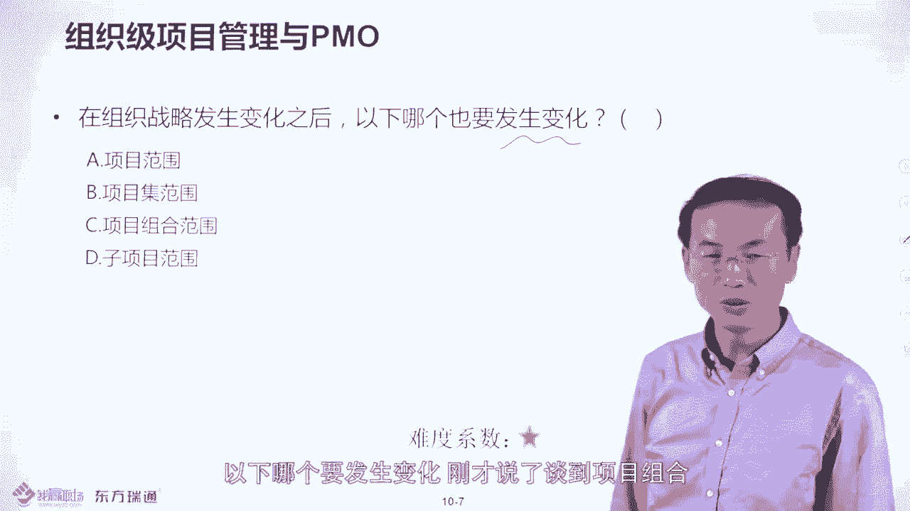

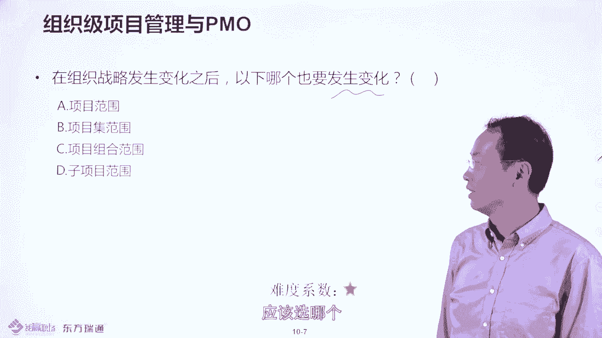

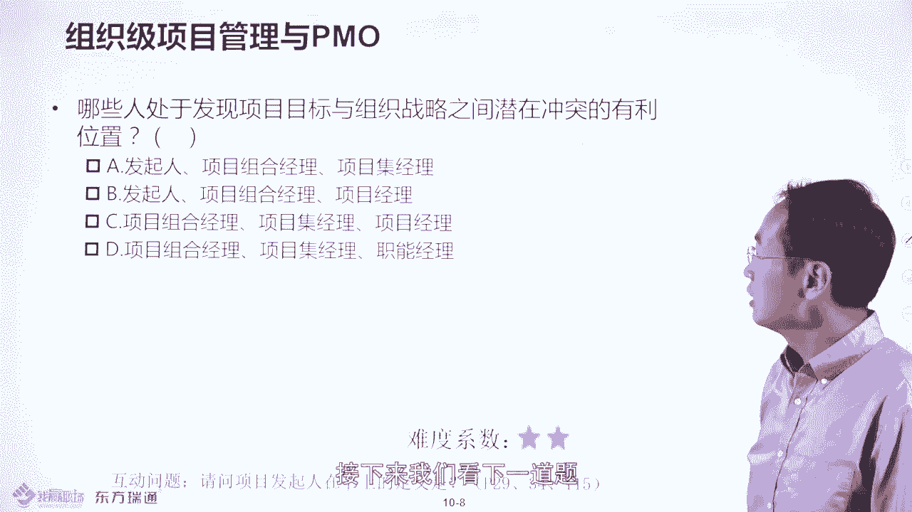

哪些人出于发现项目目标和组织战略，你看项目是战略落地的手段嘛，潜在通突的有利位置啊，肯定是高层领导嘛。那他没有说什么项目总监，他更多是什么呢？项目基经理，他没有说什么分管项目的副总啊，更多什么呢？

项目组合经理，对吧？所以是这些人，就是项目的发起人，项目组织经理和项目基经理啊，出在什么呢？战略和项目之间。那如果说你说项目经理，你发现你的项目目标可能会跟战略目标不一致，怎么办呢？要找这些人谈。

是吧谈话沟通，明确你的目标是否一致。好，然后这边的话我们看一下。

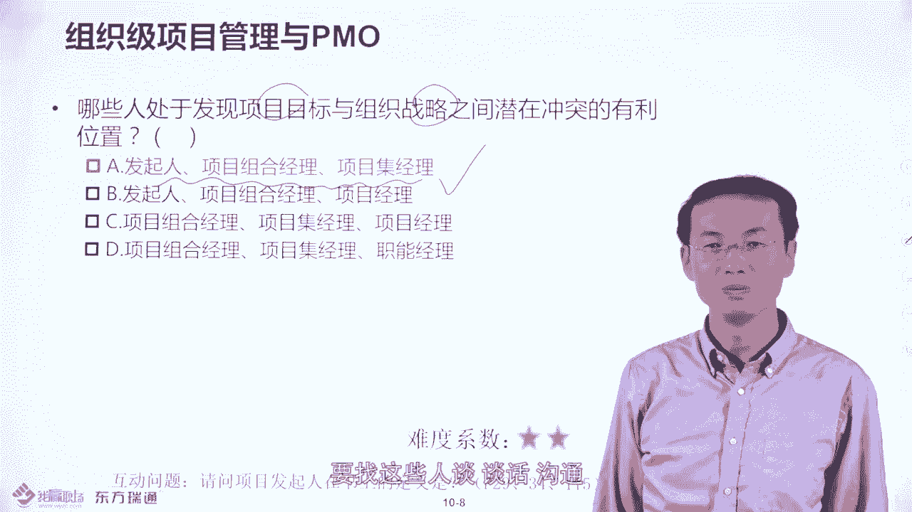

关于组织意向管理这边的话呢，在你的书上1617页这边呢有一个名词叫open，就是组织意向管理的一个词儿。比就说最好的方式的话，就是你组织的话呢。

呃从整体上应该能够确保项目成功的那也就是说你组织具备什么确保项目成功的一个能力。那这能力是可以测评的。注明了呃这种管理学大师呢，他们都有一个测评测评的模型。大家知道一般测评的话都是1到5打分的。

一表示不及格嘛。二表示有一点，有一点流程过程记录。三表示及格了。四表示良好五表示优秀嘛，就是1到5打分嘛，是不是这样的。所以呢大概是大师的模型是这样的。那这个也是比较我打分，这个模型的名词不用记。

你就知道是5级就可以了。那基本来说呢呃一级是什么情况呢？就是就是属于不太好情况，就属于什么呢？盘古开天之地，就是说属于那混沌状态，很多企业都是混沌状态，什么样的情况呢？是这样呢？呃，比如说举个例子。呃。

在你公司你可以自己考察一下，在你公司80%人认为项目管理不那么重要，而且在项目管理过程中呢，没有过程记录，就是一级，就是这就是一级的混状态。那二级呢就什么呢？

就是属于你们公司80%人包括你的领导认为项目管理很重要，并且有部分过程记录。从一级到二级能干掉中国80%的企业。啊，因为从一级到二级属于一风一俗，就属于从不那么重要到很重要。

就有文化的改变是不是那么容易的对吧？哎，所以能干掉中国80%的企业。那三级呢，如果你说是三级，基本来说呢，就是你公司有项目管理的工程记录，起码你公司应该有一个部门叫PMO。

项目管方式来维护你的项目管理的过程记录和一些制定项目管理的制度流程和章程。就是所以呢项目治理的一些要求啊，大概章样子。好在呃中国的话，很多外企，比如说I比中国会比中国基本的程度呢就是三级以上。

因为他们公司PMO。那四级呢什么样情况呢？就是你公司的PMO主导项目治理主导项目的这种管理要求，然后确保持续优化，项目管理的模板达到什么呢？持续达到业界的或行业的追究，就是四级。那5级呢五级什么情况呢？

就是你公司做什么事情，比如说HI也好，做指控也好，做财务也好，那所有的事情都是按照项目管理的模式去做的。一般很多公司呢是达不到5级的，但是呢也有达到4级的那四级的情况的话呢，在中国没有见到。

但是在澳洲美国的话，我是见到的比。が？在那个埃迪澳洲的话呢，他们管控的是比较厉害的，而且他们的PMO经理呢，他们对制度流程管控的要求的话是非常之细的。就是凡事都有规定啊。

做的事情呢就是说基本是行业的最优。哎，这个是比较有张可循的啊，所以说在埃德中国的话还达不到4级，一般来说是三级到4级之间啊，就是on the way就在路上一直在路上大概这样子。

所以呢你的改进也是一直在路上的。比如说大师说了，从一个级别到另一个级别的，你的改进的周期是多少呢？是两年。那就比如说你从一级，你判断你自己现在企业是一级，如果要想达到5级的话呢，至少要1年。

所以呢改变不了你的企业呢就试图改变你自己。你懂的，理解吧？哎，因为有些时候呢，你不可能给你的企业派头呼吸共命运的，是不是大家这样子。哎，所以有些时候你改变自己还是很容易的。因为什么啊传大的是很难调头的。

是这样的啊，好，你要了解这个事儿。那这边的话我们看一下关于PMO这块的话呢，是有一些考试要点的。首先PMO是涉及到项目级以上的管理，涉及到什么这种资源协调啊，突出解决啊，就是跨项目的资源协调的。

这要知道的然后这边的话我们要知道呃。PMO这个作用还是很很大的那一个组织的PMO的它的作用或者权力的大小取决于组织的需要。比如说如果你们公司的1个CEO，他说如果一个事情不知道这个事情由谁来做。

应该交给谁。他说如果这个事情不知道谁做，交给PMO就可以了。那你觉得PMO是个几级部门呢？起码是个一线部门，直接什么成为CEO的左右手。那如果与PMO是什么呢？

是一个呃三线部门的这种归三线部门管的那你的影响力有多大呢？可想而知没没有多大，我没有没有多大，对不对？哎，所以说呢你PMO的职能或权利大小取决于组织对他的需要和定位。是这样的啊，所以要了解。

那所以说呢不同组织对PMO的定位是不同的那基于不同的需要，PMO这块的定位的话呢，分成三种类型，这是考虑知识型。控制性和指令性。那这边的话呢，请翻到你书上的第48页。

48页级别的话呢就是支持型、控制型和指令型。那支持型什么意思呢？就是只提供模板过程不行呃，不需要控制。那控制型呢就是要控制你的过程，需要你服庸置理。那指令型呢就是我直接给你打绩效，给你打审计，是这样的。

所以说从知识型、控制型到指令型。PMO的权利是越大还是越小啊，是越大看到没有？那比如说分别给大家举些例子，比如说。在中国很多公司的PMO呢基本都是支持型的。什么叫支持型的呢？我见过比如说PMO是有。

但是它控制项目的话只是一头一尾。什么叫一头一尾呢？就是在项目签署了那个什么这种合同的时候，他要要求项目经理呢把合同的一些复印件来给他做归档，这就是所谓一头一尾呢，项目的那个所谓收尾验收了。

只有一个完工报告吗？还要求项目经理把完工报告销上来，这就是一尾，看到没有？中间过程不管。那这就是所谓的执行的。然后呢，他提供了模板，但是不要求什么呢？不要求你一定会用。是这样的。好。

然后接下来我们看一下控制型的控制型什么样的情况呢？就是我不光要提供模板给你，我还要求你服从治理，一定要用得起来，怎么用的起来呢？比如说IBM的PMO就是控制型的那比如说IP节目这么说了。

他说你每个月项目经理要把项目的绩效报告，要放到一个地方，这领导看到。那比如说上传了一个服务器目录上，那他会说一句话，他说领导看不看是领导的事儿，你你放不放是你的事儿。那领导可以不看，但是你不能不放啊。

因为什么呢？因为要符符合指要求，因为这里要求说你必须把绩效报放上去的，把工程记录放上去的，是这样的啊，哎就要求你服从。那这种指类型的这种PMO的话，更厉害了，他直接给你打绩效。比如说在I点到澳洲。

他的PMO做的比较厉害，他的PO经理他既是PMO的经理。这个部门的经历啊也是什么呢？项目经理经理的经历就二线二线领导也是架构师团队，是架构师的经理的经历。比如说他既管PO，又管架构师团队，又管相关团队。

如果你像经理不服，对吧？不服管，他给你什么打绩效发起审计。把你裁掉是这样的啊，它的管控力度就是属于什么啊？指定型的，在中国还是没有太多这样这样的例子。在国外还是有的啊。

在中国很多的像中国的外企就是控制型的，中国的民企更多是这个知识型的，甚至是没有没有PO，是这样的情况。大家知道你可以看一下对号入座一下，知道一下你组织到底是什么类型的PO啊。然后呢。

关于PMO的主要职责，也是考虑就是请翻到书的49页。PMO的话呢，它要制定一些标准的模板啊，做实的方式方法，就是就属于项目管理方法论嘛。哎，规定这些具体的方法，包括什么呢？呃。

能上一个项目管理的管控的软件。然后必要的时候呢，可能会发起一些审计呀啊，跨项目的共同协调啊，尤其资源协调，这个是我们都知道的，就是说PMO是参与到项目级以上的管理的那这种治理的话呢。

有没有更加呃落地一点的一个岗位职责的要求呢，我是这边有的一会你看一下，比如说在你书上49页。刚才我说的一些东西呢，在你书上有一点点。哎，这个东西太粗了，那我这边呢呃有一本自己写的书。

你也说了叫做PNP项目管理方法论与案例模板详解。这本书里头呢，我抄了一个案例，这个案例呢是来自于I0和会普这种公司的。哎，他呢对。PM的要求有更加详细的明文规定。比如说大家可以看一下。

首先你要建立什么项目管理的体系包括什么东西啊，项目管理的制度流程，包括模板，然后呢考虑到要建立一个项目管理的这种项目关新息系统，把所有项目管理的记录本啊记下来，就是说不是更不是单机版啊，这是复记版。

是这样的。好了，然后接下来呢要建立维护过程组织过程资产，就是组织的过程记录，就所有项目的过程记录，包括周报月报绩效报告，会纪要，这些东西全部要呃分门别的去收集和管理，这就是你PM要做的事儿。

比如说你要求项目经理必须提下来这些东西。然后就归档。然后。做好项目的监控，这块还是挺难做到。有些时候项目经理不配合啊，但是你要要求，那必要时候呢，要求项目可能会整管呃整改，就是属于危机公关。

就是你杀进去帮项目经理去解决一些可能危机或者一些问题，是这样的，就是监控项目的当前的绩效情况。这个是这个这一块的话呢，不是所有公司的PMO都能做到的。但是I迪惠普这种公司的。

他要求PMO能该做的这个事情啊。好的，然后接下来呢。就是什么呢？就是必要的时候会给你打绩效，就是他会做一些绩效评价，然后并且对你的项目经理的能力做评测。比如说像我给大家那个评估大的图，就应该类似这样的。

就是1到5打分。然后平均分应该是3分以上就及格嘛，是这样的啊。好，然后接下来我们看一下，他还要做一些什么项目管理的文化建设。比如说他会组成组织一些什么项目管理的论坛啊，沙龙啊，包括一些呃出版。

比如说每月出版项目管理的杂志啊啊，一些案例分享啊啊，这个我看到很多企业有有这样做的啊，就是他会有这种月刊周刊，包括那种呃电子版的，他们叫usle是这样的啊。好，这就是所谓的PMO的岗位职责。

如果你想真的建立PMO的话呢，请参照这本书，关于安全汇普的PMO的岗位职责，参照执行就可以了。好。所以我们总结一下考试呢有一个考点，考点是说它会去区分PMO的职责和项目经理的职责。

那一般谈到PMO我们说到什么？考点是它是项目级以上的管理。然后考虑到资源的共享利用，资源这个冲突，怎么管控。然后考虑到什么呢？要制定什么标准的项目管理方法论。而项目经理呢更多是要确保项目目标。

单个项目目标达成，哎，所以它是有区别的。好，那我们看一下，比如说PMO怎么管呢？这边呢是公司，比如像华润呢，像运输集团呢，这些公司房地产公司，它也有PMO的，哎，你看他们就把所有的房地产项目，看到没有？

这些房地产项目哎，都通过一个系统看到他的所有的技术状态。那你可以回想一下，在你公司你的领导，是不是想看到任何一个项目的状态都能看到呢？可能未必的。所以就是为什么要上一个项关系统的原因。

你的领导可以随时看到项目的技术状态，项目当前的。

每个项目状态。否则的话呢，每个项目都是黑洞，是这样的。好，这就是PMO要帮领导去分忧的。他可以通过一些系统通过一过程梯录，让领导知道每个项目的状态。哎，你看这个都是上系统的，看到没有？哎。

这些状态都能看到好。

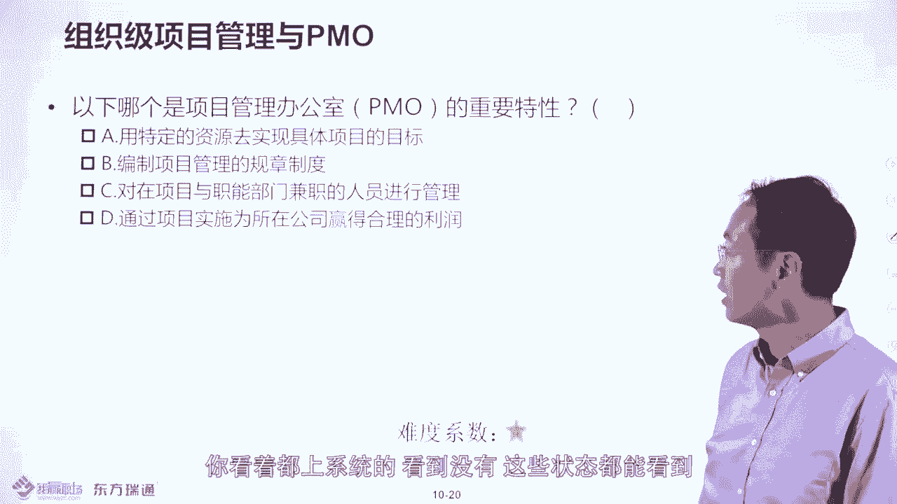

接下来我们看一道题，就是关于PMO和项目经理的这个职责这块是一个考虑。看一下以下哪个是项目管理办公室PMO的重要的特性啊，或者它的职责呀，选哪个呢？来可以看一下。

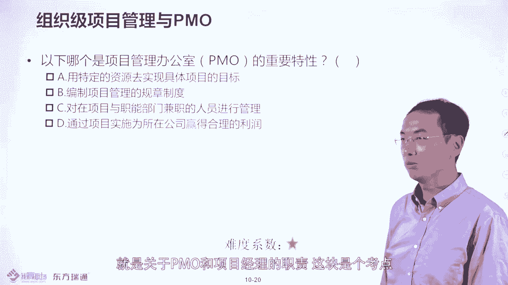

而该就系噶。编制项目管理的规章制度，也就属于什么呢？治理的范畴吧。那你为什么不选ACG呢？因为ACG都属于项目的目标或者项目经理要做的事儿，所以他会考虑什么考点呢？会考PMO的职责和项目助理职责的区别。

好，然后们来看下一道题，在某某公司的PMO虽然不直接，你看它不直接管项目。

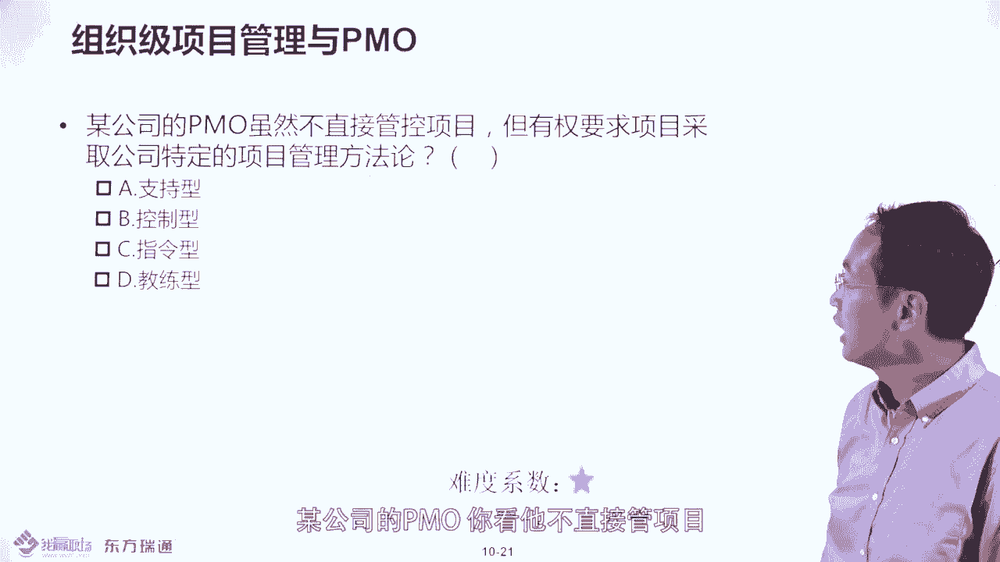

但有权要求项目采取一些公司的既定的方法论，是支持型控制型还是指定型的呀。那，大家肯定知道说应该是控制的，我控制你对吧？哎，我控制你要交付东西，对吧？所以就是控制性的，知识情什么呢？就是只提供模板。

不要求你服从，而控制呢？要求你服从服从什么服从项目治理呀。

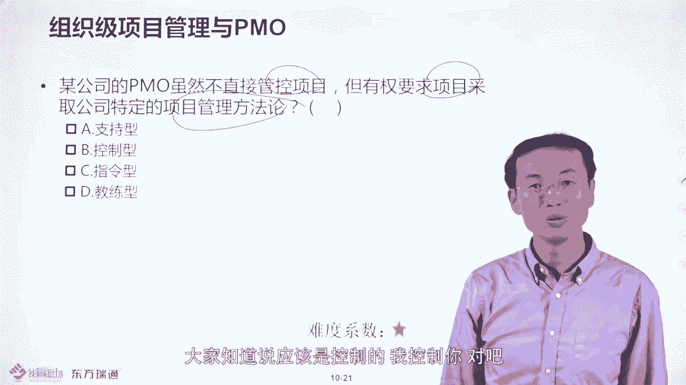

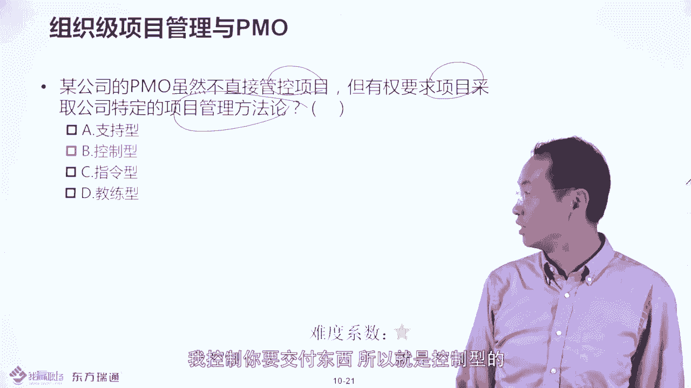

那那个指定什么呢？就是我不光要一去教税你不同，还要给你打绩效嘛，还要审计一样，是不是所以校知道的。

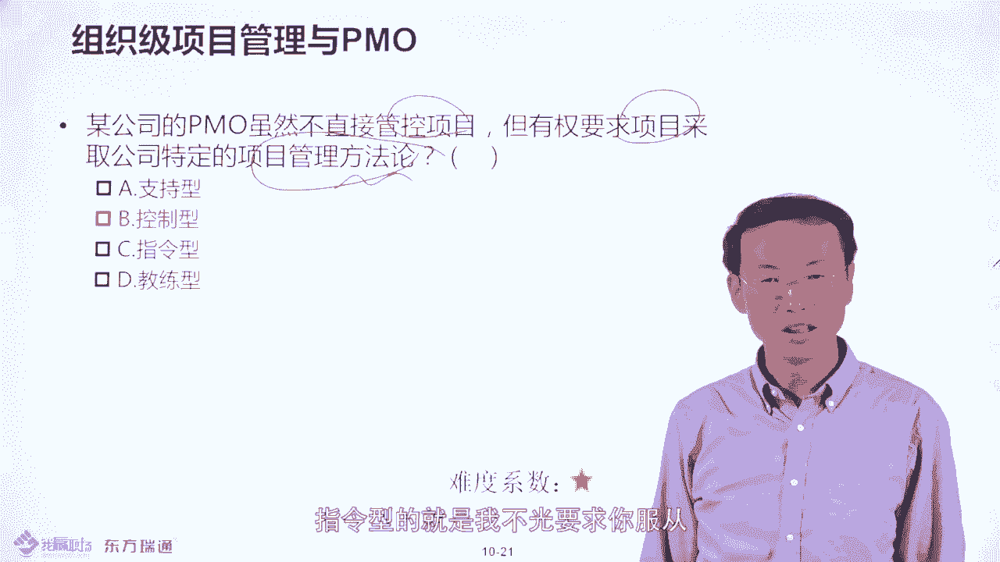

这就是控制性的。好，关于这个PO和组织项目管理，我们今天就讲到这里啊，感谢大家收听收看，多谢。