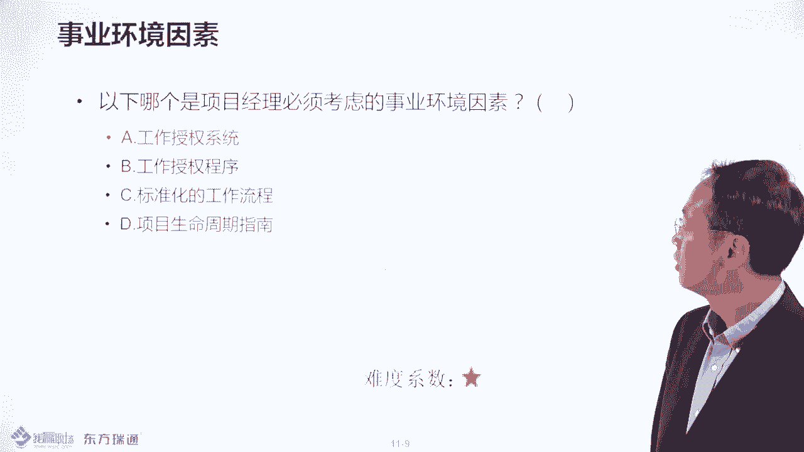
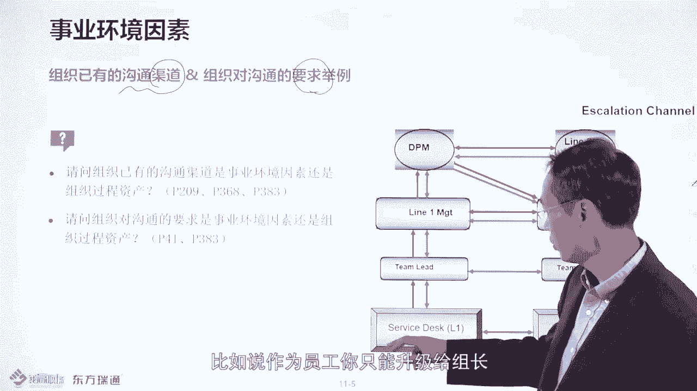
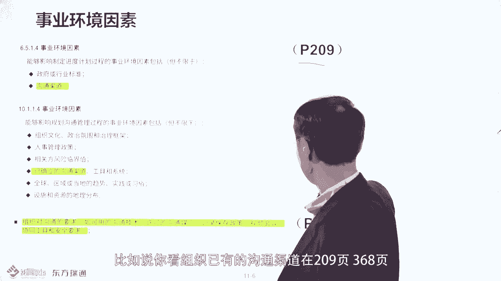
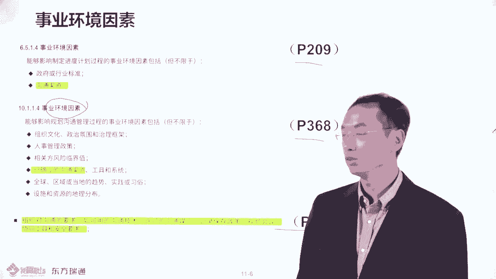
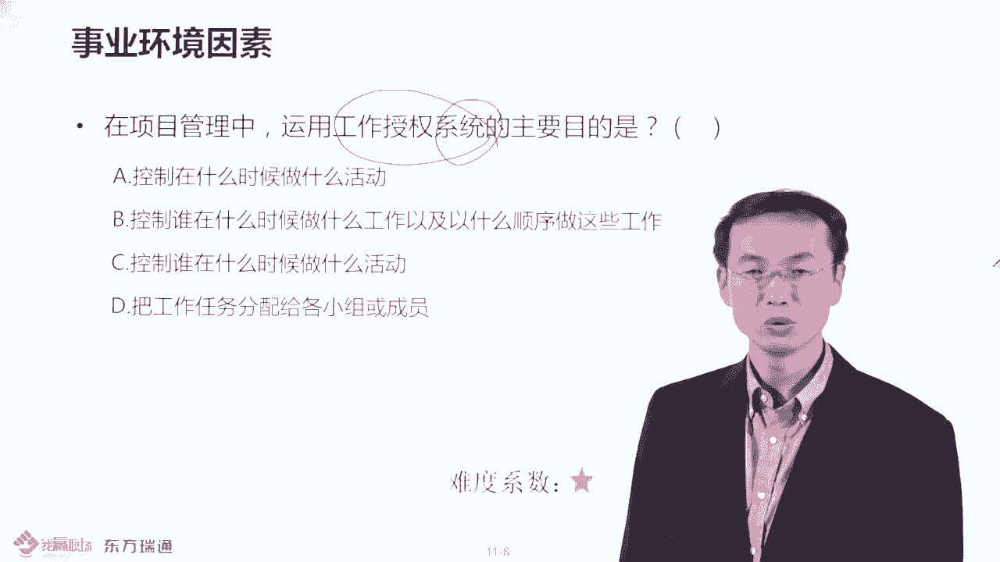
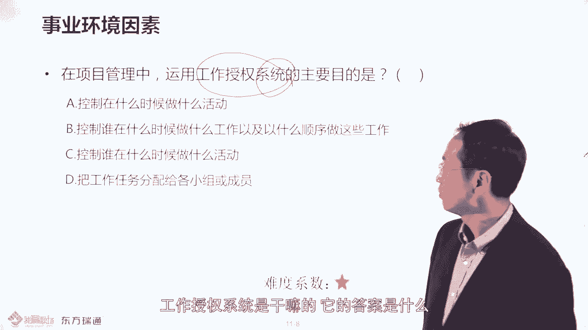
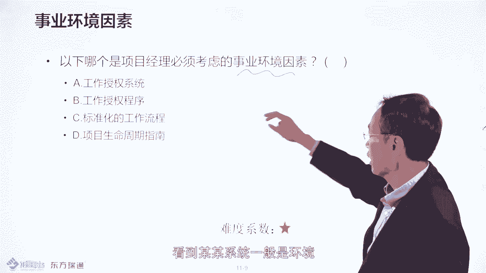
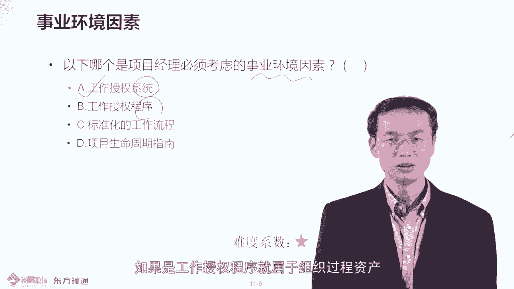

# PMP项目管理PMP学习知识快速通过PMP考试 - P10：事业环境因素-10 - 北京东方瑞通 - BV1df4y187rv

尊敬的果营线上小伙伴们，大家好，欢迎大家持续关注PP项目管理线上课程。本节我们讲一个重要内容叫做事业环境因素。比如说在做项目的时候，你要充识环境。比如说之前我们说过，在一个企业中，尤其甲方的环境。

比如说这个谁做到哪个位置上啊，然后呢要领导先行啊，然后吃饭的时候要领导先用完之后呢，员工才去啊，是不是这些都是环境的，你要充识这个环境。对为？如果你不通识这个环境的话呢，可能会导致项目受挫或受缚。好。

那我们看一下在阶梯中呢会在美国人的认知中呢，他也认为环境很重要或者文化很重要，是这样的。好，那我们看一下呃本节会讲到这个了，事业环境因素。那谈到事业环境因素的话呢，我们必须跟大家说一下，下节呢。

我们会讲到组织过剩资产。那考试的时候，他会考察。啊，这两个区别。那这区别最典型的特点是什么呢？就是谈到环境，你就知道什么是影响你的限制你的会有一个限制这个词儿。那谈到资产呢，你要善加利用和裁减的。

会记住裁剪这个词儿。比如说呃PP都有49过程。那就是资产了。那些资产的话，你会不会做项目用呢，你要学会裁剪，所以总结一句话，谈到世界环因素，想到是限制或影响，谈到资产呢利用裁剪，是这样的，然后呢。

我们还要区分开哪些属于环境，哪些属于资产。那这边的话呢，刚才我们说到了呃，环境是影响你的，限制你的，你是不能控制的。是这样的啊。那比如说举个例子。组织文化企业文化。那文化的话呢，它是环境呢还是资产呢？

其实是环境。何谓文化呢？GCL的李东升曾学说过一句话，所谓环境，所谓文化呢就是所谓什么呢？就是一群人思维和行动的惯性。比如说这些人呢思维行动是惯性的。如果你做组织变革的话呢。

你会改变他的思维和行动的惯性，会让别人不舒服。然后如果你变化比较大呢？会让很多人不舒服，所以他们会认为什么呢？你是公敌，是不是？所以呢你的变革呢就会受阻，会有很多人反对，是这样的？好。

所以文化是限制你做事儿的。那这边的话我们看一下，除了文化之外的话呢，还有一个非常重要的考点，叫组织已有的功渠道。这边的话呢跟这个资产那边也有一个词儿，大家可以看一下，我回头给找一下啊，对大概是。

诶。这儿呢哎这边的话呢给大家看一下啊，就是我们要知道一个考点，考点是组织已有的沟通渠道是属于环境，组织对沟通的要求是资产。那比如说呢呃组织对公司要求说不能越级申报，什么意思呢？比如说你作为员工。

你只能升级给组长，那组长呢升级给经理，经理升级给二线经理，对吧？但是呢你要知道说有些领导的话呢，他喜欢听小报告，对不对？哎，这个是组织对沟通要求，但是呢组织的员工为你执行。

那组织也有公主道的话呢，也不执行的话呢，可能会做到严厉的处罚。那这就是环境了。比如举个例子。那比如说大家知道现在外企的话呢，经常是裁员或者说经常经营效益不好的话呢，考虑控制花费。比如说在IBM的话呢。

就这样一个案例，案例是这样的。比如这几年IBM效益都还好。然后这样的话，那个IBM的CFO总部，就是美国的CFO呢，就发了一个什么发了一个邮件这么说呢？说现在效益不太好，所以呢我们要开源截流。

更多是截流，怎么截流呢？凡是跟什么业务不相关的差旅啊培训呢都应该冻结掉。然后接下来他的邮件怎么说，他说我知道凡是接有exception就有例外，但例外呢要经过总部CFOP还是例外。但不意味着这种例外呢。

是很多的，我认为是很少的。他把这个邮件呢发给了各大区，有中国区呀，包括澳洲啊，包括韩国呀，包括台湾各大区的什么总经理，总经理发给什么。副总台副总台发给什么呢？高级经理，高级经理发给员工。

那这个世界就安静了。哎，这不对呀，他们说嘛有意外找总部CFOP呀。好啊，那我问大家一个问题，比如说你想呃去参加一个培训，然后呢，可能费用比较贵。然后然后你的老板呢可能是不同意，那怎么办呢？

你说这个CFO说了，有什么有利案找他批吧。那你能不能发一个邮件吐给你CFO就送部CFO私信你老板呢？能能不能这么做呢？答案是否不定的，肯定不能，对吧？那你说为啥不能啊？我就怎么做呀？哎，你想出名吗？

出名要趁早啊，我告诉你出名，出名的话呢，就是你回去就发一个邮件给你的什么公司的最高层的领导，董事长也好，包括总经理也好，CC各个层级的领导，说领导帮我批一个什么参与报销吧。

或者帮我去批一个什么出差申请吧，你就出名了，理解吧？哎，这个出名要趁早嘛，关键是你会那么傻去做吗？你说我才会那么傻，对不对？因为董事有什么有既有的公同渠道啊，如果呢你没有按照公司渠道去做的话呢。

是违规比如说在别如果你想出差的话呢，是这样的，先要你的一线经理批，然后呢，在二级级理批，给你不同权限。然后呢，了不起呢，就是本地CFO一助理批，都轮不到CFO批的。那何况是总部CFO帮你批呢？

是不可能的，理解吗？哎，所以说你要知道说这是为什么总部CFO说了，我认为这种例外是很少的。因为什么呢？上到他那个台面上批这个事儿，理解吧？看到没有？它是这么控制的。哎，所以要了解啊。

就是属谓的组织已有的公共渠道，有些时候是限制做事的。有些时候呢是要控制的是属于合规性的要求的，这样的啊。好，那组织对沟通的要求的话，有些时候呢呃不同公司也有要求。比如说如果你在阿里阿里巴巴。

你能不能在办公这个那个电脑上去装QQ啊，答案是否定的或者装微信呢，答案也是否定的对吧？那如果你是在腾讯工作，你能不能在呃公司的那个系统中去装什么呢？装那个呃阿里的钉钉呢？答案也是否定的啊。

所以说呢他阿里人会说我要用那个那个微信传东器的话呢，是不是腾讯会帮我做个备份呢，理解吧？那腾讯呢也会这么说，我要用钉钉做的这件事的话呢，阿里也会有个备份呢？这样的话我我的什么信息不泄密了吗？看到没有？

哎，所以说就要了解哈，所以说有些时候呢沟通的要求的话，可能还是也是也是有点严格的。但从考试的角度你要区分开。因为我们有例子的，就是说我们有大来的佐证的。比如说在你书上。

组织业有的公通渠道分别在209页、368页、383页。有的组织对沟通要求啊也是有的。那这边的话我们看一下，那我们这边的话呢，我们看一下这边，比如说你看。组织的已有公通渠道在209页368页啊，这边有了。

你看它属于什么事业环因素。那组织的沟通要求呢，是属于什么？组织构剩资产啊，是属于组织构剩资产啊，所以在大家可以去去对一下哎，比就说虽然你的课件中，或者说你的书上并没有非常明确的去说出哪个属于事业环因素。

哪个属于组织构同资产。但是在其他的章节中是有大概的佐证的啊，所以我们要呃总结一句话，谈到组织已有的沟通渠道应该是事业环因素，谈到组织对沟通要求呢，应该是组织构剩资产啊，这样的啊。好，大家了解。

这就是呃一个概念啊。然后接下来呢我们看一下。

这个是这样的，就是讲到了文化属于环境世界环因素，组织业有公众渠道是什么呢？是属于那个什么这种呃世界环因素啊，组织对工程要求是属于什么组织资产，然后这边还有一个东西叫基础设施，现有基础设施和互助资产。

它也属于环境的，这个怎么理解呢？比如说大家知道说像呃深圳房价比较比较高那华为呢它的总部呢就逐渐搬到什么松山虎去道，说搬到东莞去了，这就受什么呢？受地价影响限制，那这就是所谓的基础设施场面的改变，对吧？

啊，就是说你的地价太高了，所以有些企业搬走了嘛。比如说除了华为之外，你可以看到说由于中国的房地产的增加，会导致什么东西呢？很多万企搬离了中国，比如说最典型的就三星，三星的话。

原先在天津会在北京是有什么有厂房的。现在目前呢在天津的一些厂房呢，估计都搬到吧。搬哪去了呢？可能搬到这哪去了，看见没有？就是由于什么受到地价或者你的基础设施的限制，导致说哎我是搬迁了吗？为了降成本。

看到没有？这是环境啊，好了，那我们看一下呃，除了这个所谓的刚才说的那个基础设施这一块的那个属于房价的问题的话呢，有点什么有点虚，对不对？那给大家说一个实在一点的，比如说这边的话也有一个案例。

这个案例的话，就是说你在做IT项目，你怎么考虑基础设施。比如说IT项目基础设施是什么呢？就是当前客户的数据中心环境。那比如说一个典型的案例，比如说我们有做我们作为乙方。

我们做了1个ERP师项目是给谁做的呢？给那个甲方，比如说家乐福法国运公司做的这是个真实的案例。当时我们上一个什么ERP软件或者是一个零售软件。这个软件的话呢，我们给其他企业，其他的比如像华润呢也上过。

没什么问题啊？但是到家乐福那边系统，它的机房一上的话就有问题，就是系统呃启启动不了，或者说启动老是报错。然后呢，我们的乙方项目这里会想什么呢？哎，我这个软件在别的客户那边是好使的。为什么在你家乐福不行。

一定是你环境的问题，是不是？然后呢在跟甲方的项目这里去沟通呃，去检查之后，突然发现原来呢就是我们的软件呢需要什么开通一些对运行端口，但到比如说像orlook口也好，DPwo也好，它不会什么呢？

因用数据库软件，它会那个开放于监听端口嘛，其实些应用软件，它也会开通。那我们在我们的这个需求文件中呢，并没有说要开通。因为家乐福的话呢，它的机房它的基础设施这块呢，它是有安全管控的。

凡是你不要求开通的东西呢，一律什么呢？一律是关的。所以这样的话就是属于什么呢？这属于他的非公需求，我们并没有跟客户说，那这样的话呢，哎所以我们的在客户那边现场的话呢。

其实我们应该列这样一个表给他就是基于我的上上上的系统，包括什么这种软件，我要告诉他从哪个IP到哪个IT对吧？然后呢去开通哪个端括号，这些东西呢是一些要求，就是说你起码是运营或部署层面的要求。

但是我们没有说，那这样的话就是呃家乐福就没有做嘛，没做的话，你觉得是属于甲方的原因，还是乙方的原因呢？肯定是乙方的原因。因为你的需求的这种调研呢或者或者是需求文件中说不清楚。那甲方就说了，哎。

这个事情呢，按照偏P的说法的话呢，要走一个标准的变更审批流程，要正式书面提交。那希码提交个工单吧。然后这个工单的话都审批审批的话，呃，一般来说呢，甲方就是家乐福的信息中心的一些呃这种技术的审批的话呢。

需要总步来批，那需要到法部不批，但家知道说法部呢是一般是比较懒的那一般干嘛呢？不是outing，就是就是出去玩，对吧？就要不就是什么按静例务，就是属于什么呢？就是就是年假。

然后或者是什么dating去去那个呃相亲去了，对吧？啊，交女朋友去了，是不是哎反总之不在家，那保守估计的话呢，就会审批的周期是两周就叫离他，就是审批的周期啊？那这两周的话呢，这个上线就延迟了吧。

因为你不审批通过也是不能改变这些端口的嘛，这样的话项目就延迟了两周，那就么大一些问题。这种情况的话是属于甲方负责呢，还是属于乙方负责呀？那肯定是乙方负责，对不对？因为由你提交的需求不明确，那延期的话。

甲方还要保留追责的责任，就是追责的权利，对吧？哎，就是他还要追责你，必要还来罚你钱，是不是是这样的啊，这就是事界环因素，基础设施这个层面的那个内容呢，大家可以看一下。好，除了基础设施之外的话呢。

还有一些东西大家可以看一下。就是这个就是员工的能力。员工的能力当前的情况，就是当当前的员工的技能情况也属于环境。比如说当你的员工的能力不不足的时候呢，是一个环境的限制。好了，那员工的能力这块的话呢。

我们给大家举个例子，比如说你去找职能部门去要人。职能部门要人的话呢，哎那你要知道职能部门那些经理啊，他需要什么呢？他需要那个对当前的人做一个评测。那他本身应该是针对任何的岗位，但到岗位就是阶梯。

就是职位描述嘛。每岗位的话，他应该有技能要求的。那针对技能要求的话呢，他会对员工的话，每半年每一年做评测的。就是说针对一个技能。如果说比如刚三针对一个技能的话，如果是不具备，是一了解地点呢。

是2在别人帮助下可以完成这工作呢？是3，然后呢独立完成4，培训别人是5，哎，这就是技能的情况。也就说你下面这个职能部门的些人呢，他每个人都是这样技能的要求的。哎，这或者技能的一个评测的一个表。

当前的情况的。那你说项经理你要要求什么样的一个岗位或者一个大概的一个要求，他就可以这个职能部门的经理呢，基于当前的他管人的技能情况，他就知道谁最适合做你的项目。这就属于呢当前的人员的技能情况。

它也是一种环境的。好，给大家举一些例子啊，这就是属于世界环境环境因素的例子。好，然后接下来我们看一下出道题，大家感觉一下这道题的话呢是一个典型的环境中的另一个例子，就是工作授权系统。比如说考试的时候。

谈到某某工务系统一般是环境，某某某某过程，一般是资产是这样的组织过程资产。好，那公司授权系统是干嘛的呢？他是要考虑到说他的答案是什么呢？就是控制谁在什么时候以什么方式以什么顺序把这个工作交付。

那比如说通过这个公司人员系统，他可能是项目管理信息系统的一部分，通过这个工作授权来确保什么呢？这个工作交付的这个有序执行。比如说如果你作为甲方要乙方做个事儿，如果没有相应的派单的话呢？

有可能是呃乙方有些时候的话呢，是很难控制这些过程的。比如说你作为乙方你项目经理呢在总部。那你的员工就是具体干活的人呢，是在扣现场。那客户的话呢，他要提一个需求，或者提一个要做个事儿，有可能是不。

在你的项目的范围之内，但是由于什么呢？由于这个你的项里员工代购现场，他可以随便的什么驱使。比如说买杯咖啡呀，包括我写个什么会医药啊，就这个事儿的话。

可能是多多少少会做的那如果说你公司有要求说做什么事都应该是没有授权就不做，在安全就这么说的，叫no ticket the work，没单不干活。就是说你甲方要我干个事，对吧？开单来呀，对吧？哎。

开单的开个单，要乙方的这个项目经理或者是产品经理这个头呢审批一下授权一下，然后确保说我统计了这个工作的什么成本，包括我要收你费用，对不对？然后再再把这个单只派给我下边人去做嘛，是这样的，这样的话。

可以防止什么呢？这个项目范围的慢一点。之前说了办蔓延什么呢？甲方要去做事儿，然后呢，没给你算钱，就是蔓延了。是这样的。好，所以工作收联系统，然后它是控制与具体的人在什么顺序，什么时间把这个事做了。

所以这个事情呢还是很重要的。它属于相关新息系统的一部分，它也属于适应环因素，这要知道。好，然后接下来我们再总结一下，适业环因素，砍纳某某某系统，一般是。

环境它能某括什么程序呢？就是资产了，比要了解这个环境和资产的区别啊。好。

这边要选择的是什么呢？选的是工作授权系统。所以要知道工作授权系统，它属于视界化因素。如果是工作授权程序呢，就属于组织或程资产啊，就要了解一下。所以关于那个世界环因素和组织生生产的话呢。

呃回头我们还会比对的，我们本节的话还是讲的什么环境多一些。在你书上第3839页，大家可以看一下这边你看到没有？组织的文化是环境，刚才说了基础设施是环境。然后包括什么呢？哎，你上什么系统，是什么？

这个是这属于上系统呢，还是应用系统呢？比如刚才说的工作授权系统，看到没有，这呢。

其实是更多是你要要应用的系统。你们公司建在目前的话，用的一些相关信息系统，工作数理系统正在用的那些系统是什么呢？是环境，对必须要用的。好了，然后呢，包括资源的技能情况，包括可性的情况啊，这也是环境。

然后这边的话呢有两个东西，有两个数数据库是非常重要的环境，一个是商业数据库，一个是什么风险数据库，看到没有？因为呢在后期在下一节讲资产的时候，组织过的资产的时候，他也会谈到。

比如说配置管理数据库或知识库都叫什么库。哎，所以说要知道哪些库属于环境是界和因素，哪些库属于什么呢？组织过的资产。那为什么商业数据库是属于什么呢？是属于环境呢？因为它是行业这个这个这个领域什么呢？

大还生成的，而不是你组织自己生成的。比如说。大宗商品的什么这个价格呀，包括什么所谓的这种汇率买卖的这些大概的一些汇率呀，不同货币的汇率呀，都属于什么呢？

跟商业相关的那它其实呢是这个行业或这个社会所共有的这就是环境是这样的。如果你组织产生的东西呢，比如说什么知识库啊，组织配置管理呀，这些东西呢更多是资产是这样的啊。好，那风险数据库的话呢。

哎这个呢要个为基。这个你可以简单理解说你这个行业共识的一些风险内容，然后呢做到什么风险税库中去查询的。来，所以说呢呃考试的时候，商业数据库、风险数据库，你一定要记住它属于事业环因素。

那配置什么知识库啊或配置数据库呢？属于资产。我们下一节会讲到的。好，要要了解。本节的话我们讲到的是视界环因素的相关内容啊，有一点抽象。我们要起码记住组织的文化，包括组织架构，包括一些基础设施。

某某某某系统都属于环境。那商业数据库风险数据库属于环境啊，这就是基本的内容啊，集中的啊，感谢大家收听收看，多谢。

