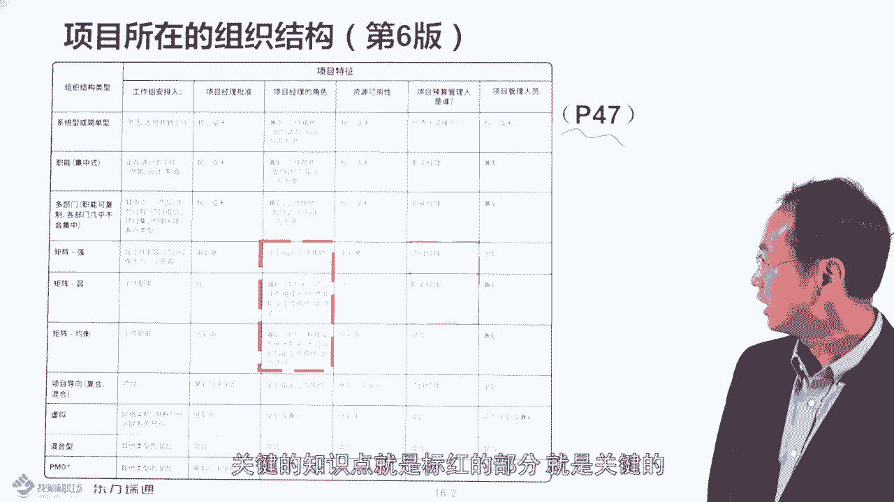
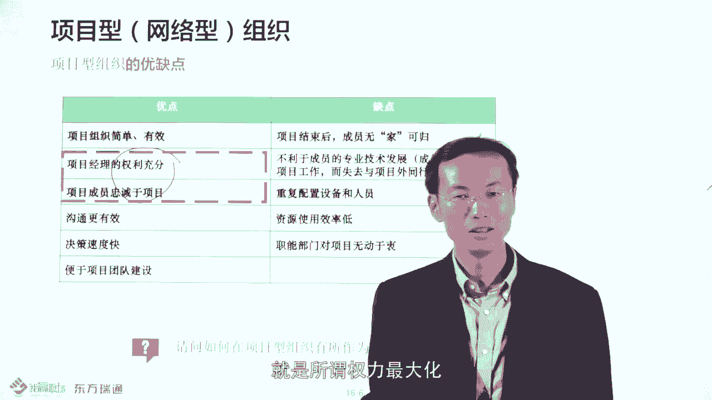
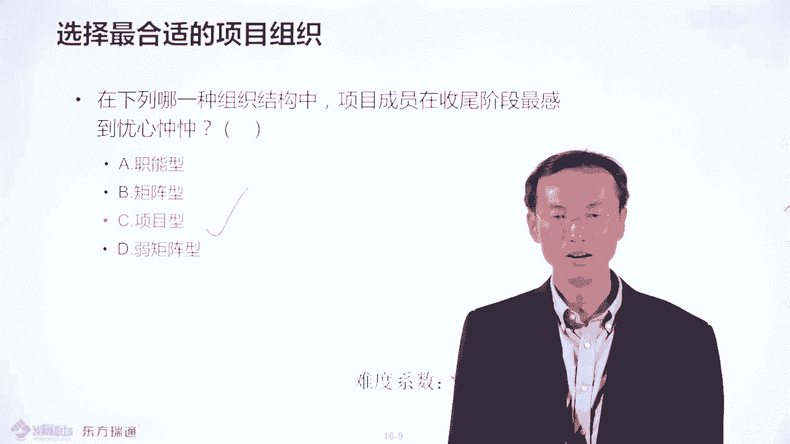

# PMP项目管理PMP学习知识快速通过PMP考试 - P15：项目所在的组织结构-15 - 北京东方瑞通 - BV1df4y187rv

各位我赢的现场小伙伴们，大家好，欢迎大家关注PND项目管理现程课程。本节我们讲述的是项目所在的组织结构。那首先问大家一个问题，组织结构属于事业环因素还是组织过程资产。答案是事业环因素。

也就是说组织结构就是组织的架构？这个组织架构的话呢属于环境。那组织架构的话代表一种文化。那你看到在这种呃很多国企的话呢，它是职能组织。那很多的这种外企的话是矩阵式组织结构。

那它的文化是不太一样的那我们要看一下在组织结构里头，它会有什么样的一些类种要求。那因为你的干系人相关方上级讲的相关方是在所在的组织架构里头的那不同的组织架构的话，管理相关方的方式方法可能会是不太一样的。

那所以说呢我们要呃强调这种组织架构的概念。在你书上第47页，大家可以翻到这个书的47页，这个表比较复杂，我们要找找到什么呢？关键的知识点。关键知识点是什么呢？我们先说一下，然后再给大家总结一下。

关键知识点就是标红的部分，就是关键的我给大家看一下，比如说呃我们强调呃偏机强调这种呃项目的组织结构的话，最好是矩阵性组织结构，矩阵性组织结构，尤其是强举证，是他表强调的强举证是什么样的情况呢？

就是项目经理不直接汇报给职能部门的经理，他汇报给什么呢？项目总监呢，分管项目的副总裁，是这样的，比如说有独立的项目运作部门。比如说你的项目经理，这个职位是全职的，有这个title。

有这个项目经理title啊，这是他比较强调的。那项目经理的话呢，在强举阵，还有一个比较好的方便什么呢？它是完全去控制项目对应的什么资源的。

比如说你看像项目的预算，它是完全控制的啊，那再是这种弱矩针或平矩针的话呢，更多是呃大家一起控制的，或者什么部门只能进行控制的。所以这就是控制预算的力度不如强指针比较高。所以呢呃偏P比较推从这种强举针。

因为它是全力项目比力，完全控制预算的。那这种弱举折和平肤矩阵的话，它的降这的 title头是什么呢？它是兼职的，看到没有？兼职的。是兼职的，不是全职的。比如说我去过很多制造公司。有有一个制造公司的话呢。

他不叫项目经理，他叫做项目管理员。项目管理员就是兼职的，他干嘛呀？就是说平时如果有项目的时候，那供应商来了，他到那个那个接待处，啊，跟供应商去做一个接洽，把供应商呢呃请到业务部门那边去什么谈项目。

然后之后谈完之后呢，再送出来。也就是说迎来送往这样的工作的，叫项目管理员。所以呢他不是一个全职的项目经理角色，并且并没有对预算进行控制。所以要知道说从矩阵式主债务里头的话。

PMI美国相管理协会的还是比较推崇这种强举任的。他为什么不推崇所谓的什么职能型的呢？或者是项目性的呢来这边我会看一下这块有一个考点的。好，那我们给大家总结一下吧。刚才说了呃。

PMI比较推崇这种什么矩阵性组织结构。那矩阵性组织结构的话呢，大才说了特点什么全职的呀。然后呢，项目经理完全控制预算呢？

包括你的项目的行政人员，比如说PMO。那也是全职的。那这种平衡指债不做举针的话呢，它客的是兼职的，兼职的这边有一个呃概念，它不叫项目管理员了，它叫做项目的协调员，就是协调工作的。但项。好。

那你说项目型的更好啊？因为项目经理控制也是全职的呀？然后也是控制预算呢？为什么不选项目型的呢？因为项目型的话会有一些制约因素的。什么质约因素呢？就是它的资源利用率不是最高的那大家可以看一下这种呃。

给大家看下这个。比如说矩阵型组织结构头的话呢。他的。资源使用率是最高。而项目型的未必那你说不对呀，我控制这个资源不是很厉害嘛，对吧？我完全控制资源呢，包括他的如何呃招聘和材料都是控制的呀。

那比如再给大家举个例子吧。比如说项目经理啊，如果是项目型的话，那你的团队是的，你的团队的招聘，你的团队的什么这种解散都有与一个人说算，那资源利域功率呢未必很高，为什么呢？你这资源会重配的。

比如说每个项目组配了一个做采购的，配一个做什么呢？做招聘的H差配了一个做什么审计的，做财务的，对解吧？每个项目都配这样的一个职能人员，这样的话呢，可能是做到什么资源的同配。呃。

这样的话就可能会导致说资源的浪费，这是一种情况。还有一种情况呢，是项目型的还有什么特点呢？就是说他的资源的共享是比较限有限制的。比如举个简型的例子。比如说我们当时呢有公司，那个公司的话呢，他是乙方。

他有两个甲方。那个甲方的话一个叫做华润，在深圳，一个是在保呃在广州保洁。那我们呢会有两个项目组是项目型的，分别有两个项目总监带队。然后呢，带了二三十个人驻场在华润和保洁，一个是在深圳华润。

一个在广州保洁。那但是到说深圳这块的话呢呃基本来说呢就是人员的离职率比较高。为什么呢？因为深深圳这个城市呢比较活跃。机会比较多。那所以说呢经常会有人跳槽。然后深圳项目组的话呢就会捉襟见见肘，什么意思啊？

就是没有没有什么可替待资源，他是到要到宝洁项目组那边要人，说你能不能做临时帮我那个顶一顶，然后呢就问宝洁的项目总监说哎，你能不能派一些人过来呀，帮我顶一下。你觉得宝洁的项目总监会不会派最优最合适的人。

或者说最好的人去帮华日呢，不会的，因为他考虑到自己的项目的这种要求，他会说哎哎有刚有几个什么刚毕业的，没有经验的，到华日项目组去锻炼一下，看到没有？所以他不会派最好人给你的。

所以跨项目组的这种资源的调配的话是很困难的。所以呢他的资源利用率，尤其是优学资源的利用率的话，不是很高，是这样的。所以呢PMI美国项目管协会的话，他不会是想调是项目型的这种组织。

自有的他认为矩阵性组织是自有的这是我们要知道的一个特点。好了，那每个组织的话都是有呃具体的优点和缺点的。比如说我们先看一下职能型组织，职能性组织的话呢，是PMF不是特别推崇的一个一个形式。

因为呢他基本没有全职的项目经理。那项目经理其实是什么呢？更多是由职能经理的这种角色所代替的。也就是说职能部门的领导，那其实呢就是属于什么他机管这个日常的运营工作又管可能的发生的项目工作，他概这样子。好。

那职能部门这种职能型的这种组织的话，有优也有优点呢？比如说采购部门职控部门，他有什么优点呢？他会培养专业人士，比如说你是做质量管理的，你是做采购的那你的职业生涯规划是有保证的，为什么有保证呢？

因为整个部门都是做采购的，整个部门都是做指控的，所以你可以生成什么。这叫采购经理呀或更高的一些什么采购专员呢，是不是是这样的啊，就是说职业生涯规划是有保证的。培养你的专业专业的什么技能。那缺点是什么呢？

就是跨职能部门做项目是非常之难的。比如说呃有一个公司，它是有两个职能部门，一个是做开发的，一个是做测试的那两个部门的话呢，他是说呃就是在一个通道，就是哎这边是什么呢？这边是做开发的。这边是做测试的。

彼此呢是两部门，他们是不说话的，他们部门之间是怎么去呃协商或者是做项目的呢？告诉大家是这样的，比如说开发做完了，他会不会直接找测试部门去说，哎，你测试一下呢，不会他即使是在就是桌子靠桌子。

他都会只会发个邮件说吧请测一下吧。基本彼此是不打交道的，不说话。然后测试部门的人呢收到这个邮件之后的话呢，他会不会马上测试啊？不会的，他会不会回邮件说，哎呀。

现在目前呢我们那个呃部门呢还做在做另一个项目的测试，那现在没时间管理这个这个新的这种呃软件的功能。那怎么办呢？再过两天吧，他就把这个压进去了，压下之后然后呢有两天那个说有时间了，他就再去测一下。

然后测了一些bug出来测了一些这个问题出来，然后再发邮件给开发人员说，哎，你去修复一下bug吧。开发人员会说什么啊啊，这两天也比较忙，在忙一些新的功能，再过两天再说吧。哎，所以说来回来就交接来就是去啊。

彼此的话呢，就是不沟通，让跨部门的沟一下是非常困难的。这就是职能部门的测点，他的缺点就是跨部门做项目是非常的难的。所以说呢呃PMI比较建议什么呢？对单个部门。内部的项目的话。

你可以选择这个职能型组织去做。如果跨部门的做项目的话呢，尽量不要选择职能型组织。好，然后呢大家可以看一下，这个就是剧类性组织，聚聚类型组织这边是PMI比较推崇的，尤其是什么呢？强举阵。

就是属于项目经理可以控制资源利用的，或者是控制预算的，是有全职的项目经理的。但它也有一个什么呢？有一个什么缺点，它的缺点什么呢？就是双头汇报。也就说一个员工，他既续做运营的活，就是职能部门的活。

又做项目组的工作。那某一天。呃，同时来了两个任务，一个是项目经理给的，一个是什么呢？职能经理，他的领导给的那都说很重要。那请问那如果你是作为这个员工的话，你会优先做职能部门领导。

或者你的投了领导的事儿呢，还是做项目经理聊这个事儿呢？你肯定会说肯定是要我谁管我，我做谁的嘛？就是那个什么我领导，比如我是职能部门的领导，对吧？他要求的有优先处理嘛，是不是啊，那这样的话。

你的项目工作不就是延期的嘛？是这样的，所以会有双重领导这样的一个概念。比就说之前说了这个聚类型的特点是什么呢？就是项目的活，他是要找职能部门的人去做，他去拉人过去，对吧？

但是呢有些时候呢职能部门的头的话呢，他也要求一些工作，你要求这个团队成员去做嘛，所以就会有双重领导，哎，导致有多个上级，然后沟通协调也会比较复杂，所以说呢家可以看到说为什么外企会会读呢？

外企会读的原因就是什么呢？就是呃经常会有扯集事情，就是这样，就是多头管理的情况。那这种情况的话，你对项目经理怎么驱动你的项目在在聚阵性组织去运作呢？比就说你要通晓你公司的。制度流程或规则。

因为制度流程规则的话，就是横向打通不同部门沟通协调的一些什么一些规章规章的一种要求，或者是大概的一些规则嘛。这个规则你充实之后的话呢，你可以利用制度流程来去触发什么呢？那个员工也好。

那个职能部门的经历也好，去什么呢？去帮你做这个事。然后你跟他说，如果这个事儿你不用心做的话，可能违背了公司某一个制度或某个条条款。这样的话呢，如果审计出事的话呢，是你担责任还是不担责任。

这样的话就会通过制度规则的树立，然后呢，来去驱使对方就范，是这样的。所以说在外企经常的话他经常是留一下爱定会委这种公司，他就是拒认性组织结构。所以呢他的制度流程是非常重要的。然后你要要通实这个东西。

通过这个制度流程来触发什么跨部门沟通协调，这是很重要的。好，所以这就是。如何在矩阵型组织架结构里头去怎么做的比较好，做来做项目做的比较好，防止什么呢？由于多重汇报导致项目延期。好。

这就是我们要了解的一个事情。然后项目型组织的话，你有优点缺点，优点的话就是刚刚才我们知道呢就是所谓权利最大化。这种可以把这个人把它裁掉，有这样的权利的那它的缺点什么呢？就是这是一个考点。

项目结束之后无家可归。

什么叫无家可归呢？比如说这个项目结束了？因为你没有呃什么职能部门去接收你，所以你还在项目组里头，那这样的话会有什么问题呢？可能下个项目没开始就会有个断档期，这个断档期时间长的话呢，会没有人养你的。

惠考虑到把你裁掉了，尤其在像惠普这种公司，哎，他又会可能为什么什么呢？比如说举个典型例子，发生发生在惠普的。比如说惠普的话呢，他是有一个项目组是给谁做事儿呢？给那个保洁中国保洁做IDC整体的运营外包的。

就是整个数据中心维护的。那到保洁呢？这两年呢经营情是在下滑，或者说业绩下滑，然后导致什么呢？他就跟惠普呢？不签那个维保合同了，就不签维保合同。然后这样的话呢，那个惠普的话就没有下家了。

但是到时候保洁的给人钱还是给的挺贵的。因为惠普本身要人钱比较贵，就是说于单价比较贵嘛。那没有开没有多少人那个客户能够出得起保洁的价钱。所以呢惠普的项目组的有个同事的话，要养家糊口啊。

他就是一着急因为他他惠普裁掉他，所以呢一着急呢就一急呢就急的白了头啊，就像无子胥过销关，一夜白了头，就着急急出来的。看到没有？因为你要还房贷呀，要养家糊口啊，没有钱了，要被裁掉了，看到没有？

就是无家可归，看到没有？所以说呢难道是惠普的个案吗？不是的，比如说在微软在那个什么在艾森泽这种公司的话，有些时候呢，他的也是项目型的组织。那比如说哎他就是那些人招来是做项目的。然后呢。

如果这个项目完事之后的话，没有下个项目的话，有可能这个这个团队就会被写。就近解散。是这样的，这个现实是很残酷的，是这样的。好，不要了解校面组织的话呢，其实呢还是有一个缺点的。

就是结束之后没有新项目的时候，你的团队成员可能会被潜在。就不能回到职能部门了，因为没有职能部门。好，非要了解。那这边的话我们看一下呃，这边的话呢总结一下它有三种类型的组织。

职能型的、矩阵型的和项目型的PMI比较推崇的是强矩阵。

就是矩阵型的情况。那它每一种组织的话，它有自己的适应的范围。比如说呃做单个项目，就是职能部门，单个职能部门做项目，应该是选择职能型的跨职能部门做项目的话呢，应该选择矩阵型的，要求控制资源。

最大化的。或者项目经理权力最大化的，应该选择项品的。比如说军工项目，就军工类型的国防项目都是项品的，就是这个团队要求控制资源最大化的那种。好，所以要了解啊，就是不同的呃环境要采取不同的组织结构。

然后接下来呢我们做道题，比如说家里哪有组织结构项目最不受到关注啊，答案是哪个啊？

答案是职政型的，因为你开始没有什么项目经理这个角色，各个是职责经理去考虑到什么他的职能部门的事儿。那接下来看一下下一个在下列哪一种组织结构中，项目成员在收尾阶段会感到忧心忡忡啊。

就是项目的，因为它会无家可归，因为项目项目还没有着落呢，是这样的啊。好，所以比较优化的这种主结构应该什么结构啊，应该是矩阵型的想举阵。比如说这个团队同学，在没有项目的时候呢。

在职能部门在运营部门做职能不运营的活，有项目到项目组去做事儿，没项目呢再写送回什么职能部门。好，感谢大家收听收看。

