# PMP项目管理PMP学习知识快速通过PMP考试 - P6：如何有效的项目管理-06 - 北京东方瑞通 - BV1df4y187rv

我赢的线上平台小伙伴们，大家好，欢迎大家关注偏P项目管理线上课程。本节我们讲述的是如何有效的进行项目管理。好，我们看一下呃，我到了哪里了。我们已经讲过项目定义，项目和战略的关系以及项目和运营的关系。

本节我们讲到说哎作为项目的交付的负责人，项目经理，你如何有效的把项目管理多好呢？就是也是偏book或者这个项目管理的书集中，你要关注的一个要点，也是本节的一个要点。好。

我们先要看一下从项目交付的角度来说呢？作为项目经理呢？要把项目做成功，是不是？那首先我们看一下，那你如何定义这个成功的这种概念呢。大家可以想一下，所谓项目成功，按照美国项目管理的要求来说呢。

就是所谓的半进成果要超。在既定的项目范围之内，既定的什么进度计划下，既定的成本预算下，把这个事我做了。好了，这是最基本的成功的要求。好，那第二层级呢，就是叫什么先关方满意，尤其甲方客户满意。

如果甲方客户不满意的话呢，可能会什么呢？可能会导致说他不给你验收。好，那如果是甲方真的验收了，那你对乙方的话呢，你还有什么样的一些项目成功标准呢，你在项目交付的时候呢，要符合什么战略预期或者收预期。

尤其乙方是要赚钱的那如果是你赔本卖吆粉呢？你老板也不干呢，是不是？所以呢项目成功的标准的话呢，就三个层级的，第一个层级呢就是半进成不要超。那第二层级呢？就是相关方满意。第三层组呢要符合战略和收益的预期。

是这样的。所以作为项目经理，你要想确保这个项目成功呢，还是很不容易做到一个事情。好，那我们看一下，按照很多官方的这种统计，比如说有一个官方组织叫3Dcr。这个组织的话，它统计了两三万个项目。

那按照最基本的一个项目成功的标准，就是半进成本要超。那有百分多少的项目是符合战略标准标准呢？大家可以看一下，只有百分之化值6。

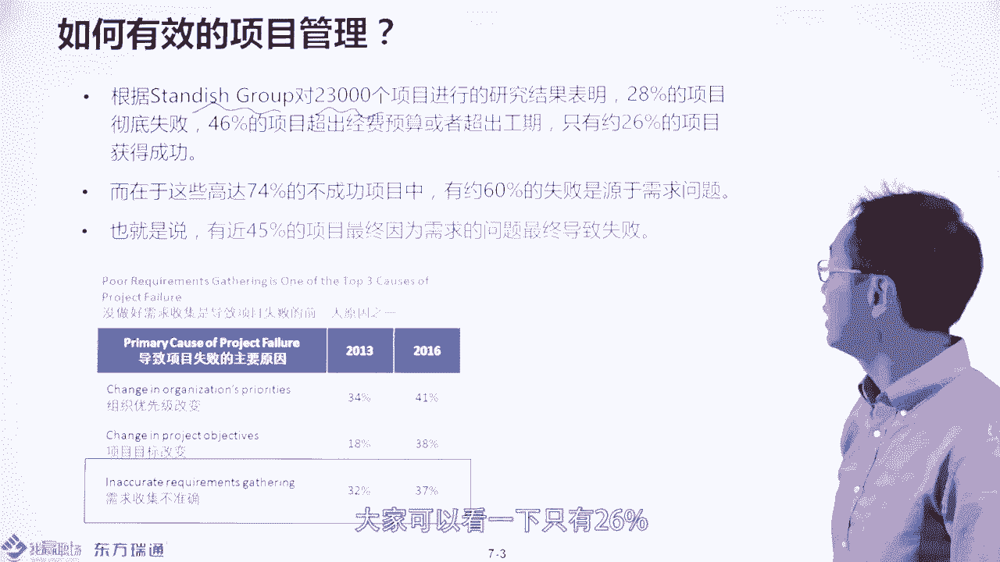

所以说呢即使是最低的标准的话呢，项目这按照最低的项目成功标准的话呢，其实呢都是很难达到的。为什么呢？之前说了未来的这个市场的话是多变的，是VUC的时代，还记得吗？就市场是易变的不确定的模糊的。

所以这样的情况下呢，你的项目标或客户的需求需要呢也是不断的变化的。所以那你要想达到客户的要求呢还是很难的。最典型的影响项目成功的一个要素就是什么呢？客户或市场的需求呢？不确定这样的话导致什么呢？

你的项目的话的目标不确定。所以呢你很难在一应的什么计划下，把这个事儿备做了啊，大概是这样的好，那有些时候呢，项目经理其其实是很难做的。比如说有一个项目经理在他的微信朋友圈中呢不说的，说什么呢？

天天到晚都是来改改需求啊，不断的定对什么市场和需求的变化或客户这种需求的变。

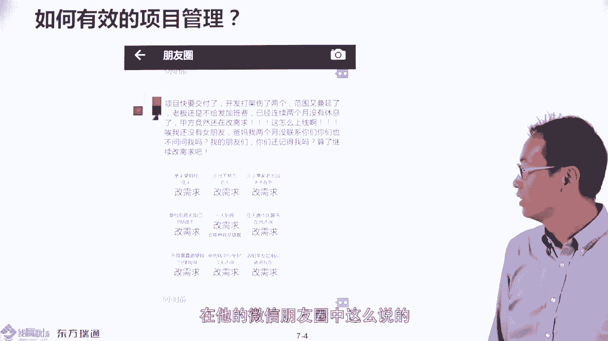

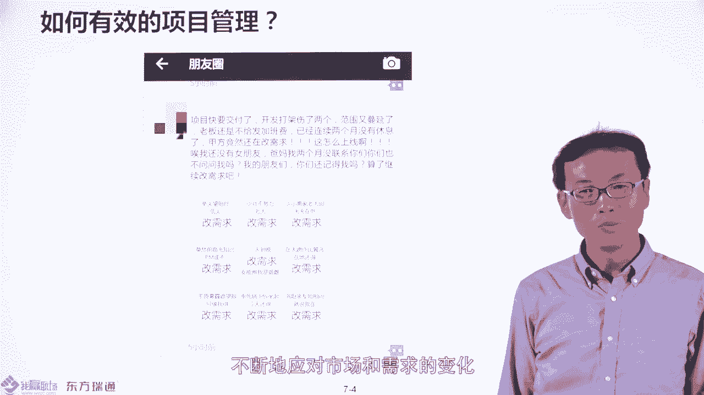

话那比如说他说到举头望明月，低头改需求，少壮不努力，老大改需求，少小离家老大回天天在外改需求。比如说不着家。好，一天到晚改需求，看到没有？在天愿做比娘在地还得改需求啊，所以你看到没有？

就是说这就是他的现状，做项目交付的时候，现状是不断的改需求。然后你的成本时间都是有限的，你的需求老是变，你能按期交付吗？所以说呢这就是所谓的这个项目成功的这种百分比呢是非常低的。

所以呢你可以看到项目经理由于改需求天天的加班，然后已经是什么呢？住院了，然后他的朋友圈的一些一些朋友呢都在去干嘛呢？都在在渲什么呢？干了到哪出去玩了，就去买了什么车呀，跑车呀，你看到没有？

这就是都同样什么？都是呃人对吧？差距的这么大呢，对不对？是不是？是这样的啊？哎，所以说当项目经理还是很不容易。

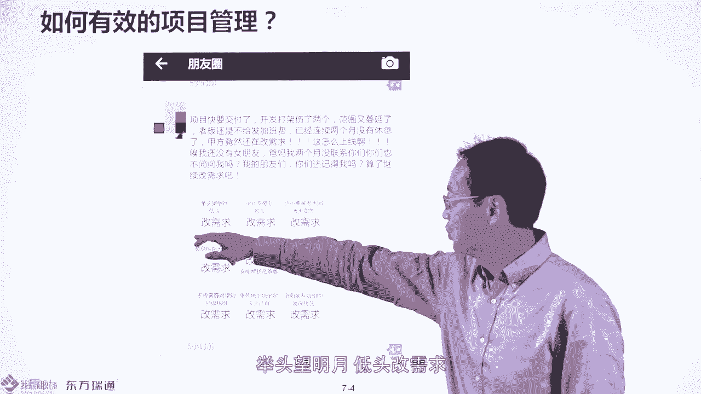

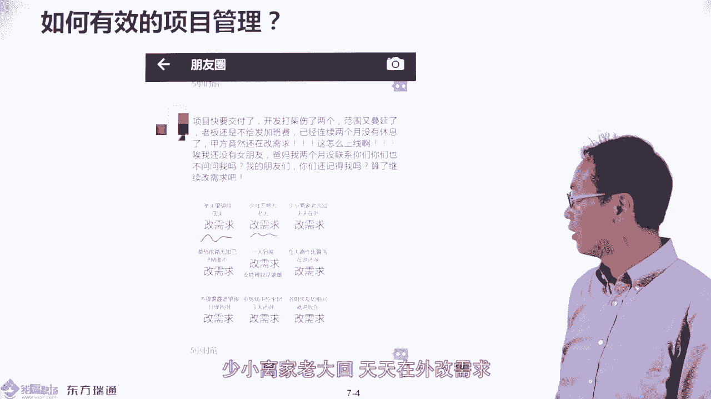

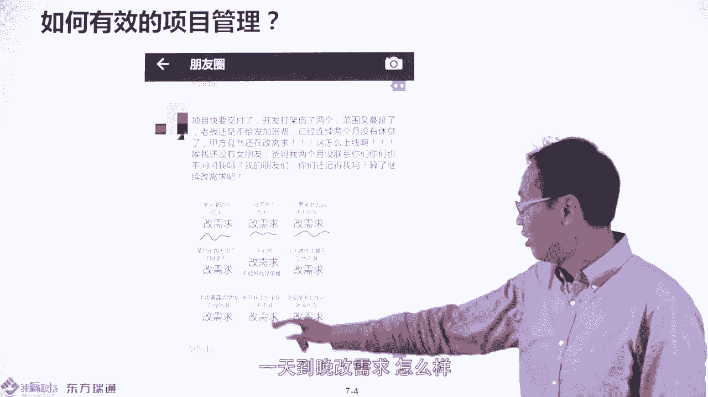

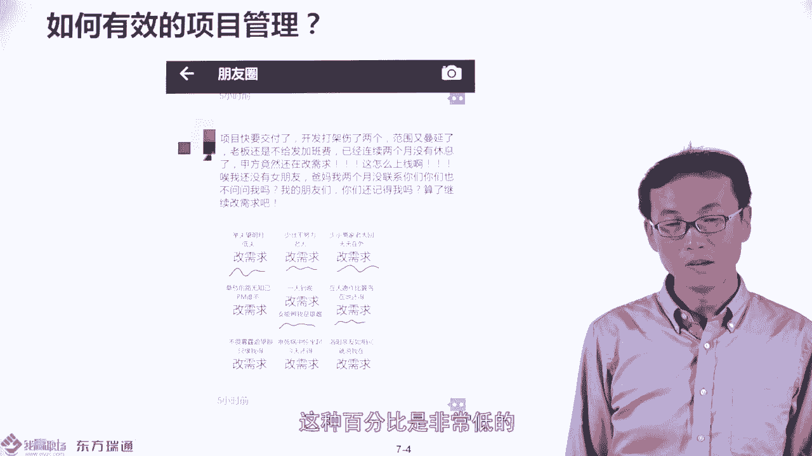

事你要想确保项目成功的话，要发挥你很多的心力的。因为项目一旦失败，谁当不了责任呢？肯定是你呀，别人承担什么部分责任是吧？那只有你是承担主要责任的，所以呢任重而道远。好，然后看一下。

就是说呃基于这种需求多变。那你如何去应对呢？其实呢在我们给大家的一些呃项目管理常见的这种问题，我们会有个手册的，大家可以在官网上去下载啊。那有些常见问题，就是刚才说了就是客户的需求不明确。

包括呢这种目标不明确，怎么做啊，我们这边会有一些相应的应对办法的。比如说看一下。如果客户的这种目标和你的这种项目交付的话，有明显差异的时候，那你会怎么做？比如说举个例子。

比如说呃如果你们公司的授嫌销售忽悠你的一个项目，就是或者说这个夸大的就是说你们的交付能力，然后把这个单拿到了。然后你作为售后项目经理。然后呢，你第一天驻场到客户那边去交付，交付你的项目。

你发现呢就是这个目标跟你实际的交付能力呢？有很大的偏差。那我问大家一个问题，你能不能第一时间跟甲方客户说，哎呀，这个目标不合理呀，那我们应该怎么办呢？我们应该修正的目标能不能第一时间跟甲方说呀。

说这个事儿啊。答案什么呢？是否定的，不能为什么呢？客户还没有完全信任你啊，然后你做为项目经理第一天过来，你就说摆困难，对吧？那即使你的困难可能是事实，但是客户会说你在推卸责任，或者什么呢？

觉得你的能力不行，那他第一时间会怎么办呢？会投诉到你公司，他就想嘛什么，把你这个项目经理换掉，然后呢，你把这个事情统治了。然后呢，售前销售，他会给你好果子吃吗？你本来他好不容易再忽悠一个项目，对吧？

然后你就是说你没有这个交付能力，你回去就很难做人，是不是所以应该怎么办呢？就是说售前给你挖了个坑或销售给你挖了坑，那明知山腰虎，你要偏向釜山行。那即使这个目标不是特别合理。但是呢你要把一些合理的部分呢。

尽尽好的什么会尽早会尽尽那个你所能呢，去把交互，在交付的过程中呢，赢得客户的信任，然后呢，在获得客户信任之后。再慢慢的从更高层面呢去说服客户是什么呢？去修正不合理的目标，这个是你要做到的事情。

什么意思呢？大家知道说像爱因斯坦同经说了，要解决当下的问题，要站在更高的层面去解决当下的问题，就是你要站到比客户高，怎么比客户高呢？你要站在就是呃客户的战略层面，包括业务的什么收益层面跟客户说。

哎这样项目交付的话，可能更加有利于你的什么项目更加有利于你项目运作或者更加有利于什么呢？你的公司的运营啊，就站更高层面去告诉客户说，哎，这个东西要调整。

这就是当你发现你的项目的交付目标和你的能力有偏差的时候，该怎么做。那有些时候客户是很坚持的。他会说我就要这个东西，我就是强调要求这个东西，那没有是不行的。那比如说问大家一个直际的场景。

比如说你做项目经理。然后呢，客户说这个东西呢一定要按这个东西做，我是不认同说你要改。的啊，然后你回头呢跟你的项目的交付总监，就是你公司的项目发起人说了个事儿是那个客户说这个事情的话呢。

一定按他的要求来的。然后呢，项目发起人说不行，这样做的话呢，我们对于我们乙方对我们公司是不利的，我们一定不能这么做。然后你在中间，也说客户非常要求这个东西要非常要求要做。

然后你的发起人或者你的老板说不能这么做。我的问题是你进谁的。大家可以想象一下，这个场景是经常是存在的啊。那我的大概的建议是什么呢？你听谁的，谁给你公司听谁的，你要听你的项目发起人或老板的，然后呢。

你要按照老板的意思，不断的去跟客户去什么呢？苦口婆心的去说服客户说，哎，这个东西呢应该是不做的，我们应该这么做这个事儿。为什么？因为你要维护你你方的利益。并且的话呢。

你要考虑到说这就是在不断的跟说服客户的过程中去磨练你的心性和你的人际关系能力和你的沟通能协调能力，是这样的，哎，这就是一个很好的一个机会来什么触发你成长的一个机会。所以不要轻易的去妥协啊。好。

所以就是我们要知道说作为项目经理，你还是很不容易的。你要不断的定位需求变化和一些比较刁蛮的客户不不讲理的客户，那应该怎么办。那如果你公司的利益和客户利益明显有冲突的时候，你要站在哪边去谈这个事儿啊。

这些。呢呃偏僻未必未书上可说那么清楚。但是实际的工作过程中，你要考虑到如何去应对啊。好，所以说呢作位项目经理呢，你要交付一个项目的目标，要把这东西呢达成。那你的老板和客户的什么需求是不一样的。

这样的时候呢，你要去平平衡什么？权衡不同人的利益平衡不同人的关系。然后确保大家呢什么呢？能够去一致把这个目标达成。好，所以这个是还是挺难做到一个内容。所以呢本节的话，你们就讲述一下项目交付的话。

那你如何能够把这个目标达成。首先呢目标要明确。那目标明确的话呢，这边有个考点呢，那目标要明确他要符合一个原则，这个要把它记住要死码的原则。死码原则什么意思呢？就是目标要具体不抽象。然后呢，可度量可达成。

跟主。

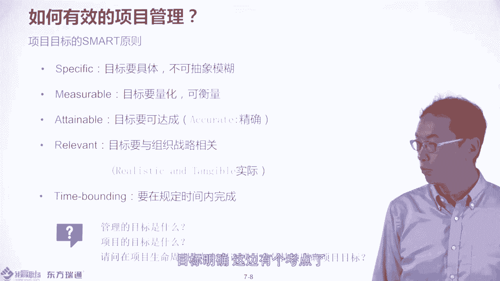

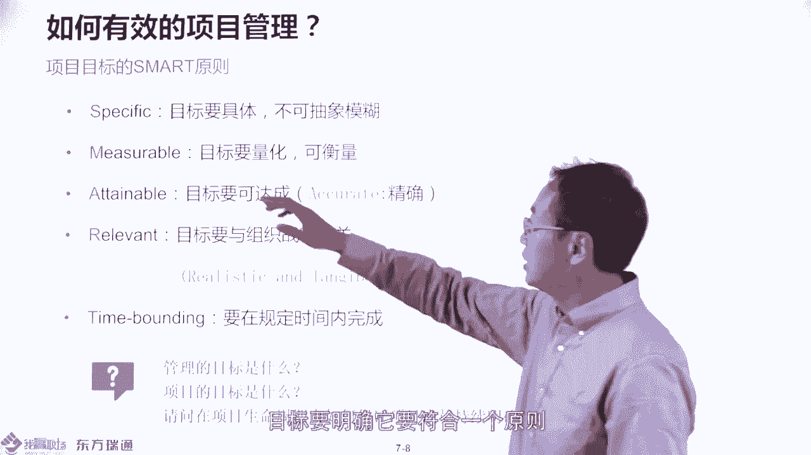

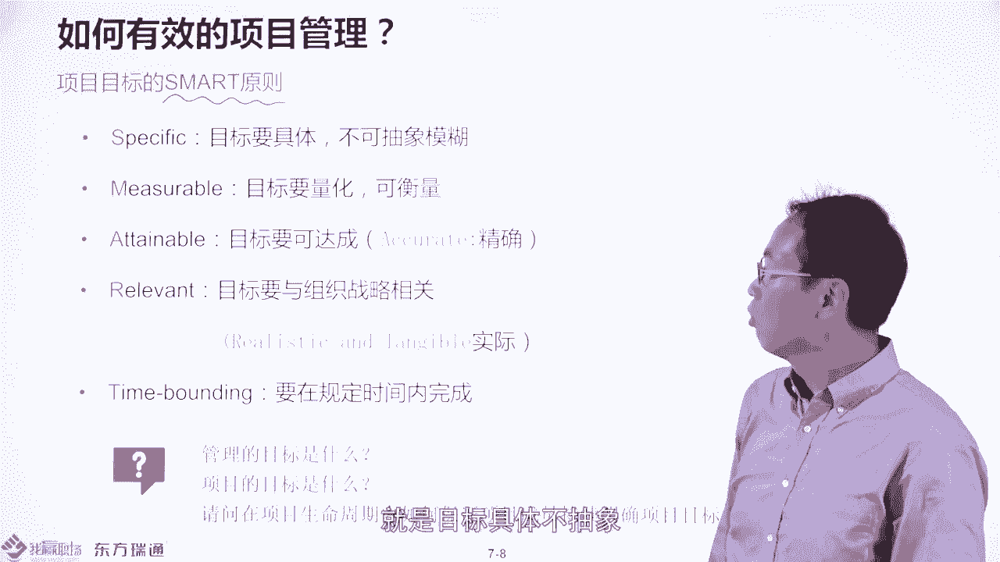

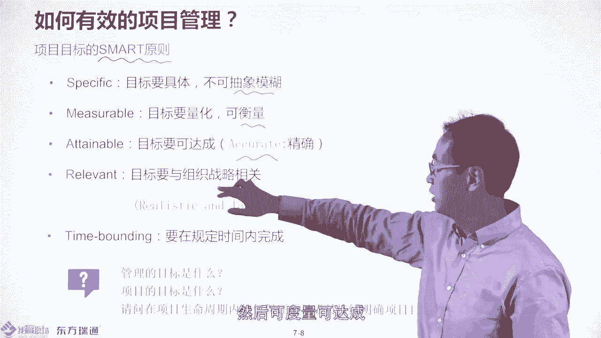

战略相关，然后呢在一定时间内完成叫smart原则。这个很关键。那比如说呢做任何事情都是有目标的。比如说大家可以看一下项目的目标和什么项目目标和管理的目标分别是什么呢？啊，那你看到比如说你作为管理者。

高级领导的话呢，你的目标是什么呢？要激发你下目人的什么善意，让他们主动去做事儿，对你作为管理者的目标。所以你需要考虑什么呢？作为服务型领导，支持你的员工。那你项目目标的话呢。

是要达成既定的收益或战略预期的那你确保他能达成，他一定要什么呢？要smart。好了，那么大家一个问题啊。

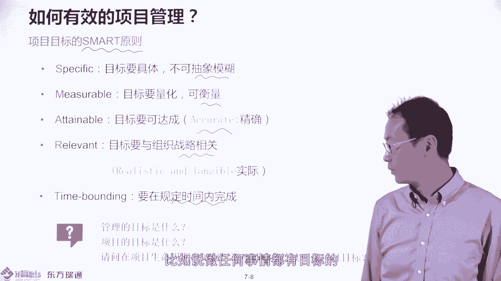

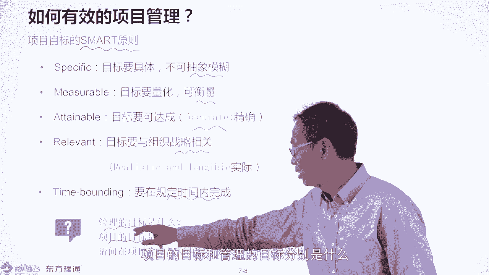

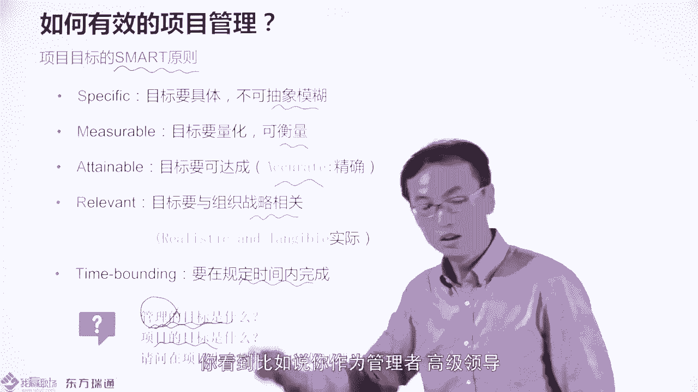

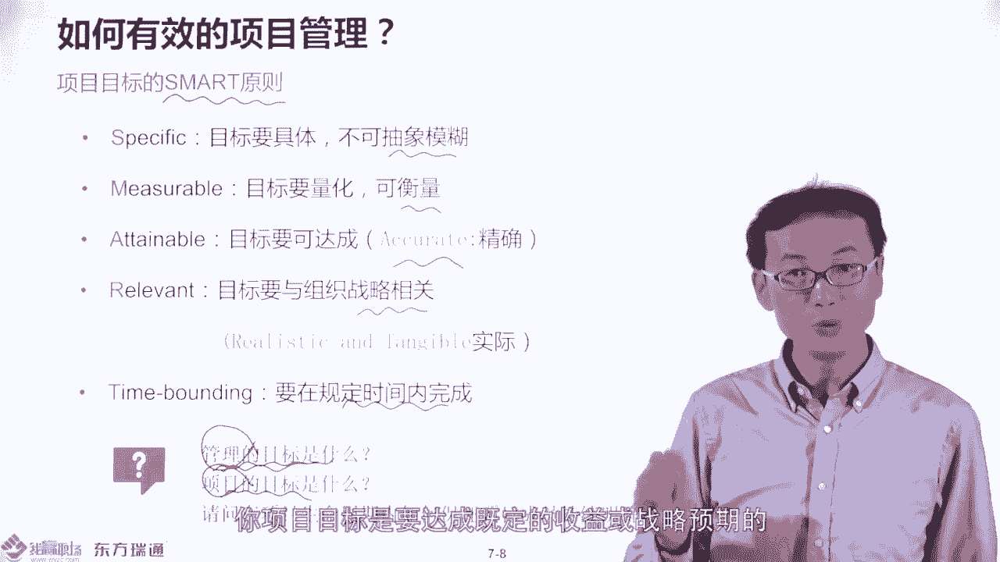

目标要具体，不抽象。

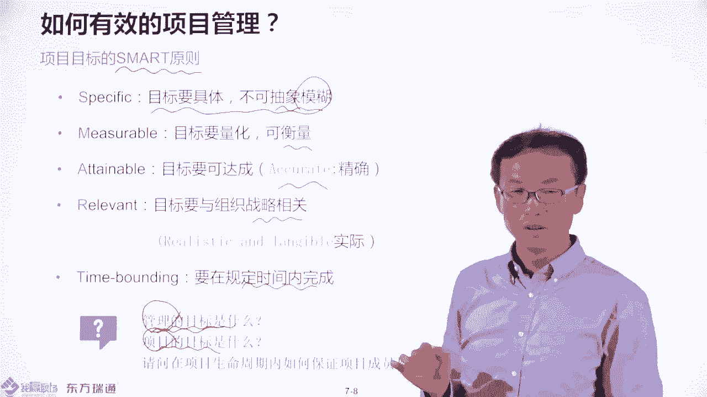

所以在一个公司里头，你要安排任务的时候，你要说的话要说的很清楚，不能含糊。在一个公司的话，谁可以说话含糊呢？只有一个人就是董事长。除了董事长之外。

上到总经理下到员工说目标的时候说事情的时候一定要做到什么明确不模糊，是这样的，你分配任务的时候要考虑到可能什么验收标准和这种交付周期，你要跟下属说清楚啊，是这样的，否则的话下属人会说你没说清楚啊。

我可以选择不做呀，或做的做的什么不符，你要求啊，因为因为你没说清楚啊，是这样的啊，哎，所以你要说说目标的时候，交付任务的时候，目标是什么要明确具体不模糊，然后并且的话要可度量。

刚才说了每个工作包或者每个工作任务，你要考虑到什么可量化。因为管理强调什么呢？不能度量它就不能什么管理他，就不能管控他。所以呢每个交付的工作跟下属说说事的时候，要告诉他我的验收标准是什么。

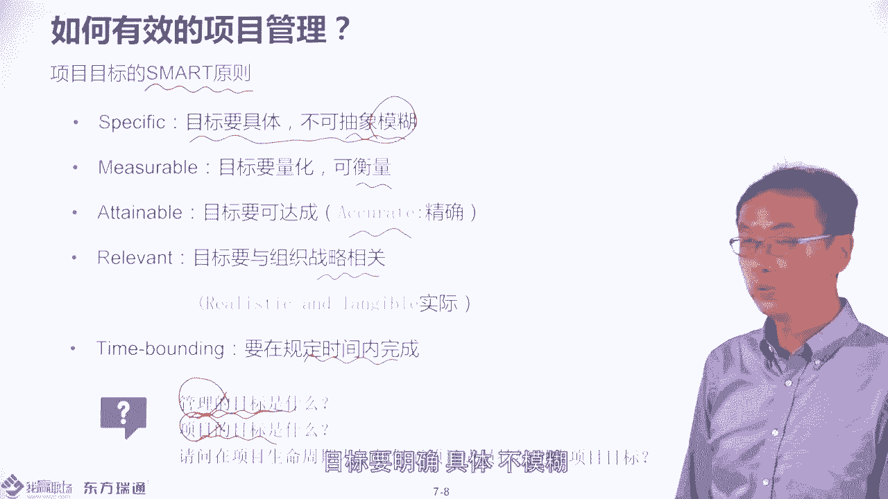

这样的话，下属呢才知道他怎么做事儿，他才有执行力，然后你才有管控力，是这样的啊，所以要有度量啊，要有可度量。然后并且的话呢要可达成，比如说呢你跟下属去分配任务的时候，那比如说下属的能力呢是这么高。

那你非给一个非常高的一个活给他，他会说什么呢？我做不到，对不对？所以你要因材实教，量力而行。比如说下属的能力这么高，你给他一个多多高的活呢，比他能力稍微高一点，让他费点劲能达到，要可达成。

而不要给他分配一个任务，说你骑自行车去占月球吧。

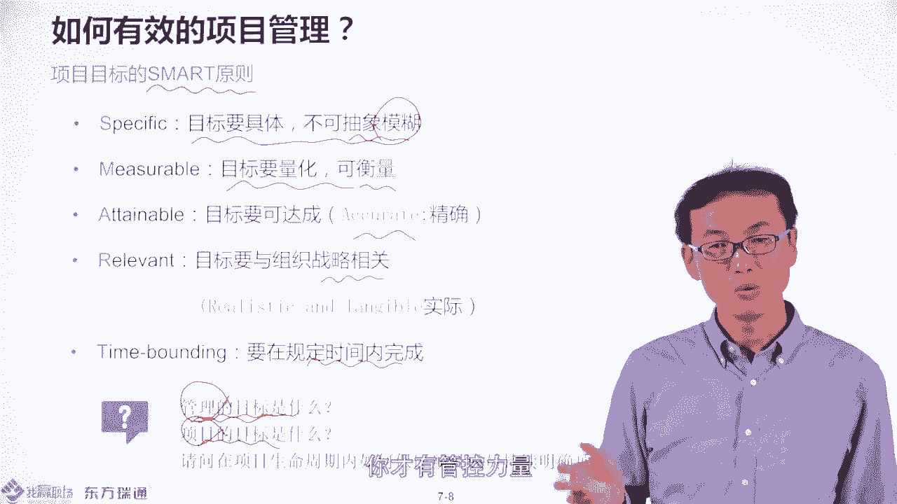

这个不可以达成，你骑自行车能上月球吗？是不是？他会觉得你是在扯蛋，是不是？哎，所以要了解啊，你分配这个目标的时候，你要看这个下属的能力，确保他能够在他的能力范围内能什么能达成。好。

然后接下来呢你的项目的目标呢要跟组织战略保持一致。因为项目是战略落地的手段嘛，是这样的啊？好，而且要在一个规定时间内完成，比如说项目有临时性嘛，临时性的特点什么呢？就是有开始固定的开始和结束时间嘛。

这就是smart原则对吧？每个单词把它记住。比如说smart这个词很好。比如说很多时候你会说这个人长得很smart，比如长得很帅，很精明，对不对？哎，所以这个smart这个词比较不错，哎。

你要做事的时候呢，或者分配任务的时候呢，要做到smart。

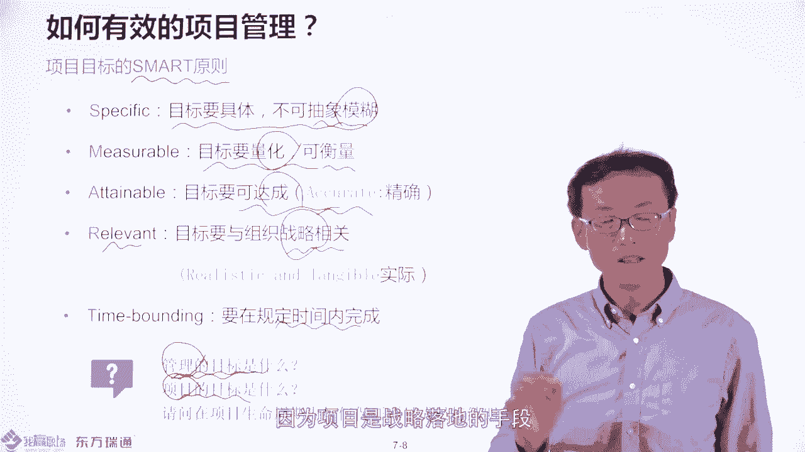

好，包括学习要做的smart。比如说呢在那个呃一个管理学大师德鲁克，他有个关于学习这块呢，有个学习目标管理。那比如说呢你在学习时候呢，没有目标的时候呢，你就可以看一下德鲁克的这几句话。

比如说第一句话是什么呢？我是谁？我从哪里来，我要做什么，对吧？哎所以大师一本回答一个什么问题呢？回答一个哲学问题，人从哪里来到哪里去的问题。那你说跟学习目标有什么关系呢？就是这个这个最典型的大师说了哎。

第五第五个问题说我的后半生的目标和计划是什么？看到没有？比如说有一个名人叫溥仪，他写了一本书叫我的前半生，那你可以写一个一本书叫什么呢？叫我的后半生，如果你的后半生的目标是为了考一个PNP的话。

请问你的这个目标的迫切度怎么样啊，按1到10打分，比如说使者是非常迫切，就像项羽破釜沉舟一样，不答目的是。

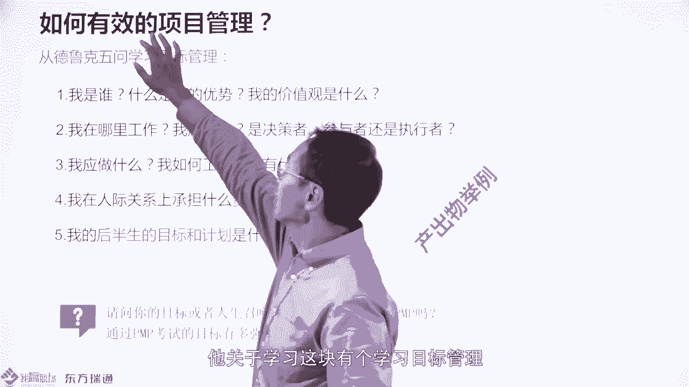

修，那你表示无所谓啊。那请呃呃线上的同学看一下，你对考偏P这个这个任务这个目标来说呢，你打分是打十啊还是打一呀？如果你打七和8的话呢，就问了，你为什为何有所保留呢？对不对？你为何不能像项羽那样破釜沉舟。

像韩信那样背水一战呢？啊，所以你要目标要什么呢？要明确要有雄心，也就是说真正的成功人士跟普通人的区别是什么呢？成功人士有强烈的什么呢？目标有责任感或者自虐啊，像刘强东像那个美团的王鑫，王鑫有个名言。

这么说的，他说呃我做10个项目有8个不成功很正常。为什么呢？因为我的目标很高，如果很多都成功了，说明目标地太低了，理解吧？你看到没有？所以成功人士的话呢，他是对这的目标是非常的有雄心要达成的。

王鑫每天工作多少小时，你知道吗？至少是16到18个小时。除了睡觉、吃饭都在工作，而且他不要求他下边的高管或者是员工这样做，但他一定要这么做。看到没有？所以成功人士他的目标一定很明确。

而且他有雄心不达目的，势不罢休。哎，刘强东也是这样的啊，他每天比如说刘向东，他每天有定个目标，说每天早上8点半一定开早会，而是他在京东挣十几年，从来没有迟到过。看到没有？哎，比如说你作为老板。

你作为项目经理定出来，每天早上8点半要开项目早会，你会不会知道你会不会以各种的理由说我不去了，大家去自己开吧。如果这样的话呢，就是你做这一个目标的雄心呢，或者说你的大概的这个破切度呢还达不到10分。

所以说你要考试也是这样的，你要做到必胜这样一个决心。因为什么呢？就要一鼓作气，再往出来三二节，对吧？哎，所以要一次性把找定啊。好的，所以就是成功人士跟普通人的区别。哎，普通人的话呢，就是目标没那么强烈。

并且没那么坚持。所以呢他的一生呢就很普通，就这么简单啊，好的，所以说呢真正有雄心的人呢还是少数的。所以呢真正成功的人士呢，在这个视点上。也是很少的，就这个原因啊。好的，所以要了解啊，要既然你想考试。

那想你要目标要非常强烈，要达到10分啊。好，然后接下来呢我们要知道目标是要管理的，在PP中各个相关的文件中，比如相目关计划中，是不是有目标啊，肯定有的。在那个项目招程立项的时候呢，有目标吗？

有在你分配一个工作任务工作包给项目员工的时候，有没有这个工作包的目标呢，达成目标呢也是有的，包括验收条件是有的，对不对？所以目标管理的话呢，是方方方方面面在你的各种项目管控的文件中，我们相关计划。

包括你的工作包分解任务这些东西呢都是有的，所以目标是无处不在的。所以要分解工作任务的时候，要把任务分下去的时候，你的目标要明确可量化，可达成好。

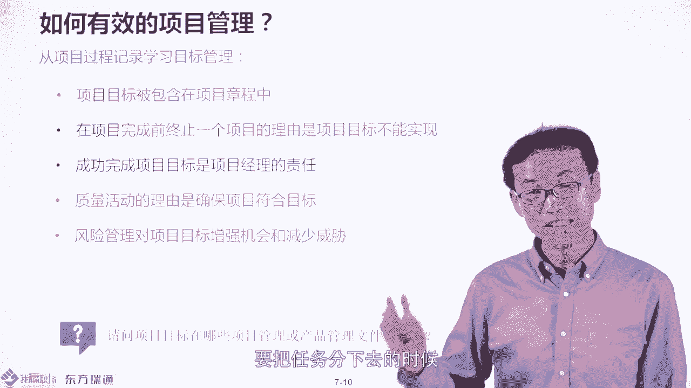

然后接下来，针对这个目标可量化这边的话呢，我们出道题，大家可以看一下。比如说题目说啊工程部想要项目的目标推口量在10%的提升。IT部门说，我们不超过5%的资源被用在什么呢？这个项目上。你是公司的老板啊。

就或者你的老板，你的老板管理层呢想要项目的团队降低什么应纳税额。你是这个事情的什么这个项目经理。好了，那你看一下你能做的最好的事情是什么呢？讲一下。答案是什么呢？答案是C。

比如说工程部和IT部的目标是很smart的目标明确，对吧？可量化，而你老板说话是比较含糊的。管理层目标说要什么降低应纳税额降多少啊，还没说，如果老板说话比较含糊，就说他留有余地，你该怎么办？你要去澄清。

主动找老板去谈，为什么呢？他留余地的话呢，对你来说不好运作啊，因为不smart呀，因为老板说话不smart，你需让他smart，对不对？这样就好操作嘛，可量化可达成嘛，是不是是这样的，所以要找老板去谈。

进一步的开会。这就是在考什么呢？考smar原则的。好，这这是我们要知道的。好，然后接下来呢我们看一下，就是因为什么呢？项目为什么难管呢？就是每个人相关方干选的目标是不一致的。那有些人呢。

比如说你的老板肯定希望什么呢？这个项目要省钱，但甲方会想什么呢？你要交付更多的东西，对吧？然后呢，你的老板可能想哎，要尽快交付，但甲方会说质量要好啊。哎，目标可能是不太一样的那大家知道说呃。

我们之前的话呢，像毛主席曾经提出过，我们要什么呃鼓劲鼓足干劲呐，力正上游，要多多快好省的建设社会主义，对吧？那多什么呢？表示什么？

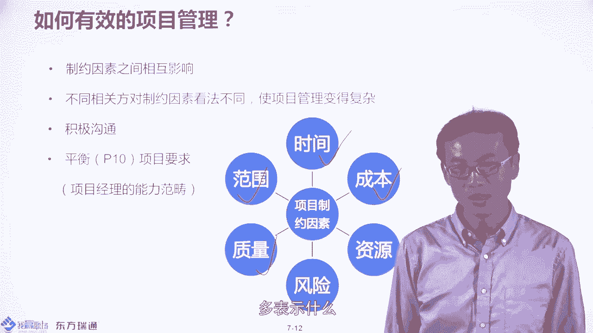

范围要高范围要多，对吧？快呢时间要快好呢，质量要好，省呢要省钱，多快好省，建成社会主义有可能吗？

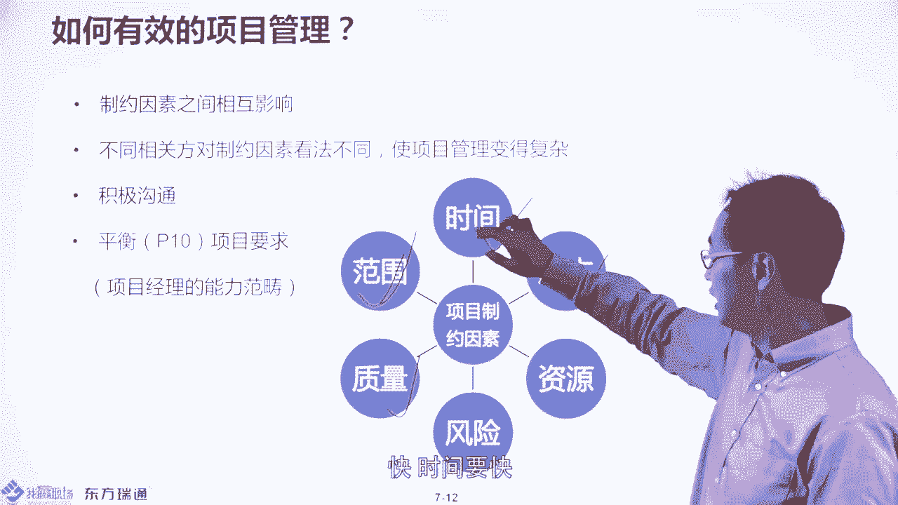

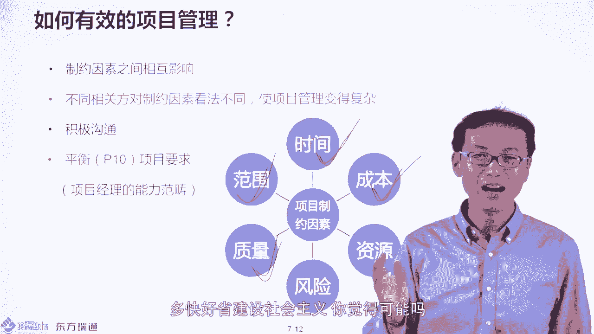

因为目标的话呢，有有些时候是冲突的，你多了对吧？哎，就一定不能快吗？好了。

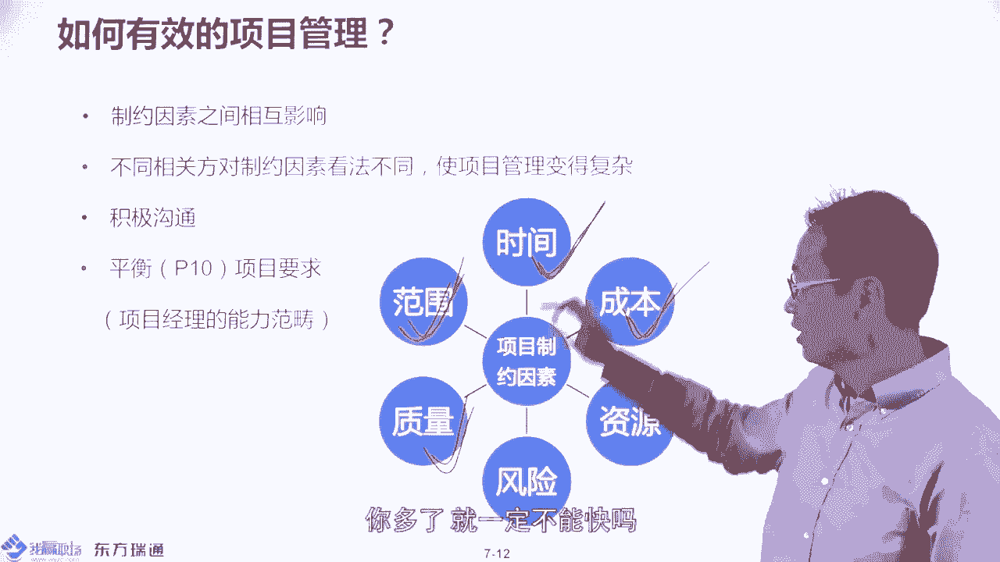

能省吗？可能是相反的，对不对？那比如说有一个公司叫京东，他也提出多快好生，是不是？那京东现在赚钱嘛，偶尔赚钱哈，但现在还在裁员，是不是？哎，大家可以看到说有些时候他的目标是互相冲突的。

会把把他的那个这种讲法可能会撕裂来啊，那所以说你要知道说要目标的话，有些不同的相关方想法的话呢，它是不太一致的，对不对？所以你对项不怎板，你要去平衡不同相关方，尤其关键相关方的，尤其老板嘛。

关键相方的老板，他的目标，然后呢，这个词很重要。你发到书上第十页，它有一个词儿叫balance平衡，要平衡相关方的期望。如果你平衡不利的话，你就被平衡了，你就下课了，理解吗？是这样的啊。

所以有些时候呃目标要要平衡的啊，我可以把这种呃不同相关方的这种目标不一致，理解为它是有质约。然后呢，你要去什么呢？你要去平衡。因为这种。

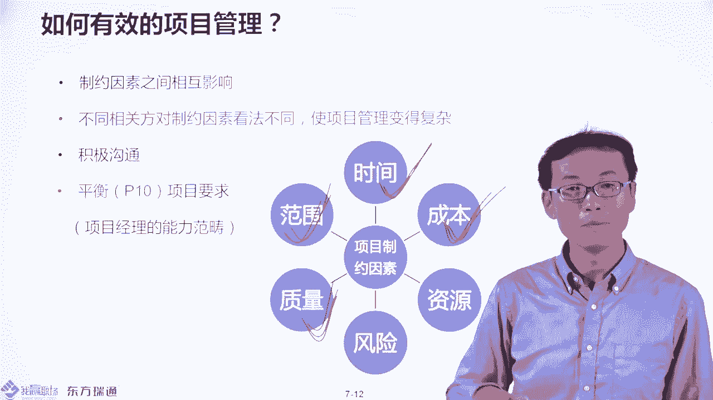

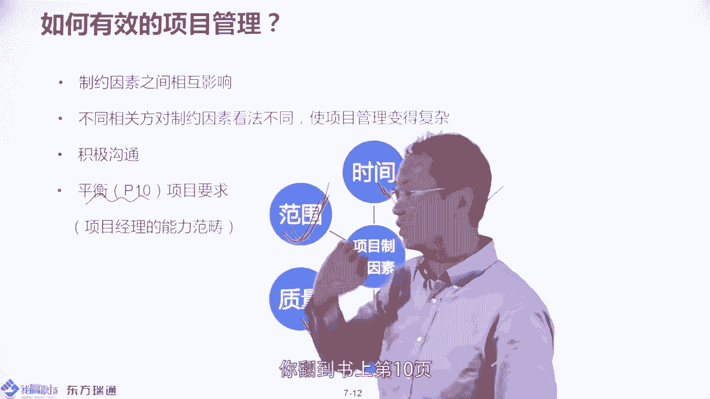

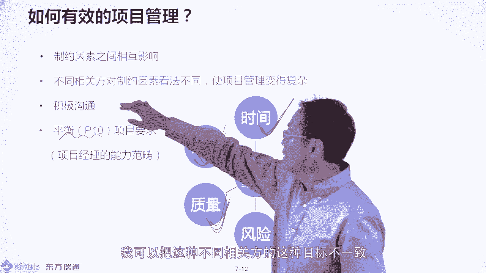

制约会导致项目的管理比较复杂，是这样的啊，如果你评衡不力的话呢，你的项目可能会失败啊，是这样的。好，那给大家举个例子，比如说举个什么样的例子呢？呃，比如说就是进度成本吧，一个工作包，一个工作包的话呢。

我这边画一个图。

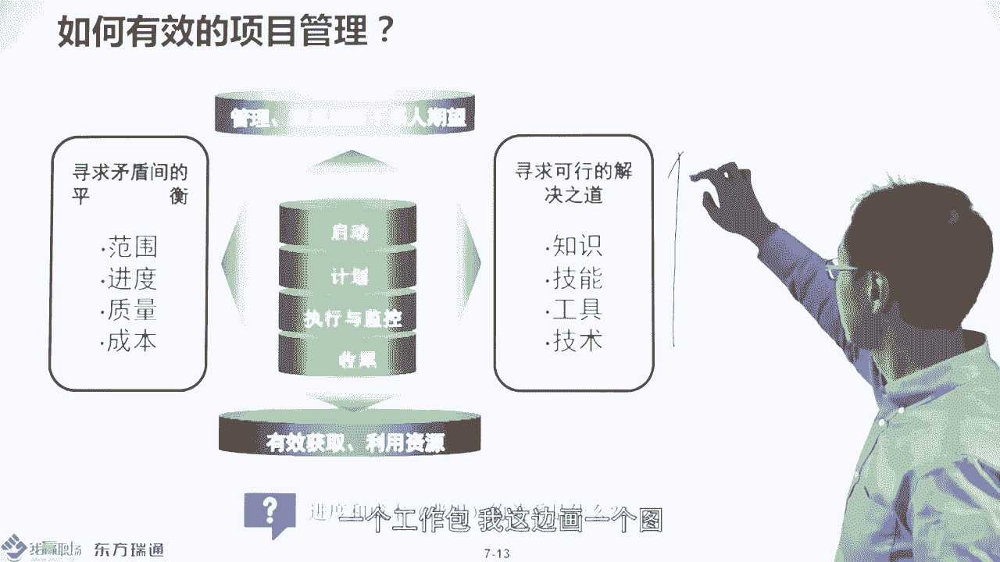

比如说这个是成本，纵的坐标是成本，横的坐标是时间。有的用用的话，你觉得是。做的越快越省钱呢，还是做的越慢越省钱。比如说大概什么意思呢？就是一个工作包，它是进入成本是正相关的关系呢，还是负相关的关系呢？

大家可以想象一下。

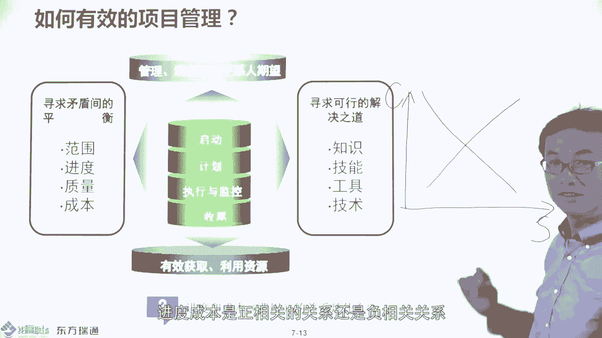

答案是什么呢？有些同学说，哎，应该是做的越快越省钱吧。基本来答案是这样的，对不对？但其实是错的，为什么呢？因为你快的话，有可能我们之前说了，可能会快速去进进度压缩嘛，有可能会导致什么呢？

风险增加或返工嘛。也就是说任何一个工作包一个活动的话，它都有一个合理的进度成本区间。

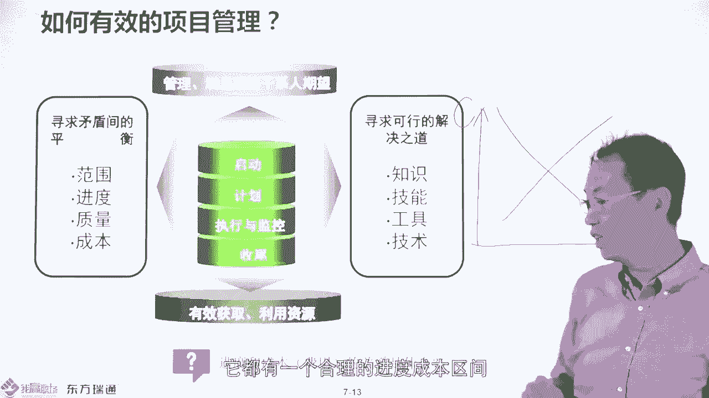

你不能违背客观误虑的，它进度和成本的关系是什么呢？是U型监管关系，就大概是这样的。U型监管。你总有一个什么理借点就是说合理的进度成本周期的，而且偏差不能超过多少呢？按照偏区说话，精准估算的话。

进度成本偏差是-5%到正10%，就是这个道理。比如说你在做精准估算，进度成本的时候呢，你的估算的很精准了，你的偏差是不是那么多，不能太太多不能太少，是合理的区间。哎，你在这合理时间内把这个事做了。

是这样的。哎，所以你看到没有？所以说这个。不同的进度成本啊、质量啊、范围啊，他们都是互相牵扯的那这样的了解他们之间的基约关系更很重要。好，然后接下来呢我们跟大来说一下。

就是除了你要平衡不同的什么质因素之外的话，不同的需求之外的话呢，你还要考虑什么东西呢？要考虑个很好的心态。哎，那这边的话有一个成工人士要道声呵呼。造成候和服很出名啊，他还发了一个公式，他说什么呢？

人生的工作结果等于思维方式乘以热情乘以能力。也就说你项目要交付一个呃成果嘛，那你需要确保他什么成功嘛，对吧？那你就要考虑到这三个约束的那比如说你做项目经理，你有能力，你有热情。

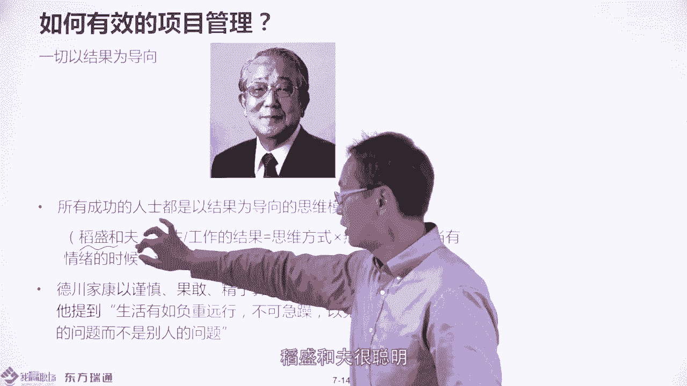

但是你的思维方式不正确。知识越多越感动。毛主席说的对吧？啊，那为什么是呃不正确思维方式是很很有害的呢？首先什么叫正确思维方式啊，比如稻盛呢就这个人这就是道盛的照片啊，他呃创造了两个世有百强。

还是很出名的。一个是金子公司，那个是KI就开训，就是日本第二大的地影公司啊，好了，这个人的话呢，他发明了一个理论叫六项精进六项经进的第一条叫付出不亚于任何人努力。最后一条呢就是不要有感性的烦恼。

比就说各位项经理，也说这个这目标很难达成。那说了你要什么明知山有虎偏向釜山行，要付出不亚于任何人的努力。好，怎么付出不亚于任何人努力呢？道盛有粒子的。比如说稻盛那个在做经子公司的时候呢，他的公司很小。

他很小的话呢，那个他接了一个大单，怎么。家呢就是IBM啊，让他去做一些呃这种呃电脑上的零部件或服务器上零部件，就跟陶瓷有关的一些工艺产品。这个产品的话要求精密度非常高。然后呢。

道盛下面的工程师说这个达不到啊IBM要求太高了，然后道盛不信邪。他在实验室呢反复实验。终于呢他经过他的不懈的努力，达成了IBM的这种质量和精密的要求。然后IBM啊看到它的结果之后的话。

觉得这个公司是可信赖的。然后以后就会把源源不断的单给到了什么道盛这公司，然后道盛的公司变成1九百强了，看到没有？是这么发展起来的，叫付出，不亚于任何人努力，就是正治的思方式。然后呢。

最后一条的时不最后一条什么呢？叫那个不要有感性的烦恼，对吧？那不要有感性的烦恼，什么意思呢？比如说举个例子，你的项目经理，你作为乙方跟甲方开会，甲方呢对你的项目的交付很不满意，然后在开会的时候呢。

当的所有面。把你这个项经理骂了或者拍桌子了。然后呢，指就指着你的鼻子骂骂你。好了，那问问你，你说小项目经理，你发什么理，那客户指着鼻子骂你，你是会不会拍桌子，指着鼻骂他呀，会还是不会呀？

答家肯定是否定的。哎，你要像到处说的，不要有感性的烦恼。你要怎么办呢？要有包容心态。比如说你要包容客户说的什么不不对的部分，要肯定什么呢？他说的正确的部分。你要有这样一个坚持。

说客户也是为了这个项目成功那个而努力嘛，对吧？大家都是这样一个共同目标嘛，我们都为了一个共同目标而努力，我们要包容你的这个缺点，然后呢，认同你的说的对的部分啊，不要有感性的烦恼这样的。

这就属于所谓认同的什么从道的层面去呃支持你的项目成功的那除了道的层面还有数字层面呢，PN不PNT更多从数字层面去考虑的那从数字层面的话，这边有一个呃数字方面的一些内容，比如说一个项目，如果非常讲的话。

比如说就几万如果几十万，很多外企的项目都是经常是在中国区的话，经常是这样的项目，动作几万或几十万的项目。那他们就会有。

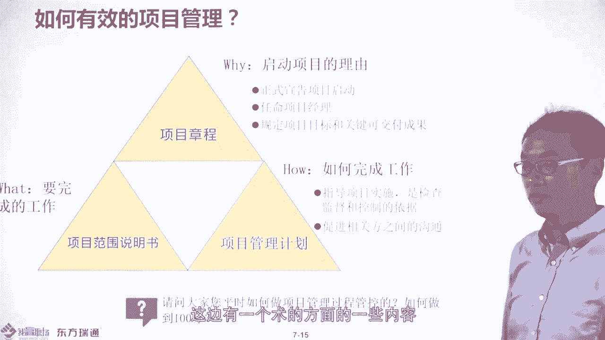

这样疑问经常会问我说，哎，如果你看我们的外企呢项目的金额很小，供应商也很小，那我们是不是不需要过程管控了，做项目。那我说呢最起码按照偏聘理理论任来说呢，最起码有三个文件你需要有那哪三个文件呢。

第一个文件就是项目章程，你要什么呢？你要去立项啊，要有的，明政责言顺嘛，项目章程的目的什么呢？就是告诉那个公司或项目经理为什么要做这个事儿，回答一个外的问题啊。

并且对项目经理拓善授权然后项目经理要做什么呢？你最起码呢要做一个项目管理计划啊，就是如何做这个事儿，你要知道吧，做什么要知道吧？啊，就是说要写一个项目的范围说明书或者是概要设理文档。大概这样子。

比如说项目章程回答一个外的问题，然后呢，项目范围说明书，回答一个word的问题，做什么的问题。然后呢，项目管理计划就是回答一个号的问题，这是这三个文件要有吧。然后其他的还有什么？比如说问题日志啊。

风险登记册呢。

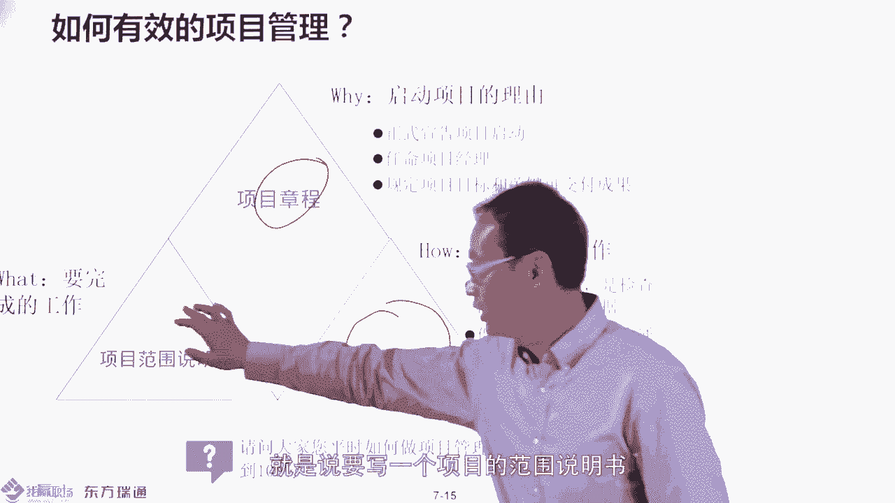

都是锦上添花的东西。那最起码这三个文件要有。所以呢这三个文件的话也是PN book的非常重要的一个考虑或PNP考试非常重要的一个考虑。比如说之前我们也说过了，那项目章程。

如果项目项目发起人或告诉领导说这个项目很小，就几办，为啥要还立项呢？对吧？就直接做了算了，那你能不能直接做啊，作为项目经理，不能按照PMP的说法说，你要强调项目章程的重要性，那如果项目发起人告诉领导说。

那个就不干呢，他就不想做这个事呢，那你怎么办？你要帮他去写什么项目章程文件，寻求他的审批，哎，你说这不是办什么东西嘛，对吧？哎，但其实呢这就是一种标准的思维方式啊，哎，这种思维方式就是说名政和严顺。

要通过项目章程来写什么呢？哎，来授权项目经督组组织资源啊，是不是这样的？然后你再才能去什么呢？跨部门的去协调啊？

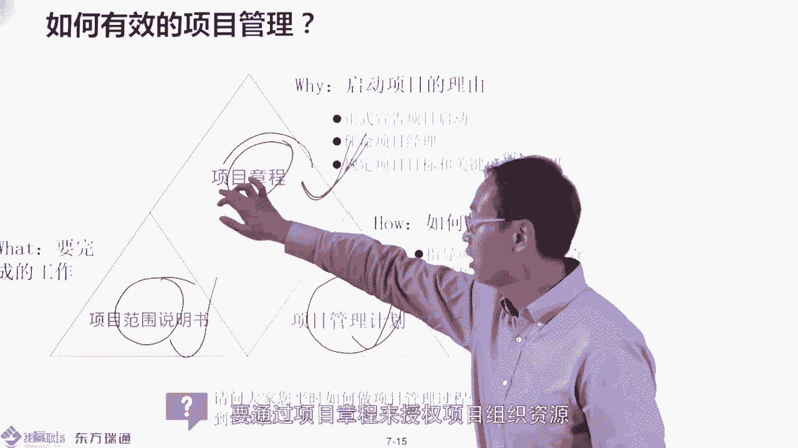

然后找人呢要人呢去做这个事儿呢啊，是这样的，可以了解，这就是三个文件缺一不可，尤其是项目章程。这个项目无论大小，那都要有什么立项这样一个环节的好，所以这样了解。那如果项目旦定项之后。

那你如何要把项目做好呢？你需要有更多的数字层面。我们这边的话呢给大家共享的一些线上会共享一些链接，大家可以下载。包括项目章程的模板，项关计划的模板，绩效报告的模板，包括范围说明书的模板哎。

包括什么需求文件的模板都有啊，大家可以去下载。那这个这些都是数字层面的东西。那你你下载完之后会不能用到很好呢？未必那我们给大家出一个问题，你可以了解一下你的项目是不是能做到百呃百分之百的满意哈。

或者是做到100分，那比如举个例子，那问大家一个问题啊，比如说你做项目经理，平时可能用project软件去做项目管控呢，或者是什么呢？

通过excel或者word文档去做相关计划的那比如说最简单的方式就是excel的那我给大家模板的话，我们给大家的模板的话，也是excel。比如说你的项目可以分成不同的阶段，比如立项。

包括需求分析架构设计开发啊，包括什么测试阶段这些阶段。那这一阶段的话呢都有具体的什么任务？然后这个任务呢有什么计划开始时间啊，计划完成时间，还有什么实际开始，实际完成时间和完成百分比。哎。

这些东西就是应该做一个排期嘛，对吧？那这个排期的话呢，按这排期去做事，包括什么交互啊，具体的什么交互负责人之类的对吧？如果你做项目经理。

你只有这样一个用excel或者用pro软件做一个什么WBS做一个什么做进的排期。那你的项目管理程度按照1到100打分的话，你觉得及格吗？够不够及格呢？基本是不及格。因为为啥不及格呢？

因为缺少什么缺少过程控制。那你这也是个这是个静态计划，你控制的只是这样的嘛，就是一个实际开始，实际完成日期和完成百分比是这样的吧？你是有点控制的但还不够。那你该怎么办呢？应该再加什么东西呢。

两个东西一个是问题日致，一个是风险政测。之前也举个例子吧，就是问题是当下存在的问题，风险是潜在的风险可能发生可能不发生，一旦发生就可能是问题的。好了，所以你把当下存在的问题。

包括它的问题描述影响范围解决方案，啊，包括应对人包括呃应对的情况。

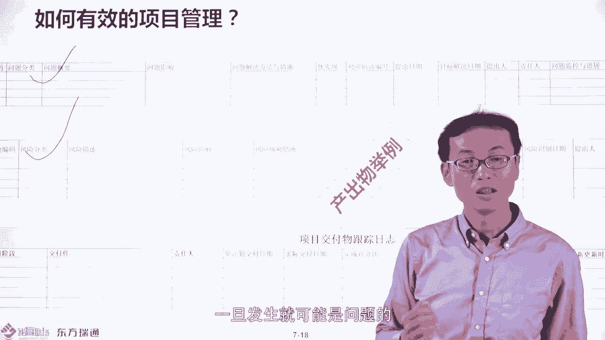

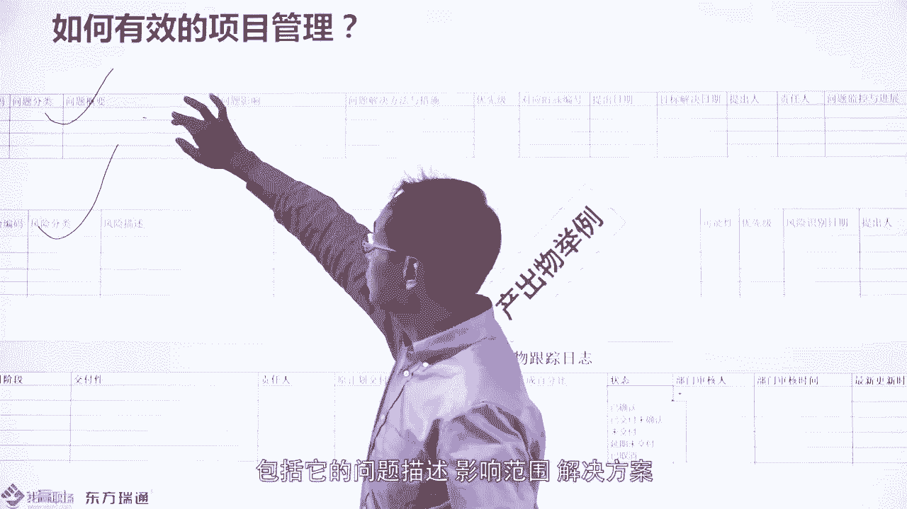

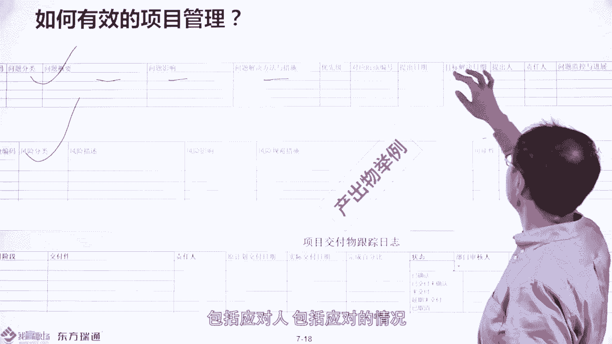

应干什么应该去管控的，要过程控制嘛。还有就是风险。风险的话呢，你要风险的描编号，风险描述也是影响。然后包括如何追避减轻的应的措施。比如说你除了做一个计划之外，还要做什么啊？就是做一个计划之外。

你还要做什么这种问题风险的过程控制，包括交付的控制。

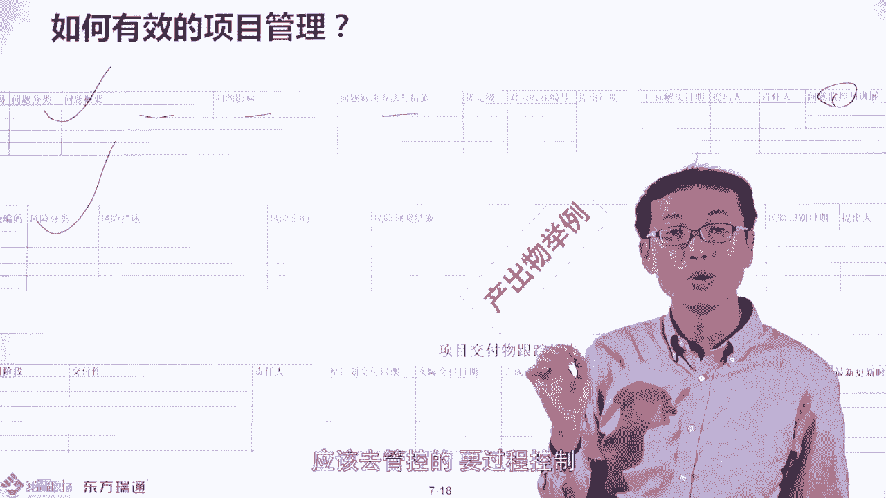

如果你控制了问题风险的话，基本是及格了。那你要控制到加交付的话呢，那基本是70分了。为什么控制交付那么重要呢？

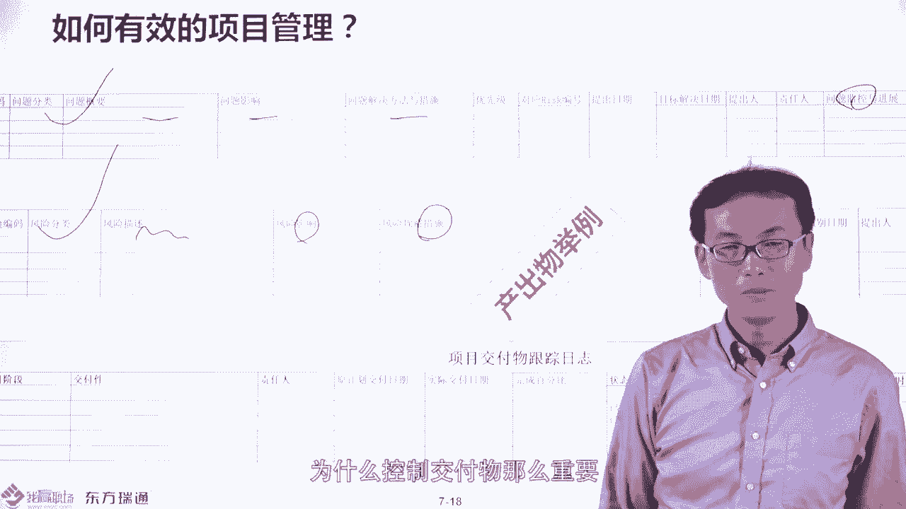

因为交不见。直接决定了什么？你能否被验收。比如举个典型的例子。呃，有一个呃真实的项目，就是国家税务总局做的那个叫什么金穗三期，就是地税和国税合并之后的话呢，国税推出了一个项目叫什么金穗三期的这种项目。

然后呢，这个项目的话是谁做的呢？是中软做的，中国软件做的。那做的周期的话，将近两三年的时间，是因为是全国推全国推的话呢呃做了两三年之后，乙方中软的话呢，他需要什么呢？需要找甲方要钱呢。

肯定是要找甲方什么验收啊，甲方的领导会说什么呢？好啊，验收可以啊，我们有交付标准的，你把这两三年的什么周报啊，月报啊，会纪要啊，周期上来作为什么交付件。

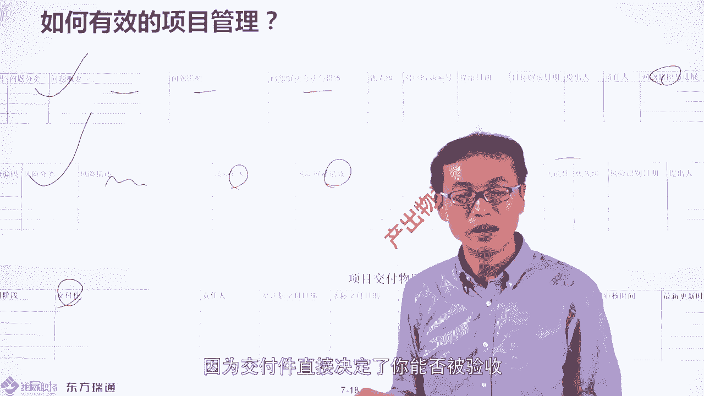

然后呢，乙方相目也傻了，说两年前开什么会哎，会制要没记呀。然后呢，甲方会怎么说，记不清给你的事儿，这是我们什么？我们甲方的验收标准。如果你不提交的话，你就考虑不验收了，我们无所谓啊。哎。

你觉得乙方会不验收吗？所以乙方的项目经理怎么办？他就会去编嘛，会去编什么会纪要嘛，这就属于什么rework重做无用功，对不对？所以说与其你事后在验收的时候去补资料，还不如什么事前应该统计怎么统计呢？

就是这样一个阶段不仅仅是你的产品交付物，你的软件代码，你的会议纪要周报月报，如果甲方真的要要的话呢，你要把这些东西呢全部记到这。然后包括什么呢？具体的责任人是谁去做这个事去那个大概的更新的，对吧？

包括原计划交付日期，实际交付日期完成百分比，要全部的统计到，所以这些符合编批的，PT强调说这个验收这个产品交付的验收，是不是到收尾时候才验收啊，要收尾时候才能验收啊，不是的，应该过程验收。

在过程中就是先把它验收了。那这边的话你可以看到说这就是你在做的过程中需要考虑到这些东西的呈呃，要呈现呢，对吧？然后。

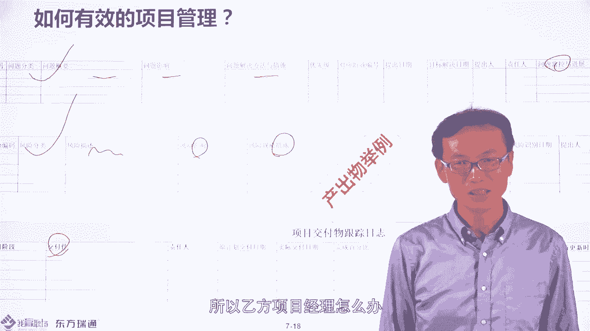

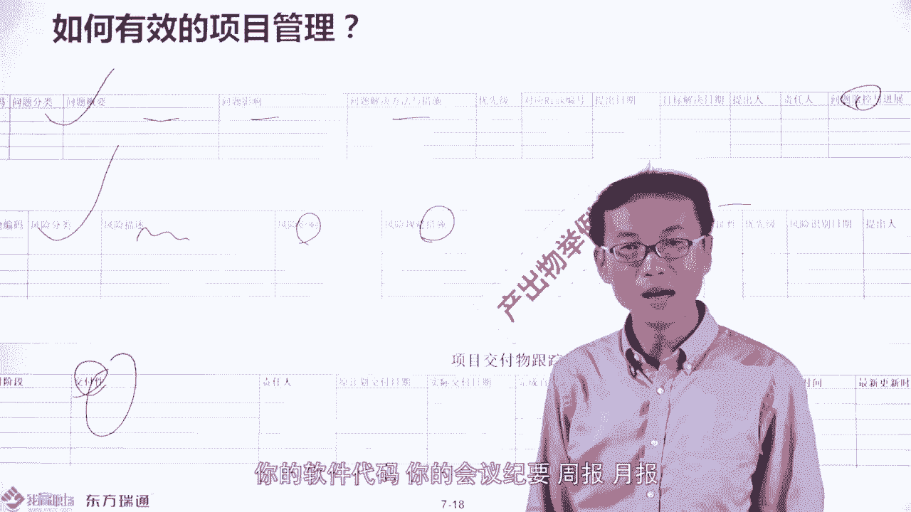

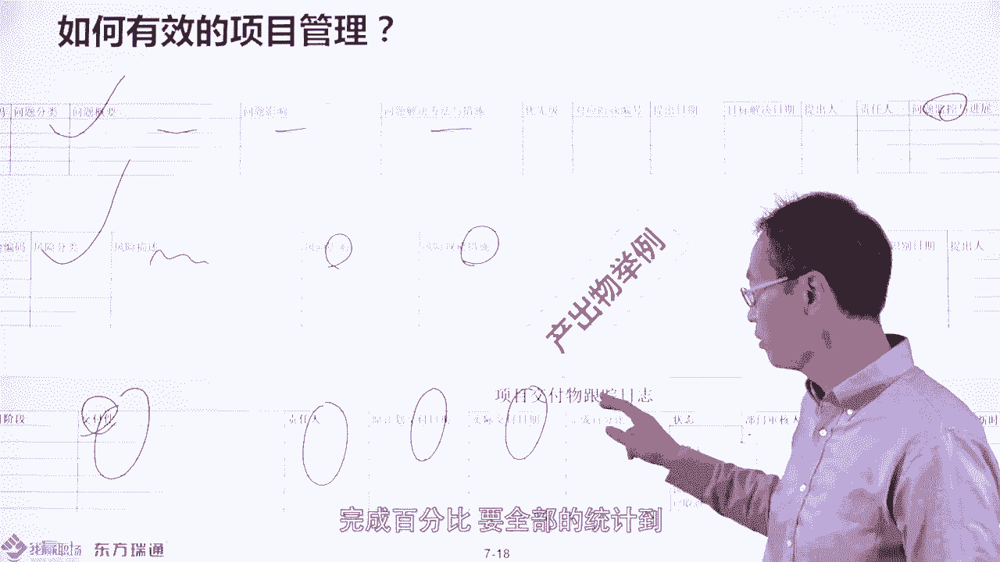

并且的话你要呃阶段性什么啊？要控制这状态啊，这状态很重要的，就是每个交付件，比如说周报月报会纪要，那它的。验收报看是延期未交付啊，交付未确认呢，交付已确认呢，贼确认了，对不对？那你就要把它列出来。

然后呢。

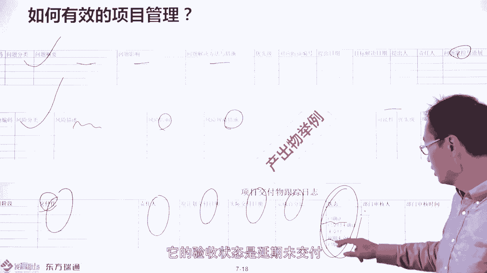

外部的话呢，可能是客户那个什么甲方的项目经理，或部管领导确认的，内部的话，可能你公司有PO相关理招公室确认的确认的那怎么办呢？那你需要怎么办？你需要谁确认呢？你需要有个证据啊，那证据的话。

你这边应该加一列加什么列啊，相关证据。比如说甲方那个回个邮件说这个事情来确认了，你要截个屏立马截个屏，就是截屏还出一个一个大概的一个什么一个小技巧，你要把时间戳截下去。

比如说你要把右下角那个日期跟你的邮件，因为邮件有日期嘛？右下角有日期，对吧？然后统一放到一个屏幕上去放到这儿，要备注相关证据。你说桌面上的那个时间可以改呀。那怎么办呢？为确保这个这个呃时间是正确的。

或者说呃是有依据的，请假呃远程打开一个什么呀，打开一个那个呃远程窗口，然后呢，比如。

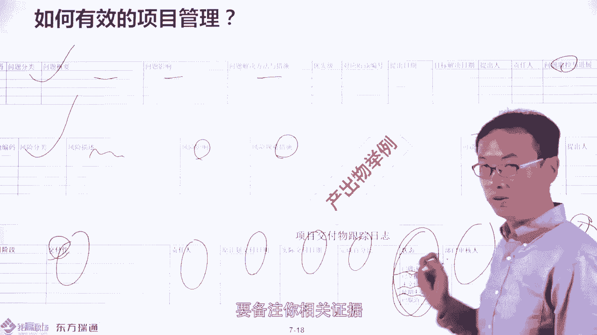

登到一个服务器，登到一台服务器，比如客户的服务器关键服务器，然后输入一个命令，哪个命令呢？叫t timeDATTIME。哎，回收，然后这样的话呢，就会显示服务器时间。然后你截屏的时候呢，把那个邮件。

你桌面的时间跟服务器时间截到一个屏幕上。哎，然后把它放到什么？放到那个你的excel里头作为一个备呃备注或相关证据。那比如说某年某月某日，客户局他之前承诺的或之前那个他家确认的一个东西呢，他反悔了。

他说哎这个事情我同意过吗？你立刻打开这个文件跟他说什么呢？你同意过的哎，某年某月某日哎你发这一个邮件到这里，然后你看这个还有截屏，还有夫妻的时间戳哎，这潜台词什么呢？就是你是来不了的，理解吧？哎。

这样的话，你才能做到70分。那如果你想做到80分呢，这还不够。那80分之后呢，就是像片去说的，你要有软技能，那软技能的话，什么样情况呢？叫察园观色啊，你要知道这个环境怎么样，比如举个典型例子。

这就很典型的例子，比如说像开启会或者是大概截到会议，那你看到这个是这里头是BP的一个展示区。然后呢，这边是。会议室的门口，然后这边有几个位置，大家可以看一下。那比如说位置一位置在这儿。

位置一是背对的门口的。位置二的这儿是正对的门口的第第一个位置。那请问位置一中规呀，还是位置二中规呀？答案肯定是什么位置二正归，为什么呢？因为位置二能够看到门口，他能看到出入，它相对比较安全。

比如说举典个例子，小布什在台上讲话，然后有人不扶他就吧？鞋那个拿下来之后扔扔那小不什扔给小不什对吧？想砸他小不石看到了，他躲了，对不对？他说看不到呢特别砸了，是不是所以呢位置2比位置一尊贵。

所以呢你要刻意把尊贵的位置留给客户啊，一般重要的客户他是第一个来还是最后一来啊，感觉谁拖大，谁推过来呀，对吧？那客户会不会做位置2呢？这是另一个问题了，会不会做呢？我问过很多客户，比如中国移动。

他会说什么呢？位置一位置2我都不做的，为什么呢？那都是讲PPT的地方，大领导我会坐那呢？对吧？那他会坐哪儿呢？他会坐到位置3，就是这边中间的位置找位置3。然后呢。

还会呃啊不位置3在这儿位置三是紧靠你的中间的位置，这是位置3。然后呢，位置四什么呢？就是这边中间的位置是位置4。那我位置马上来了，就是位置三和位置四有什么区别呀？大家可以想一下有什有区别呀。

那如果如果你敢坐的位置三的话呢，那左右两边都应该是你的人。就像皇帝面北朝南，左右两边是文武馆官一样的对吧？那位置四呢，就是国共谈判，比如说左边是蔡东，右边是C总，对吧？啊大家谈一下是不是然后领导坐中间。

对吧？啊，就是对地谈判的时候或者甲乙方谈判的时候，或开会的时候，一般是这么做的啊，大家都两边都人嘛，对不对？这样的对吧？好，所以呢呃你要看一下位置三位置四啊，什么情况啊，你要把这个位置留出来。

如果你不刻意留出来的话呢，甲方领导最后一个来的，他本来想做位置三或位置四，结果呢被那小弟给什么啊给占了啊，然后呢因为你坐到位置一，你知道位置二比位置一尊贵，所以呢你你刻意把位置二留给了甲方。

但是甲方领导未必想做这个位置，但是呢他也不好意思给你的小弟去叫地，对不对？所以呢他是暗期暗边就坐着，坐了之后的话，你开始讲P听，对不对。开讲PP的时候呢，你之后不是要请甲方去呃提意见吗？

那你一般来说是请甲方发言的时候，是官越大的是第一个发言呢，还是最后一个发言呢？肯定是最后一个发言，但你会想说什么呢？哎，我坐的位置一，甲方你想坐位置2，那我很容易沟通嘛，面对面沟通嘛。

那请你请你说一下吧，对吧？那甲方你想你又不尊重我，对不对？然后你不尊重我，那我就不尊重你了，他站起来会怎么办，他会激站你挑骨头，他会说什么？哎，你实际上有些东西好像没跟我说清楚吧。

或者没有跟我那个之前交代，你就放上去了，不对呀。连你们PP上的一些文字或者是还有错别字，语法还有错误。这是这是在我们一个严谨的公司是不允许的呀啊，所以他生生的是什么呢？把你的这种开会开成不成功。

你死都不知道怎么死的，理解吧？哎，这就是所谓的啊，你要做到80分，教你的软技能。那你想做到90分呢，这还不够。那你要既管好你要管好你的客户呢，还要管好你的领导。那问大家一个问题，请问向上沟通。

管好你领导的话，什么情况你要跟你的领导沟通呢？有三种情况大家可以对号入座一下。第一种情况大家都都能想到的就是什么呢？就是。遇到问题了，然后你打破头啊，都不知道这个事怎么做了。那你需要领导配合，对吧？

需要领寻求领导的帮助，这是大家都能想到的。第二种情况什么呢？就是遇到一个事情对你的项目很重要，你有如下解决方案，方案一优点缺点。方案二优点缺点，方案三优点缺点，就是说给领导出选择题，不要出问答题。

然后呢，第三种情况就是领导安排一个事儿，要实时汇报，要及时汇报。因为他认为这个事很重要，你安排给你们嘛。然后你把他人为把这个事儿拉低了，他就把你拉黑了。你不能跟领导同步核谈领导能够什么，领导能提拔你呢。

是不是和这三种情况要考虑呃向常沟通。那沟通还有方法的，比如说在P区中，他会有一个绩效报告的概念，那绩效报告的话，先说了，你看项目的日常的这种需要管控的维度，比如说像进度啊，成本范围啊，质量这些维度。

然后你每月要标什么状态，对不对？那你说这个状态标绿标黄标红，能不能瞎标，不能。你在项目支出的时候呢，要考虑到你领导的想法，那你就拿到拿这样一个表格呢，去跟领导对，说领导这个事情的话，这个项目交给我了。

你是关注沟通。

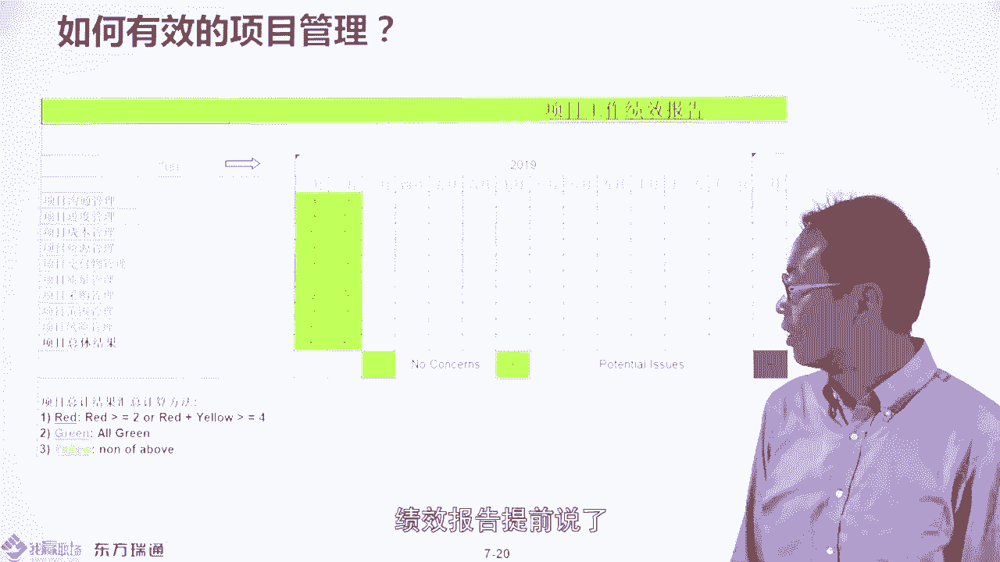

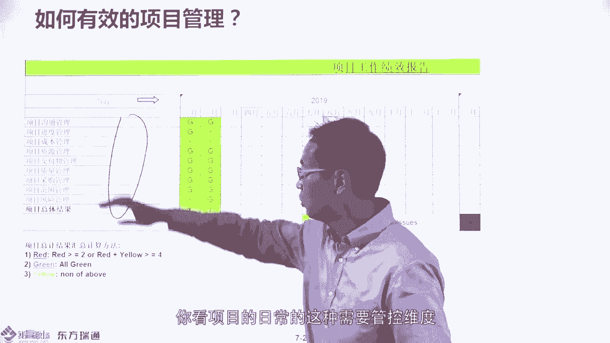

关注进度，关注成本，关注质量啊。那如果你关注这几个几个维度的话呢，你如何度量我呀？

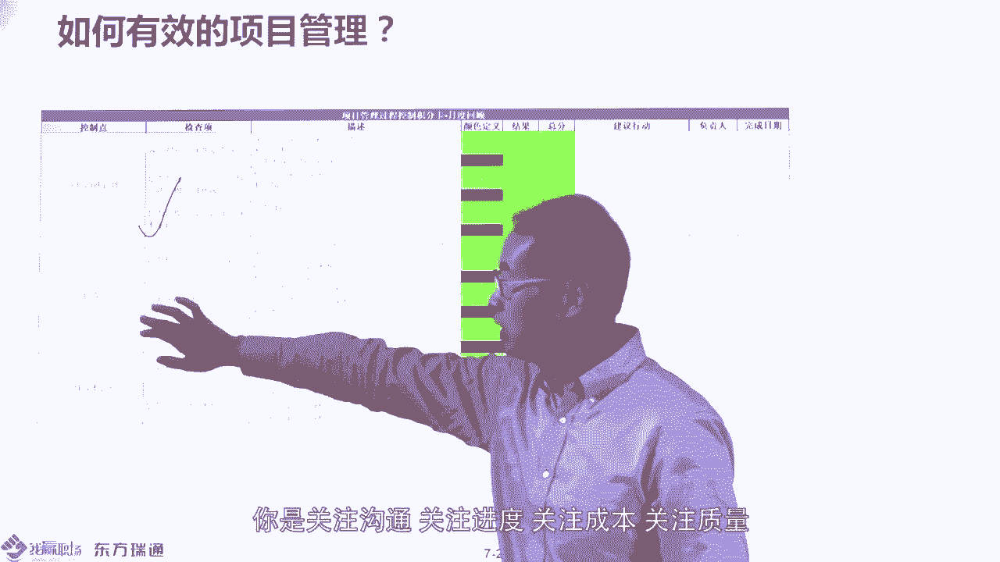

是不是完外我们要先谈清楚，然后呢，我在阶段向你汇报嘛。比如说关于这个沟通，那这是IBM的一个度量的一个标准，未必是合所有公司可能太严了。你可以调整。那比如说关于沟通管理，还有三个诊量项。

第一个检查项就是客户对项目现状是否满意，满意是绿的，无法判断是黄的，显著不满意就是红的。然后第二个检查项是什么呢？是否与客户的项目经理定期沟通汇报。比如说符合偏批的角角度来说呢，就是要有沟通的情话。

沟通外计划是相关情划一部分啊，并且按计划执行，这就是绿的。

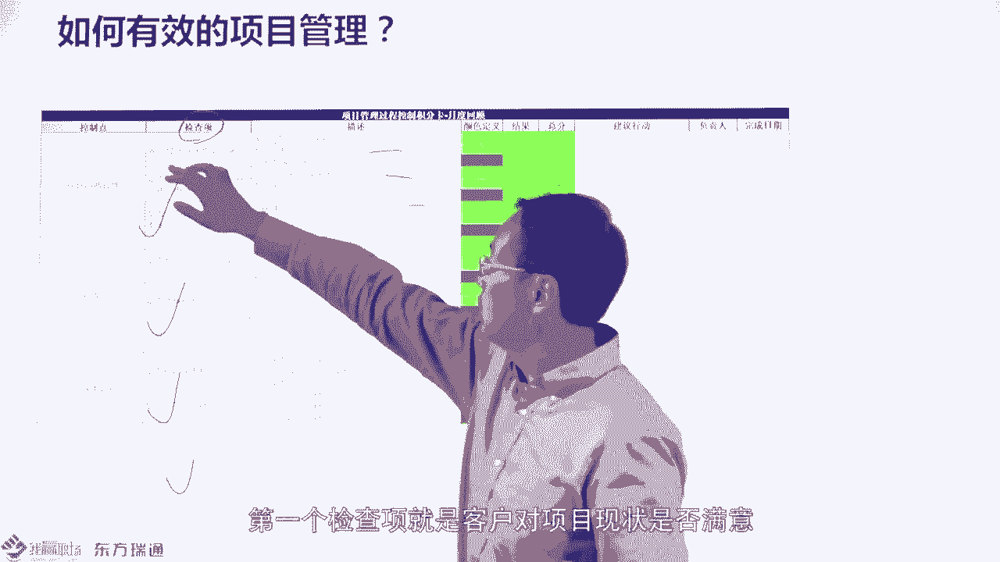

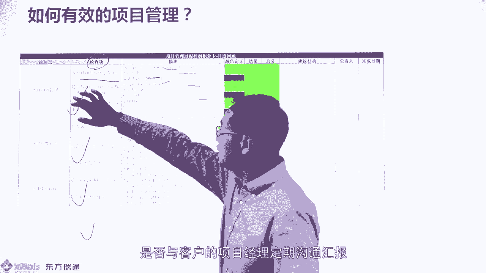

如果呢不定期呢沟通呢就是黄的。如果是很少沟通呢就是红的，理解吧？是这样的啊。好，所以说呢针对这些检查项，如果是标红了，标黄了，什么情况标红标黄呢？就是你单一向已经是红的了，你这上面是红的，向上取整。

理解吧？是这样的啊。好了，一旦标红标黄的话，证明什么呢？这个维度的控制点的话，有问题了，有进度和沟通有问题了，对吧？那你需要采取什么呢？建议行动。负责人目标完成时间看到没有？就就是你向领导汇报的目的。

就是要获得领导的支持嘛。好了，那问大一个问题，比如说如果一个事情需要领导支持配合，那你这边写建议行动，有如这个标红了，还有维度标红了，然后这边写建议行动，负责人先于领导的名字，目标完成时间。

然后接下来把这个这个文件绩效报告发一个邮件给领导。请问行还是不行？你们说谁会那么傻呀？对个这是属于反向授权，反向管理嘛，对吧？你要讲管理领导是不是不是挨骂嘛？是不是是这样的吧？哎，那我的问问题马上来了。

请问如果你觉得不能够直接把负责人是领导名字，把理邮件给领导的话，你有什么改良办法吗？进行这样的一个模板。可以的，你这怎么办？再加一点需要部门或组织配合的事宜，领导就是部门长或组织组组织的负责人嘛。

对不对？那肯定是他要承接的嘛，这叫含沙摄影，需要部门或组织配合的事宜，或者需要跨部协调的事宜，你领导属于呃部门头嘛，肯定他也负责跨部门协调嘛，对不对？是这样的吧？哎，好了，然后你这个事情要麻烦领导。

你发邮件给领导嘛，对不对？领导根必有时间，他未必来找你开会嘛，那如何能够把这个事情呢，能够让领导看得到，这就是要需要了解领导的心态，那比如问一个问题，如果是一个管150人的CO告诉领导。

他需要开发一管运维啊，那那这个高领导，把150人，他每天能收多少部邮件呢？他可能收什么最少收一二百封，因为很多邮件是CC系它的那他看到你的邮件，比如说你一天收几百封邮件，对吧？

他看到你的邮件就可能点一下。连附件都不打开，啪就关了，理解吧？甚至打的打开都不打开。这样的话呢，你需要去给领导发邮件的时候，要什么呢？要节省领导的时间，怎么节省领导时间呢？

你必须在邮件的标题写关于什么什么事，括号年月日括完掉。然后如果需要他审批，你的标题写需要你得要输入，需要你审批，这样的话，领导从标题就能够看出你要做让他做什么事，理解吧？

2、就是邮件的正文第一句话到第二句话一定要直指重点，不要那个啰里哆嗦拐拐了好多弯，领导没时间看，理解吧？好，那比如说第一句话到第二句话要直接告诉对方要干他干嘛。然后呢，邮件的正文的第一段，不要超过三行。

因为微信看多了，没有人愿意看超过三行以上的邮件。然后呢，重点东西要标粗，标蓝，标红，不要标绿啊，那标红的话最典型的在外企哎，这边有个名词叫COB today clo of business today。

什么意思啊？就是在下班之前要给我回邮件。回复啊，COO B todaybefo COO B today。是这样的啊，哎就告诉对方什么时候是在是待办，是这个最晚交付日期，这样的啊哎。

就是在邮件的什么这个正文要看到的。并且的话呢如果有附件，你像这个附件，你标红写的名字可能不打开，没用，理解吧？怎么办呢？你要把标红的内容重要内容一定要截个屏，在什么呢？

在你的附件中或者应该说在你的邮件正文中体验到，让他一秒钟看到，理解吧？哎，他突然发现啊，原来出事儿了，还还会什么呢？找你开会呀，哎给你打电话呀，或者给你一个时间呢去干嘛去谈这个事，这样的。好。

所以说项目经理要想做到90分的话呢，你需要把这些东西都做好，然后你的老板就会给你打100分，因为什么呢？一个项目可以这么管，100个1万个项目都是可以这么管的。啊，这样的话呢，明年的项目总监就是你呢？

就是你给以师傅带徒去了。所以作为项目经理怎么做到100分。给大家说一下，重复一下，首先我们要做到什么呢？就是要有计划，这大家都做好了，对不对？有计划。然后接下来要做到按计划做过出控制。

要控制什么问题和风险，当下存在的问题和风险潜在风险，并且要控制什么交通，因为交付户决定能能否能验收，并且要有软技能，要管好你的客户管好你的领导，如何向上沟通，并且沟通还有方法要善家利用绩效报告。

并且要知道客户也好，领导也好，什么时候能打开你的邮件，邮件的正文要把重要东西全部列清楚。比如说前两句要告对方要做什么事，第一段要超过三行。然后呢，并且重要东西要什么写到正本中截屏，就是附件中重要东西。

要在邮件正文中体现。然后呢沟通还要方方法要换位思考等相关内容，要向招通造成客户说了，什么呢要正确的思维方式，一是付出。不要任何努力。2要么就不要什么不要有感性的烦恼，九手之，你就会磨炼什么百炼成钢。好。

多谢大家，感谢大家的这个收听收看。