# PMP项目管理精讲视频课程-PMP题型分析 - P1 - 第五空间培训中心 - BV1KC4y1C76Q

大家现在可以看到屏幕吗。

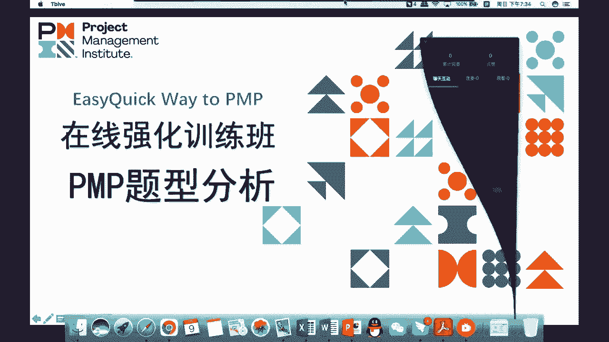

好现在可以了啊，嗯好，现在正常了。

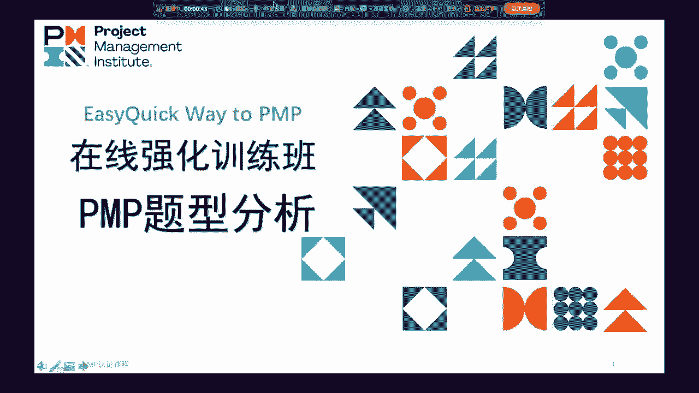

好大家晚上好，不好意思啊，那个刚才网络可能有点问题啊，丁丁退出来了，所以我重新建了一个直播，大家进来吧，好我们准备开始今天的直播啊，我们呃今天的题目是PP题型分析啊，那之前呢我们大家应该有。

做了一点点练习，对不对，做了一点点练习呢，但是有个问题是什么呢，大家对于这些题型啊还是没有全面的去掌握，所以呢今天我们花一个多小时哈，我们来讲一讲咱们PP考试这个题型啊，到底怎么来掌握。

然后呢帮助大家能够更好的去做一些预习啊，好那今天我要分享的内容的话呢，大家可以看到哈，呃有PMP考试的题目数量和题型，这是第一部分啊，这个是呃相当于是信息要分享给大家，那么第二个呢是难点分析。

PMP考试中的一些难点是什么，那这些题目啊在做的过程中，他到底是知识点难呢，还是分析题目难呢，还是有其他的难点，那么这个呢也要跟大家大家交代一下，聊一聊啊，然后呢呃是占用大部分的情景题啊。

那什么叫题型呢，在这里我要跟大家聊一下题型，实际上是有两种说法啊，有两种纬度的，那刚才说到情景题算不算题型呢，呃我觉得他是第二种维度，待会我先说第一种维度，就是在这个第一个部分里边，我会先说啊。

这个第一个维度是什么亲近体，然后常见的计算题，这个那PMP考试，大家觉得啊，我终于离开学校啊，这么些年了，不用考计算题了，哎PMP考试啊是有计算题的，不过不用太担心，这个计算题呢不会特别难啊。

那么最后一个呢是整合p mi原则的题目，那这个呢是比较特殊的一些题目哈，数量不会很多好那么今天我要跟大家呃，总体介绍的内容呢就是这些啊，总共是五个部分啊，我们一个一个来过啊，好第一部分考试的题目数量。

那题考试题目数量呢，这个我是摘抄了哈，大家都看到这一页都是英文的啊，呃那为什么是英文呢，因为这是这个，我摘抄的是PMI公布的这个考试信息嘛，哈这里边大家可以看到我们先从这里开始，从右边开始看啊。

右边开始看的是180道题目，是不是180题是total的总的数量，那么我们这里边分成两个类别哈，第一个类别呢是170题对吧，加上五题，那第一个类别叫做记分的题，Scout是吧，计分的题目。

那么五分呢是不计分的题目，就是大家有点晕了，怎么回事情对吧，总共180道题目，还有五题是不计分的啊，所以对了，这个就是这个PMP考试比较呃特殊的地方哈，我这个180道题目。

里边只有170道题目才是积分的啊，那么也就是说啊，你这个另外不计分的五道题目呢，你答对答不对呢，这个都对你没有太大的影响，主要是170题你要答对，但是大家可能会问。

那我也不知道哪一道题目是计分或者不计分的，对没有错了啊，这个题目是不标明哪道题目是计分，哪道题目是不计分的，所以呢大家呃尽管做就对了，那么为什么会有五道题目，简单说一下，那这个五道这个不计分的题目呢。

是为了将来扩充题库的PNP有个大题库嘛，对不对，那这个题库呢会被扩充出来，就是通过这个呃每次考试加一些新题目，每次考试加一些新题目进来的，但是呢他作为预测，如果在他的预测范围之内合格了。

他就会编录到相关的题材啊，题库里面去，这样的话呢大家就有新的题目可以去做，那么下一次可能就会记分了，那那么大家知道这个计分的规则就OK了，所以呢从考试这个角度来说，有的时候你碰到一些特别难搞的。

搞不清楚的题，也不用太纠结的放过啊，啊不用在难题特别难缠的题目上花太多的时间，好这个呢先跟大家聊一下，以后还会再跟大家强调啊，这个是我们的数量好，那么题型呢我刚才说到的两个层面的题型呢，要跟大家说一下。

这个，首先我们会说到的是单选题和多选题的问题，这个我相信有一部分同学是知道的啊，就是我们在做单选题的角度啊，还有是就是我们下一页的哈，就是多选题哎这个角度来说的话呢，这个是一种维度啊。

我们来说我们的考试题型有这么多，但是你要知道的仅仅只我们如果从学员啊，你考试来说的话，你只是知道多选题或者是单选题，那是绝对不够的，是不是有些同学会哇，我们这次考试有多选题了，那多选题是不是变得很难了。

对不对，其实坦白的跟大家说啊，是不是多选题，是不是单选题，其实不是主要的问题，主要的问题还是要从另外一个维度去思考，这个题目的类型到底是难还是不难的问题，就是说我刚才哎说到的是不是有情境题呀，计算题呀。

相对比如说还有一些其他类型的题目，对不对，所以呢这个大家千万不要太担心，说哎我有多选题了，我可能搞定了关键的问题，你是要对内容的掌握是吧好，那么我们从上往下看这个单选题，它是怎么个构成法哈。

那么单选题呢简单说一下哈，如果看过我之前导入课程的话，就前期就是报名的时候，大家如果看到过我的视频了，这个题目我是跟大家讲过的啊，那这个单选题的话呢，我们是有呃一个题干组成一四个选项。

组成ABCD4个选项，四选一就对了啊，那么我们考试的时候呢是呃中英文对照的啊，一般题目题干来说的话呢，是上面是英文，下面呢是中文，这样子来说的，如果你的英文还行，对不对，就算你你的英文还行哈。

打打个比方，那你看中文的时候，如果有看不明白的，你可以回过头去看一下英文，这个是对你有好处的对吧，但是如果你不懂英文的话呢，也没有关系，现在的英文翻译成中文的这个质量啊，还是很不错的啊，不像好几年前。

对不对，更早一些我们考p mp考试的时候就有点头晕的，有的时候这个翻译的不好啊，当然也不能完全排除说这个翻译就一定对，你不一定就一点问题就没有了，因为这个翻译并不并不是中国人在翻译的啊。

PMP考试的翻译他是学过中文的外国人啊，翻译的，OK所以大家要知道一下这个啊，那么四选一四选一哈，那么我来说一下这道题，我这道题目呢我就不请大家来做了啊，待会我会有其他的题目来请大家做。

那这道题目我们四选一啊，项目经理在两个期限紧迫的项目之间轮替，尽管时间有限，但他决定从这两个项目中收集经验教训，那么这道题目啊，从总体上来讲，它就是讲的这个知识点嘛，收集经验教训对吧。

那项目经理应该核实如何啊，问的问的是这个如何收集经验教训，那么ABCD我们一起来看到底选哪个呢，A在每个项目完成时记录经验教训，首先这句话没有错啊，但是适不适合这个题目呢，我们还得再看看。

因为从这个题目来说的话，A啊他首先是这句话没有错，但是不完整的经验教训，是在整个项目期间都要被收集和记录的啊，B呢请求知识管理部的帮忙，这个是不对的，我们并不存在这个所谓的知识管理部。

这个就是呃从知识管理的角度来讲，我们是通过项目团队成员来完成的，对吧啊，C呢呃存档项目会议的所有会议记录，这个会议记录，它只是属于我们项目管理中的一个部分，经验有很多啦，对不对啊，有风险。

有问题有解决呃，相关的难题，这些大量的文件经验，有可能都会被我们集结到一块去，所以C是不完整，D呢从启动阶段开始定期记录经验教训，你看这句话就比较完整对吧，从项目一开始，我们就应该要去做啊。

相关的经验教训的收集是不是，所以从题目再回到题目来说的话，项目经理应该如何收集经验教训，不是很显然的吗，对不对好，那么你你这个题目啊，那么我们是单选题ABCD单选题啊，这个是单选题，我们再来看多选题哈。

好那么多选题，多选题呢题题目的构成是跟单选题一样的啊，没有太大的区别，那大家可以看到呃，也是中英文结构啊，中英文结构，那咱们呢主要看中文就OK了啊，那这个题目有个特点是什么呢，啊大家注意一下啊。

选三项对不对，two three啊，这个就是我们在多选题这个这种类型来说哈，一个对于我们来说是个好事情，这个你看总共有八个选项，A b c d e f g h，你看这道题目我们有八个选项。

如果他不告诉你这个选多少题目的话，你也有点头晕的，是不是，所以告诉我们，选三项目对于我们来说就相对简单了对吧，但是真正的难点，而不是说不完全是哈告诉你多少这样的问题，而是我刚才跟大家讲过的啊。

就是你应该要知道这个知识点才是最最根本，好吧好，那么这道题目呢我们一起来看一下，在项目计划评审会上，多位相关方表示，计划呃，进度计划过于激进，能够按照教呃，按照能够按期交付的风险较大。

他们希望项目经理采取措施，降低项目延期的风险啊，那么也就是相关方啊，希望项目经理采取相关的措施降低项目的风险，那么降低风险是属于这个风险管理啊，我们叫做从策略的角度来讲啊，它是一种策略方式啊。

所以风险的降低是策略的一种，我们也可以规避，我们也可以转移，我们也可以什么等等接受啊，所以呢大家这个是一个非常重要的知识点，必考的呀对吧，我跟大家讲这个是必考的啊，所以那么你ABCD，你得要知道。

这个降低风险策略的相关的特点是什么，那你就能选出来了啊，我们简单来看一下哈，因为大家还没有彻底的学过吗，那我说一遍，让大家感受一下就行了，A将项目的主体部分外包外包叫转移啊，这个叫转移，对不对。

完了A肯定不选了哈，B呢在进度计划中增加安全时间，增加安全时间，就冗余的部分就是降低AB是可以选的好，C呢再将项目移交哎，那移交给有经验的，那也就是转移了，对不对，好，那么D呢在关键路径上增加资源。

增加资源，这个也是可以选的，一呢提高项目在公司中的优先级，我们不选你，你没办法去提高项目在公司内的优先级，你根你根本不可能主观的去体考嘛，是不是，所以一呢肯定是不合理的。

F呢呃获取经验更加丰富的项目资源，那这个不就是增加资源吗，对不对，所以F是不是也可以选即呢，增加延长赔偿的准备金，这个地方他不是资源的增加是吧，这个钱的增加，这个叫做储备，所以这个这个叫做接受啊。

这大家可能现在还不能理解我说的说法哈，G呢是属于接受策略，大家注意啊，这个是风险策略里面的一种解决方案啊，H购买相应的保险叫做转移啊，叫做转移，所以SH是不能选的，所以这道题目我们选BD啊，F是吧。

所以他告诉我们选三项嘛，在这个叫做多多选题好吧，大家知道了，现在知道了哈，我们从考试来说，我们中国大陆大陆地区考试就是单选题，多选题啊，如果是非大陆地区的话呢，可能还有其他的类型什么啊，选择嗯。

应该叫做填空题啊，还有热点题啊，还有这个拖液体等等啊，这个大家了解一下啊，如果你没有出国去考试的话，就不用关心这个问题了啊，我们所面临的就是单选题和多选题，这是一个大的维度跟大家说清楚好。

那接下来的话呢我就会逐步逐步的说，另外一个维度，当然不是一下子跟大家说完啊，就是接下来的这些内容，都跟第二个维度有关系的，PMP考试的难点分析，我们我们来看啊，接下来就是内容了啊，那么难点到底在哪里呢。

就不管你是单选题还是多选题，真正的难点是你的，你要能够识别这个考试，他考的你的是什么嘛，好那么我们首先来看一看啊，PMP考试的难点，我们来一起看一下哈，我首先给大家说通才还是专才。

大家思考一下这个问题啊，就是你是项目经理，对不对，或者你是潜在的项目经理人员的话，你是通才还是专才，那么从pp考察你的角度来讲，他是希望你是专才呢还是通才对吧，我我相信大绝大部分的同学哈。

一定会认为我们如果是项目管理人员的话，我们一定是偏向于通才的，而不是偏向于专才的，是不是，那通才对于你考察来说，那就不是简单的一个技术问题，那就是不是简单的一个管理管理方向问题，而是全部都要是不是好。

那我们再来看pm构成啊，pm上一期我们讲过了哈，其中我们有五大过程组啊，启动规划，执行监控收尾，对不对，十大知识领域你能不能回忆的起来，十大知识领域啊，如果你们一点都回忆不起来的话，书就在你旁边的话呢。

你就把书翻到page25页，十大知识领域我们一起来一下，对不对，我们有哪些知识领域呢，啊我们有整合范围，进度成本是吧，质量啊，资源沟通风险，采购相关方，你想想看哈，我说到了这个十个知识领域。

你是不是传承专家，不可能，但是考试十个知识领域全要考的一个不能落好，我们再来看五大过程组和十大知识领域，所构成的49个过程啊，这话应该反过来讲，49个过程，完整的演绎了五大过程组或者是49个过程。

我相信这个话我现在讲起来，你们应该能理解了，那49个过程，它里边有TT，是不是它所涉及的这个过程的，输入部分是多少呀，输出部分是多少呀，中间的工具是多少呀，那有多少呢，78种工具。

我告诉你啊啊78种文件和结果啊，或者是结果哈，那也就是input的这个位置和output这个位置哈，我们都有相应的输入输出，那么这个里面总共有多少种呢，78种的好，我们再来说工具。

那工具呢或者技术呢有132种啊，说到这里的话，你觉得你在考试之前，或者是我们简单把这个PMBOK讲读一遍，你呢有没有可能把这个78种文件，130多种工具全部都掌握，你如果没有通过认真的看书。

认真的做题和我们交流，你怎么可能把49个过程，78种文件及结果，130多种工具全部都掌握了，不可能的，就算你现在是一个项目经理高手，你也不可能涉及到这么多的知识点，这不就是难点吗。

好我们再来看预测型方法，敏捷型方法和混合型方法，这个是我们就是改版PMP考试，改版之后又新增加了一些内容，以前我们的侧重点是什么呢，这个是以前我们所侧重的项目管理方法，叫预测型项目管理方法。

那现在呢我们的考试，要把敏捷型方法考虑进来啊，因为现在的项目在管理的过程中，它相对是复杂的啊，所以呢他除了这个敏捷之后，他一旦提出来敏捷啊，他就一定要考虑混合，为什么呢，你既然有敏捷。

就有可能混合预测和敏捷两种方法在一块用，所以呢这两种方法他也要考察，所以这里面有50%的比例，这里边有50%的比例，是不是来考察，你好，那么这个时候你再想想，pp考试的难点是多选题还是单选题的问题。

是不是，所以你看刚才我跟大家演绎的单选题的选项，和多选题的选项，你如何选出来的，是取决于你对这里边的，比如说49个过程的定义啊，78种文件，它每一种文件的功能啊，对不对。

130多种工具它应用在哪些领域啊，它有什么作用啊，这些你不都得搞定吗，是不是预测型的，敏捷型的，它又有何不同呢，而且这种不同是非常非常之大的，不同的应用，不同的场景一定是有不同的方法的。

所以PMP考试是很实在的，他从来都不是有噱头啊，有什么的，他都是硬打硬，实打实，你是项目经理，你我们希望你是一个什么通才通用型人才，底下的五大过程组，十大知识领域，49个过程，78种文件。

130多种工具，预测型，敏捷型混合型，OK全部都要在考试之前搞得定的，大家知道吧，所以PP真正的考察的难点啊，题型虽然有多选题出现了，但是这根本不是难点，真正的难点还是PP本身的知识体系的庞大啊。

OK这样大家觉得刚才我一说，大家是不是有感觉了，好大大家，我把PPT写到这一页的时候，大家再看一看难难在哪里，有没有更难的地方来，有没有更复杂的地方来，是不是大家来看哈，哎过程5。15。2过程哎。

我圈出来的全叫过程，总共有49个过程，这样的过程是吧，文件哎这些是不是文件啊，这些我不读他的名字哈，大家现在也不熟悉啊，是不是都是名是吧，这是文件，对不对，但大家看哈，还有复杂的。

刚才我说的只是举把这些数字举给大家听，对不对，49啊，78，130多万，是不是这些数字之间它还有关系，所以这个地方我们叫做流向图嘛，是不是，也就是说我过程的输入与输出之间，它是有关联性的。

49个过程之间是有关联性的，你说这个难点是不是要比你单独的去搞，定力是吧，49个过程的定义啊，130多种工具的定义啊，要复杂得多，所以这里边还有关联性，所以这里边有逻辑关系的啊，我的输出是你的输入。

对不对啊，回头我还为其他的服务对吧，你看项目管理计划，他对于每一个过程它都有可能有作用对吧，这个就是这本书很有意思的地方啊，很值得大家去研究的地方好，那么这个呢告诉大家支持，上面我说过的。

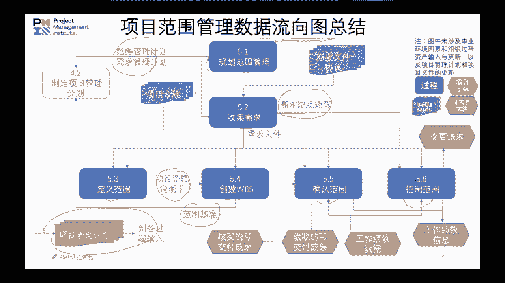

这些所谓的数字之间是有关联性的，请大家注意啊，那么好，这一页呢我再跟大家说一说，展开来说一下预测形状，敏捷型中间你看他除了敏捷型概念之外，它还有另外两个概念，一个叫迭代性概念，一个叫增量型概念。

这些都是在我们去识别这个项目如何来做，对不对，使用什么样的工具，有什么典型的应用场景都了如指掌的啊，随便举个例子啊，你看预测型需求在开发前预先确定迭代型，增量型需求在交付期间定期细化，定期细化对吧。

这个叫预先确定啊，那么最后敏捷型需求在交付期间凡啊频繁细化，它不一样的啊，使用的方式方法它是不一样的啊，好这个呢不去跟大家细细的去讲，但是大家一定要清楚啊，项目PMP我们项目管理PMP考试的来说的话。

我们的难点其实是内容啊，不是考试的形式，考试的形式，对于我们身经百战的各位同学们来讲的话啊，这都是毛毛雨，对不对啊，你想想这些都是我们这些内容其实都是主啊，都是主啊，叫客观的题目吧，是不是单选题也好。

多选题，多选题还告诉你多少个选项，那没得说了，这个东西对我们来说已经不存在障碍，真正的障碍，你要去针对这些所谓的知识点的理解。

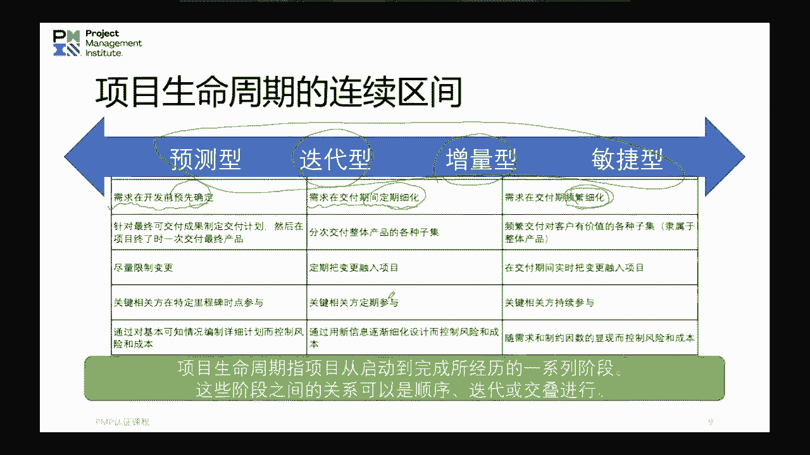

并找到知识点之间的关联性就OK了啊，好接下来不多说，跟大家来聊一聊这个题目了啊，请大家来做这道题目，来感受一下这个难点到底存不存在啊。

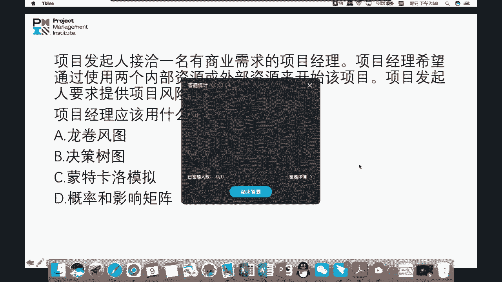

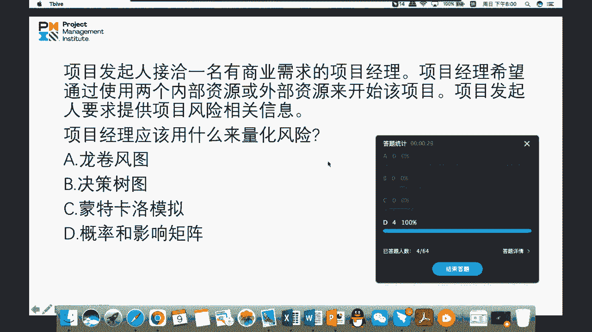

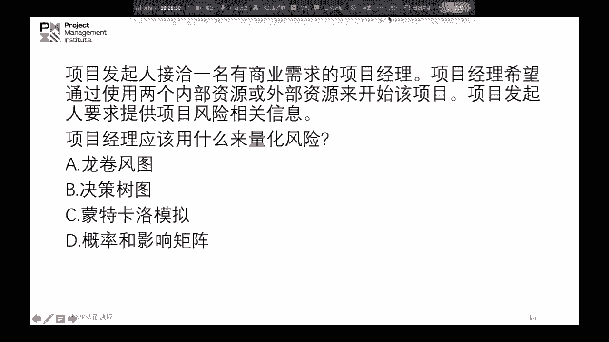

好目前有34位同学已经答题了啊，那么，再等十秒钟，好现在呢我们有呃38位同学答了题啊，总共是76%的同学呢选了D啊，我告诉大家这道题目，但是我告诉大家这道题目啊，大家选的不错不好，选的不好。

那正确答案应该是B啊，这道题目我结束答题啊。

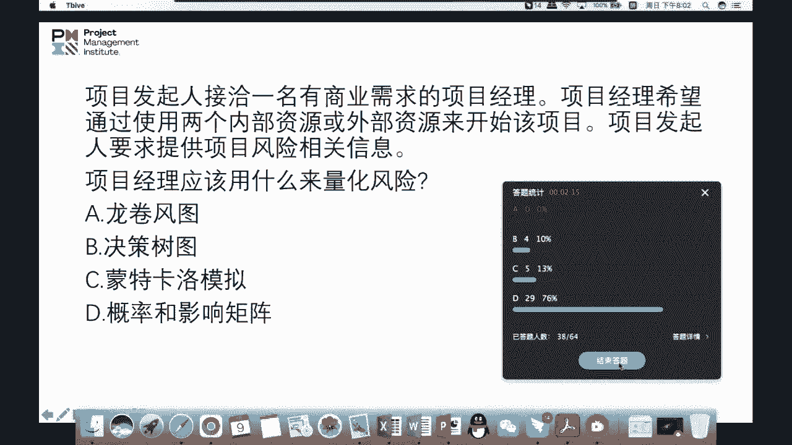

好那这道题目呢我来跟大家讲一讲啊，为什么大家选错了这道题目呢，我们是选决策树分析的，大家选的是概率和影响矩阵啊，首先啊我要跟大家说一下，我刚才跟大家介绍的内容来说的话是什么，是你得理解这些知识点。

我不是为了考试，让你做题目来给大家做这个题目的啊，我这个题目是选出来的，对不对，你看我选出来的题目，你做不对，为什么呢，你看你对这个知识点了解吗，现在我不是说你没有认真看书啊，同学们。

我是说因为咱们没有学过这本书，对不对，你对这个决策树分析呀，决策树图这个工具是不了解的，对不对啊，你是不了解，他承认嘛，对不对，不是你的能力问题，也不是我的这个这个教学问题。

是我们你看我们对于这个知识点不知道好，那么如果从考试当天来说的话，你对这个知识点不知道，那你肯定是不会做的，是不是，那这道题目他讲得很清楚的啊，他要让我们做的是什么呢，项目经理接洽了发起人哈。

接洽一名一名有商业需求的项目经理，项目经理希望通过两个内部资源或外部资源，来开始该项目，好项目发起人要求提供项目风险相关的信息，那么跟风险相关的信息有哪些呢，好项目经理应该用什么来量化项目。

这个也是非常重要的，在PMP考试里边，我们风险啊有两种，一种是定性的，一种是定量的，那么好我们看选项里面哪些是定量的，龙卷风图是定量的，决策树是定量的，蒙特卡罗分析啊。

模拟技术它也是定量的概率和影响矩阵，它相当于是一个定义啊，它不是定量风险分析的工具，所以D是一定错的啊，肯定错的，那么ABC都是量化风险来说的话，那怎么办啊，龙卷风图。

决策树和模拟蒙特卡罗模拟技术来说的话，他适合我们提干的，只有决策树分析，决策树分析它是可以来决定是吧，来最好的那个路径啊，最好的选项，这个B是可以决定选项问题的，我哪一个更好一点。

那么你看题干里面不是有两个吗，这里边不是告诉你有两个内部资源或外部资源，来开始这个项目，那到底哪个好呢，那你用决策树，是不是非常贴近于这个题目的题干啊，这个是这个题干，我们我们要尊重的嘛。

啊所以你的答案得跟题干去对应，而且你的知识点层面上来讲的话，ABCD如果你根本读不懂的话，对不起了，你这个题目你真的是只能猜猜了啊，好OK这是一道题目，我们接着来啊。

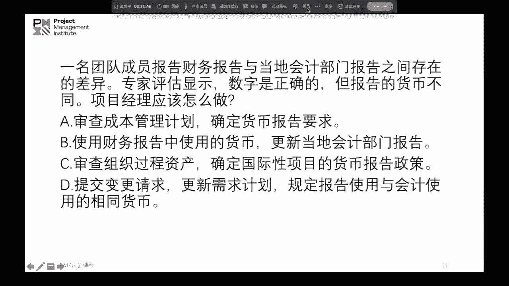

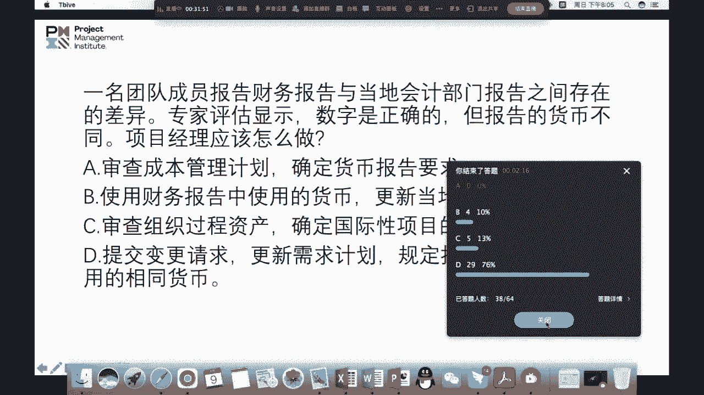

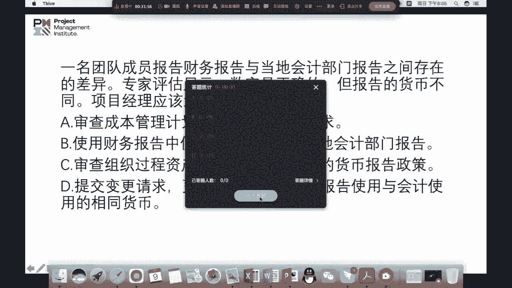

好现在开始啊，现在呢有33位同学，34位同学答题了啊，我再等十秒钟，OK好，那现在呢有38位同学，40位同学答题了哈，我们有24%的同学答对了这道题目，这道题目我们选项选A啊。

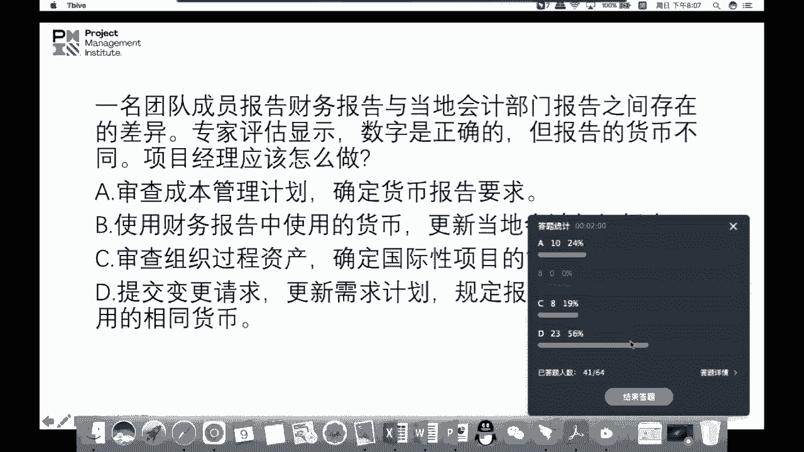

选项选A，那么绝大部分同学选的是D啊，为什么呢，是不是我们一起来看这道题目，首先我们是选A啊，题目一起来看一下哈，一名团队成员报告，财务报告与当地会计报告之间存在差异，那么专家评估显示数字是正确的。

那么但是货币不同，那么也就是这个问题点在这货币的不同啊，项目经理应该怎么做啊，那么你要知道这个货币到底在哪个地方，定义的呢，是不是如果你知道这个你就很清楚了，首先这个货币在哪里定义呢，叫做成本管理计划。

成本管理计划，是我们项目管理计划的子计划之一，有十个子计划啊，每一个知识领域除了整合之外，我们都有相应的呃子管理计划，那么成本那么当然是项目成本管理，咱们第七章的内容啊，好A审查成本管理计划。

确定货币报告的要求，非常准确的哈，这个答对了对吧，我们在BCD我们一起看一下啊，B呢使用财务报告报告中使用的货币，更新当地会计，这个如果你有更新啊，这个东西你不能直接更新在pp里面。

我们是要通过严格的变更过程的，而且你不能直接使用这个，这个是要通过讨论的，你想要变就变了，不可能是吧，必不选C呢，审查组织过程资产组织过程，资产里边，它是不去规定你需要用到的具体货币内容的，对不对。

这个是没有的啊，D提交变更请求，更新需求计划啊，需求计划和我们所说到的所谓的货币不同，两码事，规定报告使用和会计使用的相同鬼，那需求计划在哪里，我们这里没有谈到需求问题啊。

我们现在就谈一个具体的货币本身的问题，这道题并不难啊，我告诉大家，这道题目不难对吧，你只要知道货币的定义，它是在成本管理计划里边有的，那你肯定不会选错好，我们再来看这道题目啊。

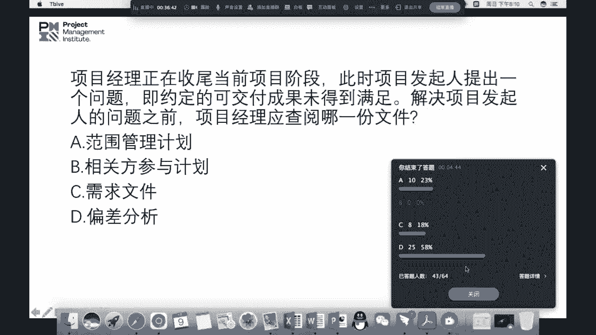

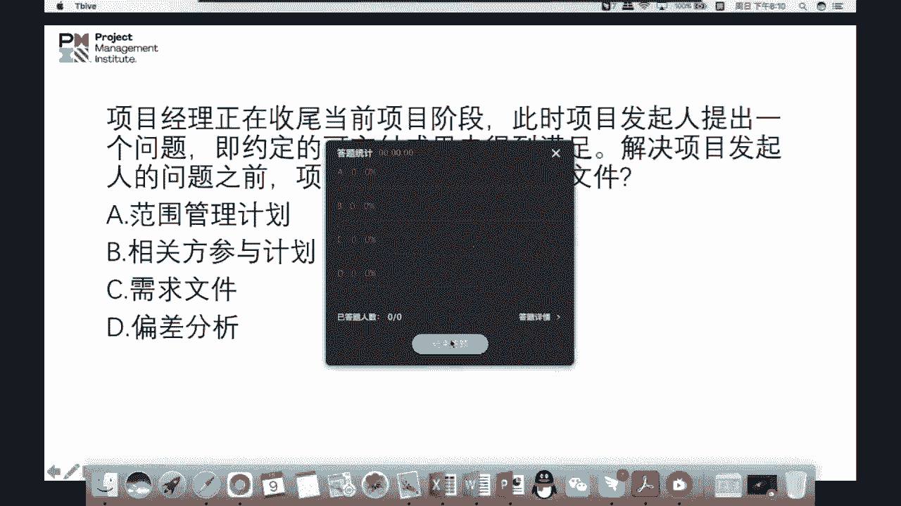

同学们你们都选了C哈，好目前呢我们有41位同学答的题目哈，我们有19%的同学答对了，20%的同学答对了啊，我们这道题目选A啊。

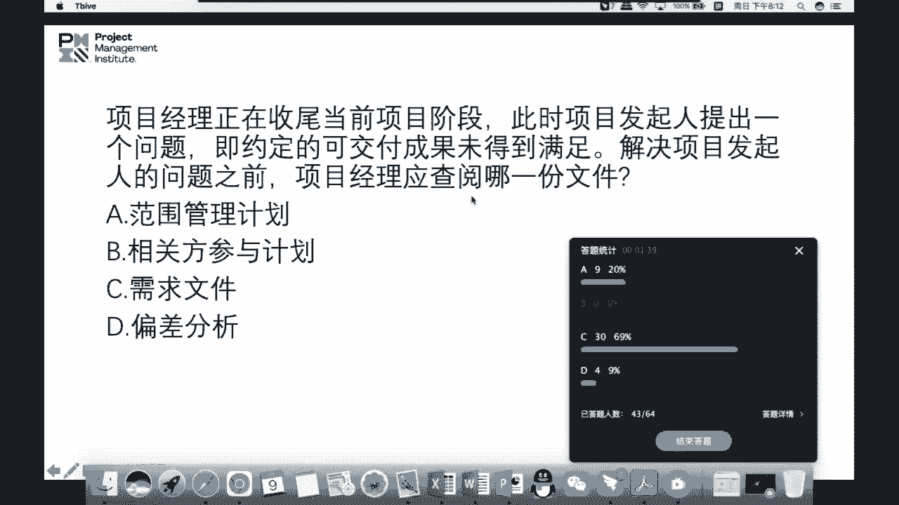

哎你看啊，我们一起来看一下这道题目啊，大家为什么选不对呢，我刚才讲了前面那道题目，你们应该能选对才对啊，不过这里面有一个坑，我给大家埋了一个坑嘛，这道题目我们选A啊，我们一起来看一下啊。

项目经理正在收尾，当前项目阶段，此时项目经理，项目发起人提出一个问题，即约定的可交付成果，这个是一个很重要的概念啊，可交付成果是一个非常重要的概念，那什么叫可交付成果，可交付成果来自于哪里，对不对。

可交付成果意味着什么，这个在我们讲第五章的时候，是会重点来讲到的啊，啊那么没有得到满足，那么解决项目发起人的问题之前呢，项目经理应该查阅哪一份文件呢，大家想一想，我们在解决他的问题。

你得去找找找相关的内容嘛，对不对，那么这个可交付成果，如果我们能把它转化成我们相关的过程，里面的内容的话，这个是跟什么相关呢，我刚才说到的，它是跟第五章相关的，那么它是一个范围。

啊现在对大家对于范围的概念呢，恐怕没有那么深刻的啊，可能有个别同学是知道的，但是如果我们没有认真的学过，从来都没有学过P项目管理的，不一定是偏僻啊，项目管理的同学的话，你对范围是理解的不够透彻的。

什么叫做范围呢，就是我们项目里边需要去完成的，这些可交付成果是哪些，那么现在呢这个可交付成果没有被满足的话，那是不是要去哎，看一看这个可交付成果怎么被纠正啊，怎么被更新啊，怎么被怎么样重新提出来怎么样。

那么这个都是在范围管理计划里边的内容，外范围管理计划，他会指导你项目经理或者项目团队，如何去更新范围，对不对，如何去监控范围，这不就是范围管理计划吗，好，那么我们绝大部分同学呢，说我们选择了需求文件。

那需求文件是什么呢，需求文件的概念是要比咱们范围的这个概念，更加大一些，所以你这个项目的执行，不一定是所有的需求都被执行的，而是所有的范围确定下来的范围要被执行，要被完成这个才行，所以这里边是有逻辑的。

有大小的，有先后的啊，所以这个从时间轴的角度来讲，首先有需求，对不对，然后才有范围，啊这个你从项目的规划的这个角度，时间角度来说，它是那么它是一点一点来的，他是这里面有逻辑关系的。

所以我我在年后讲具体的项目管理课程的时候，PP课程的时候，这些所谓的时间概念啊，逻辑关系呀，谁包含谁呀，谁应该负责啊，这些东西我们都会重点去讲，那么这些内容当然你要找好大家，这道题目选的还是不好啊。

我们接着来再来看看这道题。

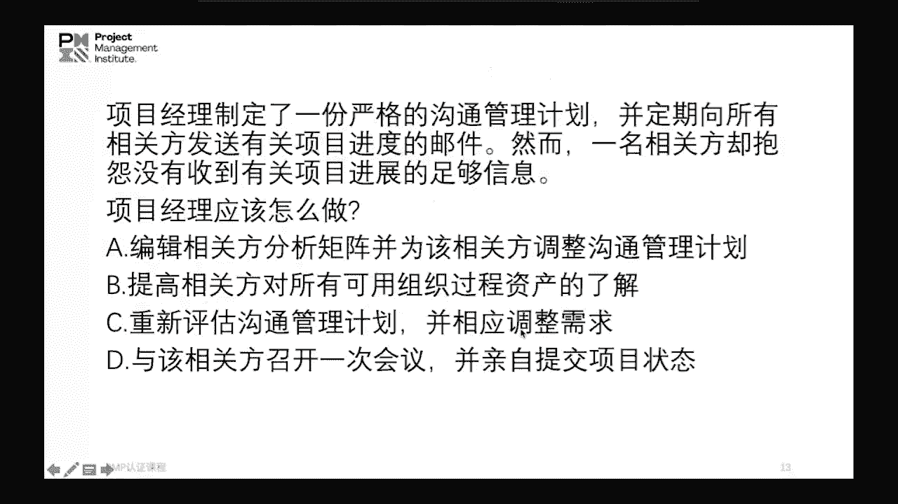

我们来看一下啊，这道题目ABCD大家都有的选啊，那这道题目的正确答案是选C啊，有41%的同学呢是答对了的啊，比刚才要好多了哈，通过上面两道题目的做啊，这个锻炼哈，我们现在正确率稍微提高了一点点了。

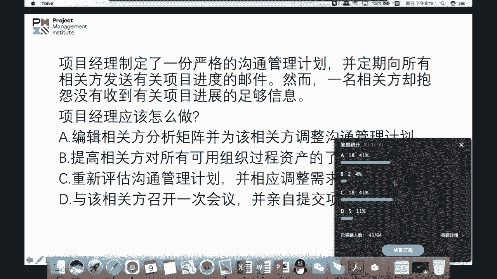

那么我们一起来看一下啊，那这道题目是显然的是吧，是沟通管理地方的问题啊，项目经理制定了一份严格的答案是C，答案是C，那么项目经理制定了一份严格的沟通管理计划，并定期向所有的相关方。

发送有关项目进度的邮件，这个发送这个进度邮件是属于沟通之一啊，沟通有很多的啦，沟通计划里面有大量的其他类型的沟通，其他的对象都有的啊，然而一名相关方抱怨，没有收到有关项目进展的足够信息。

也就是说三官方他期望收到的信息不足，对不对嘛，好项目经理应该怎么做，我们有41%的同学选了A，我们来看A哈，编辑相关方分析矩阵，相关方分析矩阵，这个东西在我们偏P考试里边哈。

PMBOK里边这个是不存在的啊，并未该相关方调整沟通管理计划，这句话后面这句话是可能的啊，是可能的，但是前面这个呢所谓的编辑相关方分析矩阵呢，这个是错误的啊，这个前面半句话是错的，所以A是不能选的。

所以你看如果我们对书了解，对概念了解这些就不会选的，A直接不选嗯，B呢，提高相关方对所有可用组织过程资产的了解，那你看我们题目明明讲的是，相关方的沟通存在问题，那你为什么要去扯组织过程资产呢。

你看选B的同学，你要注意了啊，相关方在讲沟通，你却去选组织过程资产，对不对，题干在讲沟通，你却去选组织过程资产不应该啊，所以呢重新评估沟通管理机关，它是投，对不对，他是计划，这边是相应的反馈，说你不行。

那你做相应的调整不挺好，C比A要好，按是吧，D呢与该相关方召开一次会议，并亲自提交项目状态，这个显然是太个性化了，太个性化了，如果你选D，你就是把它这道题目当做什么呢，是相关方问题，相关方问题来回答了。

而不是站在沟通的这个知识点的角度，来做这道题目，所以这道题目它是有两个角度，你看为什么有些同学会选D呢，你看你就想想想的方向，你是解决相关方的问题，而不是解决沟通的问题啊，所以这个我们在讲课程的时候。

什么是沟通，什么是相关方，也要把它讲清楚啊。

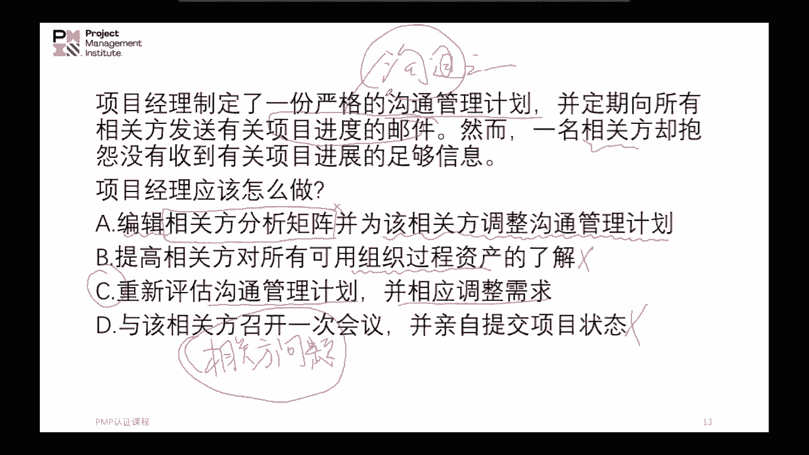

好答案选C，再来。

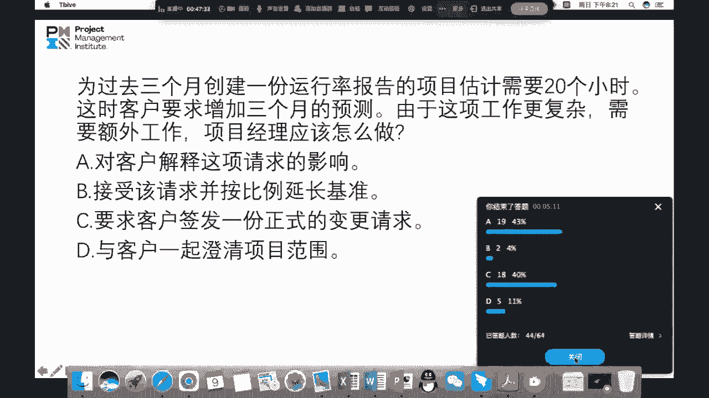

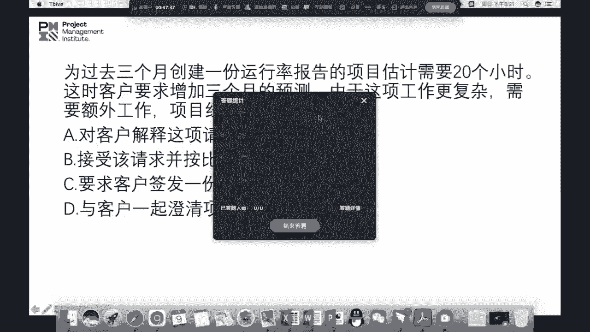

好那这道题目大家答得还不错了啊，有78%的同学呢是答对了啊，咱们这道题目选C啊。

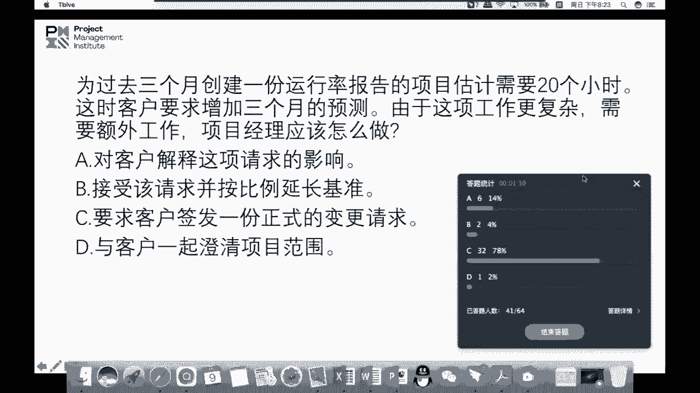

选C，这道题目我们选C啊啊，要求客户签发一份正式的变更请求，你如果是来做过项目，对不对，你要知道这个项目如果有任何变化，对于我们来说意味着什么对吧，所以如果说有任何额外的东西产生的话。

我们肯定要想到这个变更，这个也是我们的常识嘛，对不对，但从PMBOK学习来说的话呢，我们变更是很重要的，变更是一定要考的，而且是权重比较高的考点啊，这个是非常五星级的，可以说五星级的考点啊。

以前咱们如果是按按老考纲，老的考纲来说的话，这个变更题目要考到40道题目的来啊，200道题目40道，现在咱们可至少我得要考我，我认为啊哈从现在新考纲来说的话，变更考20道题目也没问题的啊。

好那么现在这道题目我就不完全去读它了，你看它很清楚的需要额外的工作，是不是项目经理应该怎么做是吧，你要额外的工作，额外的工作在我们项目规划的过程是没有的，那么现在要新的内容要编辑进来的话。

它一定会影响什么呢，首先额外的工作是S就是范围问题，scope是不是我刚才说过了啊，是个范围问题，一旦我们需要做的范围变多，你的T和C是不是都要变多了，这个是时间，这个是成本，是不是就变多了嘛。

所以你一定会要去改变吗，对不对，改变你所向就是你这个项目成功与否的基准，这个叫做基准啊，大家知道一下，这个是重点啊，你这个基准如果要改的话，那当然要走变更了，哪怕你基准不改，你也要走变更，是不是。

我们再来看ABCD，A对客户解释这项请求的影响啊，这个是我们的传统思维唉，为什么对吧，B接受该请求，并安比例延长基准，那这个基准的变化你来负责吗，不一定啊，项目经理负责不了这个基准要CCB项目的负。

这个发起人也都都要通知要要接受的对吧，所以你不能随便接受的，这个是不对的啊是吧，D与客户一起澄清项目范围对吧，他都已经提出来需求工作了，对不对啊，我们就这个从变更的这个程序去走完对吧。

你要签署一份变更请求啊，C非常好的好，再来。

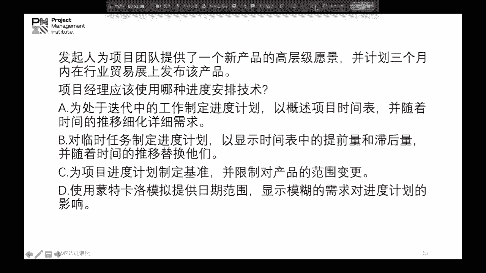

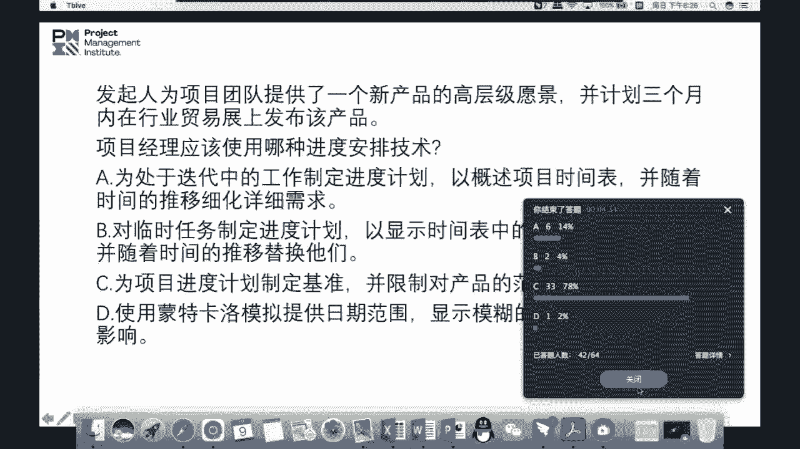

我先练几道题目啊。

这个环节我们最好最后一道题，好这道题目呢大家答的也不错啊，我们现在有35位同学答题了，有71%的同学答对了啊。

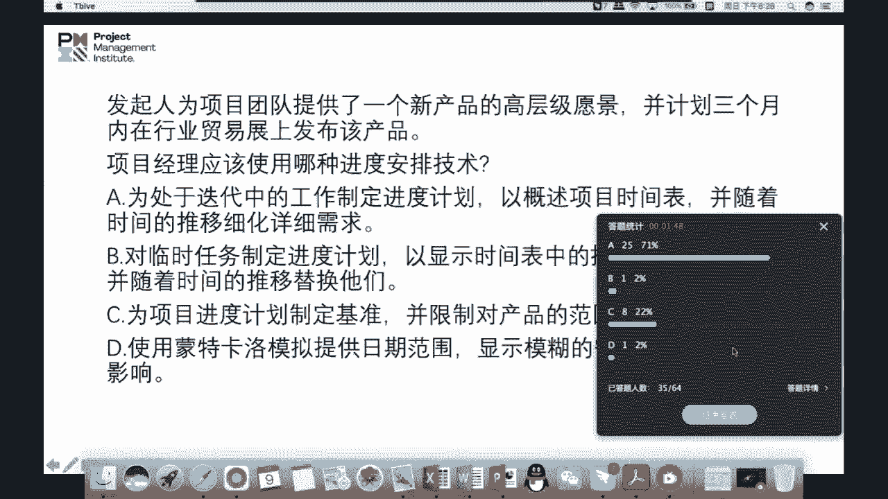

我们这道题目是选A的，选A啊，这道题目我们选A啊，那这道题目是什么，怎么个特点呢，我跟大家讲啊，这道题目你要从敏捷还是预测的，这种方向去思考，首先我们从审题的角度来说哈，发起人为项目团队提供了一个。

新产品的高层级愿景，其实看到这个词，你就大概就应该知道这个是属于敏捷的啊，我们在预测型里面，我们直接讲需求或者是范围不大，讲高层级产品愿景的，所以你看到这个部分来说，这个题目跟敏捷是强相关的。

而并计划三个月内在行业呃，贸易展上发布该产品，对不对好，那么项目经理应该使用哪一种技术来安排啊，他把时间也告诉你了，是不是好，我们来看啊，A未处于迭代中的工作，制定进度计划，以概述项目时间表。

并随着时间的推移，细化详细需求，这个明显就是用迭代开发的这种方式，来逐步完成这个高层级愿景的这种方式啊，进度计划当时当然也是做一个迭代规划，一个迭代，做一个迭代规划，一个迭代，也就是规划的越来越细。

这种方式来逐步完成这个产品的三个月呢，我们做到什么程度呢，我们现在可能是不大清楚的，对不对，我们只有做下去才知道，这个是很敏捷的一种方式，而且他也没有办法在需求的或者是范围的，这个层面上来讲。

这个高层级愿景，它并没有详细细化给你，他没有办法，题干里面没有说我有详细的范围可以给到你，所以这个是敏捷的，完全敏捷了啊，所以A呢看上去还不错是吧，B呢对临时任务制定进度计划，什么叫临时任务啊。

这个这个本身就是错的，以显示时间表中提前量好之后量啊，并随着时间的推移替换，他们这个就说得乱七八糟的这个选项啊，C呢为项目进度计划制定基准，我刚才说到有基准啊，既然这里的愿景不清晰对，就呃愿景是清晰的。

就是产品的具体范围不清晰的话，你这个基准是很难把握的，并限制对产品的范围变更，那你这个就是本末倒置了，既然需求不清晰，你范围还不允许人家变，那你怎么做，这不就是啊本末倒置了啊。

使用蒙特卡罗模拟提供日期范围，这个是风险相关的预测对吧，这个跟我们进度计划它是没有什么直接关联的，所以我们也不选啊，答案选A，所以这个这道题目的话呢，我们实际上讲的是什么了呢，是预测型生命周期呢。

还是敏捷型生命周期呢，如果你能够识别，那么相关的知识点一对应不就显然了吗，啊这道题目虽然它很长，但是答案是显然的，OK好，这个以上呢是我想跟大家分析的，PMP考试的难点，对不对，大家有没有感受得到。

就是这种考点不是单选题或者是多选题，这种嗯简单，大家觉得这种呃对于我们来说，可能多选题难的这种这种这种提醒啊，所以这个难点到底在哪里呢，所以你到底从哪个维度去思考，这种题型对于我们来说是有难度的。

或者我们如何来加强自己的这个能力，来通过这个考试啊，所以真正的难点它要出现了叫情境体啊，情境题啊，所以我为什么说这个这一节哈，接下来我要讲的叫占大部分的情境题，也就是说我们在180道题目里边。

我们要占百没有百分之多少啊，但绝大部分题目都是讲故事的，这个是PMP考试最大的特点，我认为啊，所以大家回忆一下我们刚才说到的那个啊。

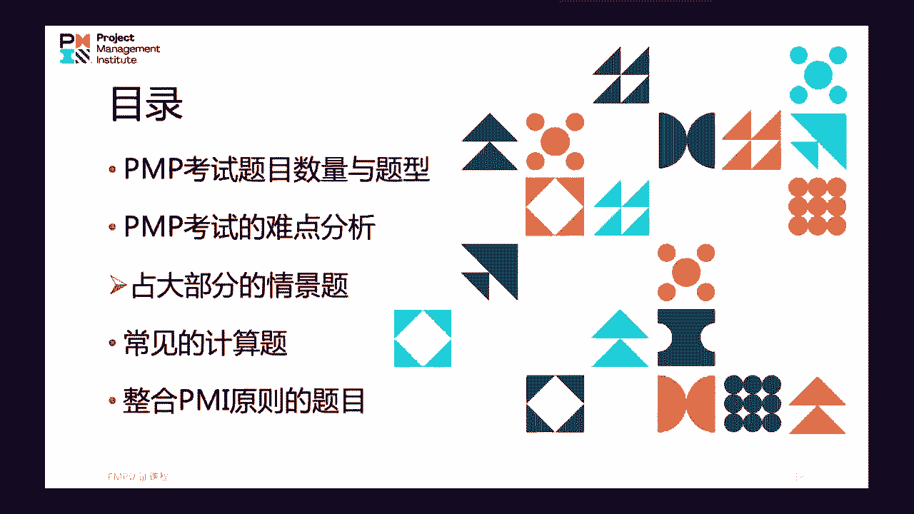

总结一下，大家自己也回忆一下，我们前面一起做的这个六道题目，你是不是感觉在图读一个相对啊，小的案例研究啊，对不对，你这个案例研究被你读完了之后，你得选出来是不是怎么来处理这个所谓的场景，所以这个情景题。

就要求我们对于整个PMBOK的内容，也就从知识点来讲，你得要掌握掌握的越多越好，掌握的越深越好，这是一方面，第二方面呢你还得会用，对不对，也就是说知识点它不是孤立的那个啊，非常枯燥的，这个定义是什么。

作用是什么，而是你要把这个知识点，放到相应的故事里里头去，OK哦我知道了，这个大概是这样这个样子的对吧，你这个讲故事是这么一回事情，所以这个叫做情境体，情境体是什么呢，是小型的案例研究。

假设我们在项目管理过程中的某一种具体场景，问你应该怎么处理的问题，所以我们绝大部分题目是这样的啊，所以呢他强调的是知识与应用的并重啊，这个要我再来强调一下啊，这个地方我们所强调的是知识层面。

pm的知识应用，对不对，病重的啊，甚至还要有合格的价值观才能选对的，这个价值观呢，待会我再来讲到他啊，啊那么看似选项都没有错，要选出一个最合适的，紧跟着这个也是我们PMP考试里边，你要能够去熟悉啊。

接下来慢慢的你就能找到感觉了，那么接下来呢我们再来做四道题目来看一看，对于情境题来说的话，你能不能抓到那个所谓ABCD，我们从单选题的角度来讲，找到那个最合适的，或者你找不到那个绝对答案的时候。

你能不能把它比出来呢，这个就是水平高啊，好我们来看这道题。

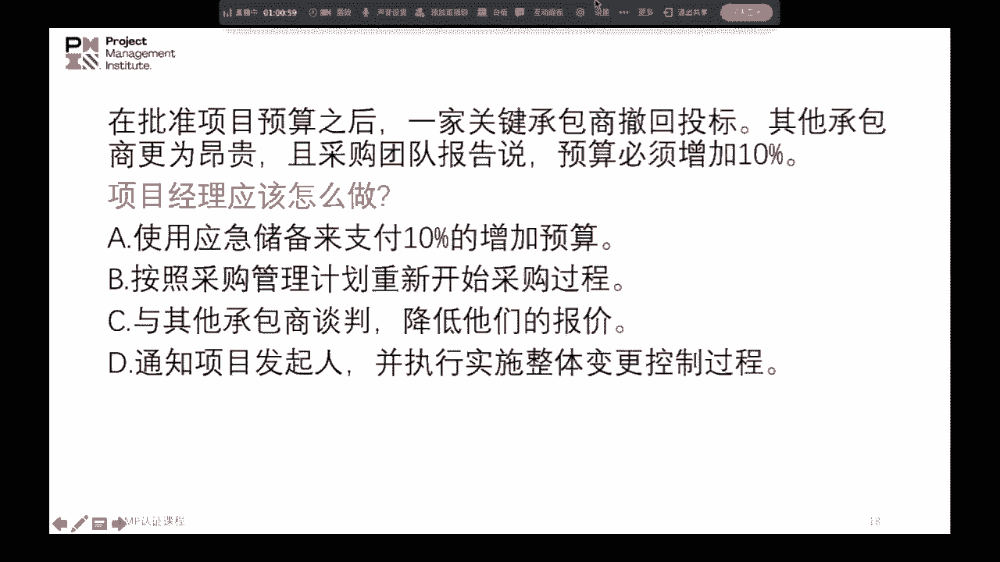

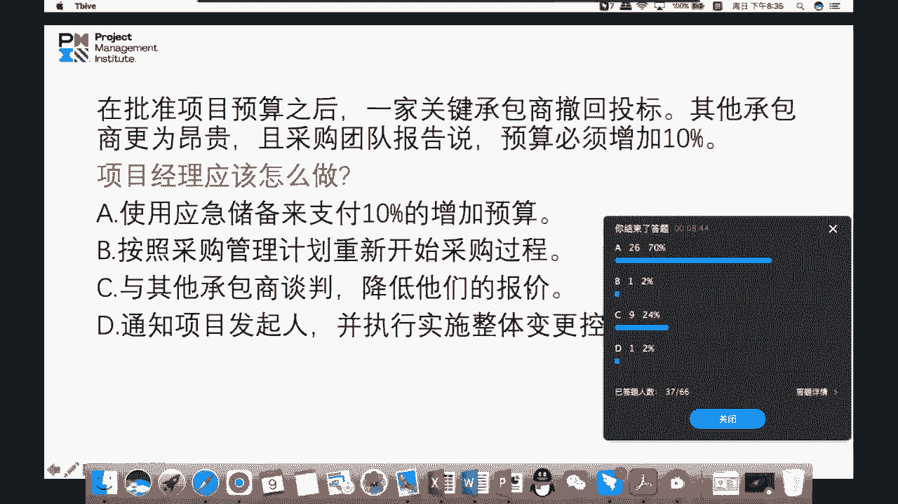

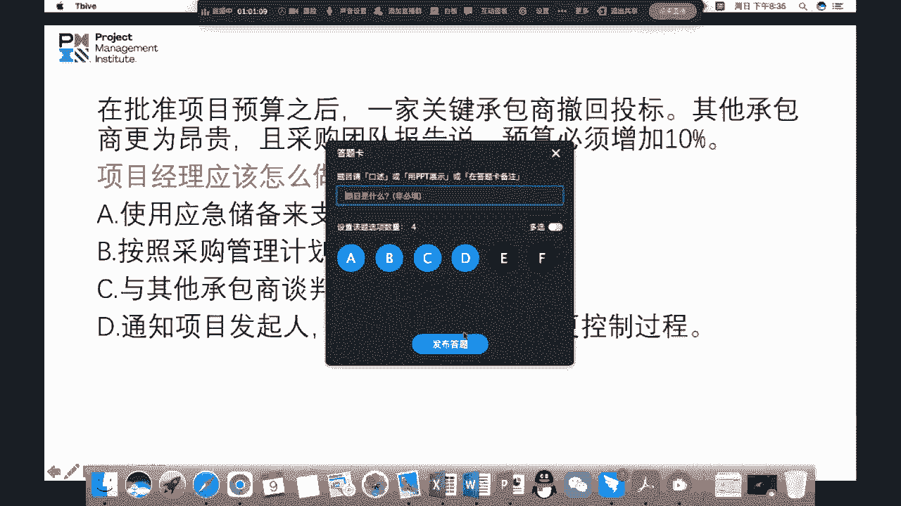

哎没有开选项吗，大家能看到选项吗，现在我看到的是有五位同学已经答题了，现在有六位同学答题了啊，看不到吗，诶那我重新来过啊，稍微等一下。

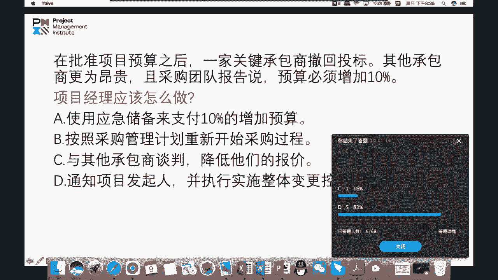

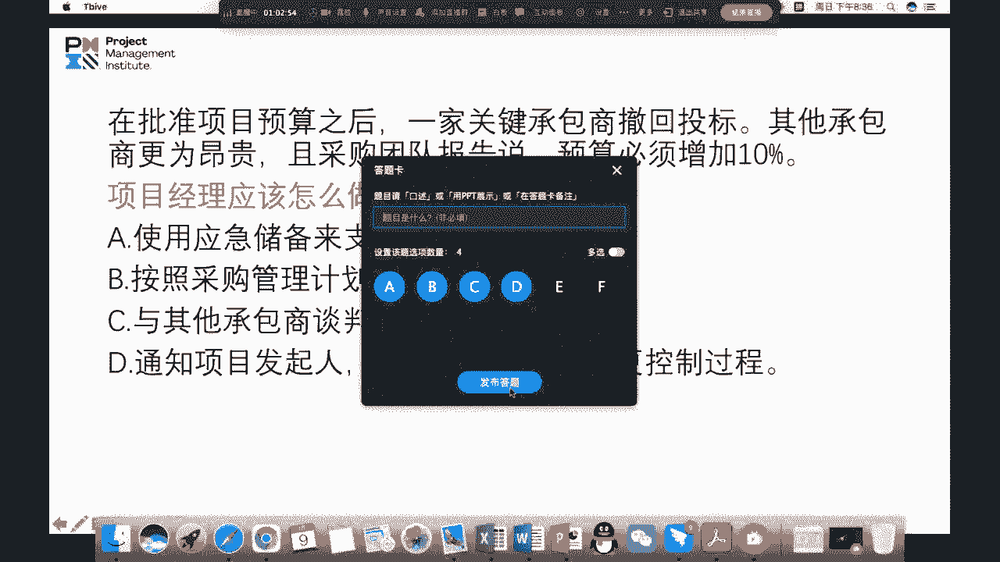

OK那我们到现在有44位同学答题了，我们有十百%分之24的同学答对了，我们这道题目呢选择的是B啊。

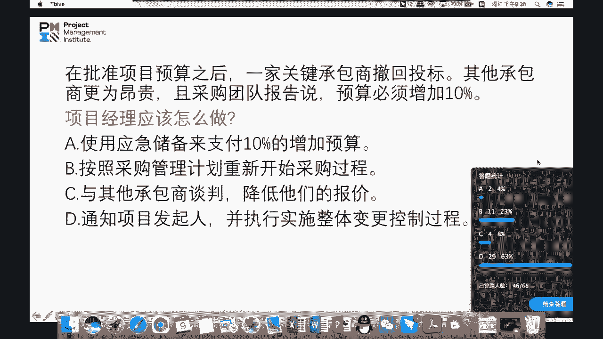

选择的是B，大家来看哈，这个是一个典型的情境体啊，这这个就是我们嗯要说的重点了，对不对，情境题如何，你去能够抓到他考试的要点是什么，让他的知识点啊，他的常识啊，他的一些p mi的一些呃这个惯例呀。

在这儿都有可能对你选项选哪一个选项啊，有影响的，所以我们一起来看一下这道题目啊，这道题目我们选择的是B啊，大家有没有感觉，就是说ABCD这四个选项，我们坐下来都没有错的，那你说哪个题目。

ABCD读下来感觉是完全是错误的，是不是，那么为什么选B呢，对不对，在批准项目预算之前之后啊，之后一家关键的承包商撤回投标没了啊，其他承包商比较贵，而且采购团队说呃，报告说预算必须增加10%。

那么你没有钱怎么办呢对吧，项目经理应该怎么做，A使用应急储备来支付10%的增加预算啊，那么你说10%增加预算，用应急储备来啊，合不合理呢也有可能吧，是不是，但是应急储备它是针对风险的。

你这个属不属于风险呢，是不是啊啊不一定是风险啊，所以应急储备的钱，他是有相应的风险才能去用的，你如果这里不是相关的风险，你就不能用，对不对，所以A呢不是特别好的啊，不是特别好。

B呢按照采购管理计划重新开始采购过程，唉既然你现在有一家撤回了，我现在重新开始这个过程，重新再选择一个合适的，我不一定马上给你加钱是吧，B也是比较合理的做法，我啊你说加钱我就要加钱，对不对。

提问题干里面没有告诉我们，没有绝对的约束条件，说我必须要加这个钱是吧，C呢与其他承包商谈判，降低他们的报价，这个也不合理的，对人家承包商已经投标了，价格已经上来了，他说你你现在要降价，你就降价。

没有理由啊，这个也没有足够的理由啊，啊通知项目发起人，并执行实施整体变更控制过程，我们现在如果要增加预算，如果这个预算啊确实一定要增加的，我们是可以去呃，通过整体变更控制过程来进行变更的。

但是呢你要通知这个干系相关方的啊，这个发起人干什么呢，这个发起人是不需要去去那个呃打扰的嘛，你只要去提出来，有相关的CCB来为你负责就行了啊，Change control board，变更控制委员会嘛。

他对我们的基准人负责的，所以ABCD啊，除了D是明显的错误以外，C好像也没有太大错误，A呢好像也有点道理，是不是B呢是相对根据程序来讲，我们是最合理的，所以你看从情境的角度来说。

你ABCD里边哈项目经理应该怎么做，这个问号来说的话，你到底哪个更合适啊是吧，所以ABCD你要去比较，没有可能说一眼就看出来，你说啊又是B绝对是B，对不对。

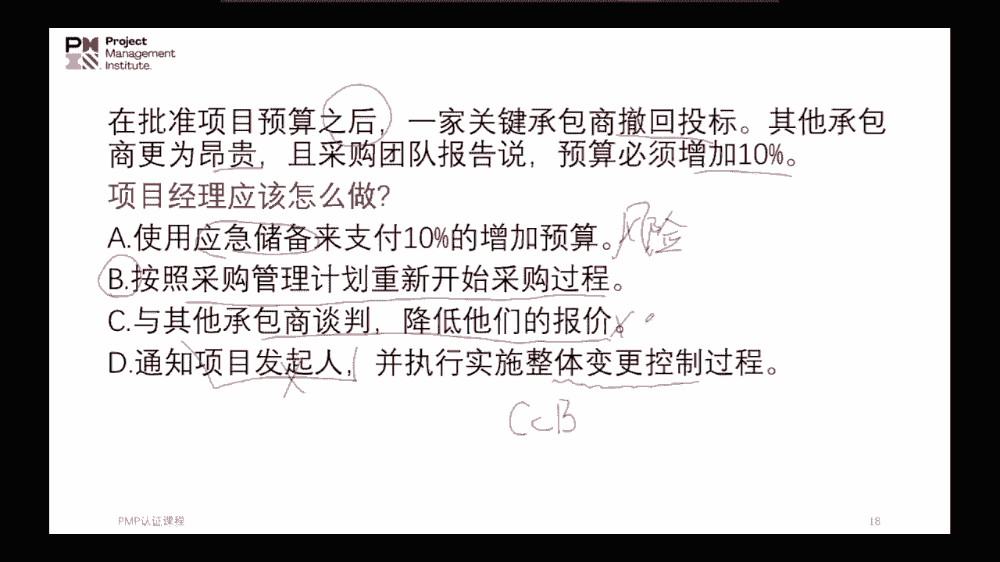

好，我们再来。

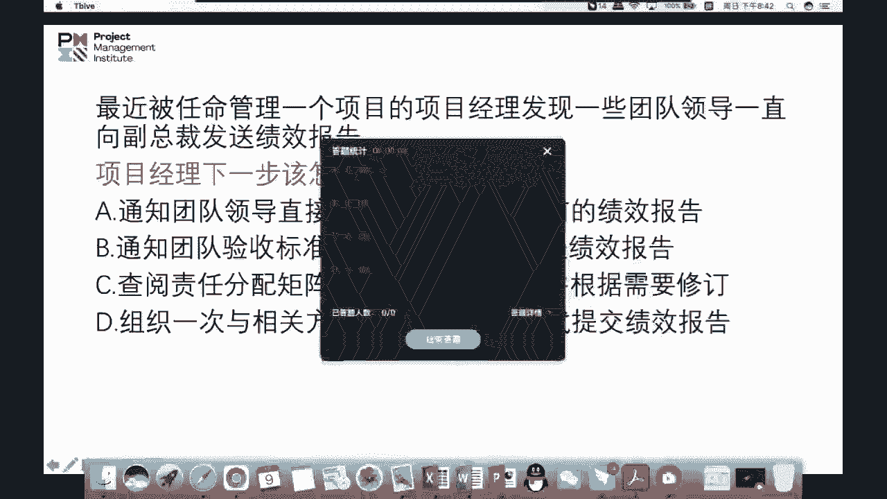

好，那这道题目。

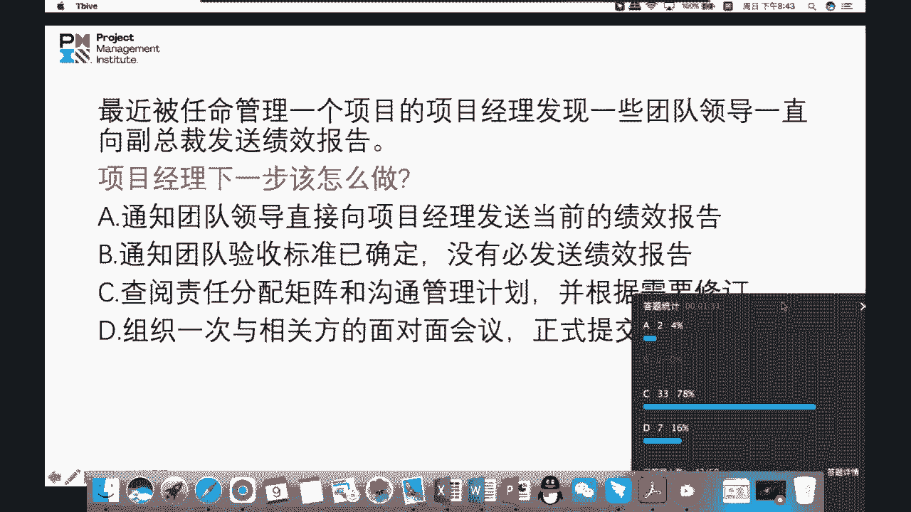

我们有78%的同学答对了啊，恭喜大家好，我们一起来看这道题目啊，最近被任命管理一个项目的项目经理，发现一些团队领导，一直向副总裁发送绩效报告啊，那么项目经理下一步应该怎么做。

这个题干告诉我们一个潜台词是什么，这个项目经理发现了这个现象是对的还是错的，首先这个肯定是不完整，不不完全正确的，段向副总裁发送绩效报告，很有可能是项目经理自己的事情，或者是有其他相关的代言的。

不应该是怎么一些相关的团队的领导，在做这样的事情，所以这是个问题啊，是不是啊，好那么我们来看选项啊，这道题目我刚才说到的，我是啊，我没告诉大家是选C的啊，好那么我们来看A通支团队领导。

直接向项目经理发送当前的绩效报告，那么这个当然你觉得是对的，也没问题啊，那么你下一步就通知他们，你进来竟然是出了这个问题，你就解决这个问题啊，但是这个还不够高大上，这个在PMP考试里面，这个选项是错的。

为什么呢，因为如果我们下一步要怎么做的话，我们要从这个问题出发去解决这个问题，并以后不再发生，以后不要再发生了，那你通知相关他它就不发生了，不可能的，你只要从规则的角度，从流程的角度去思考啊。

好B呢通知团队验收标准已确定，没有必要发送绩效报告，这个更加错的，你直接就把现在的绩效报告的这个规则，全部改掉了，对不对，这个而且B和这个题目它是不完全相关的对吧，现在只是一个信息的传递问题。

现在变成验收标准什么什么的，这些都是一些嗯在题干里边不存在的啊，这个错了，C呢查阅责任分配矩阵和沟通管理计划，并根据需要修订，这个有道理了，责任分配举证是人的这个职责问题，这个是职责啊问题。

那么沟通管理计划是信息的传递问题啊，有必要修订，咱们就去修订，没必要修订，咱们就比如说A接下来我们就通知下台以后，你就这样做，对不对，你就怎么做，所以首先我们要去看它影响的程度有什么。

首先你得要去跟标准去比较，这个就是我们PMP考试里面，非常特殊的地方了啊，大家注意啊，你看这是一个沟通一个信息流动的问题，那么如果有问题，首先我们要找标准，如果标准有问题，我们就要做修订。

C就是标准答案D呢，组织一次与相关方面对面会议，正式提交绩效报告对吧，这道题目是不是跟我之前上前面那个说的一样，这个是你把它当做是相关方问题了是吧，你把它当做相关方问题，而不是沟通问题。

而是对是一个沟通问题的，对不对，所以D我们也是不选的啊，所以你看这种所谓的题目啊，这个知识点是很混的对吧，从这个讲故事的角度来讲，你到底讲人呢讲是呢，还是讲相关的规则呢，你得要你搞得清楚的。

这个才是真正的难点，OK所以这样的题目是非常典型的，PMP考试的题目啊，好我们再来啊。

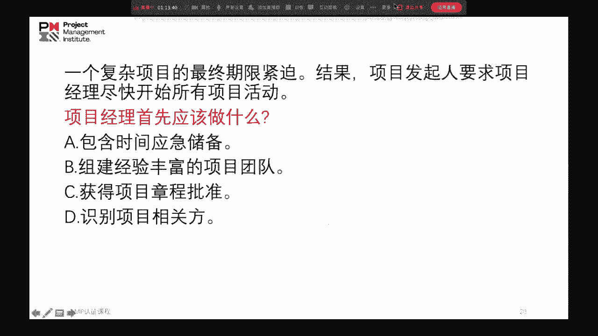

这个环节我们最后一道题目，好再一次啊，我们同学们找到感觉了啊，我们有78%的同学啊，答对了这道题目好。

我们一起来看，这道题目我们选择的是C啊，获取项目章程的批准，首先应该做什么，这个就是有时间观念的啊，一个复杂项目的最终期限很紧迫，这句话有没有读懂啊，所谓也就是时间紧嘛，这个项目时间紧张嘛对吧，结果呢。

项目发起人要求项目经理，尽快开始所有的项目活动，那么尽快开始，从我们日常工作的角度来说，哇，领导叫我干活，那我就赶紧去干，表现一下，对不对，那么这不就好了吗，是不是，那么项目经理首先应该做什么呢。

A包含时间应急储备啊，包含时间应急储备，我们从风险的角度来讲，我们有大量风险，我们要有储备，对不对，时间要增加，这个是OK的，但这里面并没有说是时间有啊，我们项目过程中有大量的风险存在，不没有啊。

组建经验丰富的项目团队，这个有点含糊，对不对，组建经验丰富的团队就能解决时间期限问题吗，他这个时间期限问题一定是人的问题吗，不知道对不对，C呢获取项目章程批准，可以的，获取项目章程批准。

就意味着项目的开始，哎如果你翻过书了的话，你应该知道项目章程的批准，就意味着项目经理被寿命应用，使用组织的资源去完成项目的活动啊，所以尽快开始，你没有行政上的命令决定是不能开始的。

这个是我们从预测的角度来的对吧，这个PMBOK我们最最基本的规则吗，这是尽快开始，无论你尽快还是马上开始，都是要取得项目章程的批准，所以这些词对你来说造成了一些困扰的啊，D呢识别项目相关方啊。

这个是错的，所以我们选C这道题目啊，首先应该做什么，这里边我们有一个时间啊，有一个逻辑在背后的啊，好，K还有个题啊。

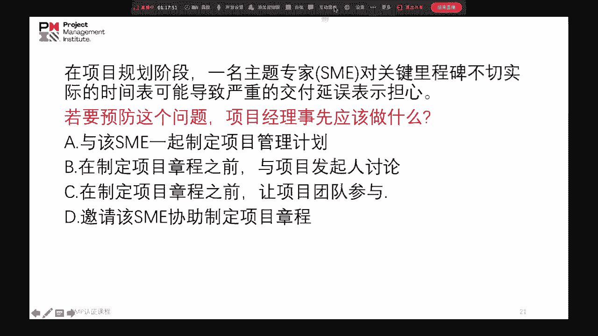

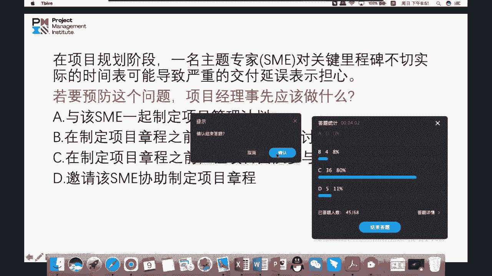

啊这个是应该这个是最后一题啊。

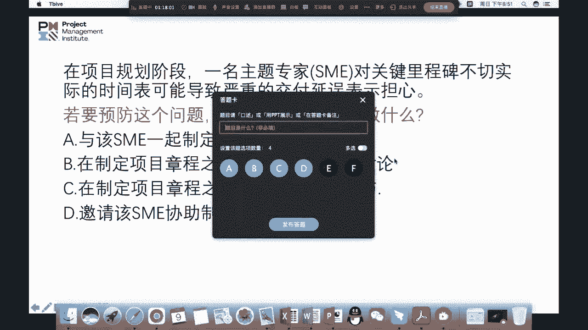

啊这道题目大家选的就有点让我揪心了哈，就是大家的选项ABCD呢大家都有的选啊，那我这边给的正确答案是A啊。

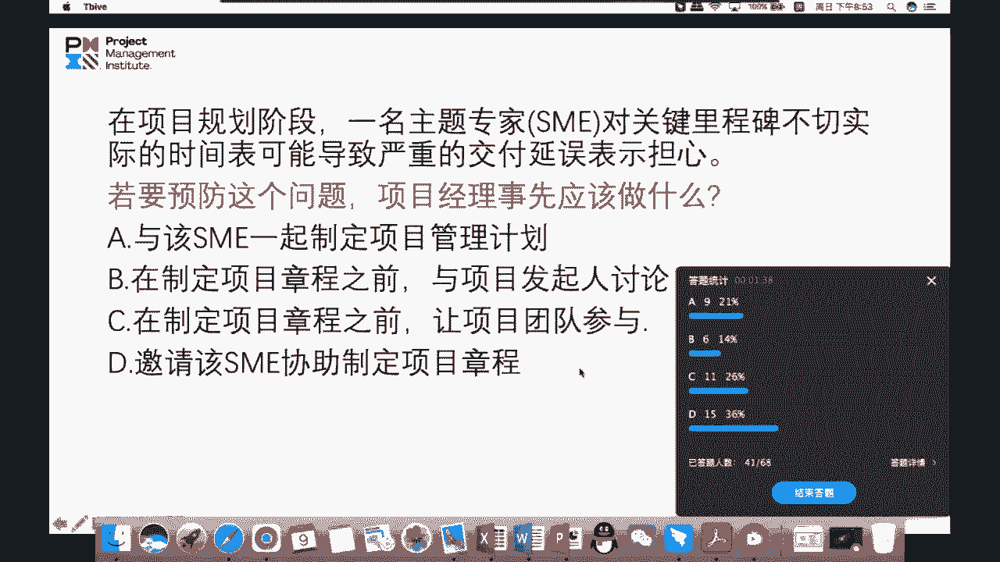

A但有21%的同学呢是答对了的啊，选A啊，好那我们一起看一下这道题目，在项目规划阶段，一名主题专家，在对关键里程碑不切实际的时间表，可能导致严重的交付延期表示担心，好表示担心，那么若要防止这个问题呢。

项目经理事先应该做什么，他表示担心是不是一定发生呢，是不了解的问题啊，都不了解啊，所以这个相关方这个所谓的这个主题专家哈，在这个规划阶段来说，规划阶段这个是一个时间，那么这个主题专家呢他在担心什么东西。

那我们要防止这个问题呢，你事先应该做什么呢，你题目有没有看清楚啊，事先应该做什么，A与该主题专家一起制定项目管理计划，规划阶段嘛，就是做这个项目管理计划的呀，让这个主题专家参与进来，那他就不会担心了嘛。

这个A还蛮蛮好的啊，B呢在制定项目章程之前与项目发起人讨论，这肯定是不对的，那么这个相关方和这个项目发起人之间，有没有任何关系，你怎么把项目发起人给扯进来了，在C在制定项目章程之前，让项目团队参与。

跟这个主题专家也没有关系，是不是，B和C肯定不会去选，D邀请该主题专家协助制定项目章程，也是时间观念，是错的，项目章程在哪里，启动阶段，我们现在讲的是规划阶段，怎么能去选启动阶段相关的内容呢。

所以D1定是错的，所以这道题目不显然是选A的吗，是不是啊啊啊，OK情境题大家感受了啊，我们刚才一起做了啊，前后我们总共做了11道题目了，大家有没有什么感受，对不对，这个情境题还是让我们觉得有点为难的。

左右为难的是吧，对知识点的不理解，对知识点与知识点之间的关联性逻辑关系对吧，不了解我们很难下手对吧，再加上pp考试里边的一些基本的原理原则啊，大家不了解的话是不行的，所以我再次强调啊。

我们PMP考试不是简单的单选题和多选题的，这个问题啊，大家一直在强调多选题有多难，多选题告诉你有多少个选项，同时三个选项四个选项啊都要答对才能算对啊，刚才有个同学问了，我做一个回答啊。

那么现在我再往下讲，就是一一些呃小的门类了，主要是情境题，情境题是一个核心，大家一定要掌握好，接下来我就说常见的计算题，常见的计算题呢内容呢我给大家罗列在这里，对不对，这些都是跟知识点相关的啊。

那么这这些知识点，你看进度管理里边的关键路径，进度压缩可以考这个计算题的估算的技术，无论是成本还是进度的估算技术，主要是三点估算，增值管理是吧，沟通的渠道啊，风险管理里边的决策树概率啊。

有多少概率有多少影响程度都是可以考的，那么采购管理过程中的一些不同，合同类型的价格计算，自制或者是外购的分析的这个决策是吧，项目的选择的财务指标是NPV净现值，内部收益率I22，投资回报率。

ROI效益成本比BCR回收期PVP等等，这些都是可以用在计算题里边的知识点啊，那么记知识点呢，大家那这些知识点呢啊真正有难度的，我跟大家说一下，就是一个增值是有难度的啊，三点估算也是有难度的。

其他都不难得啊，其他都不是很难，相对还是比较简单的啊，相对情境题来讲的话，我觉得计算题我们是不应该丢分的啊，好接下来呢简单说两道题目就行，那这道题目呢嗯，我我来想一想啊，这就不给大家做了。

因为这道题目涉及到公式的这些公式，我们大家还没有学过呢，所以呢我就直接讲了啊，这道题目是首先它是一个什么题目呢，它是EDM的题目是增值管理或者叫EV呃，这个A也可以啊，就增值分析这个叫增值管理啊。

那么考点，那这个考点呢你想啊他告诉你CPI成本绩效指数，CPI是1。08，你要够大于一，CPI大于一就说明它是表现优异的，那么项目表现如何呢，表现优异，这个C和D肯定不选了啊。

那么这里边这里边还有一个政策啊，运行成本到目前为止是8万美元，公司发布一项政策，对于每个报告周期四赤字啊，盈余两个方向正的负的都应该控制在5000以内，那么现在项目怎么样呢。

这个预算赤字就是CVCV呢有公式的啊，就是EV增值减去AC啊，那这个CPI呢又等于是不是AEV除以AC，那这个值是1。08，那么运行的成本是8万，也就是AC是8万，那么我们就可以把CEB算出来。

EB算出来之后，你看AC我们本来就知道的，CV不就可以求出来了吗，最后求出来的结果是大于，应该是我记得是6500，结果是，所以呢并不符合财务要求，当然是A啊，当然是A，所以这个就是计算题啊，答案是B啊。

这个是并符合对哈，并超，但超出了财务要求啊，答案是B，答案是B，好那这还有一道题目啊，计算题这个都涉及到公式的啊，这道题目也是很简单的，上面那道题目是比较难的，增值管理里边的题目啊。

一份沟通管理计划中包含七名项目相关方，七名是关键关键词啊，西明，项目相关方在项目实施过程中，还增加了三名相关方，然后那么增加了多少个沟通渠道呢，这个所谓的沟通渠道它有一个公式的，这个沟通渠道等于多少呢。

对不对，等于N乘以括号，N减一括号除以二就行了，这个N呢就代表着相关方的数量啊，那么也就是说二分之7×7减啊，然后呢二分之多少十，对不对，7+3吧，乘以10-1不就有了吗，这个是21，这个是20呃。

这个是45对吧，45这两个数字一减等于24，答案是他说是多了多少，增加了多少，所以他这个答案就变成C了，两个数字一减就好了，所以你看如果你这个公式知道的话，这个题目是相当简单的，非常简单。

OK这是计算题啊，好最后一部分，我们再来说一下整合p mi原则的题目，那么什么是PMI原则呢，大家来看一下我们PMBOK1打开来说的话，就讲到这个东西叫做什么啊，叫做p mi道德与专业行为规范啊。

这个呢也是比较特殊的，在咱们学PMP这些知识点的同时，我们还要学一个价值观对吧，这个就是我刚才说的，你甚至要知道价值观，你才能够选对正确答案啊，责任尊重啊，公正诚实。

这个就是我们最最基本的项目管理行业里边的，一个道德与专业行为规范，那么同时呢pm我们也说了哈，遵守该规范是项目经理的基本要求，也是PMI的考试之一啊，要求之一，那PMI的这些原则，比如说责任尊重。

公正诚实，不会直接考你的，也不会简单的考，你说这个道德相关的怎么样，法规相关的怎么样，他都是刚刚才我说的，那个情境部分是关联起来的，所以它以形它的形式是指什么呢，是你用我们的啊。

情境体的方式来给到大家这样子的诶，你p mi的责任，尊重公正诚实，你是不是掌握了的啊，大家来看一下这道题。

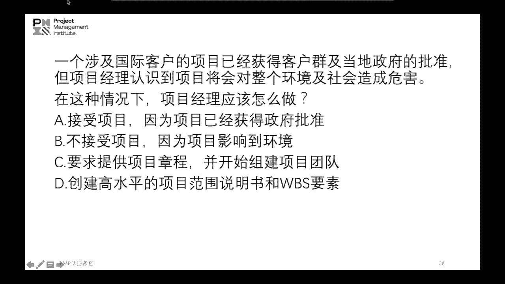

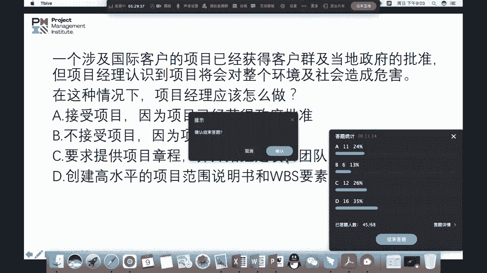

我相信这个肯定没有选错的啊。

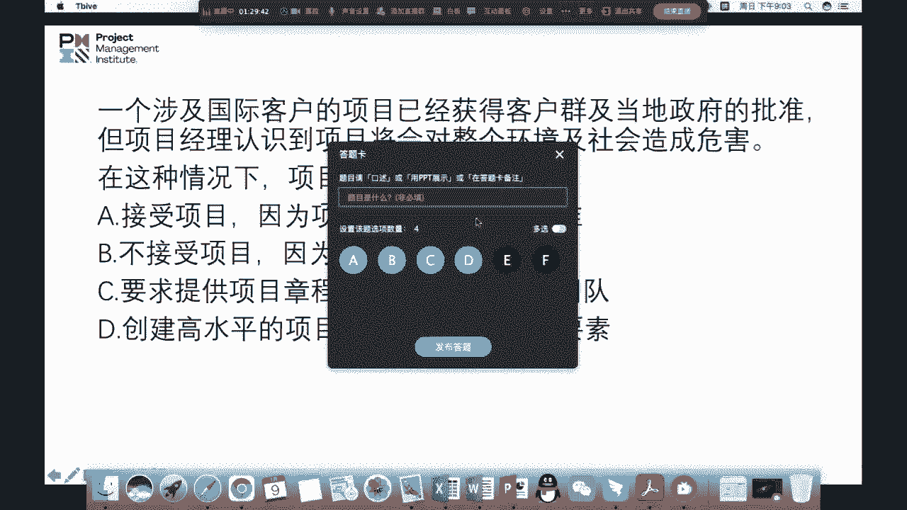

如果你选错了，我就找你了，好，这道题目，我们有85%的同学是这个都答对了啊，我们有41位同学答答答题了。

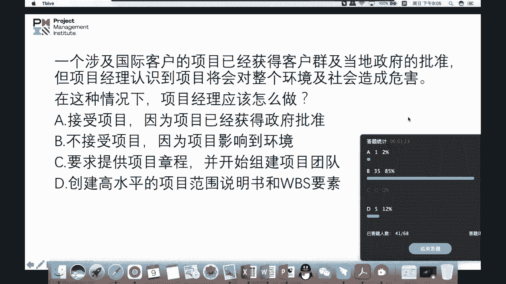

我们的选项选择的是B啊，B不接受项目啊，刚才我们在讲到的是吧，责任尊重，是不是我们对于环境有影响的这些项目啊，我们是不接受的啊，政府批准了，有一个同学说接受项目，因为项目已经获得了政府的批准。

但是从责任担当的角度来讲，我们是不接受的啊，虽然政府已经批准了，所以A我们是不选，那么D呢，有一位有四位同学选了，创建高水平的项目范围说明书和WBS1要素，它能够解决这个环境问题吗，你们觉得能解决吗。

你甚至你自己都不清楚，范围说明书和WBS是什么，你怎么知道能够解决呢，是不是啊，这是一道题目，好我们再来看再看一道题目。

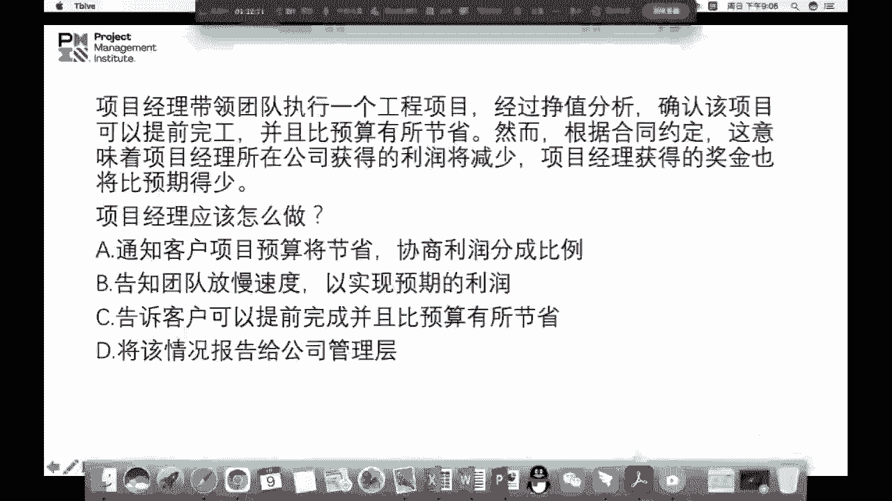

好，我们有75%的同学选C是正确答案啊，啊有有有同学选A哈，通知客户预算将节省协商利润分成比例，这个呢你大家想一想，就是从事实角度来讲，就是节省了吧，那你干嘛非得要去协商利润分成的问题呢。

那从诚实政治来讲，你的合同里面没有这个东西的，对不对，所以A呢他没有C那么好的，C呢是靠客告诉客户，直接告告诉客户啊，我们可以提前完成并节约这个预算，这不挺好吗，B呢将该情况报告给公司管理层对吧。

现在是项目经理报告管理层，让他们来做决定吗，不需要啊，对我们整体的项目环境应该是诚实和政治的，对不对，那如果管理层让你去做做B呢，做A呢，对不对，那还不还得要回到C的吗，是不是。

所以这道题目建议大家要去选C的，OK好，那这个呢是从诚实政治的角度去考量的好，OK这道题目就到这里。

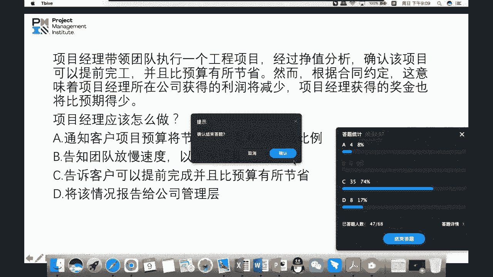

好的，那么今天我要跟大家说的那个题目呢，讲的差不多了啊，那最后呢总结一下啊，所以我们从PMP考试的题型来说，大家所熟知道单选题啊，或者现在大家担心的这个所谓的多选题啊，都不是问题，OK好真正大家要去看。

真正要去关心的问题是内容本身的问题啊，所以PMP考试的难点是在于，它的知识面很广是吧，PM的内容相对比较多，呃，你有没有认真的去看书，认真的去比较认真的去做题了，去回顾，这才是重点好。

所以呢pp考试评估的形式呢跟大家说一下啊，人员过程，业务环境的上一次我们已经讲过了，如果你在这三个维度都考的很好的话呢，大家可以看到这个右边的这张图啊，就是说你会得到一个结果啊。

performance就是pass啊，你people process business environment3，现在最高分是3A吗，三个A嘛啊，希望大家都能够考出非常好的成绩啊。

这个就是呃考试的评估的形式跟大家说一下好，那么PP学习机语呢我就不跟大家再去啰嗦了，我每一次课程都会放映这个PPT，让大家去回顾它，对不对啊，偏僻逻辑，刚才题目里边我们已经慢慢的说到了，直播课程。

我们做了十多道题目啊，错题分析，你回过头来看这个视频的时候，你对于这个题目的理解，对于这个知识点怎么去掌握，有数了对吧，团体学习你的知识面是不够的，你个人的知识面是不够的。

学习的过程中互相帮助是有帮助的。

是有好处的，好吧好，那我们今天的课程内容呢全部讲完了啊。

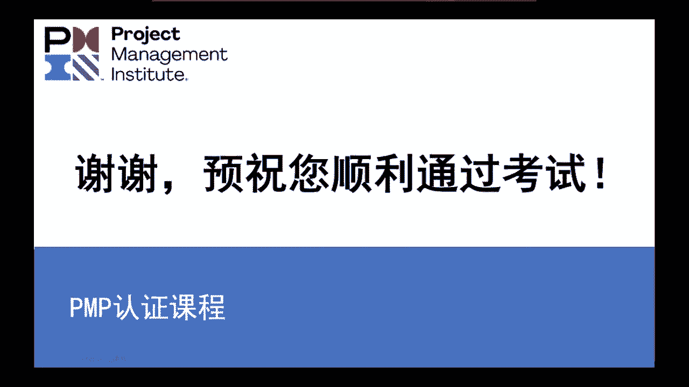

我来看看大家有没有什么问题。

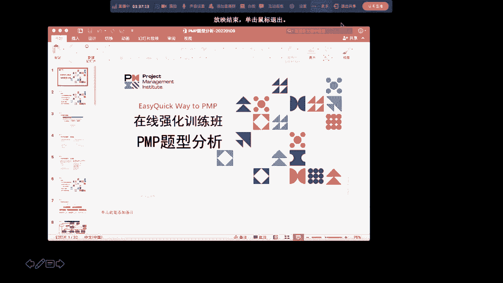

多选题是要要三，就是选项都答对才得分的啊，选错了就没了，但是他告诉你多少个选项了吧，好还有3分钟，我到9。1刻结束直播啊，大家看看有没有什么问题，过年期间需要准备什么，大家过年期间就看书吧。

看书看回顾这些视频，完了之后，如果你们已经拿到50道题目的话，那就继续做，还有一部分同学呢呃这两天我呃，我会安排发给你们50道题目做做练习啊，呃这些题目的答案是和实际处理，是有一些区别的啊，有区别的。

这个要符合PMBOK，它这这个里面所讲到的这个逻辑关系啊，不是我们跟实际过程中去比较，因为从实际的角度来讲，每一个同学所面临的处境是不一样的，他的环境不一样，那么标准答案也就没有了，对不对，错了好多啊。

这是正常的啊，错题要不要背，不是错题去背，你得去理解它，你要理解他，对不对，不是背我，我说的这个回顾啊，是请大家错了题目去回顾书本上的内容，去对应到它，如果说一个很复杂的情境题的话。

你要去分析它这里边所涉及到的知识点有哪些，对吧，甚至你要跟同学之间去商量沟通，甚至要跟我这边来来沟通一下，你才能够完全搞懂他啊，呃不是中国local的逻辑是肯定的，因为pm bok这本书是外国人编的嘛。

对不对，是美国人编的嘛，那pm洛克既然是美国人编的，他肯定是代表美国的那个工作的呃，逻辑习惯的啊，当然嗯，这个有绝大部分的还是符合我们的常识的啊，呃题中出现的是必考概念知识点吗。

我所列出来的肯定是绝大部分要考的，都是要考的，这些知识点都很重要，但是不是全部，我只是呃罗列了一些知识点很多啊，我们在接下来在年后的课程里面都要讲的吧，本周六开课，第一天的话，直播班的同学可以忽略啊。

这是面授班的一个信息啊，呃第七版不用看啊，第七版还没中文版，第七版pm和七版中文版还没有发布呢，现在大家请参考第六版书，大家应该都拿到了啊，好的，那么我们今天的直播就到这里了啊，提前祝大家新年快乐啊。

