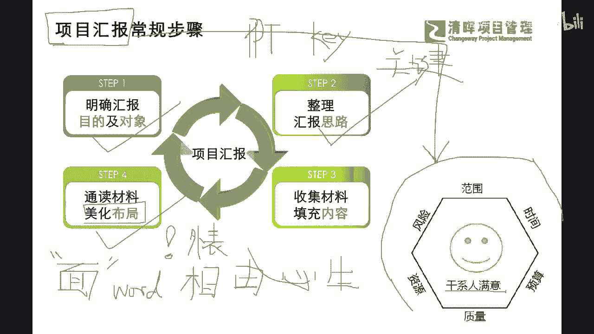
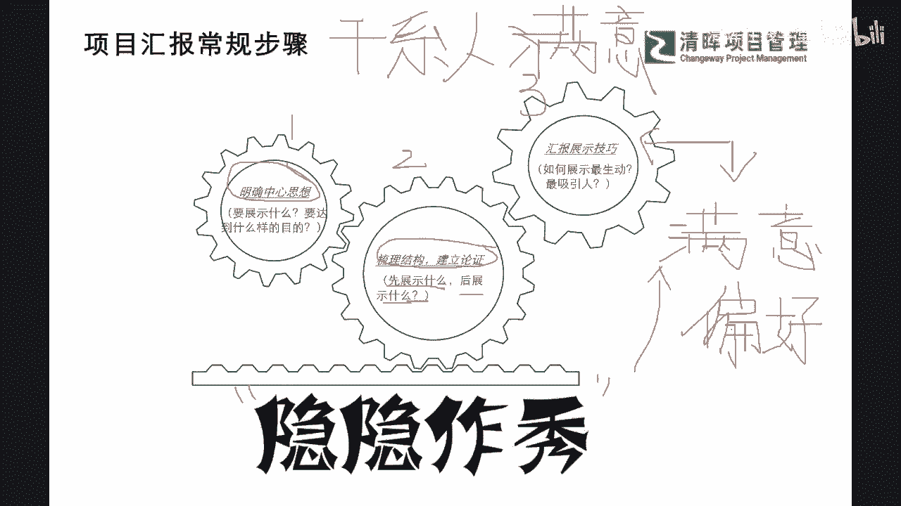
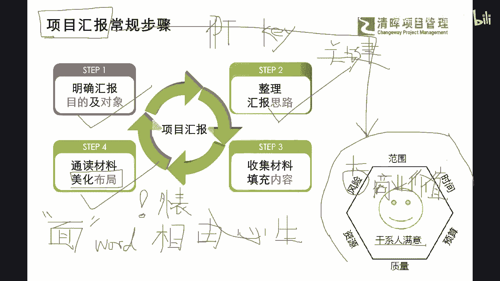
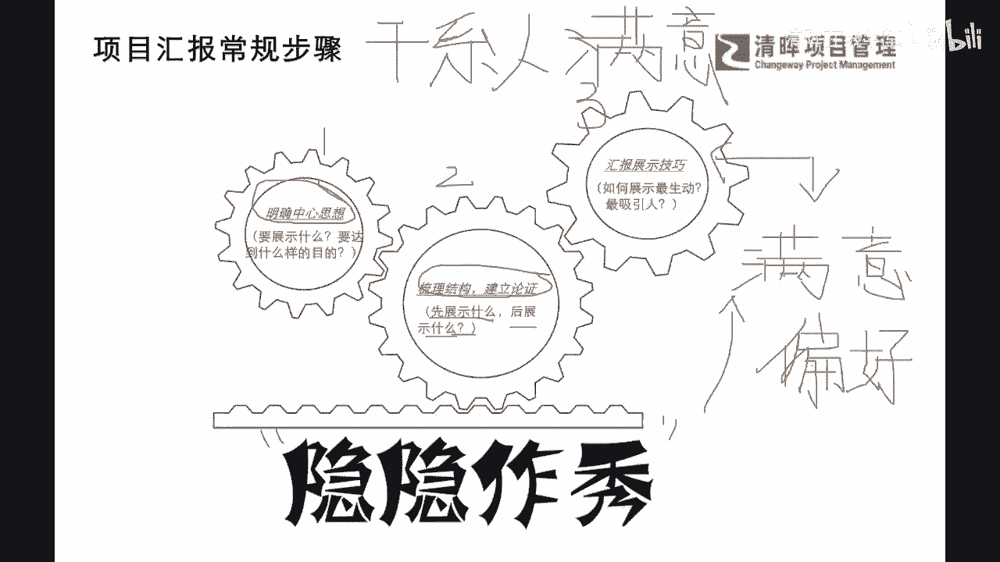

# PM干货丨项目汇报的常规步骤 - P1 - 清晖在线学堂 - BV1nz4y1N7pL

出来呢，那我们通常在项目汇报的这个过程当中，我们平时做汇报的时候，同同学们可以想想反思一下啊，我们平时做汇报，或者我们团队成员在做汇报的时候，大家都是什么样的思路在搞啊，比如说比较常规的是干什么啊。

我们先了解一下诶，我们这个需要给谁去汇报啊对吧，给哪一位这个主管去汇报，那么他的一个目标是干什么，比如说是让他了解项目的一些状况，还是要向他去汇报我们项目的问题，怎么解决是吧。

以及项目我们团呃汇报我们的团队的成绩是吧，明确我们的汇报目的和对象，这个永远是非常非常这个常规的第一步是吧，那么还有第二步干什么呢，就是我们要去整理了，收资料了啊，来去把我们的汇报思路进行一个啊。

整理和收集是吧，来去确定我们到底应该怎么讲，讲些什么，那同步呢，第三步我们就开始去填充内容了，就是不仅仅要整理思路，我们更要就像我们通常所讲的，画人先画骨一样是吧，我们肯定画所有的东西，像画素描一样。

我们一定是先把人啊这个框架把它画出来，再去往里面填什么这种毛细血管是吧，所以千万不要把第二步和第三步这样搞混了，我也相信大部分，甚至啊，99%的这样的一个，做过项目经理的同学，应该是非常非常清晰的是吧。

一定是抓大的一个要求和思路，然后再去找相应的材料是吧，那同样有了这样的步骤之外呢，我们还可以看到我们的另外一个要求，叫做美化布局好，我想问一下大家啊，看看大家的这个想法是不是跟严老师一致啊。

认为我们的汇报的PPT需要做的美观，才能赢得更好的一个认可的，同学来在评论区扣个扣个零吧，这次是吧，我们一和二都扣过来扣个零，你觉得PPT的技巧重不重要，去写一个非常漂亮的PPT重不重要。

认为重要的扣个零啊，来非常好啊，大圣同学，简洁点啊，好我们已经非常简洁了，所以我们尽可能用话糙，理不糙啊，我们来讲一些这种比较平常像唠嗑一样的话啊，所以我们没有那么理论啊，所以也请大家跟上啊，非常好。

谢谢大家的一个参与，那么我看到这个很多同学都知道，这个是非常非常重要，那么为啥重要，我我给大家举个例子啊，其实这个这个部分更像是一个什么，我们今天是画画画出来一个人，就像我们今天见了一个职业经理人一样。

是不是我们建了一个职业经理人，你认为你一眼瞧过去就觉得他非常专业，觉得他非常的具有这样的一些权威性，你是不是要看他的外表呀，就是我们通常来讲啊，我们虽然不是以貌取人吧是吧。

但是我们通常还会中国人讲的话啊，你仔细琢磨非常非常有意思啊，各位同学，我们中国古画第一句话叫做不能以貌取人，是不是啊啊我们要看重视心灵是吧，重视内在是吧，这是我们老祖宗讲过的话，那么还有一句话叫什么。

还有一句话叫什么，就是我们干什么，我们人的这样一个相由心生，听过这个哈哈哈哈哈，听过吧啊我们的就是给人看相声一样是吧，相由心生，这个也看过了是吧，所以大家知道相由心生的这个概念之后。

我们其实在以前的这个这个啊，这个时候呢，其实我们为什么有那么多看相的先生是吧，啊算命的就看你面相就知道哎您这个天庭饱满，地阁方圆，是不是啊，那我们看着两个看起来有点矛盾的话，就是是吧，非常好啊。

海军同学帮我总结了就是人不可貌，相和相由心生，你不觉得他是有点矛盾吗，就是我们既然不能看外表啊，不能重视这些什么哎，把PPT做的很漂亮，这不是最重要，我们重要的内容是吧啊。

但是我们通常讲我们人非常实际的一点，大家还是一种什么视觉动物，是不是视觉动物，也就是说，如果我们想通过视觉来去给别人造成，一定的影响，这样的一个结果的话，要势必要干什么。

你就必须要去把你视觉water是吧，这种东西要搞好，也就是说你今天去做项目汇报，你就得穿衣打扮，都得像一个职业的什么项目经理啊，不敢穿着，这个平时的这种所谓的非常休闲的是吧啊，也没有任何气场的是吧。

这种这种啊非商务的一些礼仪的服装就去了，这个可能会影响你的一个什么打分的是吧，所以可能看起来矛盾，实则是什么一点也不矛盾的这样一些点呢，其实就是来告诉大家，我们的整个的这样的一个项目汇报。

也是一模一样的，也是一模一样的，也就是说在这样的啊整个的要求之下，我们的项目，项目经理就更要注重这种面上的事情啊，我暂且把它叫做面上的事情啊，我们暂且把它叫做面上的事情，也就是说对于项目经理而而言。

我们更加纠结的不是说唉，我到底理智和面子要保哪一个是吧啊，你这个怎么样，而是什么，项目经理必须有能力把面子和里子都要搞好，而且这个东西怎么样呈现的，比如说我给大家举个例子啊。

之前我们可能听过严老师在线微课的，这个同同学啊，一定会有一点点印象，我们之前跟大家提过一个亚马逊啊，就是它颠覆了这个PPT汇报的一种方式，采用了会开会的时候采用了一种什么方式，用word是吧。

用我们就是这个MICROSOFT里面这个word这个文字档，来去做来去开会，大家就像这个以前做这个小学生阅读一样，是不是啊，开会之前先去把所有的这个啊，我们的一个呃来龙去脉，一个背景写在word上。

然后大家向阅读理解提前5分钟啊，开始读啊，也不讨论，只读啊，读完之后呢，他在那个内页纸上，就会把这次会议需要去达成的一些共识，需要去讨论的问题把它列出来，那么大家读完之后。

就会立即步入到这个问题的思考当中去啊，那么等大家思考结束了啊，快速再来讨论和同步，那么亚马逊呢它其实就是通过这样的一种变动，来让大家产生不同的这样的一个项目的认知，那么我们能看到啊。

在这样的一个过程当中，其实是改变了是吗，它看起来好像是改编的内容，对不对，就是我们形式被颠覆了，是不是啊，我们不用做这个PPT了，因为PT就像我们讲的啊，在MICROSOFT里面这个叫PPT。

POWERPOINT是吧，关键字，那么在我们的Mac电脑里面，这个这个app叫key是吧，keynote是吧，叫key，那key呢它就也还是围绕着是关键嘛，就只写那么几个字。

它并不会把他所说的所有东西写在上面，所以可能有些解读就得完全靠演讲人来是吧啊，也就是说如果你的你的解说啊，不够这样的一个详细细致，是甚至让大家所接受的话，也许你这次汇报就是彻底失败了，因为你的PPT。

你的文字档案其实是只会放关键字的，那么我们有了这样的一个认知啊，我们就会知道，其实亚马逊它的改革不仅仅是在形式上，不仅仅是在内容上，他更把这个面儿的东西也改了，就是让大家不要纠结于看开一开会。

然后我们一汇报，就会有总有一些老板会去想说好，你的PPT，为什么前一页和后一页这个标点符号不一样啊，是吧，那可能就会有一些些尴尬啊，当然不同的这种啊场景不同的这种诉求之下，也许标点呀，字体呀。

这些是非常重要的一个因素，但是如果在我们一开始，内容还没有捋清的情况之下，就过于关注这种细节的时候，其实呢是有偏离我们的一个什么，正确的一个项目汇报和总结的一个路径的，这个大家能理解吗啊。

所以我们其实是围绕在一个更重要的一个环节，来去做这样的一个啊整个的管理，那么在这里呢，我把咱们的PMP当中的一个非常有名啊，应该是非常重要的一个考点，就是我们的干系人满意的这个六边形，放在这里啊。

大家可以看到，其实我们项目汇报最终是为了干什么呢，同志们刚才说到不断的进步，不断的总结是吧，不断的升级，其实最终就是为了满足我们的什么干系人满意，也就是说我们怎么样刚才说的按照步骤，按照细节。

按照真实来去揪出这些可能性来去，揪出这些我们需要去改进的一些点，那其实就跟我们学过的PMP里面的，这种各个的方面，我们六条边一共放了六个要素，中间围绕着干系人满意这个指标，那么我们会知道这六个要素。

每一个都值得去深挖是吧，值得要把它呈现出来是吧，这是非常重要，所以你一旦能够明白我们的项目汇报，其实为了不是为了去把话讲完，不是为了去应付工作，不是为了把问题把它汇报出去就结束了。

而是要去看到大家有没有满意是吧啊，的确啊，这个啊满意才是我们的终极目标，大家切记啊，所以我们能看到我们既然汇报的这个满意度，我们就会清楚，在这个过程当中，我们又要去注意到一些小的环节。

那什么样的环节呢，我们来看到在我们的汇报过程当中，通常啊会让大家造成一些误解和一些问题的点，在哪呢，比如说我们再把刚才的步骤再压缩压缩，我们只提一些重要的要点，那比如说我们怎么样去明确我们的中心思想啊。

是吧，我们这个到底展示什么啊，要达成什么样的目的是吧，那以及我们要怎么样去梳理这个结构啊，能去搜集对我们有利的一些，这种素材和信息是吧，那以及我们最终啊123开始，走到我们的最终呈现的时候。

我们到底应该怎么样去汇报和展示，通过什么样的一些技巧，让大家一次性能看明白了是吧，所以可能在这样的一个过程当中，我们就会清楚地知道啊，我们怎么样能够快速的让大家啊，进入到我们这样的一个这个。

汇报的核心的要素当中来，所以啊我这里用了四个字啊，虽然有点夸张，但是我的目的是为了让他记住这个要点，就是我们千万不要把它当成一个步骤再走，而是要通过以在背后啊隐隐的作秀，来去把我们的核心要去讲的东西。

把它讲出来，并且拿到一个什么满意度的指标，让大家都竖大拇指啊，大家每一个干系人都满意，那么这样的一个总结，这样的一个汇报，才是，我们需要让我们每一位项目经理和准项目经理，需要去不断的修炼。

甚至去进行这样一个部署的一个，重要的一个目标和目的，那么我们知道我在简单拉一下啊，第一步你要知道你要展示什么中心思想，在哪儿，达到什么样的目的，第二步要去梳理这个框架，我在这里再去赘述一句话啊。

各位各位同学千万不要去反着做，因为之前在我们的有些线下课的时候，有同学在问我一些啊实际问题的时候，我有发现一个点啊，往往有些同学啊，如果大家以根据以往的职业习惯啊，有些同学是比较啊偏技术。

喜欢去扎细节的，那么在这个过程当中，他会一下子沉浸到那个问题的方方面，就像我们讲那5W5M1E是吧，他可能人机料法环它一下就沉到里面去了，但是他并没有去去看一个东西，什么东西啊。

就是你这个整个的框架是用的，对不对，你里面的一些问题的一个立立足点，对不对，你分析的是否是正确的方向，所以你要确定你这些为什么展示什么，你的结构，你的你的框架正确之后，你才能去啊看你里面的这些细节是吧。

好，那么再有一点提醒，在第三个要点的就是我们展示汇报的技巧，千万不要去纠结说我要去啊，搞很多函数，搞很多动画，搞很多特别生动的一些这种所谓的一个展示，其实最重要的一个东西。

我想请大家返回到万变不离其宗啊，返回到我们的干系人满意这个话题上，那么干系人满意，你怎么样去用什么样的汇报技巧，你应该满足干系人的什么沟通偏好，学过PMP还是这句话了，学过PMP的同学。

你就一定啊有所了解，你千好万好，不如什么符合客户的需求好，因为他想要的东西被满足了啊，那你那你其实在这个过程当中，你的汇报会更加什么更加顺畅，他可能也啊不会去关注到你的标点符号，当你的结构不对的时候。

当你前面第二步和第一步不对的时候，你其实过于讲究第三步的时候，你就会被挑战，说你太过形式了，是不是啊啊我们周六同学提了一个问题，非常好，大家有任何想法及时放在评论区啊，严老师在啊我们讲解的过程当中。

和我们的最后环节，一定会给予大家这个答复和分享啊，那么周六同学说啊，这个我们的项目是各关系人都不满意的时候，怎么去汇报都不满意啊，周六同学这个都不满意的时候，其实我我想再细分一下啊。

我想问一下这位同学啊，你你你你是不是系统学过PMP的，我感觉你应该是学过的，对不对，周六同学，你学过这个PMP考过了吧，啊哈那么我们我再问一个问题啊，该系人满意，该系人满意，主要分为哪几个方面。

也就是说如果啊非常好，我感觉你你能提出这样的问题，你肯定是有这样的一个系统认知的啊，非常好啊，那么我们我也再来深入讲一下，因为这是一个考点是吧啊，这也是一个理论点，但是它影响我们的一个操作实际啊。

啊该系人满意分为几个类别，首先也就是简而言之，该系人对啥满意吧，对啥满意啊，刚才我特别放了一个小图。

在这里，大家是不是还记得啊，在这个右下角看到了吗，干系人满意，他一定要去做到什么，如果大家非常观察的六条边非常清晰的话，也就是说如果干系人满意，他六条边上的东西也一定要什么满意，对不对啊，了解了啊。

这个没有考过PMP没学过的，可能这个同学就要快速有这样的一个认知，那其实还有一个东西啊，我们在这张图里面还有一个东西是四个字的，它是我们项目成功的验收标准，项目成功验收标准里面多加了四个字。

叫做什么商业价值，是不是商业价值啊，大家还记得啊，所以综合起来，我们外面六条边加上中间的这个商业价值，大家能理解吗，所有项目你肯定是要交付价值的，即便你六条边上的东西都是on schedule。

On time，on budget是吧，等等都非常符合，但是你没有给干系人带来这个预期的价值，其实也是什么，它有可能也会不满意的，是不是啊，所以可能在这个过程当中，我们能够非常清晰地了解到。

其实我们想要做到干性人满意，我们就必须要做到这七，至少啊，至少这七个要素是要非常非常什么满意的，但是如果出现了周围同学所提到的这种问题，他们都不满意，那我们就要去问了，哪里不满意，那如果哪里不满意。

是不是这里的打比方，然后他会认为你这个风险管理就非常差，我就是不满意，所以如果是这里有问题的话，那我们在做项目汇报的时候，是不是要重点去检讨这里的内容啊，啊我相信一定会的是吧，所以大家还是那句话。

你要围绕干系人满意，去了解他的需求和你实际达成之间的差异是吧，所以你在做总结汇报，在做复盘的时候，这些都是需要去分析的问题啊，对不对，好，那我们看到了啊，我也通过这个PP的这样的一个很简单的一个。

这个六边形来去啊，回答你啊，周六同学，所以如果不满意的时候，就要去分析到底是哪些不满意，那这些有差距的这个要素，就是我们重点需要去总结汇报的部分，它才会什么啊，扭转他的一些看法，甚至可能澄清一些看法。

对不对啊，所以还是要具体啊，我们不能泛泛而谈啊，不能泛泛而谈好。

那我们知道了这个东西，我们再来看一个啊，我们再来看一个。

其实我们知道了。