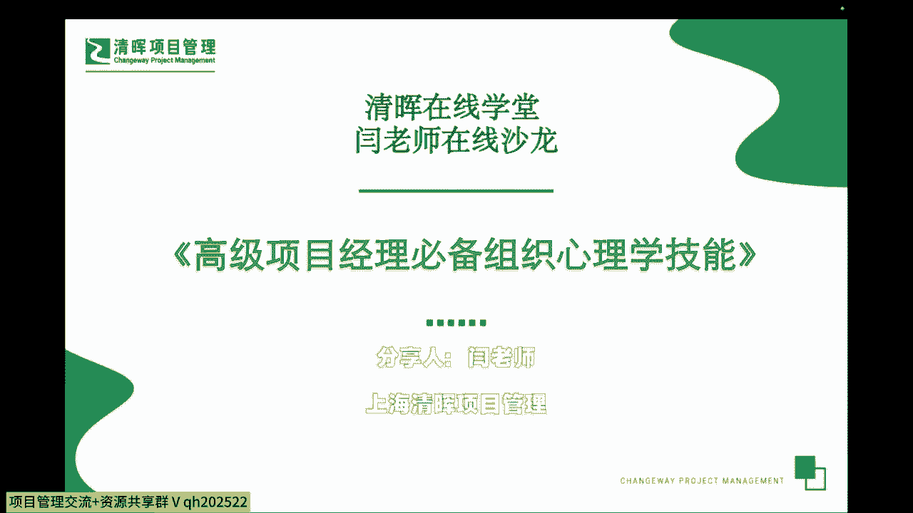
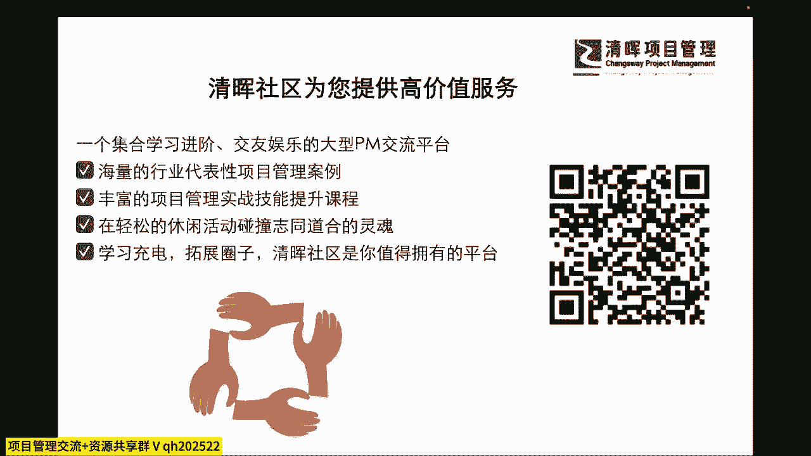
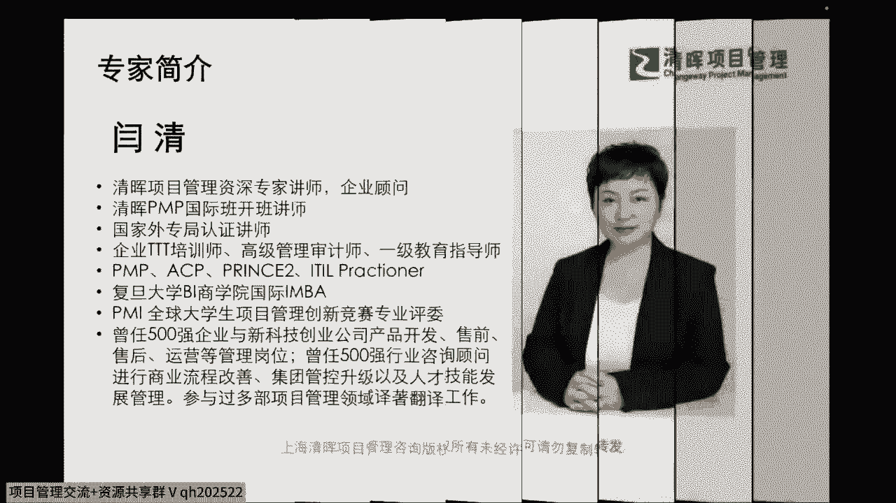
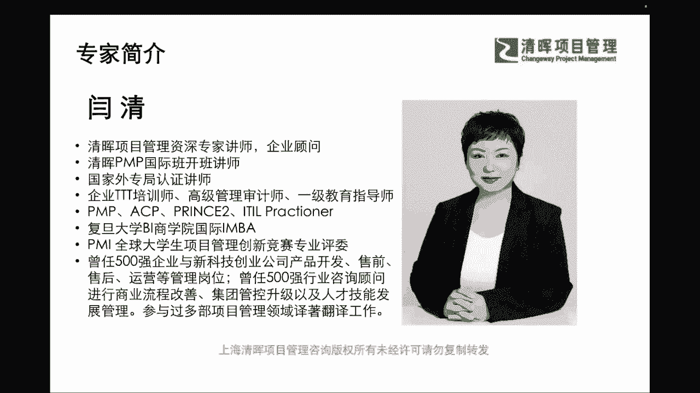

# PM组织心理学8讲 - P1：1.课程导言 - 清晖Amy - BV1Gr421E7ha

扣个一给闫老师啊，好我们看到有很多新朋友啊，还有一些老朋友非常欢迎大家的一个这个啊，抽出这个时间来学习哦，我也相信啊，闫老师一定会让大家啊带着点东西回去的啊，就是一定会学有所获。

那也希望能够切实的帮到大家啊，非常好好，我们已经有同学提出问题了啊，那我们在这个讨论的过程当中呢，严老师也会啊进一步的来去，随着这个进展也会给大家更多的一些补充，那么有啊，文森特的同学提到了，说这个。

请问组织心理学和组织行为学的区别是什么啊，非常好的一个问题啊，首先有一点啊，严老师在今天的这个内容当中，可能不涉及过深的，咱们的一些专业的心理学的一些这种术语，或者是它的一些内容。

但是一定会涉及到你说的这两个地方，一个是我们个体心理组织心理，它包含什么样的一些可能的侧重点，那么在有这样的一些心理的侧重点的时候，我们又怎么样体现在我们的一些行为上面。

所以可能我们会只取啊弱水3000，我们只取一瓢来去讲啊，我们不会去面面俱到，但是呢我们一定会把这两块来去分开讲，其实反言之啊，我们的心理学和行为学啊，它其实我们就有一个叫做什么。

还有一个学科大家听过没有，叫做社会什么心理行为学，其实说说明一点是什么，这两个事儿啊，他其实是很难去完全区分开的，那么在我们的这样的一个组织级别里面，我们到底还有什么样的一些区别和联系呢。

实际上啊我们的心理学，它更多是作为一门深入研究，咱们心理活动的学科，我们要了解我们自己为什么会做出这样的反应，那有了这样的反应，为什么又会去产生那样的多样的一些行为，所以他一定是心理在先。

什么行为在后是吧，也就是说我们肯定是这两块都会去联系，并且密集的联系，但是它两边呢也会有不同点，所以咱们今天呢，因为不是一个完全的学术化的一个心理学讨论，那我们把这两边的一些要点呢。

咱们也都去这个跟大家掰扯掰扯，只要是对大家有帮助的啊，咱们都可以去讲一讲啊，那么我们更多的在心理学上，我们研究的就是大家都有什么样的一些思维，性格是吧，我们的这样的一个理解和逻辑，那我们在行为学上。

就是理解我们为什么有同样的思维逻辑，又会有不同的行为选择呢，这其实有很多外在的内在的一些影响，所以他们之间的区别和联系也是非常密切，相关和也是有很大的不同啊，我们今天先咱们先听听看啊。

把一些基础点咱们也先搞清楚啊，好那么也感谢我们另外的几位同学啊，有在线上扣，让闫老师知道你们在听啊，那我们陆陆续续在线上已经上线的同学，我们也扣一个一啊，让闫老师听到，你们有看到你们在线上。

参与到我们的这个分享当中来啊，同样啊我们也非常欢迎，还是一如既往，请把你的问题，把你想要去听的内容，以及你对严老师的一些这种啊，可能我们想要去下一次呃，侧重在哪一个方面啊，或者你想去学哪一方面的课啊。

你想提问给严老师更多的一些这种问题啊，都可以通过扫码留言给我们，线上的这个小仙童啊，严老师都会看得到，那么也非常欢迎大家，第一时间把你们的心声都反馈给我们啊，因为这些新声呢。

才能促进我们后续对大家的一些，这种非常定制化，非常想能解决你的所需的这些问题的一个研究，以及分享，那我相信啊咱们这两个小时的一个分享，一定比大家去上一些大课，肯定要这个轻松的多是吧。

那么当你在做决定之前，不妨啊多去来涉猎一些，多来听听咱们的清晖社区的各种的小微课程，来先去了解一下这个方向，那么也许啊咱们的这个社区的除了严老师之外，我们还有很多优秀的这个老师。

讲师也给大家带来很多的一些小微课程，能够让大家可能在某一个点上，就激发了你的一些什么，这种开了天窗了是吧，我们就豁然开朗了，所以我们不光是自己埋头苦学，我们也要打开我们自己的思路，打开我们的圈子。

那么我们也非常希望听到你更多的声音啊，那么我们也有很多的这个老朋友了啊。

我们就不过多去介绍严老师啦，但是有一点啊，严老师是非常非常希望无论是线上还是线下。

我们都有机会能够零空零缝隙的啊，无缝的来去进行这样的交流和沟通，所以在严老师这边，大家可以知无不言，言无不尽啊，有什么样的问题尽管提啊，包含留言给我们的在线的这个小仙童。

以及直接在线上在评论区把你们的问题丢出来，我相信这都是非常有用的一些碰撞，那么我们在线下沙龙，如果有这样的契机的话，也欢迎大家关注严老师的这个专栏啊，在我们在线学堂有我们的名师专栏。

我们也也会有后续的一些线下活动，我也非常期待能跟大家有更多面对面的交流啊。

