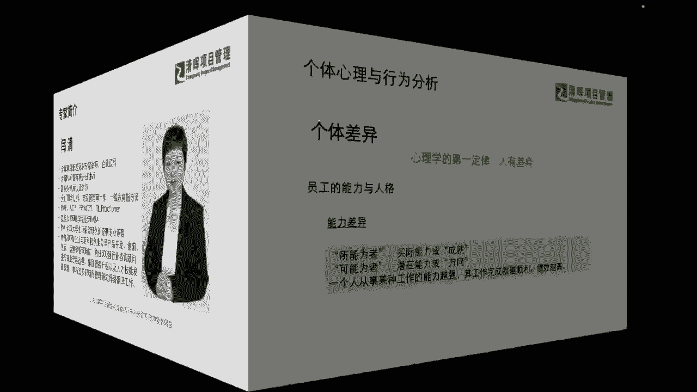
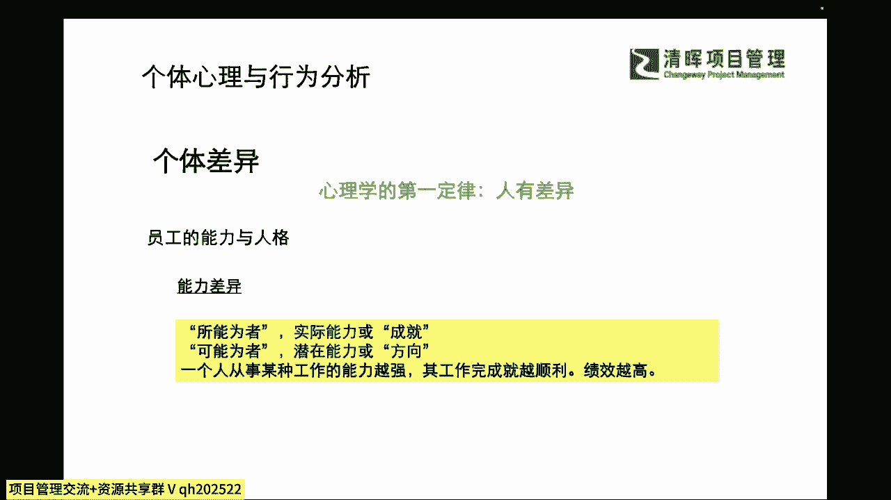
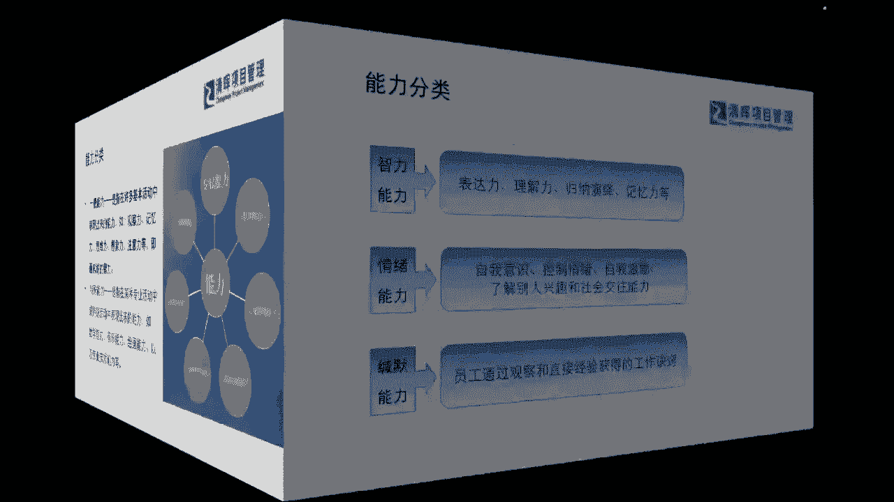
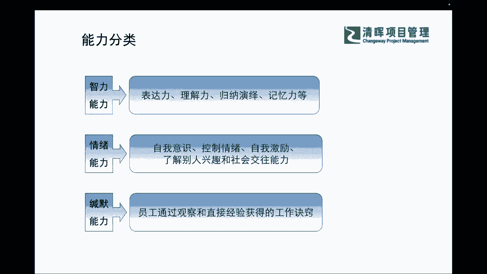

# PM组织心理学8讲 - P2：2.能力分类 - 清晖Amy - BV1Gr421E7ha

当我们切入这个话题的时候，其实刚才啊我们有同学提到这个问题，就非常的棒啊，那我们就是先要搞清楚心理和行为是吧，那我们首先切入点一定是心理对吧，这是一个基础，也就是说我们在每一个这样不同的一个维度上。

我们怎么样去呈现出来，这样一个不同的一个行为和他的一些理解，那么在这里呢我们想要去跟大家，首先来介绍一下，我们讲知己知彼百战不殆嘛对吧，我们首先来去了解一下，自己的这个个体的一些行为和心理。

他有什么样的一些差异呢，那其实首先啊大家如果我们讲话糙，理不糙，我们不去挪用心理学非常专业的一些术语啊，让大家可能一下子感觉有点这个，太学术或者太蒙的话，那我们首先啊先去理解一下，我们。

其实心理学当中首先会告诉我们的一个原则，就是什么人与人天生就是不同的，也就是说即便是我们今天讲你就是双胞胎是吧，你就是同一个家庭培养出来的，以及你可能有很多相似的一些外表。

但是我们在心理上面也一定是完全不同的个体，所以我们每个人都是具有不同的思维，不同的心理的这么一个个体，那么在这样的情况之下，我们就更能理解了，在我们的整个组织，在我们整个的团队，我们每一位员工。

他自己所有具备的这种个体的一些差异，你的员工的能力，你的员工的这种人格是吧，他一定是方方面面的，所以我们会看到一个什么样的现状呢，其实会产生这种行为差异的，主要除了心理上认知他们的一些思维。

逻辑上的不同之外，其实还有一个更重要的点，就是起源于他们本身千差万别的能力呀，也就是说我们今天为什么大家其实各位啊，我们的这个新老朋友啊，大家能够在工作日来去借用，晚上这两个小时时间。

跟着严老师一起来去聊这个话题，听一听这个话题去学习和提升，那么在线的各位同学呢，其实都是具备这种成长性的一个巨大潜力的，因为我们能够做出这种对自身长远有利的，一些选择。

这些就是具备战略视角的一个什么这种能力，但是这种能力呢首先我们要强调，并不是每个人都具备的，也就是说我们并不是每个人，看到有这样机会的时候，都会第一时间来选择啊，我其实应该把我吃饭的时间。

甚至可能我做一些无效社交的时间，然后我能腾出来来去做学习是吧，但是这个既然我们知道，人跟人之间的选择有差异，那么这种选择的差异它又是来源于哪里呢，其实就是底层的一个能力，其实我们通常所讲的。

比如说我们所能为者，其实就是他自己到底能够以自身的实力，能做到什么样的水平，我们很多时候讲的恨铁不成钢，或者我们想了很多事情，结果落地的呢又非常少，那其实为什么不见得是你不懂得，就像我们讲的道理。

我们懂了很多，但是依然过不好这一生是吧，那为什么呢，其实本质与还是我们个体的这种差异，如果我们思维上能够体现出，我们的一定的这种进步性了，那为什么落地上能够体现差异性呢。

其实本质于就在于我们的能力上的一些不同，那么也就是反言之，我们如果一个人，他能够把这个工作能力变得非常强，他各方面都可以去快速的去成长起来，并且他能够完成的非常顺利，绩效也非常好。

那么实际上这样一种情形之下呢，也就告诉我们，它是具备一些综合的一些个体的能力的。

那么在这样的一种情形之下呢，我们不禁要去了解一下，我们到底这样的能力差异，它主要分成哪些类别，也就是说我们先要去了解了解自己，比如说我知道我想要变好，我想要变得更加的综合能力强。

我想要变成一个优秀的领导者，我想要去提升我自己，但是为什么总在一些落地方面，我可能就是没办法去坚持下去，或者没办法去做得更好呢，这个时候我们就要去了解，我们自身能力到底是由什么样类别的能力组成。

我应该从哪些能力范围来去下手，因为我们讲的啊，人的精力时间也有限，对不对，所以我们一定会有一些轻重缓急，我们一定会有一些我们的乔哈里视窗导致的，我们能看到的，或者我们的盲区，我们不知道的。

那么在这个过程当中，我们就需要花时间花学习，花我们自身的投入来去了解它，那么在这里我们整体的这个大致的能力啊，我们先把它分成两类，非常容易理解的一个能力，第一个能力呢就是我们的一个一般能力。

那么一般能力呢，它更多就是指我们本能的一些反应是吧，也就是说我们在很多基本的活动当中，表现出来的能力，比如说你能不能专注的去观察呀，你的记性怎么样啊对吧，你的思维能力，你知道有一些这种辩证思维的能力吗。

而不是一味的从众吗是吧，以及你是否有具备你自己锻炼一下这种，比如说我们为什么讲写作，它不仅仅是一种文字能力，它更多是一种想象力，是一种你的一个什么逻辑的一种延展是吧，也就是说这些能力我们通常有吗。

那大部分像这种本能的能力呢，他可能一部分是从IQ，从我们天生的这种智力所带过来的，那还有一部分呢，其实是在于我们后天有没有刻意的去练习它，是吧，刻意的去关注它，来去锻炼它，那因为我们讲能力这个东西啊。

它也像一根弹簧一样，你越把它什么锻炼的多，他其实才可能会弹性，这个整个的一个能力会韧性会越强，那我们通常来讲啊，就是我们用进废退嘛，也就是说我们不用的话，那其实人的本能，我们讲的生理的东西。

你如果长时间不去思考，不去动脑，不去锻炼你的这样的一些这种思维能力，不去锻炼你的想象力，那一定它会变成一个什么，就是一些弱项，你的这方面能力，可能就没有得到充分的锻炼是吧。

所以这是我们通常所讲的一般能力，那么还有一些是算作比较特殊类的一些能力，那么这种特殊能力呢，其实是包含了我们通常所说的，比如说而我们在某一些专业的技术活动当中，某一些我们偏爱的偏好的一些特长活动当中。

以及我们可能是为了去胜任某些工作，必须要去学的对吧，就是我们现在讲的，其实作为我们现在的各位的这个伙伴们，大家有没有想过一个问题，或者问过自己一个问题啊，大家我相信啊，能够能够来。

咱们作为咱们清辉的这个这个互相的同学，至少咱们工作年年资也35年之上，肯定是有了是吧，那35年之上的话，那么我们自己本身是不是问过自己说，我现在做的事情是我的擅长的事情吗，是我感兴趣的事情吗。

啊我相信可能有一部分咱们的同学是问过自己，并且可能思考过这个职业方向的，但是我也相信啊，咱们可能有一部分同学的确就是怎么讲啊，我们讲随波逐流，这个是有点有点这个感觉上有点啊，这个不太舒服是吧。

我们还是很有自己的选择权的，但是其实呢更多这种选择是基于什么，比如说我们听说哪个专业比较赚钱啊，哪个比较好找工作是吧，我们就去学了，但是其实这个东西是不是你擅长，或者是不是你愿意长期所从事的一些。

这种事情呢，不见得是吧，所以这样的情况又会造成了，为什么我们可能毕业35年，有些我们的伙伴就能看到彼此一些这种差距，这个差距不是指仅仅是工资上的差距，而是指状态上的差距，什么意思。

就是我们有些人就越干越起劲儿，他就觉得我对于未来充满了这样的一些期待，而且我会愿意为了去更好的未来来去，不断地给自己补充，不断让自己去学习，他始终处在一种相对积极的状态。

但是我们有一部分同学刚这个工作35年，就已经开始感觉到啊，我觉得我这个本身没有太大的一个，这个这个动力啦，或者是我对于学习啊，也觉得好像这个岗位也没什么要求，我好学的啊。

或者是本身自己对自己呢有很多的一些，这种受限，而而不自知，而不愿意去有更多的改变了，那其实这样的一种情况，就会导致我们在接下来的35年，也就是说等到大家都工作10年以上，你看那个差距啊会越拉越大。

其实这种啊就也是能力他差距啊，也是能力的差距，他就指的是这种特殊能力上的差距啊，我相信啊，如果严老师尽可能用用这种比较白话，比较糙的话来讲了啊，我们没有很多的术语，所以大家呢也跟上严老师的节奏啊。

我知道可能之前我们有一部分同学会说，严老师稍微这个语速啊不是那么特别慢，为什么，因为我想要讲更多的一些干货给大家啊，同时呢我也会控节奏，我不是一味的去讲啊，所以在这个点上我是对大家也有要求的。

既然有这样的一个很好的一个这个学习的思维，愿意花时间啊，我们周一的晚上来去两个小时，咱们一起来听听这个话题，那么就一定要专心的跟上这个节奏，不管你是在啊家里还是在这个加班是吧，还是在啊什么样的场景。

我希望大家能静下来啊，能去听一听，能去有一些思考，要真正能够吸收给自己的，能够理解进去的，一定是经过自己去过滤过的东西啊，所以那我们知道了这个能力，我们简单把它分成两类啊。

我们还有这个同学说这个难言敏行，说我在走路是吧，好走路的时候注意安全啊，还有在车上的也注意安全啊，所以以往的经验，我发现我们同学真的是非常的啊，这个这个勤奋啊，我们那有很多的还在公司里面。

一直听完了才下班的，这个其实也是非常非常啊认真的，但是我们讲了认真，我们也要去有方法啊，那我们在这样的一个话题当中，如果我们有这样的一个能力分类，那我们就要对自己有一定的要求了，什么样的要求啊。

就是我们要有自知之明，什么意思啊，我先去分析分析我自己，我自己到底哪方面好，哪方面还弱，那在分析这个部分的时候，我们一定能用到咱们的这个PMP当中，非常有用的一个这个工具啊。

我们讲到的叫什么swat工具，大家还记得吗，还记得吗，好那么我们在这个sword当中啊，那我们就可以去列出来我们自己的一些强项，弱项，那么可能在这个过程是这在这个列的过程当中，其实你也是在啊不断的梳理。

不断的去给自己更多的一些反思啊，这样像这样的一些梳理呢，严老师建议大家啊，我们不要求大家像以前的古圣先贤一样，一日三省吾身是吧，我们至少可能一个月给自己一醒吧，为什么要醒自己啊。

啊我们为什么要反思自己啊，因为这是一个成长的必经之路，也就是说，如果我们不懂得在自己现有的一个位置上，去看到，看清自己的一些强弱项，给自己一些赋能的话，其实我们其实是被什么是环境裹挟着往前走的。

很多时候你分不清到底是什么公司给你的平台，还是你真的个人能力非常强，我们很多时候，我们很多同学往往搞混掉了这个概念，什么意思啊，其实你很多啊做得很浮躁的，我们可能做了啊5年啦，做了将近10年了。

就开始说哎我我想要跳槽啦啊，因为我已经学到了很多很多东西啊，我已经非常强了啊，结果在这个公司呢，不能给我更好的一个升职加薪是吧，那其实在这里面，我们一定要请大家也分得清楚啊，哪些是你自己的能力。

哪些是平台给你的能力，什么意思啊，也就是说你自己贵在有自知之明，你会发现有很多的人啊，他脱离了那个大平台之后，其实一下子就沉下去了，为什么，就是因为他没有意识到他其实自身的能力。

其实还没有那么ready是吧，没有那么准备好，那就会可能产生这样的一些落差，所以呢我们也提醒大家，其实在这个在个体心理上也是一个非常非常啊，这个我们讲的一个非常直接的一个话题。

但是我们就是有很多同学他就意识不到是吧，所以还是有自知之明，我们自己要去不断的自省，让自己清晰我的能力在哪儿，我才能清晰的知道，我可能的心里为什么会这么去想，因为我总归有一些优弱项，那我们针对优势。

我们要怎么样发扬光大，针对这些缺失项。

我怎么样去取长补短是吧，所以可能在这样的过程当中，我们也会逐步的来去。

在我们不同的能力分类的这个层级上，给自己更多的一个赋能啊，我们通常常来讲，今天还是那句话啊，就是我们像鸡蛋从外面打破啊，那可能这个鸡蛋就已经什么啊没有生命了，但是鸡蛋从内部自驱性的去考虑自驱性的成长。

那才是一个鲜活的生命，所以我们希望大家能够自己去判断，而不是说诶，能不能我们找一个地方帮我测一下命吧是吧，测一下心理啊，当然我们会有一些机构，甚至我们公司的hr也都会帮大家。

有一些很多的这样的一些心理测评的工具，或者是职业性格测评的工具等等啊，我们在PMP当中也是学过的，那其实这些工具它只能辅助我们了解我们自己，那我们自己呢还是要通过这种我们的讲的。

不同层级的一个这样的沉淀，我们自己对自己有一个正确的认知啊，好那么我们先来看一下我们在能力的分类上面，我们会有哪些不同的一个呈现呢，首先我们会有治理的一个能力，还会有情绪的能力，还有沉默的能力啊。

什么意思啊，我们可能智力能力，大家一下子就能就这个同步了是吧，我们就讲的这个只要是啊我们IQ高的，能力强的，天赋异禀的是吧，我们一定会表现的非常好，但是我们通常讲啊，我们大部分的人，99。

9%的人其实还是什么，基本上这个IQ是差不多的啊，没有特别异于常人的人啊，即便是可能学习相对啊成绩比较好啊，工作比较好的这样的一些咱们的同事和朋友，其实他更多的可能是来源于他的什么，其他方面的努力。

而不是IQ一定比你强到哪里去是吧，所以这方面，也许是因因为人家的刻苦的一个练习，也可能是因为人家的一个关注，刻意在这方面进行了补充和不断的学习对吧，那么这方面智力的部分，我们是可以去进行自己的一个沉淀。

来去进行补足的，那么情绪能力怎么做呢，其实大家学过PMP的同学啊，我要特别去啊给大家一个正向的一个肯定啊，我们一定知道学过PMP的同学，一定非常有意识的知道我们的项目经理，他必须具备的一种能力。

就叫什么项目管理的软技能，那么在这个软技能当中呢，它其实里面会包含了我们怎么样去啊，对他人有一些影响力，怎么去啊，这个沟通怎么样去汇报，怎么样去进行这样的一些呃，团队管理和冲突的解决。

怎么发挥自己的理领导力是吧，所以可能在这个当中我们也会知道，我们项目经理还需要去营造团队的优良的氛围，那么这个氛围其实它就是一换言之，这个氛围营造者，也就是一种什么积极情绪的营造者是吧。

所以我们自己本身的这种情绪能力，是不是足够强呢，我们自己会不会给自己啊不断的自省，给自己不断的调整，给自己去打鸡血呢，也许可能在这样的一个过程当中啊，我们也会啊有一些这种短暂的反思。

但是啊严老师告诉大家啊，在心理学上面啊，我们如果你没有一些深度的一些沉淀，如果全部都是在面上的反思的时候，其实这个有可能啊你揪住的问题，它并不一定是唯一的原因，就是之所以你可能啊大概想了一下。

大概调整了一下，你发现有些问题，他还会反复出现的一些原因是吧，所以我们可能要给自己一些什么沉淀啊，给自己一些沉淀，那么在这个沉淀的过程当中呢，我们也需要给自己赋能来去做好自我的激励。

你想变成一个情绪稳定的，一个这种专业的职场人，那么你就需要做到哪些行为是吧，就是我们讲的行为的个体行为，你要怎么去做，那么你是怎么去呈现的，他有什么样的一些问题，我们都要不断的可能。

定期的给自己一些这样的反思，那么第三个能力呢就是我们的一个缄默的能力，其实也可以叫做沉默的能力啊，沉默是金是吧，但是我们很多的咱们的伙伴，可能一下子意识不到，其实为什么我们讲的沉默还是一种能力呢。

因为我们现在太多的一些什么啊，我们包含演讲啊，包含一些这种啊可能部分的这种销售领导力啊，或是我们部分的影响力的一些成功学的书籍，都会鼓励大家一定要勇敢的去说，多说是吧，那其实可能在这里呢啊。

我们来去诠释这个沉默的这种能力呢，它其实很重要的一点，学过PMP的，我一点你就明白了，因为我们知道项目管理的知识，它会分成两大类，一类叫做什么显性的知识，显性的知识是指什么，就是可以被编码的。

可以打印出来的，就像今天可能严老师在跟大家分享，这个时候我们会有一些文字的东西，但是更多的东西是另外一类的，叫引性的东西，什么意思，就是除了这些文字，那么严老师还会跟大家去直接诠释出来。

很多的例子和一些理解，这些东西是不容易被什么量化和码出文字的，那其实这些就是隐性的信息，那陌陌我们在PMP当中也会非常清楚，什么样的信息在企业当中，什么样的信息属于隐性的信息啊，最大的一个代表就是什么。

我们讲的事业环境因素，它也有内部的是吧，那就是我们的企业文化是吧，那企业文化，那我们就讲啦，你在组织当中，你个体在组织当中，如果你连这种观察出来隐性信息的能力都没有，你凡事都通过去问你会不会撞南墙啊。

我相信各位一定会清晰的知道，这一定会撞南墙是吧，因为很多事情，我们其实是通过我们的观察学习是吧，你不用去问你通过别人怎么做，你通过啊，他实际上可能嘴巴是这样讲，但是他真实的情况之下，他又是怎么去处理的。

那么通过这些真实的一些细节，你就能够去抓到我们企业文化当中，最精华的部分，以及大家是怎么去融合在一起的，是不是我们通常都讲了，做比说要更容易去什么啊，看到一些真实的状况是吧。

所以我们也要有这种保持沉默的能力，让自己啊能够快速去抓到这些隐性的信息是吧，那么我们有了这样的能力了，我们有IQ，我们有情绪能力，我们有沉默的能力，那我们就会更加对自己有一个深入的了解。

也对自己啊有一个反思和沉淀了，那么在这个过程当中，我们进一步也要再去看一些东西。

看什么呢。