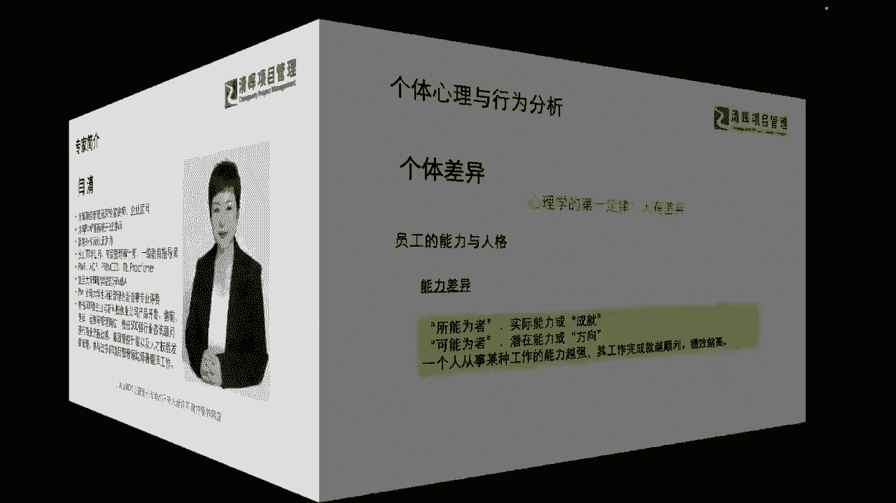
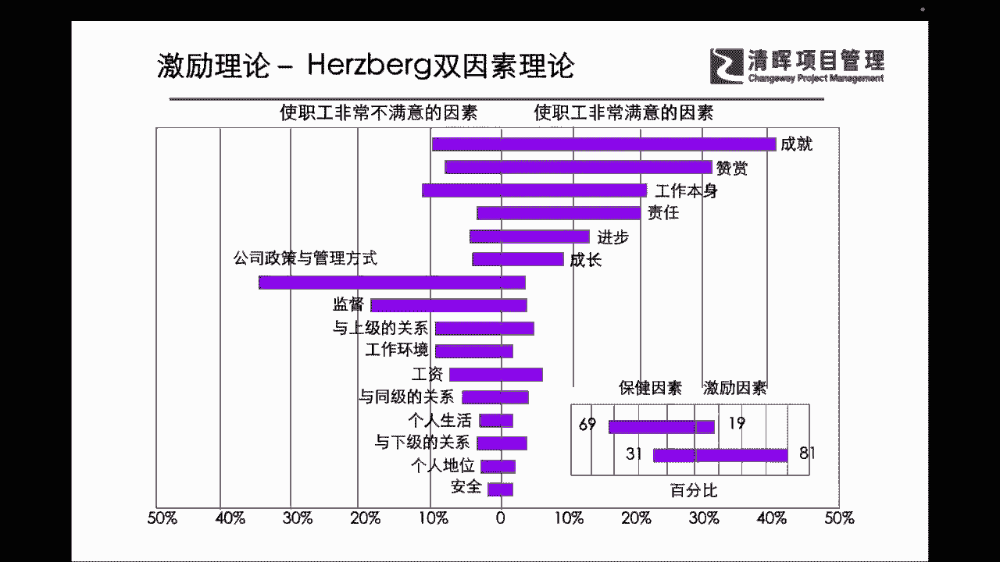
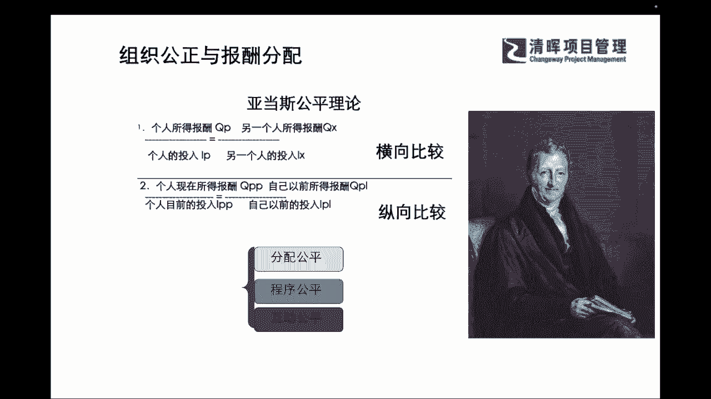

# PM组织心理学8讲 - P3：3.归因理论 - 清晖Amy - BV1Gr421E7ha

其实在我们的个体的一些心理当中，我们非常典型的一个心理学的一个部分，叫做归因论啊，严老师给大家揪的呢其实是比较经典的一个，当然我们不只不只是一个归因论啊，但是我们揪出来这个呢。

我相信可能它具有一定的代表性，那么在个体的你的能力的分析的这样一个啊，基础之上，我们对个人有不同的心理，不同的能力之下呈现出来的这种不同的行为，大家到底是怎么去做的。

那么其实还是有这样的一些这种不同的理解的，那么归因就是利用相关的这些信息资料，对每个人的行为进行分析，从而推论它产生的原因是什么，那么其实这个它分成这种啊内因和稳因是吧，内因就指的是外在的元音。

那么稳音就指的是它一个非稳定的因素是吧，所以它可能会有一些这种偏差，但是实际上呢，我们在理解这个凯利的归因理论的时候呢，他其实会有啊，不同的这个三个因素的一个互相的交织，一个影响。

比如说我们可能这个本人，他本自己本心本身的性格的特点啊，内在的一些这种归因呐，以及外部啊这个对象的一些特点是什么对吧，那别人的这样对他的一个影响是什么，以及他周遭的一些大环境，可能会有什么样的一些。

也呃这样的一个呈现对吧，所以相对的归因结果会比较客观和全面，因为啊他把这个呃，知觉和被知觉者的心理和行为，放在同一个这个分类框里啊，放在同一个系统当中去分析了，所以他的判断会有三个标准，一个是一贯性。

一个是特殊性，一个是一致性，也就是说他其实判断他的这个行为，是不是他一个真实的行为，或者或或者是他这个行为是不是一个啊，可持续的，他本身特具有它自身特点的一些行为，你其实就从他这三个点上。

就能去做出这样的一些判断，那么归因理论呢，它就能帮我们去把这些里面的，一些潜在的这种根源，把它找出来，为什么要找根源啊，也还是那句话，你想要今天你作为一个领导者，你除了去了解你自己。

如果你想去再了解你的团队成员，了解其他的这种干系人，那你必须要了解别人的内在的一些性格特点，了解别人外在，他整天都在面对着谁工作，面对着什么样的情景工作，它的受影响的环境是什么样子的。

那么有了这些基础因素的一个加持，给你作为参考的话，那么相信啊我们一定会寻找到一些方式方法，能够让这些啊团队成员，让这些我们的这个团队的这样的一些干系人，让大家能够更加具有凝聚力，我们所谓讲的叫对症下药。

是不是啊，我们就一定要找到根本来去揪住根本，把这个整个非常乱的这样的一种，人际关系的一些这种部分，我们能把它理得更加的清晰，理得更加的一个啊这个啊有条理，这样帮助我们去处理好。

组织团队的一些管理工作是吧，那么其实在这个过程当中呢，我们也是不断的通过这种隐性的个体的观察啊，通过我们去找一些原因啊，也会不断的给每一条原因，进行这样的一些归因啊，我们可能从个体的行为上面。

我们也会有具备这样的一些内部外部的影响，那其实我们从这三个要素啊，就是特殊性，一致性和一贯性来来看，我们其实都会有内外的一些不同的高低影响啊，所以可能我们在整个的过程当中，一定要思考全面。

也就是说今天造成一个人行为，造成一个个体对集体影响这种行为来讲，它一定不是单一因素造成的啊，那么我们既然知道它不是单一因素造成的，那么我们在寻找它的一些根本原因的时候。

我们不妨啊也可以去参照这种归因理论，一个简单的逻辑框架和思考框架，来帮助我们先梳理梳理，把我们最重要的一些要点能够先揪出来，对我们的团队，对我们的领导者，有一个帮助和参考的一个作用啊。

那么在这样的过程当中，我们也会去知道，大家到底是为了什么样的一些动机，来去加入到团队当中，为什么会产生这样的一些行为，从而可能大家就联系起来我们之前在讲到的，比如说我们的这种马斯洛是吧。

我们整个的一个这个需求层次理论是吧，一共分成五个层级，那么在这样的层级当中，它其实列的就是我们每个个体，不同的这种需求之下，不同的这种归因之下，大家对于自己的一些动机上的一些刺激。

和他的一个目标可能是完全不同的啊，那么可能在这个当中我们其实也是一样，也就是说我们会发现啊，咱们的团队成员，他更多情况之下，他所谓的一些诉求，不仅仅局限在这个物质层面是吧，很多时候我们在一个组织当中。

我们还要寻求归属感跟成就感，那么在这样的一些多重因素的要求之下呢，我们就会对我们的组织级的成员，也会有这样的一些工作动因理论，他的一些深入的研究，那比如说我们之前在PMP当中接触到的这个，马斯洛的模型。

那之前闫老师也问过大家啊，我们学了这么多的一些非常有用的，有实践指导的一些模型，那么我们自己有去对标过吗，啊有去分析过自己是处于哪一个层级吗，那么实际上啊，我如果让闫老师来粗粗粗的判断一下啊。

咱们在线的各位伙伴，至少有一个点我是非常认可的，为什么，因为其实大家愿意去主动学习，愿意来去提升自己，多去补充，那已经是在非常好啊，咱们的姚和新亨瑞同学说的自我实现是吧，其实已经意识啊，大家的思维意识。

也已经到了，咱们的这种自我实现和自我提升的，这么一个层级了啊，也就是我们金字塔的塔尖的这个部分，但是话讲回来，严老师也要提醒大家啊，大家的思维意识提高的非常快了，也非常的前沿了。

但是为什么咱们的实际这个落地上，还会有一些不同呢，那其实就提到了四个字叫做什么知行合一是吧，同志们知行合一啊，也就是说大家知道啊什么样的一个部分，正确的这个方向是什么，也知道要实现什么样的一些目标。

但是呢，我们是否掌握了实现这个目标的工具和能力，那其实就决定了，你到底能不能去把它实际的落地是吧，光知道不行，你得能做出来啊，所以这也就是我们其实也会告诉我们，各位的一开始啊。

可能考PMP只是为了拿证的同学，是不是啊，我们会非常非常严正的告诉大家，绝对不是为了拿那个证啊，因为我们拿完证之后呢，我们更多的一个主要的诉求就是什么，在工作当中要去用到它啊，要去用到它。

而且要去发挥出PMP，它这样的一个理论体系的一个优势和价值，那可能在这个过程当中，如果大家只是啊，我们有很多同学说哎我考完PMP，我感觉上啊回到我的工作岗位，一开始我就觉得用不到啊。

或者是很难去发挥它最大的效力，那唯一的一个原因是什么啊，同志们，大家有没有思考过，我相信可能有个别的咱们的一些啊，这个刚开始有比较年轻的一些学员，在学PP的时候啊，很多会回来再咨询啊。

再问到闫老师说哎严老师，我这个呃考试是3A通过了，但是我发现回去之后可能很多地方用不到，我就问他了，我说你为什么用不到啊，他就讲说啊，因为我们公司其他的人都听不懂啊，PMP当中在说什么啊。

所以这也是一个很大原因，大家有发现吗，为什么，因为PMP是一个什么全球性的项目管理，最佳实践标准啊，标准是什么，就跟大家接触到的一些i so o的标准是吧，国际的一些标准一样。

标准这个东西如果要推行的话，光一个人去学行不行啊，肯定不行是吧，所以我们需要去请我们的团队，大家拥有一样的术语是吧，一起来共同学习，掌握共同的一些工具，他才能去什么劲儿往一处使对吧。

所以可能在这个过程当中啊，我们会建议如果组织当中发现啊，你一个人星星之火推不动的时候，你不妨去跟你的这个啊发起人啊，跟你的leader去聊一聊，那我们就可以让团队也一起来学学PMP是吧，你只要有了规模。

只要有了这样的一些认知，就一定能够用得下去，是不是啊，所以有了这样的一个部分，我们就才能知知行合一呀，你才能落地呀，你不能光是啊自己进步是吧，就像我们讲的，你leader就怕你前面leader跑太快。

团队成员跟不上是吧，那其实在这个当中，我们也需要去找到这样的一些解决方法，那其实这也是我们在不断的学习，提升自身能力的时候，我们也考虑到我们组织当中的一个，效力的达成对吧。

所以他是互相之间有着密切的关联，而和逻辑的一些联系的好，那我们有了这样的一个这个工作动机理论，我们也跟大家再来看一个，我们其实在偏僻当中啊，也是了解过也挺熟悉的一个理论。

叫做赫兹伯格的一个双因素理论是吧，这个是在咱们PMP的这个这个资源当中，可能讲到过的一个补充的一个激励理论对吧，但是可能我们补充当中呢，也会给大家稍微讲一下，但是没讲那么细是吧，那我们在这个里面啊。

我们想让大家理解，其实在我们个体的这种心理和认知当中，你会发现为什么我们讲每个人是千差万别的呀，心理是完全不同的呀，大家从这个赫兹伯格的双因素理论上面，就能去一一窥一二了。

比如说我们其实双因素不就是分成了一个，使员工非常不满意和非常满意的一些因素吗，对吧，那我们可以看到大家所这个满意的和不满意的，这个项目呢，其实也是差距，和他的一些这种思维模式，底层逻辑呈现出来的东西。

可能也是非常非常不同的是吧，我们可以看到其实我们讲的这种双因素，其中的一种保健因素就是一些固定的，比如说我们的环境呀，公司的政策呀，是吧啊，我们对一些公司的工作环境的安全呀。

那这些其实是短期没有办法快速去什么改变的，对吧，但是我们还是会发现，其实这方面的一些这种满意度，和我们红色这个右边的一些，你个体的一些更关注一些隐性的东西，比如说成就感啊。

你自己本身工作是不是又感兴趣啊，对吧啊，我们的成长和进步性啊，这些其实你就会发现我们在双因素上面，我们每个人每个个体大家各有不同，但是主要的一点哪个更高一点啊，你直观的来看哪个更高一点。

其实还是激励因素会更高一点对吧，其实我们一开始可能说啊，我想换个工作，我想找一个新平台，那我可能会更多关注一下这个薪资对吧，关注一下这种钱多钱少，关注一下相对应的企业工作环境是吧，这些都是保健因素对吧。

这些都是保健因素，但是能够让你长久的工作下去的，能够让你待在这个组织当中，能够有成就感，并且欢抱着这样的一些这种欢乐的心情啊，愉悦的心情能够长久的可持续的发展下去的，一定不是保健因素。

一定不仅仅是钱的问题，不仅仅是工作的环境的这种问题，而是这种什么，你本身的一个成长性，你本身是不是有发展，你是不是有这样的一些成就感，你是不是能够得到一些切实的成长是吧，所以大家不如反思一下。

其实无外乎于此啊，所有的工作基本上都是在这样的一个，双因素理论的这样的一个刺激之下，其实我们会发现，我们就应该把个体的心理不应该仅仅调试，在我们要去关注一些工资是吧。

我们还要去关注我们更多的一些这种激励因素，也就是说我们要有自我的认知，自己要学会调整自己，给自己打鸡血，也要有自知之明去激励到正确的一些部分。

那么我们在了解了这个部分之外呢，我们还会接触过我们的亚当斯的公平理论，那么亚当斯的公平理论在个体上的反应呢，其实你就会发现，为什么我们其实已经在员工的某一些福利上，或者你已经在一些这种工作岗位上。

在你的项目当中啊，你可能已经得到了一些这样的认可，或者是相对应的一些报酬，但是呢你还是会觉得啊很委屈啊，或者是有一些可能性的一些不公平等等啊，那其实在这样的部分里面，我们其实会发现啊。

我们其实没有绝对的公平，没有绝对的公平，也没有绝对的公正，你会永远有一个不同的一个对标线，奔驰Mark来去做这样的一些啊，这个比较也就是说你一开始说你是这个加薪啦，很开心对吧啊。

说明啊说我对这个公司特别的这个好啊，能慧眼识珠啊，能够知道我非常的努力的一个员工，并且呢我们还啊给予我们员工，及时正确的一个正能量的反馈，但是你可能这种开心和这种愉快啊，他会非常快速的就消失了。

为什么你可能马上找到了，说诶我知道那个小王好像也这个升职加薪了，结果啊我一去找他聊了一下，我只涨了百分之这个五，他的工资却涨了10%是吧，你一下子就什么没有这种开心的劲儿了是吧。

没有这种这种啊能能乐的起来的这种动力了，为什么，因为你的奔驰Mark变了，你的对标变了，你本来原来你只是跟你以前的，你自己去对标是吧，那么现在你又去跟这个小王或小李再去对标。

这就是一个非常非常不同的一个点啦，也就是说，我们不断的在把自己的一些投入和这种报酬，产出来去跟别人来比较，那这种别人多了之后呢，我们就会发现，其实这种啊，你个人的心理就会受到很大的一个影响了是吧。

所以可能在这个部分我们也想请大家啊了解到，我们一定要及时调试好我们的心理，因为我们其实在组织当中它没有绝对的公平，我们都是相对的啊，相对的。

那么在这个过程当中，我们也会有很多的这种期望理论，那么期望理论当时讲的佛洛姆的，就是他的一个个人努力，和他的个人目标的一个实现一定是一致的，也就是说你对他的激励的一个效率。

其实是等于它的效价乘以希期望值的，那么在这个过程当中，我们通过我们不断的对吧，对标一下，我想要的跟这个公司设置的这个目标啊，看起来一致，说我只要朝着这个方向努力，我的这种升职加薪。

我的更大舞台的一些这种这种目标也就能实现，那么这就是一种非常好的一个激励了，员工就非常愿意去往这个方向来去努力是吧，所以可能在这个部分当中呢，我们也会不断的在这个这个啊过程当中来去啊。

调整自己的一些努力的一个啊这个重点，同时呢我们也会通过个人的一个绩效，来去获得组织层面的一些奖励，从而呢来去更好的实现个人的目标，这其实是一个非常理想化的状态啊，也就是说把我们想要的和我们组织想要的。

把它联系在一起了是吧，那么可能在这个过程当中呢，我们会发现很多时候我们一开始胜任的工作呢，它并不一定能够完全和我们自己想要的东西，联合在一起，其实我们更多的岗位啊，他是什么样的岗位。

会比较能够快速get到这个佛罗门理论呢，其实是比较能够什么激发员工主动性的，比如说我们的一些销售岗啊对吧，我们的一些这种前沿的一些这种呃cs的港啊，就是我们客户服务的岗啊。

大家可能会有这样直观的一些什么动力，但是我们想告诉大家啊，即便我们可能不能一下子呈现出来这样的一些，这个个人绩效和组织奖励的部分，但是我们也要分析的到位啊，自己有正确的认知，我们的激励的方向和个人目标。

如果跟组织的方向和目标是协同的话，那么我们朝着组织，想要和我自己想要的方向发展，他迟早会给你一个什么边际的一个什么回报啊，也就是说我们即便短时效应它不能展现出来，但是如果你的方向正确。

如果你的战略协同和公司一致的话，那么你也一定会在长期的这个战略的部署，和努力的收效当中获益啊，那其实这种获益呢也会让我们进一步体现，体现出来了，我们个人目标和公司激励当中的，一个协同的效应。

也就是说我们始终有一点，我们把我们个人的目标，想办法跟公司的结合起来，甚至把我们的员工的这个目标啊，也把它变成公司目标的一部分，协同一致到位，让大家更加有这样的一个努力方向，有这样的一个鼓励的效价啊。

我相信可能站在整个的这个个人的一个，推动和促进上。