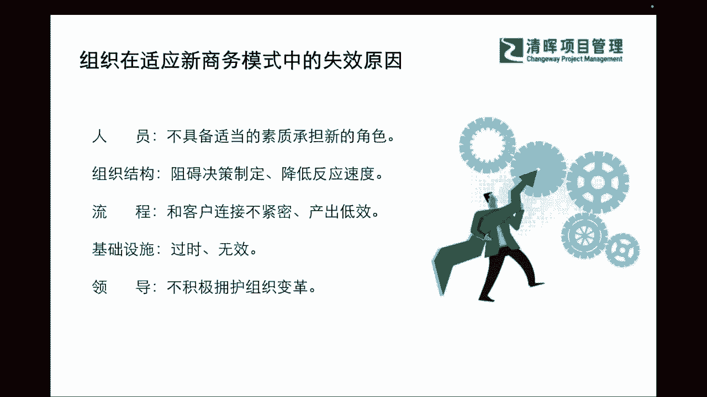
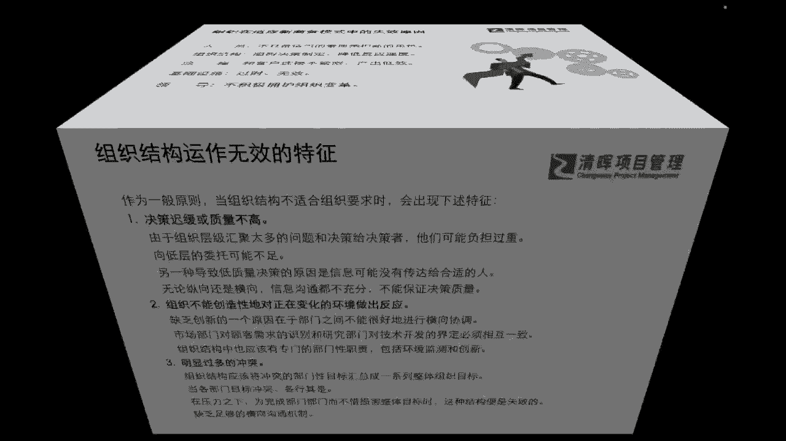

# PM组织心理学8讲 - P4：4.组织的生命周期 - 清晖Amy - BV1Gr421E7ha

很大的一个作用，那么我们接下来呢再跟大家来掰扯掰扯，讲了一下子切入了这么多的一些理论，那我们也从根本上来看看，刚才讲了个人啊，那我们来看看那到底啥是组织呢，什么是组织，我们通常讲这种组织心理学啊。

企业组织啊，社会组织，什么是组织呢，那这其实它也是由人去发生互相关系，并且在这个关系当中呢，我们能够彼此发生一些作用啊，互相有一些collaborate的，互相有一些影响，互相能产生一定的效应。

那么如果这样的组织产生了，那我们其实就称之为他是一个什么啊，组织啊，也就什么样的不是组织呢，就只是把大家抓在一起是吧，但是彼此没有交流，没有协同，没有互相影响，那不叫组织是吧。

所以我们的组织一定是彼此之间要发生关系，而且能够互相影响，互相协同，那么这样才叫一个组织，那组织的这个四个关键要素呢，首先它一定是能够看得到的，一个实体的一个什么group是吧。

而且组织他一定要有共同的一个什么，确定的目标要去达成是吧，那么另外呢我们也会有一个非常在组织内部，我们讲的在team内部，它有一个企业的文化，有组织的文化，那么他就会有一些非常经过设计的一些结构啊。

一些系统啊，这个怎么理解啊，其实就是大家所看到的，我们在企业的组织当中，我们就会有很多的组织架构是吧，那我们互相团队之间协调工作，落地工作的一些流程是吧，这些就是有精心设计的一个什么结构。

或者是活动性的一个系统，那么我们还有一些啊这个关键要素，它其实是与外部环境相联系的是吧，所以可能在这个过程当中，只要具备这四个关键因素，也具备我们的一些人和人之间发生效应的，一些特点的话。

那其实它还是属于我们的组织的，这样的一个概念啊，组织这样的一个概念，那么在这个过程当中，我们每一个组织呢，它也会有不同的一个生命周期啊，一般来讲啊，我们都会经历从一开始的start up。

从那个新生阶段是吧，一直到我们的这种大家要集团化作业啊，集集体化作业到我们的顾过大公司规模化，甚至我们可能会更加的系统的一个什么，精细化落地的这么一个过程，那么可能在这个过程当中。

我们的规模从小逐渐变成大，那在这样的一个曲线增长的过程当中，我们也会知道从一开始的这个从无到有，然后我们怎么样在后续的阶段不断地去明确，提供清晰的方向，以及内部的一些规范的标准。

流程的一些梳理和建立和去协同，更好地协同团队的一些绩效和工作等等方面，我们就开始一步一一个脚印，一步一个阶段的去上台阶去提升了，那么其实在这样的一个过程当中呢，其实我们把它想象成什么组织的生命周期。

它跟我们个体的生命周期是其实是异曲同工的，讲讲这个糙一点啊，就是我们人有生老病死，我们的企业，我们的组织他也有生老病死是吧，所以可能在这样的一个过程当中，我们会看到我们整个的一些这个协同。

我们的一些发展路径，它其实还是取决于我们不同阶段，我们人和形成的这个组织所带来的这种能力，才能协助我们如何把公司做的大，做得成熟，做得好，以及如何成就个人的一步一步的发展，那么在这样的一个过程当中呢。

我们也势必会面临到很多的一些challenge对吧，有一些很多的挑战，那么比如说我们其实作为这样的一些抱团儿啊，我们抱在一起了，然后我们会看到外部环境发生很大的一个变化。

我们要做出我们相对应的一些反应啊，我们要去提供组织和这样的一些，团队的更新的战略，那么还有呢，我们也会需要去进行必要的技术的迭代和升级，还要去建立我们非常明确并且清晰的分工体系。

和报告体系以及协调的机制对吧，那么我们同步也要对自己，怎么样更好的利用这种组织的资源，也要去花费更多的一些心理啊，以及怎么样调动和激励个体是吧，那其实这资源就指我们的人力资源吗，那我们也知道。

为了去有更好的一些这种上台阶和一些，迭代升级，我们其实是需要很多组织变革的，但这种组织变革呢，绝对不是简简单单由个体来去啊，生发出来，他是需要有抱团，有组织的行为，也就是说我们需要对很多的一些结构啊。

流程啊，文件啊，甚至我们组织的文化也需要进行，周期性的革新和改变，这些都是组织要完成的一些任务，那么在我们现在的一些新型的一些这种啊，比如说我们不同的这种行业啊，不同的一些这种这种实际的项目当中。

我们可能会发现，为什么有些时候我们有的组织就战斗力特别强，有的组织就是感觉怎么就效率提不高，然后里面的人员啊也疏于学习啊，也不愿意往前去更好的发展了，这其实有很多原因导致的，比如说我们列举五个方面。

那其实在人员方面，我们可能会有发现，当你的组织面临到你的有一部分啊，大家没有办法更好的来去快速同步啦，快去快速一起成长了，其实也有可能是因为你的人缘，他已经欠缺一定的能力，来去干什么呀。

来去承担新的一些角色是吧，来去承担一些新的角色，那么可能在这个过程当中呢，我们也会看到你也许除了人员能力不足之外呢，我们还会有组织级的一个架构啊，他其实有可能是你们的组织架构它已经落后了。

已经不适合你们现在业务发展的一个，什么这样的一个啊整个逻辑框架啦，和他的一些要求啦，那么这也是一个非常重要的一个部分，那么我们看到了这样的一个啊部分之外呢，我们还会有流程面的一些要求。

比如说我们也许这个流程，是非常侧重于我们自身，但是跟我们的终端客户连接不紧密，我们的互相协作的这样的一个效率不高，那以及包含我们有很多的啊leader啊，我们的领导。

他其实不支持我们组织的一些变革和升级，通常我们来讲我们想要去做一些组织级的变革，他无非也就是为了干嘛呀，无非也就是为了干嘛，想要去进行一些什么进一步的升级和优化嘛，所以可能在这个过程当中。

我们其实能够get到啊，如果我们领导不支持的话。

其实这个组织很难去迭代啊，很难去迭代。

