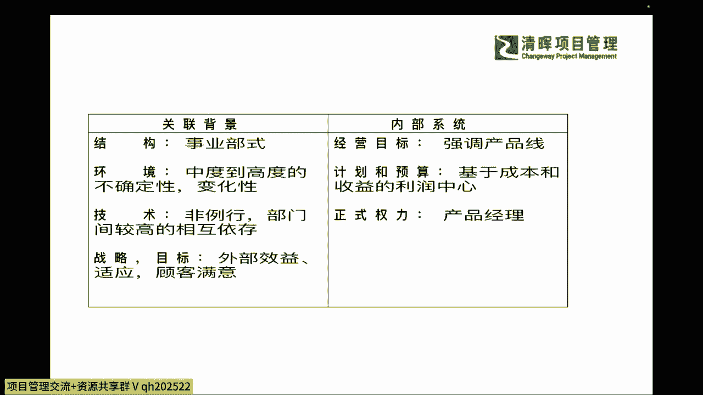
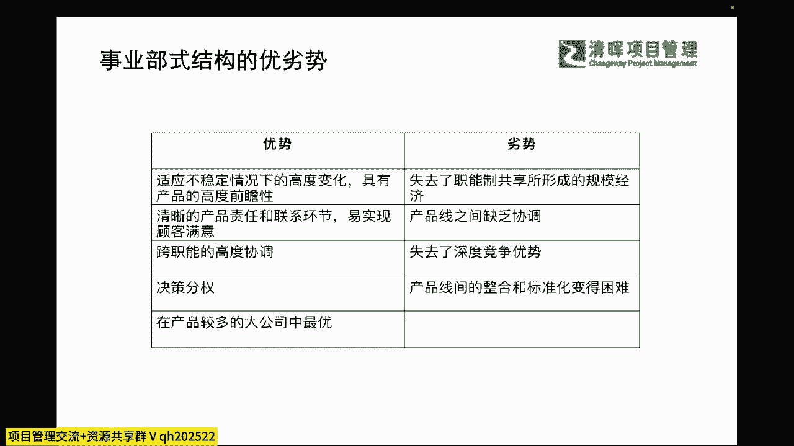
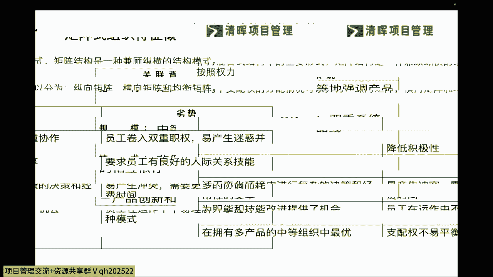
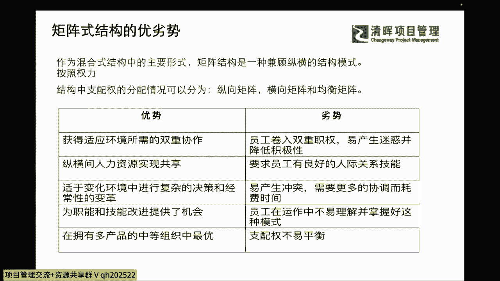
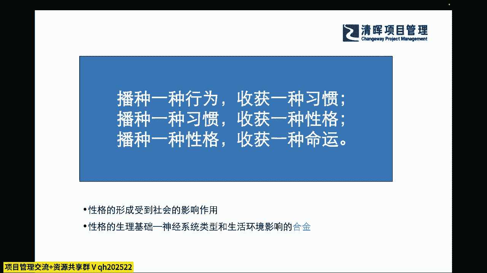
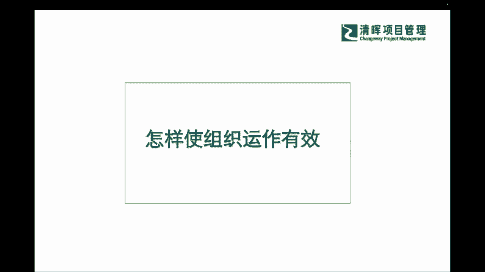
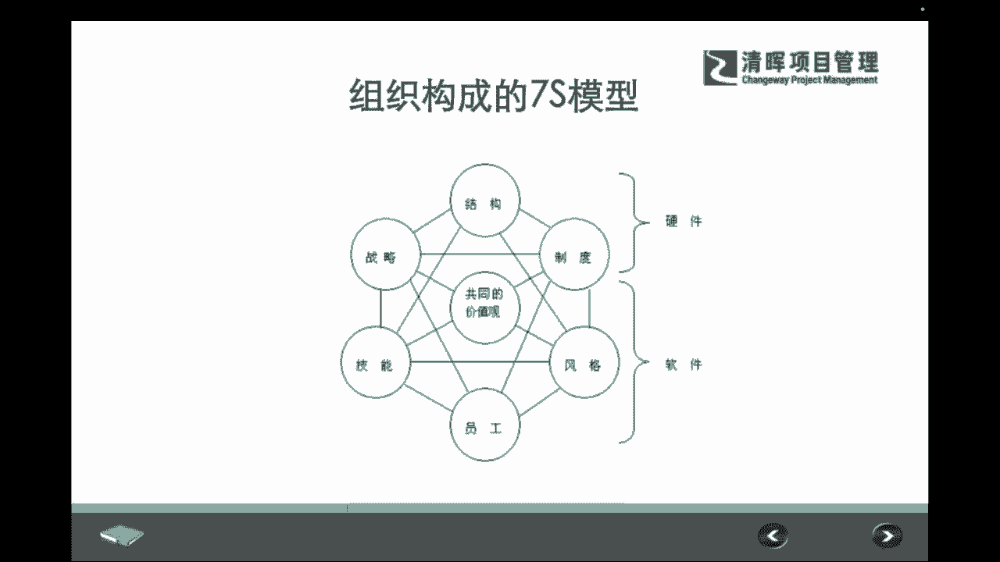
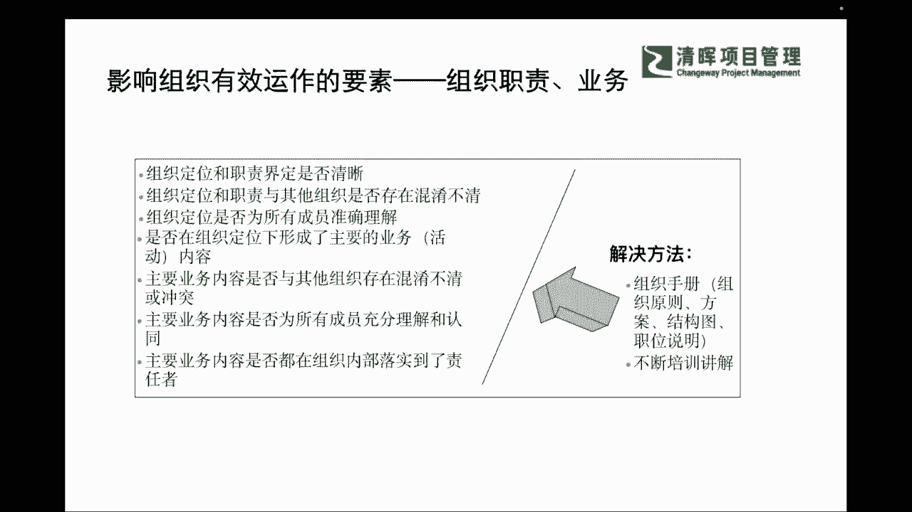
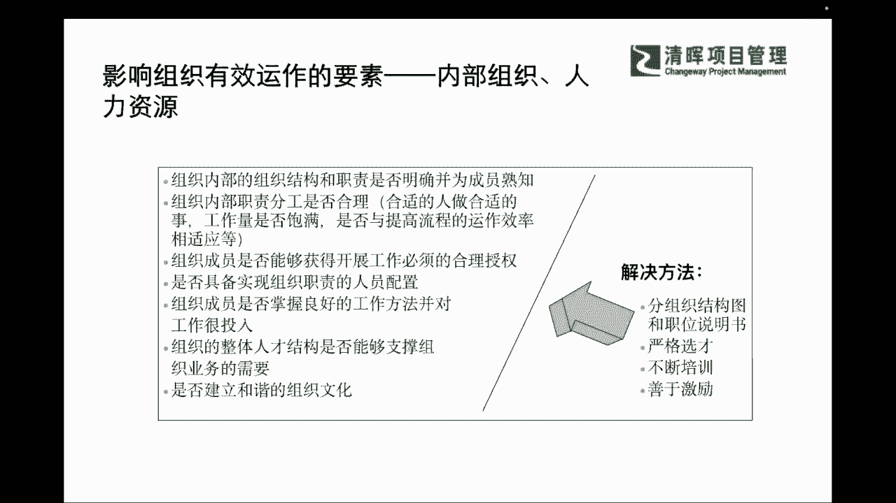
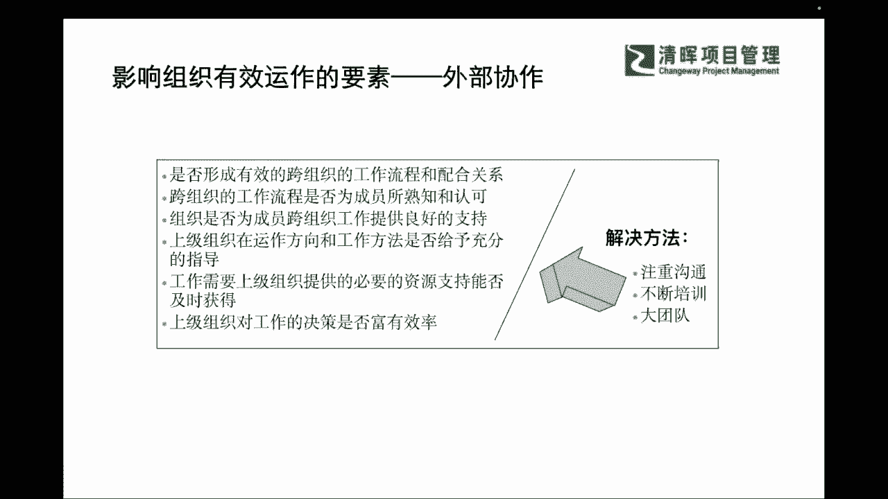

# PM组织心理学8讲 - P7：7.影响组织有效运作的要素一一内部组织、人力资源 - 清晖Amy - BV1Gr421E7ha

一个结构，那事业部式的一个结构呢，它更多的就会体现到啊，我们比如说我们即便是有再多的不同的客户啊，我们再多不同产品，只要是能交给一个团队，那不管他这个产品怎么变化，我这这部这部分的团队组织成员。

他就是集中火力去交付这个部分的，所以它其实是一个能适应这种不确定性的，一个很好的一个方式，那同样呢它可能更多的一个权利是集，不是集中在这个前面，我们所讲的职能经理，而是集中在这种产品经理的手上是吧。

他能够更加基于这种啊收益的利润中心啊，强调产品线的一个成本和收益，那其实会非非常清晰的去拿到我们相对应，客户的一些满意度，达成我们的一些这样的一些效益是吧，所以这是非常直观的一个啊结果。

那么在这个如此之外呢。

我们还可以看到，当然他既然有这么多的好处，同样也有一些劣势，什么劣势啊，也就说他其实事业布置呢，它其实是这个不同产品跟不同产品之间，他可能又会出现一些什么啊，这种缺乏协调的现象，失去了这种什么啊。

专业精深度的一些这种什么，互相之间的一个考量，那也会把产品线之间的整合，变得相对是比较什么啊，可能有一些些困难是吧，有一些些困难，所以可能在这样的情况之下呢，我们也会去看到我们在这个过程当中啊。

我们也一定会遇到我们中间横向协调和精深度，当中的一些这种尴尬的地方是吧。

尴尬的地方，那我们有了这样的一个认知，我们再来看一下，我们在矩阵形式的这个结构当中，它又有什么样的一些特点呢，其实矩阵式更多的就是什么，他会有很多的互相权利的一些制衡，既不是什么产品经理。

也不是什么职能经理，也不是项目经理说了算对吧，我们其实还是会有啊比较多的这样的一些啊，互相之间可能共同协商的一个过程，那么这种过程它更多的就是比较适用于什么，我们职能和产品之间相结合的一个过程对吧。

那在职能和产品之间相结合的过程呢，我们也可以去看到我们整体的一个差异，整体的一个差异，所以我们看到这样的一个差异的时候呢，我们也会去给大家啊有这样的一个不同的点，我们怎么样啊。

可以去让大家啊看到我们的一些这种优势呢。

其实就是作为混合式的这种结构啊，矩阵型的结构它其实可以兼纵啊，兼顾这个纵横的一些结构模式，那么也可以啊来去进行多重的协作，那其实矩阵型最大的一个劣势就是什么，就是你的沟通成本会高嘛。

你因为你又要是呃纵深要达成，又要去啊横向这个也要去沟通到位的话，那其实这是一个非常可能对沟通能力和时间，精力投入非常多的，我们讲的collaboration，会要求比较多的这样的一个方面。

那么实际上在我们这样的一个协同的过程当中，我们也希望啊跟大家去啊，这个介绍了几种组织的行为的时候呢，我们也要去跟大家再去讲清楚一个点啊，我们不管哪一种的这种组织的行为，或者个体的行为。

他其实都是源自于一个什么，你本身的一些基础导致的啊，基础去形成的，所以呢我们会发现我们可能播种了一种行为，你会收获了一种习惯对吧，那么你如果播种了一种习惯呢，你可能会收获一种性格。

那你收获了一种性格之后，你可能就收获不同种的命运，这个在我们的个体和企业和组织当中，也都是放之四海皆准的，也就是说我们希望啊大家能够意识到，我们其实一点一滴的这样的一个个人行为，个人的心理。

个人的这种反思，其实也会对组织的设计，组织的行为，组织的一些这种啊优劣势产生很大的影响，也就是说我们希望大家从一些细节啊，从一些我们的基础要求，从我们的能力来去搭建起来，把我们整个的这种行为呀，习惯啊。

性格啊，把他养成，那自然而然我们就会得到很多命运的一些眷顾。

那么我们曾经彼得德鲁克啊，我们的著名的管理学之父啊，也曾提到过非常好的这样的一个观点，他其实说到良好的这个组织机构，它的本身并不创造良好的业绩，并不能保证产一定产生伟大的一些总统是吧。

那么好的法律也并不保证，一定是，可能会塑造一个有有道德的一个社会一样，但是糟糕的组织机构，会使企业和良好的业绩无缘，无论管理人员是多么的出色，其实简而言之，我们要知道这样的一个组织行为的一个。

什么结构的设计，组织的一些这种搭建，那其实是需要一个非常良好的根基的，也就是说就像我们通常所讲的啊，读书不一定是万能的，但是不读书一定是不行的是吧，所以可能也就是在这点上，我们再换言之，你个人的能力啊。

你个人的学习并不一定能直接快速，带来你个人的一个成长，但是你不学习行不行，不去补充你自己行不行，那一定是不行的，其实对于企业来讲也是一样的道理啊，那么在这个过程当中，我们不禁又再去问一个问题了。

那我们知道了这些这些部分。

我们怎么样才能使这个组织运作更加的有效呢，那我们可以看到在组织构成当中，它也有一个非常经典的一个模型，叫做7S的一个模型，那么他这个七个啊，这个要素呢包含了它共同的一些这种啊价值观，包含了他的战略。

包含了结构制度以及技能员工和风格，那么我们也可以从这种软件和硬件上面去，区分的话，大家可以非常啊易于去区分出来，我们可能在啊软性上和硬件上，可能它有不同的一些关注点，那么不管是软件和硬件。

它其实都是非常重要的一些理念是吧，都是非常重要的一些理念，那么在这个过程当中呢，我们也会提出啊。

让自己能够非常清晰的了解到，你组织有效运作的时候，你需要去关注的那些要素，我们用一个鱼骨图来去呈现出来，那你可能就需要去抓我们组织的职责，和我们的要做的一些共同的目标对吧，以及我们内部是怎么去组织的。

大家是怎么样去互相协作的，我们人力资源是怎么去配置的，怎么去放的对吧，我们的leader怎么样去进行这样的一个，角色和职责的分工的，以及包含我们的管理制度流程面，怎么样能够更完善，更健全。

来把这样的一个体系建立起来，那么同时我们也会关注到我们外部协作上的，一些若干的这个顺畅性和效率的一个协同性，那么在这样的一个层级之下，我们才能保证我们整个组织有机会，大概率的来去快速协作。

那么在这个协作当中，我们可能会兼顾到我们的一些组织的职，责和业务，那么我们可能就需要去订立很多的，组织的手册啊，我们都要不断的去进行培训，不断的去梳理我们的流程，标准化等等是吧。

那这些就是我们必须要去做到的一些事情，那你不做行不行呢，不做可能短期看不出来，但是你长期呢，可能这个有效性两个字。

就不一定经得住这种考验了是吧，那么还有呢，我们可能会关注到我们内部的组织啊，人呐其实在这些点上我们就需要去干什么了，你就得去不断的更新我们的一些，刚才我们所介绍到的组织的结构啊对吧，你的一些R啊。

R的一些这种岗位职责说明书啊，你的业务有变化，你的整个流程上有变化，那你的岗位职责势必会产生一些不同啊对吧，我们要不断的对我们自己和员工，对我们的组织内部的成员，进行这样的一些啊培训啊对吧。

所以可能我们看到了这样的一个理解啊，我们不断的去激励和培训的时候呢，我们也会去啊，看到我们的组织文化是否协同一致是吧。

那么我们在这样的一个啊，有效性运作的加持之下，我们在工作流程的不断的建立和标准化，优化之下，我们可能也会去看到啊整个的这样的一个协同，和他的一些不断的贯彻落实，有效性考验的一些价值所在。

这也是我们啊也可以看到我们的这样的一个啊，整体性的一个部分啊，大家可能有有什么样的一个协作，那么在外部协作上，我们就要不断的提升我们的这种组织的软技能，要注重沟通能力的培养，要注重大局观。

要有大团队意识，而不能是有小部门的意识是吧，我们要去决定整个组织上面协调一致的。

