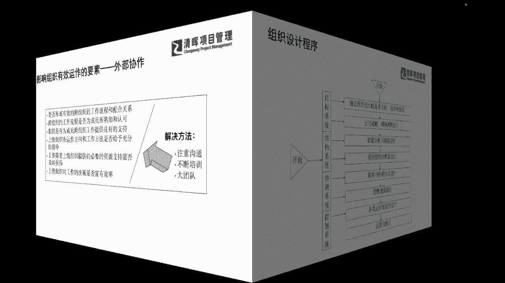
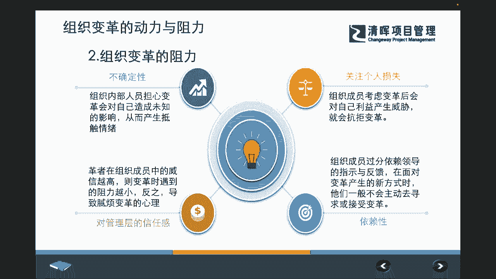
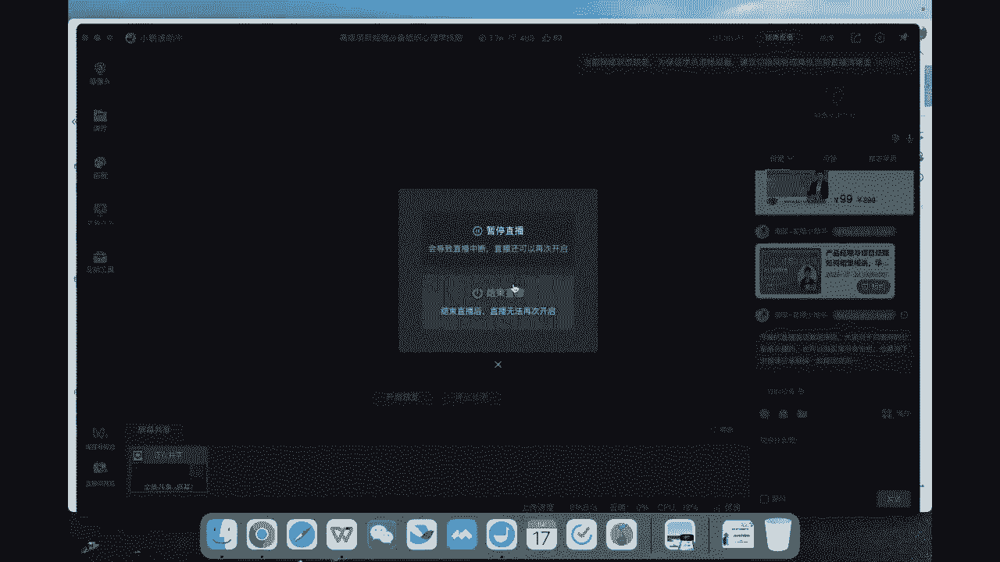

# PM组织心理学8讲 - P8：8.组织设计程序 - 清晖Amy - BV1Gr421E7ha

有效性。

那么在这样的一个整体的要求之下，我们在有效性的这样的一个这个大前提之下，我们可能会更加把我们的这种组织啊，把我们的有效，把我们的变成我们切实可落地的一些细节来去，变成我们的目标，变成我们的结构设计。

变成我们的协调的设计，以及如何去控制的一个四大类别的一个层级，当然在我们四大类别之内呢，我们还会有各自的一些必要的步骤，比如说我们从一开始设立目标，我们就必须大家协同一致，把我们的战略方针路径。

全部要一次性要干什么啊，讲清楚对吧，那我们再接着来去把我们的结构上面的，职能的一些设计啊，为什么要求大家，比如说是到底是矩阵型的还是事业部型的，还是这种职能型的是吧，也也要跟大家去讲清楚。

那么同步大家这些理解之后，我们在协调的行为上就开始立规范了，开始要去建立怎么样的联系方式，怎么样的一些管理规范，让大家行为输出是一致的是吧，那么我们同样在这个过程当中。

也通过不断的这种组织层级的一些监控啊，我们可以不断的给自己一些反馈和修正，那么有这样的一个理解，我们就一定会发现我们整体的组织行为啊，组织的这样的一些心理，他一定是从思想啊思想下来。

通过行政和制度变成我们的行为，行为，又会加上我们的领导和文化的刺激，变成我们的习惯，那习惯加上我们长期的培训培养，在辅以我们激励的一些措施，变成最终我们的绩效，这个大家是否一下子就能get到。

我们组织级的这种所谓的行为学，心理学，最终落地成我们的知行合一上，成为我们实践的绩效的时候，他其实要经过这样的一些必要的一个步骤，所以呢我相信可能通过这样的一个，非常简单的一个图形。

大家也一下就能抓到一些必要的要点，所以我们一定在形成一个，你作为一个非常资深的项目经理啊，作为一个管理者，你想要去实现这个组织的高绩效，实现组织的协同的优化，你就领导加管理加行政，所有的这些文化制度。

激励培养一个都不能少是吧，所以它的底层逻辑就在这里，我们看到了这样的东西呢，我们也需要知道啊，作为一个leader，除了刚才所说的体系化的思维，那你可能你个人的一些这种加持也很重要是吧。

我们这里讲到我们可能讲的这种leadership的一个，领导力的气质，在组织活动当中的一些作用，其实也可以去调动你，组织和人和个体的一些积极性，来去增强团队的一些战斗力，那么在这个增强战斗力的过程当中。

我们可以通过和根据人的这样的一些我们leader，根据我们自己个体的一些这种气质特征，来去做好我们相应的一些培训和提升教育，也就是说我们可以把这个气质啊，也辅以变成你个人的气场。

也就是说我们今天你作为一个高层级的管理者，高层级的项目经理，你必须在组织活动中发挥作用的时候，你就得不断的去提升，你知道前面的系统思维啦，你也要不断的提升自己的一些什么这种气场啊，提升自己的一些能力。

那么可能在这个能力当中，我们也要同步关注到我们相应的，组织文化的一些作用，也就是说你个体的影响是一方面，我个人气场的影响多少个人呐对吧，那么我们更多的一些影响力，是来源于我们的周围的组织。

那组织文化其实他有很强的导向作用，凝聚作用，激励作用，创新作用和约束以及提效提能的功能，所以可能我们在整体的营造的时候，你不仅要修炼自己的气场，你还要修炼组织的气场是吧，那么在这个组织的气场当中。

我们也会发现组织它的一些特点，也会出现很多的差异化，不管什么样的差异化，我们其实还是能够非常清晰的，通过我们的一些管理的方式和方法，来去进一步发展和深化，来去抓到它的要点，比如说我们也给大家介绍啊。

我们的企业文化，它可以变成一种什么叫做cooperate identity system，也就是说你的每一个组织，它有非常明确的一个形象系统，那这个系统呢有可能是一种企业的经营哲学，它的价值观是吧。

还有一种呢它可能会驱动型，比如说它有很多的企业活动，企业培训工作环境就会传递给你，还有一种呢就是你进到企业公司当中去的时候，你看到很多的条幅，看到很多的一些这种口号是吧，看到很多的一些标示语。

这些也是视觉的一些这种激励的一些系统，那不管是一些呃价值经营哲学的驱动，还是我们的组织，企业活动的驱动，还是我们视觉的一些这种驱动，其实都是企业文化体现出来，变成显性和隐性互相结合的一种现象。

所以大家能从这些方面能去抓到，我们的一些相应的要点和要素，能去知道我们的一些这种判断的点在哪里，那么同步我们如果还是需要再去深入，再抓一些要素的话，不妨也拿这个清单去做一个参考啊，我们可以去问问自己啊。

我们清不清楚我们的一些使命是什么，目标是什么，我们清不清楚，我们在具体从这种思维变成实践的时候，我们的行为上体现出来这种思维，它是什么样的一种反应，我们在面面对问题处理的时候，我们怎么样去解决。

怎么样去对待员工和客户的对吧，呃说的不算做的算嘛对吧，我们如果说嘴巴上讲，我们很关心这个员工的疾苦是吧，关心员工的人性化，但是我们又有很多的一些非人性化的体现，那我们一定知道这个组织的一些真实的状况。

可能是落在哪里对吧，那我们还会需要去了解很多公司的一些，这种我们讲视觉化的东西，就是大家可能平时比如说这个这个啊，这个放的slogan啊，说我们一定要这种口号，我们一定要这个努力啊，拼搏奋斗啊。

具有创业精神啊，这其实也是一种非常非常形象的，组织文化的一种体现，那么我们也可以看到，比如说其他的问题，我们的员工是怎么样被啊招进来的，怎么样被fire掉的，这其实也都是非常非常形象和隐性的。

一些文化的一些诊断，那同步我们也可以去观察一些隐性的，比如说在公司里面都有哪些人啊，是被呃颂扬为这种非常有能力的人，那有哪些人他可能又是啊觉得不是很很好的，这个KPI不好的。

那这些也是一个组织文化再去进行评判，评判的一个过程，并不仅仅是一个什么个体评判的过程啊，那么我们知道了这样的一个东西，我们的企业战略和组织变革的关系呢，也会非常非常的大。

他们互相之间成为这种什么原因和结果，也就是说我们必须去进行必要的组织变革，也必须去从我们的文化人员，技术结构上去，给予我们更多的一些发展的一些空间，那么有了这样的发展空间。

我们才能去进一步的提升和改善自己，组织当中的一些缺点和不足，那么在这个过程当中，我们一定会遇到形形色色的一些阻力，那我们阻力可能来自于外部的经济因素，有竞争因素，还有技术因素。

还可能来自于我们的这种政策和法规，那么其实更多的还是来自于我们大环境的一些，不确定性，和我们管理者的一些leadership的缺失，以及我们个体的能力的不足等等啊，那么在这样的一些这种阻力之下呢。

我们也会再次跟大家去强调和提升一个维度，就是我们今天啊不知不觉，可能我们两个小时掰扯了很多的一些，组织层面的，非常看起来啊，可能很高大上，但是我尽可能用比较粗浅的话来，去跟大家去讲了啊。

那么我们其实用彼得德鲁克的另外一句话，来总结呢，他其实很早就提出来了，他说我所写的一切啊，我所去讲的一切，无一不去强调人的多变性，多元性和独特之处，也就是说，我们每一个个体的心理行为。

和企业组织的心理和行为都是不一样的，都是有差异的，所以我们不如啊返璞归真，来去回归到刚才从严老师一开始所讲到的能力，所讲到的模型，所讲到的组织的一些特点，和它能够变得更好的一些要求。

来去看看我们到底还能去做什么，能去定期反思什么，在这样的一个正确的一个大前提和大框架之下，我相信咱们每一位同学，每位伙伴都能够给自己十足的一个，正确的指引和动力，我们不怕有这种gap，不怕有差距啊。

我们怕的是自己不知道自己哪方面有差距，自己知道了差距，也不知道怎么样去进步是吧，所以我们不怕我们发现更多的一些差距，知道了我们就去一个一个的去把它补足，通过提升自己。

通过自己能力的呃这个啊不断的一个晋级，我们也去带动我们的周围的组织，也去反馈到影响到我们的组织，甚至我们的组织也通过这样的一个，集体的学习力啊，我们学习型的组织，也不断的在进行这样的一个提升，来去解决。

可能会应对未来更多挑战的一些问题，和带给我们未来更多晋级和升级的一些机会。

