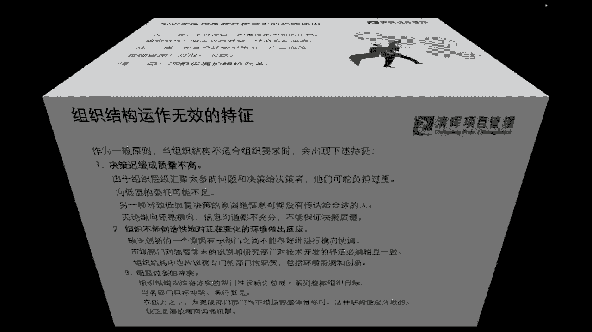

# PM组织心理学8讲 - P5：5.组织运作失效的8种病症 - 清晖Amy - BV1Gr421E7ha

我们知道了这个部分。

我们来看看我们在整个的组织运作当中，哪些问题会特别的凸显呢，我们也去给自己这样的一个这样的一个对标，首先啊我们先来看看，我们会发现很多组织当中，他的迟缓或者决策的一些速度和质量非常的低。

无论横向还是纵向信息沟通都不充分，而且我们会发现啊，我们的组织级的这个太多问题啊，他可能都甩给这个这个项目经理啦，甩给这个programs啊，项目集经理甩给项目组合经理，他可能是非常非常什么负担很重啊。

而且可能会发生很多的一些什么啊，处理不利呀对吧，这样的现象，那么我们还会看到组织啊，他不能很好的创造性的去对，正在不断变化的一些环境做出这样的反应，那么这个问题其实现在非常普遍的一个问题。

为什么我们讲大家都要学敏捷啊，都要去了解我们现在整体的环境，它不可能不变，不可能变化，慢的变化就是一个常态啊，所以我们不能去抱怨变化是吧，所以也就是说我们缺乏这种，对于这种全新环境的适应能力。

以及缺乏这种创新的能力，它其实对于一个企业来讲，是非常致命的一个问题啊，非常致命的一个问题，那么我们还有发现一个问题，就是说我们的很多的团队之间内耗过重是吧，我们的团队冲突特别多啊。

部门跟部门之间的壁垒很高啊，这个目标甚至都不同，我们刚才所讲了，目标不同，能不能称之为一个组织啊，其实很难是吧，但是我们其实就在实际的某一些这个场景当中，我们就会发现大家各司其职，各行其事是吧。

其实并没有完全去协同，那这就是一个非常严重的一个问题了，那么我们看到这些问题，我们也会再去望闻问切啊，把这个进一步去做一个病症的排查，为啥会产生这种问题呢，那其实我们看到的八个基本的问题啊。

它的来源病根儿在哪呢，其实就是我们组织当中的，比如说我们的职责啊啊互相之间协作关系啊，其实并不清晰，那包含我们组织成员，他在这个环节当中，在这个组织当中它能发挥的效用，他都不知道。

他都不知道应该怎么样更好的去影响他人，或者他的一些价值在哪里，这就是一个很大的问题是吧，那么我们还会看到我们在某一些组织当中，我们不愿去授权或者是复权过多，我们的领导不放权呐是吧。

那可能在这个当中我们就会发现，我们有很多组织内部啊，我们高层管理人员他为什么不想去放权，因为他会发现发现可能放权之后他要去救火，那这样就会有很多的这种什么需要去监督，需要去管理的一些层面。

会诞生出很多的一些这种什么管理的成本是吧，那这也是一种组织运作失效的一种病根儿，他不放心啊，不放心，起源于他会发现管理成本很高，救火成本很高是吧，那么还有第三种呢。

就是我们会有很多的这个决策链之外的一些，信息封闭，也就是说我们并不清楚全局，我们只知道这个整个系统，能让我们知道的东西啊，所以这也是一个我们讲的有失偏颇的一个地方，那么还有我们或或者有权无责。

有责无权是吧，使这个组织变得非常的混乱啊，让责任人无法对结果进一步的负责是吧，那么可能在这个过程当中呢，我们也会去看到我们的整个的职能部门哦，我们的管理人员大家权力的范围也非常的混乱，也非常不统一。

指挥不统一，甚至下命令的部门都不同意是吧，这就是非常严重的一个组织问题了，那么还有我们可能会发现一些冗余部门，很多的部门，他其实不以最终服务这个终端客户为目的啊，他可能就造带来很多的资源浪费是吧。

所以这也是我们其中会看到的问题，以及大家能够非常清晰地感知到，因为我们组织它也是有生命力的，它也是需要不断创新的，所以它对于组织当中的这个细胞，每一个人才，你的一个能力的提升是有非常高的要求的。

也就是说，为什么现在我们理解我们在不同的企业，大家啊可能会看到我们的企业福利啊，特别喜欢送大家去进行各种各样的一些，培训是吧，那其实这就是给大家赋能，同时给大家每个个体赋能，同时也是在给组织赋能啊对吧。

那么还有一些就属于这种组织，过于的什么复杂啦，管理层太多啦对吧，管理跨度过小啊，可能在这个当中，我们也会发现这样的一系列问题，那么同样啊我们知道了这个部分。

