# PM组织心理学8讲 - P6：6.组织设计的原则 - 清晖Amy - BV1Gr421E7ha

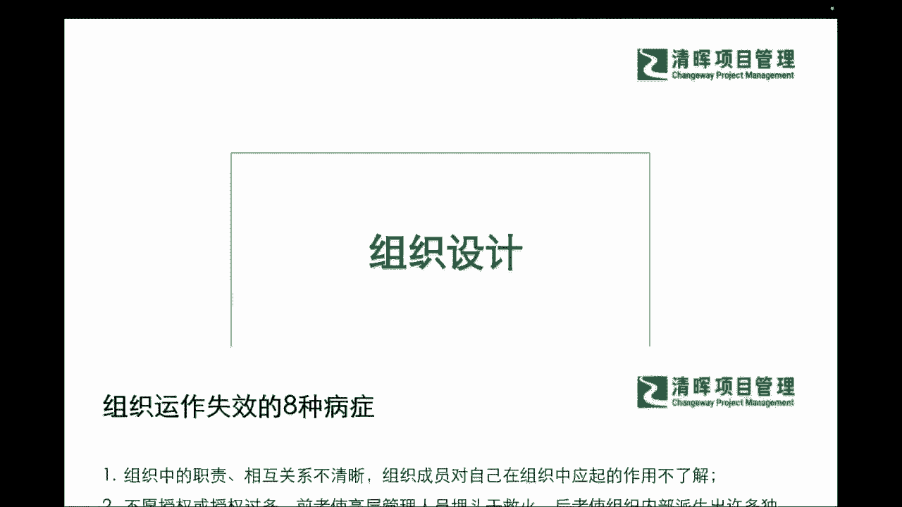

啊我们知道了这个部分，我们接着再往下来看看，既然我们组织当中有这么多的一些问题，那我们来看看组织设计，当初我们应该从事怎么样的一些组织行为，或者组织心理，能够更好的来协助我们管理好这样的一个团队。

组织呢，那其实我们首先来看看我们的这个team，我们的组织是怎么被设计出来，甚至他的一些底层逻辑是什么，那我们来看到啊，这个组织设计它的原则呢，我们可以把它分成五个原则，那第一个呢是市场导向。

也就是说也可以叫做客户导向是吧，就你客户需要什么样的一些组织，你的一些这种重要的干系人，需要什么样的组织，那我们肯定会需要去配合，产生什么样的一个组织是吧，那么第二个就是我们叫目标统一的原则。

也就是说我们的组织他是一定要目标协同一致，大家奔着一个方向去的，一个组织目标去的，不可以，一个组织之内有不同的目标，这就是一个大忌是吧，那么还有我们的组织效率的原则不同，那么在组织效率的原则的基础之上。

我们其实就知道，我们想要去设计一个扁平化的组织，来提升组织效率呢，还是我们想要去制造一些这样的一些，互相的这个cross check是吧，互相的交叉检验，我们就会把这个整个的组织就变得比较的。

这样的一个啊这个复杂，或者是希望互相之间有一些治瑕等等是吧，所以可能在这个部分当中呢，我们也会去看到我们整个的一个啊发展啊，我们整个的一个组织架构，它其实也是为了我们的组织效率去服务的。

所以我们也会清楚的知道，我们当初可能管理者或者企业，最初在设计这样的一种组织架构的时候，他其实也是出于一定的目的来设计的，那在这个过程当中呢，我们就需要请大家啊来去了解。

我们在这个啊组织的这样的一个设计当中，可能大家的出发点和这个目标是什么，那么除过我们的客户导向，目标统一和组织效率原则之外，我们还有责权利对等的原则。

也就是说我们永远这个roles and responsibility，我们的角色和职责，是希望能够让大家感受到，我们对于每一个岗位的这样的一个啊，相对平等的一个设置，以及对大家的一个什么激励的一个设定。

也就是说我们其实更多的是希望能够干什么啊，让大家在这个组织当中产生一个良性的一个，什么写作是吧，让大家可以干什么，可以感受到成就感啊，我有这样的职责，我也有这样的权利，我也有这样的一个什么啊，激励是吧。

这其实是一个非常i do非常理想的一个状态，那么我们可以看到啊，我们也知道了这样的一个部分，我们也可以继续来看到，我们怎么样，让组织内部可以继续的去均衡发展啊。

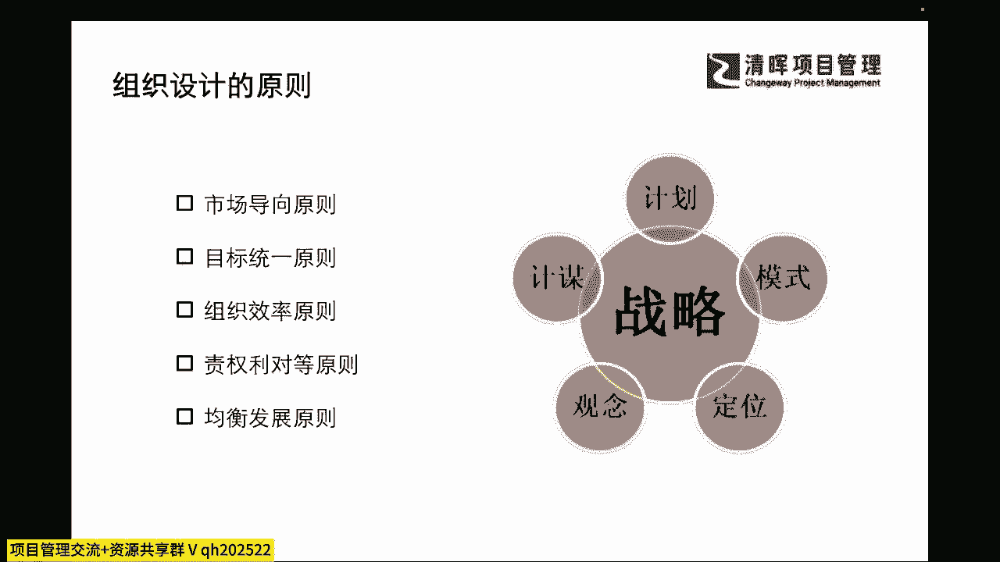

那么我们有了这样的一个设计的一个原则，我们再来跟大家掰扯掰扯啊，我们在好的组织上面，它具有什么样的特点啊，我们可能以往啊我们在开始各位伙伴，如果各位同学，大家还在这个呃。

职业道德晋升的这个快速赛道上的时候，可能你必须要去了解你的组织的设计啊，你的团队设计大家是基于管理层，大家是基于什么样的一些基础以及好的组织，它要具备什么样的一些特点，那么在这里呢我们可以看到。

在非常卓越的一些组织过程当中，它一定会具有三个主要的特点，那么第一个呢就是它非常有一个什么基本的，一种简化的组织结构，并且它没有冗源，而且不存在这种官僚制，大家都是什么，open door是吧。

就是开着门，就是我们的领导也不会自己把自己，关在一个这个这个办公室里面啊，可能更多的就是希望大家可以啊，及时的能够反馈，及时的交流，那这其实就是一些非常好的一个，这样的一个啊组织了。

也就是说我们有很多简化和小型的事业部，其实说白一点我们就开始越来越敏捷了对吧，那么第二个呢就是很好的一些组织的特点，就是我们能够提高企业主的一些分权化，也就是说我们提高这种高级管理层的一个分权。

也就是说我们会可以让我们的呃干系人，让我们的团队成员，让我们组织成员大家都有享受到激励和奖赏，大家愿意群策群力，而不是仅仅靠啊我们的leader啊，靠我们的企业管理者来去当排头兵。

我们有更多的一些创新和革新，都是来源于我们的组织当中的个体是吧，那么这就是一个非常非常好的一个组织的设计，我们愿意激励组织当中的个体，那么再来一第三点呢，就是在业绩衡量和他的财务和非财务方法。

之间的一些权衡呢，其实也会让我们看到有很多组织的这种卓越性，它是依赖于多种能力和价值的，那么在这个过程当中啊，我们的财务和非财务的衡量方法，那其实也会给我们的公司提供很多的前景，那么我们可以看到嗯。

你我们可以看到在这样的过程当中，我们在管理者和所有的雇员，密切合作的过程当中，我们一定会有一些硬指标是吧，我们说哎你要达成了你的KPI，你才能拿到今年的奖金，那么其实除了这个硬指标之外。

你还可必须去追踪他们的一些什么软能力是吧，因为这些软能力刚才我们也提到过，很多是软能力，大家用swat去分析出来的，去沉淀出来的，其实可以看到，他们长期会把我们的这样的一个组织能力。

会提升到更更加具有竞争力的这么一个台阶上，所以它是对长期视角上更加重要的一些部分。

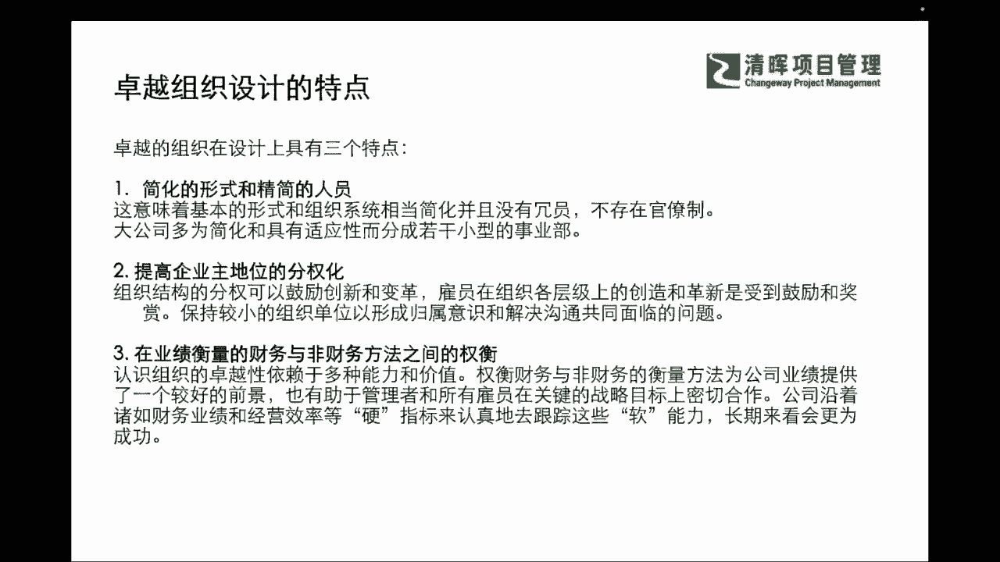

那么我们知道了这个组织的，好的一些组织的特点，那么他是怎么去设计的呢，我们从一开始，我们怎么样去把这个团队搭建起来呢，那其实在这里面我们就要搞清楚一些，必备的基础的一些要素。

那我们在这里呢也可以给大家一个相对透明的，可视化的一些拆解，那我们在定义这个团队的时候，大家怎么样去变成一个卓越的团队，高效率的团队，那么我们可以先从三个关键要素来入手。

第一个呢就是我们的搞清楚我们的组织结构啊，他一定会需要有一个清晰的汇报关系包，包含我们优化过的汇报层级数，和你管理者能管理的管理跨度，看到了吗，三个点啊，也就是说你必须要有清晰的一个汇报关系。

以及你汇报的层级数，和管理者的一个管理跨度啊，那么除此之外呢，我们还需要把个体啊这个重要性，也去把它提升到一定的战略程度，因为毕竟我们所有的这样的一个部门，所有的一个组织都是由个体先来形成部门。

再由部门到组织的，也就是说我们现有个体再有小的一个团体，再到我们大的一个组织，所以可能在我们个体形成小部门的时候，我们也需要去进行这样的一些引导和界定，而不是自己去这个天然的形成或者是圈层啊。

所以可能我们来看到啊，在这样的一个层面之下，我们可以看到组织结构，包含了它一整套的一个系统啊，我们也可以看到谁在进行这样的一个，跨组织的沟通啊，我们谁在进行这样的一些整合。

这是一定啊可以去界定的清楚的啊，那么可能在这样的一个过程当中，我们其实可以分析到一个理想的这个，组织结构啊，应该鼓励其他成员在必要的时候，提供横向的一些信息啊，来进行这样的一些协调。

所以我们啊我在这样的一个影响，组织结构设计当中也会有一些呃变量，那什么样的变量，比如说我们的环境啊，这个还有我们的一些组织目标啊，那么还有我们的技术能力，还有咱们要形成的一些组织规模。

这些通通都是我们要考量的，那么在这样的一个大前提之下。

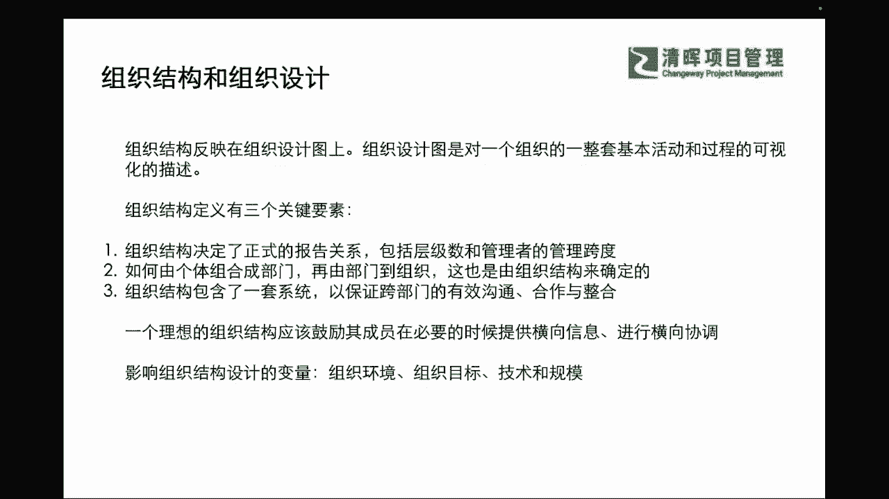

我们就可以进一步的来去看看，我们不同的这样的一个形势之下，大家有哪些好处和哪些局限性，比如说我们今天组织，形成了什么样的一种组织结构啊，形成什么样的一种关系，那其实是有利于我们组织这样子。

大家能够更好地体现出共同性的行为，并且能够互相协同，快速提升的呢，那我们可以看到啊，在我们通常所讲的这种组织结构图，他其实能够表现出来，我们的啊，这个啊，这种他的一个汇报的关系和决策的范围是吧。

那么可能在这个决策范围之外，我们可以直观地反映出组织结构，它不一致性和复杂性，那哪个地方可能这个组织架构画的比较乱啊，汇报关系比较乱，层级也比较复杂，那其实就容易啊，一眼就能观观察出来。

这些就是我们需要去改进的地地方是吧，那么还有像我们的团队成员，能够直观地去看到，大家可能在组织当中处于什么样的一个位置，大家的主要的职责和关注点，和互相协作的一些建议是什么是吗，所以会我们啊。

我们整个的嗯这样的一个啊环境当中啊，我们就发现他的一个局限性，和它的一个优点了啊，发展的一个局限性，它的一个优点了，那么我们可以看到在这个过程当中，它其实也一定程度上表示不了各种有意义的。

非正式的一个关系和信息，那么在组织结构图当中，它的位置高低，也不一定完全反映他一个职位的高低，对不对，大家都非常有经验了啊，那么我们可能也会随着组织的一些实际的，一些运作来去及时调整，尤其是项目的组织。

我们项目可能会随时出现人员的一些什么啊。

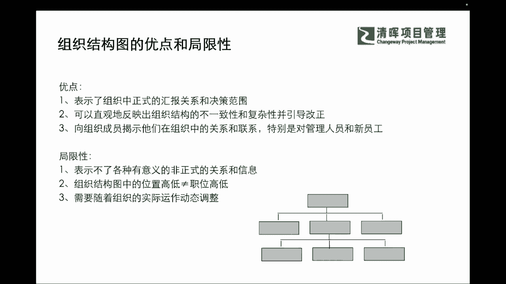

这种差异和不同是吧，那么我们的组织结构啊，它和组织结构图也不完全的对等，那么在这样的一个过程当中，我们通常讲的这种组织的改革，他可能就会被认为是这种组织架构的改革是吧，而结构的改革啊。

就是可能就在纸上画一画这种啊组织结构图，把这个架构换一换，就相当于是把它改革了，其实组织的改革，它不仅仅是指这个汇报关系的，组织架构图的改革，而是包含了我们更多的一些业务啊，它的流程啊。

他的一些人力的组织啊，和我们的制度等等各方面的一些这种改革，也就是说我们组织结构的内涵，远远比组织结构图这个要多丰富的多啊，那也就是说我们可能在整个的一个这样的，两者之间的关系上，我们一定要认知清晰。

不仅仅去把一个组织架构变一下就行了，而是你要进行组织变革的时候。

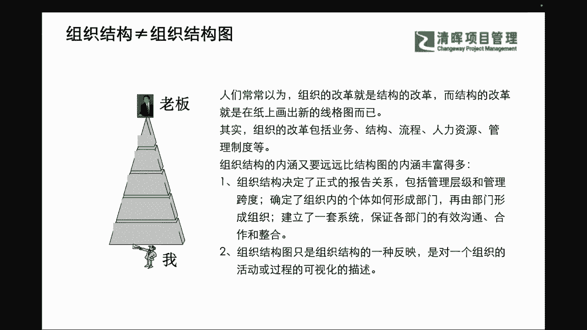

你一定要关注到这个体系和系统啊，那么有了这样的一个体系和系统的设计，其实我们就更加清晰的能够看到，我们的组织战略和我们环境之间的和系统之间，互相协同，的一个这样的一个大的一个逻辑思维了。

那么在这个逻辑思维之下，我们就会清晰地理解到，为什么组织会这么去设置KPI，那设置这个我们的一些啊，我们的一些KPR，以及我们的这种role and responsibility，角色和职责。

甚至组织架构，为什么这么放，以及我们的这种他的结构的系统，它的职能划分和每个领导者的管理幅度，他为什么是这么去啊划分，那以及我们可能相应的规章制度，互相怎么去协同协调，以及我们怎么样去监督控制啊。

这种问责制度等等，它其实是一个生态环境，也就是说我们的组织，它之所以能够呈现出不同的行为，不同的结果，完全是这个系统的设计之下产生的协同效应，和大家对于本身的这种化学效应。

自己个体的增强和组织增强的这么一个，互相之间的一个作用，也就是说在这个过程当中呢，我们势必也会有更多的一个这个系统层面的，一个认知和啊了解啊，那么可能在这个过程当中我也期待啊，就是我们可能各位同学们。

大家可能在PMP的这个基础之上呢，可能给自己往上去拔高几个台阶，来理解这个事情啊，因为我们要做到我们的中高级的管理层，我们势必要理解我们的组织怎么去放，我们的团队，怎么去设定这个目标，怎么去啊。

理解怎么去管它会更加有效率是吧，所以这是一个非常大的学问，但是我们尽可能呢来通过一些简单的一，些部分啊，来跟大家去把这个事情把它讲清楚啊。

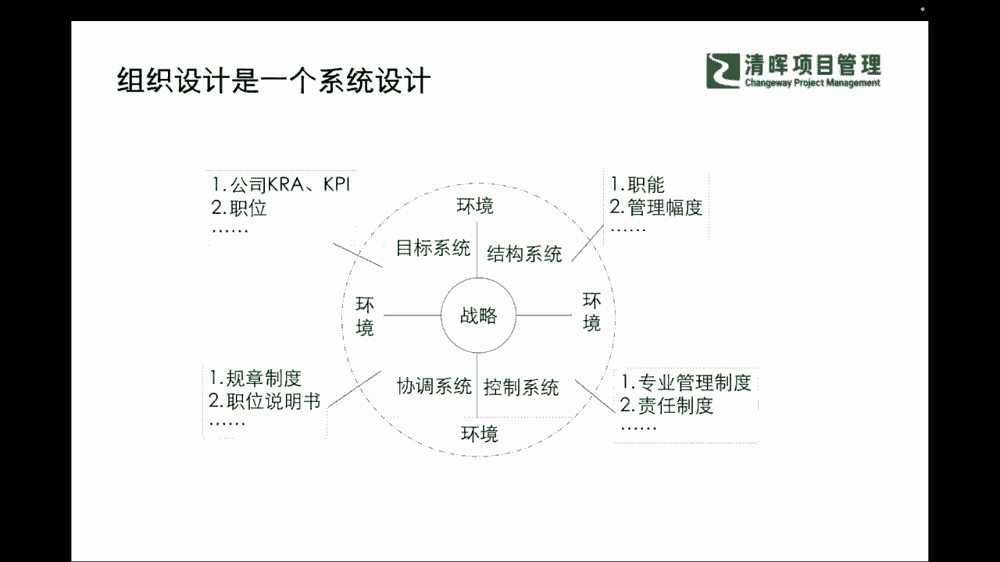

那么我们再接着来看，既然它是个系统，那我们在设计这个团队的时候，他应该注意些啥嘞，那你就要看看他到底在这个组织架构当中，它的流程当中，他人缘和文化当中，以及他的这种领导的一些，这种领导力的要求当中。

他会有什么样的一些不同，那么我们的基础架构会有哪些是吧，那么可能在这个过程当中，我们就会提出很多的问题来问到我们自己，和问到我们的团队，那么这个这个几个问当中呢，我其实会给我们很大的一个重新的一个。

目标设定，以及我们能够清晰地认知到，我们其实为什么团队协同我们讲呢，为什么一个人可能是个龙啊，一群人就是条虫了呢，那其实我们整个组织的一个协同，组织的一些行为和提升，它其实是一个更大的话题。

它不能仅仅拘泥于我们个体了是吧，我们还会关注到方方面面，那其实在这个所有涉及到的一些方面当中，我们也希望大家能够给自己先有一个checklist，先有一个检查清单。

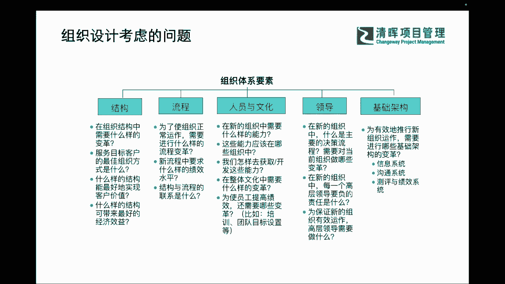

让自己能够知道啊，我们哪些方面还要去关注他，那么在这样的一个过程当中呢。

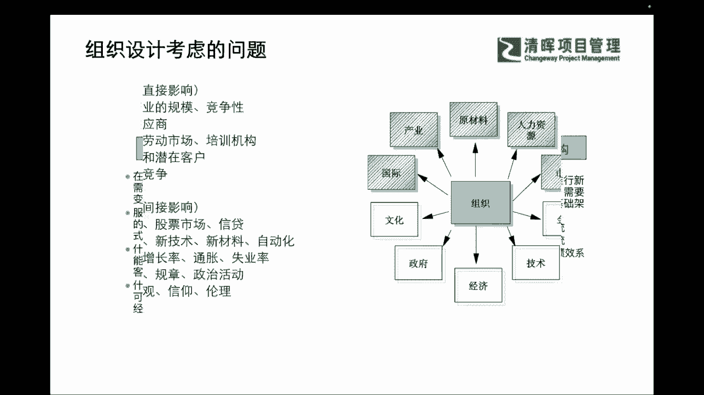

我们不仅要去看到，我们哪些会去影响组织设计是吧，你影响设计，你就会说啊，我肯定都知道我要去拿出最最扁平的是吧，这样的一个设计框架，我们要拿出最有效率，最敏捷的一些人力的一些这种资源的一些啊。

这种这种搭建的结构，但实际上可能并不是所有的事情都是这么，理想化是吧，那我们一定会有一些限制因素，那么这种限制因素可能来源于我们的环境，那这种环境有直接的有间接的是吧。

我们讲的直接因素就是由我们的一些什么啊，我们的一些啊产业化呀，有我们的一些人，哪有我们的一些这种国际的市场的环境呀，对吧等等方方面面，那我们的一些常规的因素，也会有一些什么事业环境因素。

就是我们的什么来自于政府，来自于文化的，来自于经济的等等外在的一些东西是吧，所以我们组织的环境压力啊，他可能会更多的来自于自组织。

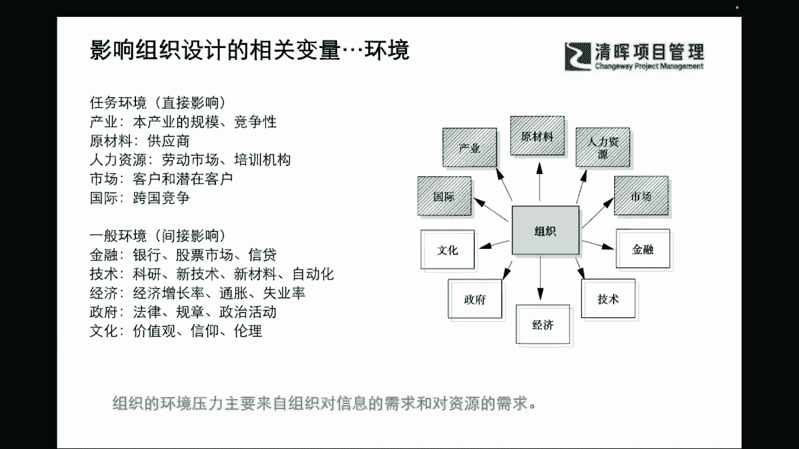

对信息的需求和对资源的需求上面，那么我们同样也会受我们的目标和战略，的一些影响，也就是说我们需要去了解到，我们的目标要达到什么，战略是如何能够达到，但其实在这个当过程当中，我们就需要对我们的团队呀。

也产生同样的一个理解啊，产生同样的一个理解，那也就是说我们在这样的一个理解过程当中啊，我们怎么样能够让大家去意识到，来去理解到这样的一些部分啊，我们也能够去能够去加入这样的一些啊，我们的必要的一些步骤。

能去把这些部分做全，那我们可以看到我们自己本身啊，能够去做到的一些这样的一个方案呢，我们也也会去融入到我们外部的环境因素，和我们战略的管理和组织设计的一些因素，来形成我们想要的一些有价值。

有效性的一些结果是吧。

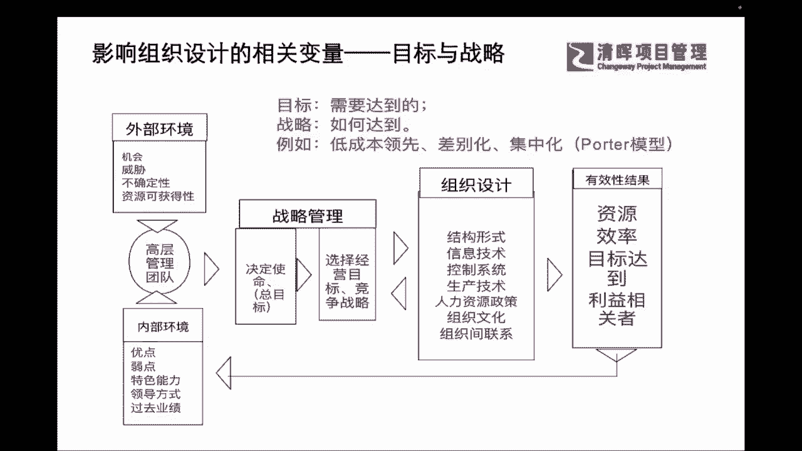

那么我们知道了这个这样的一些部分，我们不禁又想到我们的技术的受限了，为什么想到技术啊，这其实是一个非常大的一个话题，那也就是说，我们有很多的一些技术层面的一些产出，他的工具技能行动和工作程序。

其实是跟我们就讲的头大身子小是吧，我们很多时候也知道了，我们的文化也建立的很好，也会有很多的一些前沿的一些视角，但是我们就是在落地的时候啊，产生这种力不从心的一些感觉，为什么呢。

这其实也是由于我们的一些这种技术，相关的工具，技能和行动力不足啊，那我们会看到我们组织的这种呃跨度啊，你员工的专业化程度，你的一些内部的活动和一些培训的一些频次，他其实都会影响到你整体的一个什么啊。

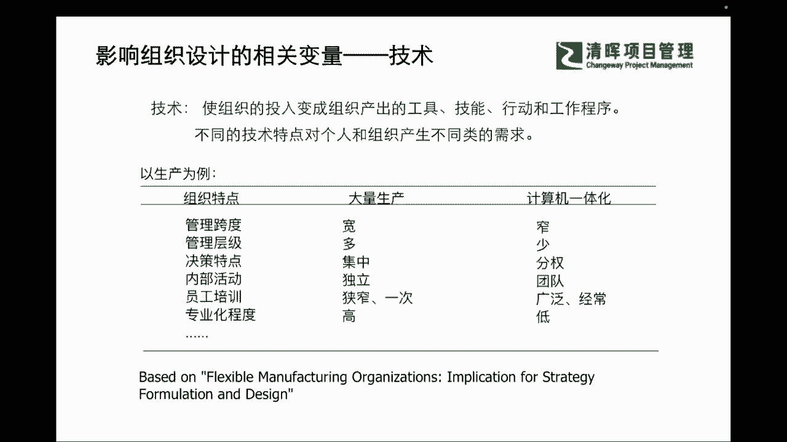

组织的效率性，那么在这样的一个过程当中，我们组织的一定的规模化，其实也是非常非常重要的一个话题，和一个相关性的一个特点，能够带给我们更多的一些思考，我们在不同的一些组织规模啊，做不同的组织特点当中。

我们怎么样能够去啊，把我们的组织能力尽可能去往强来走，而不是往弱里来走，所以我们会看到好的一些组织能力的，一定是干什么，相对结构扁平，而且横向的这种elaborate的一些综合，横向的能力是比较强的。

这样的一些啊这个组织，那么我们可以看到，我们可以看到整体的这样的一些，较低的规范化程度，和较高的这样的一些分权化程度，让大家主动来承担的时候，我们其实就能够发现我们的效率提升了。

我们有很少的一些书面沟通和文件，我们也会啊，看到这样的不同的一个效率的提升啊，不同的效率提升，那我们看到我们来去啊。

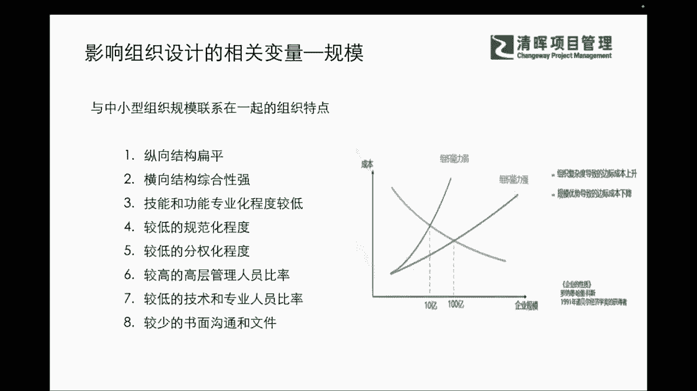

看到这样的一些差异的时候，我们也会看到我们现在周围有哪些很好的一些，组织结构模式，我们可以去作为分析和借鉴，是吧啊，那我们在这里呢常见的啊，我们常见的有几种啊，比如说职能式的，还有事业部式的，区域式的。

矩阵式的，大家有些啊我们能够去直观的看到啊，你比如说职能式的，我们见到就是一些相似的职能啊，或者是工作过程啊，他就把这些个体能够组合起来，他们可能被命名为一个部门，比如说我们有一些职能部门。

他其实就是一个典型的职能性的一个结构，那么我们他具备相应的组织和知识技能的，这个人员，个体被组织在一起，其实会发挥什么样的效力呢，就是专业的一个纵深度对吧，所以可能我会非常啊直接的能够看到这个部门。

他们的一个强项在哪里是吧啊，我们可能会直接的观察到，这个季这个部门它职能在哪里，这是一个比较好的一个优势啊，那我们会看到这样的一个过程当中呢，也会有一些事业部，他的一个啊结构上的一个不同。

那么在这个不同呢，我们会把不同的知识和这个个体把它组合起来，那比如说我们会有一些啊根据产品来分的，根据客户来分的是吧，那其实也是我们的一些啊不同的一个点，那么我们还有区域式的一些结构是吧。

区域式的一些结构呢，我们也会看到这个区域式结构当中，我们也会有很多的按照我们的地理位置划分，特定区域的一些客户的特定服务，来划分等等是吧，那么有了这样的一些过程，我们也会有一些矩阵式的一些结构。

那矩阵式的结构里面就会包含了我们的职能。

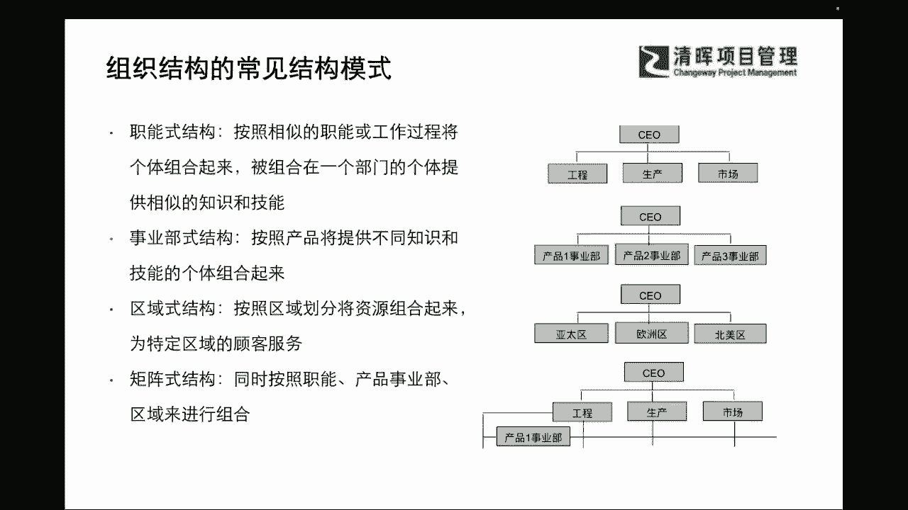

啊啊，产品事业部啊啊一些区域来去划分，那么在这样不同的情况之下，我们可以快速来看一下，他们能够实现的一些特点，和一些相应的一些要素，那职能型的它就非常非常直观的，能让我们看到这个结构。

它的focus它的聚焦职能的一些部门，他强调要职能的目标，而且在较低的这种啊环境的不确定性之下，他能够稳定的去交付和合作运作是吧，而且它的技术呢也会更加利于去金砖的发展。

因为职能部门它就是聚焦在他所专专业的领域，来去不断的去挖深是吧，那我们同步也可以去啊，有这样的一个正式的一个职能经理的一个领导，来去。

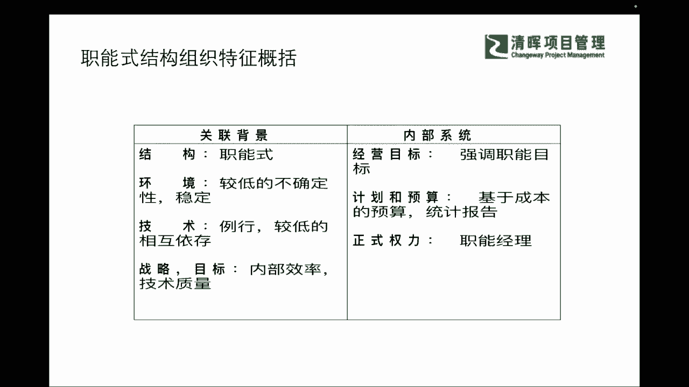

不断地提升我们内部的技术质量和内部的效率，那么职能是它的劣势有什么呢，我们可以看到它其实职能式的，它就是对外界的环境变化反应会比较慢呢，因为他会缺少一些横向的一些这种关联的时候。

他有可能就会陷入自己的深井效应啦，他只懂他自己懂的那部分，所以他就会轻易的什么忽略掉，或者是否定掉其他的变量，这就会对整体的目标要认知会有限是吧，所以职能是它有非常非常大的一个优劣的。

一个区分。

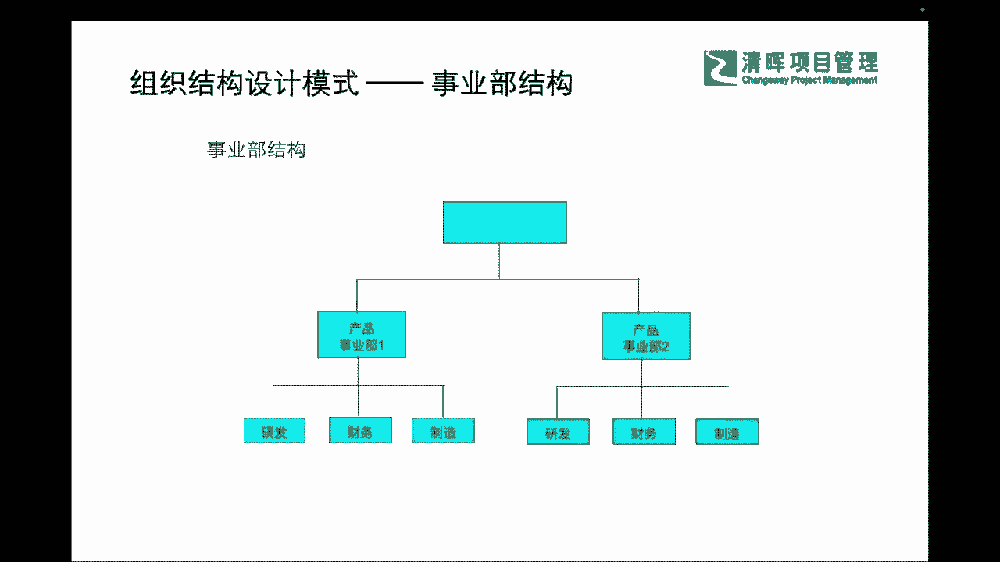