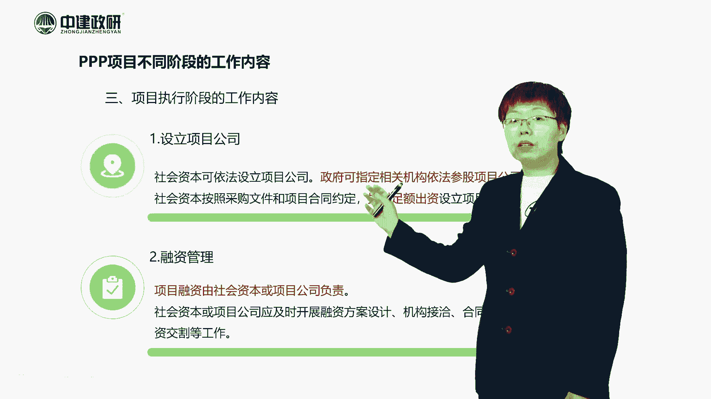
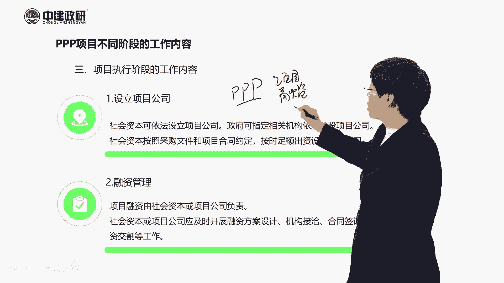
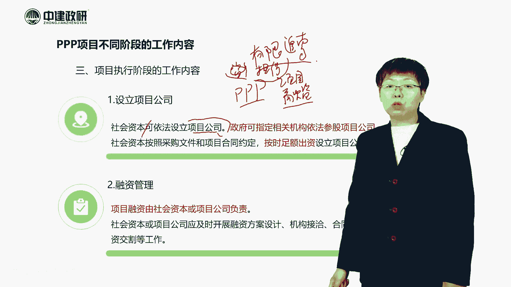
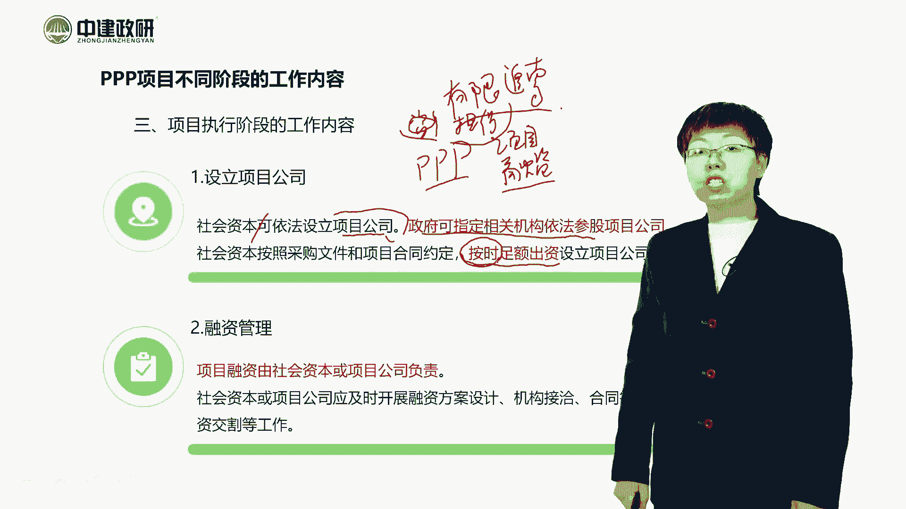
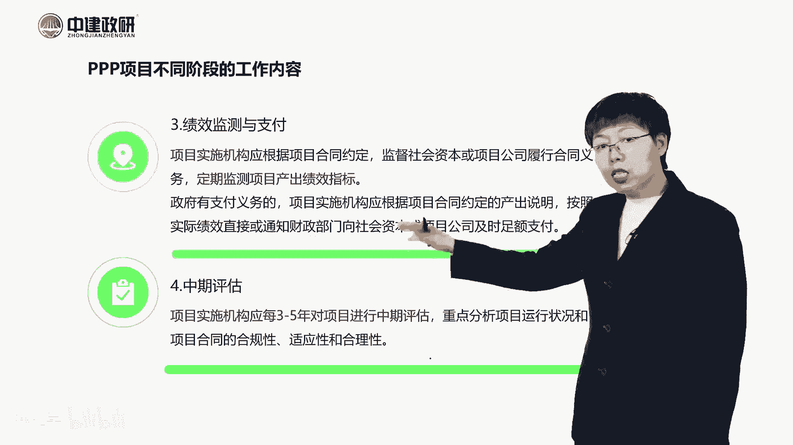
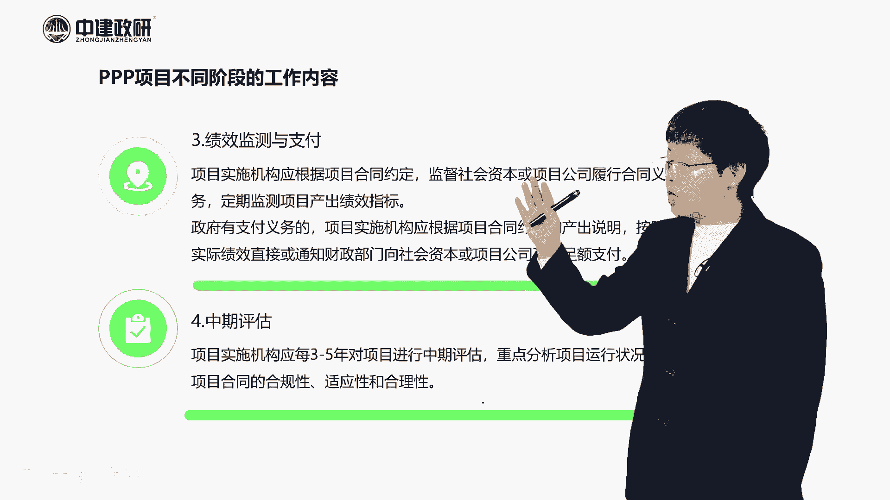
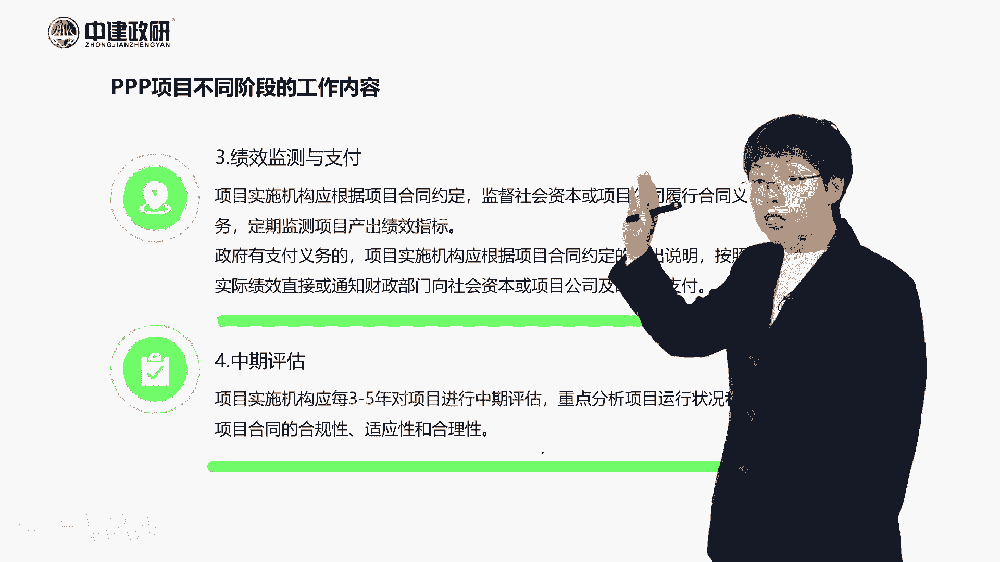
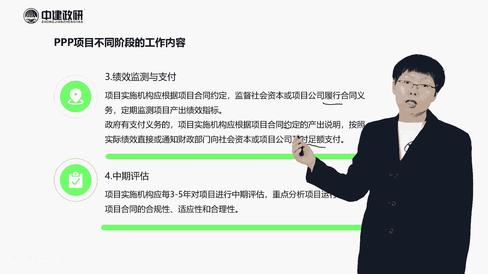
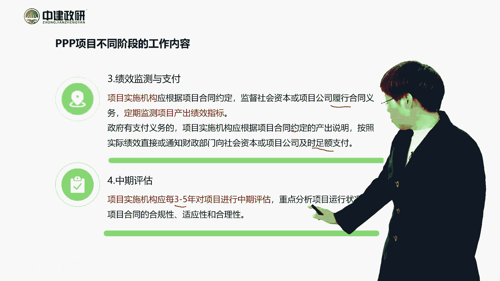

# PPP项目不同阶段的工作内容——项目执行阶段的工作内容 - P1 - 建企学 - BV1cz4y1w7Dg

接下来我们来看第三个阶段，项目执行阶段的一个工作内容，那么项目执行阶段呢。

首先第一个要成立项目公司啊。

要成立项目公司，那么我们这里面为什么要成立项目公司。

实际上我们在PPP模式当中呢，我们大家要注意啊，PPP模式呢我们实际上最早提到pp的时候呢。

它是一种融资方式啊。

它采用的融资方式叫什么呢，叫项目融资啊。

叫项目融资，我们大家注意这种项目融资呢。

它跟我们的传统融资是不一样的，项目融资当中呢。

它的这个风险呢一般是比较大的，而且这个里头呢它在项目融资。

因为它采用的是一种我们叫什么呢，我们叫有限追溯。

叫有限追溯这样的一种方式，有限追溯这种方式是什么意思呢。

就是说我以项目的资产做抵押。

那么将来你的债权人能够追溯的，一般就是我项目的资产啊。

就是就是我抵押的这个项目的资产，当然我这里头可能还会有一些额外的。

其他的担保啊，其他的担保，那这个你也可以是追溯的。

其他的你就不能再追了啊，所以这实际上是有限追索。

然后呢，用项目的现金流量呢来偿还他的这个借款啊。

用项目的长这个现金流量来偿还借款，所以因为它的风险比较大。

所以我们的这个投资人，或者说我们社会资本来说，一般呢会去设立一个项目公司。

实际上我们可以做到这种风险的隔离。

也就是我们把项目的风险呢，就限定在了这个项目公司。

那么我们的这个总公司，或者说我们社会资本的风险就会小一些。

所以他这里面呢在实践当中，我们一般都会设立一个项目公司啊。

啊那么这个时候我们在设立项目公司的时候，前面我们也提到了，就是我们要是依据呢是公司法对吧。

是依据公司法，那么在这个里面呢我们要注意这个实践当中呢。

一般政府呢多数项目，政府呢也会诶指定机构来依法参股。

这个项目公司，所以这个时候大家注意就又有了一个什么呢。

叫政府出资代表啊。

出资代表我们前面是不是有一个实施机构，他是来负责项目的具体实施的。

这个呢还有一个政府的一个初次代表啊，就是他是来提供这个10%的资金。

所以他要参与到这个项目公司当中啊。

参股项目公司当中，这是这个呃，那么我们这个时候呢。

在成立项目公司的这个里面呢，我们大家要特别注意。

他要求你要按时足额出资，那么这个时间是什么。

大家注意啊，这个时间呢一般我们要按照他的一个建设进度。

你来出资，因为我有项目，有建设的时候，我有一个建设进度，我有一个资金的需求。

所以你要按照这个建设进度来进行出资，那么另外一个呢就是我们说的这个要足额出资。

足额出资是什么呢，这个就涉及到我们前面说的。

那个资本金的要求啊，你的这个出资呢要能够满足项目资本金的要求。

所以他这个额度，实际上是一般根据我们项目的资本金额。

来确定的啊，就是这个实际上现在我们在这个，对于这个项目上，他的资本金的要求，或者他注册资本要求是还有一个什么呢。

我们叫穿透管理啊，叫穿透管理。

就是你的资本金呢必须是你的一个自有资金啊，必须是你的自有资金呃。

另外呢我们到后面还会给大家带来详细的。

到项目公司设立的时候，我们再来展开讲，就是项目公司的注册资金啊。

注册资金呢我们从工商注册的一个角度来说。

实际上它是一个认缴制的对吧，但是我们从从项目资本金的角度来说。

实际上它是一个实缴制的，所以这两者之间呢。

我们在实践当中，一般的项目公司，它的注册资金呢就等于它的资本金了。

就等于他的资本金了，而且一般它也采用的是实缴制啊。

这就是这块啊，我们大家先在这呢先简单了解一下。

后面我们再给大家详细的来说好，那我有了资本金。

剩下的这部分呢我就要去做融资啊，融资，那么融资的时候我们大家注意啊。

这个融资是由项目公司来负责的，因为我现在成立了项目公司。

就是项目公司来负责的，那这个时候呢他要进行一个融资方案的设计。

要进行一个呃机构的接洽，要进行一个合同的签署和融资的交割。

这些工作都是项目公司来做，所以说实际上这个是我们企业的工作。

这块也是我们企业的工作对吧，就是我们从企业的角度来说呢。

这都是我们要做的工作，那这个我们企业在做这个融资管理的时候。

就是你肯定要去做这些，我们这儿也写了，你需要做做一个设计唉。

看一下每一个方案它的融资成本是多少，我们肯定要去选一个融资成本比较低的。

来进行融资啊，所以这是这块儿这个工作，这是主要由企业来做的。

接下来绩效监测和支付，大家注意啊，这个绩效监测和支付。

是贯穿了我们项目的一个全过程的，我有建设阶段的话。

建设阶段也要进行一个绩效的监控，然后到建设期结束。

我们要进行一个绩效的一个评价啊，到运营期，我要按周期来开展一个绩效的一个监测。

然后再根据我们的约定来进行。

根据绩效评价的结果来付费，所以这是这个阶段，这个阶段呢我们虽然是这么说。

就是履行合同对吧，就是来履行合同诶。

然后政府有支付义务的时候呢，政府就按照这个约定来进行支付，但实际上他是时间呢。

是贯彻了项目的一个全过程啊，全过程呃。

那么这个阶段呢，我们后面呢会去讲到它的一个绩效。

我们也会去讲到他的一个付费的问题啊，所以这一段儿我们会讲到。

尤其是关于这个付费，那么付费到底怎么来付费，这个实际上在我们的实施方案当中呢。

都是有设计的，就是它采用不同的一个呃模式。

它的付费方式呢也是不一样的，那么接下来呢就是中期评估啊。

中期评估呢就是这个三到5年的时候呢，我们会有一个中期评估啊，就是来分析下它的运行状况。

和他的合同的一个执行情况，当然了。

我们在这个时候呢，也会有一个他的绩效的一个再评价啊，极限的再评价。

这个呢都是在他的项目运营阶段呢，我们来做的啊。

