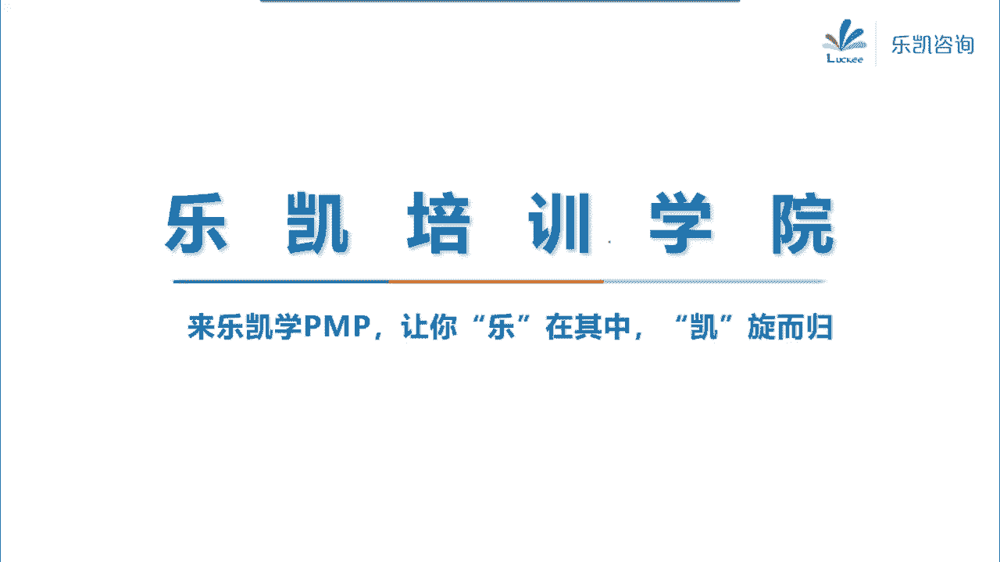
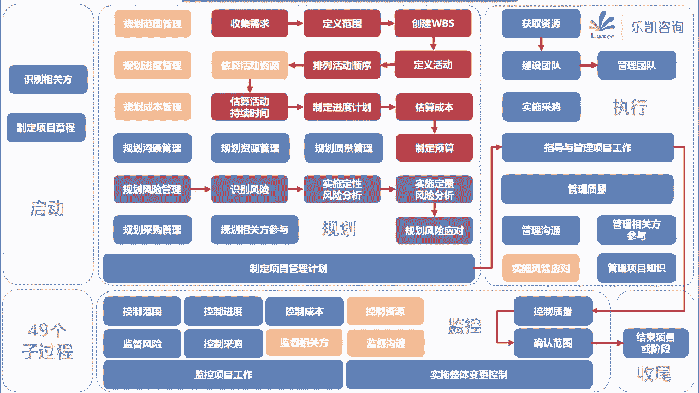

# pmp全书串讲 - P1 - wuerwuerwuer - BV1zL4y187W2

我们开始上课啊。这个今天晚上呢我们把整本书呢给大家过一下，好吧。那么今天晚上这节课的目的呢，当然一方面是为了照顾这个机考班的一些学员。那么广东的考试呢，大家应该收到通知了，对吧？

本来6月份广东的考生没有考成，延期到9月4号对吧？重新考一次，但是现在呢又被推迟了。因为这个疫情呢这个一直不稳定，包括今天上海也出现了一例，对吧？呃，不管怎么说啊，这个反正我们学习呢还是该学习。好吧。

那么今天这节课的目的呢是希望通过这节课，让大家对整个篇 book这套体系有一个比较全局性的一些了解。好吧，那么今天晚上的这个课件呢，实际上大家在讲义上几乎每一张都会有，就是这张图。

那么接下来我给大家解释一下这套体系它在讲什么。好吧，那么我们在做一个项目的时候，首先我们要启动这个项目。

那么在早期启动的时候，我们要做什么事情呢？首先我们要让这个项目名正言顺，要让项目经理得到任命。所以说我们做了一个过程，叫制定项目章程，它属于启动过程中。对吧那么制定项目章程就是制定一份正式确定项目地位。

正式任命项目经理的这样一份文件。那么在其实在这个项目前期啊，我们就已经对项目进行了论证了，对吧？所以我们前期有一些商业文件，比如说商业论证，论证这个项目是否值得投资的。比如说效益管理计划。

包括我们跟外部的客户签的通常叫合同，对吧？当然它的输入叫协议啊，一般外部项目就叫合同，那么我们把这些输入进行什么呢？进行分析。那么通过什么工具呢？哎，比如说我可以通过专家判断啊，哎。

我可以通过焦点小组反谈、头脑风暴等等各种方法，然后来做出一份项目章程。那么这份项目章程就正式启动了这个项目。那么项目章程里面，在一开始它里面的内容它会很详细吗？它不会很详细。为什么不会很详细呢？

因为在启动阶段，我们要把这个项目例项，实际上不需要写什么很详细的东西。我们会写一些什么信息呢？会写一些比如说项目的目的、目标、成功标准、退出标准以及很多的高层级的对了，就是有人说的宏观的一些信息。

比如说高层级的需求，高层级的范围，对吧？总体的里程碑进度计划，啊，包括高层级的风险等等，都是一些宏观角度的一些东西。当然，项目章程里面至少要包括项目经理的职责和权利，也包括发起人那些信息，对吧？

那么项目章程这个过程。主要的目的是把这份文件做出来，除了输出项目章程以外，还输出了一个东西叫假设日志。这个大家应该还有印象吧。假设日志记录了我们整个项目的所有的假设条件和资援因素，对吧？

那么为什么要记这个东西呢？联想到第十1章风险，你们会发现以后我们可以通过识别假设条件，它不成立的时候会带来什么威胁，识别资源因素放松会带来什么机会，对吧？

通过分析假设条件和资约因素可以帮助我们去识别威险和机会，也就是识别风险。所以在识别风险里面有一个工具叫假设条件和资约因素分析。对吧？好，那么这个过程把我们这个项目立向了。那么同时在启动过程。

我们很早的时候还要做一件事儿，什么事情呢？就是要识别我们项目的相关方。什么叫相关方呢？就是凡是能够受这个项目影响或者影响这个项目的人，他都是相关方。比如说内部的。一些相关方、职能经理，比如说外部的客户。

对吧？等等，他都是相关方。那么为什么要去识别相关方呢？因为相关方的满意度一直是我们项目的一个目标，我们一定要尽早识别，让他们尽早参与，然后我们要尽早去管理。所以我们一开始就要做这个过程识别相关方。

那么识别相关方这个过程我们关键要知道他的工具和他的输出。那么我们可以把工具跟输出呢对应起来去记。大家回忆一下，比如说。

我们可以通过问卷调查或者头脑风暴这种数据收集技术去收集到相关方的一些很基本的什么姓名啊、年龄啊、性别呀、联系电话、邮箱等等。这一类叫什么呢？叫身份信息。对吧那么接下来我们还可以通过相关方分析。

相关方分析可以分析什么，可以分析这个人对我们项目的期望是什么，态度是什么，对吧？那么这个分析是分析得到相关方的评估信息。识别出来，我们还要分析的分析完了之后，我们还要去对相关方进行什么呢？分类。

比如说对于简单的项目，我们可以用权利利益方格这样一种二维的东西来分类，还记得吧？权利高利益高的，属于哪一类，属于要重点管理的那一类。权利很高，利益很高，对吧？那么权利很高。

但是呢对我这个项目呢不太关心利益很低的这种人是哪种人？就是我们上课讲的，比如说客户那边一个大领导，但是呢不是管我们这个项目的，那么这种人他的特点是什么呢？你不要去麻烦他，对吧？如果你把他搞得不爽了。😡。

他可能会搞死你很容易的。所以这种人我们要令其满意。😡，对吧那么对于那种权利很低，但是利高的那些人，我们要随时告知，比较典型的就是甲方那边的对接人。😡，那么权利跟利益都低的，我们要监督，对吧？

那么这个是对于简单的项目，我们可以用这种二维举证。那么如果稍微复杂一点，我们可以把二维变成三维，三维就变成了相关方立方体。对吧那么对于大型的复杂的相关方社区，我们可以用凸显模型对吧？对它进行分类。

那么其实这些工具。带来的身份信息。😡，然后评估信息和分类就组成了一份输出。这份输出我们经常看得到叫相关方登记册。那么我们在做项目的过程当中，或者说在做题的过程中，只要出现了新的相关方。

首先第一步我们就是要更新相关方的计策，对吧？那么在做的过程中，如果说我们已经有了项目管理计划，那么在更新相关方的计策的时候，可能还会导致一些计划的改变，所以要提出变更请求。好。

那么这个是我们启动过程要做的事情。那么接下来启动完了。项目立项了，我们也识别了相关方，我们进入规划。好，进入规划。接下来首先第一步要规划范围管理。啊，想一想我们怎么去管范围，怎么去管需求，对吧？

要制定一份指南出来。那么这份指南要注意，范围管理计划里面只是说将来如何去管范围，需求管理计划里面说的是如何去管需求，它里面既没有真实的范围，也没有真实的需求。好吧，好，那么有了这份指南。

接下来我们开始收集需求。我们项目的范围源自于需求。那么收集需求这个过程，实际上它考工具考的比较多，我们也要灵活使用。比如说我来问大家来回答。不至于不分析的畅所欲言的一种方法。是什么方法？啊。

我们不要去质疑，不要去分析，大家畅所欲言。对吧啊，这是一个很典型的头脑风暴啊，随便说，对吧？好，然后。如果我们默认。找一些同职能的或者同一个领域的聚焦在某一个点。比如说哎我都找法律这一块的专家。

对吧聚焦在法律这个点，或者我们都找财务方面的专家，聚焦在财务这个点。😡，那么我们同智能同一个领域聚焦在某一个点的这个就叫焦点小组是吧？好，如果遇到地理位置分散、受众、多样化，适合快速开展统计分析的。

很明显问卷调查。对吧？好，假如说我自己不会，那么自己不会怎么办？我去看一看同行业有没有做的比较好的啊，我做短视频的，我看一看抖音人家怎么做的。哎，我做打车软件的，我看一看人家滴滴是怎么做的对吧？哎。😡。

找一些标杆性的一些东西过来参照一下，识别最佳实际形成改进意见，对吧？标杆对照。标乱对照。好，再比如说。我们有一种方法，我们可以找几个专家。专家呢相互之间呢不联系，是匿名的，或者叫背靠背的。然后呢。

我们通过多轮最终能够达成共识的这种方法叫什么呢？叫得尔飞，对吧？它属于投票里面的一致同意这种方法。当然除了一致同意，我们还可以用大多数原则，啊，超过50%的人同意就怎么样，对吧？或者相对多数。

没有哪个超过半数，但是我找一个相对多的，当然也包括独裁，我们还可以通过什么呢？从不同的维度设置不同的权重，然后去打分权重乘以得分，然后算一个总分。对了，多标准决策分析，对吧？

包括我们还可以在头脑风暴的基础上，比如说头脑风暴收集的很多需求。那我们要把相亲的相近的分成一个小组。对吧哎，比如说我找了很多的人啊，什么北京的这群人，华富森一个小组，上海的华富特一个小组，对吧？

就像我们收集需求，哎，这类需求华富腾一组那类需求华富森一组，对了，亲和图分组分类的，包括我们还可以把很多信息整合在一张图里面，反映共性与差异，激发新创意，这个叫思维导图，对吧？好。

假如说我们要体现人民的意志。人手一票让他们去投票和排序。这个工具叫民意小组。对吧当然遇到那些不愿意说的，或者说也说不清楚的，我们可以怎么办呢？哎，我们可以观察和交谈。哎，如果说遇到多个部门意见不一致。

或者相关方之间意见不一致，要协调跨部门需求，要协调相关方差异的，我们可以用引导的方法。包括我们为了减轻返工的风险，我们可以先做一个模型出来。哎，比如说软件里面用actual去画一个圆形。建筑行业里面。

比如说唉样板房像这种就是什么呢？圆型法可以减轻返工的风险，对吧？那么我们通过这么多的工具。最终我们得到了这个项目的什么东西。需求文件。把需求文件给做出来了。

那么需求文件就是描述了单一需求将来如何去实现相应的高层级的业务需求。那么除了需求文件以外，我们还输出了一个东西，用来我们全过程去跟踪的这个叫需求跟踪矩证，对吧？

把它把需求从产品来源链接到可交付成本的一种表格，确保每一个需求都有价值，确保每一个需求都能够得以实现。需求更多举证。好，那么这是我们收集需求要做的事情。那么收集完需求之后，接下来怎么办呢？哎。

我们上课介绍过需求跟范围的区别。需求是一种需要。那么为了满足客户这个需要，我们就要交付一些可交付成果。如果你把需求已经收集出来了，我们就可以定义可交付成果，用什么可交付成果来满足它。

而且定义好了要跟客户达成一致，所以我们做了一个过程叫定义范围，对吧？它的输入当然有需求文件，当然有高层级的范围可以看到项目章程。那么通过比如说备选方案分析哎，多个方案里面要选择选个备选方案分析。

然后多标准决策分析，包括引导包括产品分析，那么我们最终要输出一个很重要的东西，叫范围说明书，范围说明书代表了相关方之间就范围达成了共识，好，范围说明书里面，它包括的内容一定要注意的。其中有一对很重要。

它里面一定会描述我们将来要交付哪几个或者哪些可交付成果，对吧？然后每一个可交付成果对应的验收标准是什么？所以可交付成果跟验收标准一定要说清楚的？当然还包括产品范围描述以及另外一个东西叫除外责任。

那么关于除外责任这个问题呢，一定要考虑清楚。我们范围说明书里面为什么要写不在范围里面的除外责任呢？我们上课解释过，因为我们在做项目的时候，有一些地方容易造成误解。比如说我举过一个例子。

你在买精装修的房子的时候，售楼处的小姐姐会告诉你，哎，你给我来看一下样板间，将来我们交付就是这个样子，但是不包括家具。对吧家具你要自己买，那么明确说好除外责任就是为了减少什么呢？减少将来。

扯皮或者说实在客户的压力受不了，造成范围蔓延，对吧？好，除外责任这个东西一定要记住啊，通俗的说就是我跟你说清楚，这个项目我只帮你找老婆，但是我不帮你一定生儿子的对吧？好。

定义范围这个过程把范围说明书跟相关方之间达成了共识，定义下来了，接下来。你会发现可交付成果呢太大了，无从下手啊，对吧？你说这么大一个可交付成果，这个怎么搞呢？好，大的东西如果你觉得无从下手怎么办？

那么就把它切割成小的呢？不就好了吗？对吧？一块大的玻璃，你想要偷到家里去，对吧？哎，搬不进去怎么办？我教你一个办法把它敲碎，对吧？敲碎了之后把每一块小的搬回去，然后用透明胶带把它再贴起来，不就完了吗？

所以接下来我们就做了一个分解的工作，这个过程叫创建WBS创建WBS，它的本质就是把可交付成果分解成什么呢？工作包的这样一个过程，那么既然要分解可交付成果，它的输入一定有什么呢？范围说明书。😡。

你要对它进行分解嘛，对吧？那么分解的时候，那些东西呢，大家脑子里面有个印象啊，什么比如说我们要自上而下逐层分解，对吧？然后呢，要符合百分之百原则，然后呢，责任要唯一，对吧？然后有两个建议。

建议不要超过什么80小时，建议呢4到6层，对吧？好，那么最终分解完了之后，最底层的我们叫工作包。如果你信息不够明朗，分解到一部分就分不下去了，临时放着的有待进一步规划的，这个叫什么呢？叫规划包。

对吧那么这个过程做完，我们就输出了一个东西叫范围基准。实际上范围基准就包括什么？包括我们WBS以及用来描述WBS里面每一个组件的WBS词典和范围说明书，这三者一起获得批准，就形成了我们的范围基准。好。

那么可交付成果分解到了工作包了。那么问题是，接下来工作包怎么来呢？它虽然这个已经足够小了，对吧？😡，而且也有唯一的小组或者部门去负责了。那么这个工作包怎么来？那么我们发现工作包它是要通过一些活动。

你进行了这些活动之后，最终会得到这个工作包。对吧那么接下来我们就要知道整个如果我们要知道整个项目的进度和成本，我们还要做一件事情，要把分工作包分解到活动。所以这就到了我们的进度这一块。

那么我们首先要做规划进度管理，做完了之后立即就做了一件事情，把工作包分解为活动，做了一个定义活动的过程。是吧那么它的输入，你既然要分解工作包，它的输入一定有范围基准。那么分解的时候要考虑到滚动式规划。

那么最终我们就得到了活动清单、活动属性跟里程碑清单这几个关键的输出。对吧那么这里要注意的一个细节，就是里程碑它不是活动。里程碑是一个重要的时间点或者事件，它的持续时间为0。好，那么定义活动做完了。

接下来怎么办？我们要考虑这个项目要做多久。我们首先要把活动怎么样呢？要排序的。所以我们就做了一个过程叫排列活动顺序。那么那堆活动怎么去排呢？哎，我们可以通过PDM警情关系绘图法。大家还记得吧？哎。

比如说这两个活动究竟有没有什么逻辑关系，如果有是什么关系，是FS的，还是SS还是FF还是最不常见的那种SF的关系，就这四种关系，对吧？你把这些活动去排一排逻辑关系去排好。然后接下来还要考虑一个问题。

你排好了之后啊，还要确定他们的依赖关系。因为这个依赖关系就决定了我们后续能不能对它进行调整，对吧？比如说有的活动之间就是那种强制性依赖关系。像法律要求或者合同要求的这个就是强制性依赖关系。

或者呢由工作的内在性质决定的。😡，对吧你不能改变的。你比如说你必须要等服务器到了之后，你才能去调试吧。服务器不到，你怎么去调试呢？这个就是取决于内部的对吧？哎，这种叫硬逻辑。

那么还有一种逻辑关系呢叫软逻辑，也叫选择性依赖关系。也就是说，我们现在这么排，它是一种最佳实践，对吧？哎，我在上课举了一个例子，我的最佳实践是什么呢？我的最佳实践就是。😡，我先刷牙，然后再蹲坑。

这两个活动是FS关系，没有错，追加实践。但是呢它不是强制要求的。哎，有的时候为了节约时间，我完全可以坐在马桶上刷个牙，对吧？节约时间也可以，但是这样做呢会带来风险，对吧？还记得这种方法叫快速跟进吧。

那么这是一对强制性跟选择性。另外还有一对是什么呢？是外部跟内部依赖关系。那么这边一定要注意的，所谓的外部依赖和内部依赖是指什么以外，什么以内。一定要注意啊，是项目。

如果是项目活动跟非项目活动之间的这就叫外部了。不管你在不在一个公司，对吧？只有项目同一个项目之间的活动之间的依赖关系，这才叫内部依赖关系。😡，好，那么这个是我们要考虑的依赖关系，对吧？

然后接下来提前量和滞后量，我们也要考虑的。哎，比如说家里装修是一个活动，搬家是一个活动，装修完了之后能直接搬家吗？不能啊？有甲醛，所以我们要滞后个60天通过风，对吧？那么我们一般怎么去描述呢？

前一个活动结束之后，在等待60天开始后一个活动，那么为了美观，我们会写成FS加多少天？对吧，那么这个叫滞后量，那么提前量也是一样的道理。我们有的时候不一定要等前一个活动做完才开始后一个活动。

在前一个活动完成的前多少天，我们就可以开始了。那么一般我们写成FS减多少天。对吧好，那么通过这几个工具，我们把活动的顺序排列一排，最终形成了一张图，叫项目进度网络图。好，排完了活动顺序之后。

接下来怎么样呢？其实呢按照顺序来讲，我们应该先做这个过程，这个过程属于第九章，叫估算活动资源。因为你估好了资源之后，知道有什么资源才知道这个资源要花多少时间。但是这个过程呢在考试中一直没有作为一个考点。

所以呢这个活这个过程呢稍微了解一下，估算活动资源会得到我们项目的活动资源需求跟资源风险结构，对吧？好，然后接下来我们对每一个活动去估算活动持续时间。项目进度网络图有了每个活动要多久呢？

每个活动的时间我们要去估啊。好，怎么去估？😡，一拍脑袋，专家判断可以估断。还有一种呢也是一种专家判断，对吧？它是说我以前做过类似的东西，对吧？以前做了多久，那么我这次还是要多久，它是专家判断的一种。

对吧？它的特点是速度快，成本低，但是呢不准啊，你别问我准不准？我就问你快不快，对吧？这是一种什么方法，类比估算。😡，好，还有我以前做过类似的东西。啊，我以前做过这个东西，我这次做的东西呢。

跟之前的数量级不一样了。我不是直接拍脑袋的，我要套公式去算一算的。比如说我昨天吃一个包子2分钟，今天晚上我要吃三个包子，你说多长时间，哎，我就可以套个公式去算出来的对吧？这个叫参数估算。

那么参数估算准不准，取决于基础数据的准确性和你的公式的或者说数据模型的成熟度，对吧？再比如说我可以去找啊之前。😡，做这个事情的最悲观花了多少时间？最乐观花了多少时间，最可能花了多少时间。

然后我用最悲观加最乐观加4倍的最可能去除以6，对吧？算出一个平均工期。这个方法叫三点估算，考虑到风险和不确定性。我们用的这种per的三点估算的技术。对吧当然刚刚有人说到哎。我还有一种很准的方法。

对吧哎比如说你要问我今天晚上出去吃饭要多长时间，我把每一个细节呢全部都搞出来。我今天下电梯要多久，从电梯下来之后，走到小区门口要多久，对吧？小区门口走到饭店要多久，点菜要多久，吃饭要多久，回来要多久。

对吧？然后逐层汇总把它加上去，这个叫自下而上的估算，这种方法它的特点是相对来说比较准，但是呢耗时比较长。对吧那么在估算的时候，我们有可能还会注意到什么呢？这个活动啊我能想得到的。他有些风险。

对吧那么正因为只后这个活动有一些风险，所以我要留一些储备。这个储备呢，我一开始估就能够估出来了，最终也能够获得批准，也在记准里面呢，那么这种储备叫应急储备，对吧？那么如果应对位置风险呢。

也有一种叫管理储备。这个工具叫储备分析。那么通过种种方法，我们能够把活动的持续时间都估出来。我们就得到了活动持续时间估算和估算依据。😡，好，那么接下来。网络图有了。网络图里面的每一个活动要多久。

我们也估出来了，接下来我们就可以制定进度计划。对吧那么制定进度计划实际上是。了解我们整个项目的一个。进度情况的一个很重要的一个过程啊，那么我们之前已经有了活动的这些信息，包括持续时间，包括网络图。

那么我们就可以通过一些工具来做进度计划。比如说我们可以先找一找这个网络图里面所有路径里面最长的那条路径。因为最长的这条路径呢，就决定了我们这个项目最短的工期。比如说最长的那条路径是30。

就决定了我们这个项目至少需要30天。理论上来说需要30天，那么这条路径我们把它叫关键路径，对吧？那么。关键路径我们在上课讲过一个方法，叫顺推跟逆推的方法，用七格图也可以找到关键路径。

你七格图顺推逆推总浮动时间是零的那个路径，就是关键路径。对吧那么这里面除了总浮动时间，还有一个概念叫自由浮动时间。那么这两个概念呢要对比去看的。什么叫总浮动时间呢？某一个活动可以延期。

但是它不影响整个项目攻期的这个就是总浮动时间。😡，它体现了进度的灵活性，对吧？哎，如果说这个活动可以延期，它连他任何一个紧候活动都不影响，那么这个是不影响的时间叫自由浮动时间，这两个要分清楚的。

那么这是第一个方法叫关键路径法。但问题是，关键路径法这种方法排出来的进度计划不一定是可行的。为什么呢？因为我们在当时顺推逆推的时候，我们只考虑到了路径的约束，我们没有考虑到资源的问题。😡。

有可能你计划排好了之后，你忽然发现哎，怎么有一个资源要做好多个工作啊，对吧？资源的负荷太高，所以我们一般用关键路径法做完了，都要结合一个技术，叫资源优化技术。😡，它包括资源平衡和资源平滑。

资源平衡比较简单粗暴，它就是往后挪来避开这个资源的波峰，对吧？那么这样做的后果是它有可能会导致关键路径的延长。那么资源平滑呢相对来说呢比较好一点，哎，它可以。不改变关键路径。

让活动呢在它的浮动时间里面呢去调整。但问题是资源平滑，不一定能实现所有的优化。要看运气好不好，它有没有浮动时间能不能活，对吧？那么关键路径跟资源优化是一对黄金搭档。那么除了这两个工具以外。

还有一些其他的工具，比如说比较重要的进度压缩。当我们用关键路径法排好了计划，把资源的问题也考进去了，做了资源资源的优化。结果呢发现。我们这个工期不符合合同的要求，那么这个时候怎么办？哎。

我们就要把它压缩压缩啊，对吧？那么进度压缩有一个前提，什么前提呢？不能够改变范围，在不改变范围的前提下来压缩工期。它有两种方法，一种叫赶工，对吧？什么叫赶工呢？赶工就是指以最小的成本增加来压缩工期。

它的典型的例子有三个加加班对吧？加人或者加急赶工的本质实际上是什么呢？是花钱来买时间的，所以赶工最直接的后果是导致成本增加。那么除了赶工以外，还有一种方法叫快速跟进。

快速跟进就是把原来顺序进行的改成并行或者至少部分并行去做。对吧那么快速跟进这种方法有什么特点呢？它增加了风险，对吧？另外，如果你打算要快速跟进，一定要确定你要快速跟进的活动之间是选择性依赖关系，对吧？

你选择性依赖关系你才能并行去做啊，但是这样做也会增加项目的风险的。好，那么进度压缩的这两个工具，一定要搞清楚。那么其实呢我们这个过程还有一些其他的工具，比如说有假设情景分析。

比如说我们可以用蒙特卡罗去反复模拟，对吧？那么这些工具呢，大家稍微了解一下就行了。好，这个过程最终我们就能够得到进度基准。那么进度基准是一份经批准的进度模型了。我在上课举过一个例子。进度基准获得批准。

就像我们在招聘网站把自己的简历填好，点了保存，对吧？你保存好了之后，从这个基准里面可以导出PDF格式的简历。word格式的简历，图片格式的简历，对吧？那么我们这边也是一样的。

进度基准是一个经批准的数据模型，你可以导出三种形式的叫什么呢？叫进度计划。比如说只显示关键可交付成果跟外部接口的这种叫里程碑图。对吧哎，比如说有那种横条的能够显示项目进展的。然后便于向管理层去汇报了。

这个叫什么呢？叫横道图或者叫甘特图，对吧？当然还有一种就是项目进度网络图。所以这个过程会输出什么呢？各种形式的项目进度计划。当然。我们还可以通过这个过程得到我们项目上的一份日历。这份日历就告诉我们。

我们什么时候工作，什么时候这个项目呢是不工作的，或者呢说清楚班次的问题。那么这个日历叫什么呢？叫项目日历。对吧哎，我们平时说周一到周五是上班的，周六周日是休息的，这个叫标准日历。

在我们一些进度编制软件project里面，我们就称之为标准日历。但我们项目上不一定是按照这个标准日历来了，所以我们有自己的项目日历的，对吧？好，那么到这里为止，我们进度搞出来了。

我们从一开始的范围了解到我们要做什么，到进度，我们知道了要做多久。接下来还要考虑一个比较重要的问题，就是我们这个项目估计要花多少成本。😡，对吧花多少，所以我们接下来就到了成本这一块。我们要规划成本管理。

然后紧接着我们就要估算这个项目的成本。那么你说成本跟什么有关呢？大家会明显感觉到成本跟什么有关，跟资源。😡，对吧然后资源干多久有密切的关系，也就是说它跟进度是有关系的。而且还有一些特殊的成本。

也是跟进度有关系的。比如说。一些融资成本。哎，我们的钱是从银行贷款的，你的进度越长，利息过越高，对吧？所以说估算成本就有一个很重要的输入，是项目的进度计划。对吧用项目的进度计划作为输入。

然后我们再对成本进行。比如说类比估算啊、参数估算啊，三点估算啊，或者自下而上估算，这些估算方法都是一样的。当然在这边，项目经理还可以对已知未知风险去留什么呢？应急储备。

对吧那么最终要注意应急储备是属于成本基准的，项目计是可以直接动用的。当然在这一边呢，还要考虑相应的质量成本。那么通过这个过程，我们就得到了。项目的成本估算以及估算依据。好，很多人会问一个问题。

估算成本跟后面的制定预算有什么区别？估算成本它是对我们整个项目的成本做的一个近似的估算。他只是做一个近似估算，对吧？但是这个估算呢没有获得批准，而制定预算是干什么？

制定预算是建立一个经批准的成本基准的过程，他要获得批准。😡，那么怎么去获得批准呢？你之前估算不是有了估算依据和这个成本估算吗？对吧？那么接下来我们就要分析，我们可以对它进行成本汇总，对吧？

另外考虑到管理储备，做储备分析。包括要结合历史信息进行审核。还要考虑资金线的平衡，最终我们就能够得到一个经批准的叫成本基准，对吧？那么要注意成本基准里面包括应急储备，但是不包括管理储备，对吧？

如果在成本的基础上，再考虑管理储备，成本基准加上管理储备，实际上就是我们整个项目的资金总需求。好，到这里为止。成本定下来了，对吧？那么我们刚刚回顾的这个过程，就说到了规划里面的怎么样从范围到进度到成本。

把范围基准、进度基准、成本基准全部都搞定了。好，接下来我们规划还有事情要做。比如说我们要规划质量。对吧。那么为什么要规划质量呢？因为质量很重要啊，如果质量做的不好，会导致很严重的外部失败成本。

所以我们一定要去好好规划质量问题。对吧做一份质量管理计划。那么做质量管理计划就要明确我们项目的质量标准。然后要说清楚我们将如何达到这个标准。好，接下来问题来了。如果我不知道用什么标准。那怎么办？

同样的有一个工具，看一看别人质量做的好的，人家是怎么做的对吧？哎，我们可以标竿对燥嘛，识别最佳实践，形成改进意见啊，对吧？然后在规划质量的时候，我们要规划好将来如何去管理质量，如何去控制质量。

但是呢我不知道有一些质量的这个活动究竟值不值得做。😡，对吧你说吧，他做吧，他需要些钱。😡，但是做了之后呢，又能够提高我们的质量，减少返工，对吧？那么究竟我们规划质量的时候，考虑要不要去做这个东西呢？

我们就要考虑我们的成本和它带来的效益问题，对吧？对了，所以规划质量有这么一个工具，叫成本效益分析，是吧？那么在规划质量的时候，我们还要注意相应的质量成本比如说我们有一类成本叫一致性成本，😡。

它包括预防成本和评价成本。那么预防成本里面就包括我们平时可能要组织培训，包括用更可靠的设备流程文档化评价成本呢就是指我们要检查测试、破坏性测试。那么不管怎么说，为什么他们叫一次性成本呢？

因为他们能够防止失败。当然还有一种成本是为了处理失败的，已经失败了。那么这个叫非一制性成本，它包括内部失败和外部失败，内部失败就是我们团队发现的返工废品，外部失败就是客户发现了，这个就很严重了。

会导致我们的业务流失，会导致我们的责任保修，对吧？包括影响我们公司的声誉。那么质量成本也是我们要考虑的。当然。在规划成本的时候啊啊，在规划质量的时候啊，还有一个工具也很典型。什么工具呢？

比如说我要规划一下我炸薯条的，我将来怎么样能把这个炸薯条的项目的质量做好呢？好，我分析一下炸薯条分别包括哪几个步骤，什么地方容易出问题，在容易出问题的地方，我就要将来去对它检查，你这每一步都做了没有？

所以在规划质量有一个工具叫什么呢？对了，叫流程图，流程图可以显示所有的步骤和分支，然后识别需要纳入检查点的一些地方。😡，对吧好，那么这个是我们规划质量要做的一些事情。接下来。还要规划资源管理。

那么这个资源就包括人力资源跟实物资源。那么主要呢规划资源管理在资源管理领域呢，重点是人这一块。规划资源管理实际上就是要明确我这个项目需要哪些角色，哪些职责，对吧？他们需要具备什么能力。

那么说到这个东西啊，你想要知道角色职责，特别是职责这个问题，我就想到在规划资源管理我要去依据什么呢？比如说我们之前说过的WBS这种层级型的结构。

因为当初这种层级型的结构里面就描述了工作包的高层次的一些职责，对吧？说清楚了每一个工作包由谁来负责，当然我们还可以借助什么呢？矩证型的一种东西工具来明确决策和职责，比较有典型性的就是责任分配举证。

责任分配矩证高层级的可以看出每一个工作包由哪个小组或者团队负责，第层级的可以看清楚每一个活动由具体的哪一个人来负责，对吧？那么责任分配矩证里面有一个很典型的例子叫RAACI还记得吗？RAACA里面。

我们要保证accountable A有且只有一个人。那么这个工具在考试中明确的一个考点是什么呢？就是它的作用是什么？它的作用是避免职责不清，避免职责不清。对吧？好。

那么最终我们通过这些工具可以梳理出我们的资源管理计划。资源管理计划说的就是我们如何去识别资源，如何去获取资源，我们团队里面的资源，它的角色职责，对吧？包括职权啊，包括能力分别有什么要求？

另外还有一些东西在资源管理计划里面也是要考虑的。千万不要忘了。在最早的时候，规划资源，我们就要考虑关于将来对团队培训的一些策略。你打算怎么去培训他们？对吧？包括建设团队的一些方法，用什么方法去建设团队。

包括任何与奖励的计划。你打算在什么时候用什么形式给予团队奖励，这些都是在资源管理计划里面的？当然，规划资源管理，除了输出资源管理计划以外，还输出了一个东西叫团队章程。😡，团队章程也有一个说法叫什么呢？

叫基本规则。哎，我们说哪怕是做土匪，也得有个邦规吧。更何况我们是个团队，那么团队需要什么，也需要规矩啊。那么这个东西就是基本规则，也叫团队章程。他说清楚了，我们团队能接受什么行为，不能接受什么行为。

对吧？可以减少误解，提高生产力。那么这个是我们规划资源要做的一些事情。那么另外沟通我们也要规划呀。对吧哎，为什么沟通是需要规划的呢？因为我们说所谓沟通，在项目上的沟通，就是指信息的交换。😡，信息的收发。

那么问题是，每个相关方他沟通的偏好不一样。所以我们要根据。基于每一个相关方来制定相应的沟通策略，对吧？那么这个过程有一个很关键的输入，就是相关方的计测。

那么怎么去根据他们的每一个人的特点去制定相应的策略呢？我们要做沟通需求分析，对吧？分析每一个相关方，他们需要什么信息，他们的形式格式分别是什么？我们要分析的。另外我们还要讲究沟通方法，哎。

我们究竟是用简单的推式，还是说当信息量很大，受众很多的时候，用拉式，还是说哎我们需要进行。多方的实时的一个交互，做交互式沟通。这个沟通方法要考虑清楚的对吧？另外，相关方的沟通偏好也要知道。

对吧这个工具叫沟通风格评估。我们要了解相关方的沟通偏好，他们喜欢用什么方式。啊，就像有人说的，在这个过程，我们要做好一条舔狗该做的事情，为什么呢？特别对于那些不支持我们项目的相关方。

一定要了解它的沟通偏好，人家喜欢什么，你就用什么方式去沟通，这样更容易获得什么呢？支持。那么这三个工具是比较重要的工具。当然其他还有一些工具，比如说我们要选择合理的沟通技术，哎，我们要了解沟通模型。

对吧？等等。那么最终这个过程输出了一份计划，叫沟通管理计划。好，大家要注意。沟通管理计划这份计划很特殊。我们以前说其他的管理计划都是一些指南型的东西，没有实质的内容，但沟通管理计划里面是有实质的内容的。

对吧它就包括别人需要什么信息，以什么形式，什么格式，什么语言，以什么实现和频率去发，包括问题升级上报流程，包括通用术语表等等，对吧？那么在考试中沟通题几乎95%以上都是跟这个东西有关系。

比如说当我们遇到信息多发了，信息少发了啊，你发的东西呢？嗯，信息迟发了，没有及时发，别人看不懂，对吧？包括虚拟团队的问题，他都是沟通问题。那么这个时候我们就要审查我们的沟通管理计划。

或者更新我们的沟通管理计划。啊，那么这个是规划沟通。另外，项目中的风险我们要做规划呀，对吧？我们要规划风险管理呀。那么什么叫风险呢？风险是一种不确定的事件和条件，一旦发生。

就会对我们的项目产生积极或消极的影响。所以我们一定要重视风险管理。那么规划风险管理，首先我们就要做一些准备性的工作。比如说。将来我们要识别风险，为了避免识别风险混乱。

所以我们在风险管理计划里面会事先做好一个东西，叫什么？风险的一些大类小类来帮助我们结构化的做头脑风暴。这个东西叫什么呢？叫风险风解结构RBS。对吧那么风险管理计划里面，除了RBS还要包括什么呢？

还要包括概率和影响的定义。哎，我们要定义好概率分为哪几档，影响分为哪几档，分别用什么数字来表示，对吧？概率和影响定义定义好了之后，把两个乘一层，形成一个矩证，叫概率和影响矩证。

对吧另外在风险管理计划里面还包括了什么呢？相关方的风险偏好。我们把这份指南做出来。好，除了规划风险管理，做一份指南以外，我们在规划还做了一些很多跟风险有关的事情。比如说我们要识别风险。怎么去识别？

我们可以用头脑风暴，借助RBS来头脑风暴，对吧？我们可以反弹。唉，我们还可以把类似项目中出现的风险拿过来。然后一个一个去核对这些风险会不会出现在我的项目中。但要注意的是。

千万不能因为这个东西来取代我们的风险识别工作，因为每一个项目都是独特的，我们还要考虑不在这里面的一些风险，对吧？好，这个工具叫核对单。大家说的都很正确。另外我们还可以做假设条件和资源因素分析。

做根本原因分析，对吧？还有一个很高逼格的东西。分析优势。和劣势strength和 weakness识别威胁优势能啊识识别机会，优势能带来什么机会，对吧？威那个劣势会带来什么威胁。opun和 three。

所以呢我们有个工具叫s分析，这也是一个很典型的识别风险的工具，对吧？当然了，还包括一些像提示清单啊这种的东西，用RB底层来提示我们的。那么通过这些工具，我们来把风险识别出来。

那么这个时候我们就输出了一个非常重要的东西，叫风险登记册。那么最初风险登记册里面，包括我们识别出来的风险，还有潜在的责任人以及潜在的应对。这两个潜在呢说明什么呢？说明它不确定还没有定下来。好。

识别完了风险之后怎么办呢？接下来我们就要考虑了，我们识别了那么多风险，有的呢需要认真对待有的我们呢可能只要监督监督。所以你要区分哪些是要认真对待的高危风险，哪些是低V的，我们就要做一件事情，要干什么？

要排序，要排列优先级，那么这个过程就叫定性风险风析。对吧定性风险分析还记得我们上课是怎么做的吧？每一个风险都要去评估它的概率是多少分，影响是多少分，概率乘以影响最终的风险，最终的得分是多少分。

对吧根据这个分数去排序了。那么这里面呢有两个细节要稍微注意一下的。第一。每一个风险你都得排序。对吧如果说你发现有一些风险的峰值特别的低，那怎么办？不要把它删掉，要把它纳入到观察清单，我们要观察的。对吧。

这是第一个要注意的。第二个，我再次提醒一下大家，虽然我们有概率分和影响分，最终得到一个总分，但是这个分数它没有什么实际的意义。这个分数算出来的目的就是为了让我们排序而已。就像我上课举的一个例子。😡。

你给高圆圆，我也可以打一个分数，高圆圆90分，给我老婆打一个分数，我老婆85分，你说90分有什么含义呢？85分又有什么含义呢？对吧？她只不过是用来排序而已，说明高圆圆比我老婆要漂亮很多，对吧？

如果两个人都要找我吃饭，我肯定优先考虑找高圆圆吃饭，对吧？实际上这个分数没有什么很实际的意义，对不对？好。😡，另外，在这个过程还出现了一个很重要的人，大家还记得吧？在这个过程，我们指定了一个人。

由这个人来负责后续的规划应对，实施应对这些工作。这个人叫风险责任人。哎，我们在识别风险的时候，有潜在的责任人，但是在定性的时候，把它真正给定下来了。😡，对吧好，定性主要的任务就是这个接下来能定量的。😡。

我们可以做定量风险分析。那么为什么这么说呢？因为很多风险呢，我们都想把它量化出来，但是很难量化说它的概率真正是百分之多少，影响是多少钱，对吧？也就是说不是每个风险都能够量化的，所以说能量化的量化。

不能量化的呢也没办法。那么这个过程里面呢，有几个地方呢要注意一下，它有几个典型的工具。比如说有一个工具啊跟我们小孩在医院做过敏源测试有点像。😡，它是不考虑别的因素，只考虑单因素能产生多大的影响。哎。

比如说我先搓一针看一看你是不是花粉过敏，再搓一针看一下是不是蛋白质过敏，对吧？其他因素先不考虑。😡，把其他因素固定在基准值，考虑每一个因素对项目的影响，然后从大到小排序正相关负相关。

那么比较典型的一张图叫龙卷风图，对吧？那么龙卷风图，它属于定量风险分析的工具，叫敏感性分析。好，还有。做一件事情，我们要决策的。有多少的概率会怎么样，有多少的概率会怎么样，对吧？然后几个不同的分支。

最终我们要决定选择做哪一个。比如说我们上课讲了两个例子，一个是关于新建工厂还是扩建工厂的例子。还有一个就是成本A跟成本B，选择哪一个，对吧？那么这个叫什么呢？叫决策数分析，那么我们要注意啊。

如果让你算收益。我们要选择大的，如果让你算成本，你要选择小的那个。还记得吧？那么定量风险分析呢主要就这几个工具了，没有什么太多的东西了。好，接下来。😡，这个过程很重要。

也是我们在规划的时候要做的叫规划风险应对。每一个风险识别出来了，定性了，能定量的也我们也可以定量。接下来我们就要规划怎么去应对呢？对吧？对于威胁来说。😡，对于机会来说，都有各种不同的策略。好。

首先威胁跟机会有两个策略是相同的，还记得吗？一个是超出项目层面，我们都可以上报上报威胁或者上报机会。还有一个就是当我们无法主动管理，或者呢。我也不想主动管理，那么这个时候我可以怎么呢？接受，对吧？

这两个是一样的。😡，那么其他几个呢。是对应的。比如说对于消极的威胁来说，我们可以让它不发生，或者让项目免受影响，去规避它，对吧？那么与之相对的机会里面，就有一个让它百分之百发生的叫开拓它。😡。

是不是哎用最牛逼的人能力最强的人分给你开拓他。那么威胁里面有一个叫什么呢？转移，我们可以通过买保险签合同外包的方式去转移它，让第三方来帮我们承担。那么机会里面就有一个什么呢？分享哎。

建立合作公司和建立合资公司合作团队去分享是吧？再比如说威险里面有一个我们可以降低概率，降低影响来减轻风险。哎，机会里面就有一个哎，我们要提高。比如说为项目增加资源，对吧？那么像这些东西。

希望大家能够对应起来去记就比较清楚一点。那么除了威胁和忌讳的应对策略，还有一种很特殊的策略。它特殊在什么地方呢？就像我们上课举的那个例子。你下班回家。你可能呢会被你老婆打，对吧？但你老婆揍不揍你呢。

不好说他有预警。如果回家，你老婆叫你亲爱的，说明他不会揍你。如果你回家老婆吼你。😡，叫你全名啊，比如说苏启骏。对吧把名字念出来了。😡，这就预示着什么？这是一种预警，预示着接下来你就要遭受毒打，对吧？

那么像这种有预警的风险怎么办呢？我们就可以制定应急应对策略，那么在预警发生的时候，比如说当你老婆叫你全名的时候，你才可以去使用一些计划，对吧？那么这种计划叫应急计划，比如说你老婆一旦叫你全名，苏奇骏。

马上拔腿就跑。😡，对吧那么这种很特殊的啊，在预警发生的时候，我们实施的一个计划叫应急计划。当然还有一个谈回计划，在主计划无效的时候，我们要实施一个计划，叫谈回计划，对吧？这两个要稍微了解一下。

虽然在考试中考的很少啊，第六版改版之后考的很少。但是这个东西呢要注意的，那么除了这几个工具以外，当然我们还要考虑备选方案分析、成本效益分析，对吧？那么最终规划好风险应对，更新风险登记册，更新好策略。

具体的应对计划等等。另外呢要注意一下啊。假如在这个时候，你们看我们的范围基准已经有了，进度基准，成本基准也有了。你这个时候由于你应对的策略是我要缩减范围。或者我要购买冗余部件。

对吧哎或者我要延长工期等等。那么这个时候就会导致什么呢？就会导致我们要提出变更请求。所以在规划风险应对的时候，它的输出会输出变更请求。如果我们的应对策略对基准造成的影响。那么我们要走流程或者批准。

对吧那么这个是风险的规划。那么接下来。采购我们也得规划。对吧我们要规划规划，有一些东西究竟是我们自己做，还是去外面买呢？😡，对吧如果自己如果去外面买怎么去买，什么时候买买什么？

所以我们采购管理计划得出来呀，要做好规划采购啊。那么这个过程你要做规划采购输入里面项目经理要掌握一项内容的，就是每个合同你要了解清楚。😡，对吧比如说如果你范围明确，我们可以用总价类合同。

总价类合同里面就包括三种固定总价合同。对吧总价加激励费用合同总价加激励就是考虑到一定的绩效的偏离，做的好有奖，做的不好呢，要承担，对吧？还记得那个成本分摊比例吧？啊，那个计算很简单。

还有如果涉及到长期的项目，考虑到通货膨胀和材料价格的波动问题。我们一般签什么合同呢？总价加经济价格调整合同。对吧那么这个是范围明确的时候，我们用的总价的合同。好，还有一种合同是什么呢？范围呢不太明确。

有范围，但是呢有可能会发生重大变更。这个时候我们会用成本补偿合同，对吧？包括成本加固定费用，成本加激励费用，成本加奖励费用。哎，如果说我们连范围都没有，是一个完全的创新项目，对吧？还在摸索。

那么这个时候呢，我们可以用公料合同，这种单价合同。😡，它比较灵活。那么这些合同的特点一定要掌握的，包括它的计算还是比较简单的对吧？那么接下来规划采购涉及的一些工具有哪些呢？比如说。

我们要考虑究竟是自己做还是外面买，这个叫自制外购分析。啊，哎我们要对供应商选择的方法进行分析，我们究竟是选择最便宜的还是资料资资质最全的对吧？等等等等。那么这个叫工方选择分析。

那么自制外购分析最终就得到了一个输出叫自制外购决策。工方选择分析就得到了一个输出，叫工方选择标准。对吧所以输出里面这两个有了，另外还包括采购管理计划。采购管理计划里面说了很多。

特别要注意如何协调采购工作跟其他的项目工作，对吧？那么除了采购管理计划，还输出了什么东西呢？招标文件我们甲方要写的要写的是招标文件。包括什么呢？包括唉应答格式要求SOW和你签订的合同条款，对吧？

当然这里面就提到了一个最要的说出叫采购工作说明书SOW它里面就说清楚了，我们要采购的东西的数量、质量、性能参数、履约地点等等这些东西。SOW呢，它是最终会变成协议的一部分，也是招标文件的一部分，对吧？

好，还有在规划采购的时候啊。我甲方自己对我要采购的东西呢，大致呢做了一个估算。如果我自己不孤呢，我也可以请第三方的。机构来帮我去估。那么估的目的是什么呢？作为一个比较的依据。

如果将来我们的供应商报价跟我的这个估算呢差距太大，那么可以提示我们，要么是我们的SOW写的有问题，要么是别人没有完全理解我们的SOW好，这个东西叫什么？叫独立成本估算。对吧好。

那么这个是规划采购要做的事情。当然。在这些过程中，我们不可避免的要跟人打交道。所以我们要规划相关方参与。啊，我们要去看一看相关方要定什么策略，对吧？那么这个过程呢，我记得有一个很搞笑的工具。

我不知道大家还记得吧？他说我们可以把相关方的支支持程度啊分为五种，分别是不知晓抵制中立支持和领导，然后画了一个矩证。把所有的人都列在那边。我看一看它当前是什么参与程度，用C current来表示，对吧？

然后我们希望是什么呢？写一个D desireded。然后看C和D差距大不大。如果C和D不在一起，说明什么？说明我们要做出努力，要通过沟通来消除这些差距，这个工序叫参相关方参与度评估举证，还记得吧？啊。

不管怎么说，那么这个过程我们输出了一份相关方参与计划，告诉我们怎么去引导他们参与，会有哪些策略可以用是吧？好。😡，这些规划过程都做完了。你会发现我们的范围基准，进度基准，成本基准有了一些管理计划也有了。

然后我把这些东西拿一个订书机过来，把它装订在一起。我把所有的子计划基准全部都装订在一起，形成了什么？形成了这一份综合的文件，叫项目管理计划。还记得吗？所以我们这个过程制定项目管理计划属于什么呢？

属于整合知识领域的规划过程要做的事情。在这边就把所有的子计划和基准整合整合起来，形成了一份项目管理计划。你不会发现我们整合的时候东西特别的多吧，为了避免遗漏，所以在制定项目管理计划的时候。

我们用到了一个工具。😡，对吧还记得吗？叫核对单在这边也用过的，为了避免遗漏，因为你要整合的子计化太多了，对吧？好，整合完了之后，接下来我们开了一个很重要的会议。大家还记得吗？😡。

这个会议叫kickoff会议。在这个会议上干什么？我们会传达目标，阐明决色和职责。然后呢。获得承诺。那么关键是什么呢？在这个会议上要获得项目管理计划的一致的认可。好，今天有人问了我一个问题，问的很好。

他说。既然项目管理计划在kickoff会议上要获得相关方的一致认可。对吧。🤧但是呢又有一个问题啊。比如说我们有一些管理计划。😡，他有一些敏感性。🤧比如说相关方参与计划。😡，相关方参与计划。

它实际上里面是写的关于相关方的一些搞定他的策略。那么这个时候不就矛盾了吗？😡，一方面。又要注意敏感性。一方面，项目管理计划又要获得相关方的一致认可。那么这里面怎么去理解它？好，那么大家要注意，实际上。

K告诉会议。这里面所说的相关方大部分指的是内部相关方。是。明白吧？あ。那你你了解他的这个说法啊。😡，传达目标。😡，阐明角色和职责，获得承诺，它比较偏向于内部相关方。那么只有一些特殊的地方。

有可能是需要客户参与的。比如说当涉及到范围基准进度基准的时候。客户是需要参与的，也就是说不是说所有的计划都要向所有的相关方去公开的。只不过我们有这样一个说法，叫项目管理计划是需要相关方的一致认可。

明白吧？但不代表所有的计划都要向客户去公开。有一些计划可能客户那边是需要知道的。但有一些比如说相关方参与计划，它有敏感性就不适合给客户看。明白吧？好，那么到这边为止。整个规划结束了。

规划结束接下来进入什么呢？进入执行。好，进入执行，你要考虑什么问题？😡，你说我现在要干活啊，要干活需要什么东西？😡，你需要招兵吧。😡，你没有人，谁给你干啊，对吧？你需要买马吧。😡。

你没有设备和材料怎么干呢？所以说在执行的时候，你必然要考虑一个问题，就是招兵买马。😡，那么招兵涉及到什么过程呢？就涉及到很典型的三个执行过程。获取资源，建设团队和管理团队。好。

获取资源这个过程就是一个很典型的招兵的过程。因为项目经理他手上没人，他必须要去什么呢？去拉一些人过来形成一个团队。那么这个过程在老板本里面叫组建团队。好，接下来我们怎么去获取资源？首先。

我们一开始事先承诺好给我的。😡，你必须要给我。比如说在竞标过程中，你承诺好给我的。比如说我们的项目取决于专有人员的一些特殊技能。啊，比如说项目章正中早就指定好的，那么像这些人你必须要给我了。

这个工具叫什么呢？叫预分派。😡，对吧好，预分派的人有了，人不够怎么办？我到公司去物色一下。我看一看这些人从各个维度设置权重去打分，算一算总分，谁的分数高，这个叫多标准决策分析。对吧？好。

当我找到了哪些人分数还不错的时候，我发现这些人呢要么在职能经理那边，要么已经在别的项目上了。所以我要拿到这些资源，我就必须要干什么？我们叫谈判，对吧？当然在考试中，我们也有可能翻译成协商。😡，要去谈判。

要去协商。好，经过谈判跟协商之后，来了这些人还是人不够。哎，这个时候我忽然发现啊。我们在成都在西安那边。有我们公司的人才基地。人才基地那边有一些人我们可以用的，但问题是你让他们直接到上海来吧。

成本太高了。😡，对吧所以没有办法，我们希望他成为我们的云队友。😡，对吧？好，这个工具叫什么？叫虚拟团队？虚拟团队它有一个好处，就是能够减少成本，能够找到更多的资源，能够让身体不方便的人。

特别是残残疾人在家办公，对吧？但是虚拟团队也有一个问题，我们一定要重视什么？在考试中啊，说到虚拟团队几乎99%就是在考沟通。虚拟团队一定要注意沟通问题。好，那么我们通过这些工具最终来获取资源。

那么得到什么东西，得到我们的。项目团队的派工单。当然如果是实物资源，有实物资源分配单，对吧？好，另外。要注意点。即便你获取的资源，这个资源也不是从头到尾都为你项目服务的。

它可能只有某一段时间在你这个项目上，所以你必须要搞清楚有关资源的什么呢？档期的问题。那么什么叫资源的档期呢？实际上在我们PMP里面就是指的资源日历，这个资源何时可用可用多久，对吧？这个要明确的好。

获取资源做完了，人都来了。接下来怎么办？你会发现人多来了，不一定是个团队呀。因为我们有一个模型叫坦克曼模型。他说团队一般会经历这么几个阶段。😡，一开始呢相互独立，相互认识不一定开诚布公，对吧？

叫形成阶段。后面呢肯定会遇到一些不同的观点和意见，有一些正荡的叫震荡阶段，然后逐渐开始相互信任，开始协同工作，到了规范阶段，然后才组织有序平稳高效到成熟阶段最终解散。也就是说这些人在一起。

需要我们怎么样需要我们去建设的，所以接下来我们要通过建设团队来想办法提高他们的绩效，对吧？那么你怎么去建设团队呢？好。如果条件允许，我们可以把它们集中在一个物理地点。那么大家在一起有什么好处呢？

可以增进沟通，可以提高集体感。这种方法叫什么呢？叫集中办公。对吧但是条件允许做集中办公，条件实在不允许，那怎么办？那么我们只有在项目的一些关键的阶段，某一个小阶段来做个集中办公，对吧？

这个要看的不一定不是强制的。好，我们还给平时呢大家一起出去吃个饭。唱个歌对吧？哪怕在会议上有5分钟的这个议程来搞个什么破冰活动啊，搞个什么活动都可以。啊，如果条件很允许的到野外去拓展一下。对了。

这个叫team building团队建设。另外，我们还要尽可尽量的让团队能够体现他们的价值。那么有人就问了。一般我们要体现别人的价值，我们通过什么来体现啊？😡，哎，比如说雷志兴在我们公司里面。😡。

很有价值。我想体现它的价值怎么体现？😡，要么就是拍拍肩膀，哎呀，小雷呀，得亏有你呀，这个叫什么认可，要么就什么呢？哎，小雷呢，这里有一笔奖金，你拿着吗？奖励对不对？

所以一旦说到要激励别人要体现别人的价值，那么就是认可与奖励。😡，对吧那么认可与奖励一定要注意，要看看别人的需求是什么。你可以结合我们讲的叫马斯洛需求层次，看看它在哪一层，对吧？适合的奖励才是好的。另外。

全过程要尽可能的给予奖励，虽然金钱是有形的奖励，但是我们也存在什么呢？那些更加有效的无形的奖励，对吧？好，认可与奖励也是一个很重要的工具。另外还有。我发现了。团队呢现在有一个问题。

就是大家的能力呢参差不齐，导致我的任务呢只能分配给有能力的人。那些能力有欠缺的呢，这个任务分配下分不下去啊，分不下去，他没分下去，他们不会做，对吧？这就导致了什么呢？有能力的人越做越多，没有能力的人呢。

哎反而在那儿呢很轻松。😡，对吧所以为了提高员工的能力，为了减少差异。所以。接下来我们要做好什么培训。这也是一个工具。比较重要的，在考试中遇到技能不足，不管是技术技能不足还是管理技能不足。

我们都要选择培训，对吧？好，那么当然这里面还有一个工具叫个人和团队评估。比如说类似360度绩效考核这一种。那么建设团队我们最终会得到什么呢？团队绩效评价。我们往往从这四个指标，个人能力的提高。

团队能力的提高，离职率的降低，凝聚力的加强来评价这个团队，对吧？😡，那么建设团队主要是为了提高团队绩效的着眼于整个团队。但是别忘了有人的地方就有江湖。会有矛盾，会有冲突的。

所以我们这个时候就要去着眼于个人，要解决他们的问题，要解决冲突。那么这个过程叫管理团队，对吧？那么管理团队这个过程大家要注意啊。有一个输入要稍微留意一下，在前几次的考试中考到过一个细节。

在管理团队的时候，我们要依据什么呢？有一个依据叫团队章程。这里面就说说清楚了，我们团队的一些能接受的行为，包括一些冲突的一些指南。我们可以去看这个东西。那么怎么去管理团队呢？这就涉及到冲突管理。

冲突管理里面有两个考点很重要的。第一个考点。有冲突，它的解决顺序是什么？我们说首先第一步让他们自行解决。😡，对吧第二步，如果解决不了项目经理要提供协助，一般是私下的协助。第3个，如果还是不行怎么办？

那么就只能走正式的程序。甚至包括惩罚措施。对吧好，这是一个考点。还有一个考点就是冲突管理的5种方法要注意的。我们可以什么呢？撤退回避撤退回避就是把问题推迟解决，或者推给他人解决，从冲突中退出。

对吧这种东西呢问题没有解决，关系也不好。好，有一种方法，问题解决了，但是关系不好。啊，比如说A和B在争论，我最终强迫说。我们听A的，或者我们听B的，我们推了一方的观点。啊。

有的时候紧急情况下也会用这种方法啊，比如说台风就要来了，暴雨就要来了，这种叫什么呢？强迫命令。😡，对吧好，还有。假如说。我们呢。问题没法解决。😡，但是我们缓和了关系。

比如说我们以前说过的一些领土的争端啊，我们搁置争议，共同开发。你说问题解决了吗？问题没有解决，但是关系呢缓和了，这个叫缓和包容是吧？好，还有。两个人有冲突，大家呢到最后呢都有一些让步，叫一定程度的满意。

部分解决的问题。这个叫什么呢？妥协调解。当然最好的一个方法就是什么？综合考虑各种意见。用合作的态度、开放式的对话来合作解决问题。对吧这是最好的方法。那么这个是管理团队的冲突管理的两个重要的考点。

一定要记住的。好吧。好，那么这三个过程跟人有关，我们可以认为它是一个招兵要做的一些事情。那么接下来什么叫买马呢？你执行除了要人，还要材料跟设备呀，所谓的买马就是要去什么呀？实施采购。😡，对吧好。

实施采购怎么去做呢？我们之前规划采购要采购哪些东西，对吧？包括招标文件我们都搞好了。接下来你怎么去实施？好，有三个有四个字叫招投平售，还记得吗？所谓的招是什么意思呢？就是我们要招标，要发布广告。😡，啊。

在一些政府的一些采购网站上发布广告，让大家知道我们要招标。那么第二个字投是什么意思呢？我们甲方投是指我们要召开投标人会议。因为我们潜在的卖方可能有一些地方呢了解的不清楚，我们要答疑的要澄清的。

那么目的是为了让我们都有一致的理解。😡，对吧那么在投标人会议上，我们很讲究公平、公正、公开的原则。好，然后他们都了解清楚了，回去再去准备卖方建议书或者叫投标文件。然后接下来第三个字叫评，是什么意思？

就他们投了标之后，我们要评标，我们叫建议书评价技术。我们可以通过加权筛选来评标。一旦选择了某一个公司，作为我们的。供应商选定了卖方，对吧？宣布中标单位。那么接下来最后一个售是什么呢？

当然我们最重要授予合同的，但是在授予合同之前，我们会做一轮采购谈判。对吧那么这就是我们所谓的实施采购的招投平售，正好对应这几个工具。那么最终这个过程输出了什么呢？输出了选定的卖方以及。She。

对吧那么协议很重要，采购中所有的问题都要去围绕协议。好，招兵也招了，买马也买了，有人了，有设备了，有材料了。那么接下来怎么办？接下来你就得干活啊。😡，指导与管理项目工作。你干呀。

这个过程就是根据项目管理计划去执行输出可交付成果。对吧你把可教付生活都给以做出来。好，那么要注意的是。😡，在做根据计划去执行的时候，计划有可能发生变化呀，那怎么办？好，除了计划这个输入以外。

还有一个东西也是输入叫批准的变更请求，对吧？那么这两个输入。😡，通过工具，比如说PPS系统等等，然后去执行，得到了可交付成果。工作绩效数据有问题记录在问题日志，有变更输出变更请求。

对吧这是一个很核心的执行过程，目的是为了把可交付成果给做出来。但是呢我们要注意啊。你做归做。在做的过程中，我们要对过程进行管理。对吧因为我们深刻的认识到，质量并不是靠检查出来的，质量是靠什么？是靠规划。

对吧靠过程得到的。所以在你执行的时候，我们也要同时伴随着你的过程，不断的去看你的过程是不是符合我们组织的政策流程和程序。所以有这样一个过程叫什么？叫管理质量。对吧那么管理质量就是管过程的。

我们可以做质量审计。😡，来审计你这个过程有没有遵守组织的政策流程和程序，对吧？我们可以做过程分析。如果发现问题，我们可以做根本原因分析root cause analysis来找到根本原因，对吧？

包括还有几个图，清和图。😡，而不是信格图，那个叫因果图，对吧？因果图可以来找到问题的根本原因的。啊，包括我们强调的直方图显示频率和频次的。我们还介绍了直方图，有一个升级版叫帕雷托图。

对吧能够显示累计频率的28定律。我们还介绍了散点图，体现两个变量之间有没有关联关系的。啊，这些都是管理质量的工具。另外，管理质量为什么现在第六版叫管理质量不叫实施质量保证了呢？

因为我们现在还考虑到了设计方面，它的工具里面有一个跟设计有关的，还记得吧？叫面向X的设计DFX对吧？面向成本的设计，面向安全性的设计，面向什么做设计就是为了优化。设计的特定方面。对吧当然还包括问题解决。

怎么去解决。第一步定义问题，第二步识别根本原因。第三步，生成更多的方案，第四步选择一个方案，第五步去执行。第六步去验证。啊，另外还有两个高逼格的词，它都属于质量改进方法，一个叫PDCA持续改进。

一个叫6西格玛，对吧？所以管理质量是管着你这个过程的，保证你的过程一定要遵守组织的政策流程和程序。因为我们认为过程只要做的好，结果呢不会差到哪儿去。那么这个是执行我们主要做的事情。

那么其他的还有一些次要的事情。比如说啊我们要管理沟通，要跟别人去拿着工作绩效报告去汇报，对吧？啊，我们要管理相关方参与。对吧怎么去管理相关方参与呢？啊，我们要想办法提高支持，降低抵制。

具体的说就是我们要引导参与获得承诺。哎，我们要识别相应的问题和风险，我们要澄清和解决问题。还记得这几句话吧，包括我们还要做好知识的管理，不管显性的、隐性的哎，我们一定要管理好，避免知识的流失。

包括风险这一边。我们要让风险责任人去落实下去，对吧？要实施风险应对，只有这样做风险的敞口，才能得到主动管理。好，那么这一块就是整个的执行过程。那么最终执行过程的目的是什么？

是把可交付成果一定要把它都做出来。那么可交付成果做出来之后，是直接交给客户的吗？这肯定不行啊。可交付成本。我们强调一定要具有可核实性。我们一定要内部去做好控制质量QC啊。

对吧那么这样做可以避免问题直接流入到客户手上啊。比如说我们可以通过。质际量测量指标。这个东西。啊。然后接下来去用核对单，用核查表对吧？去检查。还有一个很重要的图叫什么呢？控制图显示过程是否稳定。

是否具有可预测的绩效的对吧？那么通过对可交付成的检查，得到什么呢？得到核实的可交付成果，一定要核实。好，如果说在检查的时候发现有问题，那怎么办。有问题没有关系。我们要了解问题的原因是什么。

然后提交变更请求，也或者说走变更流程做缺陷补救。对吧？好，如果说QC完了之后没有问题得到合适的可交付成果，然后接下来我们才能交给客户或发起人去验收。这个过程叫确认范围。

确认范围就是通过验收每一个可交付成果，来保障最终的收尾，也就是说这个过程它是一个什么呢？实际的验收。对吧啊，合适的可交付成果拿过来之后，我们也要去交给客户和发起人去检查，然后得到验收的可交付成果。

而且我们强调验收的可交付成果一定要有正式的文件，对吧？我们在收尾的时候，在验收会议上要看这些文件的。另外，如果说验收没有通过，那怎么办？验收没有通过，那么我们就要了解原因，然后走变更流程去处理它，对吧？

那么如果每一个可交付成果都获得了验收，最终把它整合在一起，形成了最终的产品服务和成果，我们开了一个收尾会议，对吧？做了一个形式的验收，那么整个项目就收尾收掉了。那么收尾的时候。

我们一般会首先第一步获得验收，第二步移交最终的可交付成果，第三步，总结经验教训，第四步更新组织工人资产，第五步归档，最后一步。释放资源，对吧？我们还有可能去做相关方满意度调查，或者开一个勤工会。

这些都是我们收尾要做的事情。好，我们刚刚讲了启动规划执行。少量的监控和收尾。那么有人说我感觉学的过程不止这么多呀，还有一些过程是什么过程啊？好，在这儿。我们在全过程要控制一下，范围不要多，也不要少。

这个过程叫控制范围。我们要看进度有没有慢，如果进度慢了，我们要采取一些纠正措施。比如说赶工或者快速跟进，这个叫控制进度。我们要监控成本的情况，对吧？做正值管理，要了解现在的成本偏差究竟怎么样。

SPICPI要知道的，我们还可以根据当前的绩效对未来进行预测算EACETC对吧？这一套都是正直管理的一套，而我们要监督风险。😡，我们要做风险审计，要开风险审查会，对吧？哎，我们要控制采购。

对供应商要监控。哎，我们要做好过程的采购绩效审查，要对结果进行检查，对吧？如果有争议，要走索赔管理。包括我们要监督相关方监督沟通等等。好，这些过程会得到什么呢？会得到范围的绩效信息，进度的绩效信息。

成本的绩效信息等等，包括风险也有绩效信息，采购也有绩效信息，所有的信息汇总在一起，整合成一份报告，这个过程叫监控项目工作。对吧把信息整合成报告的一个过程，将来我们就可以拿着报告跟别人去汇报。当然。

如果需要变更，那么所有的变更都必须要走我们的变更流程。对吧我们说过变更流程很重要，在书上的115页，项目经理对变更最终负责，任何相关方都可以提变更请求，甚至可以口头提变更请求。

但是变更必须要以书面形式记录。所以第一步我们一定要记录下来。记录好了之后，项目经理跟团队还要去评估变更对我们项目的一些影响。评估完了之后，接下来项目经理要把变更和评估的结果提交给CCB去审批。

那么不管审批通过还是不通过，我们都要更新的。有一个东西是逃不掉的，叫变更日志，我们必须要更新，对吧？哎，如果审批通过了，项目管理计划还得更新。

那么最后我们还要把变更的一个最终的处理结果通知受影响的相关方，对吧？这几步一定要搞清楚的。我们在考试中有很多题目啊，跟变更是有密切关系的，一定要注意三个字，变更一定要走流程，一定要走流程。好吧。好。

那么我们看一下整本书49个过程，实际上就是这样一个关系。先启动。做好项目章程，识别好相关方。在规划的时候。范围、进度、成本、范进程三大基准都要规划出来。那么另外考虑到质量、资源沟通，还有风险的这一套。

对吧然后规划采购规划相关方。好，接下来在规划的尾巴上，把所有的子计划跟基准整合成一份综合的项目管理计划。规划做完规划做完，我们开了一个会议叫Kickoff会议。开工会议。

我们说开工会议实际上就是开干会议。规划做完我们就要干了。所谓的干就是执行，执行你就要招兵买马，对吧？招好兵买好马，你就要去干，而且还要保证干的过程中要遵守我们组织的政策流程和程序，不能瞎搞，对吧？当然。

该沟通的沟通，该管理的管理，该总结的总结。好，那么最终执行把可交付成果做出来之后，先内部核实，然后再交给客户和发起人验收，然后最终整合整个项目开个验收会收尾，做个形式验收，对吧？当然在全过程过程。

全过程中，我们也要去做好一些监控工作。了解绩效信息，整合绩效报告有变更的走变更流程。是吧现在看一下这本书的一个结构，基本上都清楚了吧。实际上我们正常的结构应该是按照启动规划执行监控收尾这么去讲。明白吧？

只不过书上呢他是没按照这个顺序。他是按照知识领域的。维独去讲的先讲整合，再讲范围进度成本，对吧？那么这个顺序呢不太熟悉，不不不太好理解。一开始大家学的时候，特别是还记得吗？学第四章会觉得呢。

感觉学了之后学了个寂寞，对吧？什么都感觉好像听了很多，但是呢想一想呢，好像又没有什么能够创的起来的。那么现在我们一轮课上完了。😡，大家呢应该能够把一些东西可以去串一创了。好吧。

那么最后呢我还是要说一下啊，虽然我们刚刚的这个复习。是从启动规划执行监控收尾这几个顺序来讲的。但是大家仍然要注意这五大过程组其实没有明确的先后顺序。五大过程组之间本身就是相互重叠的。

对吧我们只不过是为了便于理解，按照这样一个顺序说啊先启动，然后规划，然后执行，然后收尾，然后全过程要做好监控。而实际上这五大过程组相互之间是重叠的，没有严格的先后顺序的。好吧，好。

那么我希望呢今天的网上的这个创建啊，不管是给这个9月份跟过课的，还是这个原来9月4号广东的，包括我们国外机考班的学员，能够对整本篇 book啊，通过这节课整个一套框架有一个大致的理解。

大家平时呢可以去多回顾这些内容。好吧，那么你对整个框架的掌握呢就可以了。好吧，那么接下来下一节课我先说一下。下一节课就是这个星期天。这个星期天究竟是上午开始还是下午开始？我会让教务老师发通知发通知。😡。

好吧，我们星期天是讲敏捷的内容，我仍然会把这几个群都联播起来。那么大家有时间的就听一听。好吧，如果实在没有时间的呢，也无所谓，因为我们国内呢要12月份才考试，对吧？

其实星期天讲的目的呢就是为了这个给技考班的学员先讲一遍啊。周六晚上的是实战，是讲采购的实战，我还是要跟大家聊一聊的。好吧，稍微聊一聊采购里面要注意的东西。啊，平时怎么复习啊？😡。

如果你已经9月份更完一轮课了。你平时的复习呢很简单，你就每一个知识领域去复习。比如说第四章，我想一想这章主要讲的是什么，涉及到哪几个过程。第一个过程讲了什么，对吧？它有哪些关键的输入工具和输出。

它主要是干什么的。第二个过程又讲了什么，自己呢去回顾一下，或者自己去想一想，你能不够能能不能把它给复述出来，如果你能够想出来或者讲出来了，那么就代表你基本上没有什么问题了。😡，好吧。啊。

如果说你这段时间很忙，没什么时间。😡，那么国内的就算了，你干脆等到9月4号开课了之后，你再跟一遍，也是一样的。好吧，关于这个整本篇book要不要读一遍？😡，我觉得有时间你就读一下。啊。

有时间你还是要把书看一下的。好吧，好，今天我们就先到这里，好吧。这个我不管你们之前有没有功课啊，反正9月4号我们下一轮要开始了，一定要及时的看直播啊。这个讲到现在还有人在问，今天晚上是不是直播还是录播。

今天是2021年8月18号，上海发现了一例。是吧。广东的模拟四呢，我的计划呢你们还是做一做吧。虽然你们9月4号的考试推迟了，对吧？但是我想呢还是要保持保持这样一个。印象嘛，对吧？我考虑一下。

我可能模拟师还是要讲一讲，因为我毕竟还要照顾一下机考班的学员。对吧敏捷要提前给他们讲，然后模拟题呢给他们讲一套模拟次。我这两天呢去考虑一下，要不要给大家现在先开一套模拟次。对吧开一套模拟师，你们做一做。

到时候呢一起讲一讲，先看一下你们以前模拟考试的难度。好吧，这个呢我这两天考虑一下，因为这个这一次调整啊。哎呀，这个12月份的一批，广东的一批，我们国外的机考呢还有一批，对吧？

这个东西呢说实话确实呢搞得我们每一个培训机构也很被动啊，所以我们要考虑一下，大家呢这个。国内的无所谓的对吧？这个机考班的，我一些课程要先安排掉的。好吧，好，今天晚上就先到这里啊。然后这个每次上课之前。

我们会有通知出来的，大家稍微关注一下通知就行了。好吧。好，今天就先这样，拜拜。

