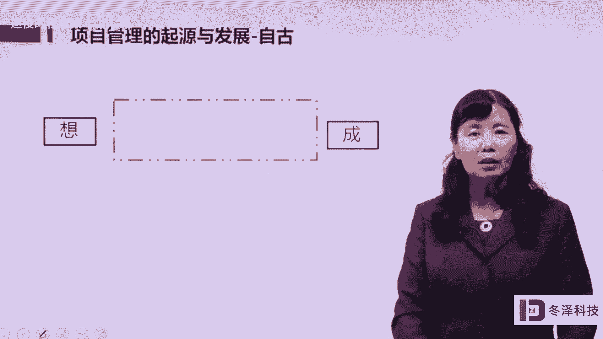
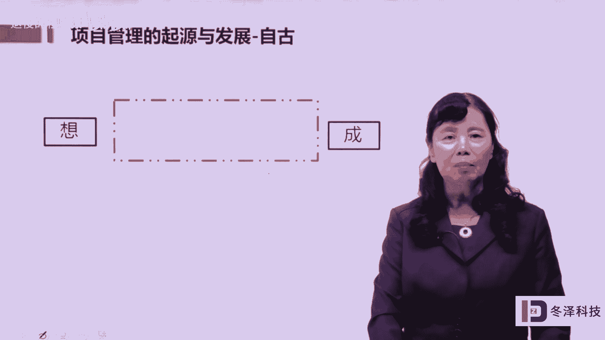
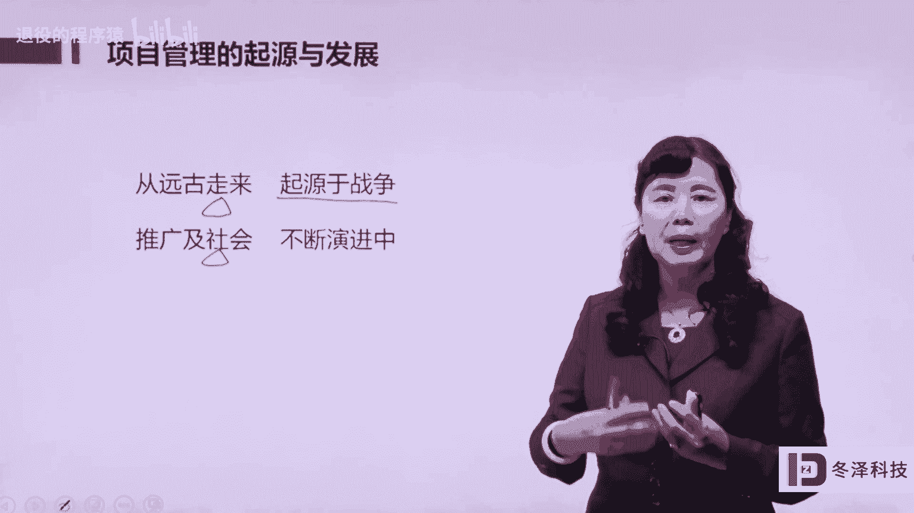

# pmp项目管理《PMBOK指南》从入门到精通 - P1：01项目管理的起源于发展 - 退役的程序猿 - BV1bL4y1N7Ux

与发展。项目管理是一个什么样的学科呢？

实际上他自远骨就有。至今矗立在世界上的一些奇迹，比如说埃及金字塔、欧洲的一些大教堂，一些大桥，还有我们中国的万里长城，都是项目管理的杰作，它是人类最优秀的文化遗产。上百年上千年以来，依然屹立在地球上。

那么这些奇迹的背后是由项目管理。造成的。也就是项目管理成就了这些奇迹，依然在诉说着成千上百年之前人类的一些活动或者一些文化给后人以启迪。那么这样的奇迹是在什么管理之下被做成的呢？被达成的呢？

那么我们是怎么样的认识关于项目管理是什么思维呢？怎么做成事儿的呢？每过年节，我们每个人都接受过类似的美好祝愿，我们也祝愿过我们的朋友心想事成。就像我这个片子上写的，左侧有一个想，右边有一个成。

那么其实我们好好的思考一下，心想事成，是一个非常美好的愿望。在当今复杂多变的社会状况之下，人们要能把所思所想实现，那就是我们的梦想变成现实是一个多么美好，多么惬意的事情。

但是只有这两个字想和成还远远不够。也就是说，光想是不能成的。那么在想和成之间，我们还应该做点什么，做什么呢？还应该在这个片子或者这个路径中补充两个字。

一个叫做谋字，一个叫做动字。这个谋的意思指的是。

规划这个动的意思。指的是执行。当我们有了所思所想，有了一种想做成事的冲动和愿望的时候，那么这个想法必须要通过一个缜密的。精细的规划，也就是谋定谋定了以后再行动。这个行动呢就是按照我谋定的。

按照我规划的在做。那么想好了，规划好了。在做才能够达成我所要实现的愿望和梦想。啊，这是。一个成事的思路。那么这个成事的思路也是项目管理的思维和思路。项目管理就是教给我们一种把事情办成功的办法。

那么这个办法来自于哪儿呢？来自于实践，是从实践中总结出来的一些有规律的方法，下面我们再看一下，那么项目管理在什么时候开始变成了这种有文字记录、有成体系的科学化的这样的一个理论体系呢，它是起源于战争。

上个世纪中叶1942年到1945年，这是第二次世界大战期间，众所周知，有一个曼哈顿计划。这个曼哈顿计划耗资了20多亿美元，20多万人参与。最终呢研制出了。是人。

吃惊的或者说给诗人带来巨大冲击的一个威力巨大的武器，核武器叫做原子弹。那么在曼哈顿计划当中。相关的主持人，也就是原子弹之父奥本海默，他就应用了项目管理的思路和方法，大大的缩短了这种复杂任务。

复杂工程的工期，让这个项目呢能够快速的拿出产品，拿出成果，也促进了第二次世界大战的结束，或者说结束了战争。那么他之后项目管理的学科就形成，而且并因此得到了发展。另外一个。军事工程叫做阿波罗登月计划。

阿波罗登月计划呢也是上个世纪开始的，历时了11年多，耗资了250多亿美元，大概有40多万人参与，还有2万多企业家呀，研究机构参与到这个项目中。那么。阿波罗登月计划也取得了成功。

让人类首次实现了飞天的梦想，奔月的梦想。那么当时。这个技术使用在阿波罗计划上，让阿波罗计划取得了成功。那么项目管理的这个技术也随着阿波罗计划的成功风靡了全球。

美国航空航天局naSA把项目管理这个实践奉为神明，他们把项目管理和实践经过归纳和总结，形成了一套体系，也就是美国航空航天局成为了项目管理的全球的实践的引领者。另外一个是美国海军的北极星计划。

这个也是一个国防工业所采用的一个重大的工程。北极星计划是一个极其复杂的计划。在这个计划当中。采用了精细化的计划管理技术。那么这种精细化的计划管理技术叫做计划评审技术PRT这个技术在北极星计划中的使用。

实际上它是一个精细化的规划和谋划技术。那么这个技术的使用呢，让北极星计划这种复杂的项目完成的效率提高了5倍多啊，也就是效率提高了。550%，这是用其他的一些方法管理复杂项目难以实现的一个结果。

北极星计划的成功，让人们对项目管理应用于复杂项目大型复杂项目大大提升了信心。所以这个技术呢被认为是现代项目管理的起点啊，也就是北极星计划采用了项目管理这个技术。

那么项目管理就进入到现代化的或者现代项目管理的开始。项目管理起源于军事或者国防工业，起源于战争。但是。越来越推广到社会生活的各个方面，很多企业主、企业老板把项目管理当成一种做生意的模式，或者叫做风格。

除了在美国国防部应用以外，这个项目还广泛的项目管理呢广泛的应用于建筑行业、好莱坞或者是大型的咨询公司等等。甚至一些运营型的组织、生产型的企业，把自己的生产运营。当做项目来管理，都取得了良好的效果。

所以项目管理呢越来越应用的广泛度越来越广，而且呢越来越受到了各个行业，各个阶层人士的青睐。有很多企业越来越认识到项目管理不仅仅是这个项目管理者、项目经理、应用的一些手段和方法。

如果企业中的所有的员工都能够了解掌握这个方法的话，对企业的管理，企业项目的推动和运营都有相当大的好处。那么参与这个学习的个人的员工，他的能力都会有或多或少的提高。

也就是企业和个人都会在这种项目管理的学习中获益。前面我们简单的给大家介绍了一下关于项目管理的起源和发展。现在我们把这一段做一个小节，项目管理是从远古走来，古人已经有这样的智慧。但是真正形成体系。

形成项目管理的一种有规律的学科是起源于战争，也就是第二次世界大战是一个重要的起点。由此推及到整个社会在社会生活的各个行业都普遍采用项目管理的技术，而且这个技术至今仍然在不断的演进中。

这个演进呢叫做与时俱进。根据时代的变迁，技术科学技术的发展，新技术的产生的融入容纳。那么不断的在。

派生一些新的项目管理的思路和理念，项目管理就不断的推进向前发展，至今没有停下脚步。我们现在学习的美国PMI的标准，叫做第六版的PMBOK也是在这个演进路程中的一个节点。那么它不会停下脚步。

未来还会向第七版、第八版，向更远去发展。每一次发展都融入了当时社会的一些新的科学技术，新的思想，结合了内外部环境的一些变化，融入了更多的管理的方法论和思想。

