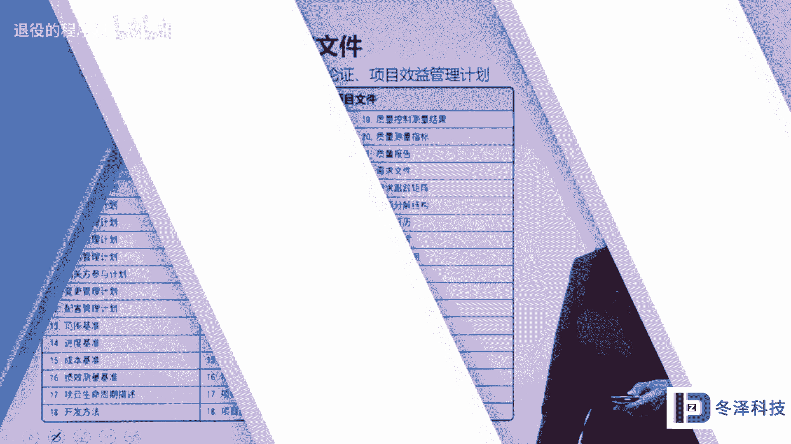
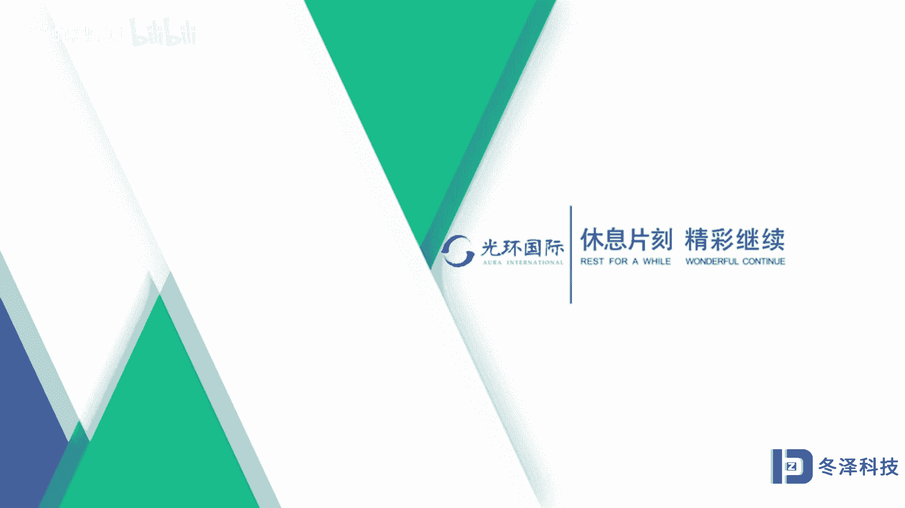

# pmp项目管理《PMBOK指南》从入门到精通 - P17：17项目管理过程 - 退役的程序猿 - BV1bL4y1N7Ux

这一节我们将学习项目管理过程。项目管理过程是单个项目管理的三个维度中的重要的一个维度过程这个维度。在第六版的PMBOK中，一共有49个过程。这49个过程按照相同的逻辑，被分成了5个管理过程组。

我们通常也叫这个维度为五大管理过程组。这五大管理过程组分别是启动规划、执行、监控收尾。启动管理过程组，它主要做的事情或者它的作用是。立项。建立一个新项目或者一个项目的最开始的一个新阶段。

在启动过程组由上级向下级授权管理这个项目。另外呢还有相关的干系人的识别要在这个过程组完成。第二个大的过程组叫做规划过程组。在立项中，已经明确了项目的目标。和目的。围绕着目标和目的。在规划过程组。

要进一步明确项目的范围，优化项目的目标。而且最重要的是围绕着项目的目标，要制定行动方案。这个行动方案就相当于我们在动手操作之前，在纸上做的一个行动的。模拟或者叫纸上模拟。

或者是我们在行动之前规划出的一张路线图，它的作用是未来我们在执行项目的时候，在进行项目操作的时候，要按着这个路线图来展开。这个规划的过程也是谋定的过程。或者叫谋划的过程。

第三大管理过程组叫做执行管理过程组。执行管理过程组就是严格按照我们谋定的计划或者路线图来执行项目。执行项目管理计划中规定的工作。其核心的目的是达到立项的时候，决定的那个项目的目标。

符合项目应该达成的目的。第四个过程组叫做监控过程组。监控过程组主要是在项目执行过程中。跟踪项目的目标，用尺子，也就是我们规划出来的项目管理计划和基准，就相当于未来测量项目的一把尺子。

用这个尺子测量我们实际操作的时候，收集的数据和绩效，拿尺子对比实际操作得出偏差，然后考虑是不是有必要对这些偏差进行变更，或者说对这些偏差实行有效的管理。最后一个过程组，也就是第五个过程组。

叫做收尾管理过程组。这个过程组是一个正式完成结束项目的过程组。在这个过程组里，要把项目或者阶段。关闭完成一个单个的阶段，或者完成一个单个的项目，把合同关闭掉。当然了，完结或者结束，它指的是。

项目或者阶段不光是在项目最结尾的时候，要做项目结束管理，在阶段末尾的时候也要进行收尾管理，或者在关键接口点、关键里程碑的时候都可以进行收尾管理。请大家注意的是。5个大的管理过程组是按照管理逻辑分组的。

并不是按照看起来有时间顺序这样分组的，也就是说不能把启动理解为最开始，也不能把收尾理解成最末尾。也就是这些过程，这些管理可能在项目执行的任何时间段都会进行，或者说实时进行。另外，我们在学习的时候。

很清楚的区分了5个管理过程组。但是在我们实践当中，在具体操作的当中，这5个管理过程组可能是交叠交织在一起，甚至很难拿语言来表达清楚的那种做法来重复交叠进行的。

并没有一个一成不变固定的操作顺序或者执行顺序。那么这五个管理过程组，它又被分成三类，一类呢是仅仅进行一次，或者在某个预定一点开展的工作，也就是这些过程组呢里面的过程不是总进行，不是总循环啊。

只开展一次或者在某一个点开展。第二个类型就是依照需要定期的开展。在项目周期当中定期的进行。第三种类型，自始至终贯穿着项目的结尾，从开始到结束，贯穿着整个生命周期。那么第一类。

开展一次或在预定一点开展的过程。比如说制定项目章程啊，就是立项的时候的那个立项文件。第二个叫做结束项目或阶段呀，它都是在某一个点进行的，或者说只进行一次。那么依需定期开展的这样的类型的过程，有。

比如说获得资源呀，进行采购啊。第三种类型始终贯穿着始终的监督监控啊。监控项目是自始至终进行的，或者不断的去定义活动，把活动分解，这个都属于自始至终要进行的工作。下面我们再看这张图。

这张图里很明显的说明了。项目生命周期和时间之间的这样的一个作用，或者叫做关系。横坐标是项目的。生命周期的时间纵坐标呢是支持型的活动。那么我们看。在这里画的曲线在这个坐标里面。

平面里里面画的这些曲线就是五大管理过程组在交叠进行的这样的一种状态。它也说明了某一个过程组里的过程，并不仅仅是在开始或者结束完成，也就是这些过程呢跟时间不是一一对应关系。在某一个节点中。

五大管理过程组可能交织着交叠着混合着再进行。而且这张图仅仅是一个示意图，这个高矮并不表明程度的比例，也就是说这个启动啊，我可以把这个曲线在延长，在这儿也也是没有问题的。收尾呢让它再往前延伸一点。

也是没有问题的。也就是五个管理过程组里面的过程在某个时间点交叠作用，交织着在作用。并不一定按照时间来进行，请大家一定要理解这个片子上的这个图。认真的区分开项目管理过程和生命周期阶段。

项目管理过程就是这五大管理过程组，在单个项目中，它们是一个坐标维度，生命期阶段跟时间有一一对应关系，也就是。通用生命周期的阶段是按照时间划分的。

那么这个时间划分的阶段跟五大管理过程组在单个项目管理中是两个不同的维度，请好好理解这段内容。

接下来我们再看一下，在项目管理过程中。通过规划规划出项目管理计划和基准。通过其他过程进行输入输出，又获得了。很多项目管理文件文档。那么项目管理计划和项目管理文件。他们有一个统称。

不管是项目管理计划还是项目管理文件，他们都是以文档性质表现的，可能是纸质文档，也可能是电子文档。但是项目管理计划和项目管理文件。在美国人的这个体系中是严格被区分的。这些管理计划我们可以看到。

第六版的PMBOK项目管理计划有12加6，其中12个呢是项目管理子计划，一直到这个地方，12个项目管理子计划，有4个基准，三约束的三个基准，还有一个把三约束整合在一起的，叫做绩效测量基准。

这是一个三个约束整合在一起的基准。除了这四个基准以外，还有两个内容被划作了计划的范畴，一个是生命周期。这个阶段的划分和描述，它属于计划。另外一个。如果是。IT类的项目或者软件工程项目。

那么这个开发方法的确定也属于计划的范畴。项目管理计划，它指的是为了做好这个项目所进行的规划，或者叫做规定制度，是制度类的东西。那么既然是制度类的东西，它在。内容的描述上不包括这个项目所具体涉及的信息。

比如说人员的姓名、时间，具体的时间，也就项目的开始，具体时间，哪年哪月哪日，这样的信息都不属于计划。因为计划是规定，规定就是指导我们如何开展项目的那些要求。这一侧在这个表格中的这一册，而且完全没有穷尽。

还等等等等。不止这些在项目管理中呢，生成了很多很多的这样的过程的或者最终的项目管理文件。在这些项目管理文件中包含着。不同项目的具体信息，这些信息包括人员的姓名，包括开始完成的时间。

包括这些基准的具体的描述，还包括花费的资金到底是多少万，多少钱等等啊，这样的具体信息。这些东西写在文档中被称为项目管理文件。也要区分开计划和文件，因为他们在概念上是不相同的。我们再看一下生命周期。

通用的生命周期。是。启动刚一开始啊启动，这是规划做准备的时候，进行执行，还有结束。当然了，贯穿着整个生命周期有。监控活动。那么这些通用的生命周期在。项目管理的过程组一个维度上是这样进行的，也就是每一个。

阶段每一个生命期的阶段，都可能重复这5个管理过程。在这五个管理过程之下，在这张图的之下是十大知识领域，也就是用知识领域管理的知识领域支撑着管理过程组。然后在不同的生命周期阶段都可以反映出这样的管理来。

这一版第六版的PMBOK描述了五大管理过程组和十大知识领域。我们在其他章节将细化这些内容。下面我们再讨论一个概念，叫做项目边界。什么是项目边界呢？既然项目是一个临时的一次性的工作。

那么它就有一个固定的相对固定的开始，相对固定的结束。那么这个边界是怎么界定的呢？我们看一下这张图我们可以看到项目的开始。是一个区域。呃，横坐标是项目时间的话。

项目的开始用一个区域表示的项目的结束最终的结尾是一条线。相对于开始来说，项目的结尾呢相对来说比较固定。比如说这个项目是5月8号结束的，开了最终的结束会。那么标志着这个项目结束了。

因为这一点5月8号它是很清楚的可以划分出来，但是这个项目到底是哪个时间开始了呢？很难有一个清楚的开始时间。由于对项目开始的界定模糊了项目的开始时间，所以项目的开始呢，用了一个句型，用了一个区域来表示。

比如说我举个例子。那么奥运会我们大家都知道，北京奥运会是2001年。申办成功的国际奥委会在2001年决定把2008年奥运会放在北京开。那么这个项目的开始就是奥运会这个项目的开始是2001年吗？

还是我们开始筹备。算是开始呢。那么在2001年之前，如果大家有记忆的话，都知道在这个之前有一个时间，我们曾经申办奥运会，没有被批准，没有被通过奥组委选择了别人啊，国际奥委会选择了别人开。

那么那个时间算不算我们已经开始筹办奥运会了呢？再往前，奥运会是谁提出来的呢？有人可能认为是中国第三代国家领导人提出的。其实在此之前提出这个概念呢，第一代国家领导人就有这种想法。中国刚刚建国解放的时候。

人民的体制身体健康的水平都非常的差，跟国际标准相比差的很多。所以那个时候呢，第一代领导人以毛泽东为首的第一代领导人呢倡导爱国卫生运动，国家也专门成立了爱国卫生运动委员会就要求中国人民讲卫生，身体好。

除四害啊，在那个年代是这么做的。那个时候国家领导人也提出，为什么这个蹦蹦跳跳的这些运动会都在别人家到我们家来开一开行不行呢？那你说从提出这个概念，算不算是奥运会这个项目就开始了呢？啊。

怎么界定这个开始呢？需要规定。如果你的企业，你的公司，你的国家规定这个时间是什么时候开始的，就是什么时候开始的。那么从提出这个概念，到比如说有一个正式的立项啊，或者说有一个正式的启动和开始。

这段时间是不清楚的。所以对于不同的企业，不同的国家，不同的地区来说，项目的开始时间是需要界定的这就是所谓的项目边界的概念。接着我们再看一下。五大管理过程组，他们是一个什么样的相互关系呢？启动过程组。

对项目进行立项。立项明确项目的目标、目的、需求。当然，在立项的时候，目标目的和需求是概要化的、概念化的，比较粗放的。在立项。完成之后，要围绕着立项确定的目的、目标、需求进行规划，再做纸上模拟。

进行规划之后，得到批准的计划就可以进入执行。过程组在执行过程组中发现偏离了计划的偏差，或者计划赶不上变化，发生的变化，要处理各种变更。通过监控过程组处理变更，通过监控过程组发现执行偏差。

监控过程组的过程发现了偏差，进行变更，还会提出各种纠正措施、预防措施反馈给执行过程组，也就是执行啊，除了执行计划以外，还要执行纠偏的结果就是被批准的变更变更是一定要遵循一个机制，通过批准以后被执行的。

那么经过批准的变更执行。项目以后。一个回合或者叫一个阶段或者一个项目进入到收尾或者关闭这个过程组。那么控制过程组所进行的变更，也有可能反馈给我们的那个基准或者那把尺子，也就是对基准和尺子进行纠偏。

有一个计划更新的步骤。五大管理过程组就是这样交叠交织的一种交叠关系。那么每个过程组做的工作，我们应该。了解。而且我们在学习的时候，自己可以默想啊，可以通过这个片子里的展示或者介绍来了解。

