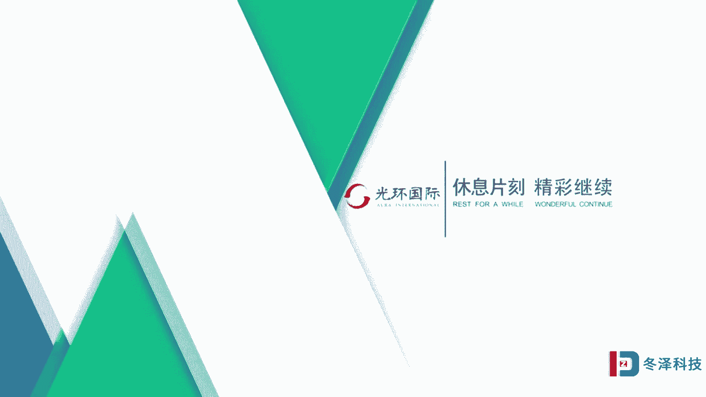

# pmp项目管理《PMBOK指南》从入门到精通 - P4：04管理历史视角 - 退役的程序猿 - BV1bL4y1N7Ux

第四节，我们要从管理历史的角度，或者叫做视角去解读项目管理。项目管理是一个内容丰富、结构化的知识领域，或者叫做知识体系。那对项目管理的解读不能是单一的，是多方面的。我们要从这五个方面去解读了解项目管理。

首先呢我们先从管理历史的角度去解读项目管理。项目管理这个词是一个组合词。它是由两个词组成的项目和管理。项目管理这门学科把关注焦点，把我们重视的点或者我们学习的重点集中在管理这个词上。

所以我们第一个先要从管理的历史，管理的发展的历史严格，去解读一下，或者了解一下关于项目管理。这一部分的解读呢，我们要从9个方面进行。其中呢我们先要认识6位。在管理学上比较有影响力的管理大师。

他们的这些观点至今仍然深深的影响着管理界，影响着企业管理，也影响着项目管理。我们有必要做一个基本的了解。首先我们要认识的要学习的第一位人物叫做亚当斯密，他是英国人，在1776年，也就距今有300年的。

历史了在那个时代，他写了一本书，叫做国民财富的性质和原因研究。可能很多人对这个书名比较陌生。但是我说这个书的另一个名字知道的人就会比较多。这本书的另外一个名字叫做国富论。国。国富论啊。

那么知道国富论呢还是很多的。在300多年之前，亚当斯密对经济活动做了全面的研究，把他的研究都写在了这本书里。那么他的这个书呢对现在的经济活动依然有着很深的指导作用，也就是迄今为止。

所有的诺贝尔经济学获得者获得的奖奖项，都是基于这个书里面的不同的研究角度进行研究的，还没有人在这个书之外做一些研究或者一些颠覆性的结论啊，1个300多年之前的人物。

预测或者他的观点还影响着百年之后的经济活动，他是一个非常了不起的这种人物。那么在他的这本书里的第一章。有一章节叫做劳动分工。劳动分工至今仍然影响着西方社会，也影响着项目管理。

亚当斯密对劳动分工进行了研究，他选取的是一个别针制作工厂。那么他在调研研究的时候发现，在这个工厂一个工人一天只能生产一个别针，而且还很费力，很费劲，他就想怎么能够提高劳动效率呢？把这个别针的制作生产。

分成不同的工布或者叫工序，然后由多个工人组合在一起。不同的人干不同的工序，生产别针情况是什么样呢？他发现，经过研究，10个工人一天可以生产48000枚别针。这样就比一个工人一天工作，一个别针。

这个生产效率提高了4800倍，还是相当相当大的。也就是亚当斯密发现劳动分工让不同的人专门从事某一个工作。那么可以提高专业度，而且可以提高极大生产效率。不用花费多余的资金，投入相应的设备资源。

或者不用进行工艺的调整和工艺的改造。仅仅通过这种管理方式模式的改变，就可以让生产效率上千倍的提高，啊，它得到了这样的一个结论。那么其实这种做法你分工了以后就得讲究协作。原来你一个工人工作。

他没有协作问题。现在你10个工人一起协作就有协作。协作呢就有对协作带来的这种额外的消耗。但是经过研究呢，亚当斯密发现，或者亚当斯密说，即使有额外的消耗，这么做的效率也比一个工人工作的效率要高得多。

当然了，这种方法仅仅适用于。劳动密集型的产业啊，生产制造型的产业去做这种分工，专业的人做专业的事儿。第二个，我们要认识一下泰勒这个人，泰勒在1911年写了一本书，叫做科学管理原理。

泰勒也被誉为科学管理之父。在他之前的管理者用的管理方法都是经验式的，靠经验式的。那么泰勒就思考我能不能把这些经验式的东西数据化，用数字表示出来，让他更加科学化呢？1885年，泰勒就做了这样的实验。

在他所工作的那个钢铁工厂里边，他进行了这个实验，对那个产煤工进行动作研究。他每产一铲煤所花的时间，角度、手臂的弧度等等，进行了详细的记录。总结归纳抽离出一种比较好的方法，工人也比较省力。

劳动效率也比较比较高的方法，也就是每产煤产9。9公斤。啊，然后每天呢他的工作效率，就以用就从以前的这个经验式的没有意识的这种工作，变成了这个没有意识工作，它的那个产量是12。5吨。

变成了呢经过这样的有意识的标准化科学化的这样工作就变成了他一天的工作效率就变成了48吨。这样呢它的效率也极大的提高了啊，当然这种做法呢，这种动作研究方法也是适合于劳动密集型的这种产业。

那种智力密集型的产业呢，就不能用这个动作研究给它分解去进行啊，这是泰勒的做法。泰勒这个做法呢也把管理标准化了。下面我们再认识第三个人物，这个人呢叫做法约尔，他是一个法国人。1916年跟泰勒几乎同时代。

他出版了这本书叫工业管理和一般管理。那么他在这个书里提出了管理到底是什么呢？管理有几项基本职能啊，当年呢他提出的叫管理的5项基本职能。现在呢后人呢也把他归纳成了四项基本管理职能。那么什么叫管理？

关于这个定义，全世界有200多种啊，但是现在各个企业或者社会普遍采用的管理的定义就是管理的几项基本职能。这五项基本职能是计划组织。指挥协调控制，还有控制这个一共是5个。但如果要是四项基本职能呢。

就把这两项进行合并，把他们合并成领导。所以四项管理职能呢叫做计划组织领导控制这四项基本管理职能。法约尔的研究跟泰勒的研究殊途同归。泰勒的研究是从工人入手开始的。

法约尔的研究是从办公桌前的那些职能管理人员，那些经理开始入手的。但是他们共同的想法都是让工作标准化。啊，一个是让生产工人的工作标准化，一个是让职能或者行政管理人员的工作标准化。

同时呢法约尔也提出了管理的14项基本职原理啊，基本原则，这14项基本原则的第一项也是劳动分工，包括要有纪律啊，统一领导呀、团队精神呀，要有工资怎么发呀，公平啊，讲究秩序啊，还有等级制度等等。

那么这些原理至今依然深深的影响着企业在企业管理中常常被实践，常常被采用。

🎼第四个我们要认识的人物是梅奥，梅奥被人称为是人力资源管理之父。因为他的研究是从人入手来考虑的。不像动作研究法，是从工作，从效率来考虑的。梅奥认为，人这个资源是活的资源是能动的资源。它不是死的机器。

你每一个动作把它编成程序编成流程，那人不是机器人啊，人是活的，有思考能力的。那么一个螺钉拧多少角度啊，一个锤子要砸多大的压力，一步走多少厘米，都是这样规规矩的标准的画法。

让这个工人像机器一样的生存还是有问题的。所以梅奥呢就从人的行为这个角度去研究管理。那么在。1933年。和1945年这两个年代，他分别出版了两本书，经过研究以后得到的结论，一个叫做工业文明中人类的问题。

一个叫做工业文明中的这个社会问题。那么这两本书中。他把他自己的实验和体会充分的表现出来。他最著名的这个实验呢有一组货桑实验，一共4个实验。这四个实验分别是照明实验、福利实验、访谈实验和群体实验。

照明实验呢是以这四个实验啊，这个货桑实验都是以芝加哥西方电器公司作为研究的蓝本。这个西西方电器公司呢，它的主营业务是生产电话交换机，也就是我们家里以前用的那个固化机，就是电话机。这个电话机里有一些线圈。

电话线圈，在当时那个时代呢，这个电话线圈的生产都是人工手工绕制的。那么手工绕制这个线圈就需要比较良好的照明的环境和条件。因为大家绕的时候眼睛会啊会有影响。如果你光线很暗的话，会影响生产的。

照明实验的做法是把原来工厂里的那个工人们的那个实验呃，工人的工作分成两个组，一个是对比组，一个就是实验组，给实验组提供不同的照明环境和条件，也就是实验组的照明条件更好一些，把它那个光调的更亮啊。

对比组的呢还维持原来的工作环境条件不变。他的假设是我给员工提供了更好的照明环境和条件。那么我那个实验组是不是生产效率就应该高啊，结果他的这个实验的。做法。没有证明他的假设啊。

他发现呢改善了照明条件的这些员工，他的生产效率没有明显提高。跟原来的这个对比组呢还差不多。后来他就想，那我把这个实验组的这个灯光再调暗，看看是什么情况呢？调暗以后，他会发现哎生产效率反而还提高了。

说明什么好的福利环境条件可能给人带来的这种激励啊是有限的。改变如果你改变这个灯光的明暗，反而对人的这个激励。比你光提供好的条件的几率要大。第二个实验叫福利实验。他把实验组呢。

单独放在一个生产区域和空间里，给这些人一个良好的生产环境，增加休息时间，免费的供应一些小点心啊、水果啊，就是工作之余啊，课间的就是工作休息时间的那些茶点。结果他发现呢。生产效率也没有特别明显的提高。

跟他假设的不一样。他说那我把这个实验组的这些福利待遇给取消了，什么情况呢？把这些福利待遇取消了以后呢，哎生产效率反而继续还提高了。这个实验也说明了改变带给人的这个激励变化比绝对的好的这个环境要大。

第三个实验访谈实验。访谈实验呢是他到工厂里面接触这些员工调查这些工人的工作态度。但是专家去做这个调查呢，他其实只是一个研究，他并不直接影响这些员工的或者这些员工的意见并不直接反映在管理制度里。

对大家怎么进行改善。可是通过这种跟员工的一对一的调查，让员工把心理化表现出来以后，他会发现员工整体的事迹，劳动效率会提高。呃，也就是给员工有发表意见的机会，能够让他。说出自己的想法，对他是有激励的啊。

这是访谈实验带来的结果。群体实验呢是把十几名男性的工人放在一个组里，这个组呢被称为实验组。在这个组里工作的14个工人给他们定指标，每天你要完成你绕多少线的这个指标啊，叫计件工资制。

你完成了这个指标超额完成的多，我就给你高高的奖励，给你奖金。谁要是没完成或者低低于一个县低一个指标的话，我就罚你就扣你给你惩罚。结果呢他发现呢，他以为呢有这个激励就会。有员工就会在这个激励之下多生产。

多干活，去拿那个额外的奖金。结果在这个群体里的工人呢，他体现出一种什么状态呢？那么工人们都会维持工作量，每个人的都差不多，大家还会关照那个。做的比较差的人，甚至会帮一帮他，没有人会去冒那个头，多拿钱。

为什么？因为大家认为自己在这个群体中，群体比我个人拿钱更重要。所以人在这一个群体中还要讲究的是群体利益，维护群体的团结。他在这个群体里不能出出头太多，遭人嫉妒。他还会想我跟周边人的这种关系。

所以在一个群体里呢，工人是社会人，并不是简简单单的经纪人，他要考虑我跟周围的人的协作。这就是从人际关系这个角度去研究人的这个情况。

🎼下一个人第五个大师，我们要认识一下C梦这个人。C梦在1947年写了管理行为这本书，C梦也是迄今为止，唯一获得了诺贝尔经济学奖的管理大师。经济学和管理学还是有不同的。

那么经济学更加强调理论研究和那些经济计量模型，用这些模型来说明现实的问题。管理学呢是更落地的，从企业管理的这个角度，更务实的更从应用角度来进行的研究。但是C蒙由于他的决策理论。他得到了诺贝尔经济学讲。

可是他是一个管理者，是一个管理大师。他在他的这个管理行为或者他的决策理论中提出，管理是什么不是很复杂的事儿，管理就是决策一个决策接着一个决策。其实我们的人生都是在决策，决策不仅仅用于工作。

人生中也有很多决策的步骤。比如说你该有几个工作机会，你选择哪个呢？去哪个公司呢。比如说你的小孩儿选择是留在北京读书呢，还是回到家乡读书呢？比如说你是选择买房子，还是租房子，在一个环境中。

你是选择买那个离学校近的所谓的学区房还是买一个，我认为环境舒适的一个地区等等，这些都是决策啊。那么心梦说管理就是你决策好。你把决策决策好了，管理就管理好了。第六个人物。

我们要认识一下德鲁克德鲁克他对管理学的巨大贡献叫做目标管理。也有人认为或者提出德鲁克是管理学之父。因为从他开始管理变成了一门学问，变成了一门学科。过去呢大家都认为管理是个艺术啊，是一个具有个性化的。

是一个不能够形成科学的东西。但是从。泰勒。开始标准化，一直到德鲁克用目标管理来解释管理。那么从德鲁克就开启了，管理是一门学科这样的一个大门。德鲁克认为，管理要解决的问题。共同的问题有共性的问题。

90%都是一样的，相同的，只有10%的。东西啊是例外的，所以管理要关注这10%，那怎么管呢？锁定一个目标，我就先定目标开始，不是从出发点去开始管理，去锁定目标，倒逼这个管理过程去管理啊。

那么目标管理诞生以后，它带来了什么好处呢？目标管理的产生，使每个被管理者有了自我控制的意识。以前被管理者都是被管理者管着的啊，让你做什么，让你怎么做那，自己可能是不太清楚自己要达成什么目标或者愿望的。

当目标管理这个学问诞生了以后，被管理者就知道我要做什么，我做的方向是什么，最终达到什么效果，就让管理变成了一种自主行为。因为我知道我要去的目标方向。那么我就能够主动的去管理自己的行为，主动的进行管理啊。

这就由被动管理变成了自主和主动管理。在管理上的，人类的管理上就有了一个飞跃和进步。在。管理视角解读方面。我们第七个地方要给大家介绍的第七点啊，要介绍的是管理，你要关注两个指标。

或者我们管理最终就瞄着这两个东西，哪两个东西呢？一个叫做效果，一个叫做效率，有这么一个效率效果，举阵，大家可以看一看，最好的管理的结果是在这个象限，既有效率又有效果。这个说起来容易划到这个矩阵里也容易。

但是真正实行操作，这是非常困难的。因为效率和效果在很多时候，很多场合往往是互相矛盾的。如果追求了效果，可能效率就比较低。如果我一味的强调效率速度快，那么效果可能又会打折扣啊。

一般呢我们会把效果呢用质量这个指标去衡量，把效率呢用速度啊，用这个速率这个指标去衡量。也就是又快和又好啊，才是最好的。但是快和好呢？有的时候是矛盾的，怎么能够把握住这个度是一个管理者最要重视的。

第八个方面，我们看一下，作为一个管理者，你跟技术人员不同，管理者所要关注的有人力资源管理，就是对人的管理和沟通。还有网络的联系。那个传统的对于一些物的管理，其实只占3分之1，在一个管理中啊。

那么我们下面再看什么叫做有效的管理者和成功的管理者。有效的管理者。在工作中沟通占了44%。那么这个工作比例啊是一个有效的管理者在工作时候投入的那个精力。有效的管理者呢就是他能够良好的实现目标。

他周围的相关方，相关者，还有自己的下属员工都比较满意，这是有效的管理者，什么叫做成功的管理者呢，成功的管理者是组织中进步最快的提升最快的发展最好的。那么对于成功的管理者来说。

他的工作经历投入大概有一半时间在进行的是人际关系，人际网络的联系啊，另外的有一部分是沟通啊，人力和传统管理。这有一个比例分配。我们就可以知道，作为管理者，我们的重点和经历都在哪些地方上啊。

那么在上述的这些片子中，我们对管理和项目管理呢，从管理历史的这个视角去解读了一下。因为项目管理最终也落在管理上。我们要对项目把一个项目管好。那么这些前面的这些理论，这些大师的一些想法，对管理是有影响的。

另外呢我们管理追求的是效率和效果。还有呢我们应该努力去做一个有效的管理者，争取去做一个成功的管理者。那么关于从历史。这个视角去解读项目管理，我们就有这几句话跟大家说一下啊，管理是什么呢？

叫做理事把事儿做好，还要什么调人，也就是管理要管两个事儿，一个把事儿管好，一个把人管好。这两个要相得益彰。另外呢，管理所追求的那个最终的目的结果叫做效率和效果要兼顾，要平衡，要找到那个合适度和平衡点。

那么管理呢就是要做这样几件事，计划组织领导控制。我们后面要学习。