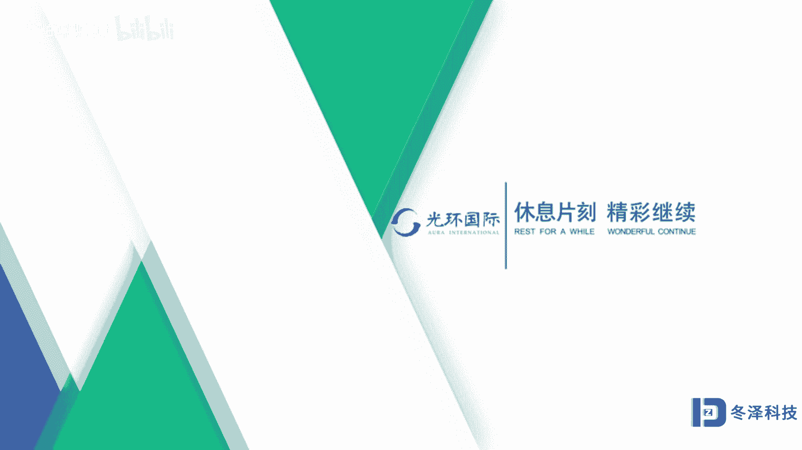

# pmp项目管理《PMBOK指南》从入门到精通 - P5：05单项目视角解读项目管理1 - 退役的程序猿 - BV1bL4y1N7Ux

在这一节里，我们要从单个项目的视角来解读项目管理。也就是在这张片子上的第二个部分叫做单项目视角来解读项目管理。从单项目视角解读项目管理的内容比较多，我们可能要分几节来把这一部分完成。

首先我们看一下一个单个的项目，它是一个结构化的。框架不是单一的一个点或者一个面，一条线，它是一个立体模型，一个单个项目的管理呢体现出来的是个立体模型。如果简单的话呢，就是这个立体模型。

有一个维度叫做管理维度，管理过程组啊，有五大管理过程组。另外一个维度叫做知识领域，或者叫做管理功能。那么是十大知识领域。还有一个维度叫做生命期，用生命周期的阶段来管理项目。

所以一个项目管理是一个立体的模型。如果我们想象一下。这个立体模型像一个豆腐一样，我们切的每一小块就是一个管理单元，我们可以切一小方块。那么这个小方块的三个维度呢，一个是有管理的，还有知识领域。

还有时间的概念，生命期阶段就是时间是一个三维框架。从单项目的视角去解读项目管理，我们准备从36个方面或者有36项概念要去解读。第一个概念，到底什么叫做项目呢？什么是项目呢？

项目是为了完成一个独特的产品服务或者成果，就是一个输出呃，一个产出而进行的那个临时性工作。为了把这个临时性的工作做好，我要去找资源，集成资源。把资源集中在这个项目上，达成我要得的那个产出和结果。

项目呢是一个公司，一个组织创造价值或者效益的一个主要方式。在当今社会中。各个层面的领导者，比如说国家、企业、事业呃一些。公立机构、一些非营利组织都广泛的使用这个方法来去集成资源。为什么呢？

因为资源是极其稀缺物，怎么把资源组织好，把事情做成，就是我们这个项目管理所带给我们的启示。项目最终可以得到成果，这些成果可以是有形的。比如说移栋大楼、金字塔、长城，也可以是无形的。

比如说专利一个智慧都可以通过项目来产生。那么项目可以带给我们这么多的好处，比如说出版物，飞机的发明登月空间站，还有呢。小儿的疾病的那种药物的研究运合，还有。程序系统啊，还有。定位导航系统等等啊。

这些都是通过项目所创造的那项目有什么特点呢？根据项目的定义，我们得到了项目的特点，项目的第一大特点叫做临时性，每一个项目都有一个固定的开始时间啊，有一个固定的结束时间，这就是项目临时性的体现。

临时性不代表时间短。可能这个开始和结束时间，历时几十年甚至上百年都有可能啊。但是他如果有一个目标，完成这个目标有一个时间段，它就体现了临时性。第二个特点叫做独特性。每个项目都是独一无二的。

就像我们每个人一样，都有一枚跟别人不一样的指纹，独一无二的。就像数据世界上没有同样一片叶子一样，每一个项目，每一个项目都是独一无二的。那么由于项目的临时性、独特性。

那么项目它的明确性或者需求也是渐近明细的，也就是项目是越来越明白，越来越清楚的。刚一开始可能不太明白啊，随着时间的推移，信息的完善和丰富。那么这个项目的信息会越来越清楚。所以也意味着做项目需要分步开发。

连续积累，精进，是这样做到的。由于项目的这些特点啊，所以呢有一个项目驱动变更的这样的理念，或者叫特点。项目可以带来改变。呃，可以把。世界上原来没有的东西建出来，比如说我造了一个建筑物。

原来没有这个建筑物，现在有建筑物了。那么这个是项目带来的这种改变，除了带来实物的改变，项目还可以驱动公司或者组织的状态的改变。比如说组织机构组织管理，通过项目会得到改变。

也就是项目同时又是一种变革的手段。如果你想搞变革，搞研发，搞研究啊，搞变化，搞改革是通过项目可以实现的。那么我们看一下项目是怎么驱动组织变革的呢？以前的这个状态，原始状态组织机构，比如说是这样的。

经过一个项目，我们进行了N个项目管理活动之后，带来未来的组织机构可能就会调整成另外一个状态。那么这种状态的改变，我们可以通过项目活动来实现，也就是定一个目标，给出一段时间给出一段开始和结束的时间。

明确一个目标，在集成一些智慧和资源，达到这个目标，实现这种改变，这是向驱动的组织变革。它可以变革组织的。结构组织结构，这就叫组织结构。同时呢还可以变革组织的规模、职责、人员的角色啊。

这是项目驱动变革的一个状态图。

第3个，我们要来解读或者讨论一下。项目启动的背景，项目是因为什么启动的呢？可能会因为社会的需求，法律法规的要求要求你改变，所以你要用项目启动项目来达到这种改变。另外呢要满足相关方的需求。

这是另外一个项目启动的背景，或者另外一类，还有一类呢，我想改造创造改进修复一些产品过程或者服务，为此而启动一个项目。另外我还可以通过技术的变更，执行或者技术战略。呃。

通过项目来得到技术战略的这个变更和改变。下面我们再看一下什么叫做项目结束呢？有这四个描述。第一，当我们达到了项目的目标，项目就结束了。第二。当我们发现我们不可能达到目标，无法达到目标。

那么项目就被提前终止了，就不能再进行了，这项目也就结束了。第3个。当我们在进行项目过程中，发现我们最开始。设定的或者相关方提出的需求已经不再存在了，不再需要了。那么这个项目也就被终止了。换句话说。

项目是为了满足需要而存在的。这个需要已经不存在了，项目也就不存在了，那也就结束了。最后由于法律的便利或者目标，由于法律的关系，我要终止这个项目啊，这也是一种终止状况。在这四种结束项目的状态中。

第一种状态达成目标，这是一个正常的项目结束状态。后边这几种这三种都叫做项目的终旨。或者是提前终止，或者是项目终止。那么这两种终止。都是项目没有达到我们最先设定那个目标所。产生的这种终止。

或者也这样的终旨就预示着我们不可能达到提前设定的目标了啊，这叫终止。或者我们可以用一个不是很严谨的描述方法来说明后面三种这种状态结束的项目这个项目是不成功的啊，也就是跟刚开始的初始目标相比。

这些项目就没有做成啊，这样去理解，没有做成项目也就结束了。第五个，我们在解读项目管理的时候，要讨论商业价值。项目是为了创造商业价值的选择，因为项目花费了世界上最稀缺的资源。那你把这个项目做完了以后。

你要得到的东西应该从价值上体现。商业价值这个概念呢，它分两个方面，一个叫做有形价值，一个叫做无形价值。有形价值就是我们可以得到的看得到的实物产品啊，一种事业或者我们挣的钱，固定的设施。

能够看得到的摸得着的都叫做有形价值。另外呢项目实现的这个无形价值，它也是价值，也需要考虑。比如说我们的信誉品牌商誉公司的形象、知识产权啊，这种商标的这个影响力、影响度，这些东西都叫做无形价值。

一个项目你做完了以后，必须得体现在价值上。如果你做完这个既没有有形价值，也没有无形价值，那就不要浪费资源，不要去用项目啊，不要选择项目去浪费资源。第六个概念叫做项目管理。

刚才我们解读了项目那个临时性一次性的事情啊，达成一个目标，在一个时间里达成一个目标，得到产出的叫做项目。怎么去管理项目呢？用我们所具有的知识技能，还有一些管理工具和技术，把这些东西应用于项目活动。

其最终的目的是要满足项目的要求，达到我们预先设定的目标啊，这个就叫做项目管理。那么项目管理呢是要通过整合各种项目管理的方法，人员啊来实现的项目管理。这种办法这个方法可以使企业可以使组织能够更加有效。

而且是高效的开展项目。如果你不用这套项目管理的方法，也可以管理项目，但是你管理的结果是无意识的啊，是不可重复的，没有规律的。再说一句落地的话，那就是乱撞是盲目的啊。

但是通过使用这套项目管理体系被实践证明了有效的这样的体系的方法就可以使你的项目能够高效有效。第七，我们要从项目管理的重要性这个角度去解读项目管理。项目管理，它可以帮助我们达成目标。

实现我们想要的就是从想到成，可以达成目标，可以帮助我们解决问题。用这个办法呢可以去挽救很多终止的那些项目，那些失败的项目。另外呢项目管理方法可以优化资源，集成资源，把事情干成。另外呢项目管理这个办法呢。

要考虑到项目的制约啊，在管理制约这个方面。进行项目管理，也就是任何一个项目都是受一些制约条件所影响的那我们怎么能够在这个制约环境中做一个选择，把事儿管理好。第八个方面。

我们要解读一下项目管理者他的职业和专业行为规范，也叫道德规范。第六版的PMBOK选用了PMI的职业道德或者叫道德与行为规范的这个版本。如果我们简单的把它归纳一下，叫做职业道德的4个2，有4个2。

首先这四指的是。项目管理专业人士的责任，尊重、公正和诚实。每一个。这个职业道德的这个标准里边又含了两个标准，一个叫做期望标准，一个是强制标准。顾名思义，强制标准是要求项目管理者必须要达成的。

必须要做到的。如果你做不到，这是你的义务。你如果做不到的话，就不符合一个专业人士的标准，或者说违反了一个专业人士的职业道德。另外呢还有期望标准，也就是对于责任这一栏，除了强制要执行的标准以外。

还有一个我们力争要达到一个更高的一个要求，更高的一个标准。不是说更高的标准，我们就可做可不做。啊，或者说既然它是期望标准，我就光把强制标准达成就行了。期望标准我就不一定达成，这是一种错误认识。

也就是期望标准也要力争实现。但是期望标准里所描述的很多内容呢，它是无法强制执行的。这是关于职业道德啊，职业道德或者叫做道德与专业的行为规范的4个2这方面的内容。

