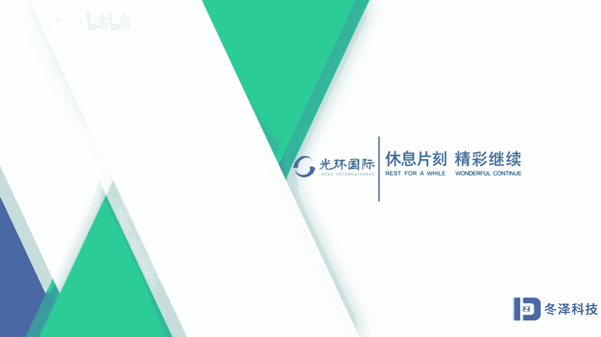

# pmp项目管理《PMBOK指南》从入门到精通 - P7：07单项目视角解读项目管理3 - 退役的程序猿 - BV1bL4y1N7Ux

在这一节里，我们继续从单个项目的视角来解读项目管理。也就是这一部分内容的继续学习。我们现在来看。生命周期的。阶段。有这样的典型的这样的一个结构。一般来说，一般的项目都有这三个生命周期的阶段的划分。

第一个也叫启动阶段，或者叫做立项阶段，就是在进行项目的立项。第二个呢是开发阶段，也就是生产或者说操作执行运营的阶段。第三个呢叫做运行和维护阶段。通常呢我们管中间这一段开发阶段叫做项目生命周期。

整个从头到尾的这三个阶段组合在一起的，一般我们管它叫典型生命周期或者叫长周期，其实它也是一个产品生命期啊，从运营维护一直到这个产品退出市场，退出使用是这样的一个过程。几乎所有的。

行业或者产业都可以采用这种典型的生命周期三阶段的结构。下面我们看一下第14个要点，叫做项目阶段的关系。这张图表现的是项目生命期里面我们划分的那个阶段的关系的顺序关系。也就是一个阶段进行完了。

另一个阶段继续进行，下一个阶段跟上顺序排列的这叫顺序关系。下面我们再看这种阶段和阶段之间的关系，被称为交叠关系。也就是第一个阶段还没有进行完。第二个阶段我就开始。进行了这个也被叫做搭接。

也被叫做项目阶段的搭接，也就是前面这个阶段没进行完，后面的阶段已经跟上了，这是一种搭接关系。另外一种生命期阶段的关系叫做迭代关系。我们可以看到，在第一个迭代里呃，它进行的内容会影响到后续的迭代。

甚至会影响到跨着下一个阶段的迭代，每一次迭代的人力投入，就像这个灰颜色的曲线一样，它是有一定的变化的。这个叫做迭代生命周期的一个表示图形。那么关于顺序关系和搭接关系或者叫交叠关系。

他们有什么样的一些特点呢？我们通过这个图可以看一看。顺序的生命期阶段，它可以保证这个产品按部就班的去开发，或者这个项目按部就班的去完成一个阶段一个阶段的一次进行。当然了，那么它的历时相对来说也比较长。

如果面对纷繁复杂、变化多变，就快速变化的这个时代和社会。如果我们都用这种顺序关系去进行项目的话，可能会丧失很多市场机会，因为它速度太慢，开发的速度和项目进行的速度太慢。我们就可能会冒一定的技术风险。

去用搭接的这种方法缩短开发时间。啊，跟顺序相比，交叠这种方法，生命期的阶段，让它交叠搭接的话，它会节省出相应的时间来满足市场快速对新产品新技术投入市场的这个开发的需求，加快项目的完成速度和研发速度。

加快项目得到结果的速度。当然它的前提是冒了一定的技术风险。第1六，我们要讨论一下什么叫做项目的商业文件。当项目在立项的时候，在立项之前还没有这个项目呢，我们需要用一些商业文件来说明我们对某些需求的选择。

就对项目的选择。那么这两份商业文件，一个叫做商业论证，我们有需求了，想选择项目要进行一个商业论证。第二份叫做项目的效益管理计划。假如我选择这个做项目的话，那么这个项目未来会得到什么样的效益。

这个效益怎么管理呢？那个管理的计划，也把它做成一个商业文件。非常著名的两个商业文件，就是这两个一个是商业论证，一个是项目的效益管理计划。我们看一下在生命周期的这张图中，通用阶段里，我们可以看到。

在项目前期项目还没有开始呢。在这个前期我们就要准备这两份商业文件，一个是商业论证文件，一个是效益管理计划进入项目了，到了项目后面这个四个生命期阶段通用的阶段。

我们就可以得到项目启动的一个证明叫做项目的一份章程。那么在准备这个地方啊，组织和准备这个地方有一个项目管理计划，我们做好规划了。在这个规划中有这样的执行项目的时间表。

我们在执行项目中按照这个时间表去实现这个项目。在某些阶段关口里，在每一个这个阶段关口里啊，我们都要进行监控或者把控。最终实现的是达成目标完成项目。这张图也是项目的一个通用期阶段的一个通用图形。

也就是任何。行业或者任何产业的项目，你都可以用这张图形去诠释它的生命周期。不管这个生命周期的类型是预测型的还是呃适应型的，还是迭代的，敏捷的，都可以用这个图去表示啊。

只不过这个关口阶段管口和者时间点迭代点它是不同的。

🎼第17个要点，我们要讨论一下什么叫做项目目标。因为项目是达成目标的这样的一个过程。那你得到的这个结果，这个目标是怎么表述的呢？在西方人眼睛里。工作结果这个指向的工作结果达成的目标。

一定要符合smart原则。这smart是5个英文单词的字母字头的组合。S表示的是。这个目标的描述一定是明确的。第二个M这个目标的描述必须可测量，如果不能测量就不能控制，不能控制就无法管理。

所以你的目标一定是能量的，能测量的，不测量的那个东西不能测量的，它也不能被称为目标。第三，目标一定要可实现。如果这个目标在当期社会或者在当前现有的社会技术条件之下是不可实现的那你就不能定那样的目标。

它就不是项目目标，一定是可实现的。下一个。2。是指的目标是有相互关联性的。最后一个T讲的是目标的实现是有时间的。不能像我们以前高喊一种目标口号啊，说我们要打造一个世界一流的城市。比如我这句话。

打造一个世界一流城市，它不是目标。为什么你多长时间打造一个一流城市，没有时间概念。你是一年两年5年还是一万年啊，那它不一样的啊，你没有时间的这个概念没有实现，那它就不是一个目标。😡，那么你打造一流城市。

这一流城市是怎么测量的，标准是什么？按照什么测量的，你又不可测量啊，又没有实现啊，就不是一个目标。你想描述目标必须符合这五项啊要求也被称为smart原则，目标的smart原则。

下面我们看什么叫做项目成功了呢？那我们需要对项目的成功进行定义。我们必须考虑项目目标完成的实际情况，是不是我们之前想预定的。项目这个目标可测量的目标是不是最终经过测量，我们达到了我们预想的那个结果啊。

这些才叫项目目标。对于项目目标的度量才能够最终体现在项目成功上。因为你有了这些测量的结果才能说明这个项目到底是不是成功了啊，还是失败了。还有很多情况之下，有些项目它的这个项果或这个成功的程度。

当时或者项目刚刚完成，我们是无法知道的。它要持续一段时间才可以看到成果的这个结果。所以有很多时候项目是不是成功了，它要持续一段时间稍晚的时候才能做出结论。项目的成功，从单个项目这个视角来讲。

就是单一的一个项目来讲。成功的标志首先要符合三个主要的约束条件，一个叫做项目范围，也就是你做的项目的内容必须达到我们之前预定的那个内容不能多也不能少。另外，在什么时间内实现，在什么时间内达成。

还有花多少费用达成。这三个指标被称为项目管理3约束。或者也叫项目管理三坐标。这三个约束。组成的等边三角形，也是被常常称为项目管理铁三角的这样的一个图形。质量内容是包括在范围内容中的。

我们不说项目管理的四约束，四个坐标，而是三坐标。这个质量呢是包括在范围之内的。所以项目管理三约束三个指标呢，其中是包括质量的。也就是我们常常说项目管理三约束，但是它实际上是四个要素。

也就是范围进度成本质量啊，也要考虑质量的这三个条件或这约束都满足才叫项目成功，而不是说我只拿出了一个高质量的产品，你看我建造的这个金字塔，这个纪念碑它多好啊，质量多好啊，那项目就成功了。不行。

它是不是完成了应该完成的工作，是不是在预定的时间之内，是不是花费了我们预定的预算的费用是远远的超出这个费用了，还是说在这个费用，我们计划的之内，这三个约束都满足。还叫做项目成功。

这是从单个项目视角来解读的项目成功。但是仅仅有3约束还不行，还有一个标志啊，或者叫做项目成功的其他标志。项目成功的其他标志就是满足三约束的同时，还得公司或者组织内部受益。你做的事情不能够违反。

普世价值观不能够违反当地的法律法规，要符合安全要求，要保持你们公司跟其他相关方的良好的合作声誉，要保持你们企业的良好的形象，不能违反那种。安全呀、道德方面的这些要求，不能跟那些要求背道而驰。啊。

比如说我举个例子，你帮助。搞法轮功的人开发了一个软件，专门去攻击中央电视台。你这个三约素都满足了，范围也做好了，时间也是这么多，费用花的也都在这个范围之内，质量做的也相当好。那你这个项目叫成功了吗？

不能叫成功。因为你违反了中国对法轮功的这个限制。东中国对法轮功的这种否定和否决，违反了这个社会的价值观啊，甚至在职业道德上就不能够满足这个社会所提供的这样的一个标准和要求。

同时呢我们看除了这个其他的完成标志以外，还应该满足一些财务或者非财务指标啊，也可以说叫做有形商业价值和无形商业价值的实现。非财务指标内容很广泛，我们在这里不做过多的解释。我们看一下财务指标。

我们要起码满足净现值。投资回报率、内部收益率。回收率回收期、成本效益比这几个指标后面括号里边写的这些英文缩写都分别代表这些内容的。呃，缩写。那么这些内容的衡量计算，商业考量在其他的。

张杰中会专门提到这个地方，只强调一下概念。