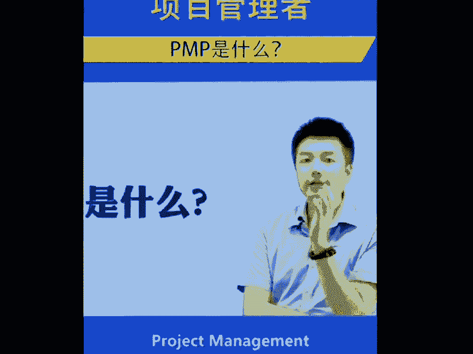
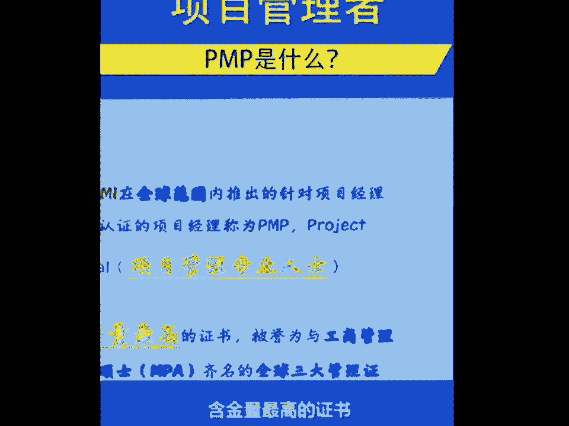
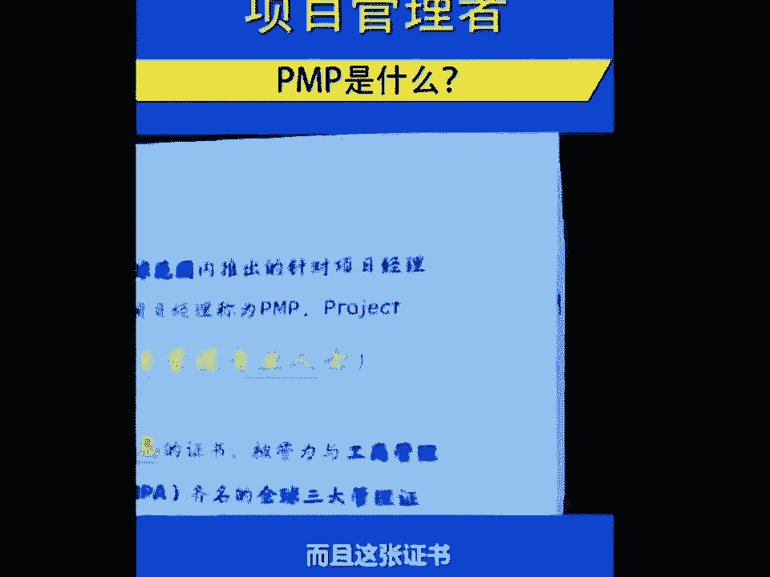
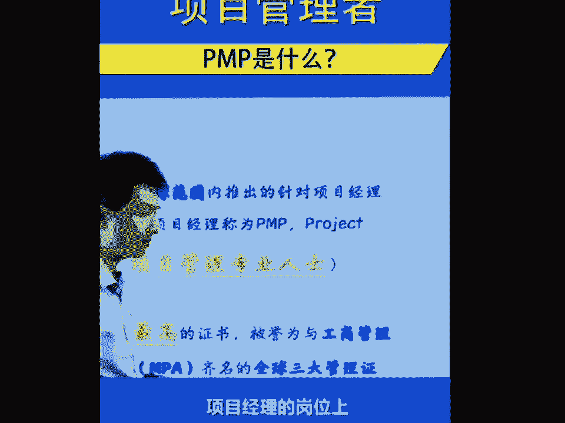
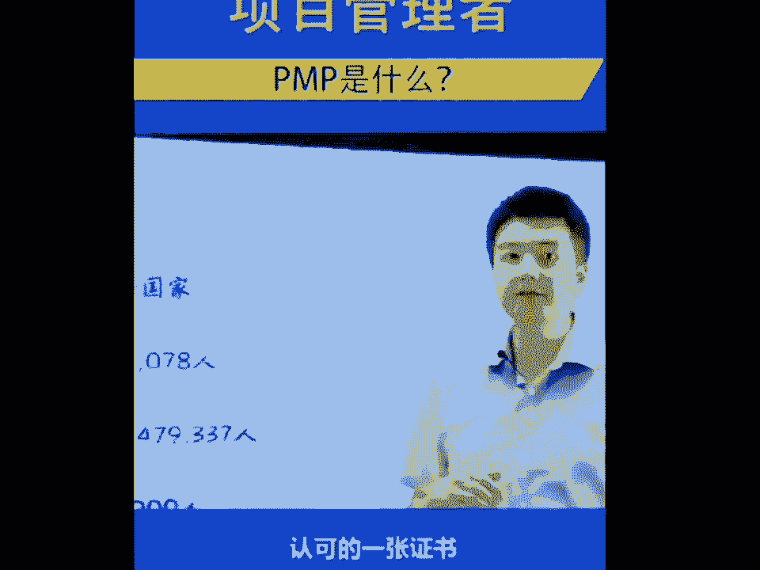
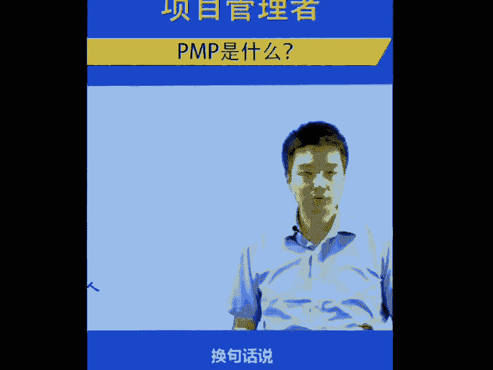
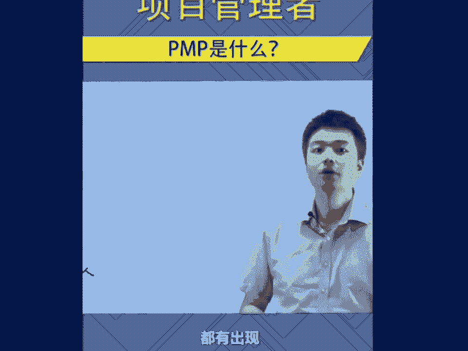
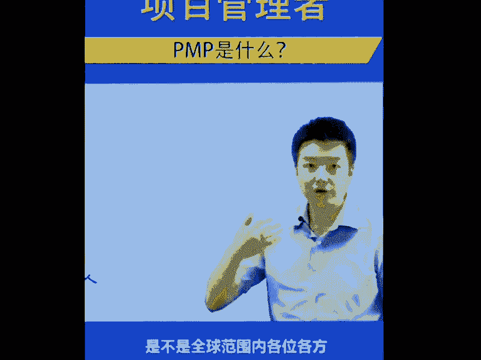

# pmp项目管理教学 - 抖音 - P1 - 潇洒哥爱吃瓜 - BV13u4y1o7fY

不一定听过pmp这门考试，分享全套pmp自学教程网课资料，视频中粉红色的文字是获取方法，分享全套pmp自学教程网课资料，视频中粉红色的文字是获取方法，分享全套pmp自学教程网课资料。

视频中粉红色的文字是获取方法还不够啊，要想做好项目管理，还得p m p m p什么意思呢，就是拼命拍马屁是吧，好无聊的笑话啊，收回来这里我们所谓的p m p这门考试。

它的英文全名叫做project management professional。

叫做项目管理的专业人士，这一门考试啊，是由美国项目管理协会pmi所推出的，在全球范围内，针对项目管理知识体系的一个认证体系，这张p np的考试的证书，虽然并称不上一张从业资格证，说你没有p m p证书。

你就不能当项目经理，当然没有人说过这样的话，但是在全球范围内，他也的确是得到认可最多的一张，项目经理方面的，这个知识储备方面的资格认证证书，它被称作是项目管理学界含金量最高的指数。

和nba nba齐名，而且这张证书啊有了之后。

我们现在在很多行业的这个招聘，项目经理的岗位上。

或者是在五一job上面是吧，我们看到这个这个招聘的要求上，经常会看到，如果您想要应试求职一份项目经理，在岗位，项目管理者的岗位，或者是和管理相关的岗位的时候，经常会有一条说叫做拥有pmp证书者优先。

所以呢在全球范围内，他都是得到广泛认可的一项证书。

这张证书已经遍及全球186个国家，换句话说。

拥有这张p mp证书的人，在全球186个国家和地区都有出现。

那么全球总共有多少个国家和地区呢，总共就224个国家和地区。

包括什么非洲的少数部落等等，乱七八糟都算在里面，是不是全球范围内。

