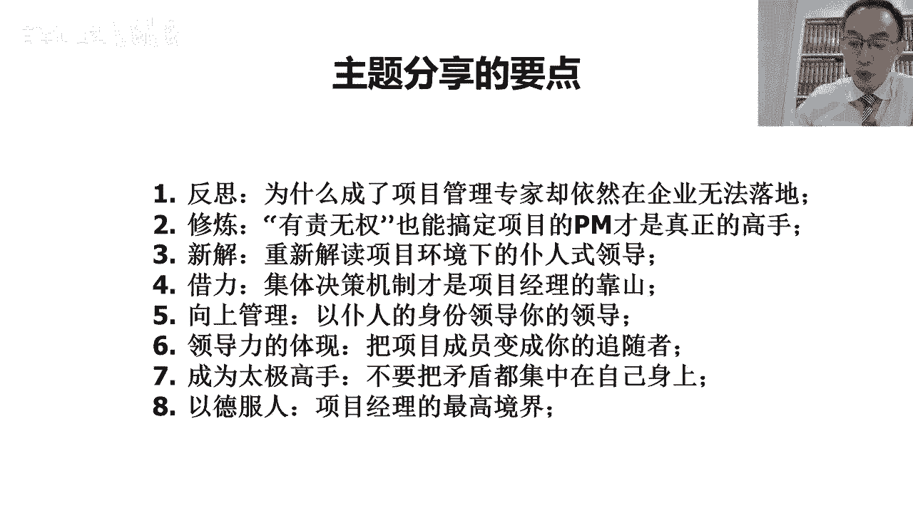
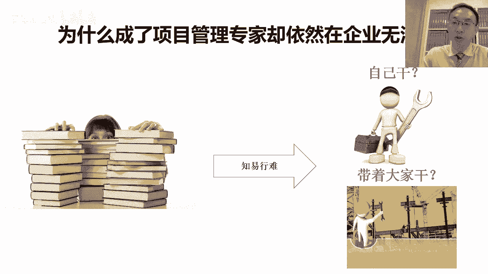
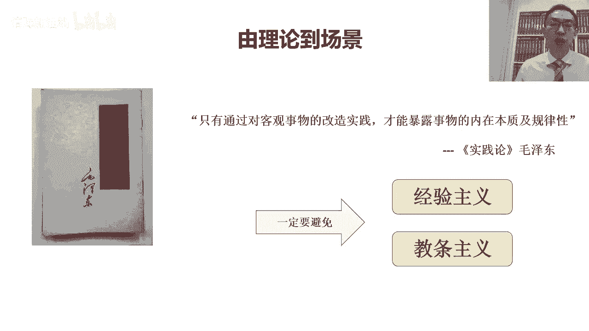

# “拍马屁”是对 “PMP”最深刻的注解 - P1：第一集-“拍马屁”是对 “PMP”最深刻的注解 - 清晖加油站 - BV1UG411P7ky

这次呢我们主题的分享呢，把它分成了几个方面啊，那第一个呢首先分享一下，就是我们要反思一下，为什么很多考过了p m p的，这个所谓的项目管理专家啊，或者项目管理的专业人士，但是在企业中。

其实并没有展现出能够把项目做成功的优势，反而很多没有学过项目管理课程对吧，也没有资质证书的人，他其实反而能搞定很多非常牛的项目，那这种其实是在写中非常常见的一种现象对吧，我们要去反思一下是为什么对吧。

而且反思这个很重要，因为很多时候我们在企业里经常会被质疑啊，为什么考过p m p的人，这项目反而做的不好对吧，那为什么很多其实没有考过p m p的人对吧，也没有学过的，都是土办法，野路子。

但反而呢其实在这个做项目的实战能力很强，很多别人搞费用项目才能搞定，所以这个过程中呢，我们一会儿要一起去反思，第二呢就是说什么样的项目经理对吧，才是真正的高手，项目经理的他这种工作环境是一定要一一。

一定要借助权力吗，还是说其实项目经理这种工作方式，他本来其实就是在有责无权的环境下开展的啊，第三呢我们要去思考一下这个仆人士领导，这点呢，其实跟敏捷项目管理的这个路数是一样的。

就是其实呢我们会发现呢真正的项目经理呢，他其实呢也是一种普人士领导，因为项目的环境呢，项目经理其实所管的这些人啊，或者带领的这些人，或者可以说是张罗的这些人，那这些人呢不是专家，就是领导对吧。

要不然就是客户，或者呢甚至有可能是各种强势的供应商，在这种情况下呢，项目经理想把这些人组织在一起，形成合力，然后他们之间又有着各种矛盾啊，然后那我们如何能在他们之间对吧，化解矛盾，那建立信任统一思想。

那其实这是一种真正的领导力，那这种事呢他其实要靠花很多心思的对吧，那在花心思的过程中，展现出一种仆人式领导的姿态，那这个过程中其实也是项目经理的嗯，他一定要好好去锻炼自己的，第四点呢，我们谈的是决策。

就是主要谈的是项目经理的权利，到底是从哪儿来的，那一会儿我们会详细解读这个问题，就是国内的这点比较明显，在外资公司呢，很多时候因为组织及的项目管理制度它很健全，所以呢项目经理呢他不用操很多心。

是因为呢他只要是按照公司制度，那带着大家做事情，只要具备解读公司项目管理制度的能力，那就能找到合理的依据来约束大家的行为，但是国内的很多的企业呢，因为这个组织级的项目管理机制并不成熟，那不成熟的时候呢。

那只能拼项目经理个人能力，那单靠项目经理的个人的这种影响力呢，可能他又没有办法去约束所有人的时候，那项目经理不得不啊，想办法需要借助项目的集体决策机制，就是我们通常说的项目管理委员会。

然后去帮助项目经理啊，建立项目中的秩序，所以呢这个呢其实一会我们再去谈这个问题，就是其实我们上次讲座的时候也有提过一句话，就是真正优秀的项目经理啊，他能他得学会建立秩序啊，然后要学会自己给自己授权。

这样的话呢整个项目才能受控，第五点呢，其实我们想解决的问题是什么呢，这个向上管理的问题，因为呢这个项目经理呢，他其实必须要掌握借力的能力，那借力的能力有时候可能我们要借领导的利益。

有时候可能要借客户的利益，有时候可能要借专家的力，那这里边的领导其实是一个非常重要的，那被借力的一拨人，那任何一个优秀的项目经理，他一定要善于借领导的力量对吧，去影响领导，认同自己的观点。

让领导愿意支持自己，而且在这个过程中呢，他还要用合适的方式去说服和影像领导，那这个其实就是我们所说的向上管理，第六点呢主要谈的是呢其实是管项目成员对吧，那很多的时候呢项目经理管项目成员。

他其实也是借助领导力的，尤其是越大的项目，越复杂的项目，越挑战的项目，那项目经理呢，他必须要能够让项目成员，发自内心的去认同自己的观点啊，愿意发自内心的呢去帮助自己，去实现我们认为正确的目标。

所以这时候呢我们倾向于呢对吧，我们倾向于呢，要从精神文化层面去影响我们的项目成员，把它变成我们的追随者，第七点呃，其实主要谈的是什么呢，在项目过程中，其实项目经理呢，他一直以来都是要一个能够去很好的。

很微妙的去建立平衡的这样的一个角色，所以呢这个一定切记，不要把矛盾集中在自己身上，很多做技术出身的项目经理呢，往往会犯一个错误，我们会发现所有的矛盾都集中在自己身上对吧。

客户啊在整天跟自己去争取客户的利益，供应商吧，跟项目经理之间很多的博弈，项目成员，那跟项目经理之间也形成很多的博弈对吧，领导也在跟项目经理博弈，那这时候项目经理成了所有矛盾的焦点。

但其实实际上我们大家去想一想，其实项目中的矛盾不是来源于项目经理的，项目中的矛盾，是来源于客户的需求，跟供应商的能力之间的矛盾对吧，那如果是市场类的项目，那市场的需求和研发之间的矛盾。

那也有可能这是说领导的期望对吧，跟实际项目成员的交付能力之间的矛盾，那总之其实所有的矛盾都是在项目中，不同相关方之间的，项目经理的存在，其实是为了帮助大家化解矛盾，建立平衡啊。

而不是靠项目经理自己去抵制所有的矛盾，所以在这一点中呢，项目经理如何能找到自己的一个合适的定位，其实也是项目经理的，这个一定要去想清楚和做到的，最后一点呢我们说这个以德服人呐。

项目经理呢要锻炼自己的内心对吧，很多的时候呢其实我们要对吧，给人展现出一种公平，然后同时呢目标感要强，然后呢我们要能够对吧，摆事实讲道理，用别人能够接受的方式去说服别人，那做我们认为正确的事情。

这个过程呢它非常符合我们的国学的思想对吧，就是道德对吧，光有道还不行，还有德，那德呢更多的其实是要令别人口服心服，那发自内心的认同，那其实项目经理的最高境界的他其实还是做人，那今天的晚上呢。

我们希望能借助这个时间，我们一起去分享这八个不同的主题，那希望呢能够在一定层面上，那给大家一些启发，帮助大家去思考，那项目经理这个角色，那他到底是一个什么样的角色，那在我们的工作中啊。

到底我们怎么样才能够获得大家的认可对吧，然后获得相关方的支持，然后把我们的项目管理工具和方法啊用进去，所以呢这是我们今天晚上的一个主要的目的。

首先呢我们分享这第一个主题啊，第一个主题呢其实我们要谈的话题呢，就是说也是一个非常常见的现象啊，我们会发现在国内呢其实这个考过p m p资质，包括考过其他的项目管理资质啊。

什么p m p i p m p啊，不错，考过各种的项目管理资质的人非常多对吧，但是呢却有很多的学员呢，其实考过了项目管理的资质，也能非常熟练的背诵各种项目管理的理，论和方法。

甚至呢也掌握了各种不同的项目管理的工具啊，但是呢在企业中呢，其实并没有能够很好的把它运用下去，很多的时候呢被选中很多实战的人啊，呃有可能是领导，有的，可是项目成员。

那其实可能会被大家认为其实是纸上谈兵对吧，然后呢知行不合一，那其实呢这样的一种状况并不好，为什么，因为这样的一种状况，他其实会导致是说大家，其实他不仅仅是为这个人有问题。

而且呢他甚至会去怀疑项目管理是不是真的，对企业来说是有价值的，那我说为什么会出现这样一种情况呢，就我自己的理解啊，他是这样，这个知行合一呢其实是一个非常难的事情，很多的时候呢自己实践出来的东西。

它自然落地就容易，但是呢每个人的经历和经验是有限的，那我们没有办法呢，就是在自己的有限的时间之内呢，这个能够把所有的经验都靠实践去解决，所以很多时候我们要去学习啊，学习是一种非常智慧的方式。

他的智慧之处在于的，是说我们把别人花好长时间精力对吧，通过实践所获得的一些经验，然后呢他把它提炼出来了，形成了一些知识和方法，然后我们在很短的时间之内去获取人家的，这些知识提炼的方法。

然后呢再把它转化成为我们自己的日常工作的，这种方式上来指导我们自己工作的时候，等于其实我们获取了人家的经验，所以呢其实学习呢是一种，可以帮助我们在最短的时间之内，获取大量经验的一种方式。

但是这个过程呢其实并不容易，那他不容易的主要体现在什么位置上呢，就是我们会发现知识呢，尤其是比如说项目管理知识，那比如说我们说pp背后的pinbox，项目管理知识体系，项目管理知识体系呢，它叫知识对吧。

那知识是什么呢，知识其实是在各种的大量的项目管理的，这个最佳实践过程中，他把它进行了提炼和结构化，然后呢它去除掉了各种不同的行业的因素，各种特殊性，把所有共性的东西那剥离出来，共性的是什么呢。

共性的是里面被称称之为叫项目管理的东西，然后那被剥离掉的是什么呢，剥离掉的是各种的业务场景和业务属性，我们想其实这些知识是怎么被提炼出来的呢，它其实是从一个又一个的实战的项目中，提炼出来的。

但是在项目里边对吧，在项目中他其实除了项目管理，它其实里边还有业务场景，那这个项目管理方法，它正是因为在业务场景中发挥出了，非常重要的作用，所以呢我们才认为是说这种项目管理方法，是有用的。

但是呢这个py的工作呢，它其实是把各种业务场景中的，被称为一项项目管理的要素提炼出来，把业务场景剥离掉，那这样的话，其实我们看到的就是纯粹的项目管理，那如果我们想把这些项目管理的知识。

应用到我们自己的业务场景中的时候，那我们必须要具备一种能力，就是我们要能把我们的业务场景跟项目管理，再次的去融合起来对吧，因为这项目管理知识在被提炼的时候，它其实是从项目中把业务场景剥离掉。

剩下的项目管理的东西，但是如果我们要落地的话，我们拿纯粹的项目管理的东西，是不是落不了地的，因为项目管理的它是一种组织保障形式，它是用来保障呢实现业务的过程，而且针对于不同的业务类型。

不同的业务的这个目标啊，不同的产品，不同的人群啊，这种的业务场景它是千变万化的，那同样的一种项目管理方法，落地到不同的业务场景上，它会展现出不同的形态啊，然后呢他管的要点是不一样的，甚至叫法是不一样的。

那如果我们想落地，我们就要把业务场景再结合回去，那我说为什么很多项目管理专家，他没有办法落地呢，是因为其实他并没有真正的去消化，所学的项目管理知识，很多的人呢他只是把它记住了，为什么是记住了呢。

是因为我们会看到，其实当我们在学习项目管理知识的时候，其实我们是纯粹的站在项目管理的角度去看，项目管理，换句话说，从项目管理专业的角度去看项目管理对吧，当然我不是从学习的角度，这个没有错。

因为当我们很理想化的去看项目管理的时候，这个理解起来最容易，第二呢传播起来也容易，但是落地起来却很难，但是呢它的优势是在于，我们可以在很短的时间之内对吧，我们去掌握大量的项目管理的专业方法和知识。

这就是项目管理知识体系，就是p m p最大的贡献，就是他把这个世界上所有被称之为叫项目管理，相关的东西，它都汇总起来了对吧，他从各种不同的企业，不同的行业，不同的项目类型，不同的项目工作中。

把跟项目管理相关的东西提炼出来，那整合形成的结构化，那这时候当我们把这个p m p考过了之后，其实理论上，我们的脑子里面已经装进了所有跟项目管理，相关的专业性的东西对吧，这边有知识，有方法，有工具。

有技术，有角色，有职责，但是当我们再回到我们的企业里的时候，如果我们想象不出来当时对吧，我们说当时提炼这种项目管理方法，是它背后的场景是什么的时候，我在我们这里落地就很困难。

那如果我们只是单纯的去站在项目管理，专业的角度去看项目管理的时候，那就会在别人看起来不接地气对吧，我说什么叫不接地气，就纸上谈兵，纸上谈兵的概念是说脱离了实际的业务场景，对吧，然后脱离了实际的业务场景。

然后去理想化的谈方法，谈理念的时候，那这个时候呢他被我们称之为叫形而上学对吧，它是一种形而上的状态，形式上的状态更多，其实是在思想层面去思考对吧，但是这时候呢他其实在落地的时候。

他很有可能其实落地的时候，落在地的东西其实跟想出来的东西，它完全是不一样的，但是它背后逻辑有可能是一样的，那为了去解决这个问题，我们怎么办呢，我们只能去实践，换句话说呢，实践过的项目管理专家。

都没实践过的项目管理专家，其实大家都是能一眼看得出来的，再换句话说就干过跟没干过是不一样的，那项目管理要落地的时候呢，他首先我们学习了体系化的系统的知识，然后呢之后呢我们要落地。

那落地呢我们有两种落地的类型，一方面的是说自己当项目经理，自己去尝试用项目管理的工具对吧，比如说w b s的分解啊，然后我们自己去制定计划，然后我们自己去识别风险，分析风险，那这时候我们是自己干对吧。

首先我们要锻炼自己的能力，第二呢作为项目经理，我们还要带着大家干，带着项目成员干，带着相关方去干，那其实往往呢我们要先能自己干，自己能干出来了，干明白了，我们才能带着大家干对吧。

否则的话你带着大家干都没办法辅导大家对吧，组织大家的时候能有理由说服大家，所以对于项目经理来说呢，我们其实知识体系的东西学完了之后，我们如果要落地啊，然后我们要先从里面挑出来一些具体的工具，技术对吧。

比如说像w b s分解结构，那政治管理对吧，做计划的方法，包括项目的这个这个里边一些具体的小的工具，小技术，那我们要首先要自己练，自己练熟了，然后才能带着大家干，但其实自己练也挺不容易的。

因为当我们一旦套到业务的场景的时候，我们就会发现，其实里面好多的因素都是需要去考虑的对吧，在这一点呢，其实我自己也很有体会，当时呢我觉得我最大的体会呢是说以前的时候，那我最早的时候其实是在外企。

那最开始呢刚学习项目管理的时候，是在以前的摩托拉半导体事业部，就是菲斯卡尔半导体，那其实我们在那里边的这个菲斯卡尔半导体，就是前摩托化半导体，它的这个项目管理体系是非常成熟，也非常健全的。

所以当时的时候我们其实在那种场景下，我们其实学习项目管理，它并不难不难的原因是因为什么呢，就是其实我可能是为数不多的，在没有考p mp之前，就先按照非常规范化的项目管理，在当项目经理。

是因为我们当时的公司就是菲斯卡尔半导体，它的p o，它本身是具有非常成熟的组织及项目，管理体系的，然后有各种成熟的项目管理工具，是因为这些东西是从美国传过来的，因为在美国他们已经用了很多年。

然后那在中国的时候呢，那其实我们作为新任的项目经理，我们只要向他们学习，按照这个资深的国外的项目经理去学习，然后呢他们告诉我们怎么做啊，师傅带徒弟的，我们就照着去做，所以这时候呢对我们来说。

只是遵循了公司的流程和要求，但实际上其实我们做到了项目管理的，很多的要素和要点，只是当初最开始，我们在刚开始去按照规范化的项目管理，做项目的时候，其实我们自己也不知道我们做的事的背后。

其实是有很多项目管理的道理的，那直到后来我们按照公司的要求去去考偏僻，零几年的时候，当我们考考p m p学习p m p的时候，最大的感受就是突然明白了，是说我们自己日常工作过程中。

我们的那些操作对不同的这种工作方法对吧，什么建立组织结构啦，进行阶段评审了，制定项目计划了，做w b s分解了，进行风险识别，突然明白了哦，原来我们当时做的这些工作的背后，是有这么多项目管理的要求的。

而且突然而且呢在学习的时候就明白了，我们为什么会这样去干，这时候就能更好的指导我看着工作，所以这时候呢他知行合一就会比较容易，是因为我们是先买一个规范化的项目管理方式，先干工作，干项目。

然后呢之后一学习，然后就明白了哦，我们当时为什么那么干，但是在国内呢，你其实大多数人他不是这样的，大多数人是先学习了项目管理的知识和方法，规范化的，但是在企业里边找不到一个对应的场景。

那企业中的实际的场景，那跟我们其实项目管理中所描绘的这个场景，那有巨大的差距，那这种差距呢它导致了一个结果，就是我们没有办法系统化的，去给项目管理方法落地，那我们只能从这个项目管理的方法和体系中。

挑一些我们能够落地的点啊，然后跟我们自己实际工作的场景去找结合点，然后呢如果能找到结合点，那我们要尝试自己1。一点一点的去往下落地，然后这个过程中呢可能还要去影响别人，其实每个点的落地都很难，坦诚地讲。

项目管理在中国的企业里面落地真的不容易，尤其是这个企业的管理生活度越低的企业，项目管理的方法落地越难，如果企业本身管理成熟度很高，我说的不仅仅是项目管理成熟度，而说企业的管理成熟度高。

那这个时候其实落地就会相对容易，是为了他这个项目管理的落地，其实是有些基础的，它的基础会包括我们说，其实企业他之前要能做到规范化管理，要更好的话，你要做到标准化管理，标准化管理。

如果再往上应该能做到体系化管理，然后如果能做到精益化管理和流程化管理，他其实在往这个基础上去干，项目管理时就会容易很多，但是如果我们是在一个非常人质的企业，很多的时候基础的规范性大家还都没有了。

而且很多的时候呢专业分工又没有分析，然后如果是职能化管理，还很强，就是科层制的项目管理风格很重的时候，那这时候呢对于项目经理来说，他想去拿一套这个对大家完全不能够理解的，这种项目管理协同式的工作方法。

那在自己的企业中，想说服大家去配合自己做调整，或者一块去找看怎么落地的时候就会非常困难，所以呢就会变成了是说，其实项目管理呢在中国的血中落地呢，是挺费心的一件事，但是可以的。

首先我们讲这个的目的不是说不可以，他确实是可以的，只是可能需要花费很多的心思，那我们不能简单的去埋怨，是说我们企业里面的员工，同事们他们不配合，因为他们没办法配合，没有学过对吧，我们大家知道这个。

我们为什么这个要大量的去推行，项目管理的培训，让我们鼓励更多的人去考p m p，因为如果有更多的人经过了系统化的学习，理解了项目管理知识之后，那这个时候呢，我们说想推行专业化和规范化的项目管理的人，才。

能在企业中找到更多的同盟，找到更多的知己，找到更多的盟友，所以之前呢我们一直有一个经验，就是我们会发现的，如果我们到一个企业内去推行规范化的项目管，理或体系建设，我们要先去看这个企业中。

到底有多少拿了p m p证书的，有多少进行过这种系统化的项目管理培训的，因为每当当我们在推行规范化的项目，管理体系的时候对吧，最先能够去站出来，支持我们的一定是那些考过了p p证书的人，对吧。

然而然而那些没有考过pmp证书的人，他其实往往会对我们的工作方式有大量的质疑，那甚至抗拒，所以呢就会变成了说一家企业，如果他真的是想把这个项目管理做好的话，他必须得有一定数量级的或者一定比例的人。

对他进行过系统化的项目管理学习，并且考取了相关资质，这样的话才能形成一种对项目管理认同的文化，那这个时候呢在在写中进行落地的时候，也相对会更容易，但是即使是在这基础之上的，那我们仍然对吧。

我们要要要亲力亲为，而且呢再有一点呢，就是嗯也是一个体会跟大家去分享，就是即使呢其实像我这样的，非常资深的这个项目管理的专家，那当我们在企业中，我们也很难完全靠给别人讲课和讲道理，去说服公司的高层。

跟所有的人呢去认同项目管理，和愿意冒风险去改变企业原有的工作方式，去尝试项目管理，那很多时候在企业里，我说的是在甲方，在企业内部的大招，有的时候站在外部的专家的角度来说，这个挑一些企业的毛病对吧。

这个指出一些企业领导做的不对的地方，然后告诉大家应该怎么做是对的，站在外部比较容易，但是一旦当我们回到了企业的内部的时候对吧，我们作为企业内部的人，他是不能轻易挑领导的毛病的，也不能轻易指责的同事。

很多时候如果我们想证明一个方式是对的，比如我们想证明项目管理的工具方法是对的，那我们最好的方式不是去给别人讲，告这个东西是对的，然后更不是说去说服别人，让人家去，是一个我们认为对，但是自己都没干出来。

但是却想让别人干出来，其实这很困难的，那我们最好的方式就是自己先干，甚至有可能先不告诉别人，自己先照项目管理的方式先去干，然后我们把它干出来，干出来之后，别人发现哎呀，这个你到底用了什么样的方式。

能干出来一个我们干不出来的成绩，那这个时候我们再去推广，我们说其实我们是用项目管理的方法干的，他才比较容易获得大家的认同，所以呢这个这几年吧，嗯其实我在甲方的写里面时间还蛮多的，体会很多的时候呢。

这个跟当老师当顾问不一样，有的时候乙方干久了呢，他会比较容易呢这个站着说话不腰疼，换句话说呢，这个我们能讲出来项目管理有很多优点啊，然后呢也能讲出来，企业关照项目管理做会造成很多问题。

但是呢这个只有真正在企业里面去实践的时候，我们才能知道，其实所有的我们看起来简中不合理的地方，它背后都有合理之处，很多的项目管理的方法落地的过程很难，他大家知道这个挑挑毛病很容易，挑问题很容易。

但是真正能去解决问题是很难的，我们提出一个解决方案容易，但是能落地一个解决方案很难，所以如果我们想在企业中呢，能够真正的把项目管理的方法推下去，获得大家的认同，很多的时候呢我们要首先尝试自己做。

我们学习了项目管理的方法工具，我们硬着头皮在企业里边先自己去尝试落地，我们自己带项目对吧，我们说证明项目管理方法，最好的方式是我自己带一个项目，然后我用项目管理的方法。

把这个项目的结果做得比别人的都好对吧，当我们能够去获得领导对项目的认可，能够获得领导对我个人的认可的时候，我才有资格去给大家分享我的经验对吧，那时候我们才敢去分享，是说我成功的经验。

我跟别人的差异之处是在于，我采用了专业的项目管理方法，把它运用到我们的业务和项目上，然后所以才能够做出比别人更过人的成绩对吧，所以这时候其实我们要告诉别人的事，说不是因为我比别人聪明对吧。

也不是因为我比别人勤奋，只是因为我借助了一个最佳实践，这个最佳实验叫项目管理，在这个过程中呢，我是怎么去用的，然后为什么导致了我的这个项目做得比别人好，当我们能够在企业中用自己亲身的行为对吧。

去实践出这样一个结果，然后达到了一个有资格跟别人分享的时候，那这个时候才能真正的让其他人去信服，说项目管理的方法有用，然后才有可能带动更多的人对吧，向我们学习，愿意去用项目管理的原因。

是因为对我们个人的认可，而不是对方法的认可，所以呢有一点大家一定要记得，在很大多数的企业里面，如果我们希望让一种方法获得别人的认可，得首先我们得让那个用这个方法的人，获得大家的认可对吧。

因为如果一旦人得到了认可，那他的工作的方式才会更多的被大家认同，然后这时候大家才会去学他的方法。

这个方法才有可能在企业里面落地啊，这是我说的这个落地的一个过程，在我们在去落地的时候呢，其实刚刚我们也反复的提到，这是实践的重要性啊，那谈到实践呢，这个不得不去提一本书，这正好是前几周的。

我们在自己的公司里面组织培训，但是其实我之前也没有看过，但这次呢因为通过培训的时候呢，所以在培训过程中仔细听了一下，学习了一下，然后发现有很多的体会，那这些体会呢。

刚好其实跟我在企业中去实践项目管理的时候，那很多的这种心得体会它就匹配上了，他其实背后也是有一个场景的，那个场景呢其实会发现的是说，我们会发现呢大家会经常犯两类错误，那一类被我们称之为叫经验主义。

那一类叫教条主义，那为了避免经验主义和教条主义，其目的是希望大家能够用更务实，更接地气的方式对吧，去搞我们的建设，那我们说什么是经验主义呢，经验主义其实他背后说的是说，很多的人呢他只相信自己的经验。

然后呢是因为在过往的在过去的几十年里啊，对吧，10年是几十年，年龄大了可能有几十年的经验啊，自己有很多成功的经验，但是呢这些经验在过去是成功的，但它并不一定等于在未来还会成功对吧，因为我们的世界在改变。

尤其今年特别明显，我会发现这个2020年啊，真的是一个大的变化的年，这个巨大变数，那在这种变化的过程中呢，我们很多其实过去的成功经验都开始被颠覆了，就是未来的成功经验，我们能够看到跟过去的成功经验。

一定不是一类经验，那也就是说，如果我们仍仍然非得坚持过去的成功经验，去开展工作，那我们其实很有可能其实未来会败得很惨，这原因不是因为这个经验错了，而是场景变化对吧，就是我们未来的工作场景。

跟过去式工作场景不一样了，以前的时候是经济快速发展的对吧，只要这个胆大勤奋敢干都是可以成功的对吧，所以勇于试错，但是在未来的场景下，我们会发现其实竞争越来越激烈，对我们说很多的行业面临很大的挑战对吧。

经济在在不断的往下走，因为我们开始进入到一个经济的低谷期，然后这时候呢想干一个赚钱的事越来越难了，那这时候呢我们说光勇敢，光勤奋是不够的，他需要在一定程度上要智慧。

我们要去思考我们到底做什么事才能赚钱对吧，然后这个我不能说什么事都去做，因为很有可能开始做了好多都不赚钱，赔钱利润没有对吧，我们说现在各个行业都呈现出一种状态，是不缺需求，但是利润极低。

那如果这个事干的不好，可能是干的越多，赔的越多对吧，最后把家底都赔进去，干不下去了，现金流就断了，所以我们必须要有选择的去接需求，我们要去思考，是说我们如何能够把一个不赚钱的事干的，赚钱对吧。

把没有利润的事干成有利润的，那这个过程中他需要很多的思考和智慧，要想明白再干，而不能说没想明白，先干一边干一边去看，很有可能没等你想明白，你最后这就已经把自己给干死了，所以呢这个时候呢。

其实这就是我们的经验主义的错误，那其实项目管理是用来应对经验主义错误的，我们说项目管理之所以被发明出来的主要原因，就是因为其实我们会发现，项目管理的逻辑不是说把错靠试试出来，而是说最好是靠对吧。

我们当做一件事之前，我们经过充分的思考，充分的论证，然后呢我们这样才能少走弯路，少犯错误对吧，我们说这是项目管理，我们项目组合管理，我们关心的是什么，我们有很多可以干的事，但是我们必须要先挑出来。

我们到底哪些事是最值得干的，我们不能说什么都干对吧，什么都干，这里面有很多可能是陪产的事儿，可能越干越赔，不如不干对吧，然而且甚至有可能是，因为我们干了很多其实并不值得干的事。

结果把我们的资源都浪费在那些事上了，反而忽略了很多赚钱的事，没有机会去看，所以这个过程的背后呢，其实我会发现每个人都需要去调整，不能单纯依赖于过往的经验，项目经理也需要升级对吧。

企业要升级项目经理也需要升级，技术型的项目经理要逐渐的成长为对吧，能够去经营型的项目经理，那技术型的项目经理他是以目标为导向的，我说经营型的项目经理对吧，他要以客户市场为导向，要以收益为导向对吧。

要花更多的时间去思考未来做什么事情对吧，能够带来预期的收益，怎么样做，收益能够更大，而不仅仅的去思考诶，我要按时完成交班的任务对吧，交付一个产品，其实我们会发现，项目经理的这个转型其实也是必须的。

所以呢不能仅依赖于经验，第二呢其实我们会发现，实践论的背后呢是说我们不能依赖，不能太教条，经验呢更多的其实是依靠的是自己的生活阅历，教条呢就是怕生搬硬套外面的东西，我说其实不管是美国的项目管理也好。

英国的项目管理也好，或者欧洲的项目管理也好，或者各个流派的项目管理也好啊，甚至是一些大的企业的最佳实践也好，在我们看来，这都是人家的成功经验，人家的方法他不是我们自己家的对吧。

就像很多时候我们看别人家过得好，但是我们很难把人家家过得好的最佳时间，复制到我们家上，为什么呢，因为人跟人不一样对吧，大家的理念文化不一样，大家走到一起的原因不一样，大家的短期中期长期的目标不一样。

所以在这种情况下，我们就不能教条的搬方法，那其实在我们现在很多的企业中，我们都会看到一个误区，这个误区是什么呢，很多的企业为了让自己的企业变得更敏捷，但是却因为教条的去照搬了别人。

一些很系统化或者很流程化的方法，结果导致了自己被束缚的更紧对吧，其实我们本来的目的是为了变得更敏捷对吧，更灵活，更更有能力去适应未来的这种多变的场景，去应对各种变化，但是因为照搬了对吧。

因因为照搬了人家的东西，其实发现自己上并不适合，但是又没有进行足够的这种灵活性的调整对吧，和定制化剪裁，结果导致的是说自己开展工作变得更加困难，这就是我们说的教条主义对吧，不能盲目崇拜其他人对吧。

我们我们这个老祖宗讲叫师夷长技以制夷对吧，取其精华，去其糟粕，我学习的目的其实是为了自己吸收，学习的目的，不是为了照搬，照搬的东西一定是用不了的，但我说不学习又不行，所以在学习的时候。

我们一定要想明白我们学的是什么对吧，我们学的是人家思考的逻辑对吧，我们学习的是人家工作的理念对吧，我们不能只照搬了形式而忽略了内涵，现在很多企业最大的问题是说只去学形式，不去思考内涵。

其实真正要学的是人家的内涵，人家的框架对吧，然后我们真正要把我们的成功经验，我们的业务流程对吧，我们的产品，我们的技术去跟人家的系统性的框架，和人家开展工作的内涵进行一次整合，整合完了之后。

他才能变成自己的东西，这时候才叫不教条对吧，所以呢我们怕的是什么呢，照搬人家的框架，照搬人家的工具，照搬人家的操作规范，然后说我们就必须按照他这个去做，这个其实一定是有问题的。

而且很多的时候呢这种纯粹照搬的方式呢，可能对一些企业来说呢，在当前的这种经济形势下，他可能失败不起，就这种试错的教训是惨痛的，所以呢我们当我们去学习别人的方法的时候，不管是学习py的知识体系也好，对吧。

我们系统化的学习完了之后，落地的时候一定要分步落地，一个点一个点一个点落地吧，落地点多了，连成线现多了，连城面，我们最怕的是把一个体系夸，直接扣到我们的企业上，然后这时候可能我们整个大家的工作方式。

就全都会被固化下来，那这时候其实企业对吧，想生存下去会变得更加困难，我们说了实践论的背后，它其实是希望的，我们要去避免这两种错误对吧，避免沉浸在过去的成功经验，而忽略了未来的场景已经变化。

第二单纯的去盲目崇拜对吧，来自于西方，或者是说国内的一些成功企业的最佳实践，而忽略自身的特色和特点，完全去照搬，这时候也容易造成很多的问题，那我们说到底对吧，我们说既要去借鉴经验对吧。

既要的这个依赖于自己以前的成功经验，又要借鉴外面的方法，到底这个度怎么掌握，这就是我们说的实践对吧，实践是简真理的唯一标准，我们所有拿来的东西，我们在群里要先试一试，但是试的时候呢。

一定我个人的习惯是说的系统化的思考，然后分布的落地走小步快跑的方式，那其目的是什么呢，其目的是说一点点事对吧，然后能用就用，不能用就不用，是成功了，就是自己的啊是不成功了，有可能是不适用。

所以呢在这个过程中呢，实践是一个非常重要的过程，学习项目管理也一样，p m p的知识体系中，给我们讲了130 40种不同的工具技术对吧，讲了各种系统性的思考，那这些东西在企业中落地的时候对吧。

他是要逐条落地的，它不能系统性的照搬，那这个落地的过程中呢，过程很痛苦，因为可能别人不支持，别人不理解，然后会发现书上讲的东西，跟我们实际工作场景差异太大，但是呢我们仍然要想办法去找到切入点对吧。

这样的话才能帮助我们的去真正的，通过在实践的过程中去明白，项目管理背后究竟讲的是什么，它的本质是什么，那这个过程其实还是一个挺不容易的过程，但是呢这其实也是每个项目经理要提升自己，一定要去做到的。

所以呢这个再次返回到，就说我们从提升项目经理的能力角度去看，我们说其实这个每个人的成长它需要一个过程，我们一般认为呢刚开始学项目管理的时候，我们更多的是首先要死记硬背，把很多西方的项目管理知识。

名词方法记住，那学会站在项目管理的角度看项目管理对吧，站在专业的角度去看专业的项目管理，但是当我们想再往下一个层面提升的时候，我们要开始走向了由专业的管理到走向场景化，场景化的概念。

就是我们要把项目管理中，各种东西套用到我们实际工作中不同的场景，然后我们去做一个对应对吧，看一下这个项目管理提到这个东西对吧，比如说项目管理提到了一个叫商业论证。

那这个商业论证在我们的企业里它叫什么名字，是叫可行性分析吗，还是叫项目评审对吧，然后那在这里边我们要去做一个对应，当我们能对应的时候呢，说明我们这个有理论联系，时间又近了一步之后呢。

我们要去思考的是说我们实际工作中对吧，这事干这么多年了，他也不能都是错的，他肯定有很多成功的经验，那这些成功的经验呢，对应到我们的项目管理所学的商业论证中，它跟里面的什么样的工具是对应的对吧。

跟里边什么样的要求是对应的，那这个时候其实我们再进一步的去对应对吧，但我们这个完了之后，我们要去做一次匹配对吧，我们看系统化的商业论证，跟我们企业内部做的项目论证对吧，这之间什么就是一样的。

什么就是不一样的对吧，里面是不是我们企业中在做的时候，有些东西我没有做到，或者我们忽略了一些环节，但是在项目管理的方法中，其实他把他讲了，那这样的话，其实如果我们能结合起来的话，那这时候这个时候。

其实我们就在开始走向实践了，如果我们能把这个在项目管理中，提到了一些步骤，但是我们在企业中却缺失的部分，能把它补进来，那这时候其实我们就在帮助我们的企业对吧，去完善一个这个工作的方法。

那如果是说优化完了之后，我们发现确实对我们实际的项目，就对我们的论证的结果起到了帮助对吧，能够帮助项目少走的弯路，对或者规避的损失，那这种其实就说明其实我们在实践中对吧，去证明了自己的一些想法。

那这时候其实对商业论证本身的理解对吧，跟我们没有实践过的时候就完全是不一样，所以呢我说这个初期的项目经理呢，先靠死记硬背，把系统性的知识记住，但是走向下一个阶段的时候，要通过在不同的场景中实践。

加强自己对项目管理的理解，实践成功了，自己的理解就又加深了一课对吧，实践即使不成功，肯定也比那没实践过的他更明白一些，所以呢要在不同的场景下去实践，当然了，我说这个实践吧跟实践也不一样。

能在一种的业务场景下实践成功对吧，这是一种成就，但你如果能在各种不同的场景下都能实践成功，那就更加厉害了对吧，我们说比如说商业论证，我们能够在自己的企业，比如说我们能在对吧。

我们能在i t的这个立项的时候，能把实验证做好，那比如说下次我们换到了，比如说我们在一个服务行业对吧，或者在一个制造业，或者在一个市场的这个环境下，是不是我们还能把这件事做好。

对我们在普通项目上把上一分钟做好，那我们在战略项目上能不能做好对吧，当我们尝试在各种不同的场景下，都去尝试同一种工具方法，那通过实践都能够去把它做成功的时候，那我们对这个工具方法本身的理解。

其实就又上了一个不同的层面，所以呢实践很重要，如果呢我们大家呢不希望呢，在别人看起来是一个纸上谈兵的专家对吧，然后而希望在别人看起来是一个，知行合一的高手，那我们就要勇于去实践对吧。

而且这种实践呢是基于系统化学习的实践，系统化的学习完了，然后我们再勇于去实践，在实践中去提升自己对这件事的认知，然后我们再通过分享的方式去教给别人。

