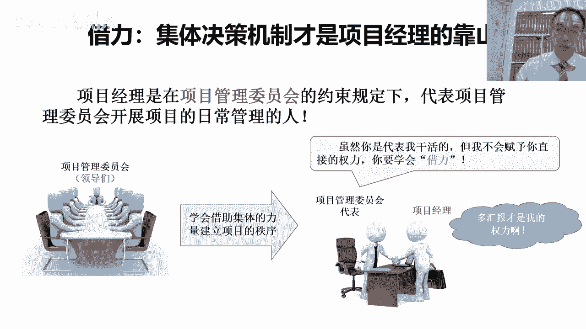
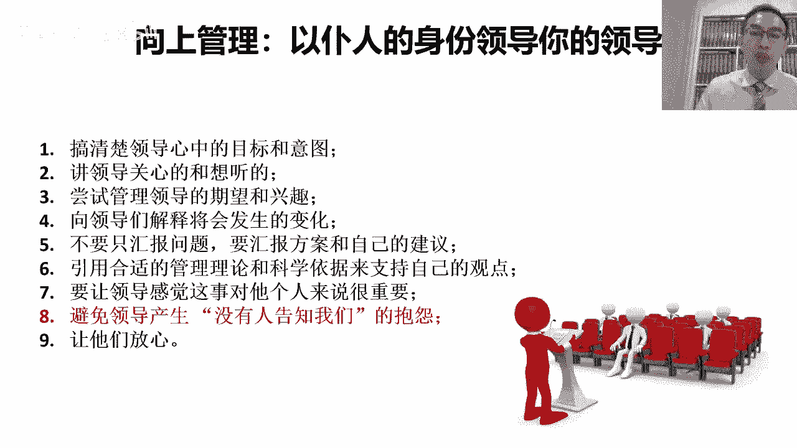
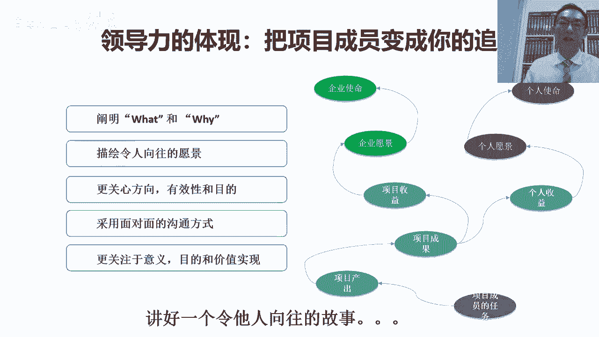
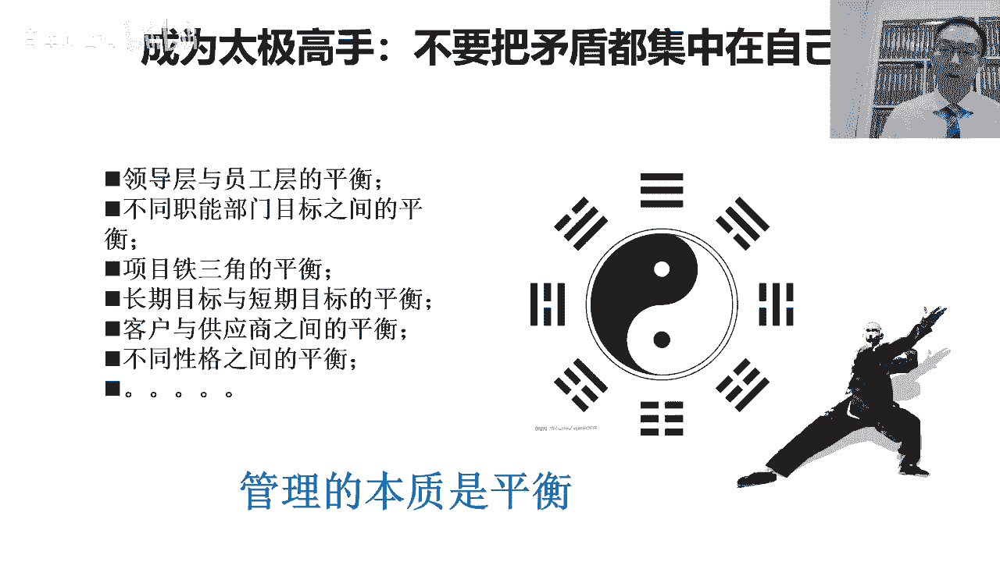
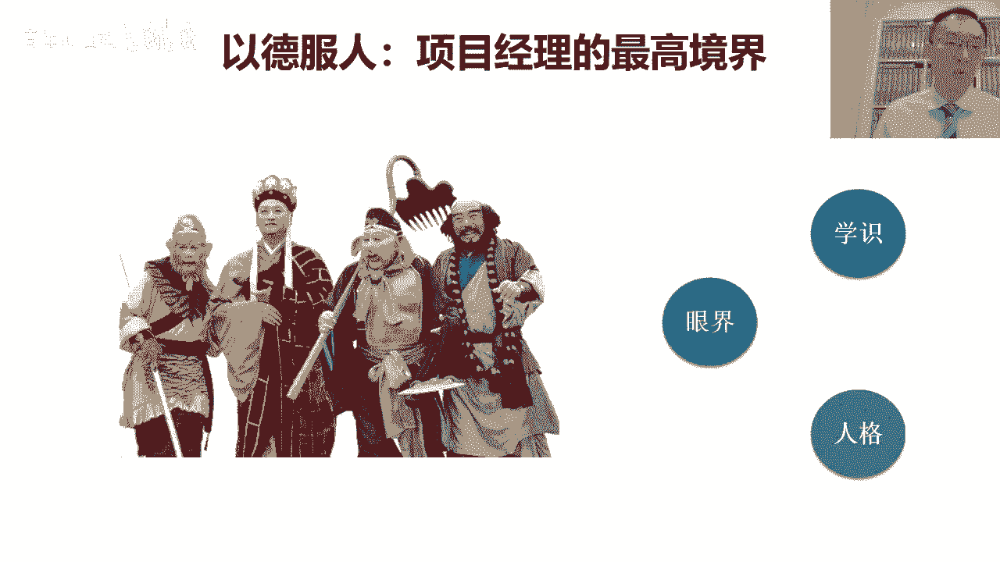
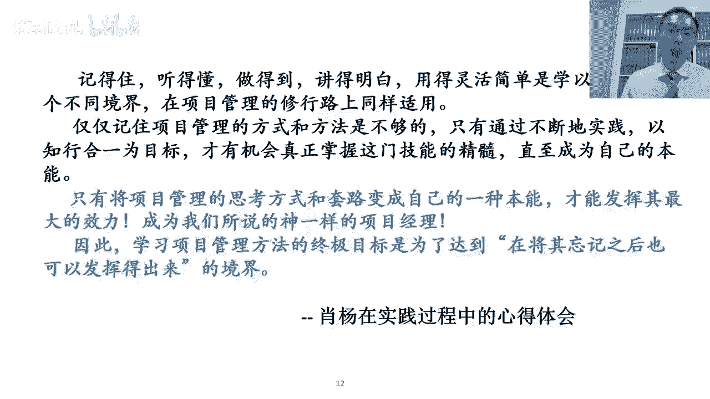
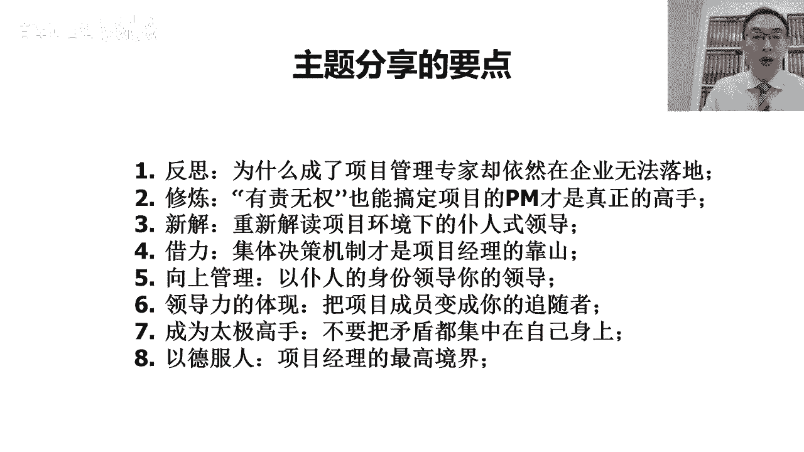
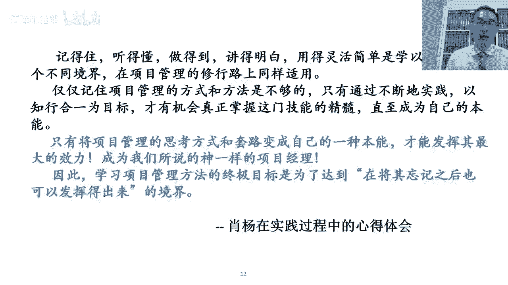

# “拍马屁”是对 “PMP”最深刻的注解 - P3：第三集-“拍马屁”是对 “PMP”最深刻的注解(1) - 清晖加油站 - BV1UG411P7ky

重要。

然后呢，当我们再去想办法影响这个项目中的项目，管理委员会跟各种领导的时候啊，我们要去学会向上管理的方式对吧，这种向上管理的方式呢，这时候就是说向上管理沟通，那就是说用仆人式领导的方式做沟通。

那沟通的时候呢，我们可能要去做到几点，那首先呢我们首先要做到几点之前，我们要首先讲一定要避免的误区是什么呢，避免的误区是只讲自己关心的事情，大家知道沟通这件事啊，如果想影响别人对吧。

他同样遵循孙子兵法的一个说法，叫知己知彼，百战不殆对吧，我说我们能我们的观点去影响到别人，认同我们的观点，他其实也是在精神层面的一次胜利，那这种精神层面的胜利，他得首先取决于我们得理解对方对吧。

我明白他是怎么想的，明白他的意图，然后我们才有可能用我们的观点，去获得了他的认同，对所以呢在这个跟领导沟通的时候也是这样的，不光是跟领导跟客户对吧，跟供应商我们最怕的是对抗。

大家知道项目管理重载的是联合对吧，形成合力，形成同盟，那项目管理怕的一点是什么呢，我们跟别人形成了各种对抗和竞争关系，这是不对的，项目管理从一开始就是为了整合资源，整合人而形成的管理方式。

而不是为了去击败所有的人对吧，所以呢这这一点的这个做项目管理啊，他一定要特别的注意，而且呢这个同样引用孙子兵法中的一句话，按照这个很多的时候啊，这个我们在过程中啊，其实我们会很多的时候。

大家会产生的这种真正的这种博弈对吧，那在这个过程中呢，他就像行军打仗一样，在项目管理的过程中，我们要去影响不同的相关方啊，客户也好，供应商也好对吧，那其实我们的目的不是为了战胜，按照孙子兵法讲。

叫用兵之道对吧，这个首先用兵之术在于战胜，用兵之道在于西征对吧，西征的概念就是平息战争，平息争端，所以呢其实战胜是一个低层次的项目管理，要练的这种领导力，其目的在于西周平息大家之间的冲突和矛盾，对吧。

把一群人变变成一个人对吧，把一群敌人变成一个同盟，在这个过程中呢，其实我们要采用的方式得首先能各个击破，就是首先能够跟每一个相关方达成共识，然后再在他们之间找平衡点，统一大家共同的目标和思想。

这样的话才有可能形成一个真正的，在这个过程中呢，首先我们要能征服的是领导对吧，我们说这个项目经理要很擅长通过影响领导，来影响领导的下属对吧，那领导的下属很有可能就是我们的项目成员。

那得首先得能影响领导才行，我说影响不了领导，老影响人家的下属，人家领导肯定不愿意，他肯定得阻止你，就是这时候呢，这个人家派过来的项目成员也难受对吧，到底是听自己领导的，还是听项目经理的。

所以项目经理未能让项目成员活得简单点，为了让人家能够对吧，干活的时候开心点，能够发力的时候对吧，能更专注一点，得首先解决了跟项目成员的领导问，能建立同盟和共识关系，这样的话人家底下人才好干活嘛。

所以把这个影响领导很重要，不光自己的领导，包括项目成员的领导对吧，各方的领导，所以项目经理一定要善于跟领导打交道，跟领导打交道的时候呢，我们说这叫沟通对吧，或者应该叫汇报，我们说一般向上吧，咱都叫汇报。

所以呢项目经理一定要很擅长干汇报的事对吧，我们说评级才叫沟通对吧，向下叫传达，向上要汇报对吧，所以见到所有的领导第一汇报姿态放低嘛，不认识领导要汇报汇报的时候呢，其实我们在汇报我们的观点之前。

汇报我们想做事情的时候，我们要首先想明白对吧，领导爱听什么，人家关心什么，人家对这个项目中的利益诉求和动机是什么，对吧，我们说如果两个人想沟通好，我们首先谈人家关心的事对吧，就那知己知彼。

先谈领导关心的事情，从领导关心的事情，因为我们先谈领导关心的事情，这时候领导才觉得哦，他才有兴趣，是因为你谈的是人家的事，我们最怕的是很多技术书的项目经理，讲了一个小时，讲的全都是自己那个活怎么干。

其实这事跟人家领导一点关系没有对吧，领导一般关心的是什么，这个项目收益是什么，这个项目的价值是什么对吧，这个项目对我的工作跟我的考核，我的目标的影响是什么对吧，我们先谈人家的领导关心的事。

再从人家领导关心的事的这个事情上，引到自己在做的事情上，那其实最后我们要达到的一个结果是什么呢，我们要去证明，其实领导您关心的事跟我在干的事，这是一个事对吧，如果我的事干成了。

他就能够帮助让您关心的事儿变得更好，换句话说只要我的活干好了对吧，您关心的问题也解决了，所以呢其实咱俩关心的事应该是一个事儿啊，您要是支持了我等于支持您自己，那这样的话，其实我们是在干了一件什么事呢。

其实我们把双方的利益诉求点给整合了对吧，把双方变成了一个同盟，大家有了共同配合的契机，这时候才有可能获得领导的支持，所以这是我们说的第一条对吧，首先呢我们得首先搞清楚领导关心什么对，不管谁家的领导。

自己的领导也好，客户的领导，供应商的领导也好，项目成员的领导好，我们再去跟人家沟通，之前先做准备工作，先去搞清楚人家关心什么对吧，然后我们从人家关心的事谈起，从人家关心的事引到我们关心的事。

最后证明这两个事是一个事儿对吧，在这个过程中呢，我们需要特别注意的一点是说呢，有的时候我们一谈了人家关心的事，领导关心的事，那领导高度都比较高对吧，他可能一下把这个高度拉上去了。

可能有一些要求跟领导的期望值会很高，不容易落地对吧，但是你又不能直接批评人家，也不说领导这个不切实际，这一定不能这么说对吧，我们其实很多时候要很委婉的，用令人家能接受的方式去降低人家的期望值。

什么时候用人家能接受的方式呢，我们要举事实对吧，这个举事实讲道理，什么叫举事实呢，我们不能说我们主观上认为领导说的不对，你不可能对吧，他不可能比我们水平低啊，我们不能拿观点去否定人家。

但是我们可以尝试去解释，可能在其他的一些企业或类似的项目，人家干完的过程中，他确实干不出你说的这么高的结果来对吧，首先呢第一我们要表现出，我们一定要勇于承担对吧，有挑战的任务对吧，领导既然提了要求。

第一首先要接态度，必须得好对吧，首先第一我们要勇于承担，态度好，肯定干，第二呢我们又可以去解释一下，说其实我们可能见了很多其他的人对吧，其他的企业一些非常比我们还牛的企业，结果他干出来的结果。

都跟我们这个要求相差甚远对吧，那所以这时候其实我们是什么呢，我们很委婉的证明是说，如果很多比我们很牛的企业，他都干不出来对吧，对我们这事挑战稍微有点大，所以其实呢我们是在尝试着去把这个领导。

期望值稍微降低一点，第二呢有些话呢我们不好降低，我们可以请别人来讲啊，我们可以请外部的专家对吧，我们说这个外部专家最大的好处就是，他可以说很多我们自己人不方便讲的话对吧，所以叫外嘴嘛对吧。

我们可以请专家来去讲，对，说这要求可能太高了对吧，然后不行，我们可以把领导送出去培训上课对吧，然后让其他的学员，其他的老师去影响他，调整他的期望值对吧，所以呢总之呢不能自己。

不能自己去直接否定了领导的期望，而是呢要尝试借助其他的方式对吧，去帮助领导明白，那正确的期望应该放在什么位置上，这样的话我们才能更容易的去把它落地落下去，在沟通的过程中呢对吧，我们要善于推演。

推演的概念，是说呢我们要顺着领导的一些观点和想法，那帮助他去推演，对你这个想法如果要落地的话，会变成什么样子对吧，会带来什么结果，那比如说如果我们想做的事情，如果领导你用你的资源和权利支持了我们。

我们大概会做成什么样子对吧，然后呢会交付什么样的产品，然后呢会改变哪些人，这种改变对那些人对吧，对领导本身会带来什么样的好处，对公司会带来什么样的价值对吧，什么样的社会什么价值。

所以呢这个对我们来说叫变化，大家知道一个项目最后做成没做成啊，其实主要最后是看所带来的结果，就是我们说的成果，成果描绘的是什么呢，成果其实描绘的是项目的产出，或产品落了地之后给用户所带来的一种改变的。

这种改变之后的状态就是状态发生了变化，什么叫状态发生变化，比如说我们在公司内部上了个业务系统对吧，那什么叫成果，什么叫变化呢，上了系统本来的目的，其实是为了改变员工的行为，换句话说员工以前是这样干活的。

我们希望通过上系统的变成那样工作，是因为我们认为他那样工作，比他原来那个工作能对公司带来更大的收益，对吧，可能提升了效率，降低了成本，提升了透明度，加强了收工性，对吧，那所以我们最后看这项目成功没成功。

我不是看那系统上没上限，而是我们要去看是不是真的员工，改变了他的行为和工作方式，而且他这种改变真的使效率提升了，或者成本降低了对吧，或者是说呢受控性变好了，风险减少了，如果是说一个系统上线。

而没有看到大家的行为有改变，说明这个项目是一个失败的项目对吧，因为呢其实所有的人最后会从改变之后的结果，来去判断项目本身是成功了还是没有成功，所以呢作为这个优秀的项目经理呢，他要擅长的对吧。

帮助领导去推演对我们想做的事，我们想做的目标对吧，如果我们按照我们的要求去做了，会带来一系列什么样的改变，那这个过程是被我们称为一个推演的过程，这个推演的过程呢，可以帮助一个领导或一群领导对吧。

更容易的去理解，那未来所发生的变化是什么，以决定他要不要支持我们去带来这种改变，所以呢这是我说这得解释未来的变化，第二呢在第五条呢，就是说当我们再去给领导做汇报的时候呢，对吧，我们尽量不要抛问题。

我们尽量呢其实是要去汇报，解决方案和自己的建议，换句话说，大家知道这个其实大家知道，初解决方案是一个特别费心费脑的事儿，谁都不爱干这个事儿，那我说如果领导的时间非常宝贵的情况下。

而且我们又需要领导更多是决策上的支持，那最好我们自己把这前期准备工作都做好了，对吧，我们想出来各种解决方案，然后呢最好方案还是带选项的对吧，选项三，然后呢我们让这些领导们对吧，去做选择题对吧。

看他们到底是喜喜欢选项一还是喜欢选项二，还是喜欢选项三对吧，其目的是什么呢，把领导决策的过程变简单，所以这时候呢多汇报方案和建议，能让领导们用最短的时间之内，最不费脑筋。

最不费心的方式能做出一个正确的决策，这时候领导们他其实是愿意拍这个板，当然很多的领导一直不拍板的原因，是因为信息不足，对啊，因为信息不足，所以导致了说决策有风险，决策有风险呢，那就不敢决策对吧。

或者是说呢发现这个没给方案，那不能自己去替对吧，项目项目经理或项目成员去想方案吗，那不成了自己在给项目经理打工了吗，所以呢在这种情况下呢，项目经理如果希望更容易的获得领导的支持，更快的获得领导的支持。

就要想办法把自己的建议对吧，做成一个方案，做成选择题，让领导比较容易的能够去做得出选择，这样的时候才能最短的时间能力去支持自己，所以在给领导们做汇报的时候呢，汇报方案第二呢要能讲出合理的逻辑对吧。

用了这个用事实的依据，用管理的方法，用合理的逻辑去证明自己的观点，那在这个过程中呢对吧，我们证明的逻辑越合理，越容易获得领导们的支持，这样的话才更容易去获得资源对吧，然后呢还有一点需要特别注意的。

就是说呢要经常汇报，那当然如果我们有了项目管理委员会，那我们其实呢需要让我们的项目团队，包括项目经理，对领导们看起来是透明的，这样的话人家才能信任对吧，那人家信任了呢，人家才能给予更多的支持。

不管是资源上还是权力上的，我们最怕的是什么呢，领导觉得项目经理觉得不透明对吧，而领导们觉得被冷落了，从来不来找自己汇报对吧，那你想是不是躲着自己，是不是瞒着自己对吧，是不是干了很多不该干的事。

怕我们知道，那这时候呢，可能他逐渐的就会产生隔阂和不信任，一旦产生了隔阂和不信任呢，想获得领导的支持呢就会比较困难，所以项目经理呢那如果不想走到这个状态呢，就要多汇报对吧，早请示，晚汇报。

这样的话呢才能更多的获得领导的信任，人家才敢给你支持对吧，我们说站在领导的岗位上，最怕的就是支持一个人，支持错了对吧，支持了一个人，他捅了娄子，然后结果责任还得算自己身上，那这时候对任何领导来说。

这都是一个得不偿失的事情，所以呢为了能更多的获得领导的支持呢，大家呢要经常汇报啊，然后呢要对领导透明，让领导了解呢自个儿项目的整个的过程，然后呢，这时候呢人家才能够更容易更放心的去给予。

资源和权利上的支持，在这个过程中呢，我们说我们要把姿态放低对吧，那仆人的姿态啊，要尊重领导啊，替领导着想，然后讲领导关心的事情，然后用合适的方式，领导容易接受的方式对吧，去影响领导，去认同。

我们认为合理的期望值和我们的观点对吧，给领导们提供选择题，充分的信息对吧，而且是提炼之后的信息，不要给领导们海量的信息对吧，我们说为什么现在很多大数据决策，各种智慧受到欢迎。

所以每个人都希望能够很简单的，不费心的去做出一些非常复杂和有挑战的决策，这个过程需要有人去帮助他们，把海量的信息收集到，而且把它去加工提炼对吧，变成一个很容易做出判断的选项，那其实我们说作为项目经理。

我们给项目管理委员会，他也要做到这一点对吧，让领导们能够最容易的，最不费心的去做出一个英明的决策，这样的话，这样的项目经理才是更容易获得领导的支持，对我们最怕的项目经理，就是每次给领导做汇报时一看。

每次来了对吧，第一讲的时间又长，说话有没有重点，还没有逻辑啊，广汇报问题，然后还没有解决方式和建议对吧，然后最后你也不知道想让领导支持你什么，然后又耽误了领导很多的时间，而且平常对领导还不透明。

也不知道你干什么，然后突然有一天来了，汇报了一大堆问题，而且讲的过程又臭又长，没有重点，没有逻辑，那这样的话他一定很难获得领导的支持对吧，所以呢我们要想获得领导们的支持。

需要懂得正确的获得领导支持的方式，领导也是人对吧，领导也不是神对吧，各位的领导，你要想获得他们的支持对吧，也得把它当做一个人去看对吧，能让他活得容易点，简单点的，不要让领导活得太累对吧。

如果老给人添麻烦，人家就会躲着你对吧，老躲着你，你就会发现其实你就获得不了资源和支持，所以呢当项目经理呢对吧，要学会站在领导的角度思考问题。

帮领导过得更简单一点，让给领导添麻烦，再有的我们说对项目成员对吧，这个作为项目经理呢，当我们对项目成员的时候吧，我们得能让项目成员发自内心的去认同我们，大家想这个项目成员也是人对吧。

我们说这项目成员跟着项目经理在项目中干活，他都有好处对吧，它它的好处呢跟公司的好处，这是两件事，项目做成了公司有好处，但关键项目经理，项目经理有可能有好处，有可能没好处，就算项目经理呢没好处也干对吧。

我们说我们这个企业责任感对吧，这个无私的精神，但关键项目成员总得图点什么吧，那项目成员他图的东西呢对吧，我们要么有实实在在的好处对吧，可能有项目奖金，要不然呢在过程中才能学点东西，能提升能力对吧。

有利于日后的职业发展，然后要不然呢是说在过程中呢，虽然也没学什么特别多多的东西，可能也没有实实在在的这个这个财务上的奖励，但是呢跟大家一块干活，很高兴对吧，换句话说呢满足了精神层面的需求啊，这也可以。

所以呢作为一个优秀的项目经理呢，我总得给大家创造点，在项目中激情工作的理由对吧，有的是寻求的是心理的愉悦，有的寻求的是物质上的财富对吧，有的寻求的是能力上的成长，有的可能是寻求的是说被自己领导。

这种这种这种认可的对吧，这种认可的机会，所以呢不同的项目成员吧，他可能在项目中，其实他的这个利益诉求点还不一样，那作为项目经理来说呢，他要去了解每个项目成员，我们要去思考用什么样的方式对吧。

能让这些项目成员呢在项目中干得很有激情，而且让他觉得在项目中没有浪费时间对吧，然后这样的话，他才有可能真正的去发挥出自己最大的力量，又返回到了之前，其实提过一句话，我说任何一个优秀的管理者或领导者。

那他所需要做到的是说呢，能让平凡的人，在自己的项目上做出不平凡的事对吧，所以优秀的项目经理的目标呢，一定是让平庸的项目成员，因为在自己的项目舞台上，能干出一个不平凡的事儿，所以呢项目经理呢。

他得善于给每个不同的项目成员，他会画饼对吧，我们希望一个项目成员努力工作，我们得跟人家谈心对吧，你要给人家讲为什么要来我的项目上工作对吧，来我的项目上工作，你有什么好处对吧，你是个人能力成长了。

你还是说奖金增加了，还是你的领导会因此而认可你的对吧，或者还是说在过程中呢，你一来我们这项目吧过得很开心，发现跟我们大家在一块对吧，这个不是吃饭，就是娱乐，要不大家一块聊天也很开心，或者大家一块工作。

一群志同道合的人在一起干得很有激情对吧，总之要给人家描绘出一个人家所希望的场景，而且在我们开展项目工作的过程中呢对吧，我们要不断的去为每个项目成员去创造，让他有成就感，让他开心的这样的一个场景和状态。

我们怕的是什么呢，项目成员在项目中对吧，第一本来就没图什么对吧，来了也没什么好处，结果呢还老挨训，好不容易干了点活呢，功劳还全都让项目经理自个儿占走了对吧，然后回去之后呢。

其实这个自己的团队领导也不愿意对吧，为什么呢，因为给项目中干活多了，结果自己工作直接领导派的活儿好都没干，那这时候直接领导肯定得想办法得治自己，那在这个过程中，我们会发现他项目成员他就不爱干了呀。

他在项目上图什么呢对吧，辛苦受累还不落好，所以呢对于项目经理来说呢，如果我们希望在项目成员做得好，能够让项目成员干得很有激情，我们就要做到刚才我们所说的那些东西，关心人家的个人，关心人家的诉求对吧。

最好能搞定人家的领导，人家的领导呢支持他在我的项目工作，然后在我们项目工作呢，这项目成员自己还得有好处对吧，不能说大家都是为企业无私做奉献了，大家都对企业无私做奉献，这个事呢他说着容易对吧。

那么我们的文化咱是中庸的文化对吧，大家都挺务实的，入职的背后呢，我们最希望干的是一个，对企业跟个人都有好处的事对吧，谁也不能长期广干这个对企业，只有对企业有好处，对个人没有好处的事。

这样的话长期干谁也受不了，尤其很多基层的员工对吧，那又不是公司的领导，犯不着替企业去操那个企业领导操的心对吧，咱就干点对自己有好处的事，所以呢项目经理呢就得把对人家个人有好处的，事给你讲清楚。

这样的话有好处人家就来了对吧，没好处人家就不来，所以呢项目经理呢一定要善于给每个人，讲好一个他向往的故事，这样的话呢人家才有可能的对吧，真正的来到我们项目中对吧，发自内心的想去做点事情的目的。

其实也是为了对人家自己对吧，对自己也有一个交代，所以呢我们要关心项目成员，替人家想在项目中的好处对吧，减少人家在项目中开展工作的阻碍，特别是来自于人家本来职能领导的。

这样的话才是一个好的项目经理，才是一个好的领导者，再有一点呢就是我们之前其实有提到过，这个项目经理，他其实挺锻炼这种平衡的能力，因为呢在我们的项目中呢会爆发出各种矛盾，其实我一直认为呢。

嗯其实项目它本身就是一个冲突的载体，项目呢因为有冲突啊，因为有相关方的矛盾，所以才有了创造出令人瞩目的价值的机会，大家知道这一片平和呀，他是出不来创新，出不来有创新的这种价值的结果的。

那很多的时候正是因为项目中有跨界的矛盾啊，不同的相关方对吧，比如说这个领导，领导的期望是来源于对未来的这种战略期望，跟员工的实际能力之间的差距，或者跟员工现在正干着活之间的差距，不同的部门对吧。

我们研发的部门，市场的部门，对供应链的部门，服务的部门，i t的部门，不同部门的人，他关心的目标不一样，导致他们其实在一起协同的时候，关注点不同，项目中呢有铁三角对吧，时间范围成本中间老是有矛盾的对吧。

那我们在项目中，我们一直要找的是一个时间范围，成本的最佳结合点，那他也需要平衡，项目中呢有的收益是长期的，有的收益是短期的对吧，比如说像技术研发类的项目，往往产生一个未来的新的技术的对吧。

一一种先打造一种先进的技术，那这个技术到底能不能给公司带来收益，它是好多年之后的事了，因为一个新的技术出来，它要变成一个产品对吧，一个产品还得能够去工业化或者商业化，或者规模化，规模化了之后。

还得通过很多年的时间去卖给客户再回款，这中间需要一个非常漫长的过程，这属于长期目标，很多时候呢这个项目中要做长期的目标，也就因为我们得打到企业的未来，同时呢又要去做短期目标对吧，现在经济形势这么差。

眼前的钱如果不赚，可能企业活不到明年都死掉了，所以这时候呢对吧，要兼顾长期和短期目标，短期的目标往往都是客户当前的诉求对吧，市场的急需能马上回款和赚钱的，长期的目标是企业内在的需求对吧。

是长期在我们的生态体系中建立，我们核心竞争力的需求，是短期做投入，那可能多少年之后才带来回报的需求都重要，但是要做好平衡，看企业当时的状态，看项目当时的状态对吧，我们项目的目标是为了长期的目标。

还是为了短期的目标对吧，当前的形势允许不允许我们只做长期的事，不做短期的事，或者如果我们只做短期事，不做长期的事，未来怎么办，这个过程中需要项目经理对吧，基于项目管理委会的要求去做平衡。

对我们的客户和供应商之间一定是有矛盾的，客户当然希望是说对吧，所有的项目团队多干活，少给钱对吧，时间越短越好，那么说站在供应商，外包商或者承包商承建商的角度来说，那最好就是你给多少钱。

我干多少钱的活对吧，或者呢你多给钱，我少干活，这个东西之间他一定是有矛盾的，这个过程中需要项目经理去做平衡啊，我说不同的人，不同的性格的人凑在一块儿，互相看着不顺眼对吧，他其实并不是因为人有问题。

而是因为大家的背景阅历不同，大家的这个认知不同，追求不同，这些人凑在一起之后，我们也得让他去合作呀对吧，因为项目中很多的时候，项目的成功就是来源于不同性格，不同文化。

不同背景的人凑在一块去讨论一个相同的事，当大家终于能达成共识的时候，往往一个非常有价值的创新的产品出现了，所以呢其实项目管理呢，它其实就是要去搭建一个跨界冲突的舞台，然后在这个跨界冲突的舞台上。

我们把各种原来大家认为有冲突的事，在这个过程中进行碰撞和磨合对吧，然后呢希望能够去建立平衡，那一旦这种平衡建立起来，我们就会出现一个非常优秀和卓越的产品对吧，所以在这个过程中呢。

嗯项目经理呢他逐渐的要学会要圆滑一点，我们说一个优秀的项目经理，一定是一个外圆内方的项目经理对吧，处理问题的方式要灵活，要圆滑，不要把矛盾都集中在自己身上，因为一旦自己成了矛盾的焦点。

他就很难去帮助别人去平衡对吧，因为大家知道很多的时候，建立平衡是一个劝架的，我们不能直接变成了，跟里面所有的方区打架去了，他首先得把自己从这个矛盾中拉出来，一种旁观者的角度在参与进去。

这时候才能更好的帮助大家去建立平衡，所以呢首先呢大家要能够尝试着，不要把矛盾集中在自己身上，外援要灵活的去处理，不要轻易的跟别人发生冲突，那方我们的目标对吧，我们是坚定的，我们的原则。

包括我们自己的一些内心中坚定的东西，要坚持下去，这个叫内方对吧，我们要坚持我们认为对的，对的东西和对的目标和对的行为，然后呢，我们所采用的处理问题的方式是圆滑和灵活的。

这样的话呢我们才能够去解决各种问题，我们最怕的是什么呢，有些项目经理的特质是外方内圆，表面显得很强势对吧，然后甚至有些不近人情对吧，然后非很要面子，不敢放低姿态，但实际内心又很脆弱。

很容易受到别人的影响对吧，容易内心摇摆对吧，虽然表面显得很坚强，但是别人说着说着跟着别人跑了，所以这就不符合当项目经理的要求，真正的项目经理是外圆内方，灵活的处理，在不同的相关方之间。

用最短的时间之内找到共同的利益诉求点，建立平衡，帮助大家建立合力对吧，通过帮助项目管理委员会，提供各种有效的数据和方案，帮助他们在长期目标，短期目标之间做出决策对吧，帮助他们在时间范围。

成本中找到一个合适的结合点，帮助不同的客户供应商，不同的人对吧，找到他们的共同之处，帮助他们建立统一战线，然后呢帮助他们变成组织，形成一个团队，这个才是项目经理真正的价值。

这也是项目管理作为一种对吧创新的载体，作为一种实现创新型产品或业务，的组织保障形式，这才是他真正的核心价值所在，所以呢项目经理一定要善于搭台子，让不同的相关放在我们的台子上对吧，进行良性的碰撞和冲突。

以实现创新对吧，然后过程中呢帮助他们尽快的统一目标对吧，我们可以有不同的观点对，但是我们也一定要目标是一致的，这种做法呢被我们称为叫和谐，项目经理，要在项目中创造一个大家和谐开展项目的气氛。

项目经理要帮助项目由冲突迅速的变和谐对吧，什么叫和谐呢，而不同对吧，他才能做到鞋对吧，鞋其实就是行为，大家一致和其实我们的背后是，虽然大家的工作背景方式方法不同对吧，但是我们大家努力的目标是一样的。

我们有共同的志向，项目经验帮助大家去建立共同的志向，然后才有可能形成协作，所以项目经理要帮助项目打造和谐的气氛，但是这种和谐对吧，是基于大家仍然为了目标而努力的和谐，而不是大家谁都不关心项目目标的事。

所以真正的核心，那为了达到这一点呢，项目经理要修炼自己内心的境界，就像之前的时候呢，我讲课的时候经常会举这个西游记的例子，西游记呢是典型的中国式的项目，对我说取经本身就是一个很有挑战的，很独特的对吧。

前无古人，后无来者的项目，在这样的一个项目团队中对吧，我们说唐僧是我们的项目经理，唐僧很符合东方的项目经理的状态，所以这点呢其实一直是美国人不太理解的对吧，我们如果站在美国人的角度想。

那得是最有能力的那孙悟空啊对吧，但是我们实际上会发现孙悟空不是项目经理，唐僧才是项目经理，唐僧当项目经理，不是因为他有这个常常规意义上的能力对吧，既不能打妖怪，也不能腾云驾雾对吧，但是他有强大的内心。

能够做到以德服人是目标，很坚定，有大局观，替天下苍生思考，而且对待这几个徒弟对吧，这几个犯了大错的妖怪的徒弟对吧，没有任何的偏见，那更多的其实对吧，努力的去感化他们，通过取经的过程。

原先一群犯了大错的妖怪对吧，纷纷的成了佛，成了使者，完成了这种内心的历练对吧，完成了对他们内心的净化，这是一种非常高尚的品德，对我们说在这个取经的过程中，历经了九九八十一难。

克服了自己的内心的各种的这种缺点，然后去完成自己过程的修炼，而且还度化了别人，那其实这个呢它其实都是一种以德服人的，非常高的境界，这个过程中呢我们说呢他离不开对吧，我说作为一个唐僧。

所有道高僧离不开他的学识，学识是什么，就是我们学习拼搏和项目管理知识体系，我们学了一大堆的东西对吧，我们要学识系统化的，学习的目的是为了提升我们的眼界，然后是为了帮助我们去树立更正确的人格。

但是我们还要在我们实践的场景中对吧，去把我们所学到的东西真正的运用下去，在实践的过程中去体会，作为一个优秀的项目经理，如何能够去带领一个项目的团队，去克服重重的困难对吧，未知的挑战嗯。

相关方的冲突去实现最终有挑战性的目标，所以呢项目经理呢要有强大的内心，要有包容性对吧，然后要有感化别人。

带动别人共同实现目标的这种觉悟啊，这才是我们真正优秀的项目经理，那其实我们的讲座呢，其实讲到这儿基本上就讲完了啊，要讲的这些东西呢，其实我们可以再稍微的回顾一下，我们会看到呢。

其实如果想成为一个优秀的项目经理，那从我们的内心，从软件能上，我们也需要去做很多的锻炼，我们不是仅仅的学会工具技术就够了，我们还要去学会内心上的这种强大。

那在这个过程中呢，我们再去回顾一下，那我们前面其实有提到的几个东西，我们一起去看一下，我知道想成为一个优秀的项目经理，经为优秀的团队领导者对吧，然后呢我们首先要明白的是说，光有理论知识是不够的。

我们要勇于去实践，在实践的过程中呢，我们要能够去接受有责无权的这种环境跟现状，有则有权能搞定项目的，不是优秀的项目经理，有责无权还能够搞定，才是高手对吧，我们要接受这种现状，然后呢在这个过程中呢。

我们要知道放低姿态，项目经理对吧，它是一种服务型的仆人式的领导，姿态要放低对吧，然后呢脸皮要变厚，然后我们要懂得借助集体决策的力量，帮助我们去在项目中建立秩序啊，去推动大家。

因为大家愿意执行项目中的事情，不是因为他项目经理，而是遵从了集体的决策，在这个过程中呢，我们要懂得对吧，用用什么样的方式去跟领导沟通，要懂得做换位思考，要去想领导关心的事儿，然后再想自己关心的事儿。

把领导关心的事跟自己关心的事儿，之间的共同的力速九点找到，这样的话才有可能对吧，获得领导的支持对吧，尽量的让领导活得轻松些，不要老给领导添麻烦，跟项目成员在一起呢，要懂得为项目成员创造福利。

让项目成员觉得跟随自己，他有价值对吧，能人家自己也能有收益和好处啊，然后让人家能有成就感，在我们的项目平台，让平凡的人能干出不平凡的事，在这个过程中呢对吧，我们不要把矛盾都集中在自己身上。

我们要在不同的需求，不同的相关方之间建立平衡，打造一种和谐的气氛，这个过程中呢我们要做以德服人，要强大的内心，要大局观，要包容性。

要帮助其他人成长，这些呢其实才是一个真正的优秀的项目经理呢，他其实所需要去做到这个，其实也是我们每一个做走项目管理这条路的人。

其实我们要修炼的过程，所以呢这个呢其实是我在这个过程中，一些心得体会。