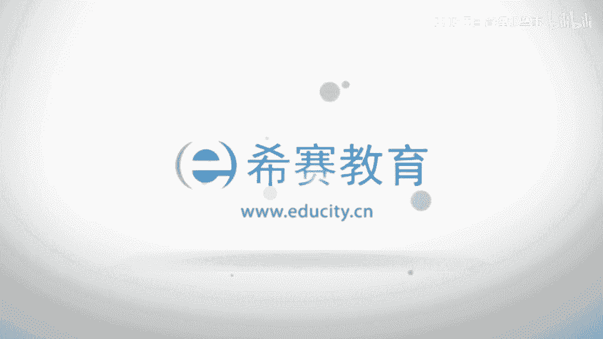

# 【2023敏捷认证】全新PMP考试ACP敏捷知识点精讲视频教程！ - P3：02 敏捷和敏捷项目管理定义（下） - PMP项目管理那些事 - BV1oP411S7xp

那么我们再来看啊合同的这个谈判啊，其实是什么，其实呢是更加提倡我们客户的合作啊，那么这里面的话就是我们啊有一个点啊，就是呃我们可以想象一下，以前的传统的这个项目管理模式啊。

甲方和乙方团队和客户的关系是什么，所以大家画一个图，ok这是一个桌子，对吧好当然这个画的不是很像啊，ok那么团队在这边，客户在这边，ok他们是什么关系啊，他们是一个对立关系，对不对，为什么对立啊。

因为像团队，他是希望什么，他是希望能够叫少干活，多拿钱，对不对，ok客户呢客户的话是反而就反制了，对不对，那么叫什么少花钱多办事儿，ok所以两者的话在传统的这个项目管理里面呢，它更多的还是关注于什么。

关注于这样一个叫蛋糕的划分，我怎么能够把这个蛋糕切的让你少吃一点，我多吃一点，ok他们都在纠结这个事情啊，那么但是敏捷的话，其实它的一个核心啊，它的核心的话是什么，他希望能够把这个我们讲究什么。

这个啊这个客户拉到这边，既然我们是一个什么，是一个有共同目标的这么一个团队，那么我们为什么不合作呢，为什么要去谈判呢，大家能不能明白的道理，ok所以把客户从谈判桌上的另一边拉过来，因为它有一个共同点。

什么共同点呢，客户和团队其实是他有共同的目标的，那么这个共同目标就是要去实现什么，要去实现，商业价值value对不对，大家觉得对不对啊，k customer value business value。

ok这个value的实现才是这两方的一个什么，它的一个共同点，ok所以我们的这个敏捷的这个原则，其实他重在这个合作的两个字上，他希望客户和团队能够形成伙伴关系啊，这个词用的特别好啊，伙伴关系啊。

英文的话是什么，partnership，ok，判断的是伙伴关系，那么这样一种伙伴关系的话，其实它就是可以形成一种利益共同体，没讲过啊，那么其实这个和护和团队，它可以是利益共同体啊。

它可以叫什么事业共同体啊，最高的话叫命运共同体，命运共同体的话就是生死与共啊，这个答案很难的啊，我们立功能解决化什么啊，我们有钱一起赚，事业共同体呢就是我们奔着一个同样的目标啊。

所以呢其实敏捷它的高明之处就在于，把原来客户和团队之间的这样一个利益共同体，转化为叫事业共同体啊，事业共同体啊，成为这个partnership，成为这种伙伴关系，ok所以这是这个里面的核心啊。

所以呢我们讲啊，就是其实谈判形成的这个合同呢，它往往是什么固化死板啊，固化死板的话，其实它就不能够去适应环境和需求的变化啊，所以呢我们要和这个团队，和这个客户形成伙伴关系。

建立嗯非常珍贵的这样一种信任啊和友谊啊，哈当然友谊的话是这个副产品啊，ok啊，那么同时的话我们的这个让我们的客户啊，还是有一些专注啊，专注于商业决策，专注于上级决策啊，所以这里面的话你会发现呢。

我们的这个客户和团队呢，其实它是各有优势的，也是各有分工的对吧，客户的话实际上是什么，它是对我们的商业决策啊，对我们的这个客户价值的定义，它是非常的这个在行的啊，所以的话其实呢啊。

就让客户去专注于他的商业角色部分，而我们的团队他在什么方面专长呢，是在交付价值方面啊，所以呢让课让我们的团队能够去交付价值啊，ok所以你会看到客户去定义价值啊，我们的团队去交付价值。

我们的其他的一些相关方啊，定义什么定义限制条件啊，定限制条件啊，所谓的这些限制条件的话，后面我们会讲包括成本，包括进度，对不对，唉这些相应的部分啊，成本啊，比如说像成本啊，进度，来这相关的部分啊。

那么这些的话为什么由相关方来定义啊，你比如说我们想象一下，比如说是一个投资人，对不对，投资人的话，那么他呢往往这种投资的话并不是根据啊，这个我们的这个产品一次性投资的，对不对。

往往是什么根据我们的项目的里程碑的节点啊，去进行投资的啊，所以的话你会看到这个我们的一些相关方，它对我们的成本和进度呢，是有一些制约因素的啊，所以其实这样一个客户合作的这样一种态势。

不仅仅是梳理了我们开发团队和客户团队，一种合合作伙伴关系啊，更加使得我们每一个啊每一个的这样一种角色，专注于他们所擅长的事情，客户专注于商业角色，团队专注于交付价值。

而相关方专注于去进行限制条件的定义啊，制约因素的定义，然后最后一个啊响应变化高于遵循计划啊，那么我们讲其实在这个事业当中啊，唯一不变的就是变化啊，啊实际上就是说客户和这个组织啊。

对项目的状态呢如果有共同的理解啊，很容易啊就能够去容易啊，去什么去迎接这种变化啊，所以这里面的话，这个共通的理解呢是一个非常重要的啊，那么想象一下，如果我们的客户和我们的团队。

对我们的这样一个目标和状态啊，理解不一致啊，他会花很多的一些成本啊去达成一致啊，那么这样的话他就不容易，什么不容易去拥抱变化啊，那么所以呢我们的这个拥抱变化的这样，一种灵活性啊，我之前我们讲过啊。

这个我们这样一种灵活性的话，是源于组织的一种敏捷度啊，而组织的一种敏捷度的话，其实很重要的一个因素是在于，组织和我们的客户啊，能够对我们的状态和目标，有共同的一个意志理解啊，那么还有呢就是探索性项目啊。

探索性项目的话是指哪些呢，就是我们所说的啊，就是说啊敏捷式的项目对不对啊，它是强调展望啊，并基于展望进行探索啊，而不是说严格的执行，对不对啊，因为我们的这个探索性项目啊，它的一个特点是什么。

它的特点的话是能够根据啊，我们的啊这个这个一些环境变化去适应它啊，而我们的环境变化的话是一种多变的，它不可能严格的按照我们的计划啊去进行啊，这个这个这个这个去去啊进展啊，这个的话是一个非常理想的状态啊。

这在我们的这个多变的情况之下呢，是很难达到的，对不对啊，那么所以的话是要去强调啊一种展望，这个展望的话我们讲过啊，它是什么，它是vision，这个微信的话，就像我们之前举的例子啊，它像一个灯塔一样。

对不对，像一个灯塔一样啊，那么基于灯塔的这个方向去进行什么探索，所以展望mission就是我们所讲的这个方向，我们的大方向可以确定，但是我们绝对不能去定这个详细的计划，因为我们定不了，对不对。

因为相应计划的话是，有时候是和我们的实际情况是差别非常之大的，而且这变化非常之快的，对不对啊，所以呢我们不可能严格地按照详细的计划，去执行任务啊，ok还有呢我们看到低成本的迭代。

它实际上是可以使得开发呢更加具有适应性啊，我们的这个计划架构和设计啊，那么可以和这个实际产品的不断的去演进，那么我们知道啊，就是这个为什么啊，这种迭代它可以使得我们的风险减小啊，那么因为这种迭代的话。

可以产生一个什么这种产品原型，而这个产品原型又恰恰能够什么能够去啊，使得我们的这个客户反馈啊，第一时间得到啊，拿到这个客户反馈之后的话，从而去降低这个风险，去不断去适应这样一种需求和环境的变化啊。

所以这里面的话其实呢啊这种迭代的话，它是能够是有更好的这样一种适应性啊，从而的话使得我们的这个产品呢，可以不断的去和我们的实际情况啊去相符啊，那么使得我们的产品的话不断的去什么眼睛呢，更加成熟。

那么所以这里面的话它的核心呢，我们的这个产品，我们的项目不应该严格的按照计划啊，因为严格按照计划的话，往往会脱离现实啊，尤其在一些这种探索性的项目当中，对不对，那么我们的方法的话是什么。

要基于vision，基于大的方向啊，然后呢不断去进行探索，同时为了提升这个敏敏捷度啊，我们呢是需要对这个我们的项目状态啊，组织和客户啊要有共同的理解啊，那么共同理解的方法的话。

其实什么就是我们之前说的要保证啊，或者说保持我们项目的一种可视化啊，那么这种可视化的话，相似可以使得我们的这样一个目标或者状态啊，实时的能够反馈到我们的相关方啊，这个这个这个他们的这样一个啊。

呃能够视野里面啊，然后的话我们才能够去确保我们的一个，共同利险啊，ok那么我们再来看一下啊，就是敏捷项目管理啊，我们刚才是探讨了这个敏捷宣言啊，其实这里面的话有一些核心的概念啊。

那么把握住这个核心概念的话，是有利于去掌握这个核心的价值观的啊，那么第一的话是什么，项目前期呢更少的计划，其实在敏捷里面的话，并不是说不重视计划，而是他是要强调前期更小的计划啊，那么其实从总体来讲啊。

敏捷的计划其实一点不少啊，一点不少啊，为什么敏捷的话强调项目前期更少的计划呢，因为在前期如果你有太多繁重的计划的话，那么势必啊，那么在后期我们的这个项目情况发生变化，我们的计划反而会成为一种负担。

所以在前期啊敏捷的话是提倡啊，最好是什么刚好够的计划啊，后面呢后面会讲到为什么叫刚好够啊，当然你不能太少啊，太少的计划的话，其实它不足以啊，这个产生这样一个指导作用啊，但是也不能太多。

因为太多的话会成为负担啊，那么第二个高技能的团队成员，那么敏捷，其实对于团队成员呢反而是什么要求比较高的，那么就像这个特种兵一样，那么特种兵的话，我们想想看那个电视里面所演的这种特种兵啊。

他的一个特点呢是非常的精干，每个人的话都身怀绝技，同时的话题是什么，都有多样的技能，所以一旦比如说一个一个占有，或者说一个啊队友的话，是嗯这个这个不在岗位上，然后然后的话我们可以什么迅速去补位啊。

迅速去替代他啊，所以的话其实这个团队成员呢在敏捷里面的话，是需要一种高技能的啊，而且呢刚才我们讲过的啊，要具备这样一种协作精神，协作对不对，所以这样一种高技能的，具有协作精神的团队成员。

其实他的要求还是比较高的啊，那么第三个客户和团队之间呢，必须能够紧密地交互啊，隐秘交互，为什么呢，因为团队需要这个及时的去获取到客户的反馈，唯有这样才能够什么，才能够去紧盯着客户的需求的变化。

那么所以这是啊这样一种交互性啊，那么还有一个的话是叫什么延迟的决策啊，延迟的决策啊，延迟决策的话，其实它什么意思呢，就是我越晚的去决策的话啊，我可能就保留着这种角色的权利啊，我们举个例子啊。

这个啊有不少男生的话是说呢，哎我到了重庆和成都啊，发现结婚有点早了对吧，这样已经晚了啊，啊那么这个老婆都已经找好了啊，ok那么其实这个话是一个笑话，是一个几个举个例子而已啊。

那么其实从这个项目和团队角度来讲呢，你越早的角色，你后面的话这种决策的选项就没了，对不对，因为已经做决定了啊，那么敏捷的话，其实呢他并不是特别的看重什么执行力啊，我们之前的话就讲过这个问题。

他是为了更好的创新啊，因为在创新的这个点上的话，大家其实没有说特别的关注时间这个概念啊，或者说没有特别的关注这个创新的时间，这个概念啊，那么肥美的话，其实呢它是要求更好的一种或者更合理的决策。

所以其实要保持一定的这个角色的延迟度嗯，但你不能太晚对吧啊，你说我这个什么1年或者2年都不绝色对吧，这个的话你项目没法做了对吧，所以他就保持一定的这个和这个这个叫什么啊，合理的延迟度啊。

来保持我们创新和执行力的这样一种平衡哦，那么叫这个的话叫延迟的角色，那么还有的话是什么叫集成化的啊，集成化的这个质量活动啊，那么这个集成化的质量活动的话，实际上是什么呢，它是标明了啊。

我们的这个质量活动的话，一定不是一个单一的一个点啊，那么它一定是要从整体来看的啊，你比如说我们之前举的例子对吧，你的产品质量的话绝对不是仅是开花的事情，也绝对不是测试的事情。

也绝对不是这个叫系统集成的事情，而是整个团队都是有这样一个责任的啊，我们必须要去综合起来看，所以你会看到这个在尤其像sp里面对吧，他非常强调什么叫集成测试对吧，这个的话做过这个敏捷。

也做过xp的这个这个朋友的话，你一定不会陌生这个词，对不对啊，叫integration testing，k集成测试，集成测试的话，其实就是把什么，把整个的这个项目或者产品的话进行啊，一体化的啊。

整个的整合整合型的这种测试，目的就是为了发现这种系统错误啊，所以这种集成化的质量活动的话，其实它是非常能够去检测一些，整体性的错误的啊，那么这样的话可以去避免局部啊。

因为局部而忽略整体的啊这样一种概念啊，那么那么同时的话，这个迭代和增量的交互方式啊，那么迭代和增长方式的话，其实大家是不断的使得我们的这个啊产品啊，ok好，那么这样的话这个同时的话也是获取什么。

获取这个客户的这样一个反馈啊，那么所以的话它的产品会越来越好啊，那么还有呢就是叫适应市的领导方式啊，盛世的领导方式啊，什么叫since的引导方式呢，其实说白了啊，就是到什么情形之下。

我们采用怎样的一个领导风格啊，这个的话其实是很难的啊，呃我们刚才的话是讲到了一个叫不认识领导啊，结果相信大家还有这个概念对吧，普通市领导的话，其实他就是说什么，我们作为领导不能够去什么高高在上啊。

要根据什么，根据这个团队的情形为他们去服务，扫除他们的障碍，那么适应性领导呢更高一层啊，为什么要公告一层呢，就是我必须要根据团队的情形，去调整我的领导风格啊，你比如说啊。

这个它通常是把这个团队分为四个状态啊，这个四个四个不同阶段吧，啊第一个阶段呢是什么呢，呃设想一下啊，我们这个团队的话更多的是一些新人啊，那么这些新人呢他可能是啊一张白纸，对不对。

那么在这样一种情况之下呢，他特别需要的一种领导风格呢就是什么，ok其实就是一种叫指导啊，因为它是一张白纸啊，所以呢需要一种指导啊，那么这样一种指导的话是什么呢，它就需要啊和我们的这个呃这个当前的啊。

这样一种这个团队的风格去相适应啊，你告诉他怎么去做啊，然后哪些能做，哪些不能做，ok是一种指导的方式，那么第二种啊，第二种的话什么这个到了团队同学再发展，发展完了之后呢，就会发现他的团队的技能。

这个技人员的技能的话还没有发展的很成熟啊，但是呢他的练度很强啊，因为这个的话也符合人的这样一种新鲜度嘛，对不对，哎我喜欢做事啊，那么在这个阶段呢，我们应该采取领导的风格，就是什么，就是一种哎辅导啊。

我呢嗯既然你的技能不强，对不对，我可以辅导你，但是我不要指导你，因为指导的话已经这个不合适了啊，他已经具备了一定的这个这种这种技能了啊，他利用性很强，所以我们不不需要去担心意愿。

只需要去什么去增强他的能力就可以了，到了第三个阶段啊，这些人呢慢慢的成为什么技术的能手了啊，我们再也不需要去为他的技能去发愁了，但是你会发现他另外一个这个方面，发生了一些微妙的变化啊。

就是什么就是这个意愿度方面啊，这一个这些人的话慢慢的成为老油条了对吧，或者说江湖的老麻雀了啊哈哈啊，那么这些人的话，什么我们就要去进行一定的叫督促啊，因为这人你派给他一个活儿啊，你不用担心，对不对啊。

那么他一般来讲没问题，对不对，能给你干好啊，但是呢医院都的话需要去什么进行加强，所以要求监督啊，要去督促啊，所以在这个阶段呢，其实他的领导风格呢要去转变为叫督促啊，那么第四个阶段啊。

第四个阶段呢就是这些人的话技能也很强，意愿度也很强，而且呢他知道自己能干什么，也知道自己不能干什么，ok所以在这个阶段呢，我们的啊这个领导风格呢可以再进行转变，叫授权，ok所以你会看到。

就刚才我们讲的这个这个姓氏的领导呢，他其实是经历了一个什么，经历了一个转变，另一个转变，从原来的s1 s2 s3 s4 对吧，哎然后呢不同的上限或者不同的情形之下呢，采用不同的啊这样一种领导方式啊。

从一开始对吧，我们叫什么指导，啊第二的话叫辅导，第三啊叫督促，第四叫授权，你会发现是不是我们的这个领导风格，随着团队的发展的不同阶段，采用不同的领导方式，对不对，ok所以这种的话就是什么。

就是这个叫情境式领导，或者说叫适应式领导方式，根据不同的情况采用不同的领导方式啊，所以这个的话也是一种考一个考点啊，那么分析你看到这个核心概念里面啊，都是啊，蕴含着这个敏捷项目管理里面的。

一些精髓思想啊，我们大家总结一下啊，第一的话前期我们不应该有更多繁重的计划，而是什么，而是更应该用适量的计划啊，那么去迎接后面的不断的变化，那么第二的话，我们的这个技能成员呢一定要是一种高技能的。

同时呢，不要忘了一定要去具备这种协作精神啊，那么同时我们的开发团队，和我们的客户要紧密的交互，为什么要有交互，因为我们需要实时的了解客户对我们的反馈，唯有如此，才能够去使得我们的产品变得更加的什么。

与时俱进对吧，去适应客户需求的变化啊，那么还有呢第四个的话是延迟的角色啊，因为这种延迟角色呢是为了角色的啊，创新角色的更加合理性啊，我们不需要去追求执行力，所以我们需要在创新和执行力方面啊。

去找到一种平衡点啊，那么这个第五个啊，集成化的质量活动，我们需要一种什么，把这个质量活动看成一个整体，而不是要看成一个局部，不能说叫绞痛一痛啊，这个呃头痛一脚对吧哈，这个这个叫啊。

我们不能说这个叫头痛一痛，脚痛医脚，对不对啊，所以呢我们必须要把它看成一个整体，它是一个完整的人，对不对，ok然后呢还有呢就是迭代和酸奶的方式啊，不断去交互，那么这种交互的话。

是和这种我们客户的一种feedback，它的这样一种反馈是紧密地联系在一起的啊，那么还有呢就是姓氏的领导方式啊，那么在这种信息领导方式是要根据啊，我们团队成员的这样一种，它的不同的情况和风格啊。

那么采取我们不同的领导策略啊，所以这个的话其实都是啊，敏捷项目管理里面的一些核心概念啊，那么我们来看一下啊，敏捷的话其实呢它是很多的方法的总称啊，那么这些方法的话其实是什么呢。

在新版的啊敏捷的这个标准里面呢，他认为敏捷和看板都是惊异的时期啊，就是镜子最近你会看到这个图里面画的啊，敏捷包括了像swm是吧，包括像水晶，像sp对吧，像com板，对不对，那么还有呢像看板对吧。

这话都是精益的这样一个4g啊，为什么它是这么一个呃思想呢，因为精益呢它是啊有一些核心的一些概念，包括关注价值，包括小批量，包括刚才我们讲的消除浪费啊，确实浪费啊，所以他们都是这个争议思想里面的。

一些具体事例，ok那下面的话我们来看一下精益和看板，那么经验和看法呢，我们在敏捷的演进的过程当中啊，就是他的一个演进历史的过程当中呢，我们也讲过啊，讲过他的历史背景啊，那么它是源于丰田的，对不对。

那么敏捷和钢板呢，呃在新版的这个标准里面呢，他们认为啊都是这个经济思想的衍生物，所以它有些共性啊，那么这些共性在什么地方呢，刚才我们讲过啊，就交付价值就大，一定是要去紧盯着我们的客户价值，尊重人。

把人啊当成是啊啊这个叫什么，这个能够去激发的一些人啊，我们都知道在这个管理学里面的话，它是有这个叫x人和外人的假设，s人的话就是把什么人看成是一种懒惰的啊，不求上进的。

那那么外人的话实际上是把这个人啊看成什么，看成是一种积极进取的啊，他生来就是勤劳的对吧，那么所以的话我们的这个无论是经济，或者说我们的这个敏捷，他都是基于外人的假设，他都是要充分尊重人的。

而且呢尤其对于一些知识工作者，知识创新者啊，他是更加去尊重这些knowledge worker，对不对，知识工作者啊，那么他认为人的话如果一旦能够被激发出来，是有无限的一些。

或者说非常大的一些这种创新力的减少浪费啊，我们讲过啊，当时在那个历史背景之下减少浪费是日本啊，当时一个共通的一个这种哲学啊，那么还有呢就是透明化，我们通过一些新项目的状态。

或者说一些问题的把它暴露出来啊，使得我们的相关方，使得我们的客户，使得我们的团队对我们的这个项目的状态，问题和进度都有充分的透明化的，一致的理解和认识啊，那么适应变更对吧，适应变更啊。

不断的去适应变化啊，包括持续改进，包括持续改进啊，所以这些的话其实都是敏捷和精益，包括看板里面他的一些共性啊，那么所以的话其实看板呢它是什么，它是最初的话是啊源于这种经营之道的体系啊。

原因经济制造体系啊，那么是专门用在这个知识型的工作当中的啊，相对于之前的啊，那么体力劳动者啊，其实他更多的是用于这种知识性的工作，为什么呢，因为执行工作的话，当时呢认为他的这样一种啊进度。

或者说成果是不容易去衡量的，所以看板的话其实是源于这个初衷的啊，那么用一种可视化的方法把知识型的工作，把它什么呈现化出来，ok因为它是在2000年的中期出现啊，是敏捷的一种替代方法啊，那么看板呢。

其实啊这个应该说和有些敏捷的方法呢，是不太一样的啊，我们知道敏捷的方法的话，其实呢它有很强的一种啊，叫时间性，比如说像squam，像s p对不对，squam的话。

其实呢它都是把这个时间的迭代啊定为一个月，而sp的话是想把这个时间迭代呢，定为一周或者两周，对不对，那么但是看板方法呢，其实并不如这个敏捷方法呢规范啊，它的破坏性也比较小啊，原因是什么呢，它叫原地处罚。

原地处罚啊，那么这种原理出发的方法呢，其实本质来讲呢，它对啊组织进行敏捷转型的要求比较低，所以其实很多的一些做敏捷转型的一些组织啊，他们都在尝试用看板的方法先去尝试，而不是用squam啊。

因为squam啊，或者说像s p一样，它的破坏性比较大，因为什么他对第一他对人员的要求比较高啊，第二的话什么他需要进行充分的放权啊，有些领导的话他就接受不了啊，那我好不容易爬到这个位置的话，你让我放权。

我没感觉了，对不对啊，我自己项目团队的话，其实可以用用看板方法，然后逐渐向其他的敏捷方法去过度发展啊，其实这个的话其实标准里面呢，他也是提到了一个非常好的啊，进行敏捷转型的方法啊。

好的那么接下来的话我们再来看一个啊，这个概念叫敏捷三角形啊，那么这个的话是我们所熟知的一个啊，项目管理三角形的概念，对吧啊，我们都知道啊，那么嗯项目管理的铁三角的话，就是包括像范围实践成本对吗。

那么但是对于敏捷来讲的话，其实呢它的三角形在发生变化，那么这种变化的话是什么呢，从原来的范围时间成本转化成另外的三条边，那分别是value，我们的价值，还有quality，以及我们的质因素。

那么这个value就是价值，那你会说是什么价值，那么实际上是客户价值或者说是用户价值，所以我们的这个敏捷，它最重要的就是以客户价值为导向，那么同时呢我们的这个质量也是非常重要的，我们讲过啊。

我们的这个价值快的交付，绝对不能够去以牺牲质量为前提，所以呢在敏捷里面的话，它是非常重视产品质量的啊，那么我们之前也讲过，他有很多的一些指标和参数啊，也是要去经盯着或者说紧啊。

这个紧密的去跟踪我们的产品质量啊，包括比如说像漏网缺陷啊，包括像一些这种啊，这个相关的产品的一些参数啊，去关注我们的质量，包括我们的这个什么，包括我们过程的一些质量啊。

那么还有一个的话是我们的这个conscious啊，就是那个职业因素，这些基因素的话，他认为呢反而是以前的那个叫铁三角里面的内，容会成为职业因素啊，包括成本，包括时间，包括范围啊。

这些的话会成为在敏捷里面的制约因素啊，那么我们再来看一下这个一个一个三角啊，那么刚才的话其实是我们明确了我们的敏捷，它的最重要的这个三要素啊，三角形的三要素是什么呢，意识价值质量啊。

和我们的constants啊，就是这个职业因素啊，那么我们看一下啊，其实对于这个敏捷来讲呢，它其实是一种倒三角啊，是一种倒三角，为什么是一种倒三角啊，啊我们讲这个plan driven。

就是预测型或者说计划型的啊，或者说瀑布式的模式的话，他的更多的是把这个范围当成一个固定量啊，当成一个相对固定量，为什么这么讲啊，我们想想看啊，啊我们在做文学偏僻的时候啊，是不是当时的话都是把这个什么。

都是把我们的这个范围，先作为一个相对确定一个量，对不对啊，因为我们是根据我们的项目标，和我们的可交付成果啊，进行我们的什么，进行我们的工作w b s啊，工作范围分解的这样一个基础。

那么一旦w bs啊这个确定之后啊，我们的这个后面啊，这个成本和进度才有可能什么进行预估啊，那么所以啊在我们的瀑布式模式当中，它的范围是最先被确定的啊，只有范围得到了确定啊，我们的项目基准的确立。

才有可能大家想想是不是讲o，所以其实在我们的这个什么，在我们的这个瀑布式模式当中啊，范围是一个固定量，而我们的这个schedule和我们的cost，我们的进度和我们的成本，是一个相对的可变量啊。

但是呢到了敏捷，你会发现这个三角形倒过来了，为什么倒过来呢，我们的schedule，我们的进度和成本反而是什么，成为一个和这个固定量啊，相对固定量啊，为什么，明达举例子啊，就像刚才我们所讲的啊。

比如说一个投资人啊，那么这个投资人的话，他绝对不是说一次性的把这个钱给我们啊，比如说给我们2000万，或者说两个亿，对不对啊，那么他一定不是说把这个啊钱啊，一次性的给我们，对不对。

这样其实很除非这个这个这个投资人的话，脑子残掉了，对不对，哈哈开玩笑啊，ok所以它一定是一个什么，一定是一个按照里程碑式的啊，比如说我们的产品原型出来之后，我们的产品，然后go through对吧。

所通一遍啊，那么所以他一定是按照某一个里程碑啊，去给我们的这个啊这个这个项目进行注册的，所以你会发现cost呢就是一个什么，就是一个这种啊这个相对的固定量，那么比如说schedule。

我们再举个例子对吧，我们都把刚才的话一直在强调这个上市时间啊，上市时间呢其实在一些场景之下呢，是非常的重要的啊，那么所以呢啊比如说10月1号，我们的产品或者我们的项目的话必须上线啊。

所以呢这个schedule的话，就是一个非常典型的一个什么是一个不变量啊，所以我们的这个敏捷的项目的话，是以什么，是以范围的变化而去适应我们的需求啊，和环境的变化啊，所以在中间的话是什么是一个价值。

或者说是一个愿景的这么一个驱动啊，它是以愿景和价值为核心的，其实最终的话其实还是以价值为核心对吧，以我们的客户价值和用户价值为核心啊，所以你会发现，从这样一个倒三角的一个结构当中啊，我们就可以理解敏捷。

实际上那它是什么，它是从原来pp的模式啊，以范围为驱动而变为，以成本或我们的这个什么啊，这样一个时间为驱动啊，所以大家这里面的话，本质的一个含义就是，因为我们的敏捷的项目要跟着需求不断变化。

而这个变化的这样一个因素就是我们的范围，我们的范围是根据需求来进行变化的，对不对啊，ok那么这是个敏捷三角形，那么我们再来看一下敏捷的这样，一个基础的这个结构啊，那么这是一个通常的一个敏捷的一个项目啊。

尤其像这个一些我们所说的storm也好，或者说sp也好对吧，它的一个通常的啊一个敏捷的一个结构，那么这个敏捷结构的话，是可以帮助我们更加深的理解敏捷啊，那么你会发现啊，我们的这个啊一个敏捷项目。

它通常的话是有两个联邦组成啊，那么这两个列表的话我们称之为叫代办事项啊，这段话是在新版的敏捷标准里面，它是这么翻译的啊，那么一个代办事项呢啊是叫产品代码事项，第二的话叫迭代代码事项啊。

那么产品的代办事项呢，顾名思义啊，这里面的话全是一些产品的功能啊，或者产品的一些这种特性啊，通常呢它是以用户故事啊，为一个一个的一个这个载体划分的啊，那么这个产品的蛋白，实际上它具备怎样的一些特点呢。

第一个啊他一定是什么，一定是啊优先级排序的，所谓的烟机排序呢，就是我们认为价值最高的啊，价值最高的一些产品功能排在最上面啊，那么什么叫差价值最高呢，一定是什么对客户的假面对高啊。

对客户价值最高的一些功能的话，排在最上面啊，那么同时啊还有一个特点，就是这个产品的代办事项呢，它是不断的进行更新的啊，不断进行更新的啊，那么这个更新的这个，它的这样一个特点呢是什么呢。

啊可能会有这个这个这个增加可能会有删除啊，也可能会有什么调整啊，比如说这个烟机的排序的调整啊，文物举个例子啊，你比如说新加进来一个我们的这个功能，那么这个功能的话大家想想看啊，因为它是一个烟机排序的。

它一定会导致我们重新的优先级的一种变化，对不对啊，所以这里面的话就有可能会出现一些问题啊，什么问题呢，比如说我新加进来的这个啊，这个这个一个一个啊功能，对不对，比如说我们新加一个功能啊。

一个user story，ok那么这个user story的话，其实呢可能会是什么，会使下面的这些优先级往下是吧，往下沉啊，他可能就直接加在中间里面了啊，ok那么分析的话。

它会影响到整个的营养剂的排序啊，那么还有一个特点是什么呢，这个产品的代办事项并不一定要全部实现，这一点的话，其实呢它和我们所讲的w b s啊，是非常的不一样的，我们知道w b s的话。

一旦这个进行的工作分解结构对吧，然后呢获得的这个工作和任务的话，是必须都要去做的啊，要不然的话他不会加入到w bs当中，对不对，ok但是对于产品代码事项，它不具备这样一个逻辑啊。

很有可能什么很有可能我这部分啊，比如我打个比方啊，这部分的这个产品功能我就不做，那么它到底是以怎样的一个特点，或者说怎样的一个逻辑去判断呢，它可能会在这里面的话，去加一个这个最低的r i，啊最低的2万。

我客户最低能够接受的一个投入产出，比如果低于这个r y之下，我可能就什么就不去做相应的一些，功能或产品了，我仅做这个r o r以上的图纸产出，比以上的这个功能和产品啊对吧。

大家听明白这个这个这个这个道理，这个原理啊，所以其实你很微妙啊，就是如果我们加一个新的一个呃需求的话啊，你会发现它有可能会使得我们有些功能啊，直接被压到这个什么最低的i o i的下面啊。

会会导致有些功能他不做o，那么这是产品代办事项，那么还有的话就是叫迭代代办事项，迭代代办事项呢顾名思义啊，它是在一个迭代当中啊，不要去执行的一些这种任务，那么这个迭代代办事项呢永远是什么。

永远是去做我们产品代办事项里面，优先级最高的啊，那些user story啊，就是产品功能啊，那么一个这个代办事项呢，通常来讲啊，它有固定的周期，它有固定周期啊，大家听明白固定周期啊，所谓的固定周期的话。

它是什么，这个周期它是不能过去变的啊，你比如说一些一开始的话，我们定位一个月，ok那就一个月，我们一开始定一个钟，ok那就一个钟啊，轻易不要去变化，因为一旦去变化。

我们后面会讲他会去打乱我们的叫开发节奏啊，这个开发节奏可能会打乱啊，ok那么然后的话我们这个迭代的话，它会进入到这个循环当中啊，这个循环的话其实就是一个非常典型的什么，pd c循环，pdc循环啊。

pcc的话就大家都不陌生，对不对，就是大家所熟知的这个叫戴明环啊，那么你会看到这个循环当中的话，就会什么就会有这个计划，然后呢执行，然后评估改进啊，ok那么还有一个的话是什么。

它在每天都会有一个叫每日的每日的迭代，这个每日迭代的话，每日账户的方式去执行这个迭代的啊，其实它是一个非常小的啊，时间非常短的一种仪式啊，也是实现了每天的这样一个快速的循环迭代啊。

那么所以它的每次迭代的话，都是为了产生一个新的增量的产品，这个分量产品大家请注意一定是什么，一定是可用的，可用的产品的话，我们讲过的概念，大家还记得敏捷宣言里面啊，第二句话叫什么叫可用的或者是可工作的。

对不对，可工作的产品啊，实际上是高于详尽的文档的，所以可工作的产品或者软件啊，它是衡量项目进度的首要的目标啊，首要的一个一个指标啊，所以他一定是这个产品，哪怕就是一个小的产品啊。

它一定要对我们的产对我们的什么，对我们的客户产生价值，对不对啊，后面我们会讲到啊，有一些概念叫什么叫mvp，叫mm f对吧，m v p的话叫什么最小可行产品，m mf的话，什么叫最小可售功能。

那么这些的话其实都是什么，都是叫增量产品包啊，他们都是对我们的这个客户产生价值的，所以你会看到我们总结一下啊，就是这个框架啊，这是一个非常典型的敏捷的框架啊，那么这个框架的话。

这是首先呢是由两个列表组成，一个的话叫产品待办事项，第二的话叫迭代代码事项，对不对，产品代办事项呢它有几个特点，第一的话它一定是预计排序的，第二的话什么，它一定是这个叫不断的进行梳理的啊。

我们称之为叫涌现式的啊，这个的话大家以后会学到这一点，叫涌现式的，涌现式的话，就意味着我们的这个产品，它是不断的去什么进行更新的啊，包括预算机的排序，包括删减，对吧啊，那么还有的话。

就是我们的这个产品的代办事项呢，它未必就是全做的啊，因为他是要去根据啊，我们的客户的这个什么价值的投入，产出比来进行衡量，他这一点的话是特别特别不像wb，那么所以其实核心的话还是以价值为导向。

那么还有一点的话，什么我们的这个迭代表玩项，永远是聚焦于或者去做我们的这个产品，代办事项里面啊，价值最高的那些点啊，那么这一点的话是优先进入到迭代啊，这个代码事项里面去进行这个循环。

每个循环都是一个pd c的循环啊，包括计划，包括执行啊，包括啊这个我们讲就说什么，不断的去进行评估啊，包括改进，那么其实每天的话，大家都会通过一个每日的展会啊，去进行一个小循环啊，这个小循环的话。

其实也是一个啊进行反馈的过程，后面我们会讲，你会发现每个团队成员都需要去啊，回答三个问题，第一我昨天干了什么，第二我今天计划做什么，第三我遇到什么障碍啊，那么这是这是个非常好的团队仪式感啊。

那么最后的话每个迭代的话，都会产生一个叫增量产品，那么这个增量产品呢，它一定是对客户产生价值的可用的产品啊，那么我们后面会讲到，像一些mm f或者说最小可行产品，非要可视功能。

其实都是一些叫可用产品增长产品包的啊，一些实例啊，然后呢我们再来看一下啊，就是瀑布式模式和敏捷式模式啊，啊他的一些这种异同点啊，我们通过一些啊几个方面的对比啊，来和大家一起探讨一下啊。

那么首先呢那我们看一下在目标方面，其实瀑布式模式和啊这个敏捷模式啊，敏捷模式呢它是有很大的不同啊，你比如说像这个瀑布模式的，你会发现啊它的一个特点是什么呢，啊那么团队啊形成我们的一些啊这种资源对吧。

然后呢啊按照我们既定的步骤和任务，达成我们的一个什么相对比较静态的目标啊，所以你会看到瀑布的模式的话，它一定是强调这个目标不能够老是变好，你老是变的话，其实我们的这个啊这种工作流啊。

或者说我们的这个工作步骤啊，他就可能就会失效对吧，那么我们再来看一下啊，我们的敏捷式模式的话，其实他的目标呢其实是非常非常不一样的啊，就像一个人啊，这个人的话他是一个跑动的啊，然后呢这个人的话。

我们就是把它作为一个目标啊，那么这个目标的话，其实它什么它的一个特征的话，和我们刚才讲的这样一个瀑布式的模式的目标，静态式的目标的话是非常不一样啊，我们就要去适应这样一种动态化的目标。

ok所以这是啊两者的一个非常大的差异，就在目标方面的话，一个是我们称之为叫这种静态目标，或者说静态需求，另外一种的话是一种动态目标，动态需求啊，那么在团队方面的话也是不一样啊，在团队方面呢。

我们知道pp的模式的话，其实更加像一个有指挥的乐队，那么这个指挥的话，就是我们所知的叫项目经理啊，项目经理的话，其实他是充当了一个这种叫分配任务对吧，你比如说这个人在什么时间要拉一下，这个小提琴对吧。

然后这个人的话在这个时间啊要去打打鼓对吧，ok所以它是起到一个分配任务和把控节奏的啊，这样一个作用，但是啊对于我们的这个敏捷式的模式，你会发现呢它更加像一个什么，更加像一个没有指挥或者没有领导的。

这样一个乐队，每个人都是一个技术能手，都是一个专家啊，那么都是一个高技能的一个团体成员，那么他会根据他的判断去什么去听啊，去听这个团队的节奏，然后他来判断自己应该演奏什么东西。

ok所以其实是一个非常不一样的啊，那么我们再来看在环境方面，环境方面的话，其实呢我们瀑布式模式的话啊，它的环境是要比较稳定的啊，不能够有太多的一些变化啊，那么就像这样对吧，风平浪静啊。

那么其实真实的场景之下的话，我们会发现啊，这是敏捷式的环境对吧，他是惊涛拍案啊，那么所以一个是相对比较动荡，一个是比较相对稳定的这样一个环境啊，所以你会看到啊啊不同的啊这个模式啊。

就像刚才我们讲push模式和敏捷式的模式呢，它在目标团队环境三个方面的话，其实有很大的一些不一样啊，那么pop模式啊，其实它是比较适用于较稳定环境的啊，这样一些项目啊。

你比如说那么这个的话是啊我的一位朋友啊，他是这个曾经负责过嫦娥3号的这个项目啊，那么长3号我们知道他们发射天空之后呢，那他是每年的话都要去进行维修的，那么这个维修的话其实呢啊虽然说非常复杂啊。

但是呢在他看来，其实就是一个把去年的一些这种需求，和一些这种年度计划啊拷贝，然后呢修改相应的一些参数，然后呢就会成为今年的啊，这个这个这个啊工作计划啊，所以你会发现，像嫦娥3号的这样一种维修项目啊。

它虽然比较复杂啊，就是从这个工作的本身来讲的话是比较复杂的，但是它其实这种环境啊，包括需求啊是比较明确和稳定的，所以像这种类型的项目的话，就特别适合于用瀑布式的模式，ok所以由此可见的话，我们会发现啊。

敏捷和传统的pop模式的话，它在有些方面呢有很大的一些不一样啊，我们一起来看一下，因为我们看一下啊，就是在传统的这个项目管理活动当中啊，启动过程啊啊他主要是来制定这个项目章程。

那么这个项目章程呢在瀑布模式当中呢，是非常重要的一个点啊，它是规定了我们啊项目的主要的一些参数，比如说y对吧，为什么要做这个项目，我我们到底要做什么对吧，who谁来做对吧，ok when对吧。

脚底程碑啊，ok然后呢包括一些主要的风险对吧，假设啊包括一些基本因素，对不对，ok所以你会发现项目章程呢，在瀑布式的模式当中的话，它是这些参数啊，都是相对比较确定的，而在敏捷的这个活动当中啊。

你会发现啊，他首先是要去制定愿景的，因为相当于制定一个方向对吗，然后呢再把我们的这个基于愿景，再去制定我们的一些主要的目的啊，里程碑包括我们的章程，所以其实他定愿景这样一个动作的话，是非常关键的。

而不是说要去直接上来去什么去制定项目章程，原因就在于有一些相关的一些参数，在敏捷式的模式当中啊，在探索类的项目当中，它是不能够确定的啊，那我们再来看计划啊，计划的话在传统的push模式当中呢。

他是前期非常详尽的计划，那么他需要把这个范围和需求，进行明确的定义对吧，然后呢进行变更控制流程，去控制这个我们的这个什么变更和风险啊，但是对于敏捷式的模式当中呢，你会发现他前期是比较少的计划。

他们的计划呢是持续的，涵盖在我们的这个迭代当中，对不对，ok那么包括我们的这个角色，也是有些所谓的gland对吧，有些指南的他并没有说一些细则啊，他不能制定细则啊，他只能有一些指导性的方针啊。

那么同时的话对于我们的相关方，他需要进行education进行教育，为什么呢，因为敏捷啊，那么它需要一种土壤，它需要这样一种实施的环境，所以要对相关方啊要去进行教育，使得他们更加去支持理解敏捷啊。

那么同时的话是什么，拥抱变化啊，拥抱变化，而不是要去拒绝变化，对不对，那么在执行的过程当中，你会发现瀑布式的模式，非常严格的去按照计划去执行啊，因为什么，因为他的这个过程相对来讲比较缺点啊。

那么在我们的这个敏捷式的模式当中啊，它更加强调这种小规模的啊迭代增量交付，对不对啊，小规模的迭代增量交付啊，用户和团队必须集成在一起啊，然后项目经理的角色呢，他是什么领导者和协调者，而不是叫监督者。

对不对，团队是四组织的啊，共同承担这个责任，它不是分工的，那么明确，对不对，ok那么包括监控监控的话，你会发现呢啊我们的这个瀑布模式呢，它更多的是通过监控报告啊，这个监督的方式啊。

去进行这个状态的提交的啊，而对于我们的民族的模式啊，它是通过每日占领会议，对不对啊，包括一些像，一些这种这个关键的问题和行动事项啊，来发现我们的问题啊，所以其实你会发现，它是主要的一种沟通啊。

状态计划和我们的问题的这样一种仪式啊，那么收尾阶段呢你会发现啊，他我们的这个瀑布式的模式啊，它是在我们的项目收尾的时候，进行经验教训总结，进行过程的反馈进行回顾，对不对，然后呢对于我们敏捷的模式来讲呢。

它将在每个迭代的时候呢都进行回顾，那么目的呢就是为了在我们下一个阶段当中，不断的去进行优化啊，不断的去进行这个更新啊，所以其实这一点呢是啊，两者的话有比较大的一些差异啊，那么我们做一个结论啊。

那么这两者的话其实在哪一个方面啊，有一些本质的差异呢，传统的项目经理啊，传统的项目管理瀑布是什么模式呢，它是叫计划和构建产品啊，计划和构建产品啊，因为他这个计划的话是相对来讲。

能够比较严格的基于计划进行产品的构建对吧，那么有计划的话它会有偏差，偏差的话，它会什么持续的去进行优化啊，那么他的这个基准的话是要去进行预测，因为他的需求范围相对比较明确，所以他能够去预测，对不对啊。

那么对于敏捷式的项目管理呢，恰恰相反，他要去什么展望和眼镜啊，展望的话就是什么基于一个vision啊，基于一个vision，基于一个方向啊，去不断的去演进啊，改进我们的产品。

ok那么我们的这个方式是什么，不是说按照计划严格执行，而是要不断的去探索，不断去适应，对不对，眼镜和适应啊，所以它的基本基准点还是要去适应，还有适应啊，那么适应环境的变化，顺序的变化啊。

所以你会看到这两者呢，它的一个立足点其实是非常不一样的啊，那么你可能会问这样一个问题，那么我们既然说瀑布式模式也有它的好处啊，敏捷式的模式也有它的好处，那么究竟应应该在怎样的情况之下用瀑布式。

用怎样的情况之下啊，用敏捷是，ok这个呢应该说是一个非常好的问题啊，那么下面的话我们就来看一下啊，啊这是在我们的敏捷当中的话，其实标准里面他也是画了一张图，来说明了这样一个原理啊。

那么这样一个图的话称为叫时代稀土啊，啊这个当然音译的话是有不同的叫法，就是station啊，ok那么它实际上是从两个纬度啊进行，我们啊应用敏捷或者说应用瀑布模式啊，它的一个判断的衡量的。

那么一个韦德的话是什么，就是需求的一致的理解的一致程度啊，那么我们对于叙述的理解啊，那么他有可能是什么，团队认为理解程度这个一致的程度啊，从低到高，对不对啊，这个的话是相对来讲呢。

理解理解的一致程度是比较这个高一点啊，而这个的话是这个理解程度就比较低一点啊，那么还有的话是我们的环境，环境的话是从接近确定到远离确定啊，就是环境变化从啊这个这个这个从低到高，对不对啊。

那么这里面的话实际是它可以分为这么几个啊，这个这个这个区域，一个区域呢被称之为叫理智决策，那么这个理智角色呢，实际上是它的特点呢是什么呢，它的需求的确定性比较小，对不对。

那么第二的话它的环境啊也不太多变，也比较稳定，所以这个区域啊它特别适合于用pop模式对吧，那么这个的话特别适适用于pop模式，ok那么还有一个区域的话是什么呢，就是在这啊。

我们的这个相对来讲需求的确定性呢也是啊，这个这个偏小一点，那么环境呢也会比较偏多变一些，那么这一部分的话是比较适合于用敏捷的啊，这边的话是比较适合用敏捷的啊，还有一部分的话是什么，是这种混乱的局面。

混乱的话是什么，我们的需求啊也是非常不确定，环境也是动荡不安的啊，比如说像战争，就属于这种典型的这样一个一个一个区域啊，那么像这种的话，其实大家想想看，可能适用于两类信息管理方法。

ok其实它什么它不适合用敏捷，更不适合用pb的模式，它适合什么，来进行什么来进行这种引领啊，ok所以其实敏捷的话，它是适合于用这几个在这样一个区域，就是我们的这个需求啊，相对来讲呢。

是不是很确定我们的环境也相对来讲呢，啊这个比较多变一些啊，所以在这个领域的话，我们称之为叫群体决策，啊群体决策，那么这个的话，实际上它是相对于这个理智决策的理智决策呢，我们之前也讲过啊。

为什么叫理智决策，因为他是能够进行专家判断的，他可以用专家的经验去进行，我们的啊这个啊项目的这样一种预测的啊，我们可以知道下一步的话，我们应该用咱的一些方法和流程，而对于我们的敏捷这个区域的话。

其实呢用单一的敏啊，我们的专家的经验的话，其实已经是不能够去达到我们的目的啊，我们只能用群体决策啊，所谓的群体决策的话，就是啊不是单一的一个专家啊，而是我们要用啊。

更多的一些专家或者说更多的一些经验对吧，团队的一些经验啊来进行商讨啊，讨论出这个最佳路径来，而且这种啊这个路径啊也是探索出来的啊，它是一种不断探索，去追求这样一种最佳路径的啊，ok所以这是两者的区别。

那么时代去图呢，其实我们可以再进一步的去这个分析一下啊，那么刚才我们讲啊，就是这里面的，它是根据需求的不确定性和环境的多变性啊，把它分解成了这三个区域啊，那么这三个区的话。

在我们的啊啊这个新版的标准里面的话，其实它是啊把它定义成这个四个连续的区间啊，四个连续的区间啊，那么这四个典型区间的话分别是称为简单的啊，简单的话就是刚才我们讲的就是典型的push模式，对不对。

这种理智决策，那么还有呢是繁杂的啊，繁杂的ok繁杂的话是在这对吧，我们的需求啊，那么它的不确定性啊再增高，环境的动荡性也在增高啊，但是呢还不是说那么的复杂，对不对，然后到这的话就是称为叫复杂的啊。

复杂的话就是什么，我们的这个不确定性又增高了，然后呢啊我们的这个叫啊，环境的多变性又加大了，那么你会看到啊自适应的方法，也就是说敏捷的方法的话是适合于复杂和繁杂，那么到了混乱的局面。

那刚才讲其实就不适合用敏捷了对吧，那么这一部分的话，其实刚才我们讲，其实特别需要一个领袖人物呢来指引方向，好使得先建立什么，先建立秩序，然后呢再用敏捷，或者说再用这个瀑布式的模式来应对。

ok那么所以这里面呢我们再进一步的去啊，分析一下啊，其实我们可以举一些案例啊，举一些案例啊，你比如说这个的话是书上的一个案例啊，啊那么舒畅这个案例的话，是一个叫隧道大开挖的一个项目。

那么这个项目的话其实呢从技术的角度啊，从这个公允的角度呢，其实它并不是简单的啊，我们知道其实啊你开发一个这个隧道的话，他需要这个有很多的一些这个考虑对吧，比如说你要有设备对吧。

你要有去考虑这个啊这个地理地质环境啊，你可能还要这个，有可能还有可能去去涉及到这个周围的居民，对不对，但其实还是蛮复杂的啊，但是呢在书上的这个例子当中呢，他把它定义成呢这个项目啊，其实它是一个简单的。

这个简单的话，实际上是从刚才我们讲的时代系图里面的那个，简单对吧，就是在我们的这个这里面，对不对啊，在我们的这个左下方啊，左下方为什么它是个简单的啊，我们一起来看一下啊，那么我们看一下啊。

就是这个隧道开发项目呢，其实他的需求啊有高度的共识，就是什么从a点到b点把它挖通，对不对，得挖通，ok然后呢项目继续推进的不确定性很低，它不会因为什么，因为环境的变化我就不扒了啊。

然后呢那么在啊我们的这个成果啊，就是这个这个中间啊，就是我们的这个呃交互也是比较少啊，因为你不需要去和什么我们的团队啊，包括我们的用户和客户进行交互，我们的目标就很明确，就是从a点到b点。

什么把它挖出来，把它挖通，对不对，所以虽然说这个项目呢，绝对不是一个简单项目啊，因为它涉及到很多的一些这个专业的知识，包括一些这个一些啊，相关方的一些这种这个这个这个一些考虑，对不对啊。

但是呢从需求和交付这两方面进行评估的话，那么它就是一个简单的项目，那么这样一个简单项目的话，就适合用什么，是适合用瀑布式的预测型的，这样一个生命周期进行管理啊，而不适合用什么。

不适合用这个敏捷式的方式进行管理啊，那么所以我们再来看一个一个，一个案例的对比啊，那么这个案例的话是一个啊在这个我们讲啊，就是啊在我们的这个啊这个这个这里面的话，它被称之为叫复杂性的项目啊。

那么这个复杂性用的项目的话是一个新颖，工具和技术应用的项目的开发啊，你比如说我们啊这个团队的话，正在开发一个史无前例的一个工具对吧，比如说假设啊，我们正在开发一个要去打败微信的啊，这样一个社交工具。

那么这个摄像工具的话，你可能什么每个人都没有什么一些概念和经验，对不对啊，所以他是一个前无古人的，那么像这样一些这个项目的话，其实他的这种不确定性和风险是非常大的，对不对，所以呢他要进行这种小增量啊。

什么叫小动脉呢，我们之前讲过，对不对，就是我们的每一个这种迭代啊，它不能够太大啊，我们去什么迈着小碎步往前尝试啊，并进行评估，那么用短时间的这个时间，和进行低成本的探索啊，探索什么目的话。

是为了降低这个不确定性和风险啊，从而去最大程度的对吧，以最小的投入去实现我们界定的商业价值啊，那么所以这里面的话这个它有一些不确定性，这个不确定性的话它有很多的一些来源啊，那么这我们考考虑一下啊。

这个男人的话有可能是哪些啊，第一的话是什么产品规格不确定性很强啊，就是说我们那些构件的产品啊，它是否正确，什么叫产品正确，什么叫产品证据啊，此外为在产品中用的话一定是什么啊，一定是我们的这个产品推出来。

它是能够符合市场的需求的，他是能够去使得我们的客户去满意的，对不对啊，那么这里面的话其实就有一个问题了，你怎么知道它能够符合市场需求，你怎么知道他能够去让我们的客户满意对吧，但如果学过新产品开发的话。

你会发现它其实在中间的话，它有系列的个什么去进行测试的过程，包括前期的概念测试对吧，包括后面的圆形测试啊，包括后面的产品使用测试，包括市场测试，一步步的环节去降低什么，降低这样一种不确定性，对不对。

所以这里面本质啊，本质一点的话，还是要去降低这样一种不确定性啊，o k那么还有一种不确定性呢是什么呢，我们的这个生产的过程啊，生产的这个能力啊存在一定很大的不确定性啊。

那么产品那么是否可以采用这种方法去构建啊，我们这方法是否正确啊，对不对，我们要去探索啊，那么啊是不是用外包的方式就很正确啊，那么是不是这个我们自己研发就正确啊，啊那么还有这个产品组件的话。

是不是用这种这样一种方法构架构就可以啊，对不对，这的话其实都是需要什么都需要进行探索的啊，都需要运用一些敏捷里面的，比如说像探测的一些技术啊，去不断去尝试的啊，所以这里面的话这个方法呢。

也存在这样一种不确定啊，还有的话就是过程的不确定啊，过程的这样一种适应性啊，那么是不是啊团队的一种有效的方式啊，你比如说我们在团队的这个，产品的构建过程当中啊，我们的团队应该怎么组织。

我们是应该用那种创业型的团队呢，还是应该用那种强矩阵的团队呢，还是应该用弱矩阵的团队呢，还是应该应该用职能性的团队呢，我们是不是应该去找寻这样一种，最佳的团队组织形式，对不对。

ok那么团队和团队之间的人员的配给啊，团队和团队之间的一种分工啊，那么这些啊团队的工作方式的话，那么是不是也需要去进行尝试确定，因为这些的话可能都没有这个，这个一些先例可循，对不对。

所以他的这种不确定性啊，体现在这几个方面啊，第一段话是结果本身是不是确定，第二的话是工作方法是不是确定，第三的话是团队的这样一种组织形式，是不确定啊，所以你看到这样一个这个案例啊。

我们讲新颖的工具和技术的这个项目的应用，项目的一种开发，虽然他的这个什么一些工艺啊，或者说他的资金量啊，远不如刚才我们讲的隧道开挖项目的这么的浮，这个这个叫什么那么大啊，但是这样一种项目。

在敏捷看来就是一种复杂的项目，这样一种复杂项目是哪哪地方复杂呢，是因为它的不确定性非常高啊，它的创新的不确定性非常高啊，所以呢我们就要用敏捷的方式啊，用小增量评估的方式啊。

用这种短时间内进行低成本探索的方式，去降低这种不确定性好，因为我们把这部分就是敏捷和敏捷项目管理，定义这部分呢做一个总结啊，那么这里面的话其实你会发现啊，他提出了几个非常核心的一些概念啊。

第一段话是什么，敏捷的宣言，敏捷宣言呢一定是一个非常啊，非常高的一个敏捷的心法啊，那么敏捷心法里面的话，你会发现呢它是有四句话啊，我现在大家的话已经把它记下来了，对不对，他非常非常重要的，对不对啊。

我们一起来回顾一下啊，第一个话是什么个体和互动，而不是过程和工具啊，那么第二个的话是什么，ok可工作的软件，而不是详尽的文档，第三是客户合作，而不是啊合同谈判，第四的话是什么，ok好响应变化。

而不是要去遵循计划啊，所以其实你会看到这四句话的话，是敏捷里面的核心价值观，那么同时的话我们也是谈到了啊，敏捷呢，它里面啊就是一些啊主要的一些这种框架对吧，包括敏捷三角形啊。

敏捷的主要的这个什么一个实时框架啊，我们还记得这个什么产品待办事项，迭代代办事项，对不对啊，包括这个什么啊，这个不断的一个增量去产生，我们的一个什么增量的一些产品，所以这些的话其实呢都是敏捷里面呢。

它的一些关键的一些概念和定义啊，所以请大家一定要去掌握好啊，那包括刚才我们讲的这个时代稀土啊，时代稀土的话其实它是很好的来啊，说明了在哪些场景之下，我们应该用瀑布模式，而在哪些场景之下啊。

应该用这种敏捷式的模式啊对吧，其实他也是讲的非常好啊，那么在这里的话，其实呢我还想多说两句啊，其实时代稀土呢，它里面的话还是呃，应该说蕴含了一个非常深刻的一个原理啊，这个原理的话是什么呢。

就是我们的管理啊，其实从某种程度来讲呢，它并不是非黑即白的啊，他有时候的话是需要去找寻一种叫灰色地带啊，分析时代系统的话，其实给我们啊所讲的这个这个本质的一个思想，就是要让我们理解这样一种灰色地带啊。

什么意思呢，你比如说我们在那个小说是吧，考试啊，我们通常都习惯于啊去进行对和错的这个答案，那么或者说a b c d的答案啊，其实这里面的话最重要一点的话是什么，是要去进行一个植株那么平衡啊。

管理的话其实并不是一门科学，而是一门艺术啊，所以的话你会发现我们在选用到底是push模式呢，还是说米粒是模式呢，还是说其中的话要进行一个折中呢，他一定是根据管理的情况对吧来进行选择的啊。

那么pub式模式对吧，它是一个极端敏捷模式，模式又是一个阶段，那么很有可能我们不是选两个阶段，而是选两个阶段当中的一个点，那么这个点的话有可能是什么，有可能是30%瀑布，70%敏捷。

也有可能是80%瀑布，20%敏捷，对不对，所以的话其实你会发现，我们近2年的话是产生了一个新的学科，叫混合式，民间啊，混合式明显后面我们会讲到这个概念对不对，所以它是一个管理频谱的概念。

所以这个管理频谱呢，就啊使得我们更好的去理解啊，其实在我们的这个啊模式的管理模式的选择，在上面呢，我们有更多的一种灵活的考虑，好灵活的考虑啊，所以时代系统呢教给我们的话，其实是不单单是一种选择的方法。

更啊，如应该说更多的是一种选择的，一种思考的思维的模式啊，所以这点的话。