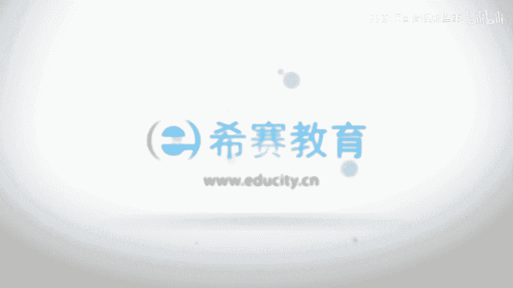

# 【2023敏捷认证】全新PMP考试ACP敏捷知识点精讲视频教程！ - P6：04 生命周期选择 - PMP项目管理那些事 - BV1oP411S7xp

我想。

那下面呢我们一起来看一下生命周期的选择啊，那么这部分的话啊，我们先前也提到过啊，啊其实是什么呢，我们来看一下啊，那么到底呃有哪几种生命周期啊，那么包括生命周期当中呢，我们应该选择怎样的这个模式。

去适应我们的这个项目啊，那么应该说呢不同的生命周期的话，它是呃有不同的特征，也是适合于不同的情形的，那么在新版的这个敏捷标准里面呢，它是说明了四种啊，四种这个相关的这个生命周期啊，那我们一起来看一下啊。

那么第一种，那么第一种的话就是我们啊经常和大家讲的，这个预测型的生命周期啊，也就是说我们应该说是最为熟悉的对吧啊，那么这种生命周期的话是啊，就像之前的讲的偏僻的模式啊，或者说这个瀑布式的模式啊。

那么它是一种比较传统的啊，那么提前呢呃会进行大量的一些，前期的计划性的工作啊，那么同时的话我们的这个执行呢是一次性的啊，左边一次性的话是什么呢，它的特点的话是一种串行的啊，我们知道啊。

通常呢我们的这个啊项目的话啊，比如说以软件开发为例啊，啊他的这个周啊，项目的生命周期啊，啊实际上是他有这个一些阶段的啊，你比如说像啊先去进行需求分析对吧啊，然后呢进行设计啊。

啊那么啊你比如说这个先是需求分析啊，那么再次进行这个什么设计，是不是，ok然后呢开什么k开发，啊测试，ok上线是吧，ok所以你会看到它的这样一种这个啊，生命周期的一种特性啊。

那么这些的话相对来讲的话都是一种串行的啊，那么所以呢叫一次性执行，那么整个在执行的过程的话，也是一个连续的过程啊，所以呢把它称之为叫计划型，或者说瀑布式模式啊，所谓的瀑布式模式的话。

其实呢这些的话就有点像一个瀑布，把它落下来一样对吧，哎所以现在是有这个啊分析啊，再有这个什么还这个我们的设计啊，再有我们的开发在我们的测试，在我们的上线，所以它有点像一个瀑布落下来一样对吧。

那么这样一套这个模式的话，其实呢它是非常形象的，所以呢我们看到啊，就是这个预测型的生命周期啊，他这里面的话有几个关键的特征啊，就是前期大量的计划性工作对吧，那么包括这个是一次性执行。

那么执行的话是一个连续的过程啊，那么这个的话是它的一些关键特征啊，那么我们再来看一下这个迭代型的生命周期啊，那么这种生命周期呢，它的一种这个相应的方法，是允许对我们的未完成的工作进行反馈啊。

同时呢进行改正和什么啊，所以其实迭代型啊，迭代型的生命周期呢啊它的一个特点啊，啊其实是什么呢，啊一个一个的这个时间啊，一个一个的时间和组成啊，那么每一个时间和的话是什么。

就像一个这个这个一个迭代一样对吧，比如说每个每个迭代的话就是一周一周，一周一周，那么这些工作的话是啊一个这种连续的关系，每一个迭代的话其实都是一个这种什么，这个对我们的这个所完成的一些工作啊。

进行反馈啊，那么你会发现，其实每次的话他都会有一个所谓的这个，什么一个工作的原型啊，这是我们的一些啊产品啊，包括一些我们的软件的一些原型啊，那么对于这个原型呢本身啊，进行相关的这个反馈啊。

那么团队的话也是获取到这样一种反馈啊，去对我们的这个呃所产生的这个产品啊，所以这是啊在增量式啊，就是在这，那么这个的话就是我们所讲的这种迭代式的，生命周期啊，啊它的一种特性啊，那么所以它的一个特点的话。

像是对未完成的工作啊，不断的进行反馈，那么我们再来看一下这个增量式的啊，这样一个生命周期，那么增量式的生命周期啊，它的一个特点啊，那么是向我们的客户提供啊已完成的，能够立即使用的可交付成果。

那么这一点的话，其实和啊这种刚才我们讲的啊，这种迭代性的生命周期啊，它的特点是不太一样的啊，那么因为啊，我们所讲的这个迭代型的生命周期啊，其实这个工作或者说这个产品啊，它可以只是一个半成品啊。

他没法用啊，他也不能够给我们的客户啊产生这种价值对吧，商业价值啊，包括客户价值，它产生不了啊，因为这个产品它是个半成品，但是它只是一个什么啊，他有可能只是一个原型啊。

客户的话对于这个原型不断进行反馈的啊，那么但是呢我们讲增量式的生命周期啊，和这个迭代式的生命周期啊，它最大的一个区别在于，我们每次啊向客户所提交的，一定是一个已完成的，而且马上可用的啊软件或者产品啊。

所以这一点的话像是啊一个非常大的区别，所以我们讲增量式的生命周期啊，他的这个划分啊，它其实也是一个一个的这个划分的啊，每次的划分的话，你会发现它并不是按照时间去划分的，它的时间的话有可能是长短不一的啊。

那么比如说这个的话有可能是两周，那么这个的话有可能就三周了，而这时候这个的话就可能只有一种啊，那么你可能会问这种问题，他到底是按照什么划分的呢，ok其实就是按照功能啊，按照功能划分。

那么按照功能划分的这样一个这个阶段啊，那么每次的话我们啊这个阶段完成之后啊，我们就交付的是一种可用的产品，好可用的产品，那么这可用产品的话，它是具备了相关的一些功能特性能好，那么这一点的话。

其实呢和这种迭代式的生命周期啊，其实它是非常大的不一样啊，那么我们再来看一下这个敏捷的生命周期啊，敏捷的生命周期的话是我们啊，可能说之前和大家讲的比较多的啊，那么这里面的话其实既有迭代也有增量啊。

那么我们所讲的啊，比如说像squam或者说xp，所以我们还记得大家给大家讲的，那个它的框架对吗，其实每一次的话，他的这个什么时间的长度都是相等的，而且每次都会产生可用的产品，对不对。

所以其实你会发现敏捷的生命周期啊，它既兼有啊迭代的特征，又兼有增量的特征啊，还记得刚才我们讲的这个它的区别，迭代的这个生命周期啊，它每个的这个阶段划分时间长度是一致的啊，而增量的。

而增量的生命周期其实它的时间长度未必相等，它所看重的是我每次要交付可用的产品啊，对敏捷他的这个时间长度啊g相等，而且每次我们交付的可交付成果，或者说产品它增长产品它也是可用的。

所以你会发现我们的敏捷的生命周期，它是兼具这两者的特征的啊，ok好的，那么所以的话就说这是四种生命周期啊，它直观上啊我们看到的一些区别，那么我们再来看一下啊，那么这四种生命周期啊。

它的这个特征在一些具体的划分方面，到底有什么不同啊，那么首先我们来看一下预测性，预测型，关于这个需求方面呢，我们之前讲过，它是一种静态的固定的需求好，那么什么叫静态需求，这所谓的精彩秀的话。

其实呢就是什么我们的这个需求啊，它其实是不会随着我们的环境变化而去变化的，它相对来讲是比较容易明确定义的啊，就像呃大家还记得之前举的这个例子，对不对，我们的隧道开挖的这个项目其实是什么。

它就是a点到b点的这样一个什么，大家这个挖通啊，那么这一点的话，其实是一个非常明确的这样一个需求，而且这个需求呢它不会因为外界的变化趋势，影响到我把a点到b点直接挖通啊，所以它是一个静态的啊。

但是呢对于迭代增量和敏捷，你会发现它都是处理一种动态化的需求，那么这种动态的需求呢，它的本质是因为它的这个需求啊，会随着环境的变化而变化啊，你比如说我举个例子啊，啊你比如说是我这个人啊，我这个人的话。

其实呢啊有可能在过个这个差不多这个呃，六小时之后啊，那么我可能就是要去出差啊，啊那么出差的话，我到这个比如说一个啊这个啊机场啊，或者说火车站，动车站对吧，那么我的一个角色呢就是什么，就是旅客，对不对。

那么这个旅客的大家想想看啊，就是他的这个需求在那个场景之下的话，可能会有什么ok可能会有吃一个简餐对吧，然后呢要实时关注航班信息，那么包括我是要去想怎么去打发我的时间对吧，比如说这个要去啊工作对吧。

把这个时间去把它利用好啊，那么这些的话有可能都是什么，在那个场景之下啊，我的一些这方面的需求，那么比如说我们再举个例子啊，我现在的话没有给大家讲课啊，比如说我是周末的话，带着老婆孩子的话。

去什么去逛这个一些大型的什么，比如说这个商业中心啊，那么在那个层级之下呢，有可能有不一样的需求啊，你比如说有什么需求呢，有可能要有亲子活动，对不对啊，要满足，比如说老婆买买买的欲望啊，那么这些的话。

其实可能又有新的一些剧作方式啊，比如说在以吃饭为例对吧，我可能就不一定会选择减餐了啊，我一定会征求一下这个，比如说和家庭成员的一些意见，咱们是不是要去吃一个特色菜对吧，是一个好吃的啊，时间长无所谓对吧。

我们可以等啊，那么口味是比较重要的啊，那么所以其实你会看到同样是我这个人，但是在不同的场景之下，它具有不同的角色啊，不同的角色呢他可能会有不同的需求啊，所以其实你会发现啊。

这个需求它是会随着环境的变化而是变化的啊，那么这种的话其实呢是产品需求里面啊，非常啊这个应该说这个常见的啊，也是非常重要的一种需求特征啊，那么所以呢我们刚才所讲的啊，就是迭代型，增量型和敏捷型。

其实它的需求类型都是一种动态化的，那么这种动态化的，它的本质就是，这种需求会随着环境的变化而变化啊，那么从产品开发的角度来讲啊，从产品创业的角度来讲，那么这样一种需求啊，我们把它称之为一种场景需求对吧。

那么这种场景需求呢，一定是根据这个场景的条件，一定有相应的角色，那么这个角色的话，有他一一在于这个场景之下的对吧，这样一种需求，那么会有它的一种价值满足的方式，对不对，所以其实你会看到和这种预测型的。

我就是盯着从a点到b点的一种开发啊，这个是不一样的啊，ok那么就是需求啊，所以大家一定要注意，需求的话是存在静态和动态需求，两种截然不同的这种差别啊，那么我们再来看一下这个活动啊。

那么活动呢预测型的生命周期啊，啊它的活动啊，整个项目仅执行一次啊，所以它是一种线性化的啊，所以它是一种线性化的啊，啊那么我们再来看啊，就是迭代型的啊，迭代型的话，其实什么他是反复执行啊，反复执行。

那么在这个过程当中啊，其实反馈是非常重要的啊，那么啊获取到这个客户的一些反馈，然后呢纳入到我们下一个循环当中啊，当然这里面请注意啊，这个产品原型它一定是一个未完成的，没有去完成的啊。

那么还有呢在这个增量型的啊，这个活动当中，我们发现啊，这个给定的增量也只是执行一次给定的重量，除非给定增量是什么意思呢，就像刚才我们说的啊，那么比如说这个功能啊，它只是执行一次，下一个时间段的话。

其实就是面临下一个功能了，那么所以呢对给定的这个增量只执行一次啊，所以这里面的话它有一个所谓的一个定语啊，就是对我们既定的确认好的这些功能的模块啊，那么我们再来看敏捷型，敏捷性的话。

其实呢它刚才我讲是兼有这个迭代型和增量型，这两者的啊，这个它的一个特征，所以呢他会反复执行，所以你会看到他的活动的方式的话，其实和迭代性的特别像啊，迭代性特别强啊，那么我们再来看一下这个交付。

交付的话预测型啊，就是一般来讲的话到了一个阶段，或者说到了项目的这个收尾，我一次性的去交付我们的这个产品啊，但是我的交付是只有一次啊，所以这一点的话请大家注意啊，那么不像这个什么啊，不像我们的增量型。

它的这个执行是只有一次啊，是对给定增量只有一次啊，那么但是呢你会发现它的这个交付的话，是频繁多次的啊，啊那么对于这个迭代型呢，它的交付是只有一次啊，但是他的执行是反复多次的啊，所以这两者啊。

就增量型和迭代性非常容易混淆掉啊，一定要把这一块呢啊把它好好的理解啊，所以交付的话这个增量型呢它是什么，它是频繁的更小规模的一种交付对吧，所以它一定是多次的啊，ok这是一啊，这是多啊。

那么这是一这是多对吧，所以这个的话是什么，一定要把这个啊，这两者关于活动执行和交付的这个次数啊，它的这样一种区别啊，好好理解啊，那么对于这个什么敏捷型的话，什么它像也是交付方式和增量式的是一致的啊。

也是频繁的啊，小规模的交付啊，那么所以你会看到它既有这个什么迭代型的啊，这样一个活动执行的特征，又具有增量性的交付的啊这样一个特征啊，那我们再来看一下这个目标，那么目标来看呢。

其实这四种的话差异还是挺大的啊，那么对于预测型呢，它的这个最主要的是什么，是要管理成本啊，管理成本啊，那么这个成本的话其实也是包括了什么，包括这个变更成本，而且变更成本的话是预测型的生命周期。

非常非常关注的一个方面啊，我们知道在这个啊我们的敏捷的12弦啊，这个12原则里面啊，其中有一条啊，什么我们的这个什么，我们的这变化是要不断去拥抱的，对不对，即使在项目的后期啊。

我们要也要什么去拥抱这样一种变化，还记得吗，ok那么这个的话就是啊第二个对不对啊，敏捷学美学原则里面的第二个啊，所以要去拥抱这样一种变化，即使在项目的后期，那么这个的话是在预测型的这个方法当中。

是非常难以想象的，因为什么呢，在项目的后期我们都知道对不对，那么它的这样一个变更成本啊，那么这个的话是变更成本啊，那么这个的话是时间不对啊，你会发现它的变更成本的话是呈指数上升的。

越到后面它的变更成本就会什么越大，对不对啊，那么所以对于预测型的生命周期来讲啊，它的变更成本呢是要去严格控制的啊，尤其在项目后期是绝对不能过去产生啊，这样一种变更成本的啊，那么它的成本就会离着我们的。

原来的预期和计划有点太高了啊，这是预测型的生命周期啊，它所不能够去接受的啊，所以你会看到它的主要的目标，就是管理好成本啊，那么迭代性我们看迭代性，迭代性的话其实是什么呢。

它的最主要的目标就是解决方案的正确性啊，目的的话就是什么不断的去逼近，不断地去逼近我们客户的这个，他所想要的这个可交付成果啊，那么啊你每次迭代的话，都给我相应的一些反馈啊，我每次的话给你修正一点点。

对不对，让你什么让你我们的这个啊，我们的这个啊目标啊不断逼近，对不对，不断逼近到我们之前所想要的那个值啊，那么这个的话是啊迭代型的生命周期啊，它的一个目标啊，所以你看到它的最主要的观察点啊。

就是在于我怎么能够去交付一个，正确的解决方案，所谓的正确并不是团队所定义的，而是谁啊，ok是客户啊，客户说的正确，那他就去啊，所以还是回到之前说的啊，这种验收标准的问题啊。

那么验收标准一定是客户所制定的所定义的啊，我们必须无限的去逼近这个什么验收标准，ok那么这样的话才能够去产生客户想要的啊，那么可交付成果可以想要的产品啊，那么我们再来看一下这个啊，这个增量式啊。

增量式的目标它其实重视的是角速度，那么这个速度的话确切来讲是什么，是交付速度，是交付速度，我们还记得敏捷杀原则，其中有一条是什么呢，一定要什么啊，缩短交付周期啊，那么它所缩短的这个交付周期啊。

一定是什么，一定是交付可用的产品啊，那么交付原型那是不算的啊，大家一定要请注意啊，我这个我就给你个半成品，我每次就给你个半成品，对不对，哎我快了啊，我一天就交付易斯，我一天就交付易斯对吧。

这个东西算不算不算啊，真正的交付是什么，交付叫可用的产品，对不对，这里的话我们在现场的话，已经是跟大家去讲过了，所谓的可用的产品，一定是能够给客户带来价值的产品，一定是能够给客户带来效用的产品。

一定是能够给客户带来收益的产品啊，也是符合客户验收标准的产品啊，这一点我们反复强调过了啊，所以交付啊一定是可能的产品，所以你看到这个增量式啊啊曾大师的话，我们讲过，就是说他其实是基于什么交付呢。

它是基于我们的功能多次交付，对不对，频繁交付啊，那么每次交付的都是能够给客户带来价值的，产品啊，那么所以呢其实它的这样一种交互速度，就成为它的一个目标啊，那么我们后面会讲到。

你会发现敏捷里面呢它有很多的一些工具啊，去干嘛去低细测量这个交互速度，第二啊，基于我们以前的这个经验啊，去什么进行预估，我们的交互速度是什么，然后呢再去什么再去预测对吧。

预测我们将来基于我们目前的这样一种生产力，啊，啊是否可能会发生一些延误的风险啊，ok所以这种交互速度呢是增量式的生命周期啊，它的一个关注点啊，那我们再来看一下敏捷型，敏捷型其实他的目标啊，就刚才我们讲。

其实他是兼而有失啊，说白了就是，他既要去保证这种解决方案的正确性，你要去保证我们的交互的速度，所以你会发现他的目标，是要通过小规模的交付和反馈实现的啊，客户价值，所以其实这里面的话核心的就是两个东西啊。

有客户家里的话是什么，它有这样一种正确性，那么第二的话是什么这种平反，那么它要有这样一种速度啊，所以这两个啊一个是正确，一个是速度，其实在敏捷里面都要去追求，所以敏捷的这个什么。

他的这样一种生命周期的活动啊，是最难度应该是最大的哈，难度性应该是最大的，尤其像我们有一些像极限编程对吧，它的交互速度如此之快，而且呢他要去保证每次交付都要有这个啊，这个这个这个可行的产品。

可用的产品其实难度是很大很大的啊，啊这个做过敏捷，尤其做过像极限编程的一些朋友，我相信都有这样一种感同身受的一种体验啊，那么后面我们会具体讲到啊，这个一些这种啊具体的敏捷的实战啊，你会更有体会啊。

ok好的，那么我们呢就是也通过这样一张表，去对比了我们的生命周期的啊，它的一些特征啊，那么这种特征啊，虽然说啊对于四种的生命周期呢，它有不同的啊一些啊差别，但是呢他也有共同点，什么共同点呢。

无论是预测迭代增量，或者说我们的敏捷计划始终贯穿其中啊，这个的话是啊这个书上的原话对吧，计划始终贯穿其中，也就是说每每一种的这个生命周期啊，它都有计划，并不能说哎我很快对吧，我为了追求速度快。

我没有计划不行啊，绝对不行啊，一定要有计划啊，那么每一种生命周期呢都有它的计划元素啊，不同之处在于什么呢，完成多少啊，以及何时完成啊，这个话说得非常的精炼啊，我给大家解释一下，那么何时完成就代表什么呢。

我们到底是在前期完成啊，还是把这个计划啊，这个云在不同的迭代里面，您在不同的增量里面啊，那么这个的话，实际上是它是一个叫计划分配的关系啊，那么完成多少啊，其实它就是一个比例啊，你比如说预测性。

预测性的话就是非常典型的前期啊，哎我要完成10%生活还要多啊，这个我这个50%的话是一个，我这个随便说的啊，其实我们都知道这个前前期的这个预测性啊，那是完成大部分的需求定义对吧。

后面的话只保留一部分的少量的，少量的这个一些这种可变的需求，干嘛呢进行变更，对不对，看所以其实他在前期啊，他完成的这个比例啊，一定是大于等于50%的啊，所以后面的话是什么进行这个啊。

我们讲这个变更变更需求，那么后面的话对我们讲这个迭代，增量或者敏捷啊，你会发现它完成前期的这个啊，这个计划量呢是比较少的啊，用的是啊，当然这个数的话并不是绝对的啊，比如说只有20%。

那么后面呢就是80%都是什么，边做边计划，边计划右边做对吧，是把这个我们的这个计划啊是蕴含在啊，蕴含在我们的这个整个的迭代当中啊，那么所以你会看到，其实我们的这个计划啊。

啊都是啊这个贯穿于四种不同的生命周期的啊，只不过说我们的这个比例分配而已啊，以及什么时候去完成啊，去这个计划的这个工作而已啊，所以这一点的话是一个比较大的不同啊，那么我们再来看一下啊，敏捷啊。

那么这样一些这个生命周期啊，啊它其实有一个连续的区间，那么我还是这个回到之前啊，讲时代西图的时候呢，啊我讲过的一个观点啊，我再重复一下，其实管理这个东西呢，它并不是一个非黑即白的啊对吧。

这个大家还记得这句话，那么其实它是一种灰度地带啊，其实我们很多的一些情况之下呢，就是要去找寻这种灰度啊，那么大家不要以为这个一讲灰色或灰色地带，或者灰度地带就可能不好，这个不是的啊。

那么其实啊我们的这种管理呢，就是根据我们的这个资深情况啊，因为我们的自身情况呢是千差万别的，没有一种固定模式啊，即使同一个公司啊，哪怕是这个啊同一个部门啊，你会发现不同的项目组，不同的团队啊。

他的情况也会有很大的差别啊，我们可以去借鉴别人的经验，但是绝对不能照搬啊，因为这里面一定有一些这种差别对吧，所以呢我们研究了这个生命周期的选择，一定要从一个基本的观点来理解，它。

就是要叫一个频谱的概念啊，或者说叫一个连续区间的概念啊，这段话实际上都是一回事对吧，那么我们知道这个连续区间，或者说这个频谱的话是什么意思啊，比如说这个的话是一个白，对不对啊，这个的话是一个黑。

并不是说马上就是什么黑白，对不对啊，这不是这么绝对的，它是慢慢的什么过渡过渡过渡变黑了，对不对啊，就我们还记得啊，都知道这个所谓的rgb嘛，对不对，咳咳咳。

r g b r g b的话是这个颜色的一个配比啊，那么任何一种颜色的话，都可以把它拆解成红色啊，绿色啊啊蓝色呀，对不对，然后呢我们都知道这个像黑色的话，就是啊三个值的话都是255嘛。

啊那么白的话三个值的话都是零嘛，那么其中的话那个每一种值的话，这种搭配是不是它可以搭配出很多种，一种颜色的啊，一种组合，对不对，ok所以其实这种生命周期的连续间，也是这样一个道理啊。

我们其实在这其中呢要找寻适合我们的那个点，对不对，那么那个点的话有可能在这啊，它不是纯的预测，也不是纯的敏捷，也不是纯的增量，也不是纯的迭代，ok所以这个观点请大家呢，首先要有这样一个意识。

那么其次啊其次我们再来看啊，就他这是这样一个连续区间啊，它是从哪几个维度去划分的啊，那么第一个维度我们称之为叫交付频率啊，那么交付频率这个词啊，大家请注意啊，交付这个东西的话，它一定是交付可用的产品。

而不是叫半成品啊，这个的话我一再强调了对吧，所以一旦能够去交付了啊，交付这东西的话，我们都知道交付他对象一定是谁啊，customer客户对吧，所以你给客户这个东西的话，他不一定不是儿戏啊对吧。

哎我随便给你个东西，哈哈我就不给你了啊啊客户会回认吗啊，那么其实这里面的话，它是一个信任营营造的过程，对不对，你老是把他把人当儿戏的话，客户也会把你当儿戏啊，所以交付一定是一个啊可用的产品。

有价值的产品，这一点啊我们是反复强调对吧，ok第二呢叫变更程度啊，我变化的程度怎么样啊，所以你会看到像这种迭代型啊，它的变更的程度就会特别大啊，每次都变对吧，为什么呢，因为它的这个原型的这个产品啊。

啊其实我要去不断的去测试啊，测试什么，测试和客户，你想要的真实的这个东西到底有多少差别啊，然后有差别不要紧啊，你那么你就跟我说啊，我需要变在哪啊，我需要变的呢，我知道之后的话。

我在下个迭代当中不断去变化，对不对啊，所以你们看到从这两个维度当中啊，可以把这个我们的生命周期啊啊，那么他的这个频谱连区间就会可以把它画出来，那么预测性预测型的这个生命周期啊，啊它是在啊这边啊。

就是在这个z的呃左下角啊，你会看到它的这个特点是什么呢，交互频率比较低，变更程度也比较低啊，那么遇到这样的项目的话，我们就要去选用这个预测型啊，所以预测性并不是不好，对不对。

它是特别适合于用这样一种情形啊，那么就像刚才啊，之前我们讲过的这个隧道开发的项目啊，那么这个项目的话，其实它的特征呢就特别适合用预测性啊，因为它的这个变更成为表弟啊，那么它的交互频率啊也不用那么高。

对不对，那么ok就在这啊，那么就用特性啊，那么还有一种呢就是我们的交互频率比较高，因为增量型的话，我们刚才我们已经讲过了，他追求的是什么，ok他追求的是一种交互速度，对不对。

所以它的交付速度一定是比较高的啊，但是它的这个变更程度没那么高，对不对啊，因为我是需要需要是干嘛，因为我是需要这个交付正确的这样一个产品，对不对，所以呢你只要去交付了啊，我不在乎你变更你多少次啊。

那么还有呢迭代型的话，它的变更程度是比较高的，因为他老是在变啊，我老是在变的原因是需要去不断逼近啊，你想要的那个解决方案，想要的那个产品，所以你会发现他的这个目标的话，就是来追求解决方案的一种正确性。

对不对，那么敏捷型啊，它是兼而有之，既有迭代性，所以它的这个什么变更程度是比较高的，又有增量性啊，所以它的什么交付的这个频率也是比较高的啊，所以这里面的话，你会发现组成了整个的一个什么连续区间啊。

还是能回到那句话啊，我们的这个项目很有可能是在这个连续区间的，一个其中的某一个点上，所以它需要有一种混合式的啊，它需要一种混合式的啊，所以大家一定要正确理解上有一种思路啊，那么我们的这个生命周期啊。

啊介绍的生命周期呢这种四种啊，它分别是啊，在这个应该说四个象限里面啊，四个线里面啊，那么从这个交互速度和这种变更的程度啊，然后呢划分出来的啊，那么下面呢我们分别来看一下啊，四种生命周期啊。

那么一一呢把它进行这个剖析和解读，也是便于大家更好的理解这四种生命周期，它的这个里面的这样一些特性啊，那么那么我们可以看到啊，就是在这个预测性的生命周期当中呢，啊它有几个啊非常重要的一些特点啊。

那么第一个呢就是什么呢，它具有非常高确定性的明确的需求，对吧对啊，明确的需求啊，那么同时呢团队呢很稳定，风险很低啊，因为我们讲过就说啊这个瀑布模式啊，他最重要的就是要去控制风险啊。

尤其像一些变更带来的风险，他是要去严控的，所以它的风险是最低的啊，那么它的确定性也是最高的啊，那么同时的话这个团队呢也是比较稳定啊，因为很多都是啊，配以像类似于像职能型的一种团队的，组织结构啊。

那么同时的话这个项目的这个活动啊，它是以顺序的方式啊，它是一次性的，大家记得啊，我们刚才的话是讲过啊，一次性的这种方式来执行的啊，前期需要详细的计划，那么尽可能的去减少这种变更啊，包括去监控啊。

可能影响到这个什么啊，我们的这个范围进度或者预算的这样变更啊，那么c的话它不光是监控啊，他还要去进行这个啊严控啊，进行减小啊，因为这种变更越多呢，给他带来的一些意想不到的一些变更，成本就会越高。

所以这一点的话其实是啊，我们讲过就说像预测型的什么东西啊，他所不太希望够看到的啊，那么还有呢就是预测型的项目呢，它其实是强调的根据部门划分的啊，我们刚才讲它是其实它是一种职能的啊，这个这个组织结构啊。

那么一种有效的顺序的工作，那么这个是什么意思呢，就像我们之前也给大家举了，举过这个例子啊，它有点像一个什么扔过栅栏一样啊，比如说开发啊，我们这个实际上是一帮人对吧，一个一个一个小团队啊。

一会一个小组他来做的，那么测试啊是一个小团队来做的啊，我开发完成之后呢，我就会扔过去啊，就像一个什么它中间有个栅栏一样对吧，扔过栅栏啊，那么会给测试对吧，测试完成之后啊，在干嘛呢，ok再扔过这个栅栏啊。

给谁啊，给比如说集成对吧，有这个系统集成的啊对吧，所以你是每一个工作的话，其实他特别强调一个叫工序的概念，每一道工序啊我完成之后的话，我就要去给到下一个工序，大家想想是不是这个原理啊。

所以其实它的这样一种啊，这个这个这个工作的划分啊啊是比较严格的，按照职能去划分的，按照工作流去划分的啊，那么相应的这个工作完成之后的话，我就要去扔给下一个环节好，那么通常呢不会在项目结束前啊。

交付价值那么大，是怎么交付的呢，其实就是一次性交付对吧，这个的话我们刚才讲过的对吧，那么他不会说频繁的交付啊，因为这个的话是不符合，这个预测型的生命周期啊，它的一种特征啊，那么如果遇到变更和需求分析。

或者说技术解决方案变得不再那么的明了，那么通常会产生意想不到的成本对吧，这个的话像我们讲过了啊，所以其实他需要把这样一些这种变更，或者说分歧啊，尽可能的减到最小化啊，正因为减到最小化的话。

我们的这样一个成本啊，特别是变更成本啊，意外成本啊才能够降到最低啊，我们的这个目标才能够去进行什么可控啊，因为我们预测性的生命周期的，他的目标大家还记得吗，叫管理成本嘛，对不对。

那么这个成本怎么管理的呢，啊其实那个最大的成本的话就是啊，或者说最可怕的啊，就是对他来讲是最可怕的事的话，就是叫变化成本嘛，对不对，因为以前不变化的那朋友成本的话，他已经是放在什么，放在计划里面了对吧。

他心里有数了啊，他心里很很踏实了啊，他最害怕的就是什么，就是这种变化的成本，变更成本嘛对吧，意想不到的成本啊，如果说这部分的话是什么，必须要把它严控下来啊，所以你会看到我们的这个特征。

那你会看到它是一个非常严格的一个顺序对吧，分析设计构建测试交付，那么每一个环节的话都是一个这个非常啊，有一个严格的逻辑顺序的啊，一个一个一个流工作流，对不对啊，那么我们再来看一下迭代型的生命周期啊。

迭代型的生命周期呢，其实它这里面的话就会有这种循环往复啊，所以它被它称为叫迭代嘛，对不对，那么所以迭代的生命周期里会看到啊，它是通过连续的这个原型和概念的验证啊，来不断的改进这个产品和成果。

每一个原型啊，每一个新的原型都能够带来什么，新的反馈和见解，为什么呢，因为这个原型呢客户啊，或者说我们的相关方看到之后呢，他会有他的一些意见，那么这个意见的话，会进入到这个这个下个阶段当中啊。

成为这个输入啊，那么团队呢在下一周期呢要重复啊，我们的这个项目活动啊，啊那么拉入这个新的信息啊，那么特定的迭代当中呢，那大家请注意一定要去什么使用这个时间盒，所谓的时间和就是一个这个什么一个时间框架。

而且在迭代的生命阶段当中啊，这个时间和王某是一个固定值啊，比如说啊一直都是一周，一直都是一个月啊，那么这个时间和的长度轻易是不能变的，为什么啊，这个大家记得吗，敏捷12原则当中其中有一条对吧。

要保持可持续的啊节奏和步伐是吧，ok那么迭代，它其实是有利于减少和识别这种不确定性啊，迭代生命周期呢可能需要更长的时间，因为它是为学习而优化，那么这个学习的话其实就是要学习谁啊。

学习客户给我们的这个反馈啊，那么呃这种反馈的话，其实呢就要去纳入到新的这个，迭代的循环当中啊，不断去修正了啊，那么而不是为了这种交互速度啊，所以这个的话就我们之前讲过，他和增量式的这种生命周期啊。

其实还是有非常大的一种区别啊，所以你会看到啊这个图当中啊，他画的非常清晰啊，我们的这个原型啊，那么这个原因的话，他可能会重复进行这个分析设计，分析设计啊，直到客户满意为止啊。

那么再去进行这个什么构建测试，构建测试啊，去不断去改善啊，那么最后的话这个客户满意的话，我们再去交付，所以其实他最终的目标就是为了，满足可交付成果的这样一种正确性，ok所以这是迭代型的什么就行。

那么我们再来看一下这个增量式的生命周期啊，增量式的生命周期呢，其实它最终的目标就是为了，去加快这个交付速度啊，这个的话是一个最本质的一个目的啊，一个特征啊，那么客户呢，其实他是愿意接受解。

整个解决方案当中的一部分啊，这个是什么意思呢，那么因为有时候的话，这个速度啊和这个所谓的这种完备性啊，他不能兼得的啊，那么如果你的速度优先啊，你比如说我们的这个产品啊。

啊允许在呃功能不是很完备的情况之下呢，就推到市场对吧，这个的话在很多互联网的一些行业的话，你会发现这是几乎是司空见惯的一种现象啊，如果你懂得很完备，再去得到市场的话。

你会发现市场早就是怕这黄花菜早就凉了，对不对啊，所以呢我们要去抢占市场，我们要去赢得这种市场的先机，所以呢这种ttm对吧，上市时间呢是非常重要的，既然上市时间这么重要的话，我们的交付速度就会特别重要啊。

那么这里面的话就像刚才大家跟大家讲的啊，客户的话其实呢他有的是愿意接受啊，整个解决方案当中的一部分，ok那么只具备几个功能就可以了，但是这几个功能必须是可用的，必须是什么啊，必须是给客户带来价值的啊。

那么所以这一点的话实际上是啊，也是一种这个平衡啊，那么为客户提供啊，那么某一方面的功能啊，它这里面的话提到单一的功能，其实啊这个本质来讲呢，提供这个一部分的功能啊，啊那么先展示。

比如说啊他这边举一些例子啊，比如说先展示一个已完工的这个房间，或一层楼啊，比如说我们盖楼啊，那么盖楼怎么盖呢，你可以把这个楼都盖完了再交付给客户，还有一种方法是什么，还有很多方法的话。

我们可以把这个楼啊盖满一层就交费一层，盖满一层就交费一层是吧，消费层的话就先住人啊，住住近人的话什么其实最有收益的嘛，对不对，周星人的话，那不是就要交租的，对不对啊，就要交钱了嘛，对不对。

所以其实客户的话可以马上就可以拿到，这个收益，是这样吗啊，这比你这个一下子就给到他这个这种什么啊，这种这个啊解决方案的话其实还要好一点啊，因为它钱来的快嘛，对不对啊，所以它的原理就在这啊。

那么团队呢需要获得啊原神的反馈，然后呢选择将最小的口型产品mvp，你看这个的话我们讲过这个概念对吧啊，还有一个电话叫mm f叫最小可售产品啊，那么交付给客户啊，那么其实mmf和这个最小的m v p的话。

其实它的这个本质都是一样的啊，他们都是可用的这个产品当中的一部分对吧，就是最比较小的一个可用的产品自动量啊，交付给客户的话，其实马上就可以给客户带来价值啊，对于敏捷团队的一个重要优势啊。

它是能够去频繁的啊，你看叫频繁的经常的交付商业价值啊，产品的功能得到增加，就能吸引到更多的消费者啊，那么因为他交换的比较快嘛，对不对，那么消费者的话可以先用起来啊，其实它的原理的话就特别有点像什么。

有点像这个分期付款一样，就先用是先用啊，然后呢后面的话什么啊，我们再去不断的去什么去去去追价啊，他反对我们等到这个都完备之后再去推出来，这个的话，其实是不利于这个市场的先机的把握的啊。

所以你会看到这个我们的这个，分段式的生命周期啊，他的这个啊交付网是什么，ok你看他的这个交互的话，并不是均匀的以时间进行划分的对吧，有可能这个的话是三周了对吧，有可能这个是一周，那么这个的话是两周啊。

每一个的话都是有一个完整的分析设计，构建测试交付是吧啊，每一个完整的这样一个阶段的话，都会交付一个叫什么可用的产品啊，那么能带来价值产品啊，所以我们看到就说啊，这里面他提到一个概念叫m v p用的。

或者m f啊，那么一定是能够给客户带来这种这个，商业价值的啊，那我们再来看一下这种敏捷式的生命周期啊，敏捷式的生命周期啊，那么这里面的话我们提到过啊，在敏捷的环境当中啊，啊团队一定是什么。

它叫期望需求会发生变更啊，期望这个词，他是要去期待的期待变化啊，因为变化的话会带来什么新的机遇，对不对，那么这种机遇的话，其实对团队和客户其实都好的，因为产生新的商业价值啊，客户得到了。

然后团队也会得到认可对吧，ok那么基于迭代的敏捷和记流程，敏捷啊应该说是在敏捷性生命周期啊，它是两种不同的划分啊，因为我们之前讲过啊，就是啊敏捷性的生命周期啊，它是尖眼有直的对吧，既然有着什么呢。

既然有只迭代型和增量型的生命周期啊，它的一些特点啊，所以你会看到基于迭代的敏捷啊，它的这个时间和时间长度是相等的啊，那么交付的是什么最重要的功能啊，但是按照时间这个这个价值进行排序的啊。

那么基于流程的敏捷的话是根据功能啊，而不是根据这个迭代的进度进行开发啊，所以这个的话是叫啊这个根据时间对吧，那么它是定义这个任务板里面的工作流，并且管理各类经营当中的一些工作啊，这是什么意思呢。

给大家解释一下啊，那么基于迭代的这个敏捷的话，其实呢大家是相对来讲是比较容易的啊，你比如说像com或者sp的话啊，它其实就是一种基于什么基于迭代的啊，每一个的话都是一个时间长度相等的，这个时间和啊。

那么他交付的话是什么一啊，一定是客户所看重的一些价值啊，所看重的一些功能啊，那么这个的话是啊，先前我们已经讲过了啊，那么基于流程的敏捷的话，其实呢它是交互的是一种功能啊。

那么这种功能的话就像这里面啊所提到的啊，那么比如说每次的话都是一个啊这个需求分析，设计构件测试，对不对啊，那么它有可能这个时间和长度是不一的啊，但是每次的话交互的话，都是一个这种完整的功能啊。

完整的一个这种产品包或者增量的这个产品啊，ok那么这里面的话大家一定要去定义这个啊，工作流啊，那么通常呢他会用这个什么看板的技术，看板技术啊，贩卖机的话，通常会把我们的这个工作啊，分为几个不同的状态啊。

你比如说啊这个叫提出啊，就表明我们的这个什么，我们的这个功能已经开始提出来了对吧，比如说进行中，还有呢是已完成啊，假设有这么几个状态啊，其实啊真正的碳板的话，可能他的状态还会更多啊。

那么假设有这三种状态，那么这三种状态的话，其实呢我们要去什么，我们要做一个什么事情呢，要进行叫在制品的限制啊，在制品的限制就是所谓的这个w r p，w r p的闲置啊。

这个后面的话我们讲看板和经历的时候呢，会着重去讲这部分的内容啊，w r p的限制啊，那么wp的限制的话是什么，它是要管理各类当中啊，你比如说这个提出进行完成里面啊，他们各列当中的一些这种啊这个数量啊。

包括这里面的一些个例当中的一些数量啊，那么这些数量的话不能够什么不能够啊，尤其像这个进行当中的一些工作不能够太多啊，就是这里应该就是wb p的话，就什么这个work in progress啊。

working progress啊，就是进行当中那些工作啊，不能太多，为什么经营当中的一些工作的话不能太多的，你经营当中的工作太多的话，就意味着什么，这意味着一直在消耗资源，没有进入到这个完成状态。

反之进行当中工作的话，也会影响到提出啊，你提出啊这些工作啊，我们要做什么工作也不能太多，对不对，因为如果太多的话，我们的这个资源，我们的团队的精力跟不上的话，那么其实对于我们的这个。

无论是对于我们的这个工作状态，还是对我们的团队士气都是有影响的啊，所以呢呃在这个基于流程的这个敏捷啊，其实它的一个原理的话是基于这叫精益，希望它是基于这个经济思想啊，基于迭代的敏捷的话。

其实大家能够感受出来了，你比如说像swm，像sp一样啊，这些啊这个流派啊，这个他的思想其实和这个基于迭代敏捷的话，是非常像的啊，那么基于流程敏捷的话，其实它是啊遵循了向经营的思想啊。

经济思想的话就是反对什么，反对浪费啊，减少浪费，这样浪费的话，我们之前上课讲过啊，他是要限制一些不增值的活动，那么还有一部分的话是什么，要限制这个赛制品啊，就wp的话就是这种再制品啊。

就是进行当中的一些工作啊，数量不能太多啊，那么数量太多的话，其实啊它的这个整个的传递效率是比较低下的，啊，好的，那么这个的话是敏捷型的生命周期啊，下面呢我们来看一下敏捷适用性过滤器啊。

那么我们之前也讲过啊，就是其实啊在什么场景之下啊，用怎样的生命周期，包括啊我们啊应该用怎样的一些这种啊，这个特性啊，或者说用怎样的一些这种这个模式啊，应该说呢还是要去什么，去适合于我们的这样一种情况。

那么这样一种情况的话，我们怎么去进行测量啊，那么其实新版的啊敏捷的这个标准里面的话，也是给我们答案了啊，应该说他的啊，这样一种工具的话还是非常的啊有效的啊，那我们一起来看一下啊。

那么这个敏捷的适用性的过滤器呢，它是从三个维度啊来进行剖析的啊，那么第一个纬度的话是什么呢，是文化，那么文化的话它是从几个角度啊，包括是否具有支持啊这个方法，并且啊是否有这个建立信任的。

这样一个团队环境啊，那么这些角度呢啊进行评估的，那么第二的话就是团队啊，那么团队的话这里面的话也是来测试啊，我们的团队的规模是否适当啊，还有呢我们的成员的话，是否能够获取到成功的所需的技术啊。

以及啊我们这个业务方啊，他的联系的一些渠道，那么包括项目啊，项目的这个什么变更的速度啊，是不是快啊啊增量交付啊，那个速度的话是不是可行啊，啊那么包括项目的关键性啊，那么你这个项目的话到底是啊。

这个决定公司的生死呢，还是说这个项目的话是啊，可以说这个有一些容错性啊，对不对，那么这些的话其实呢都是啊，在敏捷的适用性过滤器啊，当中的一些啊他的考虑的维度啊，所以你会看到啊。

在啊右边呢他是画了一张雷达图啊，那用这个雷达图的话，其实它可以啊很好的去判别出啊，我们的啊这个啊每个维度它的打分情况啊，那么这样的话可以去啊，更好的了解我们现在的组织和团队啊，究竟处于什么位置。

那么根据我们的这个情况去选择，相适应的生命周期会更加的合适啊，那我们一起来看一下，就是啊这三个方面啊，他啊都包括了哪些细的维度啊，你比如说像这个文化方面对吧，文化方面的话，它是包括啊这种支持信任。

包括决策，那么还有呢啊那么包括我们的团队，团队的话，包括团队的这个规模，团队规模的话是啊到底是很大吗，还是说我们团队的话是5~7人，或者3~3到五人，对不对啊，那么其实这个的话也是可以去进行打分啊。

包括我们团队啊，和我们的这个业务方，是不是能够有非常紧密的这样一种关联，那么这样一种联系的程度啊，是否是比较的啊，这种信任程度比较的这个强还是比较弱，对不对，那么都可以进行打分啊，包括我们的项目啊。

我们的项目变更的程度，交付的速度，包括我们这个项目的关键性对吧，那么你会看到啊，那么它是从零到十分啊，其实一共十个档，对不对，那么十个档呢，每一个党的话其实呢就代表了一种什么，代表了他的一种敏捷性的啊。

就是它的一种过渡啊，一种连续区间啊，那么你会看到在这个敏捷性里面的话，它是叫内圈，对不对，就内旋啊，那么大致呢是在四分左右啊，也就是分值啊越低啊，那么它的这个敏捷性啊，就越偏向于用敏捷性的啊。

这样一些啊这个相关的啊，这这些那个方法，那么还有呢就是啊外圈的话叫混合性啊，混合性的话就是我们之前也讲过，他有可能是用了一些像增量式，对不对，或者说用精益啊，或者说像啊这个一些迭代的一些。

或者说这个看板对吧，一些相结合的一些方法啊，那么这个的话就是一种混合式啊，那么还有呢就是再往外圈的话，就是一种预测式啊，所以你会看到分值越高，可能就越偏向于用预测性，分值越低，其实它越偏向于用敏捷型啊。

那么所以这里面的这个打分表呢，就可以看得出来我们所用的啊，就是所处的一个情况，以及我们适合于用怎样的生命周期来进行，我们团队的这样一种管理啊，所以敏捷适应性的过滤器呢，啊它是从三个大的方面。

九个纬度啊进行测评打分啊，然后呢，再来去决定我们应该用怎样的，生命周期的模式啊，那么对于这样一个工具呢，大家嗯记住呢啊它的一个这种嗯有哪些维度啊，那么第二的话，这个工具的话大致是怎么去用就可以了啊。

呃一般来讲考试的话不会说考得那么的细致，那么我们来看一下这种混合式的生命周期啊，混合式的生命周期呢就像刚才我们讲的啊，在啊我们刚才所说的啊，那么这里面呢啊，它有一部分的话是要去用这个。

混合式的生命周期的啊，那么这种混合性的生命周期呢，它有几种，一种呢叫先敏捷后预测，那么先敏捷会预测呢可能有哪些呢，比如说早期啊采用这种敏捷的开发生命周期啊，那么后面的话是这种预测性的发布阶段啊。

那么这个的话有可能是由不同的团队，来实施的啊，那么这种情况的话，其实呢我们大家也是比较常见的，你比如说在产品开发的时候啊，我们用什么，我们用敏捷的这个开发的生命周期，那么这个产品一旦啊这个交付之后。

我们后面的话就是面临着发布对吧，面临着这个啊怎么去推到市场上去，那么我们可能用这个什么预测性的，按照流程步骤一步步来ok啊，那么在这里面的话也是啊，这个举了一个实例啊。

啊比如说我们开发某一种新的高科技的产品，那么然后呢面向成千上万的用户呢，进行啊退出啊上市，并且呢对他们进行培训啊，所以你会看到这个开发的时候对吧，开发的时候我们用的是什么啊，用敏捷型的生命周期啊。

敏捷型生命周期的话，它是啊，比如说用固定的时间和啊每一个时间盒的啊，这个这个迭代的啊，尾端啊都会交付这个可用的产品对吧，那么目的的话就是能够快速的交付，我们的这样一个啊高科技的产品。

那么一旦啊一旦我们的这个什么，我们的这个产品啊交付之后，那么他就面临啊这个上市啊，上市的话，包括我们要做一些啊这种市场的试运行对吧，要做啊市场的一些这种这个营销的一些推广啊。

那么要做这个一些用户的培训啊，比如说啊那么他可能是划分成几个阶段，对不对，那么这几个阶段的话就是完全可以用什么，可以用预测性的预测型的生命周期的模式啊，进行啊，这个按阶段的啊进行这种啊开展啊。

那么这样的话啊我们的这样一种这个模式的话，就是先敏捷后预测啊，泄密结合一次啊，那么这是啊这个第一种啊，就是混合式的这个生命周期啊，那么我们再来看一下这个第二种啊，就是预测和我们的敏捷相结合的方式啊。

那么这种方式呢啊通常呢是这个啊，发生在什么样的一个场景呢，就是团队的话其实原来是用预测型，是用瀑布式模式，那么现在的话开始转型转型呢，尝试着向敏捷去过渡啊，那么这样的话并不能说什么，我一上来就转到敏捷。

因为上来转到敏捷的话啊，大家可能会有这样一些这种心理的一些障碍，对吧，会有或者说有一些这种技能的一些不成熟啊，或者说还没有准备好啊，那怎么办呢，我们可以先过渡一下啊，那么我们既有这个预测性的方式。

也有敏捷式的方式啊，那么这两者的话可以啊，至少可以在一段时间之内啊啊去共存啊，那么所以呢可以用一些方法啊，去进行尝试性的转型啊，比如说像短迭代啊，像这种每日站会啊，像迭代后的这个回顾的方法呀，对不对啊。

那么所以呢就它重在这个什么这种过度啊，那么所以在项目的一些这个方面啊，比如说像一些这种前期评估啊，那么工作分配和进度跟踪方面啊，他这个举的例子的话，我觉得特别好啊，那么这些方面的话。

其实呢仍然遵循了这个啊预测的方式啊，因为这些呢相对来讲的话是什么呢，它是更多的还是一种这个思长而下的，对吗啊，他需要有一些这种这个流程化啊，或者说阶段性的一些控制啊，去啊这个更好的去达到这个工作目的。

所以呢这部分工作用预测行动方式的话，其实是更加合适一些啊，那么所以这是第二种啊，就是这种预测和敏捷，相互结合共存的一种方式啊，那么第三个啊就是预测型为主，敏捷型为辅啊，呃因为用敏捷的方法呢。

他是处理怎样的一些这种需求啊，比较占优势啊，处理一些具有高度的不确定性啊，复杂性啊，那么这些的话，其实呢它的这个优势是比较大的啊，但是呢对于一些我们的这个需求啊，相对来讲比较确定啊。

我们的范围呢也定的比较清楚啊，那么用预测型其实它的优势比较大啊，所以呢啊那么这种呢就适合于大规模的，还是用预测型啊，用瀑布式模式啊，小范围的啊，小范围你比如说在做设计的过程当中，对不对啊。

或者说在做这个测试的过程当中啊，那么是不是可以用敏捷啊，那么这里面的话他就举了一个实例啊，比如说啊一个这个工程的这个承包商啊，那么它在地面上呢啊，先进行这个小规模的什么安装实验啊，因为这个安装这个啊。

事情呢之前呢并没有去操作过啊，那么它属于一种这个相对来讲的不确定性的啊，这样一项工作，那那么以确定最佳的一个安全方法，那么啊并且呢在这个足够的时间之内呢，去解决问题啊，去尽早的发现问题。

因为他这样一种试验呢并没有这种大范围好，他的目的的话，其实啊是为了发现问题，并且呢能够在短时间之内找到一个最佳的路径，另外那么增量的去改进这个过程啊，一旦这样一个这个小规模的安装实验啊。

那么确定了一个最佳方法之后呢，我们就可以在大面积上去啊，按照预测性的方法去进行推广对吧，所以你会看到像这种的话，也是我们比较常见的啊，就是很多的一些大型的项目当中啊，其中有一个小环节啊。

我们是为了去找寻最佳的一个方案，或者说在设计的过程当中的话，去用用敏捷去快，快速的获取这个用户的一些反馈对吧，那么它呢就比较适合于用预测为主啊，敏捷为辅啊这样一种这个特性啊，那么我们再来看一下第四种啊。

第四种的话就是什么叫敏捷为主，预测为辅啊，那么敏捷这个为主的话，其实就说明整个的这个需求啊，它的不确定性还是比较高的，对吧啊，那么呃我们可以看一下啊，你比如说他这里面的话也是讲到啊。

当某个特定的这个要素啊，不可协商啊，或者说用敏捷的方法我们执行不了啊，那么这样的话呢就啊用这个什么，用预测的这个方法呢去进行会比较好一点啊，啊你比如说这个他举了一个实例啊。

集成用不同供应商开发的一些web组件，那么这些web组件呢，不会以协作或者增量式的方式来进行合作啊，那么这样的话需要一个什么单独继承，所以这个集成型的工作的话，我们就专门用一个什么预测性的方法。

那么像这种组件开发的工作，我们都是用敏捷式的方法，因为敏捷式的方法的话，它是可以什么不断的去进行探索，然后呢更好的去把这个组件去开发出来，更快的速度啊，就把它交付出来，但是交付完了之后啊，我们作为甲方。

或者说我们作为继承方，我们就面临这样一个问题对吧，如何去把这个比如说啊一共是有这个十家啊，比方说话是有这个十加力供应商，开发的一些外部组件，那么这十家供应商开发的外部条件的话，一共有100个对吧。

ok那么这里面的话我们怎么能够把这100个呢，把它集中起来，集成一成一个大的系统啊，那么这里面的话是不是就用这个预测性的方法，你比如说先去进行什么测试，对不对啊，啊先比如说像单元测试向集成测试对吧啊。

那么寄生这是完了之后的话，带什么进行相关的这个啊，相关的一些集成对吧啊，然后的话再去试运行啊，然后再去正式的这个发布，对不对啊，所以其实你看到像这种的话，就是特别适合于用预测性的方式对吧。

去进行这种继承啊，那么所以这种呢就啊我们这个书上举的例子，我觉得是非常好的啊，就是它是以敏捷型啊为主，预测型为辅的方式啊，那么所以这四种啊我们可以看一下啊，其实他的这个适用场景啊。

啊其实呃应该说各有不同啊，啊，那么啊，那么核心呢，其实还是要找到适合于我们的方式啊，所以你会看到一共是有这四种对吧，先敏捷后预测，先预测后敏捷啊，或者说这个预测和敏捷相结合的方式，对不对。

还有呢就是以预测为主，敏捷为辅，或者说以敏捷为主，预测为辅对吧，这几种啊，ok那么所以我们看一下啊，就是混合式的这个生命周期啊，其实是有他的目的啊，我们讲过，其实呃并不是说啊非黑就是几百啊。

那么这里面的话一定是要找到一个灰色地带，对吧，就像刚才我们看到的那个雷达图，雷达图去做这个测评的目的，就是为了找到适合于我们的这个生命周期，但这样一套模式对不对。

ok那么所以呢根据我们的不同的情况的打分啊，那么去找到我们到底适合于先用啊，敏捷呢，还是先用这个预测呢，还是说这个预测为主，或者说敏捷为主呢，那么这个的话还是根据我们的项目的实际情况。

那么他们的这个目的呢，我们可以看一下啊，从几个方面来分析的，从这个啊风险的角度，风险的角度呢啊，我们看到啊这种这个增量式的方法啊，所谓的增量式方法的话，就比如说像那种啊。

这个我们讲过这个增量式的这个什么啊，生命周期啊，这种方法啊，它实际上是会将这个资源集中，而且呢他会去加快这个什么加快的交互速度啊，所以呢它的这个投资的这个回报啊是会加快的，所以如果遇到啊。

我们的这个客户是需要比较快的，就交付我们的这个产品或者说可交付成果的话，那么一般来讲呢就要去考虑，像增量式或者说敏捷式的这样一种，生命周期的这样一套模式啊，因为它的核心的这样一个什么目标，是为了什么。

为了去加快交互速度，对不对，那么还有呢就是从商业价值角度啊，项目管理的这个目标呢是啊，在呃当前的这个环境之下啊，尽可能的以最好的方式去创造商业价值啊，所以我们一直要去问一个问题啊。

我们怎么能够去最成功的去交付，我们的这个价值啊，那么这个问题的话，其实也是一个判别的一个一个标准啊，那么比如说这个有很多的一些这种啊项目的话，其实他的这个呃客户啊，我并不希望你能够什么这个分批交付啊。

因为啊比如说像很多的一些啊像工程啊啊，或者说像一些这种航空航天啊，对不对啊，像这些的话，那么像这种的话就不太适合于用什么，用敏捷的方式啊，当然我们可能在设计的阶段，用敏捷为辅去和我们的客户呢去进行啊。

这种原型啊，或者说我们的阶段性的一些确认啊，但是整体的交付的方式的话，一定是什么，一定是预测型的啊，所以其实这种商业价值的交付啊，那么其实他也决定了对吧，决定了他的这样一个生命周期的选择啊。

那么还有呢就是这个中间价值啊，当组织无法交付中间价值时，敏捷的方法呢可能就不是很有用啊，这个说的是特别好啊，那么就像刚才我们讲的，就是这个你如果这个楼啊一层一层的交付的话。

那么其实这种这个松量式交付啊就比较好啊，但是如果你的这个整个的一个产品啊，它是一个整体啊，这个相互的依赖性会非常强啊，那么他不能够去进行这个啊独立的划分啊，那么像这种的话就不太适合于用敏捷的方式啊。

那么还是用绿色行动方式的话会更加好一点啊，那么还有呢就是这种反馈循环呃，其实敏捷的话它是崇尚这个频繁的交付，从而呢啊这个给客户带来这个呃，总给这个团队啊带来这个客户的反馈对吧。

那么利用这样一种反馈机制呢，去进行这个啊下部分的一些工作，所以这个反馈机制呢也是非常重要啊，如果说我们的客户的话，其实是不能够配合我们的这样一个啊，高度的反馈，对吧啊，那么其实也要去考虑。

我们是不是要用啊这样一种敏捷的方式啊，我们是不是还是要回归到这个传统的方式啊，所以这些呢啊相关的这个啊一些目的啊，啊，更好的帮助我们去澄清，我们生命周期选择的时候。

到底应该采用怎样的模式会更加合适我们啊，所以这一点的话其实呢啊只有自己去思考啊，那么pm呢就是啊，给我们一个非常好的这样一个这种模型，包括一些这种指导的原则啊，那么核心的话。

其实还是要根据我们自己的情况去选择啊，啊混合式的生命周期的这个模式啊，啊那么他这边的话也提到啊，那么呃在很多那些团队当中啊，啊他既然是作为一种过渡策略啊，我们知道现在的话很多的一些组织和团队的。

都是非常的啊热衷敏捷啊，呃有的一些组织派专门请了一些敏捷教练啊啊，去进行这个敏捷的一些指导啊，那么应该说敏捷的话，其实啊这种转型啊还是有一些难度的，尤其是一些对于长期应用预测型的生命周期。

对于一些这个职能型的架构的，这个一些啊组织来讲啊，要马上转到民间，其实难度还是比较大的啊，这里面的话就是难度啊啊，不单单是这种对于技术啊，过程啊，这样这样一种熟悉度啊，这些的话其实反而是好办的。

为什么呢，你可以去做一些培训啊，你可以去不断的去强化这个工具的一些应用啊，啊那么其实难点在什么地方呢，包括啊对于这个啊团队啊，对于这样一种这个呃认知啊，敏捷的这样一种认知啊，包括团队本身啊。

他的一种技能的培养对吧，包括还有一部分的话，这个我们下面可能会讲到，就是一种环境的这样一种塑造，土壤的一种啊培育对吧，那么其实这些的话其实都是一些啊，有可能会在你这转型当中啊遇到一些障碍。

那么混合式的敏捷呢，其实在我们的啊这个现实的这个企业或者组织，这个这个工作当中啊，也是比较常见的啊，因为啊无法啊这个快速的转型到啊，我们的这个啊敏捷上面的话，我们其实可以考虑用过渡策略。

所以混合制的生命值的话，就是一个非常好的过渡的策略啊，所以我们一起来看一下，那么无法马上切换到敏捷的工作方式啊，那么你看组织越大啊，活动的部件越多，通常呢这个转换的时间就会越长，那么组织大了。

你会发现啊他的这个一些我们叫什么啊，牵一发而动全身嘛，对不对啊，他所考虑的一些因素，所涉及到的一些这种利益，可能会啊纠葛会比较多一些啊，那么所以呢啊我们的这个转换的这个时间啊，也可能会比较长一些啊。

所以这一点的话，其实是一个啊他要考虑的一个因素啊，那么同时呢这种啊这种渐进的这种过渡网啊，在啊这个标准里面呢，他也提到了一些建议啊，那么可以去增加一些更多的迭代技术啊，因为从迭代技术的角度呢。

其实它也是一个慢慢的啊，这个润物细无声的这样一种方式啊，啊可以让我们的团队成员啊，其实也包括我们的一些这种领导或者老板啊，他有更加直观的认识啊，你看这些技术的话啊，他也是用不同的形式啊来给我们的组织。

包括我们的团队来增值，对吧啊，那么这样的话，其实呢嗯插队敏捷有更深入的一个理解啊，更多的一些知识啊，那么这些接待机的话，其实呢它可以不断的去进行改进学习啊，这样的话团队呢啊和相关方的啊。

它可以有更加一致的这样一个理解啊，那么可以考虑用更多的一些增量技术啊，那么加快什么，加快对于这个发起人的价值和投资回报对吧，那么这个的话，我们在讲这个增量式的生命周期的时候呢，也讲过对吧。

它最重要的呢就是什么，就是要去加快这个交付的速度，那么这个交付速度越快啊，我们的这个投资回报的这个什么就会越快啊，那么发起人的价值呢就会越早的去得到啊，那么同时呢我们也可以考虑，现在一些风险不大的。

具有中低程度不确定性了对吧，先不要说上来就搞一个这个世界级的项目啊，那么这样的话其实啊容易夭折对吧，我们可以先啊由易到难对吧，慢慢的去尝试新的什么新的这个迭代技术啊，新的这个敏捷技术啊。

那么成功之后呢再尝试更复杂的啊，这样的话也是一个非常好的策略啊，很多，所以的话其实在这个我们的组织当中啊，你会发现，还是可以从不同的角度去进行切入的对吧，那么还有呢就是可以根据这个组织的情况。

包括我们的这个风险啊，因为风险的话其实呢也是啊，这个不光是啊就我们项目本身的风险，你要去考虑什么，考虑老板，考虑我们的组织啊，对于风险的这样一个承受力啊，那么通常呢我们都知道啊，在pp当中啊。

他也是把这个我们的组织的风险承受力啊，啊分解成啊，或者说这个划分成不同的一些类别，你比如说像有些老板呢，他就是什么风险的叫追求者，对吧啊，我就是不嫌事儿大是吧，我就喜欢闹事啊，哈哈这个开玩笑啊。

就是喜欢那个追求风险，喜欢尝试新的事物，你看那么这样的话，其实呢我们反而可以把这个步子迈的大一点啊，因为他的这样一种对风险的一种这个态度，就决定了我们可以去尝试新的东西。

那么还有一种呢就是风险的一种中立者对吧，还有一种的话就是风险厌恶者啊，尤其像对一些风险的厌恶者呢，我们可能要更加低调，谨慎的去采用我们的一些啊这个新技术啊，那么同时呢我们的步子可能要卖的小一点啊。

因为它是害怕承担一些风险嘛，对不对，那么包括团队适用，来调整啊，渐进式的这个混合的这个过渡啊，这个说的特别好啊，其实这个我们讲过啊，就是这个啊叫准备就绪情况啊，其实在啊很多的这个组织当中啊。

他可能会忽略掉这个因素啊，呃有时候有时候啊这个事情是好事情，但是你的什么啊，你的团队或者说你的这个组织还没有准备好，他反而就是一个坏事情啊，所以这个东西的话一定是要去综合来判断的。

所以你看他下面的话是讲的特别好对吧，风险啊，那么包括我们的这个啊这个准备就绪的情况啊，来看我们是不是要有一个什么啊这种渐进的啊，那么由易到难的啊，由这个风险比较低的对吧，一些切入点啊。

那么去慢慢的获取到一些啊大家都认可啊，我们的一些成功的口碑啊，然后呢再去进行过渡啊，其实我们讲其实我们的这个敏捷的转型啊，敏捷的过渡啊，其实他是一个非常大的话题啊，那么呃有一些行业的那些专家。

专门去研究这方面的一些啊这个领域啊，就是敏捷的转型啊，啊那么多明敏捷教练如何去啊帮助这个企业，帮助这个组织团队去转型啊，真的是非常大，你们学问啊，所以在这个啊我们的这个啊，pm的这个新版的sp当中啊。

其实他说的也是非常好的啊，所以总结一下的话，你会发现啊啊一定要看我们的组织情况对吧，组织大啊，涉及到一些啊这个活动啊，包括一些相关的部门多，那么时间就必然会长，这个的话是要管理好这个我们的相关方的。

一些预期嘛对吧，一些期望啊，那么第二的话我们可以有一个啊，这个计划性的渐进的构图对吧，包括呢我们可以啊，据说这个先采用一些技术啊，让我们的团队更好的一种适应和学习啊。

啊同时的话这个你可以有更多的一些什么啊，这个价值的展现啊，你比如说像更快的交付速度呢，其实我们这些老板啊喜欢赚快钱嘛，对不对啊，那么还有的话，就是说我们是不是可以先在一些风险不大的啊。

比较容易的啊一些项目当中啊，先取得一些口碑，先取得一些成功的一些样板房，对不对，先给我们的老板呢，能够有一个直观的感受和认识啊，这样的话其实呢我们的这样一个过渡啊，才会更加的去顺畅啊。

所以这里面呢就是它的一些过渡策略啊，啊这个确实也是啊很多的一些思路啊，值得我们去学习和借鉴啊，那么我们再来看啊，就是混合啊这个敏捷方法，它其实可以根据我们的情况进行叫裁剪啊。

那么这个裁剪呢它是要考虑相关的一些因素啊，因为我们知道这个啊很多的一些方法啊，那么呃这个四种不同的生命周期，我们到底应该用怎样的一些模式，怎样的一些这种啊这个这个搭配的方式啊。

我们实际上是要根据不同的一些因素啊，做裁剪啊，那么这些因素的话包括哪些呢，比如说像中原的技能和背景啊，开发的产品啊，工作的这个复杂度的情况，以及相关的一些职业因素啊，啊那么这里面的话你会发现啊。

你比如说那我们是不是啊，可以用像sp像看板里面的方法诶，把它混合起来，对不对啊，那么是不是可以把它这个每一个这个一些好的，或者适合于我们的一些这种，和这个这个这个方法或者技术啊，啊去做一些这种啊定制啊。

那么啊也不是说纯swarm，也不是纯的这个看板啊，我们完全可以把这个什么给它定制啊，那么比如说像swm里面的话，什么他可能又冲刺计划，每日例会啊，那么冲刺评审啊，那么这里面的话我们是不是可以用。

比如说每周开每日开例会啊，然后的话冲刺的话都要有这个回顾啊，对不对，那么看板的话就是他有这种工作流的可视化，包括啊w r p的啊，在这边的限制啊，那么这一点的话，其实呢我们完全也可以不仅限于啊。

某一类的这个什么某一类的这个啊，这个生命周期我们完全可以拿来主义啊，好的适合于我们团队的，我们就把它拿来用，对不对，那么还有呢像这个sp的话，像一些持续集成重构啊，还有那个故事卡片以及自动化测试啊。

包括以测试驱动开发啊，这些方式的话，只要适合我们，我们就可以把它拿来用啊，比如说啊我们随便举个例子，比如说我们挑了这个什么s b d当中，测试驱动开发，我们觉得不错对吧，比如说我们先写测试用例啊。

他兄弟的话让客户来一起来参与啊，因为这个测试用例的话是叫以终为始嘛，对不对啊，那么客户认可了我们的什么啊，这个还是那句话叫验收标准啊，内容标准反过来的话再来写这个测试用例，测试用例好了之后的话。

我们再来去这个进行编码啊，那么我们是不是还可以用这个什么看板里面的，赛制品的限制来保证我们的这个什么，保证我们过程当中啊，不要有太多的一些这种浪费啊，那么是不是我们可以用每日例会啊。

实时的来进行这个我们工作状态的一些啊，这种这个啊这个啊公开啊，然后呢进行这种这个反思啊，对不对啊，包括我们是不是每个冲刺的话，我们都有这个回屋会议啊，你们看到我们完全可以把这个swarm呀，看板呀。

sp呀，它里面的好的方法如为一体对吧，只要适合于我们呢，我们就拿来主义啊，所以他这里的话我觉得是特别好啊，那么完全可以根据我们自身的这些情况啊，然后呢去定制裁剪属于我们的衣服啊，只要合身就ok。

我们就不管这个衣服，就比如说这个料的话是什么南美啊生产的，这个料的话是什么日本生产的，没关系，我们穿着山东话好看就行，对不对啊，所以这是混合敏捷方法里面裁剪啊，它的一个非常本质的含义啊。

所以一定要根据自己的情况去进行这个裁剪啊，所以我们可以看到啊，就影响裁剪啊，它有一些项目因素啊，啊那么这些项因素呢包括什么呢，我们首先呢要分析我们的需求的模式啊，到底是一种稳定型的呢。

还是一种偶发型的呢，啊那么到底是一种静态的呢，还是一种动态的呢，对不对啊，你比如说啊那么一些团队发现啊，就是这种啊使用这种这个节奏式的，什么叫节奏性呢，那么是有这种时间性的啊。

来能够帮助他们啊去进行定期的这样一种啊，给客户演示啊，然后做一些回顾啊，然后呢去理解新任务啊，那么这种的话是非常好，那么我们就完全可以用这种时间和迭代的方式，对不对，那么另外的话团队呢。

这个接受更多的任务的时候呢，啊这个需要更多的一些灵活性啊，那么我们完全可以，什么是基于这样一种工作流程的方法啊，那么啊用这种wr p的这个在制品的限制啊，那么这两者的话完全呢既有节奏啊，又有这个什么。

又有我们的这个啊这个任务的这个限制啊，这两者完全可以结合在一起，对不对，所以这是要根据需求模式来看，我们的测检方案啊，另外我们再来看建设水平啊，团队一般来讲建设水平越高啊，他能过去什么。

他能够去接受的这样一种过程，改进的速度就会越快对吧，那么所以的话建设水平决定了什么，我们是不是要更加频繁的进行这种回顾，进行改进啊，如果你的计算水平很高，我们完全可以把这个这个这个频繁的这个。

频率啊来降低到，比如说一个重，对不对，那么如果说啊我们的这个监测水平比较低的话，ok那么我们就慢一点，对不对，我们就适应一下啊，我们就一个月啊，假设是这样啊，ok那么还有呢就是工作流啊，工作流的话。

其实呢啊也是一个这个项目的因素啊，那么我们呢啊，这个以前可能遇到的一个问题的话，工作流量经常被这种延误或者障碍打断啊，比如说这个哎老板开个会吧，啊就是大家一会儿一个开个会吧，啊我讲的不多。

我就讲两句话啊，一句话一个小时啊哈哈这个开玩笑啊，那么这样的话，其实你会发现在很多企业当中的话，会存在这个问题对吧，老板是特别乐于开会啊，一般啊开会的话就是他这个滔滔不绝对不对，如这个黄河长江一样啊。

那么还有的话就是团队啊，有一些这个组织啊，他的活动特别多啊，比如说什么啊这个审计啊啊审计完了之后啊，这个中央巡视组又来啊，对不对哈哈，然后的话这个很多事情啊，什么什么党建的一些工作啊，啊随便说啊。

ok那么所以的话其实会发现啊，项目组的一些工作流啊，经常被一些这种障碍所打断啊，这个怎么办呢，我们完全可以让这个什么看板啊，利用看板面板的这种技术活的方式啊，让这些工作可见化，然后呢去测试这个工作。

它到底可能会用多长时间啊，然后在这里面的话，有哪些因素造成了我们的延迟啊，我们是不是可以去分析这里面啊，那么是不是有哪些的这个这个，比如说这个障碍或者延迟的话，可以去什么消除掉啊。

那么使得我们的工作流啊，这个时间拖的对吧，那么看板面板呢，其实它就是啊起到这样一个作用啊，那么那么这是啊这个第三个方面，还有呢就是产品增量的这个质量不佳啊，那么这个方面呢。

其实可以利用这个各种的测试驱动开发的时间，我们讲过测试驱动开发的话，其实呢它是以什么要以终为始啊，先是写测试用例再去开发，而次修订的话恰恰就是什么和客户进行共建的，那么所以这里面的话是蕴含了什么。

蕴含了客户的验收标准的，那么所以既然我们的验收标准，确认的情况之下呢，我们再去进行测试，我们再去开发的话，我们的这个什么啊，这个方向啊就会比以前的更加的明晰正确啊，那么所以这样一种防错机制呢。

可以使得什么a使得这个缺陷呢啊，比较容易发现啊，那么这样的话我们产品增量的这个质量呢啊，就有待于提升了啊，就可以不断提升啊，那么还有呢创建某一个产品呢，可能需要不止一个团队啊，因为它是很多的话。

都是一只团队的协作的过程啊，我们现在知道这个专业化的分工啊，使得我们的这个团队啊很多呢，比如说要从那个啊叫产品的体验团队，对不对啊，去研究，还有产品的开发团队啊，产品的这个测试团队啊，那么诸如此类啊。

我们酒店呢就是它有不同的团队呢，一起呢就把它打造出来，那那么所以呢这里面的话，实际上呢就它是一个团队的拓展的问题啊，团队拓展多了之后呢，他可能会啊有这个一些啊团队的协同的问题。

那如何去把这些众多的团队啊先生成一个整体，那么所以的话我们就可以去了解，我们是不是可以用这种啊项目集管理的方式，program management，对不对啊，那么还有呢一些扩展的框架啊。

你比如说square square后面我们会讲到，对不对啊，其实他就是什么，把这个小团队运用敏捷的一种方式，扩展到整个大的团队啊，那么自重如至垮，对不对啊，那么其实这两者的话是相通的啊。

那么所以呢一定是还是要根据我们的项目的，这个情况去制定适合于我们自己的啊，这样一种啊，比如说项目集管理，或者说这样一种这个叫扩展的一种，扩展这个框架的方法啊，那么所以这是针对于这个啊。

这种情况不止一个团队啊，那么还有一种呢就是项目团队啊，他缺乏使用敏捷方法的这个经验啊，就是这方面的经验不足，以前呢都在用瀑布，然后呢这个经验的话实际上是很少接触过啊，那么不太具备这方面的一些啊。

这个这个一些经验和技能啊，那么怎么办呢，我们可以考虑啊，从培训团队成员的角度啊，那去这个啊去去去拥有敏捷，那么首先呢是怎么办呢，我们先要去培训这个敏捷宣言吧，啊敏捷的12原则吧，对不对。

让他来上一上于老师的课吧，啊这开玩笑啊，对那么这个话都是一个非常好的方式，对不对，来看看这个啊，这个这个于老师的这个视频的课程是不是啊，那么这样可以快速的加强对于敏捷的理解啊，那么包括啊。

这个团队如果决定使用特定的方法啊，比如说像com看板啊，那么就要去什么进行这个啊，这个内部的这个学习研讨啊，然后呢去商定我们怎么样去用，怎么样去进行这个什么啊，啊这个这个边做边学边学边做是吧。

这样的话其实是能够去解决这个问题啊，那么所以你会看到啊，这个这些项目的一些因素啊，应该说这个在我们的新版的标准里面，讲的是非常的具体，而且非常的这个实用啊，那么给予的这个裁剪的方案呢，也是非常到位的啊。

所以非常有利于我们啊，无论是在实验当中啊，还包括我们在做一些场景题的时候啊，都有一个非常好的参考啊，关于这些的话是影响裁剪的这个项目的因素啊，那么我们刚才呢是讲完了，这个什么生命周期的选择啊。

我们把它啊还是要把它总结一下啊，那么生命周期的选择呢，我们一起回顾一下它是什么，它是包括了四种对吧，包括了四种的这个生命周期啊，那么这四种的生命周期呢，我们一起来回顾一下，第一是什么预测型的。

什么都行对吧，第二的话叫迭代型的生命周期，第三呢叫增量式的生命周期，第四种呢叫敏捷式的生命周期对吧，那么其中乐队型的生命周期呢，我们啊比较熟知，就是我们以前所学的偏僻的那套瀑布式模式。

那么为什么它叫push模式呢，因为这些工作啊相对来讲的都是什么，哎一种线性啊，就像一个瀑布一样，从高到低留下来的啊，所以它是一次性线性执行的啊，很多工作都是一种串行的，那么这种模式的生命周期啊。

它更好的能用在什么场景呢，你比如说我们的需求比较明确，我们的环境不太多变，对不对啊，那么所以像这种类型的场景的话，用瀑布型的模式啊，非常适合我们再来看迭代型啊，截断型的生命周期呢，我们可以想想看啊。

它里面的话是有哪些主要的特征啊，你比如说像什么，它是要不断的反复执行啊，我们的这个产品啊，那么所以他会用这个一些连续的时间的，什么一些阶段，那么这些连续的时间阶段呢往往是什么，时间长度是固定的。

比如说我们就一个周，比如说我们就一个月啊，那么这些线长度呢一般来讲不要轻易变啊，因为它要保持一种可持续的开发节奏对吧，那么这个的话是在敏捷12原则当中，其中一条啊，那么还有第三个就是什么这种增量式的啊。

增量式的这样一种生命周期，增量式的生物作业的话，其实它并不是按照时间来划分啊，他是按照什么划分呢，大家想想看，ok对的，他想找工种来划分，因为它是每次都要交付叫可用的产品，有价值的产品啊。

能够给客户带来收益，带来效用的产品啊，那么这些的话其实是一个非常重要的啊，那么所以这是和这个应该说，迭代性的生命周期啊，非常不一样的啊，那么所以它的这个目的的话是什么呢，他要去进行啊更快的交付啊。

我们再来看第四个啊，第四个的话敏捷生命周期呢我们可以知道对吧，他是兼而有之，迭代型，增量型两者的什么特点啊，所以他既要有这种啊这个固定的时间，合适的什么这种反复的执行，又要去频繁的进行交付，每次交付呢。

每个迭代的话其实都是一个可用的产品啊，那么所以这是四种生命周期啊，我们还讲过这四分周生生命周期啊，他在啊像需求，像任务的交付啊，任务的执行啊，包括这个什么，包括我们的可交付成果的交付方面啊。

还有我们的目标方面，其实它有各有区别，对不对，我们一起来回想一下啊，那么首先啊在我们的这个什么预测型的，什么周期啊，它处理的叫静态需求，而其他三种处理的叫什么动态需求，对的，那么还有呢在这种活动啊。

在我们的这个活动执行方面啊，预测性它叫什么，它叫一次性执行啊，那么还有呢一次性执行呢，其实是有两种增量型的这个生命周期啊，它也是叫一次性执行，但是它前面有个定语，叫什么叫给定的这个增量是一次性执行的啊。

换而言之的话就是我们划分的这个什么功能，在这个阶段里面我是一次性执行的，对不对啊，那么迭代呢它是什么，它叫反复执行啊，我们的这个原型啊，那么还有呢就是敏捷式的话是什么，它兼而有之，对不对啊。

那么所以它一定是和这个什么迭代形式一致的，叫反复执行啊，而对于交付方面，交付方面呢我们讲过啊，我们的迭代性也是一次性交付的，虽然它的这个这个活动的执行是反复的，但是它的交付一定是一次性的啊。

我们的增量交付是什么，ok他是要频繁的交付的啊，我们的敏捷也是频繁交付的啊，那么同时他的目标是什么样，目标有什么不一样呢，你想想看对不对，o好目标的话是我们的这个预测型，它叫管理成本啊。

我们的迭代是它是干嘛，ok啊非常好啊，他是要去确保解决方案的正确性，对不对啊，那么我们的这个叫什么，我们的增量的话是什么，ok对他是要去确保什么，或者说提升这个交付速度，对不对，那么所以敏捷型的话。

它是两者都有啊，既要去确保我们的解决方案的正确性，又要去确保啊提升我们的交付速度啊，那么当啊后面的话我们还讲到了啊，就是啊这个呃在不同的场景之下，应该怎样去选择我们的这个什么呢，就是生命周期呢。

我们还记得有一个图，对不对，这个图的话是指这个连续的区间啊，我们讲过这是一个频谱的概念，而不是一个非黑即白的概念，所以你会看到它是从两个维度，第一的话叫变更程度，对不对，横轴视角变更成本啊。

纵轴的话是叫什么交互的频率啊，所以的话就是我们的预测性，是在一定是在左下角啊，我们的这个敏捷性的话，一旦一定是在右上角，而在左上角的话是什么，ok视角松亮而又下角的话是什么，是我们的这个迭代，对不对啊。

那么同时的话我们也谈到了，如何去进行这个去适应性的啊这样一个判点啊，那么我们也给出了一个工具啊，一个过滤器啊对吧，适应性的过滤器，它是从团队文化，包括项目三个大的不同的方面，然后九个纬度对吧。

然后再进行打分啊，其中内圈更多的是适合于用敏捷的方式，那么再一个外圈用混合的方式，再一个大的外圈就是用预测的方式，对不对，你就分值越高啊，他越偏向于用什么用这个预测分值越低，越偏向于敏捷。

ok中间是叫混合，对不对啊，那么接下来的话，我们花了很多的一些这种这个啊点啊，去进行这个什么一些啊混合的去探讨啊，包括什么，你想想看混合有哪几种模式啊，ok第一个叫什么对，叫先预测，对不对，后敏捷。

对不对啊，然后呢敏捷和预测干嘛呢，来进行这个相互的这个啊这个这个共存啊，包括以敏捷为辅啊，然后预测为主，或者说叫敏捷为辅啊，这个预测为主对吧，这种方式啊，那么这些同时的话我们也谈到了这个裁剪对吧。

那么也谈到了几个这个，几个重要的一些项目因素啊，他去导致了我们的裁剪的一些啊，这个这个考虑的一些方面啊，应该说呢整个的这个生命值的选择啊，呃这几个方面还是蛮重要的啊，因为我们在啊你会看到在考题当中啊。

他是呃会反复的去这个去啊，跟你去强化啊，就是啊我们的生命周期啊，那么他是应该怎样的去根据不同情况去选择，包括你会发现现在很多的这个一些项目，管理的一些学科对吧，包括项目及管理，包括商业分析。

包括项目组合管理啊，其实他都要去考虑不同的生命周期，采取不同的什么不同的管理模式的问题啊，所以这一点的话，其实呢它涉及到一个考题比例一样啊，应该说还是不会少的，所以请大家对这一章节呢。

