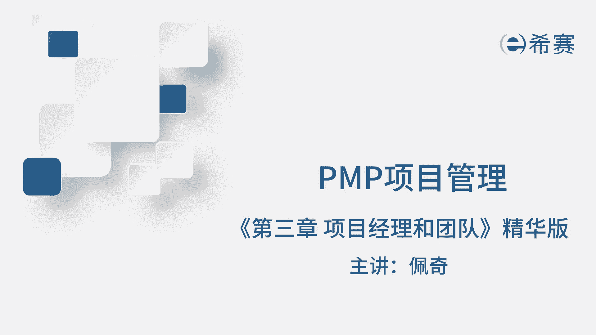
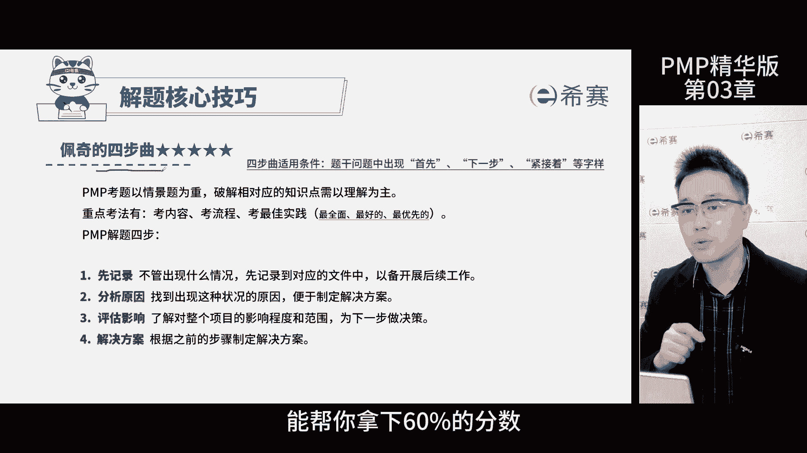
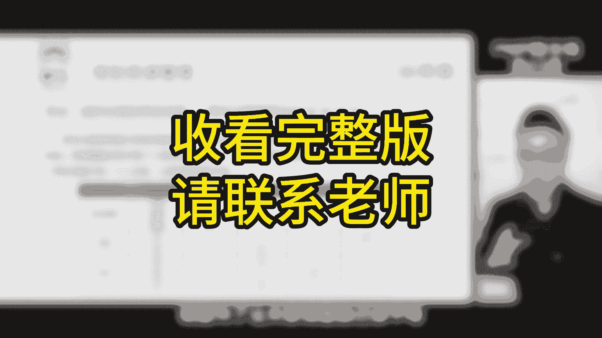
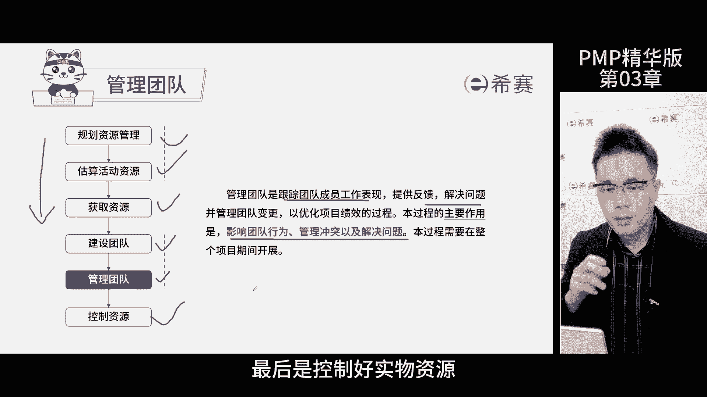
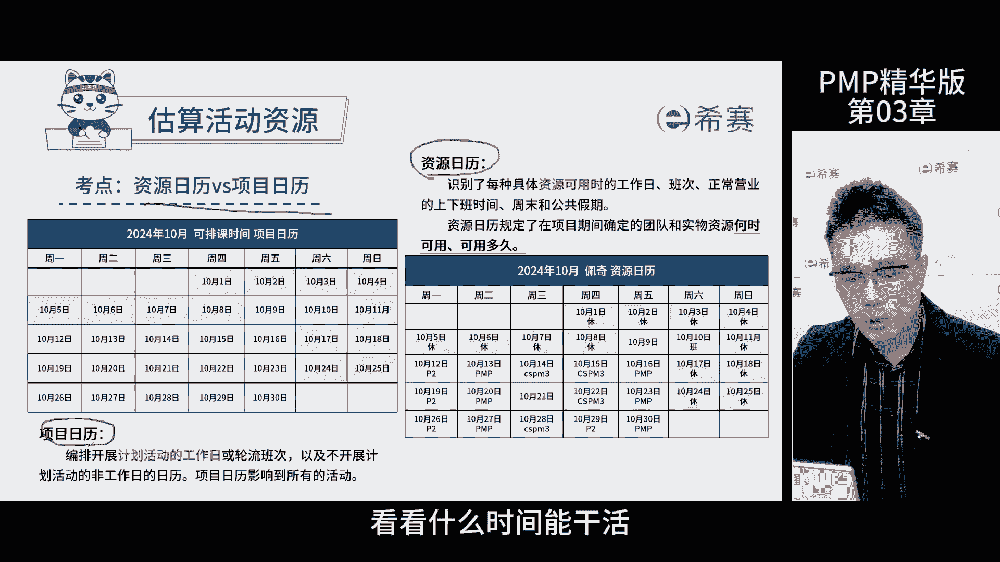
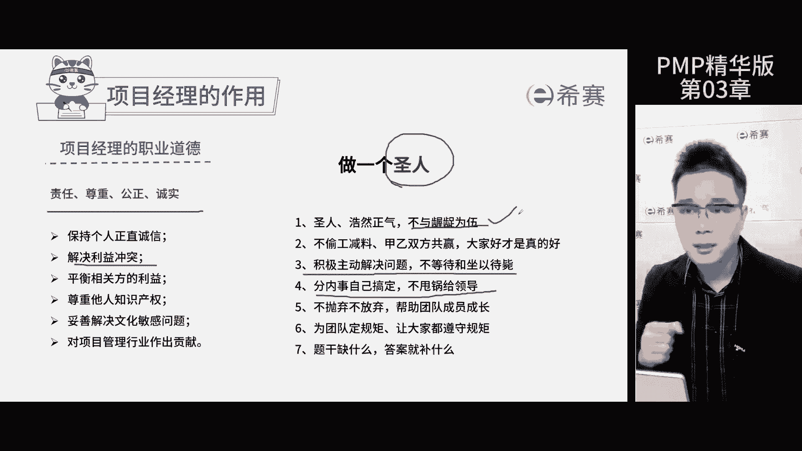
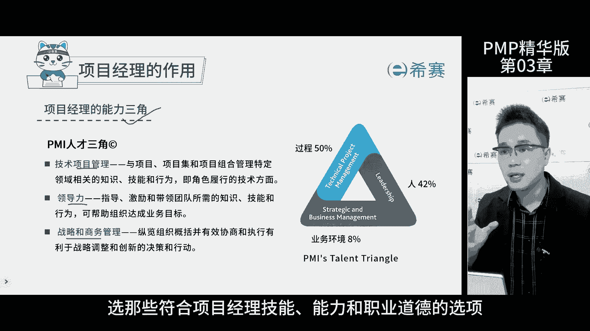

# 【2024年PMP】PMP项目管理考试第七版精华讲解免费观看，含预测+敏捷！ - P3：第03章 项目经理和团队-精华版 遮挡 - 冬x溪 - BV1bD421A7em

我是佩奇，今天讲第三章精华版课程内容，一提到资源啊，大家想到的更多的是人脉，而在本章中强调最多的是项目，团队的人力资源啊，这是考评目录，暂停回忆再继续，目前随着考试的迭代。

有越来越多的解决问题的相关题目，那这类题目呢已经不仅仅限于资源这个章节了，而是覆盖到了每一个知识领域，比如说题干描述项目说的一个状况，可能是进度问题，也可能是资源问题，成本问题，风险问题都是在考察问题。

解决这个知识点，那我们一起来看一下问题解决的知识点哈，第一要知道关于问题的一切信息，都需要就在问题日志中，包括问题解决后的总结，复盘也要写进去，第二要明确办事的流程顺序啊，就是先做什么后做什么。

那出了问题一定要按照这张图上的顺序来解决，那考试也是这么考的，那尤其是在最佳实践考法中，那选择最先做的那一项，此处的定义问题就是等于记录，结合佩奇的四部曲解法完美搞定，那这类题目的分数呢全部拿下的话。

通过考试呢是妥妥的，那啥是佩奇四部曲呢，来详细讲讲，那针对PMP试题的考法，用这个大招能帮你拿下60%。

